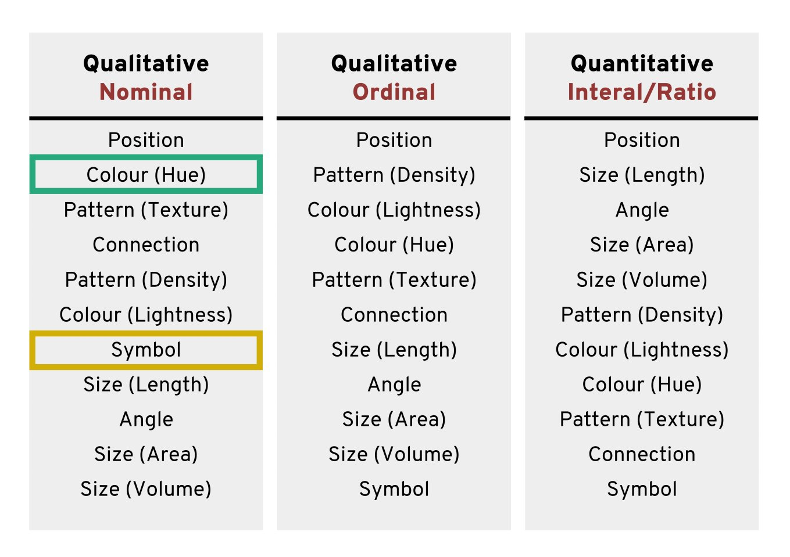
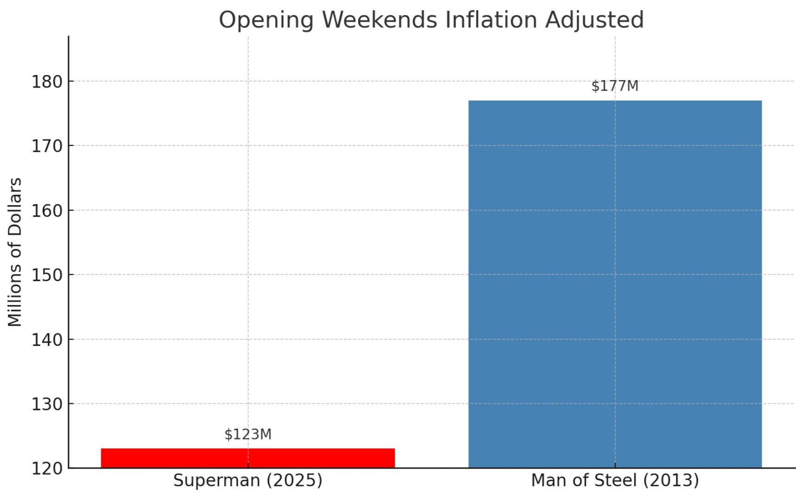

# Block 1: Foundations and graph crimes {.unnumbered}


```{r}
#| include: false
source("R/booktem_setup.R")
source("R/my_setup.R")
library(tidyverse)
library(here)
```


```{r}
# Run this code at the start of your project
library(palmerpenguins)
library(tidyverse)
library(ggdist)
library(ggrepel)
library(ggtext)
library(patchwork)
library(colorspace)
library(colorBlindness)
library(ggview)
library(ragg)
library(scales)
library(here)

# Drop incomplete cases for the figures used in worked examples
penguins_complete <- palmerpenguins::penguins |> 
  tidyr::drop_na(body_mass_g, flipper_length_mm, bill_length_mm, bill_depth_mm, sex)
```

## We will cover:

- the *principles* of figure design (what makes a figure honest, accessible, and informative), 

- and the *extensions* of `ggplot2` that make those principles practical to implement.

The workshop runs in seven in-session blocks across three hours and forty minutes including a break, with a take-home exercise to complete afterwards:

| Block | Duration | Focus |
|---|---|---|
| 1. Foundations and graph crimes | 50 min | Visual encoding, colour, data-ink, graph crimes tribunal |
| 2. Choosing the right figure | 35 min | Chart selection, audience, descriptive vs explanatory |
| 3. Themes and scales | 35 min | `theme()`, `element_*()`, `theme_project()`, `scales` package, data-ink reflection |
| Break | 15 min |  |
| 4. Extensions in action | 40 min | `ggdist`, `colorspace`, `ggrepel`, `ggtext`, `patchwork` (worked-example walkthroughs) |
| 5. Saving figures correctly | 10 min | `ggview`, `ragg`, two-format save |
| 6. Writing figure legends | 20 min | The four-element legend |
| 7. Three questions for every figure | 5 min | Closing reflection |
| **Take-home exercise** | (own time) | Apply the workshop to your own data |

Before you arrive, please install the packages loaded in the setup chunk above. The take-home exercise is to be completed in your own time and reviewed at a follow-up session; you do not need to bring your own data to the workshop itself.

## How we see data

Our visual system did not evolve to read graphs. Some visual features are detected before conscious attention engages: a red dot among grey dots, a single triangle in a sea of circles, an unusually large shape in a field of small ones. This is called **pre-attentive processing** (Healey and Enns, 2012). When designing figures, encoding important information as features the eye picks up automatically directs attention without having to search. Encoding the same information as a subtle change in line style or a slightly different shade requires the reader to look for it.

## The encoding hierarchy

Cleveland and McGill (1984) asked a deceptively simple question: how accurately can people read the same ratio when it is encoded in different visual forms? Their answer became the design discipline for the next forty years of statistical graphics. The ranking is not a recommendation; it is the order in which our perceptual system is most accurate.

For continuous variables, the hierarchy from most to least accurate is: position on a common scale, length, angle, area, colour lightness, colour hue, volume. For categorical variables it is different: position remains the most accurate, but colour hue moves up to second place, with shape third. This matters: the rules for assigning encodings to variables are not the same for continuous and categorical data, and this is one of the most common errors in published figures.

```{r}
#| echo: false
#| eval: true

```

The practical rule is: assign your most important variable to the highest-ranked encoding available to you. For two continuous variables, both go to position (a scatter plot). For a continuous variable grouped by a category, position handles the continuous variable and colour hue handles the category — with shape added redundantly for accessibility.


:::{.panel-tabset}

## Colour

```{r}
#| eval: true
#| message: false
#| warning: false
penguins_complete |> 
  ggplot(aes(x = body_mass_g, y = flipper_length_mm,
             colour = species)) +
  geom_point(alpha = 0.7, size = 2.5) +
  colorspace::scale_colour_discrete_qualitative(palette = "Dark2") +
  labs(x = "Body mass (g)",
       y = "Flipper length (mm)",
       colour = "Species") +
  theme_minimal(base_size = 12) +
  theme(legend.position = "bottom")
```


## Shape

```{r}
#| eval: true
#| message: false
#| warning: false
penguins_complete |> 
  ggplot(aes(x = body_mass_g, y = flipper_length_mm,
            shape = species)) +
  geom_point(alpha = 0.7, size = 2.5) +
  labs(x = "Body mass (g)",
       y = "Flipper length (mm)",
       shape = "Species") +
  theme_minimal(base_size = 12) +
  theme(legend.position = "bottom")
```

## Both

```{r}
#| eval: true
#| message: false
#| warning: false
penguins_complete |> 
  ggplot(aes(x = body_mass_g, y = flipper_length_mm,
             colour = species, shape = species)) +
  geom_point(alpha = 0.7, size = 2.5) +
  colorspace::scale_colour_discrete_qualitative(palette = "Dark2") +
  labs(x = "Body mass (g)",
       y = "Flipper length (mm)",
       colour = "Species",
       shape = "Species") +
  theme_minimal(base_size = 12) +
  theme(legend.position = "bottom")
```

:::

Two continuous variables to position (rank 1), one categorical to colour hue (rank 2) and shape (rank 3) redundantly. The figure works on a colour monitor, in greyscale print, and for a reader with colour vision deficiency. This is the baseline expectation, not an enhancement.

## Colour as a tool

Colour is pre-attentive, which makes it the second-most powerful encoding for categorical data. It is also the encoding most often misused. Three palette types exist, each for a different data structure:

| Palette type | Data structure | Example use |
|---|---|---|
| Qualitative | Discrete groups with no inherent order | Species, treatment arm |
| Sequential | Continuous, running in one direction from a minimum | Gene expression, density |
| Diverging | Continuous, with a meaningful midpoint | Log fold-change, temperature anomaly |

```{r}
#| echo: false
#| eval: true
knitr::include_graphics("images/palette.png")
```

Using the wrong type for the data structure is one of the most common errors. A sequential palette applied to categorical data implies an ordering that does not exist. A categorical palette applied to a continuous variable conceals the ordering that does exist.

The package `colorspace` (Zeileis et al., 2020) provides palette generators for all three types with documented design rationale, and is the project default for palette construction. The Dark2 palette ships directly:

```{r}
#| eval: true
#| fig-height: 3
#| fig-width: 8
# Categorical (Dark2) — for discrete groups with no order
colorspace::swatchplot(
  colorspace::qualitative_hcl(8, palette = "Dark2")
)
```

The same package provides `scale_*_discrete_qualitative()`, `scale_*_continuous_sequential()`, and `scale_*_continuous_diverging()` functions that integrate directly with `ggplot2`. Prefer these over manual hex vectors.

## Accessibility

Roughly 8% of men have some form of colour vision deficiency (Sharpe et al., 1999); red-green is by far the most common. Using red and green to distinguish two groups will fail for a non-trivial fraction of any audience. The Okabe-Ito palette was designed to remain distinguishable under deuteranopia and protanopia (Okabe and Ito, 2008), and the viridis palette family is perceptually uniform under colour vision deficiency and in greyscale.

Beyond palette choice, the discipline is **redundant encoding**: never let colour be the only cue distinguishing groups. Use shape redundantly for points, linetype redundantly for lines, and direct labelling wherever it is legible (we will cover direct labelling in Block 3).

The `colorBlindness` package gives you the verification step. `colorBlindness::cvdPlot()` produces a five-panel simulation — the original, deuteranopia, protanopia, tritanopia, and a desaturated version — and lets you see whether the figure still works when colour fails.

```{r}
#| eval: false
fig <- penguins_complete |> 
  ggplot(aes(x = body_mass_g, y = flipper_length_mm, colour = species)) +
  geom_point(alpha = 0.7) +
  colorspace::scale_colour_discrete_qualitative(palette = "Dark2") +
  theme_minimal()

colorBlindness::cvdPlot(fig)
```

:::{.callout-tip}
After the workshop, run `cvdPlot()` on three or four figures from your own thesis chapter or recent paper. Be honest about which ones fail.
:::

## Data-ink ratio

Tufte (1983) introduced **data-ink ratio**: the proportion of a figure's visual elements that actually encode data, as opposed to decoration, borders, gridlines, shadows, and three-dimensional effects that exist for their own sake. High data-ink ratio means most of the visual complexity of the figure carries information.

The default `ggplot2` `theme_grey()` already fails this test: a grey panel background and white gridlines exist purely as decoration. Move to `theme_minimal()`, `theme_classic()`, or a project-specific theme function as a default discipline.

:::{.callout-warning}
Avoid `theme_grey()` (the `ggplot2` default) in any figure intended for human consumption. Set `theme_minimal(base_size = 12)` or `theme_classic(base_size = 12)` as your project baseline.
:::

## Graph crimes

A figure that violates these principles distorts what the data actually say. Five recurring crimes are worth recognising on sight:

```{r}
#| echo: false
#| eval: true
knitr::include_graphics("images/graph_crimes.png")
```

1. **Truncated bar chart axes.** A bar encodes magnitude as length from a baseline. If the axis does not start at zero, the visual ratio between bars is no longer the data ratio.
2. **Manipulating the y-axis.** Compressed or expanded vertical ranges can make tiny effects look enormous or hide real effects.
3. **Cherry-picking time ranges.** Choosing a window of time that supports a story while ignoring the surrounding data.
4. **Wrong chart for the data.** Pie charts for many categories; line charts for unordered categorical data; dual y-axes pretending two arbitrary scales are commensurable.
5. **Convention violations.** Inverted colour scales (light = high); inverted y-axes; latitude on the x-axis. Readers bring expectations and figures that violate them mislead.

A bonus crime: spurious correlation. Two variables with a strong correlation may have no causal relationship at all. Showing a strong correlation without acknowledging the confounders is a misrepresentation of evidence.

### Exercise 1: Graph crimes tribunal

:::{.callout-important}
You each will be look at two figures. For each one:

1. **Identify the crime.** What specifically is wrong with it?  
2. **Classify it.** Is the crime one of *distortion* (the visual misrepresents the data) or *omission* (the figure leaves out something the reader needs)?  
3. **Sentence it.** What single concrete change would fix it?  

You have five minutes.
:::


:::{.panel-tabset}

## Example 1

```{r}
#| echo: false
knitr::include_graphics("images/g_crime_1.png")
```

## Example 2

```{r}



```

:::


**Bonus**
```{r echo}

knitr::include_graphics("images/T_bar.png")
```


