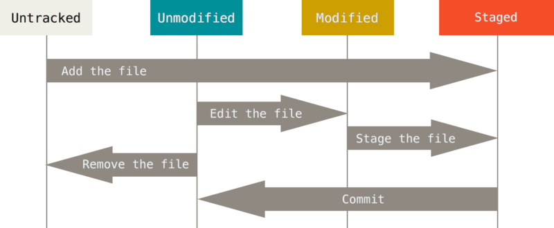
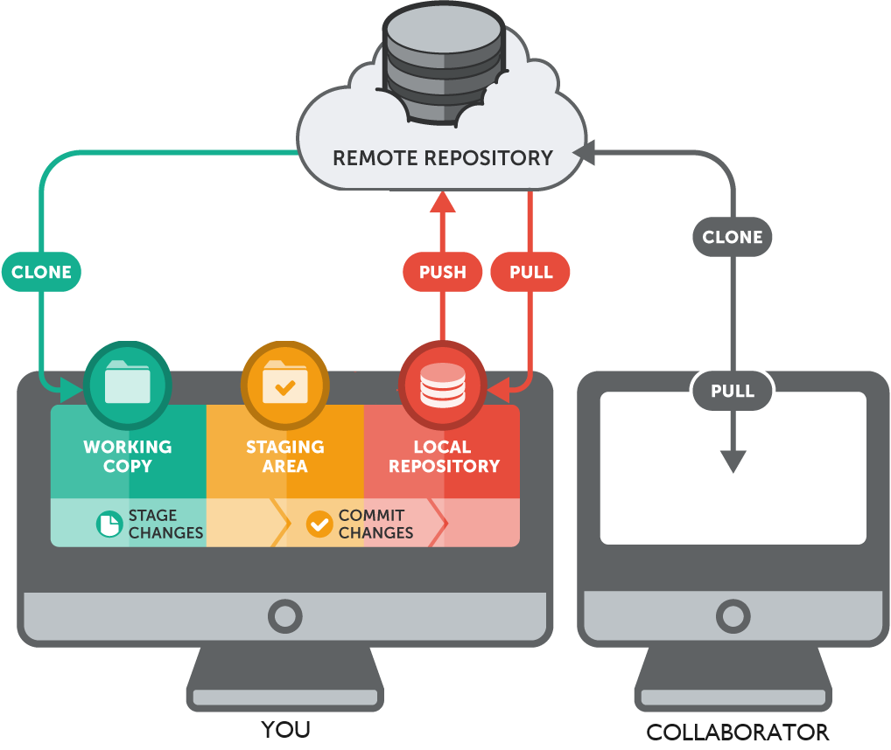
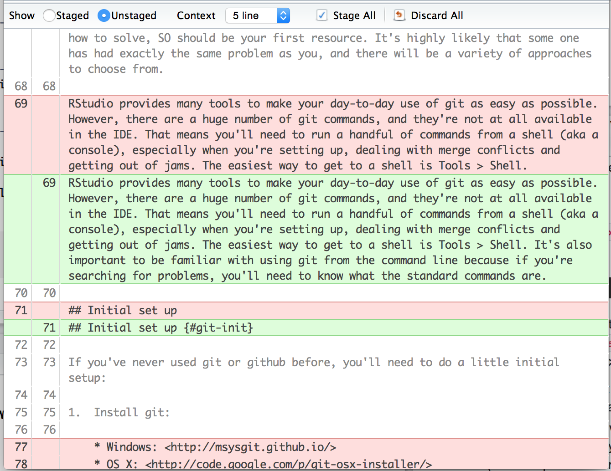
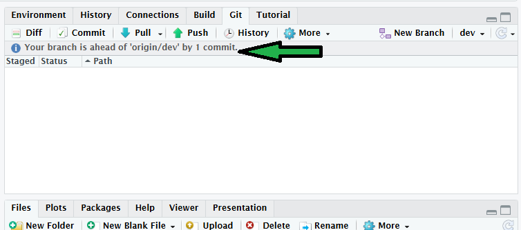
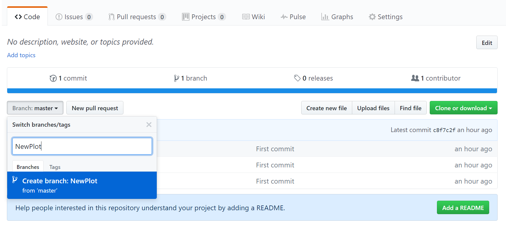
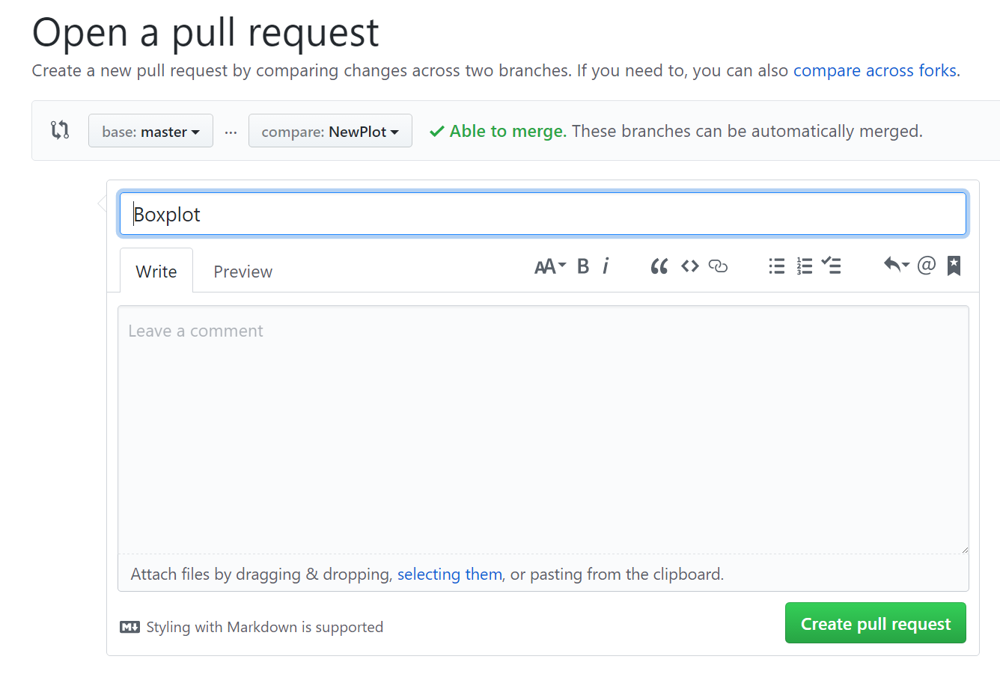
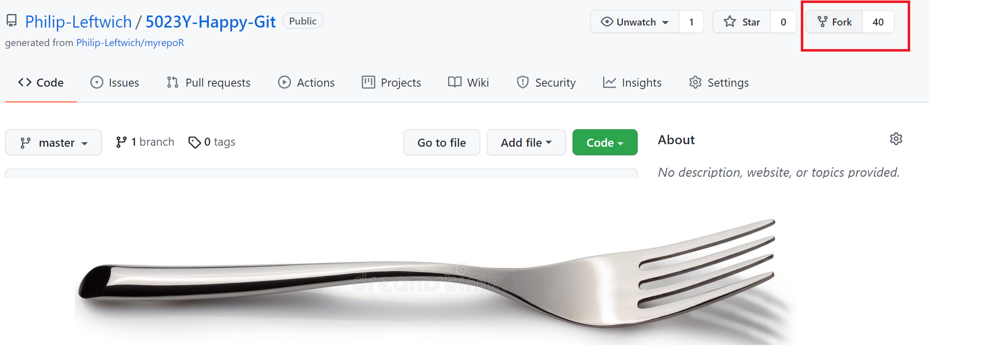
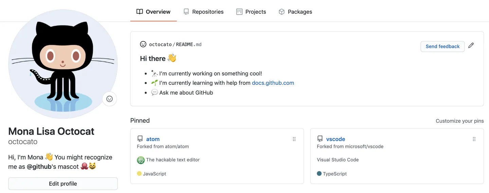
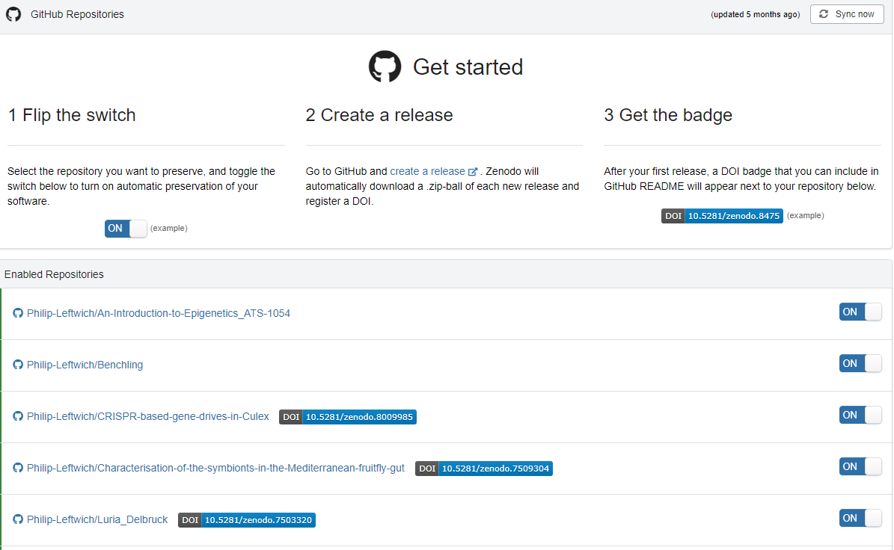

#  Block 1: Github {.unnumbered}


```{r}
#| include: false
source("R/booktem_setup.R")
source("R/my_setup.R")
library(tidyverse)
library(here)
```


```{r}
#| include: false

library(usethis)
library(gitcreds)

```


# Why version control?

Git is a **version-control system**: a tool that records the history of changes
to a set of files so that any previous state can be recovered. It was originally
built for collaborative software development, but it is now standard
infrastructure in data science and reproducible research.

For an R user working alone, Git provides three concrete benefits. It records a
complete history of your analysis, so a mistake can always be undone by
returning to an earlier state. Paired with a remote host such as GitHub, it
gives you an off-site backup. And when you publish, the full provenance of your
results — data, scripts, figures and reports — is available to others.

For a team, Git adds a fourth benefit: it is a mechanism for combining the work
of several people on the same files without overwriting one another, and for
reconciling the inevitable conflicts in a controlled way.

A well-organised project under version control keeps every component together
and tracked:

- 🔢 Data
- ✍️ Scripts
- 📊 Figures
- 📝 Reports

# The mental model {#sec-model}

You do not need to understand Git's internals to use it well, but you do need
one mental model.

A Git **repository** (or **repo**) is a project folder whose change history Git
tracks. Within it, a file passes through three states:

1. **Untracked / modified.** You create or edit a file. Git sees that it has
   changed but does nothing with it yet.
2. **Staged.** You **add** the file to the staging area, marking it for
   inclusion in the next snapshot.
3. **Committed.** You **commit** the staged changes, writing a permanent,
   labelled snapshot into the repository's history.

The everyday loop is therefore `modify → add → commit`, repeated whenever you
reach a natural stopping point. A useful discipline is to commit each time you
complete a discrete task, so that each commit corresponds to one coherent change.

```{r}
#| label: fig-stage
#| echo: false
#| eval: true
#| fig-cap: "The local Git workflow: modify, stage (add), commit."

```

These actions exist both as buttons in the RStudio Git pane and as terminal
commands. The two are equivalent; this workshop uses the RStudio interface, but
the terminal forms are shown alongside so you can recognise them.

::: {.callout-note}
## The same actions at the command line
```bash
git add <file>     # stage a file for the next commit
git commit -m "A short, descriptive message"   # snapshot the staged files
```
:::

## Local versus remote

Everything above describes the **local** workflow, where the repository lives
only on your machine. A local repository can also be connected to a **remote**
repository hosted on a server. This workshop uses [GitHub](https://github.com/);
[GitLab](https://about.gitlab.com/) is a common alternative.

Two further actions move commits between local and remote. You **push** to send
your local commits up to the remote, bringing the two into agreement. When a
collaborator pushes their commits, your local copy becomes outdated, and you
**pull** to bring those commits down.

```{r}
#| label: fig-collab
#| echo: false
#| eval: true
#| fig-cap: "Push sends local commits to the remote; pull retrieves remote commits."

```

::: {.callout-note}
## The same actions at the command line
```bash
git push    # upload local commits to the remote
git pull    # download remote commits to the local repo
```
:::

# One-time setup {#sec-setup}

Before creating your first repository, three things must be in place: Git must be
installed, Git must know who you are, and Git must be able to authenticate to
GitHub on your behalf. You do this once per machine.

## Install Git and create a GitHub account

- [Install Git](https://git-scm.com/book/en/v2/Getting-Started-Installing-Git)
  on your machine.

- Create a free account at [github.com](https://github.com/).

::: {.callout-note}
You can confirm that RStudio can see your Git installation under
**Tools → Global Options → Git/SVN**, where the path to the Git executable
should be shown.
:::

## Introduce yourself to Git

Git labels every commit with a name and email. Set these once, using the
`usethis` package:

```{r}
library(usethis)
use_git_config(
  user.name  = "Jane Doe",
  user.email = "jane@example.org"
)
```

Use the email associated with your GitHub account. The equivalent at the command
line is:

::: {.callout-note}
```bash
git config --global user.name 'Jane Doe'
git config --global user.email 'jane@example.com'
```
:::

## Authenticate with a Personal Access Token {#sec-pat}

GitHub no longer accepts account passwords for Git operations; it uses a
**Personal Access Token (PAT)** instead. The recommended workflow for R users
keeps you inside R and stores the token in your operating system's credential
manager rather than in any file.

**Step 1 — generate a token.** This opens a GitHub page with sensible scopes
pre-selected. Give the token a descriptive name, set an expiry, and generate it.
Leave the page open and copy the token to your clipboard.

```{r, eval = FALSE}
usethis::create_github_token()
```

**Step 2 — store the token.** This registers the token with your OS credential
store, from which `usethis`, `gh` and `gert` retrieve it automatically. Paste
the token when prompted.

```{r, eval = FALSE}
gitcreds::gitcreds_set()
```

**Step 3 — verify.** Either of these confirms that a valid, discoverable token
is in place and reports its scopes:

```{r, eval = FALSE}
usethis::gh_token_help()
usethis::git_sitrep()
```

::: {.callout-warning}
## Do not store your token in a tracked file
Earlier guidance sometimes suggested saving the PAT in a plain-text file or in
`.Renviron`. The current recommendation from the `usethis` maintainers is to
store it only in the OS credential manager via `gitcreds_set()`, and to treat
the token like a password. On Windows and macOS the credential manager persists
the token indefinitely, so you should not need to re-enter it. If you have a
legacy `GITHUB_PAT` line in `.Renviron`, delete it, as it can interfere with the
credential-store approach.
:::

# Create a repository (GitHub first) {#sec-create}

There are several ways to start a repository. The "GitHub first" approach —
create the remote repository, then clone it locally — is the most reliable
because it lets GitHub configure the link between local and remote for you,
avoiding a common class of setup errors.

## Create the remote repository

1. Log in at [github.com](https://github.com/).
2. Click the **+** in the top-right corner, then **New repository**.
3. **Template:** none.
4. **Name:** e.g. `my-first-repo`.
5. **Description:** a short, human-readable summary.
6. **Visibility:** Public.
7. **Initialise with:** nothing (you will configure everything from R).
8. **Copy the repository URL** before leaving the page.

## Clone into RStudio

In RStudio: **File → New Project → Version Control → Git**. Paste the repository
URL into the "Repository URL" field, choose a parent folder, and click
**Create Project**.

The resulting folder is simultaneously a Git repository, a clone linked to your
GitHub remote, and an RStudio Project. The clone also includes a `.gitignore`
file listing files Git should not track (for example `.Rhistory`).

::: {.callout-tip}
Open `.gitignore` and read it. Adding a filename here keeps that file local and
prevents it from ever being pushed to GitHub — useful for large data, cached
output, or anything sensitive.
:::

# The solo local cycle {#sec-local}

This section covers the `modify → add → commit` loop entirely on your own machine.

::: {.callout-warning}
## Install packages first, but never inside a script
The exercise below uses `tidyverse` and `palmerpenguins`. Install them once at
the console with `install.packages(c("tidyverse", "palmerpenguins"))` — or
`renv::install()` if you use `renv`. Never place `install.packages()` inside a
script or Quarto document, as it would re-download the packages on every run.
Note the package is `palmerpenguins`, with a trailing **s**.
:::


:::{.task}
::::{.task-header}
**Task: track some changes**
::::

::::{.task-container}

- Create a new `.qmd` file.
- Add a setup chunk that loads the packages:

````markdown

---
title: "analysis"
format:
  html:
    embed-resources: true
---

```{r}`r ''`
#| include: false
library(tidyverse)
library(palmerpenguins)
```
````

- Save the file.

::::
:::


:::{.callout-note}

For html you need to embed resources if you wish to share a single file, otherwise things like images will be contained in a separate folder

:::


## See what has changed

The RStudio Git pane lists every file that has been added, modified or deleted
since the last commit. An icon indicates the kind of change:

```{r}
#| label: fig-modified
#| echo: false
#| eval: true
#| out-width: "5%"
#| fig-align: left
#| fig-cap: "Modified file."

```

```{r}
#| label: fig-unknown
#| echo: false
#| eval: true
#| out-width: "5%"
#| fig-align: left
#| fig-cap: "New, untracked file."

```

```{r}
#| label: fig-deleted
#| echo: false
#| eval: true
#| out-width: "5%"
#| fig-align: left
#| fig-cap: "Deleted file."

```

Right-click a file and choose **Diff** to see line-by-line changes:

```{r}
#| label: fig-diff-window
#| echo: false
#| eval: true
#| fig-cap: "The diff window highlights additions (green) and deletions (red)."

```

Added text is shown on a green background and removed text on red. If you have a
colour-vision deficiency, the line numbers in the two left-hand columns indicate
which side each change belongs to.

## Stage and commit

A **commit** is a labelled snapshot of your project at a moment in time. Git
gives each commit a unique identifier and records who made it and when.

::: {.callout-note}
## Commit your changes
- In the Git pane, tick the checkbox beside the file to **stage** it.

- Click **Commit**, write a descriptive message — phrase it as what the change
  does, e.g. *"Add setup chunk loading tidyverse and palmerpenguins"* — and
  confirm.

:::

::: {.callout-tip}
You can stage files selectively, but most of the time you will stage everything
that has changed since the last commit.
:::

Commits are stored locally. The Git pane shows how many commits your local repo
is **ahead** of the remote.

```{r}
#| label: fig-local-commit
#| echo: false
#| eval: true
#| fig-cap: "The Git pane indicates how far ahead of the remote you are."

```

## The solo remote cycle 

### Push

::: {.callout-note}
### Push your commits
Click **Push** (the green up-arrow) in the Git pane. Nothing appears on GitHub
until you push.
:::

Refresh your repository page on GitHub: the committed files now appear. Click
**Commits** to browse the history; each entry lets you inspect the project's
state at that point and view the file differences.

### Make a change on GitHub, then pull

You can also edit directly on GitHub. Doing so creates a divergence that you must
then bring back down to your local copy.

:::{.task}
::::{.task-header}
**Task: : add a README and pull it**
::::

::::{.task-container}
- On the repository main page, click **Add a README**.
- Write a short description (READMEs are written in Markdown).
- Enter a commit message at the bottom and click **Commit new file**.
- Back in RStudio, click **Pull** (the blue down-arrow). The README should
  appear among your local files.
::::
:::

::: {.callout-warning}
## Pull before you start, to avoid merge conflicts
Changes made on GitHub exist only on the remote until you pull them. If you edit
a file locally while your copy is out of date, you risk a **merge conflict** —
Git cannot reconcile two incompatible versions of the same lines and asks you to
resolve it by hand. To avoid this, **pull at the start of every session** before
doing anything else. The message is usually "Already up to date", but the habit
is worth keeping.
:::

# Working with branches {#sec-branches}

A **branch** is an independent line of development. Branches let you work on a
new analysis, a manuscript section, or a bug fix without disturbing the stable
`main` branch. When the work is ready, you **merge** it back into `main`.

## Create a branch on GitHub


:::{.task}

::::{.task-header}
**Task: create a branch**
::::

::::{.task-container}

- On the repository page, click the branch drop-down (showing `main`).
- Type a new branch name, e.g. `new-plot`, and press Enter to create it.


```{r}
#| label: fig-newbranch
#| echo: false
#| eval: true
#| fig-cap: "Creating a branch from the GitHub web interface."

```

::::
:::


## Work on the branch in RStudio

- Click **Pull** to retrieve the new branch.
- In the Git pane, use the branch drop-down (next to **New Branch**) to switch
  to `new-plot`. This is "checking out" the branch.
- Work proceeds exactly as before: stage, commit, push. Commits go to
  `new-plot` and leave `main` untouched until you merge.

::: {.callout-note}
## Add a figure on the branch
Add a chunk that produces a figure, then commit and push it to `new-plot`.


````markdown

```{r}`r ''`
#| label: fig-penguins
#| fig-cap: "Body mass against flipper length, by species."
library(tidyverse)
library(palmerpenguins)

pal <- c(
  "Adelie"    = "#FF8C00",
  "Chinstrap" = "#A034F0",
  "Gentoo"    = "#159090"
)

penguins |>
  ggplot(aes(x = flipper_length_mm, y = body_mass_g)) +
  geom_point(aes(colour = species)) +
  scale_colour_manual(values = pal) +
  theme_minimal()
```

````

:::

## Merge via a pull request

Back on GitHub, your pushed branch is offered for comparison. Merging it into
`main` is done through a **pull request (PR)**, which records the proposed change
and lets it be reviewed before integration.

::: {.callout-note}
## Open and merge a pull request
- Click **Compare & pull request**.
- On the next page, click **Create pull request**.
:::

```{r}
#| label: fig-createpr
#| echo: false
#| eval: true
#| fig-cap: "Opening a pull request."

```

GitHub compares `main` with `new-plot` and confirms whether the two can be merged
without conflict.

```{r}
#| label: fig-merge
#| echo: false
#| eval: true
#| fig-cap: "GitHub reports a clean, mergeable pull request."
knitr::include_graphics("images/Merge.png")
```

Click **Merge pull request**, then **Confirm merge**. Once merged, delete the
branch with **Delete branch**, since its changes now live in `main`. Finally,
return to RStudio, switch back to `main`, and **Pull** so your local `main`
includes the merged work.

```{r}
#| label: fig-deletebranch
#| echo: false
#| eval: true
#| fig-cap: "Deleting a branch after its changes are merged."
knitr::include_graphics("images/DeleteBranch.png")
```

::: {.callout-note}

## Do I need Branches?

If you are working alone, branches are optional. You can work directly on `main`
and push whenever you like. If you are working with others, branches are essential for keeping work organised and avoiding conflicts.

Keep branches short-lived and focused. You must resolve any merge conflicts by
hand, and that is far simpler when a branch contains one small, coherent change.
:::

# Collaborating on a repository {#sec-collab}

Collaboration takes one of two forms, depending on whether you have write access.

**With write access** (typical for a team you belong to), you clone the repo and
use the workflow above directly. GitHub checks your permissions when you push.
The only additional requirement is communication: **avoid two people editing the
same file at once**, which is the usual source of merge conflicts.

**Without write access** (typical when contributing to a stranger's project, for
example fixing a bug in an open-source package), you **fork** the repository.
A fork is a personal copy under your own account, to which you have full access.
You work in the fork as normal — modify, add, commit, push — and then open a
**pull request** to propose your changes to the original. The owner may accept,
reject, or request changes.

```{r}
#| label: fig-fork
#| echo: false
#| eval: true
#| fig-cap: "A fork is a personal copy of another user's repository."

```

## Exercise: contribute to someone else's repository


:::{.task}

::::{.task-header}
**Task: fork, edit, and open a pull request**
::::

::::{.task-container}

1. Log in at [github.com](https://github.com/) (sign up with your institutional
   email if you do not have an account).
2. Search for the repository **Philip-Leftwich/5023Y-Happy-Git**.
3. Open it and review its structure.
4. **Fork** the repository.
5. Copy the clone URL and create a new RStudio Project via **New Project →
   Version Control → Git**.
6. Open `some_cool_animals.qmd` and its rendered output.
7. Add **your name** at the top of the document.
8. Add a new section with your favourite animal: an image and a few facts.
9. Render the document to update the output.
10. **Stage → Commit → Push** all files.
11. On GitHub, refresh to confirm the files have updated.
::::

:::


::: {.callout-note}
## Open the pull request
1. On your fork, click **Open pull request**.
2. Click **Create pull request**.
3. Add a title and message, then submit.
:::

The repository owner receives a notification and can review, comment on, and
choose whether to merge your contribution.

# General workflow habits {#sec-habits}

::: {.callout-tip}
- **Pull at the start of every session**, to retrieve the current state from
  GitHub before doing any work. This is the single most effective habit for
  avoiding conflicts.
  
- **Commit and push in small, meaningful increments, often.** You may make many
  commits in a session; always push before you finish.
- Treated this way, your GitHub repository becomes the authoritative master copy
  of your project.
:::

# Publishing and reuse {#sec-publish}


## A profile README

A profile README is displayed at the top of your GitHub profile page and lets
you introduce yourself: your work and interests, contributions you are proud of,
and how others can engage with your projects.

```{r}
#| label: fig-profile
#| echo: false
#| eval: true
#| fig-cap: "A profile README displayed on a GitHub profile."

```

Useful guides:

- <https://dev.to/ruppysuppy/beautify-your-github-profile-like-a-pro-5093>

- <https://docs.github.com/en/account-and-profile/setting-up-and-managing-your-github-profile/customizing-your-profile/managing-your-profile-readme>

## Releases, tags, and a DOI

A **tag** marks a specific commit as a fixed point — a version release, a
manuscript submission, or any milestone. Unlike a branch, a tag does not move as
new commits are added, so it permanently records the exact state of your project
at that moment. See GitHub's guide to
[managing releases](https://docs.github.com/en/repositories/releasing-projects-on-github/managing-releases-in-a-repository).

Once a project is a well-organised repository, generating a permanent DOI is
close to a one-click process through [Zenodo](https://zenodo.org/) or
[Figshare](https://figshare.com/). Each release can carry its own DOI, letting
you cite distinct stages — a preprint and a peer-reviewed version, for example —
in your papers.

```{r}
#| label: fig-zenodo
#| echo: false
#| eval: true
#| fig-cap: "A Zenodo DOI badge for a GitHub release."

```


::: {.callout-tip}
## A note on template repositories
When you created your first repository you were told to set **Template: none**.
A *template repository* is an existing repository whose files and folder
structure GitHub copies as the starting point for a new one, which is useful
when you repeatedly create projects with the same layout (a standard folder
structure, a licence, a `.gitignore`, and so on). You did not need one here, but
once your own projects settle into a consistent shape, marking a repository as a
template can save setting it up by hand each time. See GitHub's guide to
[creating a template repository](https://docs.github.com/en/repositories/creating-and-managing-repositories/creating-a-template-repository).

Do not confuse this with the project and document templates offered inside
RStudio and Quarto, which are a separate mechanism.
:::


# Glossary {#sec-glossary}

```{r}
#| label: glossary
#| eval: true
#| echo: false
#| warning: false
#| message: false
library(tibble)
library(knitr)

tribble(
  ~Term, ~Definition,
  "clone", "A copy of a repository on your own computer, still linked to the remote so changes can be pushed and pulled to keep them synced.",
  "commit", "An individual, labelled change to a set of files. Git assigns each commit a unique ID and records who made it and when.",
  "commit message", "Short text accompanying a commit that describes the change it introduces.",
  "fork", "A personal copy of another user's repository under your own account, from which you can open pull requests back to the original.",
  "Git", "An open-source system for tracking changes in files; the technology GitHub is built on.",
  "Markdown", "A lightweight text format for writing prose with simple structural markup (links, lists, headings).",
  "pull", "Fetching commits from the remote and merging them into your local copy.",
  "push", "Sending your committed changes from the local repo to the remote.",
  "README", "A text file describing a repository's contents; usually the first thing a visitor reads.",
  "repository (repo)", "The basic unit of GitHub: a project folder containing all files and their full revision history.",
  "Quarto", "A publishing system that interleaves Markdown prose with executable code chunks (including R) to render many output formats.",
  "personal access token (PAT)", "A token used in place of a password for Git operations over HTTPS."
) |>
  kable()
```

# Further reading

- [Happy Git and GitHub for the useR](https://happygitwithr.com/), Jenny Bryan
  et al. — the definitive reference for the workflow taught here.

# Bonus exercise: resolving merge conflicts

Practise handling merge conflicts in a collaborative setting using
[this NCEAS exercise](https://learning.nceas.ucsb.edu/2023-04-coreR/session_10.html).
You will need a partner.
