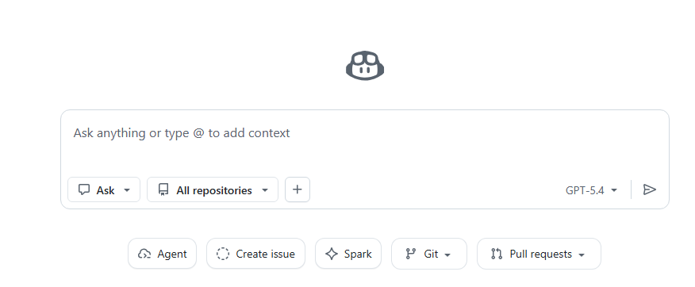
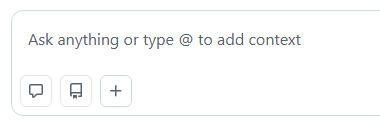

# Block 4: Github Copilot Chat in Ask mode  {.unnumbered}


```{r}
#| include: false
source("R/booktem_setup.R")
source("R/my_setup.R")
library(tidyverse)
library(here)
```


```{r}
#| include: false
library(tidyverse)
library(webexercises)
```

Github Copilot Chat uses the same underlying AI model as inline completion, but for a different kind of help. Inline completion is best when you are actively writing code and want quick suggestions or continuations, which are usually included in standard Copilot usage. Chat is better for higher-level tasks such as planning an approach, understanding an error, or discussing design decisions, and these features are more likely to be usage-limited or *metered* because they require more computation. The two tools complement each other rather than replace one another.

*⏱ ~30 minutes*


## What Chat sees, and what it does not

Here Github Copilot Chat differs fundamentally from a general chatbot such as ChatGPT, and the difference is easy to get wrong. ChatGPT sees *only the text you paste*; it has no connection to your files. Github Copilot is integrated with your editor and repository and can draw on context you did not paste. How much it draws on, and whether it can act on your machine can vary depending on set-up. Three matter for this workshop, and they are not equivalent.

- **Browser Chat on github.com**: open your repository on github.com and select the Copilot icon. It works in the context of that repository and can reach its files, but it has no connection to your local machine, runs no code, and cannot see your R session. This is the one that behaves the same for everyone.

- **Positron**: Positron also uses GitHub Copilot, signed in with your GitHub account, unless you configure a different provider such as an Anthropic API key. It is delivered through a Positron-modified build of the Copilot Chat extension, and the difference that matters is the context it adds. Positron hands Copilot context about your interactive data science work, such as your loaded data, plots, **and console history**, and in agent mode it can execute code in the console and view the output. So although the model is Copilot, in Positron it is fed your session, and the "cannot see your data" assumption does not hold the way it does in browser Chat.

- Your `copilot-instructions.md`, if present, is loaded automatically into every Copilot Chat request in that workspace. Exactly what is pulled in automatically has changed between versions and differs across surfaces, so the reliable habit is to set the context yourself with the references above rather than to assume (*see Part 5*).


For these exercises we should run them in [Browser Chat](https://github.com/copilot) and be on **Ask mode**

```{r}
#| echo: false
#| eval: true

```

:::{.callout-note}
An assistant can describe your data confidently for two different reasons: 1) it has been given real information about your session, 2) or it is recalling something from training data. Only the first is reliable.

It has real information when one of these holds: you pasted the output (`glimpse()`, `summary()`, the printed result), or the data sits in a file it can read.

In Positron the IDE injects your session context (look for the Console session tab); or, in agent mode, it can run code and read the output.

It is guessing from training data when none of those apply, which is always the case in browser Chat on github.com. Tells: it substitutes a well-known dataset (mtcars, iris, penguins) you never mentioned, or asserts column names, factor levels, or values you never supplied.

Even when context is supplied, the model's claim about what it can see is unreliable, and the context may be structure rather than actual values. Verify any data-specific claim against your real object.

:::


**Browser Chat** (all IDEs, including RStudio): navigate to your repository on [github.com](github.com) and click the Copilot icon in the top right. This is the one that works for everyone.

**In-IDE Chat panel** (Positron and VS Code only): open the Copilot panel in the sidebar, and use the `#` references above to control what it sees. Use  quick actions as slash commands. Type `/` in the chat pane or in inline chat to see the list, pick one, and optionally add instructions before sending. The commands shipped with the Assistant include `/fix` to propose a correction, `/explain` to describe what code does, `/doc` to add documentation, and `/exportQuarto` to turn a chat into a Quarto document. They are designed especially for inline chat, where they act on the code you have selected. The Assistant can also trigger them from plain language: asking "can you convert this to Quarto?" invokes the export without your typing the command. 

RStudio users should use the browser Chat throughout this block. Positron and VS Code users may use either; the exercises work in both, subject to the context caveat above.


## Exercise 1: Reading a stack trace

This exercise demonstrates the dependency of Chat's answer quality on the context you supply.

**For Positron disable current session context to see the different responses you get**

**1. Open a fresh Chat session. Paste only the following error message and ask "What does this error mean?":**

```
Error in `mutate()`:
ℹ In argument: `mass_change = mass_post - mass_pre_g`.
Caused by error:
! object 'mass_post' not found
```

Read the answer. It will be reasoning from the error alone.

*Try* setting the type of model in the drop-down Github separates these by complexity.

**2. Now open a new Chat session and paste the same error along with the code that produced it and the output of `glimpse(voles)`:**

```
I am running this code:

  voles |>
    mutate(mass_change = mass_post - mass_pre_g)

and getting:

  Error in `mutate()`:
  ℹ In argument: `mass_change = mass_post - mass_pre_g`.
  Caused by error:
  ! object 'mass_post' not found

The data structure is:

  Rows: 72
  Columns: 6
  $ subject_id          <chr> "V001", "V002", "V003", ...
  $ sex                 <chr> "M", "F", "M", ...
  $ treatment_arm       <chr> "Control", "Control", ...
  $ mass_pre_g          <dbl> 28.3, 27.9, 30.1, ...
  $ mass_post_g         <dbl> 28.5, 28.0, 30.5, ...
  $ metabolic_rate_post <dbl> 13.21, 12.84, 13.55, ...

What is wrong?
```

Read this answer. It will name the specific bug (a missing `_g` suffix on `mass_post`) and propose the fix. 


**3. Now open a new Chat session and attach the file from the repository and try pasting the error message:**

```{r}
#| echo: false
#| eval: true

```

 With the file itself in context, Copilot can see the
column names directly, so it should again identify the missing `_g` suffix,
this time without your having pasted `glimpse()` output. The lesson is not
that one route is correct and the others wrong, but that the answer is only
as good as the context, and that context reaches the model by more than one
route: what you paste, and what the surface can already read.

Compare the three answers. The first reasons from the error text alone and
can only guess. The second and third both locate the specific bug, because
both were given the column names, one by your paste and one by reading the
file.

## How much of your data to show

The contents of your data can reach the model by three routes, and each is a disclosure:

- You paste it into the chat: an error, an output, a printed result.

- It reads a data file that sits in a repository or workspace it can see. Browser Chat on github.com works in the context of the repository you open it from, so a committed voles.csv is within reach; the VS Code extension can surface project files through workspace indexing.

- The IDE injects your session context. In Positron, the assistant is given context about your interactive data science work, such as your loaded data, plots, and console history, so a data frame already in memory can reach it without a paste. Positron

Describing your data to Chat is therefore a recurring task, but it is not the only way your data is exposed. Before you decide what to show, know what the surface can already reach: a data file committed to the repo, or a tibble loaded in a Positron session, may have been disclosed already.

When you do describe a data frame deliberately, three commands reveal increasing amounts:

- `names(voles)`, or equivalently `colnames(voles)`, lists the column names only, in their original order, and discloses nothing about the values. Prefer this to `ls(voles)`, which returns the same names but sorts them alphabetically and so loses the column order.

- `summary(voles)` adds the range, quartiles, and missing-value counts for numeric columns, and is less informative for character or factor columns. It reveals the shape of the data, not individual records.

- `glimpse(voles)` and `str(voles)` add the first few actual values of every column.


## Exercise 2: Refining an approach question

Run this in browser Chat, or with no analysis file referenced. If your script is open in the editor, Copilot may infer the design from it, and the first answer will be less generic than described below. The refinement in step 2 still helps in that case, because your scientific question and your design intent are not written in any file; they exist only in your head until you state them.

**1. Open a Chat session and ask, exactly as written:**

```
I have a dataset with pre and post measurements. How should I analyse it?
```

Read the answer. With no design and no scientific question supplied, it will be a tour of paired t-tests, mixed models, change scores, ANCOVA, and so on, because the question is too vague to permit a recommendation.

**2. In a new chat session, refine the question, with the dataset structure and the scientific question explicit:**

```
I have 72 voles, balanced across three treatment arms (Control, Low_dose,
High_dose) and two sexes (M, F). Each animal has body mass measured before
and after treatment, and a single post-treatment metabolic-rate reading.

My biological question is whether the high-dose treatment changes mass
relative to control, and whether the effect differs between sexes.

The dataset is small (n = 12 per cell). I will report effect sizes
alongside any inferential test. Given this design, what is a defensible
primary analysis, and what are the main threats to its validity?
```

**3. In a new chat session, add the raw data file as context ** 

Try asking the first vague question

```
I have a dataset with pre and post measurements. How should I analyse it?
```

Compare all three answers? Which was best?

 Even though the question is the same vague one from step 1,
the file in context supplies the design that the prompt omits: column names,
types, and the treatment arms. The answer should narrow accordingly, closer
to step 2 than to step 1, without your having stated the design in prose.


## When to use Chat versus inline

A short decision rule covers most cases:

| Task | Inline | Chat |
|---|---|---|
| Writing the next line of code | Yes | No |
| One-line typo or syntax fix | Yes | No |
| Reading an unfamiliar error | Marginal | Yes |
| Choosing between two approaches | No | Yes |
| Planning the structure of a script | No | Yes |
| Refactoring more than a few lines | No | Yes |

The rule is not strict; both tools have considerable overlap. The principle is: inline for typing, Chat for thinking.


## Check your understanding

**Which statement best describes the context available to in-IDE Copilot
Chat in Ask mode, compared with a general chatbot such as ChatGPT?**

`r longmcq(c(
  "Like ChatGPT, it sees only the text you paste into the prompt",
  answer = "It is integrated with your editor and project, so beyond what you paste it can draw on open files, a workspace index, files you reference, and, in Positron, injected session context",
  "It has full automatic access to every file in the repository and to your running R session, on every surface",
  "It can always execute your R code to read the data directly"
))`

