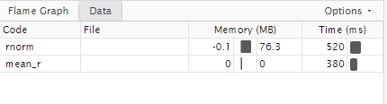
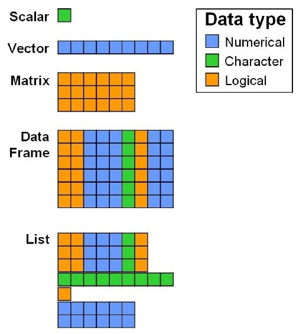

# (PART\*) Efficient Programming {.unnumbered}


# Efficient Programming

```{r, child='_setup.Rmd'}

```

```{r, include = FALSE}


load(here::here("book", "files", "chapter5.RData"))
```


In this section we will cover some general concepts in R programming techniques around code optimisation. 

When optimizing your R code for performance, it’s crucial to measure how long your code takes to run. Two commonly used methods for tracking and comparing the efficiency of your R scripts are the `Sys.time` function and the `microbenchmark` package.

`Sys.time`: This base R function is straightforward for measuring execution time. By capturing the system time before and after your code runs, you can calculate the elapsed time. While `Sys.time` is suitable for general timing, it might not provide the precision needed for very quick operations.

```{r}
start_time <- Sys.time()
# Code to measure
end_time <- Sys.time()
elapsed_time <- end_time - start_time
print(elapsed_time)

```

`microbenchmark`: For more precise timing, particularly when comparing very fast operations, the `microbenchmark` package is highly effective. It provides detailed performance metrics by running your code multiple times and reporting the best, worst, and median execution times. This package is ideal for fine-tuning and optimizing code where performance differences are subtle but significant.

Note in order for `microbenchmark` to work we must turn out our iterations into a function, `microbenchmark()` will then run our function a specified number of times and calculate metrics.

```{r}
library(microbenchmark)

# Define two methods for calculating the sum of squares

# Method 1: Using a loop
sum_squares_loop <- function(x) {
  total <- 0
  for (i in 1:length(x)) {
    total <- total + x[i]^2
  }
  return(total)
}

# Method 2: Using vectorized operations
sum_squares_vectorized <- function(x) {
  return(sum(x^2))
}

# Create a sample vector
sample_vector <- rnorm(1000)

# Benchmark the two methods
benchmark_results <- microbenchmark(
  loop_method = sum_squares_loop(sample_vector),
  vectorized_method = sum_squares_vectorized(sample_vector),
  times = 100
)

# Print the benchmark results
print(benchmark_results)

autoplot(benchmark_results)

```

## Avoid Growing Vectors

In R, when you repeatedly add elements to a vector inside a loop, R has to resize and copy the vector each time, which can slow down your code. To avoid this, you should pre-allocate the vector with the required size before filling it.

Example: Suppose you want to calculate the average height of plants in different plots from multiple experiments.

### Growing vectors

```{r}
# Number of experiments
n <- 1000
# Initialize an empty vector
average_heights <- numeric()  # This starts as an empty vector

for (i in 1:n) {
  # Simulate heights of plants in one experiment
  heights <- rnorm(100, mean = 50, sd = 10)
  # Append the average height to the vector
  average_heights[i] <- mean(heights)  # This operation grows the vector
}

```

### Pre-allocated vectors

```{r}

# Number of experiments
n <- 1000
# Preallocate the vector with the correct size
pre_allocated_average_heights <- numeric(n)  # This creates a vector of size n

for (i in 1:n) {
  # Simulate heights of plants in one experiment
  heights <- rnorm(100, mean = 50, sd = 10)
  # Store the average height in the preallocated vector
  average_heights[i] <- mean(heights)  # This operation fills the vector
}


```


### Exercise

1. Measure and compare the execution times from growing or pre-allocating the vector. Use either `Sys.time` or `microbenchmark` to calculate differences

```{solution}

``{r, eval =FALSE }

# Inefficient Code

# Number of experiments
n <- 1000
# Initialize an empty vector
average_heights <- numeric()  # This starts as an empty vector

start_time <- Sys.time()
for (i in 1:n) {
  # Simulate heights of plants in one experiment
  heights <- rnorm(100, mean = 50, sd = 10)
  # Append the average height to the vector
  average_heights[i] <- mean(heights)  # This operation grows the vector
}
stop_time <- Sys.time()
time_growing <- stop_time - start_time

# Efficient Code

pre_allocated_average_heights <- numeric(n) 

start_time <- Sys.time()
for (i in 1:n) {
  # Simulate heights of plants in one experiment
  heights <- rnorm(100, mean = 50, sd = 10)
  # Append the average height to the vector
  pre_allocated_average_heights[i] <- mean(heights)  # This operation grows the vector
}
stop_time <- Sys.time()
time_preallocated <- stop_time - start_time

# Compare times
print(time_growing)
print(time_preallocated)


# Benchmark the two methods
benchmark <- microbenchmark(
  
# Method 1: Growing vector inside the loop (inefficient)
time_growing <- \(x) {

    
# Number of experiments
n <- 1000
# Initialize an empty vector
average_heights <- numeric()  # This starts as an empty vector
    

for (i in 1:n) {
  # Simulate heights of plants in one experiment
  heights <- rnorm(100, mean = 50, sd = 10)
  # Append the average height to the vector
  average_heights[i] <- mean(heights)  # This operation grows the vector
}

},


# Method 2: Preallocated vector outside the loop

time_allocated <- \(x) {

# Number of experiments
n <- 1000
# Preallocate the vector with the correct size
pre_allocated_average_heights <- numeric(n)  # This creates a vector of size n

for (i in 1:n) {
  # Simulate heights of plants in one experiment
  heights <- rnorm(100, mean = 50, sd = 10)
  # Store the average height in the preallocated vector
  average_heights[i] <- mean(heights)  # This operation fills the vector
}

},

  times = 100
)

# Print the benchmark results
print(benchmark)
autoplot(benchmark) + theme(axis.text.y = element_blank())
``

```

## Vectors over loops

Many R functions are vectorised, that is the function’s inputs and/or outputs naturally work with vectors, reducing the number of function calls required. Ultimately calling an R function always ends up calling some underlying C/Fortran code. A **golden rule** in R programming is to access the underlying C/Fortran routines as quickly as possible; the fewer functions calls required to achieve this, the better

Here we take a loop-based calculation of summary statistics (e.g., means or variances) and then use vectorized functions and compare performance. The same basic looping is occurring in both instances - the difference is that when using vectors the loops run in C/Fortran which is faster.

```{r}

# Inefficient Code
n <- 1000
means_loop <- numeric(n)
start_time <- Sys.time()
for (i in 1:n) {
  means_loop[i] <- mean(rnorm(100))
}
overall_mean_loop <- mean(means_loop)
end_time <- Sys.time()
time_loop <- end_time - start_time
print(time_loop)

# Efficient Code (Vectorized)
start_time <- Sys.time()
means_vectorized <- replicate(n, mean(rnorm(100)))
overall_mean_vectorized <- mean(means_vectorized)
end_time <- Sys.time()
time_vectorized <- end_time - start_time
print(time_vectorized)


```

## Avoid Global variables

Avoiding global variables is a good practice for writing clean and efficient R code. Instead, you should define variables within functions and pass them as arguments when needed. This approach reduces side effects and makes your code easier to maintain and debug - everything you need to understand about what the function does is contained within the function, whereas if it uses global variables, you need to worry about whether anything you call might change those variables, and alter behaviour in hard to reason about ways:

It **can** also improve speed as R does not need to search through the global environment to find them. But performance differences are likely to be extremely small.

```{r}
library(microbenchmark)

# Global variable
x_global <- 1:1e6

# Function that uses the global variable
compute_sum_global <- function() {
  result <- sum(x_global)
  return(result)
}

# Benchmark
benchmark_global <- microbenchmark(
  compute_sum_global(),
  times = 100
)

print(benchmark_global)

```

```{r}
# Function that takes x as an argument
compute_sum_local <- function() {
  
  # Local variable
  x_local <- 1:1e6
  
  result <- sum(x_local)
  return(result)
}


# Benchmark
benchmark_local <- microbenchmark(
  compute_sum_local(),
  times = 100
)

print(benchmark_local)

benchmark_comparison <- microbenchmark(
  compute_sum_global(),
  compute_sum_local(),
  times = 100
)

```

While the performance difference might be marginal for simple tasks, avoiding global variables and using function arguments is a good practice for optimizing code performance, improving readability, and enhancing maintainability. For larger or more complex applications, the benefits of local variable access can become more pronounced, especially in performance-critical sections of code.


## Compile

The `compiler` package is a way of compiling code to get performance enhancements. R is a *high-level* programming language, computers don't understand R directly, they require translation. `compiler` takes our R code and compiles it into byte code, and may produce efficiencies along the way. 

By default, code and functions from packages in R are compiled. 

```{r}
library(compiler)
```

First create an inefficient function for calculating the mean. This function takes in a vector, calculates the length and then updates the m variable.

```{r}
mean_r <-  function(x) {
  m = 0
  n = length(x)
  for (i in seq_len(n))
    m = m + x[i] / n
  m
}

```

This is clearly a bad function and we should just use the `mean()` function, but it’s a useful comparison. Compiling the function is straightforward

```{r}
cmp_mean_r <-  compiler::cmpfun(mean_r)
```

Then we use the `microbenchmark()` function to compare the three variants

### Generate some data

```{r, eval = FALSE}

x <-  rnorm(1000)
microbenchmark(times = 10, unit = "ms", # milliseconds
          mean_r(x), cmp_mean_r(x), mean(x))


```

```
Unit: milliseconds
          expr     min      lq       mean   median        uq      max neval
     mean_r(x) 0.03448 0.03472 0.03619203 0.034840 0.0351495 0.132060  1000
 cmp_mean_r(x) 0.03444 0.03473 0.02613626 0.034851 0.0351550 0.086510  1000
       mean(x) 0.00604 0.00629 0.00689453 0.006435 0.0067100 0.053351  1000
```

The compiled function is faster than the uncompiled function. Of course the native mean() function is faster, but compiling does make a significant difference

## Profile code

`profvis` is a powerful tool in R for visualizing function profiling data. It helps you understand where your R code might be running slowly by providing a clear, interactive visualization of how time is spent in your functions

To profile the code, wrap it in profvis() and run it. Here’s how you can profile `mean_r`:

```{r, eval = FALSE}
library(profvis)
profvis(mean_r(rnorm(10000000)))
```

```{r, eval=TRUE, echo=FALSE, out.width="100%"}

```

After running the `profvis()` function, a new viewer pane will appear in RStudio (or your default web browser if not using RStudio). Here’s how to interpret the visual output:

- Timeline View: Shows how much time was spent in each function call over time. It visualizes which functions were called and how much time they took.

- Flame Graph: Represents a stacked view of function calls, showing where most of the time was spent. The longer the bar, the more time was spent in that function and its calls.

- Data Table: Provides detailed information about the time spent in each function call, including memory usage and function names.

Use the visualizations to identify bottlenecks. Look for functions with long execution times or those that are called frequently. Focus on optimizing these parts of your code.


### Practice: 

In this example we are going to simulate some data for two groups - group 1 has a mean of 0 and an sd of 1, group 2 has a mean of whatever value we supply to effect_size and a sd of 1.

By default this simulation is set to repeat an experiment where 30 samples are taken from each population and compared for a true difference. The experiment is repeated 100 times.

The purpose of this simulation is to understand how the estimated difference in means varies across different random samples of data when the true effect size is known. It helps to assess the sampling variability and provides insights into the precision of the estimated difference. Additionally, it can be used to create a confidence interval to assess the uncertainty around the estimated effect. And determine the power of our experiments.

With this example we know the true difference, see what happens to our confidence intervals as we change the sample size, effect size and iterations:

```{r, eval = TRUE}

library(ggplot2)

# Define a function to run the simulation for a given sample size and effect size
simulate_difference <- function(sample_size, effect_size) {
    set.seed(123)
    
    # Initialize a data frame to store the estimated differences
    results <- data.frame(Simulated_Difference = numeric(100))
    
    for (i in 1:100) {  # Perform 100 simulations for the fixed sample size
        # Generate data for two groups with a specified effect size
        group1 <- rnorm(sample_size, mean = 0, sd = 1)
        group2 <- rnorm(sample_size, mean = effect_size, sd = 1)
        
        # Create a data frame for the two groups
        data_df <- data.frame(Group = rep(c("Group1", "Group2"), each = sample_size),
                              Value = c(group1, group2))
        
        # Fit a linear model to estimate the difference in means
        lm_model <- lm(Value ~ Group, data = data_df)
        
        # Extract the estimated difference from the model
        estimated_difference <- coef(lm_model)[2]
        
        results$Simulated_Difference[i] <- estimated_difference
    }
    
    # Return the data frame of estimated differences
    return(results)
}

# Fixed sample size of 20
sample_size <- 30

# Set the effect size
effect_size <- .8  # Adjust as needed

# Run the simulation for the fixed sample size
simulation_results <- simulate_difference(sample_size, effect_size)

# Calculate the mean and 2.5th and 97.5th percentiles for the confidence interval
mean_difference <- mean(simulation_results$Simulated_Difference)
lower_percentile <- quantile(simulation_results$Simulated_Difference, 0.025)
upper_percentile <- quantile(simulation_results$Simulated_Difference, 0.975)

# Create a density histogram of the estimated differences with lines for percentiles
ggplot(simulation_results, aes(x = Simulated_Difference)) +
    geom_histogram(binwidth = 0.05, fill = "lightblue", color = "black") +
    geom_vline(aes(xintercept = mean_difference), color = "red", linetype = "dashed") +
    geom_vline(aes(xintercept = lower_percentile), color = "blue") +
    geom_vline(aes(xintercept = upper_percentile), color = "blue") +
    labs(x = "Estimated Difference", y = "Density") +
    ggtitle(paste("Density Histogram of Estimated Differences (Sample Size = 20)")) +
    scale_x_continuous(limits = c(0, 2), breaks = c(0,0.5,1,1.5,2))+
    theme_minimal()

```

```{task}

Can you identify bottlenecks in this code that will allow you to improve the speed of this simulation?

```

```{solution}


``{r}
## See simulation examples: 

# Profiling shows dataframe is slow and broom::tidy is slow - improvements here: 

fast_sim <- function(sample_size = 30, effect_size = 0.8, num_simulations = 100, ...) {
  
set.seed(123)
  # Perform the simulation `num_simulations` times, replicate faster than loops
  replicate(num_simulations, {
    # Generate random samples for both groups, allowing extra parameters via `...`
    group1 <- rnorm(sample_size, mean = 0, ...)
    group2 <- rnorm(sample_size, mean = effect_size, ...)
    
    # Directly calculate the estimated difference in means faster than lm
    mean(group2) - mean(group1)
  })
}


``

```

```{solution}

``{r}
# Try parallel processing
library(furrr)
# Define the fast_sim function
simple_sim <- function(sample_size = 30, effect_size = 0.8) {
    
    # Generate random samples for both groups
    group1 <- rnorm(sample_size, mean = 0, sd = 1)
    group2 <- rnorm(sample_size, mean = effect_size, sd = 1)
    
    # Directly calculate the estimated difference in means
    mean(group2) - mean(group1)
}

# Set up parallel processing
plan(multisession, workers = 4)  # Adjust based on your system, e.g., multisession or multicore

# Use future_map to perform the simulation in parallel
num_simulations <- 100
sim_results <- future_map(1:num_simulations, ~ simple_sim(), 
                          .progress = TRUE,
                          .options = furrr_options(seed=342))


``

```

```{solution}

``{r}

autoplot(microbenchmark(times = 100, unit = "ms", # milliseconds
          simulate_difference(sample_size, effect_size), 
          fast_sim(sample_size, effect_size),
          future_map(1:num_simulations, ~ simple_sim(), 
                     .progress = TRUE,
                      future.seed = 123)))

``


```


## Caching

A straightforward method for speeding up code is to calculate objects once and reuse the value when necessary. This could mean making sure a calculation is performed only once per function: 

```{r}
# Calculate mean and variance: 

calculate_stats_naive <- function(x) {
  mean_value <- mean(x)                # First calculation of the mean
  variance_value <- mean((x - mean(x))^2)  # Second calculation of the mean inside the variance calculation
  
  return(list(mean = mean_value, variance = variance_value))
}

# Example usage
x <- c(1, 2, 3, 4, 5)
calculate_stats_naive(x)


```

How could we make the function above more efficient? 

```{solution}

``{r}
calculate_stats_optimized <- function(x) {
  mean_value <- mean(x)  # Calculate the mean once and store it in an object
  
  # Use the stored mean value for the variance calculation
  variance_value <- mean((x - mean_value)^2)
  
  return(list(mean = mean_value, variance = variance_value))
}

# Example usage
x <- c(1, 2, 3, 4, 5)
calculate_stats_optimized(x)


``

```


Another method of optimising functions is to store their outputs and check whether we can simply retrieve an output than have to recalculate it.

For our example, we'll compute the mean flipper length for each species of palmer penguin. Instead of recalculating these values multiple times, we'll include a check before running the function: 


```{r}

# Initialize a vector
mean_flipper_length <- NULL

compute_mean_flipper_length <- function(data, group, variable) {
  # Check if the object already exists
  if (!is.null(mean_flipper_length)) {
    message("Fetching result from enviroment.")
    return(mean_flipper_length)
  }
  
  # Perform the computation
  result <- data |> 
    group_by({{group}}) |> 
    summarise(mean = mean({{variable}}, na.rm = TRUE))
  
 
  # Store the result in the global environment using <<-
  mean_flipper_length <<- result
  
  return(result)
}

compute_mean_flipper_length(penguins, species, flipper_length_mm)

compute_mean_flipper_length(penguins, species, flipper_length_mm)

```

This method works but is simplistic, it stores the output in our Global Environment, and although it can be easily accessed, it can also be inadvertently altered - an alternative method is to set up a unique environment to store the outputs of our function: 

```{r}

# Initialize a cache
cache_env <- new.env(parent = emptyenv())

compute_mean_flipper_length <- function(data, group, variable) {
  # Check if the result is already in the cache
  if (!is.null(cache_env[["mean_flipper_length"]])) {
    message("Fetching result from cache.")
    return(cache_env[["mean_flipper_length"]])
  }
  
  # Perform the computation
  result <- data |> 
    group_by({{group}}) |> 
    summarise(mean = mean({{variable}}, na.rm = TRUE))
  
  # Store the result in the cache
  cache_env[["mean_flipper_length"]] <- result
  
  
  return(result)
}


```

We'll call the compute_mean_flipper_length function and see how caching affects performance.

```{r}
# First call: Compute and cache the result

compute_mean_flipper_length(penguins, species, flipper_length_mm)


# Second call: Fetch the result from the cache

compute_mean_flipper_length(penguins, species, flipper_length_mm)


```

- Cache Environment: Ideal for managing multiple cached results and separating cache management from computation logic. Useful in more complex or dynamic scenarios.

- Simple Object: Best for straightforward cases where only a single result needs to be cached, with less complexity and overhead.

In general, using a cache environment is more scalable and versatile, especially when dealing with more complex or dynamic caching needs.

**Question.** Will the function recognise if a new data source is used for the function input? 

```{solution}
No! We need to generate a hash or checksum of the input data and use it as part of the cache key. This way, you can determine if the input data has changed based on its hash.


``{r}
library(digest)  # For creating hash values

# Initialize a cache
cache_env <- new.env(parent = emptyenv())

compute_mean_flipper_length <- function(data, group, variable) {
  # Create a hash of the input data
  input_hash <- digest::digest(data)
  
  # Check if the result for this input hash is already in the cache
  if (!is.null(cache_env[[input_hash]])) {
    message("Fetching result from cache.")
    return(cache_env[[input_hash]])
  }
  
  # Perform the computation
  result <- data |> 
    group_by({{group}}) |> 
    summarise(mean = mean({{variable}}, na.rm = TRUE))
  
  # Store the result in the cache using the input hash as the key
  cache_env[[input_hash]] <- result
  
  return(result)
}


``

```


```{task}

Try running our functions on the `mtcars` dataset - try the functions with and without the hash data safety check. What happens?


```


## Saving to disk

When working with R, efficient data management and storage are essential for maintaining a smooth workflow, especially in large-scale data analysis projects. By default, when we cache we are caching data to memory. But what if we want the outputs of intensive processes to be stored across R sessions, then we need to consider saving to disk 

R provides two powerful binary file formats, `.Rdata` and `.RDS`, that facilitate the easy saving and loading of data. These formats are designed to handle R objects, data frames, functions, and more, while preserving data types and structures.

Understanding when and how to use these formats can enhance your data analysis by improving speed, efficiency, and flexibility. In this explainer, we'll explore the differences between `.Rdata` and `.RDS` files, provide practical examples for their usage, and discuss scenarios where each format may be most beneficial, particularly in optimizing workflows involving computationally intensive tasks.

### R data files

R has binary file formats for easy saving and loading of data, `.Rdata` and `RDS`:

**.Rdata** file is a binary file format in R used to save the entire workspace, which includes objects, functions, data frames, and more. It captures the current R session's state, allowing you to save and load the entire workspace, including all objects, in a single file.


```{r, eval = F}

# Create some sample data
my_data <- data.frame(
  ID = 1:3,
  Name = c("Alice", "Bob", "Charlie"),
  Score = c(95, 87, 92)
)

# Save the entire workspace to an .Rdata file
save.image(file = "my_workspace.Rdata")

# Clear the current workspace
rm(list = ls())

# Load the entire workspace from the .Rdata file
load("my_workspace.Rdata")

# Access the loaded data
print(my_data)


```


**.RDS** file, or R Data Serialization file, is a binary file format in R used to save individual R objects. Unlike .Rdata, it is not meant to save the entire workspace but specific objects or data structures.

```{r, eval = F}
# Create some sample data
my_data <- data.frame(
  ID = 1:3,
  Name = c("Alice", "Bob", "Charlie"),
  Score = c(95, 87, 92)
)

# Save the data frame to an .RDS file
saveRDS(my_data, file = "my_data.RDS")

# Clear the current workspace
rm(list = ls())

# Load the data frame from the .RDS file
loaded_data <- readRDS("my_data.RDS")

# Access the loaded data
print(loaded_data)


```

Using these file formats can have several advantages:

**Preservation of Data Types and Structure:** .RDS files preserve the original data types and structure of R objects, including lists, data frames, functions and more.

**Efficiency and Speed:** Reading and writing data in the .RDS format is more efficient and faster than working with text-based formats like CSV. 

**Control Over Specific Objects:** .RDS files allow you to save and load specific R objects or datasets, providing control and flexibility. 

### Objects that take a long time

If there are parts of your analysis that are time-consuming to execute, it's an indication that it's a suitable time to adopt a modular approach. This approach involves dividing your analysis into distinct phases, with each phase having its dedicated script and resulting outputs. 

You can address this by isolating computationally intensive steps in separate scripts and saving the critical object to a file using `saveRDS`. Subsequently, you can create scripts for downstream tasks that reload the essential object with `readRDS`. Breaking down your analysis into logical steps with clear inputs and outputs is generally a sound practice.

**Question** Can you edit the `fibonacci_naive` function to check for an RDS file on disk and only run if this is not found?

```{r, eval = FALSE}

x <- 20

# Fibonacci function

fibonacci_naive <- function(n) {
  if (n <= 1) {
    return(n)
  } else {
    return(fibonacci_naive(n - 1) + fibonacci_naive(n - 2))
  }
}


```


```{solution}
``{r, eval = FALSE}

# Define the function to compute Fibonacci numbers
# Define the main function to compute Fibonacci numbers
fibonacci_naive <- function(n, cache_file = "fibonacci_result.RDS") {
  # Helper function to perform the recursive computation
  compute_fibonacci <- function(n) {
    if (n <= 1) {
      return(n)
    } else {
      return(compute_fibonacci(n - 1) + compute_fibonacci(n - 2))
    }
  }
  # Check if the RDS file exists
  if (file.exists(cache_file)) {
    # Load the result from the RDS file
    result <- readRDS(cache_file)
    message("Result loaded from RDS file.")
  } else {
    # Compute the Fibonacci number
    result <- compute_fibonacci(n)
    
    # Save the result to the RDS file only after computation
    saveRDS(result, file = cache_file)
    message("Result saved to RDS file.")
  }
  
  return(result)
}

# Example usage
x <- 20
fibonacci_result <- fibonacci_naive(x)
print(fibonacci_result)

``

```


# (PART\*) Working with big data {.unnumbered}

# Data structures in R

When working with large datasets in R, choosing the right data structure is crucial for both speed and memory usage. Two data structures that are often more efficient than data frames are matrices and lists. In this tutorial, we'll explore when and why matrices and lists are more efficient than data frames and provide practical examples to illustrate these concepts.

### Data Structures in R: An Overview

- Data Frames: The most commonly used data structure in R, designed to store data tables. They can hold different data types (numeric, character, factor, etc.) in different columns.

- Matrices: A matrix is a 2-dimensional array that can only store data of a single type (usually numeric). All elements must be of the same type.

- Lists: A list is a flexible data structure that can store elements of different types (including numbers, strings, vectors, and even other lists).


```{r, eval=TRUE, echo=FALSE, out.width="100%"}

```

### When Are Matrices More Efficient Than Data Frames?

Matrices are more efficient than data frames when:

- Data Types Are Homogeneous: All elements are of the same type (e.g., all numeric or all characters).

- Memory Usage: Matrices are stored in contiguous blocks of memory, making them faster to access and modify.

- Computational Operations: Many mathematical operations (like matrix multiplication, inversion, etc.) are optimized for matrices.

Example: Using a Matrix Instead of a Data Frame

```{r, eval = FALSE}
# Create a data frame with 1 million rows and 2 columns
df <- data.frame(col1 = rnorm(1e6), col2 = rnorm(1e6))

# Create a matrix with the same data
matrix_data <- matrix(c(rnorm(1e6), rnorm(1e6)), ncol = 2)

# Measure time to compute column means
microbenchmark(colMeans(df),
               colMeans(matrix_data))


```

```
Unit: milliseconds
                  expr     min       lq      mean   median      uq      max neval
          colMeans(df) 6.35513 6.436710 11.240835 8.793935 14.6055 24.42429   100
 colMeans(matrix_data) 3.42694 3.898585  3.895036 3.947000  3.9610  4.00420   100
```

### When Are Lists More Efficient Than Data Frames?

Lists are more efficient than data frames when:

- Data Types Are Heterogeneous: The elements are of different types or sizes.

- Flexible Data Storage: Lists allow you to store different types of data without the constraints of column structure.

- Example: Using a List for Heterogeneous Data

```{r, eval = FALSE}
# Create a data frame with mixed types
df_mixed <- data.frame(col1 = 1:1000, col2 = rep(letters, length.out = 1000))

# Create a list with the same data
list_mixed <- list(col1 = 1:1000, col2 = rep(letters, length.out = 1000))

# Access elements
microbenchmark(df_mixed$col1, # Slower access
               list_mixed[[1]])  # Faster access

```

```
Unit: nanoseconds
            expr min  lq  mean median  uq  max neval
   df_mixed$col1 510 530 684.1    540 595 9280   100
 list_mixed[[1]] 100 110 203.2    130 140 4900   100

```


```{block, type = "info"}
In R, the difference in speed between using [[ ]] (double square brackets) and [ ] (single square brackets) comes down to how they work and what they return:

[[]] (Double Square Brackets): Used for extracting a single element from a list or a data frame. It returns the element itself, not as a list or data frame but as its raw type (like a vector, number, or character string).

[] (Single Square Brackets): Used for subsetting a list, vector, or data frame. It always returns an object of the same type as the original (i.e., if you subset a list, it will return a list, even if you only select one element).

Why [[ ]] is Faster than [ ]? 
Direct Access vs. Subsetting:

[[ ]] provides direct access to a single element. This means that when you use [[ ]], R goes straight to the memory location of the desired element and retrieves it directly.
[ ] is used for subsetting and retains the original type of the object (like a list or data frame). It returns a subset of the list or data frame, so it has to create a new object of the same type and copy the contents into it. This involves more overhead.
Simplifying vs. Preserving Structure:

[[ ]] simplifies the output to the raw type, meaning no additional structures or attributes are retained.
[ ] preserves the structure of the object, and maintaining these additional data structures and attributes (like row names or class) takes extra time and memory.
```

### Exercise

Return the 30th element from a vector contained within a list, you can use double square brackets [[ ]] to access the vector inside the list, and single square brackets [ ] to access the specific element of that vector

```{solution}

``{r, eval = FALSE}

microbenchmark(df_mixed$col1[30], 
               list_mixed[[1]][30])

``

Unit: nanoseconds
                expr min  lq   mean median    uq  max neval
   df_mixed$col1[30] 580 609 792.76    620 735.5 9440   100
 list_mixed[[1]][30] 160 171 273.21    191 210.0 6340   100

```

# Read I/O

R is known to have difficulties handling large data files. Here we will explore some tips that make working with such files in R less painful.

There are three common approaches:

- base R's `read.csv()`

- the `data.table` package with `fread()`

- the `readr` package with functions like `read_csv()`

The performance gains of data.table and readr become significant as data size grows, especially for datasets with many rows. For files larger than 100 MB, fread() and read_csv() are about five times faster than read.csv(). However, the choice should consider memory usage, as very large datasets may impact it.

Keep in mind that data.table and readr are separate packages, requiring installation and loading.


```{r, eval = FALSE}
csv_name <- "surveys.csv"

read.table.timing <- system.time(read.table(csv_name, header = TRUE, sep = ","))
readr.timing <- system.time(read_delim(csv_name, delim = ",", col_names = TRUE))
data.table.timing <- system.time(allData <- fread(csv_name, showProgress = FALSE))
data <- data.frame(method = c('read.table', 'readr', 'fread'), 
                  timing = c(read.table.timing[3], readr.timing[3], data.table.timing[3]))
data
```


```{r, echo = FALSE}
csv_name <- here::here("surveys.csv")
library(data.table)
read.table.timing <- system.time(read.table(csv_name, header = TRUE, sep = ","))
readr.timing <- system.time(read_delim(csv_name, delim = ",", col_names = TRUE))
data.table.timing <- system.time(allData <- fread(csv_name, showProgress = FALSE))
data <- data.frame(method = c('read.table', 'readr', 'fread'), 
                  timing = c(read.table.timing[3], readr.timing[3], data.table.timing[3]))
data
```

For me `fread` is clearly the fastest, `read_delim` and `read.table` are both slower. 

> Note readr over read.table on files over 10MB 

However, the result of `fread` is a `data.table` and the result of `read_delim` is a `tibble`. Both are not a `data.frame`. The data.table package describes the data.table object as a more performance based replacement for the data.frame. This means that selecting, filtering and aggregating data is much faster on a data.table compared to the standard data.frame but it requires you to use a slightly different syntax. 

A tibble is very similar to a data.frame, but provides more convenience when printing or subsetting the data table.

### Data files to big for memory

If you are not able to read in the data file, because it does not fit in memory (or because R becomes too slow when you load the entire dataset), you will need to limit the amount of data that will actually be stored in memory. There are a couple of options which we will investigate:

### Limit the number of lines you read (fread)

Limiting the number of lines you read is easy. Just use the `nrows` and/or `skip` option (available to both read.table and fread). skip can be used to skip a number of rows, but you can also pass a string to this parameter causing fread to only start reading lines from the first line matching that string. Let’s say we only want to start reading lines after records from 1986 onwards

```{r, eval = FALSE}

fread(csv_name, skip = "1986", showProgress = FALSE)

```

```
          V1 V2 V3   V4 V5   V6   V7 V8  V9
    1:  1986  8 22 1979 12   OT    F 20  17
    2:  1987  8 22 1979 17   DS    M 51 106
    3:  1988  8 22 1979 15   PP    F 20  15
    4:  1989  8 22 1979 17   DO    M 34  45
    5:  1990  8 22 1979 17   DS    M 52 144
   ---                                     
33560: 35545 12 31 2002 15   AH <NA> NA  NA
33561: 35546 12 31 2002 15   AH <NA> NA  NA
33562: 35547 12 31 2002 10   RM    F 15  14
33563: 35548 12 31 2002  7   DO    M 36  51
33564: 35549 12 31 2002  5 <NA> <NA> NA  NA

```

### Limit the number of columns you read (fread)

If you only need 3 columns of the 9 columns present in the file, you can tell fread to only select those 3. This can have a major impact on the memory footprint of your data. The option you need for this is: select. With this, you can specify a number of columns to keep. The opposite - specifying the columns you want to drop - can be accomplished with the drop option.

```{r}

three_columns <-  fread(csv_name, select = c("species_id",
                                         "sex",
                                         "hindfoot_length"), 
                    showProgress = FALSE)
paste("Size of total data in memory: %s MB", utils::object.size(three_columns)/1000000)
```

### Limit the number of lines you read (readr)

You can also directly select columns while using `readr` by utilizing the "col_select" argument. This can be extremely useful when working with large files, selecting only the columns you need can be memory-efficient. However we are limited to specifying by row position

```{r, eval = FALSE}

read_delim(csv_name, 
           delim = ",", 
           skip = 100,
           col_names = TRUE)


```
```
Rows: 35449 Columns: 9                                                                                                                                                                                                       
── Column specification ──────────────────────────────────────────────────────────────────────────────────────────────────────────────────────────────────────────────────────────────────
Delimiter: ","
chr (2): DS, F
dbl (7): 100, 8, 20, 1977, 5, 54, NA

ℹ Use `spec()` to retrieve the full column specification for this data.
ℹ Specify the column types or set `show_col_types = FALSE` to quiet this message.
# A tibble: 35,449 × 9
   `100`   `8`  `20` `1977`   `5` DS    F      `54`  `NA`
   <dbl> <dbl> <dbl>  <dbl> <dbl> <chr> <chr> <dbl> <dbl>
 1   101     8    20   1977     5 DM    F        35    46
 2   102     8    20   1977    23 DM    F        35    40
 3   103     8    20   1977    18 DM    F        35    30
 4   104     8    20   1977    11 DS    M        43    NA
 5   105     8    20   1977    19 DM    M        35    39
 6   106     8    20   1977    12 NL    NA       NA    NA
 7   107     8    20   1977    18 NL    NA       NA    NA
 8   108     8    20   1977    11 PP    M        21    NA
 9   109     8    20   1977     6 DM    M        35    34
10   110     8    20   1977    10 DS    NA       NA    NA
# ℹ 35,439 more rows
# ℹ Use `print(n = ...)` to see more rows
```


We can get around this by chaining our functions into standard `dplyr` functions, which has the advantage of preserving column names: 

```{r, eval = FALSE}


read_delim(csv_name, 
           delim = ",", 
           col_names = TRUE) |> 
  filter(year > 1985)

```

```
Rows: 35549 Columns: 9                                                                                                                                                                                                       
── Column specification ──────────────────────────────────────────────────────────────────────────────────────────────────────────────────────────────────────────────────────────────────
Delimiter: ","
chr (2): species_id, sex
dbl (7): record_id, month, day, year, plot_id, hindfoot_length, weight

ℹ Use `spec()` to retrieve the full column specification for this data.
ℹ Specify the column types or set `show_col_types = FALSE` to quiet this message.
# A tibble: 24,322 × 9
   record_id month   day  year plot_id species_id sex   hindfoot_length weight
       <dbl> <dbl> <dbl> <dbl>   <dbl> <chr>      <chr>           <dbl>  <dbl>
 1     11228     3     8  1986      12 DS         M                  45    119
 2     11229     3     8  1986      23 DO         F                  35     56
 3     11230     3     8  1986      21 RM         F                  15     11
 4     11231     3     8  1986      16 RM         M                  16      9
 5     11232     3     8  1986      12 NL         F                  31    170
 6     11233     3     8  1986       6 DM         F                  37     52
 7     11234     3     8  1986      24 DM         M                  38     48
 8     11235     3     8  1986      21 RM         F                  NA     10
 9     11236     3     8  1986       6 DM         M                  37     46
10     11237     3     8  1986      16 RM         F                  15     10
# ℹ 24,312 more rows
# ℹ Use `print(n = ...)` to see more rows
```

We can also set the limitations on file reading with `n_max`


```{r, eval = FALSE}

read_delim(csv_name, 
           delim = ",", 
           col_names = TRUE,
           n_max = 500 )

```

```
Rows: 500 Columns: 9                                                                                                                                                                                                         
── Column specification ──────────────────────────────────────────────────────────────────────────────────────────────────────────────────────────────────────────────────────────────────
Delimiter: ","
chr (2): species_id, sex
dbl (7): record_id, month, day, year, plot_id, hindfoot_length, weight

ℹ Use `spec()` to retrieve the full column specification for this data.
ℹ Specify the column types or set `show_col_types = FALSE` to quiet this message.
# A tibble: 500 × 9
   record_id month   day  year plot_id species_id sex   hindfoot_length weight
       <dbl> <dbl> <dbl> <dbl>   <dbl> <chr>      <chr>           <dbl>  <dbl>
 1         1     7    16  1977       2 NL         M                  32     NA
 2         2     7    16  1977       3 NL         M                  33     NA
 3         3     7    16  1977       2 DM         F                  37     NA
 4         4     7    16  1977       7 DM         M                  36     NA
 5         5     7    16  1977       3 DM         M                  35     NA
 6         6     7    16  1977       1 PF         M                  14     NA
 7         7     7    16  1977       2 PE         F                  NA     NA
 8         8     7    16  1977       1 DM         M                  37     NA
 9         9     7    16  1977       1 DM         F                  34     NA
10        10     7    16  1977       6 PF         F                  20     NA
# ℹ 490 more rows
# ℹ Use `print(n = ...)` to see more rows

```

### Limit the number of columns you read (readr)


```{r, eval = FALSE}

read_delim(csv_name, 
           delim = ",", 
           col_names = TRUE,
           col_select = c("species_id",
                          "sex",
                          "hindfoot_length")) 

```
```
Rows: 35549 Columns: 3                                                                                                                                                                                                       
── Column specification ──────────────────────────────────────────────────────────────────────────────────────────────────────────────────────────────────────────────────────────────────
Delimiter: ","
chr (2): species_id, sex
dbl (1): hindfoot_length

ℹ Use `spec()` to retrieve the full column specification for this data.
ℹ Specify the column types or set `show_col_types = FALSE` to quiet this message.
# A tibble: 35,549 × 3
   species_id sex   hindfoot_length
   <chr>      <chr>           <dbl>
 1 NL         M                  32
 2 NL         M                  33
 3 DM         F                  37
 4 DM         M                  36
 5 DM         M                  35
 6 PF         M                  14
 7 PE         F                  NA
 8 DM         M                  37
 9 DM         F                  34
10 PF         F                  20
# ℹ 35,539 more rows
# ℹ Use `print(n = ...)` to see more rows

```

In combination these processes are very effective when working with large datasets that do not fit into memory or when you only need to analyze or process a specific subset of the data.

## data.table syntax

`dplyr` doesn't work with `data.table` - we can use the package `dtplyr` which allows us a back-end for dplyr commands to work with `data.table` but here are some common data manipulations:

```{r}
allData <- fread(csv_name, showProgress = FALSE)

```

### Select 

```{multCode}

``{r, eval= F}
allData[, c(species_id, year)]
``

####

``{r, eval = F}

# DPLYR VERBS ----
library(dtplyr)

allData |> 
select(species_id, year)
``

```

### Filter

```{multCode}

``{r, eval= F}
allData[year > 1988]
``

####

``{r, eval = F}

# DPLYR VERBS ----
library(dtplyr)

allData |> 
filter(year > 1988)
``

```


# Working with sql

The `sqldf` package allows you to run SQL-like queries on a file, resulting in only a selection of the file being read. It allows you to limit both the number of lines and the number of rows at the same time. In the background, this actually creates a sqlite database on the fly to execute the query. Consider using the package when starting from a csv file, but the actual strategy boils down to making a sqlite database file of your data. See this section below to learn how to interact with those and create a SQlite database from a CSV-file.

### Working with a database

First, create a new folder in your home directory called "data_raw". Then, download the SQLite database. Finally, connect with the database and name it "mammals".

```{r, eval = FALSE}
library(sqldf)
# create raw data folder
dir.create("data_raw",
           showWarnings = FALSE)

# download sqlite database
download.file(url = "https://ndownloader.figshare.com/files/2292171",
              destfile = "data_raw/portal_mammals.sqlite",
              mode = "wb")

# access the database and name it "mammals"
mammals <- DBI::dbConnect(
  RSQLite::SQLite(),
  "data_raw/portal_mammals.sqlite")
```

*Hold up. What is going on in that last line of code?*

-   `dbConnect` is a function from the `DBI` package. We're using it to send R commands to our database and can interface with lots of databases regardless of the management system (e.g. MySQL, PostgreSQL, BigQuery, etc.)

-   The `SQLite` function from the `RSQLite` package lets us R users interface with SQLite databases specifically. We are telling R to connect to the `portal_mammals.sqlite` database.

## Explore the data

First, let's see what our data looks like.

```{r, eval = FALSE}
DBI::dbListTables(mammals)
```

```
[1] "plots"   "species" "surveys"

```

We see that this database contains three tables: plots, species, and surveys. Let's take a closer look at the surveys table.

```{r, include = FALSE}
# access the database and name it "mammals"
mammals <- DBI::dbConnect(
  RSQLite::SQLite(),
  here::here("book", "data_raw", "portal_mammals.sqlite"))

```

```{r, eval = FALSE}
surveys<- tbl(mammals, "surveys")
print(surveys)
```
```
# Source:   table<surveys> [?? x 9]
# Database: sqlite 3.41.2 [/cloud/project/book/data_raw/portal_mammals.sqlite]
   record_id month   day  year plot_id species_id sex   hindfoot_length weight
       <int> <int> <int> <int>   <int> <chr>      <chr>           <int>  <int>
 1         1     7    16  1977       2 NL         M                  32     NA
 2         2     7    16  1977       3 NL         M                  33     NA
 3         3     7    16  1977       2 DM         F                  37     NA
 4         4     7    16  1977       7 DM         M                  36     NA
```

The first line of the output imparts an important lesson: **R tries to be as lazy as possible when interfacing with databases.** For instance, this simple command does not tell us the dimensions of the surveys table. The length is unknown ("??") but the width = 9 columns. Unless we ask it for the length specifically, it will not tell us because R did not actually view the entire table when fetching the first 10 rows for us.

The table itself looks similar to what we're used to manipulating in R as data frames. There are at least 10 rows and several columns, including "record_id", "month", and "day". This table contains information about mammals observed in different plots over several years.

## dbplyr

To interact with a database you usually use SQL, the Structured Query Language. SQL is over 40 years old, and is used by pretty much every database in existence. The goal of dbplyr is to automatically generate SQL for you so that you’re not forced to use it. However, SQL is a very large language and dbplyr doesn’t do everything. It focuses on SELECT statements, the SQL you write most often as an analyst.

Most of the time you don’t need to know anything about SQL, and you can continue to use the dplyr verbs that you’re already familiar with - and if curious you can use the `show_query()` function to see the translated SQL (see below).

Let's start wrangling the data and ask: how many males were observed in 1978 in plot 2?

```{task}
Challenge: convert this question into a dplyr command.
```

```{solution}

``{r, eval = FALSE}
library(dbplyr)
surveys |> 
  filter(sex == "M",
         year == "1978",
         plot_id == "2") |> 
  count() |> 
  collect()

``

A tibble: 1 × 1
      n
  <int>
1    52

```


As you can see, querying the surveys table with a question like this isn't really any different than working with an R data frame!

### Save subset to R environment

If you want to save a subset of a table as a new object, then take note of a few differences when working with SQL databases.

Specifically, we need to add one more line of code to tell our **lazy bones of an R interface to finish the command.**

Example: ask R to save a subset of the surveys table that 1) includes data from 1998-2000 and 2) counts up the number of species seen per year.

```{r, eval = FALSE}
annual_species <- surveys  |> 
  filter(year == "1998" |
           year == "1999" |
           year == "2000") |> 
  group_by(year, species_id) |> 
  summarise(n = n()) |> 
  collect() # <-  don't forget this command!
```

Specifically, the `collect()` command is essential for telling R that we're done creating a query and are ready to implement it.

Notice the change in data structure if we do not include the `collect()` command:

```{r, eval = FALSE}
annual_species_notcollected <- surveys |> 
  filter(year == "1998" |
           year == "1999" |
           year == "2000") |> 
  group_by(year, species_id) |> 
  summarise(n = n())

class(annual_species_notcollected)
class(annual_species)
```

-   `annual_species_notcollected` is not a data frame.

-   `annual_species`is a data frame.

## Translate dplyr syntax to SQL

A simple way to translate your `dbplyr` syntax to SQL syntax is to pipe in the `show_query()` function.


**Translated R --\> SQL syntax**

```{r, eval = FALSE}
annual_species_notcollected |> 
  show_query()
```
```
<SQL>
SELECT `year`, `species_id`, COUNT(*) AS `n`
FROM `surveys`
WHERE (`year` = '1998' OR `year` = '1999' OR `year` = '2000')
GROUP BY `year`, `species_id`

```


**Original R syntax**

```{r eval=FALSE, message=FALSE}
annual_species_notcollected <- surveys |> 
  filter(year == "1998", "1999", "2000") |> 
  group_by(year, species_id) |> 
  summarise(n = n())
```


> Notice: How does the original R code compare to the translated SQL syntax?

This tool is very handy for learning SQL, but practitioners recommend learning at least basic SQL syntax when getting into data science. Another reason why? So that you can read, in addition to write, SQL.

## Challenge

### Exercise: SQL to R

Translate this SQL query into R code. [Click here for a straightforward SQL cheat sheet](https://learnsql.com/blog/sql-basics-cheat-sheet/) and [a dplyr cheat sheet](https://github.com/rstudio/cheatsheets/blob/main/data-transformation.pdf) to help get you started. Remember to unhide the correct translation by clicking the "CODE" button below the SQL syntax section.

**SQL syntax**

SELECT \*

FROM (SELECT `record_id`, `hindfoot_length`

FROM `surveys`)

WHERE (`hindfoot_length` \> 20.0)

```{solution}

R syntax translated:

``{r eval = FALSE, class.source = 'fold-hide'}
surveys |> 
  select(record_id, hindfoot_length) |> 
  filter(hindfoot_length > 20)
``

```

### Exercise: R to SQL

```{task}
Translate this `dplyr` code into an SQL query by filling in the blanks. 
```


```{r eval = FALSE}
surveys |> 
  filter(year > 1977 & year < 2000) |> 
  filter(hindfoot_length == 30) |> 
  arrange(desc(species_id))

```

> HINT: *Here is a word bank of possible SQL terms below &darr;*

```
AND
DESC
`surveys`
WHERE
```


```
# SQL syntax

SELECT \*

FROM (SELECT \*

FROM \_\_\_\_

WHERE (`year` \> 1977.0 \_\_\_\_ `year` \< 2000.0))

\_\_\_\_ (`hindfoot_length` = 30.0)

ORDER BY `species_id` \_\_\_\_
```


```{solution}

Underscores around words (e.g. __example__) indicate correct fill-in-the-blank answers.


SELECT *
FROM (SELECT *
FROM __`surveys`__
WHERE (`year` > 1977.0 __AND__ `year` < 2000.0))
__WHERE__ (`hindfoot_length` = 30.0)
ORDER BY `species_id` __DESC__

```


### Create a database

In the case you have a CSV file available and you would like to query the data using SQL queries or with dplyr as shown in the previous sections, you can decide to convert the data to a SQlite database. The conversion will require some time, but once available, it provides the opportunity to query the data using SQL queries or with dplyr as shown in the previous sections. Moreover, you can easily add additional tables with related information to combine the data with, by removing overwrite and replacing with `append = TRUE`


```{r, eval = FALSE}

csv_name <- "surveys.csv"

survey_data <- fread(csv_name, showProgress = FALSE)


# Create a new SQLite database and connect to it
db <- dbConnect(SQLite(), dbname = "example.sqlite")

# Write the initial data frame to the database
dbWriteTable(db, "surveys", survey_data, overwrite = TRUE)

# Disconnect from the database
dbDisconnect(db)


```


```
  # Connect to the EXISTING SQLite database

db <- dbConnect(SQLite(), dbname = "example.sqlite")

# Write the initial data frame to the database
dbWriteTable(db, "surveys", survey_data, append = TRUE)
  
  # Disconnect from the database
  dbDisconnect(db)
}

```

The above works just fine - but we are likely to be working with a database when the file is too large to be held in the Global Environment in the first place. We need to use our programming skills to read our data in chunks and append each of these to the database?

```{task}

Using the nrows and skip functions in fread. Can you write a function using purrr to read the surveys file in chunks and assign it to the database?

```


```{solution}

``{r, eval = FALSE}

# Define a function to read a chunk of the CSV file and insert it into the database

process_and_insert <- function(skip_rows) {
  # Read a chunk of the CSV file, skipping rows based on the input
  data_chunk <- fread(csv_name, skip = skip_rows, 
                      nrows = 500, 
                      showProgress = FALSE)
  
# Create a new SQLite database and connect to it
db <- dbConnect(SQLite(), dbname = "example.sqlite")

# Write the initial data frame to the database
dbWriteTable(db, "surveys", survey_data, append = TRUE)
  
  # Disconnect from the database
  dbDisconnect(db)
}

# Define the starting row to skip
start_row <- 1


# Generate a list of row numbers to skip for each chunk
skip_rows_list <- seq(start_row, by = 500, length.out = 10)

# Use map to process and insert each chunk into the database
walk(skip_rows_list, process_and_insert)

``

```

## Reading


http://www.sthda.com/english/wiki/saving-data-into-r-data-format-rds-and-rdata

https://waterdata.usgs.gov/blog/formats/

https://inbo.github.io/tutorials/tutorials/r_large_data_files_handling/

https://bookdown.org/csgillespie/efficientR/preface.html
