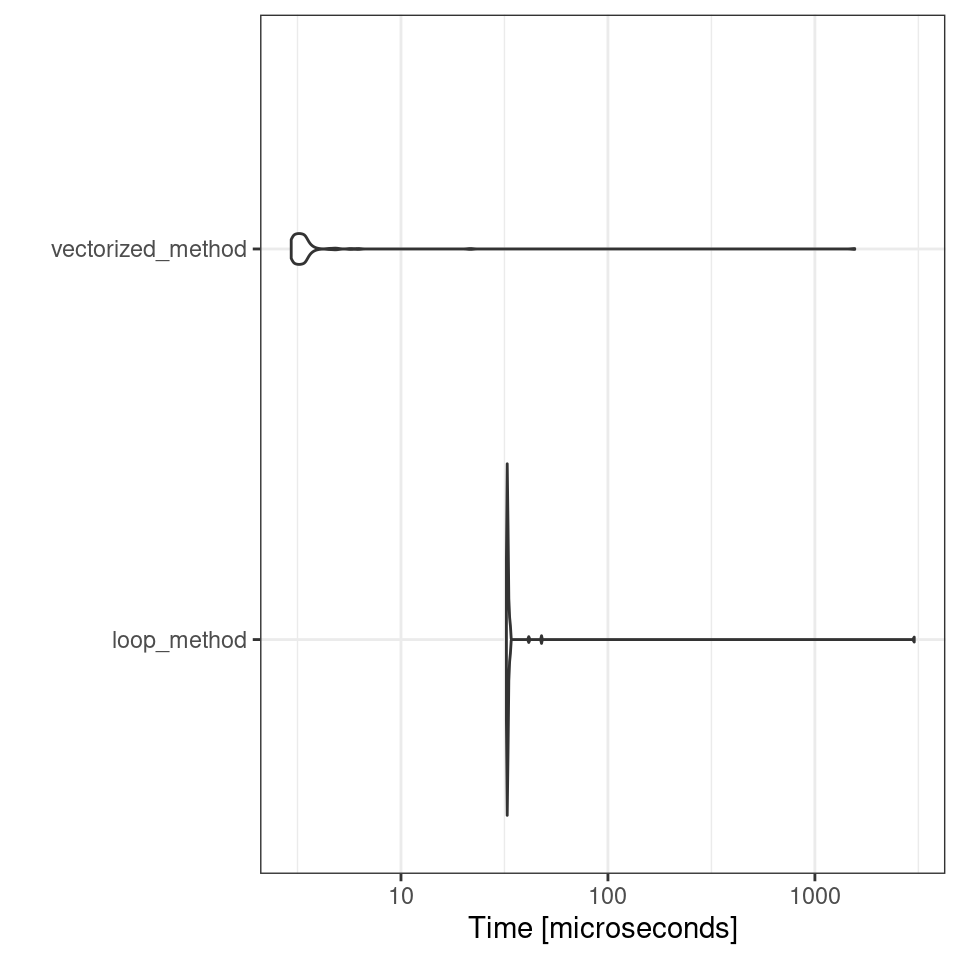
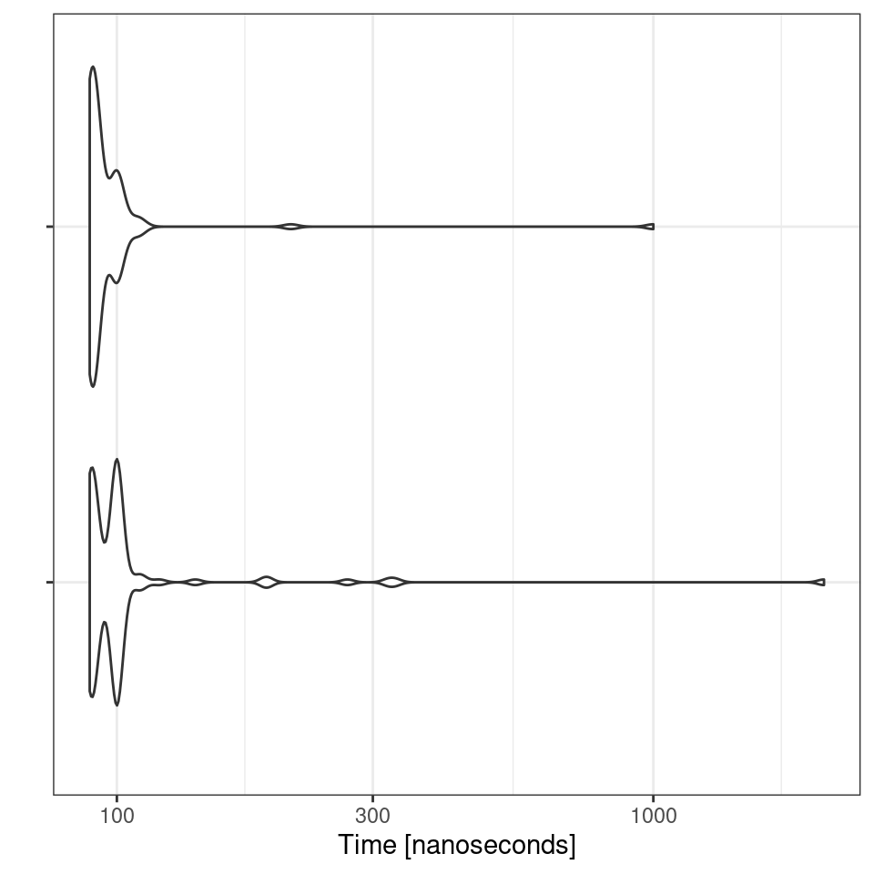

# (PART\*) Efficient Programming {.unnumbered}


# Reading


We did not cover the different approaches to working with really big data in R. Instead I have provided a list of extra reading and exercises that cover this in more depth, as well as introductions to using SQL with dplyr functions:


https://www.r-bloggers.com/2020/09/the-fastest-way-to-read-and-writes-file-in-r/

https://www.r-bloggers.com/2019/05/how-to-save-and-load-datasets-in-r-an-overview/

http://www.sthda.com/english/wiki/saving-data-into-r-data-format-rds-and-rdata

https://waterdata.usgs.gov/blog/formats/

https://inbo.github.io/tutorials/tutorials/r_large_data_files_handling/

https://bookdown.org/csgillespie/efficientR/preface.html

https://github.com/sbreitbart/DataSci_for_Ecologists/blob/main/SQL_intro/SQL_intro.rmd


# Efficient Programming

In this section we will cover some general concepts in R programming techniques around code optimisation. 

When optimizing your R code for performance, it’s crucial to measure how long your code takes to run. Two commonly used methods for tracking and comparing the efficiency of your R scripts are the `Sys.time` function and the `microbenchmark` package.

`Sys.time`: This base R function is straightforward for measuring execution time. By capturing the system time before and after your code runs, you can calculate the elapsed time. While `Sys.time` is suitable for general timing, it might not provide the precision needed for very quick operations.


```r
start_time <- Sys.time()
# Code to measure
end_time <- Sys.time()
elapsed_time <- end_time - start_time
print(elapsed_time)
```

```
## Time difference of 0.0007417202 secs
```

`microbenchmark`: For more precise timing, particularly when comparing very fast operations, the `microbenchmark` package is highly effective. It provides detailed performance metrics by running your code multiple times and reporting the best, worst, and median execution times. This package is ideal for fine-tuning and optimizing code where performance differences are subtle but significant.

Note in order for `microbenchmark` to work we must turn out our iterations into a function, `microbenchmark()` will then run our function a specified number of times and calculate metrics.


```r
library(microbenchmark)

# Define two methods for calculating the sum of squares

# Method 1: Using a loop
sum_squares_loop <- function(x) {
  total <- 0
  for (i in 1:length(x)) {
    total <- total + x[i]^2
  }
  return(total)
}

# Method 2: Using vectorized operations
sum_squares_vectorized <- function(x) {
  return(sum(x^2))
}

# Create a sample vector
sample_vector <- rnorm(1000)

# Benchmark the two methods
benchmark_results <- microbenchmark(
  loop_method = sum_squares_loop(sample_vector),
  vectorized_method = sum_squares_vectorized(sample_vector),
  times = 100
)

# Print the benchmark results
print(benchmark_results)

autoplot(benchmark_results)
```



```
## Unit: microseconds
##               expr    min     lq     mean median     uq      max neval
##        loop_method 32.320 32.550 62.86388  32.66 32.925 3019.952   100
##  vectorized_method  2.949  3.085 19.08733   3.25  3.465 1557.351   100
```

## Avoid Growing Vectors

In R, when you repeatedly add elements to a vector inside a loop, R has to resize and copy the vector each time, which can slow down your code. To avoid this, you should pre-allocate the vector with the required size before filling it.

Example: Suppose you want to calculate the average height of plants in different plots from multiple experiments.

### Growing vectors


```r
# Number of experiments
n <- 1000
# Initialize an empty vector
average_heights <- numeric()  # This starts as an empty vector

for (i in 1:n) {
  # Simulate heights of plants in one experiment
  heights <- rnorm(100, mean = 50, sd = 10)
  # Append the average height to the vector
  average_heights[i] <- mean(heights)  # This operation grows the vector
}
```

### Pre-allocated vectors


```r
# Number of experiments
n <- 1000
# Preallocate the vector with the correct size
pre_allocated_average_heights <- numeric(n)  # This creates a vector of size n

for (i in 1:n) {
  # Simulate heights of plants in one experiment
  heights <- rnorm(100, mean = 50, sd = 10)
  # Store the average height in the preallocated vector
  average_heights[i] <- mean(heights)  # This operation fills the vector
}
```


### Exercise

1. Measure and compare the execution times from growing or pre-allocating the vector. Use either `Sys.time` or `microbenchmark` to calculate differences

<button id="displayTextunnamed-chunk-6" onclick="javascript:toggle('unnamed-chunk-6');">Show Solution</button>

<div id="toggleTextunnamed-chunk-6" style="display: none"><div class="panel panel-default"><div class="panel-heading panel-heading1"> Solution </div><div class="panel-body">

```r
# Inefficient Code

# Number of experiments
n <- 1000
# Initialize an empty vector
average_heights <- numeric()  # This starts as an empty vector

start_time <- Sys.time()
for (i in 1:n) {
  # Simulate heights of plants in one experiment
  heights <- rnorm(100, mean = 50, sd = 10)
  # Append the average height to the vector
  average_heights[i] <- mean(heights)  # This operation grows the vector
}
stop_time <- Sys.time()
time_growing <- stop_time - start_time

# Efficient Code

pre_allocated_average_heights <- numeric(n) 

start_time <- Sys.time()
for (i in 1:n) {
  # Simulate heights of plants in one experiment
  heights <- rnorm(100, mean = 50, sd = 10)
  # Append the average height to the vector
  pre_allocated_average_heights[i] <- mean(heights)  # This operation grows the vector
}
stop_time <- Sys.time()
time_preallocated <- stop_time - start_time

# Compare times
print(time_growing)
print(time_preallocated)
```

```r
# Benchmark the two methods
benchmark <- microbenchmark(
  
# Method 1: Growing vector inside the loop (inefficient)
time_growing <- \(x) {

    
# Number of experiments
n <- 1000
# Initialize an empty vector
average_heights <- numeric()  # This starts as an empty vector
    

for (i in 1:n) {
  # Simulate heights of plants in one experiment
  heights <- rnorm(100, mean = 50, sd = 10)
  # Append the average height to the vector
  average_heights[i] <- mean(heights)  # This operation grows the vector
}

},


# Method 2: Preallocated vector outside the loop

time_allocated <- \(x) {

# Number of experiments
n <- 1000
# Preallocate the vector with the correct size
pre_allocated_average_heights <- numeric(n)  # This creates a vector of size n

for (i in 1:n) {
  # Simulate heights of plants in one experiment
  heights <- rnorm(100, mean = 50, sd = 10)
  # Store the average height in the preallocated vector
  average_heights[i] <- mean(heights)  # This operation fills the vector
}

},

  times = 100
)

# Print the benchmark results
print(benchmark)
autoplot(benchmark) + theme(axis.text.y = element_blank())
```



```
## Unit: nanoseconds
##                                                                                                                                                                                                                      expr
##                   time_growing <- function(x) {     n <- 1000     average_heights <- numeric()     for (i in 1:n) {         heights <- rnorm(100, mean = 50, sd = 10)         average_heights[i] <- mean(heights)     } }
##  time_allocated <- function(x) {     n <- 1000     pre_allocated_average_heights <- numeric(n)     for (i in 1:n) {         heights <- rnorm(100, mean = 50, sd = 10)         average_heights[i] <- mean(heights)     } }
##  min lq   mean median  uq  max neval
##   89 90 124.16    100 100 2080   100
##   89 89 103.52     91 100 1000   100
```
</div></div></div>

## Vectors over loops

Many R functions are vectorised, that is the function’s inputs and/or outputs naturally work with vectors, reducing the number of function calls required. Ultimately calling an R function always ends up calling some underlying C/Fortran code. A **golden rule** in R programming is to access the underlying C/Fortran routines as quickly as possible; the fewer functions calls required to achieve this, the better

Here we take a loop-based calculation of summary statistics (e.g., means or variances) and then use vectorized functions and compare performance. The same basic looping is occurring in both instances - the difference is that when using vectors the loops run in C/Fortran which is faster.


```r
# Inefficient Code
n <- 1000
means_loop <- numeric(n)
start_time <- Sys.time()
for (i in 1:n) {
  means_loop[i] <- mean(rnorm(100))
}
overall_mean_loop <- mean(means_loop)
end_time <- Sys.time()
time_loop <- end_time - start_time
print(time_loop)

# Efficient Code (Vectorized)
start_time <- Sys.time()
means_vectorized <- replicate(n, mean(rnorm(100)))
overall_mean_vectorized <- mean(means_vectorized)
end_time <- Sys.time()
time_vectorized <- end_time - start_time
print(time_vectorized)
```

```
## Time difference of 0.01241708 secs
## Time difference of 0.01166797 secs
```

## Avoid Global variables

Avoiding global variables is a good practice for writing clean and efficient R code. Instead, you should define variables within functions and pass them as arguments when needed. This approach reduces side effects and makes your code easier to maintain and debug - everything you need to understand about what the function does is contained within the function, whereas if it uses global variables, you need to worry about whether anything you call might change those variables, and alter behaviour in hard to reason about ways:

It **can** also improve speed as R does not need to search through the global environment to find them. But performance differences are likely to be extremely small.


```r
library(microbenchmark)

# Global variable
x_global <- 1:1e6

# Function that uses the global variable
compute_sum_global <- function() {
  result <- sum(x_global)
  return(result)
}

# Benchmark
benchmark_global <- microbenchmark(
  compute_sum_global(),
  times = 100
)

print(benchmark_global)
```

```
## Unit: nanoseconds
##                  expr min  lq     mean median  uq     max neval
##  compute_sum_global() 370 380 22226.33    380 390 2173472   100
```


```r
# Function that takes x as an argument
compute_sum_local <- function() {
  
  # Local variable
  x_local <- 1:1e6
  
  result <- sum(x_local)
  return(result)
}


# Benchmark
benchmark_local <- microbenchmark(
  compute_sum_local(),
  times = 100
)

print(benchmark_local)

benchmark_comparison <- microbenchmark(
  compute_sum_global(),
  compute_sum_local(),
  times = 100
)
```

```
## Unit: nanoseconds
##                 expr min  lq     mean median  uq     max neval
##  compute_sum_local() 460 470 20418.32    480 500 1984082   100
```

While the performance difference might be marginal for simple tasks, avoiding global variables and using function arguments is a good practice for optimizing code performance, improving readability, and enhancing maintainability. For larger or more complex applications, the benefits of local variable access can become more pronounced, especially in performance-critical sections of code.


## Compile

The `compiler` package is a way of compiling code to get performance enhancements. R is a *high-level* programming language, computers don't understand R directly, they require translation. `compiler` takes our R code and compiles it into byte code, and may produce efficiencies along the way. 

By default, code and functions from packages in R are compiled. 


```r
library(compiler)
```

First create an inefficient function for calculating the mean. This function takes in a vector, calculates the length and then updates the m variable.


```r
mean_r <-  function(x) {
  m = 0
  n = length(x)
  for (i in seq_len(n))
    m = m + x[i] / n
  m
}
```

This is clearly a bad function and we should just use the `mean()` function, but it’s a useful comparison. Compiling the function is straightforward


```r
cmp_mean_r <-  compiler::cmpfun(mean_r)
```

Then we use the `microbenchmark()` function to compare the three variants

### Generate some data


```r
x <-  rnorm(1000)
microbenchmark(times = 10, unit = "ms", # milliseconds
          mean_r(x), cmp_mean_r(x), mean(x))
```

<div class="kable-table">

|expr          |    time|
|:-------------|-------:|
|mean_r(x)     | 3273113|
|cmp_mean_r(x) |   36330|
|mean_r(x)     |   35450|
|mean(x)       |   14820|
|mean(x)       |    6890|
|mean_r(x)     |   35230|
|cmp_mean_r(x) |   35190|
|mean(x)       |    6520|
|cmp_mean_r(x) |   35110|
|mean_r(x)     |   34820|
|mean_r(x)     |   34710|
|cmp_mean_r(x) |   35110|
|cmp_mean_r(x) |   34650|
|mean_r(x)     |   35670|
|mean(x)       |    6620|
|cmp_mean_r(x) |   34920|
|mean(x)       |    6260|
|cmp_mean_r(x) |   35190|
|mean_r(x)     |   35280|
|mean(x)       |    6550|
|mean_r(x)     |   34900|
|mean_r(x)     |   35441|
|mean_r(x)     |   34660|
|mean(x)       |    6271|
|mean(x)       |    6389|
|mean(x)       |    6200|
|cmp_mean_r(x) |   36180|
|mean(x)       |    6460|
|cmp_mean_r(x) |   34851|
|cmp_mean_r(x) |   34791|

</div>

The compiled function is around seven times faster than the uncompiled function. Of course the native mean() function is faster, but compiling does make a significant difference

## Profile code

`profvis` is a powerful tool in R for visualizing function profiling data. It helps you understand where your R code might be running slowly by providing a clear, interactive visualization of how time is spent in your functions

To profile the code, wrap it in profvis() and run it. Here’s how you can profile `mean_r`:


