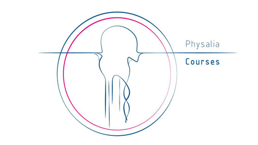
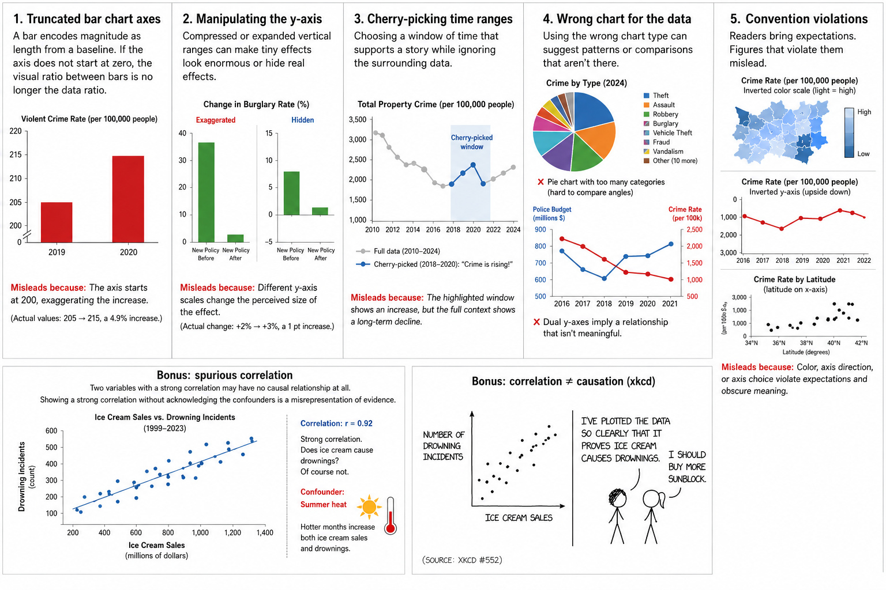
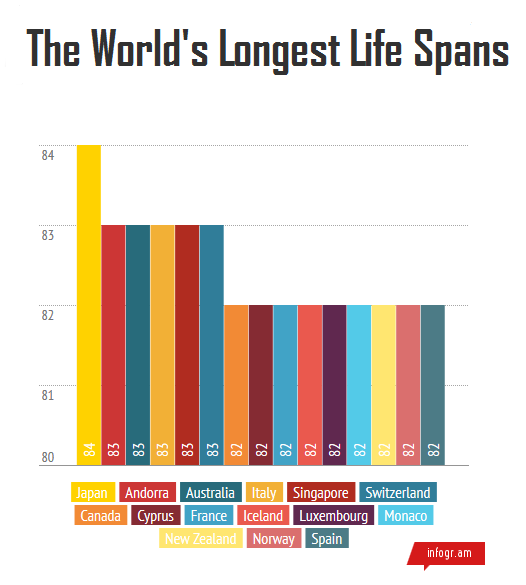
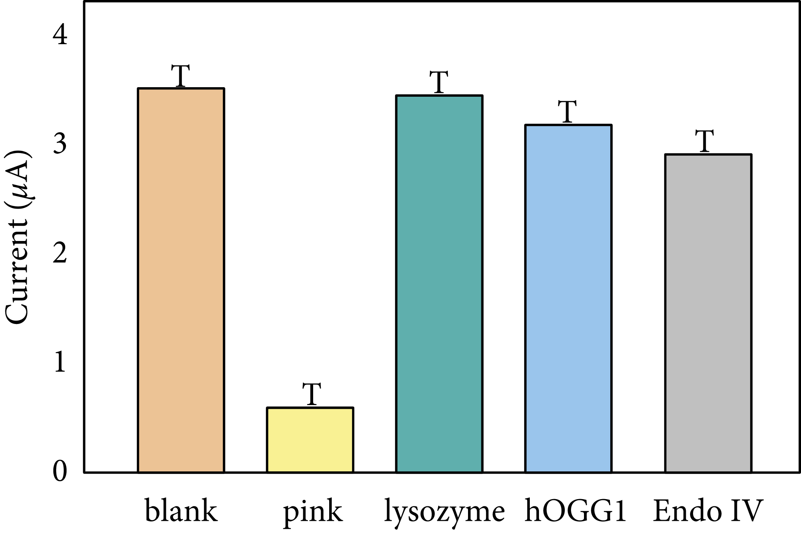
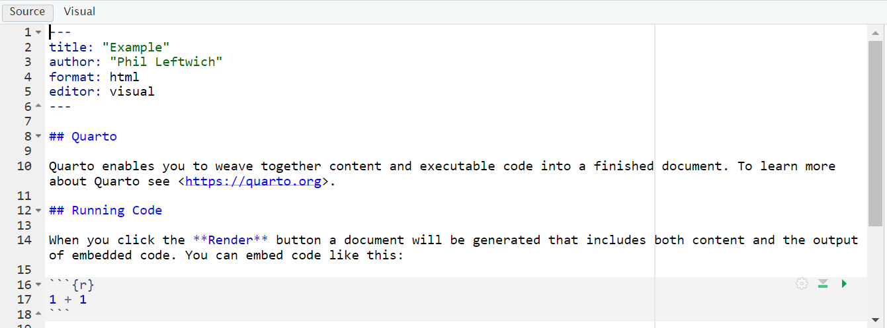

--- 
title: "Advancing in R"
author: "Philip T. Leftwich"
date: "2026-05-30"
subtitle: A guide for Biologists and Ecologists
site: bookdown::bookdown_site
documentclass: book
bibliography:
- book.bib
- packages.bib
biblio-style: apa
csl: include/apa.csl
link-citations: yes
suppress-bibliography: true
description: |
  This book ...
url: https://ueabio.github.io/physalia-R-course-2023/
github-repo: UEABIO/physalia-R-course-2023
cover-image: images/logos/twitter_card.png
apple-touch-icon: images/logos/apple-touch-icon.png
apple-touch-icon-size: 180
favicon: images/logos/favicon.ico
---


# Overview {-}


<div class="small_right"></div>


This course is designed for anyone with basic knowledge of R who is looking to enhance their skills and take their programming abilities to the next level. Each session in the course will be hands-on, providing you with practical examples to work through and apply the concepts you've learned, and lots of support to answer questions and overcome any challenges

## Learning outcomes

1. A grounding in R
2. Project based workflows
3. Tidyverse for data wrangling
4. Writing functions and running iterations
5. Advanced tidyverse tricks
6. GGplot for data visuals
7. Making tables with gt
8. Making reports with Rmarkdown
9. Using Github


## Packages

```
## Core Packages:
- tidyverse 2.0.0
- palmerpenguins
- here
- janitor
- skimr
- dbplyr

## Data Exploration:
- GGally
- skimr
- dataxray
- naniar
- mice

## Optimizing Functions:
- microbenchmark
- testthat
- profviz
- memoise
- digest

## Parallel Processing

- doParallel
- foreach
- furrr

## Data import

- rvest
- data.table

## Reproducible Reports:
- rmarkdown
- tinytex

## Working with Tables:
- gt
- gtExtras

## Add-ons for Working with ggplot:
- ggbeeswarm
- gghighlight
- ggh4x
- ggpubr
- png
- ggdensity
- ggdist
- ggbump
- ggtext
- ggalt
- ggridges
- geomtextpath
- colorBlindness
- patchwork

## Working with Github:
- gitcreds
- usethis

## Requires devtools for github installation: 

- tidychatmodels

```

## Other software

- R version 4.0.0 or later

- Rstudio

- Rtools (compatible with your computer)

- Git (compatible with your computer)

<!--chapter:end:index.Rmd-->

# (PART\*) Day 1 

# Day 1 Block 1: Project-based workflows {.unnumbered}


The single most common reason a shared script fails on someone else's computer is
a file path. A line like `read.csv("C:/Users/me/thesis/data/penguins.csv")` is a
statement about *your* machine, not about the analysis. The fix is to make the
project, not your home directory, the centre of the universe.

## Why a project

An RStudio (or Positron) project is a folder with an `.Rproj` marker file. Opening
it does two useful things automatically: it sets the working directory to the
project folder, and it points the file browser there. Every path you write can
then be relative to the project root, which means the project can be zipped,
shared, or moved to another operating system and still run without editing a
single path.

To create one: **File &rarr; New Project &rarr; New Directory &rarr; New Project**,
name it, and click **Create Project**. RStudio leaves an `.Rproj` file in the
folder. Double-clicking that file opens a fresh session pointed at the project.

<div class="figure" style="text-align: center">

<p class="caption">(\#fig:unnamed-chunk-2)A typical R project layout</p>
</div>

## Absolute versus relative paths

An **absolute path** spells out the full location from the root of the disk:

```
/home/your-username/project/data/raw/penguins.csv
```

It breaks the moment anyone else opens your code, because nobody else has your
directory structure. A **relative path** is relative to the project root, so it
travels with the project:

```
data/raw/penguins.csv
```

## A sensible layout

Organise each project into its own folder with a predictable structure. The
convention we follow all day:

```
my-project.Rproj
|- data/
|   |- raw/          # read-only; never edited by code
|   |- processed/    # outputs of cleaning
|- R/
|   |- functions/    # function definitions only
|   |- scripts/          # or numbered analysis scripts in R/
|- outputs/
|   |- figures/
|   |- tables/
```

The principle that does the most work here is *raw data is read-only*. Cleaning
scripts read from `data/raw/` and write to `data/processed/`; they never overwrite
the original. If a clean goes wrong, the source of truth is untouched.


### Setting up folders

This can be done in your IDE

Create the following folders using the + New Folder button in the Files tab

# data/raw
# data/clean
# R/scripts
# outputs

Or it can be done programmatically: 


#### BASE R


``` r
# dir.create makes directories
# unless specified it is not "recursive"

dir.create("data/raw",
           recursive = TRUE) 

dir.create("data/clean",
           recursive = TRUE)

dir.create("R/scripts",
           recursive = TRUE)

dir.create("outputs") 
```

#### fs package

Run `fs::dir_tree()` to generate a nicely formatted directory tree and is a great sanity check before and after file manipulation

The `fs` Hester et al. (2025) package is a great OS agnostic package and one that works safely (it will not overwrite files or folders unless explicitly asked).


``` r
# Load the package
library(fs)

# Create standard folders
dir_create("data", c("raw", "clean"))   # creates dir recursively as standard
dir_create("R", c("scripts"))       # for your R code
dir_create("outputs")    # for figures and plots
```


## The `here` package

Even inside a project, paths written with `/` or `\\` can behave differently
across operating systems, and they break if you run code from a subdirectory.
`here::here()` builds a path from the project root regardless of where the code is
called from or which operating system runs it.


``` r
# Fragile: relative to wherever the session happens to sit
raw_data <- readr::read_csv("data/raw/penguins.csv")

# Robust: built from the project root every time
library(here)
raw_data <- readr::read_csv(here("data", "raw", "penguins.csv"))
```

`here()` finds the root by looking for the `.Rproj` file (or a `.here` file), so
it does not depend on the working directory. We recommend using an RStudio project
*and* `here()` together. Either alone helps; both together is robust.

<div class="info">
<p>Further reading on <code>here</code>: the package’s own rationale at
<a href="https://github.com/jennybc/here_here"
class="uri">https://github.com/jennybc/here_here</a> sets out the
argument better than we can here. The short version: a path is part of
your code, and code should not assume it knows where it lives.</p>
</div>

### Activity: de-path a script

<div class="panel panel-default"><div class="panel-heading"> Task </div><div class="panel-body"> 

Below is the opening of a script written without a project. Rewrite it so it would
run unchanged on a colleague's machine. You should change two things: the working
directory line, and the path.
 </div></div>


``` r
setwd("/Users/sam/Documents/penguin_thesis/")

penguins_raw <- read.csv("/Users/sam/Documents/penguin_thesis/data/raw/penguins.csv")
```

<button id="displayTextunnamed-chunk-9" onclick="javascript:toggle('unnamed-chunk-9');">Show Solution</button>

<div id="toggleTextunnamed-chunk-9" style="display: none"><div class="panel panel-default"><div class="panel-heading panel-heading1"> Solution </div><div class="panel-body">

``` r
# No setwd() at all: open the project instead, which sets the directory for you.
library(here)
library(tidyverse)

penguins_raw <- readr::read_csv(here("data", "raw", "penguins.csv"))
```

The `setwd()` line is deleted entirely, not replaced. Working directory is the
project's job, not the script's. The path is rebuilt from the project root with
`here()`, so it no longer mentions any user or machine.
tidyverse contains the `readr` package which has `read_csv()`, so we load it here. We could load `readr` directly if we wanted, but `tidyverse` is a common choice for data analysis and it includes `readr`, so we go with that.
</div></div></div>

## Blank slates

A clean analysis should not depend on hidden state left over from a previous
session: a package you attached by hand, an object you created interactively, an
option you set and forgot. Many scripts open with `rm(list = ls())` in an attempt
to start clean, but this is a weak guarantee. It removes user-created objects but
does **not** detach packages, reset options, or change the working directory. The
session is still contaminated.

The reliable habit is to **restart R** (Session &rarr; Restart R, or
`Ctrl/Cmd+Shift+F10`) and rerun the script from the top. If the analysis only runs
correctly from a fresh session, it is reproducible; if it needs objects that exist
only because of something you did by hand earlier, you find out immediately rather
than six months later. Treat the script, not the workspace, as the record of what
you did.

<div class="try">
<p>Turn off workspace saving so a stale <code>.RData</code> never loads
silently. In Tools → Global Options → General, set “Save workspace to
.RData on exit” to <strong>Never</strong>, and untick “Restore .RData
into workspace at startup”. Now every session starts blank, and the only
way to recreate your objects is to run your code.</p>
</div>

## `renv`: pinning package versions

A project that runs today can break next year if a package changes its behaviour.
`renv` records the exact package versions a project uses, in a project-local
library, so the environment can be reconstructed later or on another machine.


``` r
# Once per project: create a project-local library and record current versions
renv::init()

# Install into the project library (not the global one)
renv::install("dplyr")

# After installing or updating anything, record the new state
renv::snapshot()

# On another machine, or after things break, rebuild the recorded environment
renv::restore()
```

`renv::status()` reports whether the lockfile and the library agree.

`renv.lock` records only packages actually loaded in the project, so it captures
what you use rather than everything installed.

<div class="info">
<p><code>renv</code> is a large step towards reproducibility, not a
complete guarantee. It records, but does not by itself reinstall, the R
version you used (though the version is noted in
<code>renv.lock</code>). For stronger guarantees, tools such as
<code>rig</code> (switching R versions) or Docker (capturing the whole
environment) exist, but they are beyond today’s scope. For most analysis
projects, a project plus <code>here()</code> plus <code>renv</code> is
enough.</p>
</div>

### Activity: initialise a project environment

<div class="panel panel-default"><div class="panel-heading"> Task </div><div class="panel-body"> 

In a fresh project, run `renv::init()`, then `renv::install("janitor")`, then
`renv::snapshot()`. Open `renv.lock` in a text editor and find the entry for
`janitor`. What information is recorded about it, and why would a collaborator need
that exact information to reproduce your analysis?
 </div></div>

<div class="info">
<p><strong>Where this leaves us.</strong> We now have a project that
runs anywhere, reads its data by relative path, starts from a blank
slate, and pins its package versions. That is the foundation. Everything
from here assumes you are working inside such a project. The rest of the
day fills it with well-organised analytical code.</p>
</div>

<!--chapter:end:01-projects.Rmd-->

# Day 1 Block 2: Getting more out of tidyverse {.unnumbered}


*Roughly 55 minutes. We assume the core verbs are familiar and spend the time on
the patterns that remove repetition: working across many columns, reshaping, and
the nesting idea that the afternoon depends on.*

Throughout this block we use a cleaned copy of the data:


```r
library(tidyverse)
library(palmerpenguins)
library(janitor)

penguins_clean <- penguins_raw |>
  janitor::clean_names()
```

## A 5-minute refresher (diagnostic, not teaching)

Before the new material, a quick check that the foundation is solid. Predict the
output of each line *before* running it, then run it.


```r
penguins_clean |> dplyr::filter(body_mass_g > 5000)               # which rows?
penguins_clean |> dplyr::filter_out(body_mass_g > 5000)           # which rows? (Hint this is a new function)
penguins_clean |> dplyr::select(species, body_mass_g)             # which columns?
penguins_clean |> dplyr::mutate(mass_kg = body_mass_g / 1000)     # new column?
penguins_clean |> dplyr::summarise(m = mean(body_mass_g, na.rm = TRUE), .by = species)
```

If those four lines hold no surprises, you have everything you need for the day.
Note the modern `.by = species` argument to `summarise()`: it groups for that one
operation and returns an ungrouped result, which avoids the classic forgotten
`ungroup()` bug.

## Working across many columns with `across()`

A recurring issue in analysis scripts is the same operation written out once per
column:


```r
penguins_clean |>
  dplyr::summarise(
    mean_body_mass      = mean(body_mass_g, na.rm = TRUE),
    mean_flipper_length = mean(flipper_length_mm, na.rm = TRUE),
    .by = species
  )
```

`across()` says "apply this function to these columns" in one place. It works only
inside a dplyr verb, and takes three arguments worth knowing: `.cols` (which
columns, using tidy-selection), `.fns` (the function to apply), and `.names` (how
to name the results).


```r
penguins_clean |>
  dplyr::summarise(
    dplyr::across(
      .cols  = where(is.numeric),
      .fns   = \(x) mean(x, na.rm = TRUE),
      .names = "mean_{.col}"
    ),
    .by = species
  )
```

Two modern points. The function is written as `\(x) mean(x, na.rm = TRUE)`, the
R 4.1 anonymous-function shorthand, rather than the older `~ mean(.x, na.rm = T)`
formula-lambda you will still see in the wild. And `na.rm = TRUE` is spelled out;
`T` and `F` are ordinary variables that can be reassigned, so they are best
avoided in code you intend to keep.

The same pattern coerces a set of columns to factors:


```r
penguins_clean |>
  dplyr::mutate(
    dplyr::across(.cols = c(species, island), 
    .fns = as.factor)
  ) |>
  dplyr::select(where(is.factor)) |>
  dplyr::glimpse()
```

### `across()`'s row-wise cousins: `if_any()` and `if_all()`

To filter rows on a condition applied across several columns, use `if_any()` (the
condition holds for *at least one* of the columns) or `if_all()` (it holds for
*all* of them).


```r
# Keep rows where ALL numeric measurements are present (no NA)
penguins_clean |>
  dplyr::filter(
    dplyr::if_all(.cols = where(is.numeric), .fns = \(x) !is.na(x))
  )
```

<div class="try">
<p>The line above reads slightly backwards at first.
<code>if_all()</code> asks whether <em>all</em> the chosen columns
satisfy “is not <code>NA</code>”. Try swapping <code>if_all</code> for
<code>if_any</code>, and try removing the <code>!</code>, and predict
each result before running it.</p>
</div>

### Activity: one summary, every numeric column

<div class="panel panel-default"><div class="panel-heading"> Task </div><div class="panel-body"> 

Write a single `summarise()` that returns, for each species, both the mean and the
standard deviation of every numeric column, with names like `mean_body_mass_g` and
`sd_body_mass_g`. Hint: `.fns` can be a named list of functions.
 </div></div>

<button id="displayTextunnamed-chunk-10" onclick="javascript:toggle('unnamed-chunk-10');">Show Solution</button>

<div id="toggleTextunnamed-chunk-10" style="display: none"><div class="panel panel-default"><div class="panel-heading panel-heading1"> Solution </div><div class="panel-body">

```r
penguins_clean |>
  dplyr::summarise(
    dplyr::across(
      .cols  = where(is.numeric),
      .fns   = list(mean = \(x) mean(x, na.rm = TRUE),
                    sd   = \(x) sd(x, na.rm = TRUE)),
      .names = "{.fn}_{.col}"
    ),
    .by = species
  )
```

When `.fns` is a named list, `{.fn}` in `.names` expands to each function's name.
This is the whole quarter-page of repeated `mean_x =`, `sd_x =` lines replaced by
four lines that cannot drift out of step with each other.
</div></div></div>

## A note on factors

Categorical variables are often better as factors than as character strings, and
`forcats` (part of the tidyverse) provides verbs for managing their levels.


```r
penguins_clean |>
  dplyr::mutate(
    # collapse rare levels into "Other", keeping the 2 most frequent
    island_lumped = forcats::fct_lump_n(island, n = 2),
    # order species by their mean body mass, for sensible plot ordering
    species       = forcats::fct_reorder(species, body_mass_g, .fun = mean,
                                         na.rm = TRUE)
  )
```

`fct_reorder()` is the one to remember: it reorders a factor's levels by a summary
of another variable, which is what you almost always want for an ordered axis or
legend.

## Reshaping with `pivot_longer()` and `pivot_wider()`

Tidy data has one variable per column and one observation per row. Data collected
in the field often violates this, most commonly by spreading one variable across
several columns. Consider weekly observation counts:


```r
peng_obs <- tibble::tibble(
  penguin_id = c("N15A1", "N15A2", "N18A1", "N71A2"),
  wk1 = c(1, 2, 4, 5),
  wk2 = c(3, 4, 1, 0),
  wk3 = c(0, 0, 2, 0)
)
```

This is untidy: `wk1`, `wk2`, `wk3` are three columns holding one variable (the
count), recorded at three values of another variable (the week).
`pivot_longer()` repairs it:


```r
peng_obs |>
  tidyr::pivot_longer(
    cols            = wk1:wk3,
    names_to        = "week",
    names_prefix    = "wk",            # strip the "wk" so "wk2" becomes "2"
    names_transform = as.integer,      # and make week an integer, not a string
    values_to       = "observations"
  )
```

`pivot_wider()` is the inverse, and is most useful for turning a tidy summary into
a human-readable table:


```r
penguins_clean |>
  dplyr::summarise(mean = mean(body_mass_g, na.rm = TRUE),
                   .by = c(species, island)) |>
  tidyr::pivot_wider(
    names_from   = island,
    values_from  = mean,
    names_prefix = "mean_"
  )
```

<div class="info">
<p>Keep analysis in long (tidy) form and pivot wide only at the very
end, for display. Long data is what <code>ggplot2</code> and the
modelling functions expect; wide data is for human eyes in a printed
table.</p>
</div>

## Slicing rows

`slice()` and its helpers select rows by position or by an ordering, which is
often cleaner than a `filter()` with an arithmetic threshold.


```r
# The three heaviest penguins per species
penguins_clean |>
  dplyr::slice_max(order_by = body_mass_g, n = 3, by = species) |>
  dplyr::select(species, body_mass_g)
```

The relatives are `slice_head()`, `slice_tail()`, `slice_min()` and
`slice_sample()`. The modern `by =` argument applies the slice within each group
without a separate `group_by()`/`ungroup()` pair.

## The bridge to the afternoon: nesting

The afternoon's iteration work rests on one idea introduced here. A tibble cell
usually holds a single value. It can instead hold an entire tibble.
`group_by()` followed by `nest()` collapses each group's rows into one cell:


```r
penguins_clean |>
  tidyr::drop_na(body_mass_g, flipper_length_mm) |>
  dplyr::group_by(species) |>
  tidyr::nest()
# # A tibble: 3 x 2
#   species   data
#   <chr>     <list>
# 1 Adelie    <tibble [...]>
# 2 Gentoo    <tibble [...]>
# 3 Chinstrap <tibble [...]>
```

The `data` column is a **list-column**: each cell is a tibble holding one species'
observations. This is not exotic; it is an ordinary column whose values happen to
be tibbles. We do nothing further with it now. Hold the picture in mind: in Block 4
we will apply a function to each of those cells and fit one model per species in a
single pipeline.

### Reading many files (a preview of iteration)

The same nesting and iteration ideas read a folder of files at once. Suppose a
directory holds one CSV per sampling site:


```r
# List the files (full paths, so they can be opened from anywhere)
csv_files <- list.files(
  path       = here::here("data", "many_files"),
  pattern    = "\\.csv$",
  full.names = TRUE
)

# Read every file and stack the results into one tibble.
# The modern idiom is map() then list_rbind(); the older map_dfr() is superseded.
all_sites <- csv_files |>
  purrr::map(\(f) readr::read_csv(f, show_col_types = FALSE)) |>
  purrr::list_rbind()
```

`map()` reads each file into a list of tibbles; `list_rbind()` binds that list
into one tibble. We will unpack `map()` properly in Block 4. For now, notice that
"do the same thing to every element of a collection" is the shape of almost all
the work ahead.

<div class="info">
<p><strong>Where this leaves us.</strong> We can now operate on many
columns at once, reshape between long and wide, slice by order, and
collapse groups into list-columns. The data-handling toolkit is
complete. The rest of the day is about the <em>code that acts on the
data</em>: functions, iteration, and generalisation.</p>
</div>

### Other key packages 

## Data validation with `tidylog` and `assertr` {#sec-validate}

Robust data analysis depends on making every transformation visible and ensuring assumptions about the data are actually met. Two useful tools for this are `tidylog`, which reports what `dplyr` is doing, and `assertr`, which enforces explicit checks during a pipeline.

We’ll use a small simulated dataset of insect reproduction to illustrate both ideas.


```r
library(tidyverse)
library(dplyr)
library(tidylog)
library(assertr)

set.seed(123)
n <- 200

female_egg_data <- tibble(
  female_id = 1:n,
  treatment = rep(c("A","B"), times = 100),
  age_days = sample(1:30, n, replace = TRUE),
  eggs_laid = rpois(n, lambda = 50),
  eggs_hatched = pmin(eggs_laid, rpois(n, lambda = 45)),
  body_mass  = rnorm(n, mean = 0.2, sd = 5)
)

# introduce a few intentional problems
female_egg_data$age_days[1] <- 0
female_egg_data$eggs_laid[2] <- 120
female_egg_data$eggs_hatched[3] <- female_egg_data$eggs_laid[3] + 5
```

---

## Making transformations visible with `tidylog`

When `tidylog` is loaded, standard `dplyr` verbs report what they change. This is particularly helpful in pipelines where rows are filtered or variables are modified without otherwise obvious trace.


```r
female_egg_data_clean <- female_egg_data |>
  filter(age_days > 0) |>
  mutate(eggs_per_day = eggs_laid / age_days)
```

Instead of silently dropping rows or creating variables, the console output summarises exactly what was removed or added, making the workflow easier to audit and debug.

---

## Enforcing assumptions with `assertr`

While `tidylog` improves transparency, `assertr` ensures that data meet expectations before analysis continues.

The core idea is that validation lives *inside your pipeline*, right next to the data it is checking. If an assertion fails, the pipeline stops and tells you exactly what went wrong and in which rows. If everything passes, execution continues as normal.

## Data validation with `assertr`

Again, we will use the `female_egg_data_clean` dataset.


```r
glimpse(female_egg_data_clean)
```

```
## Rows: 19
## Columns: 6
## $ female_id    <int> 2, 3, 4, 5, 6, 7, 8, 9, 10, 11, 12, 13, 14, 15, 16, 17, 1…
## $ treatment    <chr> "B", "A", "B", "A", "B", "A", "B", "A", "B", "A", "B", "A…
## $ age_days     <dbl> 19, 14, 3, 10, 18, 22, 11, 5, 20, 14, 22, 25, 26, 27, 5, …
## $ eggs_laid    <dbl> 120, 50, 46, 59, 55, 49, 44, 42, 47, 44, 57, 48, 41, 41, …
## $ eggs_hatched <dbl> 52, 55, 46, 50, 43, 49, 38, 42, 39, 44, 46, 44, 41, 41, 4…
## $ eggs_per_day <dbl> 6.315789, 3.571429, 15.333333, 5.900000, 3.055556, 2.2272…
```

### `verify()` — check a logical condition

`verify()` is the simplest function. It evaluates a logical expression against the whole dataframe and stops if it is FALSE. Think of it as `stopifnot()` with better error messages and pipeline compatibility.


```r
# Check that all rows of eggs laid are positive — this should pass
female_egg_data_clean |>
  verify(eggs_laid > 0)
```

<div class="kable-table">

<table>
 <thead>
  <tr>
   <th style="text-align:right;"> female_id </th>
   <th style="text-align:left;"> treatment </th>
   <th style="text-align:right;"> age_days </th>
   <th style="text-align:right;"> eggs_laid </th>
   <th style="text-align:right;"> eggs_hatched </th>
   <th style="text-align:right;"> eggs_per_day </th>
  </tr>
 </thead>
<tbody>
  <tr>
   <td style="text-align:right;"> 2 </td>
   <td style="text-align:left;"> B </td>
   <td style="text-align:right;"> 19 </td>
   <td style="text-align:right;"> 120 </td>
   <td style="text-align:right;"> 52 </td>
   <td style="text-align:right;"> 6.315790 </td>
  </tr>
  <tr>
   <td style="text-align:right;"> 3 </td>
   <td style="text-align:left;"> A </td>
   <td style="text-align:right;"> 14 </td>
   <td style="text-align:right;"> 50 </td>
   <td style="text-align:right;"> 55 </td>
   <td style="text-align:right;"> 3.571429 </td>
  </tr>
  <tr>
   <td style="text-align:right;"> 4 </td>
   <td style="text-align:left;"> B </td>
   <td style="text-align:right;"> 3 </td>
   <td style="text-align:right;"> 46 </td>
   <td style="text-align:right;"> 46 </td>
   <td style="text-align:right;"> 15.333333 </td>
  </tr>
  <tr>
   <td style="text-align:right;"> 5 </td>
   <td style="text-align:left;"> A </td>
   <td style="text-align:right;"> 10 </td>
   <td style="text-align:right;"> 59 </td>
   <td style="text-align:right;"> 50 </td>
   <td style="text-align:right;"> 5.900000 </td>
  </tr>
  <tr>
   <td style="text-align:right;"> 6 </td>
   <td style="text-align:left;"> B </td>
   <td style="text-align:right;"> 18 </td>
   <td style="text-align:right;"> 55 </td>
   <td style="text-align:right;"> 43 </td>
   <td style="text-align:right;"> 3.055556 </td>
  </tr>
  <tr>
   <td style="text-align:right;"> 7 </td>
   <td style="text-align:left;"> A </td>
   <td style="text-align:right;"> 22 </td>
   <td style="text-align:right;"> 49 </td>
   <td style="text-align:right;"> 49 </td>
   <td style="text-align:right;"> 2.227273 </td>
  </tr>
  <tr>
   <td style="text-align:right;"> 8 </td>
   <td style="text-align:left;"> B </td>
   <td style="text-align:right;"> 11 </td>
   <td style="text-align:right;"> 44 </td>
   <td style="text-align:right;"> 38 </td>
   <td style="text-align:right;"> 4.000000 </td>
  </tr>
  <tr>
   <td style="text-align:right;"> 9 </td>
   <td style="text-align:left;"> A </td>
   <td style="text-align:right;"> 5 </td>
   <td style="text-align:right;"> 42 </td>
   <td style="text-align:right;"> 42 </td>
   <td style="text-align:right;"> 8.400000 </td>
  </tr>
  <tr>
   <td style="text-align:right;"> 10 </td>
   <td style="text-align:left;"> B </td>
   <td style="text-align:right;"> 20 </td>
   <td style="text-align:right;"> 47 </td>
   <td style="text-align:right;"> 39 </td>
   <td style="text-align:right;"> 2.350000 </td>
  </tr>
  <tr>
   <td style="text-align:right;"> 11 </td>
   <td style="text-align:left;"> A </td>
   <td style="text-align:right;"> 14 </td>
   <td style="text-align:right;"> 44 </td>
   <td style="text-align:right;"> 44 </td>
   <td style="text-align:right;"> 3.142857 </td>
  </tr>
  <tr>
   <td style="text-align:right;"> 12 </td>
   <td style="text-align:left;"> B </td>
   <td style="text-align:right;"> 22 </td>
   <td style="text-align:right;"> 57 </td>
   <td style="text-align:right;"> 46 </td>
   <td style="text-align:right;"> 2.590909 </td>
  </tr>
  <tr>
   <td style="text-align:right;"> 13 </td>
   <td style="text-align:left;"> A </td>
   <td style="text-align:right;"> 25 </td>
   <td style="text-align:right;"> 48 </td>
   <td style="text-align:right;"> 44 </td>
   <td style="text-align:right;"> 1.920000 </td>
  </tr>
  <tr>
   <td style="text-align:right;"> 14 </td>
   <td style="text-align:left;"> B </td>
   <td style="text-align:right;"> 26 </td>
   <td style="text-align:right;"> 41 </td>
   <td style="text-align:right;"> 41 </td>
   <td style="text-align:right;"> 1.576923 </td>
  </tr>
  <tr>
   <td style="text-align:right;"> 15 </td>
   <td style="text-align:left;"> A </td>
   <td style="text-align:right;"> 27 </td>
   <td style="text-align:right;"> 41 </td>
   <td style="text-align:right;"> 41 </td>
   <td style="text-align:right;"> 1.518519 </td>
  </tr>
  <tr>
   <td style="text-align:right;"> 16 </td>
   <td style="text-align:left;"> B </td>
   <td style="text-align:right;"> 5 </td>
   <td style="text-align:right;"> 47 </td>
   <td style="text-align:right;"> 43 </td>
   <td style="text-align:right;"> 9.400000 </td>
  </tr>
  <tr>
   <td style="text-align:right;"> 17 </td>
   <td style="text-align:left;"> A </td>
   <td style="text-align:right;"> 19 </td>
   <td style="text-align:right;"> 47 </td>
   <td style="text-align:right;"> 47 </td>
   <td style="text-align:right;"> 2.473684 </td>
  </tr>
  <tr>
   <td style="text-align:right;"> 18 </td>
   <td style="text-align:left;"> B </td>
   <td style="text-align:right;"> 27 </td>
   <td style="text-align:right;"> 49 </td>
   <td style="text-align:right;"> 34 </td>
   <td style="text-align:right;"> 1.814815 </td>
  </tr>
  <tr>
   <td style="text-align:right;"> 19 </td>
   <td style="text-align:left;"> A </td>
   <td style="text-align:right;"> 25 </td>
   <td style="text-align:right;"> 56 </td>
   <td style="text-align:right;"> 37 </td>
   <td style="text-align:right;"> 2.240000 </td>
  </tr>
  <tr>
   <td style="text-align:right;"> 20 </td>
   <td style="text-align:left;"> B </td>
   <td style="text-align:right;"> 28 </td>
   <td style="text-align:right;"> 48 </td>
   <td style="text-align:right;"> 46 </td>
   <td style="text-align:right;"> 1.714286 </td>
  </tr>
</tbody>
</table>

</div>


```r
# Check something that will fail — no female should produce more than 1000 offspring
female_egg_data_clean |>
  verify(eggs_hatched > 1000)
```

```
## Error: assertr stopped execution
```

```
## verification [eggs_hatched > 1000] failed! (19 failures)
## 
##      verb redux_fn           predicate column index value
## 1  verify       NA eggs_hatched > 1000     NA     1    NA
## 2  verify       NA eggs_hatched > 1000     NA     2    NA
## 3  verify       NA eggs_hatched > 1000     NA     3    NA
## 4  verify       NA eggs_hatched > 1000     NA     4    NA
## 5  verify       NA eggs_hatched > 1000     NA     5    NA
## 6  verify       NA eggs_hatched > 1000     NA     6    NA
## 7  verify       NA eggs_hatched > 1000     NA     7    NA
## 8  verify       NA eggs_hatched > 1000     NA     8    NA
## 9  verify       NA eggs_hatched > 1000     NA     9    NA
## 10 verify       NA eggs_hatched > 1000     NA    10    NA
## 11 verify       NA eggs_hatched > 1000     NA    11    NA
## 12 verify       NA eggs_hatched > 1000     NA    12    NA
## 13 verify       NA eggs_hatched > 1000     NA    13    NA
## 14 verify       NA eggs_hatched > 1000     NA    14    NA
## 15 verify       NA eggs_hatched > 1000     NA    15    NA
## 16 verify       NA eggs_hatched > 1000     NA    16    NA
## 17 verify       NA eggs_hatched > 1000     NA    17    NA
## 18 verify       NA eggs_hatched > 1000     NA    18    NA
## 19 verify       NA eggs_hatched > 1000     NA    19    NA
```

<div class="info">
<p><code>verify()</code> operates on the whole dataframe. It is good for
checking structural properties: expected number of rows, expected
columns, range constraints you know in advance.</p>
</div>

### `assert()` — check a predicate column by column

`assert()` applies a predicate function to one or more columns and reports which rows fail. This is more useful for checking individual variables.


```r
# Check that eggs_hatched is within a plausible biological range
female_egg_data_clean |>
  assert(within_bounds(30, 60), eggs_hatched)

# Check that treatment only contains expected values
female_egg_data_clean |>
  assert(in_set("B", "A", "Gentoo"), treatment)

# Check that age_days has no NAs
female_egg_data_clean |>
  assert(not_na, age_days)
```

<div class="kable-table">

<table>
 <thead>
  <tr>
   <th style="text-align:right;"> female_id </th>
   <th style="text-align:left;"> treatment </th>
   <th style="text-align:right;"> age_days </th>
   <th style="text-align:right;"> eggs_laid </th>
   <th style="text-align:right;"> eggs_hatched </th>
   <th style="text-align:right;"> eggs_per_day </th>
  </tr>
 </thead>
<tbody>
  <tr>
   <td style="text-align:right;"> 2 </td>
   <td style="text-align:left;"> B </td>
   <td style="text-align:right;"> 19 </td>
   <td style="text-align:right;"> 120 </td>
   <td style="text-align:right;"> 52 </td>
   <td style="text-align:right;"> 6.315790 </td>
  </tr>
  <tr>
   <td style="text-align:right;"> 3 </td>
   <td style="text-align:left;"> A </td>
   <td style="text-align:right;"> 14 </td>
   <td style="text-align:right;"> 50 </td>
   <td style="text-align:right;"> 55 </td>
   <td style="text-align:right;"> 3.571429 </td>
  </tr>
  <tr>
   <td style="text-align:right;"> 4 </td>
   <td style="text-align:left;"> B </td>
   <td style="text-align:right;"> 3 </td>
   <td style="text-align:right;"> 46 </td>
   <td style="text-align:right;"> 46 </td>
   <td style="text-align:right;"> 15.333333 </td>
  </tr>
  <tr>
   <td style="text-align:right;"> 5 </td>
   <td style="text-align:left;"> A </td>
   <td style="text-align:right;"> 10 </td>
   <td style="text-align:right;"> 59 </td>
   <td style="text-align:right;"> 50 </td>
   <td style="text-align:right;"> 5.900000 </td>
  </tr>
  <tr>
   <td style="text-align:right;"> 6 </td>
   <td style="text-align:left;"> B </td>
   <td style="text-align:right;"> 18 </td>
   <td style="text-align:right;"> 55 </td>
   <td style="text-align:right;"> 43 </td>
   <td style="text-align:right;"> 3.055556 </td>
  </tr>
  <tr>
   <td style="text-align:right;"> 7 </td>
   <td style="text-align:left;"> A </td>
   <td style="text-align:right;"> 22 </td>
   <td style="text-align:right;"> 49 </td>
   <td style="text-align:right;"> 49 </td>
   <td style="text-align:right;"> 2.227273 </td>
  </tr>
  <tr>
   <td style="text-align:right;"> 8 </td>
   <td style="text-align:left;"> B </td>
   <td style="text-align:right;"> 11 </td>
   <td style="text-align:right;"> 44 </td>
   <td style="text-align:right;"> 38 </td>
   <td style="text-align:right;"> 4.000000 </td>
  </tr>
  <tr>
   <td style="text-align:right;"> 9 </td>
   <td style="text-align:left;"> A </td>
   <td style="text-align:right;"> 5 </td>
   <td style="text-align:right;"> 42 </td>
   <td style="text-align:right;"> 42 </td>
   <td style="text-align:right;"> 8.400000 </td>
  </tr>
  <tr>
   <td style="text-align:right;"> 10 </td>
   <td style="text-align:left;"> B </td>
   <td style="text-align:right;"> 20 </td>
   <td style="text-align:right;"> 47 </td>
   <td style="text-align:right;"> 39 </td>
   <td style="text-align:right;"> 2.350000 </td>
  </tr>
  <tr>
   <td style="text-align:right;"> 11 </td>
   <td style="text-align:left;"> A </td>
   <td style="text-align:right;"> 14 </td>
   <td style="text-align:right;"> 44 </td>
   <td style="text-align:right;"> 44 </td>
   <td style="text-align:right;"> 3.142857 </td>
  </tr>
  <tr>
   <td style="text-align:right;"> 12 </td>
   <td style="text-align:left;"> B </td>
   <td style="text-align:right;"> 22 </td>
   <td style="text-align:right;"> 57 </td>
   <td style="text-align:right;"> 46 </td>
   <td style="text-align:right;"> 2.590909 </td>
  </tr>
  <tr>
   <td style="text-align:right;"> 13 </td>
   <td style="text-align:left;"> A </td>
   <td style="text-align:right;"> 25 </td>
   <td style="text-align:right;"> 48 </td>
   <td style="text-align:right;"> 44 </td>
   <td style="text-align:right;"> 1.920000 </td>
  </tr>
  <tr>
   <td style="text-align:right;"> 14 </td>
   <td style="text-align:left;"> B </td>
   <td style="text-align:right;"> 26 </td>
   <td style="text-align:right;"> 41 </td>
   <td style="text-align:right;"> 41 </td>
   <td style="text-align:right;"> 1.576923 </td>
  </tr>
  <tr>
   <td style="text-align:right;"> 15 </td>
   <td style="text-align:left;"> A </td>
   <td style="text-align:right;"> 27 </td>
   <td style="text-align:right;"> 41 </td>
   <td style="text-align:right;"> 41 </td>
   <td style="text-align:right;"> 1.518519 </td>
  </tr>
  <tr>
   <td style="text-align:right;"> 16 </td>
   <td style="text-align:left;"> B </td>
   <td style="text-align:right;"> 5 </td>
   <td style="text-align:right;"> 47 </td>
   <td style="text-align:right;"> 43 </td>
   <td style="text-align:right;"> 9.400000 </td>
  </tr>
  <tr>
   <td style="text-align:right;"> 17 </td>
   <td style="text-align:left;"> A </td>
   <td style="text-align:right;"> 19 </td>
   <td style="text-align:right;"> 47 </td>
   <td style="text-align:right;"> 47 </td>
   <td style="text-align:right;"> 2.473684 </td>
  </tr>
  <tr>
   <td style="text-align:right;"> 18 </td>
   <td style="text-align:left;"> B </td>
   <td style="text-align:right;"> 27 </td>
   <td style="text-align:right;"> 49 </td>
   <td style="text-align:right;"> 34 </td>
   <td style="text-align:right;"> 1.814815 </td>
  </tr>
  <tr>
   <td style="text-align:right;"> 19 </td>
   <td style="text-align:left;"> A </td>
   <td style="text-align:right;"> 25 </td>
   <td style="text-align:right;"> 56 </td>
   <td style="text-align:right;"> 37 </td>
   <td style="text-align:right;"> 2.240000 </td>
  </tr>
  <tr>
   <td style="text-align:right;"> 20 </td>
   <td style="text-align:left;"> B </td>
   <td style="text-align:right;"> 28 </td>
   <td style="text-align:right;"> 48 </td>
   <td style="text-align:right;"> 46 </td>
   <td style="text-align:right;"> 1.714286 </td>
  </tr>
</tbody>
</table>

</div><div class="kable-table">

<table>
 <thead>
  <tr>
   <th style="text-align:right;"> female_id </th>
   <th style="text-align:left;"> treatment </th>
   <th style="text-align:right;"> age_days </th>
   <th style="text-align:right;"> eggs_laid </th>
   <th style="text-align:right;"> eggs_hatched </th>
   <th style="text-align:right;"> eggs_per_day </th>
  </tr>
 </thead>
<tbody>
  <tr>
   <td style="text-align:right;"> 2 </td>
   <td style="text-align:left;"> B </td>
   <td style="text-align:right;"> 19 </td>
   <td style="text-align:right;"> 120 </td>
   <td style="text-align:right;"> 52 </td>
   <td style="text-align:right;"> 6.315790 </td>
  </tr>
  <tr>
   <td style="text-align:right;"> 3 </td>
   <td style="text-align:left;"> A </td>
   <td style="text-align:right;"> 14 </td>
   <td style="text-align:right;"> 50 </td>
   <td style="text-align:right;"> 55 </td>
   <td style="text-align:right;"> 3.571429 </td>
  </tr>
  <tr>
   <td style="text-align:right;"> 4 </td>
   <td style="text-align:left;"> B </td>
   <td style="text-align:right;"> 3 </td>
   <td style="text-align:right;"> 46 </td>
   <td style="text-align:right;"> 46 </td>
   <td style="text-align:right;"> 15.333333 </td>
  </tr>
  <tr>
   <td style="text-align:right;"> 5 </td>
   <td style="text-align:left;"> A </td>
   <td style="text-align:right;"> 10 </td>
   <td style="text-align:right;"> 59 </td>
   <td style="text-align:right;"> 50 </td>
   <td style="text-align:right;"> 5.900000 </td>
  </tr>
  <tr>
   <td style="text-align:right;"> 6 </td>
   <td style="text-align:left;"> B </td>
   <td style="text-align:right;"> 18 </td>
   <td style="text-align:right;"> 55 </td>
   <td style="text-align:right;"> 43 </td>
   <td style="text-align:right;"> 3.055556 </td>
  </tr>
  <tr>
   <td style="text-align:right;"> 7 </td>
   <td style="text-align:left;"> A </td>
   <td style="text-align:right;"> 22 </td>
   <td style="text-align:right;"> 49 </td>
   <td style="text-align:right;"> 49 </td>
   <td style="text-align:right;"> 2.227273 </td>
  </tr>
  <tr>
   <td style="text-align:right;"> 8 </td>
   <td style="text-align:left;"> B </td>
   <td style="text-align:right;"> 11 </td>
   <td style="text-align:right;"> 44 </td>
   <td style="text-align:right;"> 38 </td>
   <td style="text-align:right;"> 4.000000 </td>
  </tr>
  <tr>
   <td style="text-align:right;"> 9 </td>
   <td style="text-align:left;"> A </td>
   <td style="text-align:right;"> 5 </td>
   <td style="text-align:right;"> 42 </td>
   <td style="text-align:right;"> 42 </td>
   <td style="text-align:right;"> 8.400000 </td>
  </tr>
  <tr>
   <td style="text-align:right;"> 10 </td>
   <td style="text-align:left;"> B </td>
   <td style="text-align:right;"> 20 </td>
   <td style="text-align:right;"> 47 </td>
   <td style="text-align:right;"> 39 </td>
   <td style="text-align:right;"> 2.350000 </td>
  </tr>
  <tr>
   <td style="text-align:right;"> 11 </td>
   <td style="text-align:left;"> A </td>
   <td style="text-align:right;"> 14 </td>
   <td style="text-align:right;"> 44 </td>
   <td style="text-align:right;"> 44 </td>
   <td style="text-align:right;"> 3.142857 </td>
  </tr>
  <tr>
   <td style="text-align:right;"> 12 </td>
   <td style="text-align:left;"> B </td>
   <td style="text-align:right;"> 22 </td>
   <td style="text-align:right;"> 57 </td>
   <td style="text-align:right;"> 46 </td>
   <td style="text-align:right;"> 2.590909 </td>
  </tr>
  <tr>
   <td style="text-align:right;"> 13 </td>
   <td style="text-align:left;"> A </td>
   <td style="text-align:right;"> 25 </td>
   <td style="text-align:right;"> 48 </td>
   <td style="text-align:right;"> 44 </td>
   <td style="text-align:right;"> 1.920000 </td>
  </tr>
  <tr>
   <td style="text-align:right;"> 14 </td>
   <td style="text-align:left;"> B </td>
   <td style="text-align:right;"> 26 </td>
   <td style="text-align:right;"> 41 </td>
   <td style="text-align:right;"> 41 </td>
   <td style="text-align:right;"> 1.576923 </td>
  </tr>
  <tr>
   <td style="text-align:right;"> 15 </td>
   <td style="text-align:left;"> A </td>
   <td style="text-align:right;"> 27 </td>
   <td style="text-align:right;"> 41 </td>
   <td style="text-align:right;"> 41 </td>
   <td style="text-align:right;"> 1.518519 </td>
  </tr>
  <tr>
   <td style="text-align:right;"> 16 </td>
   <td style="text-align:left;"> B </td>
   <td style="text-align:right;"> 5 </td>
   <td style="text-align:right;"> 47 </td>
   <td style="text-align:right;"> 43 </td>
   <td style="text-align:right;"> 9.400000 </td>
  </tr>
  <tr>
   <td style="text-align:right;"> 17 </td>
   <td style="text-align:left;"> A </td>
   <td style="text-align:right;"> 19 </td>
   <td style="text-align:right;"> 47 </td>
   <td style="text-align:right;"> 47 </td>
   <td style="text-align:right;"> 2.473684 </td>
  </tr>
  <tr>
   <td style="text-align:right;"> 18 </td>
   <td style="text-align:left;"> B </td>
   <td style="text-align:right;"> 27 </td>
   <td style="text-align:right;"> 49 </td>
   <td style="text-align:right;"> 34 </td>
   <td style="text-align:right;"> 1.814815 </td>
  </tr>
  <tr>
   <td style="text-align:right;"> 19 </td>
   <td style="text-align:left;"> A </td>
   <td style="text-align:right;"> 25 </td>
   <td style="text-align:right;"> 56 </td>
   <td style="text-align:right;"> 37 </td>
   <td style="text-align:right;"> 2.240000 </td>
  </tr>
  <tr>
   <td style="text-align:right;"> 20 </td>
   <td style="text-align:left;"> B </td>
   <td style="text-align:right;"> 28 </td>
   <td style="text-align:right;"> 48 </td>
   <td style="text-align:right;"> 46 </td>
   <td style="text-align:right;"> 1.714286 </td>
  </tr>
</tbody>
</table>

</div><div class="kable-table">

<table>
 <thead>
  <tr>
   <th style="text-align:right;"> female_id </th>
   <th style="text-align:left;"> treatment </th>
   <th style="text-align:right;"> age_days </th>
   <th style="text-align:right;"> eggs_laid </th>
   <th style="text-align:right;"> eggs_hatched </th>
   <th style="text-align:right;"> eggs_per_day </th>
  </tr>
 </thead>
<tbody>
  <tr>
   <td style="text-align:right;"> 2 </td>
   <td style="text-align:left;"> B </td>
   <td style="text-align:right;"> 19 </td>
   <td style="text-align:right;"> 120 </td>
   <td style="text-align:right;"> 52 </td>
   <td style="text-align:right;"> 6.315790 </td>
  </tr>
  <tr>
   <td style="text-align:right;"> 3 </td>
   <td style="text-align:left;"> A </td>
   <td style="text-align:right;"> 14 </td>
   <td style="text-align:right;"> 50 </td>
   <td style="text-align:right;"> 55 </td>
   <td style="text-align:right;"> 3.571429 </td>
  </tr>
  <tr>
   <td style="text-align:right;"> 4 </td>
   <td style="text-align:left;"> B </td>
   <td style="text-align:right;"> 3 </td>
   <td style="text-align:right;"> 46 </td>
   <td style="text-align:right;"> 46 </td>
   <td style="text-align:right;"> 15.333333 </td>
  </tr>
  <tr>
   <td style="text-align:right;"> 5 </td>
   <td style="text-align:left;"> A </td>
   <td style="text-align:right;"> 10 </td>
   <td style="text-align:right;"> 59 </td>
   <td style="text-align:right;"> 50 </td>
   <td style="text-align:right;"> 5.900000 </td>
  </tr>
  <tr>
   <td style="text-align:right;"> 6 </td>
   <td style="text-align:left;"> B </td>
   <td style="text-align:right;"> 18 </td>
   <td style="text-align:right;"> 55 </td>
   <td style="text-align:right;"> 43 </td>
   <td style="text-align:right;"> 3.055556 </td>
  </tr>
  <tr>
   <td style="text-align:right;"> 7 </td>
   <td style="text-align:left;"> A </td>
   <td style="text-align:right;"> 22 </td>
   <td style="text-align:right;"> 49 </td>
   <td style="text-align:right;"> 49 </td>
   <td style="text-align:right;"> 2.227273 </td>
  </tr>
  <tr>
   <td style="text-align:right;"> 8 </td>
   <td style="text-align:left;"> B </td>
   <td style="text-align:right;"> 11 </td>
   <td style="text-align:right;"> 44 </td>
   <td style="text-align:right;"> 38 </td>
   <td style="text-align:right;"> 4.000000 </td>
  </tr>
  <tr>
   <td style="text-align:right;"> 9 </td>
   <td style="text-align:left;"> A </td>
   <td style="text-align:right;"> 5 </td>
   <td style="text-align:right;"> 42 </td>
   <td style="text-align:right;"> 42 </td>
   <td style="text-align:right;"> 8.400000 </td>
  </tr>
  <tr>
   <td style="text-align:right;"> 10 </td>
   <td style="text-align:left;"> B </td>
   <td style="text-align:right;"> 20 </td>
   <td style="text-align:right;"> 47 </td>
   <td style="text-align:right;"> 39 </td>
   <td style="text-align:right;"> 2.350000 </td>
  </tr>
  <tr>
   <td style="text-align:right;"> 11 </td>
   <td style="text-align:left;"> A </td>
   <td style="text-align:right;"> 14 </td>
   <td style="text-align:right;"> 44 </td>
   <td style="text-align:right;"> 44 </td>
   <td style="text-align:right;"> 3.142857 </td>
  </tr>
  <tr>
   <td style="text-align:right;"> 12 </td>
   <td style="text-align:left;"> B </td>
   <td style="text-align:right;"> 22 </td>
   <td style="text-align:right;"> 57 </td>
   <td style="text-align:right;"> 46 </td>
   <td style="text-align:right;"> 2.590909 </td>
  </tr>
  <tr>
   <td style="text-align:right;"> 13 </td>
   <td style="text-align:left;"> A </td>
   <td style="text-align:right;"> 25 </td>
   <td style="text-align:right;"> 48 </td>
   <td style="text-align:right;"> 44 </td>
   <td style="text-align:right;"> 1.920000 </td>
  </tr>
  <tr>
   <td style="text-align:right;"> 14 </td>
   <td style="text-align:left;"> B </td>
   <td style="text-align:right;"> 26 </td>
   <td style="text-align:right;"> 41 </td>
   <td style="text-align:right;"> 41 </td>
   <td style="text-align:right;"> 1.576923 </td>
  </tr>
  <tr>
   <td style="text-align:right;"> 15 </td>
   <td style="text-align:left;"> A </td>
   <td style="text-align:right;"> 27 </td>
   <td style="text-align:right;"> 41 </td>
   <td style="text-align:right;"> 41 </td>
   <td style="text-align:right;"> 1.518519 </td>
  </tr>
  <tr>
   <td style="text-align:right;"> 16 </td>
   <td style="text-align:left;"> B </td>
   <td style="text-align:right;"> 5 </td>
   <td style="text-align:right;"> 47 </td>
   <td style="text-align:right;"> 43 </td>
   <td style="text-align:right;"> 9.400000 </td>
  </tr>
  <tr>
   <td style="text-align:right;"> 17 </td>
   <td style="text-align:left;"> A </td>
   <td style="text-align:right;"> 19 </td>
   <td style="text-align:right;"> 47 </td>
   <td style="text-align:right;"> 47 </td>
   <td style="text-align:right;"> 2.473684 </td>
  </tr>
  <tr>
   <td style="text-align:right;"> 18 </td>
   <td style="text-align:left;"> B </td>
   <td style="text-align:right;"> 27 </td>
   <td style="text-align:right;"> 49 </td>
   <td style="text-align:right;"> 34 </td>
   <td style="text-align:right;"> 1.814815 </td>
  </tr>
  <tr>
   <td style="text-align:right;"> 19 </td>
   <td style="text-align:left;"> A </td>
   <td style="text-align:right;"> 25 </td>
   <td style="text-align:right;"> 56 </td>
   <td style="text-align:right;"> 37 </td>
   <td style="text-align:right;"> 2.240000 </td>
  </tr>
  <tr>
   <td style="text-align:right;"> 20 </td>
   <td style="text-align:left;"> B </td>
   <td style="text-align:right;"> 28 </td>
   <td style="text-align:right;"> 48 </td>
   <td style="text-align:right;"> 46 </td>
   <td style="text-align:right;"> 1.714286 </td>
  </tr>
</tbody>
</table>

</div>

You can check multiple columns at once by listing them:


```r
# Check both egg measurements are within plausible ranges
female_egg_data_clean |>
  assert(within_bounds(0, 150), eggs_laid, eggs_hatched)
```

<div class="kable-table">

<table>
 <thead>
  <tr>
   <th style="text-align:right;"> female_id </th>
   <th style="text-align:left;"> treatment </th>
   <th style="text-align:right;"> age_days </th>
   <th style="text-align:right;"> eggs_laid </th>
   <th style="text-align:right;"> eggs_hatched </th>
   <th style="text-align:right;"> eggs_per_day </th>
  </tr>
 </thead>
<tbody>
  <tr>
   <td style="text-align:right;"> 2 </td>
   <td style="text-align:left;"> B </td>
   <td style="text-align:right;"> 19 </td>
   <td style="text-align:right;"> 120 </td>
   <td style="text-align:right;"> 52 </td>
   <td style="text-align:right;"> 6.315790 </td>
  </tr>
  <tr>
   <td style="text-align:right;"> 3 </td>
   <td style="text-align:left;"> A </td>
   <td style="text-align:right;"> 14 </td>
   <td style="text-align:right;"> 50 </td>
   <td style="text-align:right;"> 55 </td>
   <td style="text-align:right;"> 3.571429 </td>
  </tr>
  <tr>
   <td style="text-align:right;"> 4 </td>
   <td style="text-align:left;"> B </td>
   <td style="text-align:right;"> 3 </td>
   <td style="text-align:right;"> 46 </td>
   <td style="text-align:right;"> 46 </td>
   <td style="text-align:right;"> 15.333333 </td>
  </tr>
  <tr>
   <td style="text-align:right;"> 5 </td>
   <td style="text-align:left;"> A </td>
   <td style="text-align:right;"> 10 </td>
   <td style="text-align:right;"> 59 </td>
   <td style="text-align:right;"> 50 </td>
   <td style="text-align:right;"> 5.900000 </td>
  </tr>
  <tr>
   <td style="text-align:right;"> 6 </td>
   <td style="text-align:left;"> B </td>
   <td style="text-align:right;"> 18 </td>
   <td style="text-align:right;"> 55 </td>
   <td style="text-align:right;"> 43 </td>
   <td style="text-align:right;"> 3.055556 </td>
  </tr>
  <tr>
   <td style="text-align:right;"> 7 </td>
   <td style="text-align:left;"> A </td>
   <td style="text-align:right;"> 22 </td>
   <td style="text-align:right;"> 49 </td>
   <td style="text-align:right;"> 49 </td>
   <td style="text-align:right;"> 2.227273 </td>
  </tr>
  <tr>
   <td style="text-align:right;"> 8 </td>
   <td style="text-align:left;"> B </td>
   <td style="text-align:right;"> 11 </td>
   <td style="text-align:right;"> 44 </td>
   <td style="text-align:right;"> 38 </td>
   <td style="text-align:right;"> 4.000000 </td>
  </tr>
  <tr>
   <td style="text-align:right;"> 9 </td>
   <td style="text-align:left;"> A </td>
   <td style="text-align:right;"> 5 </td>
   <td style="text-align:right;"> 42 </td>
   <td style="text-align:right;"> 42 </td>
   <td style="text-align:right;"> 8.400000 </td>
  </tr>
  <tr>
   <td style="text-align:right;"> 10 </td>
   <td style="text-align:left;"> B </td>
   <td style="text-align:right;"> 20 </td>
   <td style="text-align:right;"> 47 </td>
   <td style="text-align:right;"> 39 </td>
   <td style="text-align:right;"> 2.350000 </td>
  </tr>
  <tr>
   <td style="text-align:right;"> 11 </td>
   <td style="text-align:left;"> A </td>
   <td style="text-align:right;"> 14 </td>
   <td style="text-align:right;"> 44 </td>
   <td style="text-align:right;"> 44 </td>
   <td style="text-align:right;"> 3.142857 </td>
  </tr>
  <tr>
   <td style="text-align:right;"> 12 </td>
   <td style="text-align:left;"> B </td>
   <td style="text-align:right;"> 22 </td>
   <td style="text-align:right;"> 57 </td>
   <td style="text-align:right;"> 46 </td>
   <td style="text-align:right;"> 2.590909 </td>
  </tr>
  <tr>
   <td style="text-align:right;"> 13 </td>
   <td style="text-align:left;"> A </td>
   <td style="text-align:right;"> 25 </td>
   <td style="text-align:right;"> 48 </td>
   <td style="text-align:right;"> 44 </td>
   <td style="text-align:right;"> 1.920000 </td>
  </tr>
  <tr>
   <td style="text-align:right;"> 14 </td>
   <td style="text-align:left;"> B </td>
   <td style="text-align:right;"> 26 </td>
   <td style="text-align:right;"> 41 </td>
   <td style="text-align:right;"> 41 </td>
   <td style="text-align:right;"> 1.576923 </td>
  </tr>
  <tr>
   <td style="text-align:right;"> 15 </td>
   <td style="text-align:left;"> A </td>
   <td style="text-align:right;"> 27 </td>
   <td style="text-align:right;"> 41 </td>
   <td style="text-align:right;"> 41 </td>
   <td style="text-align:right;"> 1.518519 </td>
  </tr>
  <tr>
   <td style="text-align:right;"> 16 </td>
   <td style="text-align:left;"> B </td>
   <td style="text-align:right;"> 5 </td>
   <td style="text-align:right;"> 47 </td>
   <td style="text-align:right;"> 43 </td>
   <td style="text-align:right;"> 9.400000 </td>
  </tr>
  <tr>
   <td style="text-align:right;"> 17 </td>
   <td style="text-align:left;"> A </td>
   <td style="text-align:right;"> 19 </td>
   <td style="text-align:right;"> 47 </td>
   <td style="text-align:right;"> 47 </td>
   <td style="text-align:right;"> 2.473684 </td>
  </tr>
  <tr>
   <td style="text-align:right;"> 18 </td>
   <td style="text-align:left;"> B </td>
   <td style="text-align:right;"> 27 </td>
   <td style="text-align:right;"> 49 </td>
   <td style="text-align:right;"> 34 </td>
   <td style="text-align:right;"> 1.814815 </td>
  </tr>
  <tr>
   <td style="text-align:right;"> 19 </td>
   <td style="text-align:left;"> A </td>
   <td style="text-align:right;"> 25 </td>
   <td style="text-align:right;"> 56 </td>
   <td style="text-align:right;"> 37 </td>
   <td style="text-align:right;"> 2.240000 </td>
  </tr>
  <tr>
   <td style="text-align:right;"> 20 </td>
   <td style="text-align:left;"> B </td>
   <td style="text-align:right;"> 28 </td>
   <td style="text-align:right;"> 48 </td>
   <td style="text-align:right;"> 46 </td>
   <td style="text-align:right;"> 1.714286 </td>
  </tr>
</tbody>
</table>

</div>

### Built-in predicates

`assertr` ships with several predicate functions designed to work with `assert()`:

<table class="table table-striped table-hover" style="margin-left: auto; margin-right: auto;">
 <thead>
  <tr>
   <th style="text-align:left;"> Predicate </th>
   <th style="text-align:left;"> What it checks </th>
   <th style="text-align:left;"> Example </th>
  </tr>
 </thead>
<tbody>
  <tr>
   <td style="text-align:left;"> within_bounds(a, b) </td>
   <td style="text-align:left;"> Value falls within [a, b] </td>
   <td style="text-align:left;"> `within_bounds(0, 100)` </td>
  </tr>
  <tr>
   <td style="text-align:left;"> not_na </td>
   <td style="text-align:left;"> Value is not NA </td>
   <td style="text-align:left;"> `not_na` </td>
  </tr>
  <tr>
   <td style="text-align:left;"> is_uniq </td>
   <td style="text-align:left;"> Value is unique across rows </td>
   <td style="text-align:left;"> `is_uniq` </td>
  </tr>
  <tr>
   <td style="text-align:left;"> in_set(...) </td>
   <td style="text-align:left;"> Value belongs to an expected set </td>
   <td style="text-align:left;"> `in_set("A", "B", "C")` </td>
  </tr>
  <tr>
   <td style="text-align:left;"> within_n_sds(n) </td>
   <td style="text-align:left;"> Value is within n standard deviations of the mean </td>
   <td style="text-align:left;"> `within_n_sds(3)` </td>
  </tr>
  <tr>
   <td style="text-align:left;"> within_n_mads(n) </td>
   <td style="text-align:left;"> Value is within n median absolute deviations (more robust to outliers) </td>
   <td style="text-align:left;"> `within_n_mads(3)` </td>
  </tr>
</tbody>
</table>

`within_n_sds()` and `within_n_mads()` are particularly useful for flagging potential outliers without hard-coding exact bounds:


```r
# Flag any eggs_laid values more than 3 SDs from the mean
 female_egg_data_clean |>
  assert(within_n_sds(3), body_mass)
```

```
## Error in `dplyr::select()`:
## ! Can't subset columns that don't exist.
## ✖ Column `body_mass` doesn't exist.
```

```r
# within_n_mads is more robust to skewed distributions
female_egg_data_clean |>
  assert(within_n_mads(3), body_mass)
```

```
## Error in `dplyr::select()`:
## ! Can't subset columns that don't exist.
## ✖ Column `body_mass` doesn't exist.
```

### `insist()` — generate bounds from the data itself

`insist()` is like `assert()`, but the predicate is applied to a *function* of the data rather than a fixed bound. This is useful when you want to flag statistical outliers without specifying exact cutoffs in advance:


```r
# Same as within_n_sds but written through insist()
female_egg_data_clean |>
  insist(within_n_sds(3), eggs_laid)
```

```
## Error: assertr stopped execution
```

```
## Column 'eggs_laid' violates assertion 'within_n_sds(3)' 1 time
##     verb redux_fn       predicate    column index value
## 1 insist       NA within_n_sds(3) eggs_laid     1   120
```

### `assert_rows()` — check row-level conditions

Sometimes the condition is not about a single column but about a combination of values across columns in the same row. `assert_rows()` handles this. It applies a row-reduction function first, then checks the result.


```r
# Check that no row has more than 2 missing values across the numeric columns
female_egg_data_clean |>
  assert_rows(num_row_NAs, within_bounds(0, 2),
              eggs_laid, eggs_hatched, age_days, body_mass)
```

```
## Error in `dplyr::select()`:
## ! Can't subset columns that don't exist.
## ✖ Column `body_mass` doesn't exist.
```

`num_row_NAs` counts the number of NAs per row across the specified columns. You can supply your own row-reduction function — it just needs to return a single value per row.

### Chaining assertions

The real power comes from chaining multiple checks together in a single pipeline. All assertions run before any error is thrown, so you get a complete picture of what is wrong rather than having to fix one thing at a time.


```r
female_egg_data_clean %>%
  # Structural checks
  verify(ncol(.) == 7) %>% #adding %>% maggritr pipe to use (.)
  verify(nrow(.) > 0) |>
  # Column-level checks
  assert(in_set("A", "B"), treatment) |>
  assert(within_bounds(0, 135), eggs_laid) |>
  assert(within_bounds(0, 32), age_days) |>
  assert(within_bounds(0, 10), body_mass) 
```

```
## Error: assertr stopped execution
```

```
## verification [ncol(.) == 7] failed! (1 failure)
## 
##     verb redux_fn    predicate column index value
## 1 verify       NA ncol(.) == 7     NA     1    NA
```

<div class="note">
<p>The body mass column in the data contains negative values, which is
why <code>within_bounds()</code> fails. This is a good example of why
assertions are useful: they force you to make explicit decisions about
what you consider valid data.</p>
</div>

### Using `assertr` in a cleaning pipeline

The natural place for `assertr` checks is immediately after loading raw data and again after cleaning (here with the penguins dataset). This gives you confidence that:

1. The raw data is what you expect before you do anything to it
2. The cleaned data is valid before any analysis runs


```r
# ── Load and validate raw data ─────────────────────────────────────────────────
dat_raw <- read_csv(here("data", "raw", "penguins_raw.csv")) |>

  # Validate structure before touching anything
  verify(ncol(.) >= 8) |>
  assert(in_set("Adelie", "Chinstrap", "Gentoo"), species) |>
  assert(within_bounds(2500, 6500), body_mass_g) |>

# ── Clean ──────────────────────────────────────────────────────────────────────
  filter(!is.na(sex)) |>
  mutate(species = factor(species)) |>

# ── Validate cleaned data ──────────────────────────────────────────────────────
  assert(not_na, bill_length_mm, bill_depth_mm, flipper_length_mm, body_mass_g) |>
  verify(nrow(.) > 100)

cat("Data validated and cleaned:", nrow(dat_raw), "rows retained\n")
```

If this pipeline runs without error, you have documented proof that your data meets your stated expectations at the point it enters the analysis.

---

## Summary

Together, `tidylog` and `assertr` support a workflow where:

- every data manipulation step is explicitly reported
- key assumptions are tested during the pipeline
- failures are caught early and clearly explained

This combination helps ensure that analysis code is both transparent and self-validating, reducing the risk of unnoticed data issues propagating into results.

<!--chapter:end:02-tidyverse.Rmd-->

# Day 1 Block 3: Writing functions {.unnumbered}


*Roughly 75 minutes. The first 25 teach what a function is; the rest apply it to
the running example, turning a messy script into organised, tested code. The
testing coda at the end is the part to shorten if time is short.*

## Part A: the anatomy of a function

R lets you define your own functions with `function()`. The shape is always the
same: a name, some arguments, a body, and a returned value.


```r
my_function <- function(arg1, arg2) {
  # what the function does, in a comment
  result <- arg1 + arg2
  return(result)
}
```

- Give the function a name and assign `function(...)` to it.
- Name the inputs in the parentheses.
- Put the work inside the braces.
- Use `return()` to say what comes out (R also returns the last expression
  implicitly, but an explicit `return()` is clearer while learning).

A minimal example:


```r
add_one <- function(x) {
  return(x + 1)
}

add_one(10)   # 11
add_one(c(1, 5, 10))   # 2 6 11 -- it vectorises, because R does
```

<div class="info">
<p>R 4.1 added a shorthand for short functions: <code>\(x) x + 1</code>
is the same as <code>function(x) x + 1</code>, with no braces and no
<code>return()</code>. We use <code>\(x)</code> throughout the day for
one-line callbacks, and the full <code>function()</code> form for
anything longer.</p>
</div>

### A note on environments

When a function runs, it makes its own environment. Arguments and any variables
created inside live there and vanish when the function returns. The function can
*see* the global environment, but assignments inside it do not leak out:


```r
x <- 1

fn <- function(y) {
  x <- x * 2   # a local copy; the global x is untouched
  x + y
}

fn(2)   # 4
x       # still 1
```

This isolation is a feature: a function's behaviour depends only on its arguments,
not on whatever happens to be lying around in your session. That is precisely why
functions are more reproducible than loose script lines.

### Arguments and defaults

An argument can have a default, used when the caller does not supply one:


```r
greet <- function(name = "you") {
  paste("Good morning,", name)
}

greet()         # "Good morning, you"
greet("Phil")    # "Good morning, Sam"
```

<div class="panel panel-default"><div class="panel-heading"> Task </div><div class="panel-body"> 

Write a function `fahr_to_celsius()` that converts Fahrenheit to Celsius. The
conversion is `(fahr - 32) * 5 / 9`.
 </div></div>

<button id="displayTextunnamed-chunk-8" onclick="javascript:toggle('unnamed-chunk-8');">Show Solution</button>

<div id="toggleTextunnamed-chunk-8" style="display: none"><div class="panel panel-default"><div class="panel-heading panel-heading1"> Solution </div><div class="panel-body">

```r
fahr_to_celsius <- function(fahr) {
  (fahr - 32) * 5 / 9
}
```
</div></div></div>

### Documenting a function

A function with no documentation is a puzzle for your future self. The
lightweight habit is a comment block stating what the function does, what each
argument is, and what it returns. The fuller habit, which we adopt for functions
that live in `R/functions/`, is **roxygen2** format: documentation lines beginning
`#'`, placed directly above the function.


```r
#' Convert Fahrenheit to Celsius
#'
#'  # a roxygen2 comment line (note the apostrophe)
#' @param fahr Numeric. Temperature in degrees Fahrenheit.   # documents one argument
#' @return Numeric. Temperature in degrees Celsius.          # documents what comes back
#' @examples                                                 # starts an examples block
#' fahr_to_celsius(32)   # 0
fahr_to_celsius <- function(fahr) {
  (fahr - 32) * 5 / 9
}
```

You do not need to build a package or run `roxygenise()` to benefit from this. The
block is readable as plain text, and writing it forces you to state the function's
contract: what it expects and what it promises. 

### Flow control, and a vectorisation trap

Functions often need to choose between values. The base tools are `if`/`else` for
a single condition and `ifelse()` (or the tidyverse `dplyr::if_else()`) for a
vectorised one.


```r
a <- 4

b <- 5

if (a > b) 20 else 10      # 10 -- a single TRUE/FALSE only
```

The trap: `if` evaluates only the first element of a vector and, in current R,
errors if given a longer one. For element-wise choices use `ifelse()`:


```r
if_else(c(1, 2, 4) > c(3, 1, 0), "yes", "no")   # "no" "yes" "yes"
```

For several conditions, `dplyr::case_when()` is far clearer than nested `ifelse()`:


```r
temperature <- c(10, 25, 5, 30, 15)

dplyr::case_when(
  temperature <  10                      ~ "Cold",
  temperature >= 10 & temperature < 25   ~ "Moderate",
  temperature >= 25                      ~ "Hot",
  .default = "Unknown"
)
```

A worked conditional function: report a p-value in the conventional style, "p <
0.001" below the threshold and "p = 0.XXX" otherwise. The naive version uses `if`
and breaks on a vector; the fix is the vectorised `if_else()`.


```r
#' Format a p-value for reporting
#'
#' @param p Numeric. P-value(s) to format.
#' @param digits Integer. Decimal places. Default 3.
#' @return Character. "p < 0.001" or "p = X.XXX".
report_p <- function(p, digits = 3) {
  dplyr::if_else(
    p < 0.001,
    "p < 0.001",
    paste("p =", round(p, digits))
  )
}

report_p(c(0.0005, 0.045))   # "p < 0.001"  "p = 0.045"
```

<div class="info">
<p><strong>Rule of thumb.</strong> If you have copied a line and changed
one small thing in it more than about three times, write a function
instead. Fewer lines, less repetition, and one place to make a change.
And keep function definitions in a separate script
(<code>R/functions/</code>), sourced into the analysis. This sets up the
refactor we do next.</p>
</div>

## Part B: the starting point

We now meet the analysis the rest of the day improves. Set up the data file once:


```r
if (!dir.exists(here::here("data"))) dir.create(here::here("data"))

readr::write_csv(
  palmerpenguins::penguins,
  here::here("data", "penguins.csv")
)
```

The goal, restated: fit `body_mass_g ~ flipper_length_mm` for each species, with a
coefficient table and a multi-panel figure. Here is how that analysis is often
written, by copy-paste:


```r
# analysis.R -- pre-refactor

library(tidyverse)
library(broom)
library(here)

penguins_raw <- readr::read_csv(here("data", "penguins.csv"),
                                show_col_types = FALSE)

penguins_clean <- penguins_raw |>
  tidyr::drop_na(body_mass_g, flipper_length_mm, species)

# Adelie ----
adelie <- penguins_clean |> dplyr::filter(species == "Adelie")
mod_adelie <- lm(body_mass_g ~ flipper_length_mm, data = adelie)
coefs_adelie <- broom::tidy(mod_adelie, conf.int = TRUE, conf.level = 0.95)
coefs_adelie$species <- "Adelie"
p_adelie <- ggplot(adelie,
                            aes(flipper_length_mm, body_mass_g)) +
  geom_point(alpha = 0.6) +
  geom_smooth(method = "lm") +
  labs(title = "Adelie", x = "Flipper length (mm)", y = "Body mass (g)")

# Gentoo ----
gentoo <- penguins_clean |> dplyr::filter(species == "gentoo")
mod_gentoo <- lm(body_mass_g ~ flipper_length_mm, data = gentoo)
coefs_gentoo <- broom::tidy(mod_gentoo, conf.int = TRUE, conf.level = 0.90)
coefs_gentoo$species <- "Gentoo"
p_gentoo <- ggplot(gentoo,
                            aes(flipper_length_mm, body_mass_g)) +
  geom_point(alpha = 0.6) +
  geom_smooth(method = "lm") +
  labs(title = "Gentoo", x = "Flipper length (mm)", y = "Body mass (g)")

# Chinstrap ----
chinstrap <- penguins_clean |> dplyr::filter(species == "Chinstrap")
mod_chinstrap <- lm(body_mass_g ~ flipper_length_mm, data = chinstrap)
coefs_chinstrap <- broom::tidy(mod_chinstrap, conf.int = TRUE, conf.level = 0.95)
coefs_chinstrap$species <- "Chinstrap"
p_chinstrap <- ggplot(chinstrap,
                               aes(flipper_length_mm, body_mass_g)) +
  geom_point(alpha = 0.6) +
  geom_smooth(method = "lm") +
  labs(title = "Chinstrap", x = "Flipper length (mm)")

all_coefs <- rbind(coefs_adelie, coefs_gentoo, coefs_chinstrap)
```

### Activity: find the bugs

<div class="panel panel-default"><div class="panel-heading"> Task </div><div class="panel-body"> 

There are three bugs in the script above. Find them. Hint: they were all
introduced by copy-paste.
 </div></div>

<button id="displayTextunnamed-chunk-18" onclick="javascript:toggle('unnamed-chunk-18');">Show Solution</button>

<div id="toggleTextunnamed-chunk-18" style="display: none"><div class="panel panel-default"><div class="panel-heading panel-heading1"> Solution </div><div class="panel-body">

1. The Gentoo filter uses lowercase `"gentoo"`. This produces a zero-row tibble,
   and `lm()` fails with the cryptic `0 (non-NA) cases`. If you do not run the
   Gentoo block immediately after pasting it, you discover the bug days later.
2. The Gentoo `tidy()` call uses `conf.level = 0.90` instead of `0.95`. It
   produces a table with mixed confidence intervals, does not error, and may never
   be noticed.
3. The Chinstrap plot has no y-axis label: the `labs()` call is missing `y =`. The
   bug survives until the figure is in a manuscript proof.

Every one of these is a copy-paste error, and every one would have been impossible
if the operation lived in a single function.
</div></div></div>

### What is actually wrong

The bugs are symptoms. The structural problems are the disease:

- **Three near-identical blocks.** The species blocks share more than 90 per cent
  of their code. Every change must be made in three places.
- **Object names by suffix.** `adelie`, `mod_adelie`, `coefs_adelie`, `p_adelie`,
  four objects per species, filling the namespace with pairs a human must track.
- **Implicit ordering.** The script must run top to bottom. Change
  `penguins_clean` and rerun only the modelling block, and the figures fall out of
  sync with the coefficients.
- **No verification.** The filter typo and the CI mismatch both pass silently.

<div class="info">
<p>Filazzola and Lortie (2022), writing on clean code in ecology, frame
this as a <em>scientific communication</em> problem rather than a matter
of taste: unclear code miscommunicates what the analysis did. Small,
named functions both communicate intent and constrain what the code can
do wrong.</p>
</div>

## Part C: from script to function

The principled refactor: find what *varies* across the repeated blocks and make it
an argument; everything that *stays the same* becomes the function body. Across the
three species blocks, only the species name truly varies. The formula, the
confidence level and the tidying are constant.

### Stage 1: extract what varies


```r
# R/functions/modelling_functions.R

fit_species_model <- function(data, sp) {
  data_sp <- dplyr::filter(data, species == sp)
  model   <- lm(body_mass_g ~ flipper_length_mm, data = data_sp)
  broom::tidy(model, conf.int = TRUE)
}
```

Check it reproduces the original before trusting it:


```r
source(here::here("R", "functions", "modelling_functions.R"))

new_coefs_adelie <- fit_species_model(penguins_clean, "Adelie")

all.equal(
  new_coefs_adelie,
  broom::tidy(mod_adelie, conf.int = TRUE)
)
# [1] TRUE
```

`all.equal()` returns `TRUE` on a match (within numerical tolerance) or a
description of the differences otherwise. It is the right quick interactive check
when refactoring.

### Stage 2: handle the obvious failure

The Gentoo typo (`"gentoo"` instead of `"Gentoo"`) silently filtered to zero rows. `lm()` then failed with:

```
Error in `lm.fit()`:
! 0 (non-NA) cases
```

This error points at the model, not the filter where the real problem was. Without input validation, you are left hunting backwards through the code to find why the data is empty.

A well-designed function catches this *before* anything goes wrong, using `stop()` to abort immediately with a message that names the actual problem:


```r
fit_species_model <- function(data, sp) {
# Validate sp before doing any work -- fail fast with a useful messag
  if (!sp %in% unique(data$species)) {
    stop(
      "Species '", sp, "' is not in the data. ",
      "Available species: ",
      paste(sort(unique(data$species)), collapse = ", ")
    )
  }

  data_sp <- dplyr::filter(data, species == sp)
  model   <- lm(body_mass_g ~ flipper_length_mm, data = data_sp)
  broom::tidy(model, conf.int = TRUE) |>
    dplyr::mutate(species = sp, .before = 1)
}
```

Now the same typo produces:

```
Error in `fit_species_model()`:
! Species 'gentoo' is not in the data. Available species: Adelie, Chinstrap, Gentoo
```

Three things make this a good error message:

1. **It says what went wrong** — the species name was not recognised.
2. **It shows what was received** — `'gentoo'`, so you can see the typo immediately.
3. **It says how to fix it** — lists the valid options.


```r
fit_species_model(penguins_clean, "gentoo")
# Error in fit_species_model(penguins_clean, "gentoo"):
#   Species 'gentoo' is not in the data.
#   Available species: Adelie, Chinstrap, Gentoo
```

The error arrives immediately, names the problem, and lists the valid options.


### Stage 3: document and add a default

Documentation describes a thing that exists, so we write it last, once the
function has settled:


```r
# R/functions/modelling_functions.R

#' Fit body mass ~ flipper length for one species
#'
#' @param data A data frame with `species`, `body_mass_g` and
#'   `flipper_length_mm`. NA rows on these should be removed first.
#' @param sp Character of length 1. Species name, spelled exactly as in
#'   `data$species`.
#' @param conf_level Numeric in (0, 1). Confidence level for the
#'   coefficient intervals. Default 0.95.
#' @return A tibble of tidied coefficients with a `species` column prepended.
#' @examples
#' fit_species_model(penguins_clean, "Adelie")
fit_species_model <- function(data, sp, conf_level = 0.95) {

  if (!sp %in% unique(data$species)) {
    stop(
      "Species '", sp, "' is not in the data. ",
      "Available species: ",
      paste(sort(unique(data$species)), collapse = ", ")
    )
  }

  data_sp <- dplyr::filter(data, species == sp)
  model   <- lm(body_mass_g ~ flipper_length_mm, data = data_sp)
  broom::tidy(model, conf.int = TRUE, conf.level = conf_level) |>
    dplyr::mutate(species = sp, .before = 1)
}
```

This is the mature function: one job, validated input, a sensible default, a
predictable output shape, and documentation a reader can use without running it.

### Extract the plot too

The missing-y-label bug was a plotting bug, so extract the plot the same way and
write its labels once:


```r
# R/functions/plotting_functions.R

#' Scatter of body mass against flipper length for one species
#'
#' @param data A data frame with `species`, `body_mass_g`, `flipper_length_mm`.
#' @param sp Character of length 1. Species to plot.
#' @return A ggplot object.
make_scatter_plot <- function(data, sp) {
  data |>
    dplyr::filter(species == sp) |>
    ggplot2::ggplot(aes(flipper_length_mm, body_mass_g)) +
    ggplot2::geom_point(alpha = 0.6) +
    ggplot2::geom_smooth(method = "lm") +
    ggplot2::labs(title = sp, x = "Flipper length (mm)", y = "Body mass (g)") +
    ggplot2::theme_minimal()
}
```

### The refactored script

The three near-identical blocks collapse to three calls each:


```r
# analysis.R -- refactored
source(here::here("R", "functions", "modelling_functions.R"))
source(here::here("R", "functions", "plotting_functions.R"))

coefs_adelie    <- fit_species_model(penguins_clean, "Adelie")
coefs_gentoo    <- fit_species_model(penguins_clean, "Gentoo")
coefs_chinstrap <- fit_species_model(penguins_clean, "Chinstrap")
all_coefs <- dplyr::bind_rows(coefs_adelie, coefs_gentoo, coefs_chinstrap)

p_adelie    <- make_scatter_plot(penguins_clean, "Adelie")
p_gentoo    <- make_scatter_plot(penguins_clean, "Gentoo")
p_chinstrap <- make_scatter_plot(penguins_clean, "Chinstrap")
```

The repetition is not gone (there are still three calls each), but every operation
now lives in one named, validated, documented place. Block 4 removes the remaining
repetition with iteration.

### Activity: when *not* to write a function

<div class="panel panel-default"><div class="panel-heading"> Task </div><div class="panel-body"> 

Should this be turned into a function? Justify your answer.

```r
penguins |> dplyr::filter(species == "Adelie") |> dplyr::summarise(n = dplyr::n())
```
 </div></div>

<button id="displayTextunnamed-chunk-28" onclick="javascript:toggle('unnamed-chunk-28');">Show Solution</button>

<div id="toggleTextunnamed-chunk-28" style="display: none"><div class="panel panel-default"><div class="panel-heading panel-heading1"> Solution </div><div class="panel-body">

No. A one-line pipeline used once has no name that improves on the literal code;
abstracting it would *remove* information from the reader. A function
`count_adelie()` forces the next reader to look up what it does, whereas the
pipeline already says it.

Premature abstraction is a real cost. Functions earn their keep when they are
called more than once, when they bundle several lines into a named operation, or
when they impose a useful constraint (input checks, defaults). A good rule:
extract a function when the inline code is *harder* to read than a named function
would be. For one short pipeline, it is not.
</div></div></div>

### Where functions live

Three conventions we follow for the rest of the day:

- Function definitions live in `R/functions/`, grouped thematically
  (`modelling_functions.R`, `plotting_functions.R`), not one file per function.
- Function files contain *only* definitions: no `library()`, no `source()`, no
  top-level executable code. A function file should be sourceable with no side
  effects.
- Analysis scripts `source()` the function files and call the functions. Scripts
  orchestrate; they do not define.

<div class="info">
<p>The principle is <strong>separation of definition from
invocation</strong>. Functions are defined once and called from many
places. This is the prerequisite for both testing and, eventually,
pipelining.</p>
</div>

## Part D: The function factory

It's functions all the way down...

A function factory is a function that builds and returns other functions. You give the factory some configuration, and it hands back a new function with that configuration baked in and ready to use. If you have ever written nearly identical unit converters, threshold checkers, or formatters and felt that the repetition was unnecessary, function factories are the tool for collapsing those variants into a single recipe.

The mechanism rests on lexical scoping. When a function is defined inside another function, it keeps a reference to the environment in which it was born. So if the outer function had a variable called factor, the inner function can still see it long after the outer call has finished. That preserved environment is called a closure, and it is what allows the manufactured functions to remember the settings you gave them. In practice, you write the factory once and produce as many specialised functions as you need:


``` r
# The factory: takes a multiplier, returns a function configured with it
make_converter <- function(factor) {
  function(x) x * factor
}

# Manufacture two specialised converters from the same factory
g_to_kg  <- make_converter(1 / 1000)
mm_to_cm <- make_converter(1 / 10)

penguins |>
  drop_na(body_mass_g, culmen_length_mm) |>
  mutate(
    body_mass_kg   = g_to_kg(body_mass_g),
    culmen_length_cm = mm_to_cm(culmen_length_mm)
  ) |>
  select(species, body_mass_kg, culmen_length_cm)
```

The point to internalise is that g_to_kg and mm_to_cm are distinct functions, each carrying its own value of factor bound at the moment the factory was called. That persistent enclosing environment is the closure, and a function factory is simply a function that exploits it to produce configured functions on demand, which is useful when you want to avoid repeating yourself across many similar transformations or to pre-configure behaviour (a threshold, a unit, a reference mean) once and reuse it.


## Part E: testing functions

When you refactor, you check once that the new code matches the old, then move on.
Six weeks later you change the function and have no way to know whether you broke
something. **Tests pin down behaviour**: they record what the function does today
so you can change it tomorrow with confidence.

A small, committed **fixture** keeps tests fast and reproducible:


``` r
# Run once to create the fixture, then never again
penguins_test_subset <- palmerpenguins::penguins |>
  tidyr::drop_na(body_mass_g, flipper_length_mm, species) |>
  dplyr::slice_head(n = 20, by = species)

dir.create(here::here("tests", "fixtures"), recursive = TRUE,
           showWarnings = FALSE)
saveRDS(penguins_test_subset,
        here::here("tests", "fixtures", "penguins_test_subset.rds"))
```

Twenty rows per species: small enough to read and reason about, large enough to
fit a regression. The test file:


``` r
# tests/test_modelling_functions.R
library(testthat)
source(here::here("R", "functions", "modelling_functions.R"))
test_data <- readRDS(here::here("tests", "fixtures",
                                "penguins_test_subset.rds"))

test_that("fit_species_model has the expected columns", {
  out <- fit_species_model(test_data, "Adelie")
  expect_named(out, c("species", "term", "estimate", "std.error",
                      "statistic", "p.value", "conf.low", "conf.high"))
})

test_that("fit_species_model rejects unknown species", {
  expect_error(fit_species_model(test_data, "gentoo"),
               regexp = "not in the data")
})

test_that("conf_level controls interval width", {
  out_95 <- fit_species_model(test_data, "Adelie", conf_level = 0.95)
  out_99 <- fit_species_model(test_data, "Adelie", conf_level = 0.99)
  expect_true(all((out_99$conf.high - out_99$conf.low) >
                  (out_95$conf.high - out_95$conf.low)))
})
```

Run them with `testthat::test_file()`. No package infrastructure is needed:


``` r
testthat::test_file(here::here("tests", "test_modelling_functions.R"))
# [ FAIL 0 | WARN 0 | SKIP 0 | PASS 3 ]
```

Three principles carry most of the value:

- **Test behaviour, not implementation.** The tests check what the function
  returns and what it does on bad input, never that it uses `dplyr::filter()`
  inside. The implementation is free to change; the promise is not.
- **Test properties, not exact numbers, where possible.** The `conf_level` test
  asserts that 99% intervals are wider than 95% ones, not that some coefficient
  equals 4521.3. The property survives changes in the numerical machinery.
- **Keep fixtures small and obvious.** A reader can predict the right answers from
  20 rows; a 100,000-row fixture is opaque.

### Activity: write a test

::: {.task}

`make_scatter_plot()` returns a ggplot object. Write two tests:

1. That the function returns a ggplot object. Hint: `ggplot2::is.ggplot()` returns
   `TRUE` for any ggplot.
2. That the plot only contains data for the requested species. Hint: the data
   passed to a ggplot is stored at `p$data`; check the `species` column.

:::

<button id="displayTextunnamed-chunk-34" onclick="javascript:toggle('unnamed-chunk-34');">Show Solution</button>

<div id="toggleTextunnamed-chunk-34" style="display: none"><div class="panel panel-default"><div class="panel-heading panel-heading1"> Solution </div><div class="panel-body">

``` r
test_that("make_scatter_plot returns a ggplot", {
  expect_true(ggplot2::is.ggplot(make_scatter_plot(test_data, "Adelie")))
})

test_that("make_scatter_plot only plots the requested species", {
  p <- make_scatter_plot(test_data, "Adelie")
  expect_equal(unique(p$data$species), "Adelie")
})
```

</div></div></div>

<div class="info">
<p><strong>When to write tests in analysis projects.</strong>
Realistically: every function that takes more than one argument or
returns more than a scalar. Skip thin wrappers around well-tested base
functions and one-off exploratory plots. Test discipline should scale
with the importance of the function.</p>
</div>

<!--chapter:end:03-functions.Rmd-->

# Day 1 Block 4: Iterations with `map` {.unnumbered}


*Roughly 55 minutes. First the `map` toolkit, then the same tools applied to the
running example so that the three function calls from Block 3 become one pipeline.*

The refactored script still has three explicit calls, one per species. A fourth
species means a fourth call. Iteration removes the per-group calls entirely: the
function is applied to each group automatically.

## Part A: the `map` toolkit

`purrr::map(.x, .f)` applies the function `.f` to each element of `.x` and returns
a list. It is the tidyverse counterpart of base R's `lapply()`.


```r
df_list <- list(a = 1:10, b = 11:20, c = 21:30)

purrr::map(df_list, mean)   # a list of three means
```

`map()` always returns a list, which is maximally general but often more than you
want. The typed variants return an atomic vector and *fail* if the result is not
of that type, which is a feature: it catches mistakes early.

| Function | Returns |
|---|---|
| `map()` | a list |
| `map_lgl()` | a logical vector |
| `map_int()` | an integer vector |
| `map_dbl()` | a double vector |
| `map_chr()` | a character vector |


```r
purrr::map_dbl(df_list, mean)   # a named numeric vector, not a list
```

<div class="info">
<p>This type-safety is the reason to prefer <code>map_*()</code> over
base <code>sapply()</code>. <code>sapply()</code> guesses the output
type and can return a vector, a matrix or a list depending on the input,
so a function that worked on Tuesday can silently return a different
shape on Wednesday. <code>map_dbl()</code> either returns a double
vector or errors. Predictability beats convenience.</p>
</div>

### Anonymous functions: `\(x)`, and the `~` you will still see

When the callback is not already a named function, write it inline. The modern
form is the R 4.1 shorthand `\(x)`:


```r
purrr::map_dbl(df_list, \(x) sum(x) / length(x))
```

You will frequently meet the older purrr formula-lambda, `~ sum(.x) / length(.x)`,
where `.x` (or `.`) stands for the current element. It still works, but `\(x)` is
clearer because the argument has a real name, and it is ordinary R rather than
purrr-specific syntax. We use `\(x)` throughout.

Extra arguments can be passed either inside the lambda or as trailing arguments to
`map()`:


```r
purrr::map_dbl(df_list, \(x) mean(x, na.rm = TRUE))   # inside the lambda
purrr::map_dbl(df_list, mean, na.rm = TRUE)           # forwarded by map()
```

### Returning a data frame: `map() |> list_rbind()`

To stack per-element tibbles into one tibble, run `map()` and then `list_rbind()`.


```r
files <- list.files(here::here("data", "many_files"),
                    pattern = "\\.csv$", full.names = TRUE)

all_data <- files |>
  purrr::map(\(f) readr::read_csv(f, show_col_types = FALSE)) |>
  purrr::list_rbind()
```

<div class="warning">
<p>You will see <code>map_dfr()</code> and <code>map_dfc()</code> in
older code and tutorials. These are <strong>superseded</strong>: the
current idiom is <code>map() |&gt; list_rbind()</code> for row-binding
and <code>map() |&gt; list_cbind()</code> for column-binding. They are
clearer about the two separate steps (apply, then combine) and are the
forms the tidyverse now recommends.</p>
</div>

### The base R family, in one paragraph

You will encounter `lapply()`, `sapply()`, `vapply()` and `apply()` in existing
code, and parallel iteration via `foreach` or `furrr`. The translation is direct:
`lapply(x, f)` is `map(x, f)`; `sapply(x, f)` is one of the typed `map_*()`
variants depending on the return type. Parallel back-ends such as `furrr::future_map()`
mirror `map()`'s interface for when a computation is genuinely slow and
embarrassingly parallel. We mention these so you recognise them; for new code,
`purrr` is the consistent default and parallelism is a later optimisation, applied
only after profiling shows it is needed.

### `map2` and `pmap`: iterating over more than one input

`map2(.x, .y, .f)` walks two collections in parallel, passing one element from
each to the function. `pmap(.l, .f)` generalises to any number of inputs, taking a
list (or a data frame, treating each column as an input).


```r
sizes  <- c(2, 3, 4)
widths <- c(5, 6, 7)

purrr::map2_dbl(sizes, widths, \(s, w) s * w)   # 10 18 28
```

### `walk`: iteration for side effects

When you iterate to *do* something (write files, print plots) rather than to
*return* a value, use `walk()`/`walk2()`. They run the function for its side
effect and return their input invisibly, so the console is not flooded with output.


```r
# Write each split of the data to its own file, silently
peng_split <- penguins_clean |> 
  dplyr::group_by(species) |> 
  dplyr::group_split()

names(peng_split) <- c("Adelie", "Chinstrap", "Gentoo")


purrr::walk2(
  peng_split, names(peng_split),
  \(data, nm) readr::write_csv(data, here::here("data", paste0(nm, ".csv")))
)
```

## Part B: iteration on the running example 

Recall the list-column from Block 2: `group_by(species) |> nest()` puts each
species' tibble into one cell of a `data` column.


```r
species_data <- penguins_clean |>
  dplyr::group_by(species) |>
  tidyr::nest()

species_data
# # A tibble: 3 x 2
#   species   data
#   <fct>     <list>
# 1 Adelie    <tibble [146 x 7]>
# 2 Gentoo    <tibble [119 x 7]>
# 3 Chinstrap <tibble [68 x 7]>
```

<div class="info">
<p>We use the classic <code>group_by() |&gt; nest()</code> rather than
the newer <code>nest(.by = species)</code>. Both give the same result;
the explicit grouping step is clearer and backward-compatible.</p>
</div>

### Applying a function to each cell

Used inside `mutate()`, `map()` applies a function to each cell of a list-column
and stores the result as a new list-column:


```r
species_models <- species_data |>
  dplyr::mutate(
    model = purrr::map(data, \(d) lm(body_mass_g ~ flipper_length_mm, data = d)),
    coefs = purrr::map(model, \(m) broom::tidy(m, conf.int = TRUE)),
    n_obs = purrr::map_int(data, nrow)
  )

species_models
# # A tibble: 3 x 5
#   species   data              model  coefs            n_obs
#   <fct>     <list>            <list> <list>           <int>
# 1 Adelie    <tibble [146x7]>  <lm>   <tibble [2x7]>     146
# 2 Gentoo    <tibble [119x7]>  <lm>   <tibble [2x7]>     119
# 3 Chinstrap <tibble [68x7]>   <lm>   <tibble [2x7]>      68
```

Three things to notice. The `model` cell holds a fitted `lm` per species; the
`coefs` cell holds a tidied tibble per species; and `n_obs` is an ordinary integer
column, not a list-column, because `map_int()` returns an atomic vector. The typed
variants slot straight into a tibble.

### Unnesting back to a flat table

For a manuscript coefficient table, expand the `coefs` list-column back into rows.
`unnest()` is the dual of `nest()`: each cell's tibble becomes rows, with the
surrounding columns repeated.


```r
coefficient_table <- species_models |>
  dplyr::ungroup() |>
  dplyr::select(species, coefs) |>
  tidyr::unnest(coefs)
```

### A real refactor: decompose the function

There is a tension. `fit_species_model()` filters *and* fits, but `nest()` has
already done the filtering. Calling it inside the iteration would filter twice.
That tension is information: the function is doing two jobs. Split them.


```r
# R/functions/modelling_functions.R -- revised

#' Fit body mass ~ flipper length on pre-filtered data
#' @param data A data frame, assumed to be one species' worth.
#' @return A fitted lm object.
fit_model <- function(data) {
  lm(body_mass_g ~ flipper_length_mm, data = data)
}

#' Tidy a fitted lm with confidence intervals
#' @param model A fitted lm object.
#' @param conf_level Confidence level. Default 0.95.
#' @return A tibble of tidied coefficients.
tidy_model <- function(model, conf_level = 0.95) {
  broom::tidy(model, conf.int = TRUE, conf.level = conf_level)
}

#' Fit for one species (wrapper preserving the old interface)
#' @param data A data frame with a `species` column.
#' @param sp Character of length 1. Species to filter to.
#' @param conf_level Confidence level. Default 0.95.
fit_species_model <- function(data, sp, conf_level = 0.95) {
  if (!sp %in% unique(data$species)) {
    stop("Species '", sp, "' is not in the data. ",
         "Available species: ",
         paste(sort(unique(data$species)), collapse = ", "))
  }
  data |>
    dplyr::filter(species == sp) |>
    fit_model() |>
    tidy_model(conf_level = conf_level) |>
    dplyr::mutate(species = sp, .before = 1)
}
```

`fit_model()` and `tidy_model()` now exist independently and compose. The old
public interface survives as a wrapper, so existing callers and the tests from
Block 3 still pass with no edits. That is what a good refactor looks like:
behaviour preserved, internals improved, tests green.

### The iteration, rewritten

With single-responsibility functions, the iteration uses them directly and reads
cleanly:


```r
species_models <- penguins_clean |>
  dplyr::group_by(species) |>
  tidyr::nest() |>
  dplyr::mutate(
    model = purrr::map(data, fit_model),
    coefs = purrr::map(model, tidy_model)
  )

coefficient_table <- species_models |>
  dplyr::ungroup() |>
  dplyr::select(species, coefs) |>
  tidyr::unnest(coefs)
```

This is the destination. The modelling logic that was three copy-pasted blocks in
Block 1, then three function calls in Block 3, is now one pipeline that applies the
same function to every group.

### Activity: iterate over a different grouping

<div class="panel panel-default"><div class="panel-heading"> Task </div><div class="panel-body"> 

The penguins data has an `island` column ("Biscoe", "Dream", "Torgersen"). Fit a
separate `body_mass_g ~ flipper_length_mm` model for each island and produce a
tidied coefficient table, using the nest pattern.
 </div></div>

<button id="displayTextunnamed-chunk-18" onclick="javascript:toggle('unnamed-chunk-18');">Show Solution</button>

<div id="toggleTextunnamed-chunk-18" style="display: none"><div class="panel panel-default"><div class="panel-heading panel-heading1"> Solution </div><div class="panel-body">

```r
island_coefs <- penguins_clean |>
  dplyr::group_by(island) |>
  tidyr::nest() |>
  dplyr::mutate(
    model = purrr::map(data, fit_model),
    coefs = purrr::map(model, tidy_model)
  ) |>
  dplyr::ungroup() |>
  dplyr::select(island, coefs) |>
  tidyr::unnest(coefs)
```

`fit_model()` and `tidy_model()` are reused unchanged. They never knew they would
iterate over species; they work for islands too, because each has a single
responsibility and no hidden assumption about the grouping.
</div></div></div>

### Extension exercise: plots in a list-column

<div class="panel panel-default"><div class="panel-heading"> Task </div><div class="panel-body"> 

A list-column can hold plots as readily as models. Using the nested data, add a
`plot` column made with `map()` that holds one scatter plot per species, then draw
them together with `patchwork::wrap_plots()`. Hint: build each plot inside
`\(d) ggplot(d, ...)`.
 </div></div>

<button id="displayTextunnamed-chunk-20" onclick="javascript:toggle('unnamed-chunk-20');">Show Solution</button>

<div id="toggleTextunnamed-chunk-20" style="display: none"><div class="panel panel-default"><div class="panel-heading panel-heading1"> Solution </div><div class="panel-body">

```r
species_plots <- penguins_clean |>
  dplyr::group_by(species) |>
  tidyr::nest() |>
  dplyr::mutate(
    plot = purrr::map(data, \(d)
      ggplot2::ggplot(d, ggplot2::aes(flipper_length_mm, body_mass_g)) +
        ggplot2::geom_point(alpha = 0.6) +
        ggplot2::geom_smooth(method = "lm") +
        ggplot2::theme_minimal())
  )

patchwork::wrap_plots(species_plots$plot)
```

The same `nest |> mutate(map(...))` pattern that fits models also builds figures.
Once you see a cell as "any R object", models, plots and tables are all just
list-columns.
</div></div></div>

<div class="info">
<p><strong>Where this leaves us.</strong> Copy-paste is gone. One
pipeline fits a model per group, whatever the group is. But
<code>fit_model()</code> still hardcodes the response and predictor: it
only ever fits body mass on flipper length. Block 5 removes that last
limitation.</p>
</div>

<!--chapter:end:04-iteration.Rmd-->

# Day 1 Block 5: Tidy evaluation and data masking {.unnumbered}


`fit_model()` always fits `body_mass_g ~ flipper_length_mm`. To fit body mass on
bill length, or bill length on bill depth, we would have to write more functions.
The fix is to make the response and predictor arguments. The complication is that
dplyr verbs do not look up column names the way ordinary R does. This block
teaches the mental model and the four patterns you need.

## 5.1 The problem

A first, reasonable attempt that does not work:


```r
summarise_by_species <- function(data, var) {
  data |>
    dplyr::summarise(mean = mean(var, na.rm = TRUE), .by = species)
}

summarise_by_species(penguins, body_mass_g)
# Error in mean(var, na.rm = TRUE) : object 'var' not found
```

The function received `var = body_mass_g`. Inside the function, `var` is the name
of the argument. Yet the error says it cannot be found. Why?

## 5.2 The mental model

Ordinary R looks up names in the calling environment: `mean(x)` searches the
function's environment, then the enclosing one, and so on.

Tidyverse verbs do something different. Inside `summarise()`, `filter()`,
`mutate()` and `arrange()`, names are looked up *inside the data frame first*. So
`summarise(mean = mean(body_mass_g))` finds `body_mass_g` as a column. This is
**data-masking**: the data frame masks the calling environment.

When you wrap a verb in your own function, the argument `var` lives in the
function's environment. dplyr looks for a column called `var`, does not find one,
then finds `var` in the function environment holding the symbol `body_mass_g`, and
does not know what to do with a bare symbol.

The fix is to tell dplyr "the user handed me a column name; substitute it into the
expression before evaluating". That is what the **embracing operator** `{{ }}`
does: it captures the unevaluated expression the user passed and re-injects it
where written.

<div class="info">
<p>In rlang’s terms this is a “data-masked context”, and
<code>{{ }}</code> is sometimes called “curly-curly” for its shape. The
canonical reference is the rlang programming vignette
(<code>vignette("programming", package = "dplyr")</code>).</p>
</div>

## 5.3 Embracing in practice

The fix:


```r
summarise_by_species <- function(data, var) {
  data |>
    dplyr::summarise(mean = mean({{ var }}, na.rm = TRUE), .by = species)
}

summarise_by_species(penguins, body_mass_g)
# # A tibble: 3 x 2
#   species    mean
#   <fct>     <dbl>
# 1 Adelie    3701.
# 2 Gentoo    5076.
# 3 Chinstrap 3733.
```

Embrace the column every time it appears, and embrace the grouping column too if
it is an argument:


```r
summary_grouped <- function(data, var, group) {
  data |>
    dplyr::summarise(
      mean = mean({{ var }}, na.rm = TRUE),
      sd   = sd({{ var }}, na.rm = TRUE),
      .by  = {{ group }}
    )
}

summary_grouped(penguins, body_mass_g, species)
summary_grouped(penguins, body_mass_g, island)
```

<div class="info">
<p><strong>Under the hood (optional).</strong> <code>{{ var }}</code> is
shorthand for <code>!!enquo(var)</code>. <code>rlang::enquo()</code>
captures the argument as a <em>quosure</em> (the expression plus the
environment it came from), and <code>!!</code> injects it back into the
verb. You almost never need to write
<code>enquo()</code>/<code>!!</code> by hand, but seeing the expansion
demystifies the curly braces: they capture, then inject.</p>
</div>

## 5.4 Data-masking versus tidy-selection

This distinction is rarely taught explicitly and is the single biggest later
source of confusion. Spend time here; the mental model pays back for years.

The same column name is evaluated in one of two ways depending on the verb and the
argument position:

```
                       USER WRITES
                            |
                 +----------+----------+
                 |                     |
                 v                     v
         DATA-MASKING            TIDY-SELECTION
                 |                     |
   "names are values you      "names label columns
    compute with"             you want to pick"
                 |                     |
                 v                     v
  filter(body_mass_g > 4000)   select(species, body_mass_g)
  mutate(z = x + y)            pivot_longer(cols = ends_with("_mm"))
  summarise(m = mean(x))       across(.cols = where(is.numeric), ...)
  arrange(desc(x))
```

The principle:

- **Data-masking** treats column names as **values you compute with**.
- **Tidy-selection** treats column names as **labels you use to pick columns**.

To filter penguins by mass you compute `body_mass_g > 4000` per row: the values
matter, so it is data-masking. To select the mass column for a table you compute
nothing; only the name matters, so it is tidy-selection.

### The reference table

Memorise the first three rows; the rest is reference.

| | Data-masking | Tidy-selection |
|---|---|---|
| **Names refer to** | values to compute with | columns to pick |
| **Forward a bare name** | `{{ var }}` | `{{ var }}` |
| **Forward a string** | `.data[[var]]` | `all_of(var)` |
| **Forward a character vector** | `pick(all_of(vars))` | `all_of(vars)` |
| **Example verbs** | `filter`, `mutate`, `summarise`, `arrange`, `aes` | `select`, `across` (cols), `pivot_longer` (cols) |
| **Helpers (`starts_with`, `where`)** | no | yes |

Three things to internalise: both contexts forward a bare name with `{{ }}`; they
need *different* syntax for strings; and selection helpers work only in
tidy-selection.

### The same task in both contexts


```r
# Task A: compute with a column's values -> data-masking
mean_by_species <- function(data, var) {
  data |> dplyr::summarise(mean = mean({{ var }}, na.rm = TRUE), .by = species)
}

# Task B: pick a column by name -> tidy-selection
pick_with_species <- function(data, var) {
  data |> dplyr::select(species, {{ var }})
}
```

Both forward the argument with `{{ var }}`. The semantics differ: one applies a
function to the column's values, the other extracts the column.

### Activity 1: identify the context

::: {.task}
For each call, say whether the column reference is data-masking or tidy-selection.

1. `filter(penguins, body_mass_g > 4000)`
2. `select(penguins, species, body_mass_g)`
3. `mutate(penguins, mass_kg = body_mass_g / 1000)`
4. `pivot_longer(penguins, cols = ends_with("_mm"))`
5. `summarise(penguins, mean(body_mass_g), .by = species)`
6. `select(penguins, starts_with("bill"))`
7. `arrange(penguins, desc(body_mass_g))`
8. `filter_out(penguins, body_mass_g > 4000)`
9. `summarise(penguins, across(where(is.numeric), mean))`
:::

<button id="displayTextunnamed-chunk-8" onclick="javascript:toggle('unnamed-chunk-8');">Show Solution</button>

<div id="toggleTextunnamed-chunk-8" style="display: none"><div class="panel panel-default"><div class="panel-heading panel-heading1"> Solution </div><div class="panel-body">

1. **Data-masking.** A comparison is computed per row.
2. **Tidy-selection.** Columns picked by name.
3. **Data-masking.** A new value computed from existing values.
4. **Tidy-selection** (the `cols` argument).
5. **Data-masking** (both the summary and `.by`).
6. **Tidy-selection.** A helper picks by name pattern.
7. **Data-masking.** Sorting by computed values.
8. **Data-masking.** A comparison is computed per row.
9. **Mixed.** `across()` takes a tidy-selection in `.cols` and applies a function
   in a data-masking context: the bridge case.

The trickiest are 4 (different contexts at different argument positions) and 8
(`across()` as the bridge).
</div></div></div>

### Activity 2: fix the broken function (data-masking)

<div class="panel panel-default"><div class="panel-heading"> Task </div><div class="panel-body"> 

Identify the problem and fix it.

``` r
my_filter <- function(data, var, threshold) {
  data |> dplyr::filter(var > threshold)
}
my_filter(penguins, body_mass_g, 4000)
# Error: object 'var' not found
```
 </div></div>

<button id="displayTextunnamed-chunk-10" onclick="javascript:toggle('unnamed-chunk-10');">Show Solution</button>

<div id="toggleTextunnamed-chunk-10" style="display: none"><div class="panel panel-default"><div class="panel-heading panel-heading1"> Solution </div><div class="panel-body">

`filter()` is data-masking but `var` is not embraced, so dplyr looks for a literal
column `var`, fails, and then meets the bare symbol `body_mass_g`. Embrace `var`:

``` r
my_filter <- function(data, var, threshold) {
  data |> dplyr::filter({{ var }} > threshold)
}
```

`threshold` does not need embracing: it is an ordinary number, not a column
reference. Only column-name arguments get the treatment.
</div></div></div>

### Activity 3: fix the broken function (tidy-selection)

<div class="panel panel-default"><div class="panel-heading"> Task </div><div class="panel-body"> 

A different problem. Identify and fix it.

``` r
keep_columns <- function(data, cols) {
  data |> dplyr::select(cols)
}
keep_columns(penguins, c("species", "body_mass_g"))
# Error: Can't select columns past the end.
```
 </div></div>

<button id="displayTextunnamed-chunk-12" onclick="javascript:toggle('unnamed-chunk-12');">Show Solution</button>

<div id="toggleTextunnamed-chunk-12" style="display: none"><div class="panel panel-default"><div class="panel-heading panel-heading1"> Solution </div><div class="panel-body">

In tidy-selection, a character vector is not a set of column references by
default. Wrap it in `all_of()`:

``` r
keep_columns <- function(data, cols) {
  data |> dplyr::select(dplyr::all_of(cols))
}
```

If instead the function takes a *bare* name, embracing works: `select({{ cols }})`.
The right tool depends on whether the input arrives as a bare name (`{{ }}`) or as
a string or character vector (`all_of()`).
</div></div></div>

### Activity 4: the bridge

<div class="panel panel-default"><div class="panel-heading"> Task </div><div class="panel-body"> 

Write `mean_of_columns(data, cols)` that takes a character vector of column names
and returns the mean of each, grouped by species. You need both contexts: select
the columns (they arrive as strings), then compute a mean for each.
 </div></div>

<button id="displayTextunnamed-chunk-14" onclick="javascript:toggle('unnamed-chunk-14');">Show Solution</button>

<div id="toggleTextunnamed-chunk-14" style="display: none"><div class="panel panel-default"><div class="panel-heading panel-heading1"> Solution </div><div class="panel-body">

``` r
mean_of_columns <- function(data, cols) {
  data |>
    dplyr::summarise(
      dplyr::across(dplyr::all_of(cols), \(x) mean(x, na.rm = TRUE)),
      .by = species
    )
}

mean_of_columns(penguins, c("body_mass_g", "flipper_length_mm"))
```

`across()` is the bridge. Its `.cols` argument is tidy-selection (so `all_of()`
accepts the string vector); its `.fns` argument is data-masking (applying a
function to each selected column). The bridge is the whole reason `across()`
exists: it lets tidy-selection helpers reach into data-masking verbs.
</div></div></div>

## 5.5 Strings and dynamic names

When a column name arrives as a string, embracing does not apply: strings are
values, not expressions to capture. Use the `.data` pronoun in data-masking
contexts:


``` r
summarise_by_string <- function(data, var_name) {
  data |>
    dplyr::summarise(mean = mean(.data[[var_name]], na.rm = TRUE), .by = species)
}

summarise_by_string(penguins, "body_mass_g")
```

For *output* column names built from an argument, R's grammar forbids a string on
the left of `=`. The **walrus operator** `:=` allows it, combined with glue-style
name injection:


``` r
summarise_dynamic <- function(data, var) {
  data |>
    dplyr::summarise(
      "{{ var }}_mean" := mean({{ var }}, na.rm = TRUE),
      "{{ var }}_sd"   := sd({{ var }}, na.rm = TRUE),
      .by = species
    )
}

summarise_dynamic(penguins, body_mass_g)
# # A tibble: 3 x 3
#   species   body_mass_g_mean body_mass_g_sd
#   <fct>                <dbl>          <dbl>
# 1 Adelie               3701.           459.
```

Two things happen on the left of `:=`. `"{{ var }}_mean"` is glue-style injection,
replacing `{{ var }}` with the argument's name; `:=` is the assignment that accepts
a string on its left. Both are needed.

## 5.6 The payoff: generalising `fit_model`


``` r
fit_model <- function(data) {
  lm(body_mass_g ~ flipper_length_mm, data = data)
}
```

### Activity

<div class="panel panel-default"><div class="panel-heading"> Task </div><div class="panel-body"> 

Make `fit_model()` accept a response and predictor as bare column names,
defaulting to body mass and flipper length so existing calls still work. There is
a wrinkle: `lm()`'s first argument is a formula. Try both the simple `{{ }}`
approach and the explicit `rlang::new_formula()` approach.
 </div></div>

<button id="displayTextunnamed-chunk-19" onclick="javascript:toggle('unnamed-chunk-19');">Show Solution</button>

<div id="toggleTextunnamed-chunk-19" style="display: none"><div class="panel panel-default"><div class="panel-heading panel-heading1"> Solution </div><div class="panel-body">

The simple approach works because `lm()`'s formula is itself a data-masked
context, so embracing inside it is honoured:

``` r
fit_model <- function(data,
                      response  = body_mass_g,
                      predictor = flipper_length_mm) {
  lm({{ response }} ~ {{ predictor }}, data = data)
}

fit_model(penguins_clean)                                  # defaults
fit_model(penguins_clean, bill_length_mm)                  # new response
fit_model(penguins_clean, bill_length_mm, bill_depth_mm)   # both
```

The robust approach builds the formula explicitly, needed if you want to
manipulate it first:

``` r
fit_model <- function(data,
                      response  = body_mass_g,
                      predictor = flipper_length_mm) {
  formula <- rlang::new_formula(
    lhs = rlang::enexpr(response),
    rhs = rlang::enexpr(predictor)
  )
  lm(formula, data = data)
}
```

`enexpr()` captures the unevaluated argument; `new_formula()` assembles it. Use the
simple version unless you need to manipulate the formula.
</div></div></div>

When you change a function's interface, pin the old behaviour down first with a
**characterisation test**, then confirm the change preserves it:


``` r
test_that("fit_model defaults reproduce previous behaviour", {
  m_old <- lm(body_mass_g ~ flipper_length_mm,
              data = test_data |> dplyr::filter(species == "Adelie"))
  m_new <- fit_model(test_data |> dplyr::filter(species == "Adelie"))
  expect_equal(coef(m_old), coef(m_new))
})
```

<div class="info">
<p><strong>You have now seen the four patterns that cover most practical
cases:</strong></p>
<ul>
<li><code>{{ }}</code> to forward bare names,</li>
<li><code>:=</code> for dynamic output names,</li>
<li><code>.data[[ ]]</code> for string column names,</li>
<li><code>all_of()</code> for character vectors of column names.</li>
</ul>
<p>rlang has more machinery (<code>enquo()</code>, <code>!!</code>,
<code>enquos()</code>, <code>!!!</code>) but most user code never needs
it. These four patterns are the working set.</p>
</div>

<!--chapter:end:05-tidy-evaluation.Rmd-->

# (PART\*) Day 2 

# Day 2 Block 1: Reproducibility {.unnumbered}


> **Materials:** Download all files from the course OSF page: **https://osf.io/jgeq9/**
> **Files needed:** `celegans_repro_raw.csv` and `celegans_repro_final.csv`

<div class="info">
<p><strong>Before we start:</strong> Download
<code>celegans_repro_raw.csv</code> and
<code>celegans_repro_final.csv</code> from https://osf.io/jgeq9/ and
place them in your working directory. We will load them throughout the
session.</p>
</div>

---

## Part 1 — What is reproducibility? {#repro-what}

*⏱ ~20 minutes*

### Analytical and computational reproducibility

When scientists use the word "reproducibility" they often mean subtly different things. Being precise matters, because the solutions are different.

Goodman et al. (2016) distinguish three types. This chapter focuses on the two most directly within our control:

**Analytical reproducibility** — given the same raw data, would a different analyst using the same stated methods reach the same conclusions? This is harder than it sounds. The methods section of a typical ecology or evolutionary biology paper leaves dozens of decisions underspecified. Which observations are excluded and why? How are missing values handled? Is a covariate log-transformed? What random effects structure is used? These "researcher degrees of freedom" (Simmons et al. 2011) mean that even honest, well-intentioned analysts following the same broad methods can produce meaningfully different results.

**Computational reproducibility** — given the same data *and* the same code, can someone else run it and get identical outputs? This is a lower bar than analytical reproducibility — it only asks "does your code actually do what you think it does?" — but it is the bar that the majority of published papers in ecology and evolutionary biology currently fail to clear.

**Replicability** — does the finding hold when new data are independently collected? This is what most people mean by "the reproducibility crisis", but it is also the hardest to address because it ultimately depends on whether the underlying effect is real.

<div class="info">
<p><strong>Shorthand:</strong> Computational reproducibility asks “did
you do what your code says?” Analytical reproducibility asks “would a
reasonable analyst agree with your approach?” Replicability asks “does
it still hold with new data?”</p>
</div>

### The replication crisis starts with reproducibility

Across psychology, biomedicine, ecology and evolutionary biology, large-scale efforts to repeat published studies have found that a substantial share of findings do not hold up — the **replication crisis** (also called the **reproducibility crisis**, the two terms being used more or less interchangeably in public discussion).

It is tempting to treat this as purely a problem of *replicability* — of effects that were never real. But a finding cannot even be evaluated unless its analysis is reproducible in the first place. If the data and code are not available, or are available but do not run, nobody can check whether the published result actually follows from the data. A non-reproducible literature is one where genuine errors stay hidden, and where a failed replication cannot be diagnosed: was the original analysis wrong, or is the effect simply fragile? **Lack of reproducibility is therefore both a problem in its own right and an upstream cause of the wider crisis** — it removes the evidence trail we would need to tell sound science from artefact.

Reproducibility fails at several sequential stages of the analysis pipeline. The table below pulls together estimates from recent surveys at each stage; differences between studies reflect different journals, samples and time windows rather than disagreement about the underlying problem.

<table class="table table-striped table-hover" style="margin-left: auto; margin-right: auto;">
<caption>(\#tab:repro-table)Reproducibility rates at four sequential stages of the analysis pipeline. Percentages are of all sampled papers unless noted; Trisovic et al. (2022) is a percentage of archived R files.</caption>
 <thead>
  <tr>
   <th style="text-align:left;"> Study (sample) </th>
   <th style="text-align:left;"> % of papers </th>
  </tr>
 </thead>
<tbody>
  <tr grouplength="3"><td colspan="2" style="border-bottom: 1px solid;"><strong>Data archived</strong></td></tr>
<tr>
   <td style="text-align:left;padding-left: 2em;" indentlevel="1"> Cooper et al. (2026) — 1,861 BES papers (2017–24) </td>
   <td style="text-align:left;"> 90% </td>
  </tr>
  <tr>
   <td style="text-align:left;padding-left: 2em;" indentlevel="1"> Kambouris et al. (2024) — 177 EcoEvo meta-analyses (2015–17) </td>
   <td style="text-align:left;"> 75% </td>
  </tr>
  <tr>
   <td style="text-align:left;padding-left: 2em;" indentlevel="1"> Kellner et al. (2025) — 497 papers, 9 ecology journals (2018–22) </td>
   <td style="text-align:left;"> 50% </td>
  </tr>
  <tr grouplength="4"><td colspan="2" style="border-bottom: 1px solid;"><strong>Code archived</strong></td></tr>
<tr>
   <td style="text-align:left;padding-left: 2em;" indentlevel="1"> Kellner et al. (2025) </td>
   <td style="text-align:left;"> 33% </td>
  </tr>
  <tr>
   <td style="text-align:left;padding-left: 2em;" indentlevel="1"> Cooper et al. (2026) </td>
   <td style="text-align:left;"> 31% </td>
  </tr>
  <tr>
   <td style="text-align:left;padding-left: 2em;" indentlevel="1"> Culina et al. (2020) — ecology </td>
   <td style="text-align:left;"> 27% </td>
  </tr>
  <tr>
   <td style="text-align:left;padding-left: 2em;" indentlevel="1"> Kambouris et al. (2024) </td>
   <td style="text-align:left;"> 16% </td>
  </tr>
  <tr grouplength="2"><td colspan="2" style="border-bottom: 1px solid;"><strong>Code runs without error</strong></td></tr>
<tr>
   <td style="text-align:left;padding-left: 2em;" indentlevel="1"> Trisovic et al. (2022) — 9,078 R files, Harvard Dataverse </td>
   <td style="text-align:left;"> 26% (initial) / 44% (after auto-cleaning) </td>
  </tr>
  <tr>
   <td style="text-align:left;padding-left: 2em;" indentlevel="1"> Kellner et al. (2025) </td>
   <td style="text-align:left;"> 7% </td>
  </tr>
  <tr grouplength="1"><td colspan="2" style="border-bottom: 1px solid;"><strong>Target result reproduced</strong></td></tr>
<tr>
   <td style="text-align:left;padding-left: 2em;" indentlevel="1"> Kambouris et al. (2024) — of 26 papers sharing both </td>
   <td style="text-align:left;"> 27–73% (criterion-dependent) </td>
  </tr>
</tbody>
</table>

The table makes two failure points concrete.

**First, the code is often simply not archived.** Cooper et al. (2026), surveying 1,861 papers published 2017–2024 across the seven British Ecological Society journals, found that data archiving has become near-universal — 97% of papers that used data archived it, although that figure is held up by mandatory journal policies rather than community norms — but **only 35% of papers that used code also archived it** (about 31% of all sampled papers). The picture is similar or worse in samples without strong code-sharing mandates: Kellner et al. (2025), across nine ecology journals, found data *and* code available for only 28% of 497 papers; Kambouris et al. (2024) found data and code shared for only 15% of 177 ecology and evolutionary biology meta-analyses published 2015–17.

**Second, even when code is archived, it frequently does not run.** Kellner et al. (2025) attempted to execute the R code accompanying those 497 papers and found **only 7% of all papers — and only 27% of the papers that had archived data and code — ran without error**. The most common causes were missing or misnamed files, missing R objects, and reliance on deprecated R packages (the retirement of `rgdal` and `maptools` alone broke 17 papers). Trisovic et al. (2022), executing more than 9,000 archived R files from the Harvard Dataverse, found 74% failed on the first attempt and 56% still failed after automated cleaning. Kambouris et al. (2024) successfully reproduced the target result from 27–73% of the 26 ecology and evolution meta-analyses that shared both data and code, the range depending on how strictly "successful reproduction" was defined.

**Documentation quality is the other half of the problem.** Cooper et al. (2026) also recorded that around a third of papers had no README to explain their archived files, and that the quality of the READMEs that did exist varied substantially. Sharing rates have crept up over the last decade — from ~27% in Culina et al. (2020) to ~31–35% here — but the execution rate has not budged: the funnel is getting wider at the top while staying just as narrow at the bottom. Sharing is necessary but not sufficient — archived data and code also have to be *good enough to run and reproduce the result*.


<div class="try">
<p><strong>Opening activity — why don’t <em>you</em> share?</strong>
<em>(type your answer in the chat)</em></p>
<p>Think about your most recent or current project.</p>
<ol style="list-style-type: decimal">
<li>Is the <strong>data</strong> publicly available? Is the
<strong>code</strong>?</li>
<li>If either is not — why not? Be honest. Too busy? Worried someone
will find an error? Not sure how or where? Worried about being scooped?
Code too messy to show anyone?</li>
</ol>
<p>Write down your real reasons. Gomes et al. (2022) surveyed
researchers and grouped the barriers people actually report — knowledge
gaps, fear of scrutiny, time cost, misaligned career incentives. Keep
your list; at the end of the session we will compare it with theirs.</p>
<blockquote>
<p><strong>Gomes, D.G.E., et al. (2022).</strong> Why don’t we share
data and code? Perceived barriers and benefits to public archiving
practices. <em>Proceedings of the Royal Society B</em>, 289, 20221113.
https://doi.org/10.1098/rspb.2022.1113</p>
</blockquote>
</div>

---

## Part 2 — Many analysts, many answers {#repro-multiverse}

*⏱ ~40 minutes*

### Background: the garden of forking paths

Even when analysts work honestly with the same data and the same stated question, they can reach meaningfully different conclusions. Gelman & Loken (2013) described this as "the garden of forking paths": not deliberate p-hacking, but the way that the path through analytical decisions always looks inevitable in hindsight, even when it was one of many equally valid routes.

The most direct demonstration of this is the **many analysts** paradigm (Silberzahn et al. 2018; Gould et al. 2023). Multiple independent teams are each given the same dataset and the same question. They analyse it independently, then compare results.

Gould et al. (2023) also did this in ecology. Multiple teams given the same EcoEvo dataset produced a distribution of estimates and conclusions — large variability, no single "correct" answer, but some analyses better documented than others. The pattern is consistent: **underspecified methods produce variable results**, not because researchers are dishonest but because the analytical space is genuinely large.

<div class="figure" style="text-align: center">

<p class="caption">(\#fig:unnamed-chunk-5)The Many Analysts project (Gould et al 2023)</p>
</div>

### You are the analyst

Now you experience this directly. You are given the *C. elegans* reproduction dataset from the course OSF page and a deliberately vague question. Analyse it however seems most reasonable to you.

**The biology:** *C. elegans* is a workhorse model organism in genetics and ageing research. The dataset records each worm's **total offspring** — its lifetime reproductive output — from an experiment crossing two interventions:

| Variable | Meaning |
|---|---|
| `worm_id` | Individual worm identifier |
| `B` | Batch (1–6) — worms run in separate cohorts |
| `strain` | `daf` = daf-2 RNAi (knocks down insulin/IGF-1 signalling; extends lifespan and alters reproduction); `empty_vector` = control RNAi |
| `diet` | `AL` = ad libitum (fed freely); `EODF` = every-other-day fasting (dietary restriction) |
| `TO` | Total offspring — lifetime count of live progeny per worm |

**The question:** *Does daf-2 RNAi affect reproduction?*

That is all you are told. Now analyse it.

<div class="try">
<p><strong>Individual activity (12 minutes)</strong></p>
<p>Load <code>celegans_repro_final.csv</code> from https://osf.io/jgeq9/
and answer: <strong>does daf-2 RNAi affect total offspring?</strong></p>
<p>You must decide:</p>
<ul>
<li>What to do with any unusual values in the data</li>
<li>Whether to include diet as a covariate or factor</li>
<li>Whether batch (<code>B</code>) should be a fixed or random effect,
or ignored</li>
<li>What statistical model to use (t-test? linear model? mixed model? a
count model such as a Poisson or negative-binomial GLMM?)</li>
<li>Whether to use <code>TO</code> as-is or transform it</li>
</ul>
<p><strong>Before running anything</strong>, write down your three most
important analytical decisions and why. Then run your analysis.</p>
<p>Write your estimates in chat.</p>
<ol style="list-style-type: decimal">
<li>Your estimate for the daf vs empty_vector effect (with units —
e.g. offspring per worm)</li>
<li>Significant or not? (yes/no)</li>
<li>Your three key decisions</li>
</ol>
</div>

### Reporting on the same scale: emmeans

Different analysts will pick different models e.g. a Gaussian linear (or mixed) model, a Poisson GLMM, a negative-binomial GLMM, or a log-transformed linear model. Each one reports the `daf` effect on a different scale:

- A linear model on `TO` returns an **additive difference** — "daf reduces offspring by X per worm."
- A Poisson or NB GLMM with a log link returns a **log-scale coefficient**, which back-transforms to a **rate ratio** — "daf has 0.7× the offspring of controls."
- A linear model on `log(TO)` returns a log-scale difference, which back-transforms to a ratio.

These numbers are not directly comparable across the room. **`emmeans`** puts them all on the response scale (offspring per worm) in two steps: compute the estimated marginal means, then take the pairwise contrast between `daf` and `empty_vector`. For log-link models we use `regrid()` first, which back-transforms the means to the response scale **before** the contrast — so the result is a *difference* in offspring, not the default rate ratio.


``` r
# install.packages("emmeans")
library(emmeans)

# Works for lm, lmer, glmer, glmer.nb. regrid() back-transforms to the
# response scale BEFORE the contrast. For identity-link models (lm/lmer)
# it is effectively null; for log-link models (glmer/glmer.nb) it
# converts the default rate ratio into a difference in offspring.
emmeans(model, ~ strain) |>
  regrid() |>
  contrast("pairwise", adjust = "none") |>
  confint()
#  -> "daf - empty_vector"   estimate   95% CI   in offspring per worm

# If you fitted with a manual transformation, e.g. lm(log(TO) ~ strain),
# emmeans does NOT auto-detect the transform -- tell it explicitly:
emm <- emmeans(model, ~ strain) |> update(tran = "log")
emm |> regrid() |> contrast("pairwise") |> confint()
```

Report the **estimate, the 95% confidence interval, and the units** (offspring per worm). If you prefer a multiplicative effect, report a ratio as well — but at minimum everyone reports the difference on the response scale so the room is comparing like with like.

### The Results - Temporary graph to be updated when you send me your estimates
<div class="figure" style="text-align: center">

<p class="caption">(\#fig:many-analysts-demo)Results from the many-analysts activity. Each point is one participant's estimate for the daf-2 RNAi effect on C. elegans total offspring. </p>
</div>

<div class="info">
<p><strong>Debrief (5 minutes):</strong></p>
<ol style="list-style-type: decimal">
<li>How much did the estimates vary? Did anyone get a non-significant
result while others got significant?</li>
<li>Who modelled batch as a random effect? Did that change the
conclusion?</li>
<li>Who used a count model (Poisson / negative-binomial) vs a plain
linear model? Does the model choice matter here?</li>
<li>What would the published literature look like if each of you
submitted your analysis independently?</li>
</ol>
</div>

### Why this matters

The variation you just observed is not noise — it is the direct consequence of underspecified methods. The solution is not to force everyone into the same analysis. The solution is **transparency**: document every analytical decision so that a reader can evaluate it, replicate it, and understand what would change if an alternative choice had been made.

This is where the SORTEE Guidelines (Pick et al. 2026) and the TADA! framework (Ivimey-Cook et al. 2025) come in — and it is also the problem that code review (next chapter) is designed to catch.

---

## Part 3 — Diagnosing a bad dataset and script {#repro-diagnosis}

*⏱ ~30 minutes*

Now we look systematically at the raw data file. `celegans_repro_raw.csv` contains the same experiment but before any cleaning. Every problem in it is a real type of problem that appears in published archives.

### Data quality audit


``` r
library(tidyverse)

# Load the raw data — download from https://osf.io/jgeq9/
dat_raw <- read_csv("celegans_repro_raw.csv")

# First look
dim(dat_raw)
glimpse(dat_raw)
summary(dat_raw)
```


``` r
# Check each variable for problems

# strain values
dat_raw |> count(strain)

# Diet values
dat_raw |> count(diet)

# TO (total offspring) range
dat_raw |>
  summarise(min = min(TO, na.rm = TRUE),
            max = max(TO, na.rm = TRUE),
            n_na = sum(is.na(TO)))

# worm_id problems
dat_raw |> filter(is.na(worm_id))

# Duplicate rows?
dat_raw |>
  filter(!is.na(worm_id)) |>
  group_by(worm_id, B) |>
  filter(n() > 1) |>
  arrange(worm_id)

# Rows where everything is NA except TO
dat_raw |> filter(is.na(strain))
```

<div class="try">
<p><strong>Activity: data audit (10 minutes)</strong></p>
<p>Run the code above. The raw data contains at least <strong>eight
distinct data quality problems</strong>. List every one you can find in
the chat.</p>
<p>Hint: look carefully at capitalisation, spacing, impossible values,
sentinel values, and structural oddities.</p>
</div>

Here is what you should have found:

<table class="table table-striped table-hover" style="margin-left: auto; margin-right: auto;">
<caption>(\#tab:data-problems)Data quality problems in celegans_repro_raw.csv</caption>
 <thead>
  <tr>
   <th style="text-align:left;"> # </th>
   <th style="text-align:left;"> Problem </th>
   <th style="text-align:left;"> Column </th>
   <th style="text-align:left;"> Detail </th>
   <th style="text-align:left;"> Why it matters </th>
  </tr>
 </thead>
<tbody>
  <tr>
   <td style="text-align:left;"> 1 </td>
   <td style="text-align:left;"> Mixed capitalisation in strain </td>
   <td style="text-align:left;"> `strain` </td>
   <td style="text-align:left;"> `daf` (n=117) and `DAF` (n=24) — same condition, will be treated as two groups </td>
   <td style="text-align:left;"> Inflates group count; DAF worms silently excluded or double-counted </td>
  </tr>
  <tr>
   <td style="text-align:left;"> 2 </td>
   <td style="text-align:left;"> Trailing whitespace in strain </td>
   <td style="text-align:left;"> `strain` </td>
   <td style="text-align:left;"> `empty_vector ` (with trailing space) — will not match `empty_vector` </td>
   <td style="text-align:left;"> Three worms silently dropped or form a phantom third group </td>
  </tr>
  <tr>
   <td style="text-align:left;"> 3 </td>
   <td style="text-align:left;"> Mixed capitalisation in diet </td>
   <td style="text-align:left;"> `diet` </td>
   <td style="text-align:left;"> `EODF` (n=144) and `eodf` (n=27) — same condition, two labels </td>
   <td style="text-align:left;"> Same problem as issue 1 — artificially splits dietary groups </td>
  </tr>
  <tr>
   <td style="text-align:left;"> 4 </td>
   <td style="text-align:left;"> Impossible negative offspring count </td>
   <td style="text-align:left;"> `TO` </td>
   <td style="text-align:left;"> worm_id 112, B=5, daf, EODF: TO = -46 </td>
   <td style="text-align:left;"> Biological impossibility (offspring cannot be negative); distorts means and any model </td>
  </tr>
  <tr>
   <td style="text-align:left;"> 5 </td>
   <td style="text-align:left;"> Implausible extreme offspring count </td>
   <td style="text-align:left;"> `TO` </td>
   <td style="text-align:left;"> worm_id 47, B=4, daf, AL: TO = 2850 — likely a typo for 285 (brood size is typically ~250–350) </td>
   <td style="text-align:left;"> Will massively inflate mean offspring in the daf/AL group </td>
  </tr>
  <tr>
   <td style="text-align:left;"> 6 </td>
   <td style="text-align:left;"> Sentinel value 9999 not documented </td>
   <td style="text-align:left;"> `TO` </td>
   <td style="text-align:left;"> Three worms with TO = 9999 — an undocumented code, almost certainly 'offspring not recorded' </td>
   <td style="text-align:left;"> If treated as a real offspring count it dramatically inflates the outcome </td>
  </tr>
  <tr>
   <td style="text-align:left;"> 7 </td>
   <td style="text-align:left;"> Missing worm_id </td>
   <td style="text-align:left;"> `worm_id` </td>
   <td style="text-align:left;"> Two rows in B=1, daf, EODF have worm_id = NA </td>
   <td style="text-align:left;"> Cannot link these observations back to individual worms </td>
  </tr>
  <tr>
   <td style="text-align:left;"> 8 </td>
   <td style="text-align:left;"> Junk rows (501–506) </td>
   <td style="text-align:left;"> All </td>
   <td style="text-align:left;"> Six rows where B, strain, and diet are all NA — only TO has a value </td>
   <td style="text-align:left;"> Probably data entry artefacts; will cause errors in grouped summaries </td>
  </tr>
  <tr>
   <td style="text-align:left;"> 9 </td>
   <td style="text-align:left;"> Duplicate rows in batch 2 </td>
   <td style="text-align:left;"> All </td>
   <td style="text-align:left;"> worm_ids 13–24 and 73–84 appear twice; some empty_vector batch 2 rows also doubled </td>
   <td style="text-align:left;"> Artificially inflates sample size and gives false precision </td>
  </tr>
</tbody>
</table>

<div class="note">
<p>Issue 6 (TO = 9999) is a good example of a sentinel value — a number
used to encode a special meaning, here almost certainly “offspring not
recorded” (the count is missing for that worm). Sentinel codes like
9999, -999, or 0-for-missing are common in real data files; they are
legitimate only if documented in a codebook and handled explicitly in
code. If someone runs <code>mean(TO)</code> on the raw data without
knowing what 9999 means, their result will be completely wrong.</p>
</div>

<div class="try">
<p><strong>Activity: compare raw and final (5 minutes)</strong></p>
<p>Now load <code>celegans_repro_final.csv</code> and compare it to the
raw file:</p>
</div>

``` r
dat_raw   <- read_csv("celegans_repro_raw.csv")
dat_final <- read_csv("celegans_repro_final.csv")

# How many rows differ?
cat("Raw rows:", nrow(dat_raw), "\n")
cat("Final rows:", nrow(dat_final), "\n")
cat("Difference:", nrow(dat_raw) - nrow(dat_final), "\n")

# What strain values remain in each?
cat("\nRaw strains:\n")
print(count(dat_raw, strain))

cat("\nFinal strains:\n")
print(count(dat_final, strain))

# Does the final still contain the problematic TO values?
cat("\nFinal TO range:\n")
dat_final |> summarise(min = min(TO, na.rm = TRUE),
                        max = max(TO, na.rm = TRUE))

In the chat: does the final file still contain TO = -46? TO = 2850? What does this tell you about the cleaning that was done?
```

This is the key point: `celegans_repro_final.csv` has had *some* issues addressed (the DAF capitalisation rows removed, some duplicates resolved) but not all of them. The -46 and 2850 values remain. This is a realistic example of partial cleaning — common in real archives, and a genuine reproducibility problem because it means different analysts working from the "final" file will still handle these values differently.

---

## Part 4 — Fixing it: The SORTEE Guidelines {#repro-fix}

*⏱ ~45 minutes*

### The framework

The SORTEE Guidelines (Pick, Ivimey-Cook et al. 2026) provide the broader framework covering data archiving, licensing, and peer review:

> **Pick, J.L., et al. (2026).** The SORTEE guidelines for data and code quality control in ecology and evolutionary biology. *Peer Community Journal*. https://doi.org/10.24072/pcjournal.687

### Step 1 — Set up the project structure

Most analysis projects do not start tidy. Here is a "probably very likely" folder structure for this *C. elegans* experiment — everything dumped in a single directory:

```
REPROCODE_ANALYSIS/
├── celegans_repro_raw.csv          # raw data
├── celegans_repro_final.csv    # a "cleaned" copy — but cleaned how?
├── ANALYSIS.R                # the analysis script
├── old_code.R                # an earlier version, still sitting here
├── celegans_analysis.Rmd     # a write-up
├── celegans_analysis.html    # the rendered write-up
├── final.jpg
├── finalplot.jpeg             # "finalplot" — so which figure is current?
├── ExtractedFigure1.png
└── 4Rs.jpg
```

This is a **bad structure**, and it is completely normal — most projects look like this. Nothing separates raw data from processed data, so you cannot tell which file is safe to overwrite or how `celegans_repro_final.csv` was produced. `old_code.R` is dead code left lying around; it invites a collaborator to run the wrong script. The four loose image files are generated outputs mixed in with the source, and names like `finalplot.jpeg` are version control by filename — undocumented and unreproducible. There is no README, so nothing tells a newcomer what to run, or in what order. (We review `ANALYSIS.R` itself in the code review chapter this afternoon — for now we fix the *structure*.)

Here is the structure to aim for instead — a few standard folders that separate inputs, code and outputs:


``` r
library(tidyverse)
library(here)

# Create a proper folder structure
dirs <- c("data/raw", "data/processed", "analysis", "figures", "results")
for (d in dirs) {
  dir.create(d, recursive = TRUE, showWarnings = FALSE)
}

# Copy the raw data file into data/raw/ — never modify this copy
file.copy("celegans_repro_raw.csv",
          here("data", "raw", "celegans_repro_raw.csv"))

cat("Project structure:\n")
list.files(recursive = TRUE, include.dirs = TRUE)
```

### Step 2 — A documented cleaning script


``` r
# analysis/01_data_cleaning.R
# Author:   [your name]
# Date:     [today]
# Purpose:  Clean raw C. elegans reproduction data for daf-2 × diet experiment
#
# Study:    Effect of daf-2 RNAi and dietary restriction on total offspring
# Organism: Caenorhabditis elegans (N2 background)
# Design:   2 strains (daf-2 RNAi vs empty_vector control) ×
#           2 diets (AL = ad libitum; EODF = every-other-day fasting)
#           6 batches (B); multiple worms per batch
#
# Variables:
#   worm_id   — individual worm ID (integer)
#   B         — batch number (1–6); should be treated as random effect
#   strain — "daf" = daf-2 RNAi; "empty_vector" = control
#   diet      — "AL" = ad libitum; "EODF" = every-other-day fasting
#   TO        — total offspring (count); 9999 = undocumented code for "not recorded"
#
# Input:  data/raw/celegans_repro_raw.csv
# Output: data/processed/celegans_clean.csv
#         results/exclusion_log.csv

library(tidyverse)
library(here)

# ── 1. Load ───────────────────────────────────────────────────────────────────
dat_raw <- read_csv(here("data", "raw", "celegans_repro_raw.csv"),
                    show_col_types = FALSE)
cat("Raw data:", nrow(dat_raw), "rows\n")

# ── 2. Standardise factor levels (case and whitespace) ────────────────────────
# strain: "DAF" is a capitalisation error — same as "daf"
# "empty_vector " has trailing whitespace — same as "empty_vector"
# diet: "eodf" is a capitalisation error — same as "EODF"
dat_std <- dat_raw |>
  mutate(
    strain = str_trim(str_to_lower(strain)),
    diet      = str_trim(str_to_upper(diet))
  )

cat("After standardisation — strain values:\n")
print(count(dat_std, strain))
cat("After standardisation — diet values:\n")
print(count(dat_std, diet))

# ── 3. Count structural junk rows ───────────────────────────────────────────
# Rows 501–506: worm_id > 500 with NA strain/diet — data entry artefacts
n_junk <- sum(dat_std$worm_id >= 500 & is.na(dat_std$strain),
              na.rm = TRUE)
cat("Junk rows (worm_id >= 500, NA strain):", n_junk, "\n")

# ── 4. Remove junk and duplicate rows ──────────────────────────────────────────────────
# Batch 2 rows appear duplicated — retain first occurrence only
dat_std <- dat_std |>
  filter(!(is.na(strain) & is.na(diet)))

n_before_dedup <- nrow(dat_std)
dat_std <- dat_std |>
  distinct(worm_id, B, strain, diet, .keep_all = TRUE)
n_removed_dupes <- n_before_dedup - nrow(dat_std)
cat("Duplicate rows removed:", n_removed_dupes, "\n")

# ── 5. Data-quality exclusions ───────────────────────────────────────────────
# Exclusion 1: TO = 9999 — undocumented sentinel meaning "offspring not
# recorded". These are missing values, not real counts of zero; we exclude
# them and record the count so the loss is visible in the methods section.
n_missing <- sum(dat_std$TO == 9999, na.rm = TRUE)
cat("Missing offspring (TO = 9999):", n_missing, "excluded\n")

# Exclusion 2: TO < 0 — biologically impossible (offspring cannot be negative)
# worm_id 112, B=5, daf, EODF: TO = -46 — likely data entry error
n_neg <- sum(dat_std$TO < 0, na.rm = TRUE)
cat("Negative TO values:", n_neg, "\n")

# Exclusion 3: TO > 1000 and < 9999 — implausible (C. elegans brood size is
# typically ~250–350; values in the thousands are not credible)
# worm_id 47, B=4, daf, AL: TO = 2850 — likely a typo for 285
# Flag rather than silently remove — needs verification with original data sheet
n_implausible <- sum(dat_std$TO > 1000 & dat_std$TO < 9999, na.rm = TRUE)
cat("Implausible TO values (>1000, <9999):", n_implausible,
    "— flagged; excluded pending verification\n")

dat_clean <- dat_std |>
  filter(
    TO != 9999,          # Exclusion 1: missing (9999 sentinel)
    TO >= 0,             # Exclusion 2: impossible
    TO <= 1000           # Exclusion 3: implausible
  ) |>
  mutate(
    # Explicit factor with reference levels
    strain = factor(strain,
                       levels = c("empty_vector", "daf")),
    diet      = factor(diet, levels = c("AL", "EODF")),
    B         = factor(B)  # batch as factor for random effect
  )

cat("\nFinal clean dataset:", nrow(dat_clean), "worms\n")

# ── 6. Save ───────────────────────────────────────────────────────────────────
write_csv(dat_clean, here("data", "processed", "celegans_clean.csv"))

exclusion_log <- tribble(
  ~Criterion,                                       ~N,
  "Junk rows (worm_id >= 500, no strain/diet)",  n_junk,
  "Duplicate rows removed",                          n_removed_dupes,
  "Missing offspring (TO = 9999)",                  n_missing,
  "Impossible count (TO < 0)",                      n_neg,
  "Implausible count (TO > 1000, not 9999)",        n_implausible
)
write_csv(exclusion_log, here("results", "exclusion_log.csv"))
print(exclusion_log)
```

<div class="try">
<p><strong>Activity: run and inspect the cleaning script (8
minutes)</strong></p>
<p>Copy this script into <code>analysis/01_data_cleaning.R</code> in
your project and run it.</p>
<p>Then answer in the chat:</p>
<ol style="list-style-type: decimal">
<li>How many worms are in the final clean dataset?</li>
<li>Looking at the exclusion log: which exclusion removes the most
observations?</li>
<li>The script flags TO = 2850 as “pending verification” rather than
silently removing or including it. Why is this the correct approach from
a reproducibility standpoint?</li>
<li>Read through the cleaning script, do you understand what it is
doing?</li>
</ol>
</div>

### TADA: the framework behind a reviewable script

The cleaning script you just ran isn't long, but several of the choices in it weren't arbitrary — the header block, the `here()` calls, the explicit exclusion log, the section dividers. These map onto a small set of principles for analytical code sharing that will become a backbone for the rest of this course.

Ivimey-Cook et al. (2025) propose **TADA** — *Transferable, Available, Documented, Annotated* — as a minimum standard for analytical code accompanying published research. It complements the FAIR principles (which were designed mainly for data and software) by addressing the things that specifically go wrong with analysis scripts. The four letters:

- **T — Transferable.** Code runs on someone else's machine without modification. Concretely: no hard-coded absolute paths (use `here()` or relative paths from a project root), all packages declared at the top of the script, random seeds set before stochastic steps, software versions recorded somewhere reproducible (`sessionInfo()` output, `renv.lock`, or similar).
- **A — Available.** Code is deposited in a persistent, citable archive with a stable identifier — a Zenodo DOI minted from a tagged GitHub release, an OSF project, or a Dryad submission — and released under an explicit licence. "Available on request" and a personal Dropbox link are not TADA-compliant; the first decays with careers, the second decays with subscriptions.
- **D — Documented.** A README (at the project root) tells a reviewer what the code does, what each file is for, the order to run files in, where the input data live, what outputs are produced, and what software versions were used. We'll build one of these in the next section using READMEBuilder.
- **A — Annotated.** Inline comments inside the scripts explain *why* a choice was made, not just *what* the line does. The cleaning script's exclusion comments — *"TO = 9999 — undocumented sentinel meaning 'offspring not recorded'… we exclude them and record the count so the loss is visible in the methods section"* — are annotation; `# read the data` next to `read_csv()` is not.

The order matters: a script can be perfectly annotated and still unrunnable on another machine because of a hard-coded path. A perfectly transferable script can still be unreviewable if there is no README explaining which of the seven files in the repository to run first. TADA forces all four to be in place.

This is why TADA comes before code review. Code review evaluates whether code is *Reported, Runs, Reliable, Reproducible* (the four Rs of Ivimey-Cook et al. 2023, which we cover this afternoon). But if the code isn't TADA-compliant in the first place — if it won't transfer, isn't available, has no documentation, or isn't annotated — there is nothing for a reviewer to evaluate. TADA is what makes code reviewable; the review itself comes later.

<div class="try">
<p><strong>Map TADA onto the cleaning script</strong> <em>(5 minutes —
type in chat)</em></p>
<p>Scroll back to <code>01_data_cleaning.R</code>. Identify one specific
line or block that demonstrates each of the four TADA principles. One of
them is only <em>partially</em> present in the script as it stands —
which, and what’s missing? <em>Try to answer before reading the next
paragraph.</em></p>
</div>

**Answer.** **Available** is the partial one. The script is *written* in a way that could be archived, but on its own a script is not Available — that requires deposit (Zenodo, OSF, Dryad) with a DOI and a licence. We close that gap in Part 5.

### Step 3 — Build the README with READMEBuilder

A README is the single most useful file in an archive for anyone trying to reuse it — and it is exactly the file that gets skipped under deadline pressure. Writing one from a blank page is hard; filling in a structured form is not.

**READMEBuilder** is a Shiny app that removes that friction. It walks you through the sections a good README needs — overview, directory map, data dictionary, known issues, licensing, reproduction steps — as a guided form, then exports a clean, consistently formatted `README.md`. Because the structure is fixed, every README it produces already satisfies the *Documented* requirement of TADA!. It does not write the *content* for you — you still have to know your data — but it guarantees nothing structural is forgotten. Link here: https://github.com/EIvimeyCook/READMEBuilder 

<div class="info">
<p><strong>READMEBuilder</strong> is a Shiny app / R package for
assembling TADA-compliant READMEs from a guided form. Launch the app
(your instructor will share the link) or run it locally if you have the
package installed.</p>
</div>

<div class="try">
<p><strong>Activity: build the README (10 minutes)</strong></p>
<p>Open <strong>READMEBuilder</strong> and complete a README for the C.
elegans project. The app asks for the sections shown in the template
below — the hardest is the data dictionary, so focus there: can you
complete every row?</p>
<p>If you cannot get the app running, fill in the template by hand — the
fields are identical.</p>
</div>

````md
##### C. elegans strain × diet reproduction experiment

## Authors
- [Name] ([ORCID]), [Affiliation]

**OSF project:** https://osf.io/jgeq9/

## Overview
[2–3 sentences: what is the experiment, what question does it address,
what does this archive contain]

## Repository contents
.
├── data/
│   ├── raw/                      # Original unmodified data
│   └── processed/                # Cleaned data (produced by 01_data_cleaning.R)
├── analysis/
│   ├── 01_data_cleaning.R
│   └── 02_analysis.R
├── results/
├── figures/
└── README.md

## Data dictionary — `data/raw/celegans_repro_raw.csv`

| Variable | Type | Units | Description | Notes |
|---|---|---|---|---|
| worm_id | integer | — | | Some NAs in batch 1 |
| B | integer | — | Batch number (1–6) | Should be treated as random effect |
| strain | character | — | | "DAF" = capitalisation error for "daf" |
| diet | character | — | | "eodf" = capitalisation error for "EODF" |
| TO | integer | offspring | | 9999 = undocumented code for "not recorded" |

## Known data quality issues (raw file)
[List the issues you found in the audit]

## How to reproduce
source("analysis/01_data_cleaning.R")
source("analysis/02_analysis.R")

## Licence
Data: CC BY 4.0   Code: MIT

Export the `README.md` from READMEBuilder into your project root, then paste your "Overview" paragraph and your completed data dictionary into the chat.

````


## Part 5 — The SORTEE Guidelines and archiving {#repro-sortee}

*⏱ ~15 minutes*

TADA! sets the floor for code sharing (Part 4). The SORTEE Guidelines build on this with the full quality control framework — including data archiving, licensing, and the relationship between open data and peer review (Pick et al. 2026). Two practical points for right now:

**Licensing.** Without a licence, all rights are reserved by default — others cannot legally reuse your data or code even if you intend them to. Add to every archive (these are some typical ones):

Data: CC BY 4.0  (https://creativecommons.org/licenses/by/4.0/)
Code: MIT        (https://opensource.org/licenses/MIT)

**Persistent archiving.** The OSF page at https://osf.io/jgeq9/ is itself a public archive — it has a stable URL. However, you can edit and remove the repository. The best method is to use GitHub and connect with Zenodo or Figshare and create a permanent URL and formal DOI. We cover GitHub later.

### Pre-submission checklist

<table class="table table-striped table-hover" style="margin-left: auto; margin-right: auto;">
<caption>(\#tab:final-checklist)Pre-submission checklist: TADA! + SORTEE Guidelines</caption>
 <thead>
  <tr>
   <th style="text-align:left;"> Done </th>
   <th style="text-align:left;"> Item </th>
  </tr>
 </thead>
<tbody>
  <tr grouplength="5"><td colspan="2" style="border-bottom: 1px solid;"><strong>TADA! minimum</strong></td></tr>
<tr>
   <td style="text-align:left;padding-left: 2em;" indentlevel="1"> ☐ </td>
   <td style="text-align:left;"> Cleaning Code saved as .R (not in Word, PDF, or notebook output only) </td>
  </tr>
  <tr>
   <td style="text-align:left;padding-left: 2em;" indentlevel="1"> ☐ </td>
   <td style="text-align:left;"> All file paths relative — using here() or an RStudio project </td>
  </tr>
  <tr>
   <td style="text-align:left;padding-left: 2em;" indentlevel="1"> ☐ </td>
   <td style="text-align:left;"> Cleaning Code publicly archived with a persistent DOI </td>
  </tr>
  <tr>
   <td style="text-align:left;padding-left: 2em;" indentlevel="1"> ☐ </td>
   <td style="text-align:left;"> README: directory map, data dictionary, known issues, reproduction guide </td>
  </tr>
  <tr>
   <td style="text-align:left;padding-left: 2em;" indentlevel="1"> ☐ </td>
   <td style="text-align:left;"> Comments explain *why* every cleaning decision was made </td>
  </tr>
  <tr grouplength="3"><td colspan="2" style="border-bottom: 1px solid;"><strong>Data</strong></td></tr>
<tr>
   <td style="text-align:left;padding-left: 2em;" indentlevel="1"> ☐ </td>
   <td style="text-align:left;"> Raw data preserved unmodified in data/raw/ </td>
  </tr>
  <tr>
   <td style="text-align:left;padding-left: 2em;" indentlevel="1"> ☐ </td>
   <td style="text-align:left;"> All exclusion criteria coded and counts saved to exclusion_log.csv </td>
  </tr>
  <tr>
   <td style="text-align:left;padding-left: 2em;" indentlevel="1"> ☐ </td>
   <td style="text-align:left;"> Sentinel values (e.g. 9999) documented in a codebook, not silently dropped </td>
  </tr>
  <tr grouplength="2"><td colspan="2" style="border-bottom: 1px solid;"><strong>Code</strong></td></tr>
<tr>
   <td style="text-align:left;padding-left: 2em;" indentlevel="1"> ☐ </td>
   <td style="text-align:left;"> Scripts numbered; run in sequence from a fresh session without errors </td>
  </tr>
  <tr>
   <td style="text-align:left;padding-left: 2em;" indentlevel="1"> ☐ </td>
   <td style="text-align:left;"> Package versions recorded (renv.lock or saved sessionInfo()) </td>
  </tr>
  <tr grouplength="3"><td colspan="2" style="border-bottom: 1px solid;"><strong>Archiving</strong></td></tr>
<tr>
   <td style="text-align:left;padding-left: 2em;" indentlevel="1"> ☐ </td>
   <td style="text-align:left;"> Data archived with a persistent DOI </td>
  </tr>
  <tr>
   <td style="text-align:left;padding-left: 2em;" indentlevel="1"> ☐ </td>
   <td style="text-align:left;"> Licence stated for data (CC BY / CC0) and code (MIT / GPL) </td>
  </tr>
  <tr>
   <td style="text-align:left;padding-left: 2em;" indentlevel="1"> ☐ </td>
   <td style="text-align:left;"> DOI cited in the Data Availability Statement </td>
  </tr>
  <tr grouplength="1"><td colspan="2" style="border-bottom: 1px solid;"><strong>Code review</strong></td></tr>
<tr>
   <td style="text-align:left;padding-left: 2em;" indentlevel="1"> ☐ </td>
   <td style="text-align:left;"> Code reviewed by at least one other person before submission </td>
  </tr>
</tbody>
</table>

<div class="try">
<p><strong>Closing reflection</strong> <em>(type in chat)</em></p>
<p>Return to your opening activity — the barriers you listed for not
sharing data and code. Look at them again alongside the benefits and
reframings in Gomes et al. (2022). Which barrier is the real blocker for
you?</p>
<p>Complete this sentence: “Before my next submission, the one thing I
will do differently is…”</p>
</div>

---

## Glossary

<table class="table table-striped table-hover" style="margin-left: auto; margin-right: auto;">
 <thead>
  <tr>
   <th style="text-align:left;"> Term </th>
   <th style="text-align:left;"> Definition </th>
  </tr>
 </thead>
<tbody>
  <tr>
   <td style="text-align:left;"> Analytical reproducibility </td>
   <td style="text-align:left;"> Different analysts following the same stated methods reach the same conclusions </td>
  </tr>
  <tr>
   <td style="text-align:left;"> Computational reproducibility </td>
   <td style="text-align:left;"> The same code and data produce identical outputs when run by another person </td>
  </tr>
  <tr>
   <td style="text-align:left;"> Many analysts paradigm </td>
   <td style="text-align:left;"> Multiple independent teams analyse the same dataset to quantify analytical variability </td>
  </tr>
  <tr>
   <td style="text-align:left;"> Researcher degrees of freedom </td>
   <td style="text-align:left;"> The space of defensible analytical decisions in an underspecified analysis (Simmons et al. 2011) </td>
  </tr>
  <tr>
   <td style="text-align:left;"> Garden of forking paths </td>
   <td style="text-align:left;"> The metaphor for multiple valid analytical paths through any dataset (Gelman &amp; Loken 2013) </td>
  </tr>
  <tr>
   <td style="text-align:left;"> Sentinel value </td>
   <td style="text-align:left;"> A special number used to encode meaning, e.g. 9999 standing in for 'not recorded'; must be documented and handled explicitly </td>
  </tr>
  <tr>
   <td style="text-align:left;"> TADA! </td>
   <td style="text-align:left;"> Transferable, Available, Documented, Annotated — minimum code sharing requirements (Ivimey-Cook et al. 2025) </td>
  </tr>
  <tr>
   <td style="text-align:left;"> FAIR </td>
   <td style="text-align:left;"> Findable, Accessible, Interoperable, Reusable — principles for open research data (Wilkinson et al. 2016) </td>
  </tr>
  <tr>
   <td style="text-align:left;"> SORTEE </td>
   <td style="text-align:left;"> Society for Open, Reliable, and Transparent Ecology and Evolutionary Biology </td>
  </tr>
  <tr>
   <td style="text-align:left;"> Replication crisis </td>
   <td style="text-align:left;"> The finding that many published results fail when independently repeated; also called the reproducibility crisis </td>
  </tr>
  <tr>
   <td style="text-align:left;"> CC BY 4.0 </td>
   <td style="text-align:left;"> Creative Commons Attribution — reuse permitted with attribution </td>
  </tr>
  <tr>
   <td style="text-align:left;"> MIT </td>
   <td style="text-align:left;"> Permissive open-source code licence requiring only attribution </td>
  </tr>
</tbody>
</table>

---

## Reading

- **Ivimey-Cook, E.R., et al. (2025).** TADA! https://doi.org/10.32942/X2D93K
- **Pick, J.L., et al. (2026).** SORTEE Guidelines. https://doi.org/10.24072/pcjournal.687
- **Silberzahn, R., et al. (2018).** Many analysts, one dataset. *Advances in Methods*. https://doi.org/10.1177/2515245917747646
- **Gould, E., et al. (2023).** Same data, different analysts. *EcoEvoRxiv*. https://doi.org/10.32942/X2BP4S
- **Gelman, A., & Loken, E. (2013).** The garden of forking paths. http://www.stat.columbia.edu/~gelman/research/unpublished/forking.pdf
- **Culina, A., et al. (2020).** Low availability of code in ecology. *PLOS Biology*. https://doi.org/10.1371/journal.pbio.3000763
- **Trisovic, A., et al. (2022).** A large-scale study on research code quality and execution. *Scientific Data*. https://doi.org/10.1038/s41597-022-01143-6
- **Gomes, D.G.E., et al. (2022).** Why don't we share data and code? *Proceedings of the Royal Society B*. https://doi.org/10.1098/rspb.2022.1113
- **Kambouris, S., et al. (2024).** Computationally reproducing results from meta-analyses in ecology and evolutionary biology using shared code and data. *PLOS ONE*. https://doi.org/10.1371/journal.pone.0300333
- **Kellner, K.F., et al. (2025).** Functional R code is rare in species distribution and abundance papers. *Ecology*. https://doi.org/10.1002/ecy.4475
- **Cooper, N., et al. (2026).** Data- and code-archiving in the British Ecological Society journals: present status and recommendations for future improvements. *EcoEvoRxiv*. https://doi.org/10.32942/X26W9V
- **Course OSF page:** https://osf.io/jgeq9/

<!--chapter:end:06-reproducibility.Rmd-->

# Day 2 Block 2: Code Review {.unnumbered}


> **Materials:** The project folder from the course OSF page (https://osf.io/jgeq9/). It contains the data files, `ANALYSIS.R`, an `old_code.R`, `celegans_analysis.Rmd` (+ rendered `.html`), and four `.jpg` figures — all in a single folder.

> **Prerequisite:** The reproducibility chapter, taught this morning. You have already cleaned this dataset and met the `9999` "not recorded" sentinel; this afternoon we review the analysis code.

<div class="info">
<p><strong>Before we start:</strong> Open <code>ANALYSIS.R</code> from
https://osf.io/jgeq9/ in RStudio and read it once through before the
session begins. This is an analysis script for the <em>C. elegans</em>
experiment from this morning — and it is the script we will review.</p>
</div>

---

## Part 1 — Why code review matters {#cr-why}

*⏱ ~15 minutes*

This morning, in the reproducibility chapter, you ran the many-analysts activity: the same *C. elegans* reproduction dataset, the same broad question, meaningfully different results across the room. That illustrated the problem of **underspecified methods** — analytical decisions that are not documented produce variable, non-transparent science. You then cleaned the raw data and built a documented project.

Code review addresses a related but distinct failure: **the code does not actually do what the analyst thinks it does**. It is possible to write a fully specified, well-documented analysis plan, implement it in R, and still have the code contain errors that silently produce wrong results. No amount of pre-registration prevents this — only someone actually reading the code can catch it.

The paper for this chapter:

> **Ivimey-Cook, E.R., Pick, J.L., Bairos-Novak, K.R., Culina, A., Gould, E., Grainger, M.J., Marshall, B.M., Moreau, D., Paquet, M., Royauté, R., Sánchez-Tójar, A., Silva, I., & Windecker, S.M. (2023).** Implementing code review in the scientific workflow: Insights from ecology and evolutionary biology. *Journal of Evolutionary Biology*, 36(10), 1347–1356. https://doi.org/10.1111/jeb.14230

Spend five minutes reading the abstract and Figure 1 now.

### Types of coding error

Errors take three forms, all of which are common:

**Conceptual** — the wrong model for the data type: Gaussian errors on offspring counts (which are non-negative integers and often overdispersed); a fixed effect where a random effect is needed; comparing models that are not comparable.

**Programmatic** — the right model implemented incorrectly: selecting columns by position rather than name; an operator-precedence slip that quietly changes which rows are analysed; a column name that breaks on a round-trip through disk.

**Syntactic** — misspelled function names, wrong argument orders. These at least cause a visible error rather than a silent wrong result.

<div class="try">
<p><strong>Opening poll</strong> <em>(type in chat)</em></p>
<p>“Have you ever found an error in your own analysis code that had
already influenced something — a figure in a draft, a number in a
report, a decision?”</p>
<p>A: Yes, in my own code B: Yes, in someone else’s code I tried to
reproduce C: Both D: Not yet, but I think it is possible</p>
<p>Keep the results visible. We will return to them.</p>
</div>

---

## Part 2 — The 4Rs framework {#cr-4rs}

*⏱ ~20 minutes*

Ivimey-Cook et al. (2023) organise what a code reviewer should evaluate around four questions — the **4Rs** (Figure 1 of the paper):

<table class="table table-striped table-hover" style="margin-left: auto; margin-right: auto;">
<caption>(\#tab:4rs-table)The 4Rs of code review (Ivimey-Cook et al. 2023, Figure 1)</caption>
 <thead>
  <tr>
   <th style="text-align:left;"> # </th>
   <th style="text-align:left;"> R </th>
   <th style="text-align:left;"> Question </th>
   <th style="text-align:left;"> Tagline </th>
  </tr>
 </thead>
<tbody>
  <tr>
   <td style="text-align:left;"> 1 </td>
   <td style="text-align:left;font-weight: bold;"> Reported </td>
   <td style="text-align:left;"> Is the code as reported? </td>
   <td style="text-align:left;"> Methods and code must match (note in this case we are simply using the code to help us link to the methods) </td>
  </tr>
  <tr>
   <td style="text-align:left;"> 2 </td>
   <td style="text-align:left;font-weight: bold;"> Run </td>
   <td style="text-align:left;"> Does the code run? </td>
   <td style="text-align:left;"> Code must be executable </td>
  </tr>
  <tr>
   <td style="text-align:left;"> 3 </td>
   <td style="text-align:left;font-weight: bold;"> Reliable </td>
   <td style="text-align:left;"> Is the code reliable? </td>
   <td style="text-align:left;"> Code runs and completes as intended </td>
  </tr>
  <tr>
   <td style="text-align:left;"> 4 </td>
   <td style="text-align:left;font-weight: bold;"> Reproducible </td>
   <td style="text-align:left;"> Are the results reproducible? </td>
   <td style="text-align:left;"> Results must be able to be reproduced </td>
  </tr>
</tbody>
</table>

### Each R in the context of `ANALYSIS.R`

**Reported.** A reviewer should be able to hold the methods section in one hand and the code in the other and verify they describe the same analysis. `ANALYSIS.R` has no header and almost no comments: a reviewer cannot tell what the intended analysis is, why one worm is dropped, or which of the three models that get fitted is meant to be *the* result. Its variable names (`block`, `total_offspring`) also drift from the data dictionary you wrote this morning (`B`, `TO`).

**Run.** Can the code be executed on a different machine, in a clean R session? `ANALYSIS.R` reads its data from an absolute OneDrive path, and lines 23–24 call `libray()` — a typo for `library()` — so the script does not even parse to the end.

**Reliable.** The hardest R. Code can run without error and still produce a wrong result every time. In `ANALYSIS.R`: an operator-precedence slip changes which worms are analysed; the `9999` "not recorded" sentinel you met this morning is never handled; and a count outcome is fitted with a Gaussian model. None of these throw an error.

**Reproducible.** Given the same data and code, does re-running produce the reported outputs? `ANALYSIS.R` fits three models, designates none of them as the answer, saves no model output to disk, and writes a figure called `final2.jpg` — the "2" hinting at undocumented earlier versions.

<div class="try">
<p><strong>Activity: map <code>ANALYSIS.R</code> to the 4Rs (5
minutes)</strong></p>
<p>Open <code>ANALYSIS.R</code>. Without running it, type into the chat
one specific example for each R:</p>
<ul>
<li><strong>Reported:</strong> Something a reader could not understand
without asking the author</li>
<li><strong>Run:</strong> Something that would stop it running on your
machine right now</li>
<li><strong>Reliable:</strong> Something that could produce a silently
wrong result</li>
<li><strong>Reproducible:</strong> Something that would prevent
recovering the reported numbers</li>
</ul>
</div>

---

## Part 3 — Performing a structured code review {#cr-manual}

*⏱ ~50 minutes*

### The script to review

`ANALYSIS.R` from https://osf.io/jgeq9/ is a **real** analysis script for the *C. elegans* strain × diet experiment — the same experiment you cleaned this morning. It is reproduced here for reference:


``` r
library(lme4)
library(lmerTest)
library(tidyverse)
library(ggplot2)
library(dplyr)
library(tidyr)
library(lubridate)
library(stringr)
library(rvest)
library(readr)
library(knitr)
library("data.table")
library(gplots)
library(ggridges)
library(shiny)
library(lme4)
library(rpart)
library(caret)
library(randomForest)
library(glmnet)
library("xgboost")
library("plotly")
libray(tidyverse)
libray(hablar)

dat1 = read.csv("~/Library/CloudStorage/OneDrive-UniversityofGlasgow/AllFiles/Other Projects/Workshops/REPROCODE_ANALYSIS/celegans_raw.csv")

dat1$block <-  as.numeric(dat1$block)
dat1$worm_id <- as.numeric(dat1$worm_id)
dat1$total_offspring <- as.numeric(dat1$total_offspring)

dat2 <- pivot_longer(dat1, cols = 3:5, names_to = "strain", values_to = "total offspring") %>% filter(worm_id != 5)

full.dat <- dat2[complete.cases(dat2$`total offspring`), ]

write.csv(full.dat, file = "~/Library/CloudStorage/OneDrive-UniversityofGlasgow/AllFiles/Other Projects/Workshops/REPROCODE_ANALYSIS/celegans_datafinal.csv", row.names = F)

full_dat = read.csv("~/Library/CloudStorage/OneDrive-UniversityofGlasgow/AllFiles/Other Projects/Workshops/REPROCODE_ANALYSIS/celegans_datafinal.csv")

summary(full_dat)

plot(as.factor(full_dat$strain), full_dat$total_offspring)

full_dat <- full_dat %>%
  convert(fct(worm_id, block, strain, diet)) %>%
  filter(strain == "daf" | strain == "empty_vector" & !is.na(diet)) %>%
  mutate(total_offspring = as.numeric(total_offspring))

m1a <- lmer(total_offspring ~
              + strain
            + diet
            + (1|block),
            data = full_dat)
summary(m1a)

m1b <- lmer(total_offspring ~
              strain * diet
            + (1|block),
            data = full_dat)
summary(m1b)

m1c <- lm(total_offspring ~
            + strain * diet,
          data = full_dat)
summary(m1c)

anova(m1a, m1b, m1c)

Na <- full_dat[complete.cases(full_dat$strain), ]

ggplot(data = Na, aes(x = as.factor(strain), y = total_offspring, colour = as.factor(diet))) +
  theme_bw() +
  geom_jitter(alpha = 0.3) +
  geom_smooth(linetype = "dotted", method = "lm", colour = "black", fill = "light grey") +
  stat_summary(fun.data = "mean_cl_boot", geom = "errorbar", shape = 0, width = 0.8) +
  stat_summary(fun.data = "mean_cl_boot", geom = "point", shape = 0, width = 0.8) +
  labs(x = "Strain", y = "Total Offspring", colour = "Diet")

ggsave(filename = "final2.jpg", path = "~/Library/CloudStorage/OneDrive-UniversityofGlasgow/AllFiles/Other Projects/Workshops/REPROCODE_ANALYSIS/", dpi = 300, device = "jpg")
```

<div class="note">
<p><strong>A bridge from this morning.</strong> <code>ANALYSIS.R</code>
analyses the same experiment as the reproducibility chapter, but its
author used different names: <code>block</code> for <code>B</code>, and
<code>total_offspring</code> for <code>TO</code>. That drift between
code and data dictionary is itself a small <em>Reported</em> problem —
but to keep the review readable we use the script’s own names below.</p>
</div>

<div class="try">
<p><strong>Step 1: First read (3 minutes)</strong></p>
<p>Read the script end to end without annotating. Ask yourself:</p>
<ul>
<li>What does this script try to do?</li>
<li>What is the intended analysis?</li>
<li>What immediately strikes you as wrong?</li>
<li>Could the style be improved? (e.g. would using Air or styler help,
see Extra Material, Addins intro to R)</li>
</ul>
<p>Then move to the checklist.</p>
</div>

### The 4Rs review checklist

Work through the script systematically. Record ✅ Pass / ❌ Fail / ⚠️ Unclear for each item, and write one sentence describing the issue.

<table class="table table-striped table-hover" style="margin-left: auto; margin-right: auto;">
<caption>(\#tab:review-checklist)4Rs review checklist for ANALYSIS.R</caption>
 <thead>
  <tr>
   <th style="text-align:left;"> R </th>
   <th style="text-align:left;"> Review item </th>
   <th style="text-align:left;"> Verdict </th>
   <th style="text-align:left;"> Note (one sentence) </th>
  </tr>
 </thead>
<tbody>
  <tr grouplength="5"><td colspan="4" style="border-bottom: 1px solid;"><strong>Reported</strong></td></tr>
<tr>
   <td style="text-align:left;padding-left: 2em;" indentlevel="1"> Reported </td>
   <td style="text-align:left;"> Could a reader tell what the intended analysis is, without asking the author? </td>
   <td style="text-align:left;">  </td>
   <td style="text-align:left;">  </td>
  </tr>
  <tr>
   <td style="text-align:left;padding-left: 2em;" indentlevel="1"> Reported </td>
   <td style="text-align:left;"> Is the worm_id != 5 exclusion described and justified? </td>
   <td style="text-align:left;">  </td>
   <td style="text-align:left;">  </td>
  </tr>
  <tr>
   <td style="text-align:left;padding-left: 2em;" indentlevel="1"> Reported </td>
   <td style="text-align:left;"> Is it stated which of m1a / m1b / m1c is the reported model? </td>
   <td style="text-align:left;">  </td>
   <td style="text-align:left;">  </td>
  </tr>
  <tr>
   <td style="text-align:left;padding-left: 2em;" indentlevel="1"> Reported </td>
   <td style="text-align:left;"> Do the variable names match the project's data dictionary? </td>
   <td style="text-align:left;">  </td>
   <td style="text-align:left;">  </td>
  </tr>
  <tr>
   <td style="text-align:left;padding-left: 2em;" indentlevel="1"> Reported </td>
   <td style="text-align:left;"> Are packages documented with version numbers anywhere? </td>
   <td style="text-align:left;">  </td>
   <td style="text-align:left;">  </td>
  </tr>
  <tr grouplength="4"><td colspan="4" style="border-bottom: 1px solid;"><strong>Run</strong></td></tr>
<tr>
   <td style="text-align:left;padding-left: 2em;" indentlevel="1"> Run </td>
   <td style="text-align:left;"> Does the script use absolute file paths? </td>
   <td style="text-align:left;">  </td>
   <td style="text-align:left;">  </td>
  </tr>
  <tr>
   <td style="text-align:left;padding-left: 2em;" indentlevel="1"> Run </td>
   <td style="text-align:left;"> Would the script parse and run on a clean machine in a fresh session? </td>
   <td style="text-align:left;">  </td>
   <td style="text-align:left;">  </td>
  </tr>
  <tr>
   <td style="text-align:left;padding-left: 2em;" indentlevel="1"> Run </td>
   <td style="text-align:left;"> Are all loaded packages actually used, and all function calls spelled correctly? </td>
   <td style="text-align:left;">  </td>
   <td style="text-align:left;">  </td>
  </tr>
  <tr>
   <td style="text-align:left;padding-left: 2em;" indentlevel="1"> Run </td>
   <td style="text-align:left;"> Is there a README explaining how to set up and run the project? </td>
   <td style="text-align:left;">  </td>
   <td style="text-align:left;">  </td>
  </tr>
  <tr grouplength="6"><td colspan="4" style="border-bottom: 1px solid;"><strong>Reliable</strong></td></tr>
<tr>
   <td style="text-align:left;padding-left: 2em;" indentlevel="1"> Reliable </td>
   <td style="text-align:left;"> Is the analysis sample selected with correct use of filter arguments? </td>
   <td style="text-align:left;">  </td>
   <td style="text-align:left;">  </td>
  </tr>
  <tr>
   <td style="text-align:left;padding-left: 2em;" indentlevel="1"> Reliable </td>
   <td style="text-align:left;"> Are data columns selected by name rather than by position? </td>
   <td style="text-align:left;">  </td>
   <td style="text-align:left;">  </td>
  </tr>
  <tr>
   <td style="text-align:left;padding-left: 2em;" indentlevel="1"> Reliable </td>
   <td style="text-align:left;"> Is the 9999 'not recorded' sentinel handled before modelling? </td>
   <td style="text-align:left;">  </td>
   <td style="text-align:left;">  </td>
  </tr>
  <tr>
   <td style="text-align:left;padding-left: 2em;" indentlevel="1"> Reliable </td>
   <td style="text-align:left;"> Is total_offspring (a count) modelled with an appropriate distribution? </td>
   <td style="text-align:left;">  </td>
   <td style="text-align:left;">  </td>
  </tr>
  <tr>
   <td style="text-align:left;padding-left: 2em;" indentlevel="1"> Reliable </td>
   <td style="text-align:left;"> Does anova() compare models that are actually comparable? </td>
   <td style="text-align:left;">  </td>
   <td style="text-align:left;">  </td>
  </tr>
  <tr>
   <td style="text-align:left;padding-left: 2em;" indentlevel="1"> Reliable </td>
   <td style="text-align:left;"> Are model diagnostics (residuals, singularity) checked anywhere? </td>
   <td style="text-align:left;">  </td>
   <td style="text-align:left;">  </td>
  </tr>
  <tr grouplength="4"><td colspan="4" style="border-bottom: 1px solid;"><strong>Reproducible</strong></td></tr>
<tr>
   <td style="text-align:left;padding-left: 2em;" indentlevel="1"> Reproducible </td>
   <td style="text-align:left;"> Is it unambiguous which model's results are the reported result? </td>
   <td style="text-align:left;">  </td>
   <td style="text-align:left;">  </td>
  </tr>
  <tr>
   <td style="text-align:left;padding-left: 2em;" indentlevel="1"> Reproducible </td>
   <td style="text-align:left;"> Are model outputs saved to disk, or only printed to the console? </td>
   <td style="text-align:left;">  </td>
   <td style="text-align:left;">  </td>
  </tr>
  <tr>
   <td style="text-align:left;padding-left: 2em;" indentlevel="1"> Reproducible </td>
   <td style="text-align:left;"> Is the saved figure named meaningfully and reproducibly? </td>
   <td style="text-align:left;">  </td>
   <td style="text-align:left;">  </td>
  </tr>
  <tr>
   <td style="text-align:left;padding-left: 2em;" indentlevel="1"> Reproducible </td>
   <td style="text-align:left;"> Is sessionInfo() called, or renv used? </td>
   <td style="text-align:left;">  </td>
   <td style="text-align:left;">  </td>
  </tr>
</tbody>
</table>

<div class="try">
<p><strong>Step 2: Complete the checklist (15 minutes)</strong></p>
<p>Work through <code>ANALYSIS.R</code> against every item. Record your
verdict and a one-sentence note.</p>
<p>Then type into the chat:</p>
<ul>
<li>Your verdict for the three items you think are most
consequential</li>
<li>One issue you found that is not on the checklist</li>
</ul>
</div>

### The problems — revealed

<table class="table table-striped table-hover" style="margin-left: auto; margin-right: auto;">
<caption>(\#tab:problems-table)Issues in ANALYSIS.R</caption>
 <thead>
  <tr>
   <th style="text-align:left;"> # </th>
   <th style="text-align:left;"> R </th>
   <th style="text-align:left;"> Lines </th>
   <th style="text-align:left;"> Issue </th>
   <th style="text-align:left;"> Severity </th>
  </tr>
 </thead>
<tbody>
  <tr>
   <td style="text-align:left;"> P1 </td>
   <td style="text-align:left;"> Run </td>
   <td style="text-align:left;"> 23–24 </td>
   <td style="text-align:left;"> libray(tidyverse) and libray(hablar) are typos for library(). R throws 'could not find function libray' and execution stops here. (library(lme4) is also loaded twice — lines 1 and 16.) </td>
   <td style="text-align:left;"> Critical </td>
  </tr>
  <tr>
   <td style="text-align:left;"> P2 </td>
   <td style="text-align:left;"> Run </td>
   <td style="text-align:left;"> 26, 36, 38, 79 </td>
   <td style="text-align:left;"> Absolute OneDrive paths in read.csv(), write.csv(), the re-read, and ggsave(). The script only runs on the original author's machine. </td>
   <td style="text-align:left;"> Critical </td>
  </tr>
  <tr>
   <td style="text-align:left;"> P3 </td>
   <td style="text-align:left;"> Run / Reported </td>
   <td style="text-align:left;"> 1–24 </td>
   <td style="text-align:left;"> About 22 library() calls, the great majority unused (xgboost, glmnet, caret, randomForest, rpart, rvest, shiny, plotly, gplots, ggridges, ...). Slows loading, hides the real dependencies, and any one missing package aborts the script. No versions recorded. </td>
   <td style="text-align:left;"> High </td>
  </tr>
  <tr>
   <td style="text-align:left;"> P4 </td>
   <td style="text-align:left;"> Reliable </td>
   <td style="text-align:left;"> 46 </td>
   <td style="text-align:left;"> Operator-precedence bug. filter(strain == 'daf' | strain == 'empty_vector' &amp; !is.na(diet)): &amp; binds tighter than |, so this keeps daf OR (empty_vector AND diet recorded). daf worms with missing diet slip through; the intended grouping needs parentheses. </td>
   <td style="text-align:left;"> Critical </td>
  </tr>
  <tr>
   <td style="text-align:left;"> P5 </td>
   <td style="text-align:left;"> Reliable </td>
   <td style="text-align:left;"> 32, 36–38, 42 </td>
   <td style="text-align:left;"> values_to = 'total offspring' creates a column name with a space. After write.csv() then read.csv() (lines 36–38) it becomes total.offspring, so full_dat$total_offspring on lines 42 and 47 silently returns NULL. </td>
   <td style="text-align:left;"> Critical </td>
  </tr>
  <tr>
   <td style="text-align:left;"> P6 </td>
   <td style="text-align:left;"> Reliable </td>
   <td style="text-align:left;"> 32 </td>
   <td style="text-align:left;"> pivot_longer(cols = 3:5) selects columns by position. If the column order ever changes, the wrong columns are reshaped — with no error. </td>
   <td style="text-align:left;"> High </td>
  </tr>
  <tr>
   <td style="text-align:left;"> P7 </td>
   <td style="text-align:left;"> Reliable / Reported </td>
   <td style="text-align:left;"> 32 </td>
   <td style="text-align:left;"> filter(worm_id != 5) silently drops one worm with no comment, reason, or logged count. </td>
   <td style="text-align:left;"> High </td>
  </tr>
  <tr>
   <td style="text-align:left;"> P8 </td>
   <td style="text-align:left;"> Reliable </td>
   <td style="text-align:left;"> 34 </td>
   <td style="text-align:left;"> complete.cases() on 'total offspring' removes only NA. It does NOT handle the 9999 'not recorded' sentinel from the raw data (reproducibility chapter): 9999s enter the models as real offspring counts of 9999. </td>
   <td style="text-align:left;"> Critical </td>
  </tr>
  <tr>
   <td style="text-align:left;"> P9 </td>
   <td style="text-align:left;"> Reliable </td>
   <td style="text-align:left;"> 67 </td>
   <td style="text-align:left;"> anova(m1a, m1b, m1c) compares two lmer models and an lm in one call. The mixed models are REML-fitted, so a likelihood-ratio test of different fixed effects is invalid, and mixing model classes is meaningless. </td>
   <td style="text-align:left;"> Critical </td>
  </tr>
  <tr>
   <td style="text-align:left;"> P10 </td>
   <td style="text-align:left;"> Reliable </td>
   <td style="text-align:left;"> 49–65 </td>
   <td style="text-align:left;"> total_offspring is a count, but all three models are Gaussian (lmer / lm). A count GLMM (Poisson or negative binomial) is not considered; no residual or distributional checks. </td>
   <td style="text-align:left;"> High </td>
  </tr>
  <tr>
   <td style="text-align:left;"> P11 </td>
   <td style="text-align:left;"> Reliable </td>
   <td style="text-align:left;"> 71–77 </td>
   <td style="text-align:left;"> geom_smooth(method = 'lm') is drawn over a categorical x (as.factor(strain)) — a regression line through factor levels is meaningless. stat_summary(..., shape = 0) passes shape to an errorbar geom that ignores it. </td>
   <td style="text-align:left;"> Medium </td>
  </tr>
  <tr>
   <td style="text-align:left;"> P12 </td>
   <td style="text-align:left;"> Reproducible </td>
   <td style="text-align:left;"> 49–67, 79 </td>
   <td style="text-align:left;"> Three models are fitted but none is designated as the result and no model output is saved to disk. The figure is saved as final2.jpg (the '2' implies undocumented earlier versions). No sessionInfo(), no renv, no versions; full.dat / full_dat / Na are confusingly similar names. </td>
   <td style="text-align:left;"> Medium </td>
  </tr>
</tbody>
</table>

**P1, P4, and P8 are the most consequential.** P1 means the script does not even run to the end — the `libray` typo halts it before any analysis happens. But fixing the typo does not make the script correct. P4 is the dangerous one: the precedence slip silently changes *which worms are in the analysis*, and the code looks perfectly reasonable. P8 is the direct callback to this morning — `complete.cases()` removes `NA`, but `9999` is a number, not `NA`, so every "not recorded" worm enters the models as if it produced 9,999 offspring, wrecking every group mean. None of P4, P8, P10 or P12 throws an error: the script (once it runs) produces numbers, and the numbers are wrong.

<div class="try">
<p><strong>Step 3: Write the review (12 minutes)</strong></p>
<p>Write a structured code review of <code>ANALYSIS.R</code> as if
emailing it to the author. Be kind but direct. Organise by R, reference
line numbers, and suggest a concrete fix for each issue.</p>
<p>CODE REVIEW: ANALYSIS.R Reviewer: [your name] | Date: [today] |
Approx. time: [X] minutes</p>
<p>SUMMARY [2 sentences: overall impression, most important finding]</p>
<p>REPORTED - Line [X]: …</p>
<p>RUN - Line [X]: …</p>
<p>RELIABLE - Line [X]: …</p>
<p>REPRODUCIBLE - Line [X]: …</p>
<p>RECOMMENDATION [ ] Ready to submit [ ] Minor revision [ ] Major
revision required</p>
<p>When done, paste your SUMMARY and your RECOMMENDATION into the
chat.</p>
</div>

<div class="info">
<p><strong>Debrief (5 minutes):</strong></p>
<ol style="list-style-type: decimal">
<li><p>Did everyone identify P8 (the 9999 sentinel)? This is the same
lesson as this morning — and the error with the largest effect on the
result — yet the code runs without complaint. What does that say about
automatic testing vs human review?</p></li>
<li><p>Did anyone give “ready to submit”? P4 and P8 together mean the
analysis is not just poorly documented — its central estimate is
numerically wrong. Would this have passed peer review as
written?</p></li>
<li><p>P12 (which of the three models is the answer?) — is there any way
a journal reviewer reading only the paper would catch this without
seeing the code?</p></li>
</ol>
</div>

---

## Part 4 — Fixing the script {#cr-fixing}

*⏱ ~25 minutes*

Finding the problems is only half of code review; the point is to fix them. The good news is that the fix is not exotic. Most of the twelve problems disappear once the script is rewritten as a **plain, linear, well-commented analysis** — relative paths, a documented sample, the sentinel handled, one model fitted and saved deliberately. You do not need clever abstractions or a pile of custom functions to make code reviewable. A flat script that a reviewer can read top to bottom is usually the easiest thing to check.

### A corrected version

Here is `ANALYSIS.R` rewritten. It also slots into the project structure you built this morning: the cleaning happens in `01_data_cleaning.R`, so this script reads the cleaned file and only *analyses*. Each numbered section names the problems (P1–P12) it resolves, and it uses the documented data-dictionary names (`TO`, `B`).


``` r
# analysis/02_analysis.R  -- corrected analysis script
# Author:  [your name]
# Date:    [today]
# Purpose: C. elegans total-offspring analysis -- daf-2 RNAi x diet
#
# Input:   data/processed/celegans_clean.csv   (produced by 01_data_cleaning.R)
# Output:  results/model_summary.csv
#          figures/offspring_by_strain.png
#          results/sessionInfo.txt
#
# Pre-specified model (see osf.io/jgeq9/):
#   TO ~ strain * diet + (1 | B)        TO = total offspring (a count)

# -- Packages: load only what is used --------------------------------- fixes P1, P3
library(tidyverse)    # readr, dplyr, ggplot2
library(lme4)         # glmer.nb
library(broom.mixed)  # tidy() for mixed models
library(here)         # project-relative paths -- fixes P2

# -- 1. Load the cleaned data ----------------------------------------- fixes P2, P8
# Cleaning -- including dropping the 9999 "not recorded" sentinel -- is done
# in 01_data_cleaning.R. This script only analyses; it never re-cleans.
dat <- read_csv(here("data", "processed", "celegans_clean.csv"),
                show_col_types = FALSE) |>
  mutate(
    strain = factor(strain, levels = c("empty_vector", "daf")),
    diet      = factor(diet),
    B         = factor(B)
  )

# -- 2. Select the analysis sample ------------------------------------ fixes P4, P7
# Keep the two strains of interest AND require diet to be recorded.
# The parentheses are the fix for P4: the original wrote
#   strain == "daf" | strain == "empty_vector" & !is.na(diet)
# which R reads as  daf | (empty_vector & diet recorded)  -- not the intent.
dat <- dat |>
  filter(strain %in% c("empty_vector", "daf") & !is.na(diet))

# -- 3. Fit ONE pre-specified model ----------------------------------- fixes P9, P10
# TO is a count, so a Gaussian lmer is the wrong family. Fit one
# negative-binomial GLMM (handles the overdispersion typical of brood
# counts) and report it -- no comparing across model classes.
m <- glmer.nb(TO ~ strain * diet + (1 | B), data = dat)

# -- 4. Diagnostics --------------------------------------------------- fixes P10
plot(m)                                   # residuals vs fitted
if (isSingular(m)) warning("Model is singular -- check the block random effect.")

# -- 5. Save the reported model --------------------------------------- fixes P12
write_csv(tidy(m, conf.int = TRUE),
          here("results", "model_summary.csv"))

# -- 6. Figure: categorical x, so show data + group means ------------- fixes P11
p <- ggplot(dat, aes(x = strain, y = TO, colour = diet)) +
  geom_jitter(width = 0.15, alpha = 0.3) +
  stat_summary(fun.data = mean_se, geom = "errorbar", width = 0.3) +
  stat_summary(fun = mean, geom = "point", size = 3) +
  labs(x = "strain (RNAi)", y = "Total offspring", colour = "Diet") +
  theme_classic()

ggsave(here("figures", "offspring_by_strain.png"), p,
       width = 7, height = 5, dpi = 300)

# -- 7. Record the computational environment -------------------------- fixes P12
writeLines(capture.output(sessionInfo()),
           here("results", "sessionInfo.txt"))
```

<div class="note">
<p>Notice what this rewrite does <em>not</em> do: it does not wrap every
step in a bespoke function. For a script this size, a flat sequence of
clearly commented blocks is easier to review than a set of custom
functions, because the reviewer sees exactly what happens, in order,
with nothing hidden behind a call. Reach for a function only when you
genuinely repeat a block three or more times.</p>
</div>

<div class="try">
<p><strong>Activity: map the fix to the problems (10
minutes)</strong></p>
<p>Working from the corrected script above and the P1–P12 table:</p>
<ol style="list-style-type: decimal">
<li>For each numbered section (1–7), name which problems it fixes. Two
of the twelve are <em>not</em> fixed by this script — which two, and
why? (Hint: both belong to the raw-data reshaping).</li>
<li>Section 1 of the corrected script reads
<code>celegans_clean.csv</code> instead of re-cleaning the raw file. How
does separating cleaning (<code>01_data_cleaning.R</code>) from analysis
(<code>02_analysis.R</code>) make <em>both</em> scripts easier to
review?</li>
<li>The corrected script fits one model and saves it. What did we lose
by dropping <code>m1a</code>/<code>m1b</code>/<code>m1c</code>, and is
that a loss worth accepting?</li>
</ol>
<p>Type your answers into the chat.</p>
</div>

### Tidy the project, not just the script

`ANALYSIS.R` reads its data from one folder and writes its outputs back to the same folder. Look at what is actually *in* that folder on the OSF page: the data files, `ANALYSIS.R`, an `old_code.R`, `celegans_analysis.Rmd` and its rendered `.html`, and four loose `.jpg` figures — everything in one flat directory.

That is exactly the messy structure you saw at the start of the reproducibility chapter, and exactly what the TADA folder structure fixes. Three things a reviewer should flag:

- **`old_code.R` should not be there.** It is a superseded earlier version. Dead code left in the project root invites a collaborator to run the wrong script. Move it to an `archive/` folder, or delete it — version control already remembers it.
- **The four `.jpg` figures are loose.** Generated outputs belong in `figures/`, produced by the code, not committed by hand next to the scripts.
- **There is no README.** You built one this morning, in the reproducibility chapter; that same `README.md` belongs in the project root here — it is what lets a reviewer answer the *Reported* questions at all.

Re-using the structure you created in the reproducibility chapter — `data/raw`, `data/processed`, `analysis/`, `figures/`, `results/` — makes the project navigable and makes the *Run* check ("can I tell which script to run, and in what order?") answerable at a glance.

### Reviewing the whole archive: the SORTEE stages

The 4Rs are a lens for reviewing a *script*. The SORTEE Guidelines (Pick et al. 2026) provide the complementary lens for reviewing a whole *archive* — the data, the code and the metadata together — as six ordered **Stages of Review**:

<table class="table table-striped table-hover" style="margin-left: auto; margin-right: auto;">
<caption>(\#tab:sortee-stages)The six SORTEE Stages of Review (Pick, et al. 2026)</caption>
 <thead>
  <tr>
   <th style="text-align:left;"> Stage </th>
   <th style="text-align:left;"> Stage of review </th>
   <th style="text-align:left;"> Goal it serves </th>
  </tr>
 </thead>
<tbody>
  <tr>
   <td style="text-align:left;font-weight: bold;"> 1 </td>
   <td style="text-align:left;"> Data are archived and adhere to the FAIR principles </td>
   <td style="text-align:left;"> Data re-use </td>
  </tr>
  <tr>
   <td style="text-align:left;font-weight: bold;"> 2 </td>
   <td style="text-align:left;"> Archived data correspond to the data reported in the manuscript </td>
   <td style="text-align:left;"> Data re-use </td>
  </tr>
  <tr>
   <td style="text-align:left;font-weight: bold;"> 3 </td>
   <td style="text-align:left;"> Code is archived and adheres to the FAIR principles </td>
   <td style="text-align:left;"> Transparency </td>
  </tr>
  <tr>
   <td style="text-align:left;font-weight: bold;"> 4 </td>
   <td style="text-align:left;"> Archived code corresponds to the workflow reported in the manuscript </td>
   <td style="text-align:left;"> Transparency </td>
  </tr>
  <tr>
   <td style="text-align:left;font-weight: bold;"> 5 </td>
   <td style="text-align:left;"> Archived code runs with the archived data </td>
   <td style="text-align:left;"> Reproducibility </td>
  </tr>
  <tr>
   <td style="text-align:left;font-weight: bold;"> 6 </td>
   <td style="text-align:left;"> Results can be computationally reproduced by running the code </td>
   <td style="text-align:left;"> Reproducibility </td>
  </tr>
</tbody>
</table>

The stages build on each other: Stages 1–2 deliver **data re-use**, Stages 1–4 deliver **transparency**, and all six together deliver **full computational reproducibility**.

**DCQC** — the SORTEE Data and Code Quality Control Shiny app (https://github.com/SORTEE/DCQC) — does **not** check anything automatically. It is a structured walk-through: it takes a reviewer (a journal data editor, or you, reviewing your own archive before submission) through these six stages in order, recording the outcome of each. Think of it as the counterpart, for the whole data-and-code package, of the 4Rs checklist you used on the script.

<div class="info">
<p><strong>What no tool can do for you.</strong> DCQC
<em>structures</em> the review; it does not pass judgement. Stage 5
(“does the code run?”) and Stage 6 (“do the results reproduce?”) still
require <em>you</em> to run the code. And the 4Rs <em>Reliable</em>
question — does the code do what the analyst intended? — is the one
neither DCQC nor Copilot can answer. That is the human reading you did
in Part 3.</p>
</div>

---

## Part 5 — Building the review habit {#cr-habit}

*⏱ ~10 minutes*

### Setting up a code review group

Most code review never happens because no one organises it. Ivimey-Cook et al. (2023) — drawing on their experience building SORTEE's peer code review club — distilled five practical considerations for getting a group off the ground. They aren't novel, but they're the ones that decide whether a group survives past meeting three or quietly dies.

1. **Start collaborating early.** Review works best when it's continuous, not a one-off pre-submission check. Build in regular sessions from project kickoff and use GitHub issues or pull requests to anchor discussion to specific lines rather than vague impressions.
2. **Set a clear goal for each session.** "Learn together" and "find the bug in my analysis before I submit" need different time, different reviewers and different rules. Decide which one you're doing before people show up.
3. **Normalise errors and make it judgement-free.** There is no such thing as bad code (Barnes 2010) and there are usually multiple defensible ways to solve the same problem (Silberzahn et al. 2018; Gould et al. 2023). The fastest way to kill a group is to let it become a place where the most confident voice rewrites everyone else's style.
4. **Mind the group size.** Small (even 1-on-1) is better for focused review of specific code; larger groups work for general principles and discussion. Pick on purpose.
5. **Think about credit up front.** A reviewer who catches a meaningful bug deserves more than a thank-you — MeRIT acknowledgement (Nakagawa et al. 2023) or co-authorship where the fix changes the conclusions. Agree the default *before* the first review, not after.

<div class="try">
<p><strong>Plan your group</strong> <em>(~5 min — type in chat)</em></p>
<p>Without overthinking it, commit to specifics on the following five
questions. Two-line answers are fine — the point is to write them down,
because <em>“we should review each other’s code”</em> without specifics
is a sentence that ages badly.</p>
<ol style="list-style-type: decimal">
<li><strong>Who</strong> — name 2–4 people you’d actually invite in the
next month.</li>
<li><strong>What</strong> — readability/learning, or pre-submission
error-checking? (Pick one for the first meeting.)</li>
<li><strong>When and where</strong> — cadence and platform (in-person,
Zoom, async via GitHub).</li>
<li><strong>First case</strong> — whose code goes first, and what’s the
explicit scope of that review (which of the four Rs)?</li>
<li><strong>Credit</strong> — what’s your default acknowledgement, and
what triggers escalating to MeRIT or co-authorship?</li>
</ol>
<p>When you’ve written your five, post the one you’re least sure about
and we’ll workshop it briefly as a group.</p>
</div>

### Online lab culture

For groups working entirely online, the **pull request** model on GitHub provides the most practical structure for code review. The author opens a PR, writes a description explaining what the code does and why, and requests review. The reviewer comments on specific lines. Nothing merges until approved. We cover this in the GitHub session tomorrow.

<div class="try">
<p><strong>Closing reflection</strong> <em>(type in chat)</em></p>
<p>Return to the opening poll. Has anyone’s answer changed?</p>
<p>Then: “Based on <code>ANALYSIS.R</code> — which of the 12 problems is
most likely to appear in code from your own field? Why?”</p>
<p>And: “The one change I will make to my workflow before my next
submission is…”</p>
</div>

## Glossary

<table class="table table-striped table-hover" style="margin-left: auto; margin-right: auto;">
 <thead>
  <tr>
   <th style="text-align:left;"> Term </th>
   <th style="text-align:left;"> Definition </th>
  </tr>
 </thead>
<tbody>
  <tr>
   <td style="text-align:left;"> 4Rs </td>
   <td style="text-align:left;"> Reported, Run, Reliable, Reproducible — evaluation criteria for code review (Ivimey-Cook et al. 2023) </td>
  </tr>
  <tr>
   <td style="text-align:left;"> Reported </td>
   <td style="text-align:left;"> Code matches the methods; packages and versions documented </td>
  </tr>
  <tr>
   <td style="text-align:left;"> Run </td>
   <td style="text-align:left;"> Code executes from a clean session on any machine </td>
  </tr>
  <tr>
   <td style="text-align:left;"> Reliable </td>
   <td style="text-align:left;"> Code does what the author intended; no silent errors </td>
  </tr>
  <tr>
   <td style="text-align:left;"> Reproducible </td>
   <td style="text-align:left;"> Running the code produces the outputs stated in the paper </td>
  </tr>
  <tr>
   <td style="text-align:left;"> Operator precedence </td>
   <td style="text-align:left;"> The order R applies operators; &amp; binds tighter than |, so a | b &amp; c means a | (b &amp; c) — a frequent source of silent filter() bugs </td>
  </tr>
  <tr>
   <td style="text-align:left;"> Sentinel value </td>
   <td style="text-align:left;"> A number used to encode a special meaning (e.g. 9999 = 'not recorded'); must be handled before any model is fitted </td>
  </tr>
  <tr>
   <td style="text-align:left;"> Count GLMM </td>
   <td style="text-align:left;"> A generalised linear mixed model for count outcomes (Poisson or negative binomial); appropriate for offspring counts, unlike a Gaussian lmer </td>
  </tr>
  <tr>
   <td style="text-align:left;"> isSingular() </td>
   <td style="text-align:left;"> lme4 function checking whether a model has converged to a singular fit (random-effect variance ~ 0) </td>
  </tr>
  <tr>
   <td style="text-align:left;"> SORTEE Stages of Review </td>
   <td style="text-align:left;"> The SORTEE Guidelines' six-stage framework for reviewing an archive, from data archiving (Stage 1) to computational reproducibility (Stage 6) </td>
  </tr>
  <tr>
   <td style="text-align:left;"> DCQC </td>
   <td style="text-align:left;"> SORTEE Data and Code Quality Control Shiny app; a structured walk-through of the six SORTEE Stages of Review — it organises a review, it does not automate one </td>
  </tr>
  <tr>
   <td style="text-align:left;"> Pull request </td>
   <td style="text-align:left;"> GitHub mechanism for proposing changes; a natural structure for code review in online collaborative groups </td>
  </tr>
</tbody>
</table>

---

## Reading

- **Ivimey-Cook, E.R., et al. (2023).** Implementing code review in the scientific workflow. *Journal of Evolutionary Biology*, 36, 1347–1356. https://doi.org/10.1111/jeb.14230
- **Ivimey-Cook, E.R., et al. (2025).** TADA! https://doi.org/10.32942/X2D93K
- **Pick, J.L., et al. (2026).** SORTEE Guidelines. https://doi.org/10.24072/pcjournal.687
- **Gould, E., et al. (2023).** Same data, different analysts. *EcoEvoRxiv*. https://doi.org/10.32942/X2BP4S
- **Trisovic, A., et al. (2022).** A large-scale study on research code quality and execution. *Scientific Data*. https://doi.org/10.1038/s41597-022-01143-6
- **SORTEE DCQC app:** https://github.com/SORTEE/DCQC
- **Course OSF page:** https://osf.io/jgeq9/ — `ANALYSIS.R` is the script reviewed in this chapter

<!--chapter:end:07-code-review.Rmd-->

# (PART\*) Day 3: Data Visualisation

# Day 3 Block 1: Foundations and graph crimes {.unnumbered}


## We will cover:

- the *principles* of figure design (what makes a figure honest, accessible, and informative), 

- and the *extensions* of `ggplot2` that make those principles practical to implement.

The workshop runs in seven in-session blocks across three hours and forty minutes including a break, with a take-home exercise to complete afterwards:

| Block | Duration | Focus |
|---|---|---|
| 1. Foundations and graph crimes | 50 min | Visual encoding, colour, data-ink, graph crimes tribunal |
| 2. Choosing the right figure | 35 min | Chart selection, audience, descriptive vs explanatory |
| 3. Themes and scales | 35 min | `theme()`, `element_*()`, `theme_project()`, `scales` package, data-ink reflection |
| Break | 15 min |  |
| 4. Extensions in action | 40 min | `ggdist`, `colorspace`, `ggrepel`, `ggtext`, `patchwork` (worked-example walkthroughs) |
| 5. Saving figures correctly | 10 min | `ggview`, `ragg`, two-format save |
| 6. Writing figure legends | 20 min | The four-element legend |
| 7. Three questions for every figure | 5 min | Closing reflection |
| **Take-home exercise** | (own time) | Apply the workshop to your own data |

Before you arrive, please install the packages loaded in the setup chunk above. The take-home exercise is to be completed in your own time and reviewed at a follow-up session; you do not need to bring your own data to the workshop itself.

## How we see data

Our visual system did not evolve to read graphs. Some visual features are detected before conscious attention engages: a red dot among grey dots, a single triangle in a sea of circles, an unusually large shape in a field of small ones. This is called **pre-attentive processing** (Healey and Enns, 2012). When designing figures, encoding important information as features the eye picks up automatically directs attention without having to search. Encoding the same information as a subtle change in line style or a slightly different shade requires the reader to look for it.

## The encoding hierarchy

Cleveland and McGill (1984) asked a deceptively simple question: how accurately can people read the same ratio when it is encoded in different visual forms? Their answer became the design discipline for the next forty years of statistical graphics. The ranking is not a recommendation; it is the order in which our perceptual system is most accurate.

For continuous variables, the hierarchy from most to least accurate is: position on a common scale, length, angle, area, colour lightness, colour hue, volume. For categorical variables it is different: position remains the most accurate, but colour hue moves up to second place, with shape third. This matters: the rules for assigning encodings to variables are not the same for continuous and categorical data, and this is one of the most common errors in published figures.

The practical rule is: assign your most important variable to the highest-ranked encoding available to you. For two continuous variables, both go to position (a scatter plot). For a continuous variable grouped by a category, position handles the continuous variable and colour hue handles the category — with shape added redundantly for accessibility.


```r
penguins_complete |> 
  ggplot(aes(x = body_mass_g, y = flipper_length_mm,
             colour = species, shape = species)) +
  geom_point(alpha = 0.7, size = 2.5) +
  colorspace::scale_colour_discrete_qualitative(palette = "Dark2") +
  labs(x = "Body mass (g)",
       y = "Flipper length (mm)",
       colour = "Species",
       shape = "Species") +
  theme_minimal(base_size = 12) +
  theme(legend.position = "bottom")
```


Two continuous variables to position (rank 1), one categorical to colour hue (rank 2) and shape (rank 3) redundantly. The figure works on a colour monitor, in greyscale print, and for a reader with colour vision deficiency. This is the baseline expectation, not an enhancement.

## Colour as a tool

Colour is pre-attentive, which makes it the second-most powerful encoding for categorical data. It is also the encoding most often misused. Three palette types exist, each for a different data structure:

| Palette type | Data structure | Example use |
|---|---|---|
| Categorical | Discrete groups with no inherent order | Species, treatment arm |
| Sequential | Continuous, running in one direction from a minimum | Gene expression, density |
| Diverging | Continuous, with a meaningful midpoint | Log fold-change, temperature anomaly |

Using the wrong type for the data structure is one of the most common errors. A sequential palette applied to categorical data implies an ordering that does not exist. A categorical palette applied to a continuous variable conceals the ordering that does exist.

The package `colorspace` (Zeileis et al., 2020) provides palette generators for all three types with documented design rationale, and is the project default for palette construction. The Dark2 palette ships directly:


```r
# Categorical (Dark2) — for discrete groups with no order
colorspace::swatchplot(
  colorspace::qualitative_hcl(8, palette = "Dark2")
)
```


The same package provides `scale_*_discrete_qualitative()`, `scale_*_continuous_sequential()`, and `scale_*_continuous_diverging()` functions that integrate directly with `ggplot2`. Prefer these over manual hex vectors.

## Accessibility

Roughly 8% of men have some form of colour vision deficiency (Sharpe et al., 1999); red-green is by far the most common. Using red and green to distinguish two groups will fail for a non-trivial fraction of any audience. The Okabe-Ito palette was designed to remain distinguishable under deuteranopia and protanopia (Okabe and Ito, 2008), and the viridis palette family is perceptually uniform under colour vision deficiency and in greyscale.

Beyond palette choice, the discipline is **redundant encoding**: never let colour be the only cue distinguishing groups. Use shape redundantly for points, linetype redundantly for lines, and direct labelling wherever it is legible (we will cover direct labelling in Block 3).

The `colorBlindness` package gives you the verification step. `colorBlindness::cvdPlot()` produces a five-panel simulation — the original, deuteranopia, protanopia, tritanopia, and a desaturated version — and lets you see whether the figure still works when colour fails.


```r
fig <- penguins_complete |> 
  ggplot(aes(x = body_mass_g, y = flipper_length_mm, colour = species)) +
  geom_point(alpha = 0.7) +
  colorspace::scale_colour_discrete_qualitative(palette = "Dark2") +
  theme_minimal()

colorBlindness::cvdPlot(fig)
```

<div class="try">
<p>After the workshop, run <code>cvdPlot()</code> on three or four
figures from your own thesis chapter or recent paper. Be honest about
which ones fail.</p>
</div>

## Data-ink ratio

Tufte (1983) introduced **data-ink ratio**: the proportion of a figure's visual elements that actually encode data, as opposed to decoration, borders, gridlines, shadows, and three-dimensional effects that exist for their own sake. High data-ink ratio means most of the visual complexity of the figure carries information.

The default `ggplot2` `theme_grey()` already fails this test: a grey panel background and white gridlines exist purely as decoration. Move to `theme_minimal()`, `theme_classic()`, or a project-specific theme function as a default discipline.

<div class="warning">
<p>Avoid <code>theme_grey()</code> (the <code>ggplot2</code> default) in
any figure intended for human consumption. Set
<code>theme_minimal(base_size = 12)</code> or
<code>theme_classic(base_size = 12)</code> as your project baseline.</p>
</div>

## Graph crimes

A figure that violates these principles distorts what the data actually say. Five recurring crimes are worth recognising on sight:



1. **Truncated bar chart axes.** A bar encodes magnitude as length from a baseline. If the axis does not start at zero, the visual ratio between bars is no longer the data ratio.
2. **Manipulating the y-axis.** Compressed or expanded vertical ranges can make tiny effects look enormous or hide real effects.
3. **Cherry-picking time ranges.** Choosing a window of time that supports a story while ignoring the surrounding data.
4. **Wrong chart for the data.** Pie charts for many categories; line charts for unordered categorical data; dual y-axes pretending two arbitrary scales are commensurable.
5. **Convention violations.** Inverted colour scales (light = high); inverted y-axes; latitude on the x-axis. Readers bring expectations and figures that violate them mislead.

A bonus crime: spurious correlation. Two variables with a strong correlation may have no causal relationship at all. Showing a strong correlation without acknowledging the confounders is a misrepresentation of evidence.

### Exercise 1: Graph crimes tribunal

<div class="task">
<p>You each will be look at two figures. For each one:</p>
<ol style="list-style-type: decimal">
<li><strong>Identify the crime.</strong> What specifically is wrong with
it?<br />
</li>
<li><strong>Classify it.</strong> Is the crime one of
<em>distortion</em> (the visual misrepresents the data) or
<em>omission</em> (the figure leaves out something the reader
needs)?<br />
</li>
<li><strong>Sentence it.</strong> What single concrete change would fix
it?</li>
</ol>
<p>You have five minutes.</p>
</div>


```r

knitr::include_graphics("images/g_crime_2.png")
```


**Bonus**

```r

```


# Day 3 Block 2: Choosing the right figure {.unnumbered}

## The chart-type table

Before anything else, the structure of your data determines the chart type. Variable count and variable type narrow the choice. The table below is a guide, not a constraint — your scientific question may demand something else, but you should be able to justify it.

| Variable 1 | Variable 2 | Variable 3 | Default chart |
|---|---|---|---|
| Continuous | — | — | Raincloud (`ggdist::stat_halfeye` + boxplot + jittered points) |
| Continuous | Continuous | — | Scatter plot |
| Continuous | Continuous | Discrete | Scatter plot with colour and shape mapped to the discrete variable |
| Discrete | — | — | Bar chart of counts |
| Discrete | Continuous | — | Raincloud per group |
| Discrete | Discrete | — | Heatmap of counts |
| Discrete | Discrete | Continuous | Heatmap of the continuous variable |
| Date | Continuous | — | Line chart |
| Date | Continuous | Discrete | Line chart, one line per group |

Several prohibitions are worth committing to memory: no pie charts (use a labelled proportion); no 3D effects of any kind; no dual y-axes (use two panels instead); no dynamite plots (bar charts of means with error bars) where raw data are available — use a raincloud or strip plot (Weissgerber et al., 2015).

## Descriptive vs explanatory framing

Every figure communicates at two levels: it presents the data, and it makes an argument. The framing of the title and the legend determines which level the reader engages with first.

A **descriptive title** states what the figure shows in neutral language: *"Body mass of three penguin species in the Palmer Archipelago"*. The reader is shown the data and invited to interpret.

An **explanatory title** states what the figure means: *"Gentoo penguins are substantially heavier than Adelie and Chinstrap"*. The reader is told the conclusion and invited to verify it from the data.

Neither is wrong. The choice is determined by the audience. Journal figures and lab reports use descriptive framing because the reader is expected to bring their own judgement and the figure legend below carries the necessary methodological detail. Talks, posters, and public engagement use explanatory framing because the reader has limited time, attention, or technical background to derive the conclusion themselves.

## Audience design

The same finding becomes a different figure for different audiences. The table below summarises the design choices that should change with context:

| Element | Journal / lab report | Poster | Talk | Public engagement |
|---|---|---|---|---|
| Title above figure | No | Yes (explanatory) | Yes (explanatory) | Yes (explanatory) |
| Figure legend below | Yes (four elements) | Optional, abbreviated | No | No |
| Direct labelling | Where it does not break convention | Yes | Yes | Yes |
| Highlighting (grey out non-focal groups) | No | Yes | Yes | Yes |
| Reference lines and annotations | Sparingly | Yes | Yes | Yes |
| Statistical detail | Precise p-values where shown | Abbreviated | One key result | None or one sentence |
| Base font size | 12pt (floor) | 16–20pt | 14–18pt | 14–18pt |
| Raw data shown | Always where n permits | Always | Always | Where it clarifies |

What changes is not the standard — every figure must remain honest and accessible — but the design choices needed to communicate to that audience.

### Exercise 2: Same data, four audiences

<div class="task">
<p>You have one finding:</p>
<blockquote>
<p><strong>Gentoo penguins are substantially heavier than Adelie and
Chinstrap penguins</strong></p>
</blockquote>
<p>Discuss how you might change your graph in these four scenarios:</p>
<ol style="list-style-type: decimal">
<li>Journal figure (specialist reader, no time pressure)</li>
<li>Conference poster (3 seconds to attract, 2 minutes to engage)</li>
<li>Seminar slide (audience cannot control viewing time)</li>
<li>Museum infographic (non-specialist, no assumed technical
knowledge)</li>
</ol>
<p>Try and create four different graphs using the penguins dataset.</p>
</div>

# Day 3 Block 3: Themes and scales {.unnumbered}

Two foundational pieces of `ggplot2` sit between the figure construction and the figure looking the way you want: **themes** (how the non-data elements appear) and **scales** (how the data axes are formatted). Mastery of both transforms what your figures look like without changing what they show. This block establishes the patterns we will then use throughout Block 4.

## Themes

A complete theme controls every non-data visual element: panel backgrounds, gridlines, text styling, axis ticks, margins, legend appearance. `ggplot2` ships several complete themes; we have already used `theme_minimal()` in earlier examples. The ones worth knowing:

| Theme | When to use |
|---|---|
| `theme_minimal()` | Default for most figures. Clean panel, retained gridlines, no panel border. |
| `theme_classic()` | Traditional scientific look. Axis lines, no gridlines, no panel border. |
| `theme_bw()` | Black-and-white panel with thin border and gridlines. |
| `theme_void()` | Strip everything. Useful for maps and bespoke composed layouts. |
| `theme_grey()` | The `ggplot2` default. *Do not use this.* The grey panel background fails the data-ink test. |

The `base_size` argument sets the text size for every text element in the figure proportionally. Setting `theme_minimal(base_size = 12)` once is preferable to setting `axis.text = element_text(size = 12)` and twelve similar lines: every text element will scale together when you change `base_size` for a different audience.

### Local modifications with theme()

The `theme()` function makes local modifications on top of any complete theme. Inside `theme()`, every named argument is a visual element of the figure and takes an `element_*()` function:

- `element_text()` for text elements (titles, axis labels, legend text)
- `element_rect()` for rectangular backgrounds (panel, plot, legend, strip)
- `element_line()` for lines (gridlines, axis lines, tick marks)
- `element_blank()` to remove an element entirely
- `ggtext::element_markdown()` for rich text in titles and labels (introduced in Block 4)

A representative set of modifications, applied to a complete theme:


```r
penguins_complete |> 
  ggplot(aes(x = bill_length_mm, y = flipper_length_mm, colour = species)) +
  geom_point(alpha = 0.7) +
  colorspace::scale_colour_discrete_qualitative(palette = "Dark2") +
  labs(title = "Penguin bill and flipper dimensions",
       x = "Bill length (mm)",
       y = "Flipper length (mm)",
       colour = "Species") +
  theme_minimal(base_size = 12) +
  theme(
    panel.grid.minor = element_blank(),          # remove minor gridlines
    axis.title = element_text(face = "bold"),    # bold axis labels
    plot.title = element_text(face = "bold",     # bold title at 1.2 × base_size
                              size = rel(1.2)),
    legend.position = "bottom",                  # legend below
    plot.background = element_rect(fill = "white", colour = NA)
  )
```


The `rel()` function sets a size relative to `base_size`. `rel(1.2)` means "1.2 times the base text size", which adjusts automatically when you change `base_size`. Use `rel()` for any text size you set inside `theme()`; use absolute sizes only when you need to override the relationship.

### A project theme function

If you make the same theme modifications in every script, wrap them in a function. This is what the `pub-figures` skill refers to as `theme_project()`:


```r
theme_project <- function(base_size = 12) {
  theme_minimal(base_size = base_size) +
    theme(
      panel.grid.minor = element_blank(),
      axis.title = element_text(face = "bold"),
      plot.title = element_text(face = "bold", size = rel(1.1)),
      plot.subtitle = element_text(colour = "grey40"),
      legend.position = "bottom",
      plot.background = element_rect(fill = "white", colour = NA),
      strip.text = element_text(face = "bold")
    )
}
```

Now every figure in the project uses `theme_project()` and changes to your house style propagate everywhere without editing individual scripts. Save the function in `R/functions/plot_functions.R` and source it at the top of any script that produces figures.

### Theme demonstration: same data, four themes

The case for moving away from `theme_grey()` is more persuasive shown than argued. The figure below renders the same scatter plot four times: once with the `ggplot2` default, once with `theme_minimal()`, once with `theme_classic()`, and once with our custom `theme_project()`. Look at each in turn and ask which one most clearly serves the data.


```r
base_fig <- penguins_complete |> 
  ggplot(aes(x = bill_length_mm, y = flipper_length_mm, colour = species)) +
  geom_point(alpha = 0.7) +
  colorspace::scale_colour_discrete_qualitative(palette = "Dark2") +
  labs(x = "Bill length (mm)", y = "Flipper length (mm)", colour = "Species")

p_grey    <- base_fig + theme_grey(base_size = 11)    + labs(title = "theme_grey() — DEFAULT, AVOID")
p_minimal <- base_fig + theme_minimal(base_size = 11) + labs(title = "theme_minimal()")
p_classic <- base_fig + theme_classic(base_size = 11) + labs(title = "theme_classic()")
p_project <- base_fig + theme_project(base_size = 11) + labs(title = "theme_project()")

(p_grey + p_minimal) / (p_classic + p_project) 
```


<div class="info">
<p><strong>Reflection — Tufte’s data-ink ratio.</strong> Edward Tufte
(1983) proposed that the ratio of data-ink to total-ink in a figure
should be high: most of the visible pixels should encode data, not
decoration. Look at the four panels above and ask, for each one, which
visual elements carry information about the data, and which are just
visual noise. The grey background panel of <code>theme_grey()</code>
does not encode anything; the panel border in some themes does not
encode anything; the minor gridlines may or may not, depending on
whether the reader is reading off precise values. <em>Polish is a
discipline.</em> The discipline is to remove anything that does not
encode data, until removing more would damage readability.</p>
</div>

The `theme_project()` panel is the most restrained of the four; it removes the grey background, the minor gridlines, and the legend at the top-right; bolds the axis titles for slight emphasis; and places the legend below the panel where it does not compete with the data for the reader's primary axis of attention. Each of these choices is defensible against the data-ink principle.

### Audience-appropriate base_size

The audience matrix in Block 2 specified base font sizes for different reading contexts. Translated into `theme_project()` calls:

| Audience | `base_size` argument |
|---|---|
| Journal / lab report | `theme_project(base_size = 12)` (floor) |
| Conference poster | `theme_project(base_size = 18)` |
| Seminar talk | `theme_project(base_size = 16)` |
| Public engagement | `theme_project(base_size = 16)` |

<div class="warning">
<p>Setting individual text element sizes
(<code>axis.text = element_text(size = 14)</code>) without adjusting
<code>base_size</code> leaves other text elements at the default. The
result is a figure with mismatched text sizes that looks unbalanced.
Always change <code>base_size</code> first; tweak individual elements
only as deliberate exceptions.</p>
</div>

## Scales

Where themes control the non-data parts of the figure, scales control how the data axes are rendered. Axes are position encodings, the most accurate visual channel in the encoding hierarchy from Block 1 — yet the breaks and labels chosen by `ggplot2` by default often undermine that accuracy by placing ticks at awkward intervals or formatting numbers in ways that obscure them. The `scales` package gives you the tools to fix this.

### Pretty breaks

The default break algorithm sometimes places ticks at awkward intervals. `scales::breaks_pretty()` and `scales::breaks_extended()` produce better-looking breaks at round numbers.


```r
penguins_complete |> 
  ggplot(aes(x = body_mass_g)) +
  geom_histogram(bins = 30, fill = "#0072B2", colour = "white") +
  scale_x_continuous(
    breaks = scales::breaks_pretty(n = 6)
  ) +
  scale_y_continuous(
    breaks = scales::breaks_pretty(n = 5),
    expand = expansion(mult = c(0, 0.05))
  ) +
  labs(x = "Body mass (g)", y = "Count") +
  theme_project()
```


The `expansion(mult = c(0, 0.05))` argument adds no padding at the bottom (so bars sit on the axis) and 5% padding at the top (so the tallest bar does not touch the upper edge). This is the convention for bar charts and histograms.

### Label functions

Number formatting matters. Thousands separators, percentage signs, properly formatted p-values, and currency prefixes are all small touches that distinguish a polished figure from a draft. The `scales` package provides label functions for each:

| Function | Use |
|---|---|
| `scales::label_number()` | Generic number formatting; arguments include `big.mark`, `accuracy`, `prefix`, `suffix` |
| `scales::label_comma()` | Thousands separator (shorthand for `label_number(big.mark = ",")`) |
| `scales::label_percent()` | Multiplies by 100 and adds `%` |
| `scales::label_dollar()` | Currency; the `prefix` argument supports any symbol (e.g. `"£"`) |
| `scales::label_scientific()` | Scientific notation for very large or very small numbers |
| `scales::label_log()` | Log-scale labels formatted as `10^n` |
| `scales::label_pvalue()` | P-values with `<` for very small values |
| `scales::label_wrap()` | Wrap long category labels across multiple lines |


```r
penguins_complete |> 
  count(island) |> 
  mutate(prop = n / sum(n)) |> 
  ggplot(aes(x = fct_reorder(island, prop), y = prop)) +
  geom_col(fill = "#0072B2") +
  scale_y_continuous(
    breaks = scales::breaks_pretty(n = 5),
    labels = scales::label_percent(accuracy = 1),
    expand = expansion(mult = c(0, 0.05))
  ) +
  labs(x = NULL, y = "Proportion of sampled penguins") +
  theme_project() +
  coord_flip()
```


Two improvements over the default: y-axis labels render as `30%` rather than `0.3`, and the breaks sit at sensible round percentages rather than at arbitrary values like `0.275`. Both changes happen entirely in the `scale_*` call; the data are not modified.

### Demonstration: before and after

The cumulative effect of theme and scale choices is easier to see than to describe. The figure below shows the same data twice — first with `ggplot2` defaults, then with `theme_project()` and `scales::label_*()` applied. The data are identical; only the styling has changed.


```r
base_data <- penguins_complete |> 
  count(island) |> 
  mutate(prop = n / sum(n))

p_default <- base_data |> 
  ggplot(aes(x = island, y = prop)) +
  geom_col() +
  labs(x = "Island", y = "prop", title = "Default theme and scales")

p_improved <- base_data |> 
  ggplot(aes(x = fct_reorder(island, prop), y = prop)) +
  geom_col(fill = "#0072B2") +
  scale_y_continuous(
    breaks = scales::breaks_pretty(n = 5),
    labels = scales::label_percent(accuracy = 1),
    expand = expansion(mult = c(0, 0.05))
  ) +
  labs(x = NULL, y = "Proportion of sampled penguins",
       title = "theme_project() and scales::label_percent()") +
  theme_project()

p_default + p_improved
```


Three concrete changes between the panels: the y-axis labels render as percentages, the bars are ordered (by `fct_reorder`) rather than alphabetical, and the grey panel background is gone. The data-ink ratio has improved without altering a single number.

### Log scales

When a variable spans more than two orders of magnitude, transform to log. The `scales` package handles both breaks and labels:


```r
scale_y_continuous(
  transform = "log10",
  breaks = scales::breaks_log(n = 5),
  labels = scales::label_log()
)
```

`label_log()` formats the labels as `10^1`, `10^2`, and so on — the proper notation for log-scaled data. The figure should also state the log transformation in either the axis title or the legend so the reader does not misread the scale as linear.

<div class="info">
<p><strong>Why this matters.</strong> A figure built with
<code>theme_project()</code> and properly formatted
<code>scales::label_*()</code> functions reads as professionally
produced even if the underlying analysis is straightforward. A figure
with <code>theme_grey()</code> and default axis labels reads as a draft
even if the analysis is sophisticated. Polish is a discipline, not an
embellishment.</p>
</div>


<div class="note">
<p><strong>Break (15 minutes).</strong> Energy is high after the
participatory exercises in Blocks 1 and 2 and the coding-focused Block
3. The remaining blocks are coding-heavy and benefit from fresh
attention.</p>
</div>


# Day 3 Block 4: Extensions in action {.unnumbered}
 
The base `ggplot2` grammar covers most of the chart types but leaves several common visualisation needs awkward. Four extension packages plug the gaps directly:

- `ggdist` for distributional plots (raincloud, half-eye, point-interval) — this is the implementation of *"show the raw data wherever sample size permits"* from Block 1.
- `colorspace` and `colorBlindness` for palettes and accessibility checking — these operationalise the encoding hierarchy (Block 1) and the accessibility principle (Block 1).
- `ggrepel` and `ggtext` for direct labelling and rich text — these are the toolkit for the *direct labelling* and *highlighting* techniques in the audience matrix (Block 2).
- `patchwork` for multi-panel composition — the natural alternative to `facet_wrap()` when subplots differ in chart type rather than data subset.

Statistical annotation (significance brackets, p-value labels on figures) is not covered in this workshop. The principled approach is to fit a model with `emmeans` or equivalent and use `ggpubr::stat_pvalue_manual()` to render the contrasts; the relevant skill file documents the canonical pattern. For a half-day workshop covering the visualisation principles, statistical annotation has been left to the wider statistical training in your programme.

Each segment below follows the same pattern: a brief problem statement, a worked example that the facilitator walks through with running commentary, and a short *try later* note pointing to a modification you can attempt in your own time. Participants are encouraged to run each code chunk in their session as the facilitator walks through it; the active modifications are deliberately deferred so that the in-session pace stays brisk and the cognitive load of typing under time pressure is removed. The deferred tasks are written out in full in an *In your own time* subsection at the end of each segment, with collapsed solutions for self-marking.

## Distributions with ggdist

The default way to summarise a continuous variable across groups is a boxplot. A boxplot is informative but lossy: it shows quartiles and outliers but conceals the shape of the underlying distribution. Bimodality, skew, and gaps in the data all vanish.

The **raincloud plot** (Allen et al., 2021) addresses this by combining three layers: a half-density (the "cloud") to show distribution shape, a slim boxplot for summary statistics, and jittered points (the "rain") for the raw data. `ggdist::stat_halfeye()` provides the cloud half.


```r
penguins_complete |> 
  ggplot(aes(x = species, y = body_mass_g, fill = species, colour = species)) +
  ggdist::stat_halfeye(
    adjust = 0.5,
    justification = -0.2,
    .width = 0,
    point_colour = NA,
    alpha = 0.8
  ) +
  geom_boxplot(
    width = 0.12,
    outlier.shape = NA,
    alpha = 0.5,
    linewidth = 0.4,
    colour = "grey20"
  ) +
  geom_jitter(width = 0.08, alpha = 0.4, size = 1.2) +
  colorspace::scale_fill_discrete_qualitative(palette = "Dark2") +
  colorspace::scale_colour_discrete_qualitative(palette = "Dark2") +
  labs(x = NULL, y = "Body mass (g)") +
  theme_minimal(base_size = 12) +
  theme(legend.position = "none",
        panel.grid.major.x = element_blank())
```


Three things to notice. First, the cloud, the box, and the points are three separate layers stacked in a specific order — clouds at the back, box in the middle, points on top. Second, `justification = -0.2` shifts the cloud off the centre line so the box and points sit beside it rather than underneath. Third, the boxplot's outlier points are hidden with `outlier.shape = NA` because all the raw data are already shown as jittered points; leaving them on would double-count.

<div class="try">
<p><strong>Try later.</strong> Swap the <code>geom_boxplot()</code>
layer for <code>ggdist::stat_pointinterval()</code> and observe the
change. <code>stat_pointinterval</code> shows the median and two
intervals (by default, 50% and 95%); look at the function help to see
how to control which intervals are drawn.</p>
</div>

The raincloud applies the *"show the raw data wherever sample size permits"* principle from Block 1 directly: the cloud shows distribution shape, the box shows summary statistics, and the jittered points show every individual observation. No information is hidden behind a summary.

### In your own time

<div class="task">
<p>Modify the worked example to flip the orientation (raincloud
horizontal rather than vertical) and to use
<code>ggdist::stat_pointinterval()</code> instead of the boxplot.
<code>stat_pointinterval</code> shows the median and a range — work out
from the documentation what range it shows by default.</p>
</div>

<button id="displayTextunnamed-chunk-26" onclick="javascript:toggle('unnamed-chunk-26');">Show Solution</button>

<div id="toggleTextunnamed-chunk-26" style="display: none"><div class="panel panel-default"><div class="panel-heading panel-heading1"> Solution </div><div class="panel-body">

```r
penguins_complete |> 
  ggplot(aes(y = species, x = body_mass_g, fill = species, colour = species)) +
  ggdist::stat_halfeye(
    adjust = 0.5,
    justification = -0.2,
    .width = 0,
    point_colour = NA,
    alpha = 0.8
  ) +
  ggdist::stat_pointinterval(
    .width = c(0.5, 0.95),
    point_size = 2.5
  ) +
  geom_jitter(height = 0.08, alpha = 0.4, size = 1.2) +
  colorspace::scale_fill_discrete_qualitative(palette = "Dark2") +
  colorspace::scale_colour_discrete_qualitative(palette = "Dark2") +
  labs(x = "Body mass (g)", y = NULL) +
  theme_project(base_size = 12) +
  theme(legend.position = "none")
```
</div></div></div>

## Accessible colour with colorspace and colorBlindness

The principles from Block 1 are operationalised by two packages. `colorspace` constructs the palette; `colorBlindness` verifies it. Use the pair together — palette without verification leaves accessibility to chance.


```r
fig <- penguins_complete |> 
  ggplot(aes(x = bill_length_mm, y = flipper_length_mm,
             colour = species, shape = species)) +
  geom_point(alpha = 0.8, size = 2) +
  colorspace::scale_colour_discrete_qualitative(palette = "Dark2") +
  labs(x = "Bill length (mm)", y = "Flipper length (mm)",
       colour = "Species", shape = "Species") +
  theme_minimal(base_size = 12)

# Inspect under simulated colour vision deficiency
colorBlindness::cvdPlot(fig)
```


The five-panel grid shows: the original, deuteranopia, protanopia, tritanopia, and a desaturated version. The figure passes if all groups remain distinguishable in all five panels. If any panel fails — typically deuteranopia or protanopia for red-green sensitive figures — strengthen the redundant encoding (shape or linetype), choose a more separated palette, or fall back to direct labelling.

<div class="try">
<p><strong>Try later.</strong> Build the same scatter plot
<em>without</em> <code>shape = species</code> in the mapping, and rerun
<code>cvdPlot()</code>. Compare the two outputs honestly. The greyscale
panel is the most revealing: groups distinguishable only by colour
collapse to indistinguishable shades of grey.</p>
</div>

This segment is the encoding hierarchy from Block 1 made operational: position handles the two continuous variables (rank 1), colour hue handles the categorical (rank 2 for categorical data), and shape is added redundantly (rank 3) so that the figure does not depend on colour alone.

### In your own time

<div class="task">
<p>Build a scatter plot from <code>penguins_complete</code> using only
<code>bill_length_mm</code> and <code>bill_depth_mm</code>, colour
mapped to species, and <em>without</em> shape mapped redundantly. Run
<code>colorBlindness::cvdPlot()</code>. Now add
<code>shape = species</code> to the mapping and rerun. Compare the two
outputs honestly. Which encoding survives the desaturation test?</p>
</div>

<button id="displayTextunnamed-chunk-30" onclick="javascript:toggle('unnamed-chunk-30');">Show Solution</button>

<div id="toggleTextunnamed-chunk-30" style="display: none"><div class="panel panel-default"><div class="panel-heading panel-heading1"> Solution </div><div class="panel-body">

```r
# Without redundant shape encoding
fig_no_shape <- penguins_complete |> 
  ggplot(aes(x = bill_length_mm, y = bill_depth_mm, colour = species)) +
  geom_point(alpha = 0.8, size = 2) +
  colorspace::scale_colour_discrete_qualitative(palette = "Dark2") +
  theme_project(base_size = 12)

colorBlindness::cvdPlot(fig_no_shape)

# With redundant shape encoding
fig_with_shape <- fig_no_shape +
  aes(shape = species) +
  labs(shape = "Species")

colorBlindness::cvdPlot(fig_with_shape)
```

The figure with redundant shape encoding survives the desaturated panel because the shape carries the species information when the colour information collapses. The figure without redundant encoding becomes unreadable in greyscale.
</div></div></div>

## Direct labelling with ggrepel and ggtext

A figure legend separates the colour key from the data: the reader's eye has to travel from the data layer to the legend and back, holding a mapping in working memory. **Direct labelling** puts the group name on the data itself, so the eye reads the label as part of the data. For talks, posters, and public engagement, direct labelling is almost always clearer.

The challenge is that labels placed at data points overlap each other. `ggrepel::geom_text_repel()` solves this by moving labels iteratively until they no longer collide, with connector lines preserved.


```r
# Label location: one label per species at the species centroid
label_data <- penguins_complete |> 
  group_by(species) |> 
  summarise(x = median(bill_length_mm),
            y = median(flipper_length_mm),
            .groups = "drop")

penguins_complete |> 
  ggplot(aes(x = bill_length_mm, y = flipper_length_mm, colour = species)) +
  geom_point(alpha = 0.5, size = 1.5) +
  ggrepel::geom_label_repel(
    data = label_data,
    aes(x = x, y = y, label = species, colour = species),
    size = 5,
    fontface = "bold",
    label.size = 0,
    inherit.aes = FALSE
  ) +
  colorspace::scale_colour_discrete_qualitative(palette = "Dark2") +
  labs(x = "Bill length (mm)", y = "Flipper length (mm)") +
  theme_minimal(base_size = 12) +
  theme(legend.position = "none")
```


`ggtext` is the companion package for **rich text**: it allows markdown formatting inside titles, axis labels, and legend entries, and supports inline colour. This is what lets you write a title like `"**Gentoo** penguins are <span style='color:#009E73;'>**substantially heavier**</span> than Adelie and Chinstrap"` directly. To enable rich text on a theme element, set it to `ggtext::element_markdown()`.


```r
penguins_complete |> 
  ggplot(aes(x = species, y = body_mass_g, fill = species)) +
  ggdist::stat_halfeye(adjust = 0.5, justification = -0.2,
                       .width = 0, point_colour = NA, alpha = 0.8) +
  geom_boxplot(width = 0.12, outlier.shape = NA, alpha = 0.5,
               colour = "grey20") +
  colorspace::scale_fill_discrete_qualitative(palette = "Dark2") +
  labs(
    title = "<span style='color:#009E73;'>**Gentoo**</span> penguins are substantially heavier than <span style='color:#E69F00;'>**Adelie**</span> and <span style='color:#56B4E9;'>**Chinstrap**</span>",
    x = NULL,
    y = "Body mass (g)"
  ) +
  theme_minimal(base_size = 12) +
  theme(legend.position = "none",
        plot.title = ggtext::element_markdown(size = 13, lineheight = 1.2))
```


Inline colour in the title removes the need for a separate legend entirely. The colours in the title match the fills in the data, and the reader makes the mapping in a single saccade.

<div class="try">
<p><strong>Try later.</strong> Modify the rich-text title so that only
<strong>Gentoo</strong> is highlighted in colour and the other species
names appear in plain text. Add a subtitle (using
<code>ggtext::element_markdown()</code> on <code>plot.subtitle</code>)
that gives the sample sizes for each species. Inline colour in subtitles
works the same way as in titles.</p>
</div>

These techniques are the practical implementation of the *direct labelling* and *highlighting* rows in the audience matrix from Block 2. Direct labelling and inline-coloured titles are the toolkit you reach for when designing for posters, talks, or public engagement — contexts where the reader cannot afford the eye-travel to a separate legend.

### In your own time

<div class="task">
<p>Take the rich-text title in the worked example and modify it so that
only <strong>Gentoo</strong> is highlighted in colour (in
<code>#009E73</code>), and the other two species names appear in plain
text. Then add a subtitle that gives the sample sizes for each species.
The subtitle should also be rich text, so you will need to set
<code>plot.subtitle = ggtext::element_markdown()</code> in
<code>theme()</code>.</p>
</div>

<button id="displayTextunnamed-chunk-35" onclick="javascript:toggle('unnamed-chunk-35');">Show Solution</button>

<div id="toggleTextunnamed-chunk-35" style="display: none"><div class="panel panel-default"><div class="panel-heading panel-heading1"> Solution </div><div class="panel-body">

```r
penguins_complete |> 
  ggplot(aes(x = species, y = body_mass_g, fill = species)) +
  ggdist::stat_halfeye(adjust = 0.5, justification = -0.2,
                       .width = 0, point_colour = NA, alpha = 0.8) +
  geom_boxplot(width = 0.12, outlier.shape = NA, alpha = 0.5,
               colour = "grey20") +
  colorspace::scale_fill_discrete_qualitative(palette = "Dark2") +
  labs(
    title = "<span style='color:#009E73;'>**Gentoo**</span> penguins are substantially heavier than Adelie and Chinstrap",
    subtitle = "*Pygoscelis* spp., Palmer Archipelago (n = 151 Adelie, 68 Chinstrap, 124 Gentoo)",
    x = NULL,
    y = "Body mass (g)"
  ) +
  theme_project(base_size = 12) +
  theme(legend.position = "none",
        plot.title = ggtext::element_markdown(size = 13, lineheight = 1.2),
        plot.subtitle = ggtext::element_markdown(size = 10, colour = "grey40"))
```
</div></div></div>

## Multi-panel composition with patchwork

For panels showing the same chart type for different subsets of the data, use `facet_wrap()` or `facet_grid()`. For panels showing different chart types or different aspects of one analysis, use `patchwork`.

Three defaults apply for `patchwork` compositions: collect legends into a single shared legend, tag panels with uppercase letters, and use an explicit `design = ` string for the layout. The string is self-documenting; you can rearrange the layout by editing the letters without rewriting the composition call.


```r
p1 <- penguins_complete |> 
  ggplot(aes(x = species, y = body_mass_g, fill = species)) +
  ggdist::stat_halfeye(adjust = 0.5, justification = -0.2,
                       .width = 0, point_colour = NA, alpha = 0.8) +
  geom_boxplot(width = 0.12, outlier.shape = NA, alpha = 0.5) +
  colorspace::scale_fill_discrete_qualitative(palette = "Dark2") +
  labs(x = NULL, y = "Body mass (g)") +
  theme_minimal(base_size = 11)

p2 <- penguins_complete |> 
  ggplot(aes(x = bill_length_mm, y = bill_depth_mm,
             colour = species, shape = species)) +
  geom_point(alpha = 0.7) +
  colorspace::scale_colour_discrete_qualitative(palette = "Dark2") +
  labs(x = "Bill length (mm)", y = "Bill depth (mm)") +
  theme_minimal(base_size = 11)

p3 <- penguins_complete |> 
  count(species, island) |> 
  ggplot(aes(x = species, y = n, fill = island)) +
  geom_col(position = "dodge") +
  colorspace::scale_fill_discrete_qualitative(palette = "Set 2") +
  labs(x = NULL, y = "Count") +
  theme_minimal(base_size = 11)

# Edit the letter grid below to rearrange panels.
# Letters refer to plots in the order they are added (A = p1, B = p2, C = p3).
layout <- "
AB
CC
"

p1 + p2 + p3 +
  patchwork::plot_layout(design = layout, guides = "collect") +
  patchwork::plot_annotation(tag_levels = "A") &
  theme(legend.position = "bottom",
        plot.tag = element_text(face = "bold", size = 12))
```


The `&` operator applies its right-hand side to every subplot, including those added later — use it for global theme settings like legend position and tag formatting. The `+` operator applies only to the most recently added subplot.

<div class="try">
<p><strong>Try later.</strong> Change the layout string so that panels A
and C are stacked on the left and panel B occupies the full right column
(<code>"AB\nCB\n"</code>). Then remove <code>guides = "collect"</code>
and observe what happens: each subplot’s legend renders independently
and the figure becomes cluttered.</p>
</div>

Multi-panel composition is the workhorse for figures that combine multiple aspects of one analysis into a single deliverable. A typical journal "Figure 1" with three panels labelled A, B, C is almost always a `patchwork` composition, not a `facet_wrap()`. The layout string makes the composition editable: a reviewer who asks you to rearrange the panels does not require you to rewrite the code, only to edit the letters.

### In your own time

<div class="task">
<p>Take the three-panel composition from the worked example. Change the
<code>layout</code> string so that panel A spans the entire top row, and
panels B and C share the bottom row. Then change
<code>tag_levels = "A"</code> to <code>tag_levels = "i"</code>
(lowercase Roman numerals) and observe the change. Finally, change
<code>tag_levels</code> to <code>c("A", "i")</code> for nested tagging
and see what happens.</p>
</div>

<button id="displayTextunnamed-chunk-39" onclick="javascript:toggle('unnamed-chunk-39');">Show Solution</button>

<div id="toggleTextunnamed-chunk-39" style="display: none"><div class="panel panel-default"><div class="panel-heading panel-heading1"> Solution </div><div class="panel-body">

```r
layout <- "
AA
BC
"

p1 + p2 + p3 +
  patchwork::plot_layout(design = layout, guides = "collect") +
  patchwork::plot_annotation(tag_levels = "A") &
  theme(legend.position = "bottom",
        plot.tag = element_text(face = "bold", size = 12))

# With lowercase Roman numeral tags
p1 + p2 + p3 +
  patchwork::plot_layout(design = layout, guides = "collect") +
  patchwork::plot_annotation(tag_levels = "i") &
  theme(legend.position = "bottom",
        plot.tag = element_text(face = "bold", size = 12))

# Nested tagging is for compositions of compositions; with a single
# layer of subplots, c("A", "i") behaves the same as "A".
```
</div></div></div>


# Day 3 Block 5: Saving figures correctly {.unnumbered}

The on-screen plot pane is rarely the same physical size as the saved figure. A font that looks correct at 10pt in the RStudio viewer will appear smaller in the saved PDF because the viewer renders at 72 dpi and the PDF embeds at the dimensions you specify. This is the single most common source of "the figure looks fine on my screen but is unreadable in the manuscript" problems.

Two extensions and one discipline solve this.

## ggview for canvas-size preview

`ggview` (Domin, 2025) adds a `canvas()` layer to the plot. The preview then renders at the dimensions the file will be saved at, so what you see is what you save.


```r
fig <- penguins_complete |> 
  ggplot(aes(x = species, y = body_mass_g, fill = species)) +
  ggdist::stat_halfeye(adjust = 0.5, justification = -0.2,
                       .width = 0, point_colour = NA, alpha = 0.8) +
  geom_boxplot(width = 0.12, outlier.shape = NA, alpha = 0.5) +
  colorspace::scale_fill_discrete_qualitative(palette = "Dark2") +
  labs(x = NULL, y = "Body mass (g)") +
  theme_minimal(base_size = 12) +
  theme(legend.position = "none") +
  ggview::canvas(width = 7, height = 5, units = "in", dpi = 300)

# Print displays the figure at the canvas size
print(fig)

# save_ggplot uses the canvas dimensions
ggview::save_ggplot(
  fig,
  here::here("outputs", "figures", "fig01_body_mass.png")
)
```

For one-off iteration, `canvas()` is lighter than the older `camcorder` package, which auto-saves every plot to disk. Use `camcorder` only when you specifically want a session-wide recording or a GIF of your iteration history.

## The ragg graphics device

`ggsave()` is the interface for writing figures; under the hood it calls a graphics device to do the rendering. For raster output (PNG, JPG, TIFF), `ragg::agg_png` is the modern recommended device because it renders text with better antialiasing, accesses system fonts without `extrafont` or `showtext`, and — importantly for version control — writes no timestamp into the file. Identical code produces byte-identical output, so `git diff` works as expected.

To set `ragg` as the plot pane backend in Positron or RStudio (≥1.4), go to *Settings → Graphics → Backend: AGG*. For Quarto documents, set `knitr::opts_chunk$set(dev = "ragg_png")` in the setup chunk.

## The two-format default

Save publication figures in two formats:

- **PDF** for inclusion in LaTeX manuscripts and final journal submission. Vector, infinitely scalable, the default for serious typesetting.
- **PNG at 300 dpi** via `ragg::agg_png` for slides, posters, and quick previews.


```r
ggplot2::ggsave(
  filename = here::here("outputs", "figures", "fig01_body_mass.pdf"),
  plot = fig,
  width = 7,
  height = 5,
  units = "in"
)

ggplot2::ggsave(
  filename = here::here("outputs", "figures", "fig01_body_mass.png"),
  plot = fig,
  width = 7,
  height = 5,
  units = "in",
  dpi = 300,
  device = ragg::agg_png,
  bg = "white"
)
```

`bg = "white"` is needed for PNG output because the `ggplot2` default is transparent, which causes display issues in many viewers.

<div class="warning">
<p>Always specify <code>width</code>, <code>height</code>,
<code>units</code>, and <code>dpi</code> explicitly. Never rely on
<code>ggsave()</code> defaults. The defaults rarely match the dimensions
of the figure you actually want.</p>
</div>


# Day 3 Block 6: Writing figure legends {.unnumbered}

A figure for a journal or lab report is not complete without its legend. The legend exists so that the figure can be understood without the reader returning to the body text. The discipline is to write it as four elements, always in this order.

## The four elements

1. **Descriptive sentence.** What the figure shows, stated neutrally. Past tense.
2. **Methods and sample.** Data source with citation; sample sizes per group; exclusions.
3. **Statistical model and result.** The test, the test statistic with degrees of freedom, the exact or appropriately-bounded p-value, what the annotations represent. Adjustment method named.
4. **Visual components defined.** Every layer on the figure (density, boxplot, points, error bars, lines, brackets, asterisks, colours, shapes) defined explicitly.

## Good and bad legends

For each of the four elements, a good and a bad example. The bad examples cluster around two failure modes: vagueness (omitting details the reader needs) and category confusion (writing a result where a description is wanted, or a name where a definition is wanted).

**Element 1 — Descriptive sentence:**

| Verdict | Example |
|---|---|
| Good | Body mass of three penguin species in the Palmer Archipelago, Antarctica. |
| Bad | Gentoo penguins are heavier. (*This is a result, not a description. Belongs in the body text or as an explanatory title.*) |
| Bad | Penguin data. (*Too vague: which penguins? which variable?*) |

**Element 2 — Methods and sample:**

| Verdict | Example |
|---|---|
| Good | Data are from the Palmer Penguins dataset (Horst, Hill and Gorman, 2020); observations with missing body mass were excluded, giving final sample sizes of 151 Adelie, 68 Chinstrap, and 124 Gentoo individuals. |
| Bad | Data from a survey. (*No source, no sample size, no exclusions.*) |
| Bad | n = 343. (*Total only; per-group sample sizes are missing, and the source and exclusion criteria are not stated.*) |

**Element 3 — Statistical model and result:**

| Verdict | Example |
|---|---|
| Good | A one-way ANOVA indicated a significant effect of species on body mass (F(2, 340) = 343.6, p < 0.001). Pairwise contrasts were Tukey-adjusted. |
| Bad | Species differed significantly. (*No test, no test statistic, no degrees of freedom, no p-value, no adjustment method.*) |
| Bad | ANOVA showed differences (p < 0.05). (*Test named but no F-statistic; reports a threshold rather than the exact p-value; no multiple-comparisons adjustment named.*) |

Note: if the figure is descriptive only and no statistical test has been performed, this element should be omitted entirely rather than fabricated. State this explicitly only if the reader might otherwise expect a test (for example, in a paper where every other figure has one).

**Element 4 — Visual components defined:**

| Verdict | Example |
|---|---|
| Good | The shaded region shows a kernel density estimate of the distribution; the central box shows the interquartile range with the median indicated by a horizontal line and whiskers extending to 1.5 × IQR; individual observations are displayed as jittered points. |
| Bad | Shows a raincloud plot. (*Names the type but defines nothing.*) |
| Bad | Boxplots of body mass. (*Misnames the figure — it is not a boxplot — and defines none of the layers.*) |

## A worked example

<div class="info">
<p><strong>Figure 1.</strong> Body mass (g) of three penguin species
(<em>Pygoscelis adeliae</em>, <em>P. chinstrap</em>, and <em>P.
papua</em>) in the Palmer Archipelago, Antarctica. Data are from the
Palmer Penguins dataset (Horst, Hill and Gorman, 2020); observations
with missing body mass values were excluded, giving final sample sizes
of 151 Adelie, 68 Chinstrap, and 124 Gentoo individuals. The shaded
region shows a kernel density estimate of the distribution; the central
box shows the interquartile range with the median indicated by a
horizontal line; individual observations are displayed as jittered
points.</p>
</div>

This legend uses three of the four elements (descriptive sentence, methods and sample, visual components). The statistical-model element is omitted because the figure is descriptive — no model has been fitted to these data. Were a model present, the third element would sit between methods and visual components.

### Exercise 3: Write a legend

<div class="task">
<p>Write a complete figure legend for the raincloud plot produced in the
<code>ggdist</code> segment of Block 4 (the one comparing body mass
across the three species). Use the four-element structure; the figure is
descriptive, so element 3 (statistical model) is omitted. Aim for a
single paragraph.</p>
<p>When you have finished, check these yourself:</p>
<ul>
<li>Could you understand the figure from the legend alone?</li>
<li>Are the sample sizes stated per group, not just as a total?</li>
<li>Is the data source cited?</li>
<li>Are all three visual layers (cloud, boxplot, points) defined
explicitly?</li>
<li>Is the language past-tense and free of result claims?</li>
</ul>
<p>Let’s show the group some figure legends - type them in chat.</p>
</div>

# Day 3 Block 7: Three questions for every figure {.unnumbered}

Every figure you produce, in every context, should answer three questions. If it cannot, it is not finished.

1. **Does the visual impression match the data?** Honest axes, appropriate encoding, no distortion. The reader should reach the same conclusion from the figure that they would reach from the underlying numbers.

2. **Who is the audience and does the design serve them?** Complexity, annotation density, and font size calibrated to the reader. A journal figure is not a poster figure is not a public engagement figure.

3. **Is the figure self-contained?** Labels, units, a legend that defines every visual layer, and ideally the script that produced it, so a future reader (including yourself) can reconstruct what you did and why.

These three questions are the standard. The principles, the extensions, and the discipline of this workshop are all in service of being able to answer *yes* to each one.

## Take-home exercise

The workshop has given you the principles, the extensions, and the discipline. The integration — applying everything to your own data — is now homework. The aim is to produce one publication-ready figure from a dataset you brought, using the techniques from Blocks 1 to 6.

## The task

Choose a dataset from your own research with at least one continuous variable, one categorical grouping, and a sample size of at least thirty observations. Produce one publication-ready figure that applies the principles and extensions from this workshop:

1. **Block 1.** Variable types determine the chart. Honest axes. Accessible palette via `colorspace`. The encoding hierarchy applied — most important variable to position, most important categorical to colour hue with shape redundantly.
2. **Block 2.** Audience-appropriate framing — pick journal/lab report unless you have a specific other audience in mind. Descriptive title and full legend.
3. **Block 3.** A `theme_project()` (or equivalent) applied; scales formatted with `scales::breaks_pretty()` and an appropriate `scales::label_*()` function for the units.
4. **Block 4.** At least one extension used appropriately (raincloud distribution display, direct labelling with `ggrepel` or `ggtext`, or multi-panel composition with `patchwork`).
5. **Block 5.** Save the figure as both PDF and PNG using `ragg::agg_png` for the PNG; verify with `colorBlindness::cvdPlot()` before saving.
6. **Block 6.** Write the four-element figure legend (or three-element if no statistical model has been fitted).


## A skeleton to adapt


```r
# !! PARTICIPANT: replace the data load with your own file.
my_data <- readr::read_csv(here::here("data", "my_data.csv"))

# Source the project theme function defined in Block 3
# (paste theme_project() into R/functions/plot_functions.R first)
source(here::here("R", "functions", "plot_functions.R"))

# Build the figure using the patterns from Blocks 1-4.
# Example structure (modify to match your variables and audience):
my_figure <- my_data |>
  tidyr::drop_na(<your_continuous_var>, <your_grouping_var>) |>
  ggplot2::ggplot(ggplot2::aes(x = <your_grouping_var>,
                               y = <your_continuous_var>,
                               fill = <your_grouping_var>)) +
  ggdist::stat_halfeye(adjust = 0.5, justification = -0.2,
                       .width = 0, point_colour = NA, alpha = 0.8) +
  ggplot2::geom_boxplot(width = 0.12, outlier.shape = NA, alpha = 0.5) +
  colorspace::scale_fill_discrete_qualitative(palette = "Dark2") +
  ggplot2::scale_y_continuous(
    breaks = scales::breaks_pretty(n = 6)
  ) +
  ggplot2::labs(x = NULL, y = "<Variable name (unit)>") +
  theme_project(base_size = 12) +
  ggplot2::theme(legend.position = "none")

# Verify accessibility before saving
colorBlindness::cvdPlot(my_figure)

# Save in both formats
ggplot2::ggsave(
  filename = here::here("outputs", "figures", "my_figure.pdf"),
  plot = my_figure,
  width = 7, height = 5, units = "in"
)
ggplot2::ggsave(
  filename = here::here("outputs", "figures", "my_figure.png"),
  plot = my_figure,
  width = 7, height = 5, units = "in",
  dpi = 300, device = ragg::agg_png, bg = "white"
)
```

<div class="try">
<p>If your figure passes <code>colorBlindness::cvdPlot()</code> and the
legend would let someone understand it without the manuscript text, you
have met the standard. If either fails, fix it before submitting.</p>
</div>


## Further reading and references

- Allen, M., Poggiali, D., Whitaker, K., Marshall, T.R., van Langen, J. and Kievit, R.A. (2021) Raincloud plots: a multi-platform tool for robust data visualization. *Wellcome Open Research*, 4, 63.
- Cleveland, W.S. and McGill, R. (1984) Graphical perception: theory, experimentation, and application to the development of graphical methods. *Journal of the American Statistical Association*, 79(387), 531–554.
- Cumming, G., Fidler, F. and Vaux, D.L. (2007) Error bars in experimental biology. *Journal of Cell Biology*, 177(1), 7–11.
- Healey, C.G. and Enns, J.T. (2012) Attention and visual memory in visualization and computer graphics. *IEEE Transactions on Visualization and Computer Graphics*, 18(7), 1170–1188.
- Horst, A.M., Hill, A.P. and Gorman, K.B. (2020) palmerpenguins: Palmer Archipelago (Antarctica) penguin data. R package, https://allisonhorst.github.io/palmerpenguins/
- Okabe, M. and Ito, K. (2008) *Color Universal Design (CUD)*. https://jfly.uni-koeln.de/color/
- Sharpe, L.T., Stockman, A., Jägle, H. and Nathans, J. (1999) Opsin genes, cone photopigments, color vision and color blindness. In *Color Vision: From Genes to Perception*, 3–51.
- Tufte, E.R. (1983) *The Visual Display of Quantitative Information*. Graphics Press.
- Weissgerber, T.L., Milic, N.M., Winham, S.J. and Garovic, V.D. (2015) Beyond bar and line graphs: time for a new data presentation paradigm. *PLOS Biology*, 13(4), e1002128.
- Wilke, C.O. (2019) *Fundamentals of Data Visualization*. O'Reilly Media. https://clauswilke.com/dataviz/
- Zeileis, A., Fisher, J.C., Hornik, K., Ihaka, R., McWhite, C.D., Murrell, P., Stauffer, R. and Wilke, C.O. (2020) colorspace: A toolbox for manipulating and assessing colors and palettes. *Journal of Statistical Software*, 96(1), 1–49.

<!--chapter:end:08-ggplot.Rmd-->

# Quarto: 90-120 Minute Introduction {.unnumbered}


*A condensed guide to getting scientists productive with Quarto quickly*

## Prerequisites

- Basic familiarity with R or Python
- Experience writing scripts or data analysis code
- No prior experience with Quarto required
- R packages: `ggplot2`, `palmerpenguins`, `knitr`, `dplyr`, `gt`

## Learning Outcomes

By the end of this session, you will be able to:

- Create a Quarto document from scratch
- Render documents to HTML and PDF
- Include figures and tables with proper captions
- Control figure size and placement
- Reference figures and tables dynamically
- Install and use a Quarto extension or journal template
- Troubleshoot common issues

---

## 1. What is Quarto? (10 minutes)

**Teaching: 7 minutes | Discussion: 3 minutes**

### The Problem with Traditional Workflows

Scientists often work with:

- Analysis code in one file (script.R, analysis.py)
- Write-up in another file (paper.docx, report.docx)
- Figures saved separately, manually inserted
- Results copy-pasted between files

**Problems:**

- When data or analysis changes, everything needs manual updating
- Risk of copy-paste errors
- Hard to reproduce
- Time-consuming to maintain

### The Quarto Solution

Quarto lets you combine:

- **Code** (R, Python, Julia)
- **Text** (markdown formatting)
- **Results** (figures, tables, numbers)

All in **one file** that renders to professional documents.

### Two concrete benefits

Quarto's value for scientists rests on two specific mechanisms, not a vague notion of "reproducibility":

1. **Outputs are generated from code, never copied.** Every figure, table, and reported number in the document is produced by the code that sits alongside it. There is no manual step where a value is transcribed from the console into the write-up, which removes an entire class of copy-paste error. When the data or analysis changes, re-rendering updates every output at once.

2. **Rendering requires a clean, self-contained run.** To render, a Quarto document must contain all the code it depends on and must run from an empty session. This is the practical core of literate programming (Knuth, 1984): a document that renders is, by construction, one that runs start to finish without hidden state left over from interactive work. If your analysis relies on an object you created by hand in the console, the render fails, and that failure is the document telling you it is not yet reproducible.

The second point is worth stressing during the session, because new users frequently break their own documents by working interactively and then cannot render. The clean-session requirement is a feature, not an obstacle.

### Quick Example



````

```{r}
# Analysis
library(ggplot2)
library(palmerpenguins)
data(penguins)
model <- lm(body_mass_g ~ flipper_length_mm, data = penguins, na.action = na.exclude)

# Figure
ggplot(penguins, aes(x = flipper_length_mm, y = body_mass_g)) +
  geom_point(alpha = 0.7) +
  geom_smooth(method = "lm") +
  labs(x = "Flipper Length (mm)", y = "Body Mass (g)")
```

The R-squared between flipper length and body mass is `` `r round(summary(model)$r.squared, 3)` ``.

````

The line below the chunk uses an *inline code expression*: backticks containing `r` followed by an R expression. When the document renders, that expression is evaluated and replaced with the computed value. This is what "outputs generated from code" means in practice: change the model or the data, re-render, and the number in the sentence updates on its own. There is no figure file to re-save and no value to re-type.

---

## 2. Basic Document Structure (15 minutes)

**Teaching: 10 minutes | Hands-on: 5 minutes**

### The Three Parts of a Quarto Document

A `.qmd` file is structured almost the opposite way round to a `.R` script. In a `.R` script, everything is treated as code unless you comment it out with `#`. In a Quarto document, everything after the YAML is treated as *text* unless you place it inside a code chunk. Understanding this inversion is the key to reading the rest of the document.

Every Quarto document has three components:

#### 1. YAML Metadata (at the top)

```yaml
---
title: "My Scientific Report"
author: "Your Name"
date: today
format: html
---
```

The YAML is metadata about the document, written as `key: value` pairs and fenced by three dashes above and below. It controls the title, author, output format, and global rendering options.

#### 2. Text (markdown formatting)

```markdown
# Main Heading
## Sub Heading

This is normal text. You can make text **bold** or *italic*.

- Bullet points
- Are useful for lists

1. Numbered lists
2. Are also available
```

#### 3. Code Chunks

````markdown

```{r}
#| label: my-analysis
#| echo: true

# Your R code here
library(palmerpenguins)
summary(penguins)
```

````

A chunk opens with three backticks and `{r}` (the language), and closes with three backticks. Options are set on lines beginning with `#|` (the "hash pipe").

### Essential Code Chunk Options

- `#| echo: false` - Hide the code, show only results
- `#| eval: false` - Show the code but don't run it
- `#| include: false` - Run the code but hide everything
- `#| warning: false` - Hide warnings
- `#| message: false` - Hide messages

Setting these once globally in the YAML applies them to every chunk:

```yaml
---
title: "My Report"
format: html
execute:
  echo: false
  warning: false
  message: false
---
```

You can still override the global setting on any individual chunk. When generating a report for a non-R audience, hiding code, messages, and warnings while showing output is the usual choice.

### Hands-on: Create Your First Document (5 minutes)

1. **File → New File → Quarto Document**
2. Add basic YAML, a heading, some text, and a simple code chunk
3. Click **Render** button

---

## 3. Essential Workflow (15 minutes)

**Teaching: 8 minutes | Setup: 7 minutes**

### File Organization That Works

```
my-research-project/
├── my-research-project.Rproj
├── data/
│   ├── raw-data.csv
│   └── processed-data.csv
├── reports/
│   ├── analysis-report.qmd
│   └── presentation.qmd
├── scripts/
│   └── data-processing.R
└── figures/
    └── (generated automatically)

```

### Why RStudio Projects Matter

✅ **With Projects:**

```r
# This works reliably
data <- read_csv("data/raw-data.csv")
```

❌ **Without Projects:**

```r
# This breaks when you move files or share the project
data <- read_csv("/Users/YourName/Documents/SomeFolder/data/raw-data.csv")
```

### The Golden Rule

> If you reference a file, use a **relative path** from your project root.

**Good:** `"data/my-data.csv"`
**Bad:** `"C:/Users/Phil/Documents/Research/data/my-data.csv"`

### A critical wrinkle: the working directory of a .qmd file

There is one trap that catches almost every new user. **The working directory for a `.qmd` file is the folder the `.qmd` file is saved in, not the project root.** This differs from a `.R` script run inside a project, where the working directory is the project root.

So if your report lives in `reports/analysis-report.qmd` and you write `read_csv("data/raw-data.csv")`, Quarto looks for `reports/data/raw-data.csv`, which does not exist, and the render fails.

You have two reliable options:

1. Keep the `.qmd` file in the same folder as the `.Rproj` file, so relative paths match between scripts and reports.
2. Use the `here` package, which builds paths from the project root regardless of where the `.qmd` file sits:


``` r
library(here)
data <- read_csv(here("data", "raw-data.csv"))
```

Whichever you choose, be consistent across all `.R` and `.qmd` files in the project, or you will hit path errors.

### Setting Up Your Project (7 minutes)

1. **File → New Project → New Directory**
2. Choose **Quarto Project**
3. Create folders: `data/`, `reports/`, `scripts/`
4. **Always** open `.Rproj` file when working

---

## 4. Rendering Outputs (10 minutes)

**Teaching: 5 minutes | Practice: 5 minutes**

### Two Essential Formats

#### HTML (Default - Best for sharing)

```yaml
---
title: "My Report"
format: html
---

```

**Advantages:**

- Fast rendering
- Interactive features
- Easy to share via email/web
- Works on any device

#### PDF (For formal documents)

```yaml
---
title: "My Report"
format: pdf
---
```

**Advantages:**

- Print-ready
- Consistent formatting
- Required for some journals

**Note:** PDF requires a LaTeX installation. TinyTeX is the recommended lightweight option, installable with `quarto install tinytex` in the terminal console.

### Multiple Formats

```yaml
---
title: "My Report"
format:
  html:
    toc: true
  pdf:
    geometry: margin=1in
---

```

#### Choosing a theme

HTML output uses a default Bootstrap theme that is perfectly adequate but generic. If you want a different look without writing any CSS, Quarto bundles the full set of Bootswatch themes and you switch between them with a single line in the YAML:

```
---
title: "My Report"
format:
  html:
    theme: cosmo
---

```

A few worth knowing:

- cosmo — clean, neutral, a sensible default for reports

- flatly — flat design, slightly warmer than cosmo

- journal — narrower text column, designed to read like an article

- litera — generous typography, good for long-form writing

- darkly — dark background, useful for presentations or screen reading

The full list lives at https://bootswatch.com. Setting theme: changes colours, fonts, spacing, and the appearance of code blocks, callouts, and tables all at once, which is usually all the customisation a scientific report needs.
If you do want finer control, you can pass two themes together: a base Bootswatch theme plus a small SCSS file containing your overrides. This is genuinely useful for institutional branding but is out of scope for today; the Quarto documentation on HTML theming covers it.

### Practice (5 minutes)

1. Render your document as HTML

2. Try rendering as PDF

3. Add a table of contents with `toc: true`

4. Try two or three different theme: values and pick one you prefer

---

## 5. Figures & Tables (25 minutes)

**Teaching: 15 minutes | Hands-on: 10 minutes**

### Creating Figures

````markdown

```{r}
#| label: fig-scatter
#| fig-cap: "Relationship between bill length and bill depth in Palmer penguins"
#| fig-width: 6
#| fig-height: 4

library(ggplot2)
library(palmerpenguins)
ggplot(penguins, aes(x = bill_length_mm, y = bill_depth_mm, colour = species)) +
  geom_point(alpha = 0.7) +
  geom_smooth(method = "lm", se = FALSE) +
  labs(x = "Bill Length (mm)",
       y = "Bill Depth (mm)",
       colour = "Species") +
  theme_minimal()
```

````

**Key options:**

- `#| label: fig-name` - Required for referencing (must start with `fig-`)
- `#| fig-cap: "Caption text"` - Figure caption

### Figure sizing in practice

Sizing is the part of Quarto that most often produces unexpected output, because two separate things are being controlled at once. It pays to be explicit about which is which.

**`fig-width` and `fig-height`** set the dimensions of the figure that R produces, in inches. The default is 7 inches wide. These dimensions determine how much room ggplot2 has to lay out its elements: axes, legends, titles, points. The base font size in your theme stays fixed regardless of these dimensions, so a wide figure makes text look proportionally smaller and a narrow figure makes text look proportionally larger.

**`out-width`** sets the size of the figure as it appears in the final rendered document, expressed as a percentage of the available page or column width. This is a pure scaling operation: it does not change the figure that R produced, it just stretches or shrinks the image on the page.

You almost always want to set both. `fig-width` controls how the figure is drawn; `out-width` controls how it is displayed.

#### A common control: `fig-asp`

Rather than setting width and height separately, set `fig-width` and use `fig-asp` for the height-to-width ratio. A value of `0.618` (the golden ratio) or `0.8` produces well-proportioned figures without needing to think in absolute heights.

#### Worked example

The base plot for this section:


``` r
penguin_colours <- c("darkolivegreen4", "darkorchid3", "goldenrod1")

plot <- penguins |>
  ggplot(aes(x = flipper_length_mm,
             y = body_mass_g)) +
  geom_point(aes(colour = species)) +
  scale_colour_manual(values = penguin_colours) +
  theme_minimal(base_size = 11)
```

**Too narrow: elements crowd the plot area.**

````markdown

```{r}
#| fig-width: 3
#| fig-asp: 0.8
plot
```

````


**Too wide: text looks small relative to the plot area.**

````markdown

```{r}
#| fig-width: 10
#| fig-asp: 0.8
plot
```

````


**A reasonable default.**

````markdown

```{r}
#| fig-width: 7
#| fig-asp: 0.8
plot
```

````


If the text still looks too small at the size you want, raise the theme's base size rather than shrinking the figure:

````markdown

```{r}
#| fig-width: 7
#| fig-asp: 0.8
plot + theme_minimal(base_size = 14)
```

````


#### Controlling the rendered display with `out-width`

Everything above changes how the figure is drawn. To change how big it appears on the page, use `out-width`. Percentages are easiest:

````markdown

```{r}
#| fig-width: 7
#| fig-asp: 0.8
#| out-width: "50%"
plot
```

````


The figure was drawn at 7 inches wide, but takes up only half the column on the page. The internal proportions of text and elements are unchanged: it is the same image, scaled down.

#### Rules of thumb

- Set `fig-width: 7` and `fig-asp: 0.8` as defaults
- For figures with long axis labels or many legend entries, increase `fig-width` to 8 or 9
- Use `out-width` to fit the rendered figure to the page, not to fix proportions
- If text looks wrong, adjust `base_size` in your theme rather than the figure dimensions

### Creating Tables

````markdown

```{r}
#| label: tbl-summary
#| tbl-cap: "Summary statistics for penguin body mass by species"

library(knitr)
library(dplyr)
summary_stats <- penguins |>
  summarise(
    mean_mass = round(mean(body_mass_g, na.rm = TRUE), 0),
    sd_mass = round(sd(body_mass_g, na.rm = TRUE), 0),
    n = sum(!is.na(body_mass_g)),
    .by = species
  )

kable(summary_stats)
```

````

Note the use of `.by = species` for per-operation grouping rather than the older `group_by()` then `ungroup()` pattern.

### Better Tables with gt

````markdown

```{r}
#| label: tbl-gt-example
#| tbl-cap: "Professional table formatting"

library(gt)
penguins |>
  head(5) |>
  select(species, bill_length_mm, bill_depth_mm, body_mass_g) |>
  gt() |>
  fmt_number(columns = c(bill_length_mm, bill_depth_mm), decimals = 1) |>
  fmt_number(columns = body_mass_g, decimals = 0) |>
  cols_label(
    species = "Species",
    bill_length_mm = "Bill Length (mm)",
    bill_depth_mm = "Bill Depth (mm)",
    body_mass_g = "Body Mass (g)"
  )
```

````

### Hands-on Exercise (10 minutes)

Create a document with:

1. A scatter plot with proper caption
2. A summary table
3. Experiment with figure sizing: try changing `fig-width`, `fig-asp`, and `out-width` and observe what each one does

---

## 6. Cross-References (15 minutes)

**Teaching: 10 minutes | Practice: 5 minutes**

### Why Cross-References Matter

Instead of: *"See the figure below"* or *"Table 1 shows..."*

Use: *"@fig-scatter shows a clear relationship"* → **"Figure 1 shows a clear relationship"**

**Benefits:**

- Numbers update automatically
- Links are clickable in HTML
- No broken references when you add or remove items

A cross-reference has two halves: a chunk label with the correct prefix (`fig-` or `tbl-`), and an `@`-reference to that label in your text. Both must be present for the reference to resolve.

### Referencing Figures

````markdown

```{r}
#| label: fig-correlation
#| fig-cap: "Strong positive correlation between flipper length and body mass"

ggplot(penguins, aes(x = flipper_length_mm, y = body_mass_g)) +
  geom_point(alpha = 0.7) +
  theme_minimal()
```

As shown in @fig-correlation, penguins with longer flippers tend to have greater body mass.
````

### Referencing Tables

````markdown

```{r}
#| label: tbl-descriptive
#| tbl-cap: "Descriptive statistics for penguin measurements"

penguins |>
  summarise(
    across(
      c(bill_length_mm, bill_depth_mm, flipper_length_mm, body_mass_g),
      list(mean = \(x) mean(x, na.rm = TRUE), sd = \(x) sd(x, na.rm = TRUE))
    )
  ) |>
  knitr::kable(digits = 1)
```

The summary statistics (@tbl-descriptive) reveal important patterns in penguin morphology.
````

### Referencing Sections

```markdown
# Methods {#sec-methods}

## Analysis {#sec-analysis}

As described in @sec-methods, we used...
```

### Practice (5 minutes)

1. Add labels to your figures and tables
2. Reference them in text using `@fig-name` and `@tbl-name`
3. Render and see the automatic numbering

---

## 7. Extensions and Templates (8 minutes)

**Demonstration — instructor-led with files open**

### Why extensions exist

Default Quarto covers the common formats, but you will eventually want something the base install does not provide: a journal's required layout, a custom callout style, or an output format a publisher mandates. Rather than editing Quarto's internals, the community packages these additions as *extensions*. An extension is a self-contained folder of templates, styles, and filters that you install into your project and then reference from the YAML.

Extensions install locally into a `_extensions/` folder beside your `.qmd` file, so they travel with the project and do not depend on anything installed system-wide. This keeps your work reproducible: a colleague who clones your project gets the extension too.

### Installing an extension

Extensions are installed from the **terminal** (not the R console) with `quarto add`, giving it the GitHub repository that hosts the extension:

```bash
quarto add quarto-journals/elsevier
```

Quarto will ask for confirmation, then create a `_extensions/` folder in your project. You only do this once per project. To use the installed format, point the YAML at it:

```yaml
---
title: "My Manuscript"
format:
  elsevier-pdf:
    journal:
      name: "Journal Name"
---
```

### Journal templates

The most useful extensions for scientists are journal article templates, maintained under the `quarto-journals` organisation on GitHub (https://github.com/quarto-journals). These reproduce the formatting required by specific publishers, so you can write in Quarto and render directly to a submission-ready PDF.

Rather than installing one piecemeal, you can start a new project pre-populated with a template:

```bash
quarto use template quarto-journals/jss
```

This creates a working skeleton document you can edit, which is often the fastest way to see how an extension expects to be used. The skeleton includes a sample `.qmd` with the YAML already configured and placeholder content showing where the title, abstract, authors, and body go.

### Managing extensions

A few housekeeping commands are worth knowing:

```bash
quarto list extensions     # show what is installed in this project
quarto update <extension>  # update an installed extension
quarto remove <extension>  # uninstall
```

### A note on scope

You will not write your own extension today, and most scientists never need to. The practical skill is recognising that if a format or style you need already exists, you can install it in one command rather than fighting the defaults. Browse the full listing at https://quarto.org/docs/extensions/ when a specific need arises.

**Take-home:** find the template for a journal in your field, install it, and render the example document.

---

## 8. Quick Troubleshooting (7 minutes)

**Teaching: 7 minutes**

### Top issues for scientists

#### 1. "File not found" Errors

**Problem:**


``` r
data <- read_csv("mydata.csv")  # Error: cannot open file
```

**Solution:** Use RStudio Projects with relative paths, and remember the `.qmd` working-directory rule from section 3. If the report is in a sub-folder, use `here()`:


``` r
data <- read_csv(here::here("data", "mydata.csv"))
```

#### 2. Code Chunks Won't Run

**Problem:** Chunk shows but doesn't execute

**Check:**

- Is the chunk language correct? `{r}` not `{R}`
- Missing package? Add `library(package)`
- Is `#| eval: false` set when it should be `true`?

#### 3. Rendering Fails Because of Interactive State

This is the most common failure and follows directly from the clean-session requirement in section 1. If you created an object in the console by hand and your document depends on it, the render fails because that object does not exist in the fresh session Quarto uses.

**Common fixes:**

- **Restart and test:** Session → Restart R, then render. If it fails, the document is missing code it needs.
- **Check chunk order:** code must appear before it is used; a fresh session has no memory of later chunks.
- **Start simple:** comment out chunks until you find the one that breaks.
- **Read the console:** the error usually names the offending line.

### Getting Help

1. **Error messages:** read them carefully; they usually point to the line
2. **Quarto documentation:** https://quarto.org/docs/
3. **Community:** Stack Overflow, Posit Community
4. **Debug mode:** set `#| error: true` to render despite an error and see it in the output

---

## 9. Hands-on Exercise: Complete Scientific Report (15 minutes)

**Goal:** Create a mini scientific report with all elements

### Your Task

Create a document called `scientific-report.qmd` that includes:

1. **Professional YAML header** (title, author, date, HTML format, global execute options)
2. **Introduction section** with background text
3. **Methods section** describing your analysis
4. **Results section** with:
   - A figure showing the relationship between two variables, with sensible `fig-width`, `fig-asp`, and `out-width`
   - A summary table with descriptive statistics
   - Proper captions and cross-references to both
5. **Conclusion section** referencing your figure and table
6. **Bonus:** install a journal template extension and render the report with it

### Suggested Data

Use the Palmer penguins dataset or your own data:


``` r
# Load data and packages
library(palmerpenguins)
library(ggplot2)
library(dplyr)
data(penguins)

# Create figure
ggplot(penguins, aes(x = flipper_length_mm, y = body_mass_g, colour = species)) +
  geom_point(alpha = 0.7) +
  geom_smooth(method = "lm") +
  theme_minimal()

# Create table
penguins |>
  summarise(
    across(
      c(bill_length_mm, body_mass_g),
      list(mean = \(x) mean(x, na.rm = TRUE), sd = \(x) sd(x, na.rm = TRUE))
    ),
    .by = species
  )
```

### Success Criteria

- Document renders without errors from a clean session
- Figure and table have proper captions
- Cross-references resolve to the correct numbers
- Figure sizing is appropriate for the page
- Professional appearance

---

## Next Steps & Resources

You now have the essential skills to create reproducible scientific documents with Quarto.

### To Continue Learning

1. **Explore more formats:** presentations, websites, books
2. **Advanced features:** citations, bibliographies, equations
3. **Extensions:** https://quarto.org/docs/extensions/
4. **Templates:** create reusable document templates

### Useful Resources

- **Quarto Documentation:** https://quarto.org/docs/
- **R for Data Science Quarto chapter:** https://r4ds.hadley.nz/quarto
- **Quarto Community:** https://github.com/quarto-dev/quarto-cli/discussions

### Reference

- Knuth, D. E. (1984). Literate programming. *The Computer Journal*, 27(2), 97–111.

### Quick Reference

- **Render:** click Render or Ctrl+Shift+K
- **Figure reference:** `@fig-labelname`
- **Table reference:** `@tbl-labelname`
- **Code chunk options:** `#| option: value`
- **Hide code:** `#| echo: false`
- **Hide warnings:** `#| warning: false`
- **Install extension:** `quarto add <repo>`
- **Use template:** `quarto use template <repo>`

<!--chapter:end:09-quarto-workshop-revised.Rmd-->

# Day 3 Block 8: Quarto {.unnumbered}


Quarto is a new and improved version of RMarkdown that makes working with different formats and programming languages easier. If you have ever used RMarkdown, the transition is easy.

One of the main benefits of Quarto is that it uses a consistent set of rules across all types of output. In R Markdown, the way you format documents can change depending on what you are creating. For example, when making slides in R Markdown, the "xaringan" package uses three dashes to create new slides, but in other formats, three dashes create a horizontal line instead. Similarly, the "distill" package has its own unique layout options that don’t work with "xaringan." Quarto simplifies this by providing one standard way to format all types of documents.

Quarto also supports more programming languages than R Markdown and works with different code editors. While R Markdown is mainly designed to be used in the RStudio program, Quarto can be used not only in RStudio but also in other popular code editors, like Visual Studio (VS) Code and JupyterLab. This makes it easier for people to use Quarto with different languages and tools.

This chapter will show you the benefits of using Quarto if you are an R user. It will guide you on how to set up Quarto, explain the key differences between Quarto and R Markdown, and teach you how to use Quarto to create reports, presentations, and websites.

## Background

Quarto is a widely-used tool for creating automated, reproducible, and share-worthy outputs, such as reports. It can generate static or interactive outputs, in Word, pdf, html, Powerpoint slides, and many other formats.

A Quarto file combines R code (or other programming code) and text such that the script actually becomes your output document. You can create an entire formatted document, including narrative text (can be dynamic to change based on your data), tables, figures, bullets/numbers, bibliographies, etc.

Documents produced with Quarto, allow analyses to be included easily - and make the link between raw data, analysis & and a published report *completely reproducible*.

With Quarto we can make reproducible html, word, pdf, powerpoints or websites and dashboards^[(https://quarto.org/docs/gallery/)]


## How it works {-}


Starting from version 2022.07.1, RStudio comes with Quarto already installed.

To check which version of RStudio you have, go to the top menu and click on RStudio > About RStudio. If your version is older than 2022.07.1, you should update it by reinstalling RStudio. Instructions for updating RStudio can be found in Chapter 1. After updating, Quarto should be automatically installed.

Once Quarto is installed, you can create a new document by clicking **File > New File > Quarto Document**. This will bring up a menu similar to the one used to create an R Markdown document

Choose a title, author, as well as your default output format (HTML, PDF, or Word). These values can be changed later. Click OK, and RStudio will create a Quarto document with some placeholder content. 


This document contains several sections, each of which we will discuss below. First, though, let’s skip to the finish line by doing what’s called *rendering* our document. The **Render** button at the top of RStudio converts the Quarto document into whatever format we selected.

**To make your document publish - hit the render button at the top of the doc**


## Quarto parts {-}

As you can see, there are three basic components to any Quarto file: 

* YAML

* Markdown text

* R code chunks.


### YAML Metadata {-}

The YAML section is the very beginning of an R Markdown document. The name YAML comes from the recursive acronym YAML ain’t markup language, whose meaning isn’t important for our purposes. Three dashes indicate its beginning and end, and the text inside of it contains metadata about the R Markdown document. Here is my YAML:

````

---
title: "My Report"
output: html_document
---


````

As you can see, it provides the title, author, and output format. All elements of the YAML are given in `key: value` syntax, where each key is a label for a piece of metadata (for example, the title) followed by a value in quotes.

In the example above, because we clicked that our default output would be an html file, we can see that the YAML says output: `html`. However we can also change this to say `pptx` or `docx` or even `pdf_document`. (https://quarto.org/docs/output-formats/all-formats.html)

<div class="try">
<p>Can you edit the YAML in the Rmarkdown file in the markdown folder to
have your name as author? Try changing the output to a different file
type.</p>
</div>

### Code chunks {-}

Quarto documents have a different structure from the R script files you might be familiar with (those with the .R extension). R script files treat all content as code unless you comment out a line by putting a pound sign (#) in front of it. In the following code, the first line is a comment while the second line is code.

````

```{r}
# Import our data
data <- read_csv("data.csv")
```

````

In Quarto, the situation is reversed. Everything after the YAML is treated as text unless we specify otherwise by creating what are known as code chunks. Each chunk is opened with a line that starts with three back-ticks, and curly brackets that contain parameters for the chunk \{ \}. The chunk ends with three more back-ticks.

````md

```{r}
library(tidyverse)
```

````

Quarto treats anything in the code chunk as R code when we knit. For example, this code chunk will produce a histogram in the final document.


````md

```{r}

hist(cars$speed)
```

````


<div class="info">
<p>Some notes about the contents of the curly brackets { }:</p>
<p>They start with ‘r’ to indicate that the language name within this
chunk is <strong>R</strong>. It is possible to include other programming
language chunks here such as <strong>SQL</strong>,
<strong>Python</strong> or <strong>Bash</strong>.</p>
<p>After the r you can optionally write a chunk “name” – these are not
necessary but can help you organise your work. Note that if you name
your chunks, you should ALWAYS use unique names or else R will
<em>complain</em> when you try to render.</p>
<p>After the language name and optional chunk name put a comma, then you
can include other options too, written as <code>tag=value</code>, such
as:</p>
<ul>
<li><p>eval: false to not run the R code</p></li>
<li><p>echo: false to not print the chunk’s R source code in the output
document</p></li>
<li><p>warning: false to not print warnings produced by the R
code</p></li>
<li><p>message: false to not print any messages produced by the R
code</p></li>
<li><p>include: true/false whether to include chunk outputs (e.g. plots)
in the document</p></li>
<li><p>out-width and out-height = size of output in final document
e.g. out-width = “75%”</p></li>
<li><p>fig-width and fig-height: relative size of figure</p></li>
<li><p>fig-align = “center” adjust how a figure is aligned across the
page</p></li>
<li><p>fig-show=‘hold’ if your chunk prints multiple figures and you
want them printed next to each other (pair with out-width = c(“33%”,
“67%”).</p></li>
</ul>
</div>


**Question.** If we wanted to see the R code, but **not** its output we need to select what combo of code chunk options? <select class='webex-select'><option value='blank'></option><option value=''>echo = TRUE, eval = TRUE</option><option value='answer'>echo = TRUE, eval = FALSE</option><option value=''>echo = FALSE, eval = TRUE</option><option value=''>echo = FALSE, eval = FALSE</option></select>

Default options for showing code, charts, and other elements in the rendered versions of the document. In Quarto, these options are set in the execute field of the YAML. For example, the following would provide the outputs of code, but hide the code itself, as well as all warnings and messages, from the rendered document:

````
---
title: "My Report"
format: html
execute:
  echo: false
  warning: false
  message: false
---
````

In cases where you’re using Quarto to generate a report for a non-R user, you likely want to follow this setup of hiding the code, messages, and warnings but show the output (which would include any visualizations you generate). 

 **However, you can also override these global code chunk options on individual chunks**. If I wanted my document to show both the plot itself and the code used to make it, I could set `echo = TRUE` for that code chunk only:

````md

```{r}
#| echo = TRUE
hist(cars$speed)
```

````

The option is set within the code chunk itself. The characters #| (known as a hash pipe) at the start of a line indicate that you are setting options.

### Text {-}

This is the narrative of your document, including the titles and headings. It is written in the “markdown” language, which is used across many different software.

Below are the core ways to write this text. See more extensive documentation available on R Markdown “cheatsheets” at the RStudio website^[(https://www.rstudio.com/resources/cheatsheets/)].

#### New lines {-}

Uniquely in R Markdown, to initiate a new line, enter *two spaces** at the end of the previous line and then Enter/Return.

#### Text emphasis {-}

Surround your normal text with these characters to change how it appears in the output.

Underscores (\_text\_) or single asterisk (\*text\*) to *italicise*

Double asterisks (\*\*text\*\*) for **bold** text

Back-ticks  (\` text \`) to display text as `code`

The actual appearance of the font can be set by using specific templates (specified in the YAML metadata).

#### Titles and headings {-}

A hash symbol in a text portion of a R Markdown script creates a heading. This is different than in a chunk of R code in the script, in which a hash symbol is a mechanism to comment/annotate/de-activate, as in a normal R script.

Different heading levels are established with different numbers of hash symbols at the start of a new line. One hash symbol is a title or primary heading. Two hash symbols are a second-level heading. Third- and fourth-level headings can be made with successively more hash symbols.


```

# First-level heading / Title

## Second level heading  

### Third-level heading

```

#### Bullets and numbering {-}

Use asterisks (*) to created a bullets list. Finish the previous sentence, enter two spaces, Enter/Return twice, and then start your bullets. Include a space between the asterisk and your bullet text. After each bullet enter two spaces and then Enter/Return. Sub-bullets work the same way but are indented. Numbers work the same way but instead of an asterisk, write 1), 2), etc. Below is how your R Markdown script text might look.

Here are my bullets (there are two spaces after this colon):  

```
* Bullet 1 (followed by two spaces and Enter/Return)  
* Bullet 2 (followed by two spaces and Enter/Return)  
  * Sub-bullet 1 (followed by two spaces and Enter/Return)  
  * Sub-bullet 2 (followed by two spaces and Enter/Return)  
```

### In-text code {-}

You can also include minimal R code within back-ticks. Within the back-ticks, begin the code with “r” and a space, so RStudio knows to evaluate the code as R code. See the example below.

This book was printed on `` `r Sys.Date()` ``

When typed in-line within a section of what would otherwise be Markdown text, it knows to produce an r output instead: 

This book was printed on 2026-05-30

### Running code {-}

You can run the code in an R Markdown document in two ways. The first way is by rendering the entire document. The second way is to run code chunks manually (also known as interactively) by hitting the little green play button at the top-right of a code chunk. The down arrow next to the green play button will run all code until that point.

The one downside to running code interactively is that you can sometimes make mistakes that cause your Quarto document to fail to knit. That is because, in order to render, a Quarto document must *contain* all the code it uses. If you are working interactively and, say, load data from a separate file, you will be unable to knit your document. When working in R Markdown, always keep all code within a single document.

The code must also always appear in the right order. 


## Self contained Reports

<div class="panel panel-default"><div class="panel-heading"> Task </div><div class="panel-body"> 

Generate a self-contained report from data
 </div></div>

For a relatively simple report, you may elect to organize your R Markdown script such that it is “self-contained” and does not involve any external scripts.

**Set up your Rmd file to 'read' the penguins data file.**

Everything you need to run the R markdown is imported or created within the Rmd file, including all the code chunks and package loading. This “self-contained” approach is appropriate when you do not need to do much data processing (e.g. it brings in a clean or semi-clean data file) and the rendering of the R Markdown will not take too long.

In this scenario, one logical organization of the R Markdown script might be:

* Set global knitr options

* Load packages

* Import data

* Process data

* Produce outputs (tables, plots, etc.)

* Save outputs, *if applicable* (.csv, .png, etc.)


## Exercise

Delete this content and replace it with your own. As an example, let’s create a report about penguins. Add the following content to a Quarto doc:

````md
---
title: "Penguins Report"
author: "Phil"
output: html
execute:
  echo: false
  warning: false
  message: false
---

```{r}

library(tidyverse)

```

```{r}

penguins_raw <- read_csv("https://raw.githubusercontent.com/UEABIO/data-sci-v1/main/book/files/penguins_raw.csv")

```

# Introduction

We are writing a report about the **Palmer Penguins**. These penguins are *really* amazing. There are three species:

- Adelie
- Gentoo
- Chinstrap

## Bill Length

We can make a histogram to see the distribution of bill lengths.

```{r}
penguins_raw |> 
  ggplot(aes(x = `Culmen Length (mm)`)) +
  geom_histogram() +
  theme_minimal()
```

```{r}
average_bill_length <- penguins_raw |> 
  summarize(avg_bill_length = mean(`Culmen Length (mm)`,
                                   na.rm = TRUE)) |> 
  pull(average_bill_length)
```

The chart shows the distribution of bill lengths. The average bill length is `` `r average_bill_length` ``.

````


## ggplot {-}

### Size options for figures {-}


- `fig.width` and `fig.height` enable to set width and height of R produced figures.
The default value is set to **7 (inches)**. When I play with these options, I prefer using only one of them (`fig.width`).

- `fig.asp` sets the *height-to-width* ratio of the figure. It’s easier in my mind to play with this ratio than to give a width and a height separately. The default value of fig.asp is NULL but I often set it to `(0.8)`, which often corresponds to the expected result.

Size options of figures produced by R have consequences on relative sizes of elements in this figures. For a `ggplot2` figure, these elements will remain to the size defined in the used theme, whatever the chosen size of the figure. Therefore a huge size can lead to a very small text and vice versa.


<div class="info">
<p>The base font size is 11 pts by default. You can change it with the
<code>base_size</code> argument in the theme you’re using.</p>
</div>


```r
penguin_colours <- c("darkolivegreen4", "darkorchid3", "goldenrod1")

plot <- penguins_raw |> 
  ggplot(aes(x=`Flipper Length (mm)`, 
             y = `Body Mass (g)`))+
  geom_point(aes(colour=`Species`))+
  scale_color_manual(values=penguin_colours)+
  theme_minimal(base_size = 11)
```


````md
```{r fig.asp = 0.8, fig.width = 3}
plot
# figure elements are too big
```
````


````md
```{r fig.asp = 0.8, fig.width = 10}
plot
# figure elements are too small
```
````


To find the result you like, you’ll need to combine sizes set in your theme and set in the chunk options. With my customised theme, the default size (`7`) looks good to me.

````md
```{r fig.asp = 0.8, fig.width = 7}
plot
```
````


When texts axis are longer or when figures is overloaded, you can choose bigger size (8 or 9) to relatively reduce the figure elements. it’s worth noting that for the text sizes, you can also modify the base size in your theme to obtain similar figures.

````md
```{r fig.asp = 0.8, fig.width = 7}
plot + theme(base_size = 14)
# figure width stays the same, but modify the text size in ggplot
```
````


### Size of final figure in document {-}

With the previous examples, you could see the relative size of the elements within the figures was changed - but the area occupied by the figures remained the same. In order to change this I need `out.width` or `out.height`

Figures made with R in a R Markdown document are exported (by default in png format) and then inserted into the final rendered document. Options `out.width` and `out.height` enable us to choose the size of the figure in the final document.

It is rare I need to re-scale height-to-width ratio after the figures were produced with R and this ratio is kept if you modify only one option therefore I only use `out.width`. i like to use percentage to define the size of output figures. For example hre with a size set to 50%

````md
```{r fig.asp = 0.8, fig.width = 7, out.width = "50%"}
plot 
# The final rendered size of the image changes according to out.width
```
````


## Static images {-}

You can include images in your R Markdown:

````md
```{r setup, include=FALSE}
knitr::include_graphics("path/to/image.png")
```
````

## Tables {-}

### Markdown tables {-}

```
| Syntax      | Description |
| ----------- | ----------- |
| Header      | Title       |
| Paragraph   | Text        |

```

Which will render as this

| Syntax      | Description |
| ----------- | ----------- |
| Header      | Title       |
| Paragraph   | Text        |


### gt() {-}

The `gt` @R-gt package is all about making it simple to produce nice-looking display tables. [It has a lot of customisation options.](https://gt.rstudio.com/index.html) 


```r
penguins_raw |>  
    group_by(`Species`) |>  
    summarise(`Body Mass (g)`= mean(`Body Mass (g)`, na.rm = T),
              `Flipper Length (mm)`= mean(`Flipper Length (mm)`, na.rm = T)) |>  
  gt::gt()
```

```{=html}
<div id="znpulefkch" style="padding-left:0px;padding-right:0px;padding-top:10px;padding-bottom:10px;overflow-x:auto;overflow-y:auto;width:auto;height:auto;">
<style>#znpulefkch table {
  font-family: system-ui, 'Segoe UI', Roboto, Helvetica, Arial, sans-serif, 'Apple Color Emoji', 'Segoe UI Emoji', 'Segoe UI Symbol', 'Noto Color Emoji';
  -webkit-font-smoothing: antialiased;
  -moz-osx-font-smoothing: grayscale;
}

#znpulefkch thead, #znpulefkch tbody, #znpulefkch tfoot, #znpulefkch tr, #znpulefkch td, #znpulefkch th {
  border-style: none;
}

#znpulefkch p {
  margin: 0;
  padding: 0;
}

#znpulefkch .gt_table {
  display: table;
  border-collapse: collapse;
  line-height: normal;
  margin-left: auto;
  margin-right: auto;
  color: #333333;
  font-size: 16px;
  font-weight: normal;
  font-style: normal;
  background-color: #FFFFFF;
  width: auto;
  border-top-style: solid;
  border-top-width: 2px;
  border-top-color: #A8A8A8;
  border-right-style: none;
  border-right-width: 2px;
  border-right-color: #D3D3D3;
  border-bottom-style: solid;
  border-bottom-width: 2px;
  border-bottom-color: #A8A8A8;
  border-left-style: none;
  border-left-width: 2px;
  border-left-color: #D3D3D3;
}

#znpulefkch .gt_caption {
  padding-top: 4px;
  padding-bottom: 4px;
}

#znpulefkch .gt_title {
  color: #333333;
  font-size: 125%;
  font-weight: initial;
  padding-top: 4px;
  padding-bottom: 4px;
  padding-left: 5px;
  padding-right: 5px;
  border-bottom-color: #FFFFFF;
  border-bottom-width: 0;
}

#znpulefkch .gt_subtitle {
  color: #333333;
  font-size: 85%;
  font-weight: initial;
  padding-top: 3px;
  padding-bottom: 5px;
  padding-left: 5px;
  padding-right: 5px;
  border-top-color: #FFFFFF;
  border-top-width: 0;
}

#znpulefkch .gt_heading {
  background-color: #FFFFFF;
  text-align: center;
  border-bottom-color: #FFFFFF;
  border-left-style: none;
  border-left-width: 1px;
  border-left-color: #D3D3D3;
  border-right-style: none;
  border-right-width: 1px;
  border-right-color: #D3D3D3;
}

#znpulefkch .gt_bottom_border {
  border-bottom-style: solid;
  border-bottom-width: 2px;
  border-bottom-color: #D3D3D3;
}

#znpulefkch .gt_col_headings {
  border-top-style: solid;
  border-top-width: 2px;
  border-top-color: #D3D3D3;
  border-bottom-style: solid;
  border-bottom-width: 2px;
  border-bottom-color: #D3D3D3;
  border-left-style: none;
  border-left-width: 1px;
  border-left-color: #D3D3D3;
  border-right-style: none;
  border-right-width: 1px;
  border-right-color: #D3D3D3;
}

#znpulefkch .gt_col_heading {
  color: #333333;
  background-color: #FFFFFF;
  font-size: 100%;
  font-weight: normal;
  text-transform: inherit;
  border-left-style: none;
  border-left-width: 1px;
  border-left-color: #D3D3D3;
  border-right-style: none;
  border-right-width: 1px;
  border-right-color: #D3D3D3;
  vertical-align: bottom;
  padding-top: 5px;
  padding-bottom: 6px;
  padding-left: 5px;
  padding-right: 5px;
  overflow-x: hidden;
}

#znpulefkch .gt_column_spanner_outer {
  color: #333333;
  background-color: #FFFFFF;
  font-size: 100%;
  font-weight: normal;
  text-transform: inherit;
  padding-top: 0;
  padding-bottom: 0;
  padding-left: 4px;
  padding-right: 4px;
}

#znpulefkch .gt_column_spanner_outer:first-child {
  padding-left: 0;
}

#znpulefkch .gt_column_spanner_outer:last-child {
  padding-right: 0;
}

#znpulefkch .gt_column_spanner {
  border-bottom-style: solid;
  border-bottom-width: 2px;
  border-bottom-color: #D3D3D3;
  vertical-align: bottom;
  padding-top: 5px;
  padding-bottom: 5px;
  overflow-x: hidden;
  display: inline-block;
  width: 100%;
}

#znpulefkch .gt_spanner_row {
  border-bottom-style: hidden;
}

#znpulefkch .gt_group_heading {
  padding-top: 8px;
  padding-bottom: 8px;
  padding-left: 5px;
  padding-right: 5px;
  color: #333333;
  background-color: #FFFFFF;
  font-size: 100%;
  font-weight: initial;
  text-transform: inherit;
  border-top-style: solid;
  border-top-width: 2px;
  border-top-color: #D3D3D3;
  border-bottom-style: solid;
  border-bottom-width: 2px;
  border-bottom-color: #D3D3D3;
  border-left-style: none;
  border-left-width: 1px;
  border-left-color: #D3D3D3;
  border-right-style: none;
  border-right-width: 1px;
  border-right-color: #D3D3D3;
  vertical-align: middle;
  text-align: left;
}

#znpulefkch .gt_empty_group_heading {
  padding: 0.5px;
  color: #333333;
  background-color: #FFFFFF;
  font-size: 100%;
  font-weight: initial;
  border-top-style: solid;
  border-top-width: 2px;
  border-top-color: #D3D3D3;
  border-bottom-style: solid;
  border-bottom-width: 2px;
  border-bottom-color: #D3D3D3;
  vertical-align: middle;
}

#znpulefkch .gt_from_md > :first-child {
  margin-top: 0;
}

#znpulefkch .gt_from_md > :last-child {
  margin-bottom: 0;
}

#znpulefkch .gt_row {
  padding-top: 8px;
  padding-bottom: 8px;
  padding-left: 5px;
  padding-right: 5px;
  margin: 10px;
  border-top-style: solid;
  border-top-width: 1px;
  border-top-color: #D3D3D3;
  border-left-style: none;
  border-left-width: 1px;
  border-left-color: #D3D3D3;
  border-right-style: none;
  border-right-width: 1px;
  border-right-color: #D3D3D3;
  vertical-align: middle;
  overflow-x: hidden;
}

#znpulefkch .gt_stub {
  color: #333333;
  background-color: #FFFFFF;
  font-size: 100%;
  font-weight: initial;
  text-transform: inherit;
  border-right-style: solid;
  border-right-width: 2px;
  border-right-color: #D3D3D3;
  padding-left: 5px;
  padding-right: 5px;
}

#znpulefkch .gt_stub_row_group {
  color: #333333;
  background-color: #FFFFFF;
  font-size: 100%;
  font-weight: initial;
  text-transform: inherit;
  border-right-style: solid;
  border-right-width: 2px;
  border-right-color: #D3D3D3;
  padding-left: 5px;
  padding-right: 5px;
  vertical-align: top;
}

#znpulefkch .gt_row_group_first td {
  border-top-width: 2px;
}

#znpulefkch .gt_row_group_first th {
  border-top-width: 2px;
}

#znpulefkch .gt_summary_row {
  color: #333333;
  background-color: #FFFFFF;
  text-transform: inherit;
  padding-top: 8px;
  padding-bottom: 8px;
  padding-left: 5px;
  padding-right: 5px;
}

#znpulefkch .gt_first_summary_row {
  border-top-style: solid;
  border-top-color: #D3D3D3;
}

#znpulefkch .gt_first_summary_row.thick {
  border-top-width: 2px;
}

#znpulefkch .gt_last_summary_row {
  padding-top: 8px;
  padding-bottom: 8px;
  padding-left: 5px;
  padding-right: 5px;
  border-bottom-style: solid;
  border-bottom-width: 2px;
  border-bottom-color: #D3D3D3;
}

#znpulefkch .gt_grand_summary_row {
  color: #333333;
  background-color: #FFFFFF;
  text-transform: inherit;
  padding-top: 8px;
  padding-bottom: 8px;
  padding-left: 5px;
  padding-right: 5px;
}

#znpulefkch .gt_first_grand_summary_row {
  padding-top: 8px;
  padding-bottom: 8px;
  padding-left: 5px;
  padding-right: 5px;
  border-top-style: double;
  border-top-width: 6px;
  border-top-color: #D3D3D3;
}

#znpulefkch .gt_last_grand_summary_row_top {
  padding-top: 8px;
  padding-bottom: 8px;
  padding-left: 5px;
  padding-right: 5px;
  border-bottom-style: double;
  border-bottom-width: 6px;
  border-bottom-color: #D3D3D3;
}

#znpulefkch .gt_striped {
  background-color: rgba(128, 128, 128, 0.05);
}

#znpulefkch .gt_table_body {
  border-top-style: solid;
  border-top-width: 2px;
  border-top-color: #D3D3D3;
  border-bottom-style: solid;
  border-bottom-width: 2px;
  border-bottom-color: #D3D3D3;
}

#znpulefkch .gt_footnotes {
  color: #333333;
  background-color: #FFFFFF;
  border-bottom-style: none;
  border-bottom-width: 2px;
  border-bottom-color: #D3D3D3;
  border-left-style: none;
  border-left-width: 2px;
  border-left-color: #D3D3D3;
  border-right-style: none;
  border-right-width: 2px;
  border-right-color: #D3D3D3;
}

#znpulefkch .gt_footnote {
  margin: 0px;
  font-size: 90%;
  padding-top: 4px;
  padding-bottom: 4px;
  padding-left: 5px;
  padding-right: 5px;
}

#znpulefkch .gt_sourcenotes {
  color: #333333;
  background-color: #FFFFFF;
  border-bottom-style: none;
  border-bottom-width: 2px;
  border-bottom-color: #D3D3D3;
  border-left-style: none;
  border-left-width: 2px;
  border-left-color: #D3D3D3;
  border-right-style: none;
  border-right-width: 2px;
  border-right-color: #D3D3D3;
}

#znpulefkch .gt_sourcenote {
  font-size: 90%;
  padding-top: 4px;
  padding-bottom: 4px;
  padding-left: 5px;
  padding-right: 5px;
}

#znpulefkch .gt_left {
  text-align: left;
}

#znpulefkch .gt_center {
  text-align: center;
}

#znpulefkch .gt_right {
  text-align: right;
  font-variant-numeric: tabular-nums;
}

#znpulefkch .gt_font_normal {
  font-weight: normal;
}

#znpulefkch .gt_font_bold {
  font-weight: bold;
}

#znpulefkch .gt_font_italic {
  font-style: italic;
}

#znpulefkch .gt_super {
  font-size: 65%;
}

#znpulefkch .gt_footnote_marks {
  font-size: 75%;
  vertical-align: 0.4em;
  position: initial;
}

#znpulefkch .gt_asterisk {
  font-size: 100%;
  vertical-align: 0;
}

#znpulefkch .gt_indent_1 {
  text-indent: 5px;
}

#znpulefkch .gt_indent_2 {
  text-indent: 10px;
}

#znpulefkch .gt_indent_3 {
  text-indent: 15px;
}

#znpulefkch .gt_indent_4 {
  text-indent: 20px;
}

#znpulefkch .gt_indent_5 {
  text-indent: 25px;
}
</style>
<table class="gt_table" data-quarto-disable-processing="false" data-quarto-bootstrap="false">
  <thead>
    
    <tr class="gt_col_headings">
      <th class="gt_col_heading gt_columns_bottom_border gt_left" rowspan="1" colspan="1" scope="col" id="Species">Species</th>
      <th class="gt_col_heading gt_columns_bottom_border gt_right" rowspan="1" colspan="1" scope="col" id="Body Mass (g)">Body Mass (g)</th>
      <th class="gt_col_heading gt_columns_bottom_border gt_right" rowspan="1" colspan="1" scope="col" id="Flipper Length (mm)">Flipper Length (mm)</th>
    </tr>
  </thead>
  <tbody class="gt_table_body">
    <tr><td headers="Species" class="gt_row gt_left">Adelie Penguin (Pygoscelis adeliae)</td>
<td headers="Body Mass (g)" class="gt_row gt_right">3700.662</td>
<td headers="Flipper Length (mm)" class="gt_row gt_right">189.9536</td></tr>
    <tr><td headers="Species" class="gt_row gt_left">Chinstrap penguin (Pygoscelis antarctica)</td>
<td headers="Body Mass (g)" class="gt_row gt_right">3733.088</td>
<td headers="Flipper Length (mm)" class="gt_row gt_right">195.8235</td></tr>
    <tr><td headers="Species" class="gt_row gt_left">Gentoo penguin (Pygoscelis papua)</td>
<td headers="Body Mass (g)" class="gt_row gt_right">5076.016</td>
<td headers="Flipper Length (mm)" class="gt_row gt_right">217.1870</td></tr>
  </tbody>
  
  
</table>
</div>
```

<div class="try">
<p>You won’t be able to see these tables unless you try re-rendering
your .qmd file.</p>
</div>


## Source files {-}

One variation of the “self-contained” approach is to have Quarto “source” (run) other R scripts. 

This can make your Quarto file less cluttered, simpler, and easier to organize. It can also help if you want to display final figures at the beginning of the report. 

In this approach, the final Quarto doc simply combines pre-processed outputs into a document. We already used the `source()` function to feed R objects from one script to another, now we can do the same thing to our report. 

The advantage is all the data cleaning and organising happens "elsewhere" and we don't need to repeat our code. If you make any changes in your analysis scripts, these will be reflected by changes in your report the next time you compile (knit) it. 

```
source("scripts/your-script.R")
```

## Activity: Connecting scripts and reports {-}

<div class="panel panel-default"><div class="panel-heading"> Task </div><div class="panel-body"> 

Create a separate R script for data import and quick cleaning save this and then source this into a new .qmd file.
 </div></div>

* Create a **new** Quarto doc.

* Create a new .R file

* Save this (without changes) to the same folder as your `.Rproj` file and call it `linked_report_penguins.Rmd`.

<div class="try">
<p>We will now source pre-written scripts for data loading and wrangling
in your R project, just use the source command to read in this script -
then you can call objects made externally - in this case a penguin plot
- put the code block in and hit knit.</p>
</div>


````md
```{r read-data}
#|include: false
# READ DATA ----

source("scripts/penguins.R")

```
`````

### Useful tips {-}
 
<div class="info">
<p>The working directory for .qmd files is a little different to working
with scripts.</p>
<p>With a .qmd file, the <strong>working directory is wherever the qmd
file itself is saved</strong>.</p>
<p>For example if you have your .qmd file in a subfolder
~/outputfiles/markdown.qmd the code for read_csv(“data/data.csv”) within
the markdown will look for a <code>.csv</code> file in a subfolder
called data <em>inside</em> the ‘markdown’ folder and not the root
project folder where the <code>.RProj</code> file lives.</p>
<p>So we have two options when using .qmd files</p>
<ol style="list-style-type: decimal">
<li><p>Don’t put the .qmd file in a subfolder and make sure it lives in
the same directory as your .RProj file - that way relative filepaths are
the same between R scripts and quarto files</p></li>
<li><p>Use the <code>here</code> package to describe file locations -
more later</p></li>
</ol>
</div>


### Heuristic file paths with `here()` {-}

The package `here` @R-here and its function `here()` (`here::here()`), make it easy to tell R where to find and to save your files - in essence, it builds file paths. It becomes especially useful for dealing with the alternate filepaths generated by .qmd files, but can be used for exporting/importing any scripts, functions or data. 

This is how `here()` works within an R project:

- When the `here` package is first loaded within the R project, it places a small file called “.here” in the root folder of your R project as a “benchmark” or “anchor”

- In your scripts, to reference a file in the R project’s sub-folders, you use the function `here()` to build the file path in relation to that anchor

- To build the file path, write the names of folders beyond the root, within quotes, separated by commas, finally ending with the file name and file extension as shown below

- `here()` file paths can be used for both importing and exporting

So when you use `here()` wrapped inside other functions for importing/exporting (like `read_csv()` or `ggsave()`) if you include `here()` you can still use the RProject location as the root directory when rendering Quarto files, even if your markdown is tidied away into a **separate sub-folder**.

This means your previous relative filepaths should be replaced with:


````md
```{r, include=FALSE}
# PACKAGES ----
library(tidyverse)
library(here)

```
````

````md
```{r}
#| include: false
# READ DATA ----

penguins <- read_csv(here("data", "penguins_raw.csv"))

head(penguins)

```
````


<div class="warning">
<p>You might want start using the <code>here()</code> from now on to
read in and export data from scripts. Make sure you are consistent in
whether you use <code>here()</code> heuristic file paths or relative
file paths across <strong>all .R and .qmd files in a project</strong> -
otherwise you might encounter errors.</p>
</div>


## Activity: Test yourself {-}

* Make any summary figure you want from the penguins (or any other) data with `ggplot`

* Make a summary table with `summarise` and make it beautiful with `gt()`

* Write a few sentences explaining what you are presenting

* Knit the report to **html**

* Use chunk options to optimise your figure layout and text and make it so that raw code and rendered outputs are visible. An example of literate programming

### Hygiene tips {-}

I recommend having three chunks at the top of any document

* Global chunk options

* All packages

* Reading data

````md

```{r setup , include=FALSE}
knitr::opts_chunk$set(echo = TRUE, 
                      fig.align = "center",
                      fig.width = 6,
                      fig.asp = 0.8,
                      out.width = "80%
                      )
                      
```

```{r library}
library(tidyverse)
```

```{r read-data}
source("scripts/02_visualisation_penguins.R")
```

````

## Common knit issues {-}

Any of these issues will cause the qmd document to fail to knit in its entirety. A failed knit is usually an easy fix, but needs you to READ the error message, and do a little detective work. 

### Duplication {-}

````md

```{r title-one}
```

```{r title-one}
```

````

### Not the right order {-}

```
plot(my_table)

my_table <- table(mtcars$cyl)
```

### Forgotten trails {-}

: Missing “,”, or “(”, “}”, or “’”


### Path not taken {-}

The qmd document is in a different location the .Rproj file causing issues with relative filepaths

### Spolling {-}

* Incorrectly labelled chunk options

* Incorrectly evaluated R code


## Visual editor {-}

RStudio comes with a pretty nifty [Visual Markdown Editor](https://www.rstudio.com/blog/exploring-rstudio-visual-markdown-editor/) which includes:

* Spellcheck

* Easy table & equation insertion

* Easy citations and reference list building

You can switch between modes with a button push, try it out! 


## Presentations

Quarto can also produce slideshow presentations. To make a presentation with Quarto, click File > New File > Quarto Presentation. Choose `Reveal JS` to make your slides and leave the Engine and Editor options untouched.

The slides you’ll make use the reveal.js JavaScript library under the hood, a technique. The following code makes a simple presentation:

````md
---
title: "My First Quarto Presentation"
format: revealjs
---

## Slide 1: Introduction

- Welcome to my presentation
- Made with Quarto and Reveal.js

## Slide 2: Incremental Bullet Points

```{r}
#| include: false
library(tidyverse)
penguins_raw <- read_csv("https://raw.githubusercontent.com/UEABIO/data-sci-v1/main/book/files/penguins_raw.csv")
```

We are writing a report about the **Palmer Penguins**. These penguins are *really* amazing. There are three species:

:::{.incremental}

- Adelie
- Gentoo
- Chinstrap
:::

## Slide 3: Columns

:::{.columns}
::: {.column width="70%"}
```{r}
#| fig-height: 9
#| out.width: "120%"
penguin_colours <- c("darkolivegreen4", "darkorchid3", "goldenrod1")

penguins_raw |> 
  ggplot(aes(x=`Flipper Length (mm)`, 
             y = `Body Mass (g)`))+
  geom_point(aes(colour=`Species`))+
  scale_color_manual(values=penguin_colours,
                      labels = c("Adelie", "Chinstrap", "Gentoo"))+
  theme_minimal(base_size = 20)+
  theme(legend.position = "bottom")
```

:::

::: {.column width="30%"}
```{r}
penguins_raw |>  
    group_by(`Species`) |>  
    summarise(`Body Mass (g)`= mean(`Body Mass (g)`, na.rm = T),
              `Flipper Length (mm)`= mean(`Flipper Length (mm)`, na.rm = T)) |>  
  gt::gt()
```
:::
:::

````

## Explanation of Key Features

- Basic Structure: The YAML header (--- at the top) defines the presentation title and the format (revealjs for Reveal.js presentations).

- Slides: Each slide starts with a new heading (e.g., ## Slide Title). Everything under that heading will appear on the same slide.

- Incremental Bullet Points: Use {.incremental} to reveal bullet points one by one.

- Columns: Use {.columns} to create multiple columns on a slide. Then, define each column with {.column} and set the width (e.g., "50%" for two equally sized columns).

## Parameters

Parameterized reporting is a technique that allows you to generate multiple reports simultaneously. By using parameterized reporting, you can follow the same process to make 3,000 reports as you would to make one report. The technique also makes your work more accurate, as it avoids copy-and-paste errors. 

Let's create a parameterized report using Quarto and the Palmer Penguins data. Parameterized reporting allows you to create dynamic reports that can change based on input parameters, such as species or island in this example.

We add parameters to the YAML header of your Quarto document. These parameters will control the species or island that the report focuses on:


### Defining Parameters

In R Markdown, *parameters* are variables that you set in the YAML to allow you to create multiple reports. Take a look at these two lines in the YAML:

````md
params:
  species: "Adelie Penguin (Pygoscelis adeliae)"
  island: "Biscoe"
````

This code defines variables called species and island. You can use these variable throughout the rest of the Quarto document with the `params$variable_name` syntax, replacing `variable_name` with species or any other name you set in the YAML. For example, consider this inline R code:

`params$species`

Any instance of the `params$species` parameter will be converted to "Adelie Penguin (Pygoscelis adeliae)" when you knit it. 


### Parameterised Report

````md
---
title: "Penguin Analysis Report"
format: html
params:
  species: "Adelie Penguin (Pygoscelis adeliae)"
  island: "Biscoe"
---


````

### Create a Parameterized Report

Now, let's add R code to use these parameters for filtering and visualizing the data:


````md
---
title: "Penguin Analysis Report"
format: html
params:
  species: "Adelie Penguin (Pygoscelis adeliae)"
  island: "Biscoe"
---

## Introduction

This report provides an analysis of the Palmer Penguins dataset. The current report focuses on the `` r "\u0060params$species\u0060"` `` species from "\u0060r params$island\u0060" island.

## Load and Filter Data

First, let's load the Palmer Penguins dataset and filter it based on the selected parameters.

```{r}
#| include: false
library(tidyverse)
library(gghighlight)
# Load the dataset
penguins_raw <- read_csv("https://raw.githubusercontent.com/UEABIO/data-sci-v1/main/book/files/penguins_raw.csv")

# Filter data based on parameters
filtered_data <- penguins_raw |> 
  filter(Island == params$island)

```

```{r}
# Display the first few rows of the filtered data
head(filtered_data)
```


## Now let's generate some summary statistics

```{r}
summary_stats <- filtered_data |>
  summarise(
    mean_flipper_length = mean(`Culmen Length (mm)`, na.rm = TRUE),
    mean_body_mass = mean(`Body Mass (g)`, na.rm = TRUE)
  )

summary_stats

```

## Visualisations


```{r}
penguin_colours <- c("darkolivegreen4", "darkorchid3", "goldenrod1")

penguins_raw |> 
  ggplot(aes(x=`Flipper Length (mm)`, 
             y = `Body Mass (g)`))+
  geom_point(aes(colour=`Species`))+
  scale_color_manual(values=penguin_colours,
                      labels = c("Adelie", "Chinstrap", "Gentoo"))+
  theme_minimal(base_size = 20)+
  theme(legend.position = "bottom")+
  gghighlight(`Species` == params$species)
```

````

### Explanation of Key Elements

1. **YAML Header with Parameters**: The `params` field defines the parameters (`species` and `island`). These can be changed to generate different versions of the report.
2. **R Code Chunks Using Parameters**: The `params$` notation is used within R code chunks to access the parameter values and filter the dataset accordingly.
3. **Dynamic Text**: The inline R code (e.g.,`` `r params$species` ``) dynamically updates the text in the report to reflect the chosen parameters.


## Update parameters

If we want to change the parameters used in our document, we don't have to alter these within the quarto document, instead we can use `quarto_render` provide the filepath to our document with parameters, and override the defaults to whatever new parameters we wish. 


```r
quarto::quarto_render(input = "test.qmd", 
execute_params = list(
species = "Gentoo penguin (Pygoscelis papua)", 
island = "Biscoe"))
```

## Automate reports

1. Create a dataframe with three columns that match the `quarto::quarto_render()` function arguments: `output_format`, `output_file`, and `execute_params`.


```r
data <- expand.grid(
    species = unique(penguins_raw$Species),
    island = unique(penguins_raw$Island)
    )

df <- data |>                               # Start with the 'data' data frame (assuming it's a valid data frame)
  dplyr::mutate(                            # Apply the 'mutate' function from dplyr to add or modify columns
    output_format = "html",                 # Add a new column 'output_format' with the value "html" for each row
    output_file = paste(                    # Create a new column 'output_file' by concatenating species, island, and "report.html"
      species, island, "report.html",       # Combine the 'species' and 'island' columns with "report.html"
      sep = "-"                             # Use a dash (-) as a separator between these values
    ),
    execute_params = purrr::map2(           # Create a new column 'execute_params' using 'purrr::map2' to iterate over 'species' and 'island'
      species, island,                      # Map over the 'species' and 'island' columns in parallel
      \(species, island) {                  # For each pair of 'species' and 'island', create a list
        list(species = species, island = island) # Return a named list containing 'species' and 'island' values for each row
      }
    )
  ) |> 
  dplyr::select(-c(species, island))        # Remove the original 'species' and 'island' columns after processing
```

2. Use `purrr::pwalk()` to map over each row of the dataframe and render each report variation.

> pwalk so we can access a list of parameters in our df


```r
purrr::pwalk(
  .l = df,                      # Dataframe to map over
  .f = quarto::quarto_render,   # Quarto render function
  input = "test.qmd",       # Named arguments of .f
  .progress = TRUE              # Optionally, show a progress bar
)
```

### Further Reading, Guides and tips {-}

* https://quarto.org/docs/reference/

* https://www.apreshill.com/blog/2022-04-we-dont-talk-about-quarto/

* https://www.njtierney.com/post/2022/04/11/rmd-to-qmd/

* https://www.jumpingrivers.com/blog/quarto-rmarkdown-comparison/


<!--chapter:end:09-reproducible-reports.Rmd-->

# (PART\*) Day 3: Github

#  Day 3 Block 9: Github {.unnumbered}


## Let's Git it started 

Git is a **version control system**. Originally built to help groups of developers work collaboratively on big software projects. It helps us manage our RStudio projects - with tracked changes. 

Git and GitHub are a big part of the data science community. We can use GitHub in a number of ways

1) To source code and repurpose analyses built by others for our own uses

2) Manage our analysis projects so that all parts of it: 

    🔢 Data
  
    ✍ ️Scripts
  
    📊 Figures
  
    📝 Reports
  
Are version controlled and open access

3) Version control lets you recover from any mistakes & your analysis is *backed up* externally

4) When you come to publish any reports - your analysis is accessible to others

5) Build up your own library of projects to show what you can do in Data Science

If you work alone, git is great to track changes and recover previous version of your files. You can also use a remote repository to have a back up and share your work.

If you work as a team you can take advantage of all the above and also use version control as a tool to collaborate and organize the various versions of the same file present in the multiple computers you and they use.


## What is version control?

Let’s imagine that we have a git repository. When you create a new file as part of the repository (or repo), that file is untracked. This means that git will ignore the file and any change you make to it *until you add it to the repo*. At that point the file is **staged** and ready to get into the repository. To do that you do a **commit** and save that version of the file to the repo. This workflow `modify --> add --> commit` will repeat every time you want to save a version of the file. It's a good idea to commit every time you end a task or objective in your project.


`add` and `commit` are also git commands.RStudio provides a basic GUI for git, which we are going to use in this workshop. But you can also use the Terminal to talk to git on the command line

<div class="info">
<p>to add a file to the staging area.</p>
<p>git add <file></p>
<p>git commit -m “A descriptive message to commit the files on the
staging area.”</p>
</div>

## Remote repositories

What we explained before is the local workflow. This is when the repo lives in your computer and that’s it. But you can also connect the local repository with a remote repository. For this workshop we are going to use [GitHub](https://github.com/) to host remote repositories, but there are other options you can explore, such as [GitLab](https://about.gitlab.com/).

Let’s imagine we have a local repository, we made some commits and we want to send those changes to the remote repository (we’ll how to create the remote repository later). For that we push the commits to the remote repository and the two repos are “up to date”.

If a team-mate changes a file and pushes the changes it to the remote repository, your local repo will be “outdated”. To download those new commits from the remote repository you pull the commits.


And if you want to try the command line:

```

# to upload commits to the remote repository.

git push 

# to download commits from the remote repository to the local repo.

git pull 

```


## Git introductions

Before you create your first repository you need to make sure that git and RStudio are friends and that git knows you. That means you have:

- [Installed Git on your machine](https://git-scm.com/book/en/v2/Getting-Started-Installing-Git) (not needed if using Posit Cloud)

- Created a free Github Account - go to [github.com](https://github.com/)

<div class="info">
<p>You can check that RStudio “sees” git by going to Tools –&gt; Global
Options –&gt; Git/SVN. There you should find the path in your computer
to the git installation.</p>
</div>

You can now introduce yourself to Github with the `usethis` package


```r
library(usethis) 
use_git_config(user.name  = "Jane Doe",
               user.email = "jane@example.org")
```

Substituting with your name and the email associated with your GitHub account, or you can also do this on the command line:

<div class="info">
<p>git config –global user.name ‘Jane Doe’</p>
<p>git config –global user.email ’jane@example.com</p>
</div>


You will also need a Personal Access Token (PAT), Github has started using these *in lieu* of passwords. 

Create a PAT with


```r
usethis::create_github_token()
```

This will likely open a new window allowing you to create a token. Do now close this window, as you will need to copy the token to your clipboard. Then run this other command:


```r
gitcreds::gitcreds_set()
```

This will ask you for your access token. Go to the previous window, copy the token, paste it on your console and press enter.

Finally, to check that everything’s ok with this command.


```r
usethis::gh_token_help()
```

Irritatingly the PAT seems to be forgotten on linux systems very quickly, which is what Posit Cloud is hosted on: 

A simple solution to this problem is to ask git to store information in the cache for just a teeny tiny little bit longer. Instead of having the cache expire after the default 900 seconds, maybe set it to expire after 10 million seconds. That way, you’ll only have to refresh the cache using gitcreds::gitcreds_set() once every four months instead of four times an hour. Implementing this solution requires only one line of code at the terminal:

```

git config --global credential.helper 'cache --timeout=10000000'

```

Thanks to https://blog.djnavarro.net/posts/2021-08-08_git-credential-helpers/ for this bit of information! 

> If the system ever forgets your username or PAT, you should be able to paste these into prompts when pushing as well. 


## Create a new repository

There are many ways to start a new repository, the easiest is *Github first*

### 1. Create an online repository.

- Go to github.com and log in.

- On the top right corner, click on the “+” bottom and then “New repository”

Then:

- Repository template: No template.

- Repository name: myrepo or whatever you wish to name your new project.

- Description: Any short description of the project. Write this for humans.

- Public.

- Initialize this repository with: nothing (we can set up everything from R).

Before going back to RStudio, copy the url for the repository. 

### 2. Clone into RStudio

- File > New Project > Version Control > Git. In the “repository URL” paste the URL of your new GitHub repository 

- Choose the folder where you want to create the project.

- Choose “Open in new session”.

- And Click on “Create Project”.


The new folder in your computer will be a git repository, linked to a remote GitHub repository and an RStudio Project at the same time. This workflow also makes sure that all the configuration between the local and remote repos are done correctly.

It also adds a `.gitignore` file that includes a list of files that we don’t need to track (i.e. .Rhistory).

<div class="note">
<p>The .gitignore file can be a good place to store your PAT file. Make
a plain text file and write in your token code, save it as anything you
like e.g. token.txt. Add the name of this to your .gitignore file and it
will save locally but never be pushed to your repo. Watch the Git pane
in Rstudio to check it is not being tracked.</p>
</div>

### Local changes

- Create a new .Rmd/.Qmd file

- Save the file

- Add it to the staging area by selecting the file in the Git pane

- Select commit and write a descriptive message in the commit message pane

At this point you should be able to see all the files in the staging area, and by selecting each one, the line by line differences in any changes you have made since your last commit


## See changes

The first and most immediate benefit of using GitHub with your RStudio Project is seeing the changes you have made since your last commit.

The RStudio Git pane lists every file that’s been added, modified or deleted. The icon describes the change:

* You've changed a file


* You've added a new file Git hasn't seen before


* You've deleted a file


You can get more details on the changes that have been made to each file by right-clicking and selecting diff 


This opens a new window highlighting the **diff**erences between your current file and the previous commit. 


The background colours tells you whether the text has been added (green) or removed (red). (If you’re colourblind you can use the line numbers in the two columns at the far left as a guide). 


## Remote changes

**Now Push** - push your commits to the remote repository. You won't see any changes on Github until you push those commits. 

Let's head back to GitHub now. If you refresh the page, now you’ll see the files you committed just now. Let’s click on “Commits” to see the history of the repository. From this view, you can explore the repository at the “state” of each commit and look at the file differences.

Now, we can try to make changes here at github.com

### Create a README

- On the main page, click on the green bottom that says “Add a README”.

- Add something to the file. READMEs usually are written in Markdown and contain information about the repo.

- At the end of the page add a message on the first line and click on “Commit new file”.

- Come back to the main page to see the README.

The new file and the changes you do on GitHub are only on the remote repository until you make a pull from the local repo. If you make changes on the local repo while it not up to date, you may encounter **merge conflicts**, which lead to headaches. This happens when the version of a file on the local repo is not compatible with its version on the remote repo. In those cases, git cannot decide which version is the right one and you have to do it yourself.

To avoid this problem (most of the time), you should do a **pull everytime you load up a project** before doing anything else. Most of the time the message will be "Already up to-date", but this is a good habit.

Now we should head to the GitPane in RStudio and select the blue "Pull" button. The README should appear in your files. 

## Working with branches

Using Git branches in RStudio allows you to work on different features, experiments, or manuscript sections independently without affecting the main codebase. This is particularly useful in scientific research for trying out new analysis methods, writing different parts of a paper, or making bug fixes without disrupting ongoing work.

### Create a new branch in Rstudio

Go to the `Terminal` and run the following command:

```
git checkout -b new-plot

```

###  Create a new branch in Github

- Click on the "main" branch drop-down menu (or the current branch name).

- Type the name of your new branch into the text field and press Enter to create it.


### Working on a new branch

Make Changes: Edit your files as needed on this branch.

Stage and Commit and Push changes as usual

In the Git pane, click on the Branch drop-down menu and select the branch you wish to use to switch between branches effortlessly

<div class="panel panel-default"><div class="panel-heading"> Task </div><div class="panel-body"> 

Add a new plot to your file - hist(cars$speed)
 </div></div>

### Merge branches

Pull request and merge changes
Now go back to your repo on GitHub. You will notice that at the top of all you files there is a new section that says: Your recently pushed branches: The changes you made to your script have been pushed to your online copy of the project and are now in the branch feature. In order to merge them into your master branch we need to create a pull request.

Click on the button that says *Compare and pull request**.

In the Open a pull request page click on Create pull request.


Github will now compare the two versions of your project that are in the two branches, master/main and NewPlot and it is telling us that there are no conflicts between the two versions.


Now it’s time to bring your changes together – merging your NewPlot branch into the main branch. Click the green Merge pull request button to merge the changes into main. Click Confirm merge. Go ahead and delete the branch, since its changes have been incorporated, with the Delete branch button in the purple box.


### Summary

You can create and manage Git branches either from RStudio or directly on GitHub. In RStudio, use the terminal to create branches and manage them through the Git pane. On GitHub, you can create branches and manage them using the web interface, which also supports pull requests for merging changes. Using branches helps you work on features or fixes independently, keeping your main branch clean and stable.

> Keep Branches short and prune them often, you have to manually fix any conflicts - and this is much simpler when branches are short and focused

## Collaborating on a repo

When collaborating on a project you can find yourself in one of two scenarios

- You have write permission of the repo you are working on.

- You don’t have write permission on the repo.

The first situation is the most common when working together with an team on a long term project. You can clone the repo following the these same instructions and use the same workflow as before. When you try to push your changes to the remote repository, GitHub will check if you have the rights to modify the repo. The only difference between this and working on your own is that you need to **communicate well so that two people are not working on the same thing**. Otherwise this will lead to **merge conflicts**. 

The second situation is common when contributing to strangers' projects, such as fixing bugs in open source packages. In this case, you need to first fork the repository, which creates a remote repository linked to your GitHub account to which you will have complete access. Now you work in this fork using the normal workflow: modify, add, commit and push. But for your changes to integrate into the original repository, you need to create a pull request (or PR). This will let the owner of the original repo that you made some changes that you think should be merged. The owner can then accept, reject or ask for modifications. Once they accept your Pull Request, your modifications will be safe in the original repository.


### Working with an external collaborator

**1.** Go to [github.com](https://github.com/) and log in (you need your own account - for sign up with your uea.ac.uk e-mail)

**2.** In the Search bar, look for repo **Philip-Leftwich/5023Y-Happy-Git**

**3.** Click on the repo name, and look at the existing repo structure

**4.** **FORK** the repo

### What the hell is a fork?


A fork is when you generate a *personal* copy of another user's [repository](#glossary-github).

**5.** Press Clone/download and copy the URL, then create a **new** project in RStudio Cloud selecting the **New project from Git repository** option -  make sure you are in the 5023Y Workspace


**6.** Open the some_cool_animals.Rmd document, and the accompanying html 

**7.** Add *your name* to the top of the document

**8.** BUT WAIT. We have forgotten to add YOUR favourite animal and facts! Make a new tab in the markdown file add an image and some information


**9.** Once you’ve added your updates, knit the Rmd document to update the html

**10.** Stage, Commit & Push all files [(glossary)](#glossary-github)

Staged - pick those files which you intend to bind to a commit

Commit - write a short descriptive message, binds changes to a single [commit](#commit)

Push - "Pushes" your changes from the local repo to the remote repo on GitHub, [(push)](#push)


**11.** On GitHub, refresh and see that files are updated. Cool! Now you’ve used something someone else has created, customized it, and saved your updated version. 

### Make a pull request

**1.** Go to your repo in GitHub, you will see that you made the last commit and a message about being ahead of my project:

**2.** Click on “Open pull request”.

**3.** And click on “Create pull request”.

**4.** We are almost there. Complete the pull request with a title and a message and then finish the pull request.

The owner/s of the repo will receive an email. They can review the pull request, comment on it and eventually accept the contribution. When that happen the changes you made will appear in their repo.


## A couple of general tips:

<div class="note">
<ul>
<li><p>Pull at the start of <strong>every session</strong> this
retrieves the master repo from GitHub - which you update at the end of
every session. This helps prevent <em>conflicts</em></p></li>
<li><p><strong>Commit/push</strong> in small, meaningful increments and
do this often. You can make <strong>multiple</strong> commits in a
session - and <strong>always push at the end of the
session</strong></p></li>
<li><p>In this way your GitHub Repo becomes the <strong>master
copy</strong> of your project.</p></li>
</ul>
</div>


## Beautify your profile

You can share information about yourself with the community on GitHub.com by creating a profile README. GitHub shows your profile README at the top of your profile page.

You decide what information to include in your profile README, so you have full control over how you present yourself on GitHub. Here are some examples of information that visitors may find interesting, fun, or useful in your profile README.

An "About me" section that describes your work and interests

Contributions you're proud of, and context about those contributions

Guidance for getting help in communities where you're involved


Handy links:

https://dev.to/ruppysuppy/beautify-your-github-profile-like-a-pro-5093

https://docs.github.com/en/account-and-profile/setting-up-and-managing-your-github-profile/customizing-your-profile/managing-your-profile-readme


## Version releases

Creating tags in Git is a great way to mark specific points in your project's history, such as a version release, manuscript submission, or any significant milestone. Tags are immutable references to a specific commit, unlike branches that can move as you add new commits. This is especially useful in research projects to keep track of the exact state of your analysis or code at key moments

https://docs.github.com/en/repositories/releasing-projects-on-github/managing-releases-in-a-repository

Individual releases can have a doi assigned to them via Zenodo or Figshare - so that they can accompany your papers and use them to represent different stages of publication (e.g. preprint or peer-reviewed manuscript)

### Get a DOI from your Github project

With a well organised and contained analysis project made into a repository on Github it becomes a one-click button process to generate a permanent DOI through repositories such as [Zenodo](https://zenodo.org/) or [Figshare](https://figshare.com/). A great payoff for having spent the time organising your projects from the beginning! 


## Glossary-GitHub

<table>
 <thead>
  <tr>
   <th style="text-align:left;"> Terms </th>
   <th style="text-align:left;"> Description </th>
  </tr>
 </thead>
<tbody>
  <tr>
   <td style="text-align:left;"> clone </td>
   <td style="text-align:left;"> A clone is a copy of a repository that lives on your computer instead of on a website's server somewhere, or the act of making that copy. When you make a clone, you can edit the files in your preferred editor and use Git to keep track of your changes without having to be online. The repository you cloned is still connected to the remote version so that you can push your local changes to the remote to keep them synced when you're online. </td>
  </tr>
  <tr>
   <td style="text-align:left;"> commit </td>
   <td style="text-align:left;"> A commit, or revision, is an individual change to a file (or set of files). When you make a commit to save your work, Git creates a unique ID that allows you to keep record of the specific changes committed along with who made them and when. Commits usually contain a commit message which is a brief description of what changes were made. </td>
  </tr>
  <tr>
   <td style="text-align:left;"> commit message </td>
   <td style="text-align:left;"> Short, descriptive text that accompanies a commit and communicates the change the commit is introducing. </td>
  </tr>
  <tr>
   <td style="text-align:left;"> fork </td>
   <td style="text-align:left;"> A fork is a personal copy of another user's repository that lives on your account. Forks allow you to freely make changes to a project without affecting the original upstream repository. You can also open a pull request in the upstream repository and keep your fork synced with the latest changes since both repositories are still connected. </td>
  </tr>
  <tr>
   <td style="text-align:left;"> Git </td>
   <td style="text-align:left;"> Git is an open source program for tracking changes in text files. It was written by the author of the Linux operating system, and is the core technology that GitHub, the social and user interface, is built on top of. </td>
  </tr>
  <tr>
   <td style="text-align:left;"> GitHub Classroom </td>
   <td style="text-align:left;"> GitHub Classroom automates repository creation and access control, making it easy to distribute starter code and collect assignments on GitHub </td>
  </tr>
  <tr>
   <td style="text-align:left;"> Markdown </td>
   <td style="text-align:left;"> Markdown is an incredibly simple semantic file format, not too dissimilar from .doc, .rtf and .txt. Markdown makes it easy for even those without a web-publishing background to write prose (including with links, lists, bullets, etc.) and have it displayed like a website. </td>
  </tr>
  <tr>
   <td style="text-align:left;"> pull </td>
   <td style="text-align:left;"> Pull refers to when you are fetching in changes and merging them. For instance, if someone has edited the remote file you're both working on, you'll want to pull in those changes to your local copy so that it's up to date </td>
  </tr>
  <tr>
   <td style="text-align:left;"> push </td>
   <td style="text-align:left;"> To push means to send your committed changes to a remote repository on GitHub.com. For instance, if you change something locally, you can push those changes so that others may access them. </td>
  </tr>
  <tr>
   <td style="text-align:left;"> README </td>
   <td style="text-align:left;"> A text file containing information about the files in a repository that is typically the first file a visitor to your repository will see. A README file, along with a repository license, contribution guidelines, and a code of conduct, helps you share expectations and manage contributions to your project. </td>
  </tr>
  <tr>
   <td style="text-align:left;"> repository </td>
   <td style="text-align:left;"> A repository (repo) is the most basic element of GitHub. They're easiest to imagine as a project's folder. A repository contains all of the project files (including documentation), and stores each file's revision history. Repositories can have multiple collaborators and can be either public or private. </td>
  </tr>
  <tr>
   <td style="text-align:left;"> RMarkdown </td>
   <td style="text-align:left;"> Rmarkdown is a package and filetype that are deeply embedded with RStudio to allow the integration of Markdown and output chunks of programming code (such as R) to publish a variety of different file types </td>
  </tr>
  <tr>
   <td style="text-align:left;"> personal access token </td>
   <td style="text-align:left;"> A token that is used in place of a password when performing Git operations over HTTPS. Also called a PAT. </td>
  </tr>
</tbody>
</table>


## Reading

*  [Happy Git](https://happygitwithr.com/)

## BONUS EXERCISE

This is a great exercise in practising dealing with merge conflicts when collaborating. To complete this exercise you will need a partner

https://learning.nceas.ucsb.edu/2023-04-coreR/session_10.html


<!--chapter:end:10-github.Rmd-->

#  Day 3 Block 10: Github Automations {.unnumbered}


## What you will learn

By the end of this tutorial you will have two automated checks running in your project:

1. A **git hook** that runs on your machine every time you commit, checking that your
   `renv.lock` file is up to date
   
2. A **GitHub Actions workflow** that runs on GitHub's servers every time you push,
   automatically rendering your Quarto document and storing the output for download

Neither requires manual triggering. Both connect directly to your existing project workflow.

---

## The mental model: two gates, two purposes

Before writing any code, it is worth understanding what these tools are and why you would
use both.

**A git hook** is a script that fires automatically when a specific git event occurs — in
this case, when you run `git commit`. It runs on your own machine, before the commit
completes. If the script fails, the commit is blocked and you see an error message
explaining why. This makes hooks ideal for catching problems *before* they leave your
machine.

**GitHub Actions** is a set of instructions stored in your repository that GitHub's
servers execute automatically when a specified event occurs — in this case, when you push.
To understand what "GitHub's servers" means in practice: imagine a brand-new computer with
nothing installed — no R, no packages, no files. GitHub provides that computer, downloads
your repository onto it, and follows your instructions step by step. This is what is meant
by a "clean environment": there are no local settings, no previously installed packages,
and no assumptions about your machine. If your code works there, it will work anywhere.

The two tools are complementary rather than interchangeable. The hook catches problems
locally before they are committed. Actions verifies that your code works in a clean
environment after they are pushed. Together they form two checkpoints:

```
You write code → git commit → [HOOK: renv check] → git push → [ACTIONS: render Quarto]
```


## A note on YAML

The GitHub Actions workflow file is written in YAML (rhymes with "camel"). YAML is a
format for writing structured configuration — think of it as a way of expressing a nested
list using indentation rather than brackets. You do not need to learn YAML deeply for this
tutorial; the file is fully annotated and you only need to make small edits to adapt it to
your project. The one rule that matters: **indentation is significant**. Use spaces, not
tabs, and keep the indentation consistent with the examples shown.


## A note on r-lib/actions

The R community maintains a library of pre-built GitHub Actions specifically for R users,
available at [https://github.com/r-lib/actions](https://github.com/r-lib/actions). These
cover common tasks such as installing R, restoring renv packages, and running checks.
Rather than writing these steps from scratch, you can use them in your workflow file with
a single line. This tutorial uses two of them: `setup-r` and `setup-renv`. When you are
ready to go further, the r-lib/actions repository contains a full set of examples for
other tasks.


## Before you start

**Check that renv.lock is committed.** In RStudio or Positron, open the Git pane (usually
in the top-right panel). If `renv.lock` appears in the list of changed files, it has not
been committed yet. If it does not appear, it is already committed and you are ready to
proceed.

If `renv.lock` is not yet committed, run the following in R and then commit the result
using the Git pane:

```r
renv::snapshot()
```

**Check your branch name.** In the Git pane, your current branch name is shown at the
top. If it says `main`, you are ready to proceed. If it says `master` or something else,
note the name — you will need to substitute it in the workflow file in Part 2.

**Confirm you have a Quarto document.** Your project should contain a `.qmd` file, for
example `analysis.qmd`. If you do not have one yet, create a minimal file now:

````markdown
---
title: "My Analysis"
format: html
---

This document is rendered automatically by GitHub Actions.

```{r}
summary(cars)
```

````


## Part 1: Your first hook — checking renv synchronisation

### Why this matters

`renv` tracks your project's package dependencies in `renv.lock`. When you install,
update, or remove a package, `renv.lock` must be updated with `renv::snapshot()` to
reflect the change. If you forget, anyone who restores from your lockfile — including
yourself on a new machine, or GitHub Actions — will get a different set of packages. This
is one of the most common reproducibility failures in R projects and one of the easiest
to prevent automatically.

### How the hook works

Every time you run `git commit`, the hook calls `renv::status()`. If your installed
packages and `renv.lock` are out of sync, the commit is blocked and you are told to run
`renv::snapshot()`. If they are in sync, the commit proceeds normally. You do not interact
with the hook directly — it fires on its own.

### Setting up the hook using usethis

The `usethis` package provides a function that creates the hook file and sets the correct
file permissions in a single R call, with no terminal commands required.

First, install `usethis` if you do not have it:


``` r
install.packages("usethis")
```

Make the following file

use .gitignore changes to ignore the `.git/hooks/` directory, so that the hook script is not accidentally added to git:

scripts/hooks/pre-commit.sh:

```
echo "--- Checking renv synchronisation..."
"/c/Program Files/R/R-4.5.2/bin/x64/Rscript" --no-save --no-restore-data -e '
  renv::load(".")
  status <- renv::status()
  ok <- isTRUE(status$synchronized)
  if (!ok) {
    message("\nrenv is out of sync with renv.lock.\nRun renv::snapshot() then commit again.\n")
    quit(status = 1)
  }
  message("renv check passed.")
' || exit 1

```


``` r
usethis::use_git_hook(
  hook   = "pre-commit",
  script = readLines("scripts/hooks/pre-commit.sh") |> paste(collapse = "\n")
)
```

`usethis::use_git_hook()` writes the script into `.git/hooks/pre-commit` and makes it
executable. You do not need to use the terminal for any of this.

> **What is `.git/`?** Every git repository contains a hidden folder called `.git/` that
> stores git's internal data — your commit history, configuration, and hooks. You will not
> normally interact with it directly. It does not appear in RStudio's Files pane because
> it is hidden; you can see it in your operating system's file explorer if you enable
> hidden files.

## Part 2: Your first GitHub Action — rendering a Quarto document

### Why this matters

Rendering a Quarto document on GitHub's clean servers achieves two things. First, it
confirms that your document renders correctly using only the packages in `renv.lock`,
catching the common situation where something works on your machine but fails elsewhere.
Second, it produces a rendered HTML file that anyone with access to the repository can
download, without needing R or Quarto installed.

### usethis::use_github_action()

The `usethis` package provides `use_github_action()`, which sets up common GitHub Actions
workflows with a single R function call. Running it without arguments shows you the
available options:

```
usethis::use_github_action()
```

This opens an interactive menu. The built-in options are primarily aimed at R package
developers (running checks, computing test coverage, building documentation sites).
For an analysis project with a Quarto document, none of the built-in templates fits
directly, so we will write the workflow file manually. However, `use_github_action()` is
worth knowing about: as your use of GitHub grows, it provides a fast path to common
workflows without writing YAML from scratch. The r-lib/actions repository
([https://github.com/r-lib/actions](https://github.com/r-lib/actions)) lists all
available options and their corresponding `use_github_action()` calls.

### Step 1: Enable write permissions in your repository

GitHub Actions needs permission to write to your repository. Granting this now avoids a
common failure mode later.

1. Go to your repository on GitHub.com
2. Click **Settings** in the top navigation bar
3. Click **Actions** in the left sidebar, then **General**
4. Scroll to *Workflow permissions*
5. Select **Read and write permissions**
6. Click **Save**

### Step 2: Create the workflow file

Create the following folder structure in your project. You can do this in RStudio's Files
pane: New Folder → `.github`, then inside that New Folder → `workflows`.

```
.github/
  workflows/
    render-quarto.yml
```

Open `render-quarto.yml` and paste the following. Every section is explained in the
comments.

```yaml
# The name shown in the Actions tab on GitHub.
name: Render Quarto document

# When to run this workflow.
# 'push' means: every time you push commits to GitHub.
# Adjust the branch name below if yours is not 'main'.
on:
  push:
    branches: ["main"]

# A workflow contains one or more jobs.
# Each job runs on a separate machine provided by GitHub.
jobs:
  render:

    # The operating system for GitHub's machine.
    # ubuntu-latest means the current version of Ubuntu Linux.
    # Linux is the standard choice: it is fast and free for public repositories.
    # You do not need to know Linux to use it here.
    runs-on: ubuntu-latest

    # Steps are the individual tasks that run in sequence on that machine.
    # If any step fails, the job stops and reports a failure.
    steps:

      # Step 1: Download your repository files onto GitHub's machine.
      # This is always the first step — without it, the machine has no
      # access to your code.
      # 'uses:' means this step uses a pre-built action rather than
      # running a command directly. The @v4 pins the version of the
      # action, so updates to it do not break your workflow unexpectedly.
      - name: Check out repository
        uses: actions/checkout@v4

      # Step 2: Install R.
      # This uses a pre-built action from r-lib/actions — the community-
      # maintained collection of R-specific actions.
      # 'release' installs the current stable version of R.
      - name: Set up R
        uses: r-lib/actions/setup-r@v2
        with:
          r-version: "4.5.2" # set to the version recorded in renv.lock
          use-public-rspm: true  # add this line

      # Step 3: Install renv and restore your packages.
           - name: Install pak
        run: Rscript -e 'install.packages("pak")'

      - name: Set up renv
        uses: r-lib/actions/setup-renv@v2
        env:
          RENV_CONFIG_REPOS_OVERRIDE: https://packagemanager.posit.co/cran/2026-05-21
          RENV_CONFIG_PAK_ENABLED: "true"

      # Step 4: Install Quarto so we can render the document.
      - name: Install Quarto
        uses: quarto-dev/quarto-actions/setup@v2

      # Step 5: Render the document.
      # 'run:' means this step executes a command directly, rather than
      # using a pre-built action.
      # Change 'analysis.qmd' to the name of your Quarto file if it differs.
      - name: Render Quarto document
        run: quarto render analysis.qmd

      # Step 6: Save the rendered output so you can download it.
      # GitHub stores this as an 'artefact' attached to the workflow run.
      # After 7 days, GitHub deletes it automatically to save storage space.
      # Change 'analysis.html' to match your output file if it differs.
      - name: Upload rendered output
        uses: actions/upload-artifact@v4
        with:
          name: rendered-analysis
          path: analysis.html
          retention-days: 7
```

OR SIMPLER?

```
- uses: actions/checkout@v4

- uses: r-lib/actions/setup-r@v2
  with:
    r-version: "4.5.2"
    use-public-rspm: true

- uses: quarto-dev/quarto-actions/setup@v2

- uses: r-lib/actions/setup-renv@v2
  env:
    RENV_CONFIG_PAK_ENABLED: "true"

```


### Step 3: Commit and push

Save the file, then commit and push using the Git pane or terminal:

```
git add .github/workflows/render-quarto.yml
git commit -m "chore: add Quarto rendering workflow"
git push
```

Note that the pre-commit hook will run before this commit. It will pass because you have
not changed any packages.

### Step 4: Watch the workflow run

1. Go to your repository on GitHub.com
2. Click the **Actions** tab in the top navigation bar
3. You will see a workflow run listed, named *Render Quarto document*
4. Click on it, then click the **render** job
5. Each step expands to show its output as it runs

A green tick next to a step means it passed. A red cross means it failed and the job has
stopped. The workflow typically takes three to five minutes on first run because packages
are being installed; on subsequent runs, caching makes the renv step much faster.

### Step 5: Download the rendered output

When the run completes with a green tick:

1. Scroll to the bottom of the run page
2. Under **Artefacts**, click **rendered-analysis**
3. A zip file downloads containing `analysis.html`

This is your rendered Quarto document, produced on GitHub's servers without any action
on your part beyond pushing a commit.

---

## Reading a failure

Failures are normal, particularly on first run. Click on the red cross next to the
failing step to see the full log. The four most common causes are:

**`renv.lock` is not committed**

```
Error in renv::restore() : renv.lock does not exist
```

Fix: run `renv::snapshot()` locally, commit `renv.lock`, and push again.

**A package used in the document is not in `renv.lock`**

```
Error in library(somepackage) : there is no package called 'somepackage'
```

Fix: install the package locally, run `renv::snapshot()`, commit the updated `renv.lock`,
and push.

<div class="info">
<p>Renv looks for explicit library() in your scripts and Quarto
documents. If you load a package with library() but forget to snapshot,
the workflow will fail with this error. If you load a package without
library() — for example, using <code>dplyr::filter()</code> without
loading dplyr — the workflow will not know to install it and will fail
with a different error: “could not find function ‘filter’”. In either
case, the fix is the same: install the package locally, snapshot,
commit, and push.</p>
</div>

**The Quarto document contains a code error**

The log will show the R error message from inside the document, with a line number. Fix:
correct the code locally, render the document in RStudio or Positron to confirm it works,
commit, and push.

**The workflow does not appear in the Actions tab**

The trigger branch name in the workflow file does not match your actual branch. Fix: open
the workflow file and change `"main"` to your branch name, commit, and push.

---

## How the two tools work together

With both in place, your workflow now looks like this:

| Event | What fires | What it catches |
|---|---|---|
| `git commit` | Pre-commit hook | renv out of sync with `renv.lock` |
| `git push` | GitHub Actions | Render failures; missing packages; clean-environment problems |

The hook catches the most common problem before it is committed. Actions catches problems
that are invisible in your local environment and produces output anyone can download.
Neither replaces the other.

---

## Going further: running code on a schedule

So far, the workflow has been triggered by a push — useful for testing, but not always
the most natural fit. For many analytical tasks, a scheduled run is more appropriate: a
report that refreshes every morning, or a data file that is updated weekly, without you
having to do anything at all.

GitHub Actions supports scheduled runs using what are called **cron jobs**. A cron
expression is a compact way of specifying a time schedule. Replace the `on: push:`
trigger in your workflow file with the following:

```yaml
# Run every day at 9:00am UTC
on:
  schedule:
    - cron: '0 9 * * *'
```

The five fields in a cron expression represent, in order: minute, hour, day of month,
month, and day of week. An asterisk means "every". So `0 9 * * *` means: at minute 0 of
hour 9, every day of every month. The time is always in UTC, which is one hour behind
British Summer Time and five hours ahead of Eastern Time — adjust accordingly.

The syntax is not intuitive to read or write from memory. The website
[crontab.guru](https://crontab.guru) translates cron expressions into plain English and
lets you build expressions interactively. It is worth bookmarking.

Some useful examples:

| Cron expression | When it runs |
|---|---|
| `0 9 * * 1` | Every Monday at 9:00am UTC |
| `0 8 1 * *` | The first day of every month at 8:00am UTC |
| `*/30 * * * *` | Every 30 minutes |
| `0 9 * * 1-5` | Weekdays at 9:00am UTC |

You can also combine a schedule with a push trigger, so the workflow runs both on demand
and on a timer:

```yaml
on:
  push:
    branches: ["main"]
  schedule:
    - cron: '0 9 * * 1'
```

---

## Going further: committing output back to the repository

The workflow in Part 2 uploads the rendered document as a temporary artefact, which
GitHub deletes after seven days and which requires a manual download to access. An
alternative is to have the workflow commit the rendered file back into the repository
directly, making it a permanent part of your commit history and accessible at a fixed
URL.

Add the following step after the render step, replacing the upload-artifact step:

```yaml
      - name: Commit rendered output to repository
        run: |
          # Set the git identity for this commit.
          # These details appear in the commit history.
          git config --local user.email "actions@github.com"
          git config --local user.name "GitHub Actions"

          # Stage the rendered file.
          git add analysis.html

          # Commit it. The || handles the case where nothing has changed:
          # if there is no new output, git commit would normally fail with
          # an error. The || tells bash: if the left side fails, run the
          # right side instead — in this case, just print a message and
          # continue without failing the workflow.
          git commit -m "chore: update rendered analysis" || echo "No changes to commit"

          # Push the commit back to GitHub.
          git push origin || echo "No changes to commit"
```

This pattern is particularly useful for scheduled workflows: the workflow runs on a timer,
re-renders the document with current data, and pushes the updated HTML back to the
repository automatically. The `||` operator is a bash pattern worth understanding — it
means "or", and separates a command from a fallback to run if the first command fails.

Note that this approach writes to your repository's main branch directly, which adds
commits generated by GitHub Actions to your history. Whether this is desirable depends on
your project; for a solo analyst it is usually fine.

---

## Going further: projects without renv

The workflow in Part 2 uses `r-lib/actions/setup-renv@v2`, which requires a committed
`renv.lock` file. If you encounter a project or tutorial that does not use renv, you will
see a different approach: `r-lib/actions/setup-r-dependencies@v2`, which installs packages
listed explicitly in the workflow file:

```yaml
- name: Install packages
  uses: r-lib/actions/setup-r-dependencies@v2
  with:
    packages: |
      any::ggplot2
      any::dplyr
      any::quarto
```

This is less reproducible than `renv` because it installs the latest available version of
each package rather than the exact version you used locally. For your own projects, renv
and `setup-renv` is the better choice. For adapting workflows from others who do not use
renv, `setup-r-dependencies` is what you will encounter.

---

## Where to go next

The r-lib/actions repository ([https://github.com/r-lib/actions](https://github.com/r-lib/actions))
contains example workflows for a wide range of R tasks. Each example includes its
`usethis::use_github_action()` call where one exists. The patterns you have learned here
transfer directly: adjust the trigger, swap the render step, change what is uploaded.

**Render only on pull requests** rather than every push, to keep the per-push feedback
loop fast:

```yaml
on:
  pull_request:
    branches: ["main"]
```

<!--chapter:end:10a-github-automation-tutorial.Rmd-->

# (PART\*) Day 4

# Part 1: AI-Assisted R Programming


## Prerequisites

You need a GitHub account, a working IDE (RStudio, Positron, or VS Code), (ideally)  an active GitHub Copilot subscription (the Education plan is sufficient and provides cloud-agent access), and basic Git and GitHub fluency at the level of cloning a repository, making a branch, opening a pull request, and merging. Part 6 also assumes a working knowledge of `renv` for project-local package management, and a first acquaintance with GitHub Actions as the mechanism that runs automated workflows on a repository. All of these are assumed from prior sessions.


## Learning outcomes

By the end of the workshop, you will be able to:

1. Articulate what a large language model is, and explain what choosing between underlying models materially affects.

2. Use GitHub Copilot inline completion in their chosen IDE, and identify what context the tool can and cannot see.

3. Use AI assistance to debug code they have written, and recognise the cases in which AI is most and least useful for debugging.

4. Use GitHub Copilot Chat in Ask mode for planning, error explanation, and approach selection, and distinguish it from inline completion.

5. Distinguish workspace-level custom instructions, scoped instructions, Agent Skills, and agent-facing files (`AGENTS.md` and custom agent profiles) as separate configuration mechanisms, and produce a working `copilot-instructions.md` for their own research.

6. Distinguish in-IDE Agent mode from the asynchronous GitHub cloud coding agent, and use the cloud agent to functionalise a script step under a characterisation test, reading continuous-integration checks to confirm the result is reproducible while keeping in their own hands the reference that makes the verification non-circular.


## Materials

Participants will work with a synthetic biological dataset (`voles_metabolism.csv`) and a workshop template repository that they fork at the start of the workshop. The template uses `renv` for project-local packages, so after forking and opening the project, run `renv::restore()` once to install the locked versions. This matters in Part 6, where the same lockfile is restored by the continuous-integration checks and by the cloud agent. The dataset is available below; the template repository URL will be provided on the day.


```{=html}
<a href="https://raw.githubusercontent.com/UEABIO/data-sci-v1/main/book/files/voles_metabolism.csv">
<button class="btn btn-success"><i class="fa fa-save"></i> Download voles_metabolism.csv</button>
</a>
```


## A note on platform variation

Where workflow behaviour depends on which IDE participants are using, the relevant differences are noted in the text. RStudio is the most constrained environment: inline completion works, browser-based Copilot Chat works, but in-IDE Chat panels and in-IDE Agent mode do not. Positron and VS Code support all features. Where the workshop refers to in-IDE Agent mode, RStudio users should follow the cloud-agent material instead, which is platform-agnostic and is the focus of Part 6.

**Verification is the workshop's only non-negotiable.** AI tools generate plausible code quickly. They do not guarantee correctness, and they do not relieve you of responsibility for what your code does. Every exercise in this workshop ends with a verification step. Treat that step as the most important part of the exercise, not an afterthought.


## Framing and mental models

This block establishes the conceptual scaffold that the rest of the workshop builds on. There are no participant coding exercises; the block is presentation, short discussion, and a comprehension check.

Approximate duration: 25 minutes.


## What is a large language model?

A large language model (LLM) is a statistical model trained to predict the next token (roughly, the next fragment of text) given the tokens before it. Modern LLMs are trained on a substantial portion of the public internet, including code repositories, technical documentation, and prose. GitHub Copilot uses LLMs under the hood, with several providers currently available: Anthropic's Claude family, OpenAI's GPT family, and Google's Gemini family. Copilot exposes a model selector in the chat interface; the choice matters because models differ measurably in code quality, instruction-following, and propensity to hallucinate library calls or function signatures that do not exist.

For the present workshop, you do not need to develop strong opinions about which model is best. You do need to know that the choice exists, that it changes the output, and that if a model produces consistently poor suggestions for your work, switching is a free experiment.


## Two modes of execution

Throughout the workshop you will encounter two fundamentally different modes in which Copilot can act on your behalf. The distinction is the most important conceptual point in Part 1 and recurs in Parts 5 and 6.

The first mode is synchronous and in-IDE. Inline completion, Copilot Chat panels, and in-IDE Agent mode all run inside your editor. They respond in seconds, you watch their output as it appears, and you can interrupt at any point. The scope is limited to whatever the IDE chooses to send as context: the current file, perhaps neighbouring tabs, perhaps the workspace.

The second mode is asynchronous and runs in the cloud. The GitHub cloud coding agent takes an issue you have written, creates its own branch, edits files, runs tests, opens a pull request, and waits for your review. You do not watch it work. You verify by reviewing the pull request after the agent has finished, which typically takes a few minutes. The scope is the entire repository the agent is working in.

Both modes are agents in some sense, but they sit at opposite ends of a synchrony spectrum, and they invite different verification strategies. The synchronous mode invites you to watch and interrupt; the asynchronous mode invites you to write a precise specification, walk away, and review what comes back. That specification need not be rewritten for every task. As Part 5 shows, much of it can be captured once in reusable instructions and skills, so that by Part 6 the issue you hand the agent can be short while the standards behind it stay exacting.

| Property | In-IDE (synchronous) | Cloud agent (asynchronous) |
|---|---|---|
| Where it runs | Your editor | GitHub's servers |
| What you see | Real-time output | A completed pull request |
| Speed of feedback | Seconds | Minutes |
| Interruption | Yes, at any point | No, only by closing the PR |
| Scope of action | Files in editor context | Whole repository |
| IDE availability | Positron, VS Code; RStudio chat only | Any (browser-based) |
| Verification model | Watch and steer | Review and approve |


## Why the context window matters

LLMs do not have memory between calls. Each interaction starts fresh, with whatever you supply as context. The "context window" is the upper limit on how much text the model can consider in a single call. This is the technical fact that motivates everything else in the workshop: instructions exist to inject persistent context into a system that has none; skills exist to make procedural context available on demand; well-written issues exist because the cloud agent has nothing else to go on.

If you remember nothing else from Part 1, remember that the AI sees only what you give it. The rest of the workshop is mostly about giving it the right things.


## Discussion

Allocate five minutes to a think-pair-share. Two questions:

1. What kinds of task would you trust to an unattended cloud agent that runs while you are not watching?
2. What kinds of task would you not delegate to AI at all?

The point of the discussion is not to reach consensus. It is to surface the criteria participants are already applying intuitively, which will inform their use of these tools after the workshop.


## Check your understanding

**Which statement best describes the difference between in-IDE Agent mode and the GitHub cloud coding agent?**

<div class='webex-radiogroup' id='radio_FWYXZWQEKD'><label><input type="radio" autocomplete="off" name="radio_FWYXZWQEKD" value=""></input> <span>They are the same tool with different names</span></label><label><input type="radio" autocomplete="off" name="radio_FWYXZWQEKD" value="answer"></input> <span>In-IDE Agent mode runs synchronously in your editor while you watch; the cloud agent runs asynchronously on GitHub&apos;s servers and produces a pull request</span></label><label><input type="radio" autocomplete="off" name="radio_FWYXZWQEKD" value=""></input> <span>In-IDE Agent mode is paid and the cloud agent is free</span></label><label><input type="radio" autocomplete="off" name="radio_FWYXZWQEKD" value=""></input> <span>The cloud agent runs in your editor and the in-IDE agent runs on GitHub&apos;s servers</span></label></div>


**True or false: a large language model has no memory between calls, so each interaction starts with only the context you supply.** <select class='webex-select'><option value='blank'></option><option value='answer'>TRUE</option><option value=''>FALSE</option></select>


# Part 2: AI - Inline completions

Inline completion is the most familiar AI-coding feature: ghost text appears as you type, suggesting a continuation. You accept with Tab, reject with Esc, or ignore by continuing to type. This block teaches what context inline completion uses, and the practical consequence: comments matter more than anything else.

Approximate duration: 35 minutes.


## Setup verification

Verify that inline completion is enabled and working in your chosen IDE.

**RStudio:** Tools → Global Options → Copilot → Enable GitHub Copilot, then sign in to GitHub.

**Positron:** Copilot is provided through the bundled Positron Assistant extension. Open the Copilot panel in the sidebar and sign in.

**VS Code:** Install the GitHub Copilot extension from the marketplace, then sign in via the prompt that appears.

In all three, verify by opening a blank R script and typing `# Calculate the mean of 1 to 100`. After a second or two you should see grey ghost text suggesting `mean(1:100)` or similar (If nothing appears try hitting enter to move the blinking cursor to the next line).


## The context principle

Inline completion sees, at minimum, the current file. In Positron and VS Code (and likely in newer RStudio versions, though the behaviour has changed historically and is worth checking against current documentation rather than asserting), it may also draw on other open tabs. It does not search your project for unrelated files, and it does not remember previous sessions.

The practical consequence: the comment immediately before your cursor, and the code above it in the same file, dominate what you get. Everything else has at best a modest effect.


## Exercise 1: The context demonstration

For this exercise you will use `voles_metabolism.csv`, a small synthetic biological dataset deliberately chosen because its column names are unlikely to feature in Copilot's training data. The columns are `subject_id`, `sex`, `treatment_arm`, `mass_pre_g`, `mass_post_g`, and `metabolic_rate_post`. The data record a hypothetical metabolism trial in voles with three treatment arms and two sexes, sample size 72.

**1. Start with no context.** Open a blank R script. Type only this single comment **into your script**, then wait:


``` r
# calculate the mean change in mass by treatment
```

Record what Copilot suggests. With no `library()` call, no data loaded, and no column names visible, Copilot has to guess. It will produce something syntactically plausible but most likely wrong for your dataset, because it does not know what your columns are called.

**2. Restart with full context.** Start a new blank script. Add the following at the top:


``` r
# Voles metabolism trial: effect of treatment on body mass
# 72 voles, three treatment arms (Control, Low_dose, High_dose), two sexes
# Native pipe |>, tidyverse

library(tidyverse)

voles <- read_csv(here::here("data", "voles_metabolism.csv"))
glimpse(voles)
```

Then add the same comment as before, on a new line:


``` r
# calculate the mean change in mass by treatment
```

Record what Copilot suggests this time. The expected output resembles:

<button id="displayTextunnamed-chunk-7" onclick="javascript:toggle('unnamed-chunk-7');">Show Solution</button>

<div id="toggleTextunnamed-chunk-7" style="display: none"><div class="panel panel-default"><div class="panel-heading panel-heading1"> Solution </div><div class="panel-body">

``` r
voles |>
  mutate(mass_change_g = mass_post_g - mass_pre_g) |>
  summarise(
    mean_change = mean(mass_change_g, na.rm = TRUE),
    .by = treatment_arm
  )
```
</div></div></div>

The exact form will vary between participants and between sessions; that variation is itself part of the lesson.

How different were the two outputs? Did the second version use column names that exist in the data? Did Copilot construct `mass_change_g` itself or did you have to prompt for it?


## Exercise 2: Build a small analysis

Working on the same script you set up in Exercise 1, drive inline completion through a four-step analysis. Write the comment for each step first, then accept, reject, or modify the suggestion.

**1.** Filter to subjects with non-missing `metabolic_rate_post` and create a derived variable `mass_change_g`.

**2.** Produce a summary table of mean and standard deviation of `mass_change_g` by `treatment_arm` and `sex`, with sample sizes per cell.

**3.** Fit a linear model of `metabolic_rate_post` on `treatment_arm` and `sex`. Inspect the coefficients.

**4.** Produce one diagnostic plot relating `mass_change_g` to `metabolic_rate_post`, coloured by `treatment_arm`.

For each step, your deliverable is the comment you wrote, the code Copilot suggested, and a one-line note on whether you accepted it, modified it, or rejected it and wrote something else. The point of recording this is not bureaucratic; it is to make you notice when you accepted something without inspecting it.

Work in pairs. Each partner attempts steps 2 and 4 independently before comparing. The pair-comparison stage typically surfaces interesting variation: different suggestions, different acceptance decisions, and (often) different bugs.


## Check your understanding

**The single most reliable way to improve the quality of inline completion suggestions in a new script is to:**

<div class='webex-radiogroup' id='radio_MTXTWNIOTR'><label><input type="radio" autocomplete="off" name="radio_MTXTWNIOTR" value=""></input> <span>Switch to a different underlying model</span></label><label><input type="radio" autocomplete="off" name="radio_MTXTWNIOTR" value=""></input> <span>Open more files in the editor as additional context</span></label><label><input type="radio" autocomplete="off" name="radio_MTXTWNIOTR" value="answer"></input> <span>Write a detailed comment immediately before the code you want, including data frame name and column names</span></label><label><input type="radio" autocomplete="off" name="radio_MTXTWNIOTR" value=""></input> <span>Restart the IDE so Copilot has a fresh context</span></label></div>


# Part 3: Debugging with AI

AI is at its most useful for debugging code you wrote. You know what you intended; the AI can spot syntactic mistakes you missed, suggest fixes for runtime errors, and help you interpret unfamiliar error messages. The verification cost is low, because you are comparing the AI's diagnosis against your own intention rather than against an unknown ground truth.

This block uses four error types, ordered by how much the debugger needs to know. The first error is a typo Copilot can catch with no data; the second requires knowledge of the data values; the third requires knowledge of ggplot2's grammar; the fourth runs cleanly, returns a plausible answer, and is wrong, so that only knowledge of the expected result reveals it. The differences matter, because they show where AI can substitute for documentation lookup, where it cannot substitute for inspecting the data, and where it cannot substitute for knowing the biology.

Approximate duration: 40 minutes.


## Setup

Have the voles dataset loaded:


``` r
library(tidyverse)
voles <- read_csv(here::here("data", "voles_metabolism.csv"))
```


## Exercise 1: A syntax error

You wrote the following to count voles per treatment:


``` r
ggplot(voles, aes(x = treatment_arm)) +
  geom_barchart()
```

R returns:

```
Error in geom_barchart(): could not find function "geom_barchart"
```

**1. Paste both the code and the error message into your script as a block comment, then add `# Fix this code:` and let Copilot suggest a continuation:**


``` r
# This code gives an error:
# ggplot(voles, aes(x = treatment_arm)) +
#   geom_barchart()
#
# Error: could not find function "geom_barchart"
#
# Fix this code:
```

Before accepting any suggestion, write a single sentence explaining why the original failed. Your sentence is the verification step. If you can write the sentence, you understood the fix; if you cannot, the AI has solved the problem but you have not learned anything.

<button id="displayTextunnamed-chunk-11" onclick="javascript:toggle('unnamed-chunk-11');">Show Solution</button>

<div id="toggleTextunnamed-chunk-11" style="display: none"><div class="panel panel-default"><div class="panel-heading panel-heading1"> Solution </div><div class="panel-body">

``` r
ggplot(voles, aes(x = treatment_arm)) +
  geom_bar()
```

The function is `geom_bar()`, not `geom_barchart()`. ggplot2's geom functions use short names; there is no `_chart` suffix anywhere in the package. The error message "could not find function" is the standard R response when a function does not exist in any loaded package, and it is the easiest class of error to recognise.
</div></div></div>


## Exercise 2: A logic error

You wrote the following to filter to high-dose voles and compute mean post-treatment mass:


``` r
high_dose <- voles |>
  filter(treatment_arm == "high_dose")

high_dose |>
  summarise(mean_mass = mean(mass_post_g))
```

The code runs without error and returns:

```
# A tibble: 1 × 1
  mean_mass
      <dbl>
1       NaN
```

This is harder than the syntax error, because there is no error message to paste. The code is doing exactly what you asked it to; the bug is in what you asked for. AI cannot diagnose this without first knowing what your data look like.

**1. Before asking AI for help, inspect the data.** Three diagnostic calls take seconds and tell you everything you need to know:


``` r
voles |> distinct(treatment_arm)
voles |> count(treatment_arm)
nrow(high_dose)
```

The first two reveal that the factor levels are `Control`, `Low_dose`, and `High_dose` (initial capital, underscore between words). The third returns zero. At this point you have already diagnosed the bug without involving an AI.

**2. With the diagnostic information in hand, paste both the code and the diagnostic output into Chat (or as a block comment in your script) and ask for confirmation of the diagnosis:**

```
# I am trying to compute mean post-treatment mass for high-dose voles. My code:

#  high_dose <- voles |>
#    filter(treatment_arm == "high_dose")

#  high_dose |>
#    summarise(mean_mass = mean(mass_post_g))

# returns NaN. But voles |> distinct(treatment_arm) returns
# "Control", "Low_dose", "High_dose". I think the filter is failing
# because of the case. Is that the only problem?
```

The exercise is to ask the question with the diagnostic context already in place, not to ask AI to diagnose blind. AI is faster than you at typo-spotting and syntax recall, but slower than `distinct()` at telling you what is actually in your data.

<button id="displayTextunnamed-chunk-14" onclick="javascript:toggle('unnamed-chunk-14');">Show Solution</button>

<div id="toggleTextunnamed-chunk-14" style="display: none"><div class="panel panel-default"><div class="panel-heading panel-heading1"> Solution </div><div class="panel-body">

``` r
high_dose <- voles |>
  filter(treatment_arm == "High_dose")

high_dose |>
  summarise(mean_mass = mean(mass_post_g, na.rm = TRUE))
```

The capitalisation now matches the actual factor level. Adding `na.rm = TRUE` is precautionary; for this dataset there are no missing values in `mass_post_g`, but in real biological data there usually are.
</div></div></div>


## Exercise 3: An aesthetic-mapping error

You wanted a scatter plot of post-treatment metabolic rate against post-treatment mass, coloured by treatment arm:


``` r
ggplot(voles, aes(x = mass_post_g, y = metabolic_rate_post)) +
  geom_point(color = treatment_arm) +
  labs(title = "Metabolic rate by mass")
```

R returns:

```
Error in layer(): object 'treatment_arm' not found
```

**1. Paste code and error as before, and ask Copilot for a fix. Before accepting, write a sentence on why ggplot2 refused to find `treatment_arm`.**

<button id="displayTextunnamed-chunk-16" onclick="javascript:toggle('unnamed-chunk-16');">Show Solution</button>

<div id="toggleTextunnamed-chunk-16" style="display: none"><div class="panel panel-default"><div class="panel-heading panel-heading1"> Solution </div><div class="panel-body">

``` r
ggplot(voles, aes(x = mass_post_g, y = metabolic_rate_post)) +
  geom_point(aes(colour = treatment_arm)) +
  labs(title = "Metabolic rate by mass")
```

`treatment_arm` is a column in the data, so the mapping must go inside `aes()`. The `color =` argument outside `aes()` expects a fixed value such as `"red"` or `"#0072B2"`, not a variable name. When ggplot2 looked for an object called `treatment_arm` in the global environment, it did not find one, and produced the error. British spelling `colour` works as an alias for `color` in ggplot2.
</div></div></div>


## Exercise 4: A correct-looking but wrong result

You want the mean change in body mass by treatment arm. You write:


``` r
voles |>
  mutate(mass_change_g = mass_pre_g - mass_post_g) |>
  summarise(mean_change = mean(mass_change_g), .by = treatment_arm)
```

The code runs. There is no error and no `NaN`. It returns something like:

```
# A tibble: 3 × 2
#  treatment_arm mean_change
#  <chr>               <dbl>
# 1 Control            -0.21 
# 2 Low_dose           -1.49 
# 3 High_dose          -3.19 
```

Every value is a small number of grams, which is entirely plausible for a vole, so nothing here looks wrong on its face. But the result is the reverse of the truth. The treatment was administered to increase body mass, and the dataset was built so that mass rises with dose. The table reports that mass falls, and falls most at the highest dose.

This is the error class that neither your diagnostics nor an AI can catch for you. `glimpse()`, `distinct()`, and `count()` all report a clean dataset, because the data are clean; the fault is in the arithmetic, and the arithmetic produces a plausible number. The subtraction is the wrong way round. `mass_pre_g - mass_post_g` measures loss, when you wanted gain.

<div class="info">
<p>A chat window is more likely to catch this error because it uses
patterns and conventions from training data to identify likely mistakes
in logic or interpretation. Inline comments and code execution only
check for syntax or runtime errors, not for whether the calculation
matches common scientific practice.</p>
</div>

**1. Before you trust any result that runs cleanly, write down what a correct result should look like.** For this table: the sign should be positive, because the treatment adds mass, and the magnitude should increase from Control to High_dose. Only then compare. The mismatch between "should be positive and increasing" and "is negative and decreasing" is the diagnosis.

**2. You may give the code to AI for a second opinion, but it can only help if you supply the expected direction.** A prompt that says "this should show increasing mass gain with dose, but it shows decreasing values; what is wrong?" will get the sign error named. A prompt that gives only the code and the output will get a description of what the code does, which is not the same as catching that it does the wrong thing.

<button id="displayTextunnamed-chunk-19" onclick="javascript:toggle('unnamed-chunk-19');">Show Solution</button>

<div id="toggleTextunnamed-chunk-19" style="display: none"><div class="panel panel-default"><div class="panel-heading panel-heading1"> Solution </div><div class="panel-body">

``` r
voles |>
  mutate(mass_change_g = mass_post_g - mass_pre_g) |>
  summarise(mean_change = mean(mass_change_g), .by = treatment_arm)
```

`mass_change_g` is post minus pre, not pre minus post. With the subtraction the right way round the means are positive and increase with dose, matching the design of the study. The original ran without complaint because subtraction is defined in both directions; the only signal that it was wrong was knowing what the answer should be.
</div></div></div>


## The debugging checklist

When code fails, the order matters. Inspect the data first, ask the AI second.

1. Read the error message in full. The function name and the phrase ("could not find function", "object not found", "non-numeric argument") usually localise the bug.

2. Inspect the relevant data. `glimpse()`, `distinct()` on factor columns, `summary()` on numeric columns, and `nrow()` after a filter are the four commands that catch most logic errors in seconds.

3. Verify variable names exactly, including capitalisation and underscores. Most "object not found" errors are typos.

4. If steps 1 to 3 do not localise the bug, paste the code, the error message, and the diagnostic output into Chat together. The combination is much more useful than the error alone.

5. After AI suggests a fix, write a one-sentence explanation of why the original failed. If you cannot write the sentence, you have not understood the fix.

6. Before trusting a result that runs without error, state in advance what it should look like: the sign, the rough magnitude, and the expected ordering. Compare the output against that statement. This is the one check AI cannot perform for you, because it requires knowing the biology.


## Check your understanding

**When R returns `Error in layer(): object 'X' not found` inside a ggplot2 call, the most common cause is:**

<div class='webex-radiogroup' id='radio_ZWWSYVLDIA'><label><input type="radio" autocomplete="off" name="radio_ZWWSYVLDIA" value=""></input> <span>The data argument was supplied incorrectly</span></label><label><input type="radio" autocomplete="off" name="radio_ZWWSYVLDIA" value="answer"></input> <span>A column name was used outside aes() where ggplot2 expected a fixed value</span></label><label><input type="radio" autocomplete="off" name="radio_ZWWSYVLDIA" value=""></input> <span>The ggplot2 package is not loaded</span></label><label><input type="radio" autocomplete="off" name="radio_ZWWSYVLDIA" value=""></input> <span>The variable contains missing values</span></label></div>


# Part 4: Copilot Chat in Ask mode

Copilot Chat uses the same underlying AI model as inline completion, but for a different kind of help. Inline completion is best when you are actively writing code and want quick suggestions or continuations, which are usually included in standard Copilot usage. Chat is better for higher-level tasks such as planning an approach, understanding an error, or discussing design decisions, and these features are more likely to be usage-limited or *metered* because they require more computation. The two tools complement each other rather than replace one another.

Approximate duration: 40 minutes (after a fifteen-minute break).


## What Chat sees, and what it does not

Here Githhub Copilot Chat differs fundamentally from a general chatbot such as ChatGPT, and the difference is easy to get wrong. ChatGPT sees *only the text you paste*; it has no connection to your files. Github Copilot is integrated with your editor and repository and can draw on context you did not paste. How much it draws on, and whether it can act on your machine can vary depending on set-up. Three matter for this workshop, and they are not equivalent.

- **Browser Chat on github.com**: open your repository on github.com and select the Copilot icon. It works in the context of that repository and can reach its files, but it has no connection to your local machine, runs no code, and cannot see your R session. This is the one that behaves the same for everyone.

- **The Copilot Chat extension in VS Code**: by default it includes the active file, your current selection, and the file name as context and can index the workspace. You steer this with #. Use #filename or #sectionname in your message to refer to a specific file or section you’ve shared. This tells it to use the content from that file or section as context for your question or request. 

- **Positron**: Positron also uses GitHub Copilot, signed in with your GitHub account, unless you configure a different provider such as an Anthropic API key. It is delivered through a Positron-modified build of the Copilot Chat extension, and the difference that matters is the context it adds. Positron hands Copilot context about your interactive data science work, such as your loaded data, plots, *and console history*, and in agent mode it can execute code in the console and view the output. So although the model is Copilot, in Positron it is fed your session, and the "cannot see your data" assumption does not hold the way it does in browser Chat.

- Your `copilot-instructions.md`, if present, is loaded automatically into every Copilot Chat request in that workspace. Exactly what is pulled in automatically has changed between versions and differs across surfaces, so the reliable habit is to set the context yourself with the references above rather than to assume (*see Part 5*).


For these exercises we should run them either in browser Chat, *or* in a session where the relevant file and environment are not already in context. In Positron, Copilot may already have your data frame in context, or be able to inspect it by running code, which removes the contrast entirely. Either is worth noticing. RStudio users should use browser Chat throughout. 

<div class="info">
<p>An assistant can describe your data confidently for two different
reasons: 1) it has been given real information about your session, 2) or
it is recalling something from training data. Only the first is
reliable.</p>
<p>It has real information when one of these holds: you pasted the
output (<code>glimpse()</code>, <code>summary()</code>, the printed
result), or the data sits in a file it can read.</p>
<p>In Positron the IDE injects your session context (look for the
Console session tab); or, in agent mode, it can run code and read the
output.</p>
<p>It is guessing from training data when none of those apply, which is
always the case in browser Chat on github.com. Tells: it substitutes a
well-known dataset (mtcars, iris, penguins) you never mentioned, or
asserts column names, factor levels, or values you never supplied.</p>
<p>Even when context is supplied, the model’s claim about what it can
see is unreliable, and the context may be structure rather than actual
values. Verify any data-specific claim against your real object.</p>
</div>


**Browser Chat** (all IDEs, including RStudio): navigate to your repository on [github.com](github.com) and click the Copilot icon in the top right. This is the one that works for everyone.

**In-IDE Chat panel** (Positron and VS Code only): open the Copilot panel in the sidebar, and use the `#` references above to control what it sees. Use  quick actions as slash commands. Type `/` in the chat pane or in inline chat to see the list, pick one, and optionally add instructions before sending. The commands shipped with the Assistant include `/fix` to propose a correction, `/explain` to describe what code does, `/doc` to add documentation, and `/exportQuarto` to turn a chat into a Quarto document. They are designed especially for inline chat, where they act on the code you have selected. The Assistant can also trigger them from plain language: asking "can you convert this to Quarto?" invokes the export without your typing the command. 

RStudio users should use the browser Chat throughout this block. Positron and VS Code users may use either; the exercises work in both, subject to the context caveat above.


## Exercise 1: Reading a stack trace

This exercise demonstrates the dependency of Chat's answer quality on the context you supply.

**For Positron disable current session context to see the different responses you get**

**1. Open a fresh Chat session. Paste only the following error message and ask "What does this error mean?":**

```
Error in `mutate()`:
ℹ In argument: `mass_change = mass_post - mass_pre_g`.
Caused by error:
! object 'mass_post' not found
```

Read the answer. It will be generic and slightly tentative, because Chat is reasoning from the error alone.

**2. Now open a new Chat session and paste the same error along with the code that produced it and the output of `glimpse(voles)`:**

```
I am running this code:

  voles |>
    mutate(mass_change = mass_post - mass_pre_g)

and getting:

  Error in `mutate()`:
  ℹ In argument: `mass_change = mass_post - mass_pre_g`.
  Caused by error:
  ! object 'mass_post' not found

The data structure is:

  Rows: 72
  Columns: 6
  $ subject_id          <chr> "V001", "V002", "V003", ...
  $ sex                 <chr> "M", "F", "M", ...
  $ treatment_arm       <chr> "Control", "Control", ...
  $ mass_pre_g          <dbl> 28.3, 27.9, 30.1, ...
  $ mass_post_g         <dbl> 28.5, 28.0, 30.5, ...
  $ metabolic_rate_post <dbl> 13.21, 12.84, 13.55, ...

What is wrong?
```

Read this answer. It will name the specific bug (a missing `_g` suffix on `mass_post`) and propose the fix. Chat could not name it from the error alone because the column names are a property of the data loaded in your R session, which Chat cannot see; supplying the `glimpse()` output put them in front of it. A generic question gets a generic answer; a specific question gets a specific answer.


## How much of your data to show

The contents of your data can reach the model by three routes, and each is a disclosure:

- You paste it into the chat: an error, an output, a printed result.

- It reads a data file that sits in a repository or workspace it can see. Browser Chat on github.com works in the context of the repository you open it from, so a committed voles.csv is within reach; the VS Code extension can surface project files through workspace indexing.

- The IDE injects your session context. In Positron, the assistant is given context about your interactive data science work, such as your loaded data, plots, and console history, so a data frame already in memory can reach it without a paste. Positron

Describing your data to Chat is therefore a recurring task, but it is not the only way your data is exposed. Before you decide what to show, know what the surface can already reach: a data file committed to the repo, or a tibble loaded in a Positron session, may have been disclosed already.

When you do describe a data frame deliberately, three commands reveal increasing amounts:

- `names(voles)`, or equivalently `colnames(voles)`, lists the column names only, in their original order, and discloses nothing about the values. Prefer this to `ls(voles)`, which returns the same names but sorts them alphabetically and so loses the column order.

- `summary(voles)` adds the range, quartiles, and missing-value counts for numeric columns, and is less informative for character or factor columns. It reveals the shape of the data, not individual records.

- `glimpse(voles)` and `str(voles)` add the first few actual values of every column.

Use the least-disclosing call that still lets the AI help, and scale up only if the answer needs it. For the synthetic voles data this is moot, because no real subject is described. For your own data it is not. Human-participant data, and sensitive ecological data such as the locations of a protected species, may not be shared with an external tool at all under your data-management plan or ethics approval. names() is almost always safe; summary() and str() expose real values and may not be.

## Exercise 2: Refining an approach question

Run this in browser Chat, or with no analysis file referenced. If your script is open in the editor, Copilot may infer the design from it, and the first answer will be less generic than described below. The refinement in step 2 still helps in that case, because your scientific question and your design intent are not written in any file; they exist only in your head until you state them.

**1. Open a Chat session and ask, exactly as written:**

```
I have a dataset with pre and post measurements. How should I analyse it?
```

Read the answer. With no design and no scientific question supplied, it will be a tour of paired t-tests, mixed models, change scores, ANCOVA, and so on, because the question is too vague to permit a recommendation.

**2. Refine the question, with the dataset structure and the scientific question explicit:**

```
I have 72 voles, balanced across three treatment arms (Control, Low_dose,
High_dose) and two sexes (M, F). Each animal has body mass measured before
and after treatment, and a single post-treatment metabolic-rate reading.

My biological question is whether the high-dose treatment changes mass
relative to control, and whether the effect differs between sexes.

The dataset is small (n = 12 per cell). I will report effect sizes
alongside any inferential test. Given this design, what is a defensible
primary analysis, and what are the main threats to its validity?
```

Read the second answer. It will be substantially more useful, because the question now has enough information to permit a recommendation. The exercise is about question-craft: AI tools answer the question you actually asked, not the question you meant.


## Exercise 3: Verify the AI did not change behaviour

Asking AI to comment or to refactor code carries a specific risk: that it changes what the code does while claiming only to have tidied it. Reading the diff catches changed code. It does not always catch changed output, because a small alteration is easy to miss by eye. There is a cheap check for the output.

**1. Compute and keep a reference result:**


``` r
original <- voles |>
  mutate(mass_change_g = mass_post_g - mass_pre_g) |>
  summarise(mean_change = mean(mass_change_g), .by = treatment_arm)
```

**2. Ask Chat to refactor or comment the pipeline.** Use a prompt such as: "Add explanatory comments to this pipeline and make it more readable, but do not change what it returns." Run the version it gives you, assigning the result to `refactored`.

**3. Compare the two results:**


``` r
all.equal(original, refactored)
```

`all.equal()` returns `TRUE` when the two objects are identical to within numerical tolerance. Anything else is a report of the differences, and a signal that the refactor changed the output. For tibbles, `waldo::compare(original, refactored)` gives a more readable account of where they diverge.

The point is not that AI always changes your code; often it does not. The point is that you cannot tell by trust, and the check costs one line. Whenever you ask AI to transform code that already works, verify that the output survived the transformation.


## When to use Chat versus inline

A short decision rule covers most cases:

| Task | Inline | Chat |
|---|---|---|
| Writing the next line of code | Yes | No |
| One-line typo or syntax fix | Yes | No |
| Reading an unfamiliar error | Marginal | Yes |
| Choosing between two approaches | No | Yes |
| Planning the structure of a script | No | Yes |
| Refactoring more than a few lines | No | Yes |

The rule is not strict; both tools have considerable overlap. The principle is: inline for typing, Chat for thinking.


## Check your understanding

**Which statement best describes the context available to in-IDE Copilot Chat, compared with a general chatbot such as ChatGPT?**

<div class='webex-radiogroup' id='radio_IITGZERIGM'><label><input type="radio" autocomplete="off" name="radio_IITGZERIGM" value=""></input> <span>Like ChatGPT, it sees only the text you paste into the prompt</span></label><label><input type="radio" autocomplete="off" name="radio_IITGZERIGM" value="answer"></input> <span>It is integrated with your editor and project, so it can draw on open files, a workspace index, and files you reference, but it cannot see the objects loaded in your R session</span></label><label><input type="radio" autocomplete="off" name="radio_IITGZERIGM" value=""></input> <span>It has full automatic access to every file in the repository and to your running R session</span></label><label><input type="radio" autocomplete="off" name="radio_IITGZERIGM" value=""></input> <span>It can execute your R code to read the data directly</span></label></div>


# Part 5: Custom instructions and skills

The biggest single improvement you can make to your AI workflow is to give Copilot persistent context about how you write code, so you do not have to re-state your conventions in every comment and every Chat session. This block introduces the configuration mechanisms that allow you to do this, and gets you to write the most important one.

Approximate duration: 55 minutes.


## Three configuration mechanisms

GitHub Copilot supports three distinct ways of injecting context into its responses. They are easy to confuse, because they all live in `.github/` and all use Markdown. Knowing what each one does is the precondition for using any of them well.

**Workspace-level custom instructions** live in `.github/copilot-instructions.md`. Copilot loads this file automatically for every request made in the repository, whether in Chat, code review, or the cloud agent. Use it for things that are always true of your project: which packages you use, your naming conventions, your file structure, your statistical conventions. The file should be short and broad in scope; treat two pages as a ceiling, not a target.

**Scoped instructions** live in `.github/instructions/*.instructions.md`, with a YAML front-matter `applyTo` glob that restricts the file to particular paths (for example `applyTo: "**/*.qmd"` to apply only to Quarto documents). Use them for rules that apply to one kind of file but not the rest. They load automatically when Copilot works on a matching file, with one important limitation: on GitHub.com they are currently honoured only by the cloud agent and by code review, not by Chat or inline completion. If your work is mainly in the editor, confirm your surface before relying on this mechanism.

**Agent Skills** live in `.github/skills/<skill-name>/SKILL.md`, with a YAML front-matter `name` and `description`. Unlike the first two mechanisms, skills are not always loaded; they are invoked. Either you type `/skill-name` in Chat or agent mode, or Copilot infers from the description that the skill is relevant to the task. Skills suit procedures: how to make a publication figure, how to write a function, how to review code. Because they load only when needed, they can carry more material than an always-on file, though it is still worth putting the most important rules first.

A fourth, related mechanism is custom prompt files (`.github/prompts/*.prompt.md`), invoked explicitly as slash commands. These are outside the scope of this workshop.

The mechanisms answer different questions. Custom instructions answer "how should code in this project be written?" Scoped instructions answer "how should this kind of file be written?" Skills answer "how should this specific task be executed?" The visualisation skill demonstrated shortly is an example of the third.


## How to write effective instructions

A `copilot-instructions.md` file is loaded into every Chat interaction in the repository and is read by the cloud agent before it starts work, so its length is a recurring cost and brevity is a virtue. A handful of accurate lines outperforms a long file.


A few principles carry most of the value:

- Write each instruction as a single, simple statement. If you have several points, use several lines rather than one dense paragraph; the model parses discrete statements more reliably than prose.

- Describe the conventions you actually follow, not the ones you aspire to. An instruction your own code routinely breaks teaches the model a rule the surrounding code contradicts, which makes its suggestions less consistent.

- Be concrete and positive. "Use the native pipe `|>`" and "snake_case for all object names" are actionable; "write clean, idiomatic code" is not.

- Avoid contradiction and overlap. When a workspace instruction and a scoped instruction conflict, Copilot's choice between them is not deterministic, so do not rely on one quietly overriding the other.


Some other set-up and principles can be found at the
[Github documentation on onboarding an instruction file](https://docs.github.com/en/copilot/how-tos/copilot-on-github/customize-copilot/add-custom-instructions/add-repository-instructions)


## Exercise 1: Build your `copilot-instructions.md`

In the workshop template repository (which you forked at the start of the day), you will create `.github/copilot-instructions.md`. Rather than start from a blank file, generate a skeleton and then refine it. The refining is the real exercise.

**Step 1: Generate a skeleton.** In the editor chat, prompt: "Create `.github/copilot-instructions.md` by reading the current workspace." (In VS Code you can instead run the Generate Instructions action from the Command Palette. In Positron, check whether that command exists in your build; if not, use the chat prompt.) Copilot reads the repository and drafts a file covering the structure, languages, and packages it can detect.

**Step 2: Trim it hard.** Generated instructions run long and generic. Cut the draft down to what is always true of the project and broadly useful, treating two pages as a ceiling, not a target. Delete anything the model padded or guessed at.

**Step 3: Make it yours.** The generator read the workshop template, not your own work, and it cannot read your judgement. Edit the file so that it specifies, at minimum:

1. **Project context.** One sentence on what the project is for. Write this yourself about your own work, not the workshop dataset; the generator will have described the template instead. For example: "Longitudinal analysis of badger sett occupancy, 2015–2024, three counties, hierarchical model fit with brms."
2. **Package and syntax preferences.** Which packages you use by default; which pipe (`|>` or `%>%`); which assignment operator (`<-` or `=`); naming convention (snake_case is the tidyverse standard). The generator usually drafts this; confirm it matches what you actually use.
3. **File structure.** Where data, scripts, and outputs live. The standard layout (`data/raw/`, `data/processed/`, `R/`, `outputs/figures/`, `outputs/tables/`) is a reasonable default; adapt it to your conventions. The generator usually drafts this too.
4. **One statistical or coding convention you care about.** This is the most important entry, because it is the one the generator could not infer. Examples: "Report effect sizes alongside p-values; never report a p-value alone." "Always use `na.rm = TRUE` in summary functions." "Models in `R/04_models.R`, figures in `R/05_figures.R`; never mix the two." "Use `set.seed(2026)` at the top of any script that uses random numbers."
5. **One common mistake to avoid.** Pick an error from Part 3 that you have made before, or a different one from your own work, and instruct Copilot to flag or prevent it. The generator cannot know your mistakes; you must supply this.

The deliverable is the committed `copilot-instructions.md` in your forked repository. After committing, open a fresh chat session and ask:

```
Following the conventions in #.github/copilot-instructions.md,
sketch a project structure for analysing the voles_metabolism.csv
dataset.
```

The file loads automatically in a workspace chat, so the explicit `#` reference is belt-and-braces here: it confirms the file is being found. If the sketch follows your conventions, in particular the one you wrote for item 4, the instructions are working. If it ignores them, check that the file is at `.github/copilot-instructions.md` and that instruction files are enabled in your settings.

Compare the answer with what someone else gets from their own instructions file. The differences are the personality of your standards.


## Exercise 2: a skill in action

The skill being demonstrated is `pub-figures`, which governs the production of every figure in the project that a human will read. The skill encodes a chart-selection table, a list of unconditional prohibitions (no pie charts, no dual y-axes, no dynamite plots when raw data are available), an accessible colour scheme, audience-specific styling, a mandatory colour-vision-deficiency check, and a checklist.


**1. Default output.** In a fresh Chat session (with no skill loaded), ask:

```
Produce a ggplot2 boxplot of mass_post_g by treatment_arm for the voles
dataset.
```

The result is a default-styled boxplot: grey background, ggplot2 default colours, no consideration of accessibility, no annotation of sample sizes. It runs and answers the literal question, and that is all.

**2. With the skill.** Open a new Chat session, invoke the skill (`/pub-figures`), and ask the same question. The skill requires the agent to elicit the audience before producing code. The agent will ask whether the figure is for a journal/lab report, a poster, a talk, or public engagement. Answer "journal/lab report" and confirm the plan it produces.

The output is materially different. A raincloud (`ggdist::stat_halfeye` plus a boxplot plus jittered points) replaces the bare boxplot, because the skill specifies raincloud as the default for discrete-continuous comparisons where raw data are available. The palette is Okabe-Ito applied via `colorspace::scale_fill_discrete_qualitative()`. Axis labels carry units. The pre-flight checklist is reported in the chat.

**3. Iteration.** Ask the agent to add pairwise statistical annotation. The skill prohibits hallucinating p-values, so the agent will refuse unless a fitted model object is available. Provide a fitted `lm()` and the `emmeans` contrasts; the agent will use `ggpubr::stat_pvalue_manual()` to draw brackets and labels from the model-derived data. The four-element figure legend appears at the bottom of the output.

The pedagogical point of the demonstration is not the figure. It is the visible difference between an AI tool with no scaffolding (which answers literally and stops) and an AI tool with a procedural scaffold (which checks audience, applies project conventions, runs accessibility checks, and refuses to fabricate statistics). The same model produced both outputs. The scaffold did the work.

The `pub-figures` skill demonstrated above is one of three general-purpose skills being developed for the broader course; the other two, tidyverse-style code optimisation and code review, will be released alongside the demonstration repository. A fourth skill, `characterisation-test`, is narrower and task-specific: it ships inside today's workshop template, and you will put it to work with the cloud agent in Part 6. In every case you receive the skill rather than author it here, but receiving is not passive. Using a skill well, as Part 6 shows, still requires you to set up the task and verify the result.


## How to write skills, and the agent files beyond them

You will receive these skills rather than author them in this workshop, but it is worth seeing how a skill is built, because the same structure applies when you write your own, because it explains why the demonstration above behaved as it did, and because it explains why the `characterisation-test` skill in Part 6 is able to constrain the cloud agent so tightly.

A skill is a folder, `.github/skills/<skill-name>/SKILL.md`, with a YAML front-matter block and a Markdown body. Two parts decide whether it works:

- The `description` in the front matter is the trigger. It is the text the agent reads to decide whether the skill is relevant to a request, so it must name the condition under which the skill applies, specifically. "Used when producing any ggplot2 figure a human will read" loads when it should; "for plots" loads erratically. A skill invoked by name with `/skill-name` does not depend on the description, but a skill you want loaded automatically does.

- The body is a procedure: when to use the skill, the ordered steps, any hard prohibitions, and a final checklist. Because a skill is read only when invoked, it can be long without slowing ordinary interactions, which is why the `pub-figures` skill can carry a chart-selection table, a prohibition list, and an accessibility check at no cost to a routine question. Supporting files such as templates or reference tables can sit in the skill folder alongside `SKILL.md`.

Two further file types target the agent specifically. Both are recent, and the GitHub documentation is the authority on their current behaviour:

- `AGENTS.md` is an always-on instructions file at the repository root, with the same role as `copilot-instructions.md` but following a cross-tool convention that several AI tools read. The cloud agent treats a root `AGENTS.md` as primary instructions; if both it and `.github/copilot-instructions.md` are present, both are used, so keep them from duplicating or contradicting each other.

- A custom agent, defined in `.github/agents/<name>.agent.md`, is a specialist with a constrained set of tools. The front matter names the agent, describes its purpose, and lists the tools it may use; a test-writing agent might be restricted to reading, searching, and editing so that it cannot alter production code. The distinction worth holding is that a skill packages a procedure, whereas a custom agent packages a role with a tool boundary. Use a skill for "how to do this task"; use a custom agent for "a specialist that only ever does this kind of work".

The mechanisms are layered rather than competing. Instructions set the always-on context, scoped instructions narrow it by file type, skills supply procedures on demand, and agent files configure how the autonomous agent of Part 6 behaves. You can run this workshop with only the first of them; the rest are there for when a recurring need justifies the setup.


## Check your understanding

**An Agent Skill differs from a workspace-level custom instructions file in that:**

<div class='webex-radiogroup' id='radio_RQEASIHBTC'><label><input type="radio" autocomplete="off" name="radio_RQEASIHBTC" value=""></input> <span>Skills only work in Positron and VS Code, custom instructions work in all IDEs</span></label><label><input type="radio" autocomplete="off" name="radio_RQEASIHBTC" value="answer"></input> <span>Custom instructions are loaded automatically for every Chat interaction, whereas skills are invoked by name or loaded only when judged relevant</span></label><label><input type="radio" autocomplete="off" name="radio_RQEASIHBTC" value=""></input> <span>Skills are paid features and custom instructions are free</span></label><label><input type="radio" autocomplete="off" name="radio_RQEASIHBTC" value=""></input> <span>Custom instructions can include code but skills cannot</span></label></div>


**A skill is invoked in Chat by typing** <input class='webex-solveme nospaces' size='15' data-answer='["/skill-name","/pub-figures"]'/> **(write the general form).**


# Part 6: Functionalise a script step and prove the result is unchanged

Suppose you have a computation that already works and you want the cloud agent to
tidy it into a reusable function. The agent can do that in minutes. The difficulty
is verification: a refactor that "improves" code can quietly change its output, so
how do you confidently check that the function still does what the script did? The
answer this part teaches is to freeze the original result before the agent touches
anything. You run the analysis once, save its output to a reference file (an
`.rds`), and then require the agent's function to reproduce that reference exactly.
You hold the reference; the agent does the refactor and proves that it matches. The
reference is the check, and because you captured it, the check cannot be quietly
redefined by the agent.

Allow about 25 minutes of teaching time for this part. That figure covers the
framing, the review and the discussion around the agent's work. It does not
cover the agent's own wall-clock time, which you do not control.

> **Instructor note on timing.** The coding agent runs asynchronously, and its
> turnaround depends on queueing: a single cycle can take from a couple of
> minutes to considerably longer, and a failure-and-fix loop adds another. Do
> not build the segment around a live run fitting a fixed slot. Pre-run the
> whole exercise before the session and have the finished pull request ready,
> including its failed-then-fixed history, so you can walk through it whatever
> the live agent does. Treat any live run as a bonus.

## Recap: in-IDE Agent versus cloud agent

The distinction from Part 1 matters here. In-IDE Agent mode, available in Positron and VS Code, edits files in your editor in real time while you watch. The cloud agent runs on GitHub's servers, takes an issue as input, creates a branch and a pull request without you watching, and notifies you when it has finished. This block uses the cloud agent throughout, because it is platform-agnostic and exposes the full software-engineering workflow the workshop is building towards. RStudio users are therefore on equal footing in this part.

## Prerequisites already in the repository

For this part to run you need the pieces assembled earlier: `data/voles_metabolism.csv`
from the generation script, the two scripts `R/01_load_data.R` (load and `glimpse()`)
and `R/02_analysis.R` (which sources the first and computes the summary), the capture
script `tests/fixtures/make_reference.R`, and a `renv.lock` that includes at least
tidyverse, here, and testthat so both workflows can restore. The reference `.rds` is
not shipped; you produce it yourself in Step 0. The agent produces
`R/functions/summary_functions.R` and `tests/test_summary_functions.R`, and rewires
`R/02_analysis.R` to call the new function, during this part.

## What the template already provides (read, do not write)

Recall from the GitHub session that GitHub Actions runs automated workflows in
response to repository events such as a push or a pull request. Two such workflows
sit in `.github/workflows/`, both placed there for you. `copilot-setup-steps.yml`
configures the environment the cloud agent works in, installing R and your locked
packages so the agent can run the tests while it works; the job inside it must be
named exactly `copilot-setup-steps` for the agent to use it. `r-checks.yml` runs the
tests on pushes to `main` and on every pull request, and is the independent check
that neither you nor the agent can fake. The full contents of both files are in the
workshop-template appendix.

The repository also holds two short scripts. `R/01_load_data.R` loads the data and
runs `glimpse()`; `R/02_analysis.R` sources it and computes the summary you will
functionalise:


``` r
# R/02_analysis.R — the original, trusted version
library(tidyverse)
library(here)

# 01_load_data.R reads the CSV into `voles` and runs glimpse()
source(here::here("R", "01_load_data.R"))

metabolic_summary <- voles |>
  group_by(treatment_arm, sex) |>
  summarise(
    mean_rate = mean(metabolic_rate_post),
    sd_rate   = sd(metabolic_rate_post),
    n         = n(),
    .groups   = "drop"
  )
```

And a skill telling the agent how to behave for this kind of job:

```markdown
# .github/skills/characterisation-test/SKILL.md
---
name: characterisation-test
description: >-
  Use for background (cloud agent) tasks that move a computation from a script into a
  function in R/functions/ and verify it reproduces a saved reference. The reference is
  captured by the investigator, never by the agent.
---

# Functionalise and characterise

## What you must not do
Do not create, regenerate, or modify the reference output, and do not touch any file under
tests/fixtures/. If the fixture is missing, stop and ask the investigator to capture it. A
reference you make or alter from your own code proves nothing.

## Procedure
1. Write the computation as a function in R/functions/, with a roxygen2 block, argument
   checks, and one @examples entry. Reproduce the original output exactly, including column
   and row order.
2. Add a test that loads the fixture, runs the function, and compares with expect_equal().
3. Update the originating script (R/02_analysis.R) to call the new function in place of the
   inline computation, so the script and the function do not drift apart. Do not re-run any
   reference-capture script and do not touch tests/fixtures/.

## Verification
Run the test in your own environment first. Then push and wait for r-checks. If it fails,
read the log, fix the specific cause, and push again. Done means r-checks is green.

## If a failure persists after three attempts
Stop and comment on the pull request explaining what you tried and the remaining error.
Do not make speculative changes.
```

## Before you start: one repository setting

In this workshop repository, which holds no secrets, turn on the setting that
lets the Copilot coding agent's workflows run without approval, so you can watch
the checks run live. By default GitHub blocks them, treating the agent as an
outside contributor. Say to learners plainly that in a real project with secrets
you leave this off; the agent still self-checks in its own environment, and you
click "Approve and run" when you come to review.

Be precise about what each run certifies, because that distinction is the point
of the exercise. The agent's own run is self-reported: it is the agent saying
"I ran the tests and they passed", which you cannot independently confirm. The
r-checks run is machine-verified and tamper-resistant: the agent cannot fake a
green tick on a check whose result it does not control, so a green r-checks tells
you the tests genuinely pass on clean, locked infrastructure. What neither run
can tell you is whether the test is honest. If the reference were wrong, or if
the agent had quietly regenerated it from its own output, both runs would still
go green. Reproducibility is what CI gives you; non-circularity is not. That part
stays with you, through the reference you capture in Step 0 and the diff you
review in Step 4.

## Step 0 — You capture the reference (this stays with you)

Before the agent is involved at all, run `R/02_analysis.R` yourself and confirm
`metabolic_summary` looks as it should. This is the output you want to preserve. Then
run the capture script below, once, and commit the resulting `.rds`. This frozen
output is the trust anchor, and the agent never touches it. Run the capture from
within the project, so `renv` is active and the reference reflects the same locked
package versions that `r-checks` will restore. Capture it now, before the refactor:
afterwards `02_analysis.R` computes the summary through the very function under test,
so re-capturing from it would compare the function against itself. For this exercise
you capture once and leave the reference frozen.


``` r
# tests/fixtures/make_reference.R
# Capture the trusted reference once, from within the project so renv is active,
# so the reference reflects the locked package versions r-checks restores.
# Run this BEFORE the agent refactors 02_analysis.R, and capture only once: after
# the refactor that script computes the summary via the function under test, so a
# later capture would compare the function against itself.

if (!requireNamespace("renv", quietly = TRUE) || is.null(renv::project())) {
  stop(
    "Run this from within the project, with renv active, so the reference ",
    "matches the locked environment used by r-checks.",
    call. = FALSE
  )
}

source(here::here("R", "02_analysis.R"))
saveRDS(
  metabolic_summary,
  here::here("tests", "fixtures", "metabolic_summary.rds")
)
```

## Step 1 — Read the skill

Find the one line that matters: the agent must not create, regenerate or modify
the reference, and must not touch anything under `tests/fixtures/`. That single
instruction is what stops the verification becoming circular, and it is your
first aim in miniature, a few words of instruction setting a boundary the agent
will respect.

## Step 2 — Write a thin issue and hand it over

```text
Title: Functionalise the metabolic-rate summary and verify it is unchanged

R/02_analysis.R computes metabolic_summary. Move that computation into a documented
function in R/functions/, have the script call it, and add a test that checks the function
reproduces the saved reference in tests/fixtures/metabolic_summary.rds.

Use the characterisation-test skill and follow the project conventions.
Push, make r-checks pass, and tell me when it is ready to review.
```

Notice how little you wrote. The return shape, the roxygen, the naming and the
assertion style are absent, because the skill and your standing instructions
already hold them. That is the lesson: short instructions work because the
architecture carries the standards.

## Step 3 — Watch it work, and probably stumble

The agent moves the computation into a function, writes the test, runs it in its
own environment, and pushes. The likely first failure is instructive. A tidy
refactor often switches `group_by()` for the modern `.by`, and the two do not
order their output the same way: `group_by()` sorts the grouping keys, whereas
`.by` returns groups in order of first appearance. The numbers are right, but
the rows are arranged differently, so `expect_equal()` reports a mismatch. Watch
the agent read that, add an `arrange()` to match the original order, and go
green. If it passes first time, walk through the prepared failed-then-fixed pull
request instead, so the recover-from-failure loop is seen either way. The point
to land is that improving code during a refactor can quietly change the output,
and the characterisation test is what catches it.

## Step 4 — Review the green pull request


``` r
# R/functions/summary_functions.R
#' Summarise post-treatment metabolic rate by treatment arm and sex
#'
#' @param data A data frame containing the columns treatment_arm, sex and
#'   metabolic_rate_post.
#' @return A tibble with one row per treatment_arm and sex, giving the mean,
#'   standard deviation and n.
#' @examples
#' demo <- tibble::tibble(
#'   treatment_arm = c("Control", "Control", "Low_dose", "Low_dose"),
#'   sex = c("F", "F", "M", "M"),
#'   metabolic_rate_post = c(1.2, 1.3, 1.6, 1.7)
#' )
#' summarise_metabolic_rate(demo)
summarise_metabolic_rate <- function(data) {
  stopifnot(is.data.frame(data))
  required <- c("treatment_arm", "sex", "metabolic_rate_post")
  missing_cols <- setdiff(required, names(data))
  if (length(missing_cols) > 0) {
    stop(
      "`data` is missing required column(s): ",
      paste(missing_cols, collapse = ", "),
      call. = FALSE
    )
  }

  data |>
    dplyr::summarise(
      mean_rate = mean(metabolic_rate_post),
      sd_rate   = sd(metabolic_rate_post),
      n         = dplyr::n(),
      .by = c(treatment_arm, sex)
    ) |>
    dplyr::arrange(treatment_arm, sex)
}
```


``` r
# tests/test_summary_functions.R
library(testthat)
source(here::here("R", "functions", "summary_functions.R"))

test_that("summarise_metabolic_rate reproduces the original summary", {
  reference <- readRDS(here::here("tests", "fixtures", "metabolic_summary.rds"))
  voles <- readr::read_csv(
    here::here("data", "voles_metabolism.csv"),
    show_col_types = FALSE
  )
  expect_equal(summarise_metabolic_rate(voles), reference, tolerance = 1e-8)
})
```

And `R/02_analysis.R`, now a thin caller rather than the inline pipeline:


``` r
# R/02_analysis.R — after the refactor
library(tidyverse)
library(here)

source(here::here("R", "01_load_data.R"))
source(here::here("R", "functions", "summary_functions.R"))

metabolic_summary <- summarise_metabolic_rate(voles)
```

Read four things. First, the green tick: trust it as evidence that the tests
pass reproducibly on locked infrastructure, not as evidence that the test is the
right test. Second, the test body, to confirm it compares against your reference
and not one the agent invented. Third, that `R/02_analysis.R` now calls
`summarise_metabolic_rate()` rather than carrying the old inline pipeline, so the
function has genuinely replaced the code it was extracted from. Fourth, and most
important for the circularity gap, the "Files changed" tab: confirm the agent's
commits do not touch `tests/fixtures/`. Because the `.rds` is binary and git
cannot show you what changed inside it, the safeguard is that it must not appear
in the diff at all. The fixture you committed in Step 0 is the trust anchor; if
the agent has modified it, the verification is circular whatever the green tick
says.


## Step 5 — Notice the limit

You captured the reference; the agent could not, by design. That is the division
the whole tutorial is building. The agent does the mechanical work, and the one
thing that anchors the trust stays with you.

## Debrief — when is this worth it?

Use a CI agent task when the work is tedious, has a clear pass-or-fail check, and
you are content to review afterwards rather than steer live. Functionalising a
script step under a characterisation test fits all three. Deciding what the
script should compute in the first place, and judging whether the result is
scientifically sensible, do not, and stay with you.

## Check your understanding

**A green `r-checks` tick on the pull request tells you that:**

<div class='webex-radiogroup' id='radio_QGKKKFQTLX'><label><input type="radio" autocomplete="off" name="radio_QGKKKFQTLX" value=""></input> <span>the function is correct and the result is scientifically sensible</span></label><label><input type="radio" autocomplete="off" name="radio_QGKKKFQTLX" value="answer"></input> <span>the tests pass reproducibly on clean, locked infrastructure, but not that the test compares against an honest reference</span></label><label><input type="radio" autocomplete="off" name="radio_QGKKKFQTLX" value=""></input> <span>nothing useful, because the agent controls the outcome</span></label><label><input type="radio" autocomplete="off" name="radio_QGKKKFQTLX" value=""></input> <span>both that the result is reproducible and that the verification is non-circular</span></label></div>


**True or false: the reference fixture is captured by the investigator rather than the agent because a reference generated from the agent's own output would make the verification circular.** <select class='webex-select'><option value='blank'></option><option value='answer'>TRUE</option><option value=''>FALSE</option></select>


# Part 7: Automated code review


## Wrap-up

Approximate duration: 10 minutes.


## What to do tomorrow

The most useful thing you can do tomorrow morning is the smallest possible version of Part 5 Exercise 1 in your own work: create `.github/copilot-instructions.md` in one of your existing repositories, write three or four sentences about your conventions, and commit it. The file does not need to be polished. It needs to exist, so that the next Chat session you open gets your conventions for free.

The second most useful thing is to disable inline completion for one short task, attempt the task, and re-enable completion. The discrepancy between what you can do unaided and what you accept from the AI is the size of the verification gap you need to close. Notice it, and the rest follows.


## What comes next

This workshop is the foundation for a separate strand of work on Agent Skills. Three general-purpose skills are in development: tidyverse-style code optimisation, the publication-figure skill you saw demonstrated, and a code-review skill that applies a structured checklist to your work before submission. These will be released with documentation and worked examples. The `characterisation-test` skill you used with the cloud agent in Part 6 is a narrower, task-specific example of the same architecture, and it ships in the workshop template today. The architecture is intended to be modular; you can add your own skills as you identify recurring procedures in your work.


## Self-study pointers

For the underlying tools and conventions:

- The GitHub Copilot documentation is the canonical source for current behaviour and capabilities, and it changes faster than written materials can keep up. The model selector, the in-IDE Chat panel, and the cloud-agent assignment feature have all changed materially within the last twelve months.
- The TADA guidelines for analytical code sharing (Ivimey-Cook et al., 2025, EcoEvoRxiv preprint) cover the reproducibility scaffolding the skills assume.
- The tidyverse style guide (style.tidyverse.org) is the convention base layer; most of what you specify in your `copilot-instructions.md` will sit on top of it.

For the underlying ideas:

- Wilke's *Fundamentals of Data Visualization* (2019, free at clauswilke.com/dataviz) underpins the publication-figure skill.
- The tidymodels and broom packages provide the model-tidying conventions the figure skill assumes for statistical annotation.


## Final note

AI tools accelerate code production. They do not accelerate understanding. The two diverge unless you actively close the gap by reading suggestions, inspecting data, writing one-sentence explanations of fixes, and reviewing what the agent has done. The verification habit is not a checklist item; it is the only thing that distinguishes AI-assisted research from research that has accepted unverified output. Maintain it, and the tools make you faster. Drop it, and the tools make you wrong faster.


# Appendix: Dataset generation

The synthetic dataset `voles_metabolism.csv` is generated by the following script. The instructor runs this once and distributes the CSV.


``` r
library(tidyverse)

set.seed(2026)

n_per_cell <- 12
treatments <- c("Control", "Low_dose", "High_dose")

voles <- expand_grid(
  treatment_arm = treatments,
  sex = c("M", "F"),
  replicate = seq_len(n_per_cell)
) |>
  mutate(
    subject_id = sprintf("V%03d", row_number()),
    mass_pre_g = round(rnorm(n(), mean = 28, sd = 3), 1),
    mass_change = case_when(
      treatment_arm == "Control"   ~ rnorm(n(), 0.2, 0.8),
      treatment_arm == "Low_dose"  ~ rnorm(n(), 1.5, 1.0),
      treatment_arm == "High_dose" ~ rnorm(n(), 3.2, 1.2)
    ),
    mass_post_g = round(mass_pre_g + mass_change, 1),
    metabolic_rate_post = round(
      8.5 + 0.15 * mass_post_g +
        case_when(
          treatment_arm == "Control"   ~ 0,
          treatment_arm == "Low_dose"  ~ 0.8,
          treatment_arm == "High_dose" ~ 1.6
        ) +
        if_else(sex == "M", 0.5, 0) +
        rnorm(n(), 0, 0.4),
      2
    )
  ) |>
  select(subject_id, sex, treatment_arm,
         mass_pre_g, mass_post_g, metabolic_rate_post)

write_csv(voles, here::here("data", "voles_metabolism.csv"))
```

The seed `2026` produces a dataset with detectable effects of treatment on both mass change and metabolic rate, and a small additive effect of sex on metabolic rate. Tests on the dataset will recover these effects.


# Appendix: Workshop template repository

The fork-target repository should contain, at minimum:

```
workshop-template/
├── .github/
│   ├── workflows/
│   │   ├── copilot-setup-steps.yml
│   │   └── r-checks.yml
│   └── skills/
│       └── characterisation-test/
│           └── SKILL.md
├── data/
│   └── voles_metabolism.csv
├── R/
│   ├── functions/
│   │   └── (empty; the agent populates this in Part 6)
│   ├── 01_load_data.R
│   └── 02_analysis.R
├── tests/
│   ├── fixtures/
│   │   └── make_reference.R
│   └── (test_summary_functions.R is added by the agent in Part 6)
├── outputs/
│   ├── figures/
│   └── tables/
├── renv/
│   └── activate.R
├── renv.lock
├── .Rprofile
├── .gitignore
└── README.md
```

Participants create `.github/copilot-instructions.md` themselves in Part 5; everything else above ships in the template.

The two analysis scripts are short. `R/01_load_data.R` contains only the load step and a `glimpse()` call, and `R/02_analysis.R` sources it and computes `metabolic_summary` (the `02_analysis.R` body is shown in Part 6, "What the template provides"):


``` r
library(tidyverse)
library(here)

voles <- read_csv(here::here("data", "voles_metabolism.csv"))

glimpse(voles)
```

The reference fixture `tests/fixtures/metabolic_summary.rds` is deliberately **not** shipped. Participants generate it by running `tests/fixtures/make_reference.R` in Part 6, Step 0, which is the point at which they take ownership of the trust anchor. The capture script itself is listed in Part 6.

`.github/skills/characterisation-test/SKILL.md` ships with the content shown in Part 6, "What the template provides". It is the only skill bundled in this template; the general-purpose course skills are distributed separately.

The two GitHub Actions workflows live in `.github/workflows/`. Their contents are project-specific: they set up R, restore `renv`, and run `testthat`. Paste your prepared versions into the placeholders below. The job in `copilot-setup-steps.yml` must be named exactly `copilot-setup-steps`, or the cloud agent will not pick it up.

```yaml
# .github/workflows/copilot-setup-steps.yml
# <paste your copilot-setup-steps.yml here>
# Reminder: the job MUST be named `copilot-setup-steps`.
```

```yaml
# .github/workflows/r-checks.yml
# <paste your r-checks.yml here>
# Runs on push to main and on every pull request; restores renv and runs testthat.
```

The template uses `renv`. Commit `renv.lock`, `.Rprofile`, and `renv/activate.R`, but not `renv/library/`. Participants run `renv::restore()` once after forking (see Materials), so their local environment matches the lockfile that both workflows restore.

The `.gitignore` should exclude `.Rhistory`, `.RData`, `.Rproj.user/`, `renv/library/`, and the standard temporary files.

The `README.md` should be brief: what the workshop is, how to fork, that the first step after forking is `renv::restore()`, and who to contact if access fails. Participants do not need a long README to do the exercises.

<!--chapter:end:11-AI-programming-integrated.Rmd-->

# (PART\*) Extra Material


# Making tables with gt {.unnumbered}

In this chapter, we will accomplish two main objectives:

1. Acquire fundamental principles for creating improved tables.

2. Apply these principles using the `gt` package.
Naturally, to put these ideas into practice, we'll utilize the fantastic penguins dataset from `palmerpenguins` since I have a preference for penguins.

PROS: Why `gt`? Has a grammar of tables, like `ggplot2`, supports HTML, Latex and RTF, followstidyverse conventions.

CONS: Still quite new, syntax is changing and developing. 

For these tutorials we will use the `gt` package and helpers provided by `gtExtras`.

To follow along when you run a section of code, look for the output in the **Viewer Pane**


``` r
library(gt)
library(gtExtras)
```

Let's use this dataset to tally the penguins. These counts will provide us with a straightforward dataset to use for practicing table construction. You will need your cleaned penguins dataframe from Day One.


``` r
penguin_counts <- penguins |> 
  drop_na(sex) |> 
  mutate(year = as.character(year)) |> 
  mutate(sex = str_to_lower(sex)) |> 
  group_by(species, island, sex, year) |> 
  summarise(n = n(), .groups = "drop")

penguin_counts
```

<div class="kable-table">

|species   |island    |sex    |year |  n|
|:---------|:---------|:------|:----|--:|
|Adelie    |Biscoe    |female |2007 |  5|
|Adelie    |Biscoe    |female |2008 |  9|
|Adelie    |Biscoe    |female |2009 |  8|
|Adelie    |Biscoe    |male   |2007 |  5|
|Adelie    |Biscoe    |male   |2008 |  9|
|Adelie    |Biscoe    |male   |2009 |  8|
|Adelie    |Dream     |female |2007 |  9|
|Adelie    |Dream     |female |2008 |  8|
|Adelie    |Dream     |female |2009 | 10|
|Adelie    |Dream     |male   |2007 | 10|
|Adelie    |Dream     |male   |2008 |  8|
|Adelie    |Dream     |male   |2009 | 10|
|Adelie    |Torgersen |female |2007 |  8|
|Adelie    |Torgersen |female |2008 |  8|
|Adelie    |Torgersen |female |2009 |  8|
|Adelie    |Torgersen |male   |2007 |  7|
|Adelie    |Torgersen |male   |2008 |  8|
|Adelie    |Torgersen |male   |2009 |  8|
|Chinstrap |Dream     |female |2007 | 13|
|Chinstrap |Dream     |female |2008 |  9|
|Chinstrap |Dream     |female |2009 | 12|
|Chinstrap |Dream     |male   |2007 | 13|
|Chinstrap |Dream     |male   |2008 |  9|
|Chinstrap |Dream     |male   |2009 | 12|
|Gentoo    |Biscoe    |female |2007 | 16|
|Gentoo    |Biscoe    |female |2008 | 22|
|Gentoo    |Biscoe    |female |2009 | 20|
|Gentoo    |Biscoe    |male   |2007 | 17|
|Gentoo    |Biscoe    |male   |2008 | 23|
|Gentoo    |Biscoe    |male   |2009 | 21|

</div>

In a real table, the data might be restructured for better readability. While there's nothing inherently wrong with the long (i.e., containing many rows) data format, this format is excellent for data analysis. However, in a table intended for human readers, rather than machines, you'd likely opt for a wider format.


``` r
penguin_counts_wider <- penguin_counts |> 
  pivot_wider(
    names_from = c(species, sex),
    values_from = n
  ) |> 
  # Make missing numbers (NAs) into zero
  mutate(across(.cols = -(1:2), ~replace_na(., replace = 0))) |> 
  arrange(island, year) 

penguin_counts_wider
```

<div class="kable-table">

|island    |year | Adelie_female| Adelie_male| Chinstrap_female| Chinstrap_male| Gentoo_female| Gentoo_male|
|:---------|:----|-------------:|-----------:|----------------:|--------------:|-------------:|-----------:|
|Biscoe    |2007 |             5|           5|                0|              0|            16|          17|
|Biscoe    |2008 |             9|           9|                0|              0|            22|          23|
|Biscoe    |2009 |             8|           8|                0|              0|            20|          21|
|Dream     |2007 |             9|          10|               13|             13|             0|           0|
|Dream     |2008 |             8|           8|                9|              9|             0|           0|
|Dream     |2009 |            10|          10|               12|             12|             0|           0|
|Torgersen |2007 |             8|           7|                0|              0|             0|           0|
|Torgersen |2008 |             8|           8|                0|              0|             0|           0|
|Torgersen |2009 |             8|           8|                0|              0|             0|           0|

</div>

Here are six guidelines that will guide us as we make tables:

1. Avoid gridlines

2. Use better column names

3. Align columns

4. Use groups instead of repetitive columns

5. Remove missing numbers

6. Add summaries

### Avoid vertical lines 


Vertical lines can make our data look cramped. Fortunately, it appears that `gt` adheres to this principle by default. Hence, all we need to do is supply our dataset, `penguin_counts_wider`, to the `gt()` function. 


``` r
penguin_counts_wider |> 
  gt()
```

```{=html}
<div id="fdkvcwngmj" style="padding-left:0px;padding-right:0px;padding-top:10px;padding-bottom:10px;overflow-x:auto;overflow-y:auto;width:auto;height:auto;">
<style>#fdkvcwngmj table {
  font-family: system-ui, 'Segoe UI', Roboto, Helvetica, Arial, sans-serif, 'Apple Color Emoji', 'Segoe UI Emoji', 'Segoe UI Symbol', 'Noto Color Emoji';
  -webkit-font-smoothing: antialiased;
  -moz-osx-font-smoothing: grayscale;
}

#fdkvcwngmj thead, #fdkvcwngmj tbody, #fdkvcwngmj tfoot, #fdkvcwngmj tr, #fdkvcwngmj td, #fdkvcwngmj th {
  border-style: none;
}

#fdkvcwngmj p {
  margin: 0;
  padding: 0;
}

#fdkvcwngmj .gt_table {
  display: table;
  border-collapse: collapse;
  line-height: normal;
  margin-left: auto;
  margin-right: auto;
  color: #333333;
  font-size: 16px;
  font-weight: normal;
  font-style: normal;
  background-color: #FFFFFF;
  width: auto;
  border-top-style: solid;
  border-top-width: 2px;
  border-top-color: #A8A8A8;
  border-right-style: none;
  border-right-width: 2px;
  border-right-color: #D3D3D3;
  border-bottom-style: solid;
  border-bottom-width: 2px;
  border-bottom-color: #A8A8A8;
  border-left-style: none;
  border-left-width: 2px;
  border-left-color: #D3D3D3;
}

#fdkvcwngmj .gt_caption {
  padding-top: 4px;
  padding-bottom: 4px;
}

#fdkvcwngmj .gt_title {
  color: #333333;
  font-size: 125%;
  font-weight: initial;
  padding-top: 4px;
  padding-bottom: 4px;
  padding-left: 5px;
  padding-right: 5px;
  border-bottom-color: #FFFFFF;
  border-bottom-width: 0;
}

#fdkvcwngmj .gt_subtitle {
  color: #333333;
  font-size: 85%;
  font-weight: initial;
  padding-top: 3px;
  padding-bottom: 5px;
  padding-left: 5px;
  padding-right: 5px;
  border-top-color: #FFFFFF;
  border-top-width: 0;
}

#fdkvcwngmj .gt_heading {
  background-color: #FFFFFF;
  text-align: center;
  border-bottom-color: #FFFFFF;
  border-left-style: none;
  border-left-width: 1px;
  border-left-color: #D3D3D3;
  border-right-style: none;
  border-right-width: 1px;
  border-right-color: #D3D3D3;
}

#fdkvcwngmj .gt_bottom_border {
  border-bottom-style: solid;
  border-bottom-width: 2px;
  border-bottom-color: #D3D3D3;
}

#fdkvcwngmj .gt_col_headings {
  border-top-style: solid;
  border-top-width: 2px;
  border-top-color: #D3D3D3;
  border-bottom-style: solid;
  border-bottom-width: 2px;
  border-bottom-color: #D3D3D3;
  border-left-style: none;
  border-left-width: 1px;
  border-left-color: #D3D3D3;
  border-right-style: none;
  border-right-width: 1px;
  border-right-color: #D3D3D3;
}

#fdkvcwngmj .gt_col_heading {
  color: #333333;
  background-color: #FFFFFF;
  font-size: 100%;
  font-weight: normal;
  text-transform: inherit;
  border-left-style: none;
  border-left-width: 1px;
  border-left-color: #D3D3D3;
  border-right-style: none;
  border-right-width: 1px;
  border-right-color: #D3D3D3;
  vertical-align: bottom;
  padding-top: 5px;
  padding-bottom: 6px;
  padding-left: 5px;
  padding-right: 5px;
  overflow-x: hidden;
}

#fdkvcwngmj .gt_column_spanner_outer {
  color: #333333;
  background-color: #FFFFFF;
  font-size: 100%;
  font-weight: normal;
  text-transform: inherit;
  padding-top: 0;
  padding-bottom: 0;
  padding-left: 4px;
  padding-right: 4px;
}

#fdkvcwngmj .gt_column_spanner_outer:first-child {
  padding-left: 0;
}

#fdkvcwngmj .gt_column_spanner_outer:last-child {
  padding-right: 0;
}

#fdkvcwngmj .gt_column_spanner {
  border-bottom-style: solid;
  border-bottom-width: 2px;
  border-bottom-color: #D3D3D3;
  vertical-align: bottom;
  padding-top: 5px;
  padding-bottom: 5px;
  overflow-x: hidden;
  display: inline-block;
  width: 100%;
}

#fdkvcwngmj .gt_spanner_row {
  border-bottom-style: hidden;
}

#fdkvcwngmj .gt_group_heading {
  padding-top: 8px;
  padding-bottom: 8px;
  padding-left: 5px;
  padding-right: 5px;
  color: #333333;
  background-color: #FFFFFF;
  font-size: 100%;
  font-weight: initial;
  text-transform: inherit;
  border-top-style: solid;
  border-top-width: 2px;
  border-top-color: #D3D3D3;
  border-bottom-style: solid;
  border-bottom-width: 2px;
  border-bottom-color: #D3D3D3;
  border-left-style: none;
  border-left-width: 1px;
  border-left-color: #D3D3D3;
  border-right-style: none;
  border-right-width: 1px;
  border-right-color: #D3D3D3;
  vertical-align: middle;
  text-align: left;
}

#fdkvcwngmj .gt_empty_group_heading {
  padding: 0.5px;
  color: #333333;
  background-color: #FFFFFF;
  font-size: 100%;
  font-weight: initial;
  border-top-style: solid;
  border-top-width: 2px;
  border-top-color: #D3D3D3;
  border-bottom-style: solid;
  border-bottom-width: 2px;
  border-bottom-color: #D3D3D3;
  vertical-align: middle;
}

#fdkvcwngmj .gt_from_md > :first-child {
  margin-top: 0;
}

#fdkvcwngmj .gt_from_md > :last-child {
  margin-bottom: 0;
}

#fdkvcwngmj .gt_row {
  padding-top: 8px;
  padding-bottom: 8px;
  padding-left: 5px;
  padding-right: 5px;
  margin: 10px;
  border-top-style: solid;
  border-top-width: 1px;
  border-top-color: #D3D3D3;
  border-left-style: none;
  border-left-width: 1px;
  border-left-color: #D3D3D3;
  border-right-style: none;
  border-right-width: 1px;
  border-right-color: #D3D3D3;
  vertical-align: middle;
  overflow-x: hidden;
}

#fdkvcwngmj .gt_stub {
  color: #333333;
  background-color: #FFFFFF;
  font-size: 100%;
  font-weight: initial;
  text-transform: inherit;
  border-right-style: solid;
  border-right-width: 2px;
  border-right-color: #D3D3D3;
  padding-left: 5px;
  padding-right: 5px;
}

#fdkvcwngmj .gt_stub_row_group {
  color: #333333;
  background-color: #FFFFFF;
  font-size: 100%;
  font-weight: initial;
  text-transform: inherit;
  border-right-style: solid;
  border-right-width: 2px;
  border-right-color: #D3D3D3;
  padding-left: 5px;
  padding-right: 5px;
  vertical-align: top;
}

#fdkvcwngmj .gt_row_group_first td {
  border-top-width: 2px;
}

#fdkvcwngmj .gt_row_group_first th {
  border-top-width: 2px;
}

#fdkvcwngmj .gt_summary_row {
  color: #333333;
  background-color: #FFFFFF;
  text-transform: inherit;
  padding-top: 8px;
  padding-bottom: 8px;
  padding-left: 5px;
  padding-right: 5px;
}

#fdkvcwngmj .gt_first_summary_row {
  border-top-style: solid;
  border-top-color: #D3D3D3;
}

#fdkvcwngmj .gt_first_summary_row.thick {
  border-top-width: 2px;
}

#fdkvcwngmj .gt_last_summary_row {
  padding-top: 8px;
  padding-bottom: 8px;
  padding-left: 5px;
  padding-right: 5px;
  border-bottom-style: solid;
  border-bottom-width: 2px;
  border-bottom-color: #D3D3D3;
}

#fdkvcwngmj .gt_grand_summary_row {
  color: #333333;
  background-color: #FFFFFF;
  text-transform: inherit;
  padding-top: 8px;
  padding-bottom: 8px;
  padding-left: 5px;
  padding-right: 5px;
}

#fdkvcwngmj .gt_first_grand_summary_row {
  padding-top: 8px;
  padding-bottom: 8px;
  padding-left: 5px;
  padding-right: 5px;
  border-top-style: double;
  border-top-width: 6px;
  border-top-color: #D3D3D3;
}

#fdkvcwngmj .gt_last_grand_summary_row_top {
  padding-top: 8px;
  padding-bottom: 8px;
  padding-left: 5px;
  padding-right: 5px;
  border-bottom-style: double;
  border-bottom-width: 6px;
  border-bottom-color: #D3D3D3;
}

#fdkvcwngmj .gt_striped {
  background-color: rgba(128, 128, 128, 0.05);
}

#fdkvcwngmj .gt_table_body {
  border-top-style: solid;
  border-top-width: 2px;
  border-top-color: #D3D3D3;
  border-bottom-style: solid;
  border-bottom-width: 2px;
  border-bottom-color: #D3D3D3;
}

#fdkvcwngmj .gt_footnotes {
  color: #333333;
  background-color: #FFFFFF;
  border-bottom-style: none;
  border-bottom-width: 2px;
  border-bottom-color: #D3D3D3;
  border-left-style: none;
  border-left-width: 2px;
  border-left-color: #D3D3D3;
  border-right-style: none;
  border-right-width: 2px;
  border-right-color: #D3D3D3;
}

#fdkvcwngmj .gt_footnote {
  margin: 0px;
  font-size: 90%;
  padding-top: 4px;
  padding-bottom: 4px;
  padding-left: 5px;
  padding-right: 5px;
}

#fdkvcwngmj .gt_sourcenotes {
  color: #333333;
  background-color: #FFFFFF;
  border-bottom-style: none;
  border-bottom-width: 2px;
  border-bottom-color: #D3D3D3;
  border-left-style: none;
  border-left-width: 2px;
  border-left-color: #D3D3D3;
  border-right-style: none;
  border-right-width: 2px;
  border-right-color: #D3D3D3;
}

#fdkvcwngmj .gt_sourcenote {
  font-size: 90%;
  padding-top: 4px;
  padding-bottom: 4px;
  padding-left: 5px;
  padding-right: 5px;
}

#fdkvcwngmj .gt_left {
  text-align: left;
}

#fdkvcwngmj .gt_center {
  text-align: center;
}

#fdkvcwngmj .gt_right {
  text-align: right;
  font-variant-numeric: tabular-nums;
}

#fdkvcwngmj .gt_font_normal {
  font-weight: normal;
}

#fdkvcwngmj .gt_font_bold {
  font-weight: bold;
}

#fdkvcwngmj .gt_font_italic {
  font-style: italic;
}

#fdkvcwngmj .gt_super {
  font-size: 65%;
}

#fdkvcwngmj .gt_footnote_marks {
  font-size: 75%;
  vertical-align: 0.4em;
  position: initial;
}

#fdkvcwngmj .gt_asterisk {
  font-size: 100%;
  vertical-align: 0;
}

#fdkvcwngmj .gt_indent_1 {
  text-indent: 5px;
}

#fdkvcwngmj .gt_indent_2 {
  text-indent: 10px;
}

#fdkvcwngmj .gt_indent_3 {
  text-indent: 15px;
}

#fdkvcwngmj .gt_indent_4 {
  text-indent: 20px;
}

#fdkvcwngmj .gt_indent_5 {
  text-indent: 25px;
}
</style>
<table class="gt_table" data-quarto-disable-processing="false" data-quarto-bootstrap="false">
  <thead>
    
    <tr class="gt_col_headings">
      <th class="gt_col_heading gt_columns_bottom_border gt_left" rowspan="1" colspan="1" scope="col" id="island">island</th>
      <th class="gt_col_heading gt_columns_bottom_border gt_right" rowspan="1" colspan="1" scope="col" id="year">year</th>
      <th class="gt_col_heading gt_columns_bottom_border gt_right" rowspan="1" colspan="1" scope="col" id="Adelie_female">Adelie_female</th>
      <th class="gt_col_heading gt_columns_bottom_border gt_right" rowspan="1" colspan="1" scope="col" id="Adelie_male">Adelie_male</th>
      <th class="gt_col_heading gt_columns_bottom_border gt_right" rowspan="1" colspan="1" scope="col" id="Chinstrap_female">Chinstrap_female</th>
      <th class="gt_col_heading gt_columns_bottom_border gt_right" rowspan="1" colspan="1" scope="col" id="Chinstrap_male">Chinstrap_male</th>
      <th class="gt_col_heading gt_columns_bottom_border gt_right" rowspan="1" colspan="1" scope="col" id="Gentoo_female">Gentoo_female</th>
      <th class="gt_col_heading gt_columns_bottom_border gt_right" rowspan="1" colspan="1" scope="col" id="Gentoo_male">Gentoo_male</th>
    </tr>
  </thead>
  <tbody class="gt_table_body">
    <tr><td headers="island" class="gt_row gt_left">Biscoe</td>
<td headers="year" class="gt_row gt_right">2007</td>
<td headers="Adelie_female" class="gt_row gt_right">5</td>
<td headers="Adelie_male" class="gt_row gt_right">5</td>
<td headers="Chinstrap_female" class="gt_row gt_right">0</td>
<td headers="Chinstrap_male" class="gt_row gt_right">0</td>
<td headers="Gentoo_female" class="gt_row gt_right">16</td>
<td headers="Gentoo_male" class="gt_row gt_right">17</td></tr>
    <tr><td headers="island" class="gt_row gt_left">Biscoe</td>
<td headers="year" class="gt_row gt_right">2008</td>
<td headers="Adelie_female" class="gt_row gt_right">9</td>
<td headers="Adelie_male" class="gt_row gt_right">9</td>
<td headers="Chinstrap_female" class="gt_row gt_right">0</td>
<td headers="Chinstrap_male" class="gt_row gt_right">0</td>
<td headers="Gentoo_female" class="gt_row gt_right">22</td>
<td headers="Gentoo_male" class="gt_row gt_right">23</td></tr>
    <tr><td headers="island" class="gt_row gt_left">Biscoe</td>
<td headers="year" class="gt_row gt_right">2009</td>
<td headers="Adelie_female" class="gt_row gt_right">8</td>
<td headers="Adelie_male" class="gt_row gt_right">8</td>
<td headers="Chinstrap_female" class="gt_row gt_right">0</td>
<td headers="Chinstrap_male" class="gt_row gt_right">0</td>
<td headers="Gentoo_female" class="gt_row gt_right">20</td>
<td headers="Gentoo_male" class="gt_row gt_right">21</td></tr>
    <tr><td headers="island" class="gt_row gt_left">Dream</td>
<td headers="year" class="gt_row gt_right">2007</td>
<td headers="Adelie_female" class="gt_row gt_right">9</td>
<td headers="Adelie_male" class="gt_row gt_right">10</td>
<td headers="Chinstrap_female" class="gt_row gt_right">13</td>
<td headers="Chinstrap_male" class="gt_row gt_right">13</td>
<td headers="Gentoo_female" class="gt_row gt_right">0</td>
<td headers="Gentoo_male" class="gt_row gt_right">0</td></tr>
    <tr><td headers="island" class="gt_row gt_left">Dream</td>
<td headers="year" class="gt_row gt_right">2008</td>
<td headers="Adelie_female" class="gt_row gt_right">8</td>
<td headers="Adelie_male" class="gt_row gt_right">8</td>
<td headers="Chinstrap_female" class="gt_row gt_right">9</td>
<td headers="Chinstrap_male" class="gt_row gt_right">9</td>
<td headers="Gentoo_female" class="gt_row gt_right">0</td>
<td headers="Gentoo_male" class="gt_row gt_right">0</td></tr>
    <tr><td headers="island" class="gt_row gt_left">Dream</td>
<td headers="year" class="gt_row gt_right">2009</td>
<td headers="Adelie_female" class="gt_row gt_right">10</td>
<td headers="Adelie_male" class="gt_row gt_right">10</td>
<td headers="Chinstrap_female" class="gt_row gt_right">12</td>
<td headers="Chinstrap_male" class="gt_row gt_right">12</td>
<td headers="Gentoo_female" class="gt_row gt_right">0</td>
<td headers="Gentoo_male" class="gt_row gt_right">0</td></tr>
    <tr><td headers="island" class="gt_row gt_left">Torgersen</td>
<td headers="year" class="gt_row gt_right">2007</td>
<td headers="Adelie_female" class="gt_row gt_right">8</td>
<td headers="Adelie_male" class="gt_row gt_right">7</td>
<td headers="Chinstrap_female" class="gt_row gt_right">0</td>
<td headers="Chinstrap_male" class="gt_row gt_right">0</td>
<td headers="Gentoo_female" class="gt_row gt_right">0</td>
<td headers="Gentoo_male" class="gt_row gt_right">0</td></tr>
    <tr><td headers="island" class="gt_row gt_left">Torgersen</td>
<td headers="year" class="gt_row gt_right">2008</td>
<td headers="Adelie_female" class="gt_row gt_right">8</td>
<td headers="Adelie_male" class="gt_row gt_right">8</td>
<td headers="Chinstrap_female" class="gt_row gt_right">0</td>
<td headers="Chinstrap_male" class="gt_row gt_right">0</td>
<td headers="Gentoo_female" class="gt_row gt_right">0</td>
<td headers="Gentoo_male" class="gt_row gt_right">0</td></tr>
    <tr><td headers="island" class="gt_row gt_left">Torgersen</td>
<td headers="year" class="gt_row gt_right">2009</td>
<td headers="Adelie_female" class="gt_row gt_right">8</td>
<td headers="Adelie_male" class="gt_row gt_right">8</td>
<td headers="Chinstrap_female" class="gt_row gt_right">0</td>
<td headers="Chinstrap_male" class="gt_row gt_right">0</td>
<td headers="Gentoo_female" class="gt_row gt_right">0</td>
<td headers="Gentoo_male" class="gt_row gt_right">0</td></tr>
  </tbody>
  
  
</table>
</div>
```


### Use better column names and make them stand out

The [`cols_*()` functions](https://gt.rstudio.com/reference/index.html#section-modify-columns) allow for modifications of entire columns.

We can control the column labels, cell alignment, column width and placement plus can combine multiple columns with `cols_*()` functions.

To modify the column names, you can employ the "layer" named `cols_layer()`. Similar to how {ggplot2} operates with layers, {gt} follows a similar approach. To make any adjustments to the table, you simply transfer it from one layer to the next, which can be done conveniently through piping. With this understanding, we can label the columns just as we did previously.


``` r
penguin_counts_wider |> 
  gt() |> 
  cols_label(
    island = 'Island',
    year = 'Year',
    Adelie_female = 'Adelie (female)',
    Adelie_male = 'Adelie (male)',
    Chinstrap_female = 'Chinstrap (female)',
    Chinstrap_male = 'Chinstrap (male)',
    Gentoo_female = 'Gentoo (female)',
    Gentoo_male = 'Gentoo (male)',
  )
```

```{=html}
<div id="whzpqrnfqg" style="padding-left:0px;padding-right:0px;padding-top:10px;padding-bottom:10px;overflow-x:auto;overflow-y:auto;width:auto;height:auto;">
<style>#whzpqrnfqg table {
  font-family: system-ui, 'Segoe UI', Roboto, Helvetica, Arial, sans-serif, 'Apple Color Emoji', 'Segoe UI Emoji', 'Segoe UI Symbol', 'Noto Color Emoji';
  -webkit-font-smoothing: antialiased;
  -moz-osx-font-smoothing: grayscale;
}

#whzpqrnfqg thead, #whzpqrnfqg tbody, #whzpqrnfqg tfoot, #whzpqrnfqg tr, #whzpqrnfqg td, #whzpqrnfqg th {
  border-style: none;
}

#whzpqrnfqg p {
  margin: 0;
  padding: 0;
}

#whzpqrnfqg .gt_table {
  display: table;
  border-collapse: collapse;
  line-height: normal;
  margin-left: auto;
  margin-right: auto;
  color: #333333;
  font-size: 16px;
  font-weight: normal;
  font-style: normal;
  background-color: #FFFFFF;
  width: auto;
  border-top-style: solid;
  border-top-width: 2px;
  border-top-color: #A8A8A8;
  border-right-style: none;
  border-right-width: 2px;
  border-right-color: #D3D3D3;
  border-bottom-style: solid;
  border-bottom-width: 2px;
  border-bottom-color: #A8A8A8;
  border-left-style: none;
  border-left-width: 2px;
  border-left-color: #D3D3D3;
}

#whzpqrnfqg .gt_caption {
  padding-top: 4px;
  padding-bottom: 4px;
}

#whzpqrnfqg .gt_title {
  color: #333333;
  font-size: 125%;
  font-weight: initial;
  padding-top: 4px;
  padding-bottom: 4px;
  padding-left: 5px;
  padding-right: 5px;
  border-bottom-color: #FFFFFF;
  border-bottom-width: 0;
}

#whzpqrnfqg .gt_subtitle {
  color: #333333;
  font-size: 85%;
  font-weight: initial;
  padding-top: 3px;
  padding-bottom: 5px;
  padding-left: 5px;
  padding-right: 5px;
  border-top-color: #FFFFFF;
  border-top-width: 0;
}

#whzpqrnfqg .gt_heading {
  background-color: #FFFFFF;
  text-align: center;
  border-bottom-color: #FFFFFF;
  border-left-style: none;
  border-left-width: 1px;
  border-left-color: #D3D3D3;
  border-right-style: none;
  border-right-width: 1px;
  border-right-color: #D3D3D3;
}

#whzpqrnfqg .gt_bottom_border {
  border-bottom-style: solid;
  border-bottom-width: 2px;
  border-bottom-color: #D3D3D3;
}

#whzpqrnfqg .gt_col_headings {
  border-top-style: solid;
  border-top-width: 2px;
  border-top-color: #D3D3D3;
  border-bottom-style: solid;
  border-bottom-width: 2px;
  border-bottom-color: #D3D3D3;
  border-left-style: none;
  border-left-width: 1px;
  border-left-color: #D3D3D3;
  border-right-style: none;
  border-right-width: 1px;
  border-right-color: #D3D3D3;
}

#whzpqrnfqg .gt_col_heading {
  color: #333333;
  background-color: #FFFFFF;
  font-size: 100%;
  font-weight: normal;
  text-transform: inherit;
  border-left-style: none;
  border-left-width: 1px;
  border-left-color: #D3D3D3;
  border-right-style: none;
  border-right-width: 1px;
  border-right-color: #D3D3D3;
  vertical-align: bottom;
  padding-top: 5px;
  padding-bottom: 6px;
  padding-left: 5px;
  padding-right: 5px;
  overflow-x: hidden;
}

#whzpqrnfqg .gt_column_spanner_outer {
  color: #333333;
  background-color: #FFFFFF;
  font-size: 100%;
  font-weight: normal;
  text-transform: inherit;
  padding-top: 0;
  padding-bottom: 0;
  padding-left: 4px;
  padding-right: 4px;
}

#whzpqrnfqg .gt_column_spanner_outer:first-child {
  padding-left: 0;
}

#whzpqrnfqg .gt_column_spanner_outer:last-child {
  padding-right: 0;
}

#whzpqrnfqg .gt_column_spanner {
  border-bottom-style: solid;
  border-bottom-width: 2px;
  border-bottom-color: #D3D3D3;
  vertical-align: bottom;
  padding-top: 5px;
  padding-bottom: 5px;
  overflow-x: hidden;
  display: inline-block;
  width: 100%;
}

#whzpqrnfqg .gt_spanner_row {
  border-bottom-style: hidden;
}

#whzpqrnfqg .gt_group_heading {
  padding-top: 8px;
  padding-bottom: 8px;
  padding-left: 5px;
  padding-right: 5px;
  color: #333333;
  background-color: #FFFFFF;
  font-size: 100%;
  font-weight: initial;
  text-transform: inherit;
  border-top-style: solid;
  border-top-width: 2px;
  border-top-color: #D3D3D3;
  border-bottom-style: solid;
  border-bottom-width: 2px;
  border-bottom-color: #D3D3D3;
  border-left-style: none;
  border-left-width: 1px;
  border-left-color: #D3D3D3;
  border-right-style: none;
  border-right-width: 1px;
  border-right-color: #D3D3D3;
  vertical-align: middle;
  text-align: left;
}

#whzpqrnfqg .gt_empty_group_heading {
  padding: 0.5px;
  color: #333333;
  background-color: #FFFFFF;
  font-size: 100%;
  font-weight: initial;
  border-top-style: solid;
  border-top-width: 2px;
  border-top-color: #D3D3D3;
  border-bottom-style: solid;
  border-bottom-width: 2px;
  border-bottom-color: #D3D3D3;
  vertical-align: middle;
}

#whzpqrnfqg .gt_from_md > :first-child {
  margin-top: 0;
}

#whzpqrnfqg .gt_from_md > :last-child {
  margin-bottom: 0;
}

#whzpqrnfqg .gt_row {
  padding-top: 8px;
  padding-bottom: 8px;
  padding-left: 5px;
  padding-right: 5px;
  margin: 10px;
  border-top-style: solid;
  border-top-width: 1px;
  border-top-color: #D3D3D3;
  border-left-style: none;
  border-left-width: 1px;
  border-left-color: #D3D3D3;
  border-right-style: none;
  border-right-width: 1px;
  border-right-color: #D3D3D3;
  vertical-align: middle;
  overflow-x: hidden;
}

#whzpqrnfqg .gt_stub {
  color: #333333;
  background-color: #FFFFFF;
  font-size: 100%;
  font-weight: initial;
  text-transform: inherit;
  border-right-style: solid;
  border-right-width: 2px;
  border-right-color: #D3D3D3;
  padding-left: 5px;
  padding-right: 5px;
}

#whzpqrnfqg .gt_stub_row_group {
  color: #333333;
  background-color: #FFFFFF;
  font-size: 100%;
  font-weight: initial;
  text-transform: inherit;
  border-right-style: solid;
  border-right-width: 2px;
  border-right-color: #D3D3D3;
  padding-left: 5px;
  padding-right: 5px;
  vertical-align: top;
}

#whzpqrnfqg .gt_row_group_first td {
  border-top-width: 2px;
}

#whzpqrnfqg .gt_row_group_first th {
  border-top-width: 2px;
}

#whzpqrnfqg .gt_summary_row {
  color: #333333;
  background-color: #FFFFFF;
  text-transform: inherit;
  padding-top: 8px;
  padding-bottom: 8px;
  padding-left: 5px;
  padding-right: 5px;
}

#whzpqrnfqg .gt_first_summary_row {
  border-top-style: solid;
  border-top-color: #D3D3D3;
}

#whzpqrnfqg .gt_first_summary_row.thick {
  border-top-width: 2px;
}

#whzpqrnfqg .gt_last_summary_row {
  padding-top: 8px;
  padding-bottom: 8px;
  padding-left: 5px;
  padding-right: 5px;
  border-bottom-style: solid;
  border-bottom-width: 2px;
  border-bottom-color: #D3D3D3;
}

#whzpqrnfqg .gt_grand_summary_row {
  color: #333333;
  background-color: #FFFFFF;
  text-transform: inherit;
  padding-top: 8px;
  padding-bottom: 8px;
  padding-left: 5px;
  padding-right: 5px;
}

#whzpqrnfqg .gt_first_grand_summary_row {
  padding-top: 8px;
  padding-bottom: 8px;
  padding-left: 5px;
  padding-right: 5px;
  border-top-style: double;
  border-top-width: 6px;
  border-top-color: #D3D3D3;
}

#whzpqrnfqg .gt_last_grand_summary_row_top {
  padding-top: 8px;
  padding-bottom: 8px;
  padding-left: 5px;
  padding-right: 5px;
  border-bottom-style: double;
  border-bottom-width: 6px;
  border-bottom-color: #D3D3D3;
}

#whzpqrnfqg .gt_striped {
  background-color: rgba(128, 128, 128, 0.05);
}

#whzpqrnfqg .gt_table_body {
  border-top-style: solid;
  border-top-width: 2px;
  border-top-color: #D3D3D3;
  border-bottom-style: solid;
  border-bottom-width: 2px;
  border-bottom-color: #D3D3D3;
}

#whzpqrnfqg .gt_footnotes {
  color: #333333;
  background-color: #FFFFFF;
  border-bottom-style: none;
  border-bottom-width: 2px;
  border-bottom-color: #D3D3D3;
  border-left-style: none;
  border-left-width: 2px;
  border-left-color: #D3D3D3;
  border-right-style: none;
  border-right-width: 2px;
  border-right-color: #D3D3D3;
}

#whzpqrnfqg .gt_footnote {
  margin: 0px;
  font-size: 90%;
  padding-top: 4px;
  padding-bottom: 4px;
  padding-left: 5px;
  padding-right: 5px;
}

#whzpqrnfqg .gt_sourcenotes {
  color: #333333;
  background-color: #FFFFFF;
  border-bottom-style: none;
  border-bottom-width: 2px;
  border-bottom-color: #D3D3D3;
  border-left-style: none;
  border-left-width: 2px;
  border-left-color: #D3D3D3;
  border-right-style: none;
  border-right-width: 2px;
  border-right-color: #D3D3D3;
}

#whzpqrnfqg .gt_sourcenote {
  font-size: 90%;
  padding-top: 4px;
  padding-bottom: 4px;
  padding-left: 5px;
  padding-right: 5px;
}

#whzpqrnfqg .gt_left {
  text-align: left;
}

#whzpqrnfqg .gt_center {
  text-align: center;
}

#whzpqrnfqg .gt_right {
  text-align: right;
  font-variant-numeric: tabular-nums;
}

#whzpqrnfqg .gt_font_normal {
  font-weight: normal;
}

#whzpqrnfqg .gt_font_bold {
  font-weight: bold;
}

#whzpqrnfqg .gt_font_italic {
  font-style: italic;
}

#whzpqrnfqg .gt_super {
  font-size: 65%;
}

#whzpqrnfqg .gt_footnote_marks {
  font-size: 75%;
  vertical-align: 0.4em;
  position: initial;
}

#whzpqrnfqg .gt_asterisk {
  font-size: 100%;
  vertical-align: 0;
}

#whzpqrnfqg .gt_indent_1 {
  text-indent: 5px;
}

#whzpqrnfqg .gt_indent_2 {
  text-indent: 10px;
}

#whzpqrnfqg .gt_indent_3 {
  text-indent: 15px;
}

#whzpqrnfqg .gt_indent_4 {
  text-indent: 20px;
}

#whzpqrnfqg .gt_indent_5 {
  text-indent: 25px;
}
</style>
<table class="gt_table" data-quarto-disable-processing="false" data-quarto-bootstrap="false">
  <thead>
    
    <tr class="gt_col_headings">
      <th class="gt_col_heading gt_columns_bottom_border gt_left" rowspan="1" colspan="1" scope="col" id="Island">Island</th>
      <th class="gt_col_heading gt_columns_bottom_border gt_right" rowspan="1" colspan="1" scope="col" id="Year">Year</th>
      <th class="gt_col_heading gt_columns_bottom_border gt_right" rowspan="1" colspan="1" scope="col" id="Adelie (female)">Adelie (female)</th>
      <th class="gt_col_heading gt_columns_bottom_border gt_right" rowspan="1" colspan="1" scope="col" id="Adelie (male)">Adelie (male)</th>
      <th class="gt_col_heading gt_columns_bottom_border gt_right" rowspan="1" colspan="1" scope="col" id="Chinstrap (female)">Chinstrap (female)</th>
      <th class="gt_col_heading gt_columns_bottom_border gt_right" rowspan="1" colspan="1" scope="col" id="Chinstrap (male)">Chinstrap (male)</th>
      <th class="gt_col_heading gt_columns_bottom_border gt_right" rowspan="1" colspan="1" scope="col" id="Gentoo (female)">Gentoo (female)</th>
      <th class="gt_col_heading gt_columns_bottom_border gt_right" rowspan="1" colspan="1" scope="col" id="Gentoo (male)">Gentoo (male)</th>
    </tr>
  </thead>
  <tbody class="gt_table_body">
    <tr><td headers="island" class="gt_row gt_left">Biscoe</td>
<td headers="year" class="gt_row gt_right">2007</td>
<td headers="Adelie_female" class="gt_row gt_right">5</td>
<td headers="Adelie_male" class="gt_row gt_right">5</td>
<td headers="Chinstrap_female" class="gt_row gt_right">0</td>
<td headers="Chinstrap_male" class="gt_row gt_right">0</td>
<td headers="Gentoo_female" class="gt_row gt_right">16</td>
<td headers="Gentoo_male" class="gt_row gt_right">17</td></tr>
    <tr><td headers="island" class="gt_row gt_left">Biscoe</td>
<td headers="year" class="gt_row gt_right">2008</td>
<td headers="Adelie_female" class="gt_row gt_right">9</td>
<td headers="Adelie_male" class="gt_row gt_right">9</td>
<td headers="Chinstrap_female" class="gt_row gt_right">0</td>
<td headers="Chinstrap_male" class="gt_row gt_right">0</td>
<td headers="Gentoo_female" class="gt_row gt_right">22</td>
<td headers="Gentoo_male" class="gt_row gt_right">23</td></tr>
    <tr><td headers="island" class="gt_row gt_left">Biscoe</td>
<td headers="year" class="gt_row gt_right">2009</td>
<td headers="Adelie_female" class="gt_row gt_right">8</td>
<td headers="Adelie_male" class="gt_row gt_right">8</td>
<td headers="Chinstrap_female" class="gt_row gt_right">0</td>
<td headers="Chinstrap_male" class="gt_row gt_right">0</td>
<td headers="Gentoo_female" class="gt_row gt_right">20</td>
<td headers="Gentoo_male" class="gt_row gt_right">21</td></tr>
    <tr><td headers="island" class="gt_row gt_left">Dream</td>
<td headers="year" class="gt_row gt_right">2007</td>
<td headers="Adelie_female" class="gt_row gt_right">9</td>
<td headers="Adelie_male" class="gt_row gt_right">10</td>
<td headers="Chinstrap_female" class="gt_row gt_right">13</td>
<td headers="Chinstrap_male" class="gt_row gt_right">13</td>
<td headers="Gentoo_female" class="gt_row gt_right">0</td>
<td headers="Gentoo_male" class="gt_row gt_right">0</td></tr>
    <tr><td headers="island" class="gt_row gt_left">Dream</td>
<td headers="year" class="gt_row gt_right">2008</td>
<td headers="Adelie_female" class="gt_row gt_right">8</td>
<td headers="Adelie_male" class="gt_row gt_right">8</td>
<td headers="Chinstrap_female" class="gt_row gt_right">9</td>
<td headers="Chinstrap_male" class="gt_row gt_right">9</td>
<td headers="Gentoo_female" class="gt_row gt_right">0</td>
<td headers="Gentoo_male" class="gt_row gt_right">0</td></tr>
    <tr><td headers="island" class="gt_row gt_left">Dream</td>
<td headers="year" class="gt_row gt_right">2009</td>
<td headers="Adelie_female" class="gt_row gt_right">10</td>
<td headers="Adelie_male" class="gt_row gt_right">10</td>
<td headers="Chinstrap_female" class="gt_row gt_right">12</td>
<td headers="Chinstrap_male" class="gt_row gt_right">12</td>
<td headers="Gentoo_female" class="gt_row gt_right">0</td>
<td headers="Gentoo_male" class="gt_row gt_right">0</td></tr>
    <tr><td headers="island" class="gt_row gt_left">Torgersen</td>
<td headers="year" class="gt_row gt_right">2007</td>
<td headers="Adelie_female" class="gt_row gt_right">8</td>
<td headers="Adelie_male" class="gt_row gt_right">7</td>
<td headers="Chinstrap_female" class="gt_row gt_right">0</td>
<td headers="Chinstrap_male" class="gt_row gt_right">0</td>
<td headers="Gentoo_female" class="gt_row gt_right">0</td>
<td headers="Gentoo_male" class="gt_row gt_right">0</td></tr>
    <tr><td headers="island" class="gt_row gt_left">Torgersen</td>
<td headers="year" class="gt_row gt_right">2008</td>
<td headers="Adelie_female" class="gt_row gt_right">8</td>
<td headers="Adelie_male" class="gt_row gt_right">8</td>
<td headers="Chinstrap_female" class="gt_row gt_right">0</td>
<td headers="Chinstrap_male" class="gt_row gt_right">0</td>
<td headers="Gentoo_female" class="gt_row gt_right">0</td>
<td headers="Gentoo_male" class="gt_row gt_right">0</td></tr>
    <tr><td headers="island" class="gt_row gt_left">Torgersen</td>
<td headers="year" class="gt_row gt_right">2009</td>
<td headers="Adelie_female" class="gt_row gt_right">8</td>
<td headers="Adelie_male" class="gt_row gt_right">8</td>
<td headers="Chinstrap_female" class="gt_row gt_right">0</td>
<td headers="Chinstrap_male" class="gt_row gt_right">0</td>
<td headers="Gentoo_female" class="gt_row gt_right">0</td>
<td headers="Gentoo_male" class="gt_row gt_right">0</td></tr>
  </tbody>
  
  
</table>
</div>
```

However, labeling the columns in this manner may not be the most effective approach. Let's explore an alternative method. First, we can create what are known as "spanners," which are merged columns. 

We can modify the look of table parts more generally with [tab_*()] functions 

Here we can generate column spanners with `tab_spanner()` layers, with one layer dedicated to each spanner. You can also control text formatting of labels with Markdown or HTML syntax. This can be used on any text in a **gt** table. Here I have applied some `md` to put my spanners in **bold**.


``` r
penguin_counts_wider |> 
  gt() |> 
  cols_label(
    island = 'Island',
    year = 'Year',
    Adelie_female = 'Adelie (female)',
    Adelie_male = 'Adelie (male)',
    Chinstrap_female = 'Chinstrap (female)',
    Chinstrap_male = 'Chinstrap (male)',
    Gentoo_female = 'Gentoo (female)',
    Gentoo_male = 'Gentoo (male)',
  ) |> 
  # md() function applies markdown styling - we can make text bold
  tab_spanner(
    label = md('**Adelie**'),
    columns = 3:4
  ) |> 
  tab_spanner(
    label = md('**Chinstrap**'),
    columns = c('Chinstrap_female', 'Chinstrap_male')
  ) |> 
  tab_spanner(
    label =  md('**Gentoo**'),
    columns = contains('Gentoo')
  )
```

```{=html}
<div id="idmyfxypvg" style="padding-left:0px;padding-right:0px;padding-top:10px;padding-bottom:10px;overflow-x:auto;overflow-y:auto;width:auto;height:auto;">
<style>#idmyfxypvg table {
  font-family: system-ui, 'Segoe UI', Roboto, Helvetica, Arial, sans-serif, 'Apple Color Emoji', 'Segoe UI Emoji', 'Segoe UI Symbol', 'Noto Color Emoji';
  -webkit-font-smoothing: antialiased;
  -moz-osx-font-smoothing: grayscale;
}

#idmyfxypvg thead, #idmyfxypvg tbody, #idmyfxypvg tfoot, #idmyfxypvg tr, #idmyfxypvg td, #idmyfxypvg th {
  border-style: none;
}

#idmyfxypvg p {
  margin: 0;
  padding: 0;
}

#idmyfxypvg .gt_table {
  display: table;
  border-collapse: collapse;
  line-height: normal;
  margin-left: auto;
  margin-right: auto;
  color: #333333;
  font-size: 16px;
  font-weight: normal;
  font-style: normal;
  background-color: #FFFFFF;
  width: auto;
  border-top-style: solid;
  border-top-width: 2px;
  border-top-color: #A8A8A8;
  border-right-style: none;
  border-right-width: 2px;
  border-right-color: #D3D3D3;
  border-bottom-style: solid;
  border-bottom-width: 2px;
  border-bottom-color: #A8A8A8;
  border-left-style: none;
  border-left-width: 2px;
  border-left-color: #D3D3D3;
}

#idmyfxypvg .gt_caption {
  padding-top: 4px;
  padding-bottom: 4px;
}

#idmyfxypvg .gt_title {
  color: #333333;
  font-size: 125%;
  font-weight: initial;
  padding-top: 4px;
  padding-bottom: 4px;
  padding-left: 5px;
  padding-right: 5px;
  border-bottom-color: #FFFFFF;
  border-bottom-width: 0;
}

#idmyfxypvg .gt_subtitle {
  color: #333333;
  font-size: 85%;
  font-weight: initial;
  padding-top: 3px;
  padding-bottom: 5px;
  padding-left: 5px;
  padding-right: 5px;
  border-top-color: #FFFFFF;
  border-top-width: 0;
}

#idmyfxypvg .gt_heading {
  background-color: #FFFFFF;
  text-align: center;
  border-bottom-color: #FFFFFF;
  border-left-style: none;
  border-left-width: 1px;
  border-left-color: #D3D3D3;
  border-right-style: none;
  border-right-width: 1px;
  border-right-color: #D3D3D3;
}

#idmyfxypvg .gt_bottom_border {
  border-bottom-style: solid;
  border-bottom-width: 2px;
  border-bottom-color: #D3D3D3;
}

#idmyfxypvg .gt_col_headings {
  border-top-style: solid;
  border-top-width: 2px;
  border-top-color: #D3D3D3;
  border-bottom-style: solid;
  border-bottom-width: 2px;
  border-bottom-color: #D3D3D3;
  border-left-style: none;
  border-left-width: 1px;
  border-left-color: #D3D3D3;
  border-right-style: none;
  border-right-width: 1px;
  border-right-color: #D3D3D3;
}

#idmyfxypvg .gt_col_heading {
  color: #333333;
  background-color: #FFFFFF;
  font-size: 100%;
  font-weight: normal;
  text-transform: inherit;
  border-left-style: none;
  border-left-width: 1px;
  border-left-color: #D3D3D3;
  border-right-style: none;
  border-right-width: 1px;
  border-right-color: #D3D3D3;
  vertical-align: bottom;
  padding-top: 5px;
  padding-bottom: 6px;
  padding-left: 5px;
  padding-right: 5px;
  overflow-x: hidden;
}

#idmyfxypvg .gt_column_spanner_outer {
  color: #333333;
  background-color: #FFFFFF;
  font-size: 100%;
  font-weight: normal;
  text-transform: inherit;
  padding-top: 0;
  padding-bottom: 0;
  padding-left: 4px;
  padding-right: 4px;
}

#idmyfxypvg .gt_column_spanner_outer:first-child {
  padding-left: 0;
}

#idmyfxypvg .gt_column_spanner_outer:last-child {
  padding-right: 0;
}

#idmyfxypvg .gt_column_spanner {
  border-bottom-style: solid;
  border-bottom-width: 2px;
  border-bottom-color: #D3D3D3;
  vertical-align: bottom;
  padding-top: 5px;
  padding-bottom: 5px;
  overflow-x: hidden;
  display: inline-block;
  width: 100%;
}

#idmyfxypvg .gt_spanner_row {
  border-bottom-style: hidden;
}

#idmyfxypvg .gt_group_heading {
  padding-top: 8px;
  padding-bottom: 8px;
  padding-left: 5px;
  padding-right: 5px;
  color: #333333;
  background-color: #FFFFFF;
  font-size: 100%;
  font-weight: initial;
  text-transform: inherit;
  border-top-style: solid;
  border-top-width: 2px;
  border-top-color: #D3D3D3;
  border-bottom-style: solid;
  border-bottom-width: 2px;
  border-bottom-color: #D3D3D3;
  border-left-style: none;
  border-left-width: 1px;
  border-left-color: #D3D3D3;
  border-right-style: none;
  border-right-width: 1px;
  border-right-color: #D3D3D3;
  vertical-align: middle;
  text-align: left;
}

#idmyfxypvg .gt_empty_group_heading {
  padding: 0.5px;
  color: #333333;
  background-color: #FFFFFF;
  font-size: 100%;
  font-weight: initial;
  border-top-style: solid;
  border-top-width: 2px;
  border-top-color: #D3D3D3;
  border-bottom-style: solid;
  border-bottom-width: 2px;
  border-bottom-color: #D3D3D3;
  vertical-align: middle;
}

#idmyfxypvg .gt_from_md > :first-child {
  margin-top: 0;
}

#idmyfxypvg .gt_from_md > :last-child {
  margin-bottom: 0;
}

#idmyfxypvg .gt_row {
  padding-top: 8px;
  padding-bottom: 8px;
  padding-left: 5px;
  padding-right: 5px;
  margin: 10px;
  border-top-style: solid;
  border-top-width: 1px;
  border-top-color: #D3D3D3;
  border-left-style: none;
  border-left-width: 1px;
  border-left-color: #D3D3D3;
  border-right-style: none;
  border-right-width: 1px;
  border-right-color: #D3D3D3;
  vertical-align: middle;
  overflow-x: hidden;
}

#idmyfxypvg .gt_stub {
  color: #333333;
  background-color: #FFFFFF;
  font-size: 100%;
  font-weight: initial;
  text-transform: inherit;
  border-right-style: solid;
  border-right-width: 2px;
  border-right-color: #D3D3D3;
  padding-left: 5px;
  padding-right: 5px;
}

#idmyfxypvg .gt_stub_row_group {
  color: #333333;
  background-color: #FFFFFF;
  font-size: 100%;
  font-weight: initial;
  text-transform: inherit;
  border-right-style: solid;
  border-right-width: 2px;
  border-right-color: #D3D3D3;
  padding-left: 5px;
  padding-right: 5px;
  vertical-align: top;
}

#idmyfxypvg .gt_row_group_first td {
  border-top-width: 2px;
}

#idmyfxypvg .gt_row_group_first th {
  border-top-width: 2px;
}

#idmyfxypvg .gt_summary_row {
  color: #333333;
  background-color: #FFFFFF;
  text-transform: inherit;
  padding-top: 8px;
  padding-bottom: 8px;
  padding-left: 5px;
  padding-right: 5px;
}

#idmyfxypvg .gt_first_summary_row {
  border-top-style: solid;
  border-top-color: #D3D3D3;
}

#idmyfxypvg .gt_first_summary_row.thick {
  border-top-width: 2px;
}

#idmyfxypvg .gt_last_summary_row {
  padding-top: 8px;
  padding-bottom: 8px;
  padding-left: 5px;
  padding-right: 5px;
  border-bottom-style: solid;
  border-bottom-width: 2px;
  border-bottom-color: #D3D3D3;
}

#idmyfxypvg .gt_grand_summary_row {
  color: #333333;
  background-color: #FFFFFF;
  text-transform: inherit;
  padding-top: 8px;
  padding-bottom: 8px;
  padding-left: 5px;
  padding-right: 5px;
}

#idmyfxypvg .gt_first_grand_summary_row {
  padding-top: 8px;
  padding-bottom: 8px;
  padding-left: 5px;
  padding-right: 5px;
  border-top-style: double;
  border-top-width: 6px;
  border-top-color: #D3D3D3;
}

#idmyfxypvg .gt_last_grand_summary_row_top {
  padding-top: 8px;
  padding-bottom: 8px;
  padding-left: 5px;
  padding-right: 5px;
  border-bottom-style: double;
  border-bottom-width: 6px;
  border-bottom-color: #D3D3D3;
}

#idmyfxypvg .gt_striped {
  background-color: rgba(128, 128, 128, 0.05);
}

#idmyfxypvg .gt_table_body {
  border-top-style: solid;
  border-top-width: 2px;
  border-top-color: #D3D3D3;
  border-bottom-style: solid;
  border-bottom-width: 2px;
  border-bottom-color: #D3D3D3;
}

#idmyfxypvg .gt_footnotes {
  color: #333333;
  background-color: #FFFFFF;
  border-bottom-style: none;
  border-bottom-width: 2px;
  border-bottom-color: #D3D3D3;
  border-left-style: none;
  border-left-width: 2px;
  border-left-color: #D3D3D3;
  border-right-style: none;
  border-right-width: 2px;
  border-right-color: #D3D3D3;
}

#idmyfxypvg .gt_footnote {
  margin: 0px;
  font-size: 90%;
  padding-top: 4px;
  padding-bottom: 4px;
  padding-left: 5px;
  padding-right: 5px;
}

#idmyfxypvg .gt_sourcenotes {
  color: #333333;
  background-color: #FFFFFF;
  border-bottom-style: none;
  border-bottom-width: 2px;
  border-bottom-color: #D3D3D3;
  border-left-style: none;
  border-left-width: 2px;
  border-left-color: #D3D3D3;
  border-right-style: none;
  border-right-width: 2px;
  border-right-color: #D3D3D3;
}

#idmyfxypvg .gt_sourcenote {
  font-size: 90%;
  padding-top: 4px;
  padding-bottom: 4px;
  padding-left: 5px;
  padding-right: 5px;
}

#idmyfxypvg .gt_left {
  text-align: left;
}

#idmyfxypvg .gt_center {
  text-align: center;
}

#idmyfxypvg .gt_right {
  text-align: right;
  font-variant-numeric: tabular-nums;
}

#idmyfxypvg .gt_font_normal {
  font-weight: normal;
}

#idmyfxypvg .gt_font_bold {
  font-weight: bold;
}

#idmyfxypvg .gt_font_italic {
  font-style: italic;
}

#idmyfxypvg .gt_super {
  font-size: 65%;
}

#idmyfxypvg .gt_footnote_marks {
  font-size: 75%;
  vertical-align: 0.4em;
  position: initial;
}

#idmyfxypvg .gt_asterisk {
  font-size: 100%;
  vertical-align: 0;
}

#idmyfxypvg .gt_indent_1 {
  text-indent: 5px;
}

#idmyfxypvg .gt_indent_2 {
  text-indent: 10px;
}

#idmyfxypvg .gt_indent_3 {
  text-indent: 15px;
}

#idmyfxypvg .gt_indent_4 {
  text-indent: 20px;
}

#idmyfxypvg .gt_indent_5 {
  text-indent: 25px;
}
</style>
<table class="gt_table" data-quarto-disable-processing="false" data-quarto-bootstrap="false">
  <thead>
    
    <tr class="gt_col_headings gt_spanner_row">
      <th class="gt_col_heading gt_columns_bottom_border gt_left" rowspan="2" colspan="1" scope="col" id="Island">Island</th>
      <th class="gt_col_heading gt_columns_bottom_border gt_right" rowspan="2" colspan="1" scope="col" id="Year">Year</th>
      <th class="gt_center gt_columns_top_border gt_column_spanner_outer" rowspan="1" colspan="2" scope="colgroup" id="&lt;strong&gt;Adelie&lt;/strong&gt;">
        <span class="gt_column_spanner"><strong>Adelie</strong></span>
      </th>
      <th class="gt_center gt_columns_top_border gt_column_spanner_outer" rowspan="1" colspan="2" scope="colgroup" id="&lt;strong&gt;Chinstrap&lt;/strong&gt;">
        <span class="gt_column_spanner"><strong>Chinstrap</strong></span>
      </th>
      <th class="gt_center gt_columns_top_border gt_column_spanner_outer" rowspan="1" colspan="2" scope="colgroup" id="&lt;strong&gt;Gentoo&lt;/strong&gt;">
        <span class="gt_column_spanner"><strong>Gentoo</strong></span>
      </th>
    </tr>
    <tr class="gt_col_headings">
      <th class="gt_col_heading gt_columns_bottom_border gt_right" rowspan="1" colspan="1" scope="col" id="Adelie (female)">Adelie (female)</th>
      <th class="gt_col_heading gt_columns_bottom_border gt_right" rowspan="1" colspan="1" scope="col" id="Adelie (male)">Adelie (male)</th>
      <th class="gt_col_heading gt_columns_bottom_border gt_right" rowspan="1" colspan="1" scope="col" id="Chinstrap (female)">Chinstrap (female)</th>
      <th class="gt_col_heading gt_columns_bottom_border gt_right" rowspan="1" colspan="1" scope="col" id="Chinstrap (male)">Chinstrap (male)</th>
      <th class="gt_col_heading gt_columns_bottom_border gt_right" rowspan="1" colspan="1" scope="col" id="Gentoo (female)">Gentoo (female)</th>
      <th class="gt_col_heading gt_columns_bottom_border gt_right" rowspan="1" colspan="1" scope="col" id="Gentoo (male)">Gentoo (male)</th>
    </tr>
  </thead>
  <tbody class="gt_table_body">
    <tr><td headers="island" class="gt_row gt_left">Biscoe</td>
<td headers="year" class="gt_row gt_right">2007</td>
<td headers="Adelie_female" class="gt_row gt_right">5</td>
<td headers="Adelie_male" class="gt_row gt_right">5</td>
<td headers="Chinstrap_female" class="gt_row gt_right">0</td>
<td headers="Chinstrap_male" class="gt_row gt_right">0</td>
<td headers="Gentoo_female" class="gt_row gt_right">16</td>
<td headers="Gentoo_male" class="gt_row gt_right">17</td></tr>
    <tr><td headers="island" class="gt_row gt_left">Biscoe</td>
<td headers="year" class="gt_row gt_right">2008</td>
<td headers="Adelie_female" class="gt_row gt_right">9</td>
<td headers="Adelie_male" class="gt_row gt_right">9</td>
<td headers="Chinstrap_female" class="gt_row gt_right">0</td>
<td headers="Chinstrap_male" class="gt_row gt_right">0</td>
<td headers="Gentoo_female" class="gt_row gt_right">22</td>
<td headers="Gentoo_male" class="gt_row gt_right">23</td></tr>
    <tr><td headers="island" class="gt_row gt_left">Biscoe</td>
<td headers="year" class="gt_row gt_right">2009</td>
<td headers="Adelie_female" class="gt_row gt_right">8</td>
<td headers="Adelie_male" class="gt_row gt_right">8</td>
<td headers="Chinstrap_female" class="gt_row gt_right">0</td>
<td headers="Chinstrap_male" class="gt_row gt_right">0</td>
<td headers="Gentoo_female" class="gt_row gt_right">20</td>
<td headers="Gentoo_male" class="gt_row gt_right">21</td></tr>
    <tr><td headers="island" class="gt_row gt_left">Dream</td>
<td headers="year" class="gt_row gt_right">2007</td>
<td headers="Adelie_female" class="gt_row gt_right">9</td>
<td headers="Adelie_male" class="gt_row gt_right">10</td>
<td headers="Chinstrap_female" class="gt_row gt_right">13</td>
<td headers="Chinstrap_male" class="gt_row gt_right">13</td>
<td headers="Gentoo_female" class="gt_row gt_right">0</td>
<td headers="Gentoo_male" class="gt_row gt_right">0</td></tr>
    <tr><td headers="island" class="gt_row gt_left">Dream</td>
<td headers="year" class="gt_row gt_right">2008</td>
<td headers="Adelie_female" class="gt_row gt_right">8</td>
<td headers="Adelie_male" class="gt_row gt_right">8</td>
<td headers="Chinstrap_female" class="gt_row gt_right">9</td>
<td headers="Chinstrap_male" class="gt_row gt_right">9</td>
<td headers="Gentoo_female" class="gt_row gt_right">0</td>
<td headers="Gentoo_male" class="gt_row gt_right">0</td></tr>
    <tr><td headers="island" class="gt_row gt_left">Dream</td>
<td headers="year" class="gt_row gt_right">2009</td>
<td headers="Adelie_female" class="gt_row gt_right">10</td>
<td headers="Adelie_male" class="gt_row gt_right">10</td>
<td headers="Chinstrap_female" class="gt_row gt_right">12</td>
<td headers="Chinstrap_male" class="gt_row gt_right">12</td>
<td headers="Gentoo_female" class="gt_row gt_right">0</td>
<td headers="Gentoo_male" class="gt_row gt_right">0</td></tr>
    <tr><td headers="island" class="gt_row gt_left">Torgersen</td>
<td headers="year" class="gt_row gt_right">2007</td>
<td headers="Adelie_female" class="gt_row gt_right">8</td>
<td headers="Adelie_male" class="gt_row gt_right">7</td>
<td headers="Chinstrap_female" class="gt_row gt_right">0</td>
<td headers="Chinstrap_male" class="gt_row gt_right">0</td>
<td headers="Gentoo_female" class="gt_row gt_right">0</td>
<td headers="Gentoo_male" class="gt_row gt_right">0</td></tr>
    <tr><td headers="island" class="gt_row gt_left">Torgersen</td>
<td headers="year" class="gt_row gt_right">2008</td>
<td headers="Adelie_female" class="gt_row gt_right">8</td>
<td headers="Adelie_male" class="gt_row gt_right">8</td>
<td headers="Chinstrap_female" class="gt_row gt_right">0</td>
<td headers="Chinstrap_male" class="gt_row gt_right">0</td>
<td headers="Gentoo_female" class="gt_row gt_right">0</td>
<td headers="Gentoo_male" class="gt_row gt_right">0</td></tr>
    <tr><td headers="island" class="gt_row gt_left">Torgersen</td>
<td headers="year" class="gt_row gt_right">2009</td>
<td headers="Adelie_female" class="gt_row gt_right">8</td>
<td headers="Adelie_male" class="gt_row gt_right">8</td>
<td headers="Chinstrap_female" class="gt_row gt_right">0</td>
<td headers="Chinstrap_male" class="gt_row gt_right">0</td>
<td headers="Gentoo_female" class="gt_row gt_right">0</td>
<td headers="Gentoo_male" class="gt_row gt_right">0</td></tr>
  </tbody>
  
  
</table>
</div>
```

As you can see, tab_spanner() always requires two arguments label and columns. For the columns argument I have shown you three ways to get the job done:

1. Vector of column numbers

2. Vector of column names

3. tidyselect helpers

First, we no longer need the species labels in the actual column names, as the spanners already provide that information. To update the column names, we can employ a handy trick that will save us from tedious typing.

Begin by creating a named vector that establishes a connection between the original column names, which include species labels, and the desired column names that exclude those labels. For example:


``` r
desired_colnames <- colnames(penguin_counts_wider) |> 
  str_remove("(Adelie|Gentoo|Chinstrap)_") |> 
  str_to_title()

names(desired_colnames) <- names(penguin_counts_wider)
```

With this named vector in place, proceed to rename the columns using it in the .list argument in `cols_label()`


``` r
penguin_counts_wider |> 
    gt() |> 
  cols_label(.list = desired_colnames) |> 
  # md() function applies markdown styling - we can make text bold
  tab_spanner(
    label = md('**Adelie**'),
    columns = 3:4
  ) |> 
  tab_spanner(
    label = md('**Chinstrap**'),
    columns = c('Chinstrap_female', 'Chinstrap_male')
  ) |> 
  tab_spanner(
    label =  md('**Gentoo**'),
    columns = contains('Gentoo')
  )
```

```{=html}
<div id="mwkvhrxjab" style="padding-left:0px;padding-right:0px;padding-top:10px;padding-bottom:10px;overflow-x:auto;overflow-y:auto;width:auto;height:auto;">
<style>#mwkvhrxjab table {
  font-family: system-ui, 'Segoe UI', Roboto, Helvetica, Arial, sans-serif, 'Apple Color Emoji', 'Segoe UI Emoji', 'Segoe UI Symbol', 'Noto Color Emoji';
  -webkit-font-smoothing: antialiased;
  -moz-osx-font-smoothing: grayscale;
}

#mwkvhrxjab thead, #mwkvhrxjab tbody, #mwkvhrxjab tfoot, #mwkvhrxjab tr, #mwkvhrxjab td, #mwkvhrxjab th {
  border-style: none;
}

#mwkvhrxjab p {
  margin: 0;
  padding: 0;
}

#mwkvhrxjab .gt_table {
  display: table;
  border-collapse: collapse;
  line-height: normal;
  margin-left: auto;
  margin-right: auto;
  color: #333333;
  font-size: 16px;
  font-weight: normal;
  font-style: normal;
  background-color: #FFFFFF;
  width: auto;
  border-top-style: solid;
  border-top-width: 2px;
  border-top-color: #A8A8A8;
  border-right-style: none;
  border-right-width: 2px;
  border-right-color: #D3D3D3;
  border-bottom-style: solid;
  border-bottom-width: 2px;
  border-bottom-color: #A8A8A8;
  border-left-style: none;
  border-left-width: 2px;
  border-left-color: #D3D3D3;
}

#mwkvhrxjab .gt_caption {
  padding-top: 4px;
  padding-bottom: 4px;
}

#mwkvhrxjab .gt_title {
  color: #333333;
  font-size: 125%;
  font-weight: initial;
  padding-top: 4px;
  padding-bottom: 4px;
  padding-left: 5px;
  padding-right: 5px;
  border-bottom-color: #FFFFFF;
  border-bottom-width: 0;
}

#mwkvhrxjab .gt_subtitle {
  color: #333333;
  font-size: 85%;
  font-weight: initial;
  padding-top: 3px;
  padding-bottom: 5px;
  padding-left: 5px;
  padding-right: 5px;
  border-top-color: #FFFFFF;
  border-top-width: 0;
}

#mwkvhrxjab .gt_heading {
  background-color: #FFFFFF;
  text-align: center;
  border-bottom-color: #FFFFFF;
  border-left-style: none;
  border-left-width: 1px;
  border-left-color: #D3D3D3;
  border-right-style: none;
  border-right-width: 1px;
  border-right-color: #D3D3D3;
}

#mwkvhrxjab .gt_bottom_border {
  border-bottom-style: solid;
  border-bottom-width: 2px;
  border-bottom-color: #D3D3D3;
}

#mwkvhrxjab .gt_col_headings {
  border-top-style: solid;
  border-top-width: 2px;
  border-top-color: #D3D3D3;
  border-bottom-style: solid;
  border-bottom-width: 2px;
  border-bottom-color: #D3D3D3;
  border-left-style: none;
  border-left-width: 1px;
  border-left-color: #D3D3D3;
  border-right-style: none;
  border-right-width: 1px;
  border-right-color: #D3D3D3;
}

#mwkvhrxjab .gt_col_heading {
  color: #333333;
  background-color: #FFFFFF;
  font-size: 100%;
  font-weight: normal;
  text-transform: inherit;
  border-left-style: none;
  border-left-width: 1px;
  border-left-color: #D3D3D3;
  border-right-style: none;
  border-right-width: 1px;
  border-right-color: #D3D3D3;
  vertical-align: bottom;
  padding-top: 5px;
  padding-bottom: 6px;
  padding-left: 5px;
  padding-right: 5px;
  overflow-x: hidden;
}

#mwkvhrxjab .gt_column_spanner_outer {
  color: #333333;
  background-color: #FFFFFF;
  font-size: 100%;
  font-weight: normal;
  text-transform: inherit;
  padding-top: 0;
  padding-bottom: 0;
  padding-left: 4px;
  padding-right: 4px;
}

#mwkvhrxjab .gt_column_spanner_outer:first-child {
  padding-left: 0;
}

#mwkvhrxjab .gt_column_spanner_outer:last-child {
  padding-right: 0;
}

#mwkvhrxjab .gt_column_spanner {
  border-bottom-style: solid;
  border-bottom-width: 2px;
  border-bottom-color: #D3D3D3;
  vertical-align: bottom;
  padding-top: 5px;
  padding-bottom: 5px;
  overflow-x: hidden;
  display: inline-block;
  width: 100%;
}

#mwkvhrxjab .gt_spanner_row {
  border-bottom-style: hidden;
}

#mwkvhrxjab .gt_group_heading {
  padding-top: 8px;
  padding-bottom: 8px;
  padding-left: 5px;
  padding-right: 5px;
  color: #333333;
  background-color: #FFFFFF;
  font-size: 100%;
  font-weight: initial;
  text-transform: inherit;
  border-top-style: solid;
  border-top-width: 2px;
  border-top-color: #D3D3D3;
  border-bottom-style: solid;
  border-bottom-width: 2px;
  border-bottom-color: #D3D3D3;
  border-left-style: none;
  border-left-width: 1px;
  border-left-color: #D3D3D3;
  border-right-style: none;
  border-right-width: 1px;
  border-right-color: #D3D3D3;
  vertical-align: middle;
  text-align: left;
}

#mwkvhrxjab .gt_empty_group_heading {
  padding: 0.5px;
  color: #333333;
  background-color: #FFFFFF;
  font-size: 100%;
  font-weight: initial;
  border-top-style: solid;
  border-top-width: 2px;
  border-top-color: #D3D3D3;
  border-bottom-style: solid;
  border-bottom-width: 2px;
  border-bottom-color: #D3D3D3;
  vertical-align: middle;
}

#mwkvhrxjab .gt_from_md > :first-child {
  margin-top: 0;
}

#mwkvhrxjab .gt_from_md > :last-child {
  margin-bottom: 0;
}

#mwkvhrxjab .gt_row {
  padding-top: 8px;
  padding-bottom: 8px;
  padding-left: 5px;
  padding-right: 5px;
  margin: 10px;
  border-top-style: solid;
  border-top-width: 1px;
  border-top-color: #D3D3D3;
  border-left-style: none;
  border-left-width: 1px;
  border-left-color: #D3D3D3;
  border-right-style: none;
  border-right-width: 1px;
  border-right-color: #D3D3D3;
  vertical-align: middle;
  overflow-x: hidden;
}

#mwkvhrxjab .gt_stub {
  color: #333333;
  background-color: #FFFFFF;
  font-size: 100%;
  font-weight: initial;
  text-transform: inherit;
  border-right-style: solid;
  border-right-width: 2px;
  border-right-color: #D3D3D3;
  padding-left: 5px;
  padding-right: 5px;
}

#mwkvhrxjab .gt_stub_row_group {
  color: #333333;
  background-color: #FFFFFF;
  font-size: 100%;
  font-weight: initial;
  text-transform: inherit;
  border-right-style: solid;
  border-right-width: 2px;
  border-right-color: #D3D3D3;
  padding-left: 5px;
  padding-right: 5px;
  vertical-align: top;
}

#mwkvhrxjab .gt_row_group_first td {
  border-top-width: 2px;
}

#mwkvhrxjab .gt_row_group_first th {
  border-top-width: 2px;
}

#mwkvhrxjab .gt_summary_row {
  color: #333333;
  background-color: #FFFFFF;
  text-transform: inherit;
  padding-top: 8px;
  padding-bottom: 8px;
  padding-left: 5px;
  padding-right: 5px;
}

#mwkvhrxjab .gt_first_summary_row {
  border-top-style: solid;
  border-top-color: #D3D3D3;
}

#mwkvhrxjab .gt_first_summary_row.thick {
  border-top-width: 2px;
}

#mwkvhrxjab .gt_last_summary_row {
  padding-top: 8px;
  padding-bottom: 8px;
  padding-left: 5px;
  padding-right: 5px;
  border-bottom-style: solid;
  border-bottom-width: 2px;
  border-bottom-color: #D3D3D3;
}

#mwkvhrxjab .gt_grand_summary_row {
  color: #333333;
  background-color: #FFFFFF;
  text-transform: inherit;
  padding-top: 8px;
  padding-bottom: 8px;
  padding-left: 5px;
  padding-right: 5px;
}

#mwkvhrxjab .gt_first_grand_summary_row {
  padding-top: 8px;
  padding-bottom: 8px;
  padding-left: 5px;
  padding-right: 5px;
  border-top-style: double;
  border-top-width: 6px;
  border-top-color: #D3D3D3;
}

#mwkvhrxjab .gt_last_grand_summary_row_top {
  padding-top: 8px;
  padding-bottom: 8px;
  padding-left: 5px;
  padding-right: 5px;
  border-bottom-style: double;
  border-bottom-width: 6px;
  border-bottom-color: #D3D3D3;
}

#mwkvhrxjab .gt_striped {
  background-color: rgba(128, 128, 128, 0.05);
}

#mwkvhrxjab .gt_table_body {
  border-top-style: solid;
  border-top-width: 2px;
  border-top-color: #D3D3D3;
  border-bottom-style: solid;
  border-bottom-width: 2px;
  border-bottom-color: #D3D3D3;
}

#mwkvhrxjab .gt_footnotes {
  color: #333333;
  background-color: #FFFFFF;
  border-bottom-style: none;
  border-bottom-width: 2px;
  border-bottom-color: #D3D3D3;
  border-left-style: none;
  border-left-width: 2px;
  border-left-color: #D3D3D3;
  border-right-style: none;
  border-right-width: 2px;
  border-right-color: #D3D3D3;
}

#mwkvhrxjab .gt_footnote {
  margin: 0px;
  font-size: 90%;
  padding-top: 4px;
  padding-bottom: 4px;
  padding-left: 5px;
  padding-right: 5px;
}

#mwkvhrxjab .gt_sourcenotes {
  color: #333333;
  background-color: #FFFFFF;
  border-bottom-style: none;
  border-bottom-width: 2px;
  border-bottom-color: #D3D3D3;
  border-left-style: none;
  border-left-width: 2px;
  border-left-color: #D3D3D3;
  border-right-style: none;
  border-right-width: 2px;
  border-right-color: #D3D3D3;
}

#mwkvhrxjab .gt_sourcenote {
  font-size: 90%;
  padding-top: 4px;
  padding-bottom: 4px;
  padding-left: 5px;
  padding-right: 5px;
}

#mwkvhrxjab .gt_left {
  text-align: left;
}

#mwkvhrxjab .gt_center {
  text-align: center;
}

#mwkvhrxjab .gt_right {
  text-align: right;
  font-variant-numeric: tabular-nums;
}

#mwkvhrxjab .gt_font_normal {
  font-weight: normal;
}

#mwkvhrxjab .gt_font_bold {
  font-weight: bold;
}

#mwkvhrxjab .gt_font_italic {
  font-style: italic;
}

#mwkvhrxjab .gt_super {
  font-size: 65%;
}

#mwkvhrxjab .gt_footnote_marks {
  font-size: 75%;
  vertical-align: 0.4em;
  position: initial;
}

#mwkvhrxjab .gt_asterisk {
  font-size: 100%;
  vertical-align: 0;
}

#mwkvhrxjab .gt_indent_1 {
  text-indent: 5px;
}

#mwkvhrxjab .gt_indent_2 {
  text-indent: 10px;
}

#mwkvhrxjab .gt_indent_3 {
  text-indent: 15px;
}

#mwkvhrxjab .gt_indent_4 {
  text-indent: 20px;
}

#mwkvhrxjab .gt_indent_5 {
  text-indent: 25px;
}
</style>
<table class="gt_table" data-quarto-disable-processing="false" data-quarto-bootstrap="false">
  <thead>
    
    <tr class="gt_col_headings gt_spanner_row">
      <th class="gt_col_heading gt_columns_bottom_border gt_left" rowspan="2" colspan="1" scope="col" id="Island">Island</th>
      <th class="gt_col_heading gt_columns_bottom_border gt_right" rowspan="2" colspan="1" scope="col" id="Year">Year</th>
      <th class="gt_center gt_columns_top_border gt_column_spanner_outer" rowspan="1" colspan="2" scope="colgroup" id="&lt;strong&gt;Adelie&lt;/strong&gt;">
        <span class="gt_column_spanner"><strong>Adelie</strong></span>
      </th>
      <th class="gt_center gt_columns_top_border gt_column_spanner_outer" rowspan="1" colspan="2" scope="colgroup" id="&lt;strong&gt;Chinstrap&lt;/strong&gt;">
        <span class="gt_column_spanner"><strong>Chinstrap</strong></span>
      </th>
      <th class="gt_center gt_columns_top_border gt_column_spanner_outer" rowspan="1" colspan="2" scope="colgroup" id="&lt;strong&gt;Gentoo&lt;/strong&gt;">
        <span class="gt_column_spanner"><strong>Gentoo</strong></span>
      </th>
    </tr>
    <tr class="gt_col_headings">
      <th class="gt_col_heading gt_columns_bottom_border gt_right" rowspan="1" colspan="1" scope="col" id="Female">Female</th>
      <th class="gt_col_heading gt_columns_bottom_border gt_right" rowspan="1" colspan="1" scope="col" id="Male">Male</th>
      <th class="gt_col_heading gt_columns_bottom_border gt_right" rowspan="1" colspan="1" scope="col" id="Female">Female</th>
      <th class="gt_col_heading gt_columns_bottom_border gt_right" rowspan="1" colspan="1" scope="col" id="Male">Male</th>
      <th class="gt_col_heading gt_columns_bottom_border gt_right" rowspan="1" colspan="1" scope="col" id="Female">Female</th>
      <th class="gt_col_heading gt_columns_bottom_border gt_right" rowspan="1" colspan="1" scope="col" id="Male">Male</th>
    </tr>
  </thead>
  <tbody class="gt_table_body">
    <tr><td headers="island" class="gt_row gt_left">Biscoe</td>
<td headers="year" class="gt_row gt_right">2007</td>
<td headers="Adelie_female" class="gt_row gt_right">5</td>
<td headers="Adelie_male" class="gt_row gt_right">5</td>
<td headers="Chinstrap_female" class="gt_row gt_right">0</td>
<td headers="Chinstrap_male" class="gt_row gt_right">0</td>
<td headers="Gentoo_female" class="gt_row gt_right">16</td>
<td headers="Gentoo_male" class="gt_row gt_right">17</td></tr>
    <tr><td headers="island" class="gt_row gt_left">Biscoe</td>
<td headers="year" class="gt_row gt_right">2008</td>
<td headers="Adelie_female" class="gt_row gt_right">9</td>
<td headers="Adelie_male" class="gt_row gt_right">9</td>
<td headers="Chinstrap_female" class="gt_row gt_right">0</td>
<td headers="Chinstrap_male" class="gt_row gt_right">0</td>
<td headers="Gentoo_female" class="gt_row gt_right">22</td>
<td headers="Gentoo_male" class="gt_row gt_right">23</td></tr>
    <tr><td headers="island" class="gt_row gt_left">Biscoe</td>
<td headers="year" class="gt_row gt_right">2009</td>
<td headers="Adelie_female" class="gt_row gt_right">8</td>
<td headers="Adelie_male" class="gt_row gt_right">8</td>
<td headers="Chinstrap_female" class="gt_row gt_right">0</td>
<td headers="Chinstrap_male" class="gt_row gt_right">0</td>
<td headers="Gentoo_female" class="gt_row gt_right">20</td>
<td headers="Gentoo_male" class="gt_row gt_right">21</td></tr>
    <tr><td headers="island" class="gt_row gt_left">Dream</td>
<td headers="year" class="gt_row gt_right">2007</td>
<td headers="Adelie_female" class="gt_row gt_right">9</td>
<td headers="Adelie_male" class="gt_row gt_right">10</td>
<td headers="Chinstrap_female" class="gt_row gt_right">13</td>
<td headers="Chinstrap_male" class="gt_row gt_right">13</td>
<td headers="Gentoo_female" class="gt_row gt_right">0</td>
<td headers="Gentoo_male" class="gt_row gt_right">0</td></tr>
    <tr><td headers="island" class="gt_row gt_left">Dream</td>
<td headers="year" class="gt_row gt_right">2008</td>
<td headers="Adelie_female" class="gt_row gt_right">8</td>
<td headers="Adelie_male" class="gt_row gt_right">8</td>
<td headers="Chinstrap_female" class="gt_row gt_right">9</td>
<td headers="Chinstrap_male" class="gt_row gt_right">9</td>
<td headers="Gentoo_female" class="gt_row gt_right">0</td>
<td headers="Gentoo_male" class="gt_row gt_right">0</td></tr>
    <tr><td headers="island" class="gt_row gt_left">Dream</td>
<td headers="year" class="gt_row gt_right">2009</td>
<td headers="Adelie_female" class="gt_row gt_right">10</td>
<td headers="Adelie_male" class="gt_row gt_right">10</td>
<td headers="Chinstrap_female" class="gt_row gt_right">12</td>
<td headers="Chinstrap_male" class="gt_row gt_right">12</td>
<td headers="Gentoo_female" class="gt_row gt_right">0</td>
<td headers="Gentoo_male" class="gt_row gt_right">0</td></tr>
    <tr><td headers="island" class="gt_row gt_left">Torgersen</td>
<td headers="year" class="gt_row gt_right">2007</td>
<td headers="Adelie_female" class="gt_row gt_right">8</td>
<td headers="Adelie_male" class="gt_row gt_right">7</td>
<td headers="Chinstrap_female" class="gt_row gt_right">0</td>
<td headers="Chinstrap_male" class="gt_row gt_right">0</td>
<td headers="Gentoo_female" class="gt_row gt_right">0</td>
<td headers="Gentoo_male" class="gt_row gt_right">0</td></tr>
    <tr><td headers="island" class="gt_row gt_left">Torgersen</td>
<td headers="year" class="gt_row gt_right">2008</td>
<td headers="Adelie_female" class="gt_row gt_right">8</td>
<td headers="Adelie_male" class="gt_row gt_right">8</td>
<td headers="Chinstrap_female" class="gt_row gt_right">0</td>
<td headers="Chinstrap_male" class="gt_row gt_right">0</td>
<td headers="Gentoo_female" class="gt_row gt_right">0</td>
<td headers="Gentoo_male" class="gt_row gt_right">0</td></tr>
    <tr><td headers="island" class="gt_row gt_left">Torgersen</td>
<td headers="year" class="gt_row gt_right">2009</td>
<td headers="Adelie_female" class="gt_row gt_right">8</td>
<td headers="Adelie_male" class="gt_row gt_right">8</td>
<td headers="Chinstrap_female" class="gt_row gt_right">0</td>
<td headers="Chinstrap_male" class="gt_row gt_right">0</td>
<td headers="Gentoo_female" class="gt_row gt_right">0</td>
<td headers="Gentoo_male" class="gt_row gt_right">0</td></tr>
  </tbody>
  
  
</table>
</div>
```


Finally we should add a title to our table. We can do this with `tab_header()`


``` r
penguin_counts_wider |> 
    gt() |> 
  cols_label(.list = desired_colnames) |> 
  # md() function applies markdown styling - we can make text bold
  tab_spanner(
    label = md('**Adelie**'),
    columns = 3:4
  ) |> 
  tab_spanner(
    label = md('**Chinstrap**'),
    columns = c('Chinstrap_female', 'Chinstrap_male')
  ) |> 
  tab_spanner(
    label =  md('**Gentoo**'),
    columns = contains('Gentoo')
  ) |> 
   tab_header(
    title = 'Penguins of the Palmer Archipelago',
    subtitle = 'Data is courtesy of the palmerpenguins R package by Allison Horst'
  ) 
```

```{=html}
<div id="lojcyfcujr" style="padding-left:0px;padding-right:0px;padding-top:10px;padding-bottom:10px;overflow-x:auto;overflow-y:auto;width:auto;height:auto;">
<style>#lojcyfcujr table {
  font-family: system-ui, 'Segoe UI', Roboto, Helvetica, Arial, sans-serif, 'Apple Color Emoji', 'Segoe UI Emoji', 'Segoe UI Symbol', 'Noto Color Emoji';
  -webkit-font-smoothing: antialiased;
  -moz-osx-font-smoothing: grayscale;
}

#lojcyfcujr thead, #lojcyfcujr tbody, #lojcyfcujr tfoot, #lojcyfcujr tr, #lojcyfcujr td, #lojcyfcujr th {
  border-style: none;
}

#lojcyfcujr p {
  margin: 0;
  padding: 0;
}

#lojcyfcujr .gt_table {
  display: table;
  border-collapse: collapse;
  line-height: normal;
  margin-left: auto;
  margin-right: auto;
  color: #333333;
  font-size: 16px;
  font-weight: normal;
  font-style: normal;
  background-color: #FFFFFF;
  width: auto;
  border-top-style: solid;
  border-top-width: 2px;
  border-top-color: #A8A8A8;
  border-right-style: none;
  border-right-width: 2px;
  border-right-color: #D3D3D3;
  border-bottom-style: solid;
  border-bottom-width: 2px;
  border-bottom-color: #A8A8A8;
  border-left-style: none;
  border-left-width: 2px;
  border-left-color: #D3D3D3;
}

#lojcyfcujr .gt_caption {
  padding-top: 4px;
  padding-bottom: 4px;
}

#lojcyfcujr .gt_title {
  color: #333333;
  font-size: 125%;
  font-weight: initial;
  padding-top: 4px;
  padding-bottom: 4px;
  padding-left: 5px;
  padding-right: 5px;
  border-bottom-color: #FFFFFF;
  border-bottom-width: 0;
}

#lojcyfcujr .gt_subtitle {
  color: #333333;
  font-size: 85%;
  font-weight: initial;
  padding-top: 3px;
  padding-bottom: 5px;
  padding-left: 5px;
  padding-right: 5px;
  border-top-color: #FFFFFF;
  border-top-width: 0;
}

#lojcyfcujr .gt_heading {
  background-color: #FFFFFF;
  text-align: center;
  border-bottom-color: #FFFFFF;
  border-left-style: none;
  border-left-width: 1px;
  border-left-color: #D3D3D3;
  border-right-style: none;
  border-right-width: 1px;
  border-right-color: #D3D3D3;
}

#lojcyfcujr .gt_bottom_border {
  border-bottom-style: solid;
  border-bottom-width: 2px;
  border-bottom-color: #D3D3D3;
}

#lojcyfcujr .gt_col_headings {
  border-top-style: solid;
  border-top-width: 2px;
  border-top-color: #D3D3D3;
  border-bottom-style: solid;
  border-bottom-width: 2px;
  border-bottom-color: #D3D3D3;
  border-left-style: none;
  border-left-width: 1px;
  border-left-color: #D3D3D3;
  border-right-style: none;
  border-right-width: 1px;
  border-right-color: #D3D3D3;
}

#lojcyfcujr .gt_col_heading {
  color: #333333;
  background-color: #FFFFFF;
  font-size: 100%;
  font-weight: normal;
  text-transform: inherit;
  border-left-style: none;
  border-left-width: 1px;
  border-left-color: #D3D3D3;
  border-right-style: none;
  border-right-width: 1px;
  border-right-color: #D3D3D3;
  vertical-align: bottom;
  padding-top: 5px;
  padding-bottom: 6px;
  padding-left: 5px;
  padding-right: 5px;
  overflow-x: hidden;
}

#lojcyfcujr .gt_column_spanner_outer {
  color: #333333;
  background-color: #FFFFFF;
  font-size: 100%;
  font-weight: normal;
  text-transform: inherit;
  padding-top: 0;
  padding-bottom: 0;
  padding-left: 4px;
  padding-right: 4px;
}

#lojcyfcujr .gt_column_spanner_outer:first-child {
  padding-left: 0;
}

#lojcyfcujr .gt_column_spanner_outer:last-child {
  padding-right: 0;
}

#lojcyfcujr .gt_column_spanner {
  border-bottom-style: solid;
  border-bottom-width: 2px;
  border-bottom-color: #D3D3D3;
  vertical-align: bottom;
  padding-top: 5px;
  padding-bottom: 5px;
  overflow-x: hidden;
  display: inline-block;
  width: 100%;
}

#lojcyfcujr .gt_spanner_row {
  border-bottom-style: hidden;
}

#lojcyfcujr .gt_group_heading {
  padding-top: 8px;
  padding-bottom: 8px;
  padding-left: 5px;
  padding-right: 5px;
  color: #333333;
  background-color: #FFFFFF;
  font-size: 100%;
  font-weight: initial;
  text-transform: inherit;
  border-top-style: solid;
  border-top-width: 2px;
  border-top-color: #D3D3D3;
  border-bottom-style: solid;
  border-bottom-width: 2px;
  border-bottom-color: #D3D3D3;
  border-left-style: none;
  border-left-width: 1px;
  border-left-color: #D3D3D3;
  border-right-style: none;
  border-right-width: 1px;
  border-right-color: #D3D3D3;
  vertical-align: middle;
  text-align: left;
}

#lojcyfcujr .gt_empty_group_heading {
  padding: 0.5px;
  color: #333333;
  background-color: #FFFFFF;
  font-size: 100%;
  font-weight: initial;
  border-top-style: solid;
  border-top-width: 2px;
  border-top-color: #D3D3D3;
  border-bottom-style: solid;
  border-bottom-width: 2px;
  border-bottom-color: #D3D3D3;
  vertical-align: middle;
}

#lojcyfcujr .gt_from_md > :first-child {
  margin-top: 0;
}

#lojcyfcujr .gt_from_md > :last-child {
  margin-bottom: 0;
}

#lojcyfcujr .gt_row {
  padding-top: 8px;
  padding-bottom: 8px;
  padding-left: 5px;
  padding-right: 5px;
  margin: 10px;
  border-top-style: solid;
  border-top-width: 1px;
  border-top-color: #D3D3D3;
  border-left-style: none;
  border-left-width: 1px;
  border-left-color: #D3D3D3;
  border-right-style: none;
  border-right-width: 1px;
  border-right-color: #D3D3D3;
  vertical-align: middle;
  overflow-x: hidden;
}

#lojcyfcujr .gt_stub {
  color: #333333;
  background-color: #FFFFFF;
  font-size: 100%;
  font-weight: initial;
  text-transform: inherit;
  border-right-style: solid;
  border-right-width: 2px;
  border-right-color: #D3D3D3;
  padding-left: 5px;
  padding-right: 5px;
}

#lojcyfcujr .gt_stub_row_group {
  color: #333333;
  background-color: #FFFFFF;
  font-size: 100%;
  font-weight: initial;
  text-transform: inherit;
  border-right-style: solid;
  border-right-width: 2px;
  border-right-color: #D3D3D3;
  padding-left: 5px;
  padding-right: 5px;
  vertical-align: top;
}

#lojcyfcujr .gt_row_group_first td {
  border-top-width: 2px;
}

#lojcyfcujr .gt_row_group_first th {
  border-top-width: 2px;
}

#lojcyfcujr .gt_summary_row {
  color: #333333;
  background-color: #FFFFFF;
  text-transform: inherit;
  padding-top: 8px;
  padding-bottom: 8px;
  padding-left: 5px;
  padding-right: 5px;
}

#lojcyfcujr .gt_first_summary_row {
  border-top-style: solid;
  border-top-color: #D3D3D3;
}

#lojcyfcujr .gt_first_summary_row.thick {
  border-top-width: 2px;
}

#lojcyfcujr .gt_last_summary_row {
  padding-top: 8px;
  padding-bottom: 8px;
  padding-left: 5px;
  padding-right: 5px;
  border-bottom-style: solid;
  border-bottom-width: 2px;
  border-bottom-color: #D3D3D3;
}

#lojcyfcujr .gt_grand_summary_row {
  color: #333333;
  background-color: #FFFFFF;
  text-transform: inherit;
  padding-top: 8px;
  padding-bottom: 8px;
  padding-left: 5px;
  padding-right: 5px;
}

#lojcyfcujr .gt_first_grand_summary_row {
  padding-top: 8px;
  padding-bottom: 8px;
  padding-left: 5px;
  padding-right: 5px;
  border-top-style: double;
  border-top-width: 6px;
  border-top-color: #D3D3D3;
}

#lojcyfcujr .gt_last_grand_summary_row_top {
  padding-top: 8px;
  padding-bottom: 8px;
  padding-left: 5px;
  padding-right: 5px;
  border-bottom-style: double;
  border-bottom-width: 6px;
  border-bottom-color: #D3D3D3;
}

#lojcyfcujr .gt_striped {
  background-color: rgba(128, 128, 128, 0.05);
}

#lojcyfcujr .gt_table_body {
  border-top-style: solid;
  border-top-width: 2px;
  border-top-color: #D3D3D3;
  border-bottom-style: solid;
  border-bottom-width: 2px;
  border-bottom-color: #D3D3D3;
}

#lojcyfcujr .gt_footnotes {
  color: #333333;
  background-color: #FFFFFF;
  border-bottom-style: none;
  border-bottom-width: 2px;
  border-bottom-color: #D3D3D3;
  border-left-style: none;
  border-left-width: 2px;
  border-left-color: #D3D3D3;
  border-right-style: none;
  border-right-width: 2px;
  border-right-color: #D3D3D3;
}

#lojcyfcujr .gt_footnote {
  margin: 0px;
  font-size: 90%;
  padding-top: 4px;
  padding-bottom: 4px;
  padding-left: 5px;
  padding-right: 5px;
}

#lojcyfcujr .gt_sourcenotes {
  color: #333333;
  background-color: #FFFFFF;
  border-bottom-style: none;
  border-bottom-width: 2px;
  border-bottom-color: #D3D3D3;
  border-left-style: none;
  border-left-width: 2px;
  border-left-color: #D3D3D3;
  border-right-style: none;
  border-right-width: 2px;
  border-right-color: #D3D3D3;
}

#lojcyfcujr .gt_sourcenote {
  font-size: 90%;
  padding-top: 4px;
  padding-bottom: 4px;
  padding-left: 5px;
  padding-right: 5px;
}

#lojcyfcujr .gt_left {
  text-align: left;
}

#lojcyfcujr .gt_center {
  text-align: center;
}

#lojcyfcujr .gt_right {
  text-align: right;
  font-variant-numeric: tabular-nums;
}

#lojcyfcujr .gt_font_normal {
  font-weight: normal;
}

#lojcyfcujr .gt_font_bold {
  font-weight: bold;
}

#lojcyfcujr .gt_font_italic {
  font-style: italic;
}

#lojcyfcujr .gt_super {
  font-size: 65%;
}

#lojcyfcujr .gt_footnote_marks {
  font-size: 75%;
  vertical-align: 0.4em;
  position: initial;
}

#lojcyfcujr .gt_asterisk {
  font-size: 100%;
  vertical-align: 0;
}

#lojcyfcujr .gt_indent_1 {
  text-indent: 5px;
}

#lojcyfcujr .gt_indent_2 {
  text-indent: 10px;
}

#lojcyfcujr .gt_indent_3 {
  text-indent: 15px;
}

#lojcyfcujr .gt_indent_4 {
  text-indent: 20px;
}

#lojcyfcujr .gt_indent_5 {
  text-indent: 25px;
}
</style>
<table class="gt_table" data-quarto-disable-processing="false" data-quarto-bootstrap="false">
  <thead>
    <tr class="gt_heading">
      <td colspan="8" class="gt_heading gt_title gt_font_normal" style>Penguins of the Palmer Archipelago</td>
    </tr>
    <tr class="gt_heading">
      <td colspan="8" class="gt_heading gt_subtitle gt_font_normal gt_bottom_border" style>Data is courtesy of the palmerpenguins R package by Allison Horst</td>
    </tr>
    <tr class="gt_col_headings gt_spanner_row">
      <th class="gt_col_heading gt_columns_bottom_border gt_left" rowspan="2" colspan="1" scope="col" id="Island">Island</th>
      <th class="gt_col_heading gt_columns_bottom_border gt_right" rowspan="2" colspan="1" scope="col" id="Year">Year</th>
      <th class="gt_center gt_columns_top_border gt_column_spanner_outer" rowspan="1" colspan="2" scope="colgroup" id="&lt;strong&gt;Adelie&lt;/strong&gt;">
        <span class="gt_column_spanner"><strong>Adelie</strong></span>
      </th>
      <th class="gt_center gt_columns_top_border gt_column_spanner_outer" rowspan="1" colspan="2" scope="colgroup" id="&lt;strong&gt;Chinstrap&lt;/strong&gt;">
        <span class="gt_column_spanner"><strong>Chinstrap</strong></span>
      </th>
      <th class="gt_center gt_columns_top_border gt_column_spanner_outer" rowspan="1" colspan="2" scope="colgroup" id="&lt;strong&gt;Gentoo&lt;/strong&gt;">
        <span class="gt_column_spanner"><strong>Gentoo</strong></span>
      </th>
    </tr>
    <tr class="gt_col_headings">
      <th class="gt_col_heading gt_columns_bottom_border gt_right" rowspan="1" colspan="1" scope="col" id="Female">Female</th>
      <th class="gt_col_heading gt_columns_bottom_border gt_right" rowspan="1" colspan="1" scope="col" id="Male">Male</th>
      <th class="gt_col_heading gt_columns_bottom_border gt_right" rowspan="1" colspan="1" scope="col" id="Female">Female</th>
      <th class="gt_col_heading gt_columns_bottom_border gt_right" rowspan="1" colspan="1" scope="col" id="Male">Male</th>
      <th class="gt_col_heading gt_columns_bottom_border gt_right" rowspan="1" colspan="1" scope="col" id="Female">Female</th>
      <th class="gt_col_heading gt_columns_bottom_border gt_right" rowspan="1" colspan="1" scope="col" id="Male">Male</th>
    </tr>
  </thead>
  <tbody class="gt_table_body">
    <tr><td headers="island" class="gt_row gt_left">Biscoe</td>
<td headers="year" class="gt_row gt_right">2007</td>
<td headers="Adelie_female" class="gt_row gt_right">5</td>
<td headers="Adelie_male" class="gt_row gt_right">5</td>
<td headers="Chinstrap_female" class="gt_row gt_right">0</td>
<td headers="Chinstrap_male" class="gt_row gt_right">0</td>
<td headers="Gentoo_female" class="gt_row gt_right">16</td>
<td headers="Gentoo_male" class="gt_row gt_right">17</td></tr>
    <tr><td headers="island" class="gt_row gt_left">Biscoe</td>
<td headers="year" class="gt_row gt_right">2008</td>
<td headers="Adelie_female" class="gt_row gt_right">9</td>
<td headers="Adelie_male" class="gt_row gt_right">9</td>
<td headers="Chinstrap_female" class="gt_row gt_right">0</td>
<td headers="Chinstrap_male" class="gt_row gt_right">0</td>
<td headers="Gentoo_female" class="gt_row gt_right">22</td>
<td headers="Gentoo_male" class="gt_row gt_right">23</td></tr>
    <tr><td headers="island" class="gt_row gt_left">Biscoe</td>
<td headers="year" class="gt_row gt_right">2009</td>
<td headers="Adelie_female" class="gt_row gt_right">8</td>
<td headers="Adelie_male" class="gt_row gt_right">8</td>
<td headers="Chinstrap_female" class="gt_row gt_right">0</td>
<td headers="Chinstrap_male" class="gt_row gt_right">0</td>
<td headers="Gentoo_female" class="gt_row gt_right">20</td>
<td headers="Gentoo_male" class="gt_row gt_right">21</td></tr>
    <tr><td headers="island" class="gt_row gt_left">Dream</td>
<td headers="year" class="gt_row gt_right">2007</td>
<td headers="Adelie_female" class="gt_row gt_right">9</td>
<td headers="Adelie_male" class="gt_row gt_right">10</td>
<td headers="Chinstrap_female" class="gt_row gt_right">13</td>
<td headers="Chinstrap_male" class="gt_row gt_right">13</td>
<td headers="Gentoo_female" class="gt_row gt_right">0</td>
<td headers="Gentoo_male" class="gt_row gt_right">0</td></tr>
    <tr><td headers="island" class="gt_row gt_left">Dream</td>
<td headers="year" class="gt_row gt_right">2008</td>
<td headers="Adelie_female" class="gt_row gt_right">8</td>
<td headers="Adelie_male" class="gt_row gt_right">8</td>
<td headers="Chinstrap_female" class="gt_row gt_right">9</td>
<td headers="Chinstrap_male" class="gt_row gt_right">9</td>
<td headers="Gentoo_female" class="gt_row gt_right">0</td>
<td headers="Gentoo_male" class="gt_row gt_right">0</td></tr>
    <tr><td headers="island" class="gt_row gt_left">Dream</td>
<td headers="year" class="gt_row gt_right">2009</td>
<td headers="Adelie_female" class="gt_row gt_right">10</td>
<td headers="Adelie_male" class="gt_row gt_right">10</td>
<td headers="Chinstrap_female" class="gt_row gt_right">12</td>
<td headers="Chinstrap_male" class="gt_row gt_right">12</td>
<td headers="Gentoo_female" class="gt_row gt_right">0</td>
<td headers="Gentoo_male" class="gt_row gt_right">0</td></tr>
    <tr><td headers="island" class="gt_row gt_left">Torgersen</td>
<td headers="year" class="gt_row gt_right">2007</td>
<td headers="Adelie_female" class="gt_row gt_right">8</td>
<td headers="Adelie_male" class="gt_row gt_right">7</td>
<td headers="Chinstrap_female" class="gt_row gt_right">0</td>
<td headers="Chinstrap_male" class="gt_row gt_right">0</td>
<td headers="Gentoo_female" class="gt_row gt_right">0</td>
<td headers="Gentoo_male" class="gt_row gt_right">0</td></tr>
    <tr><td headers="island" class="gt_row gt_left">Torgersen</td>
<td headers="year" class="gt_row gt_right">2008</td>
<td headers="Adelie_female" class="gt_row gt_right">8</td>
<td headers="Adelie_male" class="gt_row gt_right">8</td>
<td headers="Chinstrap_female" class="gt_row gt_right">0</td>
<td headers="Chinstrap_male" class="gt_row gt_right">0</td>
<td headers="Gentoo_female" class="gt_row gt_right">0</td>
<td headers="Gentoo_male" class="gt_row gt_right">0</td></tr>
    <tr><td headers="island" class="gt_row gt_left">Torgersen</td>
<td headers="year" class="gt_row gt_right">2009</td>
<td headers="Adelie_female" class="gt_row gt_right">8</td>
<td headers="Adelie_male" class="gt_row gt_right">8</td>
<td headers="Chinstrap_female" class="gt_row gt_right">0</td>
<td headers="Chinstrap_male" class="gt_row gt_right">0</td>
<td headers="Gentoo_female" class="gt_row gt_right">0</td>
<td headers="Gentoo_male" class="gt_row gt_right">0</td></tr>
  </tbody>
  
  
</table>
</div>
```

We could if we wanted wrap this into a simple function - as the headers and titles will not change across this tutorial:


``` r
labels_and_title <- function(gt_tbl){
 gt_tbl |> 
  tab_spanner(
    label = md('**Adelie**'),
    columns = 3:4
  ) |> 
  tab_spanner(
    label = md('**Chinstrap**'),
    columns = c('Chinstrap_female', 'Chinstrap_male')
  ) |> 
  tab_spanner(
    label =  md('**Gentoo**'),
    columns = contains('Gentoo')
  ) |> 
   tab_header(
    title = 'Penguins of the Palmer Archipelago',
    subtitle = 'Data is courtesy of the palmerpenguins R package by Allison Horst'
  )
}

# This produces the same output
penguin_counts_wider |> 
  gt() |> 
  cols_label(.list = desired_colnames)  |> 
  labels_and_title() 
```

```{=html}
<div id="pxckupmjhb" style="padding-left:0px;padding-right:0px;padding-top:10px;padding-bottom:10px;overflow-x:auto;overflow-y:auto;width:auto;height:auto;">
<style>#pxckupmjhb table {
  font-family: system-ui, 'Segoe UI', Roboto, Helvetica, Arial, sans-serif, 'Apple Color Emoji', 'Segoe UI Emoji', 'Segoe UI Symbol', 'Noto Color Emoji';
  -webkit-font-smoothing: antialiased;
  -moz-osx-font-smoothing: grayscale;
}

#pxckupmjhb thead, #pxckupmjhb tbody, #pxckupmjhb tfoot, #pxckupmjhb tr, #pxckupmjhb td, #pxckupmjhb th {
  border-style: none;
}

#pxckupmjhb p {
  margin: 0;
  padding: 0;
}

#pxckupmjhb .gt_table {
  display: table;
  border-collapse: collapse;
  line-height: normal;
  margin-left: auto;
  margin-right: auto;
  color: #333333;
  font-size: 16px;
  font-weight: normal;
  font-style: normal;
  background-color: #FFFFFF;
  width: auto;
  border-top-style: solid;
  border-top-width: 2px;
  border-top-color: #A8A8A8;
  border-right-style: none;
  border-right-width: 2px;
  border-right-color: #D3D3D3;
  border-bottom-style: solid;
  border-bottom-width: 2px;
  border-bottom-color: #A8A8A8;
  border-left-style: none;
  border-left-width: 2px;
  border-left-color: #D3D3D3;
}

#pxckupmjhb .gt_caption {
  padding-top: 4px;
  padding-bottom: 4px;
}

#pxckupmjhb .gt_title {
  color: #333333;
  font-size: 125%;
  font-weight: initial;
  padding-top: 4px;
  padding-bottom: 4px;
  padding-left: 5px;
  padding-right: 5px;
  border-bottom-color: #FFFFFF;
  border-bottom-width: 0;
}

#pxckupmjhb .gt_subtitle {
  color: #333333;
  font-size: 85%;
  font-weight: initial;
  padding-top: 3px;
  padding-bottom: 5px;
  padding-left: 5px;
  padding-right: 5px;
  border-top-color: #FFFFFF;
  border-top-width: 0;
}

#pxckupmjhb .gt_heading {
  background-color: #FFFFFF;
  text-align: center;
  border-bottom-color: #FFFFFF;
  border-left-style: none;
  border-left-width: 1px;
  border-left-color: #D3D3D3;
  border-right-style: none;
  border-right-width: 1px;
  border-right-color: #D3D3D3;
}

#pxckupmjhb .gt_bottom_border {
  border-bottom-style: solid;
  border-bottom-width: 2px;
  border-bottom-color: #D3D3D3;
}

#pxckupmjhb .gt_col_headings {
  border-top-style: solid;
  border-top-width: 2px;
  border-top-color: #D3D3D3;
  border-bottom-style: solid;
  border-bottom-width: 2px;
  border-bottom-color: #D3D3D3;
  border-left-style: none;
  border-left-width: 1px;
  border-left-color: #D3D3D3;
  border-right-style: none;
  border-right-width: 1px;
  border-right-color: #D3D3D3;
}

#pxckupmjhb .gt_col_heading {
  color: #333333;
  background-color: #FFFFFF;
  font-size: 100%;
  font-weight: normal;
  text-transform: inherit;
  border-left-style: none;
  border-left-width: 1px;
  border-left-color: #D3D3D3;
  border-right-style: none;
  border-right-width: 1px;
  border-right-color: #D3D3D3;
  vertical-align: bottom;
  padding-top: 5px;
  padding-bottom: 6px;
  padding-left: 5px;
  padding-right: 5px;
  overflow-x: hidden;
}

#pxckupmjhb .gt_column_spanner_outer {
  color: #333333;
  background-color: #FFFFFF;
  font-size: 100%;
  font-weight: normal;
  text-transform: inherit;
  padding-top: 0;
  padding-bottom: 0;
  padding-left: 4px;
  padding-right: 4px;
}

#pxckupmjhb .gt_column_spanner_outer:first-child {
  padding-left: 0;
}

#pxckupmjhb .gt_column_spanner_outer:last-child {
  padding-right: 0;
}

#pxckupmjhb .gt_column_spanner {
  border-bottom-style: solid;
  border-bottom-width: 2px;
  border-bottom-color: #D3D3D3;
  vertical-align: bottom;
  padding-top: 5px;
  padding-bottom: 5px;
  overflow-x: hidden;
  display: inline-block;
  width: 100%;
}

#pxckupmjhb .gt_spanner_row {
  border-bottom-style: hidden;
}

#pxckupmjhb .gt_group_heading {
  padding-top: 8px;
  padding-bottom: 8px;
  padding-left: 5px;
  padding-right: 5px;
  color: #333333;
  background-color: #FFFFFF;
  font-size: 100%;
  font-weight: initial;
  text-transform: inherit;
  border-top-style: solid;
  border-top-width: 2px;
  border-top-color: #D3D3D3;
  border-bottom-style: solid;
  border-bottom-width: 2px;
  border-bottom-color: #D3D3D3;
  border-left-style: none;
  border-left-width: 1px;
  border-left-color: #D3D3D3;
  border-right-style: none;
  border-right-width: 1px;
  border-right-color: #D3D3D3;
  vertical-align: middle;
  text-align: left;
}

#pxckupmjhb .gt_empty_group_heading {
  padding: 0.5px;
  color: #333333;
  background-color: #FFFFFF;
  font-size: 100%;
  font-weight: initial;
  border-top-style: solid;
  border-top-width: 2px;
  border-top-color: #D3D3D3;
  border-bottom-style: solid;
  border-bottom-width: 2px;
  border-bottom-color: #D3D3D3;
  vertical-align: middle;
}

#pxckupmjhb .gt_from_md > :first-child {
  margin-top: 0;
}

#pxckupmjhb .gt_from_md > :last-child {
  margin-bottom: 0;
}

#pxckupmjhb .gt_row {
  padding-top: 8px;
  padding-bottom: 8px;
  padding-left: 5px;
  padding-right: 5px;
  margin: 10px;
  border-top-style: solid;
  border-top-width: 1px;
  border-top-color: #D3D3D3;
  border-left-style: none;
  border-left-width: 1px;
  border-left-color: #D3D3D3;
  border-right-style: none;
  border-right-width: 1px;
  border-right-color: #D3D3D3;
  vertical-align: middle;
  overflow-x: hidden;
}

#pxckupmjhb .gt_stub {
  color: #333333;
  background-color: #FFFFFF;
  font-size: 100%;
  font-weight: initial;
  text-transform: inherit;
  border-right-style: solid;
  border-right-width: 2px;
  border-right-color: #D3D3D3;
  padding-left: 5px;
  padding-right: 5px;
}

#pxckupmjhb .gt_stub_row_group {
  color: #333333;
  background-color: #FFFFFF;
  font-size: 100%;
  font-weight: initial;
  text-transform: inherit;
  border-right-style: solid;
  border-right-width: 2px;
  border-right-color: #D3D3D3;
  padding-left: 5px;
  padding-right: 5px;
  vertical-align: top;
}

#pxckupmjhb .gt_row_group_first td {
  border-top-width: 2px;
}

#pxckupmjhb .gt_row_group_first th {
  border-top-width: 2px;
}

#pxckupmjhb .gt_summary_row {
  color: #333333;
  background-color: #FFFFFF;
  text-transform: inherit;
  padding-top: 8px;
  padding-bottom: 8px;
  padding-left: 5px;
  padding-right: 5px;
}

#pxckupmjhb .gt_first_summary_row {
  border-top-style: solid;
  border-top-color: #D3D3D3;
}

#pxckupmjhb .gt_first_summary_row.thick {
  border-top-width: 2px;
}

#pxckupmjhb .gt_last_summary_row {
  padding-top: 8px;
  padding-bottom: 8px;
  padding-left: 5px;
  padding-right: 5px;
  border-bottom-style: solid;
  border-bottom-width: 2px;
  border-bottom-color: #D3D3D3;
}

#pxckupmjhb .gt_grand_summary_row {
  color: #333333;
  background-color: #FFFFFF;
  text-transform: inherit;
  padding-top: 8px;
  padding-bottom: 8px;
  padding-left: 5px;
  padding-right: 5px;
}

#pxckupmjhb .gt_first_grand_summary_row {
  padding-top: 8px;
  padding-bottom: 8px;
  padding-left: 5px;
  padding-right: 5px;
  border-top-style: double;
  border-top-width: 6px;
  border-top-color: #D3D3D3;
}

#pxckupmjhb .gt_last_grand_summary_row_top {
  padding-top: 8px;
  padding-bottom: 8px;
  padding-left: 5px;
  padding-right: 5px;
  border-bottom-style: double;
  border-bottom-width: 6px;
  border-bottom-color: #D3D3D3;
}

#pxckupmjhb .gt_striped {
  background-color: rgba(128, 128, 128, 0.05);
}

#pxckupmjhb .gt_table_body {
  border-top-style: solid;
  border-top-width: 2px;
  border-top-color: #D3D3D3;
  border-bottom-style: solid;
  border-bottom-width: 2px;
  border-bottom-color: #D3D3D3;
}

#pxckupmjhb .gt_footnotes {
  color: #333333;
  background-color: #FFFFFF;
  border-bottom-style: none;
  border-bottom-width: 2px;
  border-bottom-color: #D3D3D3;
  border-left-style: none;
  border-left-width: 2px;
  border-left-color: #D3D3D3;
  border-right-style: none;
  border-right-width: 2px;
  border-right-color: #D3D3D3;
}

#pxckupmjhb .gt_footnote {
  margin: 0px;
  font-size: 90%;
  padding-top: 4px;
  padding-bottom: 4px;
  padding-left: 5px;
  padding-right: 5px;
}

#pxckupmjhb .gt_sourcenotes {
  color: #333333;
  background-color: #FFFFFF;
  border-bottom-style: none;
  border-bottom-width: 2px;
  border-bottom-color: #D3D3D3;
  border-left-style: none;
  border-left-width: 2px;
  border-left-color: #D3D3D3;
  border-right-style: none;
  border-right-width: 2px;
  border-right-color: #D3D3D3;
}

#pxckupmjhb .gt_sourcenote {
  font-size: 90%;
  padding-top: 4px;
  padding-bottom: 4px;
  padding-left: 5px;
  padding-right: 5px;
}

#pxckupmjhb .gt_left {
  text-align: left;
}

#pxckupmjhb .gt_center {
  text-align: center;
}

#pxckupmjhb .gt_right {
  text-align: right;
  font-variant-numeric: tabular-nums;
}

#pxckupmjhb .gt_font_normal {
  font-weight: normal;
}

#pxckupmjhb .gt_font_bold {
  font-weight: bold;
}

#pxckupmjhb .gt_font_italic {
  font-style: italic;
}

#pxckupmjhb .gt_super {
  font-size: 65%;
}

#pxckupmjhb .gt_footnote_marks {
  font-size: 75%;
  vertical-align: 0.4em;
  position: initial;
}

#pxckupmjhb .gt_asterisk {
  font-size: 100%;
  vertical-align: 0;
}

#pxckupmjhb .gt_indent_1 {
  text-indent: 5px;
}

#pxckupmjhb .gt_indent_2 {
  text-indent: 10px;
}

#pxckupmjhb .gt_indent_3 {
  text-indent: 15px;
}

#pxckupmjhb .gt_indent_4 {
  text-indent: 20px;
}

#pxckupmjhb .gt_indent_5 {
  text-indent: 25px;
}
</style>
<table class="gt_table" data-quarto-disable-processing="false" data-quarto-bootstrap="false">
  <thead>
    <tr class="gt_heading">
      <td colspan="8" class="gt_heading gt_title gt_font_normal" style>Penguins of the Palmer Archipelago</td>
    </tr>
    <tr class="gt_heading">
      <td colspan="8" class="gt_heading gt_subtitle gt_font_normal gt_bottom_border" style>Data is courtesy of the palmerpenguins R package by Allison Horst</td>
    </tr>
    <tr class="gt_col_headings gt_spanner_row">
      <th class="gt_col_heading gt_columns_bottom_border gt_left" rowspan="2" colspan="1" scope="col" id="Island">Island</th>
      <th class="gt_col_heading gt_columns_bottom_border gt_right" rowspan="2" colspan="1" scope="col" id="Year">Year</th>
      <th class="gt_center gt_columns_top_border gt_column_spanner_outer" rowspan="1" colspan="2" scope="colgroup" id="&lt;strong&gt;Adelie&lt;/strong&gt;">
        <span class="gt_column_spanner"><strong>Adelie</strong></span>
      </th>
      <th class="gt_center gt_columns_top_border gt_column_spanner_outer" rowspan="1" colspan="2" scope="colgroup" id="&lt;strong&gt;Chinstrap&lt;/strong&gt;">
        <span class="gt_column_spanner"><strong>Chinstrap</strong></span>
      </th>
      <th class="gt_center gt_columns_top_border gt_column_spanner_outer" rowspan="1" colspan="2" scope="colgroup" id="&lt;strong&gt;Gentoo&lt;/strong&gt;">
        <span class="gt_column_spanner"><strong>Gentoo</strong></span>
      </th>
    </tr>
    <tr class="gt_col_headings">
      <th class="gt_col_heading gt_columns_bottom_border gt_right" rowspan="1" colspan="1" scope="col" id="Female">Female</th>
      <th class="gt_col_heading gt_columns_bottom_border gt_right" rowspan="1" colspan="1" scope="col" id="Male">Male</th>
      <th class="gt_col_heading gt_columns_bottom_border gt_right" rowspan="1" colspan="1" scope="col" id="Female">Female</th>
      <th class="gt_col_heading gt_columns_bottom_border gt_right" rowspan="1" colspan="1" scope="col" id="Male">Male</th>
      <th class="gt_col_heading gt_columns_bottom_border gt_right" rowspan="1" colspan="1" scope="col" id="Female">Female</th>
      <th class="gt_col_heading gt_columns_bottom_border gt_right" rowspan="1" colspan="1" scope="col" id="Male">Male</th>
    </tr>
  </thead>
  <tbody class="gt_table_body">
    <tr><td headers="island" class="gt_row gt_left">Biscoe</td>
<td headers="year" class="gt_row gt_right">2007</td>
<td headers="Adelie_female" class="gt_row gt_right">5</td>
<td headers="Adelie_male" class="gt_row gt_right">5</td>
<td headers="Chinstrap_female" class="gt_row gt_right">0</td>
<td headers="Chinstrap_male" class="gt_row gt_right">0</td>
<td headers="Gentoo_female" class="gt_row gt_right">16</td>
<td headers="Gentoo_male" class="gt_row gt_right">17</td></tr>
    <tr><td headers="island" class="gt_row gt_left">Biscoe</td>
<td headers="year" class="gt_row gt_right">2008</td>
<td headers="Adelie_female" class="gt_row gt_right">9</td>
<td headers="Adelie_male" class="gt_row gt_right">9</td>
<td headers="Chinstrap_female" class="gt_row gt_right">0</td>
<td headers="Chinstrap_male" class="gt_row gt_right">0</td>
<td headers="Gentoo_female" class="gt_row gt_right">22</td>
<td headers="Gentoo_male" class="gt_row gt_right">23</td></tr>
    <tr><td headers="island" class="gt_row gt_left">Biscoe</td>
<td headers="year" class="gt_row gt_right">2009</td>
<td headers="Adelie_female" class="gt_row gt_right">8</td>
<td headers="Adelie_male" class="gt_row gt_right">8</td>
<td headers="Chinstrap_female" class="gt_row gt_right">0</td>
<td headers="Chinstrap_male" class="gt_row gt_right">0</td>
<td headers="Gentoo_female" class="gt_row gt_right">20</td>
<td headers="Gentoo_male" class="gt_row gt_right">21</td></tr>
    <tr><td headers="island" class="gt_row gt_left">Dream</td>
<td headers="year" class="gt_row gt_right">2007</td>
<td headers="Adelie_female" class="gt_row gt_right">9</td>
<td headers="Adelie_male" class="gt_row gt_right">10</td>
<td headers="Chinstrap_female" class="gt_row gt_right">13</td>
<td headers="Chinstrap_male" class="gt_row gt_right">13</td>
<td headers="Gentoo_female" class="gt_row gt_right">0</td>
<td headers="Gentoo_male" class="gt_row gt_right">0</td></tr>
    <tr><td headers="island" class="gt_row gt_left">Dream</td>
<td headers="year" class="gt_row gt_right">2008</td>
<td headers="Adelie_female" class="gt_row gt_right">8</td>
<td headers="Adelie_male" class="gt_row gt_right">8</td>
<td headers="Chinstrap_female" class="gt_row gt_right">9</td>
<td headers="Chinstrap_male" class="gt_row gt_right">9</td>
<td headers="Gentoo_female" class="gt_row gt_right">0</td>
<td headers="Gentoo_male" class="gt_row gt_right">0</td></tr>
    <tr><td headers="island" class="gt_row gt_left">Dream</td>
<td headers="year" class="gt_row gt_right">2009</td>
<td headers="Adelie_female" class="gt_row gt_right">10</td>
<td headers="Adelie_male" class="gt_row gt_right">10</td>
<td headers="Chinstrap_female" class="gt_row gt_right">12</td>
<td headers="Chinstrap_male" class="gt_row gt_right">12</td>
<td headers="Gentoo_female" class="gt_row gt_right">0</td>
<td headers="Gentoo_male" class="gt_row gt_right">0</td></tr>
    <tr><td headers="island" class="gt_row gt_left">Torgersen</td>
<td headers="year" class="gt_row gt_right">2007</td>
<td headers="Adelie_female" class="gt_row gt_right">8</td>
<td headers="Adelie_male" class="gt_row gt_right">7</td>
<td headers="Chinstrap_female" class="gt_row gt_right">0</td>
<td headers="Chinstrap_male" class="gt_row gt_right">0</td>
<td headers="Gentoo_female" class="gt_row gt_right">0</td>
<td headers="Gentoo_male" class="gt_row gt_right">0</td></tr>
    <tr><td headers="island" class="gt_row gt_left">Torgersen</td>
<td headers="year" class="gt_row gt_right">2008</td>
<td headers="Adelie_female" class="gt_row gt_right">8</td>
<td headers="Adelie_male" class="gt_row gt_right">8</td>
<td headers="Chinstrap_female" class="gt_row gt_right">0</td>
<td headers="Chinstrap_male" class="gt_row gt_right">0</td>
<td headers="Gentoo_female" class="gt_row gt_right">0</td>
<td headers="Gentoo_male" class="gt_row gt_right">0</td></tr>
    <tr><td headers="island" class="gt_row gt_left">Torgersen</td>
<td headers="year" class="gt_row gt_right">2009</td>
<td headers="Adelie_female" class="gt_row gt_right">8</td>
<td headers="Adelie_male" class="gt_row gt_right">8</td>
<td headers="Chinstrap_female" class="gt_row gt_right">0</td>
<td headers="Chinstrap_male" class="gt_row gt_right">0</td>
<td headers="Gentoo_female" class="gt_row gt_right">0</td>
<td headers="Gentoo_male" class="gt_row gt_right">0</td></tr>
  </tbody>
  
  
</table>
</div>
```

### Alignment

Align all text within a column using `cols_align()`. Most commonly we left-align text with varying length and right-align numbers.

Here's why these default alignments make sense:

- Numbers to the Right: Numeric values, such as counts, are usually aligned to the right because this aligns the decimal points and makes it easier to compare and perform calculations with numbers. It also allows for neat alignment of digits, which is particularly important when working with large datasets.

- Text to the Left: Text data, like character vectors, is aligned to the left by default. This is because text doesn't have decimal points or numeric values to compare, and left-aligning text provides a clean and uniform appearance. It makes the start of the text easily scannable and helps maintain readability, even for lengthy text entries.

- Center Alignment for Factors: Factors (categorical data) are aligned to the center by default. This is a compromise between left and right alignment. While the factor's entries are characters, they represent categories and are often used for grouping or sorting. Center alignment ensures that the category labels are visually centered in the available space, making it easier to identify the category while maintaining a visually appealing table.

These default alignments are well-established conventions in table formatting and help readers quickly interpret and work with tabular data. They follow a balance between readability, aesthetics, and the nature of the data being presented.

Island is currently coded as a factor, we could recode this in our data, or we can use the `cols_align()` layer:


``` r
penguin_counts_wider |> 
  gt() |> 
  cols_label(.list = desired_colnames) |> 
  labels_and_title()  |> 
  cols_align(align = 'right', columns = 'year') |> 
  cols_align(
    align = 'left', 
    columns = where(is.factor)
  ) 
```

```{=html}
<div id="xppoosnklb" style="padding-left:0px;padding-right:0px;padding-top:10px;padding-bottom:10px;overflow-x:auto;overflow-y:auto;width:auto;height:auto;">
<style>#xppoosnklb table {
  font-family: system-ui, 'Segoe UI', Roboto, Helvetica, Arial, sans-serif, 'Apple Color Emoji', 'Segoe UI Emoji', 'Segoe UI Symbol', 'Noto Color Emoji';
  -webkit-font-smoothing: antialiased;
  -moz-osx-font-smoothing: grayscale;
}

#xppoosnklb thead, #xppoosnklb tbody, #xppoosnklb tfoot, #xppoosnklb tr, #xppoosnklb td, #xppoosnklb th {
  border-style: none;
}

#xppoosnklb p {
  margin: 0;
  padding: 0;
}

#xppoosnklb .gt_table {
  display: table;
  border-collapse: collapse;
  line-height: normal;
  margin-left: auto;
  margin-right: auto;
  color: #333333;
  font-size: 16px;
  font-weight: normal;
  font-style: normal;
  background-color: #FFFFFF;
  width: auto;
  border-top-style: solid;
  border-top-width: 2px;
  border-top-color: #A8A8A8;
  border-right-style: none;
  border-right-width: 2px;
  border-right-color: #D3D3D3;
  border-bottom-style: solid;
  border-bottom-width: 2px;
  border-bottom-color: #A8A8A8;
  border-left-style: none;
  border-left-width: 2px;
  border-left-color: #D3D3D3;
}

#xppoosnklb .gt_caption {
  padding-top: 4px;
  padding-bottom: 4px;
}

#xppoosnklb .gt_title {
  color: #333333;
  font-size: 125%;
  font-weight: initial;
  padding-top: 4px;
  padding-bottom: 4px;
  padding-left: 5px;
  padding-right: 5px;
  border-bottom-color: #FFFFFF;
  border-bottom-width: 0;
}

#xppoosnklb .gt_subtitle {
  color: #333333;
  font-size: 85%;
  font-weight: initial;
  padding-top: 3px;
  padding-bottom: 5px;
  padding-left: 5px;
  padding-right: 5px;
  border-top-color: #FFFFFF;
  border-top-width: 0;
}

#xppoosnklb .gt_heading {
  background-color: #FFFFFF;
  text-align: center;
  border-bottom-color: #FFFFFF;
  border-left-style: none;
  border-left-width: 1px;
  border-left-color: #D3D3D3;
  border-right-style: none;
  border-right-width: 1px;
  border-right-color: #D3D3D3;
}

#xppoosnklb .gt_bottom_border {
  border-bottom-style: solid;
  border-bottom-width: 2px;
  border-bottom-color: #D3D3D3;
}

#xppoosnklb .gt_col_headings {
  border-top-style: solid;
  border-top-width: 2px;
  border-top-color: #D3D3D3;
  border-bottom-style: solid;
  border-bottom-width: 2px;
  border-bottom-color: #D3D3D3;
  border-left-style: none;
  border-left-width: 1px;
  border-left-color: #D3D3D3;
  border-right-style: none;
  border-right-width: 1px;
  border-right-color: #D3D3D3;
}

#xppoosnklb .gt_col_heading {
  color: #333333;
  background-color: #FFFFFF;
  font-size: 100%;
  font-weight: normal;
  text-transform: inherit;
  border-left-style: none;
  border-left-width: 1px;
  border-left-color: #D3D3D3;
  border-right-style: none;
  border-right-width: 1px;
  border-right-color: #D3D3D3;
  vertical-align: bottom;
  padding-top: 5px;
  padding-bottom: 6px;
  padding-left: 5px;
  padding-right: 5px;
  overflow-x: hidden;
}

#xppoosnklb .gt_column_spanner_outer {
  color: #333333;
  background-color: #FFFFFF;
  font-size: 100%;
  font-weight: normal;
  text-transform: inherit;
  padding-top: 0;
  padding-bottom: 0;
  padding-left: 4px;
  padding-right: 4px;
}

#xppoosnklb .gt_column_spanner_outer:first-child {
  padding-left: 0;
}

#xppoosnklb .gt_column_spanner_outer:last-child {
  padding-right: 0;
}

#xppoosnklb .gt_column_spanner {
  border-bottom-style: solid;
  border-bottom-width: 2px;
  border-bottom-color: #D3D3D3;
  vertical-align: bottom;
  padding-top: 5px;
  padding-bottom: 5px;
  overflow-x: hidden;
  display: inline-block;
  width: 100%;
}

#xppoosnklb .gt_spanner_row {
  border-bottom-style: hidden;
}

#xppoosnklb .gt_group_heading {
  padding-top: 8px;
  padding-bottom: 8px;
  padding-left: 5px;
  padding-right: 5px;
  color: #333333;
  background-color: #FFFFFF;
  font-size: 100%;
  font-weight: initial;
  text-transform: inherit;
  border-top-style: solid;
  border-top-width: 2px;
  border-top-color: #D3D3D3;
  border-bottom-style: solid;
  border-bottom-width: 2px;
  border-bottom-color: #D3D3D3;
  border-left-style: none;
  border-left-width: 1px;
  border-left-color: #D3D3D3;
  border-right-style: none;
  border-right-width: 1px;
  border-right-color: #D3D3D3;
  vertical-align: middle;
  text-align: left;
}

#xppoosnklb .gt_empty_group_heading {
  padding: 0.5px;
  color: #333333;
  background-color: #FFFFFF;
  font-size: 100%;
  font-weight: initial;
  border-top-style: solid;
  border-top-width: 2px;
  border-top-color: #D3D3D3;
  border-bottom-style: solid;
  border-bottom-width: 2px;
  border-bottom-color: #D3D3D3;
  vertical-align: middle;
}

#xppoosnklb .gt_from_md > :first-child {
  margin-top: 0;
}

#xppoosnklb .gt_from_md > :last-child {
  margin-bottom: 0;
}

#xppoosnklb .gt_row {
  padding-top: 8px;
  padding-bottom: 8px;
  padding-left: 5px;
  padding-right: 5px;
  margin: 10px;
  border-top-style: solid;
  border-top-width: 1px;
  border-top-color: #D3D3D3;
  border-left-style: none;
  border-left-width: 1px;
  border-left-color: #D3D3D3;
  border-right-style: none;
  border-right-width: 1px;
  border-right-color: #D3D3D3;
  vertical-align: middle;
  overflow-x: hidden;
}

#xppoosnklb .gt_stub {
  color: #333333;
  background-color: #FFFFFF;
  font-size: 100%;
  font-weight: initial;
  text-transform: inherit;
  border-right-style: solid;
  border-right-width: 2px;
  border-right-color: #D3D3D3;
  padding-left: 5px;
  padding-right: 5px;
}

#xppoosnklb .gt_stub_row_group {
  color: #333333;
  background-color: #FFFFFF;
  font-size: 100%;
  font-weight: initial;
  text-transform: inherit;
  border-right-style: solid;
  border-right-width: 2px;
  border-right-color: #D3D3D3;
  padding-left: 5px;
  padding-right: 5px;
  vertical-align: top;
}

#xppoosnklb .gt_row_group_first td {
  border-top-width: 2px;
}

#xppoosnklb .gt_row_group_first th {
  border-top-width: 2px;
}

#xppoosnklb .gt_summary_row {
  color: #333333;
  background-color: #FFFFFF;
  text-transform: inherit;
  padding-top: 8px;
  padding-bottom: 8px;
  padding-left: 5px;
  padding-right: 5px;
}

#xppoosnklb .gt_first_summary_row {
  border-top-style: solid;
  border-top-color: #D3D3D3;
}

#xppoosnklb .gt_first_summary_row.thick {
  border-top-width: 2px;
}

#xppoosnklb .gt_last_summary_row {
  padding-top: 8px;
  padding-bottom: 8px;
  padding-left: 5px;
  padding-right: 5px;
  border-bottom-style: solid;
  border-bottom-width: 2px;
  border-bottom-color: #D3D3D3;
}

#xppoosnklb .gt_grand_summary_row {
  color: #333333;
  background-color: #FFFFFF;
  text-transform: inherit;
  padding-top: 8px;
  padding-bottom: 8px;
  padding-left: 5px;
  padding-right: 5px;
}

#xppoosnklb .gt_first_grand_summary_row {
  padding-top: 8px;
  padding-bottom: 8px;
  padding-left: 5px;
  padding-right: 5px;
  border-top-style: double;
  border-top-width: 6px;
  border-top-color: #D3D3D3;
}

#xppoosnklb .gt_last_grand_summary_row_top {
  padding-top: 8px;
  padding-bottom: 8px;
  padding-left: 5px;
  padding-right: 5px;
  border-bottom-style: double;
  border-bottom-width: 6px;
  border-bottom-color: #D3D3D3;
}

#xppoosnklb .gt_striped {
  background-color: rgba(128, 128, 128, 0.05);
}

#xppoosnklb .gt_table_body {
  border-top-style: solid;
  border-top-width: 2px;
  border-top-color: #D3D3D3;
  border-bottom-style: solid;
  border-bottom-width: 2px;
  border-bottom-color: #D3D3D3;
}

#xppoosnklb .gt_footnotes {
  color: #333333;
  background-color: #FFFFFF;
  border-bottom-style: none;
  border-bottom-width: 2px;
  border-bottom-color: #D3D3D3;
  border-left-style: none;
  border-left-width: 2px;
  border-left-color: #D3D3D3;
  border-right-style: none;
  border-right-width: 2px;
  border-right-color: #D3D3D3;
}

#xppoosnklb .gt_footnote {
  margin: 0px;
  font-size: 90%;
  padding-top: 4px;
  padding-bottom: 4px;
  padding-left: 5px;
  padding-right: 5px;
}

#xppoosnklb .gt_sourcenotes {
  color: #333333;
  background-color: #FFFFFF;
  border-bottom-style: none;
  border-bottom-width: 2px;
  border-bottom-color: #D3D3D3;
  border-left-style: none;
  border-left-width: 2px;
  border-left-color: #D3D3D3;
  border-right-style: none;
  border-right-width: 2px;
  border-right-color: #D3D3D3;
}

#xppoosnklb .gt_sourcenote {
  font-size: 90%;
  padding-top: 4px;
  padding-bottom: 4px;
  padding-left: 5px;
  padding-right: 5px;
}

#xppoosnklb .gt_left {
  text-align: left;
}

#xppoosnklb .gt_center {
  text-align: center;
}

#xppoosnklb .gt_right {
  text-align: right;
  font-variant-numeric: tabular-nums;
}

#xppoosnklb .gt_font_normal {
  font-weight: normal;
}

#xppoosnklb .gt_font_bold {
  font-weight: bold;
}

#xppoosnklb .gt_font_italic {
  font-style: italic;
}

#xppoosnklb .gt_super {
  font-size: 65%;
}

#xppoosnklb .gt_footnote_marks {
  font-size: 75%;
  vertical-align: 0.4em;
  position: initial;
}

#xppoosnklb .gt_asterisk {
  font-size: 100%;
  vertical-align: 0;
}

#xppoosnklb .gt_indent_1 {
  text-indent: 5px;
}

#xppoosnklb .gt_indent_2 {
  text-indent: 10px;
}

#xppoosnklb .gt_indent_3 {
  text-indent: 15px;
}

#xppoosnklb .gt_indent_4 {
  text-indent: 20px;
}

#xppoosnklb .gt_indent_5 {
  text-indent: 25px;
}
</style>
<table class="gt_table" data-quarto-disable-processing="false" data-quarto-bootstrap="false">
  <thead>
    <tr class="gt_heading">
      <td colspan="8" class="gt_heading gt_title gt_font_normal" style>Penguins of the Palmer Archipelago</td>
    </tr>
    <tr class="gt_heading">
      <td colspan="8" class="gt_heading gt_subtitle gt_font_normal gt_bottom_border" style>Data is courtesy of the palmerpenguins R package by Allison Horst</td>
    </tr>
    <tr class="gt_col_headings gt_spanner_row">
      <th class="gt_col_heading gt_columns_bottom_border gt_left" rowspan="2" colspan="1" scope="col" id="Island">Island</th>
      <th class="gt_col_heading gt_columns_bottom_border gt_right" rowspan="2" colspan="1" scope="col" id="Year">Year</th>
      <th class="gt_center gt_columns_top_border gt_column_spanner_outer" rowspan="1" colspan="2" scope="colgroup" id="&lt;strong&gt;Adelie&lt;/strong&gt;">
        <span class="gt_column_spanner"><strong>Adelie</strong></span>
      </th>
      <th class="gt_center gt_columns_top_border gt_column_spanner_outer" rowspan="1" colspan="2" scope="colgroup" id="&lt;strong&gt;Chinstrap&lt;/strong&gt;">
        <span class="gt_column_spanner"><strong>Chinstrap</strong></span>
      </th>
      <th class="gt_center gt_columns_top_border gt_column_spanner_outer" rowspan="1" colspan="2" scope="colgroup" id="&lt;strong&gt;Gentoo&lt;/strong&gt;">
        <span class="gt_column_spanner"><strong>Gentoo</strong></span>
      </th>
    </tr>
    <tr class="gt_col_headings">
      <th class="gt_col_heading gt_columns_bottom_border gt_right" rowspan="1" colspan="1" scope="col" id="Female">Female</th>
      <th class="gt_col_heading gt_columns_bottom_border gt_right" rowspan="1" colspan="1" scope="col" id="Male">Male</th>
      <th class="gt_col_heading gt_columns_bottom_border gt_right" rowspan="1" colspan="1" scope="col" id="Female">Female</th>
      <th class="gt_col_heading gt_columns_bottom_border gt_right" rowspan="1" colspan="1" scope="col" id="Male">Male</th>
      <th class="gt_col_heading gt_columns_bottom_border gt_right" rowspan="1" colspan="1" scope="col" id="Female">Female</th>
      <th class="gt_col_heading gt_columns_bottom_border gt_right" rowspan="1" colspan="1" scope="col" id="Male">Male</th>
    </tr>
  </thead>
  <tbody class="gt_table_body">
    <tr><td headers="island" class="gt_row gt_left">Biscoe</td>
<td headers="year" class="gt_row gt_right">2007</td>
<td headers="Adelie_female" class="gt_row gt_right">5</td>
<td headers="Adelie_male" class="gt_row gt_right">5</td>
<td headers="Chinstrap_female" class="gt_row gt_right">0</td>
<td headers="Chinstrap_male" class="gt_row gt_right">0</td>
<td headers="Gentoo_female" class="gt_row gt_right">16</td>
<td headers="Gentoo_male" class="gt_row gt_right">17</td></tr>
    <tr><td headers="island" class="gt_row gt_left">Biscoe</td>
<td headers="year" class="gt_row gt_right">2008</td>
<td headers="Adelie_female" class="gt_row gt_right">9</td>
<td headers="Adelie_male" class="gt_row gt_right">9</td>
<td headers="Chinstrap_female" class="gt_row gt_right">0</td>
<td headers="Chinstrap_male" class="gt_row gt_right">0</td>
<td headers="Gentoo_female" class="gt_row gt_right">22</td>
<td headers="Gentoo_male" class="gt_row gt_right">23</td></tr>
    <tr><td headers="island" class="gt_row gt_left">Biscoe</td>
<td headers="year" class="gt_row gt_right">2009</td>
<td headers="Adelie_female" class="gt_row gt_right">8</td>
<td headers="Adelie_male" class="gt_row gt_right">8</td>
<td headers="Chinstrap_female" class="gt_row gt_right">0</td>
<td headers="Chinstrap_male" class="gt_row gt_right">0</td>
<td headers="Gentoo_female" class="gt_row gt_right">20</td>
<td headers="Gentoo_male" class="gt_row gt_right">21</td></tr>
    <tr><td headers="island" class="gt_row gt_left">Dream</td>
<td headers="year" class="gt_row gt_right">2007</td>
<td headers="Adelie_female" class="gt_row gt_right">9</td>
<td headers="Adelie_male" class="gt_row gt_right">10</td>
<td headers="Chinstrap_female" class="gt_row gt_right">13</td>
<td headers="Chinstrap_male" class="gt_row gt_right">13</td>
<td headers="Gentoo_female" class="gt_row gt_right">0</td>
<td headers="Gentoo_male" class="gt_row gt_right">0</td></tr>
    <tr><td headers="island" class="gt_row gt_left">Dream</td>
<td headers="year" class="gt_row gt_right">2008</td>
<td headers="Adelie_female" class="gt_row gt_right">8</td>
<td headers="Adelie_male" class="gt_row gt_right">8</td>
<td headers="Chinstrap_female" class="gt_row gt_right">9</td>
<td headers="Chinstrap_male" class="gt_row gt_right">9</td>
<td headers="Gentoo_female" class="gt_row gt_right">0</td>
<td headers="Gentoo_male" class="gt_row gt_right">0</td></tr>
    <tr><td headers="island" class="gt_row gt_left">Dream</td>
<td headers="year" class="gt_row gt_right">2009</td>
<td headers="Adelie_female" class="gt_row gt_right">10</td>
<td headers="Adelie_male" class="gt_row gt_right">10</td>
<td headers="Chinstrap_female" class="gt_row gt_right">12</td>
<td headers="Chinstrap_male" class="gt_row gt_right">12</td>
<td headers="Gentoo_female" class="gt_row gt_right">0</td>
<td headers="Gentoo_male" class="gt_row gt_right">0</td></tr>
    <tr><td headers="island" class="gt_row gt_left">Torgersen</td>
<td headers="year" class="gt_row gt_right">2007</td>
<td headers="Adelie_female" class="gt_row gt_right">8</td>
<td headers="Adelie_male" class="gt_row gt_right">7</td>
<td headers="Chinstrap_female" class="gt_row gt_right">0</td>
<td headers="Chinstrap_male" class="gt_row gt_right">0</td>
<td headers="Gentoo_female" class="gt_row gt_right">0</td>
<td headers="Gentoo_male" class="gt_row gt_right">0</td></tr>
    <tr><td headers="island" class="gt_row gt_left">Torgersen</td>
<td headers="year" class="gt_row gt_right">2008</td>
<td headers="Adelie_female" class="gt_row gt_right">8</td>
<td headers="Adelie_male" class="gt_row gt_right">8</td>
<td headers="Chinstrap_female" class="gt_row gt_right">0</td>
<td headers="Chinstrap_male" class="gt_row gt_right">0</td>
<td headers="Gentoo_female" class="gt_row gt_right">0</td>
<td headers="Gentoo_male" class="gt_row gt_right">0</td></tr>
    <tr><td headers="island" class="gt_row gt_left">Torgersen</td>
<td headers="year" class="gt_row gt_right">2009</td>
<td headers="Adelie_female" class="gt_row gt_right">8</td>
<td headers="Adelie_male" class="gt_row gt_right">8</td>
<td headers="Chinstrap_female" class="gt_row gt_right">0</td>
<td headers="Chinstrap_male" class="gt_row gt_right">0</td>
<td headers="Gentoo_female" class="gt_row gt_right">0</td>
<td headers="Gentoo_male" class="gt_row gt_right">0</td></tr>
  </tbody>
  
  
</table>
</div>
```

### Move columns around

Move columns to the start or end or wherever you like with `cols_move_*()` functions


``` r
penguin_counts_wider |> 
  gt() |> 
  cols_label(.list = desired_colnames) |> 
  labels_and_title()  |> 
  cols_align(align = 'right', columns = 'year') |> 
  cols_align(
    align = 'left', 
    columns = where(is.factor)
  ) |> 
  cols_move_to_start(columns = vars(year))
```

```{=html}
<div id="nsfaxhgcyo" style="padding-left:0px;padding-right:0px;padding-top:10px;padding-bottom:10px;overflow-x:auto;overflow-y:auto;width:auto;height:auto;">
<style>#nsfaxhgcyo table {
  font-family: system-ui, 'Segoe UI', Roboto, Helvetica, Arial, sans-serif, 'Apple Color Emoji', 'Segoe UI Emoji', 'Segoe UI Symbol', 'Noto Color Emoji';
  -webkit-font-smoothing: antialiased;
  -moz-osx-font-smoothing: grayscale;
}

#nsfaxhgcyo thead, #nsfaxhgcyo tbody, #nsfaxhgcyo tfoot, #nsfaxhgcyo tr, #nsfaxhgcyo td, #nsfaxhgcyo th {
  border-style: none;
}

#nsfaxhgcyo p {
  margin: 0;
  padding: 0;
}

#nsfaxhgcyo .gt_table {
  display: table;
  border-collapse: collapse;
  line-height: normal;
  margin-left: auto;
  margin-right: auto;
  color: #333333;
  font-size: 16px;
  font-weight: normal;
  font-style: normal;
  background-color: #FFFFFF;
  width: auto;
  border-top-style: solid;
  border-top-width: 2px;
  border-top-color: #A8A8A8;
  border-right-style: none;
  border-right-width: 2px;
  border-right-color: #D3D3D3;
  border-bottom-style: solid;
  border-bottom-width: 2px;
  border-bottom-color: #A8A8A8;
  border-left-style: none;
  border-left-width: 2px;
  border-left-color: #D3D3D3;
}

#nsfaxhgcyo .gt_caption {
  padding-top: 4px;
  padding-bottom: 4px;
}

#nsfaxhgcyo .gt_title {
  color: #333333;
  font-size: 125%;
  font-weight: initial;
  padding-top: 4px;
  padding-bottom: 4px;
  padding-left: 5px;
  padding-right: 5px;
  border-bottom-color: #FFFFFF;
  border-bottom-width: 0;
}

#nsfaxhgcyo .gt_subtitle {
  color: #333333;
  font-size: 85%;
  font-weight: initial;
  padding-top: 3px;
  padding-bottom: 5px;
  padding-left: 5px;
  padding-right: 5px;
  border-top-color: #FFFFFF;
  border-top-width: 0;
}

#nsfaxhgcyo .gt_heading {
  background-color: #FFFFFF;
  text-align: center;
  border-bottom-color: #FFFFFF;
  border-left-style: none;
  border-left-width: 1px;
  border-left-color: #D3D3D3;
  border-right-style: none;
  border-right-width: 1px;
  border-right-color: #D3D3D3;
}

#nsfaxhgcyo .gt_bottom_border {
  border-bottom-style: solid;
  border-bottom-width: 2px;
  border-bottom-color: #D3D3D3;
}

#nsfaxhgcyo .gt_col_headings {
  border-top-style: solid;
  border-top-width: 2px;
  border-top-color: #D3D3D3;
  border-bottom-style: solid;
  border-bottom-width: 2px;
  border-bottom-color: #D3D3D3;
  border-left-style: none;
  border-left-width: 1px;
  border-left-color: #D3D3D3;
  border-right-style: none;
  border-right-width: 1px;
  border-right-color: #D3D3D3;
}

#nsfaxhgcyo .gt_col_heading {
  color: #333333;
  background-color: #FFFFFF;
  font-size: 100%;
  font-weight: normal;
  text-transform: inherit;
  border-left-style: none;
  border-left-width: 1px;
  border-left-color: #D3D3D3;
  border-right-style: none;
  border-right-width: 1px;
  border-right-color: #D3D3D3;
  vertical-align: bottom;
  padding-top: 5px;
  padding-bottom: 6px;
  padding-left: 5px;
  padding-right: 5px;
  overflow-x: hidden;
}

#nsfaxhgcyo .gt_column_spanner_outer {
  color: #333333;
  background-color: #FFFFFF;
  font-size: 100%;
  font-weight: normal;
  text-transform: inherit;
  padding-top: 0;
  padding-bottom: 0;
  padding-left: 4px;
  padding-right: 4px;
}

#nsfaxhgcyo .gt_column_spanner_outer:first-child {
  padding-left: 0;
}

#nsfaxhgcyo .gt_column_spanner_outer:last-child {
  padding-right: 0;
}

#nsfaxhgcyo .gt_column_spanner {
  border-bottom-style: solid;
  border-bottom-width: 2px;
  border-bottom-color: #D3D3D3;
  vertical-align: bottom;
  padding-top: 5px;
  padding-bottom: 5px;
  overflow-x: hidden;
  display: inline-block;
  width: 100%;
}

#nsfaxhgcyo .gt_spanner_row {
  border-bottom-style: hidden;
}

#nsfaxhgcyo .gt_group_heading {
  padding-top: 8px;
  padding-bottom: 8px;
  padding-left: 5px;
  padding-right: 5px;
  color: #333333;
  background-color: #FFFFFF;
  font-size: 100%;
  font-weight: initial;
  text-transform: inherit;
  border-top-style: solid;
  border-top-width: 2px;
  border-top-color: #D3D3D3;
  border-bottom-style: solid;
  border-bottom-width: 2px;
  border-bottom-color: #D3D3D3;
  border-left-style: none;
  border-left-width: 1px;
  border-left-color: #D3D3D3;
  border-right-style: none;
  border-right-width: 1px;
  border-right-color: #D3D3D3;
  vertical-align: middle;
  text-align: left;
}

#nsfaxhgcyo .gt_empty_group_heading {
  padding: 0.5px;
  color: #333333;
  background-color: #FFFFFF;
  font-size: 100%;
  font-weight: initial;
  border-top-style: solid;
  border-top-width: 2px;
  border-top-color: #D3D3D3;
  border-bottom-style: solid;
  border-bottom-width: 2px;
  border-bottom-color: #D3D3D3;
  vertical-align: middle;
}

#nsfaxhgcyo .gt_from_md > :first-child {
  margin-top: 0;
}

#nsfaxhgcyo .gt_from_md > :last-child {
  margin-bottom: 0;
}

#nsfaxhgcyo .gt_row {
  padding-top: 8px;
  padding-bottom: 8px;
  padding-left: 5px;
  padding-right: 5px;
  margin: 10px;
  border-top-style: solid;
  border-top-width: 1px;
  border-top-color: #D3D3D3;
  border-left-style: none;
  border-left-width: 1px;
  border-left-color: #D3D3D3;
  border-right-style: none;
  border-right-width: 1px;
  border-right-color: #D3D3D3;
  vertical-align: middle;
  overflow-x: hidden;
}

#nsfaxhgcyo .gt_stub {
  color: #333333;
  background-color: #FFFFFF;
  font-size: 100%;
  font-weight: initial;
  text-transform: inherit;
  border-right-style: solid;
  border-right-width: 2px;
  border-right-color: #D3D3D3;
  padding-left: 5px;
  padding-right: 5px;
}

#nsfaxhgcyo .gt_stub_row_group {
  color: #333333;
  background-color: #FFFFFF;
  font-size: 100%;
  font-weight: initial;
  text-transform: inherit;
  border-right-style: solid;
  border-right-width: 2px;
  border-right-color: #D3D3D3;
  padding-left: 5px;
  padding-right: 5px;
  vertical-align: top;
}

#nsfaxhgcyo .gt_row_group_first td {
  border-top-width: 2px;
}

#nsfaxhgcyo .gt_row_group_first th {
  border-top-width: 2px;
}

#nsfaxhgcyo .gt_summary_row {
  color: #333333;
  background-color: #FFFFFF;
  text-transform: inherit;
  padding-top: 8px;
  padding-bottom: 8px;
  padding-left: 5px;
  padding-right: 5px;
}

#nsfaxhgcyo .gt_first_summary_row {
  border-top-style: solid;
  border-top-color: #D3D3D3;
}

#nsfaxhgcyo .gt_first_summary_row.thick {
  border-top-width: 2px;
}

#nsfaxhgcyo .gt_last_summary_row {
  padding-top: 8px;
  padding-bottom: 8px;
  padding-left: 5px;
  padding-right: 5px;
  border-bottom-style: solid;
  border-bottom-width: 2px;
  border-bottom-color: #D3D3D3;
}

#nsfaxhgcyo .gt_grand_summary_row {
  color: #333333;
  background-color: #FFFFFF;
  text-transform: inherit;
  padding-top: 8px;
  padding-bottom: 8px;
  padding-left: 5px;
  padding-right: 5px;
}

#nsfaxhgcyo .gt_first_grand_summary_row {
  padding-top: 8px;
  padding-bottom: 8px;
  padding-left: 5px;
  padding-right: 5px;
  border-top-style: double;
  border-top-width: 6px;
  border-top-color: #D3D3D3;
}

#nsfaxhgcyo .gt_last_grand_summary_row_top {
  padding-top: 8px;
  padding-bottom: 8px;
  padding-left: 5px;
  padding-right: 5px;
  border-bottom-style: double;
  border-bottom-width: 6px;
  border-bottom-color: #D3D3D3;
}

#nsfaxhgcyo .gt_striped {
  background-color: rgba(128, 128, 128, 0.05);
}

#nsfaxhgcyo .gt_table_body {
  border-top-style: solid;
  border-top-width: 2px;
  border-top-color: #D3D3D3;
  border-bottom-style: solid;
  border-bottom-width: 2px;
  border-bottom-color: #D3D3D3;
}

#nsfaxhgcyo .gt_footnotes {
  color: #333333;
  background-color: #FFFFFF;
  border-bottom-style: none;
  border-bottom-width: 2px;
  border-bottom-color: #D3D3D3;
  border-left-style: none;
  border-left-width: 2px;
  border-left-color: #D3D3D3;
  border-right-style: none;
  border-right-width: 2px;
  border-right-color: #D3D3D3;
}

#nsfaxhgcyo .gt_footnote {
  margin: 0px;
  font-size: 90%;
  padding-top: 4px;
  padding-bottom: 4px;
  padding-left: 5px;
  padding-right: 5px;
}

#nsfaxhgcyo .gt_sourcenotes {
  color: #333333;
  background-color: #FFFFFF;
  border-bottom-style: none;
  border-bottom-width: 2px;
  border-bottom-color: #D3D3D3;
  border-left-style: none;
  border-left-width: 2px;
  border-left-color: #D3D3D3;
  border-right-style: none;
  border-right-width: 2px;
  border-right-color: #D3D3D3;
}

#nsfaxhgcyo .gt_sourcenote {
  font-size: 90%;
  padding-top: 4px;
  padding-bottom: 4px;
  padding-left: 5px;
  padding-right: 5px;
}

#nsfaxhgcyo .gt_left {
  text-align: left;
}

#nsfaxhgcyo .gt_center {
  text-align: center;
}

#nsfaxhgcyo .gt_right {
  text-align: right;
  font-variant-numeric: tabular-nums;
}

#nsfaxhgcyo .gt_font_normal {
  font-weight: normal;
}

#nsfaxhgcyo .gt_font_bold {
  font-weight: bold;
}

#nsfaxhgcyo .gt_font_italic {
  font-style: italic;
}

#nsfaxhgcyo .gt_super {
  font-size: 65%;
}

#nsfaxhgcyo .gt_footnote_marks {
  font-size: 75%;
  vertical-align: 0.4em;
  position: initial;
}

#nsfaxhgcyo .gt_asterisk {
  font-size: 100%;
  vertical-align: 0;
}

#nsfaxhgcyo .gt_indent_1 {
  text-indent: 5px;
}

#nsfaxhgcyo .gt_indent_2 {
  text-indent: 10px;
}

#nsfaxhgcyo .gt_indent_3 {
  text-indent: 15px;
}

#nsfaxhgcyo .gt_indent_4 {
  text-indent: 20px;
}

#nsfaxhgcyo .gt_indent_5 {
  text-indent: 25px;
}
</style>
<table class="gt_table" data-quarto-disable-processing="false" data-quarto-bootstrap="false">
  <thead>
    <tr class="gt_heading">
      <td colspan="8" class="gt_heading gt_title gt_font_normal" style>Penguins of the Palmer Archipelago</td>
    </tr>
    <tr class="gt_heading">
      <td colspan="8" class="gt_heading gt_subtitle gt_font_normal gt_bottom_border" style>Data is courtesy of the palmerpenguins R package by Allison Horst</td>
    </tr>
    <tr class="gt_col_headings gt_spanner_row">
      <th class="gt_col_heading gt_columns_bottom_border gt_right" rowspan="2" colspan="1" scope="col" id="Year">Year</th>
      <th class="gt_col_heading gt_columns_bottom_border gt_left" rowspan="2" colspan="1" scope="col" id="Island">Island</th>
      <th class="gt_center gt_columns_top_border gt_column_spanner_outer" rowspan="1" colspan="2" scope="colgroup" id="&lt;strong&gt;Adelie&lt;/strong&gt;">
        <span class="gt_column_spanner"><strong>Adelie</strong></span>
      </th>
      <th class="gt_center gt_columns_top_border gt_column_spanner_outer" rowspan="1" colspan="2" scope="colgroup" id="&lt;strong&gt;Chinstrap&lt;/strong&gt;">
        <span class="gt_column_spanner"><strong>Chinstrap</strong></span>
      </th>
      <th class="gt_center gt_columns_top_border gt_column_spanner_outer" rowspan="1" colspan="2" scope="colgroup" id="&lt;strong&gt;Gentoo&lt;/strong&gt;">
        <span class="gt_column_spanner"><strong>Gentoo</strong></span>
      </th>
    </tr>
    <tr class="gt_col_headings">
      <th class="gt_col_heading gt_columns_bottom_border gt_right" rowspan="1" colspan="1" scope="col" id="Female">Female</th>
      <th class="gt_col_heading gt_columns_bottom_border gt_right" rowspan="1" colspan="1" scope="col" id="Male">Male</th>
      <th class="gt_col_heading gt_columns_bottom_border gt_right" rowspan="1" colspan="1" scope="col" id="Female">Female</th>
      <th class="gt_col_heading gt_columns_bottom_border gt_right" rowspan="1" colspan="1" scope="col" id="Male">Male</th>
      <th class="gt_col_heading gt_columns_bottom_border gt_right" rowspan="1" colspan="1" scope="col" id="Female">Female</th>
      <th class="gt_col_heading gt_columns_bottom_border gt_right" rowspan="1" colspan="1" scope="col" id="Male">Male</th>
    </tr>
  </thead>
  <tbody class="gt_table_body">
    <tr><td headers="year" class="gt_row gt_right">2007</td>
<td headers="island" class="gt_row gt_left">Biscoe</td>
<td headers="Adelie_female" class="gt_row gt_right">5</td>
<td headers="Adelie_male" class="gt_row gt_right">5</td>
<td headers="Chinstrap_female" class="gt_row gt_right">0</td>
<td headers="Chinstrap_male" class="gt_row gt_right">0</td>
<td headers="Gentoo_female" class="gt_row gt_right">16</td>
<td headers="Gentoo_male" class="gt_row gt_right">17</td></tr>
    <tr><td headers="year" class="gt_row gt_right">2008</td>
<td headers="island" class="gt_row gt_left">Biscoe</td>
<td headers="Adelie_female" class="gt_row gt_right">9</td>
<td headers="Adelie_male" class="gt_row gt_right">9</td>
<td headers="Chinstrap_female" class="gt_row gt_right">0</td>
<td headers="Chinstrap_male" class="gt_row gt_right">0</td>
<td headers="Gentoo_female" class="gt_row gt_right">22</td>
<td headers="Gentoo_male" class="gt_row gt_right">23</td></tr>
    <tr><td headers="year" class="gt_row gt_right">2009</td>
<td headers="island" class="gt_row gt_left">Biscoe</td>
<td headers="Adelie_female" class="gt_row gt_right">8</td>
<td headers="Adelie_male" class="gt_row gt_right">8</td>
<td headers="Chinstrap_female" class="gt_row gt_right">0</td>
<td headers="Chinstrap_male" class="gt_row gt_right">0</td>
<td headers="Gentoo_female" class="gt_row gt_right">20</td>
<td headers="Gentoo_male" class="gt_row gt_right">21</td></tr>
    <tr><td headers="year" class="gt_row gt_right">2007</td>
<td headers="island" class="gt_row gt_left">Dream</td>
<td headers="Adelie_female" class="gt_row gt_right">9</td>
<td headers="Adelie_male" class="gt_row gt_right">10</td>
<td headers="Chinstrap_female" class="gt_row gt_right">13</td>
<td headers="Chinstrap_male" class="gt_row gt_right">13</td>
<td headers="Gentoo_female" class="gt_row gt_right">0</td>
<td headers="Gentoo_male" class="gt_row gt_right">0</td></tr>
    <tr><td headers="year" class="gt_row gt_right">2008</td>
<td headers="island" class="gt_row gt_left">Dream</td>
<td headers="Adelie_female" class="gt_row gt_right">8</td>
<td headers="Adelie_male" class="gt_row gt_right">8</td>
<td headers="Chinstrap_female" class="gt_row gt_right">9</td>
<td headers="Chinstrap_male" class="gt_row gt_right">9</td>
<td headers="Gentoo_female" class="gt_row gt_right">0</td>
<td headers="Gentoo_male" class="gt_row gt_right">0</td></tr>
    <tr><td headers="year" class="gt_row gt_right">2009</td>
<td headers="island" class="gt_row gt_left">Dream</td>
<td headers="Adelie_female" class="gt_row gt_right">10</td>
<td headers="Adelie_male" class="gt_row gt_right">10</td>
<td headers="Chinstrap_female" class="gt_row gt_right">12</td>
<td headers="Chinstrap_male" class="gt_row gt_right">12</td>
<td headers="Gentoo_female" class="gt_row gt_right">0</td>
<td headers="Gentoo_male" class="gt_row gt_right">0</td></tr>
    <tr><td headers="year" class="gt_row gt_right">2007</td>
<td headers="island" class="gt_row gt_left">Torgersen</td>
<td headers="Adelie_female" class="gt_row gt_right">8</td>
<td headers="Adelie_male" class="gt_row gt_right">7</td>
<td headers="Chinstrap_female" class="gt_row gt_right">0</td>
<td headers="Chinstrap_male" class="gt_row gt_right">0</td>
<td headers="Gentoo_female" class="gt_row gt_right">0</td>
<td headers="Gentoo_male" class="gt_row gt_right">0</td></tr>
    <tr><td headers="year" class="gt_row gt_right">2008</td>
<td headers="island" class="gt_row gt_left">Torgersen</td>
<td headers="Adelie_female" class="gt_row gt_right">8</td>
<td headers="Adelie_male" class="gt_row gt_right">8</td>
<td headers="Chinstrap_female" class="gt_row gt_right">0</td>
<td headers="Chinstrap_male" class="gt_row gt_right">0</td>
<td headers="Gentoo_female" class="gt_row gt_right">0</td>
<td headers="Gentoo_male" class="gt_row gt_right">0</td></tr>
    <tr><td headers="year" class="gt_row gt_right">2009</td>
<td headers="island" class="gt_row gt_left">Torgersen</td>
<td headers="Adelie_female" class="gt_row gt_right">8</td>
<td headers="Adelie_male" class="gt_row gt_right">8</td>
<td headers="Chinstrap_female" class="gt_row gt_right">0</td>
<td headers="Chinstrap_male" class="gt_row gt_right">0</td>
<td headers="Gentoo_female" class="gt_row gt_right">0</td>
<td headers="Gentoo_male" class="gt_row gt_right">0</td></tr>
  </tbody>
  
  
</table>
</div>
```


### Avoid repetitive information

Removing repetitive columns and using additional rows to group data can indeed enhance the readability of a table. In the context of the `gt` package, achieving this is straightforward. Here's how you can do it with `group_name_col()` Specifying which group to use and which columns to apply this grouping to:


``` r
penguin_counts_wider |> 
  mutate(
    island = as.character(island), 
    year = as.numeric(year)
  ) |> 
  gt(groupname_col = 'island', rowname_col = 'year') |> 
  cols_label(.list = desired_colnames) |> 
  labels_and_title()  
```

```{=html}
<div id="xcsgcxqjhb" style="padding-left:0px;padding-right:0px;padding-top:10px;padding-bottom:10px;overflow-x:auto;overflow-y:auto;width:auto;height:auto;">
<style>#xcsgcxqjhb table {
  font-family: system-ui, 'Segoe UI', Roboto, Helvetica, Arial, sans-serif, 'Apple Color Emoji', 'Segoe UI Emoji', 'Segoe UI Symbol', 'Noto Color Emoji';
  -webkit-font-smoothing: antialiased;
  -moz-osx-font-smoothing: grayscale;
}

#xcsgcxqjhb thead, #xcsgcxqjhb tbody, #xcsgcxqjhb tfoot, #xcsgcxqjhb tr, #xcsgcxqjhb td, #xcsgcxqjhb th {
  border-style: none;
}

#xcsgcxqjhb p {
  margin: 0;
  padding: 0;
}

#xcsgcxqjhb .gt_table {
  display: table;
  border-collapse: collapse;
  line-height: normal;
  margin-left: auto;
  margin-right: auto;
  color: #333333;
  font-size: 16px;
  font-weight: normal;
  font-style: normal;
  background-color: #FFFFFF;
  width: auto;
  border-top-style: solid;
  border-top-width: 2px;
  border-top-color: #A8A8A8;
  border-right-style: none;
  border-right-width: 2px;
  border-right-color: #D3D3D3;
  border-bottom-style: solid;
  border-bottom-width: 2px;
  border-bottom-color: #A8A8A8;
  border-left-style: none;
  border-left-width: 2px;
  border-left-color: #D3D3D3;
}

#xcsgcxqjhb .gt_caption {
  padding-top: 4px;
  padding-bottom: 4px;
}

#xcsgcxqjhb .gt_title {
  color: #333333;
  font-size: 125%;
  font-weight: initial;
  padding-top: 4px;
  padding-bottom: 4px;
  padding-left: 5px;
  padding-right: 5px;
  border-bottom-color: #FFFFFF;
  border-bottom-width: 0;
}

#xcsgcxqjhb .gt_subtitle {
  color: #333333;
  font-size: 85%;
  font-weight: initial;
  padding-top: 3px;
  padding-bottom: 5px;
  padding-left: 5px;
  padding-right: 5px;
  border-top-color: #FFFFFF;
  border-top-width: 0;
}

#xcsgcxqjhb .gt_heading {
  background-color: #FFFFFF;
  text-align: center;
  border-bottom-color: #FFFFFF;
  border-left-style: none;
  border-left-width: 1px;
  border-left-color: #D3D3D3;
  border-right-style: none;
  border-right-width: 1px;
  border-right-color: #D3D3D3;
}

#xcsgcxqjhb .gt_bottom_border {
  border-bottom-style: solid;
  border-bottom-width: 2px;
  border-bottom-color: #D3D3D3;
}

#xcsgcxqjhb .gt_col_headings {
  border-top-style: solid;
  border-top-width: 2px;
  border-top-color: #D3D3D3;
  border-bottom-style: solid;
  border-bottom-width: 2px;
  border-bottom-color: #D3D3D3;
  border-left-style: none;
  border-left-width: 1px;
  border-left-color: #D3D3D3;
  border-right-style: none;
  border-right-width: 1px;
  border-right-color: #D3D3D3;
}

#xcsgcxqjhb .gt_col_heading {
  color: #333333;
  background-color: #FFFFFF;
  font-size: 100%;
  font-weight: normal;
  text-transform: inherit;
  border-left-style: none;
  border-left-width: 1px;
  border-left-color: #D3D3D3;
  border-right-style: none;
  border-right-width: 1px;
  border-right-color: #D3D3D3;
  vertical-align: bottom;
  padding-top: 5px;
  padding-bottom: 6px;
  padding-left: 5px;
  padding-right: 5px;
  overflow-x: hidden;
}

#xcsgcxqjhb .gt_column_spanner_outer {
  color: #333333;
  background-color: #FFFFFF;
  font-size: 100%;
  font-weight: normal;
  text-transform: inherit;
  padding-top: 0;
  padding-bottom: 0;
  padding-left: 4px;
  padding-right: 4px;
}

#xcsgcxqjhb .gt_column_spanner_outer:first-child {
  padding-left: 0;
}

#xcsgcxqjhb .gt_column_spanner_outer:last-child {
  padding-right: 0;
}

#xcsgcxqjhb .gt_column_spanner {
  border-bottom-style: solid;
  border-bottom-width: 2px;
  border-bottom-color: #D3D3D3;
  vertical-align: bottom;
  padding-top: 5px;
  padding-bottom: 5px;
  overflow-x: hidden;
  display: inline-block;
  width: 100%;
}

#xcsgcxqjhb .gt_spanner_row {
  border-bottom-style: hidden;
}

#xcsgcxqjhb .gt_group_heading {
  padding-top: 8px;
  padding-bottom: 8px;
  padding-left: 5px;
  padding-right: 5px;
  color: #333333;
  background-color: #FFFFFF;
  font-size: 100%;
  font-weight: initial;
  text-transform: inherit;
  border-top-style: solid;
  border-top-width: 2px;
  border-top-color: #D3D3D3;
  border-bottom-style: solid;
  border-bottom-width: 2px;
  border-bottom-color: #D3D3D3;
  border-left-style: none;
  border-left-width: 1px;
  border-left-color: #D3D3D3;
  border-right-style: none;
  border-right-width: 1px;
  border-right-color: #D3D3D3;
  vertical-align: middle;
  text-align: left;
}

#xcsgcxqjhb .gt_empty_group_heading {
  padding: 0.5px;
  color: #333333;
  background-color: #FFFFFF;
  font-size: 100%;
  font-weight: initial;
  border-top-style: solid;
  border-top-width: 2px;
  border-top-color: #D3D3D3;
  border-bottom-style: solid;
  border-bottom-width: 2px;
  border-bottom-color: #D3D3D3;
  vertical-align: middle;
}

#xcsgcxqjhb .gt_from_md > :first-child {
  margin-top: 0;
}

#xcsgcxqjhb .gt_from_md > :last-child {
  margin-bottom: 0;
}

#xcsgcxqjhb .gt_row {
  padding-top: 8px;
  padding-bottom: 8px;
  padding-left: 5px;
  padding-right: 5px;
  margin: 10px;
  border-top-style: solid;
  border-top-width: 1px;
  border-top-color: #D3D3D3;
  border-left-style: none;
  border-left-width: 1px;
  border-left-color: #D3D3D3;
  border-right-style: none;
  border-right-width: 1px;
  border-right-color: #D3D3D3;
  vertical-align: middle;
  overflow-x: hidden;
}

#xcsgcxqjhb .gt_stub {
  color: #333333;
  background-color: #FFFFFF;
  font-size: 100%;
  font-weight: initial;
  text-transform: inherit;
  border-right-style: solid;
  border-right-width: 2px;
  border-right-color: #D3D3D3;
  padding-left: 5px;
  padding-right: 5px;
}

#xcsgcxqjhb .gt_stub_row_group {
  color: #333333;
  background-color: #FFFFFF;
  font-size: 100%;
  font-weight: initial;
  text-transform: inherit;
  border-right-style: solid;
  border-right-width: 2px;
  border-right-color: #D3D3D3;
  padding-left: 5px;
  padding-right: 5px;
  vertical-align: top;
}

#xcsgcxqjhb .gt_row_group_first td {
  border-top-width: 2px;
}

#xcsgcxqjhb .gt_row_group_first th {
  border-top-width: 2px;
}

#xcsgcxqjhb .gt_summary_row {
  color: #333333;
  background-color: #FFFFFF;
  text-transform: inherit;
  padding-top: 8px;
  padding-bottom: 8px;
  padding-left: 5px;
  padding-right: 5px;
}

#xcsgcxqjhb .gt_first_summary_row {
  border-top-style: solid;
  border-top-color: #D3D3D3;
}

#xcsgcxqjhb .gt_first_summary_row.thick {
  border-top-width: 2px;
}

#xcsgcxqjhb .gt_last_summary_row {
  padding-top: 8px;
  padding-bottom: 8px;
  padding-left: 5px;
  padding-right: 5px;
  border-bottom-style: solid;
  border-bottom-width: 2px;
  border-bottom-color: #D3D3D3;
}

#xcsgcxqjhb .gt_grand_summary_row {
  color: #333333;
  background-color: #FFFFFF;
  text-transform: inherit;
  padding-top: 8px;
  padding-bottom: 8px;
  padding-left: 5px;
  padding-right: 5px;
}

#xcsgcxqjhb .gt_first_grand_summary_row {
  padding-top: 8px;
  padding-bottom: 8px;
  padding-left: 5px;
  padding-right: 5px;
  border-top-style: double;
  border-top-width: 6px;
  border-top-color: #D3D3D3;
}

#xcsgcxqjhb .gt_last_grand_summary_row_top {
  padding-top: 8px;
  padding-bottom: 8px;
  padding-left: 5px;
  padding-right: 5px;
  border-bottom-style: double;
  border-bottom-width: 6px;
  border-bottom-color: #D3D3D3;
}

#xcsgcxqjhb .gt_striped {
  background-color: rgba(128, 128, 128, 0.05);
}

#xcsgcxqjhb .gt_table_body {
  border-top-style: solid;
  border-top-width: 2px;
  border-top-color: #D3D3D3;
  border-bottom-style: solid;
  border-bottom-width: 2px;
  border-bottom-color: #D3D3D3;
}

#xcsgcxqjhb .gt_footnotes {
  color: #333333;
  background-color: #FFFFFF;
  border-bottom-style: none;
  border-bottom-width: 2px;
  border-bottom-color: #D3D3D3;
  border-left-style: none;
  border-left-width: 2px;
  border-left-color: #D3D3D3;
  border-right-style: none;
  border-right-width: 2px;
  border-right-color: #D3D3D3;
}

#xcsgcxqjhb .gt_footnote {
  margin: 0px;
  font-size: 90%;
  padding-top: 4px;
  padding-bottom: 4px;
  padding-left: 5px;
  padding-right: 5px;
}

#xcsgcxqjhb .gt_sourcenotes {
  color: #333333;
  background-color: #FFFFFF;
  border-bottom-style: none;
  border-bottom-width: 2px;
  border-bottom-color: #D3D3D3;
  border-left-style: none;
  border-left-width: 2px;
  border-left-color: #D3D3D3;
  border-right-style: none;
  border-right-width: 2px;
  border-right-color: #D3D3D3;
}

#xcsgcxqjhb .gt_sourcenote {
  font-size: 90%;
  padding-top: 4px;
  padding-bottom: 4px;
  padding-left: 5px;
  padding-right: 5px;
}

#xcsgcxqjhb .gt_left {
  text-align: left;
}

#xcsgcxqjhb .gt_center {
  text-align: center;
}

#xcsgcxqjhb .gt_right {
  text-align: right;
  font-variant-numeric: tabular-nums;
}

#xcsgcxqjhb .gt_font_normal {
  font-weight: normal;
}

#xcsgcxqjhb .gt_font_bold {
  font-weight: bold;
}

#xcsgcxqjhb .gt_font_italic {
  font-style: italic;
}

#xcsgcxqjhb .gt_super {
  font-size: 65%;
}

#xcsgcxqjhb .gt_footnote_marks {
  font-size: 75%;
  vertical-align: 0.4em;
  position: initial;
}

#xcsgcxqjhb .gt_asterisk {
  font-size: 100%;
  vertical-align: 0;
}

#xcsgcxqjhb .gt_indent_1 {
  text-indent: 5px;
}

#xcsgcxqjhb .gt_indent_2 {
  text-indent: 10px;
}

#xcsgcxqjhb .gt_indent_3 {
  text-indent: 15px;
}

#xcsgcxqjhb .gt_indent_4 {
  text-indent: 20px;
}

#xcsgcxqjhb .gt_indent_5 {
  text-indent: 25px;
}
</style>
<table class="gt_table" data-quarto-disable-processing="false" data-quarto-bootstrap="false">
  <thead>
    <tr class="gt_heading">
      <td colspan="7" class="gt_heading gt_title gt_font_normal" style>Penguins of the Palmer Archipelago</td>
    </tr>
    <tr class="gt_heading">
      <td colspan="7" class="gt_heading gt_subtitle gt_font_normal gt_bottom_border" style>Data is courtesy of the palmerpenguins R package by Allison Horst</td>
    </tr>
    <tr class="gt_col_headings gt_spanner_row">
      <th class="gt_col_heading gt_columns_bottom_border gt_left" rowspan="2" colspan="1" scope="col" id=""></th>
      <th class="gt_center gt_columns_top_border gt_column_spanner_outer" rowspan="1" colspan="2" scope="colgroup" id="&lt;strong&gt;Adelie&lt;/strong&gt;">
        <span class="gt_column_spanner"><strong>Adelie</strong></span>
      </th>
      <th class="gt_center gt_columns_top_border gt_column_spanner_outer" rowspan="1" colspan="2" scope="colgroup" id="&lt;strong&gt;Chinstrap&lt;/strong&gt;">
        <span class="gt_column_spanner"><strong>Chinstrap</strong></span>
      </th>
      <th class="gt_center gt_columns_top_border gt_column_spanner_outer" rowspan="1" colspan="2" scope="colgroup" id="&lt;strong&gt;Gentoo&lt;/strong&gt;">
        <span class="gt_column_spanner"><strong>Gentoo</strong></span>
      </th>
    </tr>
    <tr class="gt_col_headings">
      <th class="gt_col_heading gt_columns_bottom_border gt_right" rowspan="1" colspan="1" scope="col" id="Female">Female</th>
      <th class="gt_col_heading gt_columns_bottom_border gt_right" rowspan="1" colspan="1" scope="col" id="Male">Male</th>
      <th class="gt_col_heading gt_columns_bottom_border gt_right" rowspan="1" colspan="1" scope="col" id="Female">Female</th>
      <th class="gt_col_heading gt_columns_bottom_border gt_right" rowspan="1" colspan="1" scope="col" id="Male">Male</th>
      <th class="gt_col_heading gt_columns_bottom_border gt_right" rowspan="1" colspan="1" scope="col" id="Female">Female</th>
      <th class="gt_col_heading gt_columns_bottom_border gt_right" rowspan="1" colspan="1" scope="col" id="Male">Male</th>
    </tr>
  </thead>
  <tbody class="gt_table_body">
    <tr class="gt_group_heading_row">
      <th colspan="7" class="gt_group_heading" scope="colgroup" id="Biscoe">Biscoe</th>
    </tr>
    <tr class="gt_row_group_first"><th id="stub_1_1" scope="row" class="gt_row gt_right gt_stub">2007</th>
<td headers="Biscoe stub_1_1 Adelie_female" class="gt_row gt_right">5</td>
<td headers="Biscoe stub_1_1 Adelie_male" class="gt_row gt_right">5</td>
<td headers="Biscoe stub_1_1 Chinstrap_female" class="gt_row gt_right">0</td>
<td headers="Biscoe stub_1_1 Chinstrap_male" class="gt_row gt_right">0</td>
<td headers="Biscoe stub_1_1 Gentoo_female" class="gt_row gt_right">16</td>
<td headers="Biscoe stub_1_1 Gentoo_male" class="gt_row gt_right">17</td></tr>
    <tr><th id="stub_1_2" scope="row" class="gt_row gt_right gt_stub">2008</th>
<td headers="Biscoe stub_1_2 Adelie_female" class="gt_row gt_right">9</td>
<td headers="Biscoe stub_1_2 Adelie_male" class="gt_row gt_right">9</td>
<td headers="Biscoe stub_1_2 Chinstrap_female" class="gt_row gt_right">0</td>
<td headers="Biscoe stub_1_2 Chinstrap_male" class="gt_row gt_right">0</td>
<td headers="Biscoe stub_1_2 Gentoo_female" class="gt_row gt_right">22</td>
<td headers="Biscoe stub_1_2 Gentoo_male" class="gt_row gt_right">23</td></tr>
    <tr><th id="stub_1_3" scope="row" class="gt_row gt_right gt_stub">2009</th>
<td headers="Biscoe stub_1_3 Adelie_female" class="gt_row gt_right">8</td>
<td headers="Biscoe stub_1_3 Adelie_male" class="gt_row gt_right">8</td>
<td headers="Biscoe stub_1_3 Chinstrap_female" class="gt_row gt_right">0</td>
<td headers="Biscoe stub_1_3 Chinstrap_male" class="gt_row gt_right">0</td>
<td headers="Biscoe stub_1_3 Gentoo_female" class="gt_row gt_right">20</td>
<td headers="Biscoe stub_1_3 Gentoo_male" class="gt_row gt_right">21</td></tr>
    <tr class="gt_group_heading_row">
      <th colspan="7" class="gt_group_heading" scope="colgroup" id="Dream">Dream</th>
    </tr>
    <tr class="gt_row_group_first"><th id="stub_1_4" scope="row" class="gt_row gt_right gt_stub">2007</th>
<td headers="Dream stub_1_4 Adelie_female" class="gt_row gt_right">9</td>
<td headers="Dream stub_1_4 Adelie_male" class="gt_row gt_right">10</td>
<td headers="Dream stub_1_4 Chinstrap_female" class="gt_row gt_right">13</td>
<td headers="Dream stub_1_4 Chinstrap_male" class="gt_row gt_right">13</td>
<td headers="Dream stub_1_4 Gentoo_female" class="gt_row gt_right">0</td>
<td headers="Dream stub_1_4 Gentoo_male" class="gt_row gt_right">0</td></tr>
    <tr><th id="stub_1_5" scope="row" class="gt_row gt_right gt_stub">2008</th>
<td headers="Dream stub_1_5 Adelie_female" class="gt_row gt_right">8</td>
<td headers="Dream stub_1_5 Adelie_male" class="gt_row gt_right">8</td>
<td headers="Dream stub_1_5 Chinstrap_female" class="gt_row gt_right">9</td>
<td headers="Dream stub_1_5 Chinstrap_male" class="gt_row gt_right">9</td>
<td headers="Dream stub_1_5 Gentoo_female" class="gt_row gt_right">0</td>
<td headers="Dream stub_1_5 Gentoo_male" class="gt_row gt_right">0</td></tr>
    <tr><th id="stub_1_6" scope="row" class="gt_row gt_right gt_stub">2009</th>
<td headers="Dream stub_1_6 Adelie_female" class="gt_row gt_right">10</td>
<td headers="Dream stub_1_6 Adelie_male" class="gt_row gt_right">10</td>
<td headers="Dream stub_1_6 Chinstrap_female" class="gt_row gt_right">12</td>
<td headers="Dream stub_1_6 Chinstrap_male" class="gt_row gt_right">12</td>
<td headers="Dream stub_1_6 Gentoo_female" class="gt_row gt_right">0</td>
<td headers="Dream stub_1_6 Gentoo_male" class="gt_row gt_right">0</td></tr>
    <tr class="gt_group_heading_row">
      <th colspan="7" class="gt_group_heading" scope="colgroup" id="Torgersen">Torgersen</th>
    </tr>
    <tr class="gt_row_group_first"><th id="stub_1_7" scope="row" class="gt_row gt_right gt_stub">2007</th>
<td headers="Torgersen stub_1_7 Adelie_female" class="gt_row gt_right">8</td>
<td headers="Torgersen stub_1_7 Adelie_male" class="gt_row gt_right">7</td>
<td headers="Torgersen stub_1_7 Chinstrap_female" class="gt_row gt_right">0</td>
<td headers="Torgersen stub_1_7 Chinstrap_male" class="gt_row gt_right">0</td>
<td headers="Torgersen stub_1_7 Gentoo_female" class="gt_row gt_right">0</td>
<td headers="Torgersen stub_1_7 Gentoo_male" class="gt_row gt_right">0</td></tr>
    <tr><th id="stub_1_8" scope="row" class="gt_row gt_right gt_stub">2008</th>
<td headers="Torgersen stub_1_8 Adelie_female" class="gt_row gt_right">8</td>
<td headers="Torgersen stub_1_8 Adelie_male" class="gt_row gt_right">8</td>
<td headers="Torgersen stub_1_8 Chinstrap_female" class="gt_row gt_right">0</td>
<td headers="Torgersen stub_1_8 Chinstrap_male" class="gt_row gt_right">0</td>
<td headers="Torgersen stub_1_8 Gentoo_female" class="gt_row gt_right">0</td>
<td headers="Torgersen stub_1_8 Gentoo_male" class="gt_row gt_right">0</td></tr>
    <tr><th id="stub_1_9" scope="row" class="gt_row gt_right gt_stub">2009</th>
<td headers="Torgersen stub_1_9 Adelie_female" class="gt_row gt_right">8</td>
<td headers="Torgersen stub_1_9 Adelie_male" class="gt_row gt_right">8</td>
<td headers="Torgersen stub_1_9 Chinstrap_female" class="gt_row gt_right">0</td>
<td headers="Torgersen stub_1_9 Chinstrap_male" class="gt_row gt_right">0</td>
<td headers="Torgersen stub_1_9 Gentoo_female" class="gt_row gt_right">0</td>
<td headers="Torgersen stub_1_9 Gentoo_male" class="gt_row gt_right">0</td></tr>
  </tbody>
  
  
</table>
</div>
```

But an island label could be nice. The easiest way to add that to the group names is via string manipulation before `gt()` is called.


``` r
penguin_counts_wider |> 
  mutate(
    island = as.character(island), 
    year = as.numeric(year),
    island = paste0('Island: ', island)
  ) |> 
  gt(groupname_col = 'island', rowname_col = 'year') |> 
  cols_label(.list = desired_colnames) |> 
  labels_and_title() 
```

```{=html}
<div id="qhvuusfgco" style="padding-left:0px;padding-right:0px;padding-top:10px;padding-bottom:10px;overflow-x:auto;overflow-y:auto;width:auto;height:auto;">
<style>#qhvuusfgco table {
  font-family: system-ui, 'Segoe UI', Roboto, Helvetica, Arial, sans-serif, 'Apple Color Emoji', 'Segoe UI Emoji', 'Segoe UI Symbol', 'Noto Color Emoji';
  -webkit-font-smoothing: antialiased;
  -moz-osx-font-smoothing: grayscale;
}

#qhvuusfgco thead, #qhvuusfgco tbody, #qhvuusfgco tfoot, #qhvuusfgco tr, #qhvuusfgco td, #qhvuusfgco th {
  border-style: none;
}

#qhvuusfgco p {
  margin: 0;
  padding: 0;
}

#qhvuusfgco .gt_table {
  display: table;
  border-collapse: collapse;
  line-height: normal;
  margin-left: auto;
  margin-right: auto;
  color: #333333;
  font-size: 16px;
  font-weight: normal;
  font-style: normal;
  background-color: #FFFFFF;
  width: auto;
  border-top-style: solid;
  border-top-width: 2px;
  border-top-color: #A8A8A8;
  border-right-style: none;
  border-right-width: 2px;
  border-right-color: #D3D3D3;
  border-bottom-style: solid;
  border-bottom-width: 2px;
  border-bottom-color: #A8A8A8;
  border-left-style: none;
  border-left-width: 2px;
  border-left-color: #D3D3D3;
}

#qhvuusfgco .gt_caption {
  padding-top: 4px;
  padding-bottom: 4px;
}

#qhvuusfgco .gt_title {
  color: #333333;
  font-size: 125%;
  font-weight: initial;
  padding-top: 4px;
  padding-bottom: 4px;
  padding-left: 5px;
  padding-right: 5px;
  border-bottom-color: #FFFFFF;
  border-bottom-width: 0;
}

#qhvuusfgco .gt_subtitle {
  color: #333333;
  font-size: 85%;
  font-weight: initial;
  padding-top: 3px;
  padding-bottom: 5px;
  padding-left: 5px;
  padding-right: 5px;
  border-top-color: #FFFFFF;
  border-top-width: 0;
}

#qhvuusfgco .gt_heading {
  background-color: #FFFFFF;
  text-align: center;
  border-bottom-color: #FFFFFF;
  border-left-style: none;
  border-left-width: 1px;
  border-left-color: #D3D3D3;
  border-right-style: none;
  border-right-width: 1px;
  border-right-color: #D3D3D3;
}

#qhvuusfgco .gt_bottom_border {
  border-bottom-style: solid;
  border-bottom-width: 2px;
  border-bottom-color: #D3D3D3;
}

#qhvuusfgco .gt_col_headings {
  border-top-style: solid;
  border-top-width: 2px;
  border-top-color: #D3D3D3;
  border-bottom-style: solid;
  border-bottom-width: 2px;
  border-bottom-color: #D3D3D3;
  border-left-style: none;
  border-left-width: 1px;
  border-left-color: #D3D3D3;
  border-right-style: none;
  border-right-width: 1px;
  border-right-color: #D3D3D3;
}

#qhvuusfgco .gt_col_heading {
  color: #333333;
  background-color: #FFFFFF;
  font-size: 100%;
  font-weight: normal;
  text-transform: inherit;
  border-left-style: none;
  border-left-width: 1px;
  border-left-color: #D3D3D3;
  border-right-style: none;
  border-right-width: 1px;
  border-right-color: #D3D3D3;
  vertical-align: bottom;
  padding-top: 5px;
  padding-bottom: 6px;
  padding-left: 5px;
  padding-right: 5px;
  overflow-x: hidden;
}

#qhvuusfgco .gt_column_spanner_outer {
  color: #333333;
  background-color: #FFFFFF;
  font-size: 100%;
  font-weight: normal;
  text-transform: inherit;
  padding-top: 0;
  padding-bottom: 0;
  padding-left: 4px;
  padding-right: 4px;
}

#qhvuusfgco .gt_column_spanner_outer:first-child {
  padding-left: 0;
}

#qhvuusfgco .gt_column_spanner_outer:last-child {
  padding-right: 0;
}

#qhvuusfgco .gt_column_spanner {
  border-bottom-style: solid;
  border-bottom-width: 2px;
  border-bottom-color: #D3D3D3;
  vertical-align: bottom;
  padding-top: 5px;
  padding-bottom: 5px;
  overflow-x: hidden;
  display: inline-block;
  width: 100%;
}

#qhvuusfgco .gt_spanner_row {
  border-bottom-style: hidden;
}

#qhvuusfgco .gt_group_heading {
  padding-top: 8px;
  padding-bottom: 8px;
  padding-left: 5px;
  padding-right: 5px;
  color: #333333;
  background-color: #FFFFFF;
  font-size: 100%;
  font-weight: initial;
  text-transform: inherit;
  border-top-style: solid;
  border-top-width: 2px;
  border-top-color: #D3D3D3;
  border-bottom-style: solid;
  border-bottom-width: 2px;
  border-bottom-color: #D3D3D3;
  border-left-style: none;
  border-left-width: 1px;
  border-left-color: #D3D3D3;
  border-right-style: none;
  border-right-width: 1px;
  border-right-color: #D3D3D3;
  vertical-align: middle;
  text-align: left;
}

#qhvuusfgco .gt_empty_group_heading {
  padding: 0.5px;
  color: #333333;
  background-color: #FFFFFF;
  font-size: 100%;
  font-weight: initial;
  border-top-style: solid;
  border-top-width: 2px;
  border-top-color: #D3D3D3;
  border-bottom-style: solid;
  border-bottom-width: 2px;
  border-bottom-color: #D3D3D3;
  vertical-align: middle;
}

#qhvuusfgco .gt_from_md > :first-child {
  margin-top: 0;
}

#qhvuusfgco .gt_from_md > :last-child {
  margin-bottom: 0;
}

#qhvuusfgco .gt_row {
  padding-top: 8px;
  padding-bottom: 8px;
  padding-left: 5px;
  padding-right: 5px;
  margin: 10px;
  border-top-style: solid;
  border-top-width: 1px;
  border-top-color: #D3D3D3;
  border-left-style: none;
  border-left-width: 1px;
  border-left-color: #D3D3D3;
  border-right-style: none;
  border-right-width: 1px;
  border-right-color: #D3D3D3;
  vertical-align: middle;
  overflow-x: hidden;
}

#qhvuusfgco .gt_stub {
  color: #333333;
  background-color: #FFFFFF;
  font-size: 100%;
  font-weight: initial;
  text-transform: inherit;
  border-right-style: solid;
  border-right-width: 2px;
  border-right-color: #D3D3D3;
  padding-left: 5px;
  padding-right: 5px;
}

#qhvuusfgco .gt_stub_row_group {
  color: #333333;
  background-color: #FFFFFF;
  font-size: 100%;
  font-weight: initial;
  text-transform: inherit;
  border-right-style: solid;
  border-right-width: 2px;
  border-right-color: #D3D3D3;
  padding-left: 5px;
  padding-right: 5px;
  vertical-align: top;
}

#qhvuusfgco .gt_row_group_first td {
  border-top-width: 2px;
}

#qhvuusfgco .gt_row_group_first th {
  border-top-width: 2px;
}

#qhvuusfgco .gt_summary_row {
  color: #333333;
  background-color: #FFFFFF;
  text-transform: inherit;
  padding-top: 8px;
  padding-bottom: 8px;
  padding-left: 5px;
  padding-right: 5px;
}

#qhvuusfgco .gt_first_summary_row {
  border-top-style: solid;
  border-top-color: #D3D3D3;
}

#qhvuusfgco .gt_first_summary_row.thick {
  border-top-width: 2px;
}

#qhvuusfgco .gt_last_summary_row {
  padding-top: 8px;
  padding-bottom: 8px;
  padding-left: 5px;
  padding-right: 5px;
  border-bottom-style: solid;
  border-bottom-width: 2px;
  border-bottom-color: #D3D3D3;
}

#qhvuusfgco .gt_grand_summary_row {
  color: #333333;
  background-color: #FFFFFF;
  text-transform: inherit;
  padding-top: 8px;
  padding-bottom: 8px;
  padding-left: 5px;
  padding-right: 5px;
}

#qhvuusfgco .gt_first_grand_summary_row {
  padding-top: 8px;
  padding-bottom: 8px;
  padding-left: 5px;
  padding-right: 5px;
  border-top-style: double;
  border-top-width: 6px;
  border-top-color: #D3D3D3;
}

#qhvuusfgco .gt_last_grand_summary_row_top {
  padding-top: 8px;
  padding-bottom: 8px;
  padding-left: 5px;
  padding-right: 5px;
  border-bottom-style: double;
  border-bottom-width: 6px;
  border-bottom-color: #D3D3D3;
}

#qhvuusfgco .gt_striped {
  background-color: rgba(128, 128, 128, 0.05);
}

#qhvuusfgco .gt_table_body {
  border-top-style: solid;
  border-top-width: 2px;
  border-top-color: #D3D3D3;
  border-bottom-style: solid;
  border-bottom-width: 2px;
  border-bottom-color: #D3D3D3;
}

#qhvuusfgco .gt_footnotes {
  color: #333333;
  background-color: #FFFFFF;
  border-bottom-style: none;
  border-bottom-width: 2px;
  border-bottom-color: #D3D3D3;
  border-left-style: none;
  border-left-width: 2px;
  border-left-color: #D3D3D3;
  border-right-style: none;
  border-right-width: 2px;
  border-right-color: #D3D3D3;
}

#qhvuusfgco .gt_footnote {
  margin: 0px;
  font-size: 90%;
  padding-top: 4px;
  padding-bottom: 4px;
  padding-left: 5px;
  padding-right: 5px;
}

#qhvuusfgco .gt_sourcenotes {
  color: #333333;
  background-color: #FFFFFF;
  border-bottom-style: none;
  border-bottom-width: 2px;
  border-bottom-color: #D3D3D3;
  border-left-style: none;
  border-left-width: 2px;
  border-left-color: #D3D3D3;
  border-right-style: none;
  border-right-width: 2px;
  border-right-color: #D3D3D3;
}

#qhvuusfgco .gt_sourcenote {
  font-size: 90%;
  padding-top: 4px;
  padding-bottom: 4px;
  padding-left: 5px;
  padding-right: 5px;
}

#qhvuusfgco .gt_left {
  text-align: left;
}

#qhvuusfgco .gt_center {
  text-align: center;
}

#qhvuusfgco .gt_right {
  text-align: right;
  font-variant-numeric: tabular-nums;
}

#qhvuusfgco .gt_font_normal {
  font-weight: normal;
}

#qhvuusfgco .gt_font_bold {
  font-weight: bold;
}

#qhvuusfgco .gt_font_italic {
  font-style: italic;
}

#qhvuusfgco .gt_super {
  font-size: 65%;
}

#qhvuusfgco .gt_footnote_marks {
  font-size: 75%;
  vertical-align: 0.4em;
  position: initial;
}

#qhvuusfgco .gt_asterisk {
  font-size: 100%;
  vertical-align: 0;
}

#qhvuusfgco .gt_indent_1 {
  text-indent: 5px;
}

#qhvuusfgco .gt_indent_2 {
  text-indent: 10px;
}

#qhvuusfgco .gt_indent_3 {
  text-indent: 15px;
}

#qhvuusfgco .gt_indent_4 {
  text-indent: 20px;
}

#qhvuusfgco .gt_indent_5 {
  text-indent: 25px;
}
</style>
<table class="gt_table" data-quarto-disable-processing="false" data-quarto-bootstrap="false">
  <thead>
    <tr class="gt_heading">
      <td colspan="7" class="gt_heading gt_title gt_font_normal" style>Penguins of the Palmer Archipelago</td>
    </tr>
    <tr class="gt_heading">
      <td colspan="7" class="gt_heading gt_subtitle gt_font_normal gt_bottom_border" style>Data is courtesy of the palmerpenguins R package by Allison Horst</td>
    </tr>
    <tr class="gt_col_headings gt_spanner_row">
      <th class="gt_col_heading gt_columns_bottom_border gt_left" rowspan="2" colspan="1" scope="col" id=""></th>
      <th class="gt_center gt_columns_top_border gt_column_spanner_outer" rowspan="1" colspan="2" scope="colgroup" id="&lt;strong&gt;Adelie&lt;/strong&gt;">
        <span class="gt_column_spanner"><strong>Adelie</strong></span>
      </th>
      <th class="gt_center gt_columns_top_border gt_column_spanner_outer" rowspan="1" colspan="2" scope="colgroup" id="&lt;strong&gt;Chinstrap&lt;/strong&gt;">
        <span class="gt_column_spanner"><strong>Chinstrap</strong></span>
      </th>
      <th class="gt_center gt_columns_top_border gt_column_spanner_outer" rowspan="1" colspan="2" scope="colgroup" id="&lt;strong&gt;Gentoo&lt;/strong&gt;">
        <span class="gt_column_spanner"><strong>Gentoo</strong></span>
      </th>
    </tr>
    <tr class="gt_col_headings">
      <th class="gt_col_heading gt_columns_bottom_border gt_right" rowspan="1" colspan="1" scope="col" id="Female">Female</th>
      <th class="gt_col_heading gt_columns_bottom_border gt_right" rowspan="1" colspan="1" scope="col" id="Male">Male</th>
      <th class="gt_col_heading gt_columns_bottom_border gt_right" rowspan="1" colspan="1" scope="col" id="Female">Female</th>
      <th class="gt_col_heading gt_columns_bottom_border gt_right" rowspan="1" colspan="1" scope="col" id="Male">Male</th>
      <th class="gt_col_heading gt_columns_bottom_border gt_right" rowspan="1" colspan="1" scope="col" id="Female">Female</th>
      <th class="gt_col_heading gt_columns_bottom_border gt_right" rowspan="1" colspan="1" scope="col" id="Male">Male</th>
    </tr>
  </thead>
  <tbody class="gt_table_body">
    <tr class="gt_group_heading_row">
      <th colspan="7" class="gt_group_heading" scope="colgroup" id="Island: Biscoe">Island: Biscoe</th>
    </tr>
    <tr class="gt_row_group_first"><th id="stub_1_1" scope="row" class="gt_row gt_right gt_stub">2007</th>
<td headers="Island: Biscoe stub_1_1 Adelie_female" class="gt_row gt_right">5</td>
<td headers="Island: Biscoe stub_1_1 Adelie_male" class="gt_row gt_right">5</td>
<td headers="Island: Biscoe stub_1_1 Chinstrap_female" class="gt_row gt_right">0</td>
<td headers="Island: Biscoe stub_1_1 Chinstrap_male" class="gt_row gt_right">0</td>
<td headers="Island: Biscoe stub_1_1 Gentoo_female" class="gt_row gt_right">16</td>
<td headers="Island: Biscoe stub_1_1 Gentoo_male" class="gt_row gt_right">17</td></tr>
    <tr><th id="stub_1_2" scope="row" class="gt_row gt_right gt_stub">2008</th>
<td headers="Island: Biscoe stub_1_2 Adelie_female" class="gt_row gt_right">9</td>
<td headers="Island: Biscoe stub_1_2 Adelie_male" class="gt_row gt_right">9</td>
<td headers="Island: Biscoe stub_1_2 Chinstrap_female" class="gt_row gt_right">0</td>
<td headers="Island: Biscoe stub_1_2 Chinstrap_male" class="gt_row gt_right">0</td>
<td headers="Island: Biscoe stub_1_2 Gentoo_female" class="gt_row gt_right">22</td>
<td headers="Island: Biscoe stub_1_2 Gentoo_male" class="gt_row gt_right">23</td></tr>
    <tr><th id="stub_1_3" scope="row" class="gt_row gt_right gt_stub">2009</th>
<td headers="Island: Biscoe stub_1_3 Adelie_female" class="gt_row gt_right">8</td>
<td headers="Island: Biscoe stub_1_3 Adelie_male" class="gt_row gt_right">8</td>
<td headers="Island: Biscoe stub_1_3 Chinstrap_female" class="gt_row gt_right">0</td>
<td headers="Island: Biscoe stub_1_3 Chinstrap_male" class="gt_row gt_right">0</td>
<td headers="Island: Biscoe stub_1_3 Gentoo_female" class="gt_row gt_right">20</td>
<td headers="Island: Biscoe stub_1_3 Gentoo_male" class="gt_row gt_right">21</td></tr>
    <tr class="gt_group_heading_row">
      <th colspan="7" class="gt_group_heading" scope="colgroup" id="Island: Dream">Island: Dream</th>
    </tr>
    <tr class="gt_row_group_first"><th id="stub_1_4" scope="row" class="gt_row gt_right gt_stub">2007</th>
<td headers="Island: Dream stub_1_4 Adelie_female" class="gt_row gt_right">9</td>
<td headers="Island: Dream stub_1_4 Adelie_male" class="gt_row gt_right">10</td>
<td headers="Island: Dream stub_1_4 Chinstrap_female" class="gt_row gt_right">13</td>
<td headers="Island: Dream stub_1_4 Chinstrap_male" class="gt_row gt_right">13</td>
<td headers="Island: Dream stub_1_4 Gentoo_female" class="gt_row gt_right">0</td>
<td headers="Island: Dream stub_1_4 Gentoo_male" class="gt_row gt_right">0</td></tr>
    <tr><th id="stub_1_5" scope="row" class="gt_row gt_right gt_stub">2008</th>
<td headers="Island: Dream stub_1_5 Adelie_female" class="gt_row gt_right">8</td>
<td headers="Island: Dream stub_1_5 Adelie_male" class="gt_row gt_right">8</td>
<td headers="Island: Dream stub_1_5 Chinstrap_female" class="gt_row gt_right">9</td>
<td headers="Island: Dream stub_1_5 Chinstrap_male" class="gt_row gt_right">9</td>
<td headers="Island: Dream stub_1_5 Gentoo_female" class="gt_row gt_right">0</td>
<td headers="Island: Dream stub_1_5 Gentoo_male" class="gt_row gt_right">0</td></tr>
    <tr><th id="stub_1_6" scope="row" class="gt_row gt_right gt_stub">2009</th>
<td headers="Island: Dream stub_1_6 Adelie_female" class="gt_row gt_right">10</td>
<td headers="Island: Dream stub_1_6 Adelie_male" class="gt_row gt_right">10</td>
<td headers="Island: Dream stub_1_6 Chinstrap_female" class="gt_row gt_right">12</td>
<td headers="Island: Dream stub_1_6 Chinstrap_male" class="gt_row gt_right">12</td>
<td headers="Island: Dream stub_1_6 Gentoo_female" class="gt_row gt_right">0</td>
<td headers="Island: Dream stub_1_6 Gentoo_male" class="gt_row gt_right">0</td></tr>
    <tr class="gt_group_heading_row">
      <th colspan="7" class="gt_group_heading" scope="colgroup" id="Island: Torgersen">Island: Torgersen</th>
    </tr>
    <tr class="gt_row_group_first"><th id="stub_1_7" scope="row" class="gt_row gt_right gt_stub">2007</th>
<td headers="Island: Torgersen stub_1_7 Adelie_female" class="gt_row gt_right">8</td>
<td headers="Island: Torgersen stub_1_7 Adelie_male" class="gt_row gt_right">7</td>
<td headers="Island: Torgersen stub_1_7 Chinstrap_female" class="gt_row gt_right">0</td>
<td headers="Island: Torgersen stub_1_7 Chinstrap_male" class="gt_row gt_right">0</td>
<td headers="Island: Torgersen stub_1_7 Gentoo_female" class="gt_row gt_right">0</td>
<td headers="Island: Torgersen stub_1_7 Gentoo_male" class="gt_row gt_right">0</td></tr>
    <tr><th id="stub_1_8" scope="row" class="gt_row gt_right gt_stub">2008</th>
<td headers="Island: Torgersen stub_1_8 Adelie_female" class="gt_row gt_right">8</td>
<td headers="Island: Torgersen stub_1_8 Adelie_male" class="gt_row gt_right">8</td>
<td headers="Island: Torgersen stub_1_8 Chinstrap_female" class="gt_row gt_right">0</td>
<td headers="Island: Torgersen stub_1_8 Chinstrap_male" class="gt_row gt_right">0</td>
<td headers="Island: Torgersen stub_1_8 Gentoo_female" class="gt_row gt_right">0</td>
<td headers="Island: Torgersen stub_1_8 Gentoo_male" class="gt_row gt_right">0</td></tr>
    <tr><th id="stub_1_9" scope="row" class="gt_row gt_right gt_stub">2009</th>
<td headers="Island: Torgersen stub_1_9 Adelie_female" class="gt_row gt_right">8</td>
<td headers="Island: Torgersen stub_1_9 Adelie_male" class="gt_row gt_right">8</td>
<td headers="Island: Torgersen stub_1_9 Chinstrap_female" class="gt_row gt_right">0</td>
<td headers="Island: Torgersen stub_1_9 Chinstrap_male" class="gt_row gt_right">0</td>
<td headers="Island: Torgersen stub_1_9 Gentoo_female" class="gt_row gt_right">0</td>
<td headers="Island: Torgersen stub_1_9 Gentoo_male" class="gt_row gt_right">0</td></tr>
  </tbody>
  
  
</table>
</div>
```

### Remove missing numbers

If we want to remove zeroes from our table, we could use `dplyr` functions


``` r
penguin_counts_wider |> 
    mutate(
        island = as.character(island), 
        year = as.numeric(year),
        island = paste0('Island: ', island)
    ) |> 
    mutate(across(.cols = where(is.integer), .fns = ~ifelse(.x <= 0, "-", as.character(.) ))) |> 
  gt(groupname_col = 'island', rowname_col = 'year') |> 
  cols_label(.list = desired_colnames) |> 
  labels_and_title() 
```

```{=html}
<div id="vehlpcyrpf" style="padding-left:0px;padding-right:0px;padding-top:10px;padding-bottom:10px;overflow-x:auto;overflow-y:auto;width:auto;height:auto;">
<style>#vehlpcyrpf table {
  font-family: system-ui, 'Segoe UI', Roboto, Helvetica, Arial, sans-serif, 'Apple Color Emoji', 'Segoe UI Emoji', 'Segoe UI Symbol', 'Noto Color Emoji';
  -webkit-font-smoothing: antialiased;
  -moz-osx-font-smoothing: grayscale;
}

#vehlpcyrpf thead, #vehlpcyrpf tbody, #vehlpcyrpf tfoot, #vehlpcyrpf tr, #vehlpcyrpf td, #vehlpcyrpf th {
  border-style: none;
}

#vehlpcyrpf p {
  margin: 0;
  padding: 0;
}

#vehlpcyrpf .gt_table {
  display: table;
  border-collapse: collapse;
  line-height: normal;
  margin-left: auto;
  margin-right: auto;
  color: #333333;
  font-size: 16px;
  font-weight: normal;
  font-style: normal;
  background-color: #FFFFFF;
  width: auto;
  border-top-style: solid;
  border-top-width: 2px;
  border-top-color: #A8A8A8;
  border-right-style: none;
  border-right-width: 2px;
  border-right-color: #D3D3D3;
  border-bottom-style: solid;
  border-bottom-width: 2px;
  border-bottom-color: #A8A8A8;
  border-left-style: none;
  border-left-width: 2px;
  border-left-color: #D3D3D3;
}

#vehlpcyrpf .gt_caption {
  padding-top: 4px;
  padding-bottom: 4px;
}

#vehlpcyrpf .gt_title {
  color: #333333;
  font-size: 125%;
  font-weight: initial;
  padding-top: 4px;
  padding-bottom: 4px;
  padding-left: 5px;
  padding-right: 5px;
  border-bottom-color: #FFFFFF;
  border-bottom-width: 0;
}

#vehlpcyrpf .gt_subtitle {
  color: #333333;
  font-size: 85%;
  font-weight: initial;
  padding-top: 3px;
  padding-bottom: 5px;
  padding-left: 5px;
  padding-right: 5px;
  border-top-color: #FFFFFF;
  border-top-width: 0;
}

#vehlpcyrpf .gt_heading {
  background-color: #FFFFFF;
  text-align: center;
  border-bottom-color: #FFFFFF;
  border-left-style: none;
  border-left-width: 1px;
  border-left-color: #D3D3D3;
  border-right-style: none;
  border-right-width: 1px;
  border-right-color: #D3D3D3;
}

#vehlpcyrpf .gt_bottom_border {
  border-bottom-style: solid;
  border-bottom-width: 2px;
  border-bottom-color: #D3D3D3;
}

#vehlpcyrpf .gt_col_headings {
  border-top-style: solid;
  border-top-width: 2px;
  border-top-color: #D3D3D3;
  border-bottom-style: solid;
  border-bottom-width: 2px;
  border-bottom-color: #D3D3D3;
  border-left-style: none;
  border-left-width: 1px;
  border-left-color: #D3D3D3;
  border-right-style: none;
  border-right-width: 1px;
  border-right-color: #D3D3D3;
}

#vehlpcyrpf .gt_col_heading {
  color: #333333;
  background-color: #FFFFFF;
  font-size: 100%;
  font-weight: normal;
  text-transform: inherit;
  border-left-style: none;
  border-left-width: 1px;
  border-left-color: #D3D3D3;
  border-right-style: none;
  border-right-width: 1px;
  border-right-color: #D3D3D3;
  vertical-align: bottom;
  padding-top: 5px;
  padding-bottom: 6px;
  padding-left: 5px;
  padding-right: 5px;
  overflow-x: hidden;
}

#vehlpcyrpf .gt_column_spanner_outer {
  color: #333333;
  background-color: #FFFFFF;
  font-size: 100%;
  font-weight: normal;
  text-transform: inherit;
  padding-top: 0;
  padding-bottom: 0;
  padding-left: 4px;
  padding-right: 4px;
}

#vehlpcyrpf .gt_column_spanner_outer:first-child {
  padding-left: 0;
}

#vehlpcyrpf .gt_column_spanner_outer:last-child {
  padding-right: 0;
}

#vehlpcyrpf .gt_column_spanner {
  border-bottom-style: solid;
  border-bottom-width: 2px;
  border-bottom-color: #D3D3D3;
  vertical-align: bottom;
  padding-top: 5px;
  padding-bottom: 5px;
  overflow-x: hidden;
  display: inline-block;
  width: 100%;
}

#vehlpcyrpf .gt_spanner_row {
  border-bottom-style: hidden;
}

#vehlpcyrpf .gt_group_heading {
  padding-top: 8px;
  padding-bottom: 8px;
  padding-left: 5px;
  padding-right: 5px;
  color: #333333;
  background-color: #FFFFFF;
  font-size: 100%;
  font-weight: initial;
  text-transform: inherit;
  border-top-style: solid;
  border-top-width: 2px;
  border-top-color: #D3D3D3;
  border-bottom-style: solid;
  border-bottom-width: 2px;
  border-bottom-color: #D3D3D3;
  border-left-style: none;
  border-left-width: 1px;
  border-left-color: #D3D3D3;
  border-right-style: none;
  border-right-width: 1px;
  border-right-color: #D3D3D3;
  vertical-align: middle;
  text-align: left;
}

#vehlpcyrpf .gt_empty_group_heading {
  padding: 0.5px;
  color: #333333;
  background-color: #FFFFFF;
  font-size: 100%;
  font-weight: initial;
  border-top-style: solid;
  border-top-width: 2px;
  border-top-color: #D3D3D3;
  border-bottom-style: solid;
  border-bottom-width: 2px;
  border-bottom-color: #D3D3D3;
  vertical-align: middle;
}

#vehlpcyrpf .gt_from_md > :first-child {
  margin-top: 0;
}

#vehlpcyrpf .gt_from_md > :last-child {
  margin-bottom: 0;
}

#vehlpcyrpf .gt_row {
  padding-top: 8px;
  padding-bottom: 8px;
  padding-left: 5px;
  padding-right: 5px;
  margin: 10px;
  border-top-style: solid;
  border-top-width: 1px;
  border-top-color: #D3D3D3;
  border-left-style: none;
  border-left-width: 1px;
  border-left-color: #D3D3D3;
  border-right-style: none;
  border-right-width: 1px;
  border-right-color: #D3D3D3;
  vertical-align: middle;
  overflow-x: hidden;
}

#vehlpcyrpf .gt_stub {
  color: #333333;
  background-color: #FFFFFF;
  font-size: 100%;
  font-weight: initial;
  text-transform: inherit;
  border-right-style: solid;
  border-right-width: 2px;
  border-right-color: #D3D3D3;
  padding-left: 5px;
  padding-right: 5px;
}

#vehlpcyrpf .gt_stub_row_group {
  color: #333333;
  background-color: #FFFFFF;
  font-size: 100%;
  font-weight: initial;
  text-transform: inherit;
  border-right-style: solid;
  border-right-width: 2px;
  border-right-color: #D3D3D3;
  padding-left: 5px;
  padding-right: 5px;
  vertical-align: top;
}

#vehlpcyrpf .gt_row_group_first td {
  border-top-width: 2px;
}

#vehlpcyrpf .gt_row_group_first th {
  border-top-width: 2px;
}

#vehlpcyrpf .gt_summary_row {
  color: #333333;
  background-color: #FFFFFF;
  text-transform: inherit;
  padding-top: 8px;
  padding-bottom: 8px;
  padding-left: 5px;
  padding-right: 5px;
}

#vehlpcyrpf .gt_first_summary_row {
  border-top-style: solid;
  border-top-color: #D3D3D3;
}

#vehlpcyrpf .gt_first_summary_row.thick {
  border-top-width: 2px;
}

#vehlpcyrpf .gt_last_summary_row {
  padding-top: 8px;
  padding-bottom: 8px;
  padding-left: 5px;
  padding-right: 5px;
  border-bottom-style: solid;
  border-bottom-width: 2px;
  border-bottom-color: #D3D3D3;
}

#vehlpcyrpf .gt_grand_summary_row {
  color: #333333;
  background-color: #FFFFFF;
  text-transform: inherit;
  padding-top: 8px;
  padding-bottom: 8px;
  padding-left: 5px;
  padding-right: 5px;
}

#vehlpcyrpf .gt_first_grand_summary_row {
  padding-top: 8px;
  padding-bottom: 8px;
  padding-left: 5px;
  padding-right: 5px;
  border-top-style: double;
  border-top-width: 6px;
  border-top-color: #D3D3D3;
}

#vehlpcyrpf .gt_last_grand_summary_row_top {
  padding-top: 8px;
  padding-bottom: 8px;
  padding-left: 5px;
  padding-right: 5px;
  border-bottom-style: double;
  border-bottom-width: 6px;
  border-bottom-color: #D3D3D3;
}

#vehlpcyrpf .gt_striped {
  background-color: rgba(128, 128, 128, 0.05);
}

#vehlpcyrpf .gt_table_body {
  border-top-style: solid;
  border-top-width: 2px;
  border-top-color: #D3D3D3;
  border-bottom-style: solid;
  border-bottom-width: 2px;
  border-bottom-color: #D3D3D3;
}

#vehlpcyrpf .gt_footnotes {
  color: #333333;
  background-color: #FFFFFF;
  border-bottom-style: none;
  border-bottom-width: 2px;
  border-bottom-color: #D3D3D3;
  border-left-style: none;
  border-left-width: 2px;
  border-left-color: #D3D3D3;
  border-right-style: none;
  border-right-width: 2px;
  border-right-color: #D3D3D3;
}

#vehlpcyrpf .gt_footnote {
  margin: 0px;
  font-size: 90%;
  padding-top: 4px;
  padding-bottom: 4px;
  padding-left: 5px;
  padding-right: 5px;
}

#vehlpcyrpf .gt_sourcenotes {
  color: #333333;
  background-color: #FFFFFF;
  border-bottom-style: none;
  border-bottom-width: 2px;
  border-bottom-color: #D3D3D3;
  border-left-style: none;
  border-left-width: 2px;
  border-left-color: #D3D3D3;
  border-right-style: none;
  border-right-width: 2px;
  border-right-color: #D3D3D3;
}

#vehlpcyrpf .gt_sourcenote {
  font-size: 90%;
  padding-top: 4px;
  padding-bottom: 4px;
  padding-left: 5px;
  padding-right: 5px;
}

#vehlpcyrpf .gt_left {
  text-align: left;
}

#vehlpcyrpf .gt_center {
  text-align: center;
}

#vehlpcyrpf .gt_right {
  text-align: right;
  font-variant-numeric: tabular-nums;
}

#vehlpcyrpf .gt_font_normal {
  font-weight: normal;
}

#vehlpcyrpf .gt_font_bold {
  font-weight: bold;
}

#vehlpcyrpf .gt_font_italic {
  font-style: italic;
}

#vehlpcyrpf .gt_super {
  font-size: 65%;
}

#vehlpcyrpf .gt_footnote_marks {
  font-size: 75%;
  vertical-align: 0.4em;
  position: initial;
}

#vehlpcyrpf .gt_asterisk {
  font-size: 100%;
  vertical-align: 0;
}

#vehlpcyrpf .gt_indent_1 {
  text-indent: 5px;
}

#vehlpcyrpf .gt_indent_2 {
  text-indent: 10px;
}

#vehlpcyrpf .gt_indent_3 {
  text-indent: 15px;
}

#vehlpcyrpf .gt_indent_4 {
  text-indent: 20px;
}

#vehlpcyrpf .gt_indent_5 {
  text-indent: 25px;
}
</style>
<table class="gt_table" data-quarto-disable-processing="false" data-quarto-bootstrap="false">
  <thead>
    <tr class="gt_heading">
      <td colspan="7" class="gt_heading gt_title gt_font_normal" style>Penguins of the Palmer Archipelago</td>
    </tr>
    <tr class="gt_heading">
      <td colspan="7" class="gt_heading gt_subtitle gt_font_normal gt_bottom_border" style>Data is courtesy of the palmerpenguins R package by Allison Horst</td>
    </tr>
    <tr class="gt_col_headings gt_spanner_row">
      <th class="gt_col_heading gt_columns_bottom_border gt_left" rowspan="2" colspan="1" scope="col" id=""></th>
      <th class="gt_center gt_columns_top_border gt_column_spanner_outer" rowspan="1" colspan="2" scope="colgroup" id="&lt;strong&gt;Adelie&lt;/strong&gt;">
        <span class="gt_column_spanner"><strong>Adelie</strong></span>
      </th>
      <th class="gt_center gt_columns_top_border gt_column_spanner_outer" rowspan="1" colspan="2" scope="colgroup" id="&lt;strong&gt;Chinstrap&lt;/strong&gt;">
        <span class="gt_column_spanner"><strong>Chinstrap</strong></span>
      </th>
      <th class="gt_center gt_columns_top_border gt_column_spanner_outer" rowspan="1" colspan="2" scope="colgroup" id="&lt;strong&gt;Gentoo&lt;/strong&gt;">
        <span class="gt_column_spanner"><strong>Gentoo</strong></span>
      </th>
    </tr>
    <tr class="gt_col_headings">
      <th class="gt_col_heading gt_columns_bottom_border gt_right" rowspan="1" colspan="1" scope="col" id="Female">Female</th>
      <th class="gt_col_heading gt_columns_bottom_border gt_right" rowspan="1" colspan="1" scope="col" id="Male">Male</th>
      <th class="gt_col_heading gt_columns_bottom_border gt_right" rowspan="1" colspan="1" scope="col" id="Female">Female</th>
      <th class="gt_col_heading gt_columns_bottom_border gt_right" rowspan="1" colspan="1" scope="col" id="Male">Male</th>
      <th class="gt_col_heading gt_columns_bottom_border gt_right" rowspan="1" colspan="1" scope="col" id="Female">Female</th>
      <th class="gt_col_heading gt_columns_bottom_border gt_right" rowspan="1" colspan="1" scope="col" id="Male">Male</th>
    </tr>
  </thead>
  <tbody class="gt_table_body">
    <tr class="gt_group_heading_row">
      <th colspan="7" class="gt_group_heading" scope="colgroup" id="Island: Biscoe">Island: Biscoe</th>
    </tr>
    <tr class="gt_row_group_first"><th id="stub_1_1" scope="row" class="gt_row gt_right gt_stub">2007</th>
<td headers="Island: Biscoe stub_1_1 Adelie_female" class="gt_row gt_right">5</td>
<td headers="Island: Biscoe stub_1_1 Adelie_male" class="gt_row gt_right">5</td>
<td headers="Island: Biscoe stub_1_1 Chinstrap_female" class="gt_row gt_right">-</td>
<td headers="Island: Biscoe stub_1_1 Chinstrap_male" class="gt_row gt_right">-</td>
<td headers="Island: Biscoe stub_1_1 Gentoo_female" class="gt_row gt_right">16</td>
<td headers="Island: Biscoe stub_1_1 Gentoo_male" class="gt_row gt_right">17</td></tr>
    <tr><th id="stub_1_2" scope="row" class="gt_row gt_right gt_stub">2008</th>
<td headers="Island: Biscoe stub_1_2 Adelie_female" class="gt_row gt_right">9</td>
<td headers="Island: Biscoe stub_1_2 Adelie_male" class="gt_row gt_right">9</td>
<td headers="Island: Biscoe stub_1_2 Chinstrap_female" class="gt_row gt_right">-</td>
<td headers="Island: Biscoe stub_1_2 Chinstrap_male" class="gt_row gt_right">-</td>
<td headers="Island: Biscoe stub_1_2 Gentoo_female" class="gt_row gt_right">22</td>
<td headers="Island: Biscoe stub_1_2 Gentoo_male" class="gt_row gt_right">23</td></tr>
    <tr><th id="stub_1_3" scope="row" class="gt_row gt_right gt_stub">2009</th>
<td headers="Island: Biscoe stub_1_3 Adelie_female" class="gt_row gt_right">8</td>
<td headers="Island: Biscoe stub_1_3 Adelie_male" class="gt_row gt_right">8</td>
<td headers="Island: Biscoe stub_1_3 Chinstrap_female" class="gt_row gt_right">-</td>
<td headers="Island: Biscoe stub_1_3 Chinstrap_male" class="gt_row gt_right">-</td>
<td headers="Island: Biscoe stub_1_3 Gentoo_female" class="gt_row gt_right">20</td>
<td headers="Island: Biscoe stub_1_3 Gentoo_male" class="gt_row gt_right">21</td></tr>
    <tr class="gt_group_heading_row">
      <th colspan="7" class="gt_group_heading" scope="colgroup" id="Island: Dream">Island: Dream</th>
    </tr>
    <tr class="gt_row_group_first"><th id="stub_1_4" scope="row" class="gt_row gt_right gt_stub">2007</th>
<td headers="Island: Dream stub_1_4 Adelie_female" class="gt_row gt_right">9</td>
<td headers="Island: Dream stub_1_4 Adelie_male" class="gt_row gt_right">10</td>
<td headers="Island: Dream stub_1_4 Chinstrap_female" class="gt_row gt_right">13</td>
<td headers="Island: Dream stub_1_4 Chinstrap_male" class="gt_row gt_right">13</td>
<td headers="Island: Dream stub_1_4 Gentoo_female" class="gt_row gt_right">-</td>
<td headers="Island: Dream stub_1_4 Gentoo_male" class="gt_row gt_right">-</td></tr>
    <tr><th id="stub_1_5" scope="row" class="gt_row gt_right gt_stub">2008</th>
<td headers="Island: Dream stub_1_5 Adelie_female" class="gt_row gt_right">8</td>
<td headers="Island: Dream stub_1_5 Adelie_male" class="gt_row gt_right">8</td>
<td headers="Island: Dream stub_1_5 Chinstrap_female" class="gt_row gt_right">9</td>
<td headers="Island: Dream stub_1_5 Chinstrap_male" class="gt_row gt_right">9</td>
<td headers="Island: Dream stub_1_5 Gentoo_female" class="gt_row gt_right">-</td>
<td headers="Island: Dream stub_1_5 Gentoo_male" class="gt_row gt_right">-</td></tr>
    <tr><th id="stub_1_6" scope="row" class="gt_row gt_right gt_stub">2009</th>
<td headers="Island: Dream stub_1_6 Adelie_female" class="gt_row gt_right">10</td>
<td headers="Island: Dream stub_1_6 Adelie_male" class="gt_row gt_right">10</td>
<td headers="Island: Dream stub_1_6 Chinstrap_female" class="gt_row gt_right">12</td>
<td headers="Island: Dream stub_1_6 Chinstrap_male" class="gt_row gt_right">12</td>
<td headers="Island: Dream stub_1_6 Gentoo_female" class="gt_row gt_right">-</td>
<td headers="Island: Dream stub_1_6 Gentoo_male" class="gt_row gt_right">-</td></tr>
    <tr class="gt_group_heading_row">
      <th colspan="7" class="gt_group_heading" scope="colgroup" id="Island: Torgersen">Island: Torgersen</th>
    </tr>
    <tr class="gt_row_group_first"><th id="stub_1_7" scope="row" class="gt_row gt_right gt_stub">2007</th>
<td headers="Island: Torgersen stub_1_7 Adelie_female" class="gt_row gt_right">8</td>
<td headers="Island: Torgersen stub_1_7 Adelie_male" class="gt_row gt_right">7</td>
<td headers="Island: Torgersen stub_1_7 Chinstrap_female" class="gt_row gt_right">-</td>
<td headers="Island: Torgersen stub_1_7 Chinstrap_male" class="gt_row gt_right">-</td>
<td headers="Island: Torgersen stub_1_7 Gentoo_female" class="gt_row gt_right">-</td>
<td headers="Island: Torgersen stub_1_7 Gentoo_male" class="gt_row gt_right">-</td></tr>
    <tr><th id="stub_1_8" scope="row" class="gt_row gt_right gt_stub">2008</th>
<td headers="Island: Torgersen stub_1_8 Adelie_female" class="gt_row gt_right">8</td>
<td headers="Island: Torgersen stub_1_8 Adelie_male" class="gt_row gt_right">8</td>
<td headers="Island: Torgersen stub_1_8 Chinstrap_female" class="gt_row gt_right">-</td>
<td headers="Island: Torgersen stub_1_8 Chinstrap_male" class="gt_row gt_right">-</td>
<td headers="Island: Torgersen stub_1_8 Gentoo_female" class="gt_row gt_right">-</td>
<td headers="Island: Torgersen stub_1_8 Gentoo_male" class="gt_row gt_right">-</td></tr>
    <tr><th id="stub_1_9" scope="row" class="gt_row gt_right gt_stub">2009</th>
<td headers="Island: Torgersen stub_1_9 Adelie_female" class="gt_row gt_right">8</td>
<td headers="Island: Torgersen stub_1_9 Adelie_male" class="gt_row gt_right">8</td>
<td headers="Island: Torgersen stub_1_9 Chinstrap_female" class="gt_row gt_right">-</td>
<td headers="Island: Torgersen stub_1_9 Chinstrap_male" class="gt_row gt_right">-</td>
<td headers="Island: Torgersen stub_1_9 Gentoo_female" class="gt_row gt_right">-</td>
<td headers="Island: Torgersen stub_1_9 Gentoo_male" class="gt_row gt_right">-</td></tr>
  </tbody>
  
  
</table>
</div>
```

Or we can accomplish the same thing by adding a `sub_zero()` layer


``` r
penguin_counts_wider |> 
  mutate(
    island = as.character(island), 
    year = as.numeric(year),
    island = paste0('Island: ', island)
  ) |> 
  gt(groupname_col = 'island', rowname_col = 'year') |> 
  cols_label(.list = desired_colnames) |> 
  labels_and_title()  |> 
  sub_zero(zero_text = '-')
```

```{=html}
<div id="ahulqisvpq" style="padding-left:0px;padding-right:0px;padding-top:10px;padding-bottom:10px;overflow-x:auto;overflow-y:auto;width:auto;height:auto;">
<style>#ahulqisvpq table {
  font-family: system-ui, 'Segoe UI', Roboto, Helvetica, Arial, sans-serif, 'Apple Color Emoji', 'Segoe UI Emoji', 'Segoe UI Symbol', 'Noto Color Emoji';
  -webkit-font-smoothing: antialiased;
  -moz-osx-font-smoothing: grayscale;
}

#ahulqisvpq thead, #ahulqisvpq tbody, #ahulqisvpq tfoot, #ahulqisvpq tr, #ahulqisvpq td, #ahulqisvpq th {
  border-style: none;
}

#ahulqisvpq p {
  margin: 0;
  padding: 0;
}

#ahulqisvpq .gt_table {
  display: table;
  border-collapse: collapse;
  line-height: normal;
  margin-left: auto;
  margin-right: auto;
  color: #333333;
  font-size: 16px;
  font-weight: normal;
  font-style: normal;
  background-color: #FFFFFF;
  width: auto;
  border-top-style: solid;
  border-top-width: 2px;
  border-top-color: #A8A8A8;
  border-right-style: none;
  border-right-width: 2px;
  border-right-color: #D3D3D3;
  border-bottom-style: solid;
  border-bottom-width: 2px;
  border-bottom-color: #A8A8A8;
  border-left-style: none;
  border-left-width: 2px;
  border-left-color: #D3D3D3;
}

#ahulqisvpq .gt_caption {
  padding-top: 4px;
  padding-bottom: 4px;
}

#ahulqisvpq .gt_title {
  color: #333333;
  font-size: 125%;
  font-weight: initial;
  padding-top: 4px;
  padding-bottom: 4px;
  padding-left: 5px;
  padding-right: 5px;
  border-bottom-color: #FFFFFF;
  border-bottom-width: 0;
}

#ahulqisvpq .gt_subtitle {
  color: #333333;
  font-size: 85%;
  font-weight: initial;
  padding-top: 3px;
  padding-bottom: 5px;
  padding-left: 5px;
  padding-right: 5px;
  border-top-color: #FFFFFF;
  border-top-width: 0;
}

#ahulqisvpq .gt_heading {
  background-color: #FFFFFF;
  text-align: center;
  border-bottom-color: #FFFFFF;
  border-left-style: none;
  border-left-width: 1px;
  border-left-color: #D3D3D3;
  border-right-style: none;
  border-right-width: 1px;
  border-right-color: #D3D3D3;
}

#ahulqisvpq .gt_bottom_border {
  border-bottom-style: solid;
  border-bottom-width: 2px;
  border-bottom-color: #D3D3D3;
}

#ahulqisvpq .gt_col_headings {
  border-top-style: solid;
  border-top-width: 2px;
  border-top-color: #D3D3D3;
  border-bottom-style: solid;
  border-bottom-width: 2px;
  border-bottom-color: #D3D3D3;
  border-left-style: none;
  border-left-width: 1px;
  border-left-color: #D3D3D3;
  border-right-style: none;
  border-right-width: 1px;
  border-right-color: #D3D3D3;
}

#ahulqisvpq .gt_col_heading {
  color: #333333;
  background-color: #FFFFFF;
  font-size: 100%;
  font-weight: normal;
  text-transform: inherit;
  border-left-style: none;
  border-left-width: 1px;
  border-left-color: #D3D3D3;
  border-right-style: none;
  border-right-width: 1px;
  border-right-color: #D3D3D3;
  vertical-align: bottom;
  padding-top: 5px;
  padding-bottom: 6px;
  padding-left: 5px;
  padding-right: 5px;
  overflow-x: hidden;
}

#ahulqisvpq .gt_column_spanner_outer {
  color: #333333;
  background-color: #FFFFFF;
  font-size: 100%;
  font-weight: normal;
  text-transform: inherit;
  padding-top: 0;
  padding-bottom: 0;
  padding-left: 4px;
  padding-right: 4px;
}

#ahulqisvpq .gt_column_spanner_outer:first-child {
  padding-left: 0;
}

#ahulqisvpq .gt_column_spanner_outer:last-child {
  padding-right: 0;
}

#ahulqisvpq .gt_column_spanner {
  border-bottom-style: solid;
  border-bottom-width: 2px;
  border-bottom-color: #D3D3D3;
  vertical-align: bottom;
  padding-top: 5px;
  padding-bottom: 5px;
  overflow-x: hidden;
  display: inline-block;
  width: 100%;
}

#ahulqisvpq .gt_spanner_row {
  border-bottom-style: hidden;
}

#ahulqisvpq .gt_group_heading {
  padding-top: 8px;
  padding-bottom: 8px;
  padding-left: 5px;
  padding-right: 5px;
  color: #333333;
  background-color: #FFFFFF;
  font-size: 100%;
  font-weight: initial;
  text-transform: inherit;
  border-top-style: solid;
  border-top-width: 2px;
  border-top-color: #D3D3D3;
  border-bottom-style: solid;
  border-bottom-width: 2px;
  border-bottom-color: #D3D3D3;
  border-left-style: none;
  border-left-width: 1px;
  border-left-color: #D3D3D3;
  border-right-style: none;
  border-right-width: 1px;
  border-right-color: #D3D3D3;
  vertical-align: middle;
  text-align: left;
}

#ahulqisvpq .gt_empty_group_heading {
  padding: 0.5px;
  color: #333333;
  background-color: #FFFFFF;
  font-size: 100%;
  font-weight: initial;
  border-top-style: solid;
  border-top-width: 2px;
  border-top-color: #D3D3D3;
  border-bottom-style: solid;
  border-bottom-width: 2px;
  border-bottom-color: #D3D3D3;
  vertical-align: middle;
}

#ahulqisvpq .gt_from_md > :first-child {
  margin-top: 0;
}

#ahulqisvpq .gt_from_md > :last-child {
  margin-bottom: 0;
}

#ahulqisvpq .gt_row {
  padding-top: 8px;
  padding-bottom: 8px;
  padding-left: 5px;
  padding-right: 5px;
  margin: 10px;
  border-top-style: solid;
  border-top-width: 1px;
  border-top-color: #D3D3D3;
  border-left-style: none;
  border-left-width: 1px;
  border-left-color: #D3D3D3;
  border-right-style: none;
  border-right-width: 1px;
  border-right-color: #D3D3D3;
  vertical-align: middle;
  overflow-x: hidden;
}

#ahulqisvpq .gt_stub {
  color: #333333;
  background-color: #FFFFFF;
  font-size: 100%;
  font-weight: initial;
  text-transform: inherit;
  border-right-style: solid;
  border-right-width: 2px;
  border-right-color: #D3D3D3;
  padding-left: 5px;
  padding-right: 5px;
}

#ahulqisvpq .gt_stub_row_group {
  color: #333333;
  background-color: #FFFFFF;
  font-size: 100%;
  font-weight: initial;
  text-transform: inherit;
  border-right-style: solid;
  border-right-width: 2px;
  border-right-color: #D3D3D3;
  padding-left: 5px;
  padding-right: 5px;
  vertical-align: top;
}

#ahulqisvpq .gt_row_group_first td {
  border-top-width: 2px;
}

#ahulqisvpq .gt_row_group_first th {
  border-top-width: 2px;
}

#ahulqisvpq .gt_summary_row {
  color: #333333;
  background-color: #FFFFFF;
  text-transform: inherit;
  padding-top: 8px;
  padding-bottom: 8px;
  padding-left: 5px;
  padding-right: 5px;
}

#ahulqisvpq .gt_first_summary_row {
  border-top-style: solid;
  border-top-color: #D3D3D3;
}

#ahulqisvpq .gt_first_summary_row.thick {
  border-top-width: 2px;
}

#ahulqisvpq .gt_last_summary_row {
  padding-top: 8px;
  padding-bottom: 8px;
  padding-left: 5px;
  padding-right: 5px;
  border-bottom-style: solid;
  border-bottom-width: 2px;
  border-bottom-color: #D3D3D3;
}

#ahulqisvpq .gt_grand_summary_row {
  color: #333333;
  background-color: #FFFFFF;
  text-transform: inherit;
  padding-top: 8px;
  padding-bottom: 8px;
  padding-left: 5px;
  padding-right: 5px;
}

#ahulqisvpq .gt_first_grand_summary_row {
  padding-top: 8px;
  padding-bottom: 8px;
  padding-left: 5px;
  padding-right: 5px;
  border-top-style: double;
  border-top-width: 6px;
  border-top-color: #D3D3D3;
}

#ahulqisvpq .gt_last_grand_summary_row_top {
  padding-top: 8px;
  padding-bottom: 8px;
  padding-left: 5px;
  padding-right: 5px;
  border-bottom-style: double;
  border-bottom-width: 6px;
  border-bottom-color: #D3D3D3;
}

#ahulqisvpq .gt_striped {
  background-color: rgba(128, 128, 128, 0.05);
}

#ahulqisvpq .gt_table_body {
  border-top-style: solid;
  border-top-width: 2px;
  border-top-color: #D3D3D3;
  border-bottom-style: solid;
  border-bottom-width: 2px;
  border-bottom-color: #D3D3D3;
}

#ahulqisvpq .gt_footnotes {
  color: #333333;
  background-color: #FFFFFF;
  border-bottom-style: none;
  border-bottom-width: 2px;
  border-bottom-color: #D3D3D3;
  border-left-style: none;
  border-left-width: 2px;
  border-left-color: #D3D3D3;
  border-right-style: none;
  border-right-width: 2px;
  border-right-color: #D3D3D3;
}

#ahulqisvpq .gt_footnote {
  margin: 0px;
  font-size: 90%;
  padding-top: 4px;
  padding-bottom: 4px;
  padding-left: 5px;
  padding-right: 5px;
}

#ahulqisvpq .gt_sourcenotes {
  color: #333333;
  background-color: #FFFFFF;
  border-bottom-style: none;
  border-bottom-width: 2px;
  border-bottom-color: #D3D3D3;
  border-left-style: none;
  border-left-width: 2px;
  border-left-color: #D3D3D3;
  border-right-style: none;
  border-right-width: 2px;
  border-right-color: #D3D3D3;
}

#ahulqisvpq .gt_sourcenote {
  font-size: 90%;
  padding-top: 4px;
  padding-bottom: 4px;
  padding-left: 5px;
  padding-right: 5px;
}

#ahulqisvpq .gt_left {
  text-align: left;
}

#ahulqisvpq .gt_center {
  text-align: center;
}

#ahulqisvpq .gt_right {
  text-align: right;
  font-variant-numeric: tabular-nums;
}

#ahulqisvpq .gt_font_normal {
  font-weight: normal;
}

#ahulqisvpq .gt_font_bold {
  font-weight: bold;
}

#ahulqisvpq .gt_font_italic {
  font-style: italic;
}

#ahulqisvpq .gt_super {
  font-size: 65%;
}

#ahulqisvpq .gt_footnote_marks {
  font-size: 75%;
  vertical-align: 0.4em;
  position: initial;
}

#ahulqisvpq .gt_asterisk {
  font-size: 100%;
  vertical-align: 0;
}

#ahulqisvpq .gt_indent_1 {
  text-indent: 5px;
}

#ahulqisvpq .gt_indent_2 {
  text-indent: 10px;
}

#ahulqisvpq .gt_indent_3 {
  text-indent: 15px;
}

#ahulqisvpq .gt_indent_4 {
  text-indent: 20px;
}

#ahulqisvpq .gt_indent_5 {
  text-indent: 25px;
}
</style>
<table class="gt_table" data-quarto-disable-processing="false" data-quarto-bootstrap="false">
  <thead>
    <tr class="gt_heading">
      <td colspan="7" class="gt_heading gt_title gt_font_normal" style>Penguins of the Palmer Archipelago</td>
    </tr>
    <tr class="gt_heading">
      <td colspan="7" class="gt_heading gt_subtitle gt_font_normal gt_bottom_border" style>Data is courtesy of the palmerpenguins R package by Allison Horst</td>
    </tr>
    <tr class="gt_col_headings gt_spanner_row">
      <th class="gt_col_heading gt_columns_bottom_border gt_left" rowspan="2" colspan="1" scope="col" id=""></th>
      <th class="gt_center gt_columns_top_border gt_column_spanner_outer" rowspan="1" colspan="2" scope="colgroup" id="&lt;strong&gt;Adelie&lt;/strong&gt;">
        <span class="gt_column_spanner"><strong>Adelie</strong></span>
      </th>
      <th class="gt_center gt_columns_top_border gt_column_spanner_outer" rowspan="1" colspan="2" scope="colgroup" id="&lt;strong&gt;Chinstrap&lt;/strong&gt;">
        <span class="gt_column_spanner"><strong>Chinstrap</strong></span>
      </th>
      <th class="gt_center gt_columns_top_border gt_column_spanner_outer" rowspan="1" colspan="2" scope="colgroup" id="&lt;strong&gt;Gentoo&lt;/strong&gt;">
        <span class="gt_column_spanner"><strong>Gentoo</strong></span>
      </th>
    </tr>
    <tr class="gt_col_headings">
      <th class="gt_col_heading gt_columns_bottom_border gt_right" rowspan="1" colspan="1" scope="col" id="Female">Female</th>
      <th class="gt_col_heading gt_columns_bottom_border gt_right" rowspan="1" colspan="1" scope="col" id="Male">Male</th>
      <th class="gt_col_heading gt_columns_bottom_border gt_right" rowspan="1" colspan="1" scope="col" id="Female">Female</th>
      <th class="gt_col_heading gt_columns_bottom_border gt_right" rowspan="1" colspan="1" scope="col" id="Male">Male</th>
      <th class="gt_col_heading gt_columns_bottom_border gt_right" rowspan="1" colspan="1" scope="col" id="Female">Female</th>
      <th class="gt_col_heading gt_columns_bottom_border gt_right" rowspan="1" colspan="1" scope="col" id="Male">Male</th>
    </tr>
  </thead>
  <tbody class="gt_table_body">
    <tr class="gt_group_heading_row">
      <th colspan="7" class="gt_group_heading" scope="colgroup" id="Island: Biscoe">Island: Biscoe</th>
    </tr>
    <tr class="gt_row_group_first"><th id="stub_1_1" scope="row" class="gt_row gt_right gt_stub">2007</th>
<td headers="Island: Biscoe stub_1_1 Adelie_female" class="gt_row gt_right">5</td>
<td headers="Island: Biscoe stub_1_1 Adelie_male" class="gt_row gt_right">5</td>
<td headers="Island: Biscoe stub_1_1 Chinstrap_female" class="gt_row gt_right">-</td>
<td headers="Island: Biscoe stub_1_1 Chinstrap_male" class="gt_row gt_right">-</td>
<td headers="Island: Biscoe stub_1_1 Gentoo_female" class="gt_row gt_right">16</td>
<td headers="Island: Biscoe stub_1_1 Gentoo_male" class="gt_row gt_right">17</td></tr>
    <tr><th id="stub_1_2" scope="row" class="gt_row gt_right gt_stub">2008</th>
<td headers="Island: Biscoe stub_1_2 Adelie_female" class="gt_row gt_right">9</td>
<td headers="Island: Biscoe stub_1_2 Adelie_male" class="gt_row gt_right">9</td>
<td headers="Island: Biscoe stub_1_2 Chinstrap_female" class="gt_row gt_right">-</td>
<td headers="Island: Biscoe stub_1_2 Chinstrap_male" class="gt_row gt_right">-</td>
<td headers="Island: Biscoe stub_1_2 Gentoo_female" class="gt_row gt_right">22</td>
<td headers="Island: Biscoe stub_1_2 Gentoo_male" class="gt_row gt_right">23</td></tr>
    <tr><th id="stub_1_3" scope="row" class="gt_row gt_right gt_stub">2009</th>
<td headers="Island: Biscoe stub_1_3 Adelie_female" class="gt_row gt_right">8</td>
<td headers="Island: Biscoe stub_1_3 Adelie_male" class="gt_row gt_right">8</td>
<td headers="Island: Biscoe stub_1_3 Chinstrap_female" class="gt_row gt_right">-</td>
<td headers="Island: Biscoe stub_1_3 Chinstrap_male" class="gt_row gt_right">-</td>
<td headers="Island: Biscoe stub_1_3 Gentoo_female" class="gt_row gt_right">20</td>
<td headers="Island: Biscoe stub_1_3 Gentoo_male" class="gt_row gt_right">21</td></tr>
    <tr class="gt_group_heading_row">
      <th colspan="7" class="gt_group_heading" scope="colgroup" id="Island: Dream">Island: Dream</th>
    </tr>
    <tr class="gt_row_group_first"><th id="stub_1_4" scope="row" class="gt_row gt_right gt_stub">2007</th>
<td headers="Island: Dream stub_1_4 Adelie_female" class="gt_row gt_right">9</td>
<td headers="Island: Dream stub_1_4 Adelie_male" class="gt_row gt_right">10</td>
<td headers="Island: Dream stub_1_4 Chinstrap_female" class="gt_row gt_right">13</td>
<td headers="Island: Dream stub_1_4 Chinstrap_male" class="gt_row gt_right">13</td>
<td headers="Island: Dream stub_1_4 Gentoo_female" class="gt_row gt_right">-</td>
<td headers="Island: Dream stub_1_4 Gentoo_male" class="gt_row gt_right">-</td></tr>
    <tr><th id="stub_1_5" scope="row" class="gt_row gt_right gt_stub">2008</th>
<td headers="Island: Dream stub_1_5 Adelie_female" class="gt_row gt_right">8</td>
<td headers="Island: Dream stub_1_5 Adelie_male" class="gt_row gt_right">8</td>
<td headers="Island: Dream stub_1_5 Chinstrap_female" class="gt_row gt_right">9</td>
<td headers="Island: Dream stub_1_5 Chinstrap_male" class="gt_row gt_right">9</td>
<td headers="Island: Dream stub_1_5 Gentoo_female" class="gt_row gt_right">-</td>
<td headers="Island: Dream stub_1_5 Gentoo_male" class="gt_row gt_right">-</td></tr>
    <tr><th id="stub_1_6" scope="row" class="gt_row gt_right gt_stub">2009</th>
<td headers="Island: Dream stub_1_6 Adelie_female" class="gt_row gt_right">10</td>
<td headers="Island: Dream stub_1_6 Adelie_male" class="gt_row gt_right">10</td>
<td headers="Island: Dream stub_1_6 Chinstrap_female" class="gt_row gt_right">12</td>
<td headers="Island: Dream stub_1_6 Chinstrap_male" class="gt_row gt_right">12</td>
<td headers="Island: Dream stub_1_6 Gentoo_female" class="gt_row gt_right">-</td>
<td headers="Island: Dream stub_1_6 Gentoo_male" class="gt_row gt_right">-</td></tr>
    <tr class="gt_group_heading_row">
      <th colspan="7" class="gt_group_heading" scope="colgroup" id="Island: Torgersen">Island: Torgersen</th>
    </tr>
    <tr class="gt_row_group_first"><th id="stub_1_7" scope="row" class="gt_row gt_right gt_stub">2007</th>
<td headers="Island: Torgersen stub_1_7 Adelie_female" class="gt_row gt_right">8</td>
<td headers="Island: Torgersen stub_1_7 Adelie_male" class="gt_row gt_right">7</td>
<td headers="Island: Torgersen stub_1_7 Chinstrap_female" class="gt_row gt_right">-</td>
<td headers="Island: Torgersen stub_1_7 Chinstrap_male" class="gt_row gt_right">-</td>
<td headers="Island: Torgersen stub_1_7 Gentoo_female" class="gt_row gt_right">-</td>
<td headers="Island: Torgersen stub_1_7 Gentoo_male" class="gt_row gt_right">-</td></tr>
    <tr><th id="stub_1_8" scope="row" class="gt_row gt_right gt_stub">2008</th>
<td headers="Island: Torgersen stub_1_8 Adelie_female" class="gt_row gt_right">8</td>
<td headers="Island: Torgersen stub_1_8 Adelie_male" class="gt_row gt_right">8</td>
<td headers="Island: Torgersen stub_1_8 Chinstrap_female" class="gt_row gt_right">-</td>
<td headers="Island: Torgersen stub_1_8 Chinstrap_male" class="gt_row gt_right">-</td>
<td headers="Island: Torgersen stub_1_8 Gentoo_female" class="gt_row gt_right">-</td>
<td headers="Island: Torgersen stub_1_8 Gentoo_male" class="gt_row gt_right">-</td></tr>
    <tr><th id="stub_1_9" scope="row" class="gt_row gt_right gt_stub">2009</th>
<td headers="Island: Torgersen stub_1_9 Adelie_female" class="gt_row gt_right">8</td>
<td headers="Island: Torgersen stub_1_9 Adelie_male" class="gt_row gt_right">8</td>
<td headers="Island: Torgersen stub_1_9 Chinstrap_female" class="gt_row gt_right">-</td>
<td headers="Island: Torgersen stub_1_9 Chinstrap_male" class="gt_row gt_right">-</td>
<td headers="Island: Torgersen stub_1_9 Gentoo_female" class="gt_row gt_right">-</td>
<td headers="Island: Torgersen stub_1_9 Gentoo_male" class="gt_row gt_right">-</td></tr>
  </tbody>
  
  
</table>
</div>
```

### Add summaries

If we think it is necessary we could even add some summaries to the tables with `summary_rows()`.
Sub-zero doesn't seem to work in the summaries, so we have to include a workaround:


``` r
penguin_counts_wider |> 
  mutate(
    island = as.character(island), 
    year = as.numeric(year),
    island = paste0('Island: ', island)
  ) |> 
  gt(groupname_col = 'island', rowname_col = 'year') |> 
  cols_label(.list = desired_colnames) |> 
  labels_and_title()  |> 
  sub_zero(zero_text = '-')|>
   summary_rows(
    groups = everything(),
   fns = list(
      "Mean" = ~na_if(mean(., na.rm = TRUE), 0),
      "Total" = ~na_if(sum(., na.rm = TRUE), 0)
    ),
    fmt = list(~fmt_number(., decimals = 0)),
    missing_text = "-")
```

```{=html}
<div id="xvceczuvyx" style="padding-left:0px;padding-right:0px;padding-top:10px;padding-bottom:10px;overflow-x:auto;overflow-y:auto;width:auto;height:auto;">
<style>#xvceczuvyx table {
  font-family: system-ui, 'Segoe UI', Roboto, Helvetica, Arial, sans-serif, 'Apple Color Emoji', 'Segoe UI Emoji', 'Segoe UI Symbol', 'Noto Color Emoji';
  -webkit-font-smoothing: antialiased;
  -moz-osx-font-smoothing: grayscale;
}

#xvceczuvyx thead, #xvceczuvyx tbody, #xvceczuvyx tfoot, #xvceczuvyx tr, #xvceczuvyx td, #xvceczuvyx th {
  border-style: none;
}

#xvceczuvyx p {
  margin: 0;
  padding: 0;
}

#xvceczuvyx .gt_table {
  display: table;
  border-collapse: collapse;
  line-height: normal;
  margin-left: auto;
  margin-right: auto;
  color: #333333;
  font-size: 16px;
  font-weight: normal;
  font-style: normal;
  background-color: #FFFFFF;
  width: auto;
  border-top-style: solid;
  border-top-width: 2px;
  border-top-color: #A8A8A8;
  border-right-style: none;
  border-right-width: 2px;
  border-right-color: #D3D3D3;
  border-bottom-style: solid;
  border-bottom-width: 2px;
  border-bottom-color: #A8A8A8;
  border-left-style: none;
  border-left-width: 2px;
  border-left-color: #D3D3D3;
}

#xvceczuvyx .gt_caption {
  padding-top: 4px;
  padding-bottom: 4px;
}

#xvceczuvyx .gt_title {
  color: #333333;
  font-size: 125%;
  font-weight: initial;
  padding-top: 4px;
  padding-bottom: 4px;
  padding-left: 5px;
  padding-right: 5px;
  border-bottom-color: #FFFFFF;
  border-bottom-width: 0;
}

#xvceczuvyx .gt_subtitle {
  color: #333333;
  font-size: 85%;
  font-weight: initial;
  padding-top: 3px;
  padding-bottom: 5px;
  padding-left: 5px;
  padding-right: 5px;
  border-top-color: #FFFFFF;
  border-top-width: 0;
}

#xvceczuvyx .gt_heading {
  background-color: #FFFFFF;
  text-align: center;
  border-bottom-color: #FFFFFF;
  border-left-style: none;
  border-left-width: 1px;
  border-left-color: #D3D3D3;
  border-right-style: none;
  border-right-width: 1px;
  border-right-color: #D3D3D3;
}

#xvceczuvyx .gt_bottom_border {
  border-bottom-style: solid;
  border-bottom-width: 2px;
  border-bottom-color: #D3D3D3;
}

#xvceczuvyx .gt_col_headings {
  border-top-style: solid;
  border-top-width: 2px;
  border-top-color: #D3D3D3;
  border-bottom-style: solid;
  border-bottom-width: 2px;
  border-bottom-color: #D3D3D3;
  border-left-style: none;
  border-left-width: 1px;
  border-left-color: #D3D3D3;
  border-right-style: none;
  border-right-width: 1px;
  border-right-color: #D3D3D3;
}

#xvceczuvyx .gt_col_heading {
  color: #333333;
  background-color: #FFFFFF;
  font-size: 100%;
  font-weight: normal;
  text-transform: inherit;
  border-left-style: none;
  border-left-width: 1px;
  border-left-color: #D3D3D3;
  border-right-style: none;
  border-right-width: 1px;
  border-right-color: #D3D3D3;
  vertical-align: bottom;
  padding-top: 5px;
  padding-bottom: 6px;
  padding-left: 5px;
  padding-right: 5px;
  overflow-x: hidden;
}

#xvceczuvyx .gt_column_spanner_outer {
  color: #333333;
  background-color: #FFFFFF;
  font-size: 100%;
  font-weight: normal;
  text-transform: inherit;
  padding-top: 0;
  padding-bottom: 0;
  padding-left: 4px;
  padding-right: 4px;
}

#xvceczuvyx .gt_column_spanner_outer:first-child {
  padding-left: 0;
}

#xvceczuvyx .gt_column_spanner_outer:last-child {
  padding-right: 0;
}

#xvceczuvyx .gt_column_spanner {
  border-bottom-style: solid;
  border-bottom-width: 2px;
  border-bottom-color: #D3D3D3;
  vertical-align: bottom;
  padding-top: 5px;
  padding-bottom: 5px;
  overflow-x: hidden;
  display: inline-block;
  width: 100%;
}

#xvceczuvyx .gt_spanner_row {
  border-bottom-style: hidden;
}

#xvceczuvyx .gt_group_heading {
  padding-top: 8px;
  padding-bottom: 8px;
  padding-left: 5px;
  padding-right: 5px;
  color: #333333;
  background-color: #FFFFFF;
  font-size: 100%;
  font-weight: initial;
  text-transform: inherit;
  border-top-style: solid;
  border-top-width: 2px;
  border-top-color: #D3D3D3;
  border-bottom-style: solid;
  border-bottom-width: 2px;
  border-bottom-color: #D3D3D3;
  border-left-style: none;
  border-left-width: 1px;
  border-left-color: #D3D3D3;
  border-right-style: none;
  border-right-width: 1px;
  border-right-color: #D3D3D3;
  vertical-align: middle;
  text-align: left;
}

#xvceczuvyx .gt_empty_group_heading {
  padding: 0.5px;
  color: #333333;
  background-color: #FFFFFF;
  font-size: 100%;
  font-weight: initial;
  border-top-style: solid;
  border-top-width: 2px;
  border-top-color: #D3D3D3;
  border-bottom-style: solid;
  border-bottom-width: 2px;
  border-bottom-color: #D3D3D3;
  vertical-align: middle;
}

#xvceczuvyx .gt_from_md > :first-child {
  margin-top: 0;
}

#xvceczuvyx .gt_from_md > :last-child {
  margin-bottom: 0;
}

#xvceczuvyx .gt_row {
  padding-top: 8px;
  padding-bottom: 8px;
  padding-left: 5px;
  padding-right: 5px;
  margin: 10px;
  border-top-style: solid;
  border-top-width: 1px;
  border-top-color: #D3D3D3;
  border-left-style: none;
  border-left-width: 1px;
  border-left-color: #D3D3D3;
  border-right-style: none;
  border-right-width: 1px;
  border-right-color: #D3D3D3;
  vertical-align: middle;
  overflow-x: hidden;
}

#xvceczuvyx .gt_stub {
  color: #333333;
  background-color: #FFFFFF;
  font-size: 100%;
  font-weight: initial;
  text-transform: inherit;
  border-right-style: solid;
  border-right-width: 2px;
  border-right-color: #D3D3D3;
  padding-left: 5px;
  padding-right: 5px;
}

#xvceczuvyx .gt_stub_row_group {
  color: #333333;
  background-color: #FFFFFF;
  font-size: 100%;
  font-weight: initial;
  text-transform: inherit;
  border-right-style: solid;
  border-right-width: 2px;
  border-right-color: #D3D3D3;
  padding-left: 5px;
  padding-right: 5px;
  vertical-align: top;
}

#xvceczuvyx .gt_row_group_first td {
  border-top-width: 2px;
}

#xvceczuvyx .gt_row_group_first th {
  border-top-width: 2px;
}

#xvceczuvyx .gt_summary_row {
  color: #333333;
  background-color: #FFFFFF;
  text-transform: inherit;
  padding-top: 8px;
  padding-bottom: 8px;
  padding-left: 5px;
  padding-right: 5px;
}

#xvceczuvyx .gt_first_summary_row {
  border-top-style: solid;
  border-top-color: #D3D3D3;
}

#xvceczuvyx .gt_first_summary_row.thick {
  border-top-width: 2px;
}

#xvceczuvyx .gt_last_summary_row {
  padding-top: 8px;
  padding-bottom: 8px;
  padding-left: 5px;
  padding-right: 5px;
  border-bottom-style: solid;
  border-bottom-width: 2px;
  border-bottom-color: #D3D3D3;
}

#xvceczuvyx .gt_grand_summary_row {
  color: #333333;
  background-color: #FFFFFF;
  text-transform: inherit;
  padding-top: 8px;
  padding-bottom: 8px;
  padding-left: 5px;
  padding-right: 5px;
}

#xvceczuvyx .gt_first_grand_summary_row {
  padding-top: 8px;
  padding-bottom: 8px;
  padding-left: 5px;
  padding-right: 5px;
  border-top-style: double;
  border-top-width: 6px;
  border-top-color: #D3D3D3;
}

#xvceczuvyx .gt_last_grand_summary_row_top {
  padding-top: 8px;
  padding-bottom: 8px;
  padding-left: 5px;
  padding-right: 5px;
  border-bottom-style: double;
  border-bottom-width: 6px;
  border-bottom-color: #D3D3D3;
}

#xvceczuvyx .gt_striped {
  background-color: rgba(128, 128, 128, 0.05);
}

#xvceczuvyx .gt_table_body {
  border-top-style: solid;
  border-top-width: 2px;
  border-top-color: #D3D3D3;
  border-bottom-style: solid;
  border-bottom-width: 2px;
  border-bottom-color: #D3D3D3;
}

#xvceczuvyx .gt_footnotes {
  color: #333333;
  background-color: #FFFFFF;
  border-bottom-style: none;
  border-bottom-width: 2px;
  border-bottom-color: #D3D3D3;
  border-left-style: none;
  border-left-width: 2px;
  border-left-color: #D3D3D3;
  border-right-style: none;
  border-right-width: 2px;
  border-right-color: #D3D3D3;
}

#xvceczuvyx .gt_footnote {
  margin: 0px;
  font-size: 90%;
  padding-top: 4px;
  padding-bottom: 4px;
  padding-left: 5px;
  padding-right: 5px;
}

#xvceczuvyx .gt_sourcenotes {
  color: #333333;
  background-color: #FFFFFF;
  border-bottom-style: none;
  border-bottom-width: 2px;
  border-bottom-color: #D3D3D3;
  border-left-style: none;
  border-left-width: 2px;
  border-left-color: #D3D3D3;
  border-right-style: none;
  border-right-width: 2px;
  border-right-color: #D3D3D3;
}

#xvceczuvyx .gt_sourcenote {
  font-size: 90%;
  padding-top: 4px;
  padding-bottom: 4px;
  padding-left: 5px;
  padding-right: 5px;
}

#xvceczuvyx .gt_left {
  text-align: left;
}

#xvceczuvyx .gt_center {
  text-align: center;
}

#xvceczuvyx .gt_right {
  text-align: right;
  font-variant-numeric: tabular-nums;
}

#xvceczuvyx .gt_font_normal {
  font-weight: normal;
}

#xvceczuvyx .gt_font_bold {
  font-weight: bold;
}

#xvceczuvyx .gt_font_italic {
  font-style: italic;
}

#xvceczuvyx .gt_super {
  font-size: 65%;
}

#xvceczuvyx .gt_footnote_marks {
  font-size: 75%;
  vertical-align: 0.4em;
  position: initial;
}

#xvceczuvyx .gt_asterisk {
  font-size: 100%;
  vertical-align: 0;
}

#xvceczuvyx .gt_indent_1 {
  text-indent: 5px;
}

#xvceczuvyx .gt_indent_2 {
  text-indent: 10px;
}

#xvceczuvyx .gt_indent_3 {
  text-indent: 15px;
}

#xvceczuvyx .gt_indent_4 {
  text-indent: 20px;
}

#xvceczuvyx .gt_indent_5 {
  text-indent: 25px;
}
</style>
<table class="gt_table" data-quarto-disable-processing="false" data-quarto-bootstrap="false">
  <thead>
    <tr class="gt_heading">
      <td colspan="7" class="gt_heading gt_title gt_font_normal" style>Penguins of the Palmer Archipelago</td>
    </tr>
    <tr class="gt_heading">
      <td colspan="7" class="gt_heading gt_subtitle gt_font_normal gt_bottom_border" style>Data is courtesy of the palmerpenguins R package by Allison Horst</td>
    </tr>
    <tr class="gt_col_headings gt_spanner_row">
      <th class="gt_col_heading gt_columns_bottom_border gt_left" rowspan="2" colspan="1" scope="col" id=""></th>
      <th class="gt_center gt_columns_top_border gt_column_spanner_outer" rowspan="1" colspan="2" scope="colgroup" id="&lt;strong&gt;Adelie&lt;/strong&gt;">
        <span class="gt_column_spanner"><strong>Adelie</strong></span>
      </th>
      <th class="gt_center gt_columns_top_border gt_column_spanner_outer" rowspan="1" colspan="2" scope="colgroup" id="&lt;strong&gt;Chinstrap&lt;/strong&gt;">
        <span class="gt_column_spanner"><strong>Chinstrap</strong></span>
      </th>
      <th class="gt_center gt_columns_top_border gt_column_spanner_outer" rowspan="1" colspan="2" scope="colgroup" id="&lt;strong&gt;Gentoo&lt;/strong&gt;">
        <span class="gt_column_spanner"><strong>Gentoo</strong></span>
      </th>
    </tr>
    <tr class="gt_col_headings">
      <th class="gt_col_heading gt_columns_bottom_border gt_right" rowspan="1" colspan="1" scope="col" id="Female">Female</th>
      <th class="gt_col_heading gt_columns_bottom_border gt_right" rowspan="1" colspan="1" scope="col" id="Male">Male</th>
      <th class="gt_col_heading gt_columns_bottom_border gt_right" rowspan="1" colspan="1" scope="col" id="Female">Female</th>
      <th class="gt_col_heading gt_columns_bottom_border gt_right" rowspan="1" colspan="1" scope="col" id="Male">Male</th>
      <th class="gt_col_heading gt_columns_bottom_border gt_right" rowspan="1" colspan="1" scope="col" id="Female">Female</th>
      <th class="gt_col_heading gt_columns_bottom_border gt_right" rowspan="1" colspan="1" scope="col" id="Male">Male</th>
    </tr>
  </thead>
  <tbody class="gt_table_body">
    <tr class="gt_group_heading_row">
      <th colspan="7" class="gt_group_heading" scope="colgroup" id="Island: Biscoe">Island: Biscoe</th>
    </tr>
    <tr class="gt_row_group_first"><th id="stub_1_1" scope="row" class="gt_row gt_right gt_stub">2007</th>
<td headers="Island: Biscoe stub_1_1 Adelie_female" class="gt_row gt_right">5</td>
<td headers="Island: Biscoe stub_1_1 Adelie_male" class="gt_row gt_right">5</td>
<td headers="Island: Biscoe stub_1_1 Chinstrap_female" class="gt_row gt_right">-</td>
<td headers="Island: Biscoe stub_1_1 Chinstrap_male" class="gt_row gt_right">-</td>
<td headers="Island: Biscoe stub_1_1 Gentoo_female" class="gt_row gt_right">16</td>
<td headers="Island: Biscoe stub_1_1 Gentoo_male" class="gt_row gt_right">17</td></tr>
    <tr><th id="stub_1_2" scope="row" class="gt_row gt_right gt_stub">2008</th>
<td headers="Island: Biscoe stub_1_2 Adelie_female" class="gt_row gt_right">9</td>
<td headers="Island: Biscoe stub_1_2 Adelie_male" class="gt_row gt_right">9</td>
<td headers="Island: Biscoe stub_1_2 Chinstrap_female" class="gt_row gt_right">-</td>
<td headers="Island: Biscoe stub_1_2 Chinstrap_male" class="gt_row gt_right">-</td>
<td headers="Island: Biscoe stub_1_2 Gentoo_female" class="gt_row gt_right">22</td>
<td headers="Island: Biscoe stub_1_2 Gentoo_male" class="gt_row gt_right">23</td></tr>
    <tr><th id="stub_1_3" scope="row" class="gt_row gt_right gt_stub">2009</th>
<td headers="Island: Biscoe stub_1_3 Adelie_female" class="gt_row gt_right">8</td>
<td headers="Island: Biscoe stub_1_3 Adelie_male" class="gt_row gt_right">8</td>
<td headers="Island: Biscoe stub_1_3 Chinstrap_female" class="gt_row gt_right">-</td>
<td headers="Island: Biscoe stub_1_3 Chinstrap_male" class="gt_row gt_right">-</td>
<td headers="Island: Biscoe stub_1_3 Gentoo_female" class="gt_row gt_right">20</td>
<td headers="Island: Biscoe stub_1_3 Gentoo_male" class="gt_row gt_right">21</td></tr>
    <tr><th id="summary_stub_Island: Biscoe_1" scope="row" class="gt_row gt_left gt_stub gt_summary_row gt_first_summary_row thick">Mean</th>
<td headers="Island: Biscoe summary_stub_Island: Biscoe_1 Adelie_female" class="gt_row gt_right gt_summary_row gt_first_summary_row thick">7</td>
<td headers="Island: Biscoe summary_stub_Island: Biscoe_1 Adelie_male" class="gt_row gt_right gt_summary_row gt_first_summary_row thick">7</td>
<td headers="Island: Biscoe summary_stub_Island: Biscoe_1 Chinstrap_female" class="gt_row gt_right gt_summary_row gt_first_summary_row thick">-</td>
<td headers="Island: Biscoe summary_stub_Island: Biscoe_1 Chinstrap_male" class="gt_row gt_right gt_summary_row gt_first_summary_row thick">-</td>
<td headers="Island: Biscoe summary_stub_Island: Biscoe_1 Gentoo_female" class="gt_row gt_right gt_summary_row gt_first_summary_row thick">19</td>
<td headers="Island: Biscoe summary_stub_Island: Biscoe_1 Gentoo_male" class="gt_row gt_right gt_summary_row gt_first_summary_row thick">20</td></tr>
    <tr><th id="summary_stub_Island: Biscoe_2" scope="row" class="gt_row gt_left gt_stub gt_summary_row gt_last_summary_row">Total</th>
<td headers="Island: Biscoe summary_stub_Island: Biscoe_2 Adelie_female" class="gt_row gt_right gt_summary_row gt_last_summary_row">22</td>
<td headers="Island: Biscoe summary_stub_Island: Biscoe_2 Adelie_male" class="gt_row gt_right gt_summary_row gt_last_summary_row">22</td>
<td headers="Island: Biscoe summary_stub_Island: Biscoe_2 Chinstrap_female" class="gt_row gt_right gt_summary_row gt_last_summary_row">-</td>
<td headers="Island: Biscoe summary_stub_Island: Biscoe_2 Chinstrap_male" class="gt_row gt_right gt_summary_row gt_last_summary_row">-</td>
<td headers="Island: Biscoe summary_stub_Island: Biscoe_2 Gentoo_female" class="gt_row gt_right gt_summary_row gt_last_summary_row">58</td>
<td headers="Island: Biscoe summary_stub_Island: Biscoe_2 Gentoo_male" class="gt_row gt_right gt_summary_row gt_last_summary_row">61</td></tr>
    <tr class="gt_group_heading_row">
      <th colspan="7" class="gt_group_heading" scope="colgroup" id="Island: Dream">Island: Dream</th>
    </tr>
    <tr class="gt_row_group_first"><th id="stub_1_4" scope="row" class="gt_row gt_right gt_stub">2007</th>
<td headers="Island: Dream stub_1_4 Adelie_female" class="gt_row gt_right">9</td>
<td headers="Island: Dream stub_1_4 Adelie_male" class="gt_row gt_right">10</td>
<td headers="Island: Dream stub_1_4 Chinstrap_female" class="gt_row gt_right">13</td>
<td headers="Island: Dream stub_1_4 Chinstrap_male" class="gt_row gt_right">13</td>
<td headers="Island: Dream stub_1_4 Gentoo_female" class="gt_row gt_right">-</td>
<td headers="Island: Dream stub_1_4 Gentoo_male" class="gt_row gt_right">-</td></tr>
    <tr><th id="stub_1_5" scope="row" class="gt_row gt_right gt_stub">2008</th>
<td headers="Island: Dream stub_1_5 Adelie_female" class="gt_row gt_right">8</td>
<td headers="Island: Dream stub_1_5 Adelie_male" class="gt_row gt_right">8</td>
<td headers="Island: Dream stub_1_5 Chinstrap_female" class="gt_row gt_right">9</td>
<td headers="Island: Dream stub_1_5 Chinstrap_male" class="gt_row gt_right">9</td>
<td headers="Island: Dream stub_1_5 Gentoo_female" class="gt_row gt_right">-</td>
<td headers="Island: Dream stub_1_5 Gentoo_male" class="gt_row gt_right">-</td></tr>
    <tr><th id="stub_1_6" scope="row" class="gt_row gt_right gt_stub">2009</th>
<td headers="Island: Dream stub_1_6 Adelie_female" class="gt_row gt_right">10</td>
<td headers="Island: Dream stub_1_6 Adelie_male" class="gt_row gt_right">10</td>
<td headers="Island: Dream stub_1_6 Chinstrap_female" class="gt_row gt_right">12</td>
<td headers="Island: Dream stub_1_6 Chinstrap_male" class="gt_row gt_right">12</td>
<td headers="Island: Dream stub_1_6 Gentoo_female" class="gt_row gt_right">-</td>
<td headers="Island: Dream stub_1_6 Gentoo_male" class="gt_row gt_right">-</td></tr>
    <tr><th id="summary_stub_Island: Dream_1" scope="row" class="gt_row gt_left gt_stub gt_summary_row gt_first_summary_row thick">Mean</th>
<td headers="Island: Dream summary_stub_Island: Dream_1 Adelie_female" class="gt_row gt_right gt_summary_row gt_first_summary_row thick">9</td>
<td headers="Island: Dream summary_stub_Island: Dream_1 Adelie_male" class="gt_row gt_right gt_summary_row gt_first_summary_row thick">9</td>
<td headers="Island: Dream summary_stub_Island: Dream_1 Chinstrap_female" class="gt_row gt_right gt_summary_row gt_first_summary_row thick">11</td>
<td headers="Island: Dream summary_stub_Island: Dream_1 Chinstrap_male" class="gt_row gt_right gt_summary_row gt_first_summary_row thick">11</td>
<td headers="Island: Dream summary_stub_Island: Dream_1 Gentoo_female" class="gt_row gt_right gt_summary_row gt_first_summary_row thick">-</td>
<td headers="Island: Dream summary_stub_Island: Dream_1 Gentoo_male" class="gt_row gt_right gt_summary_row gt_first_summary_row thick">-</td></tr>
    <tr><th id="summary_stub_Island: Dream_2" scope="row" class="gt_row gt_left gt_stub gt_summary_row gt_last_summary_row">Total</th>
<td headers="Island: Dream summary_stub_Island: Dream_2 Adelie_female" class="gt_row gt_right gt_summary_row gt_last_summary_row">27</td>
<td headers="Island: Dream summary_stub_Island: Dream_2 Adelie_male" class="gt_row gt_right gt_summary_row gt_last_summary_row">28</td>
<td headers="Island: Dream summary_stub_Island: Dream_2 Chinstrap_female" class="gt_row gt_right gt_summary_row gt_last_summary_row">34</td>
<td headers="Island: Dream summary_stub_Island: Dream_2 Chinstrap_male" class="gt_row gt_right gt_summary_row gt_last_summary_row">34</td>
<td headers="Island: Dream summary_stub_Island: Dream_2 Gentoo_female" class="gt_row gt_right gt_summary_row gt_last_summary_row">-</td>
<td headers="Island: Dream summary_stub_Island: Dream_2 Gentoo_male" class="gt_row gt_right gt_summary_row gt_last_summary_row">-</td></tr>
    <tr class="gt_group_heading_row">
      <th colspan="7" class="gt_group_heading" scope="colgroup" id="Island: Torgersen">Island: Torgersen</th>
    </tr>
    <tr class="gt_row_group_first"><th id="stub_1_7" scope="row" class="gt_row gt_right gt_stub">2007</th>
<td headers="Island: Torgersen stub_1_7 Adelie_female" class="gt_row gt_right">8</td>
<td headers="Island: Torgersen stub_1_7 Adelie_male" class="gt_row gt_right">7</td>
<td headers="Island: Torgersen stub_1_7 Chinstrap_female" class="gt_row gt_right">-</td>
<td headers="Island: Torgersen stub_1_7 Chinstrap_male" class="gt_row gt_right">-</td>
<td headers="Island: Torgersen stub_1_7 Gentoo_female" class="gt_row gt_right">-</td>
<td headers="Island: Torgersen stub_1_7 Gentoo_male" class="gt_row gt_right">-</td></tr>
    <tr><th id="stub_1_8" scope="row" class="gt_row gt_right gt_stub">2008</th>
<td headers="Island: Torgersen stub_1_8 Adelie_female" class="gt_row gt_right">8</td>
<td headers="Island: Torgersen stub_1_8 Adelie_male" class="gt_row gt_right">8</td>
<td headers="Island: Torgersen stub_1_8 Chinstrap_female" class="gt_row gt_right">-</td>
<td headers="Island: Torgersen stub_1_8 Chinstrap_male" class="gt_row gt_right">-</td>
<td headers="Island: Torgersen stub_1_8 Gentoo_female" class="gt_row gt_right">-</td>
<td headers="Island: Torgersen stub_1_8 Gentoo_male" class="gt_row gt_right">-</td></tr>
    <tr><th id="stub_1_9" scope="row" class="gt_row gt_right gt_stub">2009</th>
<td headers="Island: Torgersen stub_1_9 Adelie_female" class="gt_row gt_right">8</td>
<td headers="Island: Torgersen stub_1_9 Adelie_male" class="gt_row gt_right">8</td>
<td headers="Island: Torgersen stub_1_9 Chinstrap_female" class="gt_row gt_right">-</td>
<td headers="Island: Torgersen stub_1_9 Chinstrap_male" class="gt_row gt_right">-</td>
<td headers="Island: Torgersen stub_1_9 Gentoo_female" class="gt_row gt_right">-</td>
<td headers="Island: Torgersen stub_1_9 Gentoo_male" class="gt_row gt_right">-</td></tr>
    <tr><th id="summary_stub_Island: Torgersen_1" scope="row" class="gt_row gt_left gt_stub gt_summary_row gt_first_summary_row thick">Mean</th>
<td headers="Island: Torgersen summary_stub_Island: Torgersen_1 Adelie_female" class="gt_row gt_right gt_summary_row gt_first_summary_row thick">8</td>
<td headers="Island: Torgersen summary_stub_Island: Torgersen_1 Adelie_male" class="gt_row gt_right gt_summary_row gt_first_summary_row thick">8</td>
<td headers="Island: Torgersen summary_stub_Island: Torgersen_1 Chinstrap_female" class="gt_row gt_right gt_summary_row gt_first_summary_row thick">-</td>
<td headers="Island: Torgersen summary_stub_Island: Torgersen_1 Chinstrap_male" class="gt_row gt_right gt_summary_row gt_first_summary_row thick">-</td>
<td headers="Island: Torgersen summary_stub_Island: Torgersen_1 Gentoo_female" class="gt_row gt_right gt_summary_row gt_first_summary_row thick">-</td>
<td headers="Island: Torgersen summary_stub_Island: Torgersen_1 Gentoo_male" class="gt_row gt_right gt_summary_row gt_first_summary_row thick">-</td></tr>
    <tr><th id="summary_stub_Island: Torgersen_2" scope="row" class="gt_row gt_left gt_stub gt_summary_row gt_last_summary_row">Total</th>
<td headers="Island: Torgersen summary_stub_Island: Torgersen_2 Adelie_female" class="gt_row gt_right gt_summary_row gt_last_summary_row">24</td>
<td headers="Island: Torgersen summary_stub_Island: Torgersen_2 Adelie_male" class="gt_row gt_right gt_summary_row gt_last_summary_row">23</td>
<td headers="Island: Torgersen summary_stub_Island: Torgersen_2 Chinstrap_female" class="gt_row gt_right gt_summary_row gt_last_summary_row">-</td>
<td headers="Island: Torgersen summary_stub_Island: Torgersen_2 Chinstrap_male" class="gt_row gt_right gt_summary_row gt_last_summary_row">-</td>
<td headers="Island: Torgersen summary_stub_Island: Torgersen_2 Gentoo_female" class="gt_row gt_right gt_summary_row gt_last_summary_row">-</td>
<td headers="Island: Torgersen summary_stub_Island: Torgersen_2 Gentoo_male" class="gt_row gt_right gt_summary_row gt_last_summary_row">-</td></tr>
  </tbody>
  
  
</table>
</div>
```

### Stylise

With the additional information incorporated into the table, it has grown in length, which may not be ideal. To address this, we can make the table more concise by decreasing the row heights. 

To achieve this, we can adjust the so-called `data_row.padding` to 2 pixels. You can accomplish this using the `tab_options()` function, which is a central layer for styling the table. Similarly, there are padding options available for `summary_row` and `row_group`. While we're at it, it's a good idea to enhance the table's appearance by applying a predefined theme using `opt_stylize()`.


``` r
penguin_counts_wider |> 
  mutate(
    island = as.character(island), 
    year = as.numeric(year),
    island = paste0('Island: ', island)
  ) |> 
  gt(groupname_col = 'island', rowname_col = 'year') |> 
  cols_label(.list = desired_colnames) |> 
  labels_and_title()  |> 
  sub_zero(zero_text = '-')|>
   summary_rows(
    groups = everything(),
   fns = list(
      "Mean" = ~na_if(mean(., na.rm = TRUE), 0),
      "Total" = ~na_if(sum(., na.rm = TRUE), 0)
    ),
    fmt = list(~fmt_number(., decimals = 0)),
    missing_text = "-") |> 
    tab_options(
    data_row.padding = px(2),
    summary_row.padding = px(3), # A bit more padding for summaries
    row_group.padding = px(4)    # And even more for our groups
  ) |> 
  opt_stylize(style = 6, color = 'gray')
```

```{=html}
<div id="krsrsnqerr" style="padding-left:0px;padding-right:0px;padding-top:10px;padding-bottom:10px;overflow-x:auto;overflow-y:auto;width:auto;height:auto;">
<style>#krsrsnqerr table {
  font-family: system-ui, 'Segoe UI', Roboto, Helvetica, Arial, sans-serif, 'Apple Color Emoji', 'Segoe UI Emoji', 'Segoe UI Symbol', 'Noto Color Emoji';
  -webkit-font-smoothing: antialiased;
  -moz-osx-font-smoothing: grayscale;
}

#krsrsnqerr thead, #krsrsnqerr tbody, #krsrsnqerr tfoot, #krsrsnqerr tr, #krsrsnqerr td, #krsrsnqerr th {
  border-style: none;
}

#krsrsnqerr p {
  margin: 0;
  padding: 0;
}

#krsrsnqerr .gt_table {
  display: table;
  border-collapse: collapse;
  line-height: normal;
  margin-left: auto;
  margin-right: auto;
  color: #333333;
  font-size: 16px;
  font-weight: normal;
  font-style: normal;
  background-color: #FFFFFF;
  width: auto;
  border-top-style: solid;
  border-top-width: 2px;
  border-top-color: #5F5F5F;
  border-right-style: none;
  border-right-width: 2px;
  border-right-color: #D3D3D3;
  border-bottom-style: solid;
  border-bottom-width: 2px;
  border-bottom-color: #5F5F5F;
  border-left-style: none;
  border-left-width: 2px;
  border-left-color: #D3D3D3;
}

#krsrsnqerr .gt_caption {
  padding-top: 4px;
  padding-bottom: 4px;
}

#krsrsnqerr .gt_title {
  color: #333333;
  font-size: 125%;
  font-weight: initial;
  padding-top: 4px;
  padding-bottom: 4px;
  padding-left: 5px;
  padding-right: 5px;
  border-bottom-color: #FFFFFF;
  border-bottom-width: 0;
}

#krsrsnqerr .gt_subtitle {
  color: #333333;
  font-size: 85%;
  font-weight: initial;
  padding-top: 3px;
  padding-bottom: 5px;
  padding-left: 5px;
  padding-right: 5px;
  border-top-color: #FFFFFF;
  border-top-width: 0;
}

#krsrsnqerr .gt_heading {
  background-color: #FFFFFF;
  text-align: center;
  border-bottom-color: #FFFFFF;
  border-left-style: none;
  border-left-width: 1px;
  border-left-color: #D3D3D3;
  border-right-style: none;
  border-right-width: 1px;
  border-right-color: #D3D3D3;
}

#krsrsnqerr .gt_bottom_border {
  border-bottom-style: solid;
  border-bottom-width: 2px;
  border-bottom-color: #5F5F5F;
}

#krsrsnqerr .gt_col_headings {
  border-top-style: solid;
  border-top-width: 2px;
  border-top-color: #5F5F5F;
  border-bottom-style: solid;
  border-bottom-width: 2px;
  border-bottom-color: #5F5F5F;
  border-left-style: none;
  border-left-width: 1px;
  border-left-color: #D3D3D3;
  border-right-style: none;
  border-right-width: 1px;
  border-right-color: #D3D3D3;
}

#krsrsnqerr .gt_col_heading {
  color: #FFFFFF;
  background-color: #5F5F5F;
  font-size: 100%;
  font-weight: normal;
  text-transform: inherit;
  border-left-style: none;
  border-left-width: 1px;
  border-left-color: #D3D3D3;
  border-right-style: none;
  border-right-width: 1px;
  border-right-color: #D3D3D3;
  vertical-align: bottom;
  padding-top: 5px;
  padding-bottom: 6px;
  padding-left: 5px;
  padding-right: 5px;
  overflow-x: hidden;
}

#krsrsnqerr .gt_column_spanner_outer {
  color: #FFFFFF;
  background-color: #5F5F5F;
  font-size: 100%;
  font-weight: normal;
  text-transform: inherit;
  padding-top: 0;
  padding-bottom: 0;
  padding-left: 4px;
  padding-right: 4px;
}

#krsrsnqerr .gt_column_spanner_outer:first-child {
  padding-left: 0;
}

#krsrsnqerr .gt_column_spanner_outer:last-child {
  padding-right: 0;
}

#krsrsnqerr .gt_column_spanner {
  border-bottom-style: solid;
  border-bottom-width: 2px;
  border-bottom-color: #5F5F5F;
  vertical-align: bottom;
  padding-top: 5px;
  padding-bottom: 5px;
  overflow-x: hidden;
  display: inline-block;
  width: 100%;
}

#krsrsnqerr .gt_spanner_row {
  border-bottom-style: hidden;
}

#krsrsnqerr .gt_group_heading {
  padding-top: 4px;
  padding-bottom: 4px;
  padding-left: 5px;
  padding-right: 5px;
  color: #333333;
  background-color: #FFFFFF;
  font-size: 100%;
  font-weight: initial;
  text-transform: inherit;
  border-top-style: solid;
  border-top-width: 2px;
  border-top-color: #5F5F5F;
  border-bottom-style: solid;
  border-bottom-width: 2px;
  border-bottom-color: #5F5F5F;
  border-left-style: none;
  border-left-width: 1px;
  border-left-color: #D3D3D3;
  border-right-style: none;
  border-right-width: 1px;
  border-right-color: #D3D3D3;
  vertical-align: middle;
  text-align: left;
}

#krsrsnqerr .gt_empty_group_heading {
  padding: 0.5px;
  color: #333333;
  background-color: #FFFFFF;
  font-size: 100%;
  font-weight: initial;
  border-top-style: solid;
  border-top-width: 2px;
  border-top-color: #5F5F5F;
  border-bottom-style: solid;
  border-bottom-width: 2px;
  border-bottom-color: #5F5F5F;
  vertical-align: middle;
}

#krsrsnqerr .gt_from_md > :first-child {
  margin-top: 0;
}

#krsrsnqerr .gt_from_md > :last-child {
  margin-bottom: 0;
}

#krsrsnqerr .gt_row {
  padding-top: 2px;
  padding-bottom: 2px;
  padding-left: 5px;
  padding-right: 5px;
  margin: 10px;
  border-top-style: none;
  border-top-width: 1px;
  border-top-color: #D5D5D5;
  border-left-style: none;
  border-left-width: 1px;
  border-left-color: #D5D5D5;
  border-right-style: none;
  border-right-width: 1px;
  border-right-color: #D5D5D5;
  vertical-align: middle;
  overflow-x: hidden;
}

#krsrsnqerr .gt_stub {
  color: #333333;
  background-color: #D5D5D5;
  font-size: 100%;
  font-weight: initial;
  text-transform: inherit;
  border-right-style: solid;
  border-right-width: 2px;
  border-right-color: #D5D5D5;
  padding-left: 5px;
  padding-right: 5px;
}

#krsrsnqerr .gt_stub_row_group {
  color: #333333;
  background-color: #FFFFFF;
  font-size: 100%;
  font-weight: initial;
  text-transform: inherit;
  border-right-style: solid;
  border-right-width: 2px;
  border-right-color: #D3D3D3;
  padding-left: 5px;
  padding-right: 5px;
  vertical-align: top;
}

#krsrsnqerr .gt_row_group_first td {
  border-top-width: 2px;
}

#krsrsnqerr .gt_row_group_first th {
  border-top-width: 2px;
}

#krsrsnqerr .gt_summary_row {
  color: #333333;
  background-color: #FFFFFF;
  text-transform: inherit;
  padding-top: 3px;
  padding-bottom: 3px;
  padding-left: 5px;
  padding-right: 5px;
}

#krsrsnqerr .gt_first_summary_row {
  border-top-style: solid;
  border-top-color: #5F5F5F;
}

#krsrsnqerr .gt_first_summary_row.thick {
  border-top-width: 2px;
}

#krsrsnqerr .gt_last_summary_row {
  padding-top: 3px;
  padding-bottom: 3px;
  padding-left: 5px;
  padding-right: 5px;
  border-bottom-style: solid;
  border-bottom-width: 2px;
  border-bottom-color: #5F5F5F;
}

#krsrsnqerr .gt_grand_summary_row {
  color: #333333;
  background-color: #D5D5D5;
  text-transform: inherit;
  padding-top: 8px;
  padding-bottom: 8px;
  padding-left: 5px;
  padding-right: 5px;
}

#krsrsnqerr .gt_first_grand_summary_row {
  padding-top: 8px;
  padding-bottom: 8px;
  padding-left: 5px;
  padding-right: 5px;
  border-top-style: double;
  border-top-width: 6px;
  border-top-color: #5F5F5F;
}

#krsrsnqerr .gt_last_grand_summary_row_top {
  padding-top: 8px;
  padding-bottom: 8px;
  padding-left: 5px;
  padding-right: 5px;
  border-bottom-style: double;
  border-bottom-width: 6px;
  border-bottom-color: #5F5F5F;
}

#krsrsnqerr .gt_striped {
  background-color: #F4F4F4;
}

#krsrsnqerr .gt_table_body {
  border-top-style: solid;
  border-top-width: 2px;
  border-top-color: #5F5F5F;
  border-bottom-style: solid;
  border-bottom-width: 2px;
  border-bottom-color: #5F5F5F;
}

#krsrsnqerr .gt_footnotes {
  color: #333333;
  background-color: #FFFFFF;
  border-bottom-style: none;
  border-bottom-width: 2px;
  border-bottom-color: #D3D3D3;
  border-left-style: none;
  border-left-width: 2px;
  border-left-color: #D3D3D3;
  border-right-style: none;
  border-right-width: 2px;
  border-right-color: #D3D3D3;
}

#krsrsnqerr .gt_footnote {
  margin: 0px;
  font-size: 90%;
  padding-top: 4px;
  padding-bottom: 4px;
  padding-left: 5px;
  padding-right: 5px;
}

#krsrsnqerr .gt_sourcenotes {
  color: #333333;
  background-color: #FFFFFF;
  border-bottom-style: none;
  border-bottom-width: 2px;
  border-bottom-color: #D3D3D3;
  border-left-style: none;
  border-left-width: 2px;
  border-left-color: #D3D3D3;
  border-right-style: none;
  border-right-width: 2px;
  border-right-color: #D3D3D3;
}

#krsrsnqerr .gt_sourcenote {
  font-size: 90%;
  padding-top: 4px;
  padding-bottom: 4px;
  padding-left: 5px;
  padding-right: 5px;
}

#krsrsnqerr .gt_left {
  text-align: left;
}

#krsrsnqerr .gt_center {
  text-align: center;
}

#krsrsnqerr .gt_right {
  text-align: right;
  font-variant-numeric: tabular-nums;
}

#krsrsnqerr .gt_font_normal {
  font-weight: normal;
}

#krsrsnqerr .gt_font_bold {
  font-weight: bold;
}

#krsrsnqerr .gt_font_italic {
  font-style: italic;
}

#krsrsnqerr .gt_super {
  font-size: 65%;
}

#krsrsnqerr .gt_footnote_marks {
  font-size: 75%;
  vertical-align: 0.4em;
  position: initial;
}

#krsrsnqerr .gt_asterisk {
  font-size: 100%;
  vertical-align: 0;
}

#krsrsnqerr .gt_indent_1 {
  text-indent: 5px;
}

#krsrsnqerr .gt_indent_2 {
  text-indent: 10px;
}

#krsrsnqerr .gt_indent_3 {
  text-indent: 15px;
}

#krsrsnqerr .gt_indent_4 {
  text-indent: 20px;
}

#krsrsnqerr .gt_indent_5 {
  text-indent: 25px;
}
</style>
<table class="gt_table" data-quarto-disable-processing="false" data-quarto-bootstrap="false">
  <thead>
    <tr class="gt_heading">
      <td colspan="7" class="gt_heading gt_title gt_font_normal" style>Penguins of the Palmer Archipelago</td>
    </tr>
    <tr class="gt_heading">
      <td colspan="7" class="gt_heading gt_subtitle gt_font_normal gt_bottom_border" style>Data is courtesy of the palmerpenguins R package by Allison Horst</td>
    </tr>
    <tr class="gt_col_headings gt_spanner_row">
      <th class="gt_col_heading gt_columns_bottom_border gt_left" rowspan="2" colspan="1" scope="col" id=""></th>
      <th class="gt_center gt_columns_top_border gt_column_spanner_outer" rowspan="1" colspan="2" scope="colgroup" id="&lt;strong&gt;Adelie&lt;/strong&gt;">
        <span class="gt_column_spanner"><strong>Adelie</strong></span>
      </th>
      <th class="gt_center gt_columns_top_border gt_column_spanner_outer" rowspan="1" colspan="2" scope="colgroup" id="&lt;strong&gt;Chinstrap&lt;/strong&gt;">
        <span class="gt_column_spanner"><strong>Chinstrap</strong></span>
      </th>
      <th class="gt_center gt_columns_top_border gt_column_spanner_outer" rowspan="1" colspan="2" scope="colgroup" id="&lt;strong&gt;Gentoo&lt;/strong&gt;">
        <span class="gt_column_spanner"><strong>Gentoo</strong></span>
      </th>
    </tr>
    <tr class="gt_col_headings">
      <th class="gt_col_heading gt_columns_bottom_border gt_right" rowspan="1" colspan="1" scope="col" id="Female">Female</th>
      <th class="gt_col_heading gt_columns_bottom_border gt_right" rowspan="1" colspan="1" scope="col" id="Male">Male</th>
      <th class="gt_col_heading gt_columns_bottom_border gt_right" rowspan="1" colspan="1" scope="col" id="Female">Female</th>
      <th class="gt_col_heading gt_columns_bottom_border gt_right" rowspan="1" colspan="1" scope="col" id="Male">Male</th>
      <th class="gt_col_heading gt_columns_bottom_border gt_right" rowspan="1" colspan="1" scope="col" id="Female">Female</th>
      <th class="gt_col_heading gt_columns_bottom_border gt_right" rowspan="1" colspan="1" scope="col" id="Male">Male</th>
    </tr>
  </thead>
  <tbody class="gt_table_body">
    <tr class="gt_group_heading_row">
      <th colspan="7" class="gt_group_heading" scope="colgroup" id="Island: Biscoe">Island: Biscoe</th>
    </tr>
    <tr class="gt_row_group_first"><th id="stub_1_1" scope="row" class="gt_row gt_right gt_stub">2007</th>
<td headers="Island: Biscoe stub_1_1 Adelie_female" class="gt_row gt_right">5</td>
<td headers="Island: Biscoe stub_1_1 Adelie_male" class="gt_row gt_right">5</td>
<td headers="Island: Biscoe stub_1_1 Chinstrap_female" class="gt_row gt_right">-</td>
<td headers="Island: Biscoe stub_1_1 Chinstrap_male" class="gt_row gt_right">-</td>
<td headers="Island: Biscoe stub_1_1 Gentoo_female" class="gt_row gt_right">16</td>
<td headers="Island: Biscoe stub_1_1 Gentoo_male" class="gt_row gt_right">17</td></tr>
    <tr><th id="stub_1_2" scope="row" class="gt_row gt_right gt_stub">2008</th>
<td headers="Island: Biscoe stub_1_2 Adelie_female" class="gt_row gt_right gt_striped">9</td>
<td headers="Island: Biscoe stub_1_2 Adelie_male" class="gt_row gt_right gt_striped">9</td>
<td headers="Island: Biscoe stub_1_2 Chinstrap_female" class="gt_row gt_right gt_striped">-</td>
<td headers="Island: Biscoe stub_1_2 Chinstrap_male" class="gt_row gt_right gt_striped">-</td>
<td headers="Island: Biscoe stub_1_2 Gentoo_female" class="gt_row gt_right gt_striped">22</td>
<td headers="Island: Biscoe stub_1_2 Gentoo_male" class="gt_row gt_right gt_striped">23</td></tr>
    <tr><th id="stub_1_3" scope="row" class="gt_row gt_right gt_stub">2009</th>
<td headers="Island: Biscoe stub_1_3 Adelie_female" class="gt_row gt_right">8</td>
<td headers="Island: Biscoe stub_1_3 Adelie_male" class="gt_row gt_right">8</td>
<td headers="Island: Biscoe stub_1_3 Chinstrap_female" class="gt_row gt_right">-</td>
<td headers="Island: Biscoe stub_1_3 Chinstrap_male" class="gt_row gt_right">-</td>
<td headers="Island: Biscoe stub_1_3 Gentoo_female" class="gt_row gt_right">20</td>
<td headers="Island: Biscoe stub_1_3 Gentoo_male" class="gt_row gt_right">21</td></tr>
    <tr><th id="summary_stub_Island: Biscoe_1" scope="row" class="gt_row gt_left gt_stub gt_summary_row gt_first_summary_row thick">Mean</th>
<td headers="Island: Biscoe summary_stub_Island: Biscoe_1 Adelie_female" class="gt_row gt_right gt_summary_row gt_first_summary_row thick">7</td>
<td headers="Island: Biscoe summary_stub_Island: Biscoe_1 Adelie_male" class="gt_row gt_right gt_summary_row gt_first_summary_row thick">7</td>
<td headers="Island: Biscoe summary_stub_Island: Biscoe_1 Chinstrap_female" class="gt_row gt_right gt_summary_row gt_first_summary_row thick">-</td>
<td headers="Island: Biscoe summary_stub_Island: Biscoe_1 Chinstrap_male" class="gt_row gt_right gt_summary_row gt_first_summary_row thick">-</td>
<td headers="Island: Biscoe summary_stub_Island: Biscoe_1 Gentoo_female" class="gt_row gt_right gt_summary_row gt_first_summary_row thick">19</td>
<td headers="Island: Biscoe summary_stub_Island: Biscoe_1 Gentoo_male" class="gt_row gt_right gt_summary_row gt_first_summary_row thick">20</td></tr>
    <tr><th id="summary_stub_Island: Biscoe_2" scope="row" class="gt_row gt_left gt_stub gt_summary_row gt_last_summary_row">Total</th>
<td headers="Island: Biscoe summary_stub_Island: Biscoe_2 Adelie_female" class="gt_row gt_right gt_summary_row gt_last_summary_row">22</td>
<td headers="Island: Biscoe summary_stub_Island: Biscoe_2 Adelie_male" class="gt_row gt_right gt_summary_row gt_last_summary_row">22</td>
<td headers="Island: Biscoe summary_stub_Island: Biscoe_2 Chinstrap_female" class="gt_row gt_right gt_summary_row gt_last_summary_row">-</td>
<td headers="Island: Biscoe summary_stub_Island: Biscoe_2 Chinstrap_male" class="gt_row gt_right gt_summary_row gt_last_summary_row">-</td>
<td headers="Island: Biscoe summary_stub_Island: Biscoe_2 Gentoo_female" class="gt_row gt_right gt_summary_row gt_last_summary_row">58</td>
<td headers="Island: Biscoe summary_stub_Island: Biscoe_2 Gentoo_male" class="gt_row gt_right gt_summary_row gt_last_summary_row">61</td></tr>
    <tr class="gt_group_heading_row">
      <th colspan="7" class="gt_group_heading" scope="colgroup" id="Island: Dream">Island: Dream</th>
    </tr>
    <tr class="gt_row_group_first"><th id="stub_1_4" scope="row" class="gt_row gt_right gt_stub">2007</th>
<td headers="Island: Dream stub_1_4 Adelie_female" class="gt_row gt_right gt_striped">9</td>
<td headers="Island: Dream stub_1_4 Adelie_male" class="gt_row gt_right gt_striped">10</td>
<td headers="Island: Dream stub_1_4 Chinstrap_female" class="gt_row gt_right gt_striped">13</td>
<td headers="Island: Dream stub_1_4 Chinstrap_male" class="gt_row gt_right gt_striped">13</td>
<td headers="Island: Dream stub_1_4 Gentoo_female" class="gt_row gt_right gt_striped">-</td>
<td headers="Island: Dream stub_1_4 Gentoo_male" class="gt_row gt_right gt_striped">-</td></tr>
    <tr><th id="stub_1_5" scope="row" class="gt_row gt_right gt_stub">2008</th>
<td headers="Island: Dream stub_1_5 Adelie_female" class="gt_row gt_right">8</td>
<td headers="Island: Dream stub_1_5 Adelie_male" class="gt_row gt_right">8</td>
<td headers="Island: Dream stub_1_5 Chinstrap_female" class="gt_row gt_right">9</td>
<td headers="Island: Dream stub_1_5 Chinstrap_male" class="gt_row gt_right">9</td>
<td headers="Island: Dream stub_1_5 Gentoo_female" class="gt_row gt_right">-</td>
<td headers="Island: Dream stub_1_5 Gentoo_male" class="gt_row gt_right">-</td></tr>
    <tr><th id="stub_1_6" scope="row" class="gt_row gt_right gt_stub">2009</th>
<td headers="Island: Dream stub_1_6 Adelie_female" class="gt_row gt_right gt_striped">10</td>
<td headers="Island: Dream stub_1_6 Adelie_male" class="gt_row gt_right gt_striped">10</td>
<td headers="Island: Dream stub_1_6 Chinstrap_female" class="gt_row gt_right gt_striped">12</td>
<td headers="Island: Dream stub_1_6 Chinstrap_male" class="gt_row gt_right gt_striped">12</td>
<td headers="Island: Dream stub_1_6 Gentoo_female" class="gt_row gt_right gt_striped">-</td>
<td headers="Island: Dream stub_1_6 Gentoo_male" class="gt_row gt_right gt_striped">-</td></tr>
    <tr><th id="summary_stub_Island: Dream_1" scope="row" class="gt_row gt_left gt_stub gt_summary_row gt_first_summary_row thick">Mean</th>
<td headers="Island: Dream summary_stub_Island: Dream_1 Adelie_female" class="gt_row gt_right gt_summary_row gt_first_summary_row thick">9</td>
<td headers="Island: Dream summary_stub_Island: Dream_1 Adelie_male" class="gt_row gt_right gt_summary_row gt_first_summary_row thick">9</td>
<td headers="Island: Dream summary_stub_Island: Dream_1 Chinstrap_female" class="gt_row gt_right gt_summary_row gt_first_summary_row thick">11</td>
<td headers="Island: Dream summary_stub_Island: Dream_1 Chinstrap_male" class="gt_row gt_right gt_summary_row gt_first_summary_row thick">11</td>
<td headers="Island: Dream summary_stub_Island: Dream_1 Gentoo_female" class="gt_row gt_right gt_summary_row gt_first_summary_row thick">-</td>
<td headers="Island: Dream summary_stub_Island: Dream_1 Gentoo_male" class="gt_row gt_right gt_summary_row gt_first_summary_row thick">-</td></tr>
    <tr><th id="summary_stub_Island: Dream_2" scope="row" class="gt_row gt_left gt_stub gt_summary_row gt_last_summary_row">Total</th>
<td headers="Island: Dream summary_stub_Island: Dream_2 Adelie_female" class="gt_row gt_right gt_summary_row gt_last_summary_row">27</td>
<td headers="Island: Dream summary_stub_Island: Dream_2 Adelie_male" class="gt_row gt_right gt_summary_row gt_last_summary_row">28</td>
<td headers="Island: Dream summary_stub_Island: Dream_2 Chinstrap_female" class="gt_row gt_right gt_summary_row gt_last_summary_row">34</td>
<td headers="Island: Dream summary_stub_Island: Dream_2 Chinstrap_male" class="gt_row gt_right gt_summary_row gt_last_summary_row">34</td>
<td headers="Island: Dream summary_stub_Island: Dream_2 Gentoo_female" class="gt_row gt_right gt_summary_row gt_last_summary_row">-</td>
<td headers="Island: Dream summary_stub_Island: Dream_2 Gentoo_male" class="gt_row gt_right gt_summary_row gt_last_summary_row">-</td></tr>
    <tr class="gt_group_heading_row">
      <th colspan="7" class="gt_group_heading" scope="colgroup" id="Island: Torgersen">Island: Torgersen</th>
    </tr>
    <tr class="gt_row_group_first"><th id="stub_1_7" scope="row" class="gt_row gt_right gt_stub">2007</th>
<td headers="Island: Torgersen stub_1_7 Adelie_female" class="gt_row gt_right">8</td>
<td headers="Island: Torgersen stub_1_7 Adelie_male" class="gt_row gt_right">7</td>
<td headers="Island: Torgersen stub_1_7 Chinstrap_female" class="gt_row gt_right">-</td>
<td headers="Island: Torgersen stub_1_7 Chinstrap_male" class="gt_row gt_right">-</td>
<td headers="Island: Torgersen stub_1_7 Gentoo_female" class="gt_row gt_right">-</td>
<td headers="Island: Torgersen stub_1_7 Gentoo_male" class="gt_row gt_right">-</td></tr>
    <tr><th id="stub_1_8" scope="row" class="gt_row gt_right gt_stub">2008</th>
<td headers="Island: Torgersen stub_1_8 Adelie_female" class="gt_row gt_right gt_striped">8</td>
<td headers="Island: Torgersen stub_1_8 Adelie_male" class="gt_row gt_right gt_striped">8</td>
<td headers="Island: Torgersen stub_1_8 Chinstrap_female" class="gt_row gt_right gt_striped">-</td>
<td headers="Island: Torgersen stub_1_8 Chinstrap_male" class="gt_row gt_right gt_striped">-</td>
<td headers="Island: Torgersen stub_1_8 Gentoo_female" class="gt_row gt_right gt_striped">-</td>
<td headers="Island: Torgersen stub_1_8 Gentoo_male" class="gt_row gt_right gt_striped">-</td></tr>
    <tr><th id="stub_1_9" scope="row" class="gt_row gt_right gt_stub">2009</th>
<td headers="Island: Torgersen stub_1_9 Adelie_female" class="gt_row gt_right">8</td>
<td headers="Island: Torgersen stub_1_9 Adelie_male" class="gt_row gt_right">8</td>
<td headers="Island: Torgersen stub_1_9 Chinstrap_female" class="gt_row gt_right">-</td>
<td headers="Island: Torgersen stub_1_9 Chinstrap_male" class="gt_row gt_right">-</td>
<td headers="Island: Torgersen stub_1_9 Gentoo_female" class="gt_row gt_right">-</td>
<td headers="Island: Torgersen stub_1_9 Gentoo_male" class="gt_row gt_right">-</td></tr>
    <tr><th id="summary_stub_Island: Torgersen_1" scope="row" class="gt_row gt_left gt_stub gt_summary_row gt_first_summary_row thick">Mean</th>
<td headers="Island: Torgersen summary_stub_Island: Torgersen_1 Adelie_female" class="gt_row gt_right gt_summary_row gt_first_summary_row thick">8</td>
<td headers="Island: Torgersen summary_stub_Island: Torgersen_1 Adelie_male" class="gt_row gt_right gt_summary_row gt_first_summary_row thick">8</td>
<td headers="Island: Torgersen summary_stub_Island: Torgersen_1 Chinstrap_female" class="gt_row gt_right gt_summary_row gt_first_summary_row thick">-</td>
<td headers="Island: Torgersen summary_stub_Island: Torgersen_1 Chinstrap_male" class="gt_row gt_right gt_summary_row gt_first_summary_row thick">-</td>
<td headers="Island: Torgersen summary_stub_Island: Torgersen_1 Gentoo_female" class="gt_row gt_right gt_summary_row gt_first_summary_row thick">-</td>
<td headers="Island: Torgersen summary_stub_Island: Torgersen_1 Gentoo_male" class="gt_row gt_right gt_summary_row gt_first_summary_row thick">-</td></tr>
    <tr><th id="summary_stub_Island: Torgersen_2" scope="row" class="gt_row gt_left gt_stub gt_summary_row gt_last_summary_row">Total</th>
<td headers="Island: Torgersen summary_stub_Island: Torgersen_2 Adelie_female" class="gt_row gt_right gt_summary_row gt_last_summary_row">24</td>
<td headers="Island: Torgersen summary_stub_Island: Torgersen_2 Adelie_male" class="gt_row gt_right gt_summary_row gt_last_summary_row">23</td>
<td headers="Island: Torgersen summary_stub_Island: Torgersen_2 Chinstrap_female" class="gt_row gt_right gt_summary_row gt_last_summary_row">-</td>
<td headers="Island: Torgersen summary_stub_Island: Torgersen_2 Chinstrap_male" class="gt_row gt_right gt_summary_row gt_last_summary_row">-</td>
<td headers="Island: Torgersen summary_stub_Island: Torgersen_2 Gentoo_female" class="gt_row gt_right gt_summary_row gt_last_summary_row">-</td>
<td headers="Island: Torgersen summary_stub_Island: Torgersen_2 Gentoo_male" class="gt_row gt_right gt_summary_row gt_last_summary_row">-</td></tr>
  </tbody>
  
  
</table>
</div>
```


### Use appropriate colour

So far, our table hasn’t used any color. We’ll add some now to highlight outlier values. 


``` r
penguin_counts_wider |> 
  mutate(
    island = as.character(island), 
    year = as.numeric(year),
    island = paste0('Island: ', island)
  ) |> 
  gt(groupname_col = 'island', rowname_col = 'year') |> 
  cols_label(.list = desired_colnames) |> 
  labels_and_title()  |> 
  sub_zero(zero_text = '-')|>
   summary_rows(
    groups = everything(),
   fns = list(
      "Mean" = ~na_if(mean(., na.rm = TRUE), 0),
      "Total" = ~na_if(sum(., na.rm = TRUE), 0)
    ),
    fmt = list(~fmt_number(., decimals = 0)),
    missing_text = "-") |> 
    tab_options(
    data_row.padding = px(2),
    summary_row.padding = px(3), # A bit more padding for summaries
    row_group.padding = px(4)    # And even more for our groups
   )|> 
    tab_style(style = cell_text(color = "orange",
                              weight = "bold"),
            locations = cells_body(
              columns = 3,
             rows = which(penguin_counts_wider[,3] == max(penguin_counts_wider[,3])))
            ) 
```

```{=html}
<div id="aoeduqirkc" style="padding-left:0px;padding-right:0px;padding-top:10px;padding-bottom:10px;overflow-x:auto;overflow-y:auto;width:auto;height:auto;">
<style>#aoeduqirkc table {
  font-family: system-ui, 'Segoe UI', Roboto, Helvetica, Arial, sans-serif, 'Apple Color Emoji', 'Segoe UI Emoji', 'Segoe UI Symbol', 'Noto Color Emoji';
  -webkit-font-smoothing: antialiased;
  -moz-osx-font-smoothing: grayscale;
}

#aoeduqirkc thead, #aoeduqirkc tbody, #aoeduqirkc tfoot, #aoeduqirkc tr, #aoeduqirkc td, #aoeduqirkc th {
  border-style: none;
}

#aoeduqirkc p {
  margin: 0;
  padding: 0;
}

#aoeduqirkc .gt_table {
  display: table;
  border-collapse: collapse;
  line-height: normal;
  margin-left: auto;
  margin-right: auto;
  color: #333333;
  font-size: 16px;
  font-weight: normal;
  font-style: normal;
  background-color: #FFFFFF;
  width: auto;
  border-top-style: solid;
  border-top-width: 2px;
  border-top-color: #A8A8A8;
  border-right-style: none;
  border-right-width: 2px;
  border-right-color: #D3D3D3;
  border-bottom-style: solid;
  border-bottom-width: 2px;
  border-bottom-color: #A8A8A8;
  border-left-style: none;
  border-left-width: 2px;
  border-left-color: #D3D3D3;
}

#aoeduqirkc .gt_caption {
  padding-top: 4px;
  padding-bottom: 4px;
}

#aoeduqirkc .gt_title {
  color: #333333;
  font-size: 125%;
  font-weight: initial;
  padding-top: 4px;
  padding-bottom: 4px;
  padding-left: 5px;
  padding-right: 5px;
  border-bottom-color: #FFFFFF;
  border-bottom-width: 0;
}

#aoeduqirkc .gt_subtitle {
  color: #333333;
  font-size: 85%;
  font-weight: initial;
  padding-top: 3px;
  padding-bottom: 5px;
  padding-left: 5px;
  padding-right: 5px;
  border-top-color: #FFFFFF;
  border-top-width: 0;
}

#aoeduqirkc .gt_heading {
  background-color: #FFFFFF;
  text-align: center;
  border-bottom-color: #FFFFFF;
  border-left-style: none;
  border-left-width: 1px;
  border-left-color: #D3D3D3;
  border-right-style: none;
  border-right-width: 1px;
  border-right-color: #D3D3D3;
}

#aoeduqirkc .gt_bottom_border {
  border-bottom-style: solid;
  border-bottom-width: 2px;
  border-bottom-color: #D3D3D3;
}

#aoeduqirkc .gt_col_headings {
  border-top-style: solid;
  border-top-width: 2px;
  border-top-color: #D3D3D3;
  border-bottom-style: solid;
  border-bottom-width: 2px;
  border-bottom-color: #D3D3D3;
  border-left-style: none;
  border-left-width: 1px;
  border-left-color: #D3D3D3;
  border-right-style: none;
  border-right-width: 1px;
  border-right-color: #D3D3D3;
}

#aoeduqirkc .gt_col_heading {
  color: #333333;
  background-color: #FFFFFF;
  font-size: 100%;
  font-weight: normal;
  text-transform: inherit;
  border-left-style: none;
  border-left-width: 1px;
  border-left-color: #D3D3D3;
  border-right-style: none;
  border-right-width: 1px;
  border-right-color: #D3D3D3;
  vertical-align: bottom;
  padding-top: 5px;
  padding-bottom: 6px;
  padding-left: 5px;
  padding-right: 5px;
  overflow-x: hidden;
}

#aoeduqirkc .gt_column_spanner_outer {
  color: #333333;
  background-color: #FFFFFF;
  font-size: 100%;
  font-weight: normal;
  text-transform: inherit;
  padding-top: 0;
  padding-bottom: 0;
  padding-left: 4px;
  padding-right: 4px;
}

#aoeduqirkc .gt_column_spanner_outer:first-child {
  padding-left: 0;
}

#aoeduqirkc .gt_column_spanner_outer:last-child {
  padding-right: 0;
}

#aoeduqirkc .gt_column_spanner {
  border-bottom-style: solid;
  border-bottom-width: 2px;
  border-bottom-color: #D3D3D3;
  vertical-align: bottom;
  padding-top: 5px;
  padding-bottom: 5px;
  overflow-x: hidden;
  display: inline-block;
  width: 100%;
}

#aoeduqirkc .gt_spanner_row {
  border-bottom-style: hidden;
}

#aoeduqirkc .gt_group_heading {
  padding-top: 4px;
  padding-bottom: 4px;
  padding-left: 5px;
  padding-right: 5px;
  color: #333333;
  background-color: #FFFFFF;
  font-size: 100%;
  font-weight: initial;
  text-transform: inherit;
  border-top-style: solid;
  border-top-width: 2px;
  border-top-color: #D3D3D3;
  border-bottom-style: solid;
  border-bottom-width: 2px;
  border-bottom-color: #D3D3D3;
  border-left-style: none;
  border-left-width: 1px;
  border-left-color: #D3D3D3;
  border-right-style: none;
  border-right-width: 1px;
  border-right-color: #D3D3D3;
  vertical-align: middle;
  text-align: left;
}

#aoeduqirkc .gt_empty_group_heading {
  padding: 0.5px;
  color: #333333;
  background-color: #FFFFFF;
  font-size: 100%;
  font-weight: initial;
  border-top-style: solid;
  border-top-width: 2px;
  border-top-color: #D3D3D3;
  border-bottom-style: solid;
  border-bottom-width: 2px;
  border-bottom-color: #D3D3D3;
  vertical-align: middle;
}

#aoeduqirkc .gt_from_md > :first-child {
  margin-top: 0;
}

#aoeduqirkc .gt_from_md > :last-child {
  margin-bottom: 0;
}

#aoeduqirkc .gt_row {
  padding-top: 2px;
  padding-bottom: 2px;
  padding-left: 5px;
  padding-right: 5px;
  margin: 10px;
  border-top-style: solid;
  border-top-width: 1px;
  border-top-color: #D3D3D3;
  border-left-style: none;
  border-left-width: 1px;
  border-left-color: #D3D3D3;
  border-right-style: none;
  border-right-width: 1px;
  border-right-color: #D3D3D3;
  vertical-align: middle;
  overflow-x: hidden;
}

#aoeduqirkc .gt_stub {
  color: #333333;
  background-color: #FFFFFF;
  font-size: 100%;
  font-weight: initial;
  text-transform: inherit;
  border-right-style: solid;
  border-right-width: 2px;
  border-right-color: #D3D3D3;
  padding-left: 5px;
  padding-right: 5px;
}

#aoeduqirkc .gt_stub_row_group {
  color: #333333;
  background-color: #FFFFFF;
  font-size: 100%;
  font-weight: initial;
  text-transform: inherit;
  border-right-style: solid;
  border-right-width: 2px;
  border-right-color: #D3D3D3;
  padding-left: 5px;
  padding-right: 5px;
  vertical-align: top;
}

#aoeduqirkc .gt_row_group_first td {
  border-top-width: 2px;
}

#aoeduqirkc .gt_row_group_first th {
  border-top-width: 2px;
}

#aoeduqirkc .gt_summary_row {
  color: #333333;
  background-color: #FFFFFF;
  text-transform: inherit;
  padding-top: 3px;
  padding-bottom: 3px;
  padding-left: 5px;
  padding-right: 5px;
}

#aoeduqirkc .gt_first_summary_row {
  border-top-style: solid;
  border-top-color: #D3D3D3;
}

#aoeduqirkc .gt_first_summary_row.thick {
  border-top-width: 2px;
}

#aoeduqirkc .gt_last_summary_row {
  padding-top: 3px;
  padding-bottom: 3px;
  padding-left: 5px;
  padding-right: 5px;
  border-bottom-style: solid;
  border-bottom-width: 2px;
  border-bottom-color: #D3D3D3;
}

#aoeduqirkc .gt_grand_summary_row {
  color: #333333;
  background-color: #FFFFFF;
  text-transform: inherit;
  padding-top: 8px;
  padding-bottom: 8px;
  padding-left: 5px;
  padding-right: 5px;
}

#aoeduqirkc .gt_first_grand_summary_row {
  padding-top: 8px;
  padding-bottom: 8px;
  padding-left: 5px;
  padding-right: 5px;
  border-top-style: double;
  border-top-width: 6px;
  border-top-color: #D3D3D3;
}

#aoeduqirkc .gt_last_grand_summary_row_top {
  padding-top: 8px;
  padding-bottom: 8px;
  padding-left: 5px;
  padding-right: 5px;
  border-bottom-style: double;
  border-bottom-width: 6px;
  border-bottom-color: #D3D3D3;
}

#aoeduqirkc .gt_striped {
  background-color: rgba(128, 128, 128, 0.05);
}

#aoeduqirkc .gt_table_body {
  border-top-style: solid;
  border-top-width: 2px;
  border-top-color: #D3D3D3;
  border-bottom-style: solid;
  border-bottom-width: 2px;
  border-bottom-color: #D3D3D3;
}

#aoeduqirkc .gt_footnotes {
  color: #333333;
  background-color: #FFFFFF;
  border-bottom-style: none;
  border-bottom-width: 2px;
  border-bottom-color: #D3D3D3;
  border-left-style: none;
  border-left-width: 2px;
  border-left-color: #D3D3D3;
  border-right-style: none;
  border-right-width: 2px;
  border-right-color: #D3D3D3;
}

#aoeduqirkc .gt_footnote {
  margin: 0px;
  font-size: 90%;
  padding-top: 4px;
  padding-bottom: 4px;
  padding-left: 5px;
  padding-right: 5px;
}

#aoeduqirkc .gt_sourcenotes {
  color: #333333;
  background-color: #FFFFFF;
  border-bottom-style: none;
  border-bottom-width: 2px;
  border-bottom-color: #D3D3D3;
  border-left-style: none;
  border-left-width: 2px;
  border-left-color: #D3D3D3;
  border-right-style: none;
  border-right-width: 2px;
  border-right-color: #D3D3D3;
}

#aoeduqirkc .gt_sourcenote {
  font-size: 90%;
  padding-top: 4px;
  padding-bottom: 4px;
  padding-left: 5px;
  padding-right: 5px;
}

#aoeduqirkc .gt_left {
  text-align: left;
}

#aoeduqirkc .gt_center {
  text-align: center;
}

#aoeduqirkc .gt_right {
  text-align: right;
  font-variant-numeric: tabular-nums;
}

#aoeduqirkc .gt_font_normal {
  font-weight: normal;
}

#aoeduqirkc .gt_font_bold {
  font-weight: bold;
}

#aoeduqirkc .gt_font_italic {
  font-style: italic;
}

#aoeduqirkc .gt_super {
  font-size: 65%;
}

#aoeduqirkc .gt_footnote_marks {
  font-size: 75%;
  vertical-align: 0.4em;
  position: initial;
}

#aoeduqirkc .gt_asterisk {
  font-size: 100%;
  vertical-align: 0;
}

#aoeduqirkc .gt_indent_1 {
  text-indent: 5px;
}

#aoeduqirkc .gt_indent_2 {
  text-indent: 10px;
}

#aoeduqirkc .gt_indent_3 {
  text-indent: 15px;
}

#aoeduqirkc .gt_indent_4 {
  text-indent: 20px;
}

#aoeduqirkc .gt_indent_5 {
  text-indent: 25px;
}
</style>
<table class="gt_table" data-quarto-disable-processing="false" data-quarto-bootstrap="false">
  <thead>
    <tr class="gt_heading">
      <td colspan="7" class="gt_heading gt_title gt_font_normal" style>Penguins of the Palmer Archipelago</td>
    </tr>
    <tr class="gt_heading">
      <td colspan="7" class="gt_heading gt_subtitle gt_font_normal gt_bottom_border" style>Data is courtesy of the palmerpenguins R package by Allison Horst</td>
    </tr>
    <tr class="gt_col_headings gt_spanner_row">
      <th class="gt_col_heading gt_columns_bottom_border gt_left" rowspan="2" colspan="1" scope="col" id=""></th>
      <th class="gt_center gt_columns_top_border gt_column_spanner_outer" rowspan="1" colspan="2" scope="colgroup" id="&lt;strong&gt;Adelie&lt;/strong&gt;">
        <span class="gt_column_spanner"><strong>Adelie</strong></span>
      </th>
      <th class="gt_center gt_columns_top_border gt_column_spanner_outer" rowspan="1" colspan="2" scope="colgroup" id="&lt;strong&gt;Chinstrap&lt;/strong&gt;">
        <span class="gt_column_spanner"><strong>Chinstrap</strong></span>
      </th>
      <th class="gt_center gt_columns_top_border gt_column_spanner_outer" rowspan="1" colspan="2" scope="colgroup" id="&lt;strong&gt;Gentoo&lt;/strong&gt;">
        <span class="gt_column_spanner"><strong>Gentoo</strong></span>
      </th>
    </tr>
    <tr class="gt_col_headings">
      <th class="gt_col_heading gt_columns_bottom_border gt_right" rowspan="1" colspan="1" scope="col" id="Female">Female</th>
      <th class="gt_col_heading gt_columns_bottom_border gt_right" rowspan="1" colspan="1" scope="col" id="Male">Male</th>
      <th class="gt_col_heading gt_columns_bottom_border gt_right" rowspan="1" colspan="1" scope="col" id="Female">Female</th>
      <th class="gt_col_heading gt_columns_bottom_border gt_right" rowspan="1" colspan="1" scope="col" id="Male">Male</th>
      <th class="gt_col_heading gt_columns_bottom_border gt_right" rowspan="1" colspan="1" scope="col" id="Female">Female</th>
      <th class="gt_col_heading gt_columns_bottom_border gt_right" rowspan="1" colspan="1" scope="col" id="Male">Male</th>
    </tr>
  </thead>
  <tbody class="gt_table_body">
    <tr class="gt_group_heading_row">
      <th colspan="7" class="gt_group_heading" scope="colgroup" id="Island: Biscoe">Island: Biscoe</th>
    </tr>
    <tr class="gt_row_group_first"><th id="stub_1_1" scope="row" class="gt_row gt_right gt_stub">2007</th>
<td headers="Island: Biscoe stub_1_1 Adelie_female" class="gt_row gt_right">5</td>
<td headers="Island: Biscoe stub_1_1 Adelie_male" class="gt_row gt_right">5</td>
<td headers="Island: Biscoe stub_1_1 Chinstrap_female" class="gt_row gt_right">-</td>
<td headers="Island: Biscoe stub_1_1 Chinstrap_male" class="gt_row gt_right">-</td>
<td headers="Island: Biscoe stub_1_1 Gentoo_female" class="gt_row gt_right">16</td>
<td headers="Island: Biscoe stub_1_1 Gentoo_male" class="gt_row gt_right">17</td></tr>
    <tr><th id="stub_1_2" scope="row" class="gt_row gt_right gt_stub">2008</th>
<td headers="Island: Biscoe stub_1_2 Adelie_female" class="gt_row gt_right">9</td>
<td headers="Island: Biscoe stub_1_2 Adelie_male" class="gt_row gt_right">9</td>
<td headers="Island: Biscoe stub_1_2 Chinstrap_female" class="gt_row gt_right">-</td>
<td headers="Island: Biscoe stub_1_2 Chinstrap_male" class="gt_row gt_right">-</td>
<td headers="Island: Biscoe stub_1_2 Gentoo_female" class="gt_row gt_right">22</td>
<td headers="Island: Biscoe stub_1_2 Gentoo_male" class="gt_row gt_right">23</td></tr>
    <tr><th id="stub_1_3" scope="row" class="gt_row gt_right gt_stub">2009</th>
<td headers="Island: Biscoe stub_1_3 Adelie_female" class="gt_row gt_right">8</td>
<td headers="Island: Biscoe stub_1_3 Adelie_male" class="gt_row gt_right">8</td>
<td headers="Island: Biscoe stub_1_3 Chinstrap_female" class="gt_row gt_right">-</td>
<td headers="Island: Biscoe stub_1_3 Chinstrap_male" class="gt_row gt_right">-</td>
<td headers="Island: Biscoe stub_1_3 Gentoo_female" class="gt_row gt_right">20</td>
<td headers="Island: Biscoe stub_1_3 Gentoo_male" class="gt_row gt_right">21</td></tr>
    <tr><th id="summary_stub_Island: Biscoe_1" scope="row" class="gt_row gt_left gt_stub gt_summary_row gt_first_summary_row thick">Mean</th>
<td headers="Island: Biscoe summary_stub_Island: Biscoe_1 Adelie_female" class="gt_row gt_right gt_summary_row gt_first_summary_row thick">7</td>
<td headers="Island: Biscoe summary_stub_Island: Biscoe_1 Adelie_male" class="gt_row gt_right gt_summary_row gt_first_summary_row thick">7</td>
<td headers="Island: Biscoe summary_stub_Island: Biscoe_1 Chinstrap_female" class="gt_row gt_right gt_summary_row gt_first_summary_row thick">-</td>
<td headers="Island: Biscoe summary_stub_Island: Biscoe_1 Chinstrap_male" class="gt_row gt_right gt_summary_row gt_first_summary_row thick">-</td>
<td headers="Island: Biscoe summary_stub_Island: Biscoe_1 Gentoo_female" class="gt_row gt_right gt_summary_row gt_first_summary_row thick">19</td>
<td headers="Island: Biscoe summary_stub_Island: Biscoe_1 Gentoo_male" class="gt_row gt_right gt_summary_row gt_first_summary_row thick">20</td></tr>
    <tr><th id="summary_stub_Island: Biscoe_2" scope="row" class="gt_row gt_left gt_stub gt_summary_row gt_last_summary_row">Total</th>
<td headers="Island: Biscoe summary_stub_Island: Biscoe_2 Adelie_female" class="gt_row gt_right gt_summary_row gt_last_summary_row">22</td>
<td headers="Island: Biscoe summary_stub_Island: Biscoe_2 Adelie_male" class="gt_row gt_right gt_summary_row gt_last_summary_row">22</td>
<td headers="Island: Biscoe summary_stub_Island: Biscoe_2 Chinstrap_female" class="gt_row gt_right gt_summary_row gt_last_summary_row">-</td>
<td headers="Island: Biscoe summary_stub_Island: Biscoe_2 Chinstrap_male" class="gt_row gt_right gt_summary_row gt_last_summary_row">-</td>
<td headers="Island: Biscoe summary_stub_Island: Biscoe_2 Gentoo_female" class="gt_row gt_right gt_summary_row gt_last_summary_row">58</td>
<td headers="Island: Biscoe summary_stub_Island: Biscoe_2 Gentoo_male" class="gt_row gt_right gt_summary_row gt_last_summary_row">61</td></tr>
    <tr class="gt_group_heading_row">
      <th colspan="7" class="gt_group_heading" scope="colgroup" id="Island: Dream">Island: Dream</th>
    </tr>
    <tr class="gt_row_group_first"><th id="stub_1_4" scope="row" class="gt_row gt_right gt_stub">2007</th>
<td headers="Island: Dream stub_1_4 Adelie_female" class="gt_row gt_right">9</td>
<td headers="Island: Dream stub_1_4 Adelie_male" class="gt_row gt_right">10</td>
<td headers="Island: Dream stub_1_4 Chinstrap_female" class="gt_row gt_right">13</td>
<td headers="Island: Dream stub_1_4 Chinstrap_male" class="gt_row gt_right">13</td>
<td headers="Island: Dream stub_1_4 Gentoo_female" class="gt_row gt_right">-</td>
<td headers="Island: Dream stub_1_4 Gentoo_male" class="gt_row gt_right">-</td></tr>
    <tr><th id="stub_1_5" scope="row" class="gt_row gt_right gt_stub">2008</th>
<td headers="Island: Dream stub_1_5 Adelie_female" class="gt_row gt_right">8</td>
<td headers="Island: Dream stub_1_5 Adelie_male" class="gt_row gt_right">8</td>
<td headers="Island: Dream stub_1_5 Chinstrap_female" class="gt_row gt_right">9</td>
<td headers="Island: Dream stub_1_5 Chinstrap_male" class="gt_row gt_right">9</td>
<td headers="Island: Dream stub_1_5 Gentoo_female" class="gt_row gt_right">-</td>
<td headers="Island: Dream stub_1_5 Gentoo_male" class="gt_row gt_right">-</td></tr>
    <tr><th id="stub_1_6" scope="row" class="gt_row gt_right gt_stub">2009</th>
<td headers="Island: Dream stub_1_6 Adelie_female" class="gt_row gt_right" style="color: #FFA500; font-weight: bold;">10</td>
<td headers="Island: Dream stub_1_6 Adelie_male" class="gt_row gt_right">10</td>
<td headers="Island: Dream stub_1_6 Chinstrap_female" class="gt_row gt_right">12</td>
<td headers="Island: Dream stub_1_6 Chinstrap_male" class="gt_row gt_right">12</td>
<td headers="Island: Dream stub_1_6 Gentoo_female" class="gt_row gt_right">-</td>
<td headers="Island: Dream stub_1_6 Gentoo_male" class="gt_row gt_right">-</td></tr>
    <tr><th id="summary_stub_Island: Dream_1" scope="row" class="gt_row gt_left gt_stub gt_summary_row gt_first_summary_row thick">Mean</th>
<td headers="Island: Dream summary_stub_Island: Dream_1 Adelie_female" class="gt_row gt_right gt_summary_row gt_first_summary_row thick">9</td>
<td headers="Island: Dream summary_stub_Island: Dream_1 Adelie_male" class="gt_row gt_right gt_summary_row gt_first_summary_row thick">9</td>
<td headers="Island: Dream summary_stub_Island: Dream_1 Chinstrap_female" class="gt_row gt_right gt_summary_row gt_first_summary_row thick">11</td>
<td headers="Island: Dream summary_stub_Island: Dream_1 Chinstrap_male" class="gt_row gt_right gt_summary_row gt_first_summary_row thick">11</td>
<td headers="Island: Dream summary_stub_Island: Dream_1 Gentoo_female" class="gt_row gt_right gt_summary_row gt_first_summary_row thick">-</td>
<td headers="Island: Dream summary_stub_Island: Dream_1 Gentoo_male" class="gt_row gt_right gt_summary_row gt_first_summary_row thick">-</td></tr>
    <tr><th id="summary_stub_Island: Dream_2" scope="row" class="gt_row gt_left gt_stub gt_summary_row gt_last_summary_row">Total</th>
<td headers="Island: Dream summary_stub_Island: Dream_2 Adelie_female" class="gt_row gt_right gt_summary_row gt_last_summary_row">27</td>
<td headers="Island: Dream summary_stub_Island: Dream_2 Adelie_male" class="gt_row gt_right gt_summary_row gt_last_summary_row">28</td>
<td headers="Island: Dream summary_stub_Island: Dream_2 Chinstrap_female" class="gt_row gt_right gt_summary_row gt_last_summary_row">34</td>
<td headers="Island: Dream summary_stub_Island: Dream_2 Chinstrap_male" class="gt_row gt_right gt_summary_row gt_last_summary_row">34</td>
<td headers="Island: Dream summary_stub_Island: Dream_2 Gentoo_female" class="gt_row gt_right gt_summary_row gt_last_summary_row">-</td>
<td headers="Island: Dream summary_stub_Island: Dream_2 Gentoo_male" class="gt_row gt_right gt_summary_row gt_last_summary_row">-</td></tr>
    <tr class="gt_group_heading_row">
      <th colspan="7" class="gt_group_heading" scope="colgroup" id="Island: Torgersen">Island: Torgersen</th>
    </tr>
    <tr class="gt_row_group_first"><th id="stub_1_7" scope="row" class="gt_row gt_right gt_stub">2007</th>
<td headers="Island: Torgersen stub_1_7 Adelie_female" class="gt_row gt_right">8</td>
<td headers="Island: Torgersen stub_1_7 Adelie_male" class="gt_row gt_right">7</td>
<td headers="Island: Torgersen stub_1_7 Chinstrap_female" class="gt_row gt_right">-</td>
<td headers="Island: Torgersen stub_1_7 Chinstrap_male" class="gt_row gt_right">-</td>
<td headers="Island: Torgersen stub_1_7 Gentoo_female" class="gt_row gt_right">-</td>
<td headers="Island: Torgersen stub_1_7 Gentoo_male" class="gt_row gt_right">-</td></tr>
    <tr><th id="stub_1_8" scope="row" class="gt_row gt_right gt_stub">2008</th>
<td headers="Island: Torgersen stub_1_8 Adelie_female" class="gt_row gt_right">8</td>
<td headers="Island: Torgersen stub_1_8 Adelie_male" class="gt_row gt_right">8</td>
<td headers="Island: Torgersen stub_1_8 Chinstrap_female" class="gt_row gt_right">-</td>
<td headers="Island: Torgersen stub_1_8 Chinstrap_male" class="gt_row gt_right">-</td>
<td headers="Island: Torgersen stub_1_8 Gentoo_female" class="gt_row gt_right">-</td>
<td headers="Island: Torgersen stub_1_8 Gentoo_male" class="gt_row gt_right">-</td></tr>
    <tr><th id="stub_1_9" scope="row" class="gt_row gt_right gt_stub">2009</th>
<td headers="Island: Torgersen stub_1_9 Adelie_female" class="gt_row gt_right">8</td>
<td headers="Island: Torgersen stub_1_9 Adelie_male" class="gt_row gt_right">8</td>
<td headers="Island: Torgersen stub_1_9 Chinstrap_female" class="gt_row gt_right">-</td>
<td headers="Island: Torgersen stub_1_9 Chinstrap_male" class="gt_row gt_right">-</td>
<td headers="Island: Torgersen stub_1_9 Gentoo_female" class="gt_row gt_right">-</td>
<td headers="Island: Torgersen stub_1_9 Gentoo_male" class="gt_row gt_right">-</td></tr>
    <tr><th id="summary_stub_Island: Torgersen_1" scope="row" class="gt_row gt_left gt_stub gt_summary_row gt_first_summary_row thick">Mean</th>
<td headers="Island: Torgersen summary_stub_Island: Torgersen_1 Adelie_female" class="gt_row gt_right gt_summary_row gt_first_summary_row thick">8</td>
<td headers="Island: Torgersen summary_stub_Island: Torgersen_1 Adelie_male" class="gt_row gt_right gt_summary_row gt_first_summary_row thick">8</td>
<td headers="Island: Torgersen summary_stub_Island: Torgersen_1 Chinstrap_female" class="gt_row gt_right gt_summary_row gt_first_summary_row thick">-</td>
<td headers="Island: Torgersen summary_stub_Island: Torgersen_1 Chinstrap_male" class="gt_row gt_right gt_summary_row gt_first_summary_row thick">-</td>
<td headers="Island: Torgersen summary_stub_Island: Torgersen_1 Gentoo_female" class="gt_row gt_right gt_summary_row gt_first_summary_row thick">-</td>
<td headers="Island: Torgersen summary_stub_Island: Torgersen_1 Gentoo_male" class="gt_row gt_right gt_summary_row gt_first_summary_row thick">-</td></tr>
    <tr><th id="summary_stub_Island: Torgersen_2" scope="row" class="gt_row gt_left gt_stub gt_summary_row gt_last_summary_row">Total</th>
<td headers="Island: Torgersen summary_stub_Island: Torgersen_2 Adelie_female" class="gt_row gt_right gt_summary_row gt_last_summary_row">24</td>
<td headers="Island: Torgersen summary_stub_Island: Torgersen_2 Adelie_male" class="gt_row gt_right gt_summary_row gt_last_summary_row">23</td>
<td headers="Island: Torgersen summary_stub_Island: Torgersen_2 Chinstrap_female" class="gt_row gt_right gt_summary_row gt_last_summary_row">-</td>
<td headers="Island: Torgersen summary_stub_Island: Torgersen_2 Chinstrap_male" class="gt_row gt_right gt_summary_row gt_last_summary_row">-</td>
<td headers="Island: Torgersen summary_stub_Island: Torgersen_2 Gentoo_female" class="gt_row gt_right gt_summary_row gt_last_summary_row">-</td>
<td headers="Island: Torgersen summary_stub_Island: Torgersen_2 Gentoo_male" class="gt_row gt_right gt_summary_row gt_last_summary_row">-</td></tr>
  </tbody>
  
  
</table>
</div>
```


If we repeat this code for each column, we generate the result shown below


```{=html}
<div id="cduspiwuqp" style="padding-left:0px;padding-right:0px;padding-top:10px;padding-bottom:10px;overflow-x:auto;overflow-y:auto;width:auto;height:auto;">
<style>#cduspiwuqp table {
  font-family: system-ui, 'Segoe UI', Roboto, Helvetica, Arial, sans-serif, 'Apple Color Emoji', 'Segoe UI Emoji', 'Segoe UI Symbol', 'Noto Color Emoji';
  -webkit-font-smoothing: antialiased;
  -moz-osx-font-smoothing: grayscale;
}

#cduspiwuqp thead, #cduspiwuqp tbody, #cduspiwuqp tfoot, #cduspiwuqp tr, #cduspiwuqp td, #cduspiwuqp th {
  border-style: none;
}

#cduspiwuqp p {
  margin: 0;
  padding: 0;
}

#cduspiwuqp .gt_table {
  display: table;
  border-collapse: collapse;
  line-height: normal;
  margin-left: auto;
  margin-right: auto;
  color: #333333;
  font-size: 16px;
  font-weight: normal;
  font-style: normal;
  background-color: #FFFFFF;
  width: auto;
  border-top-style: solid;
  border-top-width: 2px;
  border-top-color: #A8A8A8;
  border-right-style: none;
  border-right-width: 2px;
  border-right-color: #D3D3D3;
  border-bottom-style: solid;
  border-bottom-width: 2px;
  border-bottom-color: #A8A8A8;
  border-left-style: none;
  border-left-width: 2px;
  border-left-color: #D3D3D3;
}

#cduspiwuqp .gt_caption {
  padding-top: 4px;
  padding-bottom: 4px;
}

#cduspiwuqp .gt_title {
  color: #333333;
  font-size: 125%;
  font-weight: initial;
  padding-top: 4px;
  padding-bottom: 4px;
  padding-left: 5px;
  padding-right: 5px;
  border-bottom-color: #FFFFFF;
  border-bottom-width: 0;
}

#cduspiwuqp .gt_subtitle {
  color: #333333;
  font-size: 85%;
  font-weight: initial;
  padding-top: 3px;
  padding-bottom: 5px;
  padding-left: 5px;
  padding-right: 5px;
  border-top-color: #FFFFFF;
  border-top-width: 0;
}

#cduspiwuqp .gt_heading {
  background-color: #FFFFFF;
  text-align: center;
  border-bottom-color: #FFFFFF;
  border-left-style: none;
  border-left-width: 1px;
  border-left-color: #D3D3D3;
  border-right-style: none;
  border-right-width: 1px;
  border-right-color: #D3D3D3;
}

#cduspiwuqp .gt_bottom_border {
  border-bottom-style: solid;
  border-bottom-width: 2px;
  border-bottom-color: #D3D3D3;
}

#cduspiwuqp .gt_col_headings {
  border-top-style: solid;
  border-top-width: 2px;
  border-top-color: #D3D3D3;
  border-bottom-style: solid;
  border-bottom-width: 2px;
  border-bottom-color: #D3D3D3;
  border-left-style: none;
  border-left-width: 1px;
  border-left-color: #D3D3D3;
  border-right-style: none;
  border-right-width: 1px;
  border-right-color: #D3D3D3;
}

#cduspiwuqp .gt_col_heading {
  color: #333333;
  background-color: #FFFFFF;
  font-size: 100%;
  font-weight: normal;
  text-transform: inherit;
  border-left-style: none;
  border-left-width: 1px;
  border-left-color: #D3D3D3;
  border-right-style: none;
  border-right-width: 1px;
  border-right-color: #D3D3D3;
  vertical-align: bottom;
  padding-top: 5px;
  padding-bottom: 6px;
  padding-left: 5px;
  padding-right: 5px;
  overflow-x: hidden;
}

#cduspiwuqp .gt_column_spanner_outer {
  color: #333333;
  background-color: #FFFFFF;
  font-size: 100%;
  font-weight: normal;
  text-transform: inherit;
  padding-top: 0;
  padding-bottom: 0;
  padding-left: 4px;
  padding-right: 4px;
}

#cduspiwuqp .gt_column_spanner_outer:first-child {
  padding-left: 0;
}

#cduspiwuqp .gt_column_spanner_outer:last-child {
  padding-right: 0;
}

#cduspiwuqp .gt_column_spanner {
  border-bottom-style: solid;
  border-bottom-width: 2px;
  border-bottom-color: #D3D3D3;
  vertical-align: bottom;
  padding-top: 5px;
  padding-bottom: 5px;
  overflow-x: hidden;
  display: inline-block;
  width: 100%;
}

#cduspiwuqp .gt_spanner_row {
  border-bottom-style: hidden;
}

#cduspiwuqp .gt_group_heading {
  padding-top: 4px;
  padding-bottom: 4px;
  padding-left: 5px;
  padding-right: 5px;
  color: #333333;
  background-color: #FFFFFF;
  font-size: 100%;
  font-weight: initial;
  text-transform: inherit;
  border-top-style: solid;
  border-top-width: 2px;
  border-top-color: #D3D3D3;
  border-bottom-style: solid;
  border-bottom-width: 2px;
  border-bottom-color: #D3D3D3;
  border-left-style: none;
  border-left-width: 1px;
  border-left-color: #D3D3D3;
  border-right-style: none;
  border-right-width: 1px;
  border-right-color: #D3D3D3;
  vertical-align: middle;
  text-align: left;
}

#cduspiwuqp .gt_empty_group_heading {
  padding: 0.5px;
  color: #333333;
  background-color: #FFFFFF;
  font-size: 100%;
  font-weight: initial;
  border-top-style: solid;
  border-top-width: 2px;
  border-top-color: #D3D3D3;
  border-bottom-style: solid;
  border-bottom-width: 2px;
  border-bottom-color: #D3D3D3;
  vertical-align: middle;
}

#cduspiwuqp .gt_from_md > :first-child {
  margin-top: 0;
}

#cduspiwuqp .gt_from_md > :last-child {
  margin-bottom: 0;
}

#cduspiwuqp .gt_row {
  padding-top: 2px;
  padding-bottom: 2px;
  padding-left: 5px;
  padding-right: 5px;
  margin: 10px;
  border-top-style: solid;
  border-top-width: 1px;
  border-top-color: #D3D3D3;
  border-left-style: none;
  border-left-width: 1px;
  border-left-color: #D3D3D3;
  border-right-style: none;
  border-right-width: 1px;
  border-right-color: #D3D3D3;
  vertical-align: middle;
  overflow-x: hidden;
}

#cduspiwuqp .gt_stub {
  color: #333333;
  background-color: #FFFFFF;
  font-size: 100%;
  font-weight: initial;
  text-transform: inherit;
  border-right-style: solid;
  border-right-width: 2px;
  border-right-color: #D3D3D3;
  padding-left: 5px;
  padding-right: 5px;
}

#cduspiwuqp .gt_stub_row_group {
  color: #333333;
  background-color: #FFFFFF;
  font-size: 100%;
  font-weight: initial;
  text-transform: inherit;
  border-right-style: solid;
  border-right-width: 2px;
  border-right-color: #D3D3D3;
  padding-left: 5px;
  padding-right: 5px;
  vertical-align: top;
}

#cduspiwuqp .gt_row_group_first td {
  border-top-width: 2px;
}

#cduspiwuqp .gt_row_group_first th {
  border-top-width: 2px;
}

#cduspiwuqp .gt_summary_row {
  color: #333333;
  background-color: #FFFFFF;
  text-transform: inherit;
  padding-top: 3px;
  padding-bottom: 3px;
  padding-left: 5px;
  padding-right: 5px;
}

#cduspiwuqp .gt_first_summary_row {
  border-top-style: solid;
  border-top-color: #D3D3D3;
}

#cduspiwuqp .gt_first_summary_row.thick {
  border-top-width: 2px;
}

#cduspiwuqp .gt_last_summary_row {
  padding-top: 3px;
  padding-bottom: 3px;
  padding-left: 5px;
  padding-right: 5px;
  border-bottom-style: solid;
  border-bottom-width: 2px;
  border-bottom-color: #D3D3D3;
}

#cduspiwuqp .gt_grand_summary_row {
  color: #333333;
  background-color: #FFFFFF;
  text-transform: inherit;
  padding-top: 8px;
  padding-bottom: 8px;
  padding-left: 5px;
  padding-right: 5px;
}

#cduspiwuqp .gt_first_grand_summary_row {
  padding-top: 8px;
  padding-bottom: 8px;
  padding-left: 5px;
  padding-right: 5px;
  border-top-style: double;
  border-top-width: 6px;
  border-top-color: #D3D3D3;
}

#cduspiwuqp .gt_last_grand_summary_row_top {
  padding-top: 8px;
  padding-bottom: 8px;
  padding-left: 5px;
  padding-right: 5px;
  border-bottom-style: double;
  border-bottom-width: 6px;
  border-bottom-color: #D3D3D3;
}

#cduspiwuqp .gt_striped {
  background-color: rgba(128, 128, 128, 0.05);
}

#cduspiwuqp .gt_table_body {
  border-top-style: solid;
  border-top-width: 2px;
  border-top-color: #D3D3D3;
  border-bottom-style: solid;
  border-bottom-width: 2px;
  border-bottom-color: #D3D3D3;
}

#cduspiwuqp .gt_footnotes {
  color: #333333;
  background-color: #FFFFFF;
  border-bottom-style: none;
  border-bottom-width: 2px;
  border-bottom-color: #D3D3D3;
  border-left-style: none;
  border-left-width: 2px;
  border-left-color: #D3D3D3;
  border-right-style: none;
  border-right-width: 2px;
  border-right-color: #D3D3D3;
}

#cduspiwuqp .gt_footnote {
  margin: 0px;
  font-size: 90%;
  padding-top: 4px;
  padding-bottom: 4px;
  padding-left: 5px;
  padding-right: 5px;
}

#cduspiwuqp .gt_sourcenotes {
  color: #333333;
  background-color: #FFFFFF;
  border-bottom-style: none;
  border-bottom-width: 2px;
  border-bottom-color: #D3D3D3;
  border-left-style: none;
  border-left-width: 2px;
  border-left-color: #D3D3D3;
  border-right-style: none;
  border-right-width: 2px;
  border-right-color: #D3D3D3;
}

#cduspiwuqp .gt_sourcenote {
  font-size: 90%;
  padding-top: 4px;
  padding-bottom: 4px;
  padding-left: 5px;
  padding-right: 5px;
}

#cduspiwuqp .gt_left {
  text-align: left;
}

#cduspiwuqp .gt_center {
  text-align: center;
}

#cduspiwuqp .gt_right {
  text-align: right;
  font-variant-numeric: tabular-nums;
}

#cduspiwuqp .gt_font_normal {
  font-weight: normal;
}

#cduspiwuqp .gt_font_bold {
  font-weight: bold;
}

#cduspiwuqp .gt_font_italic {
  font-style: italic;
}

#cduspiwuqp .gt_super {
  font-size: 65%;
}

#cduspiwuqp .gt_footnote_marks {
  font-size: 75%;
  vertical-align: 0.4em;
  position: initial;
}

#cduspiwuqp .gt_asterisk {
  font-size: 100%;
  vertical-align: 0;
}

#cduspiwuqp .gt_indent_1 {
  text-indent: 5px;
}

#cduspiwuqp .gt_indent_2 {
  text-indent: 10px;
}

#cduspiwuqp .gt_indent_3 {
  text-indent: 15px;
}

#cduspiwuqp .gt_indent_4 {
  text-indent: 20px;
}

#cduspiwuqp .gt_indent_5 {
  text-indent: 25px;
}
</style>
<table class="gt_table" data-quarto-disable-processing="false" data-quarto-bootstrap="false">
  <thead>
    <tr class="gt_heading">
      <td colspan="7" class="gt_heading gt_title gt_font_normal" style>Penguins of the Palmer Archipelago</td>
    </tr>
    <tr class="gt_heading">
      <td colspan="7" class="gt_heading gt_subtitle gt_font_normal gt_bottom_border" style>Data is courtesy of the palmerpenguins R package by Allison Horst</td>
    </tr>
    <tr class="gt_col_headings gt_spanner_row">
      <th class="gt_col_heading gt_columns_bottom_border gt_left" rowspan="2" colspan="1" scope="col" id=""></th>
      <th class="gt_center gt_columns_top_border gt_column_spanner_outer" rowspan="1" colspan="2" scope="colgroup" id="&lt;strong&gt;Adelie&lt;/strong&gt;">
        <span class="gt_column_spanner"><strong>Adelie</strong></span>
      </th>
      <th class="gt_center gt_columns_top_border gt_column_spanner_outer" rowspan="1" colspan="2" scope="colgroup" id="&lt;strong&gt;Chinstrap&lt;/strong&gt;">
        <span class="gt_column_spanner"><strong>Chinstrap</strong></span>
      </th>
      <th class="gt_center gt_columns_top_border gt_column_spanner_outer" rowspan="1" colspan="2" scope="colgroup" id="&lt;strong&gt;Gentoo&lt;/strong&gt;">
        <span class="gt_column_spanner"><strong>Gentoo</strong></span>
      </th>
    </tr>
    <tr class="gt_col_headings">
      <th class="gt_col_heading gt_columns_bottom_border gt_right" rowspan="1" colspan="1" scope="col" id="Female">Female</th>
      <th class="gt_col_heading gt_columns_bottom_border gt_right" rowspan="1" colspan="1" scope="col" id="Male">Male</th>
      <th class="gt_col_heading gt_columns_bottom_border gt_right" rowspan="1" colspan="1" scope="col" id="Female">Female</th>
      <th class="gt_col_heading gt_columns_bottom_border gt_right" rowspan="1" colspan="1" scope="col" id="Male">Male</th>
      <th class="gt_col_heading gt_columns_bottom_border gt_right" rowspan="1" colspan="1" scope="col" id="Female">Female</th>
      <th class="gt_col_heading gt_columns_bottom_border gt_right" rowspan="1" colspan="1" scope="col" id="Male">Male</th>
    </tr>
  </thead>
  <tbody class="gt_table_body">
    <tr class="gt_group_heading_row">
      <th colspan="7" class="gt_group_heading" scope="colgroup" id="Island: Biscoe">Island: Biscoe</th>
    </tr>
    <tr class="gt_row_group_first"><th id="stub_1_1" scope="row" class="gt_row gt_right gt_stub">2007</th>
<td headers="Island: Biscoe stub_1_1 Adelie_female" class="gt_row gt_right">5</td>
<td headers="Island: Biscoe stub_1_1 Adelie_male" class="gt_row gt_right">5</td>
<td headers="Island: Biscoe stub_1_1 Chinstrap_female" class="gt_row gt_right">-</td>
<td headers="Island: Biscoe stub_1_1 Chinstrap_male" class="gt_row gt_right">-</td>
<td headers="Island: Biscoe stub_1_1 Gentoo_female" class="gt_row gt_right">16</td>
<td headers="Island: Biscoe stub_1_1 Gentoo_male" class="gt_row gt_right">17</td></tr>
    <tr><th id="stub_1_2" scope="row" class="gt_row gt_right gt_stub">2008</th>
<td headers="Island: Biscoe stub_1_2 Adelie_female" class="gt_row gt_right">9</td>
<td headers="Island: Biscoe stub_1_2 Adelie_male" class="gt_row gt_right">9</td>
<td headers="Island: Biscoe stub_1_2 Chinstrap_female" class="gt_row gt_right">-</td>
<td headers="Island: Biscoe stub_1_2 Chinstrap_male" class="gt_row gt_right">-</td>
<td headers="Island: Biscoe stub_1_2 Gentoo_female" class="gt_row gt_right" style="color: #FFA500; font-weight: bold;">22</td>
<td headers="Island: Biscoe stub_1_2 Gentoo_male" class="gt_row gt_right" style="color: #FFA500; font-weight: bold;">23</td></tr>
    <tr><th id="stub_1_3" scope="row" class="gt_row gt_right gt_stub">2009</th>
<td headers="Island: Biscoe stub_1_3 Adelie_female" class="gt_row gt_right">8</td>
<td headers="Island: Biscoe stub_1_3 Adelie_male" class="gt_row gt_right">8</td>
<td headers="Island: Biscoe stub_1_3 Chinstrap_female" class="gt_row gt_right">-</td>
<td headers="Island: Biscoe stub_1_3 Chinstrap_male" class="gt_row gt_right">-</td>
<td headers="Island: Biscoe stub_1_3 Gentoo_female" class="gt_row gt_right">20</td>
<td headers="Island: Biscoe stub_1_3 Gentoo_male" class="gt_row gt_right">21</td></tr>
    <tr><th id="summary_stub_Island: Biscoe_1" scope="row" class="gt_row gt_left gt_stub gt_summary_row gt_first_summary_row thick">Mean</th>
<td headers="Island: Biscoe summary_stub_Island: Biscoe_1 Adelie_female" class="gt_row gt_right gt_summary_row gt_first_summary_row thick">7</td>
<td headers="Island: Biscoe summary_stub_Island: Biscoe_1 Adelie_male" class="gt_row gt_right gt_summary_row gt_first_summary_row thick">7</td>
<td headers="Island: Biscoe summary_stub_Island: Biscoe_1 Chinstrap_female" class="gt_row gt_right gt_summary_row gt_first_summary_row thick">-</td>
<td headers="Island: Biscoe summary_stub_Island: Biscoe_1 Chinstrap_male" class="gt_row gt_right gt_summary_row gt_first_summary_row thick">-</td>
<td headers="Island: Biscoe summary_stub_Island: Biscoe_1 Gentoo_female" class="gt_row gt_right gt_summary_row gt_first_summary_row thick">19</td>
<td headers="Island: Biscoe summary_stub_Island: Biscoe_1 Gentoo_male" class="gt_row gt_right gt_summary_row gt_first_summary_row thick">20</td></tr>
    <tr><th id="summary_stub_Island: Biscoe_2" scope="row" class="gt_row gt_left gt_stub gt_summary_row gt_last_summary_row">Total</th>
<td headers="Island: Biscoe summary_stub_Island: Biscoe_2 Adelie_female" class="gt_row gt_right gt_summary_row gt_last_summary_row">22</td>
<td headers="Island: Biscoe summary_stub_Island: Biscoe_2 Adelie_male" class="gt_row gt_right gt_summary_row gt_last_summary_row">22</td>
<td headers="Island: Biscoe summary_stub_Island: Biscoe_2 Chinstrap_female" class="gt_row gt_right gt_summary_row gt_last_summary_row">-</td>
<td headers="Island: Biscoe summary_stub_Island: Biscoe_2 Chinstrap_male" class="gt_row gt_right gt_summary_row gt_last_summary_row">-</td>
<td headers="Island: Biscoe summary_stub_Island: Biscoe_2 Gentoo_female" class="gt_row gt_right gt_summary_row gt_last_summary_row">58</td>
<td headers="Island: Biscoe summary_stub_Island: Biscoe_2 Gentoo_male" class="gt_row gt_right gt_summary_row gt_last_summary_row">61</td></tr>
    <tr class="gt_group_heading_row">
      <th colspan="7" class="gt_group_heading" scope="colgroup" id="Island: Dream">Island: Dream</th>
    </tr>
    <tr class="gt_row_group_first"><th id="stub_1_4" scope="row" class="gt_row gt_right gt_stub">2007</th>
<td headers="Island: Dream stub_1_4 Adelie_female" class="gt_row gt_right">9</td>
<td headers="Island: Dream stub_1_4 Adelie_male" class="gt_row gt_right" style="color: #FFA500; font-weight: bold;">10</td>
<td headers="Island: Dream stub_1_4 Chinstrap_female" class="gt_row gt_right" style="color: #FFA500; font-weight: bold;">13</td>
<td headers="Island: Dream stub_1_4 Chinstrap_male" class="gt_row gt_right" style="color: #FFA500; font-weight: bold;">13</td>
<td headers="Island: Dream stub_1_4 Gentoo_female" class="gt_row gt_right">-</td>
<td headers="Island: Dream stub_1_4 Gentoo_male" class="gt_row gt_right">-</td></tr>
    <tr><th id="stub_1_5" scope="row" class="gt_row gt_right gt_stub">2008</th>
<td headers="Island: Dream stub_1_5 Adelie_female" class="gt_row gt_right">8</td>
<td headers="Island: Dream stub_1_5 Adelie_male" class="gt_row gt_right">8</td>
<td headers="Island: Dream stub_1_5 Chinstrap_female" class="gt_row gt_right">9</td>
<td headers="Island: Dream stub_1_5 Chinstrap_male" class="gt_row gt_right">9</td>
<td headers="Island: Dream stub_1_5 Gentoo_female" class="gt_row gt_right">-</td>
<td headers="Island: Dream stub_1_5 Gentoo_male" class="gt_row gt_right">-</td></tr>
    <tr><th id="stub_1_6" scope="row" class="gt_row gt_right gt_stub">2009</th>
<td headers="Island: Dream stub_1_6 Adelie_female" class="gt_row gt_right" style="color: #FFA500; font-weight: bold;">10</td>
<td headers="Island: Dream stub_1_6 Adelie_male" class="gt_row gt_right" style="color: #FFA500; font-weight: bold;">10</td>
<td headers="Island: Dream stub_1_6 Chinstrap_female" class="gt_row gt_right">12</td>
<td headers="Island: Dream stub_1_6 Chinstrap_male" class="gt_row gt_right">12</td>
<td headers="Island: Dream stub_1_6 Gentoo_female" class="gt_row gt_right">-</td>
<td headers="Island: Dream stub_1_6 Gentoo_male" class="gt_row gt_right">-</td></tr>
    <tr><th id="summary_stub_Island: Dream_1" scope="row" class="gt_row gt_left gt_stub gt_summary_row gt_first_summary_row thick">Mean</th>
<td headers="Island: Dream summary_stub_Island: Dream_1 Adelie_female" class="gt_row gt_right gt_summary_row gt_first_summary_row thick">9</td>
<td headers="Island: Dream summary_stub_Island: Dream_1 Adelie_male" class="gt_row gt_right gt_summary_row gt_first_summary_row thick">9</td>
<td headers="Island: Dream summary_stub_Island: Dream_1 Chinstrap_female" class="gt_row gt_right gt_summary_row gt_first_summary_row thick">11</td>
<td headers="Island: Dream summary_stub_Island: Dream_1 Chinstrap_male" class="gt_row gt_right gt_summary_row gt_first_summary_row thick">11</td>
<td headers="Island: Dream summary_stub_Island: Dream_1 Gentoo_female" class="gt_row gt_right gt_summary_row gt_first_summary_row thick">-</td>
<td headers="Island: Dream summary_stub_Island: Dream_1 Gentoo_male" class="gt_row gt_right gt_summary_row gt_first_summary_row thick">-</td></tr>
    <tr><th id="summary_stub_Island: Dream_2" scope="row" class="gt_row gt_left gt_stub gt_summary_row gt_last_summary_row">Total</th>
<td headers="Island: Dream summary_stub_Island: Dream_2 Adelie_female" class="gt_row gt_right gt_summary_row gt_last_summary_row">27</td>
<td headers="Island: Dream summary_stub_Island: Dream_2 Adelie_male" class="gt_row gt_right gt_summary_row gt_last_summary_row">28</td>
<td headers="Island: Dream summary_stub_Island: Dream_2 Chinstrap_female" class="gt_row gt_right gt_summary_row gt_last_summary_row">34</td>
<td headers="Island: Dream summary_stub_Island: Dream_2 Chinstrap_male" class="gt_row gt_right gt_summary_row gt_last_summary_row">34</td>
<td headers="Island: Dream summary_stub_Island: Dream_2 Gentoo_female" class="gt_row gt_right gt_summary_row gt_last_summary_row">-</td>
<td headers="Island: Dream summary_stub_Island: Dream_2 Gentoo_male" class="gt_row gt_right gt_summary_row gt_last_summary_row">-</td></tr>
    <tr class="gt_group_heading_row">
      <th colspan="7" class="gt_group_heading" scope="colgroup" id="Island: Torgersen">Island: Torgersen</th>
    </tr>
    <tr class="gt_row_group_first"><th id="stub_1_7" scope="row" class="gt_row gt_right gt_stub">2007</th>
<td headers="Island: Torgersen stub_1_7 Adelie_female" class="gt_row gt_right">8</td>
<td headers="Island: Torgersen stub_1_7 Adelie_male" class="gt_row gt_right">7</td>
<td headers="Island: Torgersen stub_1_7 Chinstrap_female" class="gt_row gt_right">-</td>
<td headers="Island: Torgersen stub_1_7 Chinstrap_male" class="gt_row gt_right">-</td>
<td headers="Island: Torgersen stub_1_7 Gentoo_female" class="gt_row gt_right">-</td>
<td headers="Island: Torgersen stub_1_7 Gentoo_male" class="gt_row gt_right">-</td></tr>
    <tr><th id="stub_1_8" scope="row" class="gt_row gt_right gt_stub">2008</th>
<td headers="Island: Torgersen stub_1_8 Adelie_female" class="gt_row gt_right">8</td>
<td headers="Island: Torgersen stub_1_8 Adelie_male" class="gt_row gt_right">8</td>
<td headers="Island: Torgersen stub_1_8 Chinstrap_female" class="gt_row gt_right">-</td>
<td headers="Island: Torgersen stub_1_8 Chinstrap_male" class="gt_row gt_right">-</td>
<td headers="Island: Torgersen stub_1_8 Gentoo_female" class="gt_row gt_right">-</td>
<td headers="Island: Torgersen stub_1_8 Gentoo_male" class="gt_row gt_right">-</td></tr>
    <tr><th id="stub_1_9" scope="row" class="gt_row gt_right gt_stub">2009</th>
<td headers="Island: Torgersen stub_1_9 Adelie_female" class="gt_row gt_right">8</td>
<td headers="Island: Torgersen stub_1_9 Adelie_male" class="gt_row gt_right">8</td>
<td headers="Island: Torgersen stub_1_9 Chinstrap_female" class="gt_row gt_right">-</td>
<td headers="Island: Torgersen stub_1_9 Chinstrap_male" class="gt_row gt_right">-</td>
<td headers="Island: Torgersen stub_1_9 Gentoo_female" class="gt_row gt_right">-</td>
<td headers="Island: Torgersen stub_1_9 Gentoo_male" class="gt_row gt_right">-</td></tr>
    <tr><th id="summary_stub_Island: Torgersen_1" scope="row" class="gt_row gt_left gt_stub gt_summary_row gt_first_summary_row thick">Mean</th>
<td headers="Island: Torgersen summary_stub_Island: Torgersen_1 Adelie_female" class="gt_row gt_right gt_summary_row gt_first_summary_row thick">8</td>
<td headers="Island: Torgersen summary_stub_Island: Torgersen_1 Adelie_male" class="gt_row gt_right gt_summary_row gt_first_summary_row thick">8</td>
<td headers="Island: Torgersen summary_stub_Island: Torgersen_1 Chinstrap_female" class="gt_row gt_right gt_summary_row gt_first_summary_row thick">-</td>
<td headers="Island: Torgersen summary_stub_Island: Torgersen_1 Chinstrap_male" class="gt_row gt_right gt_summary_row gt_first_summary_row thick">-</td>
<td headers="Island: Torgersen summary_stub_Island: Torgersen_1 Gentoo_female" class="gt_row gt_right gt_summary_row gt_first_summary_row thick">-</td>
<td headers="Island: Torgersen summary_stub_Island: Torgersen_1 Gentoo_male" class="gt_row gt_right gt_summary_row gt_first_summary_row thick">-</td></tr>
    <tr><th id="summary_stub_Island: Torgersen_2" scope="row" class="gt_row gt_left gt_stub gt_summary_row gt_last_summary_row">Total</th>
<td headers="Island: Torgersen summary_stub_Island: Torgersen_2 Adelie_female" class="gt_row gt_right gt_summary_row gt_last_summary_row">24</td>
<td headers="Island: Torgersen summary_stub_Island: Torgersen_2 Adelie_male" class="gt_row gt_right gt_summary_row gt_last_summary_row">23</td>
<td headers="Island: Torgersen summary_stub_Island: Torgersen_2 Chinstrap_female" class="gt_row gt_right gt_summary_row gt_last_summary_row">-</td>
<td headers="Island: Torgersen summary_stub_Island: Torgersen_2 Chinstrap_male" class="gt_row gt_right gt_summary_row gt_last_summary_row">-</td>
<td headers="Island: Torgersen summary_stub_Island: Torgersen_2 Gentoo_female" class="gt_row gt_right gt_summary_row gt_last_summary_row">-</td>
<td headers="Island: Torgersen summary_stub_Island: Torgersen_2 Gentoo_male" class="gt_row gt_right gt_summary_row gt_last_summary_row">-</td></tr>
  </tbody>
  
  
</table>
</div>
```


### Heatmap

We can add a heatmap to our cells to more clearly show the differences. This will require us to set a colour palette and apply a conditional colouring using `data_color()`


``` r
penguin_counts_wider |> 
  mutate(
    island = as.character(island), 
    year = as.numeric(year),
    island = paste0('Island: ', island)
  ) |> 
  gt(groupname_col = 'island', rowname_col = 'year') |> 
  cols_label(.list = desired_colnames) |> 
  labels_and_title()  |> 
  sub_zero(zero_text = '-')|>
   summary_rows(
    groups = everything(),
   fns = list(
      "Mean" = ~na_if(mean(., na.rm = TRUE), 0),
      "Total" = ~na_if(sum(., na.rm = TRUE), 0)
    ),
    fmt = list(~fmt_number(., decimals = 0)),
    missing_text = "-") |> 
    tab_options(
    data_row.padding = px(2),
    summary_row.padding = px(3), # A bit more padding for summaries
    row_group.padding = px(4)    # And even more for our groups
   )|>  
data_color(palette = c("#FEF0D9", "#990000"), domain = c(0,30))
```

```{=html}
<div id="yxkpgylqak" style="padding-left:0px;padding-right:0px;padding-top:10px;padding-bottom:10px;overflow-x:auto;overflow-y:auto;width:auto;height:auto;">
<style>#yxkpgylqak table {
  font-family: system-ui, 'Segoe UI', Roboto, Helvetica, Arial, sans-serif, 'Apple Color Emoji', 'Segoe UI Emoji', 'Segoe UI Symbol', 'Noto Color Emoji';
  -webkit-font-smoothing: antialiased;
  -moz-osx-font-smoothing: grayscale;
}

#yxkpgylqak thead, #yxkpgylqak tbody, #yxkpgylqak tfoot, #yxkpgylqak tr, #yxkpgylqak td, #yxkpgylqak th {
  border-style: none;
}

#yxkpgylqak p {
  margin: 0;
  padding: 0;
}

#yxkpgylqak .gt_table {
  display: table;
  border-collapse: collapse;
  line-height: normal;
  margin-left: auto;
  margin-right: auto;
  color: #333333;
  font-size: 16px;
  font-weight: normal;
  font-style: normal;
  background-color: #FFFFFF;
  width: auto;
  border-top-style: solid;
  border-top-width: 2px;
  border-top-color: #A8A8A8;
  border-right-style: none;
  border-right-width: 2px;
  border-right-color: #D3D3D3;
  border-bottom-style: solid;
  border-bottom-width: 2px;
  border-bottom-color: #A8A8A8;
  border-left-style: none;
  border-left-width: 2px;
  border-left-color: #D3D3D3;
}

#yxkpgylqak .gt_caption {
  padding-top: 4px;
  padding-bottom: 4px;
}

#yxkpgylqak .gt_title {
  color: #333333;
  font-size: 125%;
  font-weight: initial;
  padding-top: 4px;
  padding-bottom: 4px;
  padding-left: 5px;
  padding-right: 5px;
  border-bottom-color: #FFFFFF;
  border-bottom-width: 0;
}

#yxkpgylqak .gt_subtitle {
  color: #333333;
  font-size: 85%;
  font-weight: initial;
  padding-top: 3px;
  padding-bottom: 5px;
  padding-left: 5px;
  padding-right: 5px;
  border-top-color: #FFFFFF;
  border-top-width: 0;
}

#yxkpgylqak .gt_heading {
  background-color: #FFFFFF;
  text-align: center;
  border-bottom-color: #FFFFFF;
  border-left-style: none;
  border-left-width: 1px;
  border-left-color: #D3D3D3;
  border-right-style: none;
  border-right-width: 1px;
  border-right-color: #D3D3D3;
}

#yxkpgylqak .gt_bottom_border {
  border-bottom-style: solid;
  border-bottom-width: 2px;
  border-bottom-color: #D3D3D3;
}

#yxkpgylqak .gt_col_headings {
  border-top-style: solid;
  border-top-width: 2px;
  border-top-color: #D3D3D3;
  border-bottom-style: solid;
  border-bottom-width: 2px;
  border-bottom-color: #D3D3D3;
  border-left-style: none;
  border-left-width: 1px;
  border-left-color: #D3D3D3;
  border-right-style: none;
  border-right-width: 1px;
  border-right-color: #D3D3D3;
}

#yxkpgylqak .gt_col_heading {
  color: #333333;
  background-color: #FFFFFF;
  font-size: 100%;
  font-weight: normal;
  text-transform: inherit;
  border-left-style: none;
  border-left-width: 1px;
  border-left-color: #D3D3D3;
  border-right-style: none;
  border-right-width: 1px;
  border-right-color: #D3D3D3;
  vertical-align: bottom;
  padding-top: 5px;
  padding-bottom: 6px;
  padding-left: 5px;
  padding-right: 5px;
  overflow-x: hidden;
}

#yxkpgylqak .gt_column_spanner_outer {
  color: #333333;
  background-color: #FFFFFF;
  font-size: 100%;
  font-weight: normal;
  text-transform: inherit;
  padding-top: 0;
  padding-bottom: 0;
  padding-left: 4px;
  padding-right: 4px;
}

#yxkpgylqak .gt_column_spanner_outer:first-child {
  padding-left: 0;
}

#yxkpgylqak .gt_column_spanner_outer:last-child {
  padding-right: 0;
}

#yxkpgylqak .gt_column_spanner {
  border-bottom-style: solid;
  border-bottom-width: 2px;
  border-bottom-color: #D3D3D3;
  vertical-align: bottom;
  padding-top: 5px;
  padding-bottom: 5px;
  overflow-x: hidden;
  display: inline-block;
  width: 100%;
}

#yxkpgylqak .gt_spanner_row {
  border-bottom-style: hidden;
}

#yxkpgylqak .gt_group_heading {
  padding-top: 4px;
  padding-bottom: 4px;
  padding-left: 5px;
  padding-right: 5px;
  color: #333333;
  background-color: #FFFFFF;
  font-size: 100%;
  font-weight: initial;
  text-transform: inherit;
  border-top-style: solid;
  border-top-width: 2px;
  border-top-color: #D3D3D3;
  border-bottom-style: solid;
  border-bottom-width: 2px;
  border-bottom-color: #D3D3D3;
  border-left-style: none;
  border-left-width: 1px;
  border-left-color: #D3D3D3;
  border-right-style: none;
  border-right-width: 1px;
  border-right-color: #D3D3D3;
  vertical-align: middle;
  text-align: left;
}

#yxkpgylqak .gt_empty_group_heading {
  padding: 0.5px;
  color: #333333;
  background-color: #FFFFFF;
  font-size: 100%;
  font-weight: initial;
  border-top-style: solid;
  border-top-width: 2px;
  border-top-color: #D3D3D3;
  border-bottom-style: solid;
  border-bottom-width: 2px;
  border-bottom-color: #D3D3D3;
  vertical-align: middle;
}

#yxkpgylqak .gt_from_md > :first-child {
  margin-top: 0;
}

#yxkpgylqak .gt_from_md > :last-child {
  margin-bottom: 0;
}

#yxkpgylqak .gt_row {
  padding-top: 2px;
  padding-bottom: 2px;
  padding-left: 5px;
  padding-right: 5px;
  margin: 10px;
  border-top-style: solid;
  border-top-width: 1px;
  border-top-color: #D3D3D3;
  border-left-style: none;
  border-left-width: 1px;
  border-left-color: #D3D3D3;
  border-right-style: none;
  border-right-width: 1px;
  border-right-color: #D3D3D3;
  vertical-align: middle;
  overflow-x: hidden;
}

#yxkpgylqak .gt_stub {
  color: #333333;
  background-color: #FFFFFF;
  font-size: 100%;
  font-weight: initial;
  text-transform: inherit;
  border-right-style: solid;
  border-right-width: 2px;
  border-right-color: #D3D3D3;
  padding-left: 5px;
  padding-right: 5px;
}

#yxkpgylqak .gt_stub_row_group {
  color: #333333;
  background-color: #FFFFFF;
  font-size: 100%;
  font-weight: initial;
  text-transform: inherit;
  border-right-style: solid;
  border-right-width: 2px;
  border-right-color: #D3D3D3;
  padding-left: 5px;
  padding-right: 5px;
  vertical-align: top;
}

#yxkpgylqak .gt_row_group_first td {
  border-top-width: 2px;
}

#yxkpgylqak .gt_row_group_first th {
  border-top-width: 2px;
}

#yxkpgylqak .gt_summary_row {
  color: #333333;
  background-color: #FFFFFF;
  text-transform: inherit;
  padding-top: 3px;
  padding-bottom: 3px;
  padding-left: 5px;
  padding-right: 5px;
}

#yxkpgylqak .gt_first_summary_row {
  border-top-style: solid;
  border-top-color: #D3D3D3;
}

#yxkpgylqak .gt_first_summary_row.thick {
  border-top-width: 2px;
}

#yxkpgylqak .gt_last_summary_row {
  padding-top: 3px;
  padding-bottom: 3px;
  padding-left: 5px;
  padding-right: 5px;
  border-bottom-style: solid;
  border-bottom-width: 2px;
  border-bottom-color: #D3D3D3;
}

#yxkpgylqak .gt_grand_summary_row {
  color: #333333;
  background-color: #FFFFFF;
  text-transform: inherit;
  padding-top: 8px;
  padding-bottom: 8px;
  padding-left: 5px;
  padding-right: 5px;
}

#yxkpgylqak .gt_first_grand_summary_row {
  padding-top: 8px;
  padding-bottom: 8px;
  padding-left: 5px;
  padding-right: 5px;
  border-top-style: double;
  border-top-width: 6px;
  border-top-color: #D3D3D3;
}

#yxkpgylqak .gt_last_grand_summary_row_top {
  padding-top: 8px;
  padding-bottom: 8px;
  padding-left: 5px;
  padding-right: 5px;
  border-bottom-style: double;
  border-bottom-width: 6px;
  border-bottom-color: #D3D3D3;
}

#yxkpgylqak .gt_striped {
  background-color: rgba(128, 128, 128, 0.05);
}

#yxkpgylqak .gt_table_body {
  border-top-style: solid;
  border-top-width: 2px;
  border-top-color: #D3D3D3;
  border-bottom-style: solid;
  border-bottom-width: 2px;
  border-bottom-color: #D3D3D3;
}

#yxkpgylqak .gt_footnotes {
  color: #333333;
  background-color: #FFFFFF;
  border-bottom-style: none;
  border-bottom-width: 2px;
  border-bottom-color: #D3D3D3;
  border-left-style: none;
  border-left-width: 2px;
  border-left-color: #D3D3D3;
  border-right-style: none;
  border-right-width: 2px;
  border-right-color: #D3D3D3;
}

#yxkpgylqak .gt_footnote {
  margin: 0px;
  font-size: 90%;
  padding-top: 4px;
  padding-bottom: 4px;
  padding-left: 5px;
  padding-right: 5px;
}

#yxkpgylqak .gt_sourcenotes {
  color: #333333;
  background-color: #FFFFFF;
  border-bottom-style: none;
  border-bottom-width: 2px;
  border-bottom-color: #D3D3D3;
  border-left-style: none;
  border-left-width: 2px;
  border-left-color: #D3D3D3;
  border-right-style: none;
  border-right-width: 2px;
  border-right-color: #D3D3D3;
}

#yxkpgylqak .gt_sourcenote {
  font-size: 90%;
  padding-top: 4px;
  padding-bottom: 4px;
  padding-left: 5px;
  padding-right: 5px;
}

#yxkpgylqak .gt_left {
  text-align: left;
}

#yxkpgylqak .gt_center {
  text-align: center;
}

#yxkpgylqak .gt_right {
  text-align: right;
  font-variant-numeric: tabular-nums;
}

#yxkpgylqak .gt_font_normal {
  font-weight: normal;
}

#yxkpgylqak .gt_font_bold {
  font-weight: bold;
}

#yxkpgylqak .gt_font_italic {
  font-style: italic;
}

#yxkpgylqak .gt_super {
  font-size: 65%;
}

#yxkpgylqak .gt_footnote_marks {
  font-size: 75%;
  vertical-align: 0.4em;
  position: initial;
}

#yxkpgylqak .gt_asterisk {
  font-size: 100%;
  vertical-align: 0;
}

#yxkpgylqak .gt_indent_1 {
  text-indent: 5px;
}

#yxkpgylqak .gt_indent_2 {
  text-indent: 10px;
}

#yxkpgylqak .gt_indent_3 {
  text-indent: 15px;
}

#yxkpgylqak .gt_indent_4 {
  text-indent: 20px;
}

#yxkpgylqak .gt_indent_5 {
  text-indent: 25px;
}
</style>
<table class="gt_table" data-quarto-disable-processing="false" data-quarto-bootstrap="false">
  <thead>
    <tr class="gt_heading">
      <td colspan="7" class="gt_heading gt_title gt_font_normal" style>Penguins of the Palmer Archipelago</td>
    </tr>
    <tr class="gt_heading">
      <td colspan="7" class="gt_heading gt_subtitle gt_font_normal gt_bottom_border" style>Data is courtesy of the palmerpenguins R package by Allison Horst</td>
    </tr>
    <tr class="gt_col_headings gt_spanner_row">
      <th class="gt_col_heading gt_columns_bottom_border gt_left" rowspan="2" colspan="1" scope="col" id=""></th>
      <th class="gt_center gt_columns_top_border gt_column_spanner_outer" rowspan="1" colspan="2" scope="colgroup" id="&lt;strong&gt;Adelie&lt;/strong&gt;">
        <span class="gt_column_spanner"><strong>Adelie</strong></span>
      </th>
      <th class="gt_center gt_columns_top_border gt_column_spanner_outer" rowspan="1" colspan="2" scope="colgroup" id="&lt;strong&gt;Chinstrap&lt;/strong&gt;">
        <span class="gt_column_spanner"><strong>Chinstrap</strong></span>
      </th>
      <th class="gt_center gt_columns_top_border gt_column_spanner_outer" rowspan="1" colspan="2" scope="colgroup" id="&lt;strong&gt;Gentoo&lt;/strong&gt;">
        <span class="gt_column_spanner"><strong>Gentoo</strong></span>
      </th>
    </tr>
    <tr class="gt_col_headings">
      <th class="gt_col_heading gt_columns_bottom_border gt_right" rowspan="1" colspan="1" scope="col" id="Female">Female</th>
      <th class="gt_col_heading gt_columns_bottom_border gt_right" rowspan="1" colspan="1" scope="col" id="Male">Male</th>
      <th class="gt_col_heading gt_columns_bottom_border gt_right" rowspan="1" colspan="1" scope="col" id="Female">Female</th>
      <th class="gt_col_heading gt_columns_bottom_border gt_right" rowspan="1" colspan="1" scope="col" id="Male">Male</th>
      <th class="gt_col_heading gt_columns_bottom_border gt_right" rowspan="1" colspan="1" scope="col" id="Female">Female</th>
      <th class="gt_col_heading gt_columns_bottom_border gt_right" rowspan="1" colspan="1" scope="col" id="Male">Male</th>
    </tr>
  </thead>
  <tbody class="gt_table_body">
    <tr class="gt_group_heading_row">
      <th colspan="7" class="gt_group_heading" scope="colgroup" id="Island: Biscoe">Island: Biscoe</th>
    </tr>
    <tr class="gt_row_group_first"><th id="stub_1_1" scope="row" class="gt_row gt_right gt_stub">2007</th>
<td headers="Island: Biscoe stub_1_1 Adelie_female" class="gt_row gt_right" style="background-color: #F3CCB2; color: #000000;">5</td>
<td headers="Island: Biscoe stub_1_1 Adelie_male" class="gt_row gt_right" style="background-color: #F3CCB2; color: #000000;">5</td>
<td headers="Island: Biscoe stub_1_1 Chinstrap_female" class="gt_row gt_right" style="background-color: #FEF0D9; color: #000000;">-</td>
<td headers="Island: Biscoe stub_1_1 Chinstrap_male" class="gt_row gt_right" style="background-color: #FEF0D9; color: #000000;">-</td>
<td headers="Island: Biscoe stub_1_1 Gentoo_female" class="gt_row gt_right" style="background-color: #D27E60; color: #FFFFFF;">16</td>
<td headers="Island: Biscoe stub_1_1 Gentoo_male" class="gt_row gt_right" style="background-color: #CF7759; color: #FFFFFF;">17</td></tr>
    <tr><th id="stub_1_2" scope="row" class="gt_row gt_right gt_stub">2008</th>
<td headers="Island: Biscoe stub_1_2 Adelie_female" class="gt_row gt_right" style="background-color: #E8AF93; color: #000000;">9</td>
<td headers="Island: Biscoe stub_1_2 Adelie_male" class="gt_row gt_right" style="background-color: #E8AF93; color: #000000;">9</td>
<td headers="Island: Biscoe stub_1_2 Chinstrap_female" class="gt_row gt_right" style="background-color: #FEF0D9; color: #000000;">-</td>
<td headers="Island: Biscoe stub_1_2 Chinstrap_male" class="gt_row gt_right" style="background-color: #FEF0D9; color: #000000;">-</td>
<td headers="Island: Biscoe stub_1_2 Gentoo_female" class="gt_row gt_right" style="background-color: #BC5337; color: #FFFFFF;">22</td>
<td headers="Island: Biscoe stub_1_2 Gentoo_male" class="gt_row gt_right" style="background-color: #B84B30; color: #FFFFFF;">23</td></tr>
    <tr><th id="stub_1_3" scope="row" class="gt_row gt_right gt_stub">2009</th>
<td headers="Island: Biscoe stub_1_3 Adelie_female" class="gt_row gt_right" style="background-color: #EBB69B; color: #000000;">8</td>
<td headers="Island: Biscoe stub_1_3 Adelie_male" class="gt_row gt_right" style="background-color: #EBB69B; color: #000000;">8</td>
<td headers="Island: Biscoe stub_1_3 Chinstrap_female" class="gt_row gt_right" style="background-color: #FEF0D9; color: #000000;">-</td>
<td headers="Island: Biscoe stub_1_3 Chinstrap_male" class="gt_row gt_right" style="background-color: #FEF0D9; color: #000000;">-</td>
<td headers="Island: Biscoe stub_1_3 Gentoo_female" class="gt_row gt_right" style="background-color: #C36144; color: #FFFFFF;">20</td>
<td headers="Island: Biscoe stub_1_3 Gentoo_male" class="gt_row gt_right" style="background-color: #C05A3E; color: #FFFFFF;">21</td></tr>
    <tr><th id="summary_stub_Island: Biscoe_1" scope="row" class="gt_row gt_left gt_stub gt_summary_row gt_first_summary_row thick">Mean</th>
<td headers="Island: Biscoe summary_stub_Island: Biscoe_1 Adelie_female" class="gt_row gt_right gt_summary_row gt_first_summary_row thick">7</td>
<td headers="Island: Biscoe summary_stub_Island: Biscoe_1 Adelie_male" class="gt_row gt_right gt_summary_row gt_first_summary_row thick">7</td>
<td headers="Island: Biscoe summary_stub_Island: Biscoe_1 Chinstrap_female" class="gt_row gt_right gt_summary_row gt_first_summary_row thick">-</td>
<td headers="Island: Biscoe summary_stub_Island: Biscoe_1 Chinstrap_male" class="gt_row gt_right gt_summary_row gt_first_summary_row thick">-</td>
<td headers="Island: Biscoe summary_stub_Island: Biscoe_1 Gentoo_female" class="gt_row gt_right gt_summary_row gt_first_summary_row thick">19</td>
<td headers="Island: Biscoe summary_stub_Island: Biscoe_1 Gentoo_male" class="gt_row gt_right gt_summary_row gt_first_summary_row thick">20</td></tr>
    <tr><th id="summary_stub_Island: Biscoe_2" scope="row" class="gt_row gt_left gt_stub gt_summary_row gt_last_summary_row">Total</th>
<td headers="Island: Biscoe summary_stub_Island: Biscoe_2 Adelie_female" class="gt_row gt_right gt_summary_row gt_last_summary_row">22</td>
<td headers="Island: Biscoe summary_stub_Island: Biscoe_2 Adelie_male" class="gt_row gt_right gt_summary_row gt_last_summary_row">22</td>
<td headers="Island: Biscoe summary_stub_Island: Biscoe_2 Chinstrap_female" class="gt_row gt_right gt_summary_row gt_last_summary_row">-</td>
<td headers="Island: Biscoe summary_stub_Island: Biscoe_2 Chinstrap_male" class="gt_row gt_right gt_summary_row gt_last_summary_row">-</td>
<td headers="Island: Biscoe summary_stub_Island: Biscoe_2 Gentoo_female" class="gt_row gt_right gt_summary_row gt_last_summary_row">58</td>
<td headers="Island: Biscoe summary_stub_Island: Biscoe_2 Gentoo_male" class="gt_row gt_right gt_summary_row gt_last_summary_row">61</td></tr>
    <tr class="gt_group_heading_row">
      <th colspan="7" class="gt_group_heading" scope="colgroup" id="Island: Dream">Island: Dream</th>
    </tr>
    <tr class="gt_row_group_first"><th id="stub_1_4" scope="row" class="gt_row gt_right gt_stub">2007</th>
<td headers="Island: Dream stub_1_4 Adelie_female" class="gt_row gt_right" style="background-color: #E8AF93; color: #000000;">9</td>
<td headers="Island: Dream stub_1_4 Adelie_male" class="gt_row gt_right" style="background-color: #E5A88C; color: #000000;">10</td>
<td headers="Island: Dream stub_1_4 Chinstrap_female" class="gt_row gt_right" style="background-color: #DC9376; color: #000000;">13</td>
<td headers="Island: Dream stub_1_4 Chinstrap_male" class="gt_row gt_right" style="background-color: #DC9376; color: #000000;">13</td>
<td headers="Island: Dream stub_1_4 Gentoo_female" class="gt_row gt_right" style="background-color: #FEF0D9; color: #000000;">-</td>
<td headers="Island: Dream stub_1_4 Gentoo_male" class="gt_row gt_right" style="background-color: #FEF0D9; color: #000000;">-</td></tr>
    <tr><th id="stub_1_5" scope="row" class="gt_row gt_right gt_stub">2008</th>
<td headers="Island: Dream stub_1_5 Adelie_female" class="gt_row gt_right" style="background-color: #EBB69B; color: #000000;">8</td>
<td headers="Island: Dream stub_1_5 Adelie_male" class="gt_row gt_right" style="background-color: #EBB69B; color: #000000;">8</td>
<td headers="Island: Dream stub_1_5 Chinstrap_female" class="gt_row gt_right" style="background-color: #E8AF93; color: #000000;">9</td>
<td headers="Island: Dream stub_1_5 Chinstrap_male" class="gt_row gt_right" style="background-color: #E8AF93; color: #000000;">9</td>
<td headers="Island: Dream stub_1_5 Gentoo_female" class="gt_row gt_right" style="background-color: #FEF0D9; color: #000000;">-</td>
<td headers="Island: Dream stub_1_5 Gentoo_male" class="gt_row gt_right" style="background-color: #FEF0D9; color: #000000;">-</td></tr>
    <tr><th id="stub_1_6" scope="row" class="gt_row gt_right gt_stub">2009</th>
<td headers="Island: Dream stub_1_6 Adelie_female" class="gt_row gt_right" style="background-color: #E5A88C; color: #000000;">10</td>
<td headers="Island: Dream stub_1_6 Adelie_male" class="gt_row gt_right" style="background-color: #E5A88C; color: #000000;">10</td>
<td headers="Island: Dream stub_1_6 Chinstrap_female" class="gt_row gt_right" style="background-color: #DF9A7D; color: #000000;">12</td>
<td headers="Island: Dream stub_1_6 Chinstrap_male" class="gt_row gt_right" style="background-color: #DF9A7D; color: #000000;">12</td>
<td headers="Island: Dream stub_1_6 Gentoo_female" class="gt_row gt_right" style="background-color: #FEF0D9; color: #000000;">-</td>
<td headers="Island: Dream stub_1_6 Gentoo_male" class="gt_row gt_right" style="background-color: #FEF0D9; color: #000000;">-</td></tr>
    <tr><th id="summary_stub_Island: Dream_1" scope="row" class="gt_row gt_left gt_stub gt_summary_row gt_first_summary_row thick">Mean</th>
<td headers="Island: Dream summary_stub_Island: Dream_1 Adelie_female" class="gt_row gt_right gt_summary_row gt_first_summary_row thick">9</td>
<td headers="Island: Dream summary_stub_Island: Dream_1 Adelie_male" class="gt_row gt_right gt_summary_row gt_first_summary_row thick">9</td>
<td headers="Island: Dream summary_stub_Island: Dream_1 Chinstrap_female" class="gt_row gt_right gt_summary_row gt_first_summary_row thick">11</td>
<td headers="Island: Dream summary_stub_Island: Dream_1 Chinstrap_male" class="gt_row gt_right gt_summary_row gt_first_summary_row thick">11</td>
<td headers="Island: Dream summary_stub_Island: Dream_1 Gentoo_female" class="gt_row gt_right gt_summary_row gt_first_summary_row thick">-</td>
<td headers="Island: Dream summary_stub_Island: Dream_1 Gentoo_male" class="gt_row gt_right gt_summary_row gt_first_summary_row thick">-</td></tr>
    <tr><th id="summary_stub_Island: Dream_2" scope="row" class="gt_row gt_left gt_stub gt_summary_row gt_last_summary_row">Total</th>
<td headers="Island: Dream summary_stub_Island: Dream_2 Adelie_female" class="gt_row gt_right gt_summary_row gt_last_summary_row">27</td>
<td headers="Island: Dream summary_stub_Island: Dream_2 Adelie_male" class="gt_row gt_right gt_summary_row gt_last_summary_row">28</td>
<td headers="Island: Dream summary_stub_Island: Dream_2 Chinstrap_female" class="gt_row gt_right gt_summary_row gt_last_summary_row">34</td>
<td headers="Island: Dream summary_stub_Island: Dream_2 Chinstrap_male" class="gt_row gt_right gt_summary_row gt_last_summary_row">34</td>
<td headers="Island: Dream summary_stub_Island: Dream_2 Gentoo_female" class="gt_row gt_right gt_summary_row gt_last_summary_row">-</td>
<td headers="Island: Dream summary_stub_Island: Dream_2 Gentoo_male" class="gt_row gt_right gt_summary_row gt_last_summary_row">-</td></tr>
    <tr class="gt_group_heading_row">
      <th colspan="7" class="gt_group_heading" scope="colgroup" id="Island: Torgersen">Island: Torgersen</th>
    </tr>
    <tr class="gt_row_group_first"><th id="stub_1_7" scope="row" class="gt_row gt_right gt_stub">2007</th>
<td headers="Island: Torgersen stub_1_7 Adelie_female" class="gt_row gt_right" style="background-color: #EBB69B; color: #000000;">8</td>
<td headers="Island: Torgersen stub_1_7 Adelie_male" class="gt_row gt_right" style="background-color: #EEBEA2; color: #000000;">7</td>
<td headers="Island: Torgersen stub_1_7 Chinstrap_female" class="gt_row gt_right" style="background-color: #FEF0D9; color: #000000;">-</td>
<td headers="Island: Torgersen stub_1_7 Chinstrap_male" class="gt_row gt_right" style="background-color: #FEF0D9; color: #000000;">-</td>
<td headers="Island: Torgersen stub_1_7 Gentoo_female" class="gt_row gt_right" style="background-color: #FEF0D9; color: #000000;">-</td>
<td headers="Island: Torgersen stub_1_7 Gentoo_male" class="gt_row gt_right" style="background-color: #FEF0D9; color: #000000;">-</td></tr>
    <tr><th id="stub_1_8" scope="row" class="gt_row gt_right gt_stub">2008</th>
<td headers="Island: Torgersen stub_1_8 Adelie_female" class="gt_row gt_right" style="background-color: #EBB69B; color: #000000;">8</td>
<td headers="Island: Torgersen stub_1_8 Adelie_male" class="gt_row gt_right" style="background-color: #EBB69B; color: #000000;">8</td>
<td headers="Island: Torgersen stub_1_8 Chinstrap_female" class="gt_row gt_right" style="background-color: #FEF0D9; color: #000000;">-</td>
<td headers="Island: Torgersen stub_1_8 Chinstrap_male" class="gt_row gt_right" style="background-color: #FEF0D9; color: #000000;">-</td>
<td headers="Island: Torgersen stub_1_8 Gentoo_female" class="gt_row gt_right" style="background-color: #FEF0D9; color: #000000;">-</td>
<td headers="Island: Torgersen stub_1_8 Gentoo_male" class="gt_row gt_right" style="background-color: #FEF0D9; color: #000000;">-</td></tr>
    <tr><th id="stub_1_9" scope="row" class="gt_row gt_right gt_stub">2009</th>
<td headers="Island: Torgersen stub_1_9 Adelie_female" class="gt_row gt_right" style="background-color: #EBB69B; color: #000000;">8</td>
<td headers="Island: Torgersen stub_1_9 Adelie_male" class="gt_row gt_right" style="background-color: #EBB69B; color: #000000;">8</td>
<td headers="Island: Torgersen stub_1_9 Chinstrap_female" class="gt_row gt_right" style="background-color: #FEF0D9; color: #000000;">-</td>
<td headers="Island: Torgersen stub_1_9 Chinstrap_male" class="gt_row gt_right" style="background-color: #FEF0D9; color: #000000;">-</td>
<td headers="Island: Torgersen stub_1_9 Gentoo_female" class="gt_row gt_right" style="background-color: #FEF0D9; color: #000000;">-</td>
<td headers="Island: Torgersen stub_1_9 Gentoo_male" class="gt_row gt_right" style="background-color: #FEF0D9; color: #000000;">-</td></tr>
    <tr><th id="summary_stub_Island: Torgersen_1" scope="row" class="gt_row gt_left gt_stub gt_summary_row gt_first_summary_row thick">Mean</th>
<td headers="Island: Torgersen summary_stub_Island: Torgersen_1 Adelie_female" class="gt_row gt_right gt_summary_row gt_first_summary_row thick">8</td>
<td headers="Island: Torgersen summary_stub_Island: Torgersen_1 Adelie_male" class="gt_row gt_right gt_summary_row gt_first_summary_row thick">8</td>
<td headers="Island: Torgersen summary_stub_Island: Torgersen_1 Chinstrap_female" class="gt_row gt_right gt_summary_row gt_first_summary_row thick">-</td>
<td headers="Island: Torgersen summary_stub_Island: Torgersen_1 Chinstrap_male" class="gt_row gt_right gt_summary_row gt_first_summary_row thick">-</td>
<td headers="Island: Torgersen summary_stub_Island: Torgersen_1 Gentoo_female" class="gt_row gt_right gt_summary_row gt_first_summary_row thick">-</td>
<td headers="Island: Torgersen summary_stub_Island: Torgersen_1 Gentoo_male" class="gt_row gt_right gt_summary_row gt_first_summary_row thick">-</td></tr>
    <tr><th id="summary_stub_Island: Torgersen_2" scope="row" class="gt_row gt_left gt_stub gt_summary_row gt_last_summary_row">Total</th>
<td headers="Island: Torgersen summary_stub_Island: Torgersen_2 Adelie_female" class="gt_row gt_right gt_summary_row gt_last_summary_row">24</td>
<td headers="Island: Torgersen summary_stub_Island: Torgersen_2 Adelie_male" class="gt_row gt_right gt_summary_row gt_last_summary_row">23</td>
<td headers="Island: Torgersen summary_stub_Island: Torgersen_2 Chinstrap_female" class="gt_row gt_right gt_summary_row gt_last_summary_row">-</td>
<td headers="Island: Torgersen summary_stub_Island: Torgersen_2 Chinstrap_male" class="gt_row gt_right gt_summary_row gt_last_summary_row">-</td>
<td headers="Island: Torgersen summary_stub_Island: Torgersen_2 Gentoo_female" class="gt_row gt_right gt_summary_row gt_last_summary_row">-</td>
<td headers="Island: Torgersen summary_stub_Island: Torgersen_2 Gentoo_male" class="gt_row gt_right gt_summary_row gt_last_summary_row">-</td></tr>
  </tbody>
  
  
</table>
</div>
```

### Data visualisations

In this chapter, we’re going to learn how to add fancy elements like plots, icon and images to `gt` tables. 


You can actually add any ggplot you want to your table. For example, we could look at our penguins from the last chapter again. Here’s a table about their weight and its distribution (visualized with a violin plot.)


``` r
filtered_penguins <- palmerpenguins::penguins |>
    filter(!is.na(sex))

penguin_weights <- filtered_penguins |>
  group_by(species) |>
  summarise(
    Min = min(body_mass_g),
    Mean = mean(body_mass_g) |> round(digits = 2),
    Max = max(body_mass_g)
  ) |>
  mutate(species = as.character(species)) |>
  rename(Species = species)

penguin_weights |>
  gt() |>
  tab_spanner(
    label = 'Penguin\'s Weight',
    columns = -Species
  ) 
```

```{=html}
<div id="yehbweoqsm" style="padding-left:0px;padding-right:0px;padding-top:10px;padding-bottom:10px;overflow-x:auto;overflow-y:auto;width:auto;height:auto;">
<style>#yehbweoqsm table {
  font-family: system-ui, 'Segoe UI', Roboto, Helvetica, Arial, sans-serif, 'Apple Color Emoji', 'Segoe UI Emoji', 'Segoe UI Symbol', 'Noto Color Emoji';
  -webkit-font-smoothing: antialiased;
  -moz-osx-font-smoothing: grayscale;
}

#yehbweoqsm thead, #yehbweoqsm tbody, #yehbweoqsm tfoot, #yehbweoqsm tr, #yehbweoqsm td, #yehbweoqsm th {
  border-style: none;
}

#yehbweoqsm p {
  margin: 0;
  padding: 0;
}

#yehbweoqsm .gt_table {
  display: table;
  border-collapse: collapse;
  line-height: normal;
  margin-left: auto;
  margin-right: auto;
  color: #333333;
  font-size: 16px;
  font-weight: normal;
  font-style: normal;
  background-color: #FFFFFF;
  width: auto;
  border-top-style: solid;
  border-top-width: 2px;
  border-top-color: #A8A8A8;
  border-right-style: none;
  border-right-width: 2px;
  border-right-color: #D3D3D3;
  border-bottom-style: solid;
  border-bottom-width: 2px;
  border-bottom-color: #A8A8A8;
  border-left-style: none;
  border-left-width: 2px;
  border-left-color: #D3D3D3;
}

#yehbweoqsm .gt_caption {
  padding-top: 4px;
  padding-bottom: 4px;
}

#yehbweoqsm .gt_title {
  color: #333333;
  font-size: 125%;
  font-weight: initial;
  padding-top: 4px;
  padding-bottom: 4px;
  padding-left: 5px;
  padding-right: 5px;
  border-bottom-color: #FFFFFF;
  border-bottom-width: 0;
}

#yehbweoqsm .gt_subtitle {
  color: #333333;
  font-size: 85%;
  font-weight: initial;
  padding-top: 3px;
  padding-bottom: 5px;
  padding-left: 5px;
  padding-right: 5px;
  border-top-color: #FFFFFF;
  border-top-width: 0;
}

#yehbweoqsm .gt_heading {
  background-color: #FFFFFF;
  text-align: center;
  border-bottom-color: #FFFFFF;
  border-left-style: none;
  border-left-width: 1px;
  border-left-color: #D3D3D3;
  border-right-style: none;
  border-right-width: 1px;
  border-right-color: #D3D3D3;
}

#yehbweoqsm .gt_bottom_border {
  border-bottom-style: solid;
  border-bottom-width: 2px;
  border-bottom-color: #D3D3D3;
}

#yehbweoqsm .gt_col_headings {
  border-top-style: solid;
  border-top-width: 2px;
  border-top-color: #D3D3D3;
  border-bottom-style: solid;
  border-bottom-width: 2px;
  border-bottom-color: #D3D3D3;
  border-left-style: none;
  border-left-width: 1px;
  border-left-color: #D3D3D3;
  border-right-style: none;
  border-right-width: 1px;
  border-right-color: #D3D3D3;
}

#yehbweoqsm .gt_col_heading {
  color: #333333;
  background-color: #FFFFFF;
  font-size: 100%;
  font-weight: normal;
  text-transform: inherit;
  border-left-style: none;
  border-left-width: 1px;
  border-left-color: #D3D3D3;
  border-right-style: none;
  border-right-width: 1px;
  border-right-color: #D3D3D3;
  vertical-align: bottom;
  padding-top: 5px;
  padding-bottom: 6px;
  padding-left: 5px;
  padding-right: 5px;
  overflow-x: hidden;
}

#yehbweoqsm .gt_column_spanner_outer {
  color: #333333;
  background-color: #FFFFFF;
  font-size: 100%;
  font-weight: normal;
  text-transform: inherit;
  padding-top: 0;
  padding-bottom: 0;
  padding-left: 4px;
  padding-right: 4px;
}

#yehbweoqsm .gt_column_spanner_outer:first-child {
  padding-left: 0;
}

#yehbweoqsm .gt_column_spanner_outer:last-child {
  padding-right: 0;
}

#yehbweoqsm .gt_column_spanner {
  border-bottom-style: solid;
  border-bottom-width: 2px;
  border-bottom-color: #D3D3D3;
  vertical-align: bottom;
  padding-top: 5px;
  padding-bottom: 5px;
  overflow-x: hidden;
  display: inline-block;
  width: 100%;
}

#yehbweoqsm .gt_spanner_row {
  border-bottom-style: hidden;
}

#yehbweoqsm .gt_group_heading {
  padding-top: 8px;
  padding-bottom: 8px;
  padding-left: 5px;
  padding-right: 5px;
  color: #333333;
  background-color: #FFFFFF;
  font-size: 100%;
  font-weight: initial;
  text-transform: inherit;
  border-top-style: solid;
  border-top-width: 2px;
  border-top-color: #D3D3D3;
  border-bottom-style: solid;
  border-bottom-width: 2px;
  border-bottom-color: #D3D3D3;
  border-left-style: none;
  border-left-width: 1px;
  border-left-color: #D3D3D3;
  border-right-style: none;
  border-right-width: 1px;
  border-right-color: #D3D3D3;
  vertical-align: middle;
  text-align: left;
}

#yehbweoqsm .gt_empty_group_heading {
  padding: 0.5px;
  color: #333333;
  background-color: #FFFFFF;
  font-size: 100%;
  font-weight: initial;
  border-top-style: solid;
  border-top-width: 2px;
  border-top-color: #D3D3D3;
  border-bottom-style: solid;
  border-bottom-width: 2px;
  border-bottom-color: #D3D3D3;
  vertical-align: middle;
}

#yehbweoqsm .gt_from_md > :first-child {
  margin-top: 0;
}

#yehbweoqsm .gt_from_md > :last-child {
  margin-bottom: 0;
}

#yehbweoqsm .gt_row {
  padding-top: 8px;
  padding-bottom: 8px;
  padding-left: 5px;
  padding-right: 5px;
  margin: 10px;
  border-top-style: solid;
  border-top-width: 1px;
  border-top-color: #D3D3D3;
  border-left-style: none;
  border-left-width: 1px;
  border-left-color: #D3D3D3;
  border-right-style: none;
  border-right-width: 1px;
  border-right-color: #D3D3D3;
  vertical-align: middle;
  overflow-x: hidden;
}

#yehbweoqsm .gt_stub {
  color: #333333;
  background-color: #FFFFFF;
  font-size: 100%;
  font-weight: initial;
  text-transform: inherit;
  border-right-style: solid;
  border-right-width: 2px;
  border-right-color: #D3D3D3;
  padding-left: 5px;
  padding-right: 5px;
}

#yehbweoqsm .gt_stub_row_group {
  color: #333333;
  background-color: #FFFFFF;
  font-size: 100%;
  font-weight: initial;
  text-transform: inherit;
  border-right-style: solid;
  border-right-width: 2px;
  border-right-color: #D3D3D3;
  padding-left: 5px;
  padding-right: 5px;
  vertical-align: top;
}

#yehbweoqsm .gt_row_group_first td {
  border-top-width: 2px;
}

#yehbweoqsm .gt_row_group_first th {
  border-top-width: 2px;
}

#yehbweoqsm .gt_summary_row {
  color: #333333;
  background-color: #FFFFFF;
  text-transform: inherit;
  padding-top: 8px;
  padding-bottom: 8px;
  padding-left: 5px;
  padding-right: 5px;
}

#yehbweoqsm .gt_first_summary_row {
  border-top-style: solid;
  border-top-color: #D3D3D3;
}

#yehbweoqsm .gt_first_summary_row.thick {
  border-top-width: 2px;
}

#yehbweoqsm .gt_last_summary_row {
  padding-top: 8px;
  padding-bottom: 8px;
  padding-left: 5px;
  padding-right: 5px;
  border-bottom-style: solid;
  border-bottom-width: 2px;
  border-bottom-color: #D3D3D3;
}

#yehbweoqsm .gt_grand_summary_row {
  color: #333333;
  background-color: #FFFFFF;
  text-transform: inherit;
  padding-top: 8px;
  padding-bottom: 8px;
  padding-left: 5px;
  padding-right: 5px;
}

#yehbweoqsm .gt_first_grand_summary_row {
  padding-top: 8px;
  padding-bottom: 8px;
  padding-left: 5px;
  padding-right: 5px;
  border-top-style: double;
  border-top-width: 6px;
  border-top-color: #D3D3D3;
}

#yehbweoqsm .gt_last_grand_summary_row_top {
  padding-top: 8px;
  padding-bottom: 8px;
  padding-left: 5px;
  padding-right: 5px;
  border-bottom-style: double;
  border-bottom-width: 6px;
  border-bottom-color: #D3D3D3;
}

#yehbweoqsm .gt_striped {
  background-color: rgba(128, 128, 128, 0.05);
}

#yehbweoqsm .gt_table_body {
  border-top-style: solid;
  border-top-width: 2px;
  border-top-color: #D3D3D3;
  border-bottom-style: solid;
  border-bottom-width: 2px;
  border-bottom-color: #D3D3D3;
}

#yehbweoqsm .gt_footnotes {
  color: #333333;
  background-color: #FFFFFF;
  border-bottom-style: none;
  border-bottom-width: 2px;
  border-bottom-color: #D3D3D3;
  border-left-style: none;
  border-left-width: 2px;
  border-left-color: #D3D3D3;
  border-right-style: none;
  border-right-width: 2px;
  border-right-color: #D3D3D3;
}

#yehbweoqsm .gt_footnote {
  margin: 0px;
  font-size: 90%;
  padding-top: 4px;
  padding-bottom: 4px;
  padding-left: 5px;
  padding-right: 5px;
}

#yehbweoqsm .gt_sourcenotes {
  color: #333333;
  background-color: #FFFFFF;
  border-bottom-style: none;
  border-bottom-width: 2px;
  border-bottom-color: #D3D3D3;
  border-left-style: none;
  border-left-width: 2px;
  border-left-color: #D3D3D3;
  border-right-style: none;
  border-right-width: 2px;
  border-right-color: #D3D3D3;
}

#yehbweoqsm .gt_sourcenote {
  font-size: 90%;
  padding-top: 4px;
  padding-bottom: 4px;
  padding-left: 5px;
  padding-right: 5px;
}

#yehbweoqsm .gt_left {
  text-align: left;
}

#yehbweoqsm .gt_center {
  text-align: center;
}

#yehbweoqsm .gt_right {
  text-align: right;
  font-variant-numeric: tabular-nums;
}

#yehbweoqsm .gt_font_normal {
  font-weight: normal;
}

#yehbweoqsm .gt_font_bold {
  font-weight: bold;
}

#yehbweoqsm .gt_font_italic {
  font-style: italic;
}

#yehbweoqsm .gt_super {
  font-size: 65%;
}

#yehbweoqsm .gt_footnote_marks {
  font-size: 75%;
  vertical-align: 0.4em;
  position: initial;
}

#yehbweoqsm .gt_asterisk {
  font-size: 100%;
  vertical-align: 0;
}

#yehbweoqsm .gt_indent_1 {
  text-indent: 5px;
}

#yehbweoqsm .gt_indent_2 {
  text-indent: 10px;
}

#yehbweoqsm .gt_indent_3 {
  text-indent: 15px;
}

#yehbweoqsm .gt_indent_4 {
  text-indent: 20px;
}

#yehbweoqsm .gt_indent_5 {
  text-indent: 25px;
}
</style>
<table class="gt_table" data-quarto-disable-processing="false" data-quarto-bootstrap="false">
  <thead>
    
    <tr class="gt_col_headings gt_spanner_row">
      <th class="gt_col_heading gt_columns_bottom_border gt_left" rowspan="2" colspan="1" scope="col" id="Species">Species</th>
      <th class="gt_center gt_columns_top_border gt_column_spanner_outer" rowspan="1" colspan="3" scope="colgroup" id="Penguin's Weight">
        <span class="gt_column_spanner">Penguin's Weight</span>
      </th>
    </tr>
    <tr class="gt_col_headings">
      <th class="gt_col_heading gt_columns_bottom_border gt_right" rowspan="1" colspan="1" scope="col" id="Min">Min</th>
      <th class="gt_col_heading gt_columns_bottom_border gt_right" rowspan="1" colspan="1" scope="col" id="Mean">Mean</th>
      <th class="gt_col_heading gt_columns_bottom_border gt_right" rowspan="1" colspan="1" scope="col" id="Max">Max</th>
    </tr>
  </thead>
  <tbody class="gt_table_body">
    <tr><td headers="Species" class="gt_row gt_left">Adelie</td>
<td headers="Min" class="gt_row gt_right">2850</td>
<td headers="Mean" class="gt_row gt_right">3706.16</td>
<td headers="Max" class="gt_row gt_right">4775</td></tr>
    <tr><td headers="Species" class="gt_row gt_left">Chinstrap</td>
<td headers="Min" class="gt_row gt_right">2700</td>
<td headers="Mean" class="gt_row gt_right">3733.09</td>
<td headers="Max" class="gt_row gt_right">4800</td></tr>
    <tr><td headers="Species" class="gt_row gt_left">Gentoo</td>
<td headers="Min" class="gt_row gt_right">3950</td>
<td headers="Mean" class="gt_row gt_right">5092.44</td>
<td headers="Max" class="gt_row gt_right">6300</td></tr>
  </tbody>
  
  
</table>
</div>
```

To create this table, let us begin with the basics. Let’s compute the numeric values first.


```{=html}
<div id="gsdyiltzct" style="padding-left:0px;padding-right:0px;padding-top:10px;padding-bottom:10px;overflow-x:auto;overflow-y:auto;width:auto;height:auto;">
<style>#gsdyiltzct table {
  font-family: system-ui, 'Segoe UI', Roboto, Helvetica, Arial, sans-serif, 'Apple Color Emoji', 'Segoe UI Emoji', 'Segoe UI Symbol', 'Noto Color Emoji';
  -webkit-font-smoothing: antialiased;
  -moz-osx-font-smoothing: grayscale;
}

#gsdyiltzct thead, #gsdyiltzct tbody, #gsdyiltzct tfoot, #gsdyiltzct tr, #gsdyiltzct td, #gsdyiltzct th {
  border-style: none;
}

#gsdyiltzct p {
  margin: 0;
  padding: 0;
}

#gsdyiltzct .gt_table {
  display: table;
  border-collapse: collapse;
  line-height: normal;
  margin-left: auto;
  margin-right: auto;
  color: #333333;
  font-size: 16px;
  font-weight: normal;
  font-style: normal;
  background-color: #FFFFFF;
  width: auto;
  border-top-style: solid;
  border-top-width: 2px;
  border-top-color: #A8A8A8;
  border-right-style: none;
  border-right-width: 2px;
  border-right-color: #D3D3D3;
  border-bottom-style: solid;
  border-bottom-width: 2px;
  border-bottom-color: #A8A8A8;
  border-left-style: none;
  border-left-width: 2px;
  border-left-color: #D3D3D3;
}

#gsdyiltzct .gt_caption {
  padding-top: 4px;
  padding-bottom: 4px;
}

#gsdyiltzct .gt_title {
  color: #333333;
  font-size: 125%;
  font-weight: initial;
  padding-top: 4px;
  padding-bottom: 4px;
  padding-left: 5px;
  padding-right: 5px;
  border-bottom-color: #FFFFFF;
  border-bottom-width: 0;
}

#gsdyiltzct .gt_subtitle {
  color: #333333;
  font-size: 85%;
  font-weight: initial;
  padding-top: 3px;
  padding-bottom: 5px;
  padding-left: 5px;
  padding-right: 5px;
  border-top-color: #FFFFFF;
  border-top-width: 0;
}

#gsdyiltzct .gt_heading {
  background-color: #FFFFFF;
  text-align: center;
  border-bottom-color: #FFFFFF;
  border-left-style: none;
  border-left-width: 1px;
  border-left-color: #D3D3D3;
  border-right-style: none;
  border-right-width: 1px;
  border-right-color: #D3D3D3;
}

#gsdyiltzct .gt_bottom_border {
  border-bottom-style: solid;
  border-bottom-width: 2px;
  border-bottom-color: #D3D3D3;
}

#gsdyiltzct .gt_col_headings {
  border-top-style: solid;
  border-top-width: 2px;
  border-top-color: #D3D3D3;
  border-bottom-style: solid;
  border-bottom-width: 2px;
  border-bottom-color: #D3D3D3;
  border-left-style: none;
  border-left-width: 1px;
  border-left-color: #D3D3D3;
  border-right-style: none;
  border-right-width: 1px;
  border-right-color: #D3D3D3;
}

#gsdyiltzct .gt_col_heading {
  color: #333333;
  background-color: #FFFFFF;
  font-size: 100%;
  font-weight: normal;
  text-transform: inherit;
  border-left-style: none;
  border-left-width: 1px;
  border-left-color: #D3D3D3;
  border-right-style: none;
  border-right-width: 1px;
  border-right-color: #D3D3D3;
  vertical-align: bottom;
  padding-top: 5px;
  padding-bottom: 6px;
  padding-left: 5px;
  padding-right: 5px;
  overflow-x: hidden;
}

#gsdyiltzct .gt_column_spanner_outer {
  color: #333333;
  background-color: #FFFFFF;
  font-size: 100%;
  font-weight: normal;
  text-transform: inherit;
  padding-top: 0;
  padding-bottom: 0;
  padding-left: 4px;
  padding-right: 4px;
}

#gsdyiltzct .gt_column_spanner_outer:first-child {
  padding-left: 0;
}

#gsdyiltzct .gt_column_spanner_outer:last-child {
  padding-right: 0;
}

#gsdyiltzct .gt_column_spanner {
  border-bottom-style: solid;
  border-bottom-width: 2px;
  border-bottom-color: #D3D3D3;
  vertical-align: bottom;
  padding-top: 5px;
  padding-bottom: 5px;
  overflow-x: hidden;
  display: inline-block;
  width: 100%;
}

#gsdyiltzct .gt_spanner_row {
  border-bottom-style: hidden;
}

#gsdyiltzct .gt_group_heading {
  padding-top: 8px;
  padding-bottom: 8px;
  padding-left: 5px;
  padding-right: 5px;
  color: #333333;
  background-color: #FFFFFF;
  font-size: 100%;
  font-weight: initial;
  text-transform: inherit;
  border-top-style: solid;
  border-top-width: 2px;
  border-top-color: #D3D3D3;
  border-bottom-style: solid;
  border-bottom-width: 2px;
  border-bottom-color: #D3D3D3;
  border-left-style: none;
  border-left-width: 1px;
  border-left-color: #D3D3D3;
  border-right-style: none;
  border-right-width: 1px;
  border-right-color: #D3D3D3;
  vertical-align: middle;
  text-align: left;
}

#gsdyiltzct .gt_empty_group_heading {
  padding: 0.5px;
  color: #333333;
  background-color: #FFFFFF;
  font-size: 100%;
  font-weight: initial;
  border-top-style: solid;
  border-top-width: 2px;
  border-top-color: #D3D3D3;
  border-bottom-style: solid;
  border-bottom-width: 2px;
  border-bottom-color: #D3D3D3;
  vertical-align: middle;
}

#gsdyiltzct .gt_from_md > :first-child {
  margin-top: 0;
}

#gsdyiltzct .gt_from_md > :last-child {
  margin-bottom: 0;
}

#gsdyiltzct .gt_row {
  padding-top: 8px;
  padding-bottom: 8px;
  padding-left: 5px;
  padding-right: 5px;
  margin: 10px;
  border-top-style: solid;
  border-top-width: 1px;
  border-top-color: #D3D3D3;
  border-left-style: none;
  border-left-width: 1px;
  border-left-color: #D3D3D3;
  border-right-style: none;
  border-right-width: 1px;
  border-right-color: #D3D3D3;
  vertical-align: middle;
  overflow-x: hidden;
}

#gsdyiltzct .gt_stub {
  color: #333333;
  background-color: #FFFFFF;
  font-size: 100%;
  font-weight: initial;
  text-transform: inherit;
  border-right-style: solid;
  border-right-width: 2px;
  border-right-color: #D3D3D3;
  padding-left: 5px;
  padding-right: 5px;
}

#gsdyiltzct .gt_stub_row_group {
  color: #333333;
  background-color: #FFFFFF;
  font-size: 100%;
  font-weight: initial;
  text-transform: inherit;
  border-right-style: solid;
  border-right-width: 2px;
  border-right-color: #D3D3D3;
  padding-left: 5px;
  padding-right: 5px;
  vertical-align: top;
}

#gsdyiltzct .gt_row_group_first td {
  border-top-width: 2px;
}

#gsdyiltzct .gt_row_group_first th {
  border-top-width: 2px;
}

#gsdyiltzct .gt_summary_row {
  color: #333333;
  background-color: #FFFFFF;
  text-transform: inherit;
  padding-top: 8px;
  padding-bottom: 8px;
  padding-left: 5px;
  padding-right: 5px;
}

#gsdyiltzct .gt_first_summary_row {
  border-top-style: solid;
  border-top-color: #D3D3D3;
}

#gsdyiltzct .gt_first_summary_row.thick {
  border-top-width: 2px;
}

#gsdyiltzct .gt_last_summary_row {
  padding-top: 8px;
  padding-bottom: 8px;
  padding-left: 5px;
  padding-right: 5px;
  border-bottom-style: solid;
  border-bottom-width: 2px;
  border-bottom-color: #D3D3D3;
}

#gsdyiltzct .gt_grand_summary_row {
  color: #333333;
  background-color: #FFFFFF;
  text-transform: inherit;
  padding-top: 8px;
  padding-bottom: 8px;
  padding-left: 5px;
  padding-right: 5px;
}

#gsdyiltzct .gt_first_grand_summary_row {
  padding-top: 8px;
  padding-bottom: 8px;
  padding-left: 5px;
  padding-right: 5px;
  border-top-style: double;
  border-top-width: 6px;
  border-top-color: #D3D3D3;
}

#gsdyiltzct .gt_last_grand_summary_row_top {
  padding-top: 8px;
  padding-bottom: 8px;
  padding-left: 5px;
  padding-right: 5px;
  border-bottom-style: double;
  border-bottom-width: 6px;
  border-bottom-color: #D3D3D3;
}

#gsdyiltzct .gt_striped {
  background-color: rgba(128, 128, 128, 0.05);
}

#gsdyiltzct .gt_table_body {
  border-top-style: solid;
  border-top-width: 2px;
  border-top-color: #D3D3D3;
  border-bottom-style: solid;
  border-bottom-width: 2px;
  border-bottom-color: #D3D3D3;
}

#gsdyiltzct .gt_footnotes {
  color: #333333;
  background-color: #FFFFFF;
  border-bottom-style: none;
  border-bottom-width: 2px;
  border-bottom-color: #D3D3D3;
  border-left-style: none;
  border-left-width: 2px;
  border-left-color: #D3D3D3;
  border-right-style: none;
  border-right-width: 2px;
  border-right-color: #D3D3D3;
}

#gsdyiltzct .gt_footnote {
  margin: 0px;
  font-size: 90%;
  padding-top: 4px;
  padding-bottom: 4px;
  padding-left: 5px;
  padding-right: 5px;
}

#gsdyiltzct .gt_sourcenotes {
  color: #333333;
  background-color: #FFFFFF;
  border-bottom-style: none;
  border-bottom-width: 2px;
  border-bottom-color: #D3D3D3;
  border-left-style: none;
  border-left-width: 2px;
  border-left-color: #D3D3D3;
  border-right-style: none;
  border-right-width: 2px;
  border-right-color: #D3D3D3;
}

#gsdyiltzct .gt_sourcenote {
  font-size: 90%;
  padding-top: 4px;
  padding-bottom: 4px;
  padding-left: 5px;
  padding-right: 5px;
}

#gsdyiltzct .gt_left {
  text-align: left;
}

#gsdyiltzct .gt_center {
  text-align: center;
}

#gsdyiltzct .gt_right {
  text-align: right;
  font-variant-numeric: tabular-nums;
}

#gsdyiltzct .gt_font_normal {
  font-weight: normal;
}

#gsdyiltzct .gt_font_bold {
  font-weight: bold;
}

#gsdyiltzct .gt_font_italic {
  font-style: italic;
}

#gsdyiltzct .gt_super {
  font-size: 65%;
}

#gsdyiltzct .gt_footnote_marks {
  font-size: 75%;
  vertical-align: 0.4em;
  position: initial;
}

#gsdyiltzct .gt_asterisk {
  font-size: 100%;
  vertical-align: 0;
}

#gsdyiltzct .gt_indent_1 {
  text-indent: 5px;
}

#gsdyiltzct .gt_indent_2 {
  text-indent: 10px;
}

#gsdyiltzct .gt_indent_3 {
  text-indent: 15px;
}

#gsdyiltzct .gt_indent_4 {
  text-indent: 20px;
}

#gsdyiltzct .gt_indent_5 {
  text-indent: 25px;
}
</style>
<table class="gt_table" data-quarto-disable-processing="false" data-quarto-bootstrap="false">
  <thead>
    
    <tr class="gt_col_headings gt_spanner_row">
      <th class="gt_col_heading gt_columns_bottom_border gt_left" rowspan="2" colspan="1" scope="col" id="Species">Species</th>
      <th class="gt_center gt_columns_top_border gt_column_spanner_outer" rowspan="1" colspan="4" scope="colgroup" id="Penguin's Weight">
        <span class="gt_column_spanner">Penguin's Weight</span>
      </th>
    </tr>
    <tr class="gt_col_headings">
      <th class="gt_col_heading gt_columns_bottom_border gt_right" rowspan="1" colspan="1" scope="col" id="Min">Min</th>
      <th class="gt_col_heading gt_columns_bottom_border gt_right" rowspan="1" colspan="1" scope="col" id="Mean">Mean</th>
      <th class="gt_col_heading gt_columns_bottom_border gt_right" rowspan="1" colspan="1" scope="col" id="Max">Max</th>
      <th class="gt_col_heading gt_columns_bottom_border gt_left" rowspan="1" colspan="1" scope="col" id="Distribution">Distribution</th>
    </tr>
  </thead>
  <tbody class="gt_table_body">
    <tr><td headers="Species" class="gt_row gt_left">Adelie</td>
<td headers="Min" class="gt_row gt_right">2850</td>
<td headers="Mean" class="gt_row gt_right">3706.16</td>
<td headers="Max" class="gt_row gt_right">4775</td>
<td headers="Distribution" class="gt_row gt_left"><img src="data:image/png;base64,iVBORw0KGgoAAAANSUhEUgAABdwAAAH0CAIAAACo53h7AAAABmJLR0QA/wD/AP+gvaeTAAAACXBIWXMAAA9hAAAPYQGoP6dpAAAgAElEQVR4nOzdZ3Rd5YHv/71P7+eouchWsWzJDbnbgJt6ce9kbtbEmSR3Mplw19zMvckM8793BjewKcFUMxhMC4ROCIQUCAmYO8GBkGBMi4tcJFlHvRyds8s5e+//C4eQyRCqpOcc6ftZeZFAvPJjrSwt+PrZzyNbliUBAAAAAABgZNlEDwAAAAAAABiLiDIAAAAAAAACEGUAAAAAAAAEIMoAAAAAAAAIQJQBAAAAAAAQgCgDAAAAAAAgAFEGAAAAAABAAKIMAAAAAACAAEQZAAAAAAAAAYgyAAAAAAAAAhBlAAAAAAAABCDKAAAAAAAACECUAQAAAAAAEIAoAwAAAAAAIABRBgAAAAAAQACiDAAAAAAAgABEGQAAAAAAAAGIMgAAAAAAAAIQZQAAAAAAAAQgygAAAAAAAAhAlAEAAAAAABCAKAMAAAAAACAAUQYAAAAAAEAAogwAAAAAAIAARBkAAAAAAAABiDIAAAAAAAACEGUAAAAAAAAEIMoAAAAAAAAIQJQBAAAAAAAQgCgDAAAAAAAgAFEGAAAAAABAAKIMAAAAAACAAEQZAAAAAAAAAYgyAAAAAAAAAhBlAAAAAAAABCDKAAAAAAAACECUAQAAAAAAEIAoAwAAAAAAIABRBgAAAAAAQACiDAAAAAAAgABEGQAAAAAAAAGIMgAAAAAAAAIQZQAAAAAAAAQgygAAAAAAAAhAlAEAAAAAABCAKAMAAAAAACAAUQYAAAAAAEAAogwAAAAAAIAARBkAAAAAAAABiDIAAAAAAAACEGUAAAAAAAAEIMoAAAAAAAAIQJQBAAAAAAAQgCgDAAAAAAAgAFEGAAAAAABAAKIMAAAAAACAAEQZAAAAAAAAAYgyAAAAAAAAAhBlAAAAAAAABCDKAAAAAAAACECUAQAAAAAAEIAoAwAAAAAAIABRBgAAAAAAQACiDAAAAAAAgABEGQAAAAAAAAGIMgAAAAAAAAI4RA8AMCZYlqUoSl9fXywWi8Vi8Xg8Ho+rqqqqqq7ryWTSMAzDMEzT/OMvsdvtdrvd4XA4nU6Xy+VyuTzv8/l8Pp/P/z6n0ynwLw0AAAAAPhuiDIChNDg42Nzc3NLS0tbWFo1GOzo6ou3tnZ1dA/19yWTyo36lbJNkmyzLkiRLkiRJlmRZkmVYlvWx/6MOpzPgDwSDwUgkHA6HQ6FQJBIJhULhcDjyn5FvAAAAAKQP+ZP8Aw8AfKhYLHbixIkTJ06cOnWqqel00+mmgf7+D/6002PYfJrsTtm8pt2bsrlMu9uQXabNacpOy+a0ZLspOyzJZn3QYv4Ly5IlU5ZMm2VIliGbKbtkyGZKtlI2M2mzknYrZTP1C/+yW0m7pTulpGxoUkqXpD//+eb1+cPhcG5uTk52dlZWVvb7/vjvw+GwzcZ3nQAAAABGAlEGwKeg6/q777577Nixt99++9ixt6LRtgt/XHb6FFtAd4R0RzDpCCbt/pTDb8kiz+LJkmUzk3ZTs5ma3dTspmYzNLupOkzNZmou68IfUS3T+NNfZbPZgsFQbl5ebk52Tk5OTk5OdnZ2Tk5Obm7uhf8YCoWoNgAAAACGBFEGwMdQVfXo0aOvv/76a7/5zbvvvJNKpSRJslyhuD1Lc2VpzojuzDJsbtEzPxvLZqYcpmozVbuh2U3VbqgOU7WbmsNUXZZmM1TL0P/0F9hs9khW1ri8vHHj8nJzc3Nzc/P+RCQSIdkAAAAA+ISIMgA+hGVZTU1N//Ef//GrX/3qjTfeSKVSkmzT3DmKM09x5WquXMPmEr1xhMiW4TAVm6E6DMVuqg5DtZuqw1Cclua0VDmZ+NOfog6HIzsnd+KECRMmjB8/fvyECRMmTJgwceLE/Px8v98v8K8CAAAAQBoiygD4QCqVev3111966aVfvvhSZ0e7JElJd/agc7zqmaC4ci3ZLnpg2pEl6w+9xlAcpuIwEg5DcZqKy0zYUgnJTP3xv+kPBCfl5xcUTJ40aVLB+/Ly8jhZAwAAAIxZRBkAUiqVevXVV59//vlf/PLF+GBMtrtiznEJ7yTFMzFl84hel7ksu5l0GHFHKu4w4k4j7kwNeqyELTn4x1jjdLkKC4umlkwpLi4uKSmZOnVqYWGh3U78AgAAAMYEogwwdlmWdfTo0Z/85Cc/e+75wdiAZHcPuPPj3kLFM96SOL4xfCy7oTpTMZcx6EgOuFIxrxmz6bELb0U5HI7CouIZ08tmzJgxY8aMsrKyQCAgejAAAACAYUGUAcaiaDT6ox/96KkfPh1tOy/bXQOu/EF/keIab8m0GDFky3CmYq5Uvzs54Er1eY1+WR+88KcmTS6YU37R7Nmzy8vLy8rKnE6n2KkAAAAAhgpRBhhDUqnU4cOHn3jiiVdffVWSJMUzod9THPdO5rKYNGQ3dXey153sdendAaNP0mOSJDmczvKLLpo/f/78+fPnzp3r8/lEzwQAAADw2RFlgDGho6PjySeffOLJH/T2dFuuQK9nSsxXkrJ7Re/CJ+UwVbfe7dG7fMkul9YtWabNZp81e9YlF1988cUXl5eXOxwO0RsBAAAAfDpEGWA0syzr2LFjDz300M9//oIkWXF3fp9/muKeIMmy6Gn47GTL8OjdXr3Dp7W79W7JMj0e78UXL1m2bNny5cvHjRsneiAAAACAT4QoA4xOhmH84he/uP/+77377juS3d3nK+n3T0vZ/aJ3YYjZrJRH6/BrbQE9atNjkiSVlU2vqqqsqqqaOnWqTH0DAAAA0hhRBhhtVFX94Q9/eP/3HmiPthmuSI+vNOYr5taYscCVivnU1oDW5tE6LMuaNLmgvq62rq6utLSUOgMAAACkIaIMMHrEYrFHH330gQe/Hxvo1z3ju/3TE+6JfKk0BtlNza+e9yvn/Fq7ZZkFhUVrVq9qbGycPHmy6GkAAAAAPkCUAUaDvr6+Bx988KGHHlZVJeGZ1BucpbpyRI+CeDZTD6itQeWsV2u3LKt8zpwN69fX1dX5/XzIBgAAAIhHlAEyW19f3wMPPPDQQw/ruhbzFvYGZ+mOsOhRSDt2Qwkq58LqGYfW63K76+vqNm3aNGfOHD5rAgAAAAQiygCZamBg4IEHHvj+9x/SNHXAU9QXmq07gqJHIc1Z7mRfKNEUUs5Khl48peSybVvXrFnDwRkAAABACKIMkHkSicRDDz103333J5TEoLeoN0iOwacjW0ZAORdJnHJpXR6Pd/36dV/4wheKiopE7wIAAADGFqIMkEl0Xf/BD35wx8E7B/r74t6C7uBFSScfK+Gzcyd7Q4MnQupZyTSWLl3613/914sXL+abJgAAAGBkEGWAzGCa5s9+9rNbbzvQHm1TvRO7AuWaK1v0KIwSdlMLxk9lK6fkZHzatNIvf3l7fX293c4z6gAAAMDwIsoAGeDVV1/dv//GEyeO6+6cruBcxT1O9CKMQrJlBpRz2YnfO7TeceMnfOVvvrx+/Xq32y16FwAAADBqEWWAtNbU1LR///5XXnnFdAU7A3MGvZMliU9LMKwsnxbNGXzPpbZHsrL/5svbt2zZ4vV6Ra8CAAAARiGiDJCmenp67rjjjid/8ANLdnYFZg34Sy3ZJnoUxhCP3pUz+I5HOR8KR/7my9u3bdtGmgEAAACGFlEGSDu6rj/88MN33nmXqqq9/rLe4CzT5hI9CmOUJ9mTHXvbq7SGI1lf++pXtmzZwgdNAAAAwFAhygBpxLKsw4cPX//dG9rOtya8k7tCc5O8dY004NF7cgbf8ijnc3Lz/u7rf7t+/XqHwyF6FAAAAJDxiDJAumhqarr++utfffXVlDurIzif23yRbjx6V17smEttnzS54H9c/s3a2loezwYAAAA+D6IMIN7g4ODBgwcfeuhhy+7qDFwU80+1uM0XacryqdHc2JtOvXfGjJn/63/944IFC0RPAgAAADIVUQYQyTTNZ5999sabbh7o7+vzTesNlRtcH4P0Z1kB5dy4+FuyHlu+fMW3vvU/i4uLRW8CAAAAMg9RBhDmvffe27tv39tvvaV7xreH5uvOiOhFwKcgW0Y4fjIn/o5sJLdt2/r1r389EuH/wwAAAMCnQJQBBBgYGLj99tsff/xx0+HtCMwd9BVKfK+EzGQ39azY2+H4CZ/X+41v/N22bducTqfoUQAAAEBmIMoAI+rC90r7b7xpYKC/z1/WG7rIlPknWGQ8VyqWO/CGV2mdXFD4T9/59tKlS0UvAgAAADIAUQYYOSdPnrzq6quPvfmm7hnXHl6oO8KiFwFDyadFxw28Ydf7li1b/u1v/++CggLRiwAAAIC0RpQBRkIikbjzzjsfeOBBy+HuCMyN+Yr4XgmjkmyZofiJ3MG3HbL5pS996atf/arX6xU9CgAAAEhTRBlg2L344ov7rrm2q6tzwDe1OzTH5H0ljHZ2Q80eeDOUaMrJzfvOt/93TU2NLFMhAQAAgD9HlAGGUVtb27XXXvfyy4eT7uyO0CLVlS16ETByPHr3+NhvHWr3kiVLrrjiisLCQtGLAAAAgPRClAGGRSqVeuihh27/939PpqzOwOyBQJnF90oYe2TJCsWb8gaP2aXU9u3bv/rVr3o8HtGjAAAAgHRBlAGG3ltvvbVnz1UnT55IeAs6wwtSdu7UwJhmN7Xs/jdCidPjJ0z8lyv+efny5aIXAQAAAGmBKAMMpcHBwQMHDjz22GOmwx8Nzk94J4leBKQLj941fuB1h9ZbVV39nW9/e9y4caIXAQAAAIIRZYChYVnWL3/5y33XXNvT093nL+sJXmTZnKJHAelFtsxw/Hju4Nsuh/2b3/z7v/qrv7Lb7aJHAQAAAMIQZYAh0N7evm/fNS+/fDjpyWkPLdKcWaIXAenLYSTy+l/3Ka3TppX+67/+39mzZ4teBAAAAIhBlAE+F9M0H3300VtvvU1LGlzoC3xyfrV1/MBvbanE1q1bL7/88kAgIHoRAAAAMNKIMsBnd+LEiZ27dr337ruKd1JHeGHK7hO9CMgkspnMjr0dif8+Kyv7n//pOzU1NbJM0wQAAMAYQpQBPgtN0+6666777rvPsLk7QgsGvZMlDsgAn4k72Teu/zWX1r106dIrrrgiPz9f9CIAAABghBBlgE/ttdde273nqvOtLQP+ad2hOabNJXoRkNlkyQoOnswbfNPlsH3j7/7ui1/8osPhED0KAAAAGHZEGeBTGBgYuPHGG59++mnDFY6GFqnuPNGLgNHDbih5/b/1K80lU6f96//9P+Xl5aIXAQAAAMOLKAN8IpZl/fznP993zbUD/f09gZm9odmWZBM9ChiFfOr5CbHf2pLxLVu2XH755cFgUPQiAAAAYLgQZYCP197evnfvvv/3/17WPXnt4UW6Iyx6ETCayVYqO/Z2ZPC9SCTrn77z7bq6Oi4ABgAAwKhElAE+immajz/++M0336Iljc5g+YB/Gi9eAyPDlewdP/Bbl9p5ySWXXHHFFZMnTxa9CAAAABhiRBngLzp9+vTOXbveOnZM8eZ3hBfx4jUw0iwrlDg1bvCYXTb/+9e+tn37dpeLe7UBAAAwehBlgA+RTCbvvffeQ4cOpSRHe2j+oLeQF68BURymmtP/RiBxZnJB4f/5//5l8eLFohcBAAAAQ4MoA/y5Y8eO7di56+yZ0zFfcXd4vmFzi14EQPJq7eMHXrfrA42Njd/61rdyc3NFLwIAAAA+L6IM8IFEInH77bc//PDDptMfDS5MeCaKXgTgA7JlRAZ/nz34ttftvvzyb27bts1ut4seBQAAAHx2RBngD44cObJr956OjvZ+f1l38CLL5hS9CMCHcBrxvP7Xvcr5adNK/+Vfrpg7d67oRQAAAMBnRJQBpP7+/htuuOHZZ59NuSLt4cWqK0f0IgAfzfKr58fHfifrg2vXrv2Hf/iH7Oxs0ZMAAACAT40ogzHNsqznn3/+mmuvG+jv7w7M6gvOsmSb6FEAPhHZMrJi72THf+9xu/7+779x2WWXORwO0aMAAACAT4Eog7Gro6Nj7959L798WPfkRUOLks6w6EUAPjWnMZjb9zuf2lpYVPzP//Sdiy++WPQiAAAA4JMiymAsMk3zqaee2r//RlVPdgbnDPinWbx4DWQyr9o2PvaGXe9fubLiH//xWwUFBaIXAQAAAB+PKIMx59y5c7t2737jd79TvRPbw4tSdr/oRQCGgGyZ4fjxnMF37JLxxS9+8Wtf+1ogEBA9CgAAAPgoRBmMIYZhPPjggwduvz1l2jpC82O+IokDMsDoYjfU7Nhb4cSpQDD0zb//xqZNm7hoBgAAAGmLKIOx4vjx4zt27Dx+/PdxX2FXeEHK5hG9CMBwcSX78gbe8KjRgsKif/zW/1yxYoUsU2ABAACQdogyGP10Xb/rrrvuuede0+FtDy2IeyaJXgRgBFg+NZoXO+rQ++bNn/+P3/rW7NmzRU8CAAAA/hOiDEa5o0ePXrljZ0vzuQH/tO7QXNPmFL0IwMiRJSsYb8qNvy0nE1XV1f/j8suLiopEjwIAAAD+gCiDUSuRSNx6662PPfaY4QxEQ4sV9zjRiwCIIVupyODx7Ph7splav37d17/+9fHjx4seBQAAABBlMEr96le/2r3nqq7Ojl7/9J5QuSXbRS8CIJjd1COxdyKJEw6bvHXr1q985Ss5OTmiRwEAAGBMI8pgtOnv77/hhhueffbZlDurPbxYdWaLXgQgjdiNRHbsnVCiyel0fOGyy7Zv356dzU8JAAAAiEGUwehhWdYLL7ywd981A/393YFZfcFZlmwTPQpAOnIa8cjAWyHljMvlumzbti996UucmgEAAMDII8pglOjq6tq7d99LL72ou3PbI0t0R0j0IgDpzpkajMTeDilnHQ77ls2bt2/fzl0zAAAAGElEGWQ8y7KeeeaZ6797g6KqnYHygUCZJcmiRwHIGE4jHom9G1ZO22RpzZo127dvLy4uFj0KAAAAYwJRBpnt/Pnzu3fvfu211zTvhPbwoqQ9IHoRgIxkNxKRwd9nJU5JlrGyouLL27fPmTNH9CgAAACMckQZZCrTNB955JFbbr1VT1mdoXkDvikSB2QAfD52Uw8NHs9WTkop9aLy8u1f+lJlZaXNxu1UAAAAGBZEGWSk06dP79y1661jxxLeSR3hRYbdK3oRgNFDtoxg4nRO4rhNHxg/YeIX/9tfrV+/PhgMit4FAACA0YYogwyTSqXuv//+gwcPpiRne3D+oK+AAzIAhoVl+dTz2coJtxJ1uz1r16657LLLpk6dKnoWAAAARg+iDDLJ73//+yuv3HHy5IlBX1FXeIFhc4teBGD0c6X6w4MnwuoZy0jNnTfvsm3bqqqqXC6X6F0AAADIeEQZZAZd1++88857773PcnjbQgsTnnzRiwCMLTZTDyZOZymn7PpAMBTeuGH9pk2bCgsLRe8CAABABiPKIAMcPXr0yh07W5rP9fun9oTnmbJT9CIAY5bl1TrDiZMBpcWyzHnz52/csKGmpsbr5WYrAAAAfGpEGaS1RCJx2223Pfroo4YjEA0vVtzjRC8CAEmSJLupBROnI+oZu9bn8Xjr6+vWrl07b948nmoCAADAJ0eUQfr69a9/vWv3no72aK+/rCc0x5LtohcBwJ+xPHpPMHE6pJ6TDH38hIlrVq9as2ZNUVGR6GEAAADIAEQZpKNYLLZ///6nn37acEeiocWqK0f0IgD4KLJl+JXWkHLGq7ZJkjV9+ozVq1fV1dWNG8f5PgAAAPxFRBmkncOHD++56uqenp7ewMze4CwOyADIIHZDDajNIeWsS+uSZXnuvHkN9fU1NTXZ2dmipwEAACDtEGWQRnp7e6+77rrnnnsu6c6OhhfrzizRiwDgM3IacX/iXFg759B6ZZttwfz5dXV11dXV1BkAAAD8EVEGacGyrOeff37vvmsGB+Ndgdn9wRmWJIseBQBDwJkaCCTOhbQWh9534exMbU1NdXU1XzYBAACAKAPxOjs79+7dd/jwS5o7rz2yOOkIiV4EAEPPmRoIKM1BrcWp9UqSNHPWrJrq6qqqKm4FBgAAGLOIMhDJsqxnnnnm+uu/q2haZ6B8IFDGARkAo57TGPQrLQG11a11SpJUWFRcXVVZWVk5a9YsXtQGAAAYU4gyEKatrW3Pnj2//vWvNe+E9vCipD0gehEAjCi7ofjV1oDa6tXaJcvMys6pqqyoqKhYvHixy+USvQ4AAADDjigDAUzTfOKJJ2666WY1aXQG5w74SyQOyAAYw2xW0qe0+dXWgN4mGbrb7Vm2bOnKlSuXL18eiURErwMAAMBwIcpgpDU3N+/cteuN3/1O8eZ3hBen7F7RiwAgXciW6dU7fUpLSG+Tk4OyzVZeXl5ZUVFZWVlYWCh6HQAAAIYYUQYjxzTN73//+7cdOJAy5Whw/qCviAMyAPAXWK5kv19tDennHWq3JEmTCwqrqyorKirKy8u5egYAAGB0IMpghDQ1Ne3YsfOdd96Oewu6IgtTNo/oRQCQGexGwq+e96utfr3TMlOhcKSyYmVFRcXFF1/s8fCzFAAAIIMRZTDsUqnU/ffff/DgwZTsbA8uGPQWiF4EABlJNpM+LepXW4Nam2RoTpdr6aWXVlZWrlixgqtnAAAAMhFRBsPr+PHjV16548SJ44O+4q7wAsPGeyIA8HnJkuXRu3xKS0hrtSUHZZtt3ty51dXVlZWVEydOFL0OAAAAnxRRBsNF1/W777777rvvNuzeaGhhwpMvehEAjD6WK9nvV1qCeqtT65Ukafr0GTU11dXV1cXFxaK3AQAA4GMQZTAs3n777X+7csfZM6cHfCXd4XkmB2QAYJg5jbhfaQlorW6tU7KsouIp9XW1NTU1U6dOlWVuVQcAAEhHRBkMMU3T7rjjju898IDp8EVDixLuCaIXAcDYYjfVgNIaUJs9arskWZMmFzTU19XW1paWllJnAAAA0gpRBkPp6NGj/3bljtaW5gF/aXd4rik7RC8CgLHLbup+tSWotnjUqGSZkyYXrGpsqK+vLykpET0NAAAAkkSUwVBJJBIHDhx45JFHDGcgGl6iuPJELwIA/MGFOhNQmr1qVJKsKSVTVzU2NDQ0TJo0SfQ0AACAMY0ogyHw2muv7di5q7092ucv6wnNsWS76EUAgA9hNzW/0hxUznn0TsmyZs++aPXqVXV1ddnZ2aKnAQAAjEVEGXwu8Xj8pptuevLJJw1XuC28WHPlil4EAPh4diMRVJpD6jmn1i3LtksuuWTNmtUVFRVer1f0NAAAgDGEKIPP7pVXXtm5a3dXV2dfYGZP6CJLsoleBAD4dFypWCBxJqyds+kxt9tTV1e7Zs2ahQsX2mz8SAcAABh2RBl8FgMDA/v373/mmWdS7qxoaLHm4tw7AGQ0y613hxJnwlqLlVJz88atW7tm3bp1hYWFoocBAACMZkQZfGqHDx/eveeq3t7e3uCs3sAsS+Z3UwFglJAtw6+1BeOnfVqbZJkXlZdvWL++vr7e7/eLngYAADAKEWXwKfT19V1//fU//elPk+7saHiJ7oyIXgQAGBZ2Qw0qZ8PqGYfW63S56mprN2zYsGDBAlmWRU8DAAAYPYgy+KReeOGFq/fuGxgY6ArM7g/OtCT+vhwARj3LnewLJZrCarOVUifmT9q0ccO6devy8vJEDwMAABgNiDL4eD09PXv37fvlL36hu3Oj4cVJZ1j0IgDAiJIl059oCStNHq1dluVly5Zt3rRp2bJldrtd9DQAAIAMRpTBR7Es66c//em+a66NJxLdwfL+wHQOyADAWOZIxUPK6YhyWk7Gs3NyN25Yv3Hjxvz8fNG7AAAAMhJRBn9RR0fH3r37Xn75sO4ZFw0vTjqCohcBANKCLFletS0cP+XTzsuSdPHFF2/evHnlypUOh0P0NAAAgExClMGHsCzrmWeeuf767yqa3hmc0++bJnGzIwDgv7AbSijRlKWelvXBrOycTRs3cHAGAADgkyPK4M9Fo9E9e/YcOXJE805oDy9O2nkGFQDwUWTJ8qjRSOKUT22VJemSSy7Ztm0bN84AAAB8LKIMPmCa5lNPPXXDDfvVZKozOHfAP1XiBhkAwCf2h4MzSpOcjOfk5m3dsnnDhg3jxo0TvQsAACBNEWXwB62trTt37frt66+r3vz28KKU3Sd6EQAgI124cSaSOOlV22RJrqis2Lply5IlS2w2m+hpAAAA6YUoA8k0zUceeeSWW29NGlJ7cF7MV8wBGQDA5+cw4qH4qYh6Wk4qE/Mnbdu6Zf369ZFIRPQuAACAdEGUGevOnj175Y4dbx07lvBO6ggvMuxe0YsAAKOKbJl+tTWSOOVWow6Ho66ubuvWrXPmzJG5Qh4AAIx5RJmxyzCMBx988MDtt6cse3towaC3gAMyAIDh40rFgvGTWepZK6UWFU/5wmXbVq9eHQgERO8CAAAQhigzRp08eXLHjp3vvfdu3FfYGV5o2NyiFwEAxgTZMgLKuYjS5FI7XW736lWrtmzZMnPmTNG7AAAABCDKjDnJZPKee+45dOhQSna1hxfGPZNFLwIAjEXuZF8wfiKiNluGPmPGzK1btzQ0NHi9fEULAADGEKLM2PLuu+9eeeWOpqZTMd+UrvB80+YSvQgAMKbZrFQgcSainHJqvV6vb+3aNZs3by4tLRW9CwAAYCQQZcYKXdfvuOOO++//nunwRsOLEu6JohcBAPBHlkfvCSVOBZVzkpmaPfuiLVs219XVcXAGAACMbkSZMeHo0aNX7tjZ0nyu3z+1JzzPlJ2iFwEA8CFsph5InM1SmxzvH5zZtGlTWVmZ6F0AAADDgigzyiUSidtuu+3RRx81nIFoaLHiHid6EQAAH8ty693hRFNIPWcZqRkzZm7evKmxsdHn84keBgAAMJSIMqPZq6++unPX7vb2aJ+/rCc0x5LtohcBAPAp2MxkQDkTSTQ59V6329PQUL9x48by8nJZlkVPAwAAGAJEmdEpFovt3xEzmKgAACAASURBVL//6aefNtyRttAizZUrehEAAJ+dW+8JJZpC6jnJ0AsKizZv2rhmzZrs7GzRuwAAAD4Xoswo9OKLL1519d7e3t7ewMze4CwOyAAARgfZMgJqczjR5FY7bDbbsuXLN6xfv3z5cofDIXoaAADAZ0GUGVV6enquufbaF37+86Q7JxperDsjohcBADD0nKlYMHE6Sz0rJeOhcGTtmtXr1q3jIW0AAJBxiDKjhGVZP/7xj6+97vp4ItEduKg/OMOS+N4eADCayZLlVaPBxOmgdt4yU9Omla5fv66xsZHPmgAAQKYgyowGbW1tV1111ZEjR3TP+Gh4UdIRFL0IAICRYzP1oNIcUs+41E5Ztl166aVr166pqKhwu92ipwEAAHwUokxmM03zscceu/nmW7SU0RWc1+8rkXiQAgAwVjlTsWDiTFg9a0sOejzeurraVatWLVq0yGaziZ4GAADwIYgyGaypqWnX7t1vHTumeCd1hBel7F7RiwAASAOW5dG7gsrZsNZipdSs7JxVjQ2NjY0zZ87kLW0AAJBWiDIZKZlM3nPPPYcOHTJkV3to/qC3QOIGGQAA/jPZMnxaWzBxNqC1WWZq0uSC1asaGxoaiouLRU8DAACQJKJMJnrzzTd37tp99szpmG9Kd3i+YXOJXgQAQFqzWUm/0hJSz3nUqGRZJVOnNTbU19fXT548WfQ0AAAwphFlMkk8Hr/tttsee+wx0xmIhhYm3BNELwIAIJPYDdWvNofVFpfWIVnW9OkzGhrqa2tr8/PzRU8DAABjEVEmYxw+fPiqq/f2dHf1+st6QuWW7BC9CACATGU3EgGlOai2uLVOSZJmzJhZX19XU1MzadIk0dMAAMAYQpTJAF1dXdded90vXngh6c5uDy3SXNmiFwEAMEo4jIT/T+pMaWlZXV1tdXU1984AAIARQJRJa6Zp/uAHP7jpppsTqtYdvKg/MN3iQl8AAIaB3UgElJaQ1uLSOiXLKiqeUltTXVNTU1payptNAABgmBBl0ldTU9PuPXuOvfmm6p3YEV6YtAdELwIAYPSzm6pfaQmoLV6tQ7LM8RMm1tZUV1VVzZkzx2aziV4HAABGFaJMOtI07dChQ/fee59pc7WH5g16C3nxGgCAEWY3dZ963q80+/WoZBrhSFZVZUVlZeWSJUtcLp4+BAAAQ4Aok3aOHDly1dV72863Dvin9oTm8uI1AABiyVbKp7YF1Nag3malNI/Hu2zZ0srKymXLloVCIdHrAABABiPKpJGurq4bbrjhueeeM1yRaGih6s4TvQgAAHxAtkyv3ulTWkL6eTkZt9nsCxbMr6ysrKiomDhxouh1AAAg8xBl0oJpmo8//vgtt9yqaFp3YFZ/YKYl89U6AABpy3LrvX61Naifd2i9kiRNm1ZaVVVZUVExffp0LgYGAACfEFEmLfzyl7/8zne+o3gmdka40BcAgEziNOI+pSWonXerHZJk5eTmVVdVVlRULFy40Ol0il4HAADSmkP0AEiSJPX29kqS1J51iWFzi94CAAA+haTd3x+Y3h+Ybjd1r3p+MN76+JM/fOyxx7xe34oVy1euXLls2bJgMCh6JgAASEdEGQAAgCFg2FyDvuJBX3GHZXi0joDa+tyL//Hcc8/ZbPaFCxdUVlauXLmSq2cAAMCfIsoAAAAMJUu2K56Jimdi5/tXz7zy5snXXnvtuuuumzattLq6qqKioqysjKtnAAAAUQYAAGCYyJorW3Nl90jlF66e0VrOnzx458GDB/PGja+prqqsrJw/f77dbhe9EwAAiEGUAQAAGHZ/evWMTz0fj7U+8tjjDz/8sD8QrKxYWVlZeckll3i9XtEzAQDAiCLKAAAAjBzD5or5imO+YtkyvGrUr7Y8+9wvnn32WafLtfTSS6urq1esWBEKhUTPBAAAI4EoAwAAIIAl2xPeSQnvpC7JcmtdfrXlxVd++9JLL8mybdGihdXV1ZWVlXl5eaJnAgCAYUSUAQAAEMmSZNWdp7rzuqV5rmRfQGk58uaJ11577ZprrrmovLymurqmpiY/P1/0TAAAMPSIMgAAAGlC1p1ZPc6sHqncmYoF1JbfHW9569hNN910U2lpWV1dbU1NTVFRkeiRAABgyBBlAAAA0k7SEewNzOwNzHQYCb/SrDe3nrj99gMHDhQVT2mor6upqSkpKeFRbQAAMh1RBgAAIH2l7L73n21S/UqLGm0+e+edBw8eLCgsqq+rra2tnTZtGnUGAIAMRZQBAADIAIbNM+CfNuCfZjc1v9KidLQ0H7r70KFDkyYXNDbU19XVTZ06lToDAEBmIcoAAABkEsPmHvBPHfBPtZu6X21Ru5sP3X3PoUOHJhcUNjbU19bWUmcAAMgURBkAAICMZNhcA76SAV/JhTqjdDa33HXorrvuKigsWtXYUFdXN2XKFNEbAQDARyHKAAAAZLY/qTOaX2lRO5pb7rzz4MGDU0qmXviyqbCwUPRGAADwIYgyAAAAo8QHXzYZql9t0c43n/73f7/99ttLS8saGxvq6ury8/NFbwQAAB8gygAAAIw2hv39W4ENJaC2aM3NJ2655ZZbbpk5c1ZjY8OqVauys7NFbwQAAEQZAACA0cuwe/v9pf3+UoehBJRzR5vOvbt//49//JMHH3xA9DQAAECUAQAAGANSdm9fYHpfYPr43ldig4Oi5wAAAEmSJJvoAQAAABg5lsVr2QAApAuiDAAAAAAAgABEGQAAAAAAAAGIMgAAAAAAAAIQZQAAAAAAAAQgygAAAAAAAAhAlAEAAAAAABCAKAMAAAAAACAAUQYAAAAAAEAAogwAAAAAAIAARBkAAAAAAAABiDIAAAAAAAACEGUAAAAAAAAEIMoAAAAAAAAIQJQBAAAAAAAQgCgDAAAAAAAgAFEGAAAAAABAAKIMAAAAAACAAEQZAAAAAAAAAYgyAAAAAAAAAhBlAAAAAAAABCDKAAAAAAAACECUAQAAAAAAEIAoAwAAAAAAIABRBgAAAAAAQACiDAAAAAAAgABEGQAAAAAAAAGIMgAAAAAAAAIQZQAAAAAAAAQgygAAAAAAAAhAlAEAAAAAABCAKAMAAAAAACAAUQYAAAAAAEAAogwAAAAAAIAARBkAAAAAAAABiDIAAAAAAAACEGUAAAAAAAAEIMoAAAAAAAAIQJQBAAAAAAAQgCgDAAAAAAAgAFEGAAAAAABAAKIMAAAAAACAAEQZAAAAAAAAAYgyAAAAAAAAAhBlAAAAAAAABCDKAAAAAAAACECUAQAAAAAAEIAoAwAAAAAAIABRBgAAYAyRZUv0BAAA8AcO0QMAAAAw7BxGIqA0B9VzLq07WDBD9BwAACBJRBkAAIBRzG4oAbUlqJxza52SJM2aNbux8cuNjY2idwEAAEkiygAAAIw+dkP1qy1B5ZxH75Qsq6xsemPjf6utrc3Pzxc9DQAAfIAoAwAAMErYTc2vtITUZo/WbllWydRpjQ1ba2trCwsLRU8DAAAfgigDAACQ2eym7ldbAso5r9ouSVZhUXFjw9/W19cXFxeLngYAAD4KUQYAACAj2U3drzQH1Bav1i5ZZkFhUUP91+rq6kpKSmRZFr0OAAB8PKIMAABAJrnwjVJAbb5wLmZyQWFD/Vfq6+tpMQAAZByiDAAAQAawm6pfaQ6qLV6tw7KsC+diamtrp06dSosBACBDEWUAAADSl8NI+JXmoNbi1rokyyqeUlJf97e1tbUlJSWipwEAgM+LKAMAAJB2XKmYX20JqC0urVuSpLKy6bW122pqaoqKikRPAwAAQ4YoAwAAkCYsd7LfrzQHtVaH3idJ0kXl5bU1X6qurs7Pzxe9DQAADD2iDAAAgEiyZLm1zoDaGtLPy3rMZrMvXLigurq6srIyLy9P9DoAADCMiDIAAAACyJbhVaN+tSWkt0kp1elyLVu6tKqqasWKFaFQSPQ6AAAwEogyAAAAI8du6j71vF9tCehRy0j5A8HKhprKyspLL73U4/GIXgcAAEYUUQYAAGDYOY1Bv9Ia0M671Q5JssaNn1BdtbWysnL+/Pl2u130OgAAIAZRBgAAYHhYljvZ61dbgnqbQ+uVJGnatNLq6g2VlZWlpaWyLIveBwAABCPKAAAADCXZMjxaR0BtDeltUjJ+4eLeqqqqlStXTpgwQfQ6AACQRogyAAAAQ8Bu6j7tvE9pDertlqF7vb4VVcsrKiqWLl0aDAZFrwMAAOmIKJMWsrKyJEka33ukM7IwaQ+IngMAAD4ppzHoU1qD718Wk5s3rrpqY0VFxYIFC5xOp+h1AAAgrcmWZYneAMk0zSeeeOLmm29RNK07MKs/MNOSbaJHAQCAv8Ry671+tTWon/+Ty2KqKioqysrKuCwGAAB8QkSZNNLd3f3d7373ueeeM1yRaGih6s4TvQgAAHxAtkyv3ulXW4Laefn9y2IqKytXrlw5ceJE0esAAEDmIcqknSNHjlx19d62860DvpKe8DzD5hK9CACAMU02k3693a+0BPU2K6V5PN7ly5dVVlYuW7aMy2IAAMDnQZRJR5qmHTp06N577zNtrvbgvEFfoSRxEBoAgBFlN3Wf2upXWvx6VDKNcCSrqrKiqqpq8eLFLhe/ZQIAAIYAUSZ9NTU17d6z59ibb6qeiR1cAAwAwIiwm6pfaQmqLR61XZKs8RMm1tXWVFVVlZeX22zc+AYAAIYSUSatmab51FNP3XjjTQlV6w7M7g/OsDgyAwDAMHAYil85F9Ra3FqXZFlFxVPqamuqq6tLS0u5uBcAAAwTokwG6Orquu7661/4+c+Trqz28GLNlS16EQAAo4TDSASU5qDW4lI7JUkqK5teW1tTU1NTVFQkehoAABj9iDIZ4/Dhw1ddvbenu6vXX9YTKrdkh+hFAABkKruRCCjNofdbzIwZM+vr62pqaiZNmiR6GgAAGEOIMpkkkUjceuutjz32mOkMREMLE+4JohcBAJBJ7IbqV5vDarNL65Qsa/r0GQ0N9bW1tfn5+aKnAQCAsYgok3nefPPNnbt2nz1zOuYr7g4v4M1sAAA+ms1M+tWWoHLOq0Uly5o2rbShob6+vp5zMQAAQCyiTEZKJpP33nvvXXfdZciu9tD8QW8Bb2YDAPBnZMvwqW1B5UxAi1pmatLkgjWrV9XX1xcXF4ueBgAAIElEmYzW1NS0a/fut44dU7yTOsKLUnav6EUAAKQBy/LonUHlbFhrsVJadk5uY0P9qlWrZsyYwTtKAAAgrRBlMptpmo8//vjNN9+iJlOdwbkDvqkSf7sJABirnKlYMHEmop2T9ZjH462vr2tsbFy0aJHNZhM9DQAA4EMQZUaDtra2q6+++pVXXtE946PhRUlHUPQiAABGjs3UA8q5sHrWpXbKsm3p0qVr1qyuqKhwu92ipwEAAHwUoswoYVnWT37yk2uuvS6eSPQEy/sC0y1umQEAjGqyZHnUaEg5HVTPW2aqtLRs3bq1jY2N2dnZoqcBAAB8IkSZUaWnp+e66657/vnnk+6caHiR7swSvQgAgKHnTMVCiTMR9YyUjIcjWWtWr1q3bl1paanoXQAAAJ8OUWYUeumll/ZcdXVvb29vYGZvcJYl20UvAgBgCMiWEVCaI8ppl9pus9mWr1ixYf36ZcuWORwO0dMAAAA+C6LM6BSLxW688cYf/vCHhivSFl6kuXJFLwIA4DOz3HpvKNEUUs9Jhl5YVLxp44Y1a9bwmRIAAMh0RJnR7NVXX925a3d7e7TPX9YTmsORGQBAZrGZyYByJpJocuq9brenoaF+48aN5eXlvGwNAABGB6LMKJdIJA4cOPDII48YjkA0vFhxjxO9CACAj2W59e5w/FRQbZbM1IwZM7ds2dzQ0ODz+UQPAwAAGEpEmTHh6NGjV+7Y2dJ8rt8/tSc8z5SdohcBAPAhbKYeVM5GlCaH1uv1+tauXbNp06aysjLRuwAAAIYFUWas0HX94MGD9913v+nwRsOLEu6JohcBAPBHlkfvCcVPXjgaM3v2RVu2bK6vr/d4PKKHAQAADCOizNjy7rvvXnnljqamUzFfcXd4gWFziV4EABjTbFYqkDiTpTQ5tB6v17du3dpNmzbxuDUAABgjiDJjTjKZvOeeew4dOpSyudpDC+OeyaIXAQDGIneyLxg/EVGbLUOfMWPmtm1b6+vrvV6v6F0AAAAjhygzRp08eXLHjp3vvfdu3FfYGV5o2NyiFwEAxgTZMgLKuUjilEvrcrnda1av3rx588yZM0XvAgAAEIAoM3YZhvHggw8euP32lGVvD80f9BZKEi+MAgCGiysVC8VPRtSzVkqdMqVk27atq1evDgQConcBAAAIQ5QZ686ePbtj585jb76Z8E7qCC8y7JwbBwAMJdky/WprJHHKrUYdTmd9Xd2WLVvmzJkjy/xOAAAAGOuIMpBM03zkkUduufXWpCG1B+fFfMUcmQEAfH4OIx6Kn4oop+WUMjF/0mXbtq5bty4SiYjeBQAAkC6IMviD1tbWnbt2/fb111Vvfnt4UcruE70IAJCRZMnyqm2RxEmv2iZLclVV5ebNm5csWWKz2URPAwAASC9EGXzANM2nnnrqhhv2q8lUZ3DugH8qR2YAAJ+c3VBCiaYspUlOxnNy87Zu2bxx48a8vDzRuwAAANIUUQZ/LhqN7tmz58iRI5pnQntkcdLuF70IAJDWZMnyatFw/JRPbZUl6ZJLLt22beuyZcvsdrvoaQAAAGmNKIMPYVnWj370o+uuu17RtM7g3H7fNInrGAEA/8Ufjsaop2V9MCs7Z/OmjRs2bMjPzxe9CwAAIDMQZfAXdXZ2Xn313pdfPqx5xrWHFycdQdGLAABp4cKtMeH4KZ92XpakSy65ZPPmzStWrHA4HKKnAQAAZBKiDD6KZVk/+9nP9u67Jp5IdAfL+wPTLW6ZAYAxzJGKhxJNEfWMnIxn5+Ru2riBozEAAACfGVEGH6+np2ffNdf84oUXdHduNLw46QyLXgQAGFGyZPqVlnCiyaO1y5K8fMXyTRs3cmsMAADA50SUwSf1wgsvXL1338DAQFdgVn9gpiXzsikAjHqWO9kXSjSF1HNSSpuYP2nzpo1r167lQSUAAIAhQZTBp9DX13f99df/9Kc/Tbqzo+HFujNL9CIAwLCwG2pQORtWzzi0XqfLVVdbu3Hjxvnz58vc+w4AADB0iDL41A4fPrx7z1W9vb29wVm9gVkcmQGAUUO2DL/WFkyc9qltkmVeVF6+Yf36+vp6v98vehoAAMAoRJTBZxGLxfbv3//000+n3FnR0GLNlS16EQDg87A8encwcSastVgpNTdv3Pp1a9euXVtYWCh6GAAAwGhGlMFn98orr+zctburq7MvMKMnVG5JHJkBgAzjSsUCiTNh9awtOejxeGtra9auXbtgwQKbjR/pAAAAw44og88lHo/fdNNNTz75pOEKt4UXa65c0YsAAB/PbiSCSnNIPefUumXZdumll65evaqiosLr9YqeBgAAMIYQZTAEfvOb31y5Y2d7e7TPX9YTmmPJvJAKAOnIbqh+tSWknnNrnZJlXVRevnrVqtra2uxsvkIFAAAQgCiDoaEoyoEDBx5++GHDGYiGlyguXksFgHRhN3W/2hJQznm1dsmySkqmrlrV2NDQkJ+fL3oaAADAmEaUwVA6evTov125o7WlecBf2h2ea8oO0YsAYOyym5pfbQ2qzR61XbLMyQWFqxob6urqSkpKRE8DAACAJBFlMOQ0Tbvjjju+98ADpt0XDS9KuCeIXgQAY4vdVP1KS1Bt8ajtkmRNLihsqK+rra2dNm2aLMui1wEAAOADRBkMi3feeedf/+3Ks2dOD/hKusPzTJtL9CIAGOWcRtyvtAS01gv3xRQVT6mvq62trS0pKaHFAAAApCeiDIaLrut333333Xffbdi90dDChIebCwBgyFmuZL9faQnp5x1ajyRJ06fPqK2tqaqqKi4uFr0NAAAAH4Mog+F1/PjxK6/cceLE8UFfUVd4ocGRGQD43GTJ8midfrU1qLXakoOyzTZv3rya6uqKioqJEyeKXgcAAIBPiiiDYZdKpe6///6DBw+mZGd7cMGgt0D0IgDISLKZ9OvtvkRLUG+TDM3pci1burSiomLFihWRSET0OgAAAHxqRBmMkKamph07dr7zzttxb0FnZKFh84heBACZwW4k/Op5v9rq1zss0wiFI5UVKysrK5csWeLx8LMUAAAggxFlMHJM03zooYduve22lCm3h+bHvEWSxN2TAPChLFeyz6+eD+nnHWq3JEmTCwqrqyorKirKy8ttNpvoeQAAABgCRBmMtObm5p27dr3xu98p3vyO8OKU3St6EQCkC9kyvXqnT2kJ6W1yclC22ebMmVNZUVFRUVFYWCh6HQAAAIYYUQYCmKb5xBNP3HTTzWrS6AzOHfCXcGQGwFhmM5M+rc2vtAb0NsnQ3W7PsmVLKyoqli9fHg6HRa8DAADAcCHKQJi2trY9e/b8+te/1jwT2iOLkvaA6EUAMKLshuJXWwNqq/f/b+/eo7ysCzyOP7ff/Tq/31zAuWEDgsAMF0Fd0+SqhSSZgLtuhNZmZm5lm0btdkqwgJaQSrNDc86GqXBkydKodTVj5ZSFLgoMCIwMyXXul9/1eZ7f73m++weVZa6BAt/5zbxff8yZc4Y558M5nDln3jzP92t1KMItSyRnzrj66quvnj59utfLXXUAAABDH1EGMgkhnnrqqTXfWps3za5wYyp8keCRGQBDnaeYCZnHItZxr9mlKEr9qAtPHRYzfvx4DosBAAAYVogykK+rq2vlylXPP/8/lq+iIz69YERlLwKAs89TTIXzR6PWccPqVRTl4vHj58yePWPGjPr6etnTAAAAIAdRBoOCEOKZZ55ZuWp1JpPtDk8YiIzjkRkAQ4OnmArnjkStY4bdr2rapEmT5s6ZM3PmzMrKStnTAAAAIBlRBoNIX1/fmjVrnn766YIv0R6bbnvKZC8CgHfI42RCuSMx66hh9amadsnUqXPnzp05c2YikZA9DQAAAIMFUQaDzvPPP3/f17/R29vbF764LzJeqLrsRQBwunTHDJtHo+YRr9mlqurkyZOvvfbaWbNm0WIAAADw14gyGIzS6fS6det++tOfOr74yeg0y1suexEAvB1VOKH88Wj+9wHzpKKIsWPHXXfdvDlz5vCOEgAAAN4GUQaD144dO+5dvqKjo70/dFFvtIlHZgAMPsJn90Rzv4+aRxTHrhoxcv518+bNm8fZvQAAADgdRBkMarlc7sEHH3z88ccdI9wem5738X/OAAYF3bUiucPx/O91u9/vD1xzzdz58+dPnjyZO60BAABw+ogyKAG7du366tfuPXb0SCo0uic6ydU8shcBGLZEwOqM5Q6F88eEcCdPmfKhBQtmz54dCARkDwMAAEDpIcqgNNi23dzc/B//8UNhBE5GL8n5L5C9CMDworl2JHe4LH9It1ORaOxDC66/4YYb6urqZO8CAABACSPKoJQcOHDgq1/92muvtWaC9d2xqY7mk70IwNDnLfTHsq3R/OuKW5w8ZcqihQtnzpzp9Xpl7wIAAEDJI8qgxBSLxYcffnj9+vVFxeiITs0EahVFlT0KwFAkRNA8kci1+sx2n88/f/51ixcvbmhokD0LAAAAQwdRBiXp8OHD9y5f3rJnT85f3Rmf5uic5gDgrFGFE8kdTuYOanaqasTIm//h76+//vpIJCJ7FwAAAIYaogxKleu6jz/++He++127KLqik1PBC3lkBsC7pLt2NHMwkX9NKZqNTU1LPvKRGTNmcKESAAAAzhGiDErbiRMnVqxY8eKLL1r+ER3xaQU9LHsRgJJkOPl4Zn88f0hxnfddffXSj360qalJ9igAAAAMcUQZlDwhxFNPPbXmW2vzptkVbkyFLxI8MgPgtHmcbDy9L5Y7rGnqddddt3Tp0vr6etmjAAAAMCwQZTBEdHd3r1q9etuvfmX7yjvil9pGVPYiAIOdp5gpy+yL5A4bhrHwxhuXLFlSVVUlexQAAACGEaIMhg4hxHPPPfeNlatSAwM94fH9kfFC5SQIAG/B42TL0nsjucNer3fxokVLlixJJpOyRwEAAGDYIcpgqBkYGFi7du3WrVuLvrKO2HTTk5C9CMAgoju5RHpfNNfm8Rh/f9NNS5YsSST4KQEAAAA5iDIYml544YXlK+7r7ursC43tjTYKVZe9CIBkumvF06/Gc62Gpi5cuPDWW2/l6RgAAADIRZTBkJXL5R544IHNmzc7Rrg9Nj3vq5S9CIAcqijGMwcT2f2qW1yw4PpPfOITnB0DAACAwYAogyFu165dX/3avceOHkmFGnqik1zNK3sRgPNHVUQk21ae3asWcrNmz/70HXdwsxIAAAAGD6IMhj7btpubm3/4wx86ur8jeknWXy17EYDzQATN9srMLt3qnzxlyl2f+9yECRNkTwIAAAD+AlEGw8XBgwfvvXf5gQP7s8G67tjUouaXvQjAueIt9FekXvGb7bV19Xd97rNXXXWVqqqyRwEAAABvRpTBMOI4zqOPPvq9hx4qulpndHI6OEpR+D0NGFJ0x0ykW2K5Q+FI9I5P3f7hD39Y1znnGwAAAIMUUQbDzpEjR5avWPHKyy+b/pEd8WlFPSR7EYCzQBVuLHswmdmnK87NN9/88Y9/PBwOyx4FAAAAvB2iDIYj13V/8pOf3H//OtMudIUbU+ExgkdmgFIWME9WpV/W7dT73nf1XXd9rra2VvYiAAAA4G8jymD46uzsXLly1fbtzxf8FSej0wqemOxFAM6Yx8lUDLwcyB+vqx/1xXvuvuyyy2QvAgAAAE4XUQbDmhDi2WefXbX6m6mBgZ7w+P7IeKFqskcBOC2qcMrS+xLZA36f91Ofun3x4sWGYcgeBQAAAJwBogygDAwMrF27duvWrUVvvD02zfKWy14E4O2JkHmiKv2yamfmz5//KjuZvQAAEFVJREFUmc98JpFIyJ4EAAAAnDGiDPAHv/3tb1fc9/WOjvaB0EU9kYlC88heBOAteJxMxcDOQP7E6NFjvvzlLzU1NcleBAAAALxDRBngDblc7vvf//7GjRtdT6g9cknOP1L2IgBvUIUTz+xPZPYFfL477/z0woULue4aAAAAJY0oA7xZS0vL1+5d/vvDbengqJ7YFEfzyV4EQAlY7VWpnbqdev/733/XXXclk0nZiwAAAIB3iygDvIVCobBhw4bm5uaiYnREpmSCdQp3ZgOSGK6ZHHg5nHu9prbuX7/8penTp8teBAAAAJwdRBng/3X48OHlK1bs2b07H7igMzatqAdlLwKGGSGiuUMV6d2GJj7xT/+0ZMkSr9crexMAAABw1hBlgLfjuu6WLVu+/e3vWIViV7gxFR4jeGQGOC+8hb6q1E6v2XX55ZcvW7aspqZG9iIAAADgLCPKAH9bR0fHqlWrt29/3vZXdMSm2UZM9iJgKFNFMZFqiWcPxONlX7zn7jlz5qgqMRQAAABDEFEGOC1CiF/+8pcrV61ODQz0hi/ui04QiiZ7FDAEBc0TI9I7tUL2xhtvvPPOO8PhsOxFAAAAwLlClAHOQCqVWrdu3ZNPPul4Y+3RS0xfpexFwNChO7mKgZdD+aMNDaO/8pV/mzhxouxFAAAAwLlFlAHO2EsvvbR8xX0njh9LhRp6opNcjZNHgXdFVUQ0+1p5erfX0G7/5CdvvvlmwzBkjwIAAADOOaIM8E5YltXc3LxhwwZH93VGpmYCNdyZDbwzvkJ/5cCLXqvniiuuWLZs2QUXXCB7EQAAAHCeEGWAd661tXX5ihWv7tuXD1R3xi7hzmzgjKhuIZHeG88eKCtLfPGeu2fPns2BvgAAABhWiDLAu+K67ubNm7/73QesQrErPDEVvog7s4HTETKPV6V2asXcokWL7rjjDg70BQAAwDBElAHOgj/dmV3wJTti0yxPmexFwOBlOLmKgf8N5o+PHj3mK1/5twkTJsheBAAAAMhBlAHODiHEtm3bVq5a3dfb0xe6qDcyUWge2aOAwUUVbix7sDzd4vN67rjjUzfddJOu67JHAQAAANIQZYCzKZvNPvjgg5s3b3aNUHtkSi5QLXsRMFj47e6q1P8aVt/MWbPu/sIXKiu5UR4AAADDHVEGOPv27t27YsV9r73WmgvUdsWmFvWA7EWATLprJVO7Itm2qhEjv7Tsi1deeaXsRQAAAMCgQJQBzgnHcTZu3Pi9hx4qFEVXeAIHAGN4UhURyR6qzLToSnHp0qW33nqr3++XPQoAAAAYLIgywDnU3t6+evU3t29/vuBLdEYvMb1J2YuA88dv91SmdnqsnksvvXTZsmV1dXWyFwEAAACDC1EGOOe2bdu2avU3u7u7UsGGnmiTq3llLwLOLd0xE6ld0dzhZHnFPXd/YdasWarKk2IAAADAmxFlgPMhl8s1Nzc/8sgjrubrjExKB+sV3mbCUKQKN5ptLc/sNVR3yZIlH/vYxwIBzlQCAAAA3hpRBjh/Dh069PVvfGP3rl22v7IjOtX2xGUvAs6moNVemXpFt/uvvPKqf/mXz9fW1speBAAAAAxqRBngvHJd9+c///na+9elUgP9oYv6ohNd1SN7FPBueYvp8tQrgfzxmtq6e+7+whVXXCF7EQAAAFACiDKABKlU6qGHHvrPLVtc3d8ZbsrwNhNKlu7aZem9sWxrMBi8/ZO3LVq0yOOhMwIAAACnhSgDSLN///6Vq1btbWnhbSaUIlU4sWxrMvuq6hQWLVp42223xeP8GwYAAADOAFEGkMl13a1bt6779ndSA/0DodG9kUaHu5kw+AkRzr9emd2r2umrrnrfZz/7mVGjRsneBAAAAJQeogwgXyaTWb9+/caNm4Tu7QpPTIcaBG8zYZASAbO9Ir3bY/eNG3fx5z9/19SpU2VPAgAAAEoVUQYYLNra2tasWbNjx46ir6wzMiXvq5S9CPgLfrurIt3iNTuqa2r/+c5Pz549W1WphwAAAMA7R5QBBhEhxPbt2/99zbdOnjieC9R0RycVjIjsUYDit3uTmRZ//kSyvOL2T972wQ9+0DAM2aMAAACAkkeUAQYd27Y3bdr0gx80m6bZFxrTF5ngctAMJPEXehPplkD+RCxe9vGP3bpw4UKvl3+NAAAAwNlBlAEGqd7e3vXr12/58Y+F6ukOj0+FxghVkz0Kw4jf7kpm9vnzJ6Ox+K23LF24cGEgEJA9CgAAABhSiDLAoNbW1rZu3brf/OY3rjfSFW7MBGoVzgDGuSWCVnsy86rX7IyXJW5Z+tEbb7yRHAMAAACcC0QZoATs2LHj/vvXtbYetH3J7sgkzgDGuaAKN5w/ksgdMKy+qhEjb1n60QULFvCyEgAAAHDuEGWA0uC67tNPP/3Ag9/raD9p+kd2Rxotb0L2KAwRumtFsq8l8ofUQm706DG33LJ07ty5uq7L3gUAAAAMcUQZoJTYtv3EE0+s/0HzQH9fLlDbHZlY8MRkj0IJ8xX6opmDUfOI4jpXXPHej3zkH6dPn85F1wAAAMD5QZQBSk8ul9u4ceOGDQ/n8rlMoL4vMsHm5mycCVU44fyReO6Q1+r2+wPXX//Bm266qb6+XvYuAAAAYHghygClKpVKPfLII489ttGyzJS/vj9KmsHfJHyF/mi2LWq+rjj2hRe+Z/HiRfPmzQuFQrKHAQAAAMMRUQYobf39/Y8++ujGjZssy0wH6voi422DF5rwZrqTj+Rfj5mvG1af1+e79pprbrjhhsbGRt5UAgAAACQiygBDQX9//2OPPbZx46Z8PpfzV/dGLra85bJHQT7NtcPmsWj+iM/qUIRobGr60IIFc+fODQaDsqcBAAAAIMoAQ0g6nd68efOPHnk0nRqw/VU9obE530iFRyGGH921QubxUP5oyOoQwq2tq79u3gc+8IEPVFdXy54GAAAA4A1EGWCoMU3zySef3PDwjzraTzreeG9wTDo4SqhcbzzkCW8xEzSPR6wTPqtLCFFdU3vtNXPnzJkzZswYXlMCAAAABiGiDDA0OY7z3HPPPfzwj159dZ+i+/oC70mFRxd1znMdajRR9JsdIbs9bLdrdlpRlLFjx82cOWPGjBkNDQ20GAAAAGAwI8oAQ5kQYs+ePZs2bXrmmWcVRWR9FwyER+d9I4TC7+olTBWO3+4OWJ1Bu9Nn9yjC9fsDl1126ZVXXvne9763srJS9kAAAAAAp4UoAwwLnZ2dTzzxxH9u+XFfb4/whvv8F6aDFxZ1TnstGYZr+uxuv9UdLPZ4rR5FuJqmj58w/u8uv/zSSy9tbGw0DEP2RgAAAABnhigDDCPFYnH79u1btmz53e9+JxQl7xuRCozKBmo4cWYQ0l3bV+jzFXq9dm/I6VfttKIoHq934oQJU6ZMmTp1alNTE5coAQAAACWNKAMMR+3t7T/72c9++uRTJ08cV3Vv2ndBOlCf91UJVZM9bZhSheMppr3FAV9hwFvoDzgptZA59aXqmtqmxokTJ05sbGwcM2aMx+OROxUAAADA2UKUAYYvIcTu3bt/8Ytf/NfT/51Jp1TDn/JdkPHX5P0jhEKdOXeE7pheJ+MppDxOxlNIBUVGtVKKIhRFMQyjftSF48ZeNHbs2HHjxo0dOzYU4nhmAAAAYGgiygBQisXijh07nn322V8+96tsJq3q3rSnMheozvtHFjW/7HWlS+iubTg5o5jx/OFj1i9yWiGjuMVTf8Lj9dbX1b/nPReOGjWqoaGhoaGhtrZW13mbDAAAABgWiDIA3lAsFnfu3Llt27Zfbfufrs4ORVEKvkTGU2X6q/LeCo6e+WuqIjTHNJy84eZ1J+9x8rqT8zg5n2Kqheyf4ouiKKFwpKa6ura2prq6uqampq6urqampqKiQtN4KAkAAAAYpogyAN6CEKKtre3Xv/71Cy+88PIrrxQLBUXVLF8y76nIe8stb9LRfLI3nieqKBquqTum7uR11zQcU3dNw8l7hOlxTbWY//OfooZhJMsrRo4YMWJE1Skj/4i3kAAAAAC8CVEGwN9gWdauXbteeumlF1966dV9+4rFoqIowhvN6nHLU2Z7E5YRc/QSfctJaG7BcC3tVHZxrT/0F9c0XNMrbM3JC6fw59+gaXq8rKyyoqKysqK8vLy8vLyioqKysrKioqKioiIej6uqKusvAwAAAKC0EGUAnAHbtvfv379nz56WlpaWvXtPnjjxhy94AqYWsY1owYjYerhghItGSKiGxKmqIjTX1l1bcy3dtXTHPPWJ4VqaY3oVW3ctzTGF6/zFd6laLBZLlpdXlCcTiUR5eXkikTj1STKZTCaT0WiUF44AAAAAnBVEGQDvXDqdbm1tbW1tPXToUFvb4bbDbamBgTe+bPgdPWipvqLmd/WAo/kczedoXlfzuKpHaIZQDVfVhaILVVWU/+cBEyFUVaiuoymO4jqqKOrCUUVRdQuaKGqioIuC5tqaW9BcWxMFQ9geUdBcWxStU/cZ/blAMBSPx8uTp0pLoqys7E+fJJPJsrKyWCxGcwEAAABwfhBlAJxNmUzm2LFjR48ePXnyZEdHR2dnZ3tHR1dX90B/X6FQeLvvVDVFVdU36oxQhFCEezo/owyPJxwKR6LReCwa+0vxePzUx1M8Hs/Z+XsCAAAAwLtGlAFwPggh8vl8f39/JpNJp9OZTCaXy+XzecuybNsuFArFYtFxHCHEqR9Kqqpqmmb8kdfr9fl8Pp/P7/cHAoFAIBAMBkN/RGoBAAAAUIqIMgAAAAAAABJwdAIAAAAAAIAERBkAAAAAAAAJiDIAAAAAAAASEGUAAAAAAAAkIMoAAAAAAABIQJQBAAAAAACQgCgDAAAAAAAgAVEGAAAAAABAAqIMAAAAAACABEQZAAAAAAAACYgyAAAAAAAAEhBlAAAAAAAAJCDKAAAAAAAASECUAQAAAAAAkIAoAwAAAAAAIAFRBgAAAAAAQAKiDAAAAAAAgAREGQAAAAAAAAmIMgAAAAAAABIQZQAAAAAAACQgygAAAAAAAEhAlAEAAAAAAJCAKAMAAAAAACABUQYAAAAAAEACogwAAAAAAIAERBkAAAAAAAAJiDIAAAAAAAASEGUAAAAAAAAkIMoAAAAAAABIQJQBAAAAAACQgCgDAAAAAAAgAVEGAAAAAABAAqIMAAAAAACABEQZAAAAAAAACYgyAAAAAAAAEhBlAAAAAAAAJCDKAAAAAAAASECUAQAAAAAAkIAoAwAAAAAAIAFRBgAAAAAAQAKiDAAAAAAAgAREGQAAAAAAAAmIMgAAAAAAABIQZQAAAAAAACQgygAAAAAAAEhAlAEAAAAAAJCAKAMAAAAAACABUQYAAAAAAEACogwAAAAAAIAERBkAAAAAAAAJiDIAAAAAAAASEGUAAAAAAAAkIMoAAAAAAABIQJQBAAAAAACQgCgDAAAAAAAgAVEGAAAAAABAAqIMAAAAAACABEQZAAAAAAAACYgyAAAAAAAAEhBlAAAAAAAAJCDKAAAAAAAASECUAQAAAAAAkIAoAwAAAAAAIAFRBgAAAAAAQAKiDAAAAAAAgAREGQAAAAAAAAn+DxAn/ET2DkuzAAAAAElFTkSuQmCC" style="height:50px;"></td></tr>
    <tr><td headers="Species" class="gt_row gt_left">Chinstrap</td>
<td headers="Min" class="gt_row gt_right">2700</td>
<td headers="Mean" class="gt_row gt_right">3733.09</td>
<td headers="Max" class="gt_row gt_right">4800</td>
<td headers="Distribution" class="gt_row gt_left"><img src="data:image/png;base64,iVBORw0KGgoAAAANSUhEUgAABdwAAAH0CAIAAACo53h7AAAABmJLR0QA/wD/AP+gvaeTAAAACXBIWXMAAA9hAAAPYQGoP6dpAAAgAElEQVR4nOzdeXxddYH//3POvefuuUlu1jZtkzRJm+5NuiXpgiw6ONSHX2ZAGfg5DqCCdIFSQMo67IqibI4wyoCKjtsMWgSGxWVm1G5QCm2hLYWu2de733u2z++PAAMzKFDSfnLvfT19PPqQ3jR9p2KbvHrO56hCCAUAAAAAAAAnliZ7AAAAAAAAQCEiygAAAAAAAEhAlAEAAAAAAJCAKAMAAAAAACABUQYAAAAAAEACogwAAAAAAIAERBkAAAAAAAAJiDIAAAAAAAASEGUAAAAAAAAkIMoAAAAAAABIQJQBAAAAAACQgCgDAAAAAAAgAVEGAAAAAABAAqIMAAAAAACABEQZAAAAAAAACYgyAAAAAAAAEhBlAAAAAAAAJCDKAAAAAAAASECUAQAAAAAAkIAoAwAAAAAAIAFRBgAAAAAAQAKiDAAAAAAAgAREGQAAAAAAAAmIMgAAAAAAABIQZQAAAAAAACQgygAAAAAAAEhAlAEAAAAAAJCAKAMAAAAAACABUQYAAAAAAEACogwAAAAAAIAERBkAAAAAAAAJiDIAAAAAAAASEGUAAAAAAAAkIMoAAAAAAABIQJQBAAAAAACQgCgDAAAAAAAgAVEGAAAAAABAAqIMAAAAAACABEQZAAAAAAAACYgyAAAAAAAAEhBlAAAAAAAAJCDKAAAAAAAASECUAQAAAAAAkIAoAwAAAAAAIAFRBgAAAAAAQAKiDAAAAAAAgAREGQAAAAAAAAmIMgAAAAAAABIQZQAAAAAAACQgygAAAAAAAEhAlAEAAAAAAJCAKAMAAAAAACABUQYAAAAAAEACogwAAAAAAIAERBkAAAAAAAAJiDIAAAAAAAASEGUAAAAAAAAkIMoAAAAAAABIQJQBAAAAAACQgCgDAAAAAAAgAVEGAAAAAABAAqIMAAAAAACABEQZAAAAAAAACYgyAAAAAAAAEhBlAAAAAAAAJCDKAAAAAAAASOCWPQAAxiPHcfr6+vr6+gYGBkZGRuLxeCaTMU3TcRyXy6XreigUCofDJSUllZWV1dXV4XBY9mQAAAAAOYYoAwCKoijDw8O7du3as2fPa6+9tv/117s6Oy3LetdbqJqiaqqqCiEUx1YU8c4XQ0Xhhqn1DQ0Nzc3Ns2fPbmxs1DQuRQQAAADwl6hCiPd/KwDIR8PDw9u2bdu2bdvWbc93Hj2iKIqqqrYnnNLCprvIdIVsd9By+W3V42geob4zsgjVsVzCdNkZt5N2W0mPHfeYMZ8dVayMoih+f2DBgtbFixe3t7fX1dWpqirpQwQAAAAwfhFlABScQ4cO/e53v/vd737/yiu7hRCK25fUyzOeirSnzNBLher6CO9buO20LzvgN/uDRr/LGFEUpWbS5NNOPeXUU0+dMWMGdQYAAADA24gyAApFd3f3U0899eRT/3HwwBuKqhre8rhnQto3IesuUY5PK3HZqWCmO5jpDBq9wrFrJk3+1MozVq5cWV1dfTx+OgAAAAC5hSgDIM9ls9nf/OY3v/zVr7a/8IKiqllvZcw3OemrsV3+E7ZBc8xgprMofdCf7VUVpaNj6dlnn9XR0cG5MwAAAEAhI8oAyFuHDx/+xS9+8atfbUwmE7YnPOKrTwTqrBPYYv4vt50qSr5RmjmgmskJE2s+9/+d96lPfcrvlzkJAAAAgCxEGQD5RgixdevWH/3ox3/60x9VzRX3TY4GGzKeckUZL+e5qIoIpI9GUq95Mn2hovB55/7dZz/7WR6qDQAAABQaogyA/GHb9jPPPPPwI99/4/X9Qg8O+xtigam2yyd715/lMwZLE68G0kf9/sB555173nnnFRUVyR4FAAAA4AQhygDIB4ZhbNy48eFHvt/b0215I4OBaUn/lHc/xHr80s1oJL47lDkSDATPP/8fzjnnHJ9v/IYkAAAAAGOFKAMgt2Wz2ccee+yhf3l4eGjQ8FUOBGekfdXj506lD85jRctiOwPpo6WRstWrLvnUpz7FMcAAAABAfiPKAMhVhmH88pe//O73HhoeGsz4qgdDszLeCtmjPiqvMVAZf9mT6WtoaLziivWLFi2SvQgAAADA8UKUAZB7bNt+/PHHH3jwnwf6+7K+6oGi2RlPuexRY0gEM52V8Zc0I37yKaesu+yyiRMnyp4EAAAAYOwRZQDkEiHEb3/723vvu7/z6JGst2IwPDftyfmrY96TKuyS5GtliVdcmvjiF77wuc99zuPxyB4FAAAAYCwRZQDkjBdeeOFb37p7z55XLW9pf9HclDcnz475UFx2ujy2I5Q6VDNp8nXXXsPdTAAAAEA+IcoAyAFvvPHGPffc88c//lF4ivqCsxL+WkXN8xzzTv5sb1Vsu8uInnHGGevWrSspKZG9CAAAAMAYIMoAGNcGBwcffPDBx375S0XzDARnRIONQnXJHiWBKuyS+KtlyVdDodBVV15x+umnq4WUpQAAAIC8RJQBME5ls9kf/ehH//IvD2cNYzjQNFw009EK/VAV3YpVRZ/3ZvqWLl167bXXVlZWyl4EAAAA4NgRZQCMO0KIp59++u577h3o70sGpgyG55qukOxR44YQ4dT+yvhOn8e9fv3ln/70p7lkBgAAAMhRRBkA48vOnTu/8Y27du/eZXrL+sIt+fWs6zHjtpNVI9t8mZ4lS5bccMMNVVVVshcBAAAA+NCIMgDGi97e3nvvvffpp58WerAvNKfQTvP98EQ4+UZFfIffo1911ZUrV67kkhkAAAAgtxBlAMiXTqd/+MMfPvzII5btDAaaR4pmFOZpvsfAbSerR7Z5Mz3Ll6+4/vrrIpGI7EUAAAAAPiiiDACZRo+P+dbd9wwO9CeCdYNF8yyXX/aoXCNEcWp/eeylolDw+uuuPeWUU2QPAgAAAPCBEGUASLN79+47v/713bt2Gb6K/qL5GU+Z7EU5zGPFq0a2eLIDZ5xxxpVXXhkKcTQyAAAAMN4RZQBI0NfXd//99z/55JOKHuzl+JgxoiqiJP5KJL67oqLitltvaW1tlb0IAAAAwF9ClAFwQmUymUcfffRfHn7YMK3h0IzhULNQ3bJH5RWvMTQhusVtxj73uc9dfPHFHo9H9iIAAAAA740oA+AEEUI8++yz3/zW3QP9fYlA7WB4nuUKyB6Vn1Rhl0V3FCdfa2xsuu22WxsaGmQvAgAAAPAeiDIAToTdu3d//Rvf2LVzp+Et6w+3ZDzlshflv0Cmuzq6VVettWvWnHPOOZqmyV4EAAAA4F2IMgCOr7ePjxF6sD80J87xMSeQy8lWjjwfSB9ZtGjRTTfdVFlZKXsRAAAAgP9BlAFwvKTT6R/84AePfP/7puUMB6cPF83g+BgZRFHqYFXsxYDfe8P115166qmy9wAAAAB4E1EGwNhzHOfXv/71ffd/e3hoMBGoGwzP5fgYuXQ7UTW8xZvtX7ly5ZVXXhkMBmUvAgAAAECUATDWtm3bdtdd39y//7Wsr3IgPD+jR2QvgqK844HZlZWVt916S0tLi+xFAAAAQKEjygAYMwcPHrznnnv/+7//y9GL+sPzEr4aReH4mPHFZw5Vj2x2m/HPf/7zF110ka7rshcBAAAAhYsoA2AMDA0Nffe73/3FL/5NuPTB4MxosFGoLtmj8N5UYZVHd4ST+xsbm26//bapU6fKXgQAAAAUKKIMgI8km83++Mc/fuihf8lmsyPBpuGiWbbmkT0K7y+Q7a4e4YHZAAAAgExEGQDHyHGcp5566t777h8c6E/6Jw+G55ruItmj8CG8/cDs1gULbr7ppurqatmLAAAAgMJClAFwLLZs2fKtb929f/9rhq+iv2hexlMuexGOjShKH6qMbvd73FdddeXKlStVlWOAAAAAgBOEKAPgw3nttdfuueeezZs3O55wf9FcTvPNA247VR3d6k33LF++4vrrr4tEeGAWAAAAcCIQZQB8UL29vd/5zneeeOIJ4fIOhGbFAg1C5SCSfCFEcWp/eeylUDBw3bXXnHbaabIHAQAAAPmPKAPg/SUSiUceeeTRH/3Isp2RYPNwqNnReJRyHvJY8aroVk+m/xOf+MRVV11VUlIiexEAAACQz4gyAP4S0zT//d///YEH/zkej8X9dUPhuZbLL3sUjiNVEcXxPeWJ3eFw0XXXXnPyySfLXgQAAADkLaIMgPcmhPjtb397z733dXUezfgn9BfNM3SumygUuhmtjm71ZAe5ZAYAAAA4fogyAN7Dyy+//M1vfWvXzp2mt3SgaF7Ky8OSC85bl8zsKioqumbD1aeeeioPZgIAAADGFlEGwLscPXr0vvvv/81zzwk92B+aE/fXKnwpXsB0M1Yd3erJDnzs5JOv/spXyst59jkAAAAwZogyAN4Ui8W+973v/fSnP7UVbTA4IxqaLlSX7FGQT1VEcWJfWXxn0O9bv/7yT33qU1wyAwAAAIwJogwAxbKsn//85w8++M+JZCIWaBgqmm27fLJHYXzRrURV9HlvpmfhokXXXXvtpEmTZC8CAAAAch5RBihoQog//OEP37jrm51Hj6R9E/rD8029WPYojFsinDpQEduhu5QvX3zxeeed53JxLRUAAABw7IgyQOF644037rrrri1btliekv7wfE7zxQfhstMV0e3B9JHGxqYbbrh+5syZshcBAAAAuYooAxSiWCz2wAMP/PznvxAuT39oVjzYKBROCcGHEMx0VsW2a3b6s5/5zCWXXBIIBGQvAgAAAHIPUQYoLI7j/PKXv7z3vvsTiXg0OG2oaJajeWSPQk7ShBWJ7SxJ7ouUlW+4+isf+9jHZC8CAAAAcgxRBiggO3fuvOOOr+7btzfrr+4LtxrusOxFyHleY6gq9ryeHVq+fMVVV105YcIE2YsAAACAnEGUAQrC8PDwfffdt3HjRqEH+8ItCV+Nwv1KGCOqIsKJ18oTO3WXevFFF5177rm6rsseBQAAAOQAogyQ5xzH2bhx47fuvieVSg0Fpw8XzRIqT8zB2HPZqYrYjmDqcG1d/bXXbGhtbZW9CAAAABjviDJAPnv99ddvufXWXTt3Zn3VfcULDHeR7EXIc4FsT1Vsu2bE/vqv//rSSy8tKyuTvQgAAAAYv4gyQH7KZrMPPfTQI4884ri8vaH5icAU7lfCiaEqTknslbLkHp/Xs2rVJWeffbbLxcVZAAAAwHsgygB5aPv27TfdfEvn0SOxYMNgeB7PV8KJp9uJiuh2f7qrsbFpw4ar582bJ3sRAAAAMO4QZYC8kkql7rnnnn/7t39zPOGe8MK0t1L2IhQyEcx0VcVfVI3EypUr165dG4lEZE8CAAAAxhGiDJA/tm7deuM/3jTQ3zcUnD4cnsOBvhgPVGGXxl+JJPf4fb5Vqy4566yzuJsJAAAAGEWUAfLB2xfIWJ6SnuLFWQ/XI2B80a14RexF7mYCAAAA3okoA+S8HTt2XHf9Db093cOh5qGi2Vwgg/Fq9G6mHaoRP+OMMy699FLuZgIAAECBI8oAOcw0zQcffPD73/++rRd1FS/OesplLwLehyrs0sSrkQTPZgIAAACIMkDOOnz48IYN1+zduycWbBwoni9Ut+xFwAel24mK6A5/+ujUqQ0bNlzd0tIiexEAAAAgAVEGyD1CiMcff/xrX7sza6vdxYtSvomyFwHHIpDpqopt18wEdzMBAACgMBFlgByTTCZvv/32p59+OuOr7iltszWf7EXAsXv7bia/z7t69aq//du/5W4mAAAAFA6iDJBL9u3bd8WVV3V1dQ2F5w4HpyuqKnsRMAZ0K1ER2+5PdzU1Tbvmmg1z5syRvQgAAAA4EYgyQG4QQjz22GN3fv3rpuLtLGnjTF/kHRHMdFbFdmhW8swzz1y9enU4HJY9CQAAADi+iDJADshkMrfffvuTTz6Z9k/sLWmzNY/sRcBxoQorEt9dmtgbKiq6fN1lK1euVLkcDAAAAPmLKAOMd52dnZdfvv6NN14fKJozEprBLUvIe7oZrYq94M30zW9pufaaa+rr62UvAgAAAI4Logwwrm3atOnqDdckM2Z3SXvKWyV7DnDCiKLUocr4DpcwP//5z1944YVer1f2JAAAAGCMEWWAcUoI8cMf/vC+++839JKu0qWWKyh7EXCiuRwjEn0xnDowYWLN9dddu3jxYtmLAAAAgLFElAHGo2w2e/PNNz/99NOJYF1f8SKh8pBgFC5ftq869oLLiK5cuXLdunXFxcWyFwEAAABjgygDjDsDAwOXXbZuz949g+F5I6HpisIhMih0qrBLE69G4q+Eioq+ctWVf/VXf8UBwAAAAMgDRBlgfNm3b9+atZcODo90l7SnfBNlzwHGEd2MVUW3ebP9HR0d11xzTXV1texFAAAAwEdClAHGkf/6r//asOGajNCPli4z3NyjAfwfQoRT+yvjO72667LLLv2bv/kbTdNkbwIAAACOEVEGGC9+8pOf3HXXXYa3vLNkqe3yyZ4DjF9uO1U5ss2f6Z7f0vKPN944adIk2YsAAACAY0GUAeRzHOfuu+/+8Y9/nPRP6S1dwrG+wAcgitKHqmI7dJdYu2bNZz7zGS6ZAQAAQM4hygCSGYZx/Q03/Oa550ZCzYPheQrHlwIfmMtOV0afD6Q7uWQGAAAAuYgoA8gUj8fXXX75jh07BsIt0dA02XOAXCRCqUPV8R0el3LZZZeeddZZPJgJAAAAuYIoA0jT39+/atXqAwcP9ZQsSfgny54D5DCXna6KbvOnuxYvXnzjjTdWVVXJXgQAAAC8P6IMIMfhw4e/fMmq3v7BrsjytKdC9hwgD4ii5IHK+IsBr+fqq7/yyU9+kktmAAAAMM4RZQAJ9u3b9+VLVo0kMp2Rk7J6iew5QP5w28nqka3eTO+pp512zYYNxcU8Wh4AAADjF1EGONF27NixZs3alO06UrrCdBfJngPkHSFKkvvK4y+XlJTccvNNbW1tsgcBAAAA740oA5xQmzdvXnf55Rk1cKT0JNvllz0HyFsec2RCdIs7O3zuueeuXr3a4/HIXgQAAAD8b0QZ4MT5/e9/f/XVV6ddxZ2Rk2yNLxGB40tVnEj0pZLE3qlTG+644/aGhgbZiwAAAIB3IcoAJ8gzzzxz7bXXZTxlXZEVjqbLngMUikC2pzq6VVfMy9etO/vsszn9FwAAAOMHUQY4EX7961/fdNNNGV9VZ+kyobplzwEKi8vJVg5vDWQ6ly9fceONN5SUcLo2AAAAxgWiDHDcPfbYY7fffnvKW90dWSZUl+w5QGES4eTrFbEXI6Wlt99268KFC2XvAQAAAIgywHH2i1/84qtf/WrKX9NT2kGRAeTyWNEJw5t0M3r++edfdNFFLhf/lwQAAIBMRBngOPrZz3525513pvyTe0rbharJngNAUYVdFt1enHx9zty5d9x+e3V1texFAAAAKFxEGeB4GS0ySf/kXooMMM6E0keqotuCfu8tN9+0YsUK2XMAAABQoIgywHFBkQHGOd1OThj+k54dPPfcc9esWaPrPBMNAAAAJxpRBhh7o+fIUGSAcU4VTiT2ckliT3PzjK997as1NTWyFwEAAKCwEGWAMfbYY4/ddtttnCMD5IpApmvCyJaA133TTf948skny54DAACAAkKUAcbS448/fvPNNyd9E3tKl1JkgFzhtlMTRjZ5Mv1/93d/t3btWm5lAgAAwIlBlAHGzNNPP33dddelfBO6S5fy9Gsgt6jCicR3lsRfbW6eceedX5s4caLsRQAAAMh/RBlgbPz2t7/9yleuTnsru8pWCIVrZICcFMh0TYxu9Xvdt9x800knnSR7DgAAAPIcUQYYA3/4wx8uv3x9xlN+NLKCa2SAnOa2kxOGN3myA+edd96aNWvcbrfsRQAAAMhbRBngo9q6devaSy9NuUo6Iyc5Kl+/ATlPFU5Z7KXixN7Zc+Z87atfraqqkr0IAAAA+YkoA3wkO3bsuGTVqqQSPBr5mKN5ZM8BMGaC6aPV0a2hgO/2227t6OiQPQcAAAB5iCgDHLtXXnnloosuTjieI5GTbc0rew6AMabbiQnDm/Ts4Pnnn3/xxRe7XNycCAAAgLFElAGO0euvv37BhV+IG8rhyCm2yy97DoDjQhV2eWxHOPHa/JaWO26/vaKiQvYiAAAA5A+iDHAsjhw5cv4FFw4nsofLTrFcQdlzABxfodThqti2cCh4+223trW1yZ4DAACAPEGUAT60vr6+fzj/gr7B6JGyUwx3kew5AE4EjxWfMLJJN4YvvPDCL33pS5rGk+8BAADwURFlgA9neHj4ggu/cLSr50jk5KxeInsOgBNHFXZZdHtx8nVuZQIAAMCYIMoAH0IikfjiF7+0/40DRyInZT3lsucAkCCUPlwdfb4oFOBWJgAAAHxERBngg8pkMl++5JJdu3Z3RpanvdWy5wCQ5u1bmf7hH/6BpzIBAADgmBFlgA/ENM1169Zt3rKlJ7Is6auRPQeAZKrilI+8GE6+NnvOnK/ecUd1NaEWAAAAHxrnFALvz3Gc666/fvPmzb0lSygyABRFEYrWX7KgN7J01yt7P3vO3/3+97+XvQgAAAC5hytlgPchhLjllls2btw4ULIgGmySPQfA+OK2khOimz2Z/rPPPvuyyy7zer2yFwEAACBnEGWAv0QIcffdd//oRz8aCs8ZLpolew6A8UgVTiS+sySxp66u/mtfvaOhoUH2IgAAAOQGogzwlzz00EPf+c53RkLNg8XzFEWVPQfA+OXP9kyIbtUV8/J1684++2xV5XcMAAAAvA+iDPBn/exnP7vzzjtjgan9pYsoMgDel8vJVo5sDaQ7ly5deuONN0YiEdmLAAAAMK4RZYD39uSTT95www1J/5TeSLugyAD4oERx8o3y2IvhotA/3njDihUrZO8BAADA+EWUAd7D7373u6uu+kraV91VukyoPKQMwIfjseLV0c16ZvDTn/70+vXrA4GA7EUAAAAYj4gywP+2devWtWvXJt2RzshJQnXJngMgJ6nCKU28UhrfXVVVfcvNN7W2tspeBAAAgHGHKAO8y8svv3zxl7+cVIJHIx9zNI/sOQBym88Yqo5ucZuxc845Z9WqVT6fT/YiAAAAjCNEGeB/7Nu37wtf+GLcch8pO8XWvLLnAMgHqrAjsZdLkvsmTqy56R9vbGlpkb0IAAAA4wVRBnjTwYMHL7jwCyMp63DZKbaLAyAAjCWfMTAhutVlxs8+++zVq1dzygwAAAAUogwwqqur6/wLLhyIJo9ETjHdIdlzAOQhVdiR2M7S5N7yisrrrr1m6dKlshcBAABAMqIMoPT19V1w4Rd6+ocOR0429WLZcwDkM585VBXd5s4On/bxj1+xfn15ebnsRQAAAJCGKINCNzw8fMGFXzjS2X207OSsXip7DoD8pwqnJLkvEt/l93rWrFl91llnaZomexQAAAAkIMqgoMVisS996aLXDxw8Gjkp4+HvqwGcOLqdrBh53p/pbmqatmHD1XPnzpW9CAAAACcaUQaFK5lMXnTRxXv27euKrEh7q2TPAVCARDDdWRXfoZqJlStXrl69mruZAAAACgpRBgUqlUqtWr16167dXZFlKe8E2XMAFC5V2KXxVyLJvV6PfuGFF5x77rler1f2KAAAAJwIRBkUokwms2bt2hdf3NETWZr01cieAwCK20qWx3YE00fKKyrXrll9+umnc9AMAABA3iPKoOBks9nLLrvs+eef7yntSPgny54DAP/DZ/RXxF7yZAcaG5vWrl3T3t6uqqrsUQAAADheiDIoLIZhXH755Vu2bOkpaUsEamXPAYD/S4TSRysSOzUjNm/+/FWXXNLa2ip7EgAAAI4LogwKiGEY69ev37R5c2/JkkSgTvYcAPizVOEUpQ6UJ19RzeSChQsv+tKXSDMAAAD5hyiDQmEYxhVXXPGnTZv6SpbEKTIAcoEq7KLkGxWpPYqZnN/ScsH553NDEwAAQD4hyqAgvH2NTF/J4nigXvYcAPgQVMUpSr5entqrGonGxqa///vPfeITn3C73bJ3AQAA4KMiyiD/ZbPZ9evXb96yhSIDIHepwgmmD5el9rqzw2XlFZ/9zNlnnnlmaWmp7F0AAAA4dkQZ5Ll0On3ZunXbX3ihh3NkAOQDEcj2lST2+DPdbl3/xMc/ftZZZ82ZM4d7mgAAAHIRUQb5LJlMrlm79uWXX+4taU8EpsieAwBjRrfixcn9xekDim3U108988z/98lPfpILZwAAAHILUQZ5KxaLrVq9es+re7pLO5L+SbLnAMDYU4UdSh0qTh/wZvs1zbVs+bIz/vqvly9f7vF4ZE8DAADA+yPKID8NDQ1dcsmq/W+80V26LOWbIHsOABxfuhULpw4WZw6pZtLn859yysmnnXZaW1sbdQYAAGA8I8ogD/X09Fx08Ze7uns6S5envZWy5wDAiSKE3+gPpg8VZzsVK+Pz+VesWL5ixYqOjo5wOCx7HAAAAP43ogzyzYEDBy7+8iWDw7HOyEkZT0T2HACQQFWEL9sbSneGjS7FTKqqNmfunGVLl3Z0dEybNk3TNNkDAQAAoChEGeSZ3bt3r1q9Jp6xj0ZOMtz8tTAACK8xHMh0FRndujGkCBEqCi9etHDRokULFiyor6/nsU0AAAASEWWQPzZt2rT+iisywnuk9CTLHZQ9BwDGF5eT9Wd6/UZvyOzXjJiiKKGicGvL/Hnz5s2ZM2fGjBl+v1/2RgAAgMJClEGeePzxx2+55ZasXtpZutx2+WTPAYBxzW2nfNk+n9EfsgZd2RFFUVRVq586dc7sWTNmzGhubm5qavJ6vbJnAgAA5DmiDHKeEOJ73/vegw8+mPZN6C7tEJouexEA5BLNMXzGoNcY9FlDAXNYsdKKoqiaNmnS5BnN0xvfUl1dzWE0AAAAY4sog9xmmuYdd9yxcePGWGDqQMlCofIFAwB8FMJlp73GsNca8RjDASemGXFFEYqieLze+rr6hoap9fX19fX1dXV1NTU1uk4HByN4mnIAACAASURBVAAAOHZEGeSwWCx2xZVXbn/hhaHw3OGiGYrCcZUAMMZUYXmtmG5GPWbUY0X9TkI1EqOZRlW1iTUTp9bXT5kypba2tra2dsqUKeXl5RweDAAA8AERZZCrDh06tPbSy7q6untKFif8U2TPAYBCoQrbY8V1M+axY7oZ9zpxjxUXtjn6qs/nnzJlSl3dm41mNNYEgxy+DgAA8B6IMshJmzZt+srVG5JZu7N0adZTLnsOABQ44bLTHiuhWzHdinvshM+Oa2ZCEc7oy6WlkalTp9bX19XV1Y3e/VRRUcEFNQAAAEQZ5BghxKOPPnrvffcZeklX6TLLFZC9CADwHlTh6HbSbcY8dly34l477rXjipkefdXn809tmNrY0NDY2NjQ0NDY2BiJRMg0AACg0BBlkEtSqdStt976zDPPJAK1fSWLheqSvQgA8CG4HEO3Yh4z6rFiHjPqd+KKmRx9KVxcMn3atOnTp02bNm369Ol1dXUuF7/JAwCAPEeUQc44ePDg+iuuPHTo4GB4/khoGsf6AkAe0BzDY0Y91ojHHPFbUa8VHT2exq3r05qmzZo1c8aMGbNmzaqvr+eB3AAAIP8QZZAbnnrqqVtvvS1jq10l7Rlvpew5AIDjQlWEbiU8xrDHHPaZQwE7KqyMoiher2/mzJlz5syeM2fO3Llzy8rKZC8FAAAYA0QZjHfpdPrrX//6xo0bs76q7tJ2W/PJXgQAOGGEbiW95pDXGPSbg15zWHFsRVGqqqtbW1rmz58/f/58LqIBAAC5iyiDcW3Pnj1Xb7im8+iRwdCskfAswS1LAFDAVOF4zBGfMeAzB4LmoGomFUUJhooWtLa0trYuWLBg+vTpBBoAAJBDiDIYpxzH+f73v//AAw9Ymr+reDG3LAEA/he3nfJl+/1Gf9AacGVHFEXxB4ILF7QuWrRo4cKFjY2NBBoAADDOEWUwHh0+fPiGG2/ctXNnIlDXX9zqaB7ZiwAA45rLzviNfn+2L2j1jwaaonBx25LFixcvXrJkycSJE2UPBAAAeA9EGYwvtm3/+Mc//vY//ZMlXL3hBQn/ZNmLAAA5xuVk/Jlef7anyOxXzYSiKBNrJnW0t7W1tS1atCgYDMoeCAAA8CaiDMaRPXv23HLLrXv37kn6Jw+ULLA40xcA8JEI3Ur4s72BbE/Q6FNsQ9Ncc+bOWdrR0d7ezgE0AABAOqIMxoVEIvHAAw/89Gc/Ey5/T1FL0j9J9iIAQF5RFeE1BgPZnmC2x2MMKkKEi0uWLe1ob29va2srLS2VPRAAABQiogwkcxzniSeeuPuee2PRkZFg01B4jqPqskcBAPKZyzH82Z5Apjtk9qhmWlXV6dObly9f1tHRMWvWLC6fAQAAJwxRBjJt3779rru+uXfvHsNX2RduzeolshcBAAqK8JpRf6a7yOjxZPoURQRDRUs72pcuXdre3h6JRGTPAwAAeY4oAzn2799///3f/sMf/lt4ivpCcxL+yYqiyh4FAChcmmMGjF5/uits9ipmUlGU5uYZS5d2dHR0zJ492+VyyR4IAADyEFEGJ9qBAwe++93vPvvss4rLMxCcEQ1NEwoXigMAxg/hMaPBbHcg0+0zBhThBIKh9rYl7e3t7e3tVVVVsucBAID8QZTBibNv376HH374ueeeE5o+HJw2EpzuaBwfAwAYvzRh+rO9/kx32OxVjYSiKFNq65Yt7Whra2tpafH7/bIHAgCA3EaUwXHnOM7mzZt/+MMfbtu2TXV7h/yN0dB0W/PI3gUAwAcnPFbCn+kOZHuCZp+wLbfbPXfu3La2tsWLF8+YMYP7mwAAwDEgyuA4SiQSTzzxxE9++rMjhw8JPTgUaIoFG3i4EgAgp6nC9o0+Xdvs1bNDihD+QHDRwgWLFi1auHBhQ0MDz28CAAAfEFEGY89xnB07dmzcuPHpZ54xDSPrrRgJNiV9k4TKJ6kAgLzicgxftjeQ7QtZfVo2qihKqCi8aOGC1tbWBQsWNDY2EmgAAMBfQJTBmBFC7N+//9lnn33iyad6e7pVt3fEOyUWnGropbKnAQBw3LnstD/b5zf6iqwBNRtVFMUfCM6fP69l/vx58+bNmjXL5/PJ3ggAAMYXogw+Ksdxdu/e/Z//+Z/PPvebzqNHFFVL+SbEfbXJwCQeqwQAKEwuO+3P9vvN/oA54DZGFCE0zdXU1DRv3tzZs2fPnj170qRJXEQDAACIMjhGfX19W7du3bx58582bY5FRxRVS3mrkv7JSd8kDvEFAOBtmmP6jAGfOegzBv3moGIbiqL4A8HZs2bNmNE8Y8aM5ubmmpoaGg0AAAWIKIMPynGcgwcP7ty586WXXnr+he1dnUcVRVH0QFyvSvkmprzVPN8aAID3IYRux33GkM8c9JnDHnNYcWxFUXw+f9O0pubp05uamhobGxsaGoLBoOytAADguCPK4M9KpVIHDx7cv3//vn379u7d++qrezKZtKIoitufcJdlfFUpT6WphxVFlb0UAICcpCpCN6Nec8RrDnvNYb8dE1Zm9KWy8orp05rq6urq6+tra2vr6upKS0tVlT9zAQDIK0QZKJZlDQ4O9vb29vT0dHd3d3Z2Hjp0+ODBg4ODA2++hcuT1Usy7tKMXpr1lJvuICEGAIDjQLjstNeKesyox4x67ZjXigvbGH3NHwjWTplSWztl8uTJkyZNmjRpUk1NTVlZGfc9AQCQu4gyecVxHMuyTNM0DCObzWaz2Uwmk06n0+l0KpVKJpOJRCIWi8VisZGRkZGRkYHBocGBgVgs+q5/DfRAVgtmXSHTHTbcYUMvsdwBKgwAADIIt53RrahuJTxWXLdifpFSjbginNGX3W53VXX1pJqaCRMmTJgwobq6uuotHg9HvAEAMN4VepSxLGu0VqRSqVQqlX6HTCYzGjVG64bxDpZlWZZlmKMsy7Js27Is27Ztx3Fs2xZCOKPfCkcIZfQX+T1/qd95HbKqqqqqvP0foSjq6Bu881plId5+b6Pv3LYsRzjCcUZ/9vf/mFVNdXttzWsqHlP1OG6/pfkszW+7A6YrYLmCQnV95F9XAABwvKiKcNsp3Uq4rYRup9xWwiNSHielGClF+Z9PNkJF4crKyuqqylHl71BWVuZy8cc9AADy5XmU6evr++Mf/zh6bUg8Hh/9NhqNxePxRCKRSqdMw3ifd6FqiuZSNbdQXUJ1OYomFNVRXbZQhaIpqioUTaiaoqqKoglFFYqiqJpQRruKKhR19BqTd/wqv/OSE/F/vksoQijKWx1GvPuHjr6hqrz5P5qqjf50iqIIRVVUzVFURdGE6hKqJlS3UF2O6hKqW6huW3M7qu5oHqFqXPYCAED+UYXjdtIuK+m2U7qTdlkpt5PWnbTuZFTzXb1GVdVwuLisvLyyorysrKysrKy8vDwSiZSVldXU1EycOFHiRwEAQEHJ8yhz8803b9y4UVEU1eUWLp+t6pai26rb0TyOpjuq21Y9juoWmu6obqG5bdUtVLfQ3M7of1Fdgn4BAABynKoIl5N12WmXnXE7aZeddtsZl5NxO2mPyGp2WtjW22/885//vL6+XuJaAAAKh1v2gOPLNE3hLT5Q9gluyQEAAAVLKKql+SzNp+jv/QaasFx2OpDtKR95IR6Pn9h1AAAUrjyPMoqiCEWlyAAAAPwFjup23EWGnZI9BACAwsIzFAEAAAAAACQgygAAAAAAAEhAlAEAAAAAAJCAKAMAAAAAACABUQYAAAAAAEACogwAAAAAAIAERBkAAAAAAAAJiDIAAAAAAAASEGUAAAAAAAAkIMoAAAAAAABIQJQBAAAAAACQgCgDAAAAAAAgAVEGAAAAAABAAqIMAAAAAACABEQZAAAAAAAACdyyBxx3qiJUYQvVJXsIAADA+CQ0YbvstMeKyV4CAEBhyfMoo+u6mo1O7fq5orlVt89SdUtx26ruaB5H1R3Nbau60HRHdTuqW2i6rbqF6haq29HcQnUJ1S0UVfYHAQAA8JGoitCcrNtOu+y02067nMzot7rI6k5Gs9PCtt5+46KiIolTAQAoKKoQQvaG46ivr+9Pf/pT7C3xeDwej4+MROPxeDKZTKaSpmG83/tQVZcuVE3R3ELVHEUTiuYomq1oQlEVRROqJhRV0TRF0YSiKKP/OJpyVFUIRVHf/Mc/9wv9juojFCGU0R8h3vqe9/wRqjL6nkd/LqGoiqoqqiYUTSiqUDVFdTuqJlSXo47WJd1W3Y7mdjSPUF0KpQkAgLyjCsftpN12ymUldSftslJuO62LtEdkFSP5zk8qVFUNFxeXl1dUlJeVlZWVl5eXlZWVlZVFIpGampqJEydK/CgAACgoeR5l3pdlWal3y2Qy6XQ6nU5nMplMJpPNZrPZbCaTMU3TeItpmpZlmZZlmqZlWqZlWaZp2bbjOLZt27YthHAcRziOUIQQwnHeSiziXZ8PjX7faCJRVUUd9XYxGX2L0e97i3iL8tZ7tm1bOI7j2JZlC+G8/8esaqrba2seU/FamtfWfJbLZ7sClstvagHLHeRWLwAAxjNVEW47qVtJtxXX7ZTbSnpEyuOkFCP1zvISKgpXVVVVV1VWVlZWVFRUVFSUvyUSibhc/HEPAIB8hR5l8ozjOJZlmaZpmubbOSmdTqdSqXQ6nUgkEolEPB6PRqPRaHR4eHhgcGhwYCAWi77rXwM9kNWCWVfI0ouzriLTU2K6AlxcAwCADMJtpz1W3G3FPFZCt2J+kVSNhPLWX8Poul5ZVTWppmbixInVb6mqqqqsrPR4PHKnAwCA90WUgWLb9sDAQG9vb09PT09Pz9GjRw8dOnzg4MGhwYE338LlyeolGXdpRi/NespNd5BGAwDAcSDcdsZjjXiMEY8V89oxrxUX9pu3WvsDwdraKbVTpkyePHny5Mk1NTU1NTVlZWWaxsM0AQDIVUQZ/FmpVOrgwYP79+9/7bXX9uzZ++qrr2YyaUVRFN2fdJenPRVpX7XhLiLQAABwbFTh6FbMaw57zRGvOey3Y8LKjL5UXlE5ramxvr6+vr6+tra2tra2tLT0nXc0AwCAPECUwQflOM7Bgwd37dq1Y8eOF7a/2Hn0iKIoih6I61Up38SUt9rRdNkbAQAY34TQrbjPHPSZQz5z2GMOK46tKIrPH5g+rWn69OmNjY2NjY0NDQ3BYFD2VgAAcNwRZXCM+vr6tm3btnnz5j/+aVMsOqKoWtpXnfDWJP2TbY2b2AEAeJPmmD5jwGcO+owBvzmk2IaiKP5AcPasWTNnzpgxY0Zzc/PEiRO5CwkAgAJElMFH5TjOK6+88vvf//7Z537TefTIaJ2J+euS/klC4fNLAEAhctlpv9Hvz/YHrAG3MaIIoWmupqamefPmzp49e/bs2ZMmTaLCAAAAogzGjBDi9ddff+aZZ5548qnenm7V7Y36pkQDUw29VPY0AACOO5ed9md7/UZ/yOzXjJiiKP5AsKVl/vx58+bPnz9z5kyfzyd7IwAAGF+IMhh7juPs2LFj48aNTz/zjGkYWW/FSKAp6Z8kVP5KEACQV1yO4Tf6/JmekNmvGVFFUUJF4cWLFra2tra2tjY2NnI5DAAA+AuIMjiOEonEk08++a8/+emRw4eEHhwKNMWCDY7KecAAgBymCttnDAay3UGjTzeGFCECgeCiRQsXLly4aNGiqVOnEmIAAMAHRJTBcec4zubNmx999NGtW7eqbu+QvzEams5hwACAnCJ0Kx7IdAeyPUGzX9iW2+2eO3duW1vbkiVLmpubXS6X7IUAACD3EGVw4uzbt+/hhx9+7rnnhKYPB6eNBKfzFG0AwHimCdOf7fVnusNmr2okFEWpratf2tHe1tbW0tLi9/tlDwQAALmNKIMT7cCBA9/97nefffZZxeUdCDZHQ9N4SBMAYDwRHnMkkOkJZrt9xoAinEAw1N62pKOjo62traqqSvY8AACQP4gykGP//v3f/vY//fd//5fwhPqCcxOByYqiyh4FAChcmmMGsj3+TFfY7FPMpKqq06c3L13a0dHRMXv2bO5OAgAAxwNRBjJt3779m9/81p49r2Z9lf3h1qxeInsRAKCgCK8Z9We6ioweT6ZfUUQwVLRsacfSpUvb2toikYjseQAAIM8RZSCZ4zhPPvnk3ffcGx0ZHgk0DhXP5fFMAIDjyuUY/mxPINNdZPYoZnr0opgVK5Z3dHTMnDmTZycBAIAThiiDcSGRSDz44IM/+elPHZe/t6gl6Z8kexEAIK+oivAag4FMd9Do8RhDihDFJaVLO9rb29vb2tpKS0tlDwQAAIWIKINxZM+ePbfccuvevXuS/skDJQsszSd7EQAgpwndSvizPYFsb9DoU2xD01xz5s5Z2tHR3t4+ffp0LooBAAByEWUwvti2/a//+q/f/qd/Mh2tN9ya8E+RvQgAkGNcdtqf7Q0YfSGjTzUTiqJMrJk0+hzrhQsXBoNB2QMBAADeRJTBeHT48OEbbrxx186diUBdf3Gro3lkLwIAjGsuO+M3+v3Z3qDZ7zKiiqKEi0uWLF60ePHiJUuWTJw4UfZAAACA90CUwTjlOM4PfvCD73znO5bm7ypenPFWyl4EABhf3HbKl+3zGf0ha9CVHVEUxR8ILlq4YOHChYsWLWpoaODuJAAAMM4RZTCu7d279+oN1xw9cngwNGskPEsoquxFAABpVOF4rRFvdsBnDgTNQdVMKooSDBUtaG1ZsGBBa2srx8QAAIDcQpTBeJdOp7/xjW/86le/yvqqukvbbU7/BYACInQr4TWHvMaQ3xzymcPCsRRFqa6e0NraMm/evJaWlrq6OkIMAADIUUQZ5Ib/+I//uOWWWzO22lXSzq1MAJCvVEXoVsJjDnuMIb814reGhZVVFMXr9c2cOXPOnNlz586dM2dOWVmZ7KUAAABjgCiDnHHw4MH1V1x56NDBwfD8kdA0hVuZACD3uRxDN0c8ZtRrRX3WiNccGb0WRvd4mpqaZs+a1dzcPGvWrPr6ei6HAQAA+Ycog1ySSqVuvfXWZ555JhGo7StZLFSX7EUAgA/B5Ri6FfWYMY8V85gjfieumKnRl8LFJdOnTZs+fdq0adOam5tra2tdLn6TBwAAeY4ogxwjhHj00Ufvve8+Qy/pKl1muQKyFwEA3oMqHN1O6lZMN2O6Fffaca8dV6zM6Ks+f6ChYWpjQ0NDQ0NjY2NDQwN3JAEAgAJElEFO2rRp01eu3pDM2p2lS7OectlzAKDACZed9lgJjxV3WzGPFfeLpJqNKcqbn2OURsqm1tdPnVpfV1dXX19fV1dXUVGhqtyFCgAACh1RBrnq8OHDa9Ze2tXV3VOyKOGvlT0HAAqFKmyPFdetmMeK6WbM5yR0Ky5sc/RVn88/ZcqUurraurq6KVOmTJkypa6uLhDgqkYAAID3QJRBDovFYldeddULzz8/FJ47XDSDo38BYMypwvJaMd0Y8VgxjxUNOAnFiI++pGmuCRMmNDRMnTx5cm1tbW1t7ZQpU8rLy7kEBgAA4AMiyiC3maZ5xx13bNy4MRaYOlCyUKg8mwMAPgrhstNeY9hrDnutaMCOqkZ89C4kr9dXV1fX2Ngwev9RfX19TU2N2+2WPRgAACCHEWWQ84QQDz300AMPPJDxT+wqaReaLnsRAOQSzTG8xqDPGPSZQwFrWLHSiqKomjZ58pTm6dMa31JdXc1DqQEAAMYWUQZ54te//vXNN9+c1Us7S5fbLp/sOQAwrrntlN/o82UHgtaAKzuiKIqqalMbGmbPmjlz5szm5ubGxkav1yt7JgAAQJ4jyiB/bNq06YorrkwLz5HSkyx3UPYcABhfXE7Wn+31Z3tDZp9mxBVFKQoXt8yfN2/evLlz586YMcPno2gDAACcUEQZ5JXdu3evWr0mnrGPRk4y3GHZcwBANiG85nAg0xUyuj3GkCJEqCi8ZPGihQsXLliwoL6+nkN5AQAAJCLKIN8cOHDg4i9fMjgc64ysyHjKZM8BAAlURfiyvaH00bDRpZgpVdXmzJ2zfNmy9vb2adOmcTQMAADAOEGUQR7q6em56OIvd3X3dJYuS3urZM8BgBNFCL/RH0ofDmePKlbG5/OvWLH8pJNOam9vD4e5eBAAAGDcIcogPw0NDV1yyar9b7zRXbos5Zsgew4AHF+6FQunDhRnDqtm0ufzn3LKyaeddlpbW5vH45E9DQAAAH8WUQZ5KxaLrV695tVXX+0u7Uj6J8meAwBjTxVWKHW4JHPAk+nXNNey5ctWnnHGsmXLaDEAAAA5gSiDfJZKpdasXfvSSy/1lrQnAlNkzwGAMeOx4uHk/uL0AcU2pk5tOPPM/3f66aeXlpbK3gUAAIAPgSiDPJdOpy9bt277Cy/0li6J++tkzwGAj0gEsr2lyX2+dJdb1z/x8Y+fffbZs2fP5iFKAAAAuYgog/yXzWbXr1+/ecuWvpLF8UC97DkAcCxU4QTTh8tSe93Z4bLyinM++5kzzzyzpKRE9i4AAAAcO6IMCoJhGFdcccWfNm2iywDIOariFCVfL0/tVY1EY2PT5z//9x//+MfdbrfsXQAAAPioiDIoFHQZADlHVZxw8vWy5KuqmZrf0nLB+ee3t7dzpxIAAEDeIMqggBiGsX79+k2bN/eWLEkE6mTPAYA/SxVOUeqN8uSrqplcuGjRl774xdbWVtmjAAAAMMaIMigshmFcfvnlW7Zs6SlpSwRqZc8BgP9LhNJHKxK7NCM6b/78VZdcQo4BAADIV0QZFJxsNrtu3bpt27b1lHYk/JNlzwGA/+Ez+itiL3myA42NTZdeuratrY2blQAAAPIYUQaFKJPJrFm79sUXd/REliZ9NbLnAICi28my6I5g+khFZdWa1atOP/10TdNkjwIAAMDxRZRBgUqlUqtWr961c1dX2fKUd4LsOQAKlyrs0vgrkeRer0e/8MILzj33XK/XK3sUAAAATgSiDApXMpm86KKL9+zb1xVZkfZWyZ4DoACJYPpoVfwl1UysXLly9erV5eXlsicBAADgxCHKoKDFYrEvfemi1w8cPBo5KePhayEAJ45uJypGXvBnupuapm3YcPXcuXNlLwIAAMCJRpRBoRseHr7wC188fLTraORjWU9E9hwA+U8VTklybyS+2+/1rFmz+qyzzuL4GAD/f3v3Hlx1feB9/Jyck5N7yAWSoLi1olVbRbGKFywqdupOxe50q9RanUexa6sgoigqoIgKWGtrRTuubW3tWJ+9PDpSF31Yt61Ot10VLEVRVESrQLgkhNzOSc5Jcs7v+WO7fba7bq028M3l9fqb0c/gmJm85/f9fgEYnUQZiLW0tMy69Cu7WvdurTujv3hM6DnASFbat7exa10y1/6Zz3xm/vz59fX1oRcBABCMKAOxWCy2Y8eOS2Zduqczs61uen+yMvQcYASKR/m6ro21mTfGjmtYvGjh1KlTQy8CACAwUQZ+5913371k1qWdvfl3687IJ8pDzwFGlNK+1vGd6xL93TNnzpw9e3Z5uR8yAACIMvCfbN68+Stf+ZvugeS2+un5Ik/SAoMgHuXrul6uyWw+8MAJtyy5efLkyaEXAQAwVIgy8Adefvnlr11+eSZWsb3u9EJRKvQcYHgr7dvb1Pl8sr/7S1/60hVXXFFaWhp6EQAAQ4goA//V2rVr586dm0nWNdedFsUToecAw1I8KtSmN9V2v9rY2HTbrUuPO+640IsAABhyRBl4D88+++x11y3oLW3aUXtqFPdULfDBpAa6x3c+n8y2/dVf/dX8+fPdIAMAwHsSZeC9PfXUUzfffHOm7C92150cxeKh5wDDRTQm8/bYrt9UV1XesuTmadOmhd4DAMDQlQw9AIaoz372s+l0+s477xzbnmytPSGmywDvJ1HINXSsLe9tnjp16pIlS+rq6kIvAgBgSBNl4H80c+bM7u7u+++/v1BU3DbmWF0G+CPKcrvGd64tjvVfs2DBeeedF4/7iQEAwPsQZeCPmTVrVldX1yOPPFIoSrVXfSL0HGAoikeFuu6NNenXDz74o1+/Y8XEiRNDLwIAYHgQZeCPicfj8+bNS6fTP/nJTwpFqc6Kw0IvAoaW5EBmfMdzqdye8847b968eSUlJaEXAQAwbIgy8D7i8fiiRYvSmczPfvrTQlFxd9nBoRcBQ0Vl77bGznUVZSVLl911+umnh54DAMAwI8rA+ysqKrr9ttt6Mpnnnn++EC/OlB4YehEQWDxWGNuxvjqz5ehJk1YsX97U1BR6EQAAw48nseFPlc1mr5g9e+PGV5rrPtVb4hcwGL1SA93jO54r7mu/5JJLvvrVryYSidCLAAAYlkQZ+ADS6fTf/M1lW97+7ba603KpsaHnAAFU9r7b1Pnrqsry5ctuP+mkk0LPAQBgGBNl4INpb2+fdelXtjXv3F4/PVdcE3oOsP/Eo/zYzt9UZ7YcO3nyiuXLx40bF3oRAADDmygDH1hLS8vFl8xqaevcVj+9L1kVeg6wP/z+yNKll1562WWXFRUVhV4EAMCwJ8rAh7F9+/aLL5nVns5trZs+kKwIPQfYtyp7tjZ1vVhVWb5i+bITTzwx9BwAAEYIUQY+pLfeemvWpV/p7ottrZueT5SFngPsE/EoP7ZzQ3XmTUeWAAAYdKIMfHibNm366le/li6kttWdkS8qCT0HGGTF+fT49n8rzu2dNWuWV5YAABh0ogz8WV566aXLr7giE6vYXnd6oSgVeg4waCp6tzd1rq0sL12+7PZTTjkl9BwAAEYgUQb+XGvXrp171VU9iZrmutMK8WToOcCfKx4V6rteGpN+46ijj/76HXc0NjaGXgQAwMgkysAg+OUvf3nNNfOzqbHb66ZFcQccYBhL5jPj259L5fZceOGFc+bMSSaVVgAA9hVRBgbHz3/+8+uvv6G3pGFH/bQo5q1cGJbKe5sP6FpXVpK87dalp512Wug5AACMcKIMDJp//ud/Xrx4cU/p+J21U30vzsmlmAAAFchJREFUA8NLPCrUdb1ck379iCOOvPPOrx9wwAGhFwEAMPKJMjCYVq9evXTp0kzpAbtqp0Zx38vA8JDM94zveC6Vbf3Sl740d+7c4uLi0IsAABgVRBkYZI8//viyZct6yg7aVXuyLgNDX3lv8/jOteUlyaVLbznjjDNCzwEAYBRxfyEMss9//vP5fP6OO+5ojMV26zIwhMWjQl3XSzXpNxxZAgAgCFEGBt+5555bKBTuvPNOXQaGrOJ8Znz7vxXn2i644IIrr7zSkSUAAPY/UQb2iZkzZ8ZiMV0GhqbK3m2Nnesqy0puXfGtadOmhZ4DAMAoJcrAvvL7LtMUi3bVnqLLwFAQj/L1nevHZN46etKkFcuXNzU1hV4EAMDo5aJf2Lcee+yxFStW9JQeuKvuFO9kQ1ipgc7x7c8V93fOmjXrsssuSyT8LwkAQEiiDOxzq1atWrZsWU9J0866U3UZCCSqzmwZ17WhrrZ2+bLbjz/++NB7AABAlIH9YvXq1UtvvTWbamiuOzWKOzYI+1WikGtoX1uebf7Up6YtWXJzTU1N6EUAABCLiTKw3zz99NOLFi3Opup31E0rFHnnBfaT8tyupo4XiuMD86+55txzz43H46EXAQDA74gysP88++yzN9xwQ29iTHPdtHxRSeg5MMLFY4W6zpdq0m8cMvHQO1YsP+SQQ0IvAgCAPyDKwH71/PPPX33NNdl4+bbaaflEeeg5MGKl+jvGd76QzLVfcMEFc+bMSaVSoRcBAMB/JcrA/rZhw4a5c6/KDBRtq53Wn6wKPQdGnCiqybwxtntjbW3tbbcuPfHEE0MPAgCA9ybKQACbN2++/IrZHelsc91puWJ3jsKgSQ5kmjpfKMm2nPnpTy+88cYxY8aEXgQAAP8jUQbC2Lp16+VXzN7d2raj9tTekobQc2AEiKp73hnXtb68JHXjjTf85V/+pTt9AQAY4kQZCKa1tXX27Dm/feedXTUnpcsOCj0HhrFEvrexc11Z744pU6YsWbKksbEx9CIAAHh/ogyE1N3dffU112zYsGFP9eTOyo+FngPDUVTZ825T94ZUInb11fO+8IUv+EAGAIDhQpSBwPr6+m66+eaf/fSnHZVHtFUfE/P7JPzJEvneho4Xy7PNx06evPSWWw488MDQiwAA4AMQZSC8QqFwzz33PPLII5myg3bXnhTFE6EXwdAXVfW829i9oTgRzb3yypkzZxYVFYWeBAAAH4woA0PFP/zDP9x11119JWOba6bmE6Wh58DQlcz3NHSsK8vunDx58pIlSyZMmBB6EQAAfBiiDAwhv/jFL268cWE2Kt5ee2pf0lO+8N9EUXVmS0N6Y0lxYt68q/76r//aBzIAAAxfogwMLZs3b75y7lVt7R07a07uKT0g9BwYQor7Oxs7XyzJtZ5yyimLFi3yxBIAAMOdKANDzp49e+bNu/r1N15vqz6mo/LwWMzVv4x28Shfm36trntTVXX1guuuPeusszyxBADACCDKwFCUy+Vuu+22NWvWpCsObhlzgqt/Gc1Kcy1NXb9O9HWec8458+bNGzPGyT4AAEYIUQaGqCiKHn744Xvvu6+vuGZH7dSBREXoRbC/JQp99V0bqjJvH3DghMWLFk6ZMiX0IgAAGEyiDAxpzz333A03Lsxk+3fWnNxT4gYNRo+oquedhu6XElH/xRdffOmll6ZSqdCTAABgkIkyMNQ1NzfPn3/tW29t2VN1VEflx2Ou0mCkK+7vbOpan8ruPnby5EULF370ox8NvQgAAPYJUQaGgWw2u3z58qeeeqq37IDdNSfli3wywMgUjwZqu16tzbxRVVV1zdXzZsyY4UJfAABGMFEGhocoilatWvX1O+/sj6Waa07OpcaGXgSDK6robW7s3lA0kPn85z8/Z86c6urq0JMAAGDfEmVgONm8efO11y3YsWPH3upJ7RWHO8rEyFA8kB7X+euy7M7DDvvYokULjzrqqNCLAABgfxBlYJjJZDIrVqxYs2ZNtrRpV82J+URZ6EXw4cWjfG36tbr062WlJXPmzD733HOLiopCjwIAgP1ElIHhJ4qi1atX33HH13P52M7qE3rKDgy9CD6M8t7mxu7fFPWnZ8yYMXfu3Lq6utCLAABgvxJlYLjaunXrwoWLXn/9tc6KiW1jJkfxZOhF8KcqzqfHdf6mrLf5kImHLrzxhmOPPTb0IgAACECUgWGsv7//u9/97kM/+lE+WbljzBS3/zL0/f68UmlJavbsK84777xEIhF6FAAAhCHKwLC3YcOGxTfdvHvXzr0VR7RXHxXF/YrL0BRVZHc0dm+I93U7rwQAADFRBkaGnp6elStXPvroowOpmt01U7LFftdlaCke6B7Xub4su/PQQw9buPDGSZMmhV4EAADhiTIwcqxdu3bJLUv3tLbsrTi8vfpon8wwFMSjfG33prrM62WlpXPmzP7CF77gvBIAAPw7UQZGlN9/MlNIVe+qPr63pCH0Ikazfz+v9Jt4X/qcc8658sornVcCAID/TJSBEWj9+vVLb72tefu2roqJbdXHFIpSoRcx6hTn0+M615f17nBeCQAA/ieiDIxMfX193//+9x966KFComR35THp8o/EYvHQoxgV4rFCTdem+szrpSWpOXNmn3vuuc4rAQDAexJlYCR76623brv99lc2bsyVNrWM+WRfsir0Ika48uzOxu71RX3dn/3sZ6+66qr6+vrQiwAAYOgSZWCEKxQKTzzxxN3fvqenp6e94oi9VUdG8WToUYxAiXzPuM4NFb1bP3LwRxctvPG4444LvQgAAIY6UQZGhY6OjpUrVz7xxBNRcUVL1bHpsglOMzFY4rGoOr15XPrV4mT8q5dd9uUvfzmZFP4AAOD9iTIwimzcuHHFijs2b34jV9bUUn1cX7I69CKGvZK+vY1dLxbn9n7qU9MWLLhu/PjxoRcBAMCwIcrA6FIoFFatWrXy3vvS6e7OisP2Vh3lbSY+nKJooK7r5ZrMm3X1Y2+84frTTz899CIAABhmRBkYjbq6uh544IF//Mf/EyVSrZWf6K44NHKaiQ+iItvc2LW+KN97/he/ePnll5eXl4deBAAAw48oA6PX22+//c1vfvOFF14YSNW0Vh/bU9IUehHDQCLfO65zfUXvtsMO+9hNNy3++Mc/HnoRAAAMV6IMjGpRFP3qV7/6xl3fbN6+rbd0fGv1sf3FY0KPYsiKqjNvj+t+qTgRu+Lyyy+44IJEIhF6EgAADGOiDBAbGBh49NFH7//bBzKZdFf5xL1VR+UTpaFHMbQUD6QbO18sye464YQTFi1aNGHChNCLAABg2BNlgN/p6up68MEH//7v/z4fK2qrOKKz8ogo7jsIYvFYNCa9ub57Y0VZ6fz515xzzjnxuBuIAABgEIgywB/Yvn37vffd97Of/jQqrmitPCpdfrA7gEez4v6upq51qWzrGdOn33D99fX19aEXAQDAyCHKAO/h5Zdf/tbdd7+yceNASV1r1SR3AI9C8Vg0pvv1selXqqqqFt54w6c//enQiwAAYKQRZYD3FkXRM8888+17Vu5o3p4tG99adUxfcU3oUewnxf2dTZ1rU7m2s84667rrrqup8Z8eAAAGnygD/DH9/f2PP/74/X/7QHd3V3fZwXurJw0kykKPYh+Kx6Ka9Bv13Rurq6sXL1p4xhlnhF4EAAAjligDvL90Ov2jH/3o4R//eCBf6Kg4vL3yyEJRcehRDL7UQHdj59pUtvUzn/nMggULfCADAAD7lCgD/KlaWlruv//+1atXR4mSPZWf6CqfGMWLQo9ikETRmJ4tY7teqqqsWLxo4Zlnnhl6EAAAjHyiDPDBvPnmmytXrnzuuecKqerWyqPTZRNinmca5pL5nqaOtSXZXdOmnbZ48aK6urrQiwAAYFQQZYAPY+3atd/61t1btrzZVzquteqYbGps6EV8OFFVz7sNXevLUsnrr19w9tlnx+MSGwAA7CeiDPAhFQqFNWvWrLz3vj2tLZmyg9qqJ/Unq0KP4gNIFHINHS+W92775PHHL73llqYmD58DAMB+JcoAf5ZcLvd3f/d33//+g7lcrqPi0Paqo/JFqdCjeH/l2Z1NXWuLYwNzr7zy/PPPLypyPRAAAOxvogwwCPbu3fu9733v0UcfiyWK91Qc2VlxWBRPhB7Fe4tHA2M7N1Rnthx22MeWLbv9kEMOCb0IAABGKVEGGDTvvPPOPfes/Nd//UUhVdVaOckdwENQaf/epo7nk/3dF1988WWXXVZc7GlzAAAIRpQBBtmLL754113f3LLlzVzJuD1jJmeLPeUzJMRjUU33prruVxobm26/7dbJkyeHXgQAAKOdKAMMvkKh8OSTT95733f2tu1Jlx/cVj1pIFEeetSoVpxPN7a/UJJrnTFjxnXXXVdRURF6EQAAIMoA+0xvb+/DDz/8w4ce6h8otFcc3l55RFTksMz+F1VlftvYvaG8rOTmmxafeeaZofcAAAC/I8oA+1ZLS8t999331FNPRcUVrZVHd5d9JBZ30cx+8vtHr6dMmXLLLbc0NDSEXgQAAPx/ogywP2zatOnOb3zjlY0b+0vrW6omZ1NjQy8a+cqyO8d3ri2OD1w1d+4Xv/hFj14DAMBQI8oA+0kURf/yL/9y97fvaW3ZnS77i7Yxx7poZh+JR/n6zg1jMm8eeuhhy5cv8+g1AAAMTaIMsF/lcrkf//jHD/7gB339A+0VR7RXHRnFk6FHjSglfXvHd76Q7O+66KKLvva1r6VSqdCLAACA9ybKAAG0tLR85zvfefLJJ2PFFbsrj067aGYw/Mej1682NDTcftutxx13XOhFAADAHyPKAMG8+uqr37jrrlc2buwrGdtaPTmbqg+9aBhLDXQ3dryQyu2ZMWPGtddeW1lZGXoRAADwPkQZIKQoip5++ulv3f3ttj2t6YqD26qOGUiUhR413ETRmJ4tY7teqqqsuGnxounTp4ceBAAA/ElEGSC83t7ehx9++IcPPdQ/UNhbcURH1ZFRPBF61PCQHMg0da4rye761Kem3XTT4rq6utCLAACAP5UoAwwVu3fvvvfee9esWRMVV7S4aOb9RdWZt8Z1v1Reklqw4Lqzzz477q8LAACGFVEGGFo2btx4113ffPXVV/pK6lurJ2dTY0MvGoqSA5nGznWl2V0nnXTSTTfd1NjYGHoRAADwgYkywJDz7xfN3P3te/a0tmTKDmobc0x/wrW1/yGKqjNbGtIbS1PJa6+d/7nPfc4HMgAAMEyJMsAQlcvlHnnkkR/84Ie5XK694rD2qk8UilKhRwVWPNDV2PliSbZl6tRTFy1a2NDQEHoRAADw4YkywJDW1tb2wAMPPL5qVawotafiyM6KQ0fnHcDxKF/T/Vp95rXKysrrF1x31lln+UAGAACGO1EGGAbefvvtlSvv/eUv/zVKVbZUHDXa7gAuy+1u7Fqf6Os8++yzr7766pqamtCLAACAQSDKAMPG+vXr777726+9tmmgpLa1clJPaVMsNsLTTCLfO7ZrQ2XPuwdOOGjxooUnnHBC6EUAAMCgEWWA4SSKomeeeWblvfdt37Y1VzKurero3pKRea9KPMrXZDbXp19LJmJfufTSiy66KJUa7VfqAADACCPKAMNPPp9fvXr13z7w3daW3bnSpj1VR42sl7OjimxzQ/dLRX3dZ0yffvW8eQcccEDoSQAAwOATZYDhqq+vb9WqVd/7/oPte9uypU1tlZ/IlowLPerPVdK3p6H75VS25dBDD7v22vnHH3986EUAAMC+IsoAw1sul3v88ccf/MEP2/e29ZU2tFUe2VMyLO+aSQ101ndtLO/dXltXf+Wc2TNmzCgqKgo9CgAA2IdEGWAk6Ovr+6d/+qcf/PCh3bt2DpTUtpUfnin7iyg+PKJGaqCrtuuVyuy2iorKSy7+X+eff35paWnoUQAAwD4nygAjRz6ff/rppx966EdvvbUlVlyxt+yQrvKJ+cTQDRylfW216dfKe7eXlZVfeOGXL7jggqqqqtCjAACA/USUAUaaKIrWrVv3yCP/+1e/+mW8KNFdelBn+cRsydihc6YpHosqss01mc0l2ZbKquoLv3zBzJkzq6urQ+8CAAD2K1EGGLG2bt362GOPrVr1k0wmnU9Vd5QenC7/6ECiLOCkZL6nKvN2bfa38f7M+AMOvOjCL3/uc59zWAkAAEYnUQYY4XK53M9+9rOfPPHEr198MRaP50oaukonZEon5PdjnSkq9Fdkt1f1vluW2x2PxaZOPfW88849+eSTXeULAACjmSgDjBY7d+5cs2bNk0/933d++3YsHu9L1XeXjO8tPSCXrInF98nJpkS+pyK7syLbXNG3OyrkD5xw0Dkzzj7nnHMaGxv3xb8OAAAYXkQZYNR59913n3322Z///JlNm16NoiiWLMkkx2VLxvWm6vuKa6N44s/4Z0fJfE9pX1tZrrVioDWR64jFYgdOOOjTZ04/88wzjzzyyPi+qT8AAMBwJMoAo1dHR8fatWvXrVu3dt2Lzdu3xWKxeDyeT1X3xKsGisf0JysHEmUDibJCUUk+XvyHsSaKFwYSUX8in00WepMD6VQ+nRroKh3ojA1kY7FYWVn5Jz953JQpU0455ZSPfOQjWgwAAPDfiTIAsVgs1t7e/sorr7zxxhtvvvnmm1u27GhuHhgY+MM/Eo8VJeLxeBQVYoVCLPYHPzyrqqsnHnLIxIkTDz/88KOPPnrixInuiwEAAP44UQbgPRQKhdbW1t27d7e1tbW3t6fT6Ww229/fn8/nk8lkMpmsrKysrq6ura0dN25cU1OTB60BAIAPSpQBAAAACMDX9QAAAAABiDIAAAAAAYgyAAAAAAGIMgAAAAABiDIAAAAAAYgyAAAAAAGIMgAAAAABiDIAAAAAAYgyAAAAAAGIMgAAAAABiDIAAAAAAYgyAAAAAAGIMgAAAAABiDIAAAAAAYgyAAAAAAGIMgAAAAABiDIAAAAAAYgyAAAAAAGIMgAAAAABiDIAAAAAAYgyAAAAAAGIMgAAAAABiDIAAAAAAYgyAAAAAAGIMgAAAAABiDIAAAAAAYgyAAAAAAGIMgAAAAABiDIAAAAAAYgyAAAAAAGIMgAAAAABiDIAAAAAAYgyAAAAAAGIMgAAAAABiDIAAAAAAYgyAAAAAAGIMgAAAAABiDIAAAAAAYgyAAAAAAGIMgAAAAABiDIAAAAAAYgyAAAAAAGIMgAAAAABiDIAAAAAAYgyAAAAAAGIMgAAAAABiDIAAAAAAYgyAAAAAAGIMgAAAAABiDIAAAAAAYgyAAAAAAGIMgAAAAABiDIAAAAAAYgyAAAAAAGIMgAAAAABiDIAAAAAAYgyAAAAAAGIMgAAAAABiDIAAAAAAYgyAAAAAAGIMgAAAAABiDIAAAAAAYgyAAAAAAGIMgAAAAABiDIAAAAAAYgyAAAAAAH8Pz+ganzjVgWLAAAAAElFTkSuQmCC" style="height:50px;"></td></tr>
    <tr><td headers="Species" class="gt_row gt_left">Gentoo</td>
<td headers="Min" class="gt_row gt_right">3950</td>
<td headers="Mean" class="gt_row gt_right">5092.44</td>
<td headers="Max" class="gt_row gt_right">6300</td>
<td headers="Distribution" class="gt_row gt_left"><img src="data:image/png;base64,iVBORw0KGgoAAAANSUhEUgAABdwAAAH0CAIAAACo53h7AAAABmJLR0QA/wD/AP+gvaeTAAAACXBIWXMAAA9hAAAPYQGoP6dpAAAgAElEQVR4nOzdZ5xdVaH//7X3Pr1Nn0zKtJSZzCSTZCYFglGKEECKtL+AF0ECKCiBq6D4u3gJ2BWkBQiiAUIzBTHSSUAMQUAJqZRkQnqdPnP62Wfvvf4Pgnr1RUuYzJo583k/Qokvv/CE8Jm119KklAIAAAAAAAB9S1c9AAAAAAAAYDAiygAAAAAAAChAlAEAAAAAAFCAKAMAAAAAAKAAUQYAAAAAAEABogwAAAAAAIACRBkAAAAAAAAFiDIAAAAAAAAKEGUAAAAAAAAUIMoAAAAAAAAoQJQBAAAAAABQgCgDAAAAAACgAFEGAAAAAABAAaIMAAAAAACAAkQZAAAAAAAABYgyAAAAAAAAChBlAAAAAAAAFCDKAAAAAAAAKECUAQAAAAAAUIAoAwAAAAAAoABRBgAAAAAAQAGiDAAAAAAAgAJEGQAAAAAAAAWIMgAAAAAAAAoQZQAAAAAAABQgygAAAAAAAChAlAEAAAAAAFCAKAMAAAAAAKAAUQYAAAAAAEABogwAAAAAAIACRBkAAAAAAAAFiDIAAAAAAAAKEGUAAAAAAAAUIMoAAAAAAAAoQJQBAAAAAABQgCgDAAAAAACgAFEGAAAAAABAAaIMAAAAAACAAkQZAAAAAAAABYgyAAAAAAAAChBlAAAAAAAAFCDKAAAAAAAAKECUAQAAAAAAUIAoAwAAAAAAoABRBgAAAAAAQAGiDAAAAAAAgAJEGQAAAAAAAAWIMgAAAAAAAAoQZQAAAAAAABQgygAAAAAAAChAlAEAAAAAAFCAKAMAAAAAAKAAUQYAAAAAAEABogwAAAAAAIACRBkAAAAAAAAFiDIAAAAAAAAKEGUAAAAAAAAUIMoAAAAAAAAoQJQBAAAAAABQgCgDAAAAAACgAFEGAAAAAABAAaIMAAAAAACAAkQZAAAAAAAABYgyAAAAAAAAChBlAAAAAAAAFCDKAAAAAAAAKOBSPQAAAAD9mpQylUp1d3d3d3fH4/F4PJ5MJpPJZCaTMU3Tsizbti3LEkLouq7rusvlcrlcXq/X7/f7fL5AIBAMBiORSCQSycvL8/v9mqap/msCAKBfIMoAAABACCFs296zZ8/u3bv37Nmzb9++/fv379u3r6W1raurM2uaH/k/03ShaZqmCyGklJoQQtpSyo/65W63O5KXX1JcXFpackBZWdmwYcOGDh1aWlpqGMZh+CsDAKCf0j7mH5kAAADIVY7j7Nmzp7m5efPmzVu2bHl/y5Y9u/c4jn3gz2qGy3YFM8JvGX5L9zmGzza8tu61NbejuaXulprL0V1SaEJ8yLEXTUghbV3ammPpMqtLS3dMwzF1J+NyTN1Ju+yUW6bdTlpkU0J88NtRXTdKhwyprqosLy+vrKysrKysrq4uLS3lZA0AIFcRZQAAAAaLzs7OdevWbdiw4e23337vvY2pVFIIITTddkdSRjjripiusOUKZ10hW/d8aG3pdZp0DDvldpIuK+62E24r7rHjXjsurfSBX+Dz+UeOGjlm9OhRo0bV1NTU1NREIpE+GAYAQB8gygAAAOSy1tbWN99886233lr11lt79+wRQgjdyLgL0+6CjLsg487PuvKk1u8efzAc021FPdketxX1Znv8TlRkkwf+VElJaX193dixY+vr6+vq6goLC9VOBQDgkBFlAAAAck06nX7rrbdee+21115/Y9fOHUII4fbHjaK0tyTjLcm48vthhflEhpPxZLu92W6P2RVwul1mz4Hfx5aUlDY0jD+grq7O7/erXgoAwKdFlAEAAMgR7e3tr7zyyisrV77xxhtWNqsZnoSnJOkZkvKVma5w33yO1Gc0aXuyXb5sl8/sCFiduhkVQmiaPmbMmEmTJk6cOHHSpElDhgxRPRMAgI9DlAEAABjYWltbX3rppWXLl7+9YYOU0vHkRT1lSd+wtKdkIJ6IOTS6Y/rMDl+2w2e2+7OdwjaFEEXFxZObPlBVVaXrg+XvBgBgoCDKAAAADEjRaPTFF1989rnn1q1dK6XMeguj3hEJ/4isa7Dfg6sJ6c72+Mx2v9kWtDo0My6ECIbCUyY3NTU1TZ48uaamhkADAOgPiDIAAAADiWVZr7322tNPP71ixQrbti1vQY+3POGvyLpCqqf1Uy476cu0+s32YLbNMHuEEP5AcOqUyQcQaAAAChFlAAAABobdu3f/8Y9/XPqnJ3u6u4Q70OWtiAerTVee6l0DictJ+zJt/kxr0GozMt1CiEAwNHXK5ClTpkydOnXkyJEEGgBAXyLKAAAA9Gu2bb/yyitLliz5+9//LjQ94RsWDY5Kectkbl3c2/dcTtqXafVnWkPZNt3sEUKEI3lHTJt6QHl5uabxdxgAcHgRZQAAAPqpnp6eJ554YuGixR3tbdIT7vSNjAerLd2nelcOMuykP9Pqz7SErXbNjAkhiopLDgSaKVOmDB06VPVAAEBuIsoAAAD0O9u3b3/ssceefOopK5tN+4d1BcakfByN6SNuO3Eg0ISyrSKbFEKUDR32z0BTXFyseiAAIHcQZQAAAPqRtWvXLljw0MqVrwjdFfVX9YRqTVdY9ahBS7qtmD/T6k/vD1ntwkoLIUaUVxwxbeqUKVMmT55cWFioeiEAYGAjygAAAKgnpXzttdd+N3/+hvXrhdvf6R8TDY62dY/qXfgHKT1Wt//AHTRWu7QyQojyisoDlwQ3NTVxggYAcAiIMgAAACo5jrNixYr77vvt5s3NjjvUERwbC1RLzVC9Cx9JE9KT7fFnWnyZ1pDVIa20EGLosGFTp0yZNGlSY2PjiBEjuCQYAPBpEGUAAADUcBznL3/5y72/uW/rlvdtT357cGwiUMnFMQPMBydo2nyZ1pDdIbIpIURefsHkpsaJEydOnDixtrbW7XarXgkA6KeIMgAAAH1NSrly5cp77pn3/vubLU9+R6g+7isXnK0Y8KTHivvMdl+mNWh1Hnhm2+V219XVTZwwYfz48ePHjx8yZAiHaAAA/0SUAQAA6FOrVq2688657777ju3Jaw+NI8fkKsPJ+Mx2b6Y9YHX6sh3StoQQefn5Exoa6uvr6+vr6+rquCoYAAY5ogwAAEAf2bhx49y5c//2t79JT7gtOC7Ox0qDxoFraHxmh8dsD9jdrky3EFIIUVhUVF9XV1NTU1tbO2bMmBEjRui6rnosAKDvEGUAAAAOu7179959990vvPCCcPvbg/XRwCip8e/eg5cmbW+2y2N2ebOdAbvHne2Rji2EcLndI6tHjhkzetSoUVVVVVVVVcOHDzcMbn0GgJxFlAEAADiMYrHY/fff//vf/96WWkegtjtUK3WufcW/0aTjtqKebLcn2+O1uv1OXDNjB/6UYRjDhg+vrqoqLy8fMWLEiBEjhg8fXlZW5vEM9ufS5T/887/R/kHhKgA4WEQZAACAw8KyrCeeeOKeefcm4rGewMjOSIOt+1SPwsCgS8udjbqtqMeKua2oz4m7rYS0zX/+gvyCwqFDy4aWlZWVlRUXF5eUlBQXFxcVFRUWFkYikX74DZSU0jTN5D+kUqlEIpFKpf75H/8p/X8kUynTNNPpjGmaWdO0bNu2LNu2LMuW0vnQ/yNd13VdNwyX2+P2eLwej8fn8wYCgVAwGAwGQ6FQKBQKh8P5/1BYWFhUVJSXl9cP/6YBGAyIMgAAAL3v9ddfv/mWX+/csT3tH9oWmWS68lQvwkAnDTvjsuNuK+GyE2476bISXpF22Qlpmf/31+m6HgqH8yJ5BQUFeXmRcDh8oEQEg0G/3+/3+30+n9fr9fl87n9wuVyGYRzIGQcOm/zzHIrjOI7jWJZlWZZt29lsNpvNmv9HOp3OZDIHGsqBpHKgrSSTyUQimfhHc0mnUh+VUT6g6ZrhlrpLai5HMyypO8IlNd3RDKEZjtCFpkvNcISmaYbUNCk0KcSB8zFCCCmFEFITUhNSSEdIRxdSSEuXjiYtXVqGtA1hGTKrOaZmm//xL0G6bhQUFg4dWjZs6NCysrLhw4cPHz68vLx86NChxBoAhxVRBgAAoDft3Lnz1ltve/XVlbYnrzUyKekdqnoRcpwmbZedMpyUy8nodsqwM4aTMRxTdzIukXULS3dMaZvCsQ/rCs1wCd0ldZctDFsYtnA7miF1l6O5Hc3laC6pu6TmtjVD6m5HO/DHLqm7HM0lNVef3rIkpSGzhpPRnYxhpw0n7bJTLiflspJekdazceFYB36hYRjDR4wYPWpUdXX1yJEjx4wZU1FR4XK5+m4qgFxHlAEAAOgdyWRy/vz5jzzyiC2M9tC4aHAMt/mi/9A+ODNi69LSpC2kpQupSVtIRxOOJqUQUggppBBCCqEJTYgDr4NpuhSaFLrQtANnVYRmSM2Qmu6IA39gSE0XufOUmDScjMuKe6y424q6rZjfiRtmj5COEMLtdo8cOaq+vq6urm78+PGjRo3iJmYAnwVRBgAA4LOSUi5fvvzXt97W0dEeDYzsjEywda/qUQB6jSakKxvzZru9Vpc32+23uoSVFkJ4vN5x9eMaGycdEAgEVC8FMMAQZQAAAD6Tbdu2/eKXv3xr1SrTW9SWNzntLlS9CMDhJl120md2es32QLbDY3YK6WiaPrZu7LSpU6dOndrY2Oj1UmYBfDKiDAAAwCFKpVLz589/+OGHbc3dFmqIBkYKnuMFBh9N2r5spy/dEsy2+cwO6Vgut3vqlKlHHTV9xowZ5eXlqgcC6L+IMgAAAIdi5cqVP//FL1tb9keDozojE23do3oRAPU0afvNdn96X8jc7zK7hRAjyiuOO/aYY445Zvz48bzlBOA/EGUAAAAOTmtr669uvvkvL79seQv2RyZnPMWqFwHoj1x2MpDeG0zvDZqt0rHyCwpPOP6Lxx9/fGNjI3UGwAFEGQAAgE/LcZzFixffddfdmazVHhrfE6qRufPiDIDDRZdWIL0vmNoVNvdJO1tQWHTSiTNPOumk+vp6jW8egcGNKAMAAPCpNDc3/+hHP9648b2Uf3hr3mTL4JkVAAdHk3YgvTec2hnM7BWOPXxE+ZdPP+2UU04ZMmSI6mkA1CDKAAAAfIJ0On3fffc9/PAjjsvXEm5M+EcIDsgA+Ax0aQVTuyOp7b5MiybEtGnTzjjjjKOPPtrj4XYqYHAhygAAAHycv//97z/68U/279sbDY7uiEx0dLfqRQByh8tOhpPb8tPbdTMWjuSdecaXzzrrrBEjRqjeBaCPEGUAAAA+XDQavf3225988knbk7c/b0raU6J6EYAcJaXfbI0ktoTTu6V0jjzyyHPPPfdzn/sc9wEDOY8oAwAA8CH+/Oc///RnP+/p6ekK1XWF66VmqF4EIPe5nHQosbUwtVXLxocOG/7V8887/fTTg8Gg6l0ADheiDAAAwL/p6Oj4xS9/+fKf/2x6i1rypprufNWLAAwumpCB1J6CZLM33er3B84++6zzzjuvrKxM9S4AvY8oAwAA8AEp5TPPPHPzLb9OJFMd4QZevAagljfblRffFEnt1DRx0kknXXTRRaNGjVI9CkBvIsoAAAAIIcT+/ft/8pOfvPHGGxnfkJa8qVlXSPUiABBCCMNO5sWbC1JbhJ2dMePzl1wyq6GhQfUoAL2DKAMAAAY7x3GeeOKJ22+/I5212sITo8FRvHgNoL/RHTOSeL8ouVlYqclTpnzzG99oampSPQrAZ0WUAQAAg9qePXtuvOmmNatXp3xDW/OnWkZA9SIA+EiatCPJrcWJjSKbaGxquuLyy0kzwIBGlAEAAIOU4ziLFy++c+7crC1awo2xQCUHZAAMCJpwwoktxYmNWjYxecqUb3/rWxMmTFA9CsChIMoAAIDBaOfOnTfedNP6deuS/uGteVNsw696EQAcHE3a4eTWA2nmqKOO+va3v11bW6t6FICDQ5QBAACDi+M4CxcuvHPuXEsaLZHGuL+CAzIABi5N2nmJ94sS7wkrPXPmzCuuuKK8vFz1KACfFlEGAAAMIjt27Jhz441vb9iQ8Je350+2dJ/qRQDQC3Rp5cU2FiY36dI+++yzL7vsssLCQtWjAHwyogwAABgUHMd55JFH7pk3z5JGS6Qp7q9QvQgAepnhZAqib+cnt3i93osv/vp//dd/+XykZ6BfI8oAAIDct23bthtvvOmdd95O+Cva8ifbulf1IgA4XNxWvCi2PpjcWVRcMvvKb3/pS1/SdV31KAAfjigDAABymW3bjz766D3z5lnS1RJpivu5agHAoOA120ui67yZtpqa2u9979rGxkbViwB8CKIMAADIWVu3bp0z58b33ns3Eahoy+OADIDBRoZSu0rj6zUzfvzxx1999dVDhw5VPQnAvyHKAACAHGTb9kMPPfSb3/zG0tz7w00JDsgAGKw04eTF3itObDR0Meviiy+88EIumgH6D6IMAADINe+///6cOTdu2rQxHqhsz2vigAwAGHaqqGddOLW9dEjZtdd899hjj9U0TfUoAEQZAACQQyzLWrBgwX333Wdpnpa8yQnfCNWLAKAf8ZntpdHV7kznEUcc8f3vf7+yslL1ImCwI8oAAIAc0dzcPGfOjZs3N8cCVR15TbbuUb0IAPodTchwYktp/G1dZi+88MJLLrmEr5kAhYgyAABgwMtms/fff//8+fNtw78/MjnpG6Z6EQD0a4aTKexZF0luLR1S9oPrvv+FL3xB9SJgkCLKAACAge29996bM+fGrVu3xIIj2yOTHA7IAMCn4zXby6KrXZnOz3/+C9dd9/2ysjLVi4BBhygDAAAGKtM077vvvgULHnJc/v2RKUkfT70CwMHRhIzEm0vi73hc+hVXXH7++ecbhqF6FDCIEGUAAMCAtH79+hvm3Lh7186e4KjOvEmO5la9CAAGKpedKul5K5DaPXr0mBtu+N/6+nrVi4DBgigDAAAGmFQqdc899yxcuNB2h/ZHpqa8paoXAUAuCKb3DImu1u3Ueeeee8UVVwQCAdWLgNxHlAEAAAPJm2++eeNNP2pp2d8drOmMNEjNpXoRAOQOXVqF0Q35ieai4pIfXv8/M2bMUL0IyHFEGQAAMDDEYrE77rhj6dKltid/X96UjKdY9SIAyE2+bOeQnjddma4TTzzxmmuuKSwsVL0IyFlEGQAAMACsWLHiJz/9WVdXV3eorjMyTgpd9SIAyGWadPLim4rj7wQC/uu+/72TTz5Z0zTVo4AcRJQBAAD9Wmdn5y9/9auXXnwx6y1syZuWceerXgQAg4XHig3pWeVJt0yfPv3666/nzWyg1xFlAABAPyWlfPrpp2/59a2JZLIjNL4nPFYKfk4LAH1LykhyS0lsnc/t+u//vvqss87Sdc4qAr2GKAMAAPqj3bt3//SnP33zzTczviEteVOyrrDqRQAweLnsZGnPKn9q76TGxjk33FBeXq56EZAjiDIAAKB/sW37scceu2fevKwt2sITo8GRggMyAKCeDKd2DImucely9pVXnnfeeRyZAT47ogwAAOhHNm7ceNNNP9q8uTnhL2/La7INv+pFAIB/MZx0afeqQGr3+IaGm268sbKyUvUiYGAjygAAgH4hlUr95je/efSxx6Th3x9pSviGq14EAPhQMpTaNSS62qXZ37riigsuuIAjM8AhI8oAAAD1XnvttZ/+7OctLfujwdEdkQmO5la9CADwcQw7XdKzOpjaOW7c+JtuurGqqkr1ImBAIsoAAACVOjs7b7nllmXLllme/P15UzKeYtWLAACfVii1a0j0LZdmX/ntb3/1q1/lyAxwsIgyAABADcdxli5devsddyZTqY7QuJ7QWKnxu3kAGGAMJ1PS/VYwtXN8Q8OPbrqpoqJC9SJgICHKAAAABbZs2fLjn/zk7Q0b0r6y1rwpWVdI9SIAwKELpXYeuGXmqtmzeZgJ+PSIMgAAoE+l0+nf/e53Dz30kGN4W0IT44FKXrwGgBzgctIl3asCqd2TGhtvnDNnxIgRqhcBAwBRBgAA9J2//vWvP/v5L1r27/vgQl/do3oRAKAXyVByR1lsrccQ3/nOf5999tmaRnYHPg5RBgAA9IXW1tabb7nl5T//2fIWtEQmp7nQFwBylGGnhvS86U/tnTp16pw5c8rKylQvAvovogwAADi8bNtetGjRPffMy2Sz7cFxPaFaLvQFgFwnI8ntJdHVfo/7e9+79rTTTuPIDPChiDIAAOAwWr9+/U9/+rMtW95P+oa35U+2jIDqRQCAPuKyk2Xdf/em98+Y8fkf/vD64mLOSAL/iSgDAAAOi+7u7rlz5/7pT3+SntD+UGPSP1z1IgBAn5Mykni/NL4u4Pdf/z//b+bMmaoHAf0LUQYAAPQyx3GefPLJ226/I5lIdIXqOsP1UjNUjwIAKOO2YkO6/+7NtB1/wgk/uO66/Px81YuA/oIoAwAAetPGjRt/9rOfv/vuOxl/WWtksukKq14EAFBPEzIvvqk4tiESicy54X+/8IUvqF4E9AtEGQAA0Dui0ei8efMef/xxx+VvDU2KB8qF4FpHAMC/eKxoWfff3JmO00477ZprrgmFQqoXAYoRZQAAwGflOM7TTz99+x13RqM93cGarkiDo7lUjwIA9EeadAri7xbE3i0pKbnpxjnTpk1TvQhQiSgDAAA+k02bNv3s5z9/5+23M77S1rzJpitP9SIAQH/nNTvLev7uMru/8pWvzJ492+/3q14EqEGUAQAAh+hf3ysZvtbwpHiggu+VAACfkiacwuiG/PjGYcOG/+THP5owYYLqRYACRBkAAHDQDryvdMedc2OxaHewpisy3tHcqkcBAAYen9k+tOdvhpW48Gtf++Y3v+nxeFQvAvoUUQYAABycd9555+c//8XGje9lfENaIk1ZN98rAQAOnSat4p51kcTmyqrqn/7kx2PHjlW9COg7RBkAAPBpdXZ23nXXXU8++aR0B1vDk+L+EXyvBADoFYHM/rKeNw07demll86aNcvl4sJ4DApEGQAA8Mls216yZMk998xLpdNdwbGd4TrJ+0oAgF6lO9nintXh5Lba2rE//vGPRo4cqXoRcNgRZQAAwCdYtWrVL375q+3btqb8w9oijVlXWPUiAEDOCqT2lEVXuUX2W9/61gUXXKDruupFwGFElAEAAB9p//79t91++0svvuh4Ii3hSUnfMNWLAAC5z3AyJT1vBZM7xzc0/OimmyoqKlQvAg4XogwAAPgQmUzm4Ycfnn///ZYt24P1PaEaqRmqRwEABpFQaueQ6Gq37lx91VVf+cpXODKDnESUAQAA/0ZK+fLLL//61tta9u+LByrbIxNtI6B6FABgMDKcdGn3m4HUnsampptuvHHYMA5sItcQZQAAwL9s3br15ptvfvPNN7Oegta8prSnRPUiAMAgJ8OpHUOiazyG9t3vfuess87SNB7+Q+4gygAAACGEiEaj991336JFi6XhaQ81RIMjJc9dAwD6B8NODul+05/eN3Xq1BtuuGHo0KGqFwG9gygDAMBg5zjO0qVL5951dywW7QmO6QyPd3SP6lEAAPwHGUluK4mu9bmNa6+95stf/jJHZpADiDIAAAxqa9as+eUvf/X++5sz/rLWSJPpiqheBADAR3LZySHdb/rS+4488sgbbrihtLRU9SLgMyHKAAAwSLW0tNxxxx3Lli2TnnBLaELCP0LwvRIAYACQkcTWkthav8f9ve9de9ppp3FkBgMXUQYAgEEnk8k89NBD9z/wgGU7HcH67lAtz10DAAYWl50Y0v2mL71/+vTpP/zhD4cMGaJ6EXAoiDIAAAwiUsqXXnrp17fe1tbaEg9UdkQmWYZf9SgAAA6NzEtsLYmt83lc1157zemnn86RGQw4RBkAAAaL5ubmX91889o1a7LeotZIY9pTrHoRAACf1T+PzEybNu2GG24oKytTvQg4CEQZAAByX3d397x585744x+l4W0LTYj6qwQ/SwQA5I4PbpnxuV3f+c5/n3nmmbquq54EfCpEGQAAcpllWUuWLJl3729SyWRXsKYrPM7R3apHAQDQ+1x2srT7TX96X9PkyXNuuGH48OGqFwGfjCgDAEDOeuONN3518y07d2xP+Ye1RxpNV1j1IgAADisZTm4fElvrNsTsK68899xzOTKDfo4oAwBADtq5c+dtt92+cuUrtifSGmlMeoeqXgQAQB8x7FRp96pAes/4hoYb58ypqqpSvQj4SEQZAABySiKRmD9//qOPPmoLoz00LhocIzV+SAgAGGxkKLVrSHS1S7O/+Y1vfO1rX3O5XKonAR+CKAMAQI5wHOepp566c+5dPT3dPYGRXZEJtu5VPQoAAGUMJ1PcszqU3DF69Jgbb5wzduxY1YuA/0SUAQAgF6xdu/ZXv7q5uXlTxlfaFmnKuPNVLwIAoF8IpPcOjb6lWamLLrrwsssu83r5iQX6EaIMAAAD2/79+++8885ly5ZJT6g1NDHuHyEEz10DAPAvupMtjK7NS2wZPqJ8zg3/29TUpHoR8AGiDAAAA1U6nX7ooYceePBBy3Y6gnXdobFSM1SPAgCgn/KbbWU9q3Sz56yzzpo9e3Y4zKOEUI8oAwDAwCOlXLZs2a233d7R3hYPVrWHJ9hGQPUoAAD6O03ahbG38+MbCwoK/+f//eDYY49VvQiDHVEGAIAB5t133735lls2rF+f9Ra1RBoznmLViwAAGEi82e4h0Tfd6Y5jjj32uu9/v6SkRPUiDF5EGQAABoyOjo677777qaeeclz+tvCEmK9SaFwfAwDAQdOEzIs3F8c3+Dyeq6++6qyzztJ1XfUoDEZEGQAABgDTNB999NH58+/PmNnOYE1XqE7qbtWjAAAY2FxWYkj0LV9q7/iGhv/94Q9HjRqlehEGHaIMAAD9mpTy5Zdf/vWtt7Xs35fwl3fkTcoaQdWjAADIGTKU2jUktka3M1//+tcvueQS3sxGXyLKAADQfzU3N998yy1rVq/OegpaI41pb6nqRQAA5CDDMQuj6yKJLWVDh7FxSMUAACAASURBVP3w+v858sgjVS/CYEGUAQCgP+rs7Jw3b97SpUuly9cWHB8LjpSC62MAADiMfJm2suhbhtl94oknXnPNNYWFhaoXIfcRZQAA6F9M01y4cOF99/02Y5qdgTHdkXGOxvUxAAD0BU06efH3iuLvBny+q6++6swzz+QCYBxWRBkAAPoLKeVf/vKXW2+7fd/ePUn/iPbIpKwrpHoUAACDjtuKl0bf8qX21dXX//D662tra1UvQs4iygAA0C/88/oYy1vYGp6U4voYAABUkqHUrtLYWt1On/uVr1x++eWhED8pQe8jygAAoFhHR8c999zz5JNPcn0MAAD9ii6zhdG38xPNefkF37v2mpkzZ2oa/4xGbyLKAACgTCaTefTRR++//4GMaXYFa7rC9VwfAwBAf+PNdpdG3/Kk2yZPmfKD666rrq5WvQi5gygDAIACUsrly5ffdvsdba0tCX9FR97ErBFUPQoAAHwEKSOpbSWx9bpjXnDBBZdeemkgEFC9CbmAKAMAQF/bsGHDLbf8+p133s76ilrDk9KeEtWLAADAJzMcsyC6Li+5tbCw6NprvnvCCSfwNRM+I6IMAAB9Z+/evXfdddeyZcukO9gaaoj7KwW/mQMAYEDxmp2l0bc8mY7GpqYfXHfdqFGjVC/CAEaUAQCgL8Tj8fvvv/+x3//edkRHcGx3aKzUDNWjAADAIfnga6YNmp0599yvfPOb3wyHw6o3YUAiygAAcHhZlvXEE0/Mu/c3sVg06q/ujDTYhl/1KAAA8FnpjlkYezsvsTkcjlw1+8ovf/nLuq6rHoUBhigDAMDhIqVcuXLlrbfdvnvXzrSvrC0yyXTnqx4FAAB6kyfbXRpd4023jBlTc9113580aZLqRRhIiDIAABwW77777q233bZ2zRrLk98anpjylQnB9TEAAOQkGUrvKY2t1cz4zJkzr7rqqrKyMtWTMDAQZQAA6GV79+69++67X3jhBeEOtAXHxYIjJTkGAIBcp0k7P76xKPGeoWtfv+iiiy66yO/ng2V8AqIMAAC9pqenZ/78+YsXL7al1hGo7Q6PlZpL9SgAANB3DDtZ1LM+nNpeWFR81ewrv/SlL3HRDD4GUQYAgF6QyWQWLlw4f/79yVSyJzCyK9Jg6z7VowAAgBq+bGdxzxpvpq22duw113y3qalJ9SL0U0QZAAA+E9u2n3nmmbvvmdfR3pb0j2iPTMi6IqpHAQAA5WQotas0vkEzY184+uj/vvrqiooK1ZPQ7xBlAAA4RFLKV1555c65d+3Yvi3jLWmPTEx7ilWPAgAA/YgmnLzYpqLEe7q0zjnnnMsuu6ygoED1KPQjRBkAAA7F6tWr75w79+0NG2xvfluoIeEbxuNKAADgQxlOpiD6dl5yi8/rnTXr4q9+9as+H585QwiiDAAAB6u5uXnu3Lmvv/66dIfagvXxYDWPKwEAgE/ktmJF0Q3B1M7CouJvXXH5aaedZhiG6lFQjCgDAMCntXPnznvvvXfZsmXC5WsP1kVDY6TgPQUAAHAQfGZHSWy9J91SXlE5+8pvH3vssZrGT3cGL6IMAACfbN++fb/97W+feuppqRudgdqe8FiHt64BAMAhkoH0vpLYepfZXVdff9Xs2VOnTlU9CWoQZQAA+DhtbW0PPPDAH/7wB1uK7mBNd6jO1j2qRwEAgAFPEzKU2lESf0czY1OnTp09e3Z9fb3qUehrRBkAAD5cZ2fngw8+uHjJEtuye4KjOkP1tuFXPQoAAOQUTTrhxJbixLualTr6mGOuuPzy0aNHqx6FvkOUAQDgP3V1dT300EMLFy3KZq1ooLorPM4yAqpHAQCAnKVJKy++uTi5SVrpE0444Rvf+EZ1dbXqUegLRBkAAP6lq6vr4YcfXrRoccbMxPxVXZFxWSOkehQAABgUdCebn9hUkGjWnOxJJ5106aWXVlZWqh6Fw4soAwCAEEJ0dnY+/PDDixYvNk0z5q/qCtdnXWHVowAAwKBjOGZ+fFNBcrOQ1kknnnjJJZdUVVWpHoXDhSgDABjsWltbH3744cf/8IdsNhv1V3WHx2VdnI4BAAAq/SvNONmZM2decsklI0eOVD0KvY8oAwAYvPbs2bNgwYI//elPjiN7AtXd4To+VgIAAP2H4Zh5B9KMbR573HGzLr64rq5O9Sj0JqIMAGAw2rJly4IFC5577nmpaT3+kd3hOq7yBQAA/ZPumHmJzYWJZmFnjjzyyFmzZjU2NmqapnoXegFRBgAwuKxbt+7BBxesXPmKMNxd/tHRcK2l+1SPAgAA+ASak81LbilMbNKs1PiGhlkXXzxjxgxd11XvwmdClAEADAqO47z66qsPPPjghvXrhdvf4R8dDY5xdI/qXQAAAAdBE04ksa0wuVE3YxWVVV+/6MKTTjrJ4+G3NAMVUQYAkOMymcwzzzzz0MOP7N610/GEOwK1sUC11AzVuwAAAA6RJmQwtbswsdGd6cgvKPyvr55/9tlnRyIR1btw0IgyAICc1dnZuWTJkkWLl0R7uk1vcVdobMI3XAo+wAYAALlB+jNtBYmN/tRej9f75dNPP//88ysqKlSvwkEgygAAclBzc/PChQufffZZy7aTvuFdobFpT5EgxwAAgFzkzkbzE5siqe3CsT/3uRnnn3/eEUccwU3AAwJRBgCQO2zbXrFixWO///3aNWs0w9Ptr+oJ1mRdvHINAAByn+FkIoktBaktWjYxorziq+efd8oppwSDQdW78HGIMgCAXNDZ2bl06dLFSx5vb2t1POFO/+hYYKSju1XvAgAA6FOadIKp3QXJzZ5Mm8/nP/XUU84555zRo0er3oUPR5QBAAxgUsr169c//vjjy5cvtywr7R/WFRid9A4VnNcFAACDmzfbFYlvjqR3CsdqmDDh/zvnnC9+8Yter1f1LvwbogwAYECKxWLPPvvs4iWP79i+TXP5unyV0eDorCusehcAAEA/ojtmOLm9ILXVMLuDofBpp55yxhlncHCm/yDKAAAGEinl2rVrly5dumz58qxpmr6Sbv+ouL+cJ64BAAA+mvRl2iOJLeHMLuHYY8fWnXXWmTNnzgyFuHpPMaIMAGBgaGtre+aZZ/649E97du/SXN5ub0U0OMp056veBQAAMGDojhlK7shPb3NnOl1u9xePO+6UU0454ogjDIOfb6lBlAEA9GuZTGbFihVPPfX0G397QzpOxlfW7a9O+EdwNAYAAOCQebPd4eS2vPROYaXyCwpP+dLJJ598cm1tLQ9p9zGiDACgP3IcZ+3atc8+++wLLyxLpZKOO9Tjr4oFqrMGzzoCAAD0Dk06/vS+SGp7KLNPOlZFZdWXTj5p5syZFRUVqqcNFkQZAEA/IqXcvHnz888//+xzz7e3tQrDE/UOjwdHptzFPKgEAABwmOiOGUrviaR2+DItUsqamtoTT5x5/PHHDx8+XPW0HEeUAQD0C9u2bVu+fPlzz7+wa+cOTTcS3qExf0XCN5zPlAAAAPqMYadCqV3h9C5vpk0IUVNTe8IJxx977LFVVVWqp+UmogwAQBkp5bZt21588cUXli3fsX2bpmlJ75C4vzLuG+7oHtXrAAAABi+XnQqmdoYzu72ZdiFleUXlF4879phjjqmvr9d1XfW63EGUAQD0Ncdx3n333ZdffvnFl/68Z/cuTdNS3tKYrzzhG2EbPtXrAAAA8C+Gkw6l9gTTu/2ZFiGd/ILCo7/w+c9//vPTpk0LBAKq1w14RBkAQB/JZDKrVq1asWLFy39Z0dXZoelG0jsk7h2e8I+wda/qdQAAAPg4uswG0vuC6T1hs0VaaZfL1djYOGPGjOnTp1dXV/Ns06EhygAADq/W1tZXX3311VdffeNvfzMzGWF44p6yhH9E0jfU0dyq1wEAAODgaEJ6zfZgem/YbDEynUKI4pLSo6YfeeSRR06dOrWgoED1wIGEKAMA6H2maa5du/b1119f+epft2/bKoRwPOGYZ1jCNzTtKZUa3yEDAADkAsNOBtL7A+b+kNkqrLQQYvToMdOmTZ0yZUpTU1MoFFI9sL8jygAAet+ZZ529a+cOTXclPSUJb1nKN8x0hVWPAgAAwGEjpdfqDmRa/JmWQLZN2pam62NGj5kyZXJjY+OkSZM4QfOhiDIAgN43/aijOl3D2/Kn8KA1AADAYKNJx5vt8Gda/WZbINsubUsIUV5R2dQ4aeLEiQ0NDZWVlTzhdABRBgDQ+6YfdVSbd3RHZILqIQAAAFBJk4432+Uz23yZ9qDdIbIpIUQgGGpoGN8wfvy4cePGjRtXWFioeqYyLtUDAAAAAABAbpKanvYUpT1FIiSEkG4r4cu2+zIdPWs2/+1vfxfSEUKUlJSOHz+urq5u7NixtbW1RUVFqlf3HU7KAAB6HydlAAAA8PE04XjMTl+2y5vpCDrdeqZHCCmEKCgorKsbO2bMmJqamqOOOioczuWrCYkyAIDeR5QBAADAQdGcrNfq8Zhd3mxXwOlxmz3Ssc4888zrr79e9bTDiM+XAAAAAACAYlJ3pz3FaU/xgf+oCVnd9lw6nVa76nDjumMAAAAAANC/SKFJLfeTRe7/FQIAAAAAAPRDRBkAAAAAAAAFiDIAAAAAAAAKEGUAAAAAAAAUIMoAAAAAAAAoQJQBAAAAAABQgCgDAAAAAACgAFEGAAAAAABAAaIMAAAAAACAAkQZAAAAAAAABYgyAAAAAAAAChBlAAAAAAAAFCDKAAAAAAAAKECUAQAAAAAAUIAoAwAAAAAAoABRBgAAAAAAQAGiDAAAAAAAgAJEGQAAAAAAAAWIMgAAAAAAAAoQZQAAAAAAQP+iCalJR/WKw86legAAAAAAABjsNCfrtXq82S6P2eW3ezzZHulYPp9P9a7DiygDAAAAAAD6miZtT7bLZ3b6sp0Bu1vP9AghhRAFhYV1Y8fW1NTU1NRMnz5d9czDiygDAAAAAAD6gHRbcV+2w5dp91udbrNbSEcIUVJS2tDQNPYfCgsLVe/sO0QZAAAAAABwWGjS8Wa7fGabL9MetDtENiWECIbCDU3jG8aPr6+vHzdu3KCqMP+BKAMAOCwMO6VJW2qG6iEAAADoU5p0vGaH32z1m22BbLu0LSFEeUXl5KYTJ0yYMGHChIqKCl3n3SEhiDIAgMOhrGxodue2SHpX0lOc9A5N+oaZrpAQmupdAAAAODyk9Ga7AmarP7Pfb7YLx9J0vWZMzeTJxzU1NU2cOLGgoED1xP5Ik1Kq3gAAyDWmaa5bt+6111579a+vbdu6RQjheMIxz7Ckb1jKUyI1fjACAACQCww7Gcy0+DP7QmarsNJCiNGjx0ybNnXq1KmNjY2hUEj1wP6OKAMAOLxaW1v/+te/vvrqq6+/8YaZyQjDE/eWJXwjkt6hju5WvQ4AAAAHRxPSm2kPZvaGzP2uTJcQorik9HNHTT/iiCOmTp3KiZiDQpQBAPQR0zRXrVq1YsWKl/+yorOjXWh6ylcW9w5P+Ibbhk/1OgAAAHwcXWYDqX3BzJ6w2SKttMvlampqmjFjxvTp06uqqjSND9UPBVEGANDXHMd57733Xn755Rdf+vPuXTs1TUt5S2O+8oRvBHUGAACgXzHsVDC9J5Te48+0COnkFxQec/QXZsyYMW3atEAgoHrdgEeUAQCotHXr1pdeeumFZcu3b9uqaVrKOyTmr4j7Rji6R/U0AACAwctlp4KpneH0bq/ZLqQsr6g8/ovHHX300fX19Tyc1IuIMgCAfmHbtm3Lly9/7vkXdu3cITQ96R0aC1QmfMN5VBsAAKDPGHYqlNoVTu/yZtqEELW1Y48//ovHHXdcZWWl6mm5iSgDAOhHpJSbN29+/vnnn33u+fa2VmG4o94R8eDIlLtY8KEyAADA4aE7Zii9O5za4cu0Cilra8fOnHnC8ccfP3z4cNXTchxRBgDQHzmOs3bt2meffXbZsuXJZEJ6wt2+yligOmsEVU8DAADIEZp0/Ol9kdT2UGafdKyKyqpTvnTyCSecUFFRoXraYEGUAQD0a6Zprlix4qmnnn79jdel42R8Q7r91Ql/OZ81AQAAHDJvtjuc3JaX3imsVEFh0SlfOvnkk0+uqanhEaU+RpQBAAwMbW1tzz777BN/XLpn9y5heKL+yp7AKNOdr3oXAADAgKE7Zii5Iz+9zZ3pdLndXzzuuFNPPfWII47g7l5ViDIAgIFESrlu3bqlS5e+sGxZ1jRNX0m3f2TcX8HBGQAAgI8mfZm2vOTWUHqXcOy6+vozzzhj5syZoVBI9bDBjigDABiQYrHYc889t3jJ49u3bdVcvi5fZTQ4OusKq94FAADQj+iOGU5uK0htM8zuYCh82qmnnHHGGaNHj1a9Cx8gygAABjAp5fr16//whz8sW7bMsqy0f2hXYEzSO5SnmgAAwCDnzXZF4s2R9C7hWBMmTjzn7LOPP/54j8ejehf+DVEGAJALurq6li5dumjxkva2Vscd7gyMjgVGOrpb9S4AAIA+pUknmN6dn9jszbT5fP7TTjv1nHPOGTVqlOpd+HBEGQBA7rBt+5VXXnns979fs3q1Zni6/VU9wZqsi4+lAQBA7jOcTCTxfmFqq8gmyisqzz/v3FNPPTUQCKjehY9DlAEA5KDm5uaFCxc++9xzlmUlvcO6wmPTnmIh+KYJAADkIHc2mp/YFElt16Rz1FGfO//884444ggetx4QiDIAgJzV2dn5+OOPL1y0ONrTbXqLu4K1Cf8ISZoBAAA5QvozbQXxjf70Xo/X++XTTz///PMrKipUr8JBIMoAAHJcJpN59tlnFzz08O5dOx13uCNYGwtU84Q2AAAYuDQhg6ldhYlN7kxHQWHRV88/7+yzz45EIqp34aARZQAAg4LjOK+++uqDCxasX7dOuP0d/tHR4BhH5wECAAAwkGjCiSS2FSY36massqr6ogu/dtJJJ/Gm0sBFlAEADC7r169/4IEHV658RRjuLv/oaLjW0n2qRwEAAHwCXVqRxPuFiU2alRrf0DDr4otnzJih67rqXfhMiDIAgMFoy5YtCxYseO6556Wm9fhHdofrLIO3CQAAQH+kO2ZevLkwuVnYmenTp8+aNauxsVH1KPQOogwAYPDas2fPggULnnzySdt2egLV3eG6rMH72QAAoL8wHDMvvrEguVlzrGOOPXbWxRfX1dWpHoXeRJQBAAx2ra2tjzzyyJLHH89ms7FAdVeoPusizQAAAJUMJ5Mf31SQfF9I68SZM2fNmjVy5EjVo9D7iDIAAAghRGdn5yOPPLJw0SLTNGP+qq5wfdYVVj0KAAAMOoZj5sc3FSQ3C2mdfNJJl1xySWVlpepROFyIMgAA/EtXV9cjjzyycOGijJmJ+au6IuP4oAkAAPQN3cnmJzYVJDZp0j7pxBMvvfRSckzOI8oAAPCfurq6Hn744YWLFplmNhqo7grXW0ZQ9SgAAJCzNGnlxZuLk83CzpxwwgmXXXZZdXW16lHoC0QZAAA+XGdn54MPPrh4yRLbsnsCozrD9bbhVz0KAADkFE06keSWovi7mpU6+phjrrj88tGjR6sehb5DlAEA4OO0tbU98MADTzzxhOXI7sCY7nCdrXtVjwIAAAOeJmQouaMk8Y5mxqZNm3bllVfW19erHoW+RpQBAOCT7du373e/+92TTz4ldaMzUNsTrnU0t+pRAABggJKB9L6S2HqX2V1fP+6qq2ZPmTJF9SSoQZQBAODT2rlz57333rts2TLh8nUE63pCY6TQVY8CAAADiddsL42t96Rbyysqr5p95THHHKNpmupRUIYoAwDAwWlubr7rrrtee+016Q62BcfFg9VS8HspAADwCdxWrCi6PpjaVVhU/K0rLj/ttNMMw1A9CooRZQAAOBSrV6++c+7ctzdssL35baGGhG+YIM0AAIAPYziZgujbecktfp9v1qyLzz//fJ/Pp3oU+gWiDAAAh0hKuXLlyjvunLtj+7aMt6Q9MjHtKVY9CgAA9COacPJim4oS7+nSOueccy677LKCggLVo9CPEGUAAPhMHMd5+umn775nXkd7W9I/oj0yIeuKqB4FAACUk6HUrtL4Bs2MHX3MMVdfdVVFRYXqSeh3iDIAAPSCTCazaNGi3/1ufjKVjAZGdUbG2zrHkgEAGKR82c7injXeTFtt7dhrrvluU1OT6kXop4gyAAD0mp6envnz5y9evNiWWkegtjtUK3VezgYAYBAx7GRRz/pwanthUfHVV80++eSTdZ23GvGRiDIAAPSyvXv33n333S+88IJ0+dtD42PBkTzPBABAztOknR/fWJR4z9C1i7/+9QsvvNDv96sehf6OKAMAwGHx7rvv3nrbbWvXrLE8+W2RiUlvGc8zAQCQo2Qotbs0vk4z4zNnzrzqqqvKyspUT8LAQJQBAOBwOfA806233b571860r6wtMsl056seBQAAepMn210aXeNNt4wZU3Pddd+fNGmS6kUYSIgyAAAcXpZlPfHEE/Pu/U0sFo36qzsjDbbBYWYAAAY83TELoxvyku+Hw5Grr5p9+umnc30MDhZRBgCAvhCPxx944IFHH3vMdkRHcGx3aKzUDNWjAADAIZEyktpWEluv2eZ55537jW98IxwOq96EAYkoAwBA39m7d+9dd921bNky6Q62hRtivkqhcdEMAAADiS/bWdLzlifT0djU9IPrrhs1apTqRRjAiDIAAPS1DRs2/PrWW9/esCHrK2oNT0p7SlQvAgAAn8xwzILourzk1qKi4mu++50TTjhB44cr+GyIMgAAKCClXL58+e133Nnasj/hL+/Im5Q1gqpHAQCAjyBlJLm1JL5Bd7IXXPBfl156aSAQUL0JuYAoAwCAMplM5rHHHps///6MaXYGaroj9Y7mVj0KAAD8G2+2uzT6lifdNnnKlB9cd111dbXqRcgdRBkAABTr6Oi45557nnzySenytQXHx4IjpeAsNAAA6ukyWxjdkJ/YnF9Q+L1rr+F7JfQ6ogwAAP1Cc3Pzzbfcsmb1astb0BpuTHlLVS8CAGAwk6HUrtLYWv3/b+++o7MuD7+PX99x75WE7BA2YSVCFmqHj+2pPtphH+yQ9vHUamt/arW2VO2wyHCLKKIIDtqfWkfVVlzP71h6UOFX5QgoQwVZBWRkJ/ed3PM7ruePaNuftU7Ildx5v05ODppwzkf/Mb65vtfXycw+66wLLrggFOJBYxx9RBkAAAYLKeWLL764+JZbjxw+lAqM7IjOsMyw6lEAAAw7HruvNLHJnz4ydeq0K6/89aRJk1QvQt4iygAAMLjkcrlHHnnknnvuzWQy3eFJ3REumgEAYIBo0i3o21HU90YwELj0J5fMmjVL13XVo5DPiDIAAAxGXV1dy5cvX7VqFRfNAAAwMPzZ9vLEJiPXc9ppp82ZM6eoqEj1IuQ/ogwAAIPXzp07b168+NVNmyxvYXusIe0tUb0IAIA8ZLi5ovjmaGpvRWXVlb/+1QknnKB6EYYLogwAAIOalPL5559ffMutrS1HkoHqztgMy+CiQQAAjhYZTh8o692sO7nvf/+cH/zgBz6fT/UkDCNEGQAAhoBcLvfQQw/de+/KbM7qDk3qCk+WOhfNAADwqXicZGl8kz99uLaubu5vfjN+/HjVizDsEGUAABgyOjs7ly1b9vTTT7tmoD18XG9gtNC4aAYAgI9NEzLWt7O4b5vf6/3pTy/lQl+oQpQBAGCI2b59+02LFm3butXyjWiN1me9xaoXAQAwlPisnvLEBjPT+YUvfvGKyy8vKeHKNihDlAEAYOiRUq5evfqWW5d0tLf1Bcd0RqfbRkD1KAAABjtNOoWJ1wuTOwoLi379q19+4QtfUL0Iwx1RBgCAoSqTydx///2/+8//tB23MzSlJzxZaobqUQAADFKBXHt5fKOei5955pmXXHJJJBJRvQggygAAMMS1trYuXbr0ueeek95wW3h6X2CkEFw0AwDAP+iuNSKxJZrcXTWyet5VcxsaGlQvAt5BlAEAIB9s3rz5ppsW7dz5Vs5f1hatz3oKVC8CAGBQCKYPlfe+qtvp73//nPPPP9/r9apeBPwDUQYAgDzhuu4zzzxz29Lb4/GeRHB8V7TO0X2qRwEAoIzhZovjr4ZT+ydOrJk/f96kSZNULwLeiygDAEBeSSaTK1eufPDBBx1hdIanxUMTpcY7PgEAw40Mpw+UJV4zNeeC//iPs88+2zRN1ZOA90GUAQAgDx04cODWW5esW7fW8cbaojNSvgrViwAAGCCGky7t2RjMHKqtq5s/b96YMWNULwL+LaIMAAB5a/369TctuvnA/n3pQGVHtD5n8poJAEB+k5HUvrLezR5D/OSSS7797W/rOsdFMagRZQAAyGe2bT/22GPLV9yVSqV6QjXdkWmu7lE9CgCAo890UqU9GwKZI41NTVfNnVtVVaV6EfDhiDIAAOS/np6eFStW/PFPf5KGrz1c1xscK3ltNgAgf8hocm9J72a/x5wz52ezZs3SNP4zh6GBKAMAwHCxc+fOmxYt2vzaa5avqC3akPEWq14EAMCnZTrJsp4N/kzL8ccfP3fu3PLyctWLgI+BKAMAwDAipVyzZs3iW25ta23pC47ujM6wjYDqUQAAfDIyltxb0rvF7zUvv/yyr33taxyQwZBDlAEAYNjJZrMPPPDAyt/+1nbcztCUnvBkqRmqRwEA8DGYTrK8Z4Mv03LiiSfOnTu3tLRU9SLgkyDKAAAwTLW2tt52221//vOfpTfSFpne568SXDQDABgCZDS5p7R3KwdkkAeIMgAADGuvvfbajTfetHv3rqy/vC1WnzNjqhcBAPBvmU6qrGeDP3OEAzLID0QZAACGO9d1V61adfsdy3p7E/HghO5onaN7VY8CAOA9ZDT1t5LEa36PedllP//617/OARnkAaIMAAAQQohEInHPPfc88sgfpOFtD9f2hsbz2mwAwCBhOKmyng2BzJHm5uZ58+bx3jCV8wAAGudJREFUiiXkDaIMAAD4h7179y5atGjDhg2Wt7At2pDxlaheBAAY5mQkvb8s8ZrX0H7+8zmzZs3igAzyCVEGAAD8D1LKF1544ebFt7S2HOkLju6ITneMoOpRAIDhyHAzpT0bgulD9Q0NC+bPr6ysVL0IOMqIMgAA4H3802uzZUdoSjw8iddmAwAGUjh9oCy+yWPIn1566be+9S1d11UvAo4+ogwAAPi3Wlpaltx2219Wr3a9kdZIfcrPH1ECAI45w82WxDeFUgdq6+oWLlgwatQo1YuAY4UoAwAAPsTGjRtvuPGmfX/bmw5UtkfrLTOiehEAIG+FMofK4hs9mn3RhReeffbZHJBBfiPKAACAD+c4zuOPP75s2Z3pTKY7NKkrMlVqpupRAIC8ortWcfzVSOpvkyZNvvrqhePGjVO9CDjmiDIAAOCj6urqWrZs2VNPPeWawbbI9L5AteC12QCAoyGYbSmPbzCc9Pnnn3/uueeaJukfwwJRBgAAfDxvvPHG9dffsGPH9qy/rC3WmDOjqhcBAIYwzbWKE1uiyd2jx4y99pqrJ0+erHoRMHCIMgAA4GNzXffpp59ectvS3t5ET6imO1rrah7VowAAQ48/114Rf8Wwk+d873s/+tGPvF6v6kXAgCLKAACATyiRSCxfvvzxP/7R1X1tkel9wdE8zQQA+Ig04RbFtxYk36qqGnn1wgXHHXec6kWAAkQZAADwqbz11lvX33DD69u2Zf2lbbHGnBlTvQgAMNj5cl0ViVeMbM9ZZ5118cUXBwIB1YsANYgyAADg03Jd99lnn711yW2JRJynmQAAH0CTbmHfm4W9b5SUlC5cML+5uVn1IkAlogwAADg6EonEihUrHnv8cdfwt0Vm8G4mAMB7eO1Eec96T7brjDPOmDNnTjgcVr0IUIwoAwAAjqYdO3Zcd931b775RtZf3hprsHg3EwBACE3IWO+O4r7Xo9HovKvmnnTSSaoXAYMCUQYAABxlrus+9dRTS25bmuzr6w5P6YpMlZqhehQAQBmP3VvW84ov237KKaf88pe/jMW4fQx4B1EGAAAcEz09PbfffvuTTz4pveGWcH0qUKV6EQBgwEkZTe4u7dsSDASu/PWvTj31VNWDgMGFKAMAAI6hrVu3Xnfd9bt370r5q9oLGmwjpHoRAGCAmE6qPP6KL93yuc99fu7c34wYMUL1ImDQIcoAAIBjy3GcP/zhD3feuTxrWR2hafHwJKnpqkcBAI4pGU39rSTxWsDrueKKy7/61a9qGle/A++DKAMAAAZCW1vboptvfn7NGttb0BpryniLVS8CABwThpMui28IpA/PnDnzqquuKi8vV70IGLyIMgAAYOD89a9/ve76G1pbjiRC47ui0x3dq3oRAOAokuHU/vLezV5D/OxnP/3GN77BARnggxFlAADAgMpkMitXrrzvvvtc3dcamd4XHC0EP7IDwJBnupmSno3B9MEZ9fUL5s+vquJ+d+DDEWUAAIACe/bsuebaa7dt3Zrxl7fFmiwzrHoRAOCTC6cPlCVe9ejuTy655KyzztJ17g4DPhKiDAAAUMN13SeffHLJktuS6XRneGo8PIULgAFgyDHcbEnPxlD67dq6uoULFowaNUr1ImAoIcoAAACVurq6Fi9e/Nxzz9negpZYU5YLgAFg6Ain3y5LbDI155KLL/7Od77DARng4yLKAAAA9V5++eVrrr2utbUlEZzQGTvO1TyqFwEAPojhZErim0Lpt6fV1i5csGD06NGqFwFDElEGAAAMCul0+u677/79gw9KI9ASbUj6uSESAAYnGU69Xdb7qqk5F1144dlnn80BGeATI8oAAIBBZMeOHQsXXr1z51vJQHV7rMExAqoXAQD+wXAzpT0bg+mDtXV1C+bP54AM8CkRZQAAwODiOM5DDz105/LlliPaI9MToXG8MxsABgEZSe8vS2w2dfeSiy+ePXs2B2SAT48oAwAABqNDhw5dc801GzZsyPrLWmNNlhlRvQgAhi/TSZX2bAhkjsyor5931VXV1dWqFwF5gigDAAAGKSnlM888c/PiW5KpVFekric8SXJkBgAGmJTR1J6S3i1+j/mzn/101qxZHJABjiKiDAAAGNS6urpuWrToL6tXW76i1tjMrKdA9SIAGC68dm9ZfIM303biiSdeeeWV5eXlqhcB+YYoAwAAhoAXX3zx2uuu7+rq7AlP7YpOk4I/pwWAY0iTbqxvR3Hfm6FQ8IrLLzv99NM1jbOKwNFHlAEAAENDb2/v0qVLn3jiCccbOxJrznqLVS8CgPzkt7rK4hvMbPdpp502Z86coqIi1YuAvEWUAQAAQ8mGDRvmL1jY2toSD9V0RuukZqpeBAD5Q5d2UWJrQXJXcUnpb6789Wc/+1nVi4A8R5QBAABDTDqdXr58+cMPP+yYoZZYc9pXpnoRAOSDUOZQWeJV3Ul/Z/bsCy64IBgMql4E5D+iDAAAGJK2bt06b/6Ctw/sj4fGd8VmuJpH9SIAGKpMJ1USfzWYPjhxYs3cub+ZOnWq6kXAcEGUAQAAQ1Uul7v77rvvu+9+1wwciTal/RWqFwHAEKMJGevbWdz3htfUL7rowtmzZxuGoXoUMIwQZQAAwNC2ffv2efPm7927pzc4tiNW7+pe1YsAYGjw5TrKE6+a2a6TTvpfV1xxOW+8BgYeUQYAAAx5lmX97ne/u/felY7ha4k2pfyVqhcBwKBmuNmi+JZoam9pWfkvf3HFSSedpHoRMEwRZQAAQJ7YuXPnvHnzd+3a2Rca0xFtcDgyAwD/QhMyktxT2ve6Lq1zzjnnvPPO8/v9qkcBwxdRBgAA5A/btu+///677rrL1rytscakf6TqRQAwiPhzHaWJVz3ZruOPP/4Xv/jFqFGjVC8ChjuiDAAAyDd79uy56qp5b721oy84uiPW4Og+1YsAQDHDSRf3bgkn95WWlV9+2c9PPvlkTdNUjwJAlAEAAPnIcZwHHnhgxYoVtuZpiTQkA9WqFwGAGpp0Yn07ipM7DF2cd+653/ve93heCRg8iDIAACBv7d27d978+dvffDMZHNUea+TIDIBhRoZTb5cmt2q5vlNOOeXSSy/l/UrAYEOUAQAA+cxxnAcffPDO5cttabZGG/o4MgNgePDlOkoSW3zZ9pqaSZdffll9fb3qRQDeB1EGAADkv3379s2bP/+N119PBka1xxocg6P7APKWx+4b0bs1lDoworjkkot//OUvf1nXddWjALw/ogwAABgWXNd98MEHl915py2N1khDX7BaCC65BJBXDCdT2PtGQWqPz+c777xzv/vd73J9DDDIEWUAAMAwsn///nnz57++bVsqUN1e0Gjr/O8KgHygSyvW+1ZR6i1dOt/85jd/+MMfFhUVqR4F4MMRZQAAwPDiuu4jjzxy+x13WI7WGm3oC47iyAyAoUuTTiy5e0Ryu7Azp5566oUXXlhdzeVZwJBBlAEAAMPRgQMHFixcuGXz5pS/qq2gyTECqhcBwMejSSeS3FuS2iGs5Gc/+7kf//iimpoa1aMAfDxEGQAAMEy5rvvYY4/dtnSp5YjWyIze4BiOzAAYEjThRpJ7ipM7NCvZ1Nx80YUXHnfccapHAfgkiDIAAGBYO3To0IKFC1/dtCkTqGyNNdlGUPUiAPi3NOlEk3tGpHZoVqq+oeHCCy5oaGhQPQrAJ0eUAQAAw53ruk888cStty7JWHZHZEY8OE5oHJkBMLjobi6a3D0itUvY6abm5h+dfz45BsgDRBkAAAAhhGhpabnmmmvWr1+f9Ze1xpotM6x6EQAIIYThpAqSuwpSu4Vjff7zJ5133rl1dXWqRwE4OogyAAAA75BSPvvss4tuXpxMpTsjtfHwJMktMwDU8Vndsd63opkDmiZOO+20c845Z/z48apHATiaiDIAAAD/Q2dn5w033vj8mjU534jWWHPOU6B6EYDhRRMymD5YlNrtzbQGAsFvfvMbZ511Vnl5uepdAI4+ogwAAMD7WLNmzbXXXR+Px7vDU7ojU6VmqF4EIP+Zbiac3FOU3qtZyYrKqv/73e+cccYZwSAXkAN5iygDAADw/hKJxJIlS5566inHG2uJNWW8JaoXAchTUgZybbHUnnD6oJTuCSecMHv27M985jO6rqteBuDYIsoAAAB8kFdeeWXh1de0HDmcCE3ojE53dY/qRQDyh+mkIqm/FWT26bneSDQ26/98/cwzzxw5cqTqXQAGCFEGAADgQ2QymXvuuef++x9wTX9btKHPXyW4ABjAp6BLK5Q+GEvv92VbNSFmzpw5a9ask046yev1qp4GYEARZQAAAD6SnTt3Llx49Y4d29OBqrZYo21wywOAj0eTTjBzOJI+EMoeFq5TNbL662d87Stf+UpZWZnqaQDUIMoAAAB8VK7rPvroo3fcsSxr2R3hafFQjdS48QHAh9ClHcwcDqUPRnJHpGMVFo047X+fevrpp0+ZMkXTOHYHDGtEGQAAgI+nra1t0c03P79mje0rbIk2Zr3FqhcBGIxMJxXMHA5lDoVybdJ1CgqLTj3lS1/60pdmzJjBDb4A+hFlAAAAPol169Zdf8ONba0tidD4ruh0R+cmCABCk04g1x7ItESsFiPbI4QYWT3qi184+eSTT66traXFAHgPogwAAMAnlE6nV65c+cADDziapz1clwiOEzyJAAw/mnT8uU5/ti1ktftzHdJ1PF5vU2PTZz5z4uc+97nq6mrVAwEMXkQZAACAT2Xfvn3X33DDpo0bc74R7bHGjKdI9SIAx5o0nZQ/1+nLdQatTm+uS0hX0/TJUyYfP3Nmc3NzfX0971EC8FEQZQAAAD4tKeXq1asX33JrZ2dHIjiuK1LnGH7VowAcNZqQptXrs3u8uW6/3R2we4SdEUJ4fb7aadNmvCsY5KVsAD4eogwAAMDRkUqlVq5c+fvf/94RRmd4Wjw0kXczYfDQpKtLW5O2Lh1N2kI6unQ14QrpasLVpBRSCtH/8c7vEJoQUhO6LoUmhSY0XQrd1XQhdKmb7/xaM13dlEITIm+e3ZOGk/E4SY/d57ETHrs34PQaVkJIVwjh8XjGj58wdeqUyZMn19bWjh8/3jAM1YMBDGFEGQAAgKPpwIEDt9xy63//9zrHG22L1Kf8FaoXIc9p0jadtOFmTCejuxnDyRpu1nCzupvzapYhLd21hGNJ1z6mKzTDkJopdI+rmbbQHWG6mik109VNVzOl7nE1s/9D6h5XM6TmdTRD6h7Z/zcHsmBKaUjLcLO6mzWcjOGmTSdtuhnTTvpERrf6hOv0f6NhGCOrq8ePe8eECRNGjx5NhQFwFBFlAAAAjr6XX3550c2LD+zflwlUtEdn5MyY6kUY6qThZE2nz2MnTafP46Q9TtIr06aTknbun79P1/VwJBKLFRQWFBQUxMLvCoVCwWDQ7/cHAgGfz+fz+bxer8fj8Xg8xrt0XdfevaxaSum6rpTScRzHcex35XI5y7JyuVw2m+3/nM1m0+l0/+d0Op3JZNLpdCqVSiZTyVQqmUxmMpl0OiVd94P++TRdM0ype6RmuJrpCMORutQMVzOEZrhCE5ohNUNquhCa1HQphdB0KYQQmqYJKYUQriaEJqQmpRCuJh0hHV06mnR01zaEY2q27lqamxN27p8OBAkhhGEYhUUjKsrLKioqKioqKisrR44cOXLkyIqKCt6XBOCYIsoAAAAcE7Zt/+lPf7pz+YpkX288OK4rWufoXDSDj0SXtsdKeOyEt//xGTdp2n3S+Ud8KSgsqqysqCgvLysrKykpKSkpKS4uLioqGjFiRCQSGYQdQUppWVYqlUqlUslkMp1O939OpVLpf5F5VzqTyeWsdDptWZaVy1m27di27diu47rvHmZ5D03TTdMwDNPj9Xg8Xp/P5/f7gsFgOBQKhUL9fSoSicRisYKCgsLCwsLCwuLi4mg0Ogj/pQEYDogyAAAAx1Bvb+9vf/vbhx9+2JFaV2hST3iyq5mqR2Fw0aTrseNeK+61enx2POD2arm+/i8ZhlE1cuTYMWOqq6v7z25UVlaWl5fzZh8hhHxX/1/+8zEfABgqiDIAAADH3OHDh5ctW/bcc88JT6AjNDURHCc1rqUYvjTp+Kzu/g+/3e3Jxd+5RNbrHTd23MSJE8aNGzd27NjRo0dXVVVxgwkA5DGiDAAAwADZsWPHHXfcsX79eumNtIem9gXHyPx5YQ0+iCak1+rx5Tr9VlfA7vbkevp/CC8aMWLa1Kk1NTU1NTUTJ04cOXIkD9EAwLBClAEAABhQGzduXLr09jfffMPxxjrC0/r81YJnLvKR4WT8Vqcv2x60u/1Wp3RsIURBYeFxdXVTp06dMmXKlClTioqKVM8EAKhElAEAABhoUsp169bdeefy3bt3Ob6CjtDUZKCaUzNDn/Taff5cuz/bHna6tGxcCGF6PFOmTJkxfXptbW1tbW1paSn3ngAA/o4oAwAAoIbrui+88MKKu+7eu2e34411hKYkg6NJM0OMlD477s+2+bNtYadTWGkhRKygsLGhfsaMGdOnT6+pqfF4PKpXAgAGKaIMAACASq7rrl279q677t61a6frCXeGJvcGx3IN8GDWf0FMoD/E2J3SzgghKqtGNjU21NfX19fXV1VVcRwGAPBREGUAAADUk1K+/PLL965cuXXLFuEJdAUmJEITHZ3XHg8aUnrtnkC2LZBtC9sd0s4KIUaNHtPc1NjY2NjQ0FBcXKx6IgBg6CHKAAAADCKbN2++7777161bK3QzERjTE66xzKjqUcOW9Ni9gWxrINMatjuEnRFCVI8affzM5sbGxsbGRq7pBQB8SkQZAACAQWffvn0PP/zwU08/beVymUBld3BC2l/BdTMDw+MkA9nWQLYtbLUJKyWEqKisPH7mzKampqamJk7EAACOIqIMAADAIBWPx1etWvXQw490drRLb6TLP7YvNM7W/ap35SHDSQWybYFsa8Tu0HK9QogRxSXHz2yeOXNmU1NTeXm56oEAgPxElAEAABjUHMdZt27do48++sorrwhNT/qrEsFxaX85B2c+JdPN+DNt/lxrxGrXcwkhRDRWcPzM5qampubm5urqai7rBQAca0QZAACAoeHgwYOrVq16YtWT8Z5u4Qn2+Ef3BsfkzJjqXUOJ4Wb6L+sN2R1GtkcIEQyFZzY39YeYcePGEWIAAAOJKAMAADCUOI7z0ksvPf3002vXrrVt2/YVxn0jk4HRlhlWPW2QMp2UP9sWyLWHrA4jFxdCBEPhpsaGpqamhoaGmpoaXddVbwQADFNEGQAAgCEpkUj85S9/+X//9V9bNm+WUlq+ooSvKumvtjwRMbyfbNKE9Fhxf66jP8RoVlIIEY5Emxob+hFiAACDBFEGAABgaGtra1uzZs2fV6/etnWrlNL1RhPeipS/MuMtkdpwSQ+6m/PlOgNWpz/XEbC6hJMTQhSXlDQ2NNTX1zc0NIwZM4YQAwAYbIgyAAAAeaKzs3Pt2rVr161bv369lctphjfpLU55y9L+8pwZzbPjM5p0fFa3L9flt7pCTreWjQshNE2vqamZPv24GTNmTJ8+vaysTPVMAAA+CFEGAAAg32Sz2U2bNr300ksvvbz+wP59QgjhCfQZIzK+kqyvJGsWDMUTNIab9VrdPivuzXUHnR7Tivf/HFtaWlZXV1tbWztt2rSpU6f6/bwyHAAwZBBlAAAA8llbW9vGjRs3bdq0YePGw4cOCSGEbmQ9RRmzIOstynkKc2ZEaobqme8hDTfnsRNeK+G1E14rHnATwkr1f620tGzKlMmTJ0+eNm3a5MmTi4qK1G4FAOATI8oAAAAMF11dXVu3bt22bdu2bdu2b9+RTqeEEELTHU80bUQsM5ozI5YZts2Io3sH5nEnTbqmmzbtpOkkPXafx0l6nV6fk5R2pv8b/P7A+AnjJ06YMH78+JqamokTJ0aj0QEYBgDAACDKAAAADEeu6x4+fHjnzp27du3as2fP7j17Dh086DhO/1c1w3TMUFb4bSNo637X8DuGz9F8ju5xNY/UPVIzXc2Qmv6+7UYTUri2Lh1dOJpr6dLSXctwc4abNdyc7qRNN+OVGdNNCysjxDs/juq6UVZWNnbsmOrq6tGjR48aNWrcuHElJSWalle34QAA8HdEGQAAAAghhOM4hw4dOnTo0MGDB48cOdLS0tLS0tLa1t7V1Wnlcv/+92mabvSXGSmFJqR03b93ln/l8XhiBYXFI0aUlZUWFxeXlpaWl5dXVFRUVlaWlJQYxmB7kAoAgGOIKAMAAIAPkU6nu7u74/F4b29vX19fOp1OpVLZbDaXy9m2bdt2/xEbTdMMwzAMwzRNv9/v9/sDgUAgEAiHw5FIJBqNFhQU+P1+Tr4AANCPKAMAAAAAAKDA0HsbIgAAAAAAQB4gygAAAAAAAChAlAEAAAAAAFCAKAMAAAAAAKAAUQYAAAAAAEABogwAAAAAAIACRBkAAAAAAAAFiDIAAAAAAAAKEGUAAAAAAAAUIMoAAAAAAAAoQJQBAAAAAABQgCgDAAAAAACgAFEGAAAAAABAAaIMAAAAAACAAkQZAAAAAAAABYgyAAAAAAAAChBlAAAAAAAAFCDKAAAAAAAAKECUAQAAAAAAUIAoAwAAAAAAoABRBgAAAAAAQAGiDAAAAAAAgAJEGQAAAAAAAAWIMgAAAAAAAAoQZQAAAAAAABQgygAAAAAAAChAlAEAAAAAAFCAKAMAAAAAAKAAUQYAAAAAAEABogwAAAAAAIACRBkAAAAAAAAFiDIAAAAAAAAKEGUAAAAAAAAUIMoAAAAAAAAoQJQBAAAAAABQgCgDAAAAAACgAFEGAAAAAABAAaIMAAAAAACAAkQZAAAAAAAABYgyAAAAAAAAChBlAAAAAAAAFCDKAAAAAAAAKECUAQAAAAAAUIAoAwAAAAAAoABRBgAAAAAAQAGiDAAAAAAAgAJEGQAAAAAAAAWIMgAAAAAAAAoQZQAAAAAAABQgygAAAAAAAChAlAEAAAAAAFCAKAMAAAAAAKAAUQYAAAAAAEABogwAAAAAAIACRBkAAAAAAAAFiDIAAAAAAAAKEGUAAAAAAAAUIMoAAAAAAAAoQJQBAAAAAABQgCgDAAAAAACgAFEGAAAAAABAAaIMAAAAAACAAkQZAAAAAAAABYgyAAAAAAAAChBlAAAAAAAAFCDKAAAAAAAAKPD/AR7wLmi31tHiAAAAAElFTkSuQmCC" style="height:50px;"></td></tr>
  </tbody>
  
  
</table>
</div>
```


Next write a function `plot_violin_species(my_species)` that depends on a penguin species and creates one violin plot.

<button id="displayTextunnamed-chunk-27" onclick="javascript:toggle('unnamed-chunk-27');">Show Solution</button>

<div id="toggleTextunnamed-chunk-27" style="display: none"><div class="panel panel-default"><div class="panel-heading panel-heading1"> Solution </div><div class="panel-body">

``` r
plot_density_species <- function(my_species) {
  full_range <- filtered_penguins |>
    pull(body_mass_g) |>
    range()

  filtered_penguins |>
    filter(species == my_species) |>
    ggplot(aes(x = body_mass_g, y = species)) +
    geom_violin(fill = 'dodgerblue4') +
    theme_minimal() +
    scale_y_discrete(breaks = NULL) +
    scale_x_continuous(breaks = NULL) +
    labs(x = element_blank(), y = element_blank()) +
    coord_cartesian(xlim = full_range)
}
plot_density_species("Adelie")
```


</div></div></div>

Notice that I have set the coordinate system of the plot to the full range of the data (regardless of the species). This part is important. Without this trick, the three plots would not share a common x-axis. 

Ok, so now we have a function that creates the desired plots. Time to apply it to our table. For this to work, we need an additional column that we can target. So we use `mutate()` to add a new column, then `text_transform()` to turn this column into images, and finally `.fn` argument can be supplied with our function iterated over each species with   `map()`.


``` r
penguin_weights |>
  mutate(Distribution = Species) |> 
  gt() |>
  tab_spanner(
    label = 'Penguin\'s Weight',
    columns = -Species
  ) |>
  text_transform(
    locations = cells_body(columns = 'Distribution'),
    fn = function(column) {
      map(column, plot_density_species) |>
        ggplot_image(height = px(50), aspect_ratio = 3)
    }
  ) 
```

```{=html}
<div id="bjdskedqea" style="padding-left:0px;padding-right:0px;padding-top:10px;padding-bottom:10px;overflow-x:auto;overflow-y:auto;width:auto;height:auto;">
<style>#bjdskedqea table {
  font-family: system-ui, 'Segoe UI', Roboto, Helvetica, Arial, sans-serif, 'Apple Color Emoji', 'Segoe UI Emoji', 'Segoe UI Symbol', 'Noto Color Emoji';
  -webkit-font-smoothing: antialiased;
  -moz-osx-font-smoothing: grayscale;
}

#bjdskedqea thead, #bjdskedqea tbody, #bjdskedqea tfoot, #bjdskedqea tr, #bjdskedqea td, #bjdskedqea th {
  border-style: none;
}

#bjdskedqea p {
  margin: 0;
  padding: 0;
}

#bjdskedqea .gt_table {
  display: table;
  border-collapse: collapse;
  line-height: normal;
  margin-left: auto;
  margin-right: auto;
  color: #333333;
  font-size: 16px;
  font-weight: normal;
  font-style: normal;
  background-color: #FFFFFF;
  width: auto;
  border-top-style: solid;
  border-top-width: 2px;
  border-top-color: #A8A8A8;
  border-right-style: none;
  border-right-width: 2px;
  border-right-color: #D3D3D3;
  border-bottom-style: solid;
  border-bottom-width: 2px;
  border-bottom-color: #A8A8A8;
  border-left-style: none;
  border-left-width: 2px;
  border-left-color: #D3D3D3;
}

#bjdskedqea .gt_caption {
  padding-top: 4px;
  padding-bottom: 4px;
}

#bjdskedqea .gt_title {
  color: #333333;
  font-size: 125%;
  font-weight: initial;
  padding-top: 4px;
  padding-bottom: 4px;
  padding-left: 5px;
  padding-right: 5px;
  border-bottom-color: #FFFFFF;
  border-bottom-width: 0;
}

#bjdskedqea .gt_subtitle {
  color: #333333;
  font-size: 85%;
  font-weight: initial;
  padding-top: 3px;
  padding-bottom: 5px;
  padding-left: 5px;
  padding-right: 5px;
  border-top-color: #FFFFFF;
  border-top-width: 0;
}

#bjdskedqea .gt_heading {
  background-color: #FFFFFF;
  text-align: center;
  border-bottom-color: #FFFFFF;
  border-left-style: none;
  border-left-width: 1px;
  border-left-color: #D3D3D3;
  border-right-style: none;
  border-right-width: 1px;
  border-right-color: #D3D3D3;
}

#bjdskedqea .gt_bottom_border {
  border-bottom-style: solid;
  border-bottom-width: 2px;
  border-bottom-color: #D3D3D3;
}

#bjdskedqea .gt_col_headings {
  border-top-style: solid;
  border-top-width: 2px;
  border-top-color: #D3D3D3;
  border-bottom-style: solid;
  border-bottom-width: 2px;
  border-bottom-color: #D3D3D3;
  border-left-style: none;
  border-left-width: 1px;
  border-left-color: #D3D3D3;
  border-right-style: none;
  border-right-width: 1px;
  border-right-color: #D3D3D3;
}

#bjdskedqea .gt_col_heading {
  color: #333333;
  background-color: #FFFFFF;
  font-size: 100%;
  font-weight: normal;
  text-transform: inherit;
  border-left-style: none;
  border-left-width: 1px;
  border-left-color: #D3D3D3;
  border-right-style: none;
  border-right-width: 1px;
  border-right-color: #D3D3D3;
  vertical-align: bottom;
  padding-top: 5px;
  padding-bottom: 6px;
  padding-left: 5px;
  padding-right: 5px;
  overflow-x: hidden;
}

#bjdskedqea .gt_column_spanner_outer {
  color: #333333;
  background-color: #FFFFFF;
  font-size: 100%;
  font-weight: normal;
  text-transform: inherit;
  padding-top: 0;
  padding-bottom: 0;
  padding-left: 4px;
  padding-right: 4px;
}

#bjdskedqea .gt_column_spanner_outer:first-child {
  padding-left: 0;
}

#bjdskedqea .gt_column_spanner_outer:last-child {
  padding-right: 0;
}

#bjdskedqea .gt_column_spanner {
  border-bottom-style: solid;
  border-bottom-width: 2px;
  border-bottom-color: #D3D3D3;
  vertical-align: bottom;
  padding-top: 5px;
  padding-bottom: 5px;
  overflow-x: hidden;
  display: inline-block;
  width: 100%;
}

#bjdskedqea .gt_spanner_row {
  border-bottom-style: hidden;
}

#bjdskedqea .gt_group_heading {
  padding-top: 8px;
  padding-bottom: 8px;
  padding-left: 5px;
  padding-right: 5px;
  color: #333333;
  background-color: #FFFFFF;
  font-size: 100%;
  font-weight: initial;
  text-transform: inherit;
  border-top-style: solid;
  border-top-width: 2px;
  border-top-color: #D3D3D3;
  border-bottom-style: solid;
  border-bottom-width: 2px;
  border-bottom-color: #D3D3D3;
  border-left-style: none;
  border-left-width: 1px;
  border-left-color: #D3D3D3;
  border-right-style: none;
  border-right-width: 1px;
  border-right-color: #D3D3D3;
  vertical-align: middle;
  text-align: left;
}

#bjdskedqea .gt_empty_group_heading {
  padding: 0.5px;
  color: #333333;
  background-color: #FFFFFF;
  font-size: 100%;
  font-weight: initial;
  border-top-style: solid;
  border-top-width: 2px;
  border-top-color: #D3D3D3;
  border-bottom-style: solid;
  border-bottom-width: 2px;
  border-bottom-color: #D3D3D3;
  vertical-align: middle;
}

#bjdskedqea .gt_from_md > :first-child {
  margin-top: 0;
}

#bjdskedqea .gt_from_md > :last-child {
  margin-bottom: 0;
}

#bjdskedqea .gt_row {
  padding-top: 8px;
  padding-bottom: 8px;
  padding-left: 5px;
  padding-right: 5px;
  margin: 10px;
  border-top-style: solid;
  border-top-width: 1px;
  border-top-color: #D3D3D3;
  border-left-style: none;
  border-left-width: 1px;
  border-left-color: #D3D3D3;
  border-right-style: none;
  border-right-width: 1px;
  border-right-color: #D3D3D3;
  vertical-align: middle;
  overflow-x: hidden;
}

#bjdskedqea .gt_stub {
  color: #333333;
  background-color: #FFFFFF;
  font-size: 100%;
  font-weight: initial;
  text-transform: inherit;
  border-right-style: solid;
  border-right-width: 2px;
  border-right-color: #D3D3D3;
  padding-left: 5px;
  padding-right: 5px;
}

#bjdskedqea .gt_stub_row_group {
  color: #333333;
  background-color: #FFFFFF;
  font-size: 100%;
  font-weight: initial;
  text-transform: inherit;
  border-right-style: solid;
  border-right-width: 2px;
  border-right-color: #D3D3D3;
  padding-left: 5px;
  padding-right: 5px;
  vertical-align: top;
}

#bjdskedqea .gt_row_group_first td {
  border-top-width: 2px;
}

#bjdskedqea .gt_row_group_first th {
  border-top-width: 2px;
}

#bjdskedqea .gt_summary_row {
  color: #333333;
  background-color: #FFFFFF;
  text-transform: inherit;
  padding-top: 8px;
  padding-bottom: 8px;
  padding-left: 5px;
  padding-right: 5px;
}

#bjdskedqea .gt_first_summary_row {
  border-top-style: solid;
  border-top-color: #D3D3D3;
}

#bjdskedqea .gt_first_summary_row.thick {
  border-top-width: 2px;
}

#bjdskedqea .gt_last_summary_row {
  padding-top: 8px;
  padding-bottom: 8px;
  padding-left: 5px;
  padding-right: 5px;
  border-bottom-style: solid;
  border-bottom-width: 2px;
  border-bottom-color: #D3D3D3;
}

#bjdskedqea .gt_grand_summary_row {
  color: #333333;
  background-color: #FFFFFF;
  text-transform: inherit;
  padding-top: 8px;
  padding-bottom: 8px;
  padding-left: 5px;
  padding-right: 5px;
}

#bjdskedqea .gt_first_grand_summary_row {
  padding-top: 8px;
  padding-bottom: 8px;
  padding-left: 5px;
  padding-right: 5px;
  border-top-style: double;
  border-top-width: 6px;
  border-top-color: #D3D3D3;
}

#bjdskedqea .gt_last_grand_summary_row_top {
  padding-top: 8px;
  padding-bottom: 8px;
  padding-left: 5px;
  padding-right: 5px;
  border-bottom-style: double;
  border-bottom-width: 6px;
  border-bottom-color: #D3D3D3;
}

#bjdskedqea .gt_striped {
  background-color: rgba(128, 128, 128, 0.05);
}

#bjdskedqea .gt_table_body {
  border-top-style: solid;
  border-top-width: 2px;
  border-top-color: #D3D3D3;
  border-bottom-style: solid;
  border-bottom-width: 2px;
  border-bottom-color: #D3D3D3;
}

#bjdskedqea .gt_footnotes {
  color: #333333;
  background-color: #FFFFFF;
  border-bottom-style: none;
  border-bottom-width: 2px;
  border-bottom-color: #D3D3D3;
  border-left-style: none;
  border-left-width: 2px;
  border-left-color: #D3D3D3;
  border-right-style: none;
  border-right-width: 2px;
  border-right-color: #D3D3D3;
}

#bjdskedqea .gt_footnote {
  margin: 0px;
  font-size: 90%;
  padding-top: 4px;
  padding-bottom: 4px;
  padding-left: 5px;
  padding-right: 5px;
}

#bjdskedqea .gt_sourcenotes {
  color: #333333;
  background-color: #FFFFFF;
  border-bottom-style: none;
  border-bottom-width: 2px;
  border-bottom-color: #D3D3D3;
  border-left-style: none;
  border-left-width: 2px;
  border-left-color: #D3D3D3;
  border-right-style: none;
  border-right-width: 2px;
  border-right-color: #D3D3D3;
}

#bjdskedqea .gt_sourcenote {
  font-size: 90%;
  padding-top: 4px;
  padding-bottom: 4px;
  padding-left: 5px;
  padding-right: 5px;
}

#bjdskedqea .gt_left {
  text-align: left;
}

#bjdskedqea .gt_center {
  text-align: center;
}

#bjdskedqea .gt_right {
  text-align: right;
  font-variant-numeric: tabular-nums;
}

#bjdskedqea .gt_font_normal {
  font-weight: normal;
}

#bjdskedqea .gt_font_bold {
  font-weight: bold;
}

#bjdskedqea .gt_font_italic {
  font-style: italic;
}

#bjdskedqea .gt_super {
  font-size: 65%;
}

#bjdskedqea .gt_footnote_marks {
  font-size: 75%;
  vertical-align: 0.4em;
  position: initial;
}

#bjdskedqea .gt_asterisk {
  font-size: 100%;
  vertical-align: 0;
}

#bjdskedqea .gt_indent_1 {
  text-indent: 5px;
}

#bjdskedqea .gt_indent_2 {
  text-indent: 10px;
}

#bjdskedqea .gt_indent_3 {
  text-indent: 15px;
}

#bjdskedqea .gt_indent_4 {
  text-indent: 20px;
}

#bjdskedqea .gt_indent_5 {
  text-indent: 25px;
}
</style>
<table class="gt_table" data-quarto-disable-processing="false" data-quarto-bootstrap="false">
  <thead>
    
    <tr class="gt_col_headings gt_spanner_row">
      <th class="gt_col_heading gt_columns_bottom_border gt_left" rowspan="2" colspan="1" scope="col" id="Species">Species</th>
      <th class="gt_center gt_columns_top_border gt_column_spanner_outer" rowspan="1" colspan="4" scope="colgroup" id="Penguin's Weight">
        <span class="gt_column_spanner">Penguin's Weight</span>
      </th>
    </tr>
    <tr class="gt_col_headings">
      <th class="gt_col_heading gt_columns_bottom_border gt_right" rowspan="1" colspan="1" scope="col" id="Min">Min</th>
      <th class="gt_col_heading gt_columns_bottom_border gt_right" rowspan="1" colspan="1" scope="col" id="Mean">Mean</th>
      <th class="gt_col_heading gt_columns_bottom_border gt_right" rowspan="1" colspan="1" scope="col" id="Max">Max</th>
      <th class="gt_col_heading gt_columns_bottom_border gt_left" rowspan="1" colspan="1" scope="col" id="Distribution">Distribution</th>
    </tr>
  </thead>
  <tbody class="gt_table_body">
    <tr><td headers="Species" class="gt_row gt_left">Adelie</td>
<td headers="Min" class="gt_row gt_right">2850</td>
<td headers="Mean" class="gt_row gt_right">3706.16</td>
<td headers="Max" class="gt_row gt_right">4775</td>
<td headers="Distribution" class="gt_row gt_left"><img src="data:image/png;base64,iVBORw0KGgoAAAANSUhEUgAABdwAAAH0CAIAAACo53h7AAAABmJLR0QA/wD/AP+gvaeTAAAACXBIWXMAAA9hAAAPYQGoP6dpAAAgAElEQVR4nOzdZ3Rd5YHv/71P7+eouchWsWzJDbnbgJt6ce9kbtbEmSR3Mplw19zMvckM8793BjewKcFUMxhMC4ROCIQUCAmYO8GBkGBMi4tcJFlHvRyds8s5e+//C4eQyRCqpOcc6ftZeZFAvPJjrSwt+PrZzyNbliUBAAAAAABgZNlEDwAAAAAAABiLiDIAAAAAAAACEGUAAAAAAAAEIMoAAAAAAAAIQJQBAAAAAAAQgCgDAAAAAAAgAFEGAAAAAABAAKIMAAAAAACAAEQZAAAAAAAAAYgyAAAAAAAAAhBlAAAAAAAABCDKAAAAAAAACECUAQAAAAAAEIAoAwAAAAAAIABRBgAAAAAAQACiDAAAAAAAgABEGQAAAAAAAAGIMgAAAAAAAAIQZQAAAAAAAAQgygAAAAAAAAhAlAEAAAAAABCAKAMAAAAAACAAUQYAAAAAAEAAogwAAAAAAIAARBkAAAAAAAABiDIAAAAAAAACEGUAAAAAAAAEIMoAAAAAAAAIQJQBAAAAAAAQgCgDAAAAAAAgAFEGAAAAAABAAKIMAAAAAACAAEQZAAAAAAAAAYgyAAAAAAAAAhBlAAAAAAAABCDKAAAAAAAACECUAQAAAAAAEIAoAwAAAAAAIABRBgAAAAAAQACiDAAAAAAAgABEGQAAAAAAAAGIMgAAAAAAAAIQZQAAAAAAAAQgygAAAAAAAAhAlAEAAAAAABCAKAMAAAAAACAAUQYAAAAAAEAAogwAAAAAAIAARBkAAAAAAAABiDIAAAAAAAACEGUAAAAAAAAEIMoAAAAAAAAIQJQBAAAAAAAQgCgDAAAAAAAgAFEGAAAAAABAAKIMAAAAAACAAEQZAAAAAAAAAYgyAAAAAAAAAhBlAAAAAAAABCDKAAAAAAAACECUAQAAAAAAEIAoAwAAAAAAIABRBgAAAAAAQACiDAAAAAAAgABEGQAAAAAAAAGIMgAAAAAAAAI4RA8AMCZYlqUoSl9fXywWi8Vi8Xg8Ho+rqqqqqq7ryWTSMAzDMEzT/OMvsdvtdrvd4XA4nU6Xy+VyuTzv8/l8Pp/P/z6n0ynwLw0AAAAAPhuiDIChNDg42Nzc3NLS0tbWFo1GOzo6ou3tnZ1dA/19yWTyo36lbJNkmyzLkiRLkiRJlmRZkmVYlvWx/6MOpzPgDwSDwUgkHA6HQ6FQJBIJhULhcDjyn5FvAAAAAKQP+ZP8Aw8AfKhYLHbixIkTJ06cOnWqqel00+mmgf7+D/6002PYfJrsTtm8pt2bsrlMu9uQXabNacpOy+a0ZLspOyzJZn3QYv4Ly5IlU5ZMm2VIliGbKbtkyGZKtlI2M2mzknYrZTP1C/+yW0m7pTulpGxoUkqXpD//+eb1+cPhcG5uTk52dlZWVvb7/vjvw+GwzcZ3nQAAAABGAlEGwKeg6/q777577Nixt99++9ixt6LRtgt/XHb6FFtAd4R0RzDpCCbt/pTDb8kiz+LJkmUzk3ZTs5ma3dTspmYzNLupOkzNZmou68IfUS3T+NNfZbPZgsFQbl5ebk52Tk5OTk5OdnZ2Tk5Obm7uhf8YCoWoNgAAAACGBFEGwMdQVfXo0aOvv/76a7/5zbvvvJNKpSRJslyhuD1Lc2VpzojuzDJsbtEzPxvLZqYcpmozVbuh2U3VbqgOU7WbmsNUXZZmM1TL0P/0F9hs9khW1ri8vHHj8nJzc3Nzc/P+RCQSIdkAAAAA+ISIMgA+hGVZTU1N//Ef//GrX/3qjTfeSKVSkmzT3DmKM09x5WquXMPmEr1xhMiW4TAVm6E6DMVuqg5DtZuqw1Cclua0VDmZ+NOfog6HIzsnd+KECRMmjB8/fvyECRMmTJgwceLE/Px8v98v8K8CAAAAQBoiygD4QCqVev3111966aVfvvhSZ0e7JElJd/agc7zqmaC4ci3ZLnpg2pEl6w+9xlAcpuIwEg5DcZqKy0zYUgnJTP3xv+kPBCfl5xcUTJ40aVLB+/Ly8jhZAwAAAIxZRBkAUiqVevXVV59//vlf/PLF+GBMtrtiznEJ7yTFMzFl84hel7ksu5l0GHFHKu4w4k4j7kwNeqyELTn4x1jjdLkKC4umlkwpLi4uKSmZOnVqYWGh3U78AgAAAMYEogwwdlmWdfTo0Z/85Cc/e+75wdiAZHcPuPPj3kLFM96SOL4xfCy7oTpTMZcx6EgOuFIxrxmz6bELb0U5HI7CouIZ08tmzJgxY8aMsrKyQCAgejAAAACAYUGUAcaiaDT6ox/96KkfPh1tOy/bXQOu/EF/keIab8m0GDFky3CmYq5Uvzs54Er1eY1+WR+88KcmTS6YU37R7Nmzy8vLy8rKnE6n2KkAAAAAhgpRBhhDUqnU4cOHn3jiiVdffVWSJMUzod9THPdO5rKYNGQ3dXey153sdendAaNP0mOSJDmczvKLLpo/f/78+fPnzp3r8/lEzwQAAADw2RFlgDGho6PjySeffOLJH/T2dFuuQK9nSsxXkrJ7Re/CJ+UwVbfe7dG7fMkul9YtWabNZp81e9YlF1988cUXl5eXOxwO0RsBAAAAfDpEGWA0syzr2LFjDz300M9//oIkWXF3fp9/muKeIMmy6Gn47GTL8OjdXr3Dp7W79W7JMj0e78UXL1m2bNny5cvHjRsneiAAAACAT4QoA4xOhmH84he/uP/+77377juS3d3nK+n3T0vZ/aJ3YYjZrJRH6/BrbQE9atNjkiSVlU2vqqqsqqqaOnWqTH0DAAAA0hhRBhhtVFX94Q9/eP/3HmiPthmuSI+vNOYr5taYscCVivnU1oDW5tE6LMuaNLmgvq62rq6utLSUOgMAAACkIaIMMHrEYrFHH330gQe/Hxvo1z3ju/3TE+6JfKk0BtlNza+e9yvn/Fq7ZZkFhUVrVq9qbGycPHmy6GkAAAAAPkCUAUaDvr6+Bx988KGHHlZVJeGZ1BucpbpyRI+CeDZTD6itQeWsV2u3LKt8zpwN69fX1dX5/XzIBgAAAIhHlAEyW19f3wMPPPDQQw/ruhbzFvYGZ+mOsOhRSDt2Qwkq58LqGYfW63K76+vqNm3aNGfOHD5rAgAAAAQiygCZamBg4IEHHvj+9x/SNHXAU9QXmq07gqJHIc1Z7mRfKNEUUs5Khl48peSybVvXrFnDwRkAAABACKIMkHkSicRDDz103333J5TEoLeoN0iOwacjW0ZAORdJnHJpXR6Pd/36dV/4wheKiopE7wIAAADGFqIMkEl0Xf/BD35wx8E7B/r74t6C7uBFSScfK+Gzcyd7Q4MnQupZyTSWLl3613/914sXL+abJgAAAGBkEGWAzGCa5s9+9rNbbzvQHm1TvRO7AuWaK1v0KIwSdlMLxk9lK6fkZHzatNIvf3l7fX293c4z6gAAAMDwIsoAGeDVV1/dv//GEyeO6+6cruBcxT1O9CKMQrJlBpRz2YnfO7TeceMnfOVvvrx+/Xq32y16FwAAADBqEWWAtNbU1LR///5XXnnFdAU7A3MGvZMliU9LMKwsnxbNGXzPpbZHsrL/5svbt2zZ4vV6Ra8CAAAARiGiDJCmenp67rjjjid/8ANLdnYFZg34Sy3ZJnoUxhCP3pUz+I5HOR8KR/7my9u3bdtGmgEAAACGFlEGSDu6rj/88MN33nmXqqq9/rLe4CzT5hI9CmOUJ9mTHXvbq7SGI1lf++pXtmzZwgdNAAAAwFAhygBpxLKsw4cPX//dG9rOtya8k7tCc5O8dY004NF7cgbf8ijnc3Lz/u7rf7t+/XqHwyF6FAAAAJDxiDJAumhqarr++utfffXVlDurIzif23yRbjx6V17smEttnzS54H9c/s3a2loezwYAAAA+D6IMIN7g4ODBgwcfeuhhy+7qDFwU80+1uM0XacryqdHc2JtOvXfGjJn/63/944IFC0RPAgAAADIVUQYQyTTNZ5999sabbh7o7+vzTesNlRtcH4P0Z1kB5dy4+FuyHlu+fMW3vvU/i4uLRW8CAAAAMg9RBhDmvffe27tv39tvvaV7xreH5uvOiOhFwKcgW0Y4fjIn/o5sJLdt2/r1r389EuH/wwAAAMCnQJQBBBgYGLj99tsff/xx0+HtCMwd9BVKfK+EzGQ39azY2+H4CZ/X+41v/N22bducTqfoUQAAAEBmIMoAI+rC90r7b7xpYKC/z1/WG7rIlPknWGQ8VyqWO/CGV2mdXFD4T9/59tKlS0UvAgAAADIAUQYYOSdPnrzq6quPvfmm7hnXHl6oO8KiFwFDyadFxw28Ydf7li1b/u1v/++CggLRiwAAAIC0RpQBRkIikbjzzjsfeOBBy+HuCMyN+Yr4XgmjkmyZofiJ3MG3HbL5pS996atf/arX6xU9CgAAAEhTRBlg2L344ov7rrm2q6tzwDe1OzTH5H0ljHZ2Q80eeDOUaMrJzfvOt/93TU2NLFMhAQAAgD9HlAGGUVtb27XXXvfyy4eT7uyO0CLVlS16ETByPHr3+NhvHWr3kiVLrrjiisLCQtGLAAAAgPRClAGGRSqVeuihh27/939PpqzOwOyBQJnF90oYe2TJCsWb8gaP2aXU9u3bv/rVr3o8HtGjAAAAgHRBlAGG3ltvvbVnz1UnT55IeAs6wwtSdu7UwJhmN7Xs/jdCidPjJ0z8lyv+efny5aIXAQAAAGmBKAMMpcHBwQMHDjz22GOmwx8Nzk94J4leBKQLj941fuB1h9ZbVV39nW9/e9y4caIXAQAAAIIRZYChYVnWL3/5y33XXNvT093nL+sJXmTZnKJHAelFtsxw/Hju4Nsuh/2b3/z7v/qrv7Lb7aJHAQAAAMIQZYAh0N7evm/fNS+/fDjpyWkPLdKcWaIXAenLYSTy+l/3Ka3TppX+67/+39mzZ4teBAAAAIhBlAE+F9M0H3300VtvvU1LGlzoC3xyfrV1/MBvbanE1q1bL7/88kAgIHoRAAAAMNKIMsBnd+LEiZ27dr337ruKd1JHeGHK7hO9CMgkspnMjr0dif8+Kyv7n//pOzU1NbJM0wQAAMAYQpQBPgtN0+6666777rvPsLk7QgsGvZMlDsgAn4k72Teu/zWX1r106dIrrrgiPz9f9CIAAABghBBlgE/ttdde273nqvOtLQP+ad2hOabNJXoRkNlkyQoOnswbfNPlsH3j7/7ui1/8osPhED0KAAAAGHZEGeBTGBgYuPHGG59++mnDFY6GFqnuPNGLgNHDbih5/b/1K80lU6f96//9P+Xl5aIXAQAAAMOLKAN8IpZl/fznP993zbUD/f09gZm9odmWZBM9ChiFfOr5CbHf2pLxLVu2XH755cFgUPQiAAAAYLgQZYCP197evnfvvv/3/17WPXnt4UW6Iyx6ETCayVYqO/Z2ZPC9SCTrn77z7bq6Oi4ABgAAwKhElAE+immajz/++M0336Iljc5g+YB/Gi9eAyPDlewdP/Bbl9p5ySWXXHHFFZMnTxa9CAAAABhiRBngLzp9+vTOXbveOnZM8eZ3hBfx4jUw0iwrlDg1bvCYXTb/+9e+tn37dpeLe7UBAAAwehBlgA+RTCbvvffeQ4cOpSRHe2j+oLeQF68BURymmtP/RiBxZnJB4f/5//5l8eLFohcBAAAAQ4MoA/y5Y8eO7di56+yZ0zFfcXd4vmFzi14EQPJq7eMHXrfrA42Njd/61rdyc3NFLwIAAAA+L6IM8IFEInH77bc//PDDptMfDS5MeCaKXgTgA7JlRAZ/nz34ttftvvzyb27bts1ut4seBQAAAHx2RBngD44cObJr956OjvZ+f1l38CLL5hS9CMCHcBrxvP7Xvcr5adNK/+Vfrpg7d67oRQAAAMBnRJQBpP7+/htuuOHZZ59NuSLt4cWqK0f0IgAfzfKr58fHfifrg2vXrv2Hf/iH7Oxs0ZMAAACAT40ogzHNsqznn3/+mmuvG+jv7w7M6gvOsmSb6FEAPhHZMrJi72THf+9xu/7+779x2WWXORwO0aMAAACAT4Eog7Gro6Nj7959L798WPfkRUOLks6w6EUAPjWnMZjb9zuf2lpYVPzP//Sdiy++WPQiAAAA4JMiymAsMk3zqaee2r//RlVPdgbnDPinWbx4DWQyr9o2PvaGXe9fubLiH//xWwUFBaIXAQAAAB+PKIMx59y5c7t2737jd79TvRPbw4tSdr/oRQCGgGyZ4fjxnMF37JLxxS9+8Wtf+1ogEBA9CgAAAPgoRBmMIYZhPPjggwduvz1l2jpC82O+IokDMsDoYjfU7Nhb4cSpQDD0zb//xqZNm7hoBgAAAGmLKIOx4vjx4zt27Dx+/PdxX2FXeEHK5hG9CMBwcSX78gbe8KjRgsKif/zW/1yxYoUsU2ABAACQdogyGP10Xb/rrrvuuede0+FtDy2IeyaJXgRgBFg+NZoXO+rQ++bNn/+P3/rW7NmzRU8CAAAA/hOiDEa5o0ePXrljZ0vzuQH/tO7QXNPmFL0IwMiRJSsYb8qNvy0nE1XV1f/j8suLiopEjwIAAAD+gCiDUSuRSNx6662PPfaY4QxEQ4sV9zjRiwCIIVupyODx7Ph7splav37d17/+9fHjx4seBQAAABBlMEr96le/2r3nqq7Ojl7/9J5QuSXbRS8CIJjd1COxdyKJEw6bvHXr1q985Ss5OTmiRwEAAGBMI8pgtOnv77/hhhueffbZlDurPbxYdWaLXgQgjdiNRHbsnVCiyel0fOGyy7Zv356dzU8JAAAAiEGUwehhWdYLL7ywd981A/393YFZfcFZlmwTPQpAOnIa8cjAWyHljMvlumzbti996UucmgEAAMDII8pglOjq6tq7d99LL72ou3PbI0t0R0j0IgDpzpkajMTeDilnHQ77ls2bt2/fzl0zAAAAGElEGWQ8y7KeeeaZ6797g6KqnYHygUCZJcmiRwHIGE4jHom9G1ZO22RpzZo127dvLy4uFj0KAAAAYwJRBpnt/Pnzu3fvfu211zTvhPbwoqQ9IHoRgIxkNxKRwd9nJU5JlrGyouLL27fPmTNH9CgAAACMckQZZCrTNB955JFbbr1VT1mdoXkDvikSB2QAfD52Uw8NHs9WTkop9aLy8u1f+lJlZaXNxu1UAAAAGBZEGWSk06dP79y1661jxxLeSR3hRYbdK3oRgNFDtoxg4nRO4rhNHxg/YeIX/9tfrV+/PhgMit4FAACA0YYogwyTSqXuv//+gwcPpiRne3D+oK+AAzIAhoVl+dTz2coJtxJ1uz1r16657LLLpk6dKnoWAAAARg+iDDLJ73//+yuv3HHy5IlBX1FXeIFhc4teBGD0c6X6w4MnwuoZy0jNnTfvsm3bqqqqXC6X6F0AAADIeEQZZAZd1++88857773PcnjbQgsTnnzRiwCMLTZTDyZOZymn7PpAMBTeuGH9pk2bCgsLRe8CAABABiPKIAMcPXr0yh07W5rP9fun9oTnmbJT9CIAY5bl1TrDiZMBpcWyzHnz52/csKGmpsbr5WYrAAAAfGpEGaS1RCJx2223Pfroo4YjEA0vVtzjRC8CAEmSJLupBROnI+oZu9bn8Xjr6+vWrl07b948nmoCAADAJ0eUQfr69a9/vWv3no72aK+/rCc0x5LtohcBwJ+xPHpPMHE6pJ6TDH38hIlrVq9as2ZNUVGR6GEAAADIAEQZpKNYLLZ///6nn37acEeiocWqK0f0IgD4KLJl+JXWkHLGq7ZJkjV9+ozVq1fV1dWNG8f5PgAAAPxFRBmkncOHD++56uqenp7ewMze4CwOyADIIHZDDajNIeWsS+uSZXnuvHkN9fU1NTXZ2dmipwEAACDtEGWQRnp7e6+77rrnnnsu6c6OhhfrzizRiwDgM3IacX/iXFg759B6ZZttwfz5dXV11dXV1BkAAAD8EVEGacGyrOeff37vvmsGB+Ndgdn9wRmWJIseBQBDwJkaCCTOhbQWh9534exMbU1NdXU1XzYBAACAKAPxOjs79+7dd/jwS5o7rz2yOOkIiV4EAEPPmRoIKM1BrcWp9UqSNHPWrJrq6qqqKm4FBgAAGLOIMhDJsqxnnnnm+uu/q2haZ6B8IFDGARkAo57TGPQrLQG11a11SpJUWFRcXVVZWVk5a9YsXtQGAAAYU4gyEKatrW3Pnj2//vWvNe+E9vCipD0gehEAjCi7ofjV1oDa6tXaJcvMys6pqqyoqKhYvHixy+USvQ4AAADDjigDAUzTfOKJJ2666WY1aXQG5w74SyQOyAAYw2xW0qe0+dXWgN4mGbrb7Vm2bOnKlSuXL18eiURErwMAAMBwIcpgpDU3N+/cteuN3/1O8eZ3hBen7F7RiwAgXciW6dU7fUpLSG+Tk4OyzVZeXl5ZUVFZWVlYWCh6HQAAAIYYUQYjxzTN73//+7cdOJAy5Whw/qCviAMyAPAXWK5kv19tDennHWq3JEmTCwqrqyorKirKy8u5egYAAGB0IMpghDQ1Ne3YsfOdd96Oewu6IgtTNo/oRQCQGexGwq+e96utfr3TMlOhcKSyYmVFRcXFF1/s8fCzFAAAIIMRZTDsUqnU/ffff/DgwZTsbA8uGPQWiF4EABlJNpM+LepXW4Nam2RoTpdr6aWXVlZWrlixgqtnAAAAMhFRBsPr+PHjV16548SJ44O+4q7wAsPGeyIA8HnJkuXRu3xKS0hrtSUHZZtt3ty51dXVlZWVEydOFL0OAAAAnxRRBsNF1/W777777rvvNuzeaGhhwpMvehEAjD6WK9nvV1qCeqtT65Ukafr0GTU11dXV1cXFxaK3AQAA4GMQZTAs3n777X+7csfZM6cHfCXd4XkmB2QAYJg5jbhfaQlorW6tU7KsouIp9XW1NTU1U6dOlWVuVQcAAEhHRBkMMU3T7rjjju898IDp8EVDixLuCaIXAcDYYjfVgNIaUJs9arskWZMmFzTU19XW1paWllJnAAAA0gpRBkPp6NGj/3bljtaW5gF/aXd4rik7RC8CgLHLbup+tSWotnjUqGSZkyYXrGpsqK+vLykpET0NAAAAkkSUwVBJJBIHDhx45JFHDGcgGl6iuPJELwIA/MGFOhNQmr1qVJKsKSVTVzU2NDQ0TJo0SfQ0AACAMY0ogyHw2muv7di5q7092ucv6wnNsWS76EUAgA9hNzW/0hxUznn0TsmyZs++aPXqVXV1ddnZ2aKnAQAAjEVEGXwu8Xj8pptuevLJJw1XuC28WHPlil4EAPh4diMRVJpD6jmn1i3LtksuuWTNmtUVFRVer1f0NAAAgDGEKIPP7pVXXtm5a3dXV2dfYGZP6CJLsoleBAD4dFypWCBxJqyds+kxt9tTV1e7Zs2ahQsX2mz8SAcAABh2RBl8FgMDA/v373/mmWdS7qxoaLHm4tw7AGQ0y613hxJnwlqLlVJz88atW7tm3bp1hYWFoocBAACMZkQZfGqHDx/eveeq3t7e3uCs3sAsS+Z3UwFglJAtw6+1BeOnfVqbZJkXlZdvWL++vr7e7/eLngYAADAKEWXwKfT19V1//fU//elPk+7saHiJ7oyIXgQAGBZ2Qw0qZ8PqGYfW63S56mprN2zYsGDBAlmWRU8DAAAYPYgy+KReeOGFq/fuGxgY6ArM7g/OtCT+vhwARj3LnewLJZrCarOVUifmT9q0ccO6devy8vJEDwMAABgNiDL4eD09PXv37fvlL36hu3Oj4cVJZ1j0IgDAiJIl059oCStNHq1dluVly5Zt3rRp2bJldrtd9DQAAIAMRpTBR7Es66c//em+a66NJxLdwfL+wHQOyADAWOZIxUPK6YhyWk7Gs3NyN25Yv3Hjxvz8fNG7AAAAMhJRBn9RR0fH3r37Xn75sO4ZFw0vTjqCohcBANKCLFletS0cP+XTzsuSdPHFF2/evHnlypUOh0P0NAAAgExClMGHsCzrmWeeuf767yqa3hmc0++bJnGzIwDgv7AbSijRlKWelvXBrOycTRs3cHAGAADgkyPK4M9Fo9E9e/YcOXJE805oDy9O2nkGFQDwUWTJ8qjRSOKUT22VJemSSy7Ztm0bN84AAAB8LKIMPmCa5lNPPXXDDfvVZKozOHfAP1XiBhkAwCf2h4MzSpOcjOfk5m3dsnnDhg3jxo0TvQsAACBNEWXwB62trTt37frt66+r3vz28KKU3Sd6EQAgI124cSaSOOlV22RJrqis2Lply5IlS2w2m+hpAAAA6YUoA8k0zUceeeSWW29NGlJ7cF7MV8wBGQDA5+cw4qH4qYh6Wk4qE/Mnbdu6Zf369ZFIRPQuAACAdEGUGevOnj175Y4dbx07lvBO6ggvMuxe0YsAAKOKbJl+tTWSOOVWow6Ho66ubuvWrXPmzJG5Qh4AAIx5RJmxyzCMBx988MDtt6cse3towaC3gAMyAIDh40rFgvGTWepZK6UWFU/5wmXbVq9eHQgERO8CAAAQhigzRp08eXLHjp3vvfdu3FfYGV5o2NyiFwEAxgTZMgLKuYjS5FI7XW736lWrtmzZMnPmTNG7AAAABCDKjDnJZPKee+45dOhQSna1hxfGPZNFLwIAjEXuZF8wfiKiNluGPmPGzK1btzQ0NHi9fEULAADGEKLM2PLuu+9eeeWOpqZTMd+UrvB80+YSvQgAMKbZrFQgcSainHJqvV6vb+3aNZs3by4tLRW9CwAAYCQQZcYKXdfvuOOO++//nunwRsOLEu6JohcBAPBHlkfvCSVOBZVzkpmaPfuiLVs219XVcXAGAACMbkSZMeHo0aNX7tjZ0nyu3z+1JzzPlJ2iFwEA8CFsph5InM1SmxzvH5zZtGlTWVmZ6F0AAADDgigzyiUSidtuu+3RRx81nIFoaLHiHid6EQAAH8ty693hRFNIPWcZqRkzZm7evKmxsdHn84keBgAAMJSIMqPZq6++unPX7vb2aJ+/rCc0x5LtohcBAPAp2MxkQDkTSTQ59V6329PQUL9x48by8nJZlkVPAwAAGAJEmdEpFovt3xEzmKgAACAASURBVL//6aefNtyRttAizZUrehEAAJ+dW+8JJZpC6jnJ0AsKizZv2rhmzZrs7GzRuwAAAD4Xoswo9OKLL1519d7e3t7ewMze4CwOyAAARgfZMgJqczjR5FY7bDbbsuXLN6xfv3z5cofDIXoaAADAZ0GUGVV6enquufbaF37+86Q7JxperDsjohcBADD0nKlYMHE6Sz0rJeOhcGTtmtXr1q3jIW0AAJBxiDKjhGVZP/7xj6+97vp4ItEduKg/OMOS+N4eADCayZLlVaPBxOmgdt4yU9Omla5fv66xsZHPmgAAQKYgyowGbW1tV1111ZEjR3TP+Gh4UdIRFL0IAICRYzP1oNIcUs+41E5Ztl166aVr166pqKhwu92ipwEAAHwUokxmM03zscceu/nmW7SU0RWc1+8rkXiQAgAwVjlTsWDiTFg9a0sOejzeurraVatWLVq0yGaziZ4GAADwIYgyGaypqWnX7t1vHTumeCd1hBel7F7RiwAASAOW5dG7gsrZsNZipdSs7JxVjQ2NjY0zZ87kLW0AAJBWiDIZKZlM3nPPPYcOHTJkV3to/qC3QOIGGQAA/jPZMnxaWzBxNqC1WWZq0uSC1asaGxoaiouLRU8DAACQJKJMJnrzzTd37tp99szpmG9Kd3i+YXOJXgQAQFqzWUm/0hJSz3nUqGRZJVOnNTbU19fXT548WfQ0AAAwphFlMkk8Hr/tttsee+wx0xmIhhYm3BNELwIAIJPYDdWvNofVFpfWIVnW9OkzGhrqa2tr8/PzRU8DAABjEVEmYxw+fPiqq/f2dHf1+st6QuWW7BC9CACATGU3EgGlOai2uLVOSZJmzJhZX19XU1MzadIk0dMAAMAYQpTJAF1dXdded90vXngh6c5uDy3SXNmiFwEAMEo4jIT/T+pMaWlZXV1tdXU1984AAIARQJRJa6Zp/uAHP7jpppsTqtYdvKg/MN3iQl8AAIaB3UgElJaQ1uLSOiXLKiqeUltTXVNTU1payptNAABgmBBl0ldTU9PuPXuOvfmm6p3YEV6YtAdELwIAYPSzm6pfaQmoLV6tQ7LM8RMm1tZUV1VVzZkzx2aziV4HAABGFaJMOtI07dChQ/fee59pc7WH5g16C3nxGgCAEWY3dZ963q80+/WoZBrhSFZVZUVlZeWSJUtcLp4+BAAAQ4Aok3aOHDly1dV72863Dvin9oTm8uI1AABiyVbKp7YF1Nag3malNI/Hu2zZ0srKymXLloVCIdHrAABABiPKpJGurq4bbrjhueeeM1yRaGih6s4TvQgAAHxAtkyv3ulTWkL6eTkZt9nsCxbMr6ysrKiomDhxouh1AAAg8xBl0oJpmo8//vgtt9yqaFp3YFZ/YKYl89U6AABpy3LrvX61Naifd2i9kiRNm1ZaVVVZUVExffp0LgYGAACfEFEmLfzyl7/8zne+o3gmdka40BcAgEziNOI+pSWonXerHZJk5eTmVVdVVlRULFy40Ol0il4HAADSmkP0AEiSJPX29kqS1J51iWFzi94CAAA+haTd3x+Y3h+Ybjd1r3p+MN76+JM/fOyxx7xe34oVy1euXLls2bJgMCh6JgAASEdEGQAAgCFg2FyDvuJBX3GHZXi0joDa+tyL//Hcc8/ZbPaFCxdUVlauXLmSq2cAAMCfIsoAAAAMJUu2K56Jimdi5/tXz7zy5snXXnvtuuuumzattLq6qqKioqysjKtnAAAAUQYAAGCYyJorW3Nl90jlF66e0VrOnzx458GDB/PGja+prqqsrJw/f77dbhe9EwAAiEGUAQAAGHZ/evWMTz0fj7U+8tjjDz/8sD8QrKxYWVlZeckll3i9XtEzAQDAiCLKAAAAjBzD5or5imO+YtkyvGrUr7Y8+9wvnn32WafLtfTSS6urq1esWBEKhUTPBAAAI4EoAwAAIIAl2xPeSQnvpC7JcmtdfrXlxVd++9JLL8mybdGihdXV1ZWVlXl5eaJnAgCAYUSUAQAAEMmSZNWdp7rzuqV5rmRfQGk58uaJ11577ZprrrmovLymurqmpiY/P1/0TAAAMPSIMgAAAGlC1p1ZPc6sHqncmYoF1JbfHW9569hNN910U2lpWV1dbU1NTVFRkeiRAABgyBBlAAAA0k7SEewNzOwNzHQYCb/SrDe3nrj99gMHDhQVT2mor6upqSkpKeFRbQAAMh1RBgAAIH2l7L73n21S/UqLGm0+e+edBw8eLCgsqq+rra2tnTZtGnUGAIAMRZQBAADIAIbNM+CfNuCfZjc1v9KidLQ0H7r70KFDkyYXNDbU19XVTZ06lToDAEBmIcoAAABkEsPmHvBPHfBPtZu6X21Ru5sP3X3PoUOHJhcUNjbU19bWUmcAAMgURBkAAICMZNhcA76SAV/JhTqjdDa33HXorrvuKigsWtXYUFdXN2XKFNEbAQDARyHKAAAAZLY/qTOaX2lRO5pb7rzz4MGDU0qmXviyqbCwUPRGAADwIYgyAAAAo8QHXzYZql9t0c43n/73f7/99ttLS8saGxvq6ury8/NFbwQAAB8gygAAAIw2hv39W4ENJaC2aM3NJ2655ZZbbpk5c1ZjY8OqVauys7NFbwQAAEQZAACA0cuwe/v9pf3+UoehBJRzR5vOvbt//49//JMHH3xA9DQAAECUAQAAGANSdm9fYHpfYPr43ldig4Oi5wAAAEmSJJvoAQAAABg5lsVr2QAApAuiDAAAAAAAgABEGQAAAAAAAAGIMgAAAAAAAAIQZQAAAAAAAAQgygAAAAAAAAhAlAEAAAAAABCAKAMAAAAAACAAUQYAAAAAAEAAogwAAAAAAIAARBkAAAAAAAABiDIAAAAAAAACEGUAAAAAAAAEIMoAAAAAAAAIQJQBAAAAAAAQgCgDAAAAAAAgAFEGAAAAAABAAKIMAAAAAACAAEQZAAAAAAAAAYgyAAAAAAAAAhBlAAAAAAAABCDKAAAAAAAACECUAQAAAAAAEIAoAwAAAAAAIABRBgAAAAAAQACiDAAAAAAAgABEGQAAAAAAAAGIMgAAAAAAAAIQZQAAAAAAAAQgygAAAAAAAAhAlAEAAAAAABCAKAMAAAAAACAAUQYAAAAAAEAAogwAAAAAAIAARBkAAAAAAAABiDIAAAAAAAACEGUAAAAAAAAEIMoAAAAAAAAIQJQBAAAAAAAQgCgDAAAAAAAgAFEGAAAAAABAAKIMAAAAAACAAEQZAAAAAAAAAYgyAAAAAAAAAhBlAAAAAAAABCDKAAAAAAAACECUAQAAAAAAEIAoAwAAAAAAIABRBgAAYAyRZUv0BAAA8AcO0QMAAAAw7BxGIqA0B9VzLq07WDBD9BwAACBJRBkAAIBRzG4oAbUlqJxza52SJM2aNbux8cuNjY2idwEAAEkiygAAAIw+dkP1qy1B5ZxH75Qsq6xsemPjf6utrc3Pzxc9DQAAfIAoAwAAMErYTc2vtITUZo/WbllWydRpjQ1ba2trCwsLRU8DAAAfgigDAACQ2eym7ldbAso5r9ouSVZhUXFjw9/W19cXFxeLngYAAD4KUQYAACAj2U3drzQH1Bav1i5ZZkFhUUP91+rq6kpKSmRZFr0OAAB8PKIMAABAJrnwjVJAbb5wLmZyQWFD/Vfq6+tpMQAAZByiDAAAQAawm6pfaQ6qLV6tw7KsC+diamtrp06dSosBACBDEWUAAADSl8NI+JXmoNbi1rokyyqeUlJf97e1tbUlJSWipwEAgM+LKAMAAJB2XKmYX20JqC0urVuSpLKy6bW122pqaoqKikRPAwAAQ4YoAwAAkCYsd7LfrzQHtVaH3idJ0kXl5bU1X6qurs7Pzxe9DQAADD2iDAAAgEiyZLm1zoDaGtLPy3rMZrMvXLigurq6srIyLy9P9DoAADCMiDIAAAACyJbhVaN+tSWkt0kp1elyLVu6tKqqasWKFaFQSPQ6AAAwEogyAAAAI8du6j71vF9tCehRy0j5A8HKhprKyspLL73U4/GIXgcAAEYUUQYAAGDYOY1Bv9Ia0M671Q5JssaNn1BdtbWysnL+/Pl2u130OgAAIAZRBgAAYHhYljvZ61dbgnqbQ+uVJGnatNLq6g2VlZWlpaWyLIveBwAABCPKAAAADCXZMjxaR0BtDeltUjJ+4eLeqqqqlStXTpgwQfQ6AACQRogyAAAAQ8Bu6j7tvE9pDertlqF7vb4VVcsrKiqWLl0aDAZFrwMAAOmIKJMWsrKyJEka33ukM7IwaQ+IngMAAD4ppzHoU1qD718Wk5s3rrpqY0VFxYIFC5xOp+h1AAAgrcmWZYneAMk0zSeeeOLmm29RNK07MKs/MNOSbaJHAQCAv8Ry671+tTWon/+Ty2KqKioqysrKuCwGAAB8QkSZNNLd3f3d7373ueeeM1yRaGih6s4TvQgAAHxAtkyv3ulXW4Laefn9y2IqKytXrlw5ceJE0esAAEDmIcqknSNHjlx19d62860DvpKe8DzD5hK9CACAMU02k3693a+0BPU2K6V5PN7ly5dVVlYuW7aMy2IAAMDnQZRJR5qmHTp06N577zNtrvbgvEFfoSRxEBoAgBFlN3Wf2upXWvx6VDKNcCSrqrKiqqpq8eLFLhe/ZQIAAIYAUSZ9NTU17d6z59ibb6qeiR1cAAwAwIiwm6pfaQmqLR61XZKs8RMm1tXWVFVVlZeX22zc+AYAAIYSUSatmab51FNP3XjjTQlV6w7M7g/OsDgyAwDAMHAYil85F9Ra3FqXZFlFxVPqamuqq6tLS0u5uBcAAAwTokwG6Orquu7661/4+c+Trqz28GLNlS16EQAAo4TDSASU5qDW4lI7JUkqK5teW1tTU1NTVFQkehoAABj9iDIZ4/Dhw1ddvbenu6vXX9YTKrdkh+hFAABkKruRCCjNofdbzIwZM+vr62pqaiZNmiR6GgAAGEOIMpkkkUjceuutjz32mOkMREMLE+4JohcBAJBJ7IbqV5vDarNL65Qsa/r0GQ0N9bW1tfn5+aKnAQCAsYgok3nefPPNnbt2nz1zOuYr7g4v4M1sAAA+ms1M+tWWoHLOq0Uly5o2rbShob6+vp5zMQAAQCyiTEZKJpP33nvvXXfdZciu9tD8QW8Bb2YDAPBnZMvwqW1B5UxAi1pmatLkgjWrV9XX1xcXF4ueBgAAIElEmYzW1NS0a/fut44dU7yTOsKLUnav6EUAAKQBy/LonUHlbFhrsVJadk5uY0P9qlWrZsyYwTtKAAAgrRBlMptpmo8//vjNN9+iJlOdwbkDvqkSf7sJABirnKlYMHEmop2T9ZjH462vr2tsbFy0aJHNZhM9DQAA4EMQZUaDtra2q6+++pVXXtE946PhRUlHUPQiAABGjs3UA8q5sHrWpXbKsm3p0qVr1qyuqKhwu92ipwEAAHwUoswoYVnWT37yk2uuvS6eSPQEy/sC0y1umQEAjGqyZHnUaEg5HVTPW2aqtLRs3bq1jY2N2dnZoqcBAAB8IkSZUaWnp+e66657/vnnk+6caHiR7swSvQgAgKHnTMVCiTMR9YyUjIcjWWtWr1q3bl1paanoXQAAAJ8OUWYUeumll/ZcdXVvb29vYGZvcJYl20UvAgBgCMiWEVCaI8ppl9pus9mWr1ixYf36ZcuWORwO0dMAAAA+C6LM6BSLxW688cYf/vCHhivSFl6kuXJFLwIA4DOz3HpvKNEUUs9Jhl5YVLxp44Y1a9bwmRIAAMh0RJnR7NVXX925a3d7e7TPX9YTmsORGQBAZrGZyYByJpJocuq9brenoaF+48aN5eXlvGwNAABGB6LMKJdIJA4cOPDII48YjkA0vFhxjxO9CACAj2W59e5w/FRQbZbM1IwZM7ds2dzQ0ODz+UQPAwAAGEpEmTHh6NGjV+7Y2dJ8rt8/tSc8z5SdohcBAPAhbKYeVM5GlCaH1uv1+tauXbNp06aysjLRuwAAAIYFUWas0HX94MGD9913v+nwRsOLEu6JohcBAPBHlkfvCcVPXjgaM3v2RVu2bK6vr/d4PKKHAQAADCOizNjy7rvvXnnljqamUzFfcXd4gWFziV4EABjTbFYqkDiTpTQ5tB6v17du3dpNmzbxuDUAABgjiDJjTjKZvOeeew4dOpSyudpDC+OeyaIXAQDGIneyLxg/EVGbLUOfMWPmtm1b6+vrvV6v6F0AAAAjhygzRp08eXLHjp3vvfdu3FfYGV5o2NyiFwEAxgTZMgLKuUjilEvrcrnda1av3rx588yZM0XvAgAAEIAoM3YZhvHggw8euP32lGVvD80f9BZKEi+MAgCGiysVC8VPRtSzVkqdMqVk27atq1evDgQConcBAAAIQ5QZ686ePbtj585jb76Z8E7qCC8y7JwbBwAMJdky/WprJHHKrUYdTmd9Xd2WLVvmzJkjy/xOAAAAGOuIMpBM03zkkUduufXWpCG1B+fFfMUcmQEAfH4OIx6Kn4oop+WUMjF/0mXbtq5bty4SiYjeBQAAkC6IMviD1tbWnbt2/fb111Vvfnt4UcruE70IAJCRZMnyqm2RxEmv2iZLclVV5ebNm5csWWKz2URPAwAASC9EGXzANM2nnnrqhhv2q8lUZ3DugH8qR2YAAJ+c3VBCiaYspUlOxnNy87Zu2bxx48a8vDzRuwAAANIUUQZ/LhqN7tmz58iRI5pnQntkcdLuF70IAJDWZMnyatFw/JRPbZUl6ZJLLt22beuyZcvsdrvoaQAAAGmNKIMPYVnWj370o+uuu17RtM7g3H7fNInrGAEA/8Ufjsaop2V9MCs7Z/OmjRs2bMjPzxe9CwAAIDMQZfAXdXZ2Xn313pdfPqx5xrWHFycdQdGLAABp4cKtMeH4KZ92XpakSy65ZPPmzStWrHA4HKKnAQAAZBKiDD6KZVk/+9nP9u67Jp5IdAfL+wPTLW6ZAYAxzJGKhxJNEfWMnIxn5+Ru2riBozEAAACfGVEGH6+np2ffNdf84oUXdHduNLw46QyLXgQAGFGyZPqVlnCiyaO1y5K8fMXyTRs3cmsMAADA50SUwSf1wgsvXL1338DAQFdgVn9gpiXzsikAjHqWO9kXSjSF1HNSSpuYP2nzpo1r167lQSUAAIAhQZTBp9DX13f99df/9Kc/Tbqzo+HFujNL9CIAwLCwG2pQORtWzzi0XqfLVVdbu3Hjxvnz58vc+w4AADB0iDL41A4fPrx7z1W9vb29wVm9gVkcmQGAUUO2DL/WFkyc9qltkmVeVF6+Yf36+vp6v98vehoAAMAoRJTBZxGLxfbv3//000+n3FnR0GLNlS16EQDg87A8encwcSastVgpNTdv3Pp1a9euXVtYWCh6GAAAwGhGlMFn98orr+zctburq7MvMKMnVG5JHJkBgAzjSsUCiTNh9awtOejxeGtra9auXbtgwQKbjR/pAAAAw44og88lHo/fdNNNTz75pOEKt4UXa65c0YsAAB/PbiSCSnNIPefUumXZdumll65evaqiosLr9YqeBgAAMIYQZTAEfvOb31y5Y2d7e7TPX9YTmmPJvJAKAOnIbqh+tSWknnNrnZJlXVRevnrVqtra2uxsvkIFAAAQgCiDoaEoyoEDBx5++GHDGYiGlyguXksFgHRhN3W/2hJQznm1dsmySkqmrlrV2NDQkJ+fL3oaAADAmEaUwVA6evTov125o7WlecBf2h2ea8oO0YsAYOyym5pfbQ2qzR61XbLMyQWFqxob6urqSkpKRE8DAACAJBFlMOQ0Tbvjjju+98ADpt0XDS9KuCeIXgQAY4vdVP1KS1Bt8ajtkmRNLihsqK+rra2dNm2aLMui1wEAAOADRBkMi3feeedf/+3Ks2dOD/hKusPzTJtL9CIAGOWcRtyvtAS01gv3xRQVT6mvq62trS0pKaHFAAAApCeiDIaLrut333333Xffbdi90dDChIebCwBgyFmuZL9faQnp5x1ajyRJ06fPqK2tqaqqKi4uFr0NAAAAH4Mog+F1/PjxK6/cceLE8UFfUVd4ocGRGQD43GTJ8midfrU1qLXakoOyzTZv3rya6uqKioqJEyeKXgcAAIBPiiiDYZdKpe6///6DBw+mZGd7cMGgt0D0IgDISLKZ9OvtvkRLUG+TDM3pci1burSiomLFihWRSET0OgAAAHxqRBmMkKamph07dr7zzttxb0FnZKFh84heBACZwW4k/Op5v9rq1zss0wiFI5UVKysrK5csWeLx8LMUAAAggxFlMHJM03zooYduve22lCm3h+bHvEWSxN2TAPChLFeyz6+eD+nnHWq3JEmTCwqrqyorKirKy8ttNpvoeQAAABgCRBmMtObm5p27dr3xu98p3vyO8OKU3St6EQCkC9kyvXqnT2kJ6W1yclC22ebMmVNZUVFRUVFYWCh6HQAAAIYYUQYCmKb5xBNP3HTTzWrS6AzOHfCXcGQGwFhmM5M+rc2vtAb0NsnQ3W7PsmVLKyoqli9fHg6HRa8DAADAcCHKQJi2trY9e/b8+te/1jwT2iOLkvaA6EUAMKLshuJXWwNqq/f/b+/eo7ysCzyOP7ff/Tq/31zAuWEDgsAMF0Fd0+SqhSSZgLtuhNZmZm5lm0btdkqwgJaQSrNDc86GqXBkydKodTVj5ZSFLgoMCIwMyXXul9/1eZ7f73m++weVZa6BAt/5zbxff8yZc4Y558M5nDln3jzP92t1KMItSyRnzrj66quvnj59utfLXXUAAABDH1EGMgkhnnrqqTXfWps3za5wYyp8keCRGQBDnaeYCZnHItZxr9mlKEr9qAtPHRYzfvx4DosBAAAYVogykK+rq2vlylXPP/8/lq+iIz69YERlLwKAs89TTIXzR6PWccPqVRTl4vHj58yePWPGjPr6etnTAAAAIAdRBoOCEOKZZ55ZuWp1JpPtDk8YiIzjkRkAQ4OnmArnjkStY4bdr2rapEmT5s6ZM3PmzMrKStnTAAAAIBlRBoNIX1/fmjVrnn766YIv0R6bbnvKZC8CgHfI42RCuSMx66hh9amadsnUqXPnzp05c2YikZA9DQAAAIMFUQaDzvPPP3/f17/R29vbF764LzJeqLrsRQBwunTHDJtHo+YRr9mlqurkyZOvvfbaWbNm0WIAAADw14gyGIzS6fS6det++tOfOr74yeg0y1suexEAvB1VOKH88Wj+9wHzpKKIsWPHXXfdvDlz5vCOEgAAAN4GUQaD144dO+5dvqKjo70/dFFvtIlHZgAMPsJn90Rzv4+aRxTHrhoxcv518+bNm8fZvQAAADgdRBkMarlc7sEHH3z88ccdI9wem5738X/OAAYF3bUiucPx/O91u9/vD1xzzdz58+dPnjyZO60BAABw+ogyKAG7du366tfuPXb0SCo0uic6ydU8shcBGLZEwOqM5Q6F88eEcCdPmfKhBQtmz54dCARkDwMAAEDpIcqgNNi23dzc/B//8UNhBE5GL8n5L5C9CMDworl2JHe4LH9It1ORaOxDC66/4YYb6urqZO8CAABACSPKoJQcOHDgq1/92muvtWaC9d2xqY7mk70IwNDnLfTHsq3R/OuKW5w8ZcqihQtnzpzp9Xpl7wIAAEDJI8qgxBSLxYcffnj9+vVFxeiITs0EahVFlT0KwFAkRNA8kci1+sx2n88/f/51ixcvbmhokD0LAAAAQwdRBiXp8OHD9y5f3rJnT85f3Rmf5uic5gDgrFGFE8kdTuYOanaqasTIm//h76+//vpIJCJ7FwAAAIYaogxKleu6jz/++He++127KLqik1PBC3lkBsC7pLt2NHMwkX9NKZqNTU1LPvKRGTNmcKESAAAAzhGiDErbiRMnVqxY8eKLL1r+ER3xaQU9LHsRgJJkOPl4Zn88f0hxnfddffXSj360qalJ9igAAAAMcUQZlDwhxFNPPbXmW2vzptkVbkyFLxI8MgPgtHmcbDy9L5Y7rGnqddddt3Tp0vr6etmjAAAAMCwQZTBEdHd3r1q9etuvfmX7yjvil9pGVPYiAIOdp5gpy+yL5A4bhrHwxhuXLFlSVVUlexQAAACGEaIMhg4hxHPPPfeNlatSAwM94fH9kfFC5SQIAG/B42TL0nsjucNer3fxokVLlixJJpOyRwEAAGDYIcpgqBkYGFi7du3WrVuLvrKO2HTTk5C9CMAgoju5RHpfNNfm8Rh/f9NNS5YsSST4KQEAAAA5iDIYml544YXlK+7r7ursC43tjTYKVZe9CIBkumvF06/Gc62Gpi5cuPDWW2/l6RgAAADIRZTBkJXL5R544IHNmzc7Rrg9Nj3vq5S9CIAcqijGMwcT2f2qW1yw4PpPfOITnB0DAACAwYAogyFu165dX/3avceOHkmFGnqik1zNK3sRgPNHVUQk21ae3asWcrNmz/70HXdwsxIAAAAGD6IMhj7btpubm3/4wx86ur8jeknWXy17EYDzQATN9srMLt3qnzxlyl2f+9yECRNkTwIAAAD+AlEGw8XBgwfvvXf5gQP7s8G67tjUouaXvQjAueIt9FekXvGb7bV19Xd97rNXXXWVqqqyRwEAAABvRpTBMOI4zqOPPvq9hx4qulpndHI6OEpR+D0NGFJ0x0ykW2K5Q+FI9I5P3f7hD39Y1znnGwAAAIMUUQbDzpEjR5avWPHKyy+b/pEd8WlFPSR7EYCzQBVuLHswmdmnK87NN9/88Y9/PBwOyx4FAAAAvB2iDIYj13V/8pOf3H//OtMudIUbU+ExgkdmgFIWME9WpV/W7dT73nf1XXd9rra2VvYiAAAA4G8jymD46uzsXLly1fbtzxf8FSej0wqemOxFAM6Yx8lUDLwcyB+vqx/1xXvuvuyyy2QvAgAAAE4XUQbDmhDi2WefXbX6m6mBgZ7w+P7IeKFqskcBOC2qcMrS+xLZA36f91Ofun3x4sWGYcgeBQAAAJwBogygDAwMrF27duvWrUVvvD02zfKWy14E4O2JkHmiKv2yamfmz5//KjuZvQAAEFVJREFUmc98JpFIyJ4EAAAAnDGiDPAHv/3tb1fc9/WOjvaB0EU9kYlC88heBOAteJxMxcDOQP7E6NFjvvzlLzU1NcleBAAAALxDRBngDblc7vvf//7GjRtdT6g9cknOP1L2IgBvUIUTz+xPZPYFfL477/z0woULue4aAAAAJY0oA7xZS0vL1+5d/vvDbengqJ7YFEfzyV4EQAlY7VWpnbqdev/733/XXXclk0nZiwAAAIB3iygDvIVCobBhw4bm5uaiYnREpmSCdQp3ZgOSGK6ZHHg5nHu9prbuX7/8penTp8teBAAAAJwdRBng/3X48OHlK1bs2b07H7igMzatqAdlLwKGGSGiuUMV6d2GJj7xT/+0ZMkSr9crexMAAABw1hBlgLfjuu6WLVu+/e3vWIViV7gxFR4jeGQGOC+8hb6q1E6v2XX55ZcvW7aspqZG9iIAAADgLCPKAH9bR0fHqlWrt29/3vZXdMSm2UZM9iJgKFNFMZFqiWcPxONlX7zn7jlz5qgqMRQAAABDEFEGOC1CiF/+8pcrV61ODQz0hi/ui04QiiZ7FDAEBc0TI9I7tUL2xhtvvPPOO8PhsOxFAAAAwLlClAHOQCqVWrdu3ZNPPul4Y+3RS0xfpexFwNChO7mKgZdD+aMNDaO/8pV/mzhxouxFAAAAwLlFlAHO2EsvvbR8xX0njh9LhRp6opNcjZNHgXdFVUQ0+1p5erfX0G7/5CdvvvlmwzBkjwIAAADOOaIM8E5YltXc3LxhwwZH93VGpmYCNdyZDbwzvkJ/5cCLXqvniiuuWLZs2QUXXCB7EQAAAHCeEGWAd661tXX5ihWv7tuXD1R3xi7hzmzgjKhuIZHeG88eKCtLfPGeu2fPns2BvgAAABhWiDLAu+K67ubNm7/73QesQrErPDEVvog7s4HTETKPV6V2asXcokWL7rjjDg70BQAAwDBElAHOgj/dmV3wJTti0yxPmexFwOBlOLmKgf8N5o+PHj3mK1/5twkTJsheBAAAAMhBlAHODiHEtm3bVq5a3dfb0xe6qDcyUWge2aOAwUUVbix7sDzd4vN67rjjUzfddJOu67JHAQAAANIQZYCzKZvNPvjgg5s3b3aNUHtkSi5QLXsRMFj47e6q1P8aVt/MWbPu/sIXKiu5UR4AAADDHVEGOPv27t27YsV9r73WmgvUdsWmFvWA7EWATLprJVO7Itm2qhEjv7Tsi1deeaXsRQAAAMCgQJQBzgnHcTZu3Pi9hx4qFEVXeAIHAGN4UhURyR6qzLToSnHp0qW33nqr3++XPQoAAAAYLIgywDnU3t6+evU3t29/vuBLdEYvMb1J2YuA88dv91SmdnqsnksvvXTZsmV1dXWyFwEAAACDC1EGOOe2bdu2avU3u7u7UsGGnmiTq3llLwLOLd0xE6ld0dzhZHnFPXd/YdasWarKk2IAAADAmxFlgPMhl8s1Nzc/8sgjrubrjExKB+sV3mbCUKQKN5ptLc/sNVR3yZIlH/vYxwIBzlQCAAAA3hpRBjh/Dh069PVvfGP3rl22v7IjOtX2xGUvAs6moNVemXpFt/uvvPKqf/mXz9fW1speBAAAAAxqRBngvHJd9+c///na+9elUgP9oYv6ohNd1SN7FPBueYvp8tQrgfzxmtq6e+7+whVXXCF7EQAAAFACiDKABKlU6qGHHvrPLVtc3d8ZbsrwNhNKlu7aZem9sWxrMBi8/ZO3LVq0yOOhMwIAAACnhSgDSLN///6Vq1btbWnhbSaUIlU4sWxrMvuq6hQWLVp42223xeP8GwYAAADOAFEGkMl13a1bt6779ndSA/0DodG9kUaHu5kw+AkRzr9emd2r2umrrnrfZz/7mVGjRsneBAAAAJQeogwgXyaTWb9+/caNm4Tu7QpPTIcaBG8zYZASAbO9Ir3bY/eNG3fx5z9/19SpU2VPAgAAAEoVUQYYLNra2tasWbNjx46ir6wzMiXvq5S9CPgLfrurIt3iNTuqa2r/+c5Pz549W1WphwAAAMA7R5QBBhEhxPbt2/99zbdOnjieC9R0RycVjIjsUYDit3uTmRZ//kSyvOL2T972wQ9+0DAM2aMAAACAkkeUAQYd27Y3bdr0gx80m6bZFxrTF5ngctAMJPEXehPplkD+RCxe9vGP3bpw4UKvl3+NAAAAwNlBlAEGqd7e3vXr12/58Y+F6ukOj0+FxghVkz0Kw4jf7kpm9vnzJ6Ox+K23LF24cGEgEJA9CgAAABhSiDLAoNbW1rZu3brf/OY3rjfSFW7MBGoVzgDGuSWCVnsy86rX7IyXJW5Z+tEbb7yRHAMAAACcC0QZoATs2LHj/vvXtbYetH3J7sgkzgDGuaAKN5w/ksgdMKy+qhEjb1n60QULFvCyEgAAAHDuEGWA0uC67tNPP/3Ag9/raD9p+kd2Rxotb0L2KAwRumtFsq8l8ofUQm706DG33LJ07ty5uq7L3gUAAAAMcUQZoJTYtv3EE0+s/0HzQH9fLlDbHZlY8MRkj0IJ8xX6opmDUfOI4jpXXPHej3zkH6dPn85F1wAAAMD5QZQBSk8ul9u4ceOGDQ/n8rlMoL4vMsHm5mycCVU44fyReO6Q1+r2+wPXX//Bm266qb6+XvYuAAAAYHghygClKpVKPfLII489ttGyzJS/vj9KmsHfJHyF/mi2LWq+rjj2hRe+Z/HiRfPmzQuFQrKHAQAAAMMRUQYobf39/Y8++ujGjZssy0wH6voi422DF5rwZrqTj+Rfj5mvG1af1+e79pprbrjhhsbGRt5UAgAAACQiygBDQX9//2OPPbZx46Z8PpfzV/dGLra85bJHQT7NtcPmsWj+iM/qUIRobGr60IIFc+fODQaDsqcBAAAAIMoAQ0g6nd68efOPHnk0nRqw/VU9obE530iFRyGGH921QubxUP5oyOoQwq2tq79u3gc+8IEPVFdXy54GAAAA4A1EGWCoMU3zySef3PDwjzraTzreeG9wTDo4SqhcbzzkCW8xEzSPR6wTPqtLCFFdU3vtNXPnzJkzZswYXlMCAAAABiGiDDA0OY7z3HPPPfzwj159dZ+i+/oC70mFRxd1znMdajRR9JsdIbs9bLdrdlpRlLFjx82cOWPGjBkNDQ20GAAAAGAwI8oAQ5kQYs+ePZs2bXrmmWcVRWR9FwyER+d9I4TC7+olTBWO3+4OWJ1Bu9Nn9yjC9fsDl1126ZVXXvne9763srJS9kAAAAAAp4UoAwwLnZ2dTzzxxH9u+XFfb4/whvv8F6aDFxZ1TnstGYZr+uxuv9UdLPZ4rR5FuJqmj58w/u8uv/zSSy9tbGw0DEP2RgAAAABnhigDDCPFYnH79u1btmz53e9+JxQl7xuRCozKBmo4cWYQ0l3bV+jzFXq9dm/I6VfttKIoHq934oQJU6ZMmTp1alNTE5coAQAAACWNKAMMR+3t7T/72c9++uRTJ08cV3Vv2ndBOlCf91UJVZM9bZhSheMppr3FAV9hwFvoDzgptZA59aXqmtqmxokTJ05sbGwcM2aMx+OROxUAAADA2UKUAYYvIcTu3bt/8Ytf/NfT/51Jp1TDn/JdkPHX5P0jhEKdOXeE7pheJ+MppDxOxlNIBUVGtVKKIhRFMQyjftSF48ZeNHbs2HHjxo0dOzYU4nhmAAAAYGgiygBQisXijh07nn322V8+96tsJq3q3rSnMheozvtHFjW/7HWlS+iubTg5o5jx/OFj1i9yWiGjuMVTf8Lj9dbX1b/nPReOGjWqoaGhoaGhtrZW13mbDAAAABgWiDIA3lAsFnfu3Llt27Zfbfufrs4ORVEKvkTGU2X6q/LeCo6e+WuqIjTHNJy84eZ1J+9x8rqT8zg5n2Kqheyf4ouiKKFwpKa6ura2prq6uqampq6urqampqKiQtN4KAkAAAAYpogyAN6CEKKtre3Xv/71Cy+88PIrrxQLBUXVLF8y76nIe8stb9LRfLI3nieqKBquqTum7uR11zQcU3dNw8l7hOlxTbWY//OfooZhJMsrRo4YMWJE1Skj/4i3kAAAAAC8CVEGwN9gWdauXbteeumlF1966dV9+4rFoqIowhvN6nHLU2Z7E5YRc/QSfctJaG7BcC3tVHZxrT/0F9c0XNMrbM3JC6fw59+gaXq8rKyyoqKysqK8vLy8vLyioqKysrKioqKioiIej6uqKusvAwAAAKC0EGUAnAHbtvfv379nz56WlpaWvXtPnjjxhy94AqYWsY1owYjYerhghItGSKiGxKmqIjTX1l1bcy3dtXTHPPWJ4VqaY3oVW3ctzTGF6/zFd6laLBZLlpdXlCcTiUR5eXkikTj1STKZTCaT0WiUF44AAAAAnBVEGQDvXDqdbm1tbW1tPXToUFvb4bbDbamBgTe+bPgdPWipvqLmd/WAo/kczedoXlfzuKpHaIZQDVfVhaILVVWU/+cBEyFUVaiuoymO4jqqKOrCUUVRdQuaKGqioIuC5tqaW9BcWxMFQ9geUdBcWxStU/cZ/blAMBSPx8uTp0pLoqys7E+fJJPJsrKyWCxGcwEAAABwfhBlAJxNmUzm2LFjR48ePXnyZEdHR2dnZ3tHR1dX90B/X6FQeLvvVDVFVdU36oxQhFCEezo/owyPJxwKR6LReCwa+0vxePzUx1M8Hs/Z+XsCAAAAwLtGlAFwPggh8vl8f39/JpNJp9OZTCaXy+XzecuybNsuFArFYtFxHCHEqR9Kqqpqmmb8kdfr9fl8Pp/P7/cHAoFAIBAMBkN/RGoBAAAAUIqIMgAAAAAAABJwdAIAAAAAAIAERBkAAAAAAAAJiDIAAAAAAAASEGUAAAAAAAAkIMoAAAAAAABIQJQBAAAAAACQgCgDAAAAAAAgAVEGAAAAAABAAqIMAAAAAACABEQZAAAAAAAACYgyAAAAAAAAEhBlAAAAAAAAJCDKAAAAAAAASECUAQAAAAAAkIAoAwAAAAAAIAFRBgAAAAAAQAKiDAAAAAAAgAREGQAAAAAAAAmIMgAAAAAAABIQZQAAAAAAACQgygAAAAAAAEhAlAEAAAAAAJCAKAMAAAAAACABUQYAAAAAAEACogwAAAAAAIAERBkAAAAAAAAJiDIAAAAAAAASEGUAAAAAAAAkIMoAAAAAAABIQJQBAAAAAACQgCgDAAAAAAAgAVEGAAAAAABAAqIMAAAAAACABEQZAAAAAAAACYgyAAAAAAAAEhBlAAAAAAAAJCDKAAAAAAAASECUAQAAAAAAkIAoAwAAAAAAIAFRBgAAAAAAQAKiDAAAAAAAgAREGQAAAAAAAAmIMgAAAAAAABIQZQAAAAAAACQgygAAAAAAAEhAlAEAAAAAAJCAKAMAAAAAACABUQYAAAAAAEACogwAAAAAAIAERBkAAAAAAAAJiDIAAAAAAAASEGUAAAAAAAAkIMoAAAAAAABIQJQBAAAAAACQgCgDAAAAAAAgAVEGAAAAAABAAqIMAAAAAACABEQZAAAAAAAACYgyAAAAAAAAEhBlAAAAAAAAJCDKAAAAAAAASECUAQAAAAAAkIAoAwAAAAAAIAFRBgAAAAAAQAKiDAAAAAAAgAREGQAAAAAAAAn+DxAn/ET2DkuzAAAAAElFTkSuQmCC" style="height:50px;"></td></tr>
    <tr><td headers="Species" class="gt_row gt_left">Chinstrap</td>
<td headers="Min" class="gt_row gt_right">2700</td>
<td headers="Mean" class="gt_row gt_right">3733.09</td>
<td headers="Max" class="gt_row gt_right">4800</td>
<td headers="Distribution" class="gt_row gt_left"><img src="data:image/png;base64,iVBORw0KGgoAAAANSUhEUgAABdwAAAH0CAIAAACo53h7AAAABmJLR0QA/wD/AP+gvaeTAAAACXBIWXMAAA9hAAAPYQGoP6dpAAAgAElEQVR4nOzdeXxddYH//3POvefuuUlu1jZtkzRJm+5NuiXpgiw6ONSHX2ZAGfg5DqCCdIFSQMo67IqibI4wyoCKjtsMWgSGxWVm1G5QCm2hLYWu2de733u2z++PAAMzKFDSfnLvfT19PPqQ3jR9p2KbvHrO56hCCAUAAAAAAAAnliZ7AAAAAAAAQCEiygAAAAAAAEhAlAEAAAAAAJCAKAMAAAAAACABUQYAAAAAAEACogwAAAAAAIAERBkAAAAAAAAJiDIAAAAAAAASEGUAAAAAAAAkIMoAAAAAAABIQJQBAAAAAACQgCgDAAAAAAAgAVEGAAAAAABAAqIMAAAAAACABEQZAAAAAAAACYgyAAAAAAAAEhBlAAAAAAAAJCDKAAAAAAAASECUAQAAAAAAkIAoAwAAAAAAIAFRBgAAAAAAQAKiDAAAAAAAgAREGQAAAAAAAAmIMgAAAAAAABIQZQAAAAAAACQgygAAAAAAAEhAlAEAAAAAAJCAKAMAAAAAACABUQYAAAAAAEACogwAAAAAAIAERBkAAAAAAAAJiDIAAAAAAAASEGUAAAAAAAAkIMoAAAAAAABIQJQBAAAAAACQgCgDAAAAAAAgAVEGAAAAAABAAqIMAAAAAACABEQZAAAAAAAACYgyAAAAAAAAEhBlAAAAAAAAJCDKAAAAAAAASECUAQAAAAAAkIAoAwAAAAAAIAFRBgAAAAAAQAKiDAAAAAAAgAREGQAAAAAAAAmIMgAAAAAAABIQZQAAAAAAACQgygAAAAAAAEhAlAEAAAAAAJCAKAMAAAAAACABUQYAAAAAAEACogwAAAAAAIAERBkAAAAAAAAJiDIAAAAAAAASEGUAAAAAAAAkIMoAAAAAAABIQJQBAAAAAACQgCgDAAAAAAAgAVEGAAAAAABAAqIMAAAAAACABEQZAAAAAAAACYgyAAAAAAAAEhBlAAAAAAAAJCDKAAAAAAAASOCWPQAAxiPHcfr6+vr6+gYGBkZGRuLxeCaTMU3TcRyXy6XreigUCofDJSUllZWV1dXV4XBY9mQAAAAAOYYoAwCKoijDw8O7du3as2fPa6+9tv/117s6Oy3LetdbqJqiaqqqCiEUx1YU8c4XQ0Xhhqn1DQ0Nzc3Ns2fPbmxs1DQuRQQAAADwl6hCiPd/KwDIR8PDw9u2bdu2bdvWbc93Hj2iKIqqqrYnnNLCprvIdIVsd9By+W3V42geob4zsgjVsVzCdNkZt5N2W0mPHfeYMZ8dVayMoih+f2DBgtbFixe3t7fX1dWpqirpQwQAAAAwfhFlABScQ4cO/e53v/vd737/yiu7hRCK25fUyzOeirSnzNBLher6CO9buO20LzvgN/uDRr/LGFEUpWbS5NNOPeXUU0+dMWMGdQYAAADA24gyAApFd3f3U0899eRT/3HwwBuKqhre8rhnQto3IesuUY5PK3HZqWCmO5jpDBq9wrFrJk3+1MozVq5cWV1dfTx+OgAAAAC5hSgDIM9ls9nf/OY3v/zVr7a/8IKiqllvZcw3OemrsV3+E7ZBc8xgprMofdCf7VUVpaNj6dlnn9XR0cG5MwAAAEAhI8oAyFuHDx/+xS9+8atfbUwmE7YnPOKrTwTqrBPYYv4vt50qSr5RmjmgmskJE2s+9/+d96lPfcrvlzkJAAAAgCxEGQD5RgixdevWH/3ox3/60x9VzRX3TY4GGzKeckUZL+e5qIoIpI9GUq95Mn2hovB55/7dZz/7WR6qDQAAABQaogyA/GHb9jPPPPPwI99/4/X9Qg8O+xtigam2yyd715/lMwZLE68G0kf9/sB555173nnnFRUVyR4FAAAA4AQhygDIB4ZhbNy48eFHvt/b0215I4OBaUn/lHc/xHr80s1oJL47lDkSDATPP/8fzjnnHJ9v/IYkAAAAAGOFKAMgt2Wz2ccee+yhf3l4eGjQ8FUOBGekfdXj506lD85jRctiOwPpo6WRstWrLvnUpz7FMcAAAABAfiPKAMhVhmH88pe//O73HhoeGsz4qgdDszLeCtmjPiqvMVAZf9mT6WtoaLziivWLFi2SvQgAAADA8UKUAZB7bNt+/PHHH3jwnwf6+7K+6oGi2RlPuexRY0gEM52V8Zc0I37yKaesu+yyiRMnyp4EAAAAYOwRZQDkEiHEb3/723vvu7/z6JGst2IwPDftyfmrY96TKuyS5GtliVdcmvjiF77wuc99zuPxyB4FAAAAYCwRZQDkjBdeeOFb37p7z55XLW9pf9HclDcnz475UFx2ujy2I5Q6VDNp8nXXXsPdTAAAAEA+IcoAyAFvvPHGPffc88c//lF4ivqCsxL+WkXN8xzzTv5sb1Vsu8uInnHGGevWrSspKZG9CAAAAMAYIMoAGNcGBwcffPDBx375S0XzDARnRIONQnXJHiWBKuyS+KtlyVdDodBVV15x+umnq4WUpQAAAIC8RJQBME5ls9kf/ehH//IvD2cNYzjQNFw009EK/VAV3YpVRZ/3ZvqWLl167bXXVlZWyl4EAAAA4NgRZQCMO0KIp59++u577h3o70sGpgyG55qukOxR44YQ4dT+yvhOn8e9fv3ln/70p7lkBgAAAMhRRBkA48vOnTu/8Y27du/eZXrL+sIt+fWs6zHjtpNVI9t8mZ4lS5bccMMNVVVVshcBAAAA+NCIMgDGi97e3nvvvffpp58WerAvNKfQTvP98EQ4+UZFfIffo1911ZUrV67kkhkAAAAgtxBlAMiXTqd/+MMfPvzII5btDAaaR4pmFOZpvsfAbSerR7Z5Mz3Ll6+4/vrrIpGI7EUAAAAAPiiiDACZRo+P+dbd9wwO9CeCdYNF8yyXX/aoXCNEcWp/eeylolDw+uuuPeWUU2QPAgAAAPCBEGUASLN79+47v/713bt2Gb6K/qL5GU+Z7EU5zGPFq0a2eLIDZ5xxxpVXXhkKcTQyAAAAMN4RZQBI0NfXd//99z/55JOKHuzl+JgxoiqiJP5KJL67oqLitltvaW1tlb0IAAAAwF9ClAFwQmUymUcfffRfHn7YMK3h0IzhULNQ3bJH5RWvMTQhusVtxj73uc9dfPHFHo9H9iIAAAAA740oA+AEEUI8++yz3/zW3QP9fYlA7WB4nuUKyB6Vn1Rhl0V3FCdfa2xsuu22WxsaGmQvAgAAAPAeiDIAToTdu3d//Rvf2LVzp+Et6w+3ZDzlshflv0Cmuzq6VVettWvWnHPOOZqmyV4EAAAA4F2IMgCOr7ePjxF6sD80J87xMSeQy8lWjjwfSB9ZtGjRTTfdVFlZKXsRAAAAgP9BlAFwvKTT6R/84AePfP/7puUMB6cPF83g+BgZRFHqYFXsxYDfe8P115166qmy9wAAAAB4E1EGwNhzHOfXv/71ffd/e3hoMBGoGwzP5fgYuXQ7UTW8xZvtX7ly5ZVXXhkMBmUvAgAAAECUATDWtm3bdtdd39y//7Wsr3IgPD+jR2QvgqK844HZlZWVt916S0tLi+xFAAAAQKEjygAYMwcPHrznnnv/+7//y9GL+sPzEr4aReH4mPHFZw5Vj2x2m/HPf/7zF110ka7rshcBAAAAhYsoA2AMDA0Nffe73/3FL/5NuPTB4MxosFGoLtmj8N5UYZVHd4ST+xsbm26//bapU6fKXgQAAAAUKKIMgI8km83++Mc/fuihf8lmsyPBpuGiWbbmkT0K7y+Q7a4e4YHZAAAAgExEGQDHyHGcp5566t777h8c6E/6Jw+G55ruItmj8CG8/cDs1gULbr7ppurqatmLAAAAgMJClAFwLLZs2fKtb929f/9rhq+iv2hexlMuexGOjShKH6qMbvd73FdddeXKlStVlWOAAAAAgBOEKAPgw3nttdfuueeezZs3O55wf9FcTvPNA247VR3d6k33LF++4vrrr4tEeGAWAAAAcCIQZQB8UL29vd/5zneeeOIJ4fIOhGbFAg1C5SCSfCFEcWp/eeylUDBw3bXXnHbaabIHAQAAAPmPKAPg/SUSiUceeeTRH/3Isp2RYPNwqNnReJRyHvJY8aroVk+m/xOf+MRVV11VUlIiexEAAACQz4gyAP4S0zT//d///YEH/zkej8X9dUPhuZbLL3sUjiNVEcXxPeWJ3eFw0XXXXnPyySfLXgQAAADkLaIMgPcmhPjtb397z733dXUezfgn9BfNM3SumygUuhmtjm71ZAe5ZAYAAAA4fogyAN7Dyy+//M1vfWvXzp2mt3SgaF7Ky8OSC85bl8zsKioqumbD1aeeeioPZgIAAADGFlEGwLscPXr0vvvv/81zzwk92B+aE/fXKnwpXsB0M1Yd3erJDnzs5JOv/spXyst59jkAAAAwZogyAN4Ui8W+973v/fSnP7UVbTA4IxqaLlSX7FGQT1VEcWJfWXxn0O9bv/7yT33qU1wyAwAAAIwJogwAxbKsn//85w8++M+JZCIWaBgqmm27fLJHYXzRrURV9HlvpmfhokXXXXvtpEmTZC8CAAAAch5RBihoQog//OEP37jrm51Hj6R9E/rD8029WPYojFsinDpQEduhu5QvX3zxeeed53JxLRUAAABw7IgyQOF644037rrrri1btliekv7wfE7zxQfhstMV0e3B9JHGxqYbbrh+5syZshcBAAAAuYooAxSiWCz2wAMP/PznvxAuT39oVjzYKBROCcGHEMx0VsW2a3b6s5/5zCWXXBIIBGQvAgAAAHIPUQYoLI7j/PKXv7z3vvsTiXg0OG2oaJajeWSPQk7ShBWJ7SxJ7ouUlW+4+isf+9jHZC8CAAAAcgxRBiggO3fuvOOOr+7btzfrr+4LtxrusOxFyHleY6gq9ryeHVq+fMVVV105YcIE2YsAAACAnEGUAQrC8PDwfffdt3HjRqEH+8ItCV+Nwv1KGCOqIsKJ18oTO3WXevFFF5177rm6rsseBQAAAOQAogyQ5xzH2bhx47fuvieVSg0Fpw8XzRIqT8zB2HPZqYrYjmDqcG1d/bXXbGhtbZW9CAAAABjviDJAPnv99ddvufXWXTt3Zn3VfcULDHeR7EXIc4FsT1Vsu2bE/vqv//rSSy8tKyuTvQgAAAAYv4gyQH7KZrMPPfTQI4884ri8vaH5icAU7lfCiaEqTknslbLkHp/Xs2rVJWeffbbLxcVZAAAAwHsgygB5aPv27TfdfEvn0SOxYMNgeB7PV8KJp9uJiuh2f7qrsbFpw4ar582bJ3sRAAAAMO4QZYC8kkql7rnnnn/7t39zPOGe8MK0t1L2IhQyEcx0VcVfVI3EypUr165dG4lEZE8CAAAAxhGiDJA/tm7deuM/3jTQ3zcUnD4cnsOBvhgPVGGXxl+JJPf4fb5Vqy4566yzuJsJAAAAGEWUAfLB2xfIWJ6SnuLFWQ/XI2B80a14RexF7mYCAAAA3okoA+S8HTt2XHf9Db093cOh5qGi2Vwgg/Fq9G6mHaoRP+OMMy699FLuZgIAAECBI8oAOcw0zQcffPD73/++rRd1FS/OesplLwLehyrs0sSrkQTPZgIAAACIMkDOOnz48IYN1+zduycWbBwoni9Ut+xFwAel24mK6A5/+ujUqQ0bNlzd0tIiexEAAAAgAVEGyD1CiMcff/xrX7sza6vdxYtSvomyFwHHIpDpqopt18wEdzMBAACgMBFlgByTTCZvv/32p59+OuOr7iltszWf7EXAsXv7bia/z7t69aq//du/5W4mAAAAFA6iDJBL9u3bd8WVV3V1dQ2F5w4HpyuqKnsRMAZ0K1ER2+5PdzU1Tbvmmg1z5syRvQgAAAA4EYgyQG4QQjz22GN3fv3rpuLtLGnjTF/kHRHMdFbFdmhW8swzz1y9enU4HJY9CQAAADi+iDJADshkMrfffvuTTz6Z9k/sLWmzNY/sRcBxoQorEt9dmtgbKiq6fN1lK1euVLkcDAAAAPmLKAOMd52dnZdfvv6NN14fKJozEprBLUvIe7oZrYq94M30zW9pufaaa+rr62UvAgAAAI4Logwwrm3atOnqDdckM2Z3SXvKWyV7DnDCiKLUocr4DpcwP//5z1944YVer1f2JAAAAGCMEWWAcUoI8cMf/vC+++839JKu0qWWKyh7EXCiuRwjEn0xnDowYWLN9dddu3jxYtmLAAAAgLFElAHGo2w2e/PNNz/99NOJYF1f8SKh8pBgFC5ftq869oLLiK5cuXLdunXFxcWyFwEAAABjgygDjDsDAwOXXbZuz949g+F5I6HpisIhMih0qrBLE69G4q+Eioq+ctWVf/VXf8UBwAAAAMgDRBlgfNm3b9+atZcODo90l7SnfBNlzwHGEd2MVUW3ebP9HR0d11xzTXV1texFAAAAwEdClAHGkf/6r//asOGajNCPli4z3NyjAfwfQoRT+yvjO72667LLLv2bv/kbTdNkbwIAAACOEVEGGC9+8pOf3HXXXYa3vLNkqe3yyZ4DjF9uO1U5ss2f6Z7f0vKPN944adIk2YsAAACAY0GUAeRzHOfuu+/+8Y9/nPRP6S1dwrG+wAcgitKHqmI7dJdYu2bNZz7zGS6ZAQAAQM4hygCSGYZx/Q03/Oa550ZCzYPheQrHlwIfmMtOV0afD6Q7uWQGAAAAuYgoA8gUj8fXXX75jh07BsIt0dA02XOAXCRCqUPV8R0el3LZZZeeddZZPJgJAAAAuYIoA0jT39+/atXqAwcP9ZQsSfgny54D5DCXna6KbvOnuxYvXnzjjTdWVVXJXgQAAAC8P6IMIMfhw4e/fMmq3v7BrsjytKdC9hwgD4ii5IHK+IsBr+fqq7/yyU9+kktmAAAAMM4RZQAJ9u3b9+VLVo0kMp2Rk7J6iew5QP5w28nqka3eTO+pp512zYYNxcU8Wh4AAADjF1EGONF27NixZs3alO06UrrCdBfJngPkHSFKkvvK4y+XlJTccvNNbW1tsgcBAAAA740oA5xQmzdvXnf55Rk1cKT0JNvllz0HyFsec2RCdIs7O3zuueeuXr3a4/HIXgQAAAD8b0QZ4MT5/e9/f/XVV6ddxZ2Rk2yNLxGB40tVnEj0pZLE3qlTG+644/aGhgbZiwAAAIB3IcoAJ8gzzzxz7bXXZTxlXZEVjqbLngMUikC2pzq6VVfMy9etO/vsszn9FwAAAOMHUQY4EX7961/fdNNNGV9VZ+kyobplzwEKi8vJVg5vDWQ6ly9fceONN5SUcLo2AAAAxgWiDHDcPfbYY7fffnvKW90dWSZUl+w5QGES4eTrFbEXI6Wlt99268KFC2XvAQAAAIgywHH2i1/84qtf/WrKX9NT2kGRAeTyWNEJw5t0M3r++edfdNFFLhf/lwQAAIBMRBngOPrZz3525513pvyTe0rbharJngNAUYVdFt1enHx9zty5d9x+e3V1texFAAAAKFxEGeB4GS0ySf/kXooMMM6E0keqotuCfu8tN9+0YsUK2XMAAABQoIgywHFBkQHGOd1OThj+k54dPPfcc9esWaPrPBMNAAAAJxpRBhh7o+fIUGSAcU4VTiT2ckliT3PzjK997as1NTWyFwEAAKCwEGWAMfbYY4/ddtttnCMD5IpApmvCyJaA133TTf948skny54DAACAAkKUAcbS448/fvPNNyd9E3tKl1JkgFzhtlMTRjZ5Mv1/93d/t3btWm5lAgAAwIlBlAHGzNNPP33dddelfBO6S5fy9Gsgt6jCicR3lsRfbW6eceedX5s4caLsRQAAAMh/RBlgbPz2t7/9yleuTnsru8pWCIVrZICcFMh0TYxu9Xvdt9x800knnSR7DgAAAPIcUQYYA3/4wx8uv3x9xlN+NLKCa2SAnOa2kxOGN3myA+edd96aNWvcbrfsRQAAAMhbRBngo9q6devaSy9NuUo6Iyc5Kl+/ATlPFU5Z7KXixN7Zc+Z87atfraqqkr0IAAAA+YkoA3wkO3bsuGTVqqQSPBr5mKN5ZM8BMGaC6aPV0a2hgO/2227t6OiQPQcAAAB5iCgDHLtXXnnloosuTjieI5GTbc0rew6AMabbiQnDm/Ts4Pnnn3/xxRe7XNycCAAAgLFElAGO0euvv37BhV+IG8rhyCm2yy97DoDjQhV2eWxHOPHa/JaWO26/vaKiQvYiAAAA5A+iDHAsjhw5cv4FFw4nsofLTrFcQdlzABxfodThqti2cCh4+223trW1yZ4DAACAPEGUAT60vr6+fzj/gr7B6JGyUwx3kew5AE4EjxWfMLJJN4YvvPDCL33pS5rGk+8BAADwURFlgA9neHj4ggu/cLSr50jk5KxeInsOgBNHFXZZdHtx8nVuZQIAAMCYIMoAH0IikfjiF7+0/40DRyInZT3lsucAkCCUPlwdfb4oFOBWJgAAAHxERBngg8pkMl++5JJdu3Z3RpanvdWy5wCQ5u1bmf7hH/6BpzIBAADgmBFlgA/ENM1169Zt3rKlJ7Is6auRPQeAZKrilI+8GE6+NnvOnK/ecUd1NaEWAAAAHxrnFALvz3Gc666/fvPmzb0lSygyABRFEYrWX7KgN7J01yt7P3vO3/3+97+XvQgAAAC5hytlgPchhLjllls2btw4ULIgGmySPQfA+OK2khOimz2Z/rPPPvuyyy7zer2yFwEAACBnEGWAv0QIcffdd//oRz8aCs8ZLpolew6A8UgVTiS+sySxp66u/mtfvaOhoUH2IgAAAOQGogzwlzz00EPf+c53RkLNg8XzFEWVPQfA+OXP9kyIbtUV8/J1684++2xV5XcMAAAAvA+iDPBn/exnP7vzzjtjgan9pYsoMgDel8vJVo5sDaQ7ly5deuONN0YiEdmLAAAAMK4RZYD39uSTT95www1J/5TeSLugyAD4oERx8o3y2IvhotA/3njDihUrZO8BAADA+EWUAd7D7373u6uu+kraV91VukyoPKQMwIfjseLV0c16ZvDTn/70+vXrA4GA7EUAAAAYj4gywP+2devWtWvXJt2RzshJQnXJngMgJ6nCKU28UhrfXVVVfcvNN7W2tspeBAAAgHGHKAO8y8svv3zxl7+cVIJHIx9zNI/sOQBym88Yqo5ucZuxc845Z9WqVT6fT/YiAAAAjCNEGeB/7Nu37wtf+GLcch8pO8XWvLLnAMgHqrAjsZdLkvsmTqy56R9vbGlpkb0IAAAA4wVRBnjTwYMHL7jwCyMp63DZKbaLAyAAjCWfMTAhutVlxs8+++zVq1dzygwAAAAUogwwqqur6/wLLhyIJo9ETjHdIdlzAOQhVdiR2M7S5N7yisrrrr1m6dKlshcBAABAMqIMoPT19V1w4Rd6+ocOR0429WLZcwDkM585VBXd5s4On/bxj1+xfn15ebnsRQAAAJCGKINCNzw8fMGFXzjS2X207OSsXip7DoD8pwqnJLkvEt/l93rWrFl91llnaZomexQAAAAkIMqgoMVisS996aLXDxw8Gjkp4+HvqwGcOLqdrBh53p/pbmqatmHD1XPnzpW9CAAAACcaUQaFK5lMXnTRxXv27euKrEh7q2TPAVCARDDdWRXfoZqJlStXrl69mruZAAAACgpRBgUqlUqtWr16167dXZFlKe8E2XMAFC5V2KXxVyLJvV6PfuGFF5x77rler1f2KAAAAJwIRBkUokwms2bt2hdf3NETWZr01cieAwCK20qWx3YE00fKKyrXrll9+umnc9AMAABA3iPKoOBks9nLLrvs+eef7yntSPgny54DAP/DZ/RXxF7yZAcaG5vWrl3T3t6uqqrsUQAAADheiDIoLIZhXH755Vu2bOkpaUsEamXPAYD/S4TSRysSOzUjNm/+/FWXXNLa2ip7EgAAAI4LogwKiGEY69ev37R5c2/JkkSgTvYcAPizVOEUpQ6UJ19RzeSChQsv+tKXSDMAAAD5hyiDQmEYxhVXXPGnTZv6SpbEKTIAcoEq7KLkGxWpPYqZnN/ScsH553NDEwAAQD4hyqAgvH2NTF/J4nigXvYcAPgQVMUpSr5entqrGonGxqa///vPfeITn3C73bJ3AQAA4KMiyiD/ZbPZ9evXb96yhSIDIHepwgmmD5el9rqzw2XlFZ/9zNlnnnlmaWmp7F0AAAA4dkQZ5Ll0On3ZunXbX3ihh3NkAOQDEcj2lST2+DPdbl3/xMc/ftZZZ82ZM4d7mgAAAHIRUQb5LJlMrlm79uWXX+4taU8EpsieAwBjRrfixcn9xekDim3U108988z/98lPfpILZwAAAHILUQZ5KxaLrVq9es+re7pLO5L+SbLnAMDYU4UdSh0qTh/wZvs1zbVs+bIz/vqvly9f7vF4ZE8DAADA+yPKID8NDQ1dcsmq/W+80V26LOWbIHsOABxfuhULpw4WZw6pZtLn859yysmnnXZaW1sbdQYAAGA8I8ogD/X09Fx08Ze7uns6S5envZWy5wDAiSKE3+gPpg8VZzsVK+Pz+VesWL5ixYqOjo5wOCx7HAAAAP43ogzyzYEDBy7+8iWDw7HOyEkZT0T2HACQQFWEL9sbSneGjS7FTKqqNmfunGVLl3Z0dEybNk3TNNkDAQAAoChEGeSZ3bt3r1q9Jp6xj0ZOMtz8tTAACK8xHMh0FRndujGkCBEqCi9etHDRokULFiyor6/nsU0AAAASEWWQPzZt2rT+iisywnuk9CTLHZQ9BwDGF5eT9Wd6/UZvyOzXjJiiKKGicGvL/Hnz5s2ZM2fGjBl+v1/2RgAAgMJClEGeePzxx2+55ZasXtpZutx2+WTPAYBxzW2nfNk+n9EfsgZd2RFFUVRVq586dc7sWTNmzGhubm5qavJ6vbJnAgAA5DmiDHKeEOJ73/vegw8+mPZN6C7tEJouexEA5BLNMXzGoNcY9FlDAXNYsdKKoqiaNmnS5BnN0xvfUl1dzWE0AAAAY4sog9xmmuYdd9yxcePGWGDqQMlCofIFAwB8FMJlp73GsNca8RjDASemGXFFEYqieLze+rr6hoap9fX19fX1dXV1NTU1uk4HByN4mnIAACAASURBVAAAOHZEGeSwWCx2xZVXbn/hhaHw3OGiGYrCcZUAMMZUYXmtmG5GPWbUY0X9TkI1EqOZRlW1iTUTp9bXT5kypba2tra2dsqUKeXl5RweDAAA8AERZZCrDh06tPbSy7q6untKFif8U2TPAYBCoQrbY8V1M+axY7oZ9zpxjxUXtjn6qs/nnzJlSl3dm41mNNYEgxy+DgAA8B6IMshJmzZt+srVG5JZu7N0adZTLnsOABQ44bLTHiuhWzHdinvshM+Oa2ZCEc7oy6WlkalTp9bX19XV1Y3e/VRRUcEFNQAAAEQZ5BghxKOPPnrvffcZeklX6TLLFZC9CADwHlTh6HbSbcY8dly34l477rXjipkefdXn809tmNrY0NDY2NjQ0NDY2BiJRMg0AACg0BBlkEtSqdStt976zDPPJAK1fSWLheqSvQgA8CG4HEO3Yh4z6rFiHjPqd+KKmRx9KVxcMn3atOnTp02bNm369Ol1dXUuF7/JAwCAPEeUQc44ePDg+iuuPHTo4GB4/khoGsf6AkAe0BzDY0Y91ojHHPFbUa8VHT2exq3r05qmzZo1c8aMGbNmzaqvr+eB3AAAIP8QZZAbnnrqqVtvvS1jq10l7Rlvpew5AIDjQlWEbiU8xrDHHPaZQwE7KqyMoiher2/mzJlz5syeM2fO3Llzy8rKZC8FAAAYA0QZjHfpdPrrX//6xo0bs76q7tJ2W/PJXgQAOGGEbiW95pDXGPSbg15zWHFsRVGqqqtbW1rmz58/f/58LqIBAAC5iyiDcW3Pnj1Xb7im8+iRwdCskfAswS1LAFDAVOF4zBGfMeAzB4LmoGomFUUJhooWtLa0trYuWLBg+vTpBBoAAJBDiDIYpxzH+f73v//AAw9Ymr+reDG3LAEA/he3nfJl+/1Gf9AacGVHFEXxB4ILF7QuWrRo4cKFjY2NBBoAADDOEWUwHh0+fPiGG2/ctXNnIlDXX9zqaB7ZiwAA45rLzviNfn+2L2j1jwaaonBx25LFixcvXrJkycSJE2UPBAAAeA9EGYwvtm3/+Mc//vY//ZMlXL3hBQn/ZNmLAAA5xuVk/Jlef7anyOxXzYSiKBNrJnW0t7W1tS1atCgYDMoeCAAA8CaiDMaRPXv23HLLrXv37kn6Jw+ULLA40xcA8JEI3Ur4s72BbE/Q6FNsQ9Ncc+bOWdrR0d7ezgE0AABAOqIMxoVEIvHAAw/89Gc/Ey5/T1FL0j9J9iIAQF5RFeE1BgPZnmC2x2MMKkKEi0uWLe1ob29va2srLS2VPRAAABQiogwkcxzniSeeuPuee2PRkZFg01B4jqPqskcBAPKZyzH82Z5Apjtk9qhmWlXV6dObly9f1tHRMWvWLC6fAQAAJwxRBjJt3779rru+uXfvHsNX2RduzeolshcBAAqK8JpRf6a7yOjxZPoURQRDRUs72pcuXdre3h6JRGTPAwAAeY4oAzn2799///3f/sMf/lt4ivpCcxL+yYqiyh4FAChcmmMGjF5/uits9ipmUlGU5uYZS5d2dHR0zJ492+VyyR4IAADyEFEGJ9qBAwe++93vPvvss4rLMxCcEQ1NEwoXigMAxg/hMaPBbHcg0+0zBhThBIKh9rYl7e3t7e3tVVVVsucBAID8QZTBibNv376HH374ueeeE5o+HJw2EpzuaBwfAwAYvzRh+rO9/kx32OxVjYSiKFNq65Yt7Whra2tpafH7/bIHAgCA3EaUwXHnOM7mzZt/+MMfbtu2TXV7h/yN0dB0W/PI3gUAwAcnPFbCn+kOZHuCZp+wLbfbPXfu3La2tsWLF8+YMYP7mwAAwDEgyuA4SiQSTzzxxE9++rMjhw8JPTgUaIoFG3i4EgAgp6nC9o0+Xdvs1bNDihD+QHDRwgWLFi1auHBhQ0MDz28CAAAfEFEGY89xnB07dmzcuPHpZ54xDSPrrRgJNiV9k4TKJ6kAgLzicgxftjeQ7QtZfVo2qihKqCi8aOGC1tbWBQsWNDY2EmgAAMBfQJTBmBFC7N+//9lnn33iyad6e7pVt3fEOyUWnGropbKnAQBw3LnstD/b5zf6iqwBNRtVFMUfCM6fP69l/vx58+bNmjXL5/PJ3ggAAMYXogw+Ksdxdu/e/Z//+Z/PPvebzqNHFFVL+SbEfbXJwCQeqwQAKEwuO+3P9vvN/oA54DZGFCE0zdXU1DRv3tzZs2fPnj170qRJXEQDAACIMjhGfX19W7du3bx58582bY5FRxRVS3mrkv7JSd8kDvEFAOBtmmP6jAGfOegzBv3moGIbiqL4A8HZs2bNmNE8Y8aM5ubmmpoaGg0AAAWIKIMPynGcgwcP7ty586WXXnr+he1dnUcVRVH0QFyvSvkmprzVPN8aAID3IYRux33GkM8c9JnDHnNYcWxFUXw+f9O0pubp05uamhobGxsaGoLBoOytAADguCPK4M9KpVIHDx7cv3//vn379u7d++qrezKZtKIoitufcJdlfFUpT6WphxVFlb0UAICcpCpCN6Nec8RrDnvNYb8dE1Zm9KWy8orp05rq6urq6+tra2vr6upKS0tVlT9zAQDIK0QZKJZlDQ4O9vb29vT0dHd3d3Z2Hjp0+ODBg4ODA2++hcuT1Usy7tKMXpr1lJvuICEGAIDjQLjstNeKesyox4x67ZjXigvbGH3NHwjWTplSWztl8uTJkyZNmjRpUk1NTVlZGfc9AQCQu4gyecVxHMuyTNM0DCObzWaz2Uwmk06n0+l0KpVKJpOJRCIWi8VisZGRkZGRkYHBocGBgVgs+q5/DfRAVgtmXSHTHTbcYUMvsdwBKgwAADIIt53RrahuJTxWXLdifpFSjbginNGX3W53VXX1pJqaCRMmTJgwobq6uuotHg9HvAEAMN4VepSxLGu0VqRSqVQqlX6HTCYzGjVG64bxDpZlWZZlmKMsy7Js27Is27Ztx3Fs2xZCOKPfCkcIZfQX+T1/qd95HbKqqqqqvP0foSjq6Bu881plId5+b6Pv3LYsRzjCcUZ/9vf/mFVNdXttzWsqHlP1OG6/pfkszW+7A6YrYLmCQnV95F9XAABwvKiKcNsp3Uq4rYRup9xWwiNSHielGClF+Z9PNkJF4crKyuqqylHl71BWVuZy8cc9AADy5XmU6evr++Mf/zh6bUg8Hh/9NhqNxePxRCKRSqdMw3ifd6FqiuZSNbdQXUJ1OYomFNVRXbZQhaIpqioUTaiaoqqKoglFFYqiqJpQRruKKhR19BqTd/wqv/OSE/F/vksoQijKWx1GvPuHjr6hqrz5P5qqjf50iqIIRVVUzVFURdGE6hKqJlS3UF2O6hKqW6huW3M7qu5oHqFqXPYCAED+UYXjdtIuK+m2U7qTdlkpt5PWnbTuZFTzXb1GVdVwuLisvLyyorysrKysrKy8vDwSiZSVldXU1EycOFHiRwEAQEHJ8yhz8803b9y4UVEU1eUWLp+t6pai26rb0TyOpjuq21Y9juoWmu6obqG5bdUtVLfQ3M7of1Fdgn4BAABynKoIl5N12WmXnXE7aZeddtsZl5NxO2mPyGp2WtjW22/885//vL6+XuJaAAAKh1v2gOPLNE3hLT5Q9gluyQEAAAVLKKql+SzNp+jv/QaasFx2OpDtKR95IR6Pn9h1AAAUrjyPMoqiCEWlyAAAAPwFjup23EWGnZI9BACAwsIzFAEAAAAAACQgygAAAAAAAEhAlAEAAAAAAJCAKAMAAAAAACABUQYAAAAAAEACogwAAAAAAIAERBkAAAAAAAAJiDIAAAAAAAASEGUAAAAAAAAkIMoAAAAAAABIQJQBAAAAAACQgCgDAAAAAAAgAVEGAAAAAABAAqIMAAAAAACABEQZAAAAAAAACdyyBxx3qiJUYQvVJXsIAADA+CQ0YbvstMeKyV4CAEBhyfMoo+u6mo1O7fq5orlVt89SdUtx26ruaB5H1R3Nbau60HRHdTuqW2i6rbqF6haq29HcQnUJ1S0UVfYHAQAA8JGoitCcrNtOu+y02067nMzot7rI6k5Gs9PCtt5+46KiIolTAQAoKKoQQvaG46ivr+9Pf/pT7C3xeDwej4+MROPxeDKZTKaSpmG83/tQVZcuVE3R3ELVHEUTiuYomq1oQlEVRROqJhRV0TRF0YSiKKP/OJpyVFUIRVHf/Mc/9wv9juojFCGU0R8h3vqe9/wRqjL6nkd/LqGoiqoqqiYUTSiqUDVFdTuqJlSXo47WJd1W3Y7mdjSPUF0KpQkAgLyjCsftpN12ymUldSftslJuO62LtEdkFSP5zk8qVFUNFxeXl1dUlJeVlZWVl5eXlZWVlZVFIpGampqJEydK/CgAACgoeR5l3pdlWal3y2Qy6XQ6nU5nMplMJpPNZrPZbCaTMU3TeItpmpZlmZZlmqZlWqZlWaZp2bbjOLZt27YthHAcRziOUIQQwnHeSiziXZ8PjX7faCJRVUUd9XYxGX2L0e97i3iL8tZ7tm1bOI7j2JZlC+G8/8esaqrba2seU/FamtfWfJbLZ7sClstvagHLHeRWLwAAxjNVEW47qVtJtxXX7ZTbSnpEyuOkFCP1zvISKgpXVVVVV1VWVlZWVFRUVFSUvyUSibhc/HEPAIB8hR5l8ozjOJZlmaZpmubbOSmdTqdSqXQ6nUgkEolEPB6PRqPRaHR4eHhgcGhwYCAWi77rXwM9kNWCWVfI0ouzriLTU2K6AlxcAwCADMJtpz1W3G3FPFZCt2J+kVSNhPLWX8Poul5ZVTWppmbixInVb6mqqqqsrPR4PHKnAwCA90WUgWLb9sDAQG9vb09PT09Pz9GjRw8dOnzg4MGhwYE338LlyeolGXdpRi/NespNd5BGAwDAcSDcdsZjjXiMEY8V89oxrxUX9pu3WvsDwdraKbVTpkyePHny5Mk1NTU1NTVlZWWaxsM0AQDIVUQZ/FmpVOrgwYP79+9/7bXX9uzZ++qrr2YyaUVRFN2fdJenPRVpX7XhLiLQAABwbFTh6FbMaw57zRGvOey3Y8LKjL5UXlE5ramxvr6+vr6+tra2tra2tLT0nXc0AwCAPECUwQflOM7Bgwd37dq1Y8eOF7a/2Hn0iKIoih6I61Up38SUt9rRdNkbAQAY34TQrbjPHPSZQz5z2GMOK46tKIrPH5g+rWn69OmNjY2NjY0NDQ3BYFD2VgAAcNwRZXCM+vr6tm3btnnz5j/+aVMsOqKoWtpXnfDWJP2TbY2b2AEAeJPmmD5jwGcO+owBvzmk2IaiKP5AcPasWTNnzpgxY0Zzc/PEiRO5CwkAgAJElMFH5TjOK6+88vvf//7Z537TefTIaJ2J+euS/klC4fNLAEAhctlpv9Hvz/YHrAG3MaIIoWmupqamefPmzp49e/bs2ZMmTaLCAAAAogzGjBDi9ddff+aZZ5548qnenm7V7Y36pkQDUw29VPY0AACOO5ed9md7/UZ/yOzXjJiiKP5AsKVl/vx58+bPnz9z5kyfzyd7IwAAGF+IMhh7juPs2LFj48aNTz/zjGkYWW/FSKAp6Z8kVP5KEACQV1yO4Tf6/JmekNmvGVFFUUJF4cWLFra2tra2tjY2NnI5DAAA+AuIMjiOEonEk08++a8/+emRw4eEHhwKNMWCDY7KecAAgBymCttnDAay3UGjTzeGFCECgeCiRQsXLly4aNGiqVOnEmIAAMAHRJTBcec4zubNmx999NGtW7eqbu+QvzEams5hwACAnCJ0Kx7IdAeyPUGzX9iW2+2eO3duW1vbkiVLmpubXS6X7IUAACD3EGVw4uzbt+/hhx9+7rnnhKYPB6eNBKfzFG0AwHimCdOf7fVnusNmr2okFEWpratf2tHe1tbW0tLi9/tlDwQAALmNKIMT7cCBA9/97nefffZZxeUdCDZHQ9N4SBMAYDwRHnMkkOkJZrt9xoAinEAw1N62pKOjo62traqqSvY8AACQP4gykGP//v3f/vY//fd//5fwhPqCcxOByYqiyh4FAChcmmMGsj3+TFfY7FPMpKqq06c3L13a0dHRMXv2bO5OAgAAxwNRBjJt3779m9/81p49r2Z9lf3h1qxeInsRAKCgCK8Z9We6ioweT6ZfUUQwVLRsacfSpUvb2toikYjseQAAIM8RZSCZ4zhPPvnk3ffcGx0ZHgk0DhXP5fFMAIDjyuUY/mxPINNdZPYoZnr0opgVK5Z3dHTMnDmTZycBAIAThiiDcSGRSDz44IM/+elPHZe/t6gl6Z8kexEAIK+oivAag4FMd9Do8RhDihDFJaVLO9rb29vb2tpKS0tlDwQAAIWIKINxZM+ePbfccuvevXuS/skDJQsszSd7EQAgpwndSvizPYFsb9DoU2xD01xz5s5Z2tHR3t4+ffp0LooBAAByEWUwvti2/a//+q/f/qd/Mh2tN9ya8E+RvQgAkGNcdtqf7Q0YfSGjTzUTiqJMrJk0+hzrhQsXBoNB2QMBAADeRJTBeHT48OEbbrxx186diUBdf3Gro3lkLwIAjGsuO+M3+v3Z3qDZ7zKiiqKEi0uWLF60ePHiJUuWTJw4UfZAAACA90CUwTjlOM4PfvCD73znO5bm7ypenPFWyl4EABhf3HbKl+3zGf0ha9CVHVEUxR8ILlq4YOHChYsWLWpoaODuJAAAMM4RZTCu7d279+oN1xw9cngwNGskPEsoquxFAABpVOF4rRFvdsBnDgTNQdVMKooSDBUtaG1ZsGBBa2srx8QAAIDcQpTBeJdOp7/xjW/86le/yvqqukvbbU7/BYACInQr4TWHvMaQ3xzymcPCsRRFqa6e0NraMm/evJaWlrq6OkIMAADIUUQZ5Ib/+I//uOWWWzO22lXSzq1MAJCvVEXoVsJjDnuMIb814reGhZVVFMXr9c2cOXPOnNlz586dM2dOWVmZ7KUAAABjgCiDnHHw4MH1V1x56NDBwfD8kdA0hVuZACD3uRxDN0c8ZtRrRX3WiNccGb0WRvd4mpqaZs+a1dzcPGvWrPr6ei6HAQAA+Ycog1ySSqVuvfXWZ555JhGo7StZLFSX7EUAgA/B5Ri6FfWYMY8V85gjfieumKnRl8LFJdOnTZs+fdq0adOam5tra2tdLn6TBwAAeY4ogxwjhHj00Ufvve8+Qy/pKl1muQKyFwEA3oMqHN1O6lZMN2O6Fffaca8dV6zM6Ks+f6ChYWpjQ0NDQ0NjY2NDQwN3JAEAgAJElEFO2rRp01eu3pDM2p2lS7OectlzAKDACZed9lgJjxV3WzGPFfeLpJqNKcqbn2OURsqm1tdPnVpfV1dXX19fV1dXUVGhqtyFCgAACh1RBrnq8OHDa9Ze2tXV3VOyKOGvlT0HAAqFKmyPFdetmMeK6WbM5yR0Ky5sc/RVn88/ZcqUurraurq6KVOmTJkypa6uLhDgqkYAAID3QJRBDovFYldeddULzz8/FJ47XDSDo38BYMypwvJaMd0Y8VgxjxUNOAnFiI++pGmuCRMmNDRMnTx5cm1tbW1t7ZQpU8rLy7kEBgAA4AMiyiC3maZ5xx13bNy4MRaYOlCyUKg8mwMAPgrhstNeY9hrDnutaMCOqkZ89C4kr9dXV1fX2Ngwev9RfX19TU2N2+2WPRgAACCHEWWQ84QQDz300AMPPJDxT+wqaReaLnsRAOQSzTG8xqDPGPSZQwFrWLHSiqKomjZ58pTm6dMa31JdXc1DqQEAAMYWUQZ54te//vXNN9+c1Us7S5fbLp/sOQAwrrntlN/o82UHgtaAKzuiKIqqalMbGmbPmjlz5szm5ubGxkav1yt7JgAAQJ4jyiB/bNq06YorrkwLz5HSkyx3UPYcABhfXE7Wn+31Z3tDZp9mxBVFKQoXt8yfN2/evLlz586YMcPno2gDAACcUEQZ5JXdu3evWr0mnrGPRk4y3GHZcwBANiG85nAg0xUyuj3GkCJEqCi8ZPGihQsXLliwoL6+nkN5AQAAJCLKIN8cOHDg4i9fMjgc64ysyHjKZM8BAAlURfiyvaH00bDRpZgpVdXmzJ2zfNmy9vb2adOmcTQMAADAOEGUQR7q6em56OIvd3X3dJYuS3urZM8BgBNFCL/RH0ofDmePKlbG5/OvWLH8pJNOam9vD4e5eBAAAGDcIcogPw0NDV1yyar9b7zRXbos5Zsgew4AHF+6FQunDhRnDqtm0ufzn3LKyaeddlpbW5vH45E9DQAAAH8WUQZ5KxaLrV695tVXX+0u7Uj6J8meAwBjTxVWKHW4JHPAk+nXNNey5ctWnnHGsmXLaDEAAAA5gSiDfJZKpdasXfvSSy/1lrQnAlNkzwGAMeOx4uHk/uL0AcU2pk5tOPPM/3f66aeXlpbK3gUAAIAPgSiDPJdOpy9bt277Cy/0li6J++tkzwGAj0gEsr2lyX2+dJdb1z/x8Y+fffbZs2fP5iFKAAAAuYgog/yXzWbXr1+/ecuWvpLF8UC97DkAcCxU4QTTh8tSe93Z4bLyinM++5kzzzyzpKRE9i4AAAAcO6IMCoJhGFdcccWfNm2iywDIOariFCVfL0/tVY1EY2PT5z//9x//+MfdbrfsXQAAAPioiDIoFHQZADlHVZxw8vWy5KuqmZrf0nLB+ee3t7dzpxIAAEDeIMqggBiGsX79+k2bN/eWLEkE6mTPAYA/SxVOUeqN8uSrqplcuGjRl774xdbWVtmjAAAAMMaIMigshmFcfvnlW7Zs6SlpSwRqZc8BgP9LhNJHKxK7NCM6b/78VZdcQo4BAADIV0QZFJxsNrtu3bpt27b1lHYk/JNlzwGA/+Ez+itiL3myA42NTZdeuratrY2blQAAAPIYUQaFKJPJrFm79sUXd/REliZ9NbLnAICi28my6I5g+khFZdWa1atOP/10TdNkjwIAAMDxRZRBgUqlUqtWr961c1dX2fKUd4LsOQAKlyrs0vgrkeRer0e/8MILzj33XK/XK3sUAAAATgSiDApXMpm86KKL9+zb1xVZkfZWyZ4DoACJYPpoVfwl1UysXLly9erV5eXlsicBAADgxCHKoKDFYrEvfemi1w8cPBo5KePhayEAJ45uJypGXvBnupuapm3YcPXcuXNlLwIAAMCJRpRBoRseHr7wC188fLTraORjWU9E9hwA+U8VTklybyS+2+/1rFmz+qyzzuL4GAD/f3v3Hlx1feB9/Jyck5N7yAWSoLi1olVbRbGKFywqdupOxe50q9RanUexa6sgoigqoIgKWGtrRTuubW3tWJ+9PDpSF31Yt61Ot10VLEVRVESrQLgkhNzOSc5Jcs7v+WO7fba7bq028M3l9fqb0c/gmJm85/f9fgEYnUQZiLW0tMy69Cu7WvdurTujv3hM6DnASFbat7exa10y1/6Zz3xm/vz59fX1oRcBABCMKAOxWCy2Y8eOS2Zduqczs61uen+yMvQcYASKR/m6ro21mTfGjmtYvGjh1KlTQy8CACAwUQZ+5913371k1qWdvfl3687IJ8pDzwFGlNK+1vGd6xL93TNnzpw9e3Z5uR8yAACIMvCfbN68+Stf+ZvugeS2+un5Ik/SAoMgHuXrul6uyWw+8MAJtyy5efLkyaEXAQAwVIgy8Adefvnlr11+eSZWsb3u9EJRKvQcYHgr7dvb1Pl8sr/7S1/60hVXXFFaWhp6EQAAQ4goA//V2rVr586dm0nWNdedFsUToecAw1I8KtSmN9V2v9rY2HTbrUuPO+640IsAABhyRBl4D88+++x11y3oLW3aUXtqFPdULfDBpAa6x3c+n8y2/dVf/dX8+fPdIAMAwHsSZeC9PfXUUzfffHOm7C92150cxeKh5wDDRTQm8/bYrt9UV1XesuTmadOmhd4DAMDQlQw9AIaoz372s+l0+s477xzbnmytPSGmywDvJ1HINXSsLe9tnjp16pIlS+rq6kIvAgBgSBNl4H80c+bM7u7u+++/v1BU3DbmWF0G+CPKcrvGd64tjvVfs2DBeeedF4/7iQEAwPsQZeCPmTVrVldX1yOPPFIoSrVXfSL0HGAoikeFuu6NNenXDz74o1+/Y8XEiRNDLwIAYHgQZeCPicfj8+bNS6fTP/nJTwpFqc6Kw0IvAoaW5EBmfMdzqdye8847b968eSUlJaEXAQAwbIgy8D7i8fiiRYvSmczPfvrTQlFxd9nBoRcBQ0Vl77bGznUVZSVLl911+umnh54DAMAwI8rA+ysqKrr9ttt6Mpnnnn++EC/OlB4YehEQWDxWGNuxvjqz5ehJk1YsX97U1BR6EQAAw48nseFPlc1mr5g9e+PGV5rrPtVb4hcwGL1SA93jO54r7mu/5JJLvvrVryYSidCLAAAYlkQZ+ADS6fTf/M1lW97+7ba603KpsaHnAAFU9r7b1Pnrqsry5ctuP+mkk0LPAQBgGBNl4INpb2+fdelXtjXv3F4/PVdcE3oOsP/Eo/zYzt9UZ7YcO3nyiuXLx40bF3oRAADDmygDH1hLS8vFl8xqaevcVj+9L1kVeg6wP/z+yNKll1562WWXFRUVhV4EAMCwJ8rAh7F9+/aLL5nVns5trZs+kKwIPQfYtyp7tjZ1vVhVWb5i+bITTzwx9BwAAEYIUQY+pLfeemvWpV/p7ottrZueT5SFngPsE/EoP7ZzQ3XmTUeWAAAYdKIMfHibNm366le/li6kttWdkS8qCT0HGGTF+fT49n8rzu2dNWuWV5YAABh0ogz8WV566aXLr7giE6vYXnd6oSgVeg4waCp6tzd1rq0sL12+7PZTTjkl9BwAAEYgUQb+XGvXrp171VU9iZrmutMK8WToOcCfKx4V6rteGpN+46ijj/76HXc0NjaGXgQAwMgkysAg+OUvf3nNNfOzqbHb66ZFcQccYBhL5jPj259L5fZceOGFc+bMSSaVVgAA9hVRBgbHz3/+8+uvv6G3pGFH/bQo5q1cGJbKe5sP6FpXVpK87dalp512Wug5AACMcKIMDJp//ud/Xrx4cU/p+J21U30vzsmlmAAAFchJREFUA8NLPCrUdb1ck379iCOOvPPOrx9wwAGhFwEAMPKJMjCYVq9evXTp0kzpAbtqp0Zx38vA8JDM94zveC6Vbf3Sl740d+7c4uLi0IsAABgVRBkYZI8//viyZct6yg7aVXuyLgNDX3lv8/jOteUlyaVLbznjjDNCzwEAYBRxfyEMss9//vP5fP6OO+5ojMV26zIwhMWjQl3XSzXpNxxZAgAgCFEGBt+5555bKBTuvPNOXQaGrOJ8Znz7vxXn2i644IIrr7zSkSUAAPY/UQb2iZkzZ8ZiMV0GhqbK3m2Nnesqy0puXfGtadOmhZ4DAMAoJcrAvvL7LtMUi3bVnqLLwFAQj/L1nevHZN46etKkFcuXNzU1hV4EAMDo5aJf2Lcee+yxFStW9JQeuKvuFO9kQ1ipgc7x7c8V93fOmjXrsssuSyT8LwkAQEiiDOxzq1atWrZsWU9J0866U3UZCCSqzmwZ17WhrrZ2+bLbjz/++NB7AABAlIH9YvXq1UtvvTWbamiuOzWKOzYI+1WikGtoX1uebf7Up6YtWXJzTU1N6EUAABCLiTKw3zz99NOLFi3Opup31E0rFHnnBfaT8tyupo4XiuMD86+55txzz43H46EXAQDA74gysP88++yzN9xwQ29iTHPdtHxRSeg5MMLFY4W6zpdq0m8cMvHQO1YsP+SQQ0IvAgCAPyDKwH71/PPPX33NNdl4+bbaaflEeeg5MGKl+jvGd76QzLVfcMEFc+bMSaVSoRcBAMB/JcrA/rZhw4a5c6/KDBRtq53Wn6wKPQdGnCiqybwxtntjbW3tbbcuPfHEE0MPAgCA9ybKQACbN2++/IrZHelsc91puWJ3jsKgSQ5kmjpfKMm2nPnpTy+88cYxY8aEXgQAAP8jUQbC2Lp16+VXzN7d2raj9tTekobQc2AEiKp73hnXtb68JHXjjTf85V/+pTt9AQAY4kQZCKa1tXX27Dm/feedXTUnpcsOCj0HhrFEvrexc11Z744pU6YsWbKksbEx9CIAAHh/ogyE1N3dffU112zYsGFP9eTOyo+FngPDUVTZ825T94ZUInb11fO+8IUv+EAGAIDhQpSBwPr6+m66+eaf/fSnHZVHtFUfE/P7JPzJEvneho4Xy7PNx06evPSWWw488MDQiwAA4AMQZSC8QqFwzz33PPLII5myg3bXnhTFE6EXwdAXVfW829i9oTgRzb3yypkzZxYVFYWeBAAAH4woA0PFP/zDP9x11119JWOba6bmE6Wh58DQlcz3NHSsK8vunDx58pIlSyZMmBB6EQAAfBiiDAwhv/jFL268cWE2Kt5ee2pf0lO+8N9EUXVmS0N6Y0lxYt68q/76r//aBzIAAAxfogwMLZs3b75y7lVt7R07a07uKT0g9BwYQor7Oxs7XyzJtZ5yyimLFi3yxBIAAMOdKANDzp49e+bNu/r1N15vqz6mo/LwWMzVv4x28Shfm36trntTVXX1guuuPeusszyxBADACCDKwFCUy+Vuu+22NWvWpCsObhlzgqt/Gc1Kcy1NXb9O9HWec8458+bNGzPGyT4AAEYIUQaGqCiKHn744Xvvu6+vuGZH7dSBREXoRbC/JQp99V0bqjJvH3DghMWLFk6ZMiX0IgAAGEyiDAxpzz333A03Lsxk+3fWnNxT4gYNRo+oquedhu6XElH/xRdffOmll6ZSqdCTAABgkIkyMNQ1NzfPn3/tW29t2VN1VEflx2Ou0mCkK+7vbOpan8ruPnby5EULF370ox8NvQgAAPYJUQaGgWw2u3z58qeeeqq37IDdNSfli3wywMgUjwZqu16tzbxRVVV1zdXzZsyY4UJfAABGMFEGhocoilatWvX1O+/sj6Waa07OpcaGXgSDK6robW7s3lA0kPn85z8/Z86c6urq0JMAAGDfEmVgONm8efO11y3YsWPH3upJ7RWHO8rEyFA8kB7X+euy7M7DDvvYokULjzrqqNCLAABgfxBlYJjJZDIrVqxYs2ZNtrRpV82J+URZ6EXw4cWjfG36tbr062WlJXPmzD733HOLiopCjwIAgP1ElIHhJ4qi1atX33HH13P52M7qE3rKDgy9CD6M8t7mxu7fFPWnZ8yYMXfu3Lq6utCLAABgvxJlYLjaunXrwoWLXn/9tc6KiW1jJkfxZOhF8KcqzqfHdf6mrLf5kImHLrzxhmOPPTb0IgAACECUgWGsv7//u9/97kM/+lE+WbljzBS3/zL0/f68UmlJavbsK84777xEIhF6FAAAhCHKwLC3YcOGxTfdvHvXzr0VR7RXHxXF/YrL0BRVZHc0dm+I93U7rwQAADFRBkaGnp6elStXPvroowOpmt01U7LFftdlaCke6B7Xub4su/PQQw9buPDGSZMmhV4EAADhiTIwcqxdu3bJLUv3tLbsrTi8vfpon8wwFMSjfG33prrM62WlpXPmzP7CF77gvBIAAPw7UQZGlN9/MlNIVe+qPr63pCH0Ikazfz+v9Jt4X/qcc8658sornVcCAID/TJSBEWj9+vVLb72tefu2roqJbdXHFIpSoRcx6hTn0+M615f17nBeCQAA/ieiDIxMfX193//+9x966KFComR35THp8o/EYvHQoxgV4rFCTdem+szrpSWpOXNmn3vuuc4rAQDAexJlYCR76623brv99lc2bsyVNrWM+WRfsir0Ika48uzOxu71RX3dn/3sZ6+66qr6+vrQiwAAYOgSZWCEKxQKTzzxxN3fvqenp6e94oi9VUdG8WToUYxAiXzPuM4NFb1bP3LwRxctvPG4444LvQgAAIY6UQZGhY6OjpUrVz7xxBNRcUVL1bHpsglOMzFY4rGoOr15XPrV4mT8q5dd9uUvfzmZFP4AAOD9iTIwimzcuHHFijs2b34jV9bUUn1cX7I69CKGvZK+vY1dLxbn9n7qU9MWLLhu/PjxoRcBAMCwIcrA6FIoFFatWrXy3vvS6e7OisP2Vh3lbSY+nKJooK7r5ZrMm3X1Y2+84frTTz899CIAABhmRBkYjbq6uh544IF//Mf/EyVSrZWf6K44NHKaiQ+iItvc2LW+KN97/he/ePnll5eXl4deBAAAw48oA6PX22+//c1vfvOFF14YSNW0Vh/bU9IUehHDQCLfO65zfUXvtsMO+9hNNy3++Mc/HnoRAAAMV6IMjGpRFP3qV7/6xl3fbN6+rbd0fGv1sf3FY0KPYsiKqjNvj+t+qTgRu+Lyyy+44IJEIhF6EgAADGOiDBAbGBh49NFH7//bBzKZdFf5xL1VR+UTpaFHMbQUD6QbO18sye464YQTFi1aNGHChNCLAABg2BNlgN/p6up68MEH//7v/z4fK2qrOKKz8ogo7jsIYvFYNCa9ub57Y0VZ6fz515xzzjnxuBuIAABgEIgywB/Yvn37vffd97Of/jQqrmitPCpdfrA7gEez4v6upq51qWzrGdOn33D99fX19aEXAQDAyCHKAO/h5Zdf/tbdd7+yceNASV1r1SR3AI9C8Vg0pvv1selXqqqqFt54w6c//enQiwAAYKQRZYD3FkXRM8888+17Vu5o3p4tG99adUxfcU3oUewnxf2dTZ1rU7m2s84667rrrqup8Z8eAAAGnygD/DH9/f2PP/74/X/7QHd3V3fZwXurJw0kykKPYh+Kx6Ka9Bv13Rurq6sXL1p4xhlnhF4EAAAjligDvL90Ov2jH/3o4R//eCBf6Kg4vL3yyEJRcehRDL7UQHdj59pUtvUzn/nMggULfCADAAD7lCgD/KlaWlruv//+1atXR4mSPZWf6CqfGMWLQo9ikETRmJ4tY7teqqqsWLxo4Zlnnhl6EAAAjHyiDPDBvPnmmytXrnzuuecKqerWyqPTZRNinmca5pL5nqaOtSXZXdOmnbZ48aK6urrQiwAAYFQQZYAPY+3atd/61t1btrzZVzquteqYbGps6EV8OFFVz7sNXevLUsnrr19w9tlnx+MSGwAA7CeiDPAhFQqFNWvWrLz3vj2tLZmyg9qqJ/Unq0KP4gNIFHINHS+W92775PHHL73llqYmD58DAMB+JcoAf5ZcLvd3f/d33//+g7lcrqPi0Paqo/JFqdCjeH/l2Z1NXWuLYwNzr7zy/PPPLypyPRAAAOxvogwwCPbu3fu9733v0UcfiyWK91Qc2VlxWBRPhB7Fe4tHA2M7N1Rnthx22MeWLbv9kEMOCb0IAABGKVEGGDTvvPPOPfes/Nd//UUhVdVaOckdwENQaf/epo7nk/3dF1988WWXXVZc7GlzAAAIRpQBBtmLL754113f3LLlzVzJuD1jJmeLPeUzJMRjUU33prruVxobm26/7dbJkyeHXgQAAKOdKAMMvkKh8OSTT95733f2tu1Jlx/cVj1pIFEeetSoVpxPN7a/UJJrnTFjxnXXXVdRURF6EQAAIMoA+0xvb+/DDz/8w4ce6h8otFcc3l55RFTksMz+F1VlftvYvaG8rOTmmxafeeaZofcAAAC/I8oA+1ZLS8t999331FNPRcUVrZVHd5d9JBZ30cx+8vtHr6dMmXLLLbc0NDSEXgQAAPx/ogywP2zatOnOb3zjlY0b+0vrW6omZ1NjQy8a+cqyO8d3ri2OD1w1d+4Xv/hFj14DAMBQI8oA+0kURf/yL/9y97fvaW3ZnS77i7Yxx7poZh+JR/n6zg1jMm8eeuhhy5cv8+g1AAAMTaIMsF/lcrkf//jHD/7gB339A+0VR7RXHRnFk6FHjSglfXvHd76Q7O+66KKLvva1r6VSqdCLAACA9ybKAAG0tLR85zvfefLJJ2PFFbsrj067aGYw/Mej1682NDTcftutxx13XOhFAADAHyPKAMG8+uqr37jrrlc2buwrGdtaPTmbqg+9aBhLDXQ3dryQyu2ZMWPGtddeW1lZGXoRAADwPkQZIKQoip5++ulv3f3ttj2t6YqD26qOGUiUhR413ETRmJ4tY7teqqqsuGnxounTp4ceBAAA/ElEGSC83t7ehx9++IcPPdQ/UNhbcURH1ZFRPBF61PCQHMg0da4rye761Kem3XTT4rq6utCLAACAP5UoAwwVu3fvvvfee9esWRMVV7S4aOb9RdWZt8Z1v1Reklqw4Lqzzz477q8LAACGFVEGGFo2btx4113ffPXVV/pK6lurJ2dTY0MvGoqSA5nGznWl2V0nnXTSTTfd1NjYGHoRAADwgYkywJDz7xfN3P3te/a0tmTKDmobc0x/wrW1/yGKqjNbGtIbS1PJa6+d/7nPfc4HMgAAMEyJMsAQlcvlHnnkkR/84Ie5XK694rD2qk8UilKhRwVWPNDV2PliSbZl6tRTFy1a2NDQEHoRAADw4YkywJDW1tb2wAMPPL5qVawotafiyM6KQ0fnHcDxKF/T/Vp95rXKysrrF1x31lln+UAGAACGO1EGGAbefvvtlSvv/eUv/zVKVbZUHDXa7gAuy+1u7Fqf6Os8++yzr7766pqamtCLAACAQSDKAMPG+vXr777726+9tmmgpLa1clJPaVMsNsLTTCLfO7ZrQ2XPuwdOOGjxooUnnHBC6EUAAMCgEWWA4SSKomeeeWblvfdt37Y1VzKurero3pKRea9KPMrXZDbXp19LJmJfufTSiy66KJUa7VfqAADACCPKAMNPPp9fvXr13z7w3daW3bnSpj1VR42sl7OjimxzQ/dLRX3dZ0yffvW8eQcccEDoSQAAwOATZYDhqq+vb9WqVd/7/oPte9uypU1tlZ/IlowLPerPVdK3p6H75VS25dBDD7v22vnHH3986EUAAMC+IsoAw1sul3v88ccf/MEP2/e29ZU2tFUe2VMyLO+aSQ101ndtLO/dXltXf+Wc2TNmzCgqKgo9CgAA2IdEGWAk6Ovr+6d/+qcf/PCh3bt2DpTUtpUfnin7iyg+PKJGaqCrtuuVyuy2iorKSy7+X+eff35paWnoUQAAwD4nygAjRz6ff/rppx966EdvvbUlVlyxt+yQrvKJ+cTQDRylfW216dfKe7eXlZVfeOGXL7jggqqqqtCjAACA/USUAUaaKIrWrVv3yCP/+1e/+mW8KNFdelBn+cRsydihc6YpHosqss01mc0l2ZbKquoLv3zBzJkzq6urQ+8CAAD2K1EGGLG2bt362GOPrVr1k0wmnU9Vd5QenC7/6ECiLOCkZL6nKvN2bfa38f7M+AMOvOjCL3/uc59zWAkAAEYnUQYY4XK53M9+9rOfPPHEr198MRaP50oaukonZEon5PdjnSkq9Fdkt1f1vluW2x2PxaZOPfW88849+eSTXeULAACjmSgDjBY7d+5cs2bNk0/933d++3YsHu9L1XeXjO8tPSCXrInF98nJpkS+pyK7syLbXNG3OyrkD5xw0Dkzzj7nnHMaGxv3xb8OAAAYXkQZYNR59913n3322Z///JlNm16NoiiWLMkkx2VLxvWm6vuKa6N44s/4Z0fJfE9pX1tZrrVioDWR64jFYgdOOOjTZ04/88wzjzzyyPi+qT8AAMBwJMoAo1dHR8fatWvXrVu3dt2Lzdu3xWKxeDyeT1X3xKsGisf0JysHEmUDibJCUUk+XvyHsSaKFwYSUX8in00WepMD6VQ+nRroKh3ojA1kY7FYWVn5Jz953JQpU0455ZSPfOQjWgwAAPDfiTIAsVgs1t7e/sorr7zxxhtvvvnmm1u27GhuHhgY+MM/Eo8VJeLxeBQVYoVCLPYHPzyrqqsnHnLIxIkTDz/88KOPPnrixInuiwEAAP44UQbgPRQKhdbW1t27d7e1tbW3t6fT6Ww229/fn8/nk8lkMpmsrKysrq6ura0dN25cU1OTB60BAIAPSpQBAAAACMDX9QAAAAABiDIAAAAAAYgyAAAAAAGIMgAAAAABiDIAAAAAAYgyAAAAAAGIMgAAAAABiDIAAAAAAYgyAAAAAAGIMgAAAAABiDIAAAAAAYgyAAAAAAGIMgAAAAABiDIAAAAAAYgyAAAAAAGIMgAAAAABiDIAAAAAAYgyAAAAAAGIMgAAAAABiDIAAAAAAYgyAAAAAAGIMgAAAAABiDIAAAAAAYgyAAAAAAGIMgAAAAABiDIAAAAAAYgyAAAAAAGIMgAAAAABiDIAAAAAAYgyAAAAAAGIMgAAAAABiDIAAAAAAYgyAAAAAAGIMgAAAAABiDIAAAAAAYgyAAAAAAGIMgAAAAABiDIAAAAAAYgyAAAAAAGIMgAAAAABiDIAAAAAAYgyAAAAAAGIMgAAAAABiDIAAAAAAYgyAAAAAAGIMgAAAAABiDIAAAAAAYgyAAAAAAGIMgAAAAABiDIAAAAAAYgyAAAAAAGIMgAAAAABiDIAAAAAAYgyAAAAAAGIMgAAAAABiDIAAAAAAYgyAAAAAAGIMgAAAAABiDIAAAAAAYgyAAAAAAGIMgAAAAABiDIAAAAAAYgyAAAAAAGIMgAAAAABiDIAAAAAAYgyAAAAAAH8Pz+ganzjVgWLAAAAAElFTkSuQmCC" style="height:50px;"></td></tr>
    <tr><td headers="Species" class="gt_row gt_left">Gentoo</td>
<td headers="Min" class="gt_row gt_right">3950</td>
<td headers="Mean" class="gt_row gt_right">5092.44</td>
<td headers="Max" class="gt_row gt_right">6300</td>
<td headers="Distribution" class="gt_row gt_left"><img src="data:image/png;base64,iVBORw0KGgoAAAANSUhEUgAABdwAAAH0CAIAAACo53h7AAAABmJLR0QA/wD/AP+gvaeTAAAACXBIWXMAAA9hAAAPYQGoP6dpAAAgAElEQVR4nOzdZ5xdVaH//7X3Pr1Nn0zKtJSZzCSTZCYFglGKEECKtL+AF0ECKCiBq6D4u3gJ2BWkBQiiAUIzBTHSSUAMQUAJqZRkQnqdPnP62Wfvvf4Pgnr1RUuYzJo583k/Qokvv/CE8Jm119KklAIAAAAAAAB9S1c9AAAAAAAAYDAiygAAAAAAAChAlAEAAAAAAFCAKAMAAAAAAKAAUQYAAAAAAEABogwAAAAAAIACRBkAAAAAAAAFiDIAAAAAAAAKEGUAAAAAAAAUIMoAAAAAAAAoQJQBAAAAAABQgCgDAAAAAACgAFEGAAAAAABAAaIMAAAAAACAAkQZAAAAAAAABYgyAAAAAAAAChBlAAAAAAAAFCDKAAAAAAAAKECUAQAAAAAAUIAoAwAAAAAAoABRBgAAAAAAQAGiDAAAAAAAgAJEGQAAAAAAAAWIMgAAAAAAAAoQZQAAAAAAABQgygAAAAAAAChAlAEAAAAAAFCAKAMAAAAAAKAAUQYAAAAAAEABogwAAAAAAIACRBkAAAAAAAAFiDIAAAAAAAAKEGUAAAAAAAAUIMoAAAAAAAAoQJQBAAAAAABQgCgDAAAAAACgAFEGAAAAAABAAaIMAAAAAACAAkQZAAAAAAAABYgyAAAAAAAAChBlAAAAAAAAFCDKAAAAAAAAKECUAQAAAAAAUIAoAwAAAAAAoABRBgAAAAAAQAGiDAAAAAAAgAJEGQAAAAAAAAWIMgAAAAAAAAoQZQAAAAAAABQgygAAAAAAAChAlAEAAAAAAFCAKAMAAAAAAKAAUQYAAAAAAEABogwAAAAAAIACRBkAAAAAAAAFiDIAAAAAAAAKEGUAAAAAAAAUIMoAAAAAAAAoQJQBAAAAAABQgCgDAAAAAACgAFEGAAAAAABAAaIMAAAAAACAAkQZAAAAAAAABYgyAAAAAAAAChBlAAAAAAAAFCDKAAAAAAAAKOBSPQAAAAD9mpQylUp1d3d3d3fH4/F4PJ5MJpPJZCaTMU3Tsizbti3LEkLouq7rusvlcrlcXq/X7/f7fL5AIBAMBiORSCQSycvL8/v9mqap/msCAKBfIMoAAABACCFs296zZ8/u3bv37Nmzb9++/fv379u3r6W1raurM2uaH/k/03ShaZqmCyGklJoQQtpSyo/65W63O5KXX1JcXFpackBZWdmwYcOGDh1aWlpqGMZh+CsDAKCf0j7mH5kAAADIVY7j7Nmzp7m5efPmzVu2bHl/y5Y9u/c4jn3gz2qGy3YFM8JvGX5L9zmGzza8tu61NbejuaXulprL0V1SaEJ8yLEXTUghbV3ammPpMqtLS3dMwzF1J+NyTN1Ju+yUW6bdTlpkU0J88NtRXTdKhwyprqosLy+vrKysrKysrq4uLS3lZA0AIFcRZQAAAAaLzs7OdevWbdiw4e23337vvY2pVFIIITTddkdSRjjripiusOUKZ10hW/d8aG3pdZp0DDvldpIuK+62E24r7rHjXjsurfSBX+Dz+UeOGjlm9OhRo0bV1NTU1NREIpE+GAYAQB8gygAAAOSy1tbWN99886233lr11lt79+wRQgjdyLgL0+6CjLsg487PuvKk1u8efzAc021FPdketxX1Znv8TlRkkwf+VElJaX193dixY+vr6+vq6goLC9VOBQDgkBFlAAAAck06nX7rrbdee+21115/Y9fOHUII4fbHjaK0tyTjLcm48vthhflEhpPxZLu92W6P2RVwul1mz4Hfx5aUlDY0jD+grq7O7/erXgoAwKdFlAEAAMgR7e3tr7zyyisrV77xxhtWNqsZnoSnJOkZkvKVma5w33yO1Gc0aXuyXb5sl8/sCFiduhkVQmiaPmbMmEmTJk6cOHHSpElDhgxRPRMAgI9DlAEAABjYWltbX3rppWXLl7+9YYOU0vHkRT1lSd+wtKdkIJ6IOTS6Y/rMDl+2w2e2+7OdwjaFEEXFxZObPlBVVaXrg+XvBgBgoCDKAAAADEjRaPTFF1989rnn1q1dK6XMeguj3hEJ/4isa7Dfg6sJ6c72+Mx2v9kWtDo0My6ECIbCUyY3NTU1TZ48uaamhkADAOgPiDIAAAADiWVZr7322tNPP71ixQrbti1vQY+3POGvyLpCqqf1Uy476cu0+s32YLbNMHuEEP5AcOqUyQcQaAAAChFlAAAABobdu3f/8Y9/XPqnJ3u6u4Q70OWtiAerTVee6l0DictJ+zJt/kxr0GozMt1CiEAwNHXK5ClTpkydOnXkyJEEGgBAXyLKAAAA9Gu2bb/yyitLliz5+9//LjQ94RsWDY5Kectkbl3c2/dcTtqXafVnWkPZNt3sEUKEI3lHTJt6QHl5uabxdxgAcHgRZQAAAPqpnp6eJ554YuGixR3tbdIT7vSNjAerLd2nelcOMuykP9Pqz7SErXbNjAkhiopLDgSaKVOmDB06VPVAAEBuIsoAAAD0O9u3b3/ssceefOopK5tN+4d1BcakfByN6SNuO3Eg0ISyrSKbFEKUDR32z0BTXFyseiAAIHcQZQAAAPqRtWvXLljw0MqVrwjdFfVX9YRqTVdY9ahBS7qtmD/T6k/vD1ntwkoLIUaUVxwxbeqUKVMmT55cWFioeiEAYGAjygAAAKgnpXzttdd+N3/+hvXrhdvf6R8TDY62dY/qXfgHKT1Wt//AHTRWu7QyQojyisoDlwQ3NTVxggYAcAiIMgAAACo5jrNixYr77vvt5s3NjjvUERwbC1RLzVC9Cx9JE9KT7fFnWnyZ1pDVIa20EGLosGFTp0yZNGlSY2PjiBEjuCQYAPBpEGUAAADUcBznL3/5y72/uW/rlvdtT357cGwiUMnFMQPMBydo2nyZ1pDdIbIpIURefsHkpsaJEydOnDixtrbW7XarXgkA6KeIMgAAAH1NSrly5cp77pn3/vubLU9+R6g+7isXnK0Y8KTHivvMdl+mNWh1Hnhm2+V219XVTZwwYfz48ePHjx8yZAiHaAAA/0SUAQAA6FOrVq2688657777ju3Jaw+NI8fkKsPJ+Mx2b6Y9YHX6sh3StoQQefn5Exoa6uvr6+vr6+rquCoYAAY5ogwAAEAf2bhx49y5c//2t79JT7gtOC7Ox0qDxoFraHxmh8dsD9jdrky3EFIIUVhUVF9XV1NTU1tbO2bMmBEjRui6rnosAKDvEGUAAAAOu7179959990vvPCCcPvbg/XRwCip8e/eg5cmbW+2y2N2ebOdAbvHne2Rji2EcLndI6tHjhkzetSoUVVVVVVVVcOHDzcMbn0GgJxFlAEAADiMYrHY/fff//vf/96WWkegtjtUK3WufcW/0aTjtqKebLcn2+O1uv1OXDNjB/6UYRjDhg+vrqoqLy8fMWLEiBEjhg8fXlZW5vEM9ufS5T/887/R/kHhKgA4WEQZAACAw8KyrCeeeOKeefcm4rGewMjOSIOt+1SPwsCgS8udjbqtqMeKua2oz4m7rYS0zX/+gvyCwqFDy4aWlZWVlRUXF5eUlBQXFxcVFRUWFkYikX74DZSU0jTN5D+kUqlEIpFKpf75H/8p/X8kUynTNNPpjGmaWdO0bNu2LNu2LMuW0vnQ/yNd13VdNwyX2+P2eLwej8fn8wYCgVAwGAwGQ6FQKBQKh8P5/1BYWFhUVJSXl9cP/6YBGAyIMgAAAL3v9ddfv/mWX+/csT3tH9oWmWS68lQvwkAnDTvjsuNuK+GyE2476bISXpF22Qlpmf/31+m6HgqH8yJ5BQUFeXmRcDh8oEQEg0G/3+/3+30+n9fr9fl87n9wuVyGYRzIGQcOm/zzHIrjOI7jWJZlWZZt29lsNpvNmv9HOp3OZDIHGsqBpHKgrSSTyUQimfhHc0mnUh+VUT6g6ZrhlrpLai5HMyypO8IlNd3RDKEZjtCFpkvNcISmaYbUNCk0KcSB8zFCCCmFEFITUhNSSEdIRxdSSEuXjiYtXVqGtA1hGTKrOaZmm//xL0G6bhQUFg4dWjZs6NCysrLhw4cPHz68vLx86NChxBoAhxVRBgAAoDft3Lnz1ltve/XVlbYnrzUyKekdqnoRcpwmbZedMpyUy8nodsqwM4aTMRxTdzIukXULS3dMaZvCsQ/rCs1wCd0ldZctDFsYtnA7miF1l6O5Hc3laC6pu6TmtjVD6m5HO/DHLqm7HM0lNVef3rIkpSGzhpPRnYxhpw0n7bJTLiflspJekdazceFYB36hYRjDR4wYPWpUdXX1yJEjx4wZU1FR4XK5+m4qgFxHlAEAAOgdyWRy/vz5jzzyiC2M9tC4aHAMt/mi/9A+ODNi69LSpC2kpQupSVtIRxOOJqUQUggppBBCCqEJTYgDr4NpuhSaFLrQtANnVYRmSM2Qmu6IA39gSE0XufOUmDScjMuKe6y424q6rZjfiRtmj5COEMLtdo8cOaq+vq6urm78+PGjRo3iJmYAnwVRBgAA4LOSUi5fvvzXt97W0dEeDYzsjEywda/qUQB6jSakKxvzZru9Vpc32+23uoSVFkJ4vN5x9eMaGycdEAgEVC8FMMAQZQAAAD6Tbdu2/eKXv3xr1SrTW9SWNzntLlS9CMDhJl120md2es32QLbDY3YK6WiaPrZu7LSpU6dOndrY2Oj1UmYBfDKiDAAAwCFKpVLz589/+OGHbc3dFmqIBkYKnuMFBh9N2r5spy/dEsy2+cwO6Vgut3vqlKlHHTV9xowZ5eXlqgcC6L+IMgAAAIdi5cqVP//FL1tb9keDozojE23do3oRAPU0afvNdn96X8jc7zK7hRAjyiuOO/aYY445Zvz48bzlBOA/EGUAAAAOTmtr669uvvkvL79seQv2RyZnPMWqFwHoj1x2MpDeG0zvDZqt0rHyCwpPOP6Lxx9/fGNjI3UGwAFEGQAAgE/LcZzFixffddfdmazVHhrfE6qRufPiDIDDRZdWIL0vmNoVNvdJO1tQWHTSiTNPOumk+vp6jW8egcGNKAMAAPCpNDc3/+hHP9648b2Uf3hr3mTL4JkVAAdHk3YgvTec2hnM7BWOPXxE+ZdPP+2UU04ZMmSI6mkA1CDKAAAAfIJ0On3fffc9/PAjjsvXEm5M+EcIDsgA+Ax0aQVTuyOp7b5MiybEtGnTzjjjjKOPPtrj4XYqYHAhygAAAHycv//97z/68U/279sbDY7uiEx0dLfqRQByh8tOhpPb8tPbdTMWjuSdecaXzzrrrBEjRqjeBaCPEGUAAAA+XDQavf3225988knbk7c/b0raU6J6EYAcJaXfbI0ktoTTu6V0jjzyyHPPPfdzn/sc9wEDOY8oAwAA8CH+/Oc///RnP+/p6ekK1XWF66VmqF4EIPe5nHQosbUwtVXLxocOG/7V8887/fTTg8Gg6l0ADheiDAAAwL/p6Oj4xS9/+fKf/2x6i1rypprufNWLAAwumpCB1J6CZLM33er3B84++6zzzjuvrKxM9S4AvY8oAwAA8AEp5TPPPHPzLb9OJFMd4QZevAagljfblRffFEnt1DRx0kknXXTRRaNGjVI9CkBvIsoAAAAIIcT+/ft/8pOfvPHGGxnfkJa8qVlXSPUiABBCCMNO5sWbC1JbhJ2dMePzl1wyq6GhQfUoAL2DKAMAAAY7x3GeeOKJ22+/I5212sITo8FRvHgNoL/RHTOSeL8ouVlYqclTpnzzG99oampSPQrAZ0WUAQAAg9qePXtuvOmmNatXp3xDW/OnWkZA9SIA+EiatCPJrcWJjSKbaGxquuLyy0kzwIBGlAEAAIOU4ziLFy++c+7crC1awo2xQCUHZAAMCJpwwoktxYmNWjYxecqUb3/rWxMmTFA9CsChIMoAAIDBaOfOnTfedNP6deuS/uGteVNsw696EQAcHE3a4eTWA2nmqKOO+va3v11bW6t6FICDQ5QBAACDi+M4CxcuvHPuXEsaLZHGuL+CAzIABi5N2nmJ94sS7wkrPXPmzCuuuKK8vFz1KACfFlEGAAAMIjt27Jhz441vb9iQ8Je350+2dJ/qRQDQC3Rp5cU2FiY36dI+++yzL7vsssLCQtWjAHwyogwAABgUHMd55JFH7pk3z5JGS6Qp7q9QvQgAepnhZAqib+cnt3i93osv/vp//dd/+XykZ6BfI8oAAIDct23bthtvvOmdd95O+Cva8ifbulf1IgA4XNxWvCi2PpjcWVRcMvvKb3/pS1/SdV31KAAfjigDAABymW3bjz766D3z5lnS1RJpivu5agHAoOA120ui67yZtpqa2u9979rGxkbViwB8CKIMAADIWVu3bp0z58b33ns3Eahoy+OADIDBRoZSu0rj6zUzfvzxx1999dVDhw5VPQnAvyHKAACAHGTb9kMPPfSb3/zG0tz7w00JDsgAGKw04eTF3itObDR0Meviiy+88EIumgH6D6IMAADINe+///6cOTdu2rQxHqhsz2vigAwAGHaqqGddOLW9dEjZtdd899hjj9U0TfUoAEQZAACQQyzLWrBgwX333Wdpnpa8yQnfCNWLAKAf8ZntpdHV7kznEUcc8f3vf7+yslL1ImCwI8oAAIAc0dzcPGfOjZs3N8cCVR15TbbuUb0IAPodTchwYktp/G1dZi+88MJLLrmEr5kAhYgyAABgwMtms/fff//8+fNtw78/MjnpG6Z6EQD0a4aTKexZF0luLR1S9oPrvv+FL3xB9SJgkCLKAACAge29996bM+fGrVu3xIIj2yOTHA7IAMCn4zXby6KrXZnOz3/+C9dd9/2ysjLVi4BBhygDAAAGKtM077vvvgULHnJc/v2RKUkfT70CwMHRhIzEm0vi73hc+hVXXH7++ecbhqF6FDCIEGUAAMCAtH79+hvm3Lh7186e4KjOvEmO5la9CAAGKpedKul5K5DaPXr0mBtu+N/6+nrVi4DBgigDAAAGmFQqdc899yxcuNB2h/ZHpqa8paoXAUAuCKb3DImu1u3Ueeeee8UVVwQCAdWLgNxHlAEAAAPJm2++eeNNP2pp2d8drOmMNEjNpXoRAOQOXVqF0Q35ieai4pIfXv8/M2bMUL0IyHFEGQAAMDDEYrE77rhj6dKltid/X96UjKdY9SIAyE2+bOeQnjddma4TTzzxmmuuKSwsVL0IyFlEGQAAMACsWLHiJz/9WVdXV3eorjMyTgpd9SIAyGWadPLim4rj7wQC/uu+/72TTz5Z0zTVo4AcRJQBAAD9Wmdn5y9/9auXXnwx6y1syZuWceerXgQAg4XHig3pWeVJt0yfPv3666/nzWyg1xFlAABAPyWlfPrpp2/59a2JZLIjNL4nPFYKfk4LAH1LykhyS0lsnc/t+u//vvqss87Sdc4qAr2GKAMAAPqj3bt3//SnP33zzTczviEteVOyrrDqRQAweLnsZGnPKn9q76TGxjk33FBeXq56EZAjiDIAAKB/sW37scceu2fevKwt2sITo8GRggMyAKCeDKd2DImucely9pVXnnfeeRyZAT47ogwAAOhHNm7ceNNNP9q8uTnhL2/La7INv+pFAIB/MZx0afeqQGr3+IaGm268sbKyUvUiYGAjygAAgH4hlUr95je/efSxx6Th3x9pSviGq14EAPhQMpTaNSS62qXZ37riigsuuIAjM8AhI8oAAAD1XnvttZ/+7OctLfujwdEdkQmO5la9CADwcQw7XdKzOpjaOW7c+JtuurGqqkr1ImBAIsoAAACVOjs7b7nllmXLllme/P15UzKeYtWLAACfVii1a0j0LZdmX/ntb3/1q1/lyAxwsIgyAABADcdxli5devsddyZTqY7QuJ7QWKnxu3kAGGAMJ1PS/VYwtXN8Q8OPbrqpoqJC9SJgICHKAAAABbZs2fLjn/zk7Q0b0r6y1rwpWVdI9SIAwKELpXYeuGXmqtmzeZgJ+PSIMgAAoE+l0+nf/e53Dz30kGN4W0IT44FKXrwGgBzgctIl3asCqd2TGhtvnDNnxIgRqhcBAwBRBgAA9J2//vWvP/v5L1r27/vgQl/do3oRAKAXyVByR1lsrccQ3/nOf5999tmaRnYHPg5RBgAA9IXW1tabb7nl5T//2fIWtEQmp7nQFwBylGGnhvS86U/tnTp16pw5c8rKylQvAvovogwAADi8bNtetGjRPffMy2Sz7cFxPaFaLvQFgFwnI8ntJdHVfo/7e9+79rTTTuPIDPChiDIAAOAwWr9+/U9/+rMtW95P+oa35U+2jIDqRQCAPuKyk2Xdf/em98+Y8fkf/vD64mLOSAL/iSgDAAAOi+7u7rlz5/7pT3+SntD+UGPSP1z1IgBAn5Mykni/NL4u4Pdf/z//b+bMmaoHAf0LUQYAAPQyx3GefPLJ226/I5lIdIXqOsP1UjNUjwIAKOO2YkO6/+7NtB1/wgk/uO66/Px81YuA/oIoAwAAetPGjRt/9rOfv/vuOxl/WWtksukKq14EAFBPEzIvvqk4tiESicy54X+/8IUvqF4E9AtEGQAA0Dui0ei8efMef/xxx+VvDU2KB8qF4FpHAMC/eKxoWfff3JmO00477ZprrgmFQqoXAYoRZQAAwGflOM7TTz99+x13RqM93cGarkiDo7lUjwIA9EeadAri7xbE3i0pKbnpxjnTpk1TvQhQiSgDAAA+k02bNv3s5z9/5+23M77S1rzJpitP9SIAQH/nNTvLev7uMru/8pWvzJ492+/3q14EqEGUAQAAh+hf3ysZvtbwpHiggu+VAACfkiacwuiG/PjGYcOG/+THP5owYYLqRYACRBkAAHDQDryvdMedc2OxaHewpisy3tHcqkcBAAYen9k+tOdvhpW48Gtf++Y3v+nxeFQvAvoUUQYAABycd9555+c//8XGje9lfENaIk1ZN98rAQAOnSat4p51kcTmyqrqn/7kx2PHjlW9COg7RBkAAPBpdXZ23nXXXU8++aR0B1vDk+L+EXyvBADoFYHM/rKeNw07demll86aNcvl4sJ4DApEGQAA8Mls216yZMk998xLpdNdwbGd4TrJ+0oAgF6lO9nintXh5Lba2rE//vGPRo4cqXoRcNgRZQAAwCdYtWrVL375q+3btqb8w9oijVlXWPUiAEDOCqT2lEVXuUX2W9/61gUXXKDruupFwGFElAEAAB9p//79t91++0svvuh4Ii3hSUnfMNWLAAC5z3AyJT1vBZM7xzc0/OimmyoqKlQvAg4XogwAAPgQmUzm4Ycfnn///ZYt24P1PaEaqRmqRwEABpFQaueQ6Gq37lx91VVf+cpXODKDnESUAQAA/0ZK+fLLL//61tta9u+LByrbIxNtI6B6FABgMDKcdGn3m4HUnsampptuvHHYMA5sItcQZQAAwL9s3br15ptvfvPNN7Oegta8prSnRPUiAMAgJ8OpHUOiazyG9t3vfuess87SNB7+Q+4gygAAACGEiEaj991336JFi6XhaQ81RIMjJc9dAwD6B8NODul+05/eN3Xq1BtuuGHo0KGqFwG9gygDAMBg5zjO0qVL5951dywW7QmO6QyPd3SP6lEAAPwHGUluK4mu9bmNa6+95stf/jJHZpADiDIAAAxqa9as+eUvf/X++5sz/rLWSJPpiqheBADAR3LZySHdb/rS+4488sgbbrihtLRU9SLgMyHKAAAwSLW0tNxxxx3Lli2TnnBLaELCP0LwvRIAYACQkcTWkthav8f9ve9de9ppp3FkBgMXUQYAgEEnk8k89NBD9z/wgGU7HcH67lAtz10DAAYWl50Y0v2mL71/+vTpP/zhD4cMGaJ6EXAoiDIAAAwiUsqXXnrp17fe1tbaEg9UdkQmWYZf9SgAAA6NzEtsLYmt83lc1157zemnn86RGQw4RBkAAAaL5ubmX91889o1a7LeotZIY9pTrHoRAACf1T+PzEybNu2GG24oKytTvQg4CEQZAAByX3d397x585744x+l4W0LTYj6qwQ/SwQA5I4PbpnxuV3f+c5/n3nmmbquq54EfCpEGQAAcpllWUuWLJl3729SyWRXsKYrPM7R3apHAQDQ+1x2srT7TX96X9PkyXNuuGH48OGqFwGfjCgDAEDOeuONN3518y07d2xP+Ye1RxpNV1j1IgAADisZTm4fElvrNsTsK68899xzOTKDfo4oAwBADtq5c+dtt92+cuUrtifSGmlMeoeqXgQAQB8x7FRp96pAes/4hoYb58ypqqpSvQj4SEQZAABySiKRmD9//qOPPmoLoz00LhocIzV+SAgAGGxkKLVrSHS1S7O/+Y1vfO1rX3O5XKonAR+CKAMAQI5wHOepp566c+5dPT3dPYGRXZEJtu5VPQoAAGUMJ1PcszqU3DF69Jgbb5wzduxY1YuA/0SUAQAgF6xdu/ZXv7q5uXlTxlfaFmnKuPNVLwIAoF8IpPcOjb6lWamLLrrwsssu83r5iQX6EaIMAAAD2/79+++8885ly5ZJT6g1NDHuHyEEz10DAPAvupMtjK7NS2wZPqJ8zg3/29TUpHoR8AGiDAAAA1U6nX7ooYceePBBy3Y6gnXdobFSM1SPAgCgn/KbbWU9q3Sz56yzzpo9e3Y4zKOEUI8oAwDAwCOlXLZs2a233d7R3hYPVrWHJ9hGQPUoAAD6O03ahbG38+MbCwoK/+f//eDYY49VvQiDHVEGAIAB5t133735lls2rF+f9Ra1RBoznmLViwAAGEi82e4h0Tfd6Y5jjj32uu9/v6SkRPUiDF5EGQAABoyOjo677777qaeeclz+tvCEmK9SaFwfAwDAQdOEzIs3F8c3+Dyeq6++6qyzztJ1XfUoDEZEGQAABgDTNB999NH58+/PmNnOYE1XqE7qbtWjAAAY2FxWYkj0LV9q7/iGhv/94Q9HjRqlehEGHaIMAAD9mpTy5Zdf/vWtt7Xs35fwl3fkTcoaQdWjAADIGTKU2jUktka3M1//+tcvueQS3sxGXyLKAADQfzU3N998yy1rVq/OegpaI41pb6nqRQAA5CDDMQuj6yKJLWVDh7FxSMUAACAASURBVP3w+v858sgjVS/CYEGUAQCgP+rs7Jw3b97SpUuly9cWHB8LjpSC62MAADiMfJm2suhbhtl94oknXnPNNYWFhaoXIfcRZQAA6F9M01y4cOF99/02Y5qdgTHdkXGOxvUxAAD0BU06efH3iuLvBny+q6++6swzz+QCYBxWRBkAAPoLKeVf/vKXW2+7fd/ePUn/iPbIpKwrpHoUAACDjtuKl0bf8qX21dXX//D662tra1UvQs4iygAA0C/88/oYy1vYGp6U4voYAABUkqHUrtLYWt1On/uVr1x++eWhED8pQe8jygAAoFhHR8c999zz5JNPcn0MAAD9ii6zhdG38xPNefkF37v2mpkzZ2oa/4xGbyLKAACgTCaTefTRR++//4GMaXYFa7rC9VwfAwBAf+PNdpdG3/Kk2yZPmfKD666rrq5WvQi5gygDAIACUsrly5ffdvsdba0tCX9FR97ErBFUPQoAAHwEKSOpbSWx9bpjXnDBBZdeemkgEFC9CbmAKAMAQF/bsGHDLbf8+p133s76ilrDk9KeEtWLAADAJzMcsyC6Li+5tbCw6NprvnvCCSfwNRM+I6IMAAB9Z+/evXfdddeyZcukO9gaaoj7KwW/mQMAYEDxmp2l0bc8mY7GpqYfXHfdqFGjVC/CAEaUAQCgL8Tj8fvvv/+x3//edkRHcGx3aKzUDNWjAADAIfnga6YNmp0599yvfPOb3wyHw6o3YUAiygAAcHhZlvXEE0/Mu/c3sVg06q/ujDTYhl/1KAAA8FnpjlkYezsvsTkcjlw1+8ovf/nLuq6rHoUBhigDAMDhIqVcuXLlrbfdvnvXzrSvrC0yyXTnqx4FAAB6kyfbXRpd4023jBlTc9113580aZLqRRhIiDIAABwW77777q233bZ2zRrLk98anpjylQnB9TEAAOQkGUrvKY2t1cz4zJkzr7rqqrKyMtWTMDAQZQAA6GV79+69++67X3jhBeEOtAXHxYIjJTkGAIBcp0k7P76xKPGeoWtfv+iiiy66yO/ng2V8AqIMAAC9pqenZ/78+YsXL7al1hGo7Q6PlZpL9SgAANB3DDtZ1LM+nNpeWFR81ewrv/SlL3HRDD4GUQYAgF6QyWQWLlw4f/79yVSyJzCyK9Jg6z7VowAAgBq+bGdxzxpvpq22duw113y3qalJ9SL0U0QZAAA+E9u2n3nmmbvvmdfR3pb0j2iPTMi6IqpHAQAA5WQotas0vkEzY184+uj/vvrqiooK1ZPQ7xBlAAA4RFLKV1555c65d+3Yvi3jLWmPTEx7ilWPAgAA/YgmnLzYpqLEe7q0zjnnnMsuu6ygoED1KPQjRBkAAA7F6tWr75w79+0NG2xvfluoIeEbxuNKAADgQxlOpiD6dl5yi8/rnTXr4q9+9as+H585QwiiDAAAB6u5uXnu3Lmvv/66dIfagvXxYDWPKwEAgE/ktmJF0Q3B1M7CouJvXXH5aaedZhiG6lFQjCgDAMCntXPnznvvvXfZsmXC5WsP1kVDY6TgPQUAAHAQfGZHSWy9J91SXlE5+8pvH3vssZrGT3cGL6IMAACfbN++fb/97W+feuppqRudgdqe8FiHt64BAMAhkoH0vpLYepfZXVdff9Xs2VOnTlU9CWoQZQAA+DhtbW0PPPDAH/7wB1uK7mBNd6jO1j2qRwEAgAFPEzKU2lESf0czY1OnTp09e3Z9fb3qUehrRBkAAD5cZ2fngw8+uHjJEtuye4KjOkP1tuFXPQoAAOQUTTrhxJbixLualTr6mGOuuPzy0aNHqx6FvkOUAQDgP3V1dT300EMLFy3KZq1ooLorPM4yAqpHAQCAnKVJKy++uTi5SVrpE0444Rvf+EZ1dbXqUegLRBkAAP6lq6vr4YcfXrRoccbMxPxVXZFxWSOkehQAABgUdCebn9hUkGjWnOxJJ5106aWXVlZWqh6Fw4soAwCAEEJ0dnY+/PDDixYvNk0z5q/qCtdnXWHVowAAwKBjOGZ+fFNBcrOQ1kknnnjJJZdUVVWpHoXDhSgDABjsWltbH3744cf/8IdsNhv1V3WHx2VdnI4BAAAq/SvNONmZM2decsklI0eOVD0KvY8oAwAYvPbs2bNgwYI//elPjiN7AtXd4To+VgIAAP2H4Zh5B9KMbR573HGzLr64rq5O9Sj0JqIMAGAw2rJly4IFC5577nmpaT3+kd3hOq7yBQAA/ZPumHmJzYWJZmFnjjzyyFmzZjU2NmqapnoXegFRBgAwuKxbt+7BBxesXPmKMNxd/tHRcK2l+1SPAgAA+ASak81LbilMbNKs1PiGhlkXXzxjxgxd11XvwmdClAEADAqO47z66qsPPPjghvXrhdvf4R8dDY5xdI/qXQAAAAdBE04ksa0wuVE3YxWVVV+/6MKTTjrJ4+G3NAMVUQYAkOMymcwzzzzz0MOP7N610/GEOwK1sUC11AzVuwAAAA6RJmQwtbswsdGd6cgvKPyvr55/9tlnRyIR1btw0IgyAICc1dnZuWTJkkWLl0R7uk1vcVdobMI3XAo+wAYAALlB+jNtBYmN/tRej9f75dNPP//88ysqKlSvwkEgygAAclBzc/PChQufffZZy7aTvuFdobFpT5EgxwAAgFzkzkbzE5siqe3CsT/3uRnnn3/eEUccwU3AAwJRBgCQO2zbXrFixWO///3aNWs0w9Ptr+oJ1mRdvHINAAByn+FkIoktBaktWjYxorziq+efd8oppwSDQdW78HGIMgCAXNDZ2bl06dLFSx5vb2t1POFO/+hYYKSju1XvAgAA6FOadIKp3QXJzZ5Mm8/nP/XUU84555zRo0er3oUPR5QBAAxgUsr169c//vjjy5cvtywr7R/WFRid9A4VnNcFAACDmzfbFYlvjqR3CsdqmDDh/zvnnC9+8Yter1f1LvwbogwAYECKxWLPPvvs4iWP79i+TXP5unyV0eDorCusehcAAEA/ojtmOLm9ILXVMLuDofBpp55yxhlncHCm/yDKAAAGEinl2rVrly5dumz58qxpmr6Sbv+ouL+cJ64BAAA+mvRl2iOJLeHMLuHYY8fWnXXWmTNnzgyFuHpPMaIMAGBgaGtre+aZZ/649E97du/SXN5ub0U0OMp056veBQAAMGDojhlK7shPb3NnOl1u9xePO+6UU0454ogjDIOfb6lBlAEA9GuZTGbFihVPPfX0G397QzpOxlfW7a9O+EdwNAYAAOCQebPd4eS2vPROYaXyCwpP+dLJJ598cm1tLQ9p9zGiDACgP3IcZ+3atc8+++wLLyxLpZKOO9Tjr4oFqrMGzzoCAAD0Dk06/vS+SGp7KLNPOlZFZdWXTj5p5syZFRUVqqcNFkQZAEA/IqXcvHnz888//+xzz7e3tQrDE/UOjwdHptzFPKgEAABwmOiOGUrviaR2+DItUsqamtoTT5x5/PHHDx8+XPW0HEeUAQD0C9u2bVu+fPlzz7+wa+cOTTcS3qExf0XCN5zPlAAAAPqMYadCqV3h9C5vpk0IUVNTe8IJxx977LFVVVWqp+UmogwAQBkp5bZt21588cUXli3fsX2bpmlJ75C4vzLuG+7oHtXrAAAABi+XnQqmdoYzu72ZdiFleUXlF4879phjjqmvr9d1XfW63EGUAQD0Ncdx3n333ZdffvnFl/68Z/cuTdNS3tKYrzzhG2EbPtXrAAAA8C+Gkw6l9gTTu/2ZFiGd/ILCo7/w+c9//vPTpk0LBAKq1w14RBkAQB/JZDKrVq1asWLFy39Z0dXZoelG0jsk7h2e8I+wda/qdQAAAPg4uswG0vuC6T1hs0VaaZfL1djYOGPGjOnTp1dXV/Ns06EhygAADq/W1tZXX3311VdffeNvfzMzGWF44p6yhH9E0jfU0dyq1wEAAODgaEJ6zfZgem/YbDEynUKI4pLSo6YfeeSRR06dOrWgoED1wIGEKAMA6H2maa5du/b1119f+epft2/bKoRwPOGYZ1jCNzTtKZUa3yEDAADkAsNOBtL7A+b+kNkqrLQQYvToMdOmTZ0yZUpTU1MoFFI9sL8jygAAet+ZZ529a+cOTXclPSUJb1nKN8x0hVWPAgAAwGEjpdfqDmRa/JmWQLZN2pam62NGj5kyZXJjY+OkSZM4QfOhiDIAgN43/aijOl3D2/Kn8KA1AADAYKNJx5vt8Gda/WZbINsubUsIUV5R2dQ4aeLEiQ0NDZWVlTzhdABRBgDQ+6YfdVSbd3RHZILqIQAAAFBJk4432+Uz23yZ9qDdIbIpIUQgGGpoGN8wfvy4cePGjRtXWFioeqYyLtUDAAAAAABAbpKanvYUpT1FIiSEkG4r4cu2+zIdPWs2/+1vfxfSEUKUlJSOHz+urq5u7NixtbW1RUVFqlf3HU7KAAB6HydlAAAA8PE04XjMTl+2y5vpCDrdeqZHCCmEKCgorKsbO2bMmJqamqOOOioczuWrCYkyAIDeR5QBAADAQdGcrNfq8Zhd3mxXwOlxmz3Ssc4888zrr79e9bTDiM+XAAAAAACAYlJ3pz3FaU/xgf+oCVnd9lw6nVa76nDjumMAAAAAANC/SKFJLfeTRe7/FQIAAAAAAPRDRBkAAAAAAAAFiDIAAAAAAAAKEGUAAAAAAAAUIMoAAAAAAAAoQJQBAAAAAABQgCgDAAAAAACgAFEGAAAAAABAAaIMAAAAAACAAkQZAAAAAAAABYgyAAAAAAAAChBlAAAAAAAAFCDKAAAAAAAAKECUAQAAAAAAUIAoAwAAAAAAoABRBgAAAAAAQAGiDAAAAAAAgAJEGQAAAAAAAAWIMgAAAAAAAAoQZQAAAAAAQP+iCalJR/WKw86legAAAAAAABjsNCfrtXq82S6P2eW3ezzZHulYPp9P9a7DiygDAAAAAAD6miZtT7bLZ3b6sp0Bu1vP9AghhRAFhYV1Y8fW1NTU1NRMnz5d9czDiygDAAAAAAD6gHRbcV+2w5dp91udbrNbSEcIUVJS2tDQNPYfCgsLVe/sO0QZAAAAAABwWGjS8Wa7fGabL9MetDtENiWECIbCDU3jG8aPr6+vHzdu3KCqMP+BKAMAOCwMO6VJW2qG6iEAAADoU5p0vGaH32z1m22BbLu0LSFEeUXl5KYTJ0yYMGHChIqKCl3n3SEhiDIAgMOhrGxodue2SHpX0lOc9A5N+oaZrpAQmupdAAAAODyk9Ga7AmarP7Pfb7YLx9J0vWZMzeTJxzU1NU2cOLGgoED1xP5Ik1Kq3gAAyDWmaa5bt+6111579a+vbdu6RQjheMIxz7Ckb1jKUyI1fjACAACQCww7Gcy0+DP7QmarsNJCiNGjx0ybNnXq1KmNjY2hUEj1wP6OKAMAOLxaW1v/+te/vvrqq6+/8YaZyQjDE/eWJXwjkt6hju5WvQ4AAAAHRxPSm2kPZvaGzP2uTJcQorik9HNHTT/iiCOmTp3KiZiDQpQBAPQR0zRXrVq1YsWKl/+yorOjXWh6ylcW9w5P+Ibbhk/1OgAAAHwcXWYDqX3BzJ6w2SKttMvlampqmjFjxvTp06uqqjSND9UPBVEGANDXHMd57733Xn755Rdf+vPuXTs1TUt5S2O+8oRvBHUGAACgXzHsVDC9J5Te48+0COnkFxQec/QXZsyYMW3atEAgoHrdgEeUAQCotHXr1pdeeumFZcu3b9uqaVrKOyTmr4j7Rji6R/U0AACAwctlp4KpneH0bq/ZLqQsr6g8/ovHHX300fX19Tyc1IuIMgCAfmHbtm3Lly9/7vkXdu3cITQ96R0aC1QmfMN5VBsAAKDPGHYqlNoVTu/yZtqEELW1Y48//ovHHXdcZWWl6mm5iSgDAOhHpJSbN29+/vnnn33u+fa2VmG4o94R8eDIlLtY8KEyAADA4aE7Zii9O5za4cu0Cilra8fOnHnC8ccfP3z4cNXTchxRBgDQHzmOs3bt2meffXbZsuXJZEJ6wt2+yligOmsEVU8DAADIEZp0/Ol9kdT2UGafdKyKyqpTvnTyCSecUFFRoXraYEGUAQD0a6Zprlix4qmnnn79jdel42R8Q7r91Ql/OZ81AQAAHDJvtjuc3JaX3imsVEFh0SlfOvnkk0+uqanhEaU+RpQBAAwMbW1tzz777BN/XLpn9y5heKL+yp7AKNOdr3oXAADAgKE7Zii5Iz+9zZ3pdLndXzzuuFNPPfWII47g7l5ViDIAgIFESrlu3bqlS5e+sGxZ1jRNX0m3f2TcX8HBGQAAgI8mfZm2vOTWUHqXcOy6+vozzzhj5syZoVBI9bDBjigDABiQYrHYc889t3jJ49u3bdVcvi5fZTQ4OusKq94FAADQj+iOGU5uK0htM8zuYCh82qmnnHHGGaNHj1a9Cx8gygAABjAp5fr16//whz8sW7bMsqy0f2hXYEzSO5SnmgAAwCDnzXZF4s2R9C7hWBMmTjzn7LOPP/54j8ejehf+DVEGAJALurq6li5dumjxkva2Vscd7gyMjgVGOrpb9S4AAIA+pUknmN6dn9jszbT5fP7TTjv1nHPOGTVqlOpd+HBEGQBA7rBt+5VXXnns979fs3q1Zni6/VU9wZqsi4+lAQBA7jOcTCTxfmFqq8gmyisqzz/v3FNPPTUQCKjehY9DlAEA5KDm5uaFCxc++9xzlmUlvcO6wmPTnmIh+KYJAADkIHc2mp/YFElt16Rz1FGfO//884444ggetx4QiDIAgJzV2dn5+OOPL1y0ONrTbXqLu4K1Cf8ISZoBAAA5QvozbQXxjf70Xo/X++XTTz///PMrKipUr8JBIMoAAHJcJpN59tlnFzz08O5dOx13uCNYGwtU84Q2AAAYuDQhg6ldhYlN7kxHQWHRV88/7+yzz45EIqp34aARZQAAg4LjOK+++uqDCxasX7dOuP0d/tHR4BhH5wECAAAwkGjCiSS2FSY36massqr6ogu/dtJJJ/Gm0sBFlAEADC7r169/4IEHV658RRjuLv/oaLjW0n2qRwEAAHwCXVqRxPuFiU2alRrf0DDr4otnzJih67rqXfhMiDIAgMFoy5YtCxYseO6556Wm9fhHdofrLIO3CQAAQH+kO2ZevLkwuVnYmenTp8+aNauxsVH1KPQOogwAYPDas2fPggULnnzySdt2egLV3eG6rMH72QAAoL8wHDMvvrEguVlzrGOOPXbWxRfX1dWpHoXeRJQBAAx2ra2tjzzyyJLHH89ms7FAdVeoPusizQAAAJUMJ5Mf31SQfF9I68SZM2fNmjVy5EjVo9D7iDIAAAghRGdn5yOPPLJw0SLTNGP+qq5wfdYVVj0KAAAMOoZj5sc3FSQ3C2mdfNJJl1xySWVlpepROFyIMgAA/EtXV9cjjzyycOGijJmJ+au6IuP4oAkAAPQN3cnmJzYVJDZp0j7pxBMvvfRSckzOI8oAAPCfurq6Hn744YWLFplmNhqo7grXW0ZQ9SgAAJCzNGnlxZuLk83CzpxwwgmXXXZZdXW16lHoC0QZAAA+XGdn54MPPrh4yRLbsnsCozrD9bbhVz0KAADkFE06keSWovi7mpU6+phjrrj88tGjR6sehb5DlAEA4OO0tbU98MADTzzxhOXI7sCY7nCdrXtVjwIAAAOeJmQouaMk8Y5mxqZNm3bllVfW19erHoW+RpQBAOCT7du373e/+92TTz4ldaMzUNsTrnU0t+pRAABggJKB9L6S2HqX2V1fP+6qq2ZPmTJF9SSoQZQBAODT2rlz57333rts2TLh8nUE63pCY6TQVY8CAAADiddsL42t96Rbyysqr5p95THHHKNpmupRUIYoAwDAwWlubr7rrrtee+016Q62BcfFg9VS8HspAADwCdxWrCi6PpjaVVhU/K0rLj/ttNMMw1A9CooRZQAAOBSrV6++c+7ctzdssL35baGGhG+YIM0AAIAPYziZgujbecktfp9v1qyLzz//fJ/Pp3oU+gWiDAAAh0hKuXLlyjvunLtj+7aMt6Q9MjHtKVY9CgAA9COacPJim4oS7+nSOueccy677LKCggLVo9CPEGUAAPhMHMd5+umn775nXkd7W9I/oj0yIeuKqB4FAACUk6HUrtL4Bs2MHX3MMVdfdVVFRYXqSeh3iDIAAPSCTCazaNGi3/1ufjKVjAZGdUbG2zrHkgEAGKR82c7injXeTFtt7dhrrvluU1OT6kXop4gyAAD0mp6envnz5y9evNiWWkegtjtUK3VezgYAYBAx7GRRz/pwanthUfHVV80++eSTdZ23GvGRiDIAAPSyvXv33n333S+88IJ0+dtD42PBkTzPBABAztOknR/fWJR4z9C1i7/+9QsvvNDv96sehf6OKAMAwGHx7rvv3nrbbWvXrLE8+W2RiUlvGc8zAQCQo2Qotbs0vk4z4zNnzrzqqqvKyspUT8LAQJQBAOBwOfA806233b571860r6wtMsl056seBQAAepMn210aXeNNt4wZU3Pddd+fNGmS6kUYSIgyAAAcXpZlPfHEE/Pu/U0sFo36qzsjDbbBYWYAAAY83TELoxvyku+Hw5Grr5p9+umnc30MDhZRBgCAvhCPxx944IFHH3vMdkRHcGx3aKzUDNWjAADAIZEyktpWEluv2eZ55537jW98IxwOq96EAYkoAwBA39m7d+9dd921bNky6Q62hRtivkqhcdEMAAADiS/bWdLzlifT0djU9IPrrhs1apTqRRjAiDIAAPS1DRs2/PrWW9/esCHrK2oNT0p7SlQvAgAAn8xwzILourzk1qKi4mu++50TTjhB44cr+GyIMgAAKCClXL58+e133Nnasj/hL+/Im5Q1gqpHAQCAjyBlJLm1JL5Bd7IXXPBfl156aSAQUL0JuYAoAwCAMplM5rHHHps///6MaXYGaroj9Y7mVj0KAAD8G2+2uzT6lifdNnnKlB9cd111dbXqRcgdRBkAABTr6Oi45557nnzySenytQXHx4IjpeAsNAAA6ukyWxjdkJ/YnF9Q+L1rr+F7JfQ6ogwAAP1Cc3Pzzbfcsmb1astb0BpuTHlLVS8CAGAwk6HUrtLYWv3/b+++o7MuD7+PX99x75WE7BA2YSVCFmqHj+2pPtphH+yQ9vHUamt/arW2VO2wyHCLKKIIDtqfWkfVVlzP71h6UOFX5QgoQwVZBWRkJ/ed3PM7ruePaNuftU7Ildx5v05ODppwzkf/Mb65vtfXycw+66wLLrggFOJBYxx9RBkAAAYLKeWLL764+JZbjxw+lAqM7IjOsMyw6lEAAAw7HruvNLHJnz4ydeq0K6/89aRJk1QvQt4iygAAMLjkcrlHHnnknnvuzWQy3eFJ3REumgEAYIBo0i3o21HU90YwELj0J5fMmjVL13XVo5DPiDIAAAxGXV1dy5cvX7VqFRfNAAAwMPzZ9vLEJiPXc9ppp82ZM6eoqEj1IuQ/ogwAAIPXzp07b168+NVNmyxvYXusIe0tUb0IAIA8ZLi5ovjmaGpvRWXVlb/+1QknnKB6EYYLogwAAIOalPL5559ffMutrS1HkoHqztgMy+CiQQAAjhYZTh8o692sO7nvf/+cH/zgBz6fT/UkDCNEGQAAhoBcLvfQQw/de+/KbM7qDk3qCk+WOhfNAADwqXicZGl8kz99uLaubu5vfjN+/HjVizDsEGUAABgyOjs7ly1b9vTTT7tmoD18XG9gtNC4aAYAgI9NEzLWt7O4b5vf6/3pTy/lQl+oQpQBAGCI2b59+02LFm3butXyjWiN1me9xaoXAQAwlPisnvLEBjPT+YUvfvGKyy8vKeHKNihDlAEAYOiRUq5evfqWW5d0tLf1Bcd0RqfbRkD1KAAABjtNOoWJ1wuTOwoLi379q19+4QtfUL0Iwx1RBgCAoSqTydx///2/+8//tB23MzSlJzxZaobqUQAADFKBXHt5fKOei5955pmXXHJJJBJRvQggygAAMMS1trYuXbr0ueeek95wW3h6X2CkEFw0AwDAP+iuNSKxJZrcXTWyet5VcxsaGlQvAt5BlAEAIB9s3rz5ppsW7dz5Vs5f1hatz3oKVC8CAGBQCKYPlfe+qtvp73//nPPPP9/r9apeBPwDUQYAgDzhuu4zzzxz29Lb4/GeRHB8V7TO0X2qRwEAoIzhZovjr4ZT+ydOrJk/f96kSZNULwLeiygDAEBeSSaTK1eufPDBBx1hdIanxUMTpcY7PgEAw40Mpw+UJV4zNeeC//iPs88+2zRN1ZOA90GUAQAgDx04cODWW5esW7fW8cbaojNSvgrViwAAGCCGky7t2RjMHKqtq5s/b96YMWNULwL+LaIMAAB5a/369TctuvnA/n3pQGVHtD5n8poJAEB+k5HUvrLezR5D/OSSS7797W/rOsdFMagRZQAAyGe2bT/22GPLV9yVSqV6QjXdkWmu7lE9CgCAo890UqU9GwKZI41NTVfNnVtVVaV6EfDhiDIAAOS/np6eFStW/PFPf5KGrz1c1xscK3ltNgAgf8hocm9J72a/x5wz52ezZs3SNP4zh6GBKAMAwHCxc+fOmxYt2vzaa5avqC3akPEWq14EAMCnZTrJsp4N/kzL8ccfP3fu3PLyctWLgI+BKAMAwDAipVyzZs3iW25ta23pC47ujM6wjYDqUQAAfDIyltxb0rvF7zUvv/yyr33taxyQwZBDlAEAYNjJZrMPPPDAyt/+1nbcztCUnvBkqRmqRwEA8DGYTrK8Z4Mv03LiiSfOnTu3tLRU9SLgkyDKAAAwTLW2tt52221//vOfpTfSFpne568SXDQDABgCZDS5p7R3KwdkkAeIMgAADGuvvfbajTfetHv3rqy/vC1WnzNjqhcBAPBvmU6qrGeDP3OEAzLID0QZAACGO9d1V61adfsdy3p7E/HghO5onaN7VY8CAOA9ZDT1t5LEa36PedllP//617/OARnkAaIMAAAQQohEInHPPfc88sgfpOFtD9f2hsbz2mwAwCBhOKmyng2BzJHm5uZ58+bx3jCV8wAAGudJREFUiiXkDaIMAAD4h7179y5atGjDhg2Wt7At2pDxlaheBAAY5mQkvb8s8ZrX0H7+8zmzZs3igAzyCVEGAAD8D1LKF1544ebFt7S2HOkLju6ITneMoOpRAIDhyHAzpT0bgulD9Q0NC+bPr6ysVL0IOMqIMgAA4H3802uzZUdoSjw8iddmAwAGUjh9oCy+yWPIn1566be+9S1d11UvAo4+ogwAAPi3Wlpaltx2219Wr3a9kdZIfcrPH1ECAI45w82WxDeFUgdq6+oWLlgwatQo1YuAY4UoAwAAPsTGjRtvuPGmfX/bmw5UtkfrLTOiehEAIG+FMofK4hs9mn3RhReeffbZHJBBfiPKAACAD+c4zuOPP75s2Z3pTKY7NKkrMlVqpupRAIC8ortWcfzVSOpvkyZNvvrqhePGjVO9CDjmiDIAAOCj6urqWrZs2VNPPeWawbbI9L5AteC12QCAoyGYbSmPbzCc9Pnnn3/uueeaJukfwwJRBgAAfDxvvPHG9dffsGPH9qy/rC3WmDOjqhcBAIYwzbWKE1uiyd2jx4y99pqrJ0+erHoRMHCIMgAA4GNzXffpp59ectvS3t5ET6imO1rrah7VowAAQ48/114Rf8Wwk+d873s/+tGPvF6v6kXAgCLKAACATyiRSCxfvvzxP/7R1X1tkel9wdE8zQQA+Ig04RbFtxYk36qqGnn1wgXHHXec6kWAAkQZAADwqbz11lvX33DD69u2Zf2lbbHGnBlTvQgAMNj5cl0ViVeMbM9ZZ5118cUXBwIB1YsANYgyAADg03Jd99lnn711yW2JRJynmQAAH0CTbmHfm4W9b5SUlC5cML+5uVn1IkAlogwAADg6EonEihUrHnv8cdfwt0Vm8G4mAMB7eO1Eec96T7brjDPOmDNnTjgcVr0IUIwoAwAAjqYdO3Zcd931b775RtZf3hprsHg3EwBACE3IWO+O4r7Xo9HovKvmnnTSSaoXAYMCUQYAABxlrus+9dRTS25bmuzr6w5P6YpMlZqhehQAQBmP3VvW84ov237KKaf88pe/jMW4fQx4B1EGAAAcEz09PbfffvuTTz4pveGWcH0qUKV6EQBgwEkZTe4u7dsSDASu/PWvTj31VNWDgMGFKAMAAI6hrVu3Xnfd9bt370r5q9oLGmwjpHoRAGCAmE6qPP6KL93yuc99fu7c34wYMUL1ImDQIcoAAIBjy3GcP/zhD3feuTxrWR2hafHwJKnpqkcBAI4pGU39rSTxWsDrueKKy7/61a9qGle/A++DKAMAAAZCW1vboptvfn7NGttb0BpryniLVS8CABwThpMui28IpA/PnDnzqquuKi8vV70IGLyIMgAAYOD89a9/ve76G1pbjiRC47ui0x3dq3oRAOAokuHU/vLezV5D/OxnP/3GN77BARnggxFlAADAgMpkMitXrrzvvvtc3dcamd4XHC0EP7IDwJBnupmSno3B9MEZ9fUL5s+vquJ+d+DDEWUAAIACe/bsuebaa7dt3Zrxl7fFmiwzrHoRAOCTC6cPlCVe9ejuTy655KyzztJ17g4DPhKiDAAAUMN13SeffHLJktuS6XRneGo8PIULgAFgyDHcbEnPxlD67dq6uoULFowaNUr1ImAoIcoAAACVurq6Fi9e/Nxzz9negpZYU5YLgAFg6Ain3y5LbDI155KLL/7Od77DARng4yLKAAAA9V5++eVrrr2utbUlEZzQGTvO1TyqFwEAPojhZErim0Lpt6fV1i5csGD06NGqFwFDElEGAAAMCul0+u677/79gw9KI9ASbUj6uSESAAYnGU69Xdb7qqk5F1144dlnn80BGeATI8oAAIBBZMeOHQsXXr1z51vJQHV7rMExAqoXAQD+wXAzpT0bg+mDtXV1C+bP54AM8CkRZQAAwODiOM5DDz105/LlliPaI9MToXG8MxsABgEZSe8vS2w2dfeSiy+ePXs2B2SAT48oAwAABqNDhw5dc801GzZsyPrLWmNNlhlRvQgAhi/TSZX2bAhkjsyor5931VXV1dWqFwF5gigDAAAGKSnlM888c/PiW5KpVFekric8SXJkBgAGmJTR1J6S3i1+j/mzn/101qxZHJABjiKiDAAAGNS6urpuWrToL6tXW76i1tjMrKdA9SIAGC68dm9ZfIM303biiSdeeeWV5eXlqhcB+YYoAwAAhoAXX3zx2uuu7+rq7AlP7YpOk4I/pwWAY0iTbqxvR3Hfm6FQ8IrLLzv99NM1jbOKwNFHlAEAAENDb2/v0qVLn3jiCccbOxJrznqLVS8CgPzkt7rK4hvMbPdpp502Z86coqIi1YuAvEWUAQAAQ8mGDRvmL1jY2toSD9V0RuukZqpeBAD5Q5d2UWJrQXJXcUnpb6789Wc/+1nVi4A8R5QBAABDTDqdXr58+cMPP+yYoZZYc9pXpnoRAOSDUOZQWeJV3Ul/Z/bsCy64IBgMql4E5D+iDAAAGJK2bt06b/6Ctw/sj4fGd8VmuJpH9SIAGKpMJ1USfzWYPjhxYs3cub+ZOnWq6kXAcEGUAQAAQ1Uul7v77rvvu+9+1wwciTal/RWqFwHAEKMJGevbWdz3htfUL7rowtmzZxuGoXoUMIwQZQAAwNC2ffv2efPm7927pzc4tiNW7+pe1YsAYGjw5TrKE6+a2a6TTvpfV1xxOW+8BgYeUQYAAAx5lmX97ne/u/felY7ha4k2pfyVqhcBwKBmuNmi+JZoam9pWfkvf3HFSSedpHoRMEwRZQAAQJ7YuXPnvHnzd+3a2Rca0xFtcDgyAwD/QhMyktxT2ve6Lq1zzjnnvPPO8/v9qkcBwxdRBgAA5A/btu+///677rrL1rytscakf6TqRQAwiPhzHaWJVz3ZruOPP/4Xv/jFqFGjVC8ChjuiDAAAyDd79uy56qp5b721oy84uiPW4Og+1YsAQDHDSRf3bgkn95WWlV9+2c9PPvlkTdNUjwJAlAEAAPnIcZwHHnhgxYoVtuZpiTQkA9WqFwGAGpp0Yn07ipM7DF2cd+653/ve93heCRg8iDIAACBv7d27d978+dvffDMZHNUea+TIDIBhRoZTb5cmt2q5vlNOOeXSSy/l/UrAYEOUAQAA+cxxnAcffPDO5cttabZGG/o4MgNgePDlOkoSW3zZ9pqaSZdffll9fb3qRQDeB1EGAADkv3379s2bP/+N119PBka1xxocg6P7APKWx+4b0bs1lDoworjkkot//OUvf1nXddWjALw/ogwAABgWXNd98MEHl915py2N1khDX7BaCC65BJBXDCdT2PtGQWqPz+c777xzv/vd73J9DDDIEWUAAMAwsn///nnz57++bVsqUN1e0Gjr/O8KgHygSyvW+1ZR6i1dOt/85jd/+MMfFhUVqR4F4MMRZQAAwPDiuu4jjzxy+x13WI7WGm3oC47iyAyAoUuTTiy5e0Ryu7Azp5566oUXXlhdzeVZwJBBlAEAAMPRgQMHFixcuGXz5pS/qq2gyTECqhcBwMejSSeS3FuS2iGs5Gc/+7kf//iimpoa1aMAfDxEGQAAMEy5rvvYY4/dtnSp5YjWyIze4BiOzAAYEjThRpJ7ipM7NCvZ1Nx80YUXHnfccapHAfgkiDIAAGBYO3To0IKFC1/dtCkTqGyNNdlGUPUiAPi3NOlEk3tGpHZoVqq+oeHCCy5oaGhQPQrAJ0eUAQAAw53ruk888cStty7JWHZHZEY8OE5oHJkBMLjobi6a3D0itUvY6abm5h+dfz45BsgDRBkAAAAhhGhpabnmmmvWr1+f9Ze1xpotM6x6EQAIIYThpAqSuwpSu4Vjff7zJ5133rl1dXWqRwE4OogyAAAA75BSPvvss4tuXpxMpTsjtfHwJMktMwDU8Vndsd63opkDmiZOO+20c845Z/z48apHATiaiDIAAAD/Q2dn5w033vj8mjU534jWWHPOU6B6EYDhRRMymD5YlNrtzbQGAsFvfvMbZ511Vnl5uepdAI4+ogwAAMD7WLNmzbXXXR+Px7vDU7ojU6VmqF4EIP+Zbiac3FOU3qtZyYrKqv/73e+cccYZwSAXkAN5iygDAADw/hKJxJIlS5566inHG2uJNWW8JaoXAchTUgZybbHUnnD6oJTuCSecMHv27M985jO6rqteBuDYIsoAAAB8kFdeeWXh1de0HDmcCE3ojE53dY/qRQDyh+mkIqm/FWT26bneSDQ26/98/cwzzxw5cqTqXQAGCFEGAADgQ2QymXvuuef++x9wTX9btKHPXyW4ABjAp6BLK5Q+GEvv92VbNSFmzpw5a9ask046yev1qp4GYEARZQAAAD6SnTt3Llx49Y4d29OBqrZYo21wywOAj0eTTjBzOJI+EMoeFq5TNbL662d87Stf+UpZWZnqaQDUIMoAAAB8VK7rPvroo3fcsSxr2R3hafFQjdS48QHAh9ClHcwcDqUPRnJHpGMVFo047X+fevrpp0+ZMkXTOHYHDGtEGQAAgI+nra1t0c03P79mje0rbIk2Zr3FqhcBGIxMJxXMHA5lDoVybdJ1CgqLTj3lS1/60pdmzJjBDb4A+hFlAAAAPol169Zdf8ONba0tidD4ruh0R+cmCABCk04g1x7ItESsFiPbI4QYWT3qi184+eSTT66traXFAHgPogwAAMAnlE6nV65c+cADDziapz1clwiOEzyJAAw/mnT8uU5/ti1ktftzHdJ1PF5vU2PTZz5z4uc+97nq6mrVAwEMXkQZAACAT2Xfvn3X33DDpo0bc74R7bHGjKdI9SIAx5o0nZQ/1+nLdQatTm+uS0hX0/TJUyYfP3Nmc3NzfX0971EC8FEQZQAAAD4tKeXq1asX33JrZ2dHIjiuK1LnGH7VowAcNZqQptXrs3u8uW6/3R2we4SdEUJ4fb7aadNmvCsY5KVsAD4eogwAAMDRkUqlVq5c+fvf/94RRmd4Wjw0kXczYfDQpKtLW5O2Lh1N2kI6unQ14QrpasLVpBRSCtH/8c7vEJoQUhO6LoUmhSY0XQrd1XQhdKmb7/xaM13dlEITIm+e3ZOGk/E4SY/d57ETHrs34PQaVkJIVwjh8XjGj58wdeqUyZMn19bWjh8/3jAM1YMBDGFEGQAAgKPpwIEDt9xy63//9zrHG22L1Kf8FaoXIc9p0jadtOFmTCejuxnDyRpu1nCzupvzapYhLd21hGNJ1z6mKzTDkJopdI+rmbbQHWG6mik109VNVzOl7nE1s/9D6h5XM6TmdTRD6h7Z/zcHsmBKaUjLcLO6mzWcjOGmTSdtuhnTTvpERrf6hOv0f6NhGCOrq8ePe8eECRNGjx5NhQFwFBFlAAAAjr6XX3550c2LD+zflwlUtEdn5MyY6kUY6qThZE2nz2MnTafP46Q9TtIr06aTknbun79P1/VwJBKLFRQWFBQUxMLvCoVCwWDQ7/cHAgGfz+fz+bxer8fj8Xg8xrt0XdfevaxaSum6rpTScRzHcex35XI5y7JyuVw2m+3/nM1m0+l0/+d0Op3JZNLpdCqVSiZTyVQqmUxmMpl0OiVd94P++TRdM0ype6RmuJrpCMORutQMVzOEZrhCE5ohNUNquhCa1HQphdB0KYQQmqYJKYUQriaEJqQmpRCuJh0hHV06mnR01zaEY2q27lqamxN27p8OBAkhhGEYhUUjKsrLKioqKioqKisrR44cOXLkyIqKCt6XBOCYIsoAAAAcE7Zt/+lPf7pz+YpkX288OK4rWufoXDSDj0SXtsdKeOyEt//xGTdp2n3S+Ud8KSgsqqysqCgvLysrKykpKSkpKS4uLioqGjFiRCQSGYQdQUppWVYqlUqlUslkMp1O939OpVLpf5F5VzqTyeWsdDptWZaVy1m27di27diu47rvHmZ5D03TTdMwDNPj9Xg8Xp/P5/f7gsFgOBQKhUL9fSoSicRisYKCgsLCwsLCwuLi4mg0Ogj/pQEYDogyAAAAx1Bvb+9vf/vbhx9+2JFaV2hST3iyq5mqR2Fw0aTrseNeK+61enx2POD2arm+/i8ZhlE1cuTYMWOqq6v7z25UVlaWl5fzZh8hhHxX/1/+8zEfABgqiDIAAADH3OHDh5ctW/bcc88JT6AjNDURHCc1rqUYvjTp+Kzu/g+/3e3Jxd+5RNbrHTd23MSJE8aNGzd27NjRo0dXVVVxgwkA5DGiDAAAwADZsWPHHXfcsX79eumNtIem9gXHyPx5YQ0+iCak1+rx5Tr9VlfA7vbkevp/CC8aMWLa1Kk1NTU1NTUTJ04cOXIkD9EAwLBClAEAABhQGzduXLr09jfffMPxxjrC0/r81YJnLvKR4WT8Vqcv2x60u/1Wp3RsIURBYeFxdXVTp06dMmXKlClTioqKVM8EAKhElAEAABhoUsp169bdeefy3bt3Ob6CjtDUZKCaUzNDn/Taff5cuz/bHna6tGxcCGF6PFOmTJkxfXptbW1tbW1paSn3ngAA/o4oAwAAoIbrui+88MKKu+7eu2e34411hKYkg6NJM0OMlD477s+2+bNtYadTWGkhRKygsLGhfsaMGdOnT6+pqfF4PKpXAgAGKaIMAACASq7rrl279q677t61a6frCXeGJvcGx3IN8GDWf0FMoD/E2J3SzgghKqtGNjU21NfX19fXV1VVcRwGAPBREGUAAADUk1K+/PLL965cuXXLFuEJdAUmJEITHZ3XHg8aUnrtnkC2LZBtC9sd0s4KIUaNHtPc1NjY2NjQ0FBcXKx6IgBg6CHKAAAADCKbN2++7777161bK3QzERjTE66xzKjqUcOW9Ni9gWxrINMatjuEnRFCVI8affzM5sbGxsbGRq7pBQB8SkQZAACAQWffvn0PP/zwU08/beVymUBld3BC2l/BdTMDw+MkA9nWQLYtbLUJKyWEqKisPH7mzKampqamJk7EAACOIqIMAADAIBWPx1etWvXQw490drRLb6TLP7YvNM7W/ap35SHDSQWybYFsa8Tu0HK9QogRxSXHz2yeOXNmU1NTeXm56oEAgPxElAEAABjUHMdZt27do48++sorrwhNT/qrEsFxaX85B2c+JdPN+DNt/lxrxGrXcwkhRDRWcPzM5qampubm5urqai7rBQAca0QZAACAoeHgwYOrVq16YtWT8Z5u4Qn2+Ef3BsfkzJjqXUOJ4Wb6L+sN2R1GtkcIEQyFZzY39YeYcePGEWIAAAOJKAMAADCUOI7z0ksvPf3002vXrrVt2/YVxn0jk4HRlhlWPW2QMp2UP9sWyLWHrA4jFxdCBEPhpsaGpqamhoaGmpoaXddVbwQADFNEGQAAgCEpkUj85S9/+X//9V9bNm+WUlq+ooSvKumvtjwRMbyfbNKE9Fhxf66jP8RoVlIIEY5Emxob+hFiAACDBFEGAABgaGtra1uzZs2fV6/etnWrlNL1RhPeipS/MuMtkdpwSQ+6m/PlOgNWpz/XEbC6hJMTQhSXlDQ2NNTX1zc0NIwZM4YQAwAYbIgyAAAAeaKzs3Pt2rVr161bv369lctphjfpLU55y9L+8pwZzbPjM5p0fFa3L9flt7pCTreWjQshNE2vqamZPv24GTNmTJ8+vaysTPVMAAA+CFEGAAAg32Sz2U2bNr300ksvvbz+wP59QgjhCfQZIzK+kqyvJGsWDMUTNIab9VrdPivuzXUHnR7Tivf/HFtaWlZXV1tbWztt2rSpU6f6/bwyHAAwZBBlAAAA8llbW9vGjRs3bdq0YePGw4cOCSGEbmQ9RRmzIOstynkKc2ZEaobqme8hDTfnsRNeK+G1E14rHnATwkr1f620tGzKlMmTJ0+eNm3a5MmTi4qK1G4FAOATI8oAAAAMF11dXVu3bt22bdu2bdu2b9+RTqeEEELTHU80bUQsM5ozI5YZts2Io3sH5nEnTbqmmzbtpOkkPXafx0l6nV6fk5R2pv8b/P7A+AnjJ06YMH78+JqamokTJ0aj0QEYBgDAACDKAAAADEeu6x4+fHjnzp27du3as2fP7j17Dh086DhO/1c1w3TMUFb4bSNo637X8DuGz9F8ju5xNY/UPVIzXc2Qmv6+7UYTUri2Lh1dOJpr6dLSXctwc4abNdyc7qRNN+OVGdNNCysjxDs/juq6UVZWNnbsmOrq6tGjR48aNWrcuHElJSWalle34QAA8HdEGQAAAAghhOM4hw4dOnTo0MGDB48cOdLS0tLS0tLa1t7V1Wnlcv/+92mabvSXGSmFJqR03b93ln/l8XhiBYXFI0aUlZUWFxeXlpaWl5dXVFRUVlaWlJQYxmB7kAoAgGOIKAMAAIAPkU6nu7u74/F4b29vX19fOp1OpVLZbDaXy9m2bdt2/xEbTdMMwzAMwzRNv9/v9/sDgUAgEAiHw5FIJBqNFhQU+P1+Tr4AANCPKAMAAAAAAKDA0HsbIgAAAAAAQB4gygAAAAAAAChAlAEAAAAAAFCAKAMAAAAAAKAAUQYAAAAAAEABogwAAAAAAIACRBkAAAAAAAAFiDIAAAAAAAAKEGUAAAAAAAAUIMoAAAAAAAAoQJQBAAAAAABQgCgDAAAAAACgAFEGAAAAAABAAaIMAAAAAACAAkQZAAAAAAAABYgyAAAAAAAAChBlAAAAAAAAFCDKAAAAAAAAKECUAQAAAAAAUIAoAwAAAAAAoABRBgAAAAAAQAGiDAAAAAAAgAJEGQAAAAAAAAWIMgAAAAAAAAoQZQAAAAAAABQgygAAAAAAAChAlAEAAAAAAFCAKAMAAAAAAKAAUQYAAAAAAEABogwAAAAAAIACRBkAAAAAAAAFiDIAAAAAAAAKEGUAAAAAAAAUIMoAAAAAAAAoQJQBAAAAAABQgCgDAAAAAACgAFEGAAAAAABAAaIMAAAAAACAAkQZAAAAAAAABYgyAAAAAAAAChBlAAAAAAAAFCDKAAAAAAAAKECUAQAAAAAAUIAoAwAAAAAAoABRBgAAAAAAQAGiDAAAAAAAgAJEGQAAAAAAAAWIMgAAAAAAAAoQZQAAAAAAABQgygAAAAAAAChAlAEAAAAAAFCAKAMAAAAAAKAAUQYAAAAAAEABogwAAAAAAIACRBkAAAAAAAAFiDIAAAAAAAAKEGUAAAAAAAAUIMoAAAAAAAAoQJQBAAAAAABQgCgDAAAAAACgAFEGAAAAAABAAaIMAAAAAACAAkQZAAAAAAAABYgyAAAAAAAAChBlAAAAAAAAFCDKAAAAAAAAKPD/AR7wLmi31tHiAAAAAElFTkSuQmCC" style="height:50px;"></td></tr>
  </tbody>
  
  
</table>
</div>
```

## Conclusion

Many of the tweaks we made to our table are quite subtle. Changes like removing excess gridlines, bolding header text, right-aligning numeric values, and adjusting the level of precision can often go unnoticed, but if you skip them, your table will be far less effective. Our final product isn’t flashy, but it does communicate clearly.

We used the gt package to make our high-quality table, and as we’ve repeatedly seen, this package has good defaults built in. Often, you don’t need to change much in your code to make effective tables. But no matter which package you use, it’s essential to treat tables as worthy of just as much thought as other kinds of data visualization.

Later you’ll learn how to create reports using R Markdown, which can integrate your tables directly into the final document.

## Reading

Consult the following resources to learn about table design principles and how to make high-quality tables with the gt package:

["gt package intro"](https://gt.rstudio.com/articles/gt.html)

“Ten Guidelines for Better Tables” by Jon Schwabish (Journal of Benefit-Cost Analysis, 2020), https://doi.org/10.1017/bca.2020.11

“10+ Guidelines for Better Tables in R” by Tom Mock (2020), https://themockup.blog/posts/2020-09-04-10-table-rules-in-r/


<!--chapter:end:12-appendix.Rmd-->

# Basic ggplot {.unnumbered}


## Intro to grammar


The ggplot2 package is widely used and valued for its simple, consistent approach to making data visuals.

The 'grammar of graphics' relates to the different components of a plot that function like different parts of linguistic grammar. For example, all plots require axes, so the x and y axes form one part of the ‘language’ of a plot. Similarly, all plots have data represented between the axes, often as points, lines or bars. The visual way that the data is represented forms another component of the grammar of graphics. Furthermore, the colour, shape or size of points and lines can be used to encode additional information in the plot. This information is usually clarified in a key, or legend, which can also be considered part of this ‘grammar’.

The philosophy of ggplot is much better explained by the package author, Hadley Wickham (@R-ggplot2). For now, we just need to be aware that ggplots are constructed by specifying the different components that we want to display, based on underlying information in a data frame.

<div class="figure" style="text-align: center">

<p class="caption">(\#fig:ambitious-figure)An example of what we can produce in ggplot</p>
</div>

## Building a plot

To start building the plot We are going to use the penguin data we have been working with previously. First we must specify the data frame that contains the relevant data for our plot. We can do this in two ways: 

1) Here we are ‘sending the penguins data set into the ggplot function’:


``` r
# Building a ggplot step by step ----
## Render a plot background ----
penguins %>% 
  ggplot()
```

2) Here we are specifying the dataframe *within* the `ggplot()` function

The output is identical


``` r
ggplot(data = penguins)
```


<div class="info">
<p>Running this command will produce an empty grey panel. This is
because we need to specify how different columns of the data frame
should be represented in the plot.</p>
</div>

### Aesthetics - `aes()`

We can call in different columns of data from any dataset based on their column names. Column names are given as ‘aesthetic’ elements to the ggplot function, and are wrapped in the aes() function.

Because we want a scatter plot, each point will have an x and a y coordinate. We want the x axis to represent flipper length ( x = flipper_length_mm ), and the y axis to represent the body mass ( y = body_mass_g ).

We give these specifications separated by a comma. Quotes are not required when giving variables within `aes()`.

<div class="info">
<p>Those interested in why quotes aren’t required can read about <a
href="https://edwinth.github.io/blog/nse/">non-standard
evaluation</a>.</p>
</div>


``` r
## Set axes ----
penguins %>% 
  ggplot(aes(x=flipper_length_mm, 
             y = body_mass_g))
```


So far we have the grid lines for our x and y axis. `ggplot()` knows the variables required for the plot, and thus the scale, but has no information about how to display the data points.

## Geometric representations - geom()

Given we want a scatter plot, we need to specify that the geometric representation of the data will be in point form, using geom_point(). [There are many geometric object types](https://ggplot2.tidyverse.org/reference/#geoms).

<div class="figure" style="text-align: center">

<p class="caption">(\#fig:img-objects-enviro)geom shapes</p>
</div>

Here we are adding a layer (hence the + sign) of points to the plot. We can think of this as similar to e.g. Adobe Photoshop which uses layers of images that can be reordered and modified individually. Because we add to plots layer by layer **the order** of your geoms may be important for your final aesthetic design. 

For ggplot, each layer will be added over the plot according to its position in the code. Below I first show the full breakdown of the components in a layer. Each layer requires information on

* data
* aesthetics
* geometric type
* any summary of the data
* position


``` r
## Add a geom ----
penguins %>% 
  ggplot(aes(x=flipper_length_mm, 
             y = body_mass_g))+
  layer(                # layer inherits data and aesthetic arguments from previous
    geom="point",       # draw point objects
    stat="identity",    # each individual data point gets a geom (no summaries)
    position=position_identity()) # data points are not moved in any way e.g. we could specify jitter or dodge if we want to avoid busy overlapping data
```

This is quite a complicate way to write new layers - and it is more usual to see a simpler more compact approach


``` r
penguins %>% 
  ggplot(aes(x=flipper_length_mm, 
             y = body_mass_g))+
  geom_point() # geom_point function will always draw points, and unless specified otherwise the arguments for position and stat are both "identity".
```


Now we have the scatter plot! Each row (except for two rows of missing data) in the penguins data set now has an x coordinate, a y coordinate, and a designated geometric representation (point).

From this we can see that smaller penguins tend to have smaller flipper lengths.

### %>% and +

ggplot2, an early component of the tidyverse package, was written before the pipe was introduced. The + sign in ggplot2 functions in a similar way to the pipe in other functions in the tidyverse: by allowing code to be written from left to right.

### Colour

The colors of lines and points can be set directly using `colour="red"`, replacing “red” with a color name. The colors of filled objects, like bars, can be set using `fill="red"`.


``` r
penguins %>% 
  ggplot(aes(x=flipper_length_mm, 
             y = body_mass_g))+
  geom_point(colour="red")
```


However the current plot could be more informative if colour was used to convey information about the species of each penguin.

In order to achieve this we need to use `aes()` again, and make the colour conditional upon a variable.

Here, the `aes()` function containing the relevant column name, is given within the `geom_point()` function.

<div class="warning">
<p>A common mistake is to get confused about when to use (or not use)
<code>aes()</code></p>
<p>If specifying a fixed aesthetic e.g. red for everything it DOES NOT
go inside <code>aes()</code> instead specify e.g. colour = “red” or
shape =21.</p>
<p>If you wish to modify an aethetic according to a variable in your
data THEN it DOES go inside <code>aes()</code>
e.g. <code>aes(colour = species)</code></p>
</div>


``` r
penguins %>% 
  ggplot(aes(x=flipper_length_mm, 
             y = body_mass_g))+
  geom_point(aes(colour=species))
```


<div class="info">
<p>You may (or may not) have noticed that the grammar of ggplot (and
tidyverse in general) accepts British/Americanization for
spelling!!!</p>
</div>

With data visualisations we can start to gain insights into our data very quickly, we can see that the Gentoo penguins tend to be both larger and have longer flippers

<div class="info">
<p>Add carriage returns (new lines) after each %&gt;% or + symbols.</p>
<p>In most cases, R is blind to white space and new lines, so this is
simply to make our code more readable, and allow us to add readable
comments.</p>
</div>

### More layers

We can see the relationship between body size and flipper length. But what if we want to model this relationship with a trend line? We can add another ‘layer’ to this plot, using a different geometric representation of the data. In this case a trend line, which is in fact a summary of the data rather than a representation of each point.

The `geom_smooth()` function draws a trend line through the data. The default behaviour is to draw a local regression line (curve) through the points, however these can be hard to interpret. We want to add a straight line based on a linear model (‘lm’) of the relationship between x and y. 

This is our **first** encounter with linear models in this course, but we will learn a lot more about them later on. 


``` r
## Add a second geom ----
penguins %>% 
  ggplot(aes(x=flipper_length_mm, 
             y = body_mass_g))+
  geom_point(aes(colour=species))+
  geom_smooth(method="lm",    #add another layer of data representation.
              se=FALSE,
              aes(colour=species)) # note layers inherit information from the top ggplot() function but not previous layers - if we want separate lines per species we need to either specify this again *or* move the color aesthetic to the top layer. 
```


In the example above we may notice that we are assigning colour to the same variable (species) in both geometric layers. This means we have the option to simplify our code. Aesthetics set in the "top layer" of `ggplot()` are inherited by all subsequent layers.


``` r
penguins %>% 
  ggplot(aes(x=flipper_length_mm, 
             y = body_mass_g,
             colour=species))+ ### now colour is set here it will be inherited by ALL layers
  geom_point()+
  geom_smooth(method="lm",    #add another layer of data representation.
              se=FALSE)
```


<div class="try">
<p>Note - that the trend line is blocking out certain points, because it
is the ‘top layer’ of the plot. The geom layers that appear early in the
command are drawn first, and can be obscured by the geom layers that
come after them.</p>
<p>What happens if you switch the order of the geom_point() and
geom_smooth() functions above? What do you notice about the trend
line?</p>
</div>

## More plots

### Jitter

The `geom_jitter()` command adds some random scatter to the points which can reduce over-plotting. Compare these two plots:


``` r
## geom point

ggplot(data = penguins, aes(x = species, y = culmen_length_mm)) +
  geom_point(aes(color = species),
              alpha = 0.7, 
              show.legend = FALSE) 

## More geoms ----
ggplot(data = penguins, aes(x = species, y = culmen_length_mm)) +
  geom_jitter(aes(color = species),
              width = 0.1, # specifies the width, change this to change the range of scatter
              alpha = 0.7, # specifies the amount of transparency in the points
              show.legend = FALSE) # don't leave a legend in a plot, if it doesn't add value
```

### Boxplots

Box plots, or ‘box & whisker plots’ are another essential tool for data analysis. Box plots summarize the distribution of a set of values by displaying the minimum and maximum values, the median (i.e. middle-ranked value), and the range of the middle 50% of values (inter-quartile range).
The whisker line extending above and below the IQR box define Q3 + (1.5 x IQR), and Q1 - (1.5 x IQR) respectively. You can watch a short video to learn more about box plots [here](https://www.youtube.com/watch?v=fHLhBnmwUM0).


To create a box plot from our data we use (no prizes here) `geom_boxplot()`


``` r
ggplot(data = penguins, aes(x = species, y = culmen_length_mm)) +
  geom_boxplot(aes(fill = species),
              alpha = 0.7, 
              width = 0.5, # change width of boxplot
              show.legend = FALSE)
```


<div class="try">
<p>Note that when specifying colour variables using <code>aes()</code>
some geometric shapes support an internal colour “fill” and an external
colour “colour”. Try changing the aes fill for colour in the code above,
and note what happens.</p>
</div>

The points indicate outlier values [i.e., those greater than Q3 + (1.5 x IQR)].

We can overlay a boxplot on the scatter plot for the entire dataset, to fully communicate both the raw and summary data. Here we reduce the width of the jitter points slightly.


``` r
ggplot(data = penguins, aes(x = species, y = culmen_length_mm)) +
  geom_boxplot(aes(fill = species), # note fill is "inside" colour and colour is "edges" - try it for yourself
              alpha = 0.2, # fainter boxes so the points "pop"
              width = 0.5, # change width of boxplot
              outlier.shape=NA)+
  geom_jitter(aes(colour = species),
                width=0.2)+
  theme(legend.position = "none")
```


<div class="warning">
<p>In the above example I switched from using show.legend=FALSE inside
the geom layer to using theme(legend.position=“none”). Why? This is an
example of reducing redundant code. I would have to specify
show.legend=FALSE for every geom layer in my plot, but the theme
function applies to every layer. Save code, save time, reduce
errors!</p>
</div>

#### Grouped boxplot


``` r
penguins |> 
  drop_na(sex) |> 
ggplot(aes(x = species, y = culmen_length_mm)) +
  geom_boxplot(aes(fill = sex), 
              width = 0.5) # change width of boxplot
```


### Violin plots

Violin plots display the distribution of a dataset and can be created by calling geom_violin(). They are so-called because the shape they make sometimes looks something like a violin. They are essentially sideways, mirrored density plots. Note that the below code is identical to the code used to draw the boxplots above, except for the call to `geom_violin()` rather than `geom_boxplot()`.


``` r
penguins |> 
  drop_na(sex) |> 
ggplot(aes(x = species, y = culmen_length_mm)) +
  geom_violin(aes(fill = sex),
              width = 0.5)
```


### Bar plots


``` r
penguins |> 
ggplot(aes(x = species)) +
  geom_bar()
```


> If your dataset already has the counts that you want to plot, you can set stat="identity" inside of geom_bar() to use that number instead of counting rows.


We could go for a stacked bar approach


``` r
penguins |>  
  ggplot(aes(x="",
             fill=species))+ 
  # specify fill = species to ensure colours are defined by species
  geom_bar(position="fill")+ 
  labs(x="",
       y="")
```


This graph is OK but not great, the height of each section of the bar represents the relative proportions of each species in the dataset, but this type of chart becomes increasingly difficult to read as more categories are included. Colours become increasingly samey,and it is difficult to read where on the y-axis a category starts and stops, you then have to do some subtraction to work out the values.


### Density and histogram

The base statistic for `geom_histogram()` is count, and by default `geom_histogram()` divides the x-axis into 30 "bins" and counts how many observations are in each bin and so the y-axis does not need to be specified. When you run the code to produce the histogram, you will get the message "stat_bin() using bins = 30. Pick better value with binwidth". You can change this by either setting the number of bins (e.g., bins = 20) or the width of each bin (e.g., binwidth = 5) as an argument.


``` r
penguins %>% 
    ggplot(aes(x=culmen_length_mm, fill=species))+
    geom_histogram(bins=50)
```


The layer system makes it easy to create new types of plots by adapting existing recipes. For example, rather than creating a histogram, we can create a smoothed density plot by calling geom_density() rather than geom_histogram(). The rest of the code remains identical.


``` r
penguins |> 
    ggplot(aes(x=culmen_length_mm, fill=species))+
    geom_density(alpha = .775)
```


``` r
#Because the density plots are overlapping, we set alpha = 0.75 to make the geoms 75% transparent.
```


<!--chapter:end:12-basic-ggplot.Rmd-->

# Basic ggplot {.unnumbered}


## Intro to grammar


The ggplot2 package is widely used and valued for its simple, consistent approach to making data visuals.

The 'grammar of graphics' relates to the different components of a plot that function like different parts of linguistic grammar. For example, all plots require axes, so the x and y axes form one part of the ‘language’ of a plot. Similarly, all plots have data represented between the axes, often as points, lines or bars. The visual way that the data is represented forms another component of the grammar of graphics. Furthermore, the colour, shape or size of points and lines can be used to encode additional information in the plot. This information is usually clarified in a key, or legend, which can also be considered part of this ‘grammar’.

The philosophy of ggplot is much better explained by the package author, Hadley Wickham (@R-ggplot2). For now, we just need to be aware that ggplots are constructed by specifying the different components that we want to display, based on underlying information in a data frame.

<div class="figure" style="text-align: center">

<p class="caption">(\#fig:ambitious-figure)An example of what we can produce in ggplot</p>
</div>

## Building a plot

To start building the plot We are going to use the penguin data we have been working with previously. First we must specify the data frame that contains the relevant data for our plot. We can do this in two ways: 

1) Here we are ‘sending the penguins data set into the ggplot function’:


``` r
# Building a ggplot step by step ----
## Render a plot background ----
penguins %>% 
  ggplot()
```

2) Here we are specifying the dataframe *within* the `ggplot()` function

The output is identical


``` r
ggplot(data = penguins)
```


<div class="info">
<p>Running this command will produce an empty grey panel. This is
because we need to specify how different columns of the data frame
should be represented in the plot.</p>
</div>

### Aesthetics - `aes()`

We can call in different columns of data from any dataset based on their column names. Column names are given as ‘aesthetic’ elements to the ggplot function, and are wrapped in the aes() function.

Because we want a scatter plot, each point will have an x and a y coordinate. We want the x axis to represent flipper length ( x = flipper_length_mm ), and the y axis to represent the body mass ( y = body_mass_g ).

We give these specifications separated by a comma. Quotes are not required when giving variables within `aes()`.

<div class="info">
<p>Those interested in why quotes aren’t required can read about <a
href="https://edwinth.github.io/blog/nse/">non-standard
evaluation</a>.</p>
</div>


``` r
## Set axes ----
penguins %>% 
  ggplot(aes(x=flipper_length_mm, 
             y = body_mass_g))
```


So far we have the grid lines for our x and y axis. `ggplot()` knows the variables required for the plot, and thus the scale, but has no information about how to display the data points.

## Geometric representations - geom()

Given we want a scatter plot, we need to specify that the geometric representation of the data will be in point form, using geom_point(). [There are many geometric object types](https://ggplot2.tidyverse.org/reference/#geoms).

<div class="figure" style="text-align: center">

<p class="caption">(\#fig:img-objects-enviro)geom shapes</p>
</div>

Here we are adding a layer (hence the + sign) of points to the plot. We can think of this as similar to e.g. Adobe Photoshop which uses layers of images that can be reordered and modified individually. Because we add to plots layer by layer **the order** of your geoms may be important for your final aesthetic design. 

For ggplot, each layer will be added over the plot according to its position in the code. Below I first show the full breakdown of the components in a layer. Each layer requires information on

* data
* aesthetics
* geometric type
* any summary of the data
* position


``` r
## Add a geom ----
penguins %>% 
  ggplot(aes(x=flipper_length_mm, 
             y = body_mass_g))+
  layer(                # layer inherits data and aesthetic arguments from previous
    geom="point",       # draw point objects
    stat="identity",    # each individual data point gets a geom (no summaries)
    position=position_identity()) # data points are not moved in any way e.g. we could specify jitter or dodge if we want to avoid busy overlapping data
```

This is quite a complicate way to write new layers - and it is more usual to see a simpler more compact approach


``` r
penguins %>% 
  ggplot(aes(x=flipper_length_mm, 
             y = body_mass_g))+
  geom_point() # geom_point function will always draw points, and unless specified otherwise the arguments for position and stat are both "identity".
```


Now we have the scatter plot! Each row (except for two rows of missing data) in the penguins data set now has an x coordinate, a y coordinate, and a designated geometric representation (point).

From this we can see that smaller penguins tend to have smaller flipper lengths.

### %>% and +

ggplot2, an early component of the tidyverse package, was written before the pipe was introduced. The + sign in ggplot2 functions in a similar way to the pipe in other functions in the tidyverse: by allowing code to be written from left to right.

### Colour

The colors of lines and points can be set directly using `colour="red"`, replacing “red” with a color name. The colors of filled objects, like bars, can be set using `fill="red"`.


``` r
penguins %>% 
  ggplot(aes(x=flipper_length_mm, 
             y = body_mass_g))+
  geom_point(colour="red")
```


However the current plot could be more informative if colour was used to convey information about the species of each penguin.

In order to achieve this we need to use `aes()` again, and make the colour conditional upon a variable.

Here, the `aes()` function containing the relevant column name, is given within the `geom_point()` function.

<div class="warning">
<p>A common mistake is to get confused about when to use (or not use)
<code>aes()</code></p>
<p>If specifying a fixed aesthetic e.g. red for everything it DOES NOT
go inside <code>aes()</code> instead specify e.g. colour = “red” or
shape =21.</p>
<p>If you wish to modify an aethetic according to a variable in your
data THEN it DOES go inside <code>aes()</code>
e.g. <code>aes(colour = species)</code></p>
</div>


``` r
penguins %>% 
  ggplot(aes(x=flipper_length_mm, 
             y = body_mass_g))+
  geom_point(aes(colour=species))
```


<div class="info">
<p>You may (or may not) have noticed that the grammar of ggplot (and
tidyverse in general) accepts British/Americanization for
spelling!!!</p>
</div>

With data visualisations we can start to gain insights into our data very quickly, we can see that the Gentoo penguins tend to be both larger and have longer flippers

<div class="info">
<p>Add carriage returns (new lines) after each %&gt;% or + symbols.</p>
<p>In most cases, R is blind to white space and new lines, so this is
simply to make our code more readable, and allow us to add readable
comments.</p>
</div>

### More layers

We can see the relationship between body size and flipper length. But what if we want to model this relationship with a trend line? We can add another ‘layer’ to this plot, using a different geometric representation of the data. In this case a trend line, which is in fact a summary of the data rather than a representation of each point.

The `geom_smooth()` function draws a trend line through the data. The default behaviour is to draw a local regression line (curve) through the points, however these can be hard to interpret. We want to add a straight line based on a linear model (‘lm’) of the relationship between x and y. 

This is our **first** encounter with linear models in this course, but we will learn a lot more about them later on. 


``` r
## Add a second geom ----
penguins %>% 
  ggplot(aes(x=flipper_length_mm, 
             y = body_mass_g))+
  geom_point(aes(colour=species))+
  geom_smooth(method="lm",    #add another layer of data representation.
              se=FALSE,
              aes(colour=species)) # note layers inherit information from the top ggplot() function but not previous layers - if we want separate lines per species we need to either specify this again *or* move the color aesthetic to the top layer. 
```


In the example above we may notice that we are assigning colour to the same variable (species) in both geometric layers. This means we have the option to simplify our code. Aesthetics set in the "top layer" of `ggplot()` are inherited by all subsequent layers.


``` r
penguins %>% 
  ggplot(aes(x=flipper_length_mm, 
             y = body_mass_g,
             colour=species))+ ### now colour is set here it will be inherited by ALL layers
  geom_point()+
  geom_smooth(method="lm",    #add another layer of data representation.
              se=FALSE)
```


<div class="try">
<p>Note - that the trend line is blocking out certain points, because it
is the ‘top layer’ of the plot. The geom layers that appear early in the
command are drawn first, and can be obscured by the geom layers that
come after them.</p>
<p>What happens if you switch the order of the geom_point() and
geom_smooth() functions above? What do you notice about the trend
line?</p>
</div>

## More plots

### Jitter

The `geom_jitter()` command adds some random scatter to the points which can reduce over-plotting. Compare these two plots:


``` r
## geom point

ggplot(data = penguins, aes(x = species, y = culmen_length_mm)) +
  geom_point(aes(color = species),
              alpha = 0.7, 
              show.legend = FALSE) 

## More geoms ----
ggplot(data = penguins, aes(x = species, y = culmen_length_mm)) +
  geom_jitter(aes(color = species),
              width = 0.1, # specifies the width, change this to change the range of scatter
              alpha = 0.7, # specifies the amount of transparency in the points
              show.legend = FALSE) # don't leave a legend in a plot, if it doesn't add value
```

### Boxplots

Box plots, or ‘box & whisker plots’ are another essential tool for data analysis. Box plots summarize the distribution of a set of values by displaying the minimum and maximum values, the median (i.e. middle-ranked value), and the range of the middle 50% of values (inter-quartile range).
The whisker line extending above and below the IQR box define Q3 + (1.5 x IQR), and Q1 - (1.5 x IQR) respectively. You can watch a short video to learn more about box plots [here](https://www.youtube.com/watch?v=fHLhBnmwUM0).


To create a box plot from our data we use (no prizes here) `geom_boxplot()`


``` r
ggplot(data = penguins, aes(x = species, y = culmen_length_mm)) +
  geom_boxplot(aes(fill = species),
              alpha = 0.7, 
              width = 0.5, # change width of boxplot
              show.legend = FALSE)
```


<div class="try">
<p>Note that when specifying colour variables using <code>aes()</code>
some geometric shapes support an internal colour “fill” and an external
colour “colour”. Try changing the aes fill for colour in the code above,
and note what happens.</p>
</div>

The points indicate outlier values [i.e., those greater than Q3 + (1.5 x IQR)].

We can overlay a boxplot on the scatter plot for the entire dataset, to fully communicate both the raw and summary data. Here we reduce the width of the jitter points slightly.


``` r
ggplot(data = penguins, aes(x = species, y = culmen_length_mm)) +
  geom_boxplot(aes(fill = species), # note fill is "inside" colour and colour is "edges" - try it for yourself
              alpha = 0.2, # fainter boxes so the points "pop"
              width = 0.5, # change width of boxplot
              outlier.shape=NA)+
  geom_jitter(aes(colour = species),
                width=0.2)+
  theme(legend.position = "none")
```


<div class="warning">
<p>In the above example I switched from using show.legend=FALSE inside
the geom layer to using theme(legend.position=“none”). Why? This is an
example of reducing redundant code. I would have to specify
show.legend=FALSE for every geom layer in my plot, but the theme
function applies to every layer. Save code, save time, reduce
errors!</p>
</div>

#### Grouped boxplot


``` r
penguins |> 
  drop_na(sex) |> 
ggplot(aes(x = species, y = culmen_length_mm)) +
  geom_boxplot(aes(fill = sex), 
              width = 0.5) # change width of boxplot
```


### Violin plots

Violin plots display the distribution of a dataset and can be created by calling geom_violin(). They are so-called because the shape they make sometimes looks something like a violin. They are essentially sideways, mirrored density plots. Note that the below code is identical to the code used to draw the boxplots above, except for the call to `geom_violin()` rather than `geom_boxplot()`.


``` r
penguins |> 
  drop_na(sex) |> 
ggplot(aes(x = species, y = culmen_length_mm)) +
  geom_violin(aes(fill = sex),
              width = 0.5)
```


### Bar plots


``` r
penguins |> 
ggplot(aes(x = species)) +
  geom_bar()
```


> If your dataset already has the counts that you want to plot, you can set stat="identity" inside of geom_bar() to use that number instead of counting rows.


We could go for a stacked bar approach


``` r
penguins |>  
  ggplot(aes(x="",
             fill=species))+ 
  # specify fill = species to ensure colours are defined by species
  geom_bar(position="fill")+ 
  labs(x="",
       y="")
```


This graph is OK but not great, the height of each section of the bar represents the relative proportions of each species in the dataset, but this type of chart becomes increasingly difficult to read as more categories are included. Colours become increasingly samey,and it is difficult to read where on the y-axis a category starts and stops, you then have to do some subtraction to work out the values.


### Density and histogram

The base statistic for `geom_histogram()` is count, and by default `geom_histogram()` divides the x-axis into 30 "bins" and counts how many observations are in each bin and so the y-axis does not need to be specified. When you run the code to produce the histogram, you will get the message "stat_bin() using bins = 30. Pick better value with binwidth". You can change this by either setting the number of bins (e.g., bins = 20) or the width of each bin (e.g., binwidth = 5) as an argument.


``` r
penguins %>% 
    ggplot(aes(x=culmen_length_mm, fill=species))+
    geom_histogram(bins=50)
```


The layer system makes it easy to create new types of plots by adapting existing recipes. For example, rather than creating a histogram, we can create a smoothed density plot by calling geom_density() rather than geom_histogram(). The rest of the code remains identical.


``` r
penguins |> 
    ggplot(aes(x=culmen_length_mm, fill=species))+
    geom_density(alpha = .775)
```


``` r
#Because the density plots are overlapping, we set alpha = 0.75 to make the geoms 75% transparent.
```


<!--chapter:end:12a-basic-ggplot.Rmd-->

# Customisation with ggplot2


Up until now, we've created basic plots with the default visual style. Before we dive into working with experimental data, let's explore some straightforward ways to personalize our visuals. There are numerous ways to tweak and tailor the look of your plots in R, but once you grasp the concept behind one customization, you'll find it easier to apply similar principles in other examples.

You can customize the appearance of elements within a specific plot element, through aesthetic mapping, or by adding extra layers using the plus sign (+). In this section, we'll focus on the most common and easy-to-implement customizations, like changing colors, including axis labels, and applying different themes to your plots.

<div class="info">
<p>You will need your cleaned penguins dataframe from Day One.</p>
</div>

## Colours

There are two main differences when it comes to colors in `ggplot2`. Both arguments, color and fill, can be specified as single color or
assigned to variables.

As you have already seen in this tutorial, variables that are inside the aesthetics are encoded by variables and those that are outside are properties that are unrelated to the variables.


``` r
penguins |> 
    ggplot(aes(x=culmen_length_mm))+
    geom_histogram(bins=50, 
                   aes(y=..density..,
                       fill=species), 
                   position = "identity",
                   colour="black")
```


### Choosing and using colour palettes

You can specify what colours you want to assign to variables in a number of different ways. 

In ggplot2, colors that are assigned to variables are modified via the scale_color_* and the scale_fill_* functions. In order to use color with your data, most importantly you need to know if you are dealing with a categorical or continuous variable. The color palette should be chosen depending on type of the variable:

* **sequential or diverging** color palettes being used for continuous variables 

* **qualitative** color palettes for (unordered) categorical variables:


You can pick your own sets of colours and assign them to a categorical variable. The number of specified colours **has** to match the number of categories. You can use a wide number of preset colour [names](https://www.datanovia.com/en/blog/awesome-list-of-657-r-color-names/) or you can use [hexadecimals](https://www.datanovia.com/en/blog/awesome-list-of-hexadecimal-colors-you-should-have/). 


``` r
## Custom colours ----

pal <- c(
  "Adelie" = "#FF8C00", 
  "Chinstrap" = "#A034F0", 
  "Gentoo" = "#159090")

penguins |> 
  ggplot(aes(x=flipper_length_mm, 
             y = body_mass_g))+
  geom_point(aes(colour=species))+
  scale_color_manual(values=pal)+
  theme_minimal()
```


You can also use a range of inbuilt colour palettes: 


``` r
penguins |> 
  ggplot(aes(x=flipper_length_mm, 
             y = body_mass_g))+
  geom_point(aes(colour=species))+
  scale_color_brewer(palette="Set1")+
  theme_minimal()
```


<div class="info">
<p>You can explore all schemes available with the command
<code>RColorBrewer::display.brewer.all()</code></p>
</div>

There are also many, many extensions that provide additional colour palettes. Some of my favourite packages include [ggsci](https://cran.r-project.org/web/packages/ggsci/vignettes/ggsci.html) and [wesanderson](https://github.com/karthik/wesanderson)


### Redundant aesthetics

Specifications made using `aes()` are inherited from the top layer of a ggplot by default. This means that if you set an aesthetic mapping at the beginning of your ggplot, it will apply to all subsequent layers *unless you explicitly override it in a specific layer*. This inheritance simplifies the process of maintaining consistent aesthetics throughout your plot.


``` r
penguins |> 
  ggplot(aes(x=flipper_length_mm, 
             y = body_mass_g))+
  geom_point(aes(colour=species))+
  geom_smooth(aes(colour = species), # both geoms use aes(colour = species)
              method = "lm", se = FALSE) +
  scale_color_brewer(palette="Set1")+
  theme_minimal()
```


``` r
penguins |> 
  ggplot(aes(x=flipper_length_mm, 
             y = body_mass_g,
             colour = species))+ # this can be set at the ggplot layer
  geom_point()+
  geom_smooth(method = "lm", se  = FALSE) +
  scale_color_brewer(palette="Set1")+
  theme_minimal()
```


### Accessible colours

It's very easy to get carried away with colour palettes, but you should remember at all times that your figures must be accessible. One way to check how accessible your figures are is to use a colour blindness checker [colorBlindness](https://cran.r-project.org/web/packages/colorBlindness/vignettes/colorBlindness.html)


``` r
## Check accessibility ----

library(colorBlindness)
colorBlindness::cvdPlot() # will automatically run on the last plot you made
```


#### Guides to visual accessibility 

Using colours to tell categories apart can be useful, but as we can see in the example above, you should choose carefully. Other aesthetics which you can access in your geoms include `shape`, and `size` - you can combine these in complimentary ways to enhance the accessibility of your plots. Here is a hierarchy of "interpretability" for different types of data 


## Axes

ggplot will automatically pick the scale for each axis, and the type of coordinate space. Most plots are in Cartesian (linear X vs linear Y) coordinate space.

You might have observed that depending on how your data is distributed and the portion of the plot visible, the axis values can vary. Sometimes, we prefer to keep these values consistent. To achieve this, we've already used functions to control axis scaling in previous sections of this paper – specifically, the "scale_*" functions.

Now, we'll utilize "scale_x_continuous()" and "scale_y_continuous()" for setting our desired values on the axes. The key parameters in both functions are "limits" (defined as "limits = c(value, value)") and "breaks" (which represent the tick marks, specified as "breaks = value:value"). It's important to note that "limits" comprise only two values (the minimum and maximum), while "breaks" consists of a range of values (for instance, from 0 to 100).

For this plot, let’s say we want the x and y origin to be set at 0. To do this we can add in `xlim()` and `ylim()` functions, which define the limits of the axes:


``` r
## Set axis limits ----
penguins |> 
  ggplot(aes(x=flipper_length_mm, 
             y = body_mass_g,
             colour=species))+ 
  geom_point()+
  geom_smooth(method="lm",    
              se=FALSE)+
  scale_color_brewer(palette="Set1")+
  scale_x_continuous(limits = c(0,240), breaks = c(30,60,90,120,150,180,210,240))+
  scale_y_continuous(limits = c(0,7000), breaks = (0:7000))
```


``` r
## Set axis limits ----
penguins |> 
  ggplot(aes(x=flipper_length_mm, 
             y = body_mass_g,
             colour=species))+ 
  geom_point()+
  geom_smooth(method="lm",    
              se=FALSE)+
  scale_color_brewer(palette="Set1")+
  scale_x_continuous(limits = c(0,240), breaks = seq(0,240,30))+
  scale_y_continuous(limits = c(0,7000), breaks = seq(0,7000, 1000))
```


Further, we can control the coordinate space using `coord()` functions. Say we want to flip the x and y axes, we add `coord_flip()`:


``` r
penguins |> 
  ggplot(aes(x=flipper_length_mm, 
             y = body_mass_g,
             colour=species))+ 
  geom_point()+
  geom_smooth(method="lm",    
              se=FALSE)+
  scale_color_brewer(palette="Set1")+
  scale_x_continuous(limits = c(0,240), breaks = seq(0,240,30))+
  scale_y_continuous(limits = c(0,7000), breaks = seq(0,7000, 1000))+
  coord_flip()
```


### Discrete scales

The same idea of limits within a scale_* function can also be used to change the order of categories on a discrete scale. For example if we look at our boxplots again


``` r
penguins |> 
  drop_na(sex) |> 
ggplot(aes(x = species, y = culmen_length_mm)) +
  geom_violin(aes(fill = sex),
              width = 0.5)+
  scale_fill_brewer(palette = "Dark2")
```


The figures always default to the alphabetical order. Sometimes that is what we want; sometimes that is not what we want. If we wanted to switch the order we would use the `scale_x_discrete()` function and set the limits within it (limits = c("category","category")) as follows:


``` r
penguins |> 
  drop_na(sex) |> 
ggplot(aes(x = species, y = culmen_length_mm)) +
  geom_violin(aes(fill = sex),
              width = 0.5)+
  scale_fill_brewer(palette = "Dark2") +
  scale_x_discrete(limits = c("Gentoo","Chinstrap")) 
```


What you can see from this example is that the `scale_*_` arguments actually control what data is plotted - if we wish to zoom in and out on a subsection of a plot, without actually eliminating data we use a different function

### Zooming in and out

We have seen how we can set the parameters for the axes for both continuous and discrete scales.

It can be very beneficial to be able to zoom in and out of figures, mainly to focus the frame on a given section. One function we can use to do this is the `coord_cartesian()`, in ggplot2. The main arguments are the limits on the x-axis `(xlim = c(value, value))`, the limits on the y-axis `(ylim = c(value, value))`, and whether to add a small expansion to those limits or not `(expand = TRUE/FALSE)`.


``` r
penguins |> 
  ggplot(aes(x=flipper_length_mm, 
             y = body_mass_g,
             colour=species))+ 
  geom_point()+
  geom_smooth(method="lm",    
              se=FALSE)+
  scale_color_brewer(palette="Set1")+
  coord_cartesian(xlim = c(180,210), ylim = c(3000,4000), expand = FALSE)
```


## Labels

By default, the axis labels will be the column names we gave as aesthetics aes(). We can change the axis labels using the xlab() and ylab() functions. Given that column names are often short and can be cryptic, this functionality is particularly important for effectively communicating results.


``` r
## Custom labels ----
penguins |> 
  ggplot(aes(x=flipper_length_mm, 
             y = body_mass_g,
             colour=species))+ 
  geom_point()+
  geom_smooth(method="lm",    
              se=FALSE)+
  scale_color_brewer(palette="Set1")+
  labs(x = "Flipper length (mm)",
       y = "Body mass (g)")
```


### Titles and subtitles


``` r
## Add titles ----
penguins |> 
  ggplot(aes(x=flipper_length_mm, 
             y = body_mass_g,
             colour=species))+ 
  geom_point()+
  geom_smooth(method="lm",    
              se=FALSE)+
  scale_color_brewer(palette="Set1")+
  labs(x = "Flipper length (mm)",
       y = "Body mass (g)",
       title= "Penguin Size, Palmer Station LTER",
       subtitle= "Flipper length and body mass for three penguin species")
```


### Controlling the legend

We have the ability to control legend placement, this can be done by setting `theme(legend.position = ...)` to either "top", "bottom", "left" or "right" as shown:


``` r
penguins |> 
  ggplot(aes(x=flipper_length_mm, 
             y = body_mass_g,
             colour=species))+ 
  geom_point()+
  geom_smooth(method="lm",    
              se=FALSE)+
  scale_color_brewer(palette="Set1")+
  labs(x = "Flipper length (mm)",
       y = "Body mass (g)",
       title= "Penguin Size, Palmer Station LTER",
       subtitle= "Flipper length and body mass for three penguin species")+
  theme(legend.position ="top")
```


Or even as a coordinate within your figure expressed as a propotion of your figure - i.e. c(x = .8, y = .2) would be the bottom right of your figure


``` r
penguins |> 
  ggplot(aes(x=flipper_length_mm, 
             y = body_mass_g,
             colour=species))+ 
  geom_point()+
  geom_smooth(method="lm",    
              se=FALSE)+
  scale_color_brewer(palette="Set1")+
  labs(x = "Flipper length (mm)",
       y = "Body mass (g)",
       title= "Penguin Size, Palmer Station LTER",
       subtitle= "Flipper length and body mass for three penguin species")+
  theme(legend.position = c(.8,.2))
```


### Controlling redundant legends

This plot shows quite an ugly legend as it plots a layer for the boxplot and the violin at the same time


``` r
penguins |> 
  drop_na(sex) |> 
ggplot(aes(x = species, y = culmen_length_mm, fill = species)) +
  geom_violin(width = .5,
              alpha = .4)+
  geom_boxplot(width = .2)+
  scale_fill_brewer(palette = "Dark2") 
```


You can use the `show.legend` argument within the `geom_boxplot()` function and set it to `FALSE`. This will prevent the geom_boxplot from being included in the legend. Here's an example:


``` r
penguins |> 
  drop_na(sex) |> 
ggplot(aes(x = species, y = culmen_length_mm, fill = species)) +
  geom_violin(width = .5,
              alpha = .4)+
  geom_boxplot(width = .2,
               show.legend = FALSE)+
  scale_fill_brewer(palette = "Dark2") 
```


And of course - we can agree that the legend is actually redundant here, as the x-axis plots the species names. So we can remove it entirely with the `theme()` function.


``` r
penguins |> 
  drop_na(sex) |> 
ggplot(aes(x = species, y = culmen_length_mm, fill = species)) +
  geom_violin(width = .5,
              alpha = .4)+
  geom_boxplot(width = .2)+
  scale_fill_brewer(palette = "Dark2") +
  theme(legend.position = "none")
```


We can also choose to remove specific aesthetics from the legends using `guides()`


``` r
penguins |> 
  drop_na(sex) |> 
ggplot(aes(x = species, y = culmen_length_mm, fill = species)) +
  geom_violin(width = .5,
              alpha = .4)+
  geom_boxplot(width = .2)+
  scale_fill_brewer(palette = "Dark2") +
  guides(fill = "none")
```


## Themes

Finally, the overall appearance of the plot can be modified using theme() functions. The default theme has a grey background.
You may prefer `theme_classic()`, a `theme_minimal()` or even `theme_void()`. Try them out.


``` r
## Custom themes ----
penguins |> 
  ggplot(aes(x=flipper_length_mm, 
             y = body_mass_g,
             colour=species))+ 
  geom_point()+
  geom_smooth(method="lm",    
              se=FALSE)+
  scale_color_brewer(palette="Set1")+
  labs(x = "Flipper length (mm)",
       y = "Body mass (g)",
       title= "Penguin Size, Palmer Station LTER",
       subtitle= "Flipper length and body mass for three penguin species")+
  theme_void()
```


``` r
## Custom themes ----
penguins |> 
  ggplot(aes(x=flipper_length_mm, 
             y = body_mass_g,
             colour=species))+ 
  geom_point()+
  geom_smooth(method="lm",    
              se=FALSE)+
  scale_color_brewer(palette="Set1")+
  labs(x = "Flipper length (mm)",
       y = "Body mass (g)",
       title= "Penguin Size, Palmer Station LTER",
       subtitle= "Flipper length and body mass for three penguin species")+
  theme_void()+
  theme(legend.position = c(.8, .2)) # note theme customisations must come AFTER theme sets or they will be overridden
```


<div class="info">
<p>There is a lot more customisation available through the theme()
function. We will look at making our own custom themes in later
lessons</p>
<p>You can also try installing and running an even wider range of
pre-built themes if you install the R package <a
href="https://yutannihilation.github.io/allYourFigureAreBelongToUs/ggthemes/">ggthemes</a>.</p>
<p>First you will need to run the
<code>install.packages("ggthemes")</code> command. Remember this is one
of the few times a command should NOT be written in your script but
typed directly into the console. That’s because it’s rude to send
someone a script that will install packages on their computer - think of
<code>library()</code> as a polite request instead!</p>
<p>To access the range of themes available type
<code>help(ggthemes)</code> then follow the documentation to find out
what you can do.</p>
</div>


## Multiple plots

### Facets

Adding combinations of different aesthetics allows you to layer more information onto a 2D plot, sometimes though things will just become *too* busy. At the point where it becomes difficult to see the trends or differences in your plot then we want to break up a single plot into sub-plots; this is called ‘faceting’. Facets are commonly used when there is too much data to display clearly in a single plot. We will revisit faceting below, however for now, let’s try to facet the plot according to sex.

To do this we use the tilde symbol ‘~’ to indicate the column name that will form each facet.


``` r
## Facetting ----
penguins |> 
  drop_na(sex) |> 
  ggplot(aes(x=flipper_length_mm, 
             y = body_mass_g,
             colour=species))+ 
  geom_point()+
  geom_smooth(method="lm",    
              se=FALSE)+
  scale_color_brewer(palette="Set1")+
  facet_wrap(~sex)
```


### Patchwork

There are many times you might want to *combine* separate figures into multi-panel plots. Probably the easiest way to do this is with the `patchwork` package (@R-patchwork). 


``` r
## Patchwork ----
library(patchwork)

p1 <- penguins |> 
  ggplot(aes(x=flipper_length_mm, 
             y = culmen_length_mm))+
  geom_point(aes(colour=species))+
  scale_color_manual(values=pal)+
  theme_minimal()

p2 <- penguins |> 
  ggplot(aes(x=culmen_depth_mm, 
             y = culmen_length_mm))+
  geom_point(aes(colour=species))+
  scale_color_manual(values=pal)+
  theme_minimal()

p3 <- penguins |>     
  group_by(sex,species) |> 
    summarise(n=n()) |> 
     drop_na(sex) |> 
     ggplot(aes(x=species, y=n)) + 
  geom_col(aes(fill=sex), 
               width=0.8,
               position=position_dodge(width=0.9), 
               alpha=0.6)+
     scale_fill_manual(values=c("darkorange1", "azure4"))+
     theme_classic()

 (p1+p2)/p3+
  plot_layout(guides = "collect") 
```


## Fonts

You can customise the fonts used in themes. All computers should be able to recognise the families "sans", "serif", and "mono", and some computers will be able to access other installed fonts by name.

The easiest way to add lots of custom fonts is with `showtext`. 

The second argument, family, is optional. It gives the family name of the font that will be used in R. In other words, it means that the name used to refer to the font in R does not need to be the same than the original name of the font. In this case, the font Special Elite is going to be the special family.

`showtext_auto()` must be called to indicate that showtext is going to be automatically invoked to draw text whenever a plot is created.


``` r
library(showtext)
font_add_google("Special Elite", family = "special")
showtext_auto()
```

## Activity: Replicate this figure

<div class="try">
<p>How close can you get to replicating the figure below?</p>
<p>Make a NEW script for this assignment - replicate_figure.R</p>
<p>Make sure to use the tips and links at the end of this chapter, when
you are done save the file</p>
</div>


<div class='webex-solution'><button>Solution</button>


``` r
pal <- c(
  "Adelie" = "#FF8C00", 
  "Chinstrap" = "#A034F0", 
  "Gentoo" = "#159090")

penguins |> 
  ggplot(aes(x = species, y = body_mass_g, color = species, fill = species)) +
      geom_boxplot(aes(fill = species),
               colour = "black",
        width = .5,
        outlier.shape = NA,
        alpha = .7)+
  geom_jitter(width =.2,
              shape = 21,
              colour = "white")+
  scale_fill_manual(values = pal)+
  scale_colour_manual(values = pal)+
  theme_classic()+
  theme(legend.position = "none")+
    labs(
    x = "",
    y = "Body mass (g)",
    title = "Body mass of brush-tailed penguins",
    subtitle = "Box and jitter plot of body mass by species")
```


</div>


## Saving

One of the easiest ways to save a figure you have made is with the `ggsave()` function. By default it will save the last plot you made on the screen. 

You should specify the output path to your **figures** folder, then provide a file name. Here I have decided to call my plot *plot* (imaginative!) and I want to save it as a .PNG image file. I can also specify the resolution (dpi 300 is good enough for most computer screens).


``` r
# OUTPUT FIGURE TO FILE

ggsave("outputs/YYYYMMDD_ggplot_workshop_final_plot.png", dpi=300)
```

<div class="try">
<p>If you got this far and still have time why not try one of the
following:</p>
<ol style="list-style-type: decimal">
<li><p>Making another type of figure using the penguins dataset, use the
further reading below to use for inspiration.</p></li>
<li><p>Use any of your own data</p></li>
</ol>
</div>


### What we learned

You have learned

* The anatomy of ggplots

* How to add geoms on different layers

* How to use colour, colour palettes, facets, labels and themes

* Putting together multiple figures

* How to save and export images


## Further Reading, Guides and tips on data visualisation

* [R Cheat Sheets](https://www.rstudio.com/resources/cheatsheets/)

* [Fundamentals of Data Visualization](https://clauswilke.com/dataviz/): this book tells you everything you need to know about presenting your figures for accessbility and clarity

* [Beautiful Plotting in R](https://www.cedricscherer.com/2019/08/05/a-ggplot2-tutorial-for-beautiful-plotting-in-r/): an incredibly handy ggplot guide for how to build and improve your figures

* [The ggplot2 book](https://ggplot2-book.org/): the original Hadley Wickham book on ggplot2


# Extensions for ggplot2


This tutorial has but scratched the surface of the visualisation options available using R. Here I have provided some further advanced plots and customisation options for those who are feeling confident with the content covered in this tutorial. However, the below plots give an idea of what is possible.

Check out https://exts.ggplot2.tidyverse.org/ for the full list of approved extensions for ggplot

## ggdist

### Rainclouds

Raincloud plots combine a density plot, boxplot, raw data points, and any desired summary statistics for a complete visualisation of the data. They are so called because the density plot plus raw data is reminiscent of a rain cloud.


``` r
library(ggdist)

penguins |> 
    ggplot(aes(x = species,
               y = culmen_length_mm,
              fill = species)) +
  ggdist::stat_halfeye(
    point_colour = NA,
    .width = 0,
    # shift raincloud up
    justification = -.2)+
  geom_boxplot(# remove outlier dots
    outlier.shape = NA,
    # shrink width of box
    alpha = .4,
    # fade box
               width = .1)+
  ggdist::stat_dots(aes(colour = species),
                  # put dots underneath
                    side = "left",
                  # move position down
                    justification = 1.1,
                  # size of dots 
                    dotsize = .2,
                    
                  # adjust bins (grouping) of dots
                    binwidth = .4)+
  scale_fill_manual(values = pal) +
  scale_colour_manual(values = pal)+
  guides(fill = "none")+
  coord_flip() # rotate figure
```


### Interval plots

An interval plot is a type of data visualization that is used to display intervals or ranges associated with data points. It is particularly useful for visualizing uncertainty or variability in the data. Interval plots can be used to represent various types of intervals, such as confidence intervals, prediction intervals, or any other kind of range or interval associated with the data. 


``` r
penguins |> 
  drop_na(sex) |> 
    ggplot(aes(x = species,
               y = culmen_length_mm))+
  ggdist::stat_interval(.width = c(.5, .66, .95))+
  ggdist::stat_halfeye(aes(fill = sex),
                       .width = 0,
                       shape = 21,
                       colour = "white",
                       slab_alpha = .4,
                       size = .5,
                       position = position_nudge(x = .05))+
  scale_color_viridis_d(option = "mako", direction = -1, end = .9)
```


## Density

A density plot is a data visualization technique used to represent the distribution of a continuous numeric variable. It provides a smoothed estimate of the probability density function (PDF) of the data, showing where values are concentrated and where they are sparse. Density plots are particularly useful for visualizing the shape, central tendency, and spread of data.


``` r
library(ggdensity)

penguins |>  
    ggplot(aes(x = culmen_length_mm, 
               y = culmen_depth_mm,
               colour = species)) +
  geom_point(alpha = .2) +
  ggdensity::geom_hdr_lines()+
   scale_colour_manual(values = pal)
```


## ggridges

A ridge plot is a data visualization technique that is similar to a density plot but is designed for displaying multiple probability density distributions side by side, allowing for easier comparison between different groups or categories. Ridge plots are particularly useful when you want to visualize and compare the distribution of multiple continuous variables or data sets simultaneously.


``` r
library(ggridges)

penguins |>  
    ggplot(aes(x = culmen_length_mm, 
               y = species,
               fill = species)) +
  geom_density_ridges() + # use hjust and vjust to position text
  scale_fill_manual(values = pal) +
  scale_colour_manual(values = pal)+
  theme(legend.position = "none")
```


## Bump charts

A bump chart, also known as a line chart or path chart, is a data visualization technique used to show the ranking and changes in ranking of entities (such as teams, players, or products) over time or across different categories. Bump charts are especially useful for visualizing the rise and fall of ranked items, making it easy to identify trends and compare changes in relative position.


``` r
library(ggbump)

penguin_summary <- penguins |> 
  mutate(date_egg = dmy(date_egg)) |> 
  filter(clutch_completion == "Yes") |> 
  mutate(year = year(date_egg)) |> 
  group_by(species, year) |> 
  summarise(n = n())

penguin_summary |>
  ggplot(aes(x = year, 
             y = n,
             colour = species))+
  geom_point(size = 7)+
  geom_bump()+
  geom_text(data = penguin_summary |> filter(year == max(year)),
                                             aes(x = year + 0.1,
                                                 label = species,
                                                  hjust = 0),
            size = 5)+
  scale_x_continuous(limits = c(2007, 2009.5),
                     breaks = (2007:2009))+
  labs(y = "Total number of complete clutches")+
  scale_fill_manual(values = pal) +
  scale_colour_manual(values = pal)+
  theme(legend.position = "none")
```


## Dumbell charts

A dumbbell chart is a data visualization technique that is used to compare two data points for multiple categories or entities. It is called a "dumbbell" chart because it often resembles a pair of dumbbells, with circles or dots representing the data points at the ends of a line connecting them. Dumbbell charts are useful for comparing before-and-after values, two different groups, or any two related data points for different categories or entities.


``` r
library(ggalt)

summary_counts <- penguins |> 
  group_by(sex, species) |> 
  summarise(mean = mean(body_mass_g, na.rm = T)) |> 
  pivot_wider(names_from = sex, values_from = mean)

ggplot(summary_counts, 
       aes(y=species, x=FEMALE, xend=MALE)) +
  geom_dumbbell(size=3, color="#e3e2e1",
                colour_x = "#5b8124", colour_xend = "#bad744") +
  geom_text( x=summary_counts[[3,2]], y=3, aes(label="Female"),
             color="#9fb059", size=3, vjust=-2, fontface="bold")+
  geom_text(x=summary_counts[[3,3]], y=3, aes(label="Male"),
             color="#bad744", size=3, vjust=-2, fontface="bold")+
  labs(x = "Body mass (g)",
       y = "")
```


## Facets

The `facet_nested()` function in the `ggh4x` package is used for creating nested or hierarchical faceting in ggplot2 plots. Faceting is the process of breaking down a data visualization into multiple subplots or panels based on one or more categorical variables, allowing you to see how the data behaves within different categories. Nested faceting allows you to further subdivide these panels into smaller panels, creating a hierarchy of facets.


``` r
library(ggh4x)

penguins |> 
  mutate(Nester = ifelse(species=="Gentoo", "Crustaceans", "Fish & Krill")) |> 
  ggplot(aes(x = culmen_length_mm,
             y = culmen_depth_mm,
             colour = species))+
  geom_point()+
  facet_nested(~ Nester + species)+
  scale_colour_manual(values = pal)+
  theme(legend.position = "none")
```


## Highlighting

Using plot highlighting, such as the gghighlight package in R, can be beneficial in data visualization for several reasons:

- Emphasizing Key Information: Plot highlighting allows you to draw attention to specific data points or groups of interest. This can be helpful when you want to highlight outliers, key observations, or certain categories that are important in your data.

- Enhanced Interpretation: Highlighting specific elements in a plot can make it easier for viewers to interpret and understand the data. By reducing visual clutter and emphasizing relevant information, you can improve the effectiveness of your data visualization.

- Storytelling: Plot highlighting is a useful tool for storytelling in data visualization. You can use it to guide the viewer's attention and convey the main message or story behind the data.

- Comparative Analysis: Highlighting allows you to compare specific data points or groups more easily. For example, you can highlight one group against others to demonstrate differences or trends.


``` r
library(gghighlight)

penguins |> 
  ggplot(aes(body_mass_g,
             fill = species),
         position = "identity")+
  geom_histogram()+
  gghighlight()+
  scale_fill_manual(values = pal)+
  facet_wrap(~ species)
```


``` r
library(ggbeeswarm)
library(gghighlight)
penguins |> 
    ggplot(aes(x = species,
               y = body_mass_g,
               fill = species))+
    geom_beeswarm(shape = 21, 
                  colour = "white")+
    scale_fill_manual(values = pal)+
    gghighlight(body_mass_g > 4000)
```


## Text

Annotating a chart with text is a common and valuable practice in data visualization for several important reasons:

- Provide Context: Text annotations help to provide context and background information for the data. They explain what the chart represents, the variables involved, and the meaning of various data points or patterns. This context is crucial for viewers who may not be familiar with the data or the chart.

- Highlight Key Points: Text annotations can be used to emphasize and draw attention to important findings or insights in the data. You can use annotations to highlight specific data points, trends, outliers, or other notable features in the chart.

- Label Data: Annotating a chart with labels helps to identify individual data points, data series, or categories. This is especially useful in scatterplots, bar charts, and other types of visualizations where labeling individual elements is important.

- Clarify Relationships: Annotations can be used to clarify relationships between data points or groups. For example, you can add arrows and labels to indicate which data points are related or what causes certain patterns.

- Provide Sources and Citations: In cases where the data comes from external sources or studies, annotations can be used to provide proper attribution and citations to give credit to the data sources.

- Explain Methodology: Annotations can also explain the methodology or statistical techniques used to generate the chart, which is important for transparency and trust in data analysis.

Below I provide some packages that help with text annotation:

### ggforce


``` r
penguins |> 
    ggplot(
        aes(x = culmen_length_mm,
            y= body_mass_g,
            colour = species)) +
    geom_point(aes(fill = species), shape = 21, colour = "white") +
    geom_smooth(method = "lm", se = FALSE,linetype = "dashed", alpha = .4)+
ggforce::geom_mark_ellipse(aes(
    label = species,
    filter = species == 'Adelie'),
    con.colour  = "#526A83",
    con.cap = 0,
    con.arrow = arrow(ends = "last",
                      length = unit(0.5, "cm")),
    show.legend = FALSE) +
    gghighlight(species == "Adelie")+
  scale_colour_manual(values = pal)+
  scale_fill_manual(values = pal)
```


### textpaths


``` r
library(geomtextpath)

penguins |> 
    ggplot(aes(x = culmen_length_mm, 
               colour = species,
               label = species))+
  geom_textdensity( hjust = 0.35, vjust = .1)+ # use hjust and vjust to position text
  theme(legend.position = "none")
```


### ggtext


``` r
library(ggtext)


penguins |> 
  mutate(species = fct_relevel(species, "Chinstrap", "Gentoo", "Adelie")) |> 
  group_by(species) |> 
    summarise(n=n()) |> 
ggplot(aes(x = species,
           y = n,
           fill = species))+
        geom_col()+
  geom_label(aes(label = n),
            fill = "white",
            nudge_y = 1,
            colour = "black",
            fontface = "bold")+
  labs(x = "",
       y = "Count",
       title = paste(
         'There are almost half the observations on <br> <span style = "color:#A034F0">Chinstrap</span> penguins,  as there are <br> on <span style = "color:#FF8C00">Adelie</span> and <span style ="color:#159090">Gentoo</span>penguins'
       ))+
  scale_fill_manual(
    # when reordering levels - be careful about keeping colours consistent!!! May need manually sorting
    values = pal)+
  coord_flip()+
  scale_y_continuous(limits = c(0, 200))+
  theme(legend.position = "none",
        axis.text.y = element_text(
      color = c( "#A034F0", "#159090", "#FF8C00")),
      plot.title = element_markdown())
```


### scales

The `scales`package provides much of the infrastructure that underlies ggplot2’s scales, and using it allow you to customize the transformations, breaks, and labels used by ggplot2. It is particularly good at providing sensible labels apply transformations such as a log scale. 


``` r
library(scales)

penguins |>  
    ggplot(aes(x = culmen_length_mm, 
               y = species,
               fill = species)) +
  geom_density_ridges() + # use hjust and vjust to position text
  scale_fill_manual(values = pal) +
  scale_colour_manual(values = pal)+
  theme(legend.position = "none") +
  scale_x_continuous(labels = label_number(
    scale_cut = cut_si("mm")))+
  labs( x = "Bill length",
        y = "Species")
```


Here is a good example of the `scales` package in action.

The distribution of GDP per capita in the `gapminder` dataset is heavily skewed, with most countries reporting less than $10,000. As a result, the scatterplot makes an upside-down L shape. Try sticking a regression line on that and you’ll get in trouble.


``` r
library(gapminder)
gapminder |> 
  filter(year == 2007) |> 
ggplot(aes(x = gdpPercap, y = lifeExp, color = continent)) +
  geom_point() +
  guides(color = "none") +
  labs(title = "GDP per capita",
       subtitle = "GDP per capita raw values")
```


Fit this onto a log scale (R's standard log function is the natural log). And we get a straighter line but some ugly axis labels.


``` r
gapminder |> 
  filter(year == 2007) |> 
ggplot(aes(x = log(gdpPercap), y = lifeExp, color = continent)) +
  geom_point() +
  guides(color = "none") +
  labs(title = "GDP per capita, natural log (base e)",
       subtitle = "GDP per capita logged manually")
```


GGplot has a `scale_x/y_log10` scale but this applues the wrong transformation to our data - in this particular example there is little difference in the range of values when using a `log10` vs `log` transformation (as we will see in a moment).


``` r
gapminder |> 
  filter(year == 2007) |> 
ggplot(aes(x = gdpPercap, y = lifeExp, color = continent)) +
  geom_point() +
  guides(color = "none") +
  labs(title = "GDP per capita, log (base 10)",
       subtitle = "GDP per capita logged with scale") +
  scale_x_log10()
```


But we can set whatever custom transformation we wish


``` r
log_natural <- trans_new(
  name = "logn",
  transform = function(x) log(x),
  inverse = function(x) exp(x),
  breaks = log_breaks()
)

gapminder |> 
  filter(year == 2007) |> 
ggplot(aes(x = gdpPercap, y = lifeExp, color = continent)) +
  geom_point() +
  guides(color = "none") +
  labs(title = "GDP per capita, natural log (base e)",
       subtitle = "GDP per capita logged manually") +
  scale_x_continuous(trans = log_natural,
                     labels = label_dollar(accuracy = 1))
```


## Maps

Working with maps can be tricky. The `sf` package provides functions that work with ggplot2, such as `geom_sf()`. The `rnaturalearth` package provides high-quality mapping coordinates.


``` r
library(sf)          # for mapping geoms
library(rnaturalearth) # for map data

# get and bind country data
uk_sf <- ne_states(country = "united kingdom", returnclass = "sf")
ireland_sf <- ne_states(country = "ireland", returnclass = "sf")
islands <- bind_rows(uk_sf, ireland_sf) %>%
  filter(!is.na(geonunit))

# set colours
country_colours <- c("Scotland" = "#0962BA",
                     "Wales" = "#00AC48",
                     "England" = "#FF0000",
                     "Northern Ireland" = "#FFCD2C",
                     "Ireland" = "#F77613")

ggplot() + 
  geom_sf(data = islands,
          mapping = aes(fill = geonunit),
          colour = NA,
          alpha = 0.75) +
  coord_sf(crs = sf::st_crs(4326),
           xlim = c(-10.7, 2.1), 
           ylim = c(49.7, 61)) +
  scale_fill_manual(name = "Country", 
                    values = country_colours)
```


## Layouts and compositions

Having control over layouts allow you to tailor the appearance of your plot to match your specific needs and preferences. You can control every aspect of the plot's design, including the arrangement of facets, legends, titles, and labels. When you need to create complex composite plots that combine multiple geoms and facets, custom layouts enable you to precisely position and arrange them. 


``` r
library(patchwork)
library(png)
library(ggpubr)

penguin_pic <- png::readPNG("images/lter_penguins.png")

penguin_fig <- ggplot() +
  background_image(penguin_pic)
```


``` r
text <- tibble(
  x = 0, y = 0, label = 'Simpsons Paradox is a statistical phenomenon where an association between two variables in a population emerges, disappears or reverses when the population is divided into subpopulations such as <span style = "color:#FF8C00">Adelie</span>, <span style ="color:#159090">Gentoo</span>, and <span style = "color:#A034F0">Chinstrap</span> penguin species'
)


pt <- ggplot(text, aes(x = x, y = y)) +
  ggtext::geom_textbox(
    aes(label = label),    # Map the 'label' column from the 'text' data to the text labels
    box.color = NA,         # Make the text box border color transparent
    width = unit(10, "lines"),  # Set the width of the text boxes to 15 lines
    color = "grey40",       # Set the text color to a light gray
    size = 3,             # Set the text size to 4 (adjust as needed)
    lineheight = 1.4        # Set the line height for text within the boxes
  ) +
  # Customize the plot coordinate system
  coord_cartesian(expand = FALSE, clip = "off") +

  # Apply a theme with a blank (void) background
  theme_void()

pt
```


``` r
layout <- "
AACCC
AACCC
BBDDD
BBDDD
"

p1 <- ggplot(penguins, aes(x= culmen_length_mm, 
                     y= culmen_depth_mm)) +
    geom_point()+
  geom_smooth(method="lm",
              se=FALSE)+
  theme(legend.position="none")+
    labs(x="Bill length (mm)",
         y="Bill depth (mm)")

p2 <- ggplot(penguins, aes(x= culmen_length_mm, 
                     y= culmen_depth_mm,
                     colour=species)) +
    geom_point()+
  geom_smooth(method="lm",
              se=FALSE)+
  scale_colour_manual(values=pal)+
  theme(legend.position="none")+
    labs(x="Bill length (mm)",
         y="Bill depth (mm)")

p1 + p2 + 
  pt +  penguin_fig + 
  plot_layout(design = layout)
```


## Activity: Create a Publication-Style Multi-Panel Figure

Objective: Design and create a multi-panel data visualization figure in the style of a research publication. This exercise will challenge your skills in data visualization, data manipulation, and creating complex figures.

Steps:

- Choose a Dataset: Select a dataset that is suitable for creating a multi-panel figure. It could be related to a scientific research topic, public data (e.g., from government sources or data repositories), or any other dataset that interests you.

- Data Preprocessing: Use dplyr and tidyr to preprocess the data. You may need to aggregate, filter, or reshape the data to fit the structure you want for your figure.

- Design the Figure: Decide on the structure of your multi-panel figure. You could create subplots or facets to represent different aspects of the data. For example, you might have multiple box plots, scatter plots, or other visualizations arranged in a grid.

- Create the Plot: Use ggplot2 to create the individual panels or subplots. Customize the appearance of each panel, including labels, colors, and titles.

- Combine the Panels: Use the patchwork package or another method to arrange the individual panels into a single figure. This may involve adjusting the layout, labeling, and legends to make the figure coherent.

- Add Annotations: Add relevant annotations to the figure, such as titles, subtitles, captions, and any necessary notes to explain the data or results.

- Customize the Theme: Apply a custom theme to the entire figure. You can modify fonts, colors, grid lines, and other elements to match the style of a publication.


Tips:

Plan your figure carefully, considering what story or message you want to convey.
Experiment with different geoms, scales, and themes to achieve the desired visual effect.
Use effective data visualization principles, such as avoiding misleading scales, providing clear labels and legends, and ensuring that the figure is accessible to a wide audience.


# Custom ggplot themes

It is often the case that we start to default to a particular 'style' for our figures, or you may be making several similar figures within a research paper. Creating custom functions can extend to making our own custom ggplot themes. You have probably already used theme variants such as `theme_bw()`, `theme_void()`, `theme_minimal()` - these are incredibly useful, but you might find you still wish to make consistent changes. 


``` r
plot <- penguins |> 
  drop_na(sex) |> 
ggplot(aes(x = species, y = culmen_length_mm, fill = species)) +
  geom_violin(width = .5,
              alpha = .4)+
  geom_boxplot(width = .2)+
  scale_fill_brewer(palette = "Dark2") 

plot
```


With the addition of a title and `theme_classic()` we can improve the style quickly


``` r
plot+
  ggtitle("Comparison of bill lengths by species in Palmer Penguins")+
  labs(x = "",
       y = "Bill length (mm)")+
  theme_classic()
```

But I **still** want to make some more changes, rather than do this work for one figure, and potentially have to repeat this several times for subsequent figures, I can decide to make a new function instead. See [here](https://ggplot2.tidyverse.org/reference/theme.html) for a full breakdown of the arguments for the `theme()` function. 

<div class="info">
<p>Note when using a pre-set theme, and then modifying it further, it is
important to get the order of syntax correct e.g</p>
<p>theme_classic + theme() # is correct</p>
<p>theme() + theme_classic() # will not work as intended</p>
</div>


``` r
# custom theme sets defaults for font and size, but these can be changed without changing the function
theme_custom <- function(base_size=12, base_family="serif"){
  theme_classic(base_size = base_size, 
                base_family = base_family,
                )  %+replace%
# update theme minimal 
theme(
  # specify default settings for plot titles - use rel to set titles relative to base size
  plot.title=element_text(size=rel(1.5),
      face="bold",
      family=base_family),
  #specify defaults for axis titles
  axis.title=element_text(
    size=rel(1),
    family=base_family),
  # specify position for y axis title
  axis.title.y=element_text(angle = 90,
                            margin = margin(r = 10, l= 10)),
  # specify position for x axis title
  axis.title.x = element_text(margin = margin(t = 10, b = 10)),
  # set major y grid lines
  panel.grid.major.y = element_line(colour="gray", size=0.5),
  # add axis lines
  axis.line=element_line(),
   # Adding a 0.5cm margin around the plot
  plot.margin = unit(c(0.2, 0.5, 0.5, 0.5), units = , "cm"),    
   # Setting the position for the legend
  legend.position = "none"             
)
  
}
```

With this function set, I can now use it for as many figures as I wish. To use it in the future I should probably save it in a unique script, with a clear title and comments for future use. 

I could then easily use `source("custom_theme_function.R")` to make this available to any scripts I was using. 


``` r
plot+
  ggtitle("Comparison of bill lengths\n by species in Palmer Penguins")+
  labs(x = "",
       y = "Bill length (mm)")+
  theme_custom()
```


# Making tables with gt

In this chapter, we will accomplish two main objectives:

1. Acquire fundamental principles for creating improved tables.

2. Apply these principles using the `gt` package.
Naturally, to put these ideas into practice, we'll utilize the fantastic penguins dataset from `palmerpenguins` since I have a preference for penguins.

PROS: Why `gt`? Has a grammar of tables, like `ggplot2`, supports HTML, Latex and RTF, followstidyverse conventions.

CONS: Still quite new, syntax is changing and developing. 

For these tutorials we will use the `gt` package and helpers provided by `gtExtras`.

To follow along when you run a section of code, look for the output in the **Viewer Pane**


``` r
library(gt)
library(gtExtras)
```

Let's use this dataset to tally the penguins. These counts will provide us with a straightforward dataset to use for practicing table construction. You will need your cleaned penguins dataframe from Day One.


``` r
penguin_counts <- penguins |> 
  drop_na(sex) |> 
  mutate(year = as.character(year)) |> 
  mutate(sex = str_to_lower(sex)) |> 
  group_by(species, island, sex, year) |> 
  summarise(n = n(), .groups = "drop")

penguin_counts
```

<div class="kable-table">

|species   |island    |sex    |year |  n|
|:---------|:---------|:------|:----|--:|
|Adelie    |Biscoe    |female |2007 |  5|
|Adelie    |Biscoe    |female |2008 |  9|
|Adelie    |Biscoe    |female |2009 |  8|
|Adelie    |Biscoe    |male   |2007 |  5|
|Adelie    |Biscoe    |male   |2008 |  9|
|Adelie    |Biscoe    |male   |2009 |  8|
|Adelie    |Dream     |female |2007 |  9|
|Adelie    |Dream     |female |2008 |  8|
|Adelie    |Dream     |female |2009 | 10|
|Adelie    |Dream     |male   |2007 | 10|
|Adelie    |Dream     |male   |2008 |  8|
|Adelie    |Dream     |male   |2009 | 10|
|Adelie    |Torgersen |female |2007 |  8|
|Adelie    |Torgersen |female |2008 |  8|
|Adelie    |Torgersen |female |2009 |  8|
|Adelie    |Torgersen |male   |2007 |  7|
|Adelie    |Torgersen |male   |2008 |  8|
|Adelie    |Torgersen |male   |2009 |  8|
|Chinstrap |Dream     |female |2007 | 13|
|Chinstrap |Dream     |female |2008 |  9|
|Chinstrap |Dream     |female |2009 | 12|
|Chinstrap |Dream     |male   |2007 | 13|
|Chinstrap |Dream     |male   |2008 |  9|
|Chinstrap |Dream     |male   |2009 | 12|
|Gentoo    |Biscoe    |female |2007 | 16|
|Gentoo    |Biscoe    |female |2008 | 22|
|Gentoo    |Biscoe    |female |2009 | 20|
|Gentoo    |Biscoe    |male   |2007 | 17|
|Gentoo    |Biscoe    |male   |2008 | 23|
|Gentoo    |Biscoe    |male   |2009 | 21|

</div>

In a real table, the data might be restructured for better readability. While there's nothing inherently wrong with the long (i.e., containing many rows) data format, this format is excellent for data analysis. However, in a table intended for human readers, rather than machines, you'd likely opt for a wider format.


``` r
penguin_counts_wider <- penguin_counts |> 
  pivot_wider(
    names_from = c(species, sex),
    values_from = n
  ) |> 
  # Make missing numbers (NAs) into zero
  mutate(across(.cols = -(1:2), ~replace_na(., replace = 0))) |> 
  arrange(island, year) 

penguin_counts_wider
```

<div class="kable-table">

|island    |year | Adelie_female| Adelie_male| Chinstrap_female| Chinstrap_male| Gentoo_female| Gentoo_male|
|:---------|:----|-------------:|-----------:|----------------:|--------------:|-------------:|-----------:|
|Biscoe    |2007 |             5|           5|                0|              0|            16|          17|
|Biscoe    |2008 |             9|           9|                0|              0|            22|          23|
|Biscoe    |2009 |             8|           8|                0|              0|            20|          21|
|Dream     |2007 |             9|          10|               13|             13|             0|           0|
|Dream     |2008 |             8|           8|                9|              9|             0|           0|
|Dream     |2009 |            10|          10|               12|             12|             0|           0|
|Torgersen |2007 |             8|           7|                0|              0|             0|           0|
|Torgersen |2008 |             8|           8|                0|              0|             0|           0|
|Torgersen |2009 |             8|           8|                0|              0|             0|           0|

</div>

Here are six guidelines that will guide us as we make tables:

1. Avoid gridlines

2. Use better column names

3. Align columns

4. Use groups instead of repetitive columns

5. Remove missing numbers

6. Add summaries

### Avoid vertical lines 


Vertical lines can make our data look cramped. Fortunately, it appears that `gt` adheres to this principle by default. Hence, all we need to do is supply our dataset, `penguin_counts_wider`, to the `gt()` function. 


``` r
penguin_counts_wider |> 
  gt()
```

```{=html}
<div id="djpgnxxnum" style="padding-left:0px;padding-right:0px;padding-top:10px;padding-bottom:10px;overflow-x:auto;overflow-y:auto;width:auto;height:auto;">
<style>#djpgnxxnum table {
  font-family: system-ui, 'Segoe UI', Roboto, Helvetica, Arial, sans-serif, 'Apple Color Emoji', 'Segoe UI Emoji', 'Segoe UI Symbol', 'Noto Color Emoji';
  -webkit-font-smoothing: antialiased;
  -moz-osx-font-smoothing: grayscale;
}

#djpgnxxnum thead, #djpgnxxnum tbody, #djpgnxxnum tfoot, #djpgnxxnum tr, #djpgnxxnum td, #djpgnxxnum th {
  border-style: none;
}

#djpgnxxnum p {
  margin: 0;
  padding: 0;
}

#djpgnxxnum .gt_table {
  display: table;
  border-collapse: collapse;
  line-height: normal;
  margin-left: auto;
  margin-right: auto;
  color: #333333;
  font-size: 16px;
  font-weight: normal;
  font-style: normal;
  background-color: #FFFFFF;
  width: auto;
  border-top-style: solid;
  border-top-width: 2px;
  border-top-color: #A8A8A8;
  border-right-style: none;
  border-right-width: 2px;
  border-right-color: #D3D3D3;
  border-bottom-style: solid;
  border-bottom-width: 2px;
  border-bottom-color: #A8A8A8;
  border-left-style: none;
  border-left-width: 2px;
  border-left-color: #D3D3D3;
}

#djpgnxxnum .gt_caption {
  padding-top: 4px;
  padding-bottom: 4px;
}

#djpgnxxnum .gt_title {
  color: #333333;
  font-size: 125%;
  font-weight: initial;
  padding-top: 4px;
  padding-bottom: 4px;
  padding-left: 5px;
  padding-right: 5px;
  border-bottom-color: #FFFFFF;
  border-bottom-width: 0;
}

#djpgnxxnum .gt_subtitle {
  color: #333333;
  font-size: 85%;
  font-weight: initial;
  padding-top: 3px;
  padding-bottom: 5px;
  padding-left: 5px;
  padding-right: 5px;
  border-top-color: #FFFFFF;
  border-top-width: 0;
}

#djpgnxxnum .gt_heading {
  background-color: #FFFFFF;
  text-align: center;
  border-bottom-color: #FFFFFF;
  border-left-style: none;
  border-left-width: 1px;
  border-left-color: #D3D3D3;
  border-right-style: none;
  border-right-width: 1px;
  border-right-color: #D3D3D3;
}

#djpgnxxnum .gt_bottom_border {
  border-bottom-style: solid;
  border-bottom-width: 2px;
  border-bottom-color: #D3D3D3;
}

#djpgnxxnum .gt_col_headings {
  border-top-style: solid;
  border-top-width: 2px;
  border-top-color: #D3D3D3;
  border-bottom-style: solid;
  border-bottom-width: 2px;
  border-bottom-color: #D3D3D3;
  border-left-style: none;
  border-left-width: 1px;
  border-left-color: #D3D3D3;
  border-right-style: none;
  border-right-width: 1px;
  border-right-color: #D3D3D3;
}

#djpgnxxnum .gt_col_heading {
  color: #333333;
  background-color: #FFFFFF;
  font-size: 100%;
  font-weight: normal;
  text-transform: inherit;
  border-left-style: none;
  border-left-width: 1px;
  border-left-color: #D3D3D3;
  border-right-style: none;
  border-right-width: 1px;
  border-right-color: #D3D3D3;
  vertical-align: bottom;
  padding-top: 5px;
  padding-bottom: 6px;
  padding-left: 5px;
  padding-right: 5px;
  overflow-x: hidden;
}

#djpgnxxnum .gt_column_spanner_outer {
  color: #333333;
  background-color: #FFFFFF;
  font-size: 100%;
  font-weight: normal;
  text-transform: inherit;
  padding-top: 0;
  padding-bottom: 0;
  padding-left: 4px;
  padding-right: 4px;
}

#djpgnxxnum .gt_column_spanner_outer:first-child {
  padding-left: 0;
}

#djpgnxxnum .gt_column_spanner_outer:last-child {
  padding-right: 0;
}

#djpgnxxnum .gt_column_spanner {
  border-bottom-style: solid;
  border-bottom-width: 2px;
  border-bottom-color: #D3D3D3;
  vertical-align: bottom;
  padding-top: 5px;
  padding-bottom: 5px;
  overflow-x: hidden;
  display: inline-block;
  width: 100%;
}

#djpgnxxnum .gt_spanner_row {
  border-bottom-style: hidden;
}

#djpgnxxnum .gt_group_heading {
  padding-top: 8px;
  padding-bottom: 8px;
  padding-left: 5px;
  padding-right: 5px;
  color: #333333;
  background-color: #FFFFFF;
  font-size: 100%;
  font-weight: initial;
  text-transform: inherit;
  border-top-style: solid;
  border-top-width: 2px;
  border-top-color: #D3D3D3;
  border-bottom-style: solid;
  border-bottom-width: 2px;
  border-bottom-color: #D3D3D3;
  border-left-style: none;
  border-left-width: 1px;
  border-left-color: #D3D3D3;
  border-right-style: none;
  border-right-width: 1px;
  border-right-color: #D3D3D3;
  vertical-align: middle;
  text-align: left;
}

#djpgnxxnum .gt_empty_group_heading {
  padding: 0.5px;
  color: #333333;
  background-color: #FFFFFF;
  font-size: 100%;
  font-weight: initial;
  border-top-style: solid;
  border-top-width: 2px;
  border-top-color: #D3D3D3;
  border-bottom-style: solid;
  border-bottom-width: 2px;
  border-bottom-color: #D3D3D3;
  vertical-align: middle;
}

#djpgnxxnum .gt_from_md > :first-child {
  margin-top: 0;
}

#djpgnxxnum .gt_from_md > :last-child {
  margin-bottom: 0;
}

#djpgnxxnum .gt_row {
  padding-top: 8px;
  padding-bottom: 8px;
  padding-left: 5px;
  padding-right: 5px;
  margin: 10px;
  border-top-style: solid;
  border-top-width: 1px;
  border-top-color: #D3D3D3;
  border-left-style: none;
  border-left-width: 1px;
  border-left-color: #D3D3D3;
  border-right-style: none;
  border-right-width: 1px;
  border-right-color: #D3D3D3;
  vertical-align: middle;
  overflow-x: hidden;
}

#djpgnxxnum .gt_stub {
  color: #333333;
  background-color: #FFFFFF;
  font-size: 100%;
  font-weight: initial;
  text-transform: inherit;
  border-right-style: solid;
  border-right-width: 2px;
  border-right-color: #D3D3D3;
  padding-left: 5px;
  padding-right: 5px;
}

#djpgnxxnum .gt_stub_row_group {
  color: #333333;
  background-color: #FFFFFF;
  font-size: 100%;
  font-weight: initial;
  text-transform: inherit;
  border-right-style: solid;
  border-right-width: 2px;
  border-right-color: #D3D3D3;
  padding-left: 5px;
  padding-right: 5px;
  vertical-align: top;
}

#djpgnxxnum .gt_row_group_first td {
  border-top-width: 2px;
}

#djpgnxxnum .gt_row_group_first th {
  border-top-width: 2px;
}

#djpgnxxnum .gt_summary_row {
  color: #333333;
  background-color: #FFFFFF;
  text-transform: inherit;
  padding-top: 8px;
  padding-bottom: 8px;
  padding-left: 5px;
  padding-right: 5px;
}

#djpgnxxnum .gt_first_summary_row {
  border-top-style: solid;
  border-top-color: #D3D3D3;
}

#djpgnxxnum .gt_first_summary_row.thick {
  border-top-width: 2px;
}

#djpgnxxnum .gt_last_summary_row {
  padding-top: 8px;
  padding-bottom: 8px;
  padding-left: 5px;
  padding-right: 5px;
  border-bottom-style: solid;
  border-bottom-width: 2px;
  border-bottom-color: #D3D3D3;
}

#djpgnxxnum .gt_grand_summary_row {
  color: #333333;
  background-color: #FFFFFF;
  text-transform: inherit;
  padding-top: 8px;
  padding-bottom: 8px;
  padding-left: 5px;
  padding-right: 5px;
}

#djpgnxxnum .gt_first_grand_summary_row {
  padding-top: 8px;
  padding-bottom: 8px;
  padding-left: 5px;
  padding-right: 5px;
  border-top-style: double;
  border-top-width: 6px;
  border-top-color: #D3D3D3;
}

#djpgnxxnum .gt_last_grand_summary_row_top {
  padding-top: 8px;
  padding-bottom: 8px;
  padding-left: 5px;
  padding-right: 5px;
  border-bottom-style: double;
  border-bottom-width: 6px;
  border-bottom-color: #D3D3D3;
}

#djpgnxxnum .gt_striped {
  background-color: rgba(128, 128, 128, 0.05);
}

#djpgnxxnum .gt_table_body {
  border-top-style: solid;
  border-top-width: 2px;
  border-top-color: #D3D3D3;
  border-bottom-style: solid;
  border-bottom-width: 2px;
  border-bottom-color: #D3D3D3;
}

#djpgnxxnum .gt_footnotes {
  color: #333333;
  background-color: #FFFFFF;
  border-bottom-style: none;
  border-bottom-width: 2px;
  border-bottom-color: #D3D3D3;
  border-left-style: none;
  border-left-width: 2px;
  border-left-color: #D3D3D3;
  border-right-style: none;
  border-right-width: 2px;
  border-right-color: #D3D3D3;
}

#djpgnxxnum .gt_footnote {
  margin: 0px;
  font-size: 90%;
  padding-top: 4px;
  padding-bottom: 4px;
  padding-left: 5px;
  padding-right: 5px;
}

#djpgnxxnum .gt_sourcenotes {
  color: #333333;
  background-color: #FFFFFF;
  border-bottom-style: none;
  border-bottom-width: 2px;
  border-bottom-color: #D3D3D3;
  border-left-style: none;
  border-left-width: 2px;
  border-left-color: #D3D3D3;
  border-right-style: none;
  border-right-width: 2px;
  border-right-color: #D3D3D3;
}

#djpgnxxnum .gt_sourcenote {
  font-size: 90%;
  padding-top: 4px;
  padding-bottom: 4px;
  padding-left: 5px;
  padding-right: 5px;
}

#djpgnxxnum .gt_left {
  text-align: left;
}

#djpgnxxnum .gt_center {
  text-align: center;
}

#djpgnxxnum .gt_right {
  text-align: right;
  font-variant-numeric: tabular-nums;
}

#djpgnxxnum .gt_font_normal {
  font-weight: normal;
}

#djpgnxxnum .gt_font_bold {
  font-weight: bold;
}

#djpgnxxnum .gt_font_italic {
  font-style: italic;
}

#djpgnxxnum .gt_super {
  font-size: 65%;
}

#djpgnxxnum .gt_footnote_marks {
  font-size: 75%;
  vertical-align: 0.4em;
  position: initial;
}

#djpgnxxnum .gt_asterisk {
  font-size: 100%;
  vertical-align: 0;
}

#djpgnxxnum .gt_indent_1 {
  text-indent: 5px;
}

#djpgnxxnum .gt_indent_2 {
  text-indent: 10px;
}

#djpgnxxnum .gt_indent_3 {
  text-indent: 15px;
}

#djpgnxxnum .gt_indent_4 {
  text-indent: 20px;
}

#djpgnxxnum .gt_indent_5 {
  text-indent: 25px;
}
</style>
<table class="gt_table" data-quarto-disable-processing="false" data-quarto-bootstrap="false">
  <thead>
    
    <tr class="gt_col_headings">
      <th class="gt_col_heading gt_columns_bottom_border gt_left" rowspan="1" colspan="1" scope="col" id="island">island</th>
      <th class="gt_col_heading gt_columns_bottom_border gt_right" rowspan="1" colspan="1" scope="col" id="year">year</th>
      <th class="gt_col_heading gt_columns_bottom_border gt_right" rowspan="1" colspan="1" scope="col" id="Adelie_female">Adelie_female</th>
      <th class="gt_col_heading gt_columns_bottom_border gt_right" rowspan="1" colspan="1" scope="col" id="Adelie_male">Adelie_male</th>
      <th class="gt_col_heading gt_columns_bottom_border gt_right" rowspan="1" colspan="1" scope="col" id="Chinstrap_female">Chinstrap_female</th>
      <th class="gt_col_heading gt_columns_bottom_border gt_right" rowspan="1" colspan="1" scope="col" id="Chinstrap_male">Chinstrap_male</th>
      <th class="gt_col_heading gt_columns_bottom_border gt_right" rowspan="1" colspan="1" scope="col" id="Gentoo_female">Gentoo_female</th>
      <th class="gt_col_heading gt_columns_bottom_border gt_right" rowspan="1" colspan="1" scope="col" id="Gentoo_male">Gentoo_male</th>
    </tr>
  </thead>
  <tbody class="gt_table_body">
    <tr><td headers="island" class="gt_row gt_left">Biscoe</td>
<td headers="year" class="gt_row gt_right">2007</td>
<td headers="Adelie_female" class="gt_row gt_right">5</td>
<td headers="Adelie_male" class="gt_row gt_right">5</td>
<td headers="Chinstrap_female" class="gt_row gt_right">0</td>
<td headers="Chinstrap_male" class="gt_row gt_right">0</td>
<td headers="Gentoo_female" class="gt_row gt_right">16</td>
<td headers="Gentoo_male" class="gt_row gt_right">17</td></tr>
    <tr><td headers="island" class="gt_row gt_left">Biscoe</td>
<td headers="year" class="gt_row gt_right">2008</td>
<td headers="Adelie_female" class="gt_row gt_right">9</td>
<td headers="Adelie_male" class="gt_row gt_right">9</td>
<td headers="Chinstrap_female" class="gt_row gt_right">0</td>
<td headers="Chinstrap_male" class="gt_row gt_right">0</td>
<td headers="Gentoo_female" class="gt_row gt_right">22</td>
<td headers="Gentoo_male" class="gt_row gt_right">23</td></tr>
    <tr><td headers="island" class="gt_row gt_left">Biscoe</td>
<td headers="year" class="gt_row gt_right">2009</td>
<td headers="Adelie_female" class="gt_row gt_right">8</td>
<td headers="Adelie_male" class="gt_row gt_right">8</td>
<td headers="Chinstrap_female" class="gt_row gt_right">0</td>
<td headers="Chinstrap_male" class="gt_row gt_right">0</td>
<td headers="Gentoo_female" class="gt_row gt_right">20</td>
<td headers="Gentoo_male" class="gt_row gt_right">21</td></tr>
    <tr><td headers="island" class="gt_row gt_left">Dream</td>
<td headers="year" class="gt_row gt_right">2007</td>
<td headers="Adelie_female" class="gt_row gt_right">9</td>
<td headers="Adelie_male" class="gt_row gt_right">10</td>
<td headers="Chinstrap_female" class="gt_row gt_right">13</td>
<td headers="Chinstrap_male" class="gt_row gt_right">13</td>
<td headers="Gentoo_female" class="gt_row gt_right">0</td>
<td headers="Gentoo_male" class="gt_row gt_right">0</td></tr>
    <tr><td headers="island" class="gt_row gt_left">Dream</td>
<td headers="year" class="gt_row gt_right">2008</td>
<td headers="Adelie_female" class="gt_row gt_right">8</td>
<td headers="Adelie_male" class="gt_row gt_right">8</td>
<td headers="Chinstrap_female" class="gt_row gt_right">9</td>
<td headers="Chinstrap_male" class="gt_row gt_right">9</td>
<td headers="Gentoo_female" class="gt_row gt_right">0</td>
<td headers="Gentoo_male" class="gt_row gt_right">0</td></tr>
    <tr><td headers="island" class="gt_row gt_left">Dream</td>
<td headers="year" class="gt_row gt_right">2009</td>
<td headers="Adelie_female" class="gt_row gt_right">10</td>
<td headers="Adelie_male" class="gt_row gt_right">10</td>
<td headers="Chinstrap_female" class="gt_row gt_right">12</td>
<td headers="Chinstrap_male" class="gt_row gt_right">12</td>
<td headers="Gentoo_female" class="gt_row gt_right">0</td>
<td headers="Gentoo_male" class="gt_row gt_right">0</td></tr>
    <tr><td headers="island" class="gt_row gt_left">Torgersen</td>
<td headers="year" class="gt_row gt_right">2007</td>
<td headers="Adelie_female" class="gt_row gt_right">8</td>
<td headers="Adelie_male" class="gt_row gt_right">7</td>
<td headers="Chinstrap_female" class="gt_row gt_right">0</td>
<td headers="Chinstrap_male" class="gt_row gt_right">0</td>
<td headers="Gentoo_female" class="gt_row gt_right">0</td>
<td headers="Gentoo_male" class="gt_row gt_right">0</td></tr>
    <tr><td headers="island" class="gt_row gt_left">Torgersen</td>
<td headers="year" class="gt_row gt_right">2008</td>
<td headers="Adelie_female" class="gt_row gt_right">8</td>
<td headers="Adelie_male" class="gt_row gt_right">8</td>
<td headers="Chinstrap_female" class="gt_row gt_right">0</td>
<td headers="Chinstrap_male" class="gt_row gt_right">0</td>
<td headers="Gentoo_female" class="gt_row gt_right">0</td>
<td headers="Gentoo_male" class="gt_row gt_right">0</td></tr>
    <tr><td headers="island" class="gt_row gt_left">Torgersen</td>
<td headers="year" class="gt_row gt_right">2009</td>
<td headers="Adelie_female" class="gt_row gt_right">8</td>
<td headers="Adelie_male" class="gt_row gt_right">8</td>
<td headers="Chinstrap_female" class="gt_row gt_right">0</td>
<td headers="Chinstrap_male" class="gt_row gt_right">0</td>
<td headers="Gentoo_female" class="gt_row gt_right">0</td>
<td headers="Gentoo_male" class="gt_row gt_right">0</td></tr>
  </tbody>
  
  
</table>
</div>
```


### Use better column names and make them stand out

The [`cols_*()` functions](https://gt.rstudio.com/reference/index.html#section-modify-columns) allow for modifications of entire columns.

We can control the column labels, cell alignment, column width and placement plus can combine multiple columns with `cols_*()` functions.

To modify the column names, you can employ the "layer" named `cols_layer()`. Similar to how {ggplot2} operates with layers, {gt} follows a similar approach. To make any adjustments to the table, you simply transfer it from one layer to the next, which can be done conveniently through piping. With this understanding, we can label the columns just as we did previously.


``` r
penguin_counts_wider |> 
  gt() |> 
  cols_label(
    island = 'Island',
    year = 'Year',
    Adelie_female = 'Adelie (female)',
    Adelie_male = 'Adelie (male)',
    Chinstrap_female = 'Chinstrap (female)',
    Chinstrap_male = 'Chinstrap (male)',
    Gentoo_female = 'Gentoo (female)',
    Gentoo_male = 'Gentoo (male)',
  )
```

```{=html}
<div id="bzorzlrths" style="padding-left:0px;padding-right:0px;padding-top:10px;padding-bottom:10px;overflow-x:auto;overflow-y:auto;width:auto;height:auto;">
<style>#bzorzlrths table {
  font-family: system-ui, 'Segoe UI', Roboto, Helvetica, Arial, sans-serif, 'Apple Color Emoji', 'Segoe UI Emoji', 'Segoe UI Symbol', 'Noto Color Emoji';
  -webkit-font-smoothing: antialiased;
  -moz-osx-font-smoothing: grayscale;
}

#bzorzlrths thead, #bzorzlrths tbody, #bzorzlrths tfoot, #bzorzlrths tr, #bzorzlrths td, #bzorzlrths th {
  border-style: none;
}

#bzorzlrths p {
  margin: 0;
  padding: 0;
}

#bzorzlrths .gt_table {
  display: table;
  border-collapse: collapse;
  line-height: normal;
  margin-left: auto;
  margin-right: auto;
  color: #333333;
  font-size: 16px;
  font-weight: normal;
  font-style: normal;
  background-color: #FFFFFF;
  width: auto;
  border-top-style: solid;
  border-top-width: 2px;
  border-top-color: #A8A8A8;
  border-right-style: none;
  border-right-width: 2px;
  border-right-color: #D3D3D3;
  border-bottom-style: solid;
  border-bottom-width: 2px;
  border-bottom-color: #A8A8A8;
  border-left-style: none;
  border-left-width: 2px;
  border-left-color: #D3D3D3;
}

#bzorzlrths .gt_caption {
  padding-top: 4px;
  padding-bottom: 4px;
}

#bzorzlrths .gt_title {
  color: #333333;
  font-size: 125%;
  font-weight: initial;
  padding-top: 4px;
  padding-bottom: 4px;
  padding-left: 5px;
  padding-right: 5px;
  border-bottom-color: #FFFFFF;
  border-bottom-width: 0;
}

#bzorzlrths .gt_subtitle {
  color: #333333;
  font-size: 85%;
  font-weight: initial;
  padding-top: 3px;
  padding-bottom: 5px;
  padding-left: 5px;
  padding-right: 5px;
  border-top-color: #FFFFFF;
  border-top-width: 0;
}

#bzorzlrths .gt_heading {
  background-color: #FFFFFF;
  text-align: center;
  border-bottom-color: #FFFFFF;
  border-left-style: none;
  border-left-width: 1px;
  border-left-color: #D3D3D3;
  border-right-style: none;
  border-right-width: 1px;
  border-right-color: #D3D3D3;
}

#bzorzlrths .gt_bottom_border {
  border-bottom-style: solid;
  border-bottom-width: 2px;
  border-bottom-color: #D3D3D3;
}

#bzorzlrths .gt_col_headings {
  border-top-style: solid;
  border-top-width: 2px;
  border-top-color: #D3D3D3;
  border-bottom-style: solid;
  border-bottom-width: 2px;
  border-bottom-color: #D3D3D3;
  border-left-style: none;
  border-left-width: 1px;
  border-left-color: #D3D3D3;
  border-right-style: none;
  border-right-width: 1px;
  border-right-color: #D3D3D3;
}

#bzorzlrths .gt_col_heading {
  color: #333333;
  background-color: #FFFFFF;
  font-size: 100%;
  font-weight: normal;
  text-transform: inherit;
  border-left-style: none;
  border-left-width: 1px;
  border-left-color: #D3D3D3;
  border-right-style: none;
  border-right-width: 1px;
  border-right-color: #D3D3D3;
  vertical-align: bottom;
  padding-top: 5px;
  padding-bottom: 6px;
  padding-left: 5px;
  padding-right: 5px;
  overflow-x: hidden;
}

#bzorzlrths .gt_column_spanner_outer {
  color: #333333;
  background-color: #FFFFFF;
  font-size: 100%;
  font-weight: normal;
  text-transform: inherit;
  padding-top: 0;
  padding-bottom: 0;
  padding-left: 4px;
  padding-right: 4px;
}

#bzorzlrths .gt_column_spanner_outer:first-child {
  padding-left: 0;
}

#bzorzlrths .gt_column_spanner_outer:last-child {
  padding-right: 0;
}

#bzorzlrths .gt_column_spanner {
  border-bottom-style: solid;
  border-bottom-width: 2px;
  border-bottom-color: #D3D3D3;
  vertical-align: bottom;
  padding-top: 5px;
  padding-bottom: 5px;
  overflow-x: hidden;
  display: inline-block;
  width: 100%;
}

#bzorzlrths .gt_spanner_row {
  border-bottom-style: hidden;
}

#bzorzlrths .gt_group_heading {
  padding-top: 8px;
  padding-bottom: 8px;
  padding-left: 5px;
  padding-right: 5px;
  color: #333333;
  background-color: #FFFFFF;
  font-size: 100%;
  font-weight: initial;
  text-transform: inherit;
  border-top-style: solid;
  border-top-width: 2px;
  border-top-color: #D3D3D3;
  border-bottom-style: solid;
  border-bottom-width: 2px;
  border-bottom-color: #D3D3D3;
  border-left-style: none;
  border-left-width: 1px;
  border-left-color: #D3D3D3;
  border-right-style: none;
  border-right-width: 1px;
  border-right-color: #D3D3D3;
  vertical-align: middle;
  text-align: left;
}

#bzorzlrths .gt_empty_group_heading {
  padding: 0.5px;
  color: #333333;
  background-color: #FFFFFF;
  font-size: 100%;
  font-weight: initial;
  border-top-style: solid;
  border-top-width: 2px;
  border-top-color: #D3D3D3;
  border-bottom-style: solid;
  border-bottom-width: 2px;
  border-bottom-color: #D3D3D3;
  vertical-align: middle;
}

#bzorzlrths .gt_from_md > :first-child {
  margin-top: 0;
}

#bzorzlrths .gt_from_md > :last-child {
  margin-bottom: 0;
}

#bzorzlrths .gt_row {
  padding-top: 8px;
  padding-bottom: 8px;
  padding-left: 5px;
  padding-right: 5px;
  margin: 10px;
  border-top-style: solid;
  border-top-width: 1px;
  border-top-color: #D3D3D3;
  border-left-style: none;
  border-left-width: 1px;
  border-left-color: #D3D3D3;
  border-right-style: none;
  border-right-width: 1px;
  border-right-color: #D3D3D3;
  vertical-align: middle;
  overflow-x: hidden;
}

#bzorzlrths .gt_stub {
  color: #333333;
  background-color: #FFFFFF;
  font-size: 100%;
  font-weight: initial;
  text-transform: inherit;
  border-right-style: solid;
  border-right-width: 2px;
  border-right-color: #D3D3D3;
  padding-left: 5px;
  padding-right: 5px;
}

#bzorzlrths .gt_stub_row_group {
  color: #333333;
  background-color: #FFFFFF;
  font-size: 100%;
  font-weight: initial;
  text-transform: inherit;
  border-right-style: solid;
  border-right-width: 2px;
  border-right-color: #D3D3D3;
  padding-left: 5px;
  padding-right: 5px;
  vertical-align: top;
}

#bzorzlrths .gt_row_group_first td {
  border-top-width: 2px;
}

#bzorzlrths .gt_row_group_first th {
  border-top-width: 2px;
}

#bzorzlrths .gt_summary_row {
  color: #333333;
  background-color: #FFFFFF;
  text-transform: inherit;
  padding-top: 8px;
  padding-bottom: 8px;
  padding-left: 5px;
  padding-right: 5px;
}

#bzorzlrths .gt_first_summary_row {
  border-top-style: solid;
  border-top-color: #D3D3D3;
}

#bzorzlrths .gt_first_summary_row.thick {
  border-top-width: 2px;
}

#bzorzlrths .gt_last_summary_row {
  padding-top: 8px;
  padding-bottom: 8px;
  padding-left: 5px;
  padding-right: 5px;
  border-bottom-style: solid;
  border-bottom-width: 2px;
  border-bottom-color: #D3D3D3;
}

#bzorzlrths .gt_grand_summary_row {
  color: #333333;
  background-color: #FFFFFF;
  text-transform: inherit;
  padding-top: 8px;
  padding-bottom: 8px;
  padding-left: 5px;
  padding-right: 5px;
}

#bzorzlrths .gt_first_grand_summary_row {
  padding-top: 8px;
  padding-bottom: 8px;
  padding-left: 5px;
  padding-right: 5px;
  border-top-style: double;
  border-top-width: 6px;
  border-top-color: #D3D3D3;
}

#bzorzlrths .gt_last_grand_summary_row_top {
  padding-top: 8px;
  padding-bottom: 8px;
  padding-left: 5px;
  padding-right: 5px;
  border-bottom-style: double;
  border-bottom-width: 6px;
  border-bottom-color: #D3D3D3;
}

#bzorzlrths .gt_striped {
  background-color: rgba(128, 128, 128, 0.05);
}

#bzorzlrths .gt_table_body {
  border-top-style: solid;
  border-top-width: 2px;
  border-top-color: #D3D3D3;
  border-bottom-style: solid;
  border-bottom-width: 2px;
  border-bottom-color: #D3D3D3;
}

#bzorzlrths .gt_footnotes {
  color: #333333;
  background-color: #FFFFFF;
  border-bottom-style: none;
  border-bottom-width: 2px;
  border-bottom-color: #D3D3D3;
  border-left-style: none;
  border-left-width: 2px;
  border-left-color: #D3D3D3;
  border-right-style: none;
  border-right-width: 2px;
  border-right-color: #D3D3D3;
}

#bzorzlrths .gt_footnote {
  margin: 0px;
  font-size: 90%;
  padding-top: 4px;
  padding-bottom: 4px;
  padding-left: 5px;
  padding-right: 5px;
}

#bzorzlrths .gt_sourcenotes {
  color: #333333;
  background-color: #FFFFFF;
  border-bottom-style: none;
  border-bottom-width: 2px;
  border-bottom-color: #D3D3D3;
  border-left-style: none;
  border-left-width: 2px;
  border-left-color: #D3D3D3;
  border-right-style: none;
  border-right-width: 2px;
  border-right-color: #D3D3D3;
}

#bzorzlrths .gt_sourcenote {
  font-size: 90%;
  padding-top: 4px;
  padding-bottom: 4px;
  padding-left: 5px;
  padding-right: 5px;
}

#bzorzlrths .gt_left {
  text-align: left;
}

#bzorzlrths .gt_center {
  text-align: center;
}

#bzorzlrths .gt_right {
  text-align: right;
  font-variant-numeric: tabular-nums;
}

#bzorzlrths .gt_font_normal {
  font-weight: normal;
}

#bzorzlrths .gt_font_bold {
  font-weight: bold;
}

#bzorzlrths .gt_font_italic {
  font-style: italic;
}

#bzorzlrths .gt_super {
  font-size: 65%;
}

#bzorzlrths .gt_footnote_marks {
  font-size: 75%;
  vertical-align: 0.4em;
  position: initial;
}

#bzorzlrths .gt_asterisk {
  font-size: 100%;
  vertical-align: 0;
}

#bzorzlrths .gt_indent_1 {
  text-indent: 5px;
}

#bzorzlrths .gt_indent_2 {
  text-indent: 10px;
}

#bzorzlrths .gt_indent_3 {
  text-indent: 15px;
}

#bzorzlrths .gt_indent_4 {
  text-indent: 20px;
}

#bzorzlrths .gt_indent_5 {
  text-indent: 25px;
}
</style>
<table class="gt_table" data-quarto-disable-processing="false" data-quarto-bootstrap="false">
  <thead>
    
    <tr class="gt_col_headings">
      <th class="gt_col_heading gt_columns_bottom_border gt_left" rowspan="1" colspan="1" scope="col" id="Island">Island</th>
      <th class="gt_col_heading gt_columns_bottom_border gt_right" rowspan="1" colspan="1" scope="col" id="Year">Year</th>
      <th class="gt_col_heading gt_columns_bottom_border gt_right" rowspan="1" colspan="1" scope="col" id="Adelie (female)">Adelie (female)</th>
      <th class="gt_col_heading gt_columns_bottom_border gt_right" rowspan="1" colspan="1" scope="col" id="Adelie (male)">Adelie (male)</th>
      <th class="gt_col_heading gt_columns_bottom_border gt_right" rowspan="1" colspan="1" scope="col" id="Chinstrap (female)">Chinstrap (female)</th>
      <th class="gt_col_heading gt_columns_bottom_border gt_right" rowspan="1" colspan="1" scope="col" id="Chinstrap (male)">Chinstrap (male)</th>
      <th class="gt_col_heading gt_columns_bottom_border gt_right" rowspan="1" colspan="1" scope="col" id="Gentoo (female)">Gentoo (female)</th>
      <th class="gt_col_heading gt_columns_bottom_border gt_right" rowspan="1" colspan="1" scope="col" id="Gentoo (male)">Gentoo (male)</th>
    </tr>
  </thead>
  <tbody class="gt_table_body">
    <tr><td headers="island" class="gt_row gt_left">Biscoe</td>
<td headers="year" class="gt_row gt_right">2007</td>
<td headers="Adelie_female" class="gt_row gt_right">5</td>
<td headers="Adelie_male" class="gt_row gt_right">5</td>
<td headers="Chinstrap_female" class="gt_row gt_right">0</td>
<td headers="Chinstrap_male" class="gt_row gt_right">0</td>
<td headers="Gentoo_female" class="gt_row gt_right">16</td>
<td headers="Gentoo_male" class="gt_row gt_right">17</td></tr>
    <tr><td headers="island" class="gt_row gt_left">Biscoe</td>
<td headers="year" class="gt_row gt_right">2008</td>
<td headers="Adelie_female" class="gt_row gt_right">9</td>
<td headers="Adelie_male" class="gt_row gt_right">9</td>
<td headers="Chinstrap_female" class="gt_row gt_right">0</td>
<td headers="Chinstrap_male" class="gt_row gt_right">0</td>
<td headers="Gentoo_female" class="gt_row gt_right">22</td>
<td headers="Gentoo_male" class="gt_row gt_right">23</td></tr>
    <tr><td headers="island" class="gt_row gt_left">Biscoe</td>
<td headers="year" class="gt_row gt_right">2009</td>
<td headers="Adelie_female" class="gt_row gt_right">8</td>
<td headers="Adelie_male" class="gt_row gt_right">8</td>
<td headers="Chinstrap_female" class="gt_row gt_right">0</td>
<td headers="Chinstrap_male" class="gt_row gt_right">0</td>
<td headers="Gentoo_female" class="gt_row gt_right">20</td>
<td headers="Gentoo_male" class="gt_row gt_right">21</td></tr>
    <tr><td headers="island" class="gt_row gt_left">Dream</td>
<td headers="year" class="gt_row gt_right">2007</td>
<td headers="Adelie_female" class="gt_row gt_right">9</td>
<td headers="Adelie_male" class="gt_row gt_right">10</td>
<td headers="Chinstrap_female" class="gt_row gt_right">13</td>
<td headers="Chinstrap_male" class="gt_row gt_right">13</td>
<td headers="Gentoo_female" class="gt_row gt_right">0</td>
<td headers="Gentoo_male" class="gt_row gt_right">0</td></tr>
    <tr><td headers="island" class="gt_row gt_left">Dream</td>
<td headers="year" class="gt_row gt_right">2008</td>
<td headers="Adelie_female" class="gt_row gt_right">8</td>
<td headers="Adelie_male" class="gt_row gt_right">8</td>
<td headers="Chinstrap_female" class="gt_row gt_right">9</td>
<td headers="Chinstrap_male" class="gt_row gt_right">9</td>
<td headers="Gentoo_female" class="gt_row gt_right">0</td>
<td headers="Gentoo_male" class="gt_row gt_right">0</td></tr>
    <tr><td headers="island" class="gt_row gt_left">Dream</td>
<td headers="year" class="gt_row gt_right">2009</td>
<td headers="Adelie_female" class="gt_row gt_right">10</td>
<td headers="Adelie_male" class="gt_row gt_right">10</td>
<td headers="Chinstrap_female" class="gt_row gt_right">12</td>
<td headers="Chinstrap_male" class="gt_row gt_right">12</td>
<td headers="Gentoo_female" class="gt_row gt_right">0</td>
<td headers="Gentoo_male" class="gt_row gt_right">0</td></tr>
    <tr><td headers="island" class="gt_row gt_left">Torgersen</td>
<td headers="year" class="gt_row gt_right">2007</td>
<td headers="Adelie_female" class="gt_row gt_right">8</td>
<td headers="Adelie_male" class="gt_row gt_right">7</td>
<td headers="Chinstrap_female" class="gt_row gt_right">0</td>
<td headers="Chinstrap_male" class="gt_row gt_right">0</td>
<td headers="Gentoo_female" class="gt_row gt_right">0</td>
<td headers="Gentoo_male" class="gt_row gt_right">0</td></tr>
    <tr><td headers="island" class="gt_row gt_left">Torgersen</td>
<td headers="year" class="gt_row gt_right">2008</td>
<td headers="Adelie_female" class="gt_row gt_right">8</td>
<td headers="Adelie_male" class="gt_row gt_right">8</td>
<td headers="Chinstrap_female" class="gt_row gt_right">0</td>
<td headers="Chinstrap_male" class="gt_row gt_right">0</td>
<td headers="Gentoo_female" class="gt_row gt_right">0</td>
<td headers="Gentoo_male" class="gt_row gt_right">0</td></tr>
    <tr><td headers="island" class="gt_row gt_left">Torgersen</td>
<td headers="year" class="gt_row gt_right">2009</td>
<td headers="Adelie_female" class="gt_row gt_right">8</td>
<td headers="Adelie_male" class="gt_row gt_right">8</td>
<td headers="Chinstrap_female" class="gt_row gt_right">0</td>
<td headers="Chinstrap_male" class="gt_row gt_right">0</td>
<td headers="Gentoo_female" class="gt_row gt_right">0</td>
<td headers="Gentoo_male" class="gt_row gt_right">0</td></tr>
  </tbody>
  
  
</table>
</div>
```

However, labeling the columns in this manner may not be the most effective approach. Let's explore an alternative method. First, we can create what are known as "spanners," which are merged columns. 

We can modify the look of table parts more generally with [tab_*()] functions 

Here we can generate column spanners with `tab_spanner()` layers, with one layer dedicated to each spanner. You can also control text formatting of labels with Markdown or HTML syntax. This can be used on any text in a **gt** table. Here I have applied some `md` to put my spanners in **bold**.


``` r
penguin_counts_wider |> 
  gt() |> 
  cols_label(
    island = 'Island',
    year = 'Year',
    Adelie_female = 'Adelie (female)',
    Adelie_male = 'Adelie (male)',
    Chinstrap_female = 'Chinstrap (female)',
    Chinstrap_male = 'Chinstrap (male)',
    Gentoo_female = 'Gentoo (female)',
    Gentoo_male = 'Gentoo (male)',
  ) |> 
  # md() function applies markdown styling - we can make text bold
  tab_spanner(
    label = md('**Adelie**'),
    columns = 3:4
  ) |> 
  tab_spanner(
    label = md('**Chinstrap**'),
    columns = c('Chinstrap_female', 'Chinstrap_male')
  ) |> 
  tab_spanner(
    label =  md('**Gentoo**'),
    columns = contains('Gentoo')
  )
```

```{=html}
<div id="ztlzepyyeg" style="padding-left:0px;padding-right:0px;padding-top:10px;padding-bottom:10px;overflow-x:auto;overflow-y:auto;width:auto;height:auto;">
<style>#ztlzepyyeg table {
  font-family: system-ui, 'Segoe UI', Roboto, Helvetica, Arial, sans-serif, 'Apple Color Emoji', 'Segoe UI Emoji', 'Segoe UI Symbol', 'Noto Color Emoji';
  -webkit-font-smoothing: antialiased;
  -moz-osx-font-smoothing: grayscale;
}

#ztlzepyyeg thead, #ztlzepyyeg tbody, #ztlzepyyeg tfoot, #ztlzepyyeg tr, #ztlzepyyeg td, #ztlzepyyeg th {
  border-style: none;
}

#ztlzepyyeg p {
  margin: 0;
  padding: 0;
}

#ztlzepyyeg .gt_table {
  display: table;
  border-collapse: collapse;
  line-height: normal;
  margin-left: auto;
  margin-right: auto;
  color: #333333;
  font-size: 16px;
  font-weight: normal;
  font-style: normal;
  background-color: #FFFFFF;
  width: auto;
  border-top-style: solid;
  border-top-width: 2px;
  border-top-color: #A8A8A8;
  border-right-style: none;
  border-right-width: 2px;
  border-right-color: #D3D3D3;
  border-bottom-style: solid;
  border-bottom-width: 2px;
  border-bottom-color: #A8A8A8;
  border-left-style: none;
  border-left-width: 2px;
  border-left-color: #D3D3D3;
}

#ztlzepyyeg .gt_caption {
  padding-top: 4px;
  padding-bottom: 4px;
}

#ztlzepyyeg .gt_title {
  color: #333333;
  font-size: 125%;
  font-weight: initial;
  padding-top: 4px;
  padding-bottom: 4px;
  padding-left: 5px;
  padding-right: 5px;
  border-bottom-color: #FFFFFF;
  border-bottom-width: 0;
}

#ztlzepyyeg .gt_subtitle {
  color: #333333;
  font-size: 85%;
  font-weight: initial;
  padding-top: 3px;
  padding-bottom: 5px;
  padding-left: 5px;
  padding-right: 5px;
  border-top-color: #FFFFFF;
  border-top-width: 0;
}

#ztlzepyyeg .gt_heading {
  background-color: #FFFFFF;
  text-align: center;
  border-bottom-color: #FFFFFF;
  border-left-style: none;
  border-left-width: 1px;
  border-left-color: #D3D3D3;
  border-right-style: none;
  border-right-width: 1px;
  border-right-color: #D3D3D3;
}

#ztlzepyyeg .gt_bottom_border {
  border-bottom-style: solid;
  border-bottom-width: 2px;
  border-bottom-color: #D3D3D3;
}

#ztlzepyyeg .gt_col_headings {
  border-top-style: solid;
  border-top-width: 2px;
  border-top-color: #D3D3D3;
  border-bottom-style: solid;
  border-bottom-width: 2px;
  border-bottom-color: #D3D3D3;
  border-left-style: none;
  border-left-width: 1px;
  border-left-color: #D3D3D3;
  border-right-style: none;
  border-right-width: 1px;
  border-right-color: #D3D3D3;
}

#ztlzepyyeg .gt_col_heading {
  color: #333333;
  background-color: #FFFFFF;
  font-size: 100%;
  font-weight: normal;
  text-transform: inherit;
  border-left-style: none;
  border-left-width: 1px;
  border-left-color: #D3D3D3;
  border-right-style: none;
  border-right-width: 1px;
  border-right-color: #D3D3D3;
  vertical-align: bottom;
  padding-top: 5px;
  padding-bottom: 6px;
  padding-left: 5px;
  padding-right: 5px;
  overflow-x: hidden;
}

#ztlzepyyeg .gt_column_spanner_outer {
  color: #333333;
  background-color: #FFFFFF;
  font-size: 100%;
  font-weight: normal;
  text-transform: inherit;
  padding-top: 0;
  padding-bottom: 0;
  padding-left: 4px;
  padding-right: 4px;
}

#ztlzepyyeg .gt_column_spanner_outer:first-child {
  padding-left: 0;
}

#ztlzepyyeg .gt_column_spanner_outer:last-child {
  padding-right: 0;
}

#ztlzepyyeg .gt_column_spanner {
  border-bottom-style: solid;
  border-bottom-width: 2px;
  border-bottom-color: #D3D3D3;
  vertical-align: bottom;
  padding-top: 5px;
  padding-bottom: 5px;
  overflow-x: hidden;
  display: inline-block;
  width: 100%;
}

#ztlzepyyeg .gt_spanner_row {
  border-bottom-style: hidden;
}

#ztlzepyyeg .gt_group_heading {
  padding-top: 8px;
  padding-bottom: 8px;
  padding-left: 5px;
  padding-right: 5px;
  color: #333333;
  background-color: #FFFFFF;
  font-size: 100%;
  font-weight: initial;
  text-transform: inherit;
  border-top-style: solid;
  border-top-width: 2px;
  border-top-color: #D3D3D3;
  border-bottom-style: solid;
  border-bottom-width: 2px;
  border-bottom-color: #D3D3D3;
  border-left-style: none;
  border-left-width: 1px;
  border-left-color: #D3D3D3;
  border-right-style: none;
  border-right-width: 1px;
  border-right-color: #D3D3D3;
  vertical-align: middle;
  text-align: left;
}

#ztlzepyyeg .gt_empty_group_heading {
  padding: 0.5px;
  color: #333333;
  background-color: #FFFFFF;
  font-size: 100%;
  font-weight: initial;
  border-top-style: solid;
  border-top-width: 2px;
  border-top-color: #D3D3D3;
  border-bottom-style: solid;
  border-bottom-width: 2px;
  border-bottom-color: #D3D3D3;
  vertical-align: middle;
}

#ztlzepyyeg .gt_from_md > :first-child {
  margin-top: 0;
}

#ztlzepyyeg .gt_from_md > :last-child {
  margin-bottom: 0;
}

#ztlzepyyeg .gt_row {
  padding-top: 8px;
  padding-bottom: 8px;
  padding-left: 5px;
  padding-right: 5px;
  margin: 10px;
  border-top-style: solid;
  border-top-width: 1px;
  border-top-color: #D3D3D3;
  border-left-style: none;
  border-left-width: 1px;
  border-left-color: #D3D3D3;
  border-right-style: none;
  border-right-width: 1px;
  border-right-color: #D3D3D3;
  vertical-align: middle;
  overflow-x: hidden;
}

#ztlzepyyeg .gt_stub {
  color: #333333;
  background-color: #FFFFFF;
  font-size: 100%;
  font-weight: initial;
  text-transform: inherit;
  border-right-style: solid;
  border-right-width: 2px;
  border-right-color: #D3D3D3;
  padding-left: 5px;
  padding-right: 5px;
}

#ztlzepyyeg .gt_stub_row_group {
  color: #333333;
  background-color: #FFFFFF;
  font-size: 100%;
  font-weight: initial;
  text-transform: inherit;
  border-right-style: solid;
  border-right-width: 2px;
  border-right-color: #D3D3D3;
  padding-left: 5px;
  padding-right: 5px;
  vertical-align: top;
}

#ztlzepyyeg .gt_row_group_first td {
  border-top-width: 2px;
}

#ztlzepyyeg .gt_row_group_first th {
  border-top-width: 2px;
}

#ztlzepyyeg .gt_summary_row {
  color: #333333;
  background-color: #FFFFFF;
  text-transform: inherit;
  padding-top: 8px;
  padding-bottom: 8px;
  padding-left: 5px;
  padding-right: 5px;
}

#ztlzepyyeg .gt_first_summary_row {
  border-top-style: solid;
  border-top-color: #D3D3D3;
}

#ztlzepyyeg .gt_first_summary_row.thick {
  border-top-width: 2px;
}

#ztlzepyyeg .gt_last_summary_row {
  padding-top: 8px;
  padding-bottom: 8px;
  padding-left: 5px;
  padding-right: 5px;
  border-bottom-style: solid;
  border-bottom-width: 2px;
  border-bottom-color: #D3D3D3;
}

#ztlzepyyeg .gt_grand_summary_row {
  color: #333333;
  background-color: #FFFFFF;
  text-transform: inherit;
  padding-top: 8px;
  padding-bottom: 8px;
  padding-left: 5px;
  padding-right: 5px;
}

#ztlzepyyeg .gt_first_grand_summary_row {
  padding-top: 8px;
  padding-bottom: 8px;
  padding-left: 5px;
  padding-right: 5px;
  border-top-style: double;
  border-top-width: 6px;
  border-top-color: #D3D3D3;
}

#ztlzepyyeg .gt_last_grand_summary_row_top {
  padding-top: 8px;
  padding-bottom: 8px;
  padding-left: 5px;
  padding-right: 5px;
  border-bottom-style: double;
  border-bottom-width: 6px;
  border-bottom-color: #D3D3D3;
}

#ztlzepyyeg .gt_striped {
  background-color: rgba(128, 128, 128, 0.05);
}

#ztlzepyyeg .gt_table_body {
  border-top-style: solid;
  border-top-width: 2px;
  border-top-color: #D3D3D3;
  border-bottom-style: solid;
  border-bottom-width: 2px;
  border-bottom-color: #D3D3D3;
}

#ztlzepyyeg .gt_footnotes {
  color: #333333;
  background-color: #FFFFFF;
  border-bottom-style: none;
  border-bottom-width: 2px;
  border-bottom-color: #D3D3D3;
  border-left-style: none;
  border-left-width: 2px;
  border-left-color: #D3D3D3;
  border-right-style: none;
  border-right-width: 2px;
  border-right-color: #D3D3D3;
}

#ztlzepyyeg .gt_footnote {
  margin: 0px;
  font-size: 90%;
  padding-top: 4px;
  padding-bottom: 4px;
  padding-left: 5px;
  padding-right: 5px;
}

#ztlzepyyeg .gt_sourcenotes {
  color: #333333;
  background-color: #FFFFFF;
  border-bottom-style: none;
  border-bottom-width: 2px;
  border-bottom-color: #D3D3D3;
  border-left-style: none;
  border-left-width: 2px;
  border-left-color: #D3D3D3;
  border-right-style: none;
  border-right-width: 2px;
  border-right-color: #D3D3D3;
}

#ztlzepyyeg .gt_sourcenote {
  font-size: 90%;
  padding-top: 4px;
  padding-bottom: 4px;
  padding-left: 5px;
  padding-right: 5px;
}

#ztlzepyyeg .gt_left {
  text-align: left;
}

#ztlzepyyeg .gt_center {
  text-align: center;
}

#ztlzepyyeg .gt_right {
  text-align: right;
  font-variant-numeric: tabular-nums;
}

#ztlzepyyeg .gt_font_normal {
  font-weight: normal;
}

#ztlzepyyeg .gt_font_bold {
  font-weight: bold;
}

#ztlzepyyeg .gt_font_italic {
  font-style: italic;
}

#ztlzepyyeg .gt_super {
  font-size: 65%;
}

#ztlzepyyeg .gt_footnote_marks {
  font-size: 75%;
  vertical-align: 0.4em;
  position: initial;
}

#ztlzepyyeg .gt_asterisk {
  font-size: 100%;
  vertical-align: 0;
}

#ztlzepyyeg .gt_indent_1 {
  text-indent: 5px;
}

#ztlzepyyeg .gt_indent_2 {
  text-indent: 10px;
}

#ztlzepyyeg .gt_indent_3 {
  text-indent: 15px;
}

#ztlzepyyeg .gt_indent_4 {
  text-indent: 20px;
}

#ztlzepyyeg .gt_indent_5 {
  text-indent: 25px;
}
</style>
<table class="gt_table" data-quarto-disable-processing="false" data-quarto-bootstrap="false">
  <thead>
    
    <tr class="gt_col_headings gt_spanner_row">
      <th class="gt_col_heading gt_columns_bottom_border gt_left" rowspan="2" colspan="1" scope="col" id="Island">Island</th>
      <th class="gt_col_heading gt_columns_bottom_border gt_right" rowspan="2" colspan="1" scope="col" id="Year">Year</th>
      <th class="gt_center gt_columns_top_border gt_column_spanner_outer" rowspan="1" colspan="2" scope="colgroup" id="&lt;strong&gt;Adelie&lt;/strong&gt;">
        <span class="gt_column_spanner"><strong>Adelie</strong></span>
      </th>
      <th class="gt_center gt_columns_top_border gt_column_spanner_outer" rowspan="1" colspan="2" scope="colgroup" id="&lt;strong&gt;Chinstrap&lt;/strong&gt;">
        <span class="gt_column_spanner"><strong>Chinstrap</strong></span>
      </th>
      <th class="gt_center gt_columns_top_border gt_column_spanner_outer" rowspan="1" colspan="2" scope="colgroup" id="&lt;strong&gt;Gentoo&lt;/strong&gt;">
        <span class="gt_column_spanner"><strong>Gentoo</strong></span>
      </th>
    </tr>
    <tr class="gt_col_headings">
      <th class="gt_col_heading gt_columns_bottom_border gt_right" rowspan="1" colspan="1" scope="col" id="Adelie (female)">Adelie (female)</th>
      <th class="gt_col_heading gt_columns_bottom_border gt_right" rowspan="1" colspan="1" scope="col" id="Adelie (male)">Adelie (male)</th>
      <th class="gt_col_heading gt_columns_bottom_border gt_right" rowspan="1" colspan="1" scope="col" id="Chinstrap (female)">Chinstrap (female)</th>
      <th class="gt_col_heading gt_columns_bottom_border gt_right" rowspan="1" colspan="1" scope="col" id="Chinstrap (male)">Chinstrap (male)</th>
      <th class="gt_col_heading gt_columns_bottom_border gt_right" rowspan="1" colspan="1" scope="col" id="Gentoo (female)">Gentoo (female)</th>
      <th class="gt_col_heading gt_columns_bottom_border gt_right" rowspan="1" colspan="1" scope="col" id="Gentoo (male)">Gentoo (male)</th>
    </tr>
  </thead>
  <tbody class="gt_table_body">
    <tr><td headers="island" class="gt_row gt_left">Biscoe</td>
<td headers="year" class="gt_row gt_right">2007</td>
<td headers="Adelie_female" class="gt_row gt_right">5</td>
<td headers="Adelie_male" class="gt_row gt_right">5</td>
<td headers="Chinstrap_female" class="gt_row gt_right">0</td>
<td headers="Chinstrap_male" class="gt_row gt_right">0</td>
<td headers="Gentoo_female" class="gt_row gt_right">16</td>
<td headers="Gentoo_male" class="gt_row gt_right">17</td></tr>
    <tr><td headers="island" class="gt_row gt_left">Biscoe</td>
<td headers="year" class="gt_row gt_right">2008</td>
<td headers="Adelie_female" class="gt_row gt_right">9</td>
<td headers="Adelie_male" class="gt_row gt_right">9</td>
<td headers="Chinstrap_female" class="gt_row gt_right">0</td>
<td headers="Chinstrap_male" class="gt_row gt_right">0</td>
<td headers="Gentoo_female" class="gt_row gt_right">22</td>
<td headers="Gentoo_male" class="gt_row gt_right">23</td></tr>
    <tr><td headers="island" class="gt_row gt_left">Biscoe</td>
<td headers="year" class="gt_row gt_right">2009</td>
<td headers="Adelie_female" class="gt_row gt_right">8</td>
<td headers="Adelie_male" class="gt_row gt_right">8</td>
<td headers="Chinstrap_female" class="gt_row gt_right">0</td>
<td headers="Chinstrap_male" class="gt_row gt_right">0</td>
<td headers="Gentoo_female" class="gt_row gt_right">20</td>
<td headers="Gentoo_male" class="gt_row gt_right">21</td></tr>
    <tr><td headers="island" class="gt_row gt_left">Dream</td>
<td headers="year" class="gt_row gt_right">2007</td>
<td headers="Adelie_female" class="gt_row gt_right">9</td>
<td headers="Adelie_male" class="gt_row gt_right">10</td>
<td headers="Chinstrap_female" class="gt_row gt_right">13</td>
<td headers="Chinstrap_male" class="gt_row gt_right">13</td>
<td headers="Gentoo_female" class="gt_row gt_right">0</td>
<td headers="Gentoo_male" class="gt_row gt_right">0</td></tr>
    <tr><td headers="island" class="gt_row gt_left">Dream</td>
<td headers="year" class="gt_row gt_right">2008</td>
<td headers="Adelie_female" class="gt_row gt_right">8</td>
<td headers="Adelie_male" class="gt_row gt_right">8</td>
<td headers="Chinstrap_female" class="gt_row gt_right">9</td>
<td headers="Chinstrap_male" class="gt_row gt_right">9</td>
<td headers="Gentoo_female" class="gt_row gt_right">0</td>
<td headers="Gentoo_male" class="gt_row gt_right">0</td></tr>
    <tr><td headers="island" class="gt_row gt_left">Dream</td>
<td headers="year" class="gt_row gt_right">2009</td>
<td headers="Adelie_female" class="gt_row gt_right">10</td>
<td headers="Adelie_male" class="gt_row gt_right">10</td>
<td headers="Chinstrap_female" class="gt_row gt_right">12</td>
<td headers="Chinstrap_male" class="gt_row gt_right">12</td>
<td headers="Gentoo_female" class="gt_row gt_right">0</td>
<td headers="Gentoo_male" class="gt_row gt_right">0</td></tr>
    <tr><td headers="island" class="gt_row gt_left">Torgersen</td>
<td headers="year" class="gt_row gt_right">2007</td>
<td headers="Adelie_female" class="gt_row gt_right">8</td>
<td headers="Adelie_male" class="gt_row gt_right">7</td>
<td headers="Chinstrap_female" class="gt_row gt_right">0</td>
<td headers="Chinstrap_male" class="gt_row gt_right">0</td>
<td headers="Gentoo_female" class="gt_row gt_right">0</td>
<td headers="Gentoo_male" class="gt_row gt_right">0</td></tr>
    <tr><td headers="island" class="gt_row gt_left">Torgersen</td>
<td headers="year" class="gt_row gt_right">2008</td>
<td headers="Adelie_female" class="gt_row gt_right">8</td>
<td headers="Adelie_male" class="gt_row gt_right">8</td>
<td headers="Chinstrap_female" class="gt_row gt_right">0</td>
<td headers="Chinstrap_male" class="gt_row gt_right">0</td>
<td headers="Gentoo_female" class="gt_row gt_right">0</td>
<td headers="Gentoo_male" class="gt_row gt_right">0</td></tr>
    <tr><td headers="island" class="gt_row gt_left">Torgersen</td>
<td headers="year" class="gt_row gt_right">2009</td>
<td headers="Adelie_female" class="gt_row gt_right">8</td>
<td headers="Adelie_male" class="gt_row gt_right">8</td>
<td headers="Chinstrap_female" class="gt_row gt_right">0</td>
<td headers="Chinstrap_male" class="gt_row gt_right">0</td>
<td headers="Gentoo_female" class="gt_row gt_right">0</td>
<td headers="Gentoo_male" class="gt_row gt_right">0</td></tr>
  </tbody>
  
  
</table>
</div>
```

As you can see, tab_spanner() always requires two arguments label and columns. For the columns argument I have shown you three ways to get the job done:

1. Vector of column numbers

2. Vector of column names

3. tidyselect helpers

First, we no longer need the species labels in the actual column names, as the spanners already provide that information. To update the column names, we can employ a handy trick that will save us from tedious typing.

Begin by creating a named vector that establishes a connection between the original column names, which include species labels, and the desired column names that exclude those labels. For example:


``` r
desired_colnames <- colnames(penguin_counts_wider) |> 
  str_remove("(Adelie|Gentoo|Chinstrap)_") |> 
  str_to_title()

names(desired_colnames) <- names(penguin_counts_wider)
```

With this named vector in place, proceed to rename the columns using it in the .list argument in `cols_label()`


``` r
penguin_counts_wider |> 
    gt() |> 
  cols_label(.list = desired_colnames) |> 
  # md() function applies markdown styling - we can make text bold
  tab_spanner(
    label = md('**Adelie**'),
    columns = 3:4
  ) |> 
  tab_spanner(
    label = md('**Chinstrap**'),
    columns = c('Chinstrap_female', 'Chinstrap_male')
  ) |> 
  tab_spanner(
    label =  md('**Gentoo**'),
    columns = contains('Gentoo')
  )
```

```{=html}
<div id="ofobcxwepo" style="padding-left:0px;padding-right:0px;padding-top:10px;padding-bottom:10px;overflow-x:auto;overflow-y:auto;width:auto;height:auto;">
<style>#ofobcxwepo table {
  font-family: system-ui, 'Segoe UI', Roboto, Helvetica, Arial, sans-serif, 'Apple Color Emoji', 'Segoe UI Emoji', 'Segoe UI Symbol', 'Noto Color Emoji';
  -webkit-font-smoothing: antialiased;
  -moz-osx-font-smoothing: grayscale;
}

#ofobcxwepo thead, #ofobcxwepo tbody, #ofobcxwepo tfoot, #ofobcxwepo tr, #ofobcxwepo td, #ofobcxwepo th {
  border-style: none;
}

#ofobcxwepo p {
  margin: 0;
  padding: 0;
}

#ofobcxwepo .gt_table {
  display: table;
  border-collapse: collapse;
  line-height: normal;
  margin-left: auto;
  margin-right: auto;
  color: #333333;
  font-size: 16px;
  font-weight: normal;
  font-style: normal;
  background-color: #FFFFFF;
  width: auto;
  border-top-style: solid;
  border-top-width: 2px;
  border-top-color: #A8A8A8;
  border-right-style: none;
  border-right-width: 2px;
  border-right-color: #D3D3D3;
  border-bottom-style: solid;
  border-bottom-width: 2px;
  border-bottom-color: #A8A8A8;
  border-left-style: none;
  border-left-width: 2px;
  border-left-color: #D3D3D3;
}

#ofobcxwepo .gt_caption {
  padding-top: 4px;
  padding-bottom: 4px;
}

#ofobcxwepo .gt_title {
  color: #333333;
  font-size: 125%;
  font-weight: initial;
  padding-top: 4px;
  padding-bottom: 4px;
  padding-left: 5px;
  padding-right: 5px;
  border-bottom-color: #FFFFFF;
  border-bottom-width: 0;
}

#ofobcxwepo .gt_subtitle {
  color: #333333;
  font-size: 85%;
  font-weight: initial;
  padding-top: 3px;
  padding-bottom: 5px;
  padding-left: 5px;
  padding-right: 5px;
  border-top-color: #FFFFFF;
  border-top-width: 0;
}

#ofobcxwepo .gt_heading {
  background-color: #FFFFFF;
  text-align: center;
  border-bottom-color: #FFFFFF;
  border-left-style: none;
  border-left-width: 1px;
  border-left-color: #D3D3D3;
  border-right-style: none;
  border-right-width: 1px;
  border-right-color: #D3D3D3;
}

#ofobcxwepo .gt_bottom_border {
  border-bottom-style: solid;
  border-bottom-width: 2px;
  border-bottom-color: #D3D3D3;
}

#ofobcxwepo .gt_col_headings {
  border-top-style: solid;
  border-top-width: 2px;
  border-top-color: #D3D3D3;
  border-bottom-style: solid;
  border-bottom-width: 2px;
  border-bottom-color: #D3D3D3;
  border-left-style: none;
  border-left-width: 1px;
  border-left-color: #D3D3D3;
  border-right-style: none;
  border-right-width: 1px;
  border-right-color: #D3D3D3;
}

#ofobcxwepo .gt_col_heading {
  color: #333333;
  background-color: #FFFFFF;
  font-size: 100%;
  font-weight: normal;
  text-transform: inherit;
  border-left-style: none;
  border-left-width: 1px;
  border-left-color: #D3D3D3;
  border-right-style: none;
  border-right-width: 1px;
  border-right-color: #D3D3D3;
  vertical-align: bottom;
  padding-top: 5px;
  padding-bottom: 6px;
  padding-left: 5px;
  padding-right: 5px;
  overflow-x: hidden;
}

#ofobcxwepo .gt_column_spanner_outer {
  color: #333333;
  background-color: #FFFFFF;
  font-size: 100%;
  font-weight: normal;
  text-transform: inherit;
  padding-top: 0;
  padding-bottom: 0;
  padding-left: 4px;
  padding-right: 4px;
}

#ofobcxwepo .gt_column_spanner_outer:first-child {
  padding-left: 0;
}

#ofobcxwepo .gt_column_spanner_outer:last-child {
  padding-right: 0;
}

#ofobcxwepo .gt_column_spanner {
  border-bottom-style: solid;
  border-bottom-width: 2px;
  border-bottom-color: #D3D3D3;
  vertical-align: bottom;
  padding-top: 5px;
  padding-bottom: 5px;
  overflow-x: hidden;
  display: inline-block;
  width: 100%;
}

#ofobcxwepo .gt_spanner_row {
  border-bottom-style: hidden;
}

#ofobcxwepo .gt_group_heading {
  padding-top: 8px;
  padding-bottom: 8px;
  padding-left: 5px;
  padding-right: 5px;
  color: #333333;
  background-color: #FFFFFF;
  font-size: 100%;
  font-weight: initial;
  text-transform: inherit;
  border-top-style: solid;
  border-top-width: 2px;
  border-top-color: #D3D3D3;
  border-bottom-style: solid;
  border-bottom-width: 2px;
  border-bottom-color: #D3D3D3;
  border-left-style: none;
  border-left-width: 1px;
  border-left-color: #D3D3D3;
  border-right-style: none;
  border-right-width: 1px;
  border-right-color: #D3D3D3;
  vertical-align: middle;
  text-align: left;
}

#ofobcxwepo .gt_empty_group_heading {
  padding: 0.5px;
  color: #333333;
  background-color: #FFFFFF;
  font-size: 100%;
  font-weight: initial;
  border-top-style: solid;
  border-top-width: 2px;
  border-top-color: #D3D3D3;
  border-bottom-style: solid;
  border-bottom-width: 2px;
  border-bottom-color: #D3D3D3;
  vertical-align: middle;
}

#ofobcxwepo .gt_from_md > :first-child {
  margin-top: 0;
}

#ofobcxwepo .gt_from_md > :last-child {
  margin-bottom: 0;
}

#ofobcxwepo .gt_row {
  padding-top: 8px;
  padding-bottom: 8px;
  padding-left: 5px;
  padding-right: 5px;
  margin: 10px;
  border-top-style: solid;
  border-top-width: 1px;
  border-top-color: #D3D3D3;
  border-left-style: none;
  border-left-width: 1px;
  border-left-color: #D3D3D3;
  border-right-style: none;
  border-right-width: 1px;
  border-right-color: #D3D3D3;
  vertical-align: middle;
  overflow-x: hidden;
}

#ofobcxwepo .gt_stub {
  color: #333333;
  background-color: #FFFFFF;
  font-size: 100%;
  font-weight: initial;
  text-transform: inherit;
  border-right-style: solid;
  border-right-width: 2px;
  border-right-color: #D3D3D3;
  padding-left: 5px;
  padding-right: 5px;
}

#ofobcxwepo .gt_stub_row_group {
  color: #333333;
  background-color: #FFFFFF;
  font-size: 100%;
  font-weight: initial;
  text-transform: inherit;
  border-right-style: solid;
  border-right-width: 2px;
  border-right-color: #D3D3D3;
  padding-left: 5px;
  padding-right: 5px;
  vertical-align: top;
}

#ofobcxwepo .gt_row_group_first td {
  border-top-width: 2px;
}

#ofobcxwepo .gt_row_group_first th {
  border-top-width: 2px;
}

#ofobcxwepo .gt_summary_row {
  color: #333333;
  background-color: #FFFFFF;
  text-transform: inherit;
  padding-top: 8px;
  padding-bottom: 8px;
  padding-left: 5px;
  padding-right: 5px;
}

#ofobcxwepo .gt_first_summary_row {
  border-top-style: solid;
  border-top-color: #D3D3D3;
}

#ofobcxwepo .gt_first_summary_row.thick {
  border-top-width: 2px;
}

#ofobcxwepo .gt_last_summary_row {
  padding-top: 8px;
  padding-bottom: 8px;
  padding-left: 5px;
  padding-right: 5px;
  border-bottom-style: solid;
  border-bottom-width: 2px;
  border-bottom-color: #D3D3D3;
}

#ofobcxwepo .gt_grand_summary_row {
  color: #333333;
  background-color: #FFFFFF;
  text-transform: inherit;
  padding-top: 8px;
  padding-bottom: 8px;
  padding-left: 5px;
  padding-right: 5px;
}

#ofobcxwepo .gt_first_grand_summary_row {
  padding-top: 8px;
  padding-bottom: 8px;
  padding-left: 5px;
  padding-right: 5px;
  border-top-style: double;
  border-top-width: 6px;
  border-top-color: #D3D3D3;
}

#ofobcxwepo .gt_last_grand_summary_row_top {
  padding-top: 8px;
  padding-bottom: 8px;
  padding-left: 5px;
  padding-right: 5px;
  border-bottom-style: double;
  border-bottom-width: 6px;
  border-bottom-color: #D3D3D3;
}

#ofobcxwepo .gt_striped {
  background-color: rgba(128, 128, 128, 0.05);
}

#ofobcxwepo .gt_table_body {
  border-top-style: solid;
  border-top-width: 2px;
  border-top-color: #D3D3D3;
  border-bottom-style: solid;
  border-bottom-width: 2px;
  border-bottom-color: #D3D3D3;
}

#ofobcxwepo .gt_footnotes {
  color: #333333;
  background-color: #FFFFFF;
  border-bottom-style: none;
  border-bottom-width: 2px;
  border-bottom-color: #D3D3D3;
  border-left-style: none;
  border-left-width: 2px;
  border-left-color: #D3D3D3;
  border-right-style: none;
  border-right-width: 2px;
  border-right-color: #D3D3D3;
}

#ofobcxwepo .gt_footnote {
  margin: 0px;
  font-size: 90%;
  padding-top: 4px;
  padding-bottom: 4px;
  padding-left: 5px;
  padding-right: 5px;
}

#ofobcxwepo .gt_sourcenotes {
  color: #333333;
  background-color: #FFFFFF;
  border-bottom-style: none;
  border-bottom-width: 2px;
  border-bottom-color: #D3D3D3;
  border-left-style: none;
  border-left-width: 2px;
  border-left-color: #D3D3D3;
  border-right-style: none;
  border-right-width: 2px;
  border-right-color: #D3D3D3;
}

#ofobcxwepo .gt_sourcenote {
  font-size: 90%;
  padding-top: 4px;
  padding-bottom: 4px;
  padding-left: 5px;
  padding-right: 5px;
}

#ofobcxwepo .gt_left {
  text-align: left;
}

#ofobcxwepo .gt_center {
  text-align: center;
}

#ofobcxwepo .gt_right {
  text-align: right;
  font-variant-numeric: tabular-nums;
}

#ofobcxwepo .gt_font_normal {
  font-weight: normal;
}

#ofobcxwepo .gt_font_bold {
  font-weight: bold;
}

#ofobcxwepo .gt_font_italic {
  font-style: italic;
}

#ofobcxwepo .gt_super {
  font-size: 65%;
}

#ofobcxwepo .gt_footnote_marks {
  font-size: 75%;
  vertical-align: 0.4em;
  position: initial;
}

#ofobcxwepo .gt_asterisk {
  font-size: 100%;
  vertical-align: 0;
}

#ofobcxwepo .gt_indent_1 {
  text-indent: 5px;
}

#ofobcxwepo .gt_indent_2 {
  text-indent: 10px;
}

#ofobcxwepo .gt_indent_3 {
  text-indent: 15px;
}

#ofobcxwepo .gt_indent_4 {
  text-indent: 20px;
}

#ofobcxwepo .gt_indent_5 {
  text-indent: 25px;
}
</style>
<table class="gt_table" data-quarto-disable-processing="false" data-quarto-bootstrap="false">
  <thead>
    
    <tr class="gt_col_headings gt_spanner_row">
      <th class="gt_col_heading gt_columns_bottom_border gt_left" rowspan="2" colspan="1" scope="col" id="Island">Island</th>
      <th class="gt_col_heading gt_columns_bottom_border gt_right" rowspan="2" colspan="1" scope="col" id="Year">Year</th>
      <th class="gt_center gt_columns_top_border gt_column_spanner_outer" rowspan="1" colspan="2" scope="colgroup" id="&lt;strong&gt;Adelie&lt;/strong&gt;">
        <span class="gt_column_spanner"><strong>Adelie</strong></span>
      </th>
      <th class="gt_center gt_columns_top_border gt_column_spanner_outer" rowspan="1" colspan="2" scope="colgroup" id="&lt;strong&gt;Chinstrap&lt;/strong&gt;">
        <span class="gt_column_spanner"><strong>Chinstrap</strong></span>
      </th>
      <th class="gt_center gt_columns_top_border gt_column_spanner_outer" rowspan="1" colspan="2" scope="colgroup" id="&lt;strong&gt;Gentoo&lt;/strong&gt;">
        <span class="gt_column_spanner"><strong>Gentoo</strong></span>
      </th>
    </tr>
    <tr class="gt_col_headings">
      <th class="gt_col_heading gt_columns_bottom_border gt_right" rowspan="1" colspan="1" scope="col" id="Female">Female</th>
      <th class="gt_col_heading gt_columns_bottom_border gt_right" rowspan="1" colspan="1" scope="col" id="Male">Male</th>
      <th class="gt_col_heading gt_columns_bottom_border gt_right" rowspan="1" colspan="1" scope="col" id="Female">Female</th>
      <th class="gt_col_heading gt_columns_bottom_border gt_right" rowspan="1" colspan="1" scope="col" id="Male">Male</th>
      <th class="gt_col_heading gt_columns_bottom_border gt_right" rowspan="1" colspan="1" scope="col" id="Female">Female</th>
      <th class="gt_col_heading gt_columns_bottom_border gt_right" rowspan="1" colspan="1" scope="col" id="Male">Male</th>
    </tr>
  </thead>
  <tbody class="gt_table_body">
    <tr><td headers="island" class="gt_row gt_left">Biscoe</td>
<td headers="year" class="gt_row gt_right">2007</td>
<td headers="Adelie_female" class="gt_row gt_right">5</td>
<td headers="Adelie_male" class="gt_row gt_right">5</td>
<td headers="Chinstrap_female" class="gt_row gt_right">0</td>
<td headers="Chinstrap_male" class="gt_row gt_right">0</td>
<td headers="Gentoo_female" class="gt_row gt_right">16</td>
<td headers="Gentoo_male" class="gt_row gt_right">17</td></tr>
    <tr><td headers="island" class="gt_row gt_left">Biscoe</td>
<td headers="year" class="gt_row gt_right">2008</td>
<td headers="Adelie_female" class="gt_row gt_right">9</td>
<td headers="Adelie_male" class="gt_row gt_right">9</td>
<td headers="Chinstrap_female" class="gt_row gt_right">0</td>
<td headers="Chinstrap_male" class="gt_row gt_right">0</td>
<td headers="Gentoo_female" class="gt_row gt_right">22</td>
<td headers="Gentoo_male" class="gt_row gt_right">23</td></tr>
    <tr><td headers="island" class="gt_row gt_left">Biscoe</td>
<td headers="year" class="gt_row gt_right">2009</td>
<td headers="Adelie_female" class="gt_row gt_right">8</td>
<td headers="Adelie_male" class="gt_row gt_right">8</td>
<td headers="Chinstrap_female" class="gt_row gt_right">0</td>
<td headers="Chinstrap_male" class="gt_row gt_right">0</td>
<td headers="Gentoo_female" class="gt_row gt_right">20</td>
<td headers="Gentoo_male" class="gt_row gt_right">21</td></tr>
    <tr><td headers="island" class="gt_row gt_left">Dream</td>
<td headers="year" class="gt_row gt_right">2007</td>
<td headers="Adelie_female" class="gt_row gt_right">9</td>
<td headers="Adelie_male" class="gt_row gt_right">10</td>
<td headers="Chinstrap_female" class="gt_row gt_right">13</td>
<td headers="Chinstrap_male" class="gt_row gt_right">13</td>
<td headers="Gentoo_female" class="gt_row gt_right">0</td>
<td headers="Gentoo_male" class="gt_row gt_right">0</td></tr>
    <tr><td headers="island" class="gt_row gt_left">Dream</td>
<td headers="year" class="gt_row gt_right">2008</td>
<td headers="Adelie_female" class="gt_row gt_right">8</td>
<td headers="Adelie_male" class="gt_row gt_right">8</td>
<td headers="Chinstrap_female" class="gt_row gt_right">9</td>
<td headers="Chinstrap_male" class="gt_row gt_right">9</td>
<td headers="Gentoo_female" class="gt_row gt_right">0</td>
<td headers="Gentoo_male" class="gt_row gt_right">0</td></tr>
    <tr><td headers="island" class="gt_row gt_left">Dream</td>
<td headers="year" class="gt_row gt_right">2009</td>
<td headers="Adelie_female" class="gt_row gt_right">10</td>
<td headers="Adelie_male" class="gt_row gt_right">10</td>
<td headers="Chinstrap_female" class="gt_row gt_right">12</td>
<td headers="Chinstrap_male" class="gt_row gt_right">12</td>
<td headers="Gentoo_female" class="gt_row gt_right">0</td>
<td headers="Gentoo_male" class="gt_row gt_right">0</td></tr>
    <tr><td headers="island" class="gt_row gt_left">Torgersen</td>
<td headers="year" class="gt_row gt_right">2007</td>
<td headers="Adelie_female" class="gt_row gt_right">8</td>
<td headers="Adelie_male" class="gt_row gt_right">7</td>
<td headers="Chinstrap_female" class="gt_row gt_right">0</td>
<td headers="Chinstrap_male" class="gt_row gt_right">0</td>
<td headers="Gentoo_female" class="gt_row gt_right">0</td>
<td headers="Gentoo_male" class="gt_row gt_right">0</td></tr>
    <tr><td headers="island" class="gt_row gt_left">Torgersen</td>
<td headers="year" class="gt_row gt_right">2008</td>
<td headers="Adelie_female" class="gt_row gt_right">8</td>
<td headers="Adelie_male" class="gt_row gt_right">8</td>
<td headers="Chinstrap_female" class="gt_row gt_right">0</td>
<td headers="Chinstrap_male" class="gt_row gt_right">0</td>
<td headers="Gentoo_female" class="gt_row gt_right">0</td>
<td headers="Gentoo_male" class="gt_row gt_right">0</td></tr>
    <tr><td headers="island" class="gt_row gt_left">Torgersen</td>
<td headers="year" class="gt_row gt_right">2009</td>
<td headers="Adelie_female" class="gt_row gt_right">8</td>
<td headers="Adelie_male" class="gt_row gt_right">8</td>
<td headers="Chinstrap_female" class="gt_row gt_right">0</td>
<td headers="Chinstrap_male" class="gt_row gt_right">0</td>
<td headers="Gentoo_female" class="gt_row gt_right">0</td>
<td headers="Gentoo_male" class="gt_row gt_right">0</td></tr>
  </tbody>
  
  
</table>
</div>
```


Finally we should add a title to our table. We can do this with `tab_header()`


``` r
penguin_counts_wider |> 
    gt() |> 
  cols_label(.list = desired_colnames) |> 
  # md() function applies markdown styling - we can make text bold
  tab_spanner(
    label = md('**Adelie**'),
    columns = 3:4
  ) |> 
  tab_spanner(
    label = md('**Chinstrap**'),
    columns = c('Chinstrap_female', 'Chinstrap_male')
  ) |> 
  tab_spanner(
    label =  md('**Gentoo**'),
    columns = contains('Gentoo')
  ) |> 
   tab_header(
    title = 'Penguins of the Palmer Archipelago',
    subtitle = 'Data is courtesy of the palmerpenguins R package by Allison Horst'
  ) 
```

```{=html}
<div id="ritefsklmv" style="padding-left:0px;padding-right:0px;padding-top:10px;padding-bottom:10px;overflow-x:auto;overflow-y:auto;width:auto;height:auto;">
<style>#ritefsklmv table {
  font-family: system-ui, 'Segoe UI', Roboto, Helvetica, Arial, sans-serif, 'Apple Color Emoji', 'Segoe UI Emoji', 'Segoe UI Symbol', 'Noto Color Emoji';
  -webkit-font-smoothing: antialiased;
  -moz-osx-font-smoothing: grayscale;
}

#ritefsklmv thead, #ritefsklmv tbody, #ritefsklmv tfoot, #ritefsklmv tr, #ritefsklmv td, #ritefsklmv th {
  border-style: none;
}

#ritefsklmv p {
  margin: 0;
  padding: 0;
}

#ritefsklmv .gt_table {
  display: table;
  border-collapse: collapse;
  line-height: normal;
  margin-left: auto;
  margin-right: auto;
  color: #333333;
  font-size: 16px;
  font-weight: normal;
  font-style: normal;
  background-color: #FFFFFF;
  width: auto;
  border-top-style: solid;
  border-top-width: 2px;
  border-top-color: #A8A8A8;
  border-right-style: none;
  border-right-width: 2px;
  border-right-color: #D3D3D3;
  border-bottom-style: solid;
  border-bottom-width: 2px;
  border-bottom-color: #A8A8A8;
  border-left-style: none;
  border-left-width: 2px;
  border-left-color: #D3D3D3;
}

#ritefsklmv .gt_caption {
  padding-top: 4px;
  padding-bottom: 4px;
}

#ritefsklmv .gt_title {
  color: #333333;
  font-size: 125%;
  font-weight: initial;
  padding-top: 4px;
  padding-bottom: 4px;
  padding-left: 5px;
  padding-right: 5px;
  border-bottom-color: #FFFFFF;
  border-bottom-width: 0;
}

#ritefsklmv .gt_subtitle {
  color: #333333;
  font-size: 85%;
  font-weight: initial;
  padding-top: 3px;
  padding-bottom: 5px;
  padding-left: 5px;
  padding-right: 5px;
  border-top-color: #FFFFFF;
  border-top-width: 0;
}

#ritefsklmv .gt_heading {
  background-color: #FFFFFF;
  text-align: center;
  border-bottom-color: #FFFFFF;
  border-left-style: none;
  border-left-width: 1px;
  border-left-color: #D3D3D3;
  border-right-style: none;
  border-right-width: 1px;
  border-right-color: #D3D3D3;
}

#ritefsklmv .gt_bottom_border {
  border-bottom-style: solid;
  border-bottom-width: 2px;
  border-bottom-color: #D3D3D3;
}

#ritefsklmv .gt_col_headings {
  border-top-style: solid;
  border-top-width: 2px;
  border-top-color: #D3D3D3;
  border-bottom-style: solid;
  border-bottom-width: 2px;
  border-bottom-color: #D3D3D3;
  border-left-style: none;
  border-left-width: 1px;
  border-left-color: #D3D3D3;
  border-right-style: none;
  border-right-width: 1px;
  border-right-color: #D3D3D3;
}

#ritefsklmv .gt_col_heading {
  color: #333333;
  background-color: #FFFFFF;
  font-size: 100%;
  font-weight: normal;
  text-transform: inherit;
  border-left-style: none;
  border-left-width: 1px;
  border-left-color: #D3D3D3;
  border-right-style: none;
  border-right-width: 1px;
  border-right-color: #D3D3D3;
  vertical-align: bottom;
  padding-top: 5px;
  padding-bottom: 6px;
  padding-left: 5px;
  padding-right: 5px;
  overflow-x: hidden;
}

#ritefsklmv .gt_column_spanner_outer {
  color: #333333;
  background-color: #FFFFFF;
  font-size: 100%;
  font-weight: normal;
  text-transform: inherit;
  padding-top: 0;
  padding-bottom: 0;
  padding-left: 4px;
  padding-right: 4px;
}

#ritefsklmv .gt_column_spanner_outer:first-child {
  padding-left: 0;
}

#ritefsklmv .gt_column_spanner_outer:last-child {
  padding-right: 0;
}

#ritefsklmv .gt_column_spanner {
  border-bottom-style: solid;
  border-bottom-width: 2px;
  border-bottom-color: #D3D3D3;
  vertical-align: bottom;
  padding-top: 5px;
  padding-bottom: 5px;
  overflow-x: hidden;
  display: inline-block;
  width: 100%;
}

#ritefsklmv .gt_spanner_row {
  border-bottom-style: hidden;
}

#ritefsklmv .gt_group_heading {
  padding-top: 8px;
  padding-bottom: 8px;
  padding-left: 5px;
  padding-right: 5px;
  color: #333333;
  background-color: #FFFFFF;
  font-size: 100%;
  font-weight: initial;
  text-transform: inherit;
  border-top-style: solid;
  border-top-width: 2px;
  border-top-color: #D3D3D3;
  border-bottom-style: solid;
  border-bottom-width: 2px;
  border-bottom-color: #D3D3D3;
  border-left-style: none;
  border-left-width: 1px;
  border-left-color: #D3D3D3;
  border-right-style: none;
  border-right-width: 1px;
  border-right-color: #D3D3D3;
  vertical-align: middle;
  text-align: left;
}

#ritefsklmv .gt_empty_group_heading {
  padding: 0.5px;
  color: #333333;
  background-color: #FFFFFF;
  font-size: 100%;
  font-weight: initial;
  border-top-style: solid;
  border-top-width: 2px;
  border-top-color: #D3D3D3;
  border-bottom-style: solid;
  border-bottom-width: 2px;
  border-bottom-color: #D3D3D3;
  vertical-align: middle;
}

#ritefsklmv .gt_from_md > :first-child {
  margin-top: 0;
}

#ritefsklmv .gt_from_md > :last-child {
  margin-bottom: 0;
}

#ritefsklmv .gt_row {
  padding-top: 8px;
  padding-bottom: 8px;
  padding-left: 5px;
  padding-right: 5px;
  margin: 10px;
  border-top-style: solid;
  border-top-width: 1px;
  border-top-color: #D3D3D3;
  border-left-style: none;
  border-left-width: 1px;
  border-left-color: #D3D3D3;
  border-right-style: none;
  border-right-width: 1px;
  border-right-color: #D3D3D3;
  vertical-align: middle;
  overflow-x: hidden;
}

#ritefsklmv .gt_stub {
  color: #333333;
  background-color: #FFFFFF;
  font-size: 100%;
  font-weight: initial;
  text-transform: inherit;
  border-right-style: solid;
  border-right-width: 2px;
  border-right-color: #D3D3D3;
  padding-left: 5px;
  padding-right: 5px;
}

#ritefsklmv .gt_stub_row_group {
  color: #333333;
  background-color: #FFFFFF;
  font-size: 100%;
  font-weight: initial;
  text-transform: inherit;
  border-right-style: solid;
  border-right-width: 2px;
  border-right-color: #D3D3D3;
  padding-left: 5px;
  padding-right: 5px;
  vertical-align: top;
}

#ritefsklmv .gt_row_group_first td {
  border-top-width: 2px;
}

#ritefsklmv .gt_row_group_first th {
  border-top-width: 2px;
}

#ritefsklmv .gt_summary_row {
  color: #333333;
  background-color: #FFFFFF;
  text-transform: inherit;
  padding-top: 8px;
  padding-bottom: 8px;
  padding-left: 5px;
  padding-right: 5px;
}

#ritefsklmv .gt_first_summary_row {
  border-top-style: solid;
  border-top-color: #D3D3D3;
}

#ritefsklmv .gt_first_summary_row.thick {
  border-top-width: 2px;
}

#ritefsklmv .gt_last_summary_row {
  padding-top: 8px;
  padding-bottom: 8px;
  padding-left: 5px;
  padding-right: 5px;
  border-bottom-style: solid;
  border-bottom-width: 2px;
  border-bottom-color: #D3D3D3;
}

#ritefsklmv .gt_grand_summary_row {
  color: #333333;
  background-color: #FFFFFF;
  text-transform: inherit;
  padding-top: 8px;
  padding-bottom: 8px;
  padding-left: 5px;
  padding-right: 5px;
}

#ritefsklmv .gt_first_grand_summary_row {
  padding-top: 8px;
  padding-bottom: 8px;
  padding-left: 5px;
  padding-right: 5px;
  border-top-style: double;
  border-top-width: 6px;
  border-top-color: #D3D3D3;
}

#ritefsklmv .gt_last_grand_summary_row_top {
  padding-top: 8px;
  padding-bottom: 8px;
  padding-left: 5px;
  padding-right: 5px;
  border-bottom-style: double;
  border-bottom-width: 6px;
  border-bottom-color: #D3D3D3;
}

#ritefsklmv .gt_striped {
  background-color: rgba(128, 128, 128, 0.05);
}

#ritefsklmv .gt_table_body {
  border-top-style: solid;
  border-top-width: 2px;
  border-top-color: #D3D3D3;
  border-bottom-style: solid;
  border-bottom-width: 2px;
  border-bottom-color: #D3D3D3;
}

#ritefsklmv .gt_footnotes {
  color: #333333;
  background-color: #FFFFFF;
  border-bottom-style: none;
  border-bottom-width: 2px;
  border-bottom-color: #D3D3D3;
  border-left-style: none;
  border-left-width: 2px;
  border-left-color: #D3D3D3;
  border-right-style: none;
  border-right-width: 2px;
  border-right-color: #D3D3D3;
}

#ritefsklmv .gt_footnote {
  margin: 0px;
  font-size: 90%;
  padding-top: 4px;
  padding-bottom: 4px;
  padding-left: 5px;
  padding-right: 5px;
}

#ritefsklmv .gt_sourcenotes {
  color: #333333;
  background-color: #FFFFFF;
  border-bottom-style: none;
  border-bottom-width: 2px;
  border-bottom-color: #D3D3D3;
  border-left-style: none;
  border-left-width: 2px;
  border-left-color: #D3D3D3;
  border-right-style: none;
  border-right-width: 2px;
  border-right-color: #D3D3D3;
}

#ritefsklmv .gt_sourcenote {
  font-size: 90%;
  padding-top: 4px;
  padding-bottom: 4px;
  padding-left: 5px;
  padding-right: 5px;
}

#ritefsklmv .gt_left {
  text-align: left;
}

#ritefsklmv .gt_center {
  text-align: center;
}

#ritefsklmv .gt_right {
  text-align: right;
  font-variant-numeric: tabular-nums;
}

#ritefsklmv .gt_font_normal {
  font-weight: normal;
}

#ritefsklmv .gt_font_bold {
  font-weight: bold;
}

#ritefsklmv .gt_font_italic {
  font-style: italic;
}

#ritefsklmv .gt_super {
  font-size: 65%;
}

#ritefsklmv .gt_footnote_marks {
  font-size: 75%;
  vertical-align: 0.4em;
  position: initial;
}

#ritefsklmv .gt_asterisk {
  font-size: 100%;
  vertical-align: 0;
}

#ritefsklmv .gt_indent_1 {
  text-indent: 5px;
}

#ritefsklmv .gt_indent_2 {
  text-indent: 10px;
}

#ritefsklmv .gt_indent_3 {
  text-indent: 15px;
}

#ritefsklmv .gt_indent_4 {
  text-indent: 20px;
}

#ritefsklmv .gt_indent_5 {
  text-indent: 25px;
}
</style>
<table class="gt_table" data-quarto-disable-processing="false" data-quarto-bootstrap="false">
  <thead>
    <tr class="gt_heading">
      <td colspan="8" class="gt_heading gt_title gt_font_normal" style>Penguins of the Palmer Archipelago</td>
    </tr>
    <tr class="gt_heading">
      <td colspan="8" class="gt_heading gt_subtitle gt_font_normal gt_bottom_border" style>Data is courtesy of the palmerpenguins R package by Allison Horst</td>
    </tr>
    <tr class="gt_col_headings gt_spanner_row">
      <th class="gt_col_heading gt_columns_bottom_border gt_left" rowspan="2" colspan="1" scope="col" id="Island">Island</th>
      <th class="gt_col_heading gt_columns_bottom_border gt_right" rowspan="2" colspan="1" scope="col" id="Year">Year</th>
      <th class="gt_center gt_columns_top_border gt_column_spanner_outer" rowspan="1" colspan="2" scope="colgroup" id="&lt;strong&gt;Adelie&lt;/strong&gt;">
        <span class="gt_column_spanner"><strong>Adelie</strong></span>
      </th>
      <th class="gt_center gt_columns_top_border gt_column_spanner_outer" rowspan="1" colspan="2" scope="colgroup" id="&lt;strong&gt;Chinstrap&lt;/strong&gt;">
        <span class="gt_column_spanner"><strong>Chinstrap</strong></span>
      </th>
      <th class="gt_center gt_columns_top_border gt_column_spanner_outer" rowspan="1" colspan="2" scope="colgroup" id="&lt;strong&gt;Gentoo&lt;/strong&gt;">
        <span class="gt_column_spanner"><strong>Gentoo</strong></span>
      </th>
    </tr>
    <tr class="gt_col_headings">
      <th class="gt_col_heading gt_columns_bottom_border gt_right" rowspan="1" colspan="1" scope="col" id="Female">Female</th>
      <th class="gt_col_heading gt_columns_bottom_border gt_right" rowspan="1" colspan="1" scope="col" id="Male">Male</th>
      <th class="gt_col_heading gt_columns_bottom_border gt_right" rowspan="1" colspan="1" scope="col" id="Female">Female</th>
      <th class="gt_col_heading gt_columns_bottom_border gt_right" rowspan="1" colspan="1" scope="col" id="Male">Male</th>
      <th class="gt_col_heading gt_columns_bottom_border gt_right" rowspan="1" colspan="1" scope="col" id="Female">Female</th>
      <th class="gt_col_heading gt_columns_bottom_border gt_right" rowspan="1" colspan="1" scope="col" id="Male">Male</th>
    </tr>
  </thead>
  <tbody class="gt_table_body">
    <tr><td headers="island" class="gt_row gt_left">Biscoe</td>
<td headers="year" class="gt_row gt_right">2007</td>
<td headers="Adelie_female" class="gt_row gt_right">5</td>
<td headers="Adelie_male" class="gt_row gt_right">5</td>
<td headers="Chinstrap_female" class="gt_row gt_right">0</td>
<td headers="Chinstrap_male" class="gt_row gt_right">0</td>
<td headers="Gentoo_female" class="gt_row gt_right">16</td>
<td headers="Gentoo_male" class="gt_row gt_right">17</td></tr>
    <tr><td headers="island" class="gt_row gt_left">Biscoe</td>
<td headers="year" class="gt_row gt_right">2008</td>
<td headers="Adelie_female" class="gt_row gt_right">9</td>
<td headers="Adelie_male" class="gt_row gt_right">9</td>
<td headers="Chinstrap_female" class="gt_row gt_right">0</td>
<td headers="Chinstrap_male" class="gt_row gt_right">0</td>
<td headers="Gentoo_female" class="gt_row gt_right">22</td>
<td headers="Gentoo_male" class="gt_row gt_right">23</td></tr>
    <tr><td headers="island" class="gt_row gt_left">Biscoe</td>
<td headers="year" class="gt_row gt_right">2009</td>
<td headers="Adelie_female" class="gt_row gt_right">8</td>
<td headers="Adelie_male" class="gt_row gt_right">8</td>
<td headers="Chinstrap_female" class="gt_row gt_right">0</td>
<td headers="Chinstrap_male" class="gt_row gt_right">0</td>
<td headers="Gentoo_female" class="gt_row gt_right">20</td>
<td headers="Gentoo_male" class="gt_row gt_right">21</td></tr>
    <tr><td headers="island" class="gt_row gt_left">Dream</td>
<td headers="year" class="gt_row gt_right">2007</td>
<td headers="Adelie_female" class="gt_row gt_right">9</td>
<td headers="Adelie_male" class="gt_row gt_right">10</td>
<td headers="Chinstrap_female" class="gt_row gt_right">13</td>
<td headers="Chinstrap_male" class="gt_row gt_right">13</td>
<td headers="Gentoo_female" class="gt_row gt_right">0</td>
<td headers="Gentoo_male" class="gt_row gt_right">0</td></tr>
    <tr><td headers="island" class="gt_row gt_left">Dream</td>
<td headers="year" class="gt_row gt_right">2008</td>
<td headers="Adelie_female" class="gt_row gt_right">8</td>
<td headers="Adelie_male" class="gt_row gt_right">8</td>
<td headers="Chinstrap_female" class="gt_row gt_right">9</td>
<td headers="Chinstrap_male" class="gt_row gt_right">9</td>
<td headers="Gentoo_female" class="gt_row gt_right">0</td>
<td headers="Gentoo_male" class="gt_row gt_right">0</td></tr>
    <tr><td headers="island" class="gt_row gt_left">Dream</td>
<td headers="year" class="gt_row gt_right">2009</td>
<td headers="Adelie_female" class="gt_row gt_right">10</td>
<td headers="Adelie_male" class="gt_row gt_right">10</td>
<td headers="Chinstrap_female" class="gt_row gt_right">12</td>
<td headers="Chinstrap_male" class="gt_row gt_right">12</td>
<td headers="Gentoo_female" class="gt_row gt_right">0</td>
<td headers="Gentoo_male" class="gt_row gt_right">0</td></tr>
    <tr><td headers="island" class="gt_row gt_left">Torgersen</td>
<td headers="year" class="gt_row gt_right">2007</td>
<td headers="Adelie_female" class="gt_row gt_right">8</td>
<td headers="Adelie_male" class="gt_row gt_right">7</td>
<td headers="Chinstrap_female" class="gt_row gt_right">0</td>
<td headers="Chinstrap_male" class="gt_row gt_right">0</td>
<td headers="Gentoo_female" class="gt_row gt_right">0</td>
<td headers="Gentoo_male" class="gt_row gt_right">0</td></tr>
    <tr><td headers="island" class="gt_row gt_left">Torgersen</td>
<td headers="year" class="gt_row gt_right">2008</td>
<td headers="Adelie_female" class="gt_row gt_right">8</td>
<td headers="Adelie_male" class="gt_row gt_right">8</td>
<td headers="Chinstrap_female" class="gt_row gt_right">0</td>
<td headers="Chinstrap_male" class="gt_row gt_right">0</td>
<td headers="Gentoo_female" class="gt_row gt_right">0</td>
<td headers="Gentoo_male" class="gt_row gt_right">0</td></tr>
    <tr><td headers="island" class="gt_row gt_left">Torgersen</td>
<td headers="year" class="gt_row gt_right">2009</td>
<td headers="Adelie_female" class="gt_row gt_right">8</td>
<td headers="Adelie_male" class="gt_row gt_right">8</td>
<td headers="Chinstrap_female" class="gt_row gt_right">0</td>
<td headers="Chinstrap_male" class="gt_row gt_right">0</td>
<td headers="Gentoo_female" class="gt_row gt_right">0</td>
<td headers="Gentoo_male" class="gt_row gt_right">0</td></tr>
  </tbody>
  
  
</table>
</div>
```

We could if we wanted wrap this into a simple function - as the headers and titles will not change across this tutorial:


``` r
labels_and_title <- function(gt_tbl){
 gt_tbl |> 
  tab_spanner(
    label = md('**Adelie**'),
    columns = 3:4
  ) |> 
  tab_spanner(
    label = md('**Chinstrap**'),
    columns = c('Chinstrap_female', 'Chinstrap_male')
  ) |> 
  tab_spanner(
    label =  md('**Gentoo**'),
    columns = contains('Gentoo')
  ) |> 
   tab_header(
    title = 'Penguins of the Palmer Archipelago',
    subtitle = 'Data is courtesy of the palmerpenguins R package by Allison Horst'
  )
}

# This produces the same output
penguin_counts_wider |> 
  gt() |> 
  cols_label(.list = desired_colnames)  |> 
  labels_and_title() 
```

```{=html}
<div id="iqiwocpmmz" style="padding-left:0px;padding-right:0px;padding-top:10px;padding-bottom:10px;overflow-x:auto;overflow-y:auto;width:auto;height:auto;">
<style>#iqiwocpmmz table {
  font-family: system-ui, 'Segoe UI', Roboto, Helvetica, Arial, sans-serif, 'Apple Color Emoji', 'Segoe UI Emoji', 'Segoe UI Symbol', 'Noto Color Emoji';
  -webkit-font-smoothing: antialiased;
  -moz-osx-font-smoothing: grayscale;
}

#iqiwocpmmz thead, #iqiwocpmmz tbody, #iqiwocpmmz tfoot, #iqiwocpmmz tr, #iqiwocpmmz td, #iqiwocpmmz th {
  border-style: none;
}

#iqiwocpmmz p {
  margin: 0;
  padding: 0;
}

#iqiwocpmmz .gt_table {
  display: table;
  border-collapse: collapse;
  line-height: normal;
  margin-left: auto;
  margin-right: auto;
  color: #333333;
  font-size: 16px;
  font-weight: normal;
  font-style: normal;
  background-color: #FFFFFF;
  width: auto;
  border-top-style: solid;
  border-top-width: 2px;
  border-top-color: #A8A8A8;
  border-right-style: none;
  border-right-width: 2px;
  border-right-color: #D3D3D3;
  border-bottom-style: solid;
  border-bottom-width: 2px;
  border-bottom-color: #A8A8A8;
  border-left-style: none;
  border-left-width: 2px;
  border-left-color: #D3D3D3;
}

#iqiwocpmmz .gt_caption {
  padding-top: 4px;
  padding-bottom: 4px;
}

#iqiwocpmmz .gt_title {
  color: #333333;
  font-size: 125%;
  font-weight: initial;
  padding-top: 4px;
  padding-bottom: 4px;
  padding-left: 5px;
  padding-right: 5px;
  border-bottom-color: #FFFFFF;
  border-bottom-width: 0;
}

#iqiwocpmmz .gt_subtitle {
  color: #333333;
  font-size: 85%;
  font-weight: initial;
  padding-top: 3px;
  padding-bottom: 5px;
  padding-left: 5px;
  padding-right: 5px;
  border-top-color: #FFFFFF;
  border-top-width: 0;
}

#iqiwocpmmz .gt_heading {
  background-color: #FFFFFF;
  text-align: center;
  border-bottom-color: #FFFFFF;
  border-left-style: none;
  border-left-width: 1px;
  border-left-color: #D3D3D3;
  border-right-style: none;
  border-right-width: 1px;
  border-right-color: #D3D3D3;
}

#iqiwocpmmz .gt_bottom_border {
  border-bottom-style: solid;
  border-bottom-width: 2px;
  border-bottom-color: #D3D3D3;
}

#iqiwocpmmz .gt_col_headings {
  border-top-style: solid;
  border-top-width: 2px;
  border-top-color: #D3D3D3;
  border-bottom-style: solid;
  border-bottom-width: 2px;
  border-bottom-color: #D3D3D3;
  border-left-style: none;
  border-left-width: 1px;
  border-left-color: #D3D3D3;
  border-right-style: none;
  border-right-width: 1px;
  border-right-color: #D3D3D3;
}

#iqiwocpmmz .gt_col_heading {
  color: #333333;
  background-color: #FFFFFF;
  font-size: 100%;
  font-weight: normal;
  text-transform: inherit;
  border-left-style: none;
  border-left-width: 1px;
  border-left-color: #D3D3D3;
  border-right-style: none;
  border-right-width: 1px;
  border-right-color: #D3D3D3;
  vertical-align: bottom;
  padding-top: 5px;
  padding-bottom: 6px;
  padding-left: 5px;
  padding-right: 5px;
  overflow-x: hidden;
}

#iqiwocpmmz .gt_column_spanner_outer {
  color: #333333;
  background-color: #FFFFFF;
  font-size: 100%;
  font-weight: normal;
  text-transform: inherit;
  padding-top: 0;
  padding-bottom: 0;
  padding-left: 4px;
  padding-right: 4px;
}

#iqiwocpmmz .gt_column_spanner_outer:first-child {
  padding-left: 0;
}

#iqiwocpmmz .gt_column_spanner_outer:last-child {
  padding-right: 0;
}

#iqiwocpmmz .gt_column_spanner {
  border-bottom-style: solid;
  border-bottom-width: 2px;
  border-bottom-color: #D3D3D3;
  vertical-align: bottom;
  padding-top: 5px;
  padding-bottom: 5px;
  overflow-x: hidden;
  display: inline-block;
  width: 100%;
}

#iqiwocpmmz .gt_spanner_row {
  border-bottom-style: hidden;
}

#iqiwocpmmz .gt_group_heading {
  padding-top: 8px;
  padding-bottom: 8px;
  padding-left: 5px;
  padding-right: 5px;
  color: #333333;
  background-color: #FFFFFF;
  font-size: 100%;
  font-weight: initial;
  text-transform: inherit;
  border-top-style: solid;
  border-top-width: 2px;
  border-top-color: #D3D3D3;
  border-bottom-style: solid;
  border-bottom-width: 2px;
  border-bottom-color: #D3D3D3;
  border-left-style: none;
  border-left-width: 1px;
  border-left-color: #D3D3D3;
  border-right-style: none;
  border-right-width: 1px;
  border-right-color: #D3D3D3;
  vertical-align: middle;
  text-align: left;
}

#iqiwocpmmz .gt_empty_group_heading {
  padding: 0.5px;
  color: #333333;
  background-color: #FFFFFF;
  font-size: 100%;
  font-weight: initial;
  border-top-style: solid;
  border-top-width: 2px;
  border-top-color: #D3D3D3;
  border-bottom-style: solid;
  border-bottom-width: 2px;
  border-bottom-color: #D3D3D3;
  vertical-align: middle;
}

#iqiwocpmmz .gt_from_md > :first-child {
  margin-top: 0;
}

#iqiwocpmmz .gt_from_md > :last-child {
  margin-bottom: 0;
}

#iqiwocpmmz .gt_row {
  padding-top: 8px;
  padding-bottom: 8px;
  padding-left: 5px;
  padding-right: 5px;
  margin: 10px;
  border-top-style: solid;
  border-top-width: 1px;
  border-top-color: #D3D3D3;
  border-left-style: none;
  border-left-width: 1px;
  border-left-color: #D3D3D3;
  border-right-style: none;
  border-right-width: 1px;
  border-right-color: #D3D3D3;
  vertical-align: middle;
  overflow-x: hidden;
}

#iqiwocpmmz .gt_stub {
  color: #333333;
  background-color: #FFFFFF;
  font-size: 100%;
  font-weight: initial;
  text-transform: inherit;
  border-right-style: solid;
  border-right-width: 2px;
  border-right-color: #D3D3D3;
  padding-left: 5px;
  padding-right: 5px;
}

#iqiwocpmmz .gt_stub_row_group {
  color: #333333;
  background-color: #FFFFFF;
  font-size: 100%;
  font-weight: initial;
  text-transform: inherit;
  border-right-style: solid;
  border-right-width: 2px;
  border-right-color: #D3D3D3;
  padding-left: 5px;
  padding-right: 5px;
  vertical-align: top;
}

#iqiwocpmmz .gt_row_group_first td {
  border-top-width: 2px;
}

#iqiwocpmmz .gt_row_group_first th {
  border-top-width: 2px;
}

#iqiwocpmmz .gt_summary_row {
  color: #333333;
  background-color: #FFFFFF;
  text-transform: inherit;
  padding-top: 8px;
  padding-bottom: 8px;
  padding-left: 5px;
  padding-right: 5px;
}

#iqiwocpmmz .gt_first_summary_row {
  border-top-style: solid;
  border-top-color: #D3D3D3;
}

#iqiwocpmmz .gt_first_summary_row.thick {
  border-top-width: 2px;
}

#iqiwocpmmz .gt_last_summary_row {
  padding-top: 8px;
  padding-bottom: 8px;
  padding-left: 5px;
  padding-right: 5px;
  border-bottom-style: solid;
  border-bottom-width: 2px;
  border-bottom-color: #D3D3D3;
}

#iqiwocpmmz .gt_grand_summary_row {
  color: #333333;
  background-color: #FFFFFF;
  text-transform: inherit;
  padding-top: 8px;
  padding-bottom: 8px;
  padding-left: 5px;
  padding-right: 5px;
}

#iqiwocpmmz .gt_first_grand_summary_row {
  padding-top: 8px;
  padding-bottom: 8px;
  padding-left: 5px;
  padding-right: 5px;
  border-top-style: double;
  border-top-width: 6px;
  border-top-color: #D3D3D3;
}

#iqiwocpmmz .gt_last_grand_summary_row_top {
  padding-top: 8px;
  padding-bottom: 8px;
  padding-left: 5px;
  padding-right: 5px;
  border-bottom-style: double;
  border-bottom-width: 6px;
  border-bottom-color: #D3D3D3;
}

#iqiwocpmmz .gt_striped {
  background-color: rgba(128, 128, 128, 0.05);
}

#iqiwocpmmz .gt_table_body {
  border-top-style: solid;
  border-top-width: 2px;
  border-top-color: #D3D3D3;
  border-bottom-style: solid;
  border-bottom-width: 2px;
  border-bottom-color: #D3D3D3;
}

#iqiwocpmmz .gt_footnotes {
  color: #333333;
  background-color: #FFFFFF;
  border-bottom-style: none;
  border-bottom-width: 2px;
  border-bottom-color: #D3D3D3;
  border-left-style: none;
  border-left-width: 2px;
  border-left-color: #D3D3D3;
  border-right-style: none;
  border-right-width: 2px;
  border-right-color: #D3D3D3;
}

#iqiwocpmmz .gt_footnote {
  margin: 0px;
  font-size: 90%;
  padding-top: 4px;
  padding-bottom: 4px;
  padding-left: 5px;
  padding-right: 5px;
}

#iqiwocpmmz .gt_sourcenotes {
  color: #333333;
  background-color: #FFFFFF;
  border-bottom-style: none;
  border-bottom-width: 2px;
  border-bottom-color: #D3D3D3;
  border-left-style: none;
  border-left-width: 2px;
  border-left-color: #D3D3D3;
  border-right-style: none;
  border-right-width: 2px;
  border-right-color: #D3D3D3;
}

#iqiwocpmmz .gt_sourcenote {
  font-size: 90%;
  padding-top: 4px;
  padding-bottom: 4px;
  padding-left: 5px;
  padding-right: 5px;
}

#iqiwocpmmz .gt_left {
  text-align: left;
}

#iqiwocpmmz .gt_center {
  text-align: center;
}

#iqiwocpmmz .gt_right {
  text-align: right;
  font-variant-numeric: tabular-nums;
}

#iqiwocpmmz .gt_font_normal {
  font-weight: normal;
}

#iqiwocpmmz .gt_font_bold {
  font-weight: bold;
}

#iqiwocpmmz .gt_font_italic {
  font-style: italic;
}

#iqiwocpmmz .gt_super {
  font-size: 65%;
}

#iqiwocpmmz .gt_footnote_marks {
  font-size: 75%;
  vertical-align: 0.4em;
  position: initial;
}

#iqiwocpmmz .gt_asterisk {
  font-size: 100%;
  vertical-align: 0;
}

#iqiwocpmmz .gt_indent_1 {
  text-indent: 5px;
}

#iqiwocpmmz .gt_indent_2 {
  text-indent: 10px;
}

#iqiwocpmmz .gt_indent_3 {
  text-indent: 15px;
}

#iqiwocpmmz .gt_indent_4 {
  text-indent: 20px;
}

#iqiwocpmmz .gt_indent_5 {
  text-indent: 25px;
}
</style>
<table class="gt_table" data-quarto-disable-processing="false" data-quarto-bootstrap="false">
  <thead>
    <tr class="gt_heading">
      <td colspan="8" class="gt_heading gt_title gt_font_normal" style>Penguins of the Palmer Archipelago</td>
    </tr>
    <tr class="gt_heading">
      <td colspan="8" class="gt_heading gt_subtitle gt_font_normal gt_bottom_border" style>Data is courtesy of the palmerpenguins R package by Allison Horst</td>
    </tr>
    <tr class="gt_col_headings gt_spanner_row">
      <th class="gt_col_heading gt_columns_bottom_border gt_left" rowspan="2" colspan="1" scope="col" id="Island">Island</th>
      <th class="gt_col_heading gt_columns_bottom_border gt_right" rowspan="2" colspan="1" scope="col" id="Year">Year</th>
      <th class="gt_center gt_columns_top_border gt_column_spanner_outer" rowspan="1" colspan="2" scope="colgroup" id="&lt;strong&gt;Adelie&lt;/strong&gt;">
        <span class="gt_column_spanner"><strong>Adelie</strong></span>
      </th>
      <th class="gt_center gt_columns_top_border gt_column_spanner_outer" rowspan="1" colspan="2" scope="colgroup" id="&lt;strong&gt;Chinstrap&lt;/strong&gt;">
        <span class="gt_column_spanner"><strong>Chinstrap</strong></span>
      </th>
      <th class="gt_center gt_columns_top_border gt_column_spanner_outer" rowspan="1" colspan="2" scope="colgroup" id="&lt;strong&gt;Gentoo&lt;/strong&gt;">
        <span class="gt_column_spanner"><strong>Gentoo</strong></span>
      </th>
    </tr>
    <tr class="gt_col_headings">
      <th class="gt_col_heading gt_columns_bottom_border gt_right" rowspan="1" colspan="1" scope="col" id="Female">Female</th>
      <th class="gt_col_heading gt_columns_bottom_border gt_right" rowspan="1" colspan="1" scope="col" id="Male">Male</th>
      <th class="gt_col_heading gt_columns_bottom_border gt_right" rowspan="1" colspan="1" scope="col" id="Female">Female</th>
      <th class="gt_col_heading gt_columns_bottom_border gt_right" rowspan="1" colspan="1" scope="col" id="Male">Male</th>
      <th class="gt_col_heading gt_columns_bottom_border gt_right" rowspan="1" colspan="1" scope="col" id="Female">Female</th>
      <th class="gt_col_heading gt_columns_bottom_border gt_right" rowspan="1" colspan="1" scope="col" id="Male">Male</th>
    </tr>
  </thead>
  <tbody class="gt_table_body">
    <tr><td headers="island" class="gt_row gt_left">Biscoe</td>
<td headers="year" class="gt_row gt_right">2007</td>
<td headers="Adelie_female" class="gt_row gt_right">5</td>
<td headers="Adelie_male" class="gt_row gt_right">5</td>
<td headers="Chinstrap_female" class="gt_row gt_right">0</td>
<td headers="Chinstrap_male" class="gt_row gt_right">0</td>
<td headers="Gentoo_female" class="gt_row gt_right">16</td>
<td headers="Gentoo_male" class="gt_row gt_right">17</td></tr>
    <tr><td headers="island" class="gt_row gt_left">Biscoe</td>
<td headers="year" class="gt_row gt_right">2008</td>
<td headers="Adelie_female" class="gt_row gt_right">9</td>
<td headers="Adelie_male" class="gt_row gt_right">9</td>
<td headers="Chinstrap_female" class="gt_row gt_right">0</td>
<td headers="Chinstrap_male" class="gt_row gt_right">0</td>
<td headers="Gentoo_female" class="gt_row gt_right">22</td>
<td headers="Gentoo_male" class="gt_row gt_right">23</td></tr>
    <tr><td headers="island" class="gt_row gt_left">Biscoe</td>
<td headers="year" class="gt_row gt_right">2009</td>
<td headers="Adelie_female" class="gt_row gt_right">8</td>
<td headers="Adelie_male" class="gt_row gt_right">8</td>
<td headers="Chinstrap_female" class="gt_row gt_right">0</td>
<td headers="Chinstrap_male" class="gt_row gt_right">0</td>
<td headers="Gentoo_female" class="gt_row gt_right">20</td>
<td headers="Gentoo_male" class="gt_row gt_right">21</td></tr>
    <tr><td headers="island" class="gt_row gt_left">Dream</td>
<td headers="year" class="gt_row gt_right">2007</td>
<td headers="Adelie_female" class="gt_row gt_right">9</td>
<td headers="Adelie_male" class="gt_row gt_right">10</td>
<td headers="Chinstrap_female" class="gt_row gt_right">13</td>
<td headers="Chinstrap_male" class="gt_row gt_right">13</td>
<td headers="Gentoo_female" class="gt_row gt_right">0</td>
<td headers="Gentoo_male" class="gt_row gt_right">0</td></tr>
    <tr><td headers="island" class="gt_row gt_left">Dream</td>
<td headers="year" class="gt_row gt_right">2008</td>
<td headers="Adelie_female" class="gt_row gt_right">8</td>
<td headers="Adelie_male" class="gt_row gt_right">8</td>
<td headers="Chinstrap_female" class="gt_row gt_right">9</td>
<td headers="Chinstrap_male" class="gt_row gt_right">9</td>
<td headers="Gentoo_female" class="gt_row gt_right">0</td>
<td headers="Gentoo_male" class="gt_row gt_right">0</td></tr>
    <tr><td headers="island" class="gt_row gt_left">Dream</td>
<td headers="year" class="gt_row gt_right">2009</td>
<td headers="Adelie_female" class="gt_row gt_right">10</td>
<td headers="Adelie_male" class="gt_row gt_right">10</td>
<td headers="Chinstrap_female" class="gt_row gt_right">12</td>
<td headers="Chinstrap_male" class="gt_row gt_right">12</td>
<td headers="Gentoo_female" class="gt_row gt_right">0</td>
<td headers="Gentoo_male" class="gt_row gt_right">0</td></tr>
    <tr><td headers="island" class="gt_row gt_left">Torgersen</td>
<td headers="year" class="gt_row gt_right">2007</td>
<td headers="Adelie_female" class="gt_row gt_right">8</td>
<td headers="Adelie_male" class="gt_row gt_right">7</td>
<td headers="Chinstrap_female" class="gt_row gt_right">0</td>
<td headers="Chinstrap_male" class="gt_row gt_right">0</td>
<td headers="Gentoo_female" class="gt_row gt_right">0</td>
<td headers="Gentoo_male" class="gt_row gt_right">0</td></tr>
    <tr><td headers="island" class="gt_row gt_left">Torgersen</td>
<td headers="year" class="gt_row gt_right">2008</td>
<td headers="Adelie_female" class="gt_row gt_right">8</td>
<td headers="Adelie_male" class="gt_row gt_right">8</td>
<td headers="Chinstrap_female" class="gt_row gt_right">0</td>
<td headers="Chinstrap_male" class="gt_row gt_right">0</td>
<td headers="Gentoo_female" class="gt_row gt_right">0</td>
<td headers="Gentoo_male" class="gt_row gt_right">0</td></tr>
    <tr><td headers="island" class="gt_row gt_left">Torgersen</td>
<td headers="year" class="gt_row gt_right">2009</td>
<td headers="Adelie_female" class="gt_row gt_right">8</td>
<td headers="Adelie_male" class="gt_row gt_right">8</td>
<td headers="Chinstrap_female" class="gt_row gt_right">0</td>
<td headers="Chinstrap_male" class="gt_row gt_right">0</td>
<td headers="Gentoo_female" class="gt_row gt_right">0</td>
<td headers="Gentoo_male" class="gt_row gt_right">0</td></tr>
  </tbody>
  
  
</table>
</div>
```

### Alignment

Align all text within a column using `cols_align()`. Most commonly we left-align text with varying length and right-align numbers.

Here's why these default alignments make sense:

- Numbers to the Right: Numeric values, such as counts, are usually aligned to the right because this aligns the decimal points and makes it easier to compare and perform calculations with numbers. It also allows for neat alignment of digits, which is particularly important when working with large datasets.

- Text to the Left: Text data, like character vectors, is aligned to the left by default. This is because text doesn't have decimal points or numeric values to compare, and left-aligning text provides a clean and uniform appearance. It makes the start of the text easily scannable and helps maintain readability, even for lengthy text entries.

- Center Alignment for Factors: Factors (categorical data) are aligned to the center by default. This is a compromise between left and right alignment. While the factor's entries are characters, they represent categories and are often used for grouping or sorting. Center alignment ensures that the category labels are visually centered in the available space, making it easier to identify the category while maintaining a visually appealing table.

These default alignments are well-established conventions in table formatting and help readers quickly interpret and work with tabular data. They follow a balance between readability, aesthetics, and the nature of the data being presented.

Island is currently coded as a factor, we could recode this in our data, or we can use the `cols_align()` layer:


``` r
penguin_counts_wider |> 
  gt() |> 
  cols_label(.list = desired_colnames) |> 
  labels_and_title()  |> 
  cols_align(align = 'right', columns = 'year') |> 
  cols_align(
    align = 'left', 
    columns = where(is.factor)
  ) 
```

```{=html}
<div id="llthrhdsur" style="padding-left:0px;padding-right:0px;padding-top:10px;padding-bottom:10px;overflow-x:auto;overflow-y:auto;width:auto;height:auto;">
<style>#llthrhdsur table {
  font-family: system-ui, 'Segoe UI', Roboto, Helvetica, Arial, sans-serif, 'Apple Color Emoji', 'Segoe UI Emoji', 'Segoe UI Symbol', 'Noto Color Emoji';
  -webkit-font-smoothing: antialiased;
  -moz-osx-font-smoothing: grayscale;
}

#llthrhdsur thead, #llthrhdsur tbody, #llthrhdsur tfoot, #llthrhdsur tr, #llthrhdsur td, #llthrhdsur th {
  border-style: none;
}

#llthrhdsur p {
  margin: 0;
  padding: 0;
}

#llthrhdsur .gt_table {
  display: table;
  border-collapse: collapse;
  line-height: normal;
  margin-left: auto;
  margin-right: auto;
  color: #333333;
  font-size: 16px;
  font-weight: normal;
  font-style: normal;
  background-color: #FFFFFF;
  width: auto;
  border-top-style: solid;
  border-top-width: 2px;
  border-top-color: #A8A8A8;
  border-right-style: none;
  border-right-width: 2px;
  border-right-color: #D3D3D3;
  border-bottom-style: solid;
  border-bottom-width: 2px;
  border-bottom-color: #A8A8A8;
  border-left-style: none;
  border-left-width: 2px;
  border-left-color: #D3D3D3;
}

#llthrhdsur .gt_caption {
  padding-top: 4px;
  padding-bottom: 4px;
}

#llthrhdsur .gt_title {
  color: #333333;
  font-size: 125%;
  font-weight: initial;
  padding-top: 4px;
  padding-bottom: 4px;
  padding-left: 5px;
  padding-right: 5px;
  border-bottom-color: #FFFFFF;
  border-bottom-width: 0;
}

#llthrhdsur .gt_subtitle {
  color: #333333;
  font-size: 85%;
  font-weight: initial;
  padding-top: 3px;
  padding-bottom: 5px;
  padding-left: 5px;
  padding-right: 5px;
  border-top-color: #FFFFFF;
  border-top-width: 0;
}

#llthrhdsur .gt_heading {
  background-color: #FFFFFF;
  text-align: center;
  border-bottom-color: #FFFFFF;
  border-left-style: none;
  border-left-width: 1px;
  border-left-color: #D3D3D3;
  border-right-style: none;
  border-right-width: 1px;
  border-right-color: #D3D3D3;
}

#llthrhdsur .gt_bottom_border {
  border-bottom-style: solid;
  border-bottom-width: 2px;
  border-bottom-color: #D3D3D3;
}

#llthrhdsur .gt_col_headings {
  border-top-style: solid;
  border-top-width: 2px;
  border-top-color: #D3D3D3;
  border-bottom-style: solid;
  border-bottom-width: 2px;
  border-bottom-color: #D3D3D3;
  border-left-style: none;
  border-left-width: 1px;
  border-left-color: #D3D3D3;
  border-right-style: none;
  border-right-width: 1px;
  border-right-color: #D3D3D3;
}

#llthrhdsur .gt_col_heading {
  color: #333333;
  background-color: #FFFFFF;
  font-size: 100%;
  font-weight: normal;
  text-transform: inherit;
  border-left-style: none;
  border-left-width: 1px;
  border-left-color: #D3D3D3;
  border-right-style: none;
  border-right-width: 1px;
  border-right-color: #D3D3D3;
  vertical-align: bottom;
  padding-top: 5px;
  padding-bottom: 6px;
  padding-left: 5px;
  padding-right: 5px;
  overflow-x: hidden;
}

#llthrhdsur .gt_column_spanner_outer {
  color: #333333;
  background-color: #FFFFFF;
  font-size: 100%;
  font-weight: normal;
  text-transform: inherit;
  padding-top: 0;
  padding-bottom: 0;
  padding-left: 4px;
  padding-right: 4px;
}

#llthrhdsur .gt_column_spanner_outer:first-child {
  padding-left: 0;
}

#llthrhdsur .gt_column_spanner_outer:last-child {
  padding-right: 0;
}

#llthrhdsur .gt_column_spanner {
  border-bottom-style: solid;
  border-bottom-width: 2px;
  border-bottom-color: #D3D3D3;
  vertical-align: bottom;
  padding-top: 5px;
  padding-bottom: 5px;
  overflow-x: hidden;
  display: inline-block;
  width: 100%;
}

#llthrhdsur .gt_spanner_row {
  border-bottom-style: hidden;
}

#llthrhdsur .gt_group_heading {
  padding-top: 8px;
  padding-bottom: 8px;
  padding-left: 5px;
  padding-right: 5px;
  color: #333333;
  background-color: #FFFFFF;
  font-size: 100%;
  font-weight: initial;
  text-transform: inherit;
  border-top-style: solid;
  border-top-width: 2px;
  border-top-color: #D3D3D3;
  border-bottom-style: solid;
  border-bottom-width: 2px;
  border-bottom-color: #D3D3D3;
  border-left-style: none;
  border-left-width: 1px;
  border-left-color: #D3D3D3;
  border-right-style: none;
  border-right-width: 1px;
  border-right-color: #D3D3D3;
  vertical-align: middle;
  text-align: left;
}

#llthrhdsur .gt_empty_group_heading {
  padding: 0.5px;
  color: #333333;
  background-color: #FFFFFF;
  font-size: 100%;
  font-weight: initial;
  border-top-style: solid;
  border-top-width: 2px;
  border-top-color: #D3D3D3;
  border-bottom-style: solid;
  border-bottom-width: 2px;
  border-bottom-color: #D3D3D3;
  vertical-align: middle;
}

#llthrhdsur .gt_from_md > :first-child {
  margin-top: 0;
}

#llthrhdsur .gt_from_md > :last-child {
  margin-bottom: 0;
}

#llthrhdsur .gt_row {
  padding-top: 8px;
  padding-bottom: 8px;
  padding-left: 5px;
  padding-right: 5px;
  margin: 10px;
  border-top-style: solid;
  border-top-width: 1px;
  border-top-color: #D3D3D3;
  border-left-style: none;
  border-left-width: 1px;
  border-left-color: #D3D3D3;
  border-right-style: none;
  border-right-width: 1px;
  border-right-color: #D3D3D3;
  vertical-align: middle;
  overflow-x: hidden;
}

#llthrhdsur .gt_stub {
  color: #333333;
  background-color: #FFFFFF;
  font-size: 100%;
  font-weight: initial;
  text-transform: inherit;
  border-right-style: solid;
  border-right-width: 2px;
  border-right-color: #D3D3D3;
  padding-left: 5px;
  padding-right: 5px;
}

#llthrhdsur .gt_stub_row_group {
  color: #333333;
  background-color: #FFFFFF;
  font-size: 100%;
  font-weight: initial;
  text-transform: inherit;
  border-right-style: solid;
  border-right-width: 2px;
  border-right-color: #D3D3D3;
  padding-left: 5px;
  padding-right: 5px;
  vertical-align: top;
}

#llthrhdsur .gt_row_group_first td {
  border-top-width: 2px;
}

#llthrhdsur .gt_row_group_first th {
  border-top-width: 2px;
}

#llthrhdsur .gt_summary_row {
  color: #333333;
  background-color: #FFFFFF;
  text-transform: inherit;
  padding-top: 8px;
  padding-bottom: 8px;
  padding-left: 5px;
  padding-right: 5px;
}

#llthrhdsur .gt_first_summary_row {
  border-top-style: solid;
  border-top-color: #D3D3D3;
}

#llthrhdsur .gt_first_summary_row.thick {
  border-top-width: 2px;
}

#llthrhdsur .gt_last_summary_row {
  padding-top: 8px;
  padding-bottom: 8px;
  padding-left: 5px;
  padding-right: 5px;
  border-bottom-style: solid;
  border-bottom-width: 2px;
  border-bottom-color: #D3D3D3;
}

#llthrhdsur .gt_grand_summary_row {
  color: #333333;
  background-color: #FFFFFF;
  text-transform: inherit;
  padding-top: 8px;
  padding-bottom: 8px;
  padding-left: 5px;
  padding-right: 5px;
}

#llthrhdsur .gt_first_grand_summary_row {
  padding-top: 8px;
  padding-bottom: 8px;
  padding-left: 5px;
  padding-right: 5px;
  border-top-style: double;
  border-top-width: 6px;
  border-top-color: #D3D3D3;
}

#llthrhdsur .gt_last_grand_summary_row_top {
  padding-top: 8px;
  padding-bottom: 8px;
  padding-left: 5px;
  padding-right: 5px;
  border-bottom-style: double;
  border-bottom-width: 6px;
  border-bottom-color: #D3D3D3;
}

#llthrhdsur .gt_striped {
  background-color: rgba(128, 128, 128, 0.05);
}

#llthrhdsur .gt_table_body {
  border-top-style: solid;
  border-top-width: 2px;
  border-top-color: #D3D3D3;
  border-bottom-style: solid;
  border-bottom-width: 2px;
  border-bottom-color: #D3D3D3;
}

#llthrhdsur .gt_footnotes {
  color: #333333;
  background-color: #FFFFFF;
  border-bottom-style: none;
  border-bottom-width: 2px;
  border-bottom-color: #D3D3D3;
  border-left-style: none;
  border-left-width: 2px;
  border-left-color: #D3D3D3;
  border-right-style: none;
  border-right-width: 2px;
  border-right-color: #D3D3D3;
}

#llthrhdsur .gt_footnote {
  margin: 0px;
  font-size: 90%;
  padding-top: 4px;
  padding-bottom: 4px;
  padding-left: 5px;
  padding-right: 5px;
}

#llthrhdsur .gt_sourcenotes {
  color: #333333;
  background-color: #FFFFFF;
  border-bottom-style: none;
  border-bottom-width: 2px;
  border-bottom-color: #D3D3D3;
  border-left-style: none;
  border-left-width: 2px;
  border-left-color: #D3D3D3;
  border-right-style: none;
  border-right-width: 2px;
  border-right-color: #D3D3D3;
}

#llthrhdsur .gt_sourcenote {
  font-size: 90%;
  padding-top: 4px;
  padding-bottom: 4px;
  padding-left: 5px;
  padding-right: 5px;
}

#llthrhdsur .gt_left {
  text-align: left;
}

#llthrhdsur .gt_center {
  text-align: center;
}

#llthrhdsur .gt_right {
  text-align: right;
  font-variant-numeric: tabular-nums;
}

#llthrhdsur .gt_font_normal {
  font-weight: normal;
}

#llthrhdsur .gt_font_bold {
  font-weight: bold;
}

#llthrhdsur .gt_font_italic {
  font-style: italic;
}

#llthrhdsur .gt_super {
  font-size: 65%;
}

#llthrhdsur .gt_footnote_marks {
  font-size: 75%;
  vertical-align: 0.4em;
  position: initial;
}

#llthrhdsur .gt_asterisk {
  font-size: 100%;
  vertical-align: 0;
}

#llthrhdsur .gt_indent_1 {
  text-indent: 5px;
}

#llthrhdsur .gt_indent_2 {
  text-indent: 10px;
}

#llthrhdsur .gt_indent_3 {
  text-indent: 15px;
}

#llthrhdsur .gt_indent_4 {
  text-indent: 20px;
}

#llthrhdsur .gt_indent_5 {
  text-indent: 25px;
}
</style>
<table class="gt_table" data-quarto-disable-processing="false" data-quarto-bootstrap="false">
  <thead>
    <tr class="gt_heading">
      <td colspan="8" class="gt_heading gt_title gt_font_normal" style>Penguins of the Palmer Archipelago</td>
    </tr>
    <tr class="gt_heading">
      <td colspan="8" class="gt_heading gt_subtitle gt_font_normal gt_bottom_border" style>Data is courtesy of the palmerpenguins R package by Allison Horst</td>
    </tr>
    <tr class="gt_col_headings gt_spanner_row">
      <th class="gt_col_heading gt_columns_bottom_border gt_left" rowspan="2" colspan="1" scope="col" id="Island">Island</th>
      <th class="gt_col_heading gt_columns_bottom_border gt_right" rowspan="2" colspan="1" scope="col" id="Year">Year</th>
      <th class="gt_center gt_columns_top_border gt_column_spanner_outer" rowspan="1" colspan="2" scope="colgroup" id="&lt;strong&gt;Adelie&lt;/strong&gt;">
        <span class="gt_column_spanner"><strong>Adelie</strong></span>
      </th>
      <th class="gt_center gt_columns_top_border gt_column_spanner_outer" rowspan="1" colspan="2" scope="colgroup" id="&lt;strong&gt;Chinstrap&lt;/strong&gt;">
        <span class="gt_column_spanner"><strong>Chinstrap</strong></span>
      </th>
      <th class="gt_center gt_columns_top_border gt_column_spanner_outer" rowspan="1" colspan="2" scope="colgroup" id="&lt;strong&gt;Gentoo&lt;/strong&gt;">
        <span class="gt_column_spanner"><strong>Gentoo</strong></span>
      </th>
    </tr>
    <tr class="gt_col_headings">
      <th class="gt_col_heading gt_columns_bottom_border gt_right" rowspan="1" colspan="1" scope="col" id="Female">Female</th>
      <th class="gt_col_heading gt_columns_bottom_border gt_right" rowspan="1" colspan="1" scope="col" id="Male">Male</th>
      <th class="gt_col_heading gt_columns_bottom_border gt_right" rowspan="1" colspan="1" scope="col" id="Female">Female</th>
      <th class="gt_col_heading gt_columns_bottom_border gt_right" rowspan="1" colspan="1" scope="col" id="Male">Male</th>
      <th class="gt_col_heading gt_columns_bottom_border gt_right" rowspan="1" colspan="1" scope="col" id="Female">Female</th>
      <th class="gt_col_heading gt_columns_bottom_border gt_right" rowspan="1" colspan="1" scope="col" id="Male">Male</th>
    </tr>
  </thead>
  <tbody class="gt_table_body">
    <tr><td headers="island" class="gt_row gt_left">Biscoe</td>
<td headers="year" class="gt_row gt_right">2007</td>
<td headers="Adelie_female" class="gt_row gt_right">5</td>
<td headers="Adelie_male" class="gt_row gt_right">5</td>
<td headers="Chinstrap_female" class="gt_row gt_right">0</td>
<td headers="Chinstrap_male" class="gt_row gt_right">0</td>
<td headers="Gentoo_female" class="gt_row gt_right">16</td>
<td headers="Gentoo_male" class="gt_row gt_right">17</td></tr>
    <tr><td headers="island" class="gt_row gt_left">Biscoe</td>
<td headers="year" class="gt_row gt_right">2008</td>
<td headers="Adelie_female" class="gt_row gt_right">9</td>
<td headers="Adelie_male" class="gt_row gt_right">9</td>
<td headers="Chinstrap_female" class="gt_row gt_right">0</td>
<td headers="Chinstrap_male" class="gt_row gt_right">0</td>
<td headers="Gentoo_female" class="gt_row gt_right">22</td>
<td headers="Gentoo_male" class="gt_row gt_right">23</td></tr>
    <tr><td headers="island" class="gt_row gt_left">Biscoe</td>
<td headers="year" class="gt_row gt_right">2009</td>
<td headers="Adelie_female" class="gt_row gt_right">8</td>
<td headers="Adelie_male" class="gt_row gt_right">8</td>
<td headers="Chinstrap_female" class="gt_row gt_right">0</td>
<td headers="Chinstrap_male" class="gt_row gt_right">0</td>
<td headers="Gentoo_female" class="gt_row gt_right">20</td>
<td headers="Gentoo_male" class="gt_row gt_right">21</td></tr>
    <tr><td headers="island" class="gt_row gt_left">Dream</td>
<td headers="year" class="gt_row gt_right">2007</td>
<td headers="Adelie_female" class="gt_row gt_right">9</td>
<td headers="Adelie_male" class="gt_row gt_right">10</td>
<td headers="Chinstrap_female" class="gt_row gt_right">13</td>
<td headers="Chinstrap_male" class="gt_row gt_right">13</td>
<td headers="Gentoo_female" class="gt_row gt_right">0</td>
<td headers="Gentoo_male" class="gt_row gt_right">0</td></tr>
    <tr><td headers="island" class="gt_row gt_left">Dream</td>
<td headers="year" class="gt_row gt_right">2008</td>
<td headers="Adelie_female" class="gt_row gt_right">8</td>
<td headers="Adelie_male" class="gt_row gt_right">8</td>
<td headers="Chinstrap_female" class="gt_row gt_right">9</td>
<td headers="Chinstrap_male" class="gt_row gt_right">9</td>
<td headers="Gentoo_female" class="gt_row gt_right">0</td>
<td headers="Gentoo_male" class="gt_row gt_right">0</td></tr>
    <tr><td headers="island" class="gt_row gt_left">Dream</td>
<td headers="year" class="gt_row gt_right">2009</td>
<td headers="Adelie_female" class="gt_row gt_right">10</td>
<td headers="Adelie_male" class="gt_row gt_right">10</td>
<td headers="Chinstrap_female" class="gt_row gt_right">12</td>
<td headers="Chinstrap_male" class="gt_row gt_right">12</td>
<td headers="Gentoo_female" class="gt_row gt_right">0</td>
<td headers="Gentoo_male" class="gt_row gt_right">0</td></tr>
    <tr><td headers="island" class="gt_row gt_left">Torgersen</td>
<td headers="year" class="gt_row gt_right">2007</td>
<td headers="Adelie_female" class="gt_row gt_right">8</td>
<td headers="Adelie_male" class="gt_row gt_right">7</td>
<td headers="Chinstrap_female" class="gt_row gt_right">0</td>
<td headers="Chinstrap_male" class="gt_row gt_right">0</td>
<td headers="Gentoo_female" class="gt_row gt_right">0</td>
<td headers="Gentoo_male" class="gt_row gt_right">0</td></tr>
    <tr><td headers="island" class="gt_row gt_left">Torgersen</td>
<td headers="year" class="gt_row gt_right">2008</td>
<td headers="Adelie_female" class="gt_row gt_right">8</td>
<td headers="Adelie_male" class="gt_row gt_right">8</td>
<td headers="Chinstrap_female" class="gt_row gt_right">0</td>
<td headers="Chinstrap_male" class="gt_row gt_right">0</td>
<td headers="Gentoo_female" class="gt_row gt_right">0</td>
<td headers="Gentoo_male" class="gt_row gt_right">0</td></tr>
    <tr><td headers="island" class="gt_row gt_left">Torgersen</td>
<td headers="year" class="gt_row gt_right">2009</td>
<td headers="Adelie_female" class="gt_row gt_right">8</td>
<td headers="Adelie_male" class="gt_row gt_right">8</td>
<td headers="Chinstrap_female" class="gt_row gt_right">0</td>
<td headers="Chinstrap_male" class="gt_row gt_right">0</td>
<td headers="Gentoo_female" class="gt_row gt_right">0</td>
<td headers="Gentoo_male" class="gt_row gt_right">0</td></tr>
  </tbody>
  
  
</table>
</div>
```

### Move columns around

Move columns to the start or end or wherever you like with `cols_move_*()` functions


``` r
penguin_counts_wider |> 
  gt() |> 
  cols_label(.list = desired_colnames) |> 
  labels_and_title()  |> 
  cols_align(align = 'right', columns = 'year') |> 
  cols_align(
    align = 'left', 
    columns = where(is.factor)
  ) |> 
  cols_move_to_start(columns = vars(year))
```

```{=html}
<div id="hockscxpri" style="padding-left:0px;padding-right:0px;padding-top:10px;padding-bottom:10px;overflow-x:auto;overflow-y:auto;width:auto;height:auto;">
<style>#hockscxpri table {
  font-family: system-ui, 'Segoe UI', Roboto, Helvetica, Arial, sans-serif, 'Apple Color Emoji', 'Segoe UI Emoji', 'Segoe UI Symbol', 'Noto Color Emoji';
  -webkit-font-smoothing: antialiased;
  -moz-osx-font-smoothing: grayscale;
}

#hockscxpri thead, #hockscxpri tbody, #hockscxpri tfoot, #hockscxpri tr, #hockscxpri td, #hockscxpri th {
  border-style: none;
}

#hockscxpri p {
  margin: 0;
  padding: 0;
}

#hockscxpri .gt_table {
  display: table;
  border-collapse: collapse;
  line-height: normal;
  margin-left: auto;
  margin-right: auto;
  color: #333333;
  font-size: 16px;
  font-weight: normal;
  font-style: normal;
  background-color: #FFFFFF;
  width: auto;
  border-top-style: solid;
  border-top-width: 2px;
  border-top-color: #A8A8A8;
  border-right-style: none;
  border-right-width: 2px;
  border-right-color: #D3D3D3;
  border-bottom-style: solid;
  border-bottom-width: 2px;
  border-bottom-color: #A8A8A8;
  border-left-style: none;
  border-left-width: 2px;
  border-left-color: #D3D3D3;
}

#hockscxpri .gt_caption {
  padding-top: 4px;
  padding-bottom: 4px;
}

#hockscxpri .gt_title {
  color: #333333;
  font-size: 125%;
  font-weight: initial;
  padding-top: 4px;
  padding-bottom: 4px;
  padding-left: 5px;
  padding-right: 5px;
  border-bottom-color: #FFFFFF;
  border-bottom-width: 0;
}

#hockscxpri .gt_subtitle {
  color: #333333;
  font-size: 85%;
  font-weight: initial;
  padding-top: 3px;
  padding-bottom: 5px;
  padding-left: 5px;
  padding-right: 5px;
  border-top-color: #FFFFFF;
  border-top-width: 0;
}

#hockscxpri .gt_heading {
  background-color: #FFFFFF;
  text-align: center;
  border-bottom-color: #FFFFFF;
  border-left-style: none;
  border-left-width: 1px;
  border-left-color: #D3D3D3;
  border-right-style: none;
  border-right-width: 1px;
  border-right-color: #D3D3D3;
}

#hockscxpri .gt_bottom_border {
  border-bottom-style: solid;
  border-bottom-width: 2px;
  border-bottom-color: #D3D3D3;
}

#hockscxpri .gt_col_headings {
  border-top-style: solid;
  border-top-width: 2px;
  border-top-color: #D3D3D3;
  border-bottom-style: solid;
  border-bottom-width: 2px;
  border-bottom-color: #D3D3D3;
  border-left-style: none;
  border-left-width: 1px;
  border-left-color: #D3D3D3;
  border-right-style: none;
  border-right-width: 1px;
  border-right-color: #D3D3D3;
}

#hockscxpri .gt_col_heading {
  color: #333333;
  background-color: #FFFFFF;
  font-size: 100%;
  font-weight: normal;
  text-transform: inherit;
  border-left-style: none;
  border-left-width: 1px;
  border-left-color: #D3D3D3;
  border-right-style: none;
  border-right-width: 1px;
  border-right-color: #D3D3D3;
  vertical-align: bottom;
  padding-top: 5px;
  padding-bottom: 6px;
  padding-left: 5px;
  padding-right: 5px;
  overflow-x: hidden;
}

#hockscxpri .gt_column_spanner_outer {
  color: #333333;
  background-color: #FFFFFF;
  font-size: 100%;
  font-weight: normal;
  text-transform: inherit;
  padding-top: 0;
  padding-bottom: 0;
  padding-left: 4px;
  padding-right: 4px;
}

#hockscxpri .gt_column_spanner_outer:first-child {
  padding-left: 0;
}

#hockscxpri .gt_column_spanner_outer:last-child {
  padding-right: 0;
}

#hockscxpri .gt_column_spanner {
  border-bottom-style: solid;
  border-bottom-width: 2px;
  border-bottom-color: #D3D3D3;
  vertical-align: bottom;
  padding-top: 5px;
  padding-bottom: 5px;
  overflow-x: hidden;
  display: inline-block;
  width: 100%;
}

#hockscxpri .gt_spanner_row {
  border-bottom-style: hidden;
}

#hockscxpri .gt_group_heading {
  padding-top: 8px;
  padding-bottom: 8px;
  padding-left: 5px;
  padding-right: 5px;
  color: #333333;
  background-color: #FFFFFF;
  font-size: 100%;
  font-weight: initial;
  text-transform: inherit;
  border-top-style: solid;
  border-top-width: 2px;
  border-top-color: #D3D3D3;
  border-bottom-style: solid;
  border-bottom-width: 2px;
  border-bottom-color: #D3D3D3;
  border-left-style: none;
  border-left-width: 1px;
  border-left-color: #D3D3D3;
  border-right-style: none;
  border-right-width: 1px;
  border-right-color: #D3D3D3;
  vertical-align: middle;
  text-align: left;
}

#hockscxpri .gt_empty_group_heading {
  padding: 0.5px;
  color: #333333;
  background-color: #FFFFFF;
  font-size: 100%;
  font-weight: initial;
  border-top-style: solid;
  border-top-width: 2px;
  border-top-color: #D3D3D3;
  border-bottom-style: solid;
  border-bottom-width: 2px;
  border-bottom-color: #D3D3D3;
  vertical-align: middle;
}

#hockscxpri .gt_from_md > :first-child {
  margin-top: 0;
}

#hockscxpri .gt_from_md > :last-child {
  margin-bottom: 0;
}

#hockscxpri .gt_row {
  padding-top: 8px;
  padding-bottom: 8px;
  padding-left: 5px;
  padding-right: 5px;
  margin: 10px;
  border-top-style: solid;
  border-top-width: 1px;
  border-top-color: #D3D3D3;
  border-left-style: none;
  border-left-width: 1px;
  border-left-color: #D3D3D3;
  border-right-style: none;
  border-right-width: 1px;
  border-right-color: #D3D3D3;
  vertical-align: middle;
  overflow-x: hidden;
}

#hockscxpri .gt_stub {
  color: #333333;
  background-color: #FFFFFF;
  font-size: 100%;
  font-weight: initial;
  text-transform: inherit;
  border-right-style: solid;
  border-right-width: 2px;
  border-right-color: #D3D3D3;
  padding-left: 5px;
  padding-right: 5px;
}

#hockscxpri .gt_stub_row_group {
  color: #333333;
  background-color: #FFFFFF;
  font-size: 100%;
  font-weight: initial;
  text-transform: inherit;
  border-right-style: solid;
  border-right-width: 2px;
  border-right-color: #D3D3D3;
  padding-left: 5px;
  padding-right: 5px;
  vertical-align: top;
}

#hockscxpri .gt_row_group_first td {
  border-top-width: 2px;
}

#hockscxpri .gt_row_group_first th {
  border-top-width: 2px;
}

#hockscxpri .gt_summary_row {
  color: #333333;
  background-color: #FFFFFF;
  text-transform: inherit;
  padding-top: 8px;
  padding-bottom: 8px;
  padding-left: 5px;
  padding-right: 5px;
}

#hockscxpri .gt_first_summary_row {
  border-top-style: solid;
  border-top-color: #D3D3D3;
}

#hockscxpri .gt_first_summary_row.thick {
  border-top-width: 2px;
}

#hockscxpri .gt_last_summary_row {
  padding-top: 8px;
  padding-bottom: 8px;
  padding-left: 5px;
  padding-right: 5px;
  border-bottom-style: solid;
  border-bottom-width: 2px;
  border-bottom-color: #D3D3D3;
}

#hockscxpri .gt_grand_summary_row {
  color: #333333;
  background-color: #FFFFFF;
  text-transform: inherit;
  padding-top: 8px;
  padding-bottom: 8px;
  padding-left: 5px;
  padding-right: 5px;
}

#hockscxpri .gt_first_grand_summary_row {
  padding-top: 8px;
  padding-bottom: 8px;
  padding-left: 5px;
  padding-right: 5px;
  border-top-style: double;
  border-top-width: 6px;
  border-top-color: #D3D3D3;
}

#hockscxpri .gt_last_grand_summary_row_top {
  padding-top: 8px;
  padding-bottom: 8px;
  padding-left: 5px;
  padding-right: 5px;
  border-bottom-style: double;
  border-bottom-width: 6px;
  border-bottom-color: #D3D3D3;
}

#hockscxpri .gt_striped {
  background-color: rgba(128, 128, 128, 0.05);
}

#hockscxpri .gt_table_body {
  border-top-style: solid;
  border-top-width: 2px;
  border-top-color: #D3D3D3;
  border-bottom-style: solid;
  border-bottom-width: 2px;
  border-bottom-color: #D3D3D3;
}

#hockscxpri .gt_footnotes {
  color: #333333;
  background-color: #FFFFFF;
  border-bottom-style: none;
  border-bottom-width: 2px;
  border-bottom-color: #D3D3D3;
  border-left-style: none;
  border-left-width: 2px;
  border-left-color: #D3D3D3;
  border-right-style: none;
  border-right-width: 2px;
  border-right-color: #D3D3D3;
}

#hockscxpri .gt_footnote {
  margin: 0px;
  font-size: 90%;
  padding-top: 4px;
  padding-bottom: 4px;
  padding-left: 5px;
  padding-right: 5px;
}

#hockscxpri .gt_sourcenotes {
  color: #333333;
  background-color: #FFFFFF;
  border-bottom-style: none;
  border-bottom-width: 2px;
  border-bottom-color: #D3D3D3;
  border-left-style: none;
  border-left-width: 2px;
  border-left-color: #D3D3D3;
  border-right-style: none;
  border-right-width: 2px;
  border-right-color: #D3D3D3;
}

#hockscxpri .gt_sourcenote {
  font-size: 90%;
  padding-top: 4px;
  padding-bottom: 4px;
  padding-left: 5px;
  padding-right: 5px;
}

#hockscxpri .gt_left {
  text-align: left;
}

#hockscxpri .gt_center {
  text-align: center;
}

#hockscxpri .gt_right {
  text-align: right;
  font-variant-numeric: tabular-nums;
}

#hockscxpri .gt_font_normal {
  font-weight: normal;
}

#hockscxpri .gt_font_bold {
  font-weight: bold;
}

#hockscxpri .gt_font_italic {
  font-style: italic;
}

#hockscxpri .gt_super {
  font-size: 65%;
}

#hockscxpri .gt_footnote_marks {
  font-size: 75%;
  vertical-align: 0.4em;
  position: initial;
}

#hockscxpri .gt_asterisk {
  font-size: 100%;
  vertical-align: 0;
}

#hockscxpri .gt_indent_1 {
  text-indent: 5px;
}

#hockscxpri .gt_indent_2 {
  text-indent: 10px;
}

#hockscxpri .gt_indent_3 {
  text-indent: 15px;
}

#hockscxpri .gt_indent_4 {
  text-indent: 20px;
}

#hockscxpri .gt_indent_5 {
  text-indent: 25px;
}
</style>
<table class="gt_table" data-quarto-disable-processing="false" data-quarto-bootstrap="false">
  <thead>
    <tr class="gt_heading">
      <td colspan="8" class="gt_heading gt_title gt_font_normal" style>Penguins of the Palmer Archipelago</td>
    </tr>
    <tr class="gt_heading">
      <td colspan="8" class="gt_heading gt_subtitle gt_font_normal gt_bottom_border" style>Data is courtesy of the palmerpenguins R package by Allison Horst</td>
    </tr>
    <tr class="gt_col_headings gt_spanner_row">
      <th class="gt_col_heading gt_columns_bottom_border gt_right" rowspan="2" colspan="1" scope="col" id="Year">Year</th>
      <th class="gt_col_heading gt_columns_bottom_border gt_left" rowspan="2" colspan="1" scope="col" id="Island">Island</th>
      <th class="gt_center gt_columns_top_border gt_column_spanner_outer" rowspan="1" colspan="2" scope="colgroup" id="&lt;strong&gt;Adelie&lt;/strong&gt;">
        <span class="gt_column_spanner"><strong>Adelie</strong></span>
      </th>
      <th class="gt_center gt_columns_top_border gt_column_spanner_outer" rowspan="1" colspan="2" scope="colgroup" id="&lt;strong&gt;Chinstrap&lt;/strong&gt;">
        <span class="gt_column_spanner"><strong>Chinstrap</strong></span>
      </th>
      <th class="gt_center gt_columns_top_border gt_column_spanner_outer" rowspan="1" colspan="2" scope="colgroup" id="&lt;strong&gt;Gentoo&lt;/strong&gt;">
        <span class="gt_column_spanner"><strong>Gentoo</strong></span>
      </th>
    </tr>
    <tr class="gt_col_headings">
      <th class="gt_col_heading gt_columns_bottom_border gt_right" rowspan="1" colspan="1" scope="col" id="Female">Female</th>
      <th class="gt_col_heading gt_columns_bottom_border gt_right" rowspan="1" colspan="1" scope="col" id="Male">Male</th>
      <th class="gt_col_heading gt_columns_bottom_border gt_right" rowspan="1" colspan="1" scope="col" id="Female">Female</th>
      <th class="gt_col_heading gt_columns_bottom_border gt_right" rowspan="1" colspan="1" scope="col" id="Male">Male</th>
      <th class="gt_col_heading gt_columns_bottom_border gt_right" rowspan="1" colspan="1" scope="col" id="Female">Female</th>
      <th class="gt_col_heading gt_columns_bottom_border gt_right" rowspan="1" colspan="1" scope="col" id="Male">Male</th>
    </tr>
  </thead>
  <tbody class="gt_table_body">
    <tr><td headers="year" class="gt_row gt_right">2007</td>
<td headers="island" class="gt_row gt_left">Biscoe</td>
<td headers="Adelie_female" class="gt_row gt_right">5</td>
<td headers="Adelie_male" class="gt_row gt_right">5</td>
<td headers="Chinstrap_female" class="gt_row gt_right">0</td>
<td headers="Chinstrap_male" class="gt_row gt_right">0</td>
<td headers="Gentoo_female" class="gt_row gt_right">16</td>
<td headers="Gentoo_male" class="gt_row gt_right">17</td></tr>
    <tr><td headers="year" class="gt_row gt_right">2008</td>
<td headers="island" class="gt_row gt_left">Biscoe</td>
<td headers="Adelie_female" class="gt_row gt_right">9</td>
<td headers="Adelie_male" class="gt_row gt_right">9</td>
<td headers="Chinstrap_female" class="gt_row gt_right">0</td>
<td headers="Chinstrap_male" class="gt_row gt_right">0</td>
<td headers="Gentoo_female" class="gt_row gt_right">22</td>
<td headers="Gentoo_male" class="gt_row gt_right">23</td></tr>
    <tr><td headers="year" class="gt_row gt_right">2009</td>
<td headers="island" class="gt_row gt_left">Biscoe</td>
<td headers="Adelie_female" class="gt_row gt_right">8</td>
<td headers="Adelie_male" class="gt_row gt_right">8</td>
<td headers="Chinstrap_female" class="gt_row gt_right">0</td>
<td headers="Chinstrap_male" class="gt_row gt_right">0</td>
<td headers="Gentoo_female" class="gt_row gt_right">20</td>
<td headers="Gentoo_male" class="gt_row gt_right">21</td></tr>
    <tr><td headers="year" class="gt_row gt_right">2007</td>
<td headers="island" class="gt_row gt_left">Dream</td>
<td headers="Adelie_female" class="gt_row gt_right">9</td>
<td headers="Adelie_male" class="gt_row gt_right">10</td>
<td headers="Chinstrap_female" class="gt_row gt_right">13</td>
<td headers="Chinstrap_male" class="gt_row gt_right">13</td>
<td headers="Gentoo_female" class="gt_row gt_right">0</td>
<td headers="Gentoo_male" class="gt_row gt_right">0</td></tr>
    <tr><td headers="year" class="gt_row gt_right">2008</td>
<td headers="island" class="gt_row gt_left">Dream</td>
<td headers="Adelie_female" class="gt_row gt_right">8</td>
<td headers="Adelie_male" class="gt_row gt_right">8</td>
<td headers="Chinstrap_female" class="gt_row gt_right">9</td>
<td headers="Chinstrap_male" class="gt_row gt_right">9</td>
<td headers="Gentoo_female" class="gt_row gt_right">0</td>
<td headers="Gentoo_male" class="gt_row gt_right">0</td></tr>
    <tr><td headers="year" class="gt_row gt_right">2009</td>
<td headers="island" class="gt_row gt_left">Dream</td>
<td headers="Adelie_female" class="gt_row gt_right">10</td>
<td headers="Adelie_male" class="gt_row gt_right">10</td>
<td headers="Chinstrap_female" class="gt_row gt_right">12</td>
<td headers="Chinstrap_male" class="gt_row gt_right">12</td>
<td headers="Gentoo_female" class="gt_row gt_right">0</td>
<td headers="Gentoo_male" class="gt_row gt_right">0</td></tr>
    <tr><td headers="year" class="gt_row gt_right">2007</td>
<td headers="island" class="gt_row gt_left">Torgersen</td>
<td headers="Adelie_female" class="gt_row gt_right">8</td>
<td headers="Adelie_male" class="gt_row gt_right">7</td>
<td headers="Chinstrap_female" class="gt_row gt_right">0</td>
<td headers="Chinstrap_male" class="gt_row gt_right">0</td>
<td headers="Gentoo_female" class="gt_row gt_right">0</td>
<td headers="Gentoo_male" class="gt_row gt_right">0</td></tr>
    <tr><td headers="year" class="gt_row gt_right">2008</td>
<td headers="island" class="gt_row gt_left">Torgersen</td>
<td headers="Adelie_female" class="gt_row gt_right">8</td>
<td headers="Adelie_male" class="gt_row gt_right">8</td>
<td headers="Chinstrap_female" class="gt_row gt_right">0</td>
<td headers="Chinstrap_male" class="gt_row gt_right">0</td>
<td headers="Gentoo_female" class="gt_row gt_right">0</td>
<td headers="Gentoo_male" class="gt_row gt_right">0</td></tr>
    <tr><td headers="year" class="gt_row gt_right">2009</td>
<td headers="island" class="gt_row gt_left">Torgersen</td>
<td headers="Adelie_female" class="gt_row gt_right">8</td>
<td headers="Adelie_male" class="gt_row gt_right">8</td>
<td headers="Chinstrap_female" class="gt_row gt_right">0</td>
<td headers="Chinstrap_male" class="gt_row gt_right">0</td>
<td headers="Gentoo_female" class="gt_row gt_right">0</td>
<td headers="Gentoo_male" class="gt_row gt_right">0</td></tr>
  </tbody>
  
  
</table>
</div>
```


### Avoid repetitive information

Removing repetitive columns and using additional rows to group data can indeed enhance the readability of a table. In the context of the `gt` package, achieving this is straightforward. Here's how you can do it with `group_name_col()` Specifying which group to use and which columns to apply this grouping to:


``` r
penguin_counts_wider |> 
  mutate(
    island = as.character(island), 
    year = as.numeric(year)
  ) |> 
  gt(groupname_col = 'island', rowname_col = 'year') |> 
  cols_label(.list = desired_colnames) |> 
  labels_and_title()  
```

```{=html}
<div id="qxtasujeov" style="padding-left:0px;padding-right:0px;padding-top:10px;padding-bottom:10px;overflow-x:auto;overflow-y:auto;width:auto;height:auto;">
<style>#qxtasujeov table {
  font-family: system-ui, 'Segoe UI', Roboto, Helvetica, Arial, sans-serif, 'Apple Color Emoji', 'Segoe UI Emoji', 'Segoe UI Symbol', 'Noto Color Emoji';
  -webkit-font-smoothing: antialiased;
  -moz-osx-font-smoothing: grayscale;
}

#qxtasujeov thead, #qxtasujeov tbody, #qxtasujeov tfoot, #qxtasujeov tr, #qxtasujeov td, #qxtasujeov th {
  border-style: none;
}

#qxtasujeov p {
  margin: 0;
  padding: 0;
}

#qxtasujeov .gt_table {
  display: table;
  border-collapse: collapse;
  line-height: normal;
  margin-left: auto;
  margin-right: auto;
  color: #333333;
  font-size: 16px;
  font-weight: normal;
  font-style: normal;
  background-color: #FFFFFF;
  width: auto;
  border-top-style: solid;
  border-top-width: 2px;
  border-top-color: #A8A8A8;
  border-right-style: none;
  border-right-width: 2px;
  border-right-color: #D3D3D3;
  border-bottom-style: solid;
  border-bottom-width: 2px;
  border-bottom-color: #A8A8A8;
  border-left-style: none;
  border-left-width: 2px;
  border-left-color: #D3D3D3;
}

#qxtasujeov .gt_caption {
  padding-top: 4px;
  padding-bottom: 4px;
}

#qxtasujeov .gt_title {
  color: #333333;
  font-size: 125%;
  font-weight: initial;
  padding-top: 4px;
  padding-bottom: 4px;
  padding-left: 5px;
  padding-right: 5px;
  border-bottom-color: #FFFFFF;
  border-bottom-width: 0;
}

#qxtasujeov .gt_subtitle {
  color: #333333;
  font-size: 85%;
  font-weight: initial;
  padding-top: 3px;
  padding-bottom: 5px;
  padding-left: 5px;
  padding-right: 5px;
  border-top-color: #FFFFFF;
  border-top-width: 0;
}

#qxtasujeov .gt_heading {
  background-color: #FFFFFF;
  text-align: center;
  border-bottom-color: #FFFFFF;
  border-left-style: none;
  border-left-width: 1px;
  border-left-color: #D3D3D3;
  border-right-style: none;
  border-right-width: 1px;
  border-right-color: #D3D3D3;
}

#qxtasujeov .gt_bottom_border {
  border-bottom-style: solid;
  border-bottom-width: 2px;
  border-bottom-color: #D3D3D3;
}

#qxtasujeov .gt_col_headings {
  border-top-style: solid;
  border-top-width: 2px;
  border-top-color: #D3D3D3;
  border-bottom-style: solid;
  border-bottom-width: 2px;
  border-bottom-color: #D3D3D3;
  border-left-style: none;
  border-left-width: 1px;
  border-left-color: #D3D3D3;
  border-right-style: none;
  border-right-width: 1px;
  border-right-color: #D3D3D3;
}

#qxtasujeov .gt_col_heading {
  color: #333333;
  background-color: #FFFFFF;
  font-size: 100%;
  font-weight: normal;
  text-transform: inherit;
  border-left-style: none;
  border-left-width: 1px;
  border-left-color: #D3D3D3;
  border-right-style: none;
  border-right-width: 1px;
  border-right-color: #D3D3D3;
  vertical-align: bottom;
  padding-top: 5px;
  padding-bottom: 6px;
  padding-left: 5px;
  padding-right: 5px;
  overflow-x: hidden;
}

#qxtasujeov .gt_column_spanner_outer {
  color: #333333;
  background-color: #FFFFFF;
  font-size: 100%;
  font-weight: normal;
  text-transform: inherit;
  padding-top: 0;
  padding-bottom: 0;
  padding-left: 4px;
  padding-right: 4px;
}

#qxtasujeov .gt_column_spanner_outer:first-child {
  padding-left: 0;
}

#qxtasujeov .gt_column_spanner_outer:last-child {
  padding-right: 0;
}

#qxtasujeov .gt_column_spanner {
  border-bottom-style: solid;
  border-bottom-width: 2px;
  border-bottom-color: #D3D3D3;
  vertical-align: bottom;
  padding-top: 5px;
  padding-bottom: 5px;
  overflow-x: hidden;
  display: inline-block;
  width: 100%;
}

#qxtasujeov .gt_spanner_row {
  border-bottom-style: hidden;
}

#qxtasujeov .gt_group_heading {
  padding-top: 8px;
  padding-bottom: 8px;
  padding-left: 5px;
  padding-right: 5px;
  color: #333333;
  background-color: #FFFFFF;
  font-size: 100%;
  font-weight: initial;
  text-transform: inherit;
  border-top-style: solid;
  border-top-width: 2px;
  border-top-color: #D3D3D3;
  border-bottom-style: solid;
  border-bottom-width: 2px;
  border-bottom-color: #D3D3D3;
  border-left-style: none;
  border-left-width: 1px;
  border-left-color: #D3D3D3;
  border-right-style: none;
  border-right-width: 1px;
  border-right-color: #D3D3D3;
  vertical-align: middle;
  text-align: left;
}

#qxtasujeov .gt_empty_group_heading {
  padding: 0.5px;
  color: #333333;
  background-color: #FFFFFF;
  font-size: 100%;
  font-weight: initial;
  border-top-style: solid;
  border-top-width: 2px;
  border-top-color: #D3D3D3;
  border-bottom-style: solid;
  border-bottom-width: 2px;
  border-bottom-color: #D3D3D3;
  vertical-align: middle;
}

#qxtasujeov .gt_from_md > :first-child {
  margin-top: 0;
}

#qxtasujeov .gt_from_md > :last-child {
  margin-bottom: 0;
}

#qxtasujeov .gt_row {
  padding-top: 8px;
  padding-bottom: 8px;
  padding-left: 5px;
  padding-right: 5px;
  margin: 10px;
  border-top-style: solid;
  border-top-width: 1px;
  border-top-color: #D3D3D3;
  border-left-style: none;
  border-left-width: 1px;
  border-left-color: #D3D3D3;
  border-right-style: none;
  border-right-width: 1px;
  border-right-color: #D3D3D3;
  vertical-align: middle;
  overflow-x: hidden;
}

#qxtasujeov .gt_stub {
  color: #333333;
  background-color: #FFFFFF;
  font-size: 100%;
  font-weight: initial;
  text-transform: inherit;
  border-right-style: solid;
  border-right-width: 2px;
  border-right-color: #D3D3D3;
  padding-left: 5px;
  padding-right: 5px;
}

#qxtasujeov .gt_stub_row_group {
  color: #333333;
  background-color: #FFFFFF;
  font-size: 100%;
  font-weight: initial;
  text-transform: inherit;
  border-right-style: solid;
  border-right-width: 2px;
  border-right-color: #D3D3D3;
  padding-left: 5px;
  padding-right: 5px;
  vertical-align: top;
}

#qxtasujeov .gt_row_group_first td {
  border-top-width: 2px;
}

#qxtasujeov .gt_row_group_first th {
  border-top-width: 2px;
}

#qxtasujeov .gt_summary_row {
  color: #333333;
  background-color: #FFFFFF;
  text-transform: inherit;
  padding-top: 8px;
  padding-bottom: 8px;
  padding-left: 5px;
  padding-right: 5px;
}

#qxtasujeov .gt_first_summary_row {
  border-top-style: solid;
  border-top-color: #D3D3D3;
}

#qxtasujeov .gt_first_summary_row.thick {
  border-top-width: 2px;
}

#qxtasujeov .gt_last_summary_row {
  padding-top: 8px;
  padding-bottom: 8px;
  padding-left: 5px;
  padding-right: 5px;
  border-bottom-style: solid;
  border-bottom-width: 2px;
  border-bottom-color: #D3D3D3;
}

#qxtasujeov .gt_grand_summary_row {
  color: #333333;
  background-color: #FFFFFF;
  text-transform: inherit;
  padding-top: 8px;
  padding-bottom: 8px;
  padding-left: 5px;
  padding-right: 5px;
}

#qxtasujeov .gt_first_grand_summary_row {
  padding-top: 8px;
  padding-bottom: 8px;
  padding-left: 5px;
  padding-right: 5px;
  border-top-style: double;
  border-top-width: 6px;
  border-top-color: #D3D3D3;
}

#qxtasujeov .gt_last_grand_summary_row_top {
  padding-top: 8px;
  padding-bottom: 8px;
  padding-left: 5px;
  padding-right: 5px;
  border-bottom-style: double;
  border-bottom-width: 6px;
  border-bottom-color: #D3D3D3;
}

#qxtasujeov .gt_striped {
  background-color: rgba(128, 128, 128, 0.05);
}

#qxtasujeov .gt_table_body {
  border-top-style: solid;
  border-top-width: 2px;
  border-top-color: #D3D3D3;
  border-bottom-style: solid;
  border-bottom-width: 2px;
  border-bottom-color: #D3D3D3;
}

#qxtasujeov .gt_footnotes {
  color: #333333;
  background-color: #FFFFFF;
  border-bottom-style: none;
  border-bottom-width: 2px;
  border-bottom-color: #D3D3D3;
  border-left-style: none;
  border-left-width: 2px;
  border-left-color: #D3D3D3;
  border-right-style: none;
  border-right-width: 2px;
  border-right-color: #D3D3D3;
}

#qxtasujeov .gt_footnote {
  margin: 0px;
  font-size: 90%;
  padding-top: 4px;
  padding-bottom: 4px;
  padding-left: 5px;
  padding-right: 5px;
}

#qxtasujeov .gt_sourcenotes {
  color: #333333;
  background-color: #FFFFFF;
  border-bottom-style: none;
  border-bottom-width: 2px;
  border-bottom-color: #D3D3D3;
  border-left-style: none;
  border-left-width: 2px;
  border-left-color: #D3D3D3;
  border-right-style: none;
  border-right-width: 2px;
  border-right-color: #D3D3D3;
}

#qxtasujeov .gt_sourcenote {
  font-size: 90%;
  padding-top: 4px;
  padding-bottom: 4px;
  padding-left: 5px;
  padding-right: 5px;
}

#qxtasujeov .gt_left {
  text-align: left;
}

#qxtasujeov .gt_center {
  text-align: center;
}

#qxtasujeov .gt_right {
  text-align: right;
  font-variant-numeric: tabular-nums;
}

#qxtasujeov .gt_font_normal {
  font-weight: normal;
}

#qxtasujeov .gt_font_bold {
  font-weight: bold;
}

#qxtasujeov .gt_font_italic {
  font-style: italic;
}

#qxtasujeov .gt_super {
  font-size: 65%;
}

#qxtasujeov .gt_footnote_marks {
  font-size: 75%;
  vertical-align: 0.4em;
  position: initial;
}

#qxtasujeov .gt_asterisk {
  font-size: 100%;
  vertical-align: 0;
}

#qxtasujeov .gt_indent_1 {
  text-indent: 5px;
}

#qxtasujeov .gt_indent_2 {
  text-indent: 10px;
}

#qxtasujeov .gt_indent_3 {
  text-indent: 15px;
}

#qxtasujeov .gt_indent_4 {
  text-indent: 20px;
}

#qxtasujeov .gt_indent_5 {
  text-indent: 25px;
}
</style>
<table class="gt_table" data-quarto-disable-processing="false" data-quarto-bootstrap="false">
  <thead>
    <tr class="gt_heading">
      <td colspan="7" class="gt_heading gt_title gt_font_normal" style>Penguins of the Palmer Archipelago</td>
    </tr>
    <tr class="gt_heading">
      <td colspan="7" class="gt_heading gt_subtitle gt_font_normal gt_bottom_border" style>Data is courtesy of the palmerpenguins R package by Allison Horst</td>
    </tr>
    <tr class="gt_col_headings gt_spanner_row">
      <th class="gt_col_heading gt_columns_bottom_border gt_left" rowspan="2" colspan="1" scope="col" id=""></th>
      <th class="gt_center gt_columns_top_border gt_column_spanner_outer" rowspan="1" colspan="2" scope="colgroup" id="&lt;strong&gt;Adelie&lt;/strong&gt;">
        <span class="gt_column_spanner"><strong>Adelie</strong></span>
      </th>
      <th class="gt_center gt_columns_top_border gt_column_spanner_outer" rowspan="1" colspan="2" scope="colgroup" id="&lt;strong&gt;Chinstrap&lt;/strong&gt;">
        <span class="gt_column_spanner"><strong>Chinstrap</strong></span>
      </th>
      <th class="gt_center gt_columns_top_border gt_column_spanner_outer" rowspan="1" colspan="2" scope="colgroup" id="&lt;strong&gt;Gentoo&lt;/strong&gt;">
        <span class="gt_column_spanner"><strong>Gentoo</strong></span>
      </th>
    </tr>
    <tr class="gt_col_headings">
      <th class="gt_col_heading gt_columns_bottom_border gt_right" rowspan="1" colspan="1" scope="col" id="Female">Female</th>
      <th class="gt_col_heading gt_columns_bottom_border gt_right" rowspan="1" colspan="1" scope="col" id="Male">Male</th>
      <th class="gt_col_heading gt_columns_bottom_border gt_right" rowspan="1" colspan="1" scope="col" id="Female">Female</th>
      <th class="gt_col_heading gt_columns_bottom_border gt_right" rowspan="1" colspan="1" scope="col" id="Male">Male</th>
      <th class="gt_col_heading gt_columns_bottom_border gt_right" rowspan="1" colspan="1" scope="col" id="Female">Female</th>
      <th class="gt_col_heading gt_columns_bottom_border gt_right" rowspan="1" colspan="1" scope="col" id="Male">Male</th>
    </tr>
  </thead>
  <tbody class="gt_table_body">
    <tr class="gt_group_heading_row">
      <th colspan="7" class="gt_group_heading" scope="colgroup" id="Biscoe">Biscoe</th>
    </tr>
    <tr class="gt_row_group_first"><th id="stub_1_1" scope="row" class="gt_row gt_right gt_stub">2007</th>
<td headers="Biscoe stub_1_1 Adelie_female" class="gt_row gt_right">5</td>
<td headers="Biscoe stub_1_1 Adelie_male" class="gt_row gt_right">5</td>
<td headers="Biscoe stub_1_1 Chinstrap_female" class="gt_row gt_right">0</td>
<td headers="Biscoe stub_1_1 Chinstrap_male" class="gt_row gt_right">0</td>
<td headers="Biscoe stub_1_1 Gentoo_female" class="gt_row gt_right">16</td>
<td headers="Biscoe stub_1_1 Gentoo_male" class="gt_row gt_right">17</td></tr>
    <tr><th id="stub_1_2" scope="row" class="gt_row gt_right gt_stub">2008</th>
<td headers="Biscoe stub_1_2 Adelie_female" class="gt_row gt_right">9</td>
<td headers="Biscoe stub_1_2 Adelie_male" class="gt_row gt_right">9</td>
<td headers="Biscoe stub_1_2 Chinstrap_female" class="gt_row gt_right">0</td>
<td headers="Biscoe stub_1_2 Chinstrap_male" class="gt_row gt_right">0</td>
<td headers="Biscoe stub_1_2 Gentoo_female" class="gt_row gt_right">22</td>
<td headers="Biscoe stub_1_2 Gentoo_male" class="gt_row gt_right">23</td></tr>
    <tr><th id="stub_1_3" scope="row" class="gt_row gt_right gt_stub">2009</th>
<td headers="Biscoe stub_1_3 Adelie_female" class="gt_row gt_right">8</td>
<td headers="Biscoe stub_1_3 Adelie_male" class="gt_row gt_right">8</td>
<td headers="Biscoe stub_1_3 Chinstrap_female" class="gt_row gt_right">0</td>
<td headers="Biscoe stub_1_3 Chinstrap_male" class="gt_row gt_right">0</td>
<td headers="Biscoe stub_1_3 Gentoo_female" class="gt_row gt_right">20</td>
<td headers="Biscoe stub_1_3 Gentoo_male" class="gt_row gt_right">21</td></tr>
    <tr class="gt_group_heading_row">
      <th colspan="7" class="gt_group_heading" scope="colgroup" id="Dream">Dream</th>
    </tr>
    <tr class="gt_row_group_first"><th id="stub_1_4" scope="row" class="gt_row gt_right gt_stub">2007</th>
<td headers="Dream stub_1_4 Adelie_female" class="gt_row gt_right">9</td>
<td headers="Dream stub_1_4 Adelie_male" class="gt_row gt_right">10</td>
<td headers="Dream stub_1_4 Chinstrap_female" class="gt_row gt_right">13</td>
<td headers="Dream stub_1_4 Chinstrap_male" class="gt_row gt_right">13</td>
<td headers="Dream stub_1_4 Gentoo_female" class="gt_row gt_right">0</td>
<td headers="Dream stub_1_4 Gentoo_male" class="gt_row gt_right">0</td></tr>
    <tr><th id="stub_1_5" scope="row" class="gt_row gt_right gt_stub">2008</th>
<td headers="Dream stub_1_5 Adelie_female" class="gt_row gt_right">8</td>
<td headers="Dream stub_1_5 Adelie_male" class="gt_row gt_right">8</td>
<td headers="Dream stub_1_5 Chinstrap_female" class="gt_row gt_right">9</td>
<td headers="Dream stub_1_5 Chinstrap_male" class="gt_row gt_right">9</td>
<td headers="Dream stub_1_5 Gentoo_female" class="gt_row gt_right">0</td>
<td headers="Dream stub_1_5 Gentoo_male" class="gt_row gt_right">0</td></tr>
    <tr><th id="stub_1_6" scope="row" class="gt_row gt_right gt_stub">2009</th>
<td headers="Dream stub_1_6 Adelie_female" class="gt_row gt_right">10</td>
<td headers="Dream stub_1_6 Adelie_male" class="gt_row gt_right">10</td>
<td headers="Dream stub_1_6 Chinstrap_female" class="gt_row gt_right">12</td>
<td headers="Dream stub_1_6 Chinstrap_male" class="gt_row gt_right">12</td>
<td headers="Dream stub_1_6 Gentoo_female" class="gt_row gt_right">0</td>
<td headers="Dream stub_1_6 Gentoo_male" class="gt_row gt_right">0</td></tr>
    <tr class="gt_group_heading_row">
      <th colspan="7" class="gt_group_heading" scope="colgroup" id="Torgersen">Torgersen</th>
    </tr>
    <tr class="gt_row_group_first"><th id="stub_1_7" scope="row" class="gt_row gt_right gt_stub">2007</th>
<td headers="Torgersen stub_1_7 Adelie_female" class="gt_row gt_right">8</td>
<td headers="Torgersen stub_1_7 Adelie_male" class="gt_row gt_right">7</td>
<td headers="Torgersen stub_1_7 Chinstrap_female" class="gt_row gt_right">0</td>
<td headers="Torgersen stub_1_7 Chinstrap_male" class="gt_row gt_right">0</td>
<td headers="Torgersen stub_1_7 Gentoo_female" class="gt_row gt_right">0</td>
<td headers="Torgersen stub_1_7 Gentoo_male" class="gt_row gt_right">0</td></tr>
    <tr><th id="stub_1_8" scope="row" class="gt_row gt_right gt_stub">2008</th>
<td headers="Torgersen stub_1_8 Adelie_female" class="gt_row gt_right">8</td>
<td headers="Torgersen stub_1_8 Adelie_male" class="gt_row gt_right">8</td>
<td headers="Torgersen stub_1_8 Chinstrap_female" class="gt_row gt_right">0</td>
<td headers="Torgersen stub_1_8 Chinstrap_male" class="gt_row gt_right">0</td>
<td headers="Torgersen stub_1_8 Gentoo_female" class="gt_row gt_right">0</td>
<td headers="Torgersen stub_1_8 Gentoo_male" class="gt_row gt_right">0</td></tr>
    <tr><th id="stub_1_9" scope="row" class="gt_row gt_right gt_stub">2009</th>
<td headers="Torgersen stub_1_9 Adelie_female" class="gt_row gt_right">8</td>
<td headers="Torgersen stub_1_9 Adelie_male" class="gt_row gt_right">8</td>
<td headers="Torgersen stub_1_9 Chinstrap_female" class="gt_row gt_right">0</td>
<td headers="Torgersen stub_1_9 Chinstrap_male" class="gt_row gt_right">0</td>
<td headers="Torgersen stub_1_9 Gentoo_female" class="gt_row gt_right">0</td>
<td headers="Torgersen stub_1_9 Gentoo_male" class="gt_row gt_right">0</td></tr>
  </tbody>
  
  
</table>
</div>
```

But an island label could be nice. The easiest way to add that to the group names is via string manipulation before `gt()` is called.


``` r
penguin_counts_wider |> 
  mutate(
    island = as.character(island), 
    year = as.numeric(year),
    island = paste0('Island: ', island)
  ) |> 
  gt(groupname_col = 'island', rowname_col = 'year') |> 
  cols_label(.list = desired_colnames) |> 
  labels_and_title() 
```

```{=html}
<div id="kmddfmnrxi" style="padding-left:0px;padding-right:0px;padding-top:10px;padding-bottom:10px;overflow-x:auto;overflow-y:auto;width:auto;height:auto;">
<style>#kmddfmnrxi table {
  font-family: system-ui, 'Segoe UI', Roboto, Helvetica, Arial, sans-serif, 'Apple Color Emoji', 'Segoe UI Emoji', 'Segoe UI Symbol', 'Noto Color Emoji';
  -webkit-font-smoothing: antialiased;
  -moz-osx-font-smoothing: grayscale;
}

#kmddfmnrxi thead, #kmddfmnrxi tbody, #kmddfmnrxi tfoot, #kmddfmnrxi tr, #kmddfmnrxi td, #kmddfmnrxi th {
  border-style: none;
}

#kmddfmnrxi p {
  margin: 0;
  padding: 0;
}

#kmddfmnrxi .gt_table {
  display: table;
  border-collapse: collapse;
  line-height: normal;
  margin-left: auto;
  margin-right: auto;
  color: #333333;
  font-size: 16px;
  font-weight: normal;
  font-style: normal;
  background-color: #FFFFFF;
  width: auto;
  border-top-style: solid;
  border-top-width: 2px;
  border-top-color: #A8A8A8;
  border-right-style: none;
  border-right-width: 2px;
  border-right-color: #D3D3D3;
  border-bottom-style: solid;
  border-bottom-width: 2px;
  border-bottom-color: #A8A8A8;
  border-left-style: none;
  border-left-width: 2px;
  border-left-color: #D3D3D3;
}

#kmddfmnrxi .gt_caption {
  padding-top: 4px;
  padding-bottom: 4px;
}

#kmddfmnrxi .gt_title {
  color: #333333;
  font-size: 125%;
  font-weight: initial;
  padding-top: 4px;
  padding-bottom: 4px;
  padding-left: 5px;
  padding-right: 5px;
  border-bottom-color: #FFFFFF;
  border-bottom-width: 0;
}

#kmddfmnrxi .gt_subtitle {
  color: #333333;
  font-size: 85%;
  font-weight: initial;
  padding-top: 3px;
  padding-bottom: 5px;
  padding-left: 5px;
  padding-right: 5px;
  border-top-color: #FFFFFF;
  border-top-width: 0;
}

#kmddfmnrxi .gt_heading {
  background-color: #FFFFFF;
  text-align: center;
  border-bottom-color: #FFFFFF;
  border-left-style: none;
  border-left-width: 1px;
  border-left-color: #D3D3D3;
  border-right-style: none;
  border-right-width: 1px;
  border-right-color: #D3D3D3;
}

#kmddfmnrxi .gt_bottom_border {
  border-bottom-style: solid;
  border-bottom-width: 2px;
  border-bottom-color: #D3D3D3;
}

#kmddfmnrxi .gt_col_headings {
  border-top-style: solid;
  border-top-width: 2px;
  border-top-color: #D3D3D3;
  border-bottom-style: solid;
  border-bottom-width: 2px;
  border-bottom-color: #D3D3D3;
  border-left-style: none;
  border-left-width: 1px;
  border-left-color: #D3D3D3;
  border-right-style: none;
  border-right-width: 1px;
  border-right-color: #D3D3D3;
}

#kmddfmnrxi .gt_col_heading {
  color: #333333;
  background-color: #FFFFFF;
  font-size: 100%;
  font-weight: normal;
  text-transform: inherit;
  border-left-style: none;
  border-left-width: 1px;
  border-left-color: #D3D3D3;
  border-right-style: none;
  border-right-width: 1px;
  border-right-color: #D3D3D3;
  vertical-align: bottom;
  padding-top: 5px;
  padding-bottom: 6px;
  padding-left: 5px;
  padding-right: 5px;
  overflow-x: hidden;
}

#kmddfmnrxi .gt_column_spanner_outer {
  color: #333333;
  background-color: #FFFFFF;
  font-size: 100%;
  font-weight: normal;
  text-transform: inherit;
  padding-top: 0;
  padding-bottom: 0;
  padding-left: 4px;
  padding-right: 4px;
}

#kmddfmnrxi .gt_column_spanner_outer:first-child {
  padding-left: 0;
}

#kmddfmnrxi .gt_column_spanner_outer:last-child {
  padding-right: 0;
}

#kmddfmnrxi .gt_column_spanner {
  border-bottom-style: solid;
  border-bottom-width: 2px;
  border-bottom-color: #D3D3D3;
  vertical-align: bottom;
  padding-top: 5px;
  padding-bottom: 5px;
  overflow-x: hidden;
  display: inline-block;
  width: 100%;
}

#kmddfmnrxi .gt_spanner_row {
  border-bottom-style: hidden;
}

#kmddfmnrxi .gt_group_heading {
  padding-top: 8px;
  padding-bottom: 8px;
  padding-left: 5px;
  padding-right: 5px;
  color: #333333;
  background-color: #FFFFFF;
  font-size: 100%;
  font-weight: initial;
  text-transform: inherit;
  border-top-style: solid;
  border-top-width: 2px;
  border-top-color: #D3D3D3;
  border-bottom-style: solid;
  border-bottom-width: 2px;
  border-bottom-color: #D3D3D3;
  border-left-style: none;
  border-left-width: 1px;
  border-left-color: #D3D3D3;
  border-right-style: none;
  border-right-width: 1px;
  border-right-color: #D3D3D3;
  vertical-align: middle;
  text-align: left;
}

#kmddfmnrxi .gt_empty_group_heading {
  padding: 0.5px;
  color: #333333;
  background-color: #FFFFFF;
  font-size: 100%;
  font-weight: initial;
  border-top-style: solid;
  border-top-width: 2px;
  border-top-color: #D3D3D3;
  border-bottom-style: solid;
  border-bottom-width: 2px;
  border-bottom-color: #D3D3D3;
  vertical-align: middle;
}

#kmddfmnrxi .gt_from_md > :first-child {
  margin-top: 0;
}

#kmddfmnrxi .gt_from_md > :last-child {
  margin-bottom: 0;
}

#kmddfmnrxi .gt_row {
  padding-top: 8px;
  padding-bottom: 8px;
  padding-left: 5px;
  padding-right: 5px;
  margin: 10px;
  border-top-style: solid;
  border-top-width: 1px;
  border-top-color: #D3D3D3;
  border-left-style: none;
  border-left-width: 1px;
  border-left-color: #D3D3D3;
  border-right-style: none;
  border-right-width: 1px;
  border-right-color: #D3D3D3;
  vertical-align: middle;
  overflow-x: hidden;
}

#kmddfmnrxi .gt_stub {
  color: #333333;
  background-color: #FFFFFF;
  font-size: 100%;
  font-weight: initial;
  text-transform: inherit;
  border-right-style: solid;
  border-right-width: 2px;
  border-right-color: #D3D3D3;
  padding-left: 5px;
  padding-right: 5px;
}

#kmddfmnrxi .gt_stub_row_group {
  color: #333333;
  background-color: #FFFFFF;
  font-size: 100%;
  font-weight: initial;
  text-transform: inherit;
  border-right-style: solid;
  border-right-width: 2px;
  border-right-color: #D3D3D3;
  padding-left: 5px;
  padding-right: 5px;
  vertical-align: top;
}

#kmddfmnrxi .gt_row_group_first td {
  border-top-width: 2px;
}

#kmddfmnrxi .gt_row_group_first th {
  border-top-width: 2px;
}

#kmddfmnrxi .gt_summary_row {
  color: #333333;
  background-color: #FFFFFF;
  text-transform: inherit;
  padding-top: 8px;
  padding-bottom: 8px;
  padding-left: 5px;
  padding-right: 5px;
}

#kmddfmnrxi .gt_first_summary_row {
  border-top-style: solid;
  border-top-color: #D3D3D3;
}

#kmddfmnrxi .gt_first_summary_row.thick {
  border-top-width: 2px;
}

#kmddfmnrxi .gt_last_summary_row {
  padding-top: 8px;
  padding-bottom: 8px;
  padding-left: 5px;
  padding-right: 5px;
  border-bottom-style: solid;
  border-bottom-width: 2px;
  border-bottom-color: #D3D3D3;
}

#kmddfmnrxi .gt_grand_summary_row {
  color: #333333;
  background-color: #FFFFFF;
  text-transform: inherit;
  padding-top: 8px;
  padding-bottom: 8px;
  padding-left: 5px;
  padding-right: 5px;
}

#kmddfmnrxi .gt_first_grand_summary_row {
  padding-top: 8px;
  padding-bottom: 8px;
  padding-left: 5px;
  padding-right: 5px;
  border-top-style: double;
  border-top-width: 6px;
  border-top-color: #D3D3D3;
}

#kmddfmnrxi .gt_last_grand_summary_row_top {
  padding-top: 8px;
  padding-bottom: 8px;
  padding-left: 5px;
  padding-right: 5px;
  border-bottom-style: double;
  border-bottom-width: 6px;
  border-bottom-color: #D3D3D3;
}

#kmddfmnrxi .gt_striped {
  background-color: rgba(128, 128, 128, 0.05);
}

#kmddfmnrxi .gt_table_body {
  border-top-style: solid;
  border-top-width: 2px;
  border-top-color: #D3D3D3;
  border-bottom-style: solid;
  border-bottom-width: 2px;
  border-bottom-color: #D3D3D3;
}

#kmddfmnrxi .gt_footnotes {
  color: #333333;
  background-color: #FFFFFF;
  border-bottom-style: none;
  border-bottom-width: 2px;
  border-bottom-color: #D3D3D3;
  border-left-style: none;
  border-left-width: 2px;
  border-left-color: #D3D3D3;
  border-right-style: none;
  border-right-width: 2px;
  border-right-color: #D3D3D3;
}

#kmddfmnrxi .gt_footnote {
  margin: 0px;
  font-size: 90%;
  padding-top: 4px;
  padding-bottom: 4px;
  padding-left: 5px;
  padding-right: 5px;
}

#kmddfmnrxi .gt_sourcenotes {
  color: #333333;
  background-color: #FFFFFF;
  border-bottom-style: none;
  border-bottom-width: 2px;
  border-bottom-color: #D3D3D3;
  border-left-style: none;
  border-left-width: 2px;
  border-left-color: #D3D3D3;
  border-right-style: none;
  border-right-width: 2px;
  border-right-color: #D3D3D3;
}

#kmddfmnrxi .gt_sourcenote {
  font-size: 90%;
  padding-top: 4px;
  padding-bottom: 4px;
  padding-left: 5px;
  padding-right: 5px;
}

#kmddfmnrxi .gt_left {
  text-align: left;
}

#kmddfmnrxi .gt_center {
  text-align: center;
}

#kmddfmnrxi .gt_right {
  text-align: right;
  font-variant-numeric: tabular-nums;
}

#kmddfmnrxi .gt_font_normal {
  font-weight: normal;
}

#kmddfmnrxi .gt_font_bold {
  font-weight: bold;
}

#kmddfmnrxi .gt_font_italic {
  font-style: italic;
}

#kmddfmnrxi .gt_super {
  font-size: 65%;
}

#kmddfmnrxi .gt_footnote_marks {
  font-size: 75%;
  vertical-align: 0.4em;
  position: initial;
}

#kmddfmnrxi .gt_asterisk {
  font-size: 100%;
  vertical-align: 0;
}

#kmddfmnrxi .gt_indent_1 {
  text-indent: 5px;
}

#kmddfmnrxi .gt_indent_2 {
  text-indent: 10px;
}

#kmddfmnrxi .gt_indent_3 {
  text-indent: 15px;
}

#kmddfmnrxi .gt_indent_4 {
  text-indent: 20px;
}

#kmddfmnrxi .gt_indent_5 {
  text-indent: 25px;
}
</style>
<table class="gt_table" data-quarto-disable-processing="false" data-quarto-bootstrap="false">
  <thead>
    <tr class="gt_heading">
      <td colspan="7" class="gt_heading gt_title gt_font_normal" style>Penguins of the Palmer Archipelago</td>
    </tr>
    <tr class="gt_heading">
      <td colspan="7" class="gt_heading gt_subtitle gt_font_normal gt_bottom_border" style>Data is courtesy of the palmerpenguins R package by Allison Horst</td>
    </tr>
    <tr class="gt_col_headings gt_spanner_row">
      <th class="gt_col_heading gt_columns_bottom_border gt_left" rowspan="2" colspan="1" scope="col" id=""></th>
      <th class="gt_center gt_columns_top_border gt_column_spanner_outer" rowspan="1" colspan="2" scope="colgroup" id="&lt;strong&gt;Adelie&lt;/strong&gt;">
        <span class="gt_column_spanner"><strong>Adelie</strong></span>
      </th>
      <th class="gt_center gt_columns_top_border gt_column_spanner_outer" rowspan="1" colspan="2" scope="colgroup" id="&lt;strong&gt;Chinstrap&lt;/strong&gt;">
        <span class="gt_column_spanner"><strong>Chinstrap</strong></span>
      </th>
      <th class="gt_center gt_columns_top_border gt_column_spanner_outer" rowspan="1" colspan="2" scope="colgroup" id="&lt;strong&gt;Gentoo&lt;/strong&gt;">
        <span class="gt_column_spanner"><strong>Gentoo</strong></span>
      </th>
    </tr>
    <tr class="gt_col_headings">
      <th class="gt_col_heading gt_columns_bottom_border gt_right" rowspan="1" colspan="1" scope="col" id="Female">Female</th>
      <th class="gt_col_heading gt_columns_bottom_border gt_right" rowspan="1" colspan="1" scope="col" id="Male">Male</th>
      <th class="gt_col_heading gt_columns_bottom_border gt_right" rowspan="1" colspan="1" scope="col" id="Female">Female</th>
      <th class="gt_col_heading gt_columns_bottom_border gt_right" rowspan="1" colspan="1" scope="col" id="Male">Male</th>
      <th class="gt_col_heading gt_columns_bottom_border gt_right" rowspan="1" colspan="1" scope="col" id="Female">Female</th>
      <th class="gt_col_heading gt_columns_bottom_border gt_right" rowspan="1" colspan="1" scope="col" id="Male">Male</th>
    </tr>
  </thead>
  <tbody class="gt_table_body">
    <tr class="gt_group_heading_row">
      <th colspan="7" class="gt_group_heading" scope="colgroup" id="Island: Biscoe">Island: Biscoe</th>
    </tr>
    <tr class="gt_row_group_first"><th id="stub_1_1" scope="row" class="gt_row gt_right gt_stub">2007</th>
<td headers="Island: Biscoe stub_1_1 Adelie_female" class="gt_row gt_right">5</td>
<td headers="Island: Biscoe stub_1_1 Adelie_male" class="gt_row gt_right">5</td>
<td headers="Island: Biscoe stub_1_1 Chinstrap_female" class="gt_row gt_right">0</td>
<td headers="Island: Biscoe stub_1_1 Chinstrap_male" class="gt_row gt_right">0</td>
<td headers="Island: Biscoe stub_1_1 Gentoo_female" class="gt_row gt_right">16</td>
<td headers="Island: Biscoe stub_1_1 Gentoo_male" class="gt_row gt_right">17</td></tr>
    <tr><th id="stub_1_2" scope="row" class="gt_row gt_right gt_stub">2008</th>
<td headers="Island: Biscoe stub_1_2 Adelie_female" class="gt_row gt_right">9</td>
<td headers="Island: Biscoe stub_1_2 Adelie_male" class="gt_row gt_right">9</td>
<td headers="Island: Biscoe stub_1_2 Chinstrap_female" class="gt_row gt_right">0</td>
<td headers="Island: Biscoe stub_1_2 Chinstrap_male" class="gt_row gt_right">0</td>
<td headers="Island: Biscoe stub_1_2 Gentoo_female" class="gt_row gt_right">22</td>
<td headers="Island: Biscoe stub_1_2 Gentoo_male" class="gt_row gt_right">23</td></tr>
    <tr><th id="stub_1_3" scope="row" class="gt_row gt_right gt_stub">2009</th>
<td headers="Island: Biscoe stub_1_3 Adelie_female" class="gt_row gt_right">8</td>
<td headers="Island: Biscoe stub_1_3 Adelie_male" class="gt_row gt_right">8</td>
<td headers="Island: Biscoe stub_1_3 Chinstrap_female" class="gt_row gt_right">0</td>
<td headers="Island: Biscoe stub_1_3 Chinstrap_male" class="gt_row gt_right">0</td>
<td headers="Island: Biscoe stub_1_3 Gentoo_female" class="gt_row gt_right">20</td>
<td headers="Island: Biscoe stub_1_3 Gentoo_male" class="gt_row gt_right">21</td></tr>
    <tr class="gt_group_heading_row">
      <th colspan="7" class="gt_group_heading" scope="colgroup" id="Island: Dream">Island: Dream</th>
    </tr>
    <tr class="gt_row_group_first"><th id="stub_1_4" scope="row" class="gt_row gt_right gt_stub">2007</th>
<td headers="Island: Dream stub_1_4 Adelie_female" class="gt_row gt_right">9</td>
<td headers="Island: Dream stub_1_4 Adelie_male" class="gt_row gt_right">10</td>
<td headers="Island: Dream stub_1_4 Chinstrap_female" class="gt_row gt_right">13</td>
<td headers="Island: Dream stub_1_4 Chinstrap_male" class="gt_row gt_right">13</td>
<td headers="Island: Dream stub_1_4 Gentoo_female" class="gt_row gt_right">0</td>
<td headers="Island: Dream stub_1_4 Gentoo_male" class="gt_row gt_right">0</td></tr>
    <tr><th id="stub_1_5" scope="row" class="gt_row gt_right gt_stub">2008</th>
<td headers="Island: Dream stub_1_5 Adelie_female" class="gt_row gt_right">8</td>
<td headers="Island: Dream stub_1_5 Adelie_male" class="gt_row gt_right">8</td>
<td headers="Island: Dream stub_1_5 Chinstrap_female" class="gt_row gt_right">9</td>
<td headers="Island: Dream stub_1_5 Chinstrap_male" class="gt_row gt_right">9</td>
<td headers="Island: Dream stub_1_5 Gentoo_female" class="gt_row gt_right">0</td>
<td headers="Island: Dream stub_1_5 Gentoo_male" class="gt_row gt_right">0</td></tr>
    <tr><th id="stub_1_6" scope="row" class="gt_row gt_right gt_stub">2009</th>
<td headers="Island: Dream stub_1_6 Adelie_female" class="gt_row gt_right">10</td>
<td headers="Island: Dream stub_1_6 Adelie_male" class="gt_row gt_right">10</td>
<td headers="Island: Dream stub_1_6 Chinstrap_female" class="gt_row gt_right">12</td>
<td headers="Island: Dream stub_1_6 Chinstrap_male" class="gt_row gt_right">12</td>
<td headers="Island: Dream stub_1_6 Gentoo_female" class="gt_row gt_right">0</td>
<td headers="Island: Dream stub_1_6 Gentoo_male" class="gt_row gt_right">0</td></tr>
    <tr class="gt_group_heading_row">
      <th colspan="7" class="gt_group_heading" scope="colgroup" id="Island: Torgersen">Island: Torgersen</th>
    </tr>
    <tr class="gt_row_group_first"><th id="stub_1_7" scope="row" class="gt_row gt_right gt_stub">2007</th>
<td headers="Island: Torgersen stub_1_7 Adelie_female" class="gt_row gt_right">8</td>
<td headers="Island: Torgersen stub_1_7 Adelie_male" class="gt_row gt_right">7</td>
<td headers="Island: Torgersen stub_1_7 Chinstrap_female" class="gt_row gt_right">0</td>
<td headers="Island: Torgersen stub_1_7 Chinstrap_male" class="gt_row gt_right">0</td>
<td headers="Island: Torgersen stub_1_7 Gentoo_female" class="gt_row gt_right">0</td>
<td headers="Island: Torgersen stub_1_7 Gentoo_male" class="gt_row gt_right">0</td></tr>
    <tr><th id="stub_1_8" scope="row" class="gt_row gt_right gt_stub">2008</th>
<td headers="Island: Torgersen stub_1_8 Adelie_female" class="gt_row gt_right">8</td>
<td headers="Island: Torgersen stub_1_8 Adelie_male" class="gt_row gt_right">8</td>
<td headers="Island: Torgersen stub_1_8 Chinstrap_female" class="gt_row gt_right">0</td>
<td headers="Island: Torgersen stub_1_8 Chinstrap_male" class="gt_row gt_right">0</td>
<td headers="Island: Torgersen stub_1_8 Gentoo_female" class="gt_row gt_right">0</td>
<td headers="Island: Torgersen stub_1_8 Gentoo_male" class="gt_row gt_right">0</td></tr>
    <tr><th id="stub_1_9" scope="row" class="gt_row gt_right gt_stub">2009</th>
<td headers="Island: Torgersen stub_1_9 Adelie_female" class="gt_row gt_right">8</td>
<td headers="Island: Torgersen stub_1_9 Adelie_male" class="gt_row gt_right">8</td>
<td headers="Island: Torgersen stub_1_9 Chinstrap_female" class="gt_row gt_right">0</td>
<td headers="Island: Torgersen stub_1_9 Chinstrap_male" class="gt_row gt_right">0</td>
<td headers="Island: Torgersen stub_1_9 Gentoo_female" class="gt_row gt_right">0</td>
<td headers="Island: Torgersen stub_1_9 Gentoo_male" class="gt_row gt_right">0</td></tr>
  </tbody>
  
  
</table>
</div>
```

### Remove missing numbers

If we want to remove zeroes from our table, we could use `dplyr` functions


``` r
penguin_counts_wider |> 
    mutate(
        island = as.character(island), 
        year = as.numeric(year),
        island = paste0('Island: ', island)
    ) |> 
    mutate(across(.cols = where(is.integer), .fns = ~ifelse(.x <= 0, "-", as.character(.) ))) |> 
  gt(groupname_col = 'island', rowname_col = 'year') |> 
  cols_label(.list = desired_colnames) |> 
  labels_and_title() 
```

```{=html}
<div id="kystdxssjl" style="padding-left:0px;padding-right:0px;padding-top:10px;padding-bottom:10px;overflow-x:auto;overflow-y:auto;width:auto;height:auto;">
<style>#kystdxssjl table {
  font-family: system-ui, 'Segoe UI', Roboto, Helvetica, Arial, sans-serif, 'Apple Color Emoji', 'Segoe UI Emoji', 'Segoe UI Symbol', 'Noto Color Emoji';
  -webkit-font-smoothing: antialiased;
  -moz-osx-font-smoothing: grayscale;
}

#kystdxssjl thead, #kystdxssjl tbody, #kystdxssjl tfoot, #kystdxssjl tr, #kystdxssjl td, #kystdxssjl th {
  border-style: none;
}

#kystdxssjl p {
  margin: 0;
  padding: 0;
}

#kystdxssjl .gt_table {
  display: table;
  border-collapse: collapse;
  line-height: normal;
  margin-left: auto;
  margin-right: auto;
  color: #333333;
  font-size: 16px;
  font-weight: normal;
  font-style: normal;
  background-color: #FFFFFF;
  width: auto;
  border-top-style: solid;
  border-top-width: 2px;
  border-top-color: #A8A8A8;
  border-right-style: none;
  border-right-width: 2px;
  border-right-color: #D3D3D3;
  border-bottom-style: solid;
  border-bottom-width: 2px;
  border-bottom-color: #A8A8A8;
  border-left-style: none;
  border-left-width: 2px;
  border-left-color: #D3D3D3;
}

#kystdxssjl .gt_caption {
  padding-top: 4px;
  padding-bottom: 4px;
}

#kystdxssjl .gt_title {
  color: #333333;
  font-size: 125%;
  font-weight: initial;
  padding-top: 4px;
  padding-bottom: 4px;
  padding-left: 5px;
  padding-right: 5px;
  border-bottom-color: #FFFFFF;
  border-bottom-width: 0;
}

#kystdxssjl .gt_subtitle {
  color: #333333;
  font-size: 85%;
  font-weight: initial;
  padding-top: 3px;
  padding-bottom: 5px;
  padding-left: 5px;
  padding-right: 5px;
  border-top-color: #FFFFFF;
  border-top-width: 0;
}

#kystdxssjl .gt_heading {
  background-color: #FFFFFF;
  text-align: center;
  border-bottom-color: #FFFFFF;
  border-left-style: none;
  border-left-width: 1px;
  border-left-color: #D3D3D3;
  border-right-style: none;
  border-right-width: 1px;
  border-right-color: #D3D3D3;
}

#kystdxssjl .gt_bottom_border {
  border-bottom-style: solid;
  border-bottom-width: 2px;
  border-bottom-color: #D3D3D3;
}

#kystdxssjl .gt_col_headings {
  border-top-style: solid;
  border-top-width: 2px;
  border-top-color: #D3D3D3;
  border-bottom-style: solid;
  border-bottom-width: 2px;
  border-bottom-color: #D3D3D3;
  border-left-style: none;
  border-left-width: 1px;
  border-left-color: #D3D3D3;
  border-right-style: none;
  border-right-width: 1px;
  border-right-color: #D3D3D3;
}

#kystdxssjl .gt_col_heading {
  color: #333333;
  background-color: #FFFFFF;
  font-size: 100%;
  font-weight: normal;
  text-transform: inherit;
  border-left-style: none;
  border-left-width: 1px;
  border-left-color: #D3D3D3;
  border-right-style: none;
  border-right-width: 1px;
  border-right-color: #D3D3D3;
  vertical-align: bottom;
  padding-top: 5px;
  padding-bottom: 6px;
  padding-left: 5px;
  padding-right: 5px;
  overflow-x: hidden;
}

#kystdxssjl .gt_column_spanner_outer {
  color: #333333;
  background-color: #FFFFFF;
  font-size: 100%;
  font-weight: normal;
  text-transform: inherit;
  padding-top: 0;
  padding-bottom: 0;
  padding-left: 4px;
  padding-right: 4px;
}

#kystdxssjl .gt_column_spanner_outer:first-child {
  padding-left: 0;
}

#kystdxssjl .gt_column_spanner_outer:last-child {
  padding-right: 0;
}

#kystdxssjl .gt_column_spanner {
  border-bottom-style: solid;
  border-bottom-width: 2px;
  border-bottom-color: #D3D3D3;
  vertical-align: bottom;
  padding-top: 5px;
  padding-bottom: 5px;
  overflow-x: hidden;
  display: inline-block;
  width: 100%;
}

#kystdxssjl .gt_spanner_row {
  border-bottom-style: hidden;
}

#kystdxssjl .gt_group_heading {
  padding-top: 8px;
  padding-bottom: 8px;
  padding-left: 5px;
  padding-right: 5px;
  color: #333333;
  background-color: #FFFFFF;
  font-size: 100%;
  font-weight: initial;
  text-transform: inherit;
  border-top-style: solid;
  border-top-width: 2px;
  border-top-color: #D3D3D3;
  border-bottom-style: solid;
  border-bottom-width: 2px;
  border-bottom-color: #D3D3D3;
  border-left-style: none;
  border-left-width: 1px;
  border-left-color: #D3D3D3;
  border-right-style: none;
  border-right-width: 1px;
  border-right-color: #D3D3D3;
  vertical-align: middle;
  text-align: left;
}

#kystdxssjl .gt_empty_group_heading {
  padding: 0.5px;
  color: #333333;
  background-color: #FFFFFF;
  font-size: 100%;
  font-weight: initial;
  border-top-style: solid;
  border-top-width: 2px;
  border-top-color: #D3D3D3;
  border-bottom-style: solid;
  border-bottom-width: 2px;
  border-bottom-color: #D3D3D3;
  vertical-align: middle;
}

#kystdxssjl .gt_from_md > :first-child {
  margin-top: 0;
}

#kystdxssjl .gt_from_md > :last-child {
  margin-bottom: 0;
}

#kystdxssjl .gt_row {
  padding-top: 8px;
  padding-bottom: 8px;
  padding-left: 5px;
  padding-right: 5px;
  margin: 10px;
  border-top-style: solid;
  border-top-width: 1px;
  border-top-color: #D3D3D3;
  border-left-style: none;
  border-left-width: 1px;
  border-left-color: #D3D3D3;
  border-right-style: none;
  border-right-width: 1px;
  border-right-color: #D3D3D3;
  vertical-align: middle;
  overflow-x: hidden;
}

#kystdxssjl .gt_stub {
  color: #333333;
  background-color: #FFFFFF;
  font-size: 100%;
  font-weight: initial;
  text-transform: inherit;
  border-right-style: solid;
  border-right-width: 2px;
  border-right-color: #D3D3D3;
  padding-left: 5px;
  padding-right: 5px;
}

#kystdxssjl .gt_stub_row_group {
  color: #333333;
  background-color: #FFFFFF;
  font-size: 100%;
  font-weight: initial;
  text-transform: inherit;
  border-right-style: solid;
  border-right-width: 2px;
  border-right-color: #D3D3D3;
  padding-left: 5px;
  padding-right: 5px;
  vertical-align: top;
}

#kystdxssjl .gt_row_group_first td {
  border-top-width: 2px;
}

#kystdxssjl .gt_row_group_first th {
  border-top-width: 2px;
}

#kystdxssjl .gt_summary_row {
  color: #333333;
  background-color: #FFFFFF;
  text-transform: inherit;
  padding-top: 8px;
  padding-bottom: 8px;
  padding-left: 5px;
  padding-right: 5px;
}

#kystdxssjl .gt_first_summary_row {
  border-top-style: solid;
  border-top-color: #D3D3D3;
}

#kystdxssjl .gt_first_summary_row.thick {
  border-top-width: 2px;
}

#kystdxssjl .gt_last_summary_row {
  padding-top: 8px;
  padding-bottom: 8px;
  padding-left: 5px;
  padding-right: 5px;
  border-bottom-style: solid;
  border-bottom-width: 2px;
  border-bottom-color: #D3D3D3;
}

#kystdxssjl .gt_grand_summary_row {
  color: #333333;
  background-color: #FFFFFF;
  text-transform: inherit;
  padding-top: 8px;
  padding-bottom: 8px;
  padding-left: 5px;
  padding-right: 5px;
}

#kystdxssjl .gt_first_grand_summary_row {
  padding-top: 8px;
  padding-bottom: 8px;
  padding-left: 5px;
  padding-right: 5px;
  border-top-style: double;
  border-top-width: 6px;
  border-top-color: #D3D3D3;
}

#kystdxssjl .gt_last_grand_summary_row_top {
  padding-top: 8px;
  padding-bottom: 8px;
  padding-left: 5px;
  padding-right: 5px;
  border-bottom-style: double;
  border-bottom-width: 6px;
  border-bottom-color: #D3D3D3;
}

#kystdxssjl .gt_striped {
  background-color: rgba(128, 128, 128, 0.05);
}

#kystdxssjl .gt_table_body {
  border-top-style: solid;
  border-top-width: 2px;
  border-top-color: #D3D3D3;
  border-bottom-style: solid;
  border-bottom-width: 2px;
  border-bottom-color: #D3D3D3;
}

#kystdxssjl .gt_footnotes {
  color: #333333;
  background-color: #FFFFFF;
  border-bottom-style: none;
  border-bottom-width: 2px;
  border-bottom-color: #D3D3D3;
  border-left-style: none;
  border-left-width: 2px;
  border-left-color: #D3D3D3;
  border-right-style: none;
  border-right-width: 2px;
  border-right-color: #D3D3D3;
}

#kystdxssjl .gt_footnote {
  margin: 0px;
  font-size: 90%;
  padding-top: 4px;
  padding-bottom: 4px;
  padding-left: 5px;
  padding-right: 5px;
}

#kystdxssjl .gt_sourcenotes {
  color: #333333;
  background-color: #FFFFFF;
  border-bottom-style: none;
  border-bottom-width: 2px;
  border-bottom-color: #D3D3D3;
  border-left-style: none;
  border-left-width: 2px;
  border-left-color: #D3D3D3;
  border-right-style: none;
  border-right-width: 2px;
  border-right-color: #D3D3D3;
}

#kystdxssjl .gt_sourcenote {
  font-size: 90%;
  padding-top: 4px;
  padding-bottom: 4px;
  padding-left: 5px;
  padding-right: 5px;
}

#kystdxssjl .gt_left {
  text-align: left;
}

#kystdxssjl .gt_center {
  text-align: center;
}

#kystdxssjl .gt_right {
  text-align: right;
  font-variant-numeric: tabular-nums;
}

#kystdxssjl .gt_font_normal {
  font-weight: normal;
}

#kystdxssjl .gt_font_bold {
  font-weight: bold;
}

#kystdxssjl .gt_font_italic {
  font-style: italic;
}

#kystdxssjl .gt_super {
  font-size: 65%;
}

#kystdxssjl .gt_footnote_marks {
  font-size: 75%;
  vertical-align: 0.4em;
  position: initial;
}

#kystdxssjl .gt_asterisk {
  font-size: 100%;
  vertical-align: 0;
}

#kystdxssjl .gt_indent_1 {
  text-indent: 5px;
}

#kystdxssjl .gt_indent_2 {
  text-indent: 10px;
}

#kystdxssjl .gt_indent_3 {
  text-indent: 15px;
}

#kystdxssjl .gt_indent_4 {
  text-indent: 20px;
}

#kystdxssjl .gt_indent_5 {
  text-indent: 25px;
}
</style>
<table class="gt_table" data-quarto-disable-processing="false" data-quarto-bootstrap="false">
  <thead>
    <tr class="gt_heading">
      <td colspan="7" class="gt_heading gt_title gt_font_normal" style>Penguins of the Palmer Archipelago</td>
    </tr>
    <tr class="gt_heading">
      <td colspan="7" class="gt_heading gt_subtitle gt_font_normal gt_bottom_border" style>Data is courtesy of the palmerpenguins R package by Allison Horst</td>
    </tr>
    <tr class="gt_col_headings gt_spanner_row">
      <th class="gt_col_heading gt_columns_bottom_border gt_left" rowspan="2" colspan="1" scope="col" id=""></th>
      <th class="gt_center gt_columns_top_border gt_column_spanner_outer" rowspan="1" colspan="2" scope="colgroup" id="&lt;strong&gt;Adelie&lt;/strong&gt;">
        <span class="gt_column_spanner"><strong>Adelie</strong></span>
      </th>
      <th class="gt_center gt_columns_top_border gt_column_spanner_outer" rowspan="1" colspan="2" scope="colgroup" id="&lt;strong&gt;Chinstrap&lt;/strong&gt;">
        <span class="gt_column_spanner"><strong>Chinstrap</strong></span>
      </th>
      <th class="gt_center gt_columns_top_border gt_column_spanner_outer" rowspan="1" colspan="2" scope="colgroup" id="&lt;strong&gt;Gentoo&lt;/strong&gt;">
        <span class="gt_column_spanner"><strong>Gentoo</strong></span>
      </th>
    </tr>
    <tr class="gt_col_headings">
      <th class="gt_col_heading gt_columns_bottom_border gt_right" rowspan="1" colspan="1" scope="col" id="Female">Female</th>
      <th class="gt_col_heading gt_columns_bottom_border gt_right" rowspan="1" colspan="1" scope="col" id="Male">Male</th>
      <th class="gt_col_heading gt_columns_bottom_border gt_right" rowspan="1" colspan="1" scope="col" id="Female">Female</th>
      <th class="gt_col_heading gt_columns_bottom_border gt_right" rowspan="1" colspan="1" scope="col" id="Male">Male</th>
      <th class="gt_col_heading gt_columns_bottom_border gt_right" rowspan="1" colspan="1" scope="col" id="Female">Female</th>
      <th class="gt_col_heading gt_columns_bottom_border gt_right" rowspan="1" colspan="1" scope="col" id="Male">Male</th>
    </tr>
  </thead>
  <tbody class="gt_table_body">
    <tr class="gt_group_heading_row">
      <th colspan="7" class="gt_group_heading" scope="colgroup" id="Island: Biscoe">Island: Biscoe</th>
    </tr>
    <tr class="gt_row_group_first"><th id="stub_1_1" scope="row" class="gt_row gt_right gt_stub">2007</th>
<td headers="Island: Biscoe stub_1_1 Adelie_female" class="gt_row gt_right">5</td>
<td headers="Island: Biscoe stub_1_1 Adelie_male" class="gt_row gt_right">5</td>
<td headers="Island: Biscoe stub_1_1 Chinstrap_female" class="gt_row gt_right">-</td>
<td headers="Island: Biscoe stub_1_1 Chinstrap_male" class="gt_row gt_right">-</td>
<td headers="Island: Biscoe stub_1_1 Gentoo_female" class="gt_row gt_right">16</td>
<td headers="Island: Biscoe stub_1_1 Gentoo_male" class="gt_row gt_right">17</td></tr>
    <tr><th id="stub_1_2" scope="row" class="gt_row gt_right gt_stub">2008</th>
<td headers="Island: Biscoe stub_1_2 Adelie_female" class="gt_row gt_right">9</td>
<td headers="Island: Biscoe stub_1_2 Adelie_male" class="gt_row gt_right">9</td>
<td headers="Island: Biscoe stub_1_2 Chinstrap_female" class="gt_row gt_right">-</td>
<td headers="Island: Biscoe stub_1_2 Chinstrap_male" class="gt_row gt_right">-</td>
<td headers="Island: Biscoe stub_1_2 Gentoo_female" class="gt_row gt_right">22</td>
<td headers="Island: Biscoe stub_1_2 Gentoo_male" class="gt_row gt_right">23</td></tr>
    <tr><th id="stub_1_3" scope="row" class="gt_row gt_right gt_stub">2009</th>
<td headers="Island: Biscoe stub_1_3 Adelie_female" class="gt_row gt_right">8</td>
<td headers="Island: Biscoe stub_1_3 Adelie_male" class="gt_row gt_right">8</td>
<td headers="Island: Biscoe stub_1_3 Chinstrap_female" class="gt_row gt_right">-</td>
<td headers="Island: Biscoe stub_1_3 Chinstrap_male" class="gt_row gt_right">-</td>
<td headers="Island: Biscoe stub_1_3 Gentoo_female" class="gt_row gt_right">20</td>
<td headers="Island: Biscoe stub_1_3 Gentoo_male" class="gt_row gt_right">21</td></tr>
    <tr class="gt_group_heading_row">
      <th colspan="7" class="gt_group_heading" scope="colgroup" id="Island: Dream">Island: Dream</th>
    </tr>
    <tr class="gt_row_group_first"><th id="stub_1_4" scope="row" class="gt_row gt_right gt_stub">2007</th>
<td headers="Island: Dream stub_1_4 Adelie_female" class="gt_row gt_right">9</td>
<td headers="Island: Dream stub_1_4 Adelie_male" class="gt_row gt_right">10</td>
<td headers="Island: Dream stub_1_4 Chinstrap_female" class="gt_row gt_right">13</td>
<td headers="Island: Dream stub_1_4 Chinstrap_male" class="gt_row gt_right">13</td>
<td headers="Island: Dream stub_1_4 Gentoo_female" class="gt_row gt_right">-</td>
<td headers="Island: Dream stub_1_4 Gentoo_male" class="gt_row gt_right">-</td></tr>
    <tr><th id="stub_1_5" scope="row" class="gt_row gt_right gt_stub">2008</th>
<td headers="Island: Dream stub_1_5 Adelie_female" class="gt_row gt_right">8</td>
<td headers="Island: Dream stub_1_5 Adelie_male" class="gt_row gt_right">8</td>
<td headers="Island: Dream stub_1_5 Chinstrap_female" class="gt_row gt_right">9</td>
<td headers="Island: Dream stub_1_5 Chinstrap_male" class="gt_row gt_right">9</td>
<td headers="Island: Dream stub_1_5 Gentoo_female" class="gt_row gt_right">-</td>
<td headers="Island: Dream stub_1_5 Gentoo_male" class="gt_row gt_right">-</td></tr>
    <tr><th id="stub_1_6" scope="row" class="gt_row gt_right gt_stub">2009</th>
<td headers="Island: Dream stub_1_6 Adelie_female" class="gt_row gt_right">10</td>
<td headers="Island: Dream stub_1_6 Adelie_male" class="gt_row gt_right">10</td>
<td headers="Island: Dream stub_1_6 Chinstrap_female" class="gt_row gt_right">12</td>
<td headers="Island: Dream stub_1_6 Chinstrap_male" class="gt_row gt_right">12</td>
<td headers="Island: Dream stub_1_6 Gentoo_female" class="gt_row gt_right">-</td>
<td headers="Island: Dream stub_1_6 Gentoo_male" class="gt_row gt_right">-</td></tr>
    <tr class="gt_group_heading_row">
      <th colspan="7" class="gt_group_heading" scope="colgroup" id="Island: Torgersen">Island: Torgersen</th>
    </tr>
    <tr class="gt_row_group_first"><th id="stub_1_7" scope="row" class="gt_row gt_right gt_stub">2007</th>
<td headers="Island: Torgersen stub_1_7 Adelie_female" class="gt_row gt_right">8</td>
<td headers="Island: Torgersen stub_1_7 Adelie_male" class="gt_row gt_right">7</td>
<td headers="Island: Torgersen stub_1_7 Chinstrap_female" class="gt_row gt_right">-</td>
<td headers="Island: Torgersen stub_1_7 Chinstrap_male" class="gt_row gt_right">-</td>
<td headers="Island: Torgersen stub_1_7 Gentoo_female" class="gt_row gt_right">-</td>
<td headers="Island: Torgersen stub_1_7 Gentoo_male" class="gt_row gt_right">-</td></tr>
    <tr><th id="stub_1_8" scope="row" class="gt_row gt_right gt_stub">2008</th>
<td headers="Island: Torgersen stub_1_8 Adelie_female" class="gt_row gt_right">8</td>
<td headers="Island: Torgersen stub_1_8 Adelie_male" class="gt_row gt_right">8</td>
<td headers="Island: Torgersen stub_1_8 Chinstrap_female" class="gt_row gt_right">-</td>
<td headers="Island: Torgersen stub_1_8 Chinstrap_male" class="gt_row gt_right">-</td>
<td headers="Island: Torgersen stub_1_8 Gentoo_female" class="gt_row gt_right">-</td>
<td headers="Island: Torgersen stub_1_8 Gentoo_male" class="gt_row gt_right">-</td></tr>
    <tr><th id="stub_1_9" scope="row" class="gt_row gt_right gt_stub">2009</th>
<td headers="Island: Torgersen stub_1_9 Adelie_female" class="gt_row gt_right">8</td>
<td headers="Island: Torgersen stub_1_9 Adelie_male" class="gt_row gt_right">8</td>
<td headers="Island: Torgersen stub_1_9 Chinstrap_female" class="gt_row gt_right">-</td>
<td headers="Island: Torgersen stub_1_9 Chinstrap_male" class="gt_row gt_right">-</td>
<td headers="Island: Torgersen stub_1_9 Gentoo_female" class="gt_row gt_right">-</td>
<td headers="Island: Torgersen stub_1_9 Gentoo_male" class="gt_row gt_right">-</td></tr>
  </tbody>
  
  
</table>
</div>
```

Or we can accomplish the same thing by adding a `sub_zero()` layer


``` r
penguin_counts_wider |> 
  mutate(
    island = as.character(island), 
    year = as.numeric(year),
    island = paste0('Island: ', island)
  ) |> 
  gt(groupname_col = 'island', rowname_col = 'year') |> 
  cols_label(.list = desired_colnames) |> 
  labels_and_title()  |> 
  sub_zero(zero_text = '-')
```

```{=html}
<div id="ylhxgznyev" style="padding-left:0px;padding-right:0px;padding-top:10px;padding-bottom:10px;overflow-x:auto;overflow-y:auto;width:auto;height:auto;">
<style>#ylhxgznyev table {
  font-family: system-ui, 'Segoe UI', Roboto, Helvetica, Arial, sans-serif, 'Apple Color Emoji', 'Segoe UI Emoji', 'Segoe UI Symbol', 'Noto Color Emoji';
  -webkit-font-smoothing: antialiased;
  -moz-osx-font-smoothing: grayscale;
}

#ylhxgznyev thead, #ylhxgznyev tbody, #ylhxgznyev tfoot, #ylhxgznyev tr, #ylhxgznyev td, #ylhxgznyev th {
  border-style: none;
}

#ylhxgznyev p {
  margin: 0;
  padding: 0;
}

#ylhxgznyev .gt_table {
  display: table;
  border-collapse: collapse;
  line-height: normal;
  margin-left: auto;
  margin-right: auto;
  color: #333333;
  font-size: 16px;
  font-weight: normal;
  font-style: normal;
  background-color: #FFFFFF;
  width: auto;
  border-top-style: solid;
  border-top-width: 2px;
  border-top-color: #A8A8A8;
  border-right-style: none;
  border-right-width: 2px;
  border-right-color: #D3D3D3;
  border-bottom-style: solid;
  border-bottom-width: 2px;
  border-bottom-color: #A8A8A8;
  border-left-style: none;
  border-left-width: 2px;
  border-left-color: #D3D3D3;
}

#ylhxgznyev .gt_caption {
  padding-top: 4px;
  padding-bottom: 4px;
}

#ylhxgznyev .gt_title {
  color: #333333;
  font-size: 125%;
  font-weight: initial;
  padding-top: 4px;
  padding-bottom: 4px;
  padding-left: 5px;
  padding-right: 5px;
  border-bottom-color: #FFFFFF;
  border-bottom-width: 0;
}

#ylhxgznyev .gt_subtitle {
  color: #333333;
  font-size: 85%;
  font-weight: initial;
  padding-top: 3px;
  padding-bottom: 5px;
  padding-left: 5px;
  padding-right: 5px;
  border-top-color: #FFFFFF;
  border-top-width: 0;
}

#ylhxgznyev .gt_heading {
  background-color: #FFFFFF;
  text-align: center;
  border-bottom-color: #FFFFFF;
  border-left-style: none;
  border-left-width: 1px;
  border-left-color: #D3D3D3;
  border-right-style: none;
  border-right-width: 1px;
  border-right-color: #D3D3D3;
}

#ylhxgznyev .gt_bottom_border {
  border-bottom-style: solid;
  border-bottom-width: 2px;
  border-bottom-color: #D3D3D3;
}

#ylhxgznyev .gt_col_headings {
  border-top-style: solid;
  border-top-width: 2px;
  border-top-color: #D3D3D3;
  border-bottom-style: solid;
  border-bottom-width: 2px;
  border-bottom-color: #D3D3D3;
  border-left-style: none;
  border-left-width: 1px;
  border-left-color: #D3D3D3;
  border-right-style: none;
  border-right-width: 1px;
  border-right-color: #D3D3D3;
}

#ylhxgznyev .gt_col_heading {
  color: #333333;
  background-color: #FFFFFF;
  font-size: 100%;
  font-weight: normal;
  text-transform: inherit;
  border-left-style: none;
  border-left-width: 1px;
  border-left-color: #D3D3D3;
  border-right-style: none;
  border-right-width: 1px;
  border-right-color: #D3D3D3;
  vertical-align: bottom;
  padding-top: 5px;
  padding-bottom: 6px;
  padding-left: 5px;
  padding-right: 5px;
  overflow-x: hidden;
}

#ylhxgznyev .gt_column_spanner_outer {
  color: #333333;
  background-color: #FFFFFF;
  font-size: 100%;
  font-weight: normal;
  text-transform: inherit;
  padding-top: 0;
  padding-bottom: 0;
  padding-left: 4px;
  padding-right: 4px;
}

#ylhxgznyev .gt_column_spanner_outer:first-child {
  padding-left: 0;
}

#ylhxgznyev .gt_column_spanner_outer:last-child {
  padding-right: 0;
}

#ylhxgznyev .gt_column_spanner {
  border-bottom-style: solid;
  border-bottom-width: 2px;
  border-bottom-color: #D3D3D3;
  vertical-align: bottom;
  padding-top: 5px;
  padding-bottom: 5px;
  overflow-x: hidden;
  display: inline-block;
  width: 100%;
}

#ylhxgznyev .gt_spanner_row {
  border-bottom-style: hidden;
}

#ylhxgznyev .gt_group_heading {
  padding-top: 8px;
  padding-bottom: 8px;
  padding-left: 5px;
  padding-right: 5px;
  color: #333333;
  background-color: #FFFFFF;
  font-size: 100%;
  font-weight: initial;
  text-transform: inherit;
  border-top-style: solid;
  border-top-width: 2px;
  border-top-color: #D3D3D3;
  border-bottom-style: solid;
  border-bottom-width: 2px;
  border-bottom-color: #D3D3D3;
  border-left-style: none;
  border-left-width: 1px;
  border-left-color: #D3D3D3;
  border-right-style: none;
  border-right-width: 1px;
  border-right-color: #D3D3D3;
  vertical-align: middle;
  text-align: left;
}

#ylhxgznyev .gt_empty_group_heading {
  padding: 0.5px;
  color: #333333;
  background-color: #FFFFFF;
  font-size: 100%;
  font-weight: initial;
  border-top-style: solid;
  border-top-width: 2px;
  border-top-color: #D3D3D3;
  border-bottom-style: solid;
  border-bottom-width: 2px;
  border-bottom-color: #D3D3D3;
  vertical-align: middle;
}

#ylhxgznyev .gt_from_md > :first-child {
  margin-top: 0;
}

#ylhxgznyev .gt_from_md > :last-child {
  margin-bottom: 0;
}

#ylhxgznyev .gt_row {
  padding-top: 8px;
  padding-bottom: 8px;
  padding-left: 5px;
  padding-right: 5px;
  margin: 10px;
  border-top-style: solid;
  border-top-width: 1px;
  border-top-color: #D3D3D3;
  border-left-style: none;
  border-left-width: 1px;
  border-left-color: #D3D3D3;
  border-right-style: none;
  border-right-width: 1px;
  border-right-color: #D3D3D3;
  vertical-align: middle;
  overflow-x: hidden;
}

#ylhxgznyev .gt_stub {
  color: #333333;
  background-color: #FFFFFF;
  font-size: 100%;
  font-weight: initial;
  text-transform: inherit;
  border-right-style: solid;
  border-right-width: 2px;
  border-right-color: #D3D3D3;
  padding-left: 5px;
  padding-right: 5px;
}

#ylhxgznyev .gt_stub_row_group {
  color: #333333;
  background-color: #FFFFFF;
  font-size: 100%;
  font-weight: initial;
  text-transform: inherit;
  border-right-style: solid;
  border-right-width: 2px;
  border-right-color: #D3D3D3;
  padding-left: 5px;
  padding-right: 5px;
  vertical-align: top;
}

#ylhxgznyev .gt_row_group_first td {
  border-top-width: 2px;
}

#ylhxgznyev .gt_row_group_first th {
  border-top-width: 2px;
}

#ylhxgznyev .gt_summary_row {
  color: #333333;
  background-color: #FFFFFF;
  text-transform: inherit;
  padding-top: 8px;
  padding-bottom: 8px;
  padding-left: 5px;
  padding-right: 5px;
}

#ylhxgznyev .gt_first_summary_row {
  border-top-style: solid;
  border-top-color: #D3D3D3;
}

#ylhxgznyev .gt_first_summary_row.thick {
  border-top-width: 2px;
}

#ylhxgznyev .gt_last_summary_row {
  padding-top: 8px;
  padding-bottom: 8px;
  padding-left: 5px;
  padding-right: 5px;
  border-bottom-style: solid;
  border-bottom-width: 2px;
  border-bottom-color: #D3D3D3;
}

#ylhxgznyev .gt_grand_summary_row {
  color: #333333;
  background-color: #FFFFFF;
  text-transform: inherit;
  padding-top: 8px;
  padding-bottom: 8px;
  padding-left: 5px;
  padding-right: 5px;
}

#ylhxgznyev .gt_first_grand_summary_row {
  padding-top: 8px;
  padding-bottom: 8px;
  padding-left: 5px;
  padding-right: 5px;
  border-top-style: double;
  border-top-width: 6px;
  border-top-color: #D3D3D3;
}

#ylhxgznyev .gt_last_grand_summary_row_top {
  padding-top: 8px;
  padding-bottom: 8px;
  padding-left: 5px;
  padding-right: 5px;
  border-bottom-style: double;
  border-bottom-width: 6px;
  border-bottom-color: #D3D3D3;
}

#ylhxgznyev .gt_striped {
  background-color: rgba(128, 128, 128, 0.05);
}

#ylhxgznyev .gt_table_body {
  border-top-style: solid;
  border-top-width: 2px;
  border-top-color: #D3D3D3;
  border-bottom-style: solid;
  border-bottom-width: 2px;
  border-bottom-color: #D3D3D3;
}

#ylhxgznyev .gt_footnotes {
  color: #333333;
  background-color: #FFFFFF;
  border-bottom-style: none;
  border-bottom-width: 2px;
  border-bottom-color: #D3D3D3;
  border-left-style: none;
  border-left-width: 2px;
  border-left-color: #D3D3D3;
  border-right-style: none;
  border-right-width: 2px;
  border-right-color: #D3D3D3;
}

#ylhxgznyev .gt_footnote {
  margin: 0px;
  font-size: 90%;
  padding-top: 4px;
  padding-bottom: 4px;
  padding-left: 5px;
  padding-right: 5px;
}

#ylhxgznyev .gt_sourcenotes {
  color: #333333;
  background-color: #FFFFFF;
  border-bottom-style: none;
  border-bottom-width: 2px;
  border-bottom-color: #D3D3D3;
  border-left-style: none;
  border-left-width: 2px;
  border-left-color: #D3D3D3;
  border-right-style: none;
  border-right-width: 2px;
  border-right-color: #D3D3D3;
}

#ylhxgznyev .gt_sourcenote {
  font-size: 90%;
  padding-top: 4px;
  padding-bottom: 4px;
  padding-left: 5px;
  padding-right: 5px;
}

#ylhxgznyev .gt_left {
  text-align: left;
}

#ylhxgznyev .gt_center {
  text-align: center;
}

#ylhxgznyev .gt_right {
  text-align: right;
  font-variant-numeric: tabular-nums;
}

#ylhxgznyev .gt_font_normal {
  font-weight: normal;
}

#ylhxgznyev .gt_font_bold {
  font-weight: bold;
}

#ylhxgznyev .gt_font_italic {
  font-style: italic;
}

#ylhxgznyev .gt_super {
  font-size: 65%;
}

#ylhxgznyev .gt_footnote_marks {
  font-size: 75%;
  vertical-align: 0.4em;
  position: initial;
}

#ylhxgznyev .gt_asterisk {
  font-size: 100%;
  vertical-align: 0;
}

#ylhxgznyev .gt_indent_1 {
  text-indent: 5px;
}

#ylhxgznyev .gt_indent_2 {
  text-indent: 10px;
}

#ylhxgznyev .gt_indent_3 {
  text-indent: 15px;
}

#ylhxgznyev .gt_indent_4 {
  text-indent: 20px;
}

#ylhxgznyev .gt_indent_5 {
  text-indent: 25px;
}
</style>
<table class="gt_table" data-quarto-disable-processing="false" data-quarto-bootstrap="false">
  <thead>
    <tr class="gt_heading">
      <td colspan="7" class="gt_heading gt_title gt_font_normal" style>Penguins of the Palmer Archipelago</td>
    </tr>
    <tr class="gt_heading">
      <td colspan="7" class="gt_heading gt_subtitle gt_font_normal gt_bottom_border" style>Data is courtesy of the palmerpenguins R package by Allison Horst</td>
    </tr>
    <tr class="gt_col_headings gt_spanner_row">
      <th class="gt_col_heading gt_columns_bottom_border gt_left" rowspan="2" colspan="1" scope="col" id=""></th>
      <th class="gt_center gt_columns_top_border gt_column_spanner_outer" rowspan="1" colspan="2" scope="colgroup" id="&lt;strong&gt;Adelie&lt;/strong&gt;">
        <span class="gt_column_spanner"><strong>Adelie</strong></span>
      </th>
      <th class="gt_center gt_columns_top_border gt_column_spanner_outer" rowspan="1" colspan="2" scope="colgroup" id="&lt;strong&gt;Chinstrap&lt;/strong&gt;">
        <span class="gt_column_spanner"><strong>Chinstrap</strong></span>
      </th>
      <th class="gt_center gt_columns_top_border gt_column_spanner_outer" rowspan="1" colspan="2" scope="colgroup" id="&lt;strong&gt;Gentoo&lt;/strong&gt;">
        <span class="gt_column_spanner"><strong>Gentoo</strong></span>
      </th>
    </tr>
    <tr class="gt_col_headings">
      <th class="gt_col_heading gt_columns_bottom_border gt_right" rowspan="1" colspan="1" scope="col" id="Female">Female</th>
      <th class="gt_col_heading gt_columns_bottom_border gt_right" rowspan="1" colspan="1" scope="col" id="Male">Male</th>
      <th class="gt_col_heading gt_columns_bottom_border gt_right" rowspan="1" colspan="1" scope="col" id="Female">Female</th>
      <th class="gt_col_heading gt_columns_bottom_border gt_right" rowspan="1" colspan="1" scope="col" id="Male">Male</th>
      <th class="gt_col_heading gt_columns_bottom_border gt_right" rowspan="1" colspan="1" scope="col" id="Female">Female</th>
      <th class="gt_col_heading gt_columns_bottom_border gt_right" rowspan="1" colspan="1" scope="col" id="Male">Male</th>
    </tr>
  </thead>
  <tbody class="gt_table_body">
    <tr class="gt_group_heading_row">
      <th colspan="7" class="gt_group_heading" scope="colgroup" id="Island: Biscoe">Island: Biscoe</th>
    </tr>
    <tr class="gt_row_group_first"><th id="stub_1_1" scope="row" class="gt_row gt_right gt_stub">2007</th>
<td headers="Island: Biscoe stub_1_1 Adelie_female" class="gt_row gt_right">5</td>
<td headers="Island: Biscoe stub_1_1 Adelie_male" class="gt_row gt_right">5</td>
<td headers="Island: Biscoe stub_1_1 Chinstrap_female" class="gt_row gt_right">-</td>
<td headers="Island: Biscoe stub_1_1 Chinstrap_male" class="gt_row gt_right">-</td>
<td headers="Island: Biscoe stub_1_1 Gentoo_female" class="gt_row gt_right">16</td>
<td headers="Island: Biscoe stub_1_1 Gentoo_male" class="gt_row gt_right">17</td></tr>
    <tr><th id="stub_1_2" scope="row" class="gt_row gt_right gt_stub">2008</th>
<td headers="Island: Biscoe stub_1_2 Adelie_female" class="gt_row gt_right">9</td>
<td headers="Island: Biscoe stub_1_2 Adelie_male" class="gt_row gt_right">9</td>
<td headers="Island: Biscoe stub_1_2 Chinstrap_female" class="gt_row gt_right">-</td>
<td headers="Island: Biscoe stub_1_2 Chinstrap_male" class="gt_row gt_right">-</td>
<td headers="Island: Biscoe stub_1_2 Gentoo_female" class="gt_row gt_right">22</td>
<td headers="Island: Biscoe stub_1_2 Gentoo_male" class="gt_row gt_right">23</td></tr>
    <tr><th id="stub_1_3" scope="row" class="gt_row gt_right gt_stub">2009</th>
<td headers="Island: Biscoe stub_1_3 Adelie_female" class="gt_row gt_right">8</td>
<td headers="Island: Biscoe stub_1_3 Adelie_male" class="gt_row gt_right">8</td>
<td headers="Island: Biscoe stub_1_3 Chinstrap_female" class="gt_row gt_right">-</td>
<td headers="Island: Biscoe stub_1_3 Chinstrap_male" class="gt_row gt_right">-</td>
<td headers="Island: Biscoe stub_1_3 Gentoo_female" class="gt_row gt_right">20</td>
<td headers="Island: Biscoe stub_1_3 Gentoo_male" class="gt_row gt_right">21</td></tr>
    <tr class="gt_group_heading_row">
      <th colspan="7" class="gt_group_heading" scope="colgroup" id="Island: Dream">Island: Dream</th>
    </tr>
    <tr class="gt_row_group_first"><th id="stub_1_4" scope="row" class="gt_row gt_right gt_stub">2007</th>
<td headers="Island: Dream stub_1_4 Adelie_female" class="gt_row gt_right">9</td>
<td headers="Island: Dream stub_1_4 Adelie_male" class="gt_row gt_right">10</td>
<td headers="Island: Dream stub_1_4 Chinstrap_female" class="gt_row gt_right">13</td>
<td headers="Island: Dream stub_1_4 Chinstrap_male" class="gt_row gt_right">13</td>
<td headers="Island: Dream stub_1_4 Gentoo_female" class="gt_row gt_right">-</td>
<td headers="Island: Dream stub_1_4 Gentoo_male" class="gt_row gt_right">-</td></tr>
    <tr><th id="stub_1_5" scope="row" class="gt_row gt_right gt_stub">2008</th>
<td headers="Island: Dream stub_1_5 Adelie_female" class="gt_row gt_right">8</td>
<td headers="Island: Dream stub_1_5 Adelie_male" class="gt_row gt_right">8</td>
<td headers="Island: Dream stub_1_5 Chinstrap_female" class="gt_row gt_right">9</td>
<td headers="Island: Dream stub_1_5 Chinstrap_male" class="gt_row gt_right">9</td>
<td headers="Island: Dream stub_1_5 Gentoo_female" class="gt_row gt_right">-</td>
<td headers="Island: Dream stub_1_5 Gentoo_male" class="gt_row gt_right">-</td></tr>
    <tr><th id="stub_1_6" scope="row" class="gt_row gt_right gt_stub">2009</th>
<td headers="Island: Dream stub_1_6 Adelie_female" class="gt_row gt_right">10</td>
<td headers="Island: Dream stub_1_6 Adelie_male" class="gt_row gt_right">10</td>
<td headers="Island: Dream stub_1_6 Chinstrap_female" class="gt_row gt_right">12</td>
<td headers="Island: Dream stub_1_6 Chinstrap_male" class="gt_row gt_right">12</td>
<td headers="Island: Dream stub_1_6 Gentoo_female" class="gt_row gt_right">-</td>
<td headers="Island: Dream stub_1_6 Gentoo_male" class="gt_row gt_right">-</td></tr>
    <tr class="gt_group_heading_row">
      <th colspan="7" class="gt_group_heading" scope="colgroup" id="Island: Torgersen">Island: Torgersen</th>
    </tr>
    <tr class="gt_row_group_first"><th id="stub_1_7" scope="row" class="gt_row gt_right gt_stub">2007</th>
<td headers="Island: Torgersen stub_1_7 Adelie_female" class="gt_row gt_right">8</td>
<td headers="Island: Torgersen stub_1_7 Adelie_male" class="gt_row gt_right">7</td>
<td headers="Island: Torgersen stub_1_7 Chinstrap_female" class="gt_row gt_right">-</td>
<td headers="Island: Torgersen stub_1_7 Chinstrap_male" class="gt_row gt_right">-</td>
<td headers="Island: Torgersen stub_1_7 Gentoo_female" class="gt_row gt_right">-</td>
<td headers="Island: Torgersen stub_1_7 Gentoo_male" class="gt_row gt_right">-</td></tr>
    <tr><th id="stub_1_8" scope="row" class="gt_row gt_right gt_stub">2008</th>
<td headers="Island: Torgersen stub_1_8 Adelie_female" class="gt_row gt_right">8</td>
<td headers="Island: Torgersen stub_1_8 Adelie_male" class="gt_row gt_right">8</td>
<td headers="Island: Torgersen stub_1_8 Chinstrap_female" class="gt_row gt_right">-</td>
<td headers="Island: Torgersen stub_1_8 Chinstrap_male" class="gt_row gt_right">-</td>
<td headers="Island: Torgersen stub_1_8 Gentoo_female" class="gt_row gt_right">-</td>
<td headers="Island: Torgersen stub_1_8 Gentoo_male" class="gt_row gt_right">-</td></tr>
    <tr><th id="stub_1_9" scope="row" class="gt_row gt_right gt_stub">2009</th>
<td headers="Island: Torgersen stub_1_9 Adelie_female" class="gt_row gt_right">8</td>
<td headers="Island: Torgersen stub_1_9 Adelie_male" class="gt_row gt_right">8</td>
<td headers="Island: Torgersen stub_1_9 Chinstrap_female" class="gt_row gt_right">-</td>
<td headers="Island: Torgersen stub_1_9 Chinstrap_male" class="gt_row gt_right">-</td>
<td headers="Island: Torgersen stub_1_9 Gentoo_female" class="gt_row gt_right">-</td>
<td headers="Island: Torgersen stub_1_9 Gentoo_male" class="gt_row gt_right">-</td></tr>
  </tbody>
  
  
</table>
</div>
```

### Add summaries

If we think it is necessary we could even add some summaries to the tables with `summary_rows()`.
Sub-zero doesn't seem to work in the summaries, so we have to include a workaround:


``` r
penguin_counts_wider |> 
  mutate(
    island = as.character(island), 
    year = as.numeric(year),
    island = paste0('Island: ', island)
  ) |> 
  gt(groupname_col = 'island', rowname_col = 'year') |> 
  cols_label(.list = desired_colnames) |> 
  labels_and_title()  |> 
  sub_zero(zero_text = '-')|>
   summary_rows(
    groups = everything(),
   fns = list(
      "Mean" = ~na_if(mean(., na.rm = TRUE), 0),
      "Total" = ~na_if(sum(., na.rm = TRUE), 0)
    ),
    fmt = list(~fmt_number(., decimals = 0)),
    missing_text = "-")
```

```{=html}
<div id="vhvyjcyytn" style="padding-left:0px;padding-right:0px;padding-top:10px;padding-bottom:10px;overflow-x:auto;overflow-y:auto;width:auto;height:auto;">
<style>#vhvyjcyytn table {
  font-family: system-ui, 'Segoe UI', Roboto, Helvetica, Arial, sans-serif, 'Apple Color Emoji', 'Segoe UI Emoji', 'Segoe UI Symbol', 'Noto Color Emoji';
  -webkit-font-smoothing: antialiased;
  -moz-osx-font-smoothing: grayscale;
}

#vhvyjcyytn thead, #vhvyjcyytn tbody, #vhvyjcyytn tfoot, #vhvyjcyytn tr, #vhvyjcyytn td, #vhvyjcyytn th {
  border-style: none;
}

#vhvyjcyytn p {
  margin: 0;
  padding: 0;
}

#vhvyjcyytn .gt_table {
  display: table;
  border-collapse: collapse;
  line-height: normal;
  margin-left: auto;
  margin-right: auto;
  color: #333333;
  font-size: 16px;
  font-weight: normal;
  font-style: normal;
  background-color: #FFFFFF;
  width: auto;
  border-top-style: solid;
  border-top-width: 2px;
  border-top-color: #A8A8A8;
  border-right-style: none;
  border-right-width: 2px;
  border-right-color: #D3D3D3;
  border-bottom-style: solid;
  border-bottom-width: 2px;
  border-bottom-color: #A8A8A8;
  border-left-style: none;
  border-left-width: 2px;
  border-left-color: #D3D3D3;
}

#vhvyjcyytn .gt_caption {
  padding-top: 4px;
  padding-bottom: 4px;
}

#vhvyjcyytn .gt_title {
  color: #333333;
  font-size: 125%;
  font-weight: initial;
  padding-top: 4px;
  padding-bottom: 4px;
  padding-left: 5px;
  padding-right: 5px;
  border-bottom-color: #FFFFFF;
  border-bottom-width: 0;
}

#vhvyjcyytn .gt_subtitle {
  color: #333333;
  font-size: 85%;
  font-weight: initial;
  padding-top: 3px;
  padding-bottom: 5px;
  padding-left: 5px;
  padding-right: 5px;
  border-top-color: #FFFFFF;
  border-top-width: 0;
}

#vhvyjcyytn .gt_heading {
  background-color: #FFFFFF;
  text-align: center;
  border-bottom-color: #FFFFFF;
  border-left-style: none;
  border-left-width: 1px;
  border-left-color: #D3D3D3;
  border-right-style: none;
  border-right-width: 1px;
  border-right-color: #D3D3D3;
}

#vhvyjcyytn .gt_bottom_border {
  border-bottom-style: solid;
  border-bottom-width: 2px;
  border-bottom-color: #D3D3D3;
}

#vhvyjcyytn .gt_col_headings {
  border-top-style: solid;
  border-top-width: 2px;
  border-top-color: #D3D3D3;
  border-bottom-style: solid;
  border-bottom-width: 2px;
  border-bottom-color: #D3D3D3;
  border-left-style: none;
  border-left-width: 1px;
  border-left-color: #D3D3D3;
  border-right-style: none;
  border-right-width: 1px;
  border-right-color: #D3D3D3;
}

#vhvyjcyytn .gt_col_heading {
  color: #333333;
  background-color: #FFFFFF;
  font-size: 100%;
  font-weight: normal;
  text-transform: inherit;
  border-left-style: none;
  border-left-width: 1px;
  border-left-color: #D3D3D3;
  border-right-style: none;
  border-right-width: 1px;
  border-right-color: #D3D3D3;
  vertical-align: bottom;
  padding-top: 5px;
  padding-bottom: 6px;
  padding-left: 5px;
  padding-right: 5px;
  overflow-x: hidden;
}

#vhvyjcyytn .gt_column_spanner_outer {
  color: #333333;
  background-color: #FFFFFF;
  font-size: 100%;
  font-weight: normal;
  text-transform: inherit;
  padding-top: 0;
  padding-bottom: 0;
  padding-left: 4px;
  padding-right: 4px;
}

#vhvyjcyytn .gt_column_spanner_outer:first-child {
  padding-left: 0;
}

#vhvyjcyytn .gt_column_spanner_outer:last-child {
  padding-right: 0;
}

#vhvyjcyytn .gt_column_spanner {
  border-bottom-style: solid;
  border-bottom-width: 2px;
  border-bottom-color: #D3D3D3;
  vertical-align: bottom;
  padding-top: 5px;
  padding-bottom: 5px;
  overflow-x: hidden;
  display: inline-block;
  width: 100%;
}

#vhvyjcyytn .gt_spanner_row {
  border-bottom-style: hidden;
}

#vhvyjcyytn .gt_group_heading {
  padding-top: 8px;
  padding-bottom: 8px;
  padding-left: 5px;
  padding-right: 5px;
  color: #333333;
  background-color: #FFFFFF;
  font-size: 100%;
  font-weight: initial;
  text-transform: inherit;
  border-top-style: solid;
  border-top-width: 2px;
  border-top-color: #D3D3D3;
  border-bottom-style: solid;
  border-bottom-width: 2px;
  border-bottom-color: #D3D3D3;
  border-left-style: none;
  border-left-width: 1px;
  border-left-color: #D3D3D3;
  border-right-style: none;
  border-right-width: 1px;
  border-right-color: #D3D3D3;
  vertical-align: middle;
  text-align: left;
}

#vhvyjcyytn .gt_empty_group_heading {
  padding: 0.5px;
  color: #333333;
  background-color: #FFFFFF;
  font-size: 100%;
  font-weight: initial;
  border-top-style: solid;
  border-top-width: 2px;
  border-top-color: #D3D3D3;
  border-bottom-style: solid;
  border-bottom-width: 2px;
  border-bottom-color: #D3D3D3;
  vertical-align: middle;
}

#vhvyjcyytn .gt_from_md > :first-child {
  margin-top: 0;
}

#vhvyjcyytn .gt_from_md > :last-child {
  margin-bottom: 0;
}

#vhvyjcyytn .gt_row {
  padding-top: 8px;
  padding-bottom: 8px;
  padding-left: 5px;
  padding-right: 5px;
  margin: 10px;
  border-top-style: solid;
  border-top-width: 1px;
  border-top-color: #D3D3D3;
  border-left-style: none;
  border-left-width: 1px;
  border-left-color: #D3D3D3;
  border-right-style: none;
  border-right-width: 1px;
  border-right-color: #D3D3D3;
  vertical-align: middle;
  overflow-x: hidden;
}

#vhvyjcyytn .gt_stub {
  color: #333333;
  background-color: #FFFFFF;
  font-size: 100%;
  font-weight: initial;
  text-transform: inherit;
  border-right-style: solid;
  border-right-width: 2px;
  border-right-color: #D3D3D3;
  padding-left: 5px;
  padding-right: 5px;
}

#vhvyjcyytn .gt_stub_row_group {
  color: #333333;
  background-color: #FFFFFF;
  font-size: 100%;
  font-weight: initial;
  text-transform: inherit;
  border-right-style: solid;
  border-right-width: 2px;
  border-right-color: #D3D3D3;
  padding-left: 5px;
  padding-right: 5px;
  vertical-align: top;
}

#vhvyjcyytn .gt_row_group_first td {
  border-top-width: 2px;
}

#vhvyjcyytn .gt_row_group_first th {
  border-top-width: 2px;
}

#vhvyjcyytn .gt_summary_row {
  color: #333333;
  background-color: #FFFFFF;
  text-transform: inherit;
  padding-top: 8px;
  padding-bottom: 8px;
  padding-left: 5px;
  padding-right: 5px;
}

#vhvyjcyytn .gt_first_summary_row {
  border-top-style: solid;
  border-top-color: #D3D3D3;
}

#vhvyjcyytn .gt_first_summary_row.thick {
  border-top-width: 2px;
}

#vhvyjcyytn .gt_last_summary_row {
  padding-top: 8px;
  padding-bottom: 8px;
  padding-left: 5px;
  padding-right: 5px;
  border-bottom-style: solid;
  border-bottom-width: 2px;
  border-bottom-color: #D3D3D3;
}

#vhvyjcyytn .gt_grand_summary_row {
  color: #333333;
  background-color: #FFFFFF;
  text-transform: inherit;
  padding-top: 8px;
  padding-bottom: 8px;
  padding-left: 5px;
  padding-right: 5px;
}

#vhvyjcyytn .gt_first_grand_summary_row {
  padding-top: 8px;
  padding-bottom: 8px;
  padding-left: 5px;
  padding-right: 5px;
  border-top-style: double;
  border-top-width: 6px;
  border-top-color: #D3D3D3;
}

#vhvyjcyytn .gt_last_grand_summary_row_top {
  padding-top: 8px;
  padding-bottom: 8px;
  padding-left: 5px;
  padding-right: 5px;
  border-bottom-style: double;
  border-bottom-width: 6px;
  border-bottom-color: #D3D3D3;
}

#vhvyjcyytn .gt_striped {
  background-color: rgba(128, 128, 128, 0.05);
}

#vhvyjcyytn .gt_table_body {
  border-top-style: solid;
  border-top-width: 2px;
  border-top-color: #D3D3D3;
  border-bottom-style: solid;
  border-bottom-width: 2px;
  border-bottom-color: #D3D3D3;
}

#vhvyjcyytn .gt_footnotes {
  color: #333333;
  background-color: #FFFFFF;
  border-bottom-style: none;
  border-bottom-width: 2px;
  border-bottom-color: #D3D3D3;
  border-left-style: none;
  border-left-width: 2px;
  border-left-color: #D3D3D3;
  border-right-style: none;
  border-right-width: 2px;
  border-right-color: #D3D3D3;
}

#vhvyjcyytn .gt_footnote {
  margin: 0px;
  font-size: 90%;
  padding-top: 4px;
  padding-bottom: 4px;
  padding-left: 5px;
  padding-right: 5px;
}

#vhvyjcyytn .gt_sourcenotes {
  color: #333333;
  background-color: #FFFFFF;
  border-bottom-style: none;
  border-bottom-width: 2px;
  border-bottom-color: #D3D3D3;
  border-left-style: none;
  border-left-width: 2px;
  border-left-color: #D3D3D3;
  border-right-style: none;
  border-right-width: 2px;
  border-right-color: #D3D3D3;
}

#vhvyjcyytn .gt_sourcenote {
  font-size: 90%;
  padding-top: 4px;
  padding-bottom: 4px;
  padding-left: 5px;
  padding-right: 5px;
}

#vhvyjcyytn .gt_left {
  text-align: left;
}

#vhvyjcyytn .gt_center {
  text-align: center;
}

#vhvyjcyytn .gt_right {
  text-align: right;
  font-variant-numeric: tabular-nums;
}

#vhvyjcyytn .gt_font_normal {
  font-weight: normal;
}

#vhvyjcyytn .gt_font_bold {
  font-weight: bold;
}

#vhvyjcyytn .gt_font_italic {
  font-style: italic;
}

#vhvyjcyytn .gt_super {
  font-size: 65%;
}

#vhvyjcyytn .gt_footnote_marks {
  font-size: 75%;
  vertical-align: 0.4em;
  position: initial;
}

#vhvyjcyytn .gt_asterisk {
  font-size: 100%;
  vertical-align: 0;
}

#vhvyjcyytn .gt_indent_1 {
  text-indent: 5px;
}

#vhvyjcyytn .gt_indent_2 {
  text-indent: 10px;
}

#vhvyjcyytn .gt_indent_3 {
  text-indent: 15px;
}

#vhvyjcyytn .gt_indent_4 {
  text-indent: 20px;
}

#vhvyjcyytn .gt_indent_5 {
  text-indent: 25px;
}
</style>
<table class="gt_table" data-quarto-disable-processing="false" data-quarto-bootstrap="false">
  <thead>
    <tr class="gt_heading">
      <td colspan="7" class="gt_heading gt_title gt_font_normal" style>Penguins of the Palmer Archipelago</td>
    </tr>
    <tr class="gt_heading">
      <td colspan="7" class="gt_heading gt_subtitle gt_font_normal gt_bottom_border" style>Data is courtesy of the palmerpenguins R package by Allison Horst</td>
    </tr>
    <tr class="gt_col_headings gt_spanner_row">
      <th class="gt_col_heading gt_columns_bottom_border gt_left" rowspan="2" colspan="1" scope="col" id=""></th>
      <th class="gt_center gt_columns_top_border gt_column_spanner_outer" rowspan="1" colspan="2" scope="colgroup" id="&lt;strong&gt;Adelie&lt;/strong&gt;">
        <span class="gt_column_spanner"><strong>Adelie</strong></span>
      </th>
      <th class="gt_center gt_columns_top_border gt_column_spanner_outer" rowspan="1" colspan="2" scope="colgroup" id="&lt;strong&gt;Chinstrap&lt;/strong&gt;">
        <span class="gt_column_spanner"><strong>Chinstrap</strong></span>
      </th>
      <th class="gt_center gt_columns_top_border gt_column_spanner_outer" rowspan="1" colspan="2" scope="colgroup" id="&lt;strong&gt;Gentoo&lt;/strong&gt;">
        <span class="gt_column_spanner"><strong>Gentoo</strong></span>
      </th>
    </tr>
    <tr class="gt_col_headings">
      <th class="gt_col_heading gt_columns_bottom_border gt_right" rowspan="1" colspan="1" scope="col" id="Female">Female</th>
      <th class="gt_col_heading gt_columns_bottom_border gt_right" rowspan="1" colspan="1" scope="col" id="Male">Male</th>
      <th class="gt_col_heading gt_columns_bottom_border gt_right" rowspan="1" colspan="1" scope="col" id="Female">Female</th>
      <th class="gt_col_heading gt_columns_bottom_border gt_right" rowspan="1" colspan="1" scope="col" id="Male">Male</th>
      <th class="gt_col_heading gt_columns_bottom_border gt_right" rowspan="1" colspan="1" scope="col" id="Female">Female</th>
      <th class="gt_col_heading gt_columns_bottom_border gt_right" rowspan="1" colspan="1" scope="col" id="Male">Male</th>
    </tr>
  </thead>
  <tbody class="gt_table_body">
    <tr class="gt_group_heading_row">
      <th colspan="7" class="gt_group_heading" scope="colgroup" id="Island: Biscoe">Island: Biscoe</th>
    </tr>
    <tr class="gt_row_group_first"><th id="stub_1_1" scope="row" class="gt_row gt_right gt_stub">2007</th>
<td headers="Island: Biscoe stub_1_1 Adelie_female" class="gt_row gt_right">5</td>
<td headers="Island: Biscoe stub_1_1 Adelie_male" class="gt_row gt_right">5</td>
<td headers="Island: Biscoe stub_1_1 Chinstrap_female" class="gt_row gt_right">-</td>
<td headers="Island: Biscoe stub_1_1 Chinstrap_male" class="gt_row gt_right">-</td>
<td headers="Island: Biscoe stub_1_1 Gentoo_female" class="gt_row gt_right">16</td>
<td headers="Island: Biscoe stub_1_1 Gentoo_male" class="gt_row gt_right">17</td></tr>
    <tr><th id="stub_1_2" scope="row" class="gt_row gt_right gt_stub">2008</th>
<td headers="Island: Biscoe stub_1_2 Adelie_female" class="gt_row gt_right">9</td>
<td headers="Island: Biscoe stub_1_2 Adelie_male" class="gt_row gt_right">9</td>
<td headers="Island: Biscoe stub_1_2 Chinstrap_female" class="gt_row gt_right">-</td>
<td headers="Island: Biscoe stub_1_2 Chinstrap_male" class="gt_row gt_right">-</td>
<td headers="Island: Biscoe stub_1_2 Gentoo_female" class="gt_row gt_right">22</td>
<td headers="Island: Biscoe stub_1_2 Gentoo_male" class="gt_row gt_right">23</td></tr>
    <tr><th id="stub_1_3" scope="row" class="gt_row gt_right gt_stub">2009</th>
<td headers="Island: Biscoe stub_1_3 Adelie_female" class="gt_row gt_right">8</td>
<td headers="Island: Biscoe stub_1_3 Adelie_male" class="gt_row gt_right">8</td>
<td headers="Island: Biscoe stub_1_3 Chinstrap_female" class="gt_row gt_right">-</td>
<td headers="Island: Biscoe stub_1_3 Chinstrap_male" class="gt_row gt_right">-</td>
<td headers="Island: Biscoe stub_1_3 Gentoo_female" class="gt_row gt_right">20</td>
<td headers="Island: Biscoe stub_1_3 Gentoo_male" class="gt_row gt_right">21</td></tr>
    <tr><th id="summary_stub_Island: Biscoe_1" scope="row" class="gt_row gt_left gt_stub gt_summary_row gt_first_summary_row thick">Mean</th>
<td headers="Island: Biscoe summary_stub_Island: Biscoe_1 Adelie_female" class="gt_row gt_right gt_summary_row gt_first_summary_row thick">7</td>
<td headers="Island: Biscoe summary_stub_Island: Biscoe_1 Adelie_male" class="gt_row gt_right gt_summary_row gt_first_summary_row thick">7</td>
<td headers="Island: Biscoe summary_stub_Island: Biscoe_1 Chinstrap_female" class="gt_row gt_right gt_summary_row gt_first_summary_row thick">-</td>
<td headers="Island: Biscoe summary_stub_Island: Biscoe_1 Chinstrap_male" class="gt_row gt_right gt_summary_row gt_first_summary_row thick">-</td>
<td headers="Island: Biscoe summary_stub_Island: Biscoe_1 Gentoo_female" class="gt_row gt_right gt_summary_row gt_first_summary_row thick">19</td>
<td headers="Island: Biscoe summary_stub_Island: Biscoe_1 Gentoo_male" class="gt_row gt_right gt_summary_row gt_first_summary_row thick">20</td></tr>
    <tr><th id="summary_stub_Island: Biscoe_2" scope="row" class="gt_row gt_left gt_stub gt_summary_row gt_last_summary_row">Total</th>
<td headers="Island: Biscoe summary_stub_Island: Biscoe_2 Adelie_female" class="gt_row gt_right gt_summary_row gt_last_summary_row">22</td>
<td headers="Island: Biscoe summary_stub_Island: Biscoe_2 Adelie_male" class="gt_row gt_right gt_summary_row gt_last_summary_row">22</td>
<td headers="Island: Biscoe summary_stub_Island: Biscoe_2 Chinstrap_female" class="gt_row gt_right gt_summary_row gt_last_summary_row">-</td>
<td headers="Island: Biscoe summary_stub_Island: Biscoe_2 Chinstrap_male" class="gt_row gt_right gt_summary_row gt_last_summary_row">-</td>
<td headers="Island: Biscoe summary_stub_Island: Biscoe_2 Gentoo_female" class="gt_row gt_right gt_summary_row gt_last_summary_row">58</td>
<td headers="Island: Biscoe summary_stub_Island: Biscoe_2 Gentoo_male" class="gt_row gt_right gt_summary_row gt_last_summary_row">61</td></tr>
    <tr class="gt_group_heading_row">
      <th colspan="7" class="gt_group_heading" scope="colgroup" id="Island: Dream">Island: Dream</th>
    </tr>
    <tr class="gt_row_group_first"><th id="stub_1_4" scope="row" class="gt_row gt_right gt_stub">2007</th>
<td headers="Island: Dream stub_1_4 Adelie_female" class="gt_row gt_right">9</td>
<td headers="Island: Dream stub_1_4 Adelie_male" class="gt_row gt_right">10</td>
<td headers="Island: Dream stub_1_4 Chinstrap_female" class="gt_row gt_right">13</td>
<td headers="Island: Dream stub_1_4 Chinstrap_male" class="gt_row gt_right">13</td>
<td headers="Island: Dream stub_1_4 Gentoo_female" class="gt_row gt_right">-</td>
<td headers="Island: Dream stub_1_4 Gentoo_male" class="gt_row gt_right">-</td></tr>
    <tr><th id="stub_1_5" scope="row" class="gt_row gt_right gt_stub">2008</th>
<td headers="Island: Dream stub_1_5 Adelie_female" class="gt_row gt_right">8</td>
<td headers="Island: Dream stub_1_5 Adelie_male" class="gt_row gt_right">8</td>
<td headers="Island: Dream stub_1_5 Chinstrap_female" class="gt_row gt_right">9</td>
<td headers="Island: Dream stub_1_5 Chinstrap_male" class="gt_row gt_right">9</td>
<td headers="Island: Dream stub_1_5 Gentoo_female" class="gt_row gt_right">-</td>
<td headers="Island: Dream stub_1_5 Gentoo_male" class="gt_row gt_right">-</td></tr>
    <tr><th id="stub_1_6" scope="row" class="gt_row gt_right gt_stub">2009</th>
<td headers="Island: Dream stub_1_6 Adelie_female" class="gt_row gt_right">10</td>
<td headers="Island: Dream stub_1_6 Adelie_male" class="gt_row gt_right">10</td>
<td headers="Island: Dream stub_1_6 Chinstrap_female" class="gt_row gt_right">12</td>
<td headers="Island: Dream stub_1_6 Chinstrap_male" class="gt_row gt_right">12</td>
<td headers="Island: Dream stub_1_6 Gentoo_female" class="gt_row gt_right">-</td>
<td headers="Island: Dream stub_1_6 Gentoo_male" class="gt_row gt_right">-</td></tr>
    <tr><th id="summary_stub_Island: Dream_1" scope="row" class="gt_row gt_left gt_stub gt_summary_row gt_first_summary_row thick">Mean</th>
<td headers="Island: Dream summary_stub_Island: Dream_1 Adelie_female" class="gt_row gt_right gt_summary_row gt_first_summary_row thick">9</td>
<td headers="Island: Dream summary_stub_Island: Dream_1 Adelie_male" class="gt_row gt_right gt_summary_row gt_first_summary_row thick">9</td>
<td headers="Island: Dream summary_stub_Island: Dream_1 Chinstrap_female" class="gt_row gt_right gt_summary_row gt_first_summary_row thick">11</td>
<td headers="Island: Dream summary_stub_Island: Dream_1 Chinstrap_male" class="gt_row gt_right gt_summary_row gt_first_summary_row thick">11</td>
<td headers="Island: Dream summary_stub_Island: Dream_1 Gentoo_female" class="gt_row gt_right gt_summary_row gt_first_summary_row thick">-</td>
<td headers="Island: Dream summary_stub_Island: Dream_1 Gentoo_male" class="gt_row gt_right gt_summary_row gt_first_summary_row thick">-</td></tr>
    <tr><th id="summary_stub_Island: Dream_2" scope="row" class="gt_row gt_left gt_stub gt_summary_row gt_last_summary_row">Total</th>
<td headers="Island: Dream summary_stub_Island: Dream_2 Adelie_female" class="gt_row gt_right gt_summary_row gt_last_summary_row">27</td>
<td headers="Island: Dream summary_stub_Island: Dream_2 Adelie_male" class="gt_row gt_right gt_summary_row gt_last_summary_row">28</td>
<td headers="Island: Dream summary_stub_Island: Dream_2 Chinstrap_female" class="gt_row gt_right gt_summary_row gt_last_summary_row">34</td>
<td headers="Island: Dream summary_stub_Island: Dream_2 Chinstrap_male" class="gt_row gt_right gt_summary_row gt_last_summary_row">34</td>
<td headers="Island: Dream summary_stub_Island: Dream_2 Gentoo_female" class="gt_row gt_right gt_summary_row gt_last_summary_row">-</td>
<td headers="Island: Dream summary_stub_Island: Dream_2 Gentoo_male" class="gt_row gt_right gt_summary_row gt_last_summary_row">-</td></tr>
    <tr class="gt_group_heading_row">
      <th colspan="7" class="gt_group_heading" scope="colgroup" id="Island: Torgersen">Island: Torgersen</th>
    </tr>
    <tr class="gt_row_group_first"><th id="stub_1_7" scope="row" class="gt_row gt_right gt_stub">2007</th>
<td headers="Island: Torgersen stub_1_7 Adelie_female" class="gt_row gt_right">8</td>
<td headers="Island: Torgersen stub_1_7 Adelie_male" class="gt_row gt_right">7</td>
<td headers="Island: Torgersen stub_1_7 Chinstrap_female" class="gt_row gt_right">-</td>
<td headers="Island: Torgersen stub_1_7 Chinstrap_male" class="gt_row gt_right">-</td>
<td headers="Island: Torgersen stub_1_7 Gentoo_female" class="gt_row gt_right">-</td>
<td headers="Island: Torgersen stub_1_7 Gentoo_male" class="gt_row gt_right">-</td></tr>
    <tr><th id="stub_1_8" scope="row" class="gt_row gt_right gt_stub">2008</th>
<td headers="Island: Torgersen stub_1_8 Adelie_female" class="gt_row gt_right">8</td>
<td headers="Island: Torgersen stub_1_8 Adelie_male" class="gt_row gt_right">8</td>
<td headers="Island: Torgersen stub_1_8 Chinstrap_female" class="gt_row gt_right">-</td>
<td headers="Island: Torgersen stub_1_8 Chinstrap_male" class="gt_row gt_right">-</td>
<td headers="Island: Torgersen stub_1_8 Gentoo_female" class="gt_row gt_right">-</td>
<td headers="Island: Torgersen stub_1_8 Gentoo_male" class="gt_row gt_right">-</td></tr>
    <tr><th id="stub_1_9" scope="row" class="gt_row gt_right gt_stub">2009</th>
<td headers="Island: Torgersen stub_1_9 Adelie_female" class="gt_row gt_right">8</td>
<td headers="Island: Torgersen stub_1_9 Adelie_male" class="gt_row gt_right">8</td>
<td headers="Island: Torgersen stub_1_9 Chinstrap_female" class="gt_row gt_right">-</td>
<td headers="Island: Torgersen stub_1_9 Chinstrap_male" class="gt_row gt_right">-</td>
<td headers="Island: Torgersen stub_1_9 Gentoo_female" class="gt_row gt_right">-</td>
<td headers="Island: Torgersen stub_1_9 Gentoo_male" class="gt_row gt_right">-</td></tr>
    <tr><th id="summary_stub_Island: Torgersen_1" scope="row" class="gt_row gt_left gt_stub gt_summary_row gt_first_summary_row thick">Mean</th>
<td headers="Island: Torgersen summary_stub_Island: Torgersen_1 Adelie_female" class="gt_row gt_right gt_summary_row gt_first_summary_row thick">8</td>
<td headers="Island: Torgersen summary_stub_Island: Torgersen_1 Adelie_male" class="gt_row gt_right gt_summary_row gt_first_summary_row thick">8</td>
<td headers="Island: Torgersen summary_stub_Island: Torgersen_1 Chinstrap_female" class="gt_row gt_right gt_summary_row gt_first_summary_row thick">-</td>
<td headers="Island: Torgersen summary_stub_Island: Torgersen_1 Chinstrap_male" class="gt_row gt_right gt_summary_row gt_first_summary_row thick">-</td>
<td headers="Island: Torgersen summary_stub_Island: Torgersen_1 Gentoo_female" class="gt_row gt_right gt_summary_row gt_first_summary_row thick">-</td>
<td headers="Island: Torgersen summary_stub_Island: Torgersen_1 Gentoo_male" class="gt_row gt_right gt_summary_row gt_first_summary_row thick">-</td></tr>
    <tr><th id="summary_stub_Island: Torgersen_2" scope="row" class="gt_row gt_left gt_stub gt_summary_row gt_last_summary_row">Total</th>
<td headers="Island: Torgersen summary_stub_Island: Torgersen_2 Adelie_female" class="gt_row gt_right gt_summary_row gt_last_summary_row">24</td>
<td headers="Island: Torgersen summary_stub_Island: Torgersen_2 Adelie_male" class="gt_row gt_right gt_summary_row gt_last_summary_row">23</td>
<td headers="Island: Torgersen summary_stub_Island: Torgersen_2 Chinstrap_female" class="gt_row gt_right gt_summary_row gt_last_summary_row">-</td>
<td headers="Island: Torgersen summary_stub_Island: Torgersen_2 Chinstrap_male" class="gt_row gt_right gt_summary_row gt_last_summary_row">-</td>
<td headers="Island: Torgersen summary_stub_Island: Torgersen_2 Gentoo_female" class="gt_row gt_right gt_summary_row gt_last_summary_row">-</td>
<td headers="Island: Torgersen summary_stub_Island: Torgersen_2 Gentoo_male" class="gt_row gt_right gt_summary_row gt_last_summary_row">-</td></tr>
  </tbody>
  
  
</table>
</div>
```

### Stylise

With the additional information incorporated into the table, it has grown in length, which may not be ideal. To address this, we can make the table more concise by decreasing the row heights. 

To achieve this, we can adjust the so-called `data_row.padding` to 2 pixels. You can accomplish this using the `tab_options()` function, which is a central layer for styling the table. Similarly, there are padding options available for `summary_row` and `row_group`. While we're at it, it's a good idea to enhance the table's appearance by applying a predefined theme using `opt_stylize()`.


``` r
penguin_counts_wider |> 
  mutate(
    island = as.character(island), 
    year = as.numeric(year),
    island = paste0('Island: ', island)
  ) |> 
  gt(groupname_col = 'island', rowname_col = 'year') |> 
  cols_label(.list = desired_colnames) |> 
  labels_and_title()  |> 
  sub_zero(zero_text = '-')|>
   summary_rows(
    groups = everything(),
   fns = list(
      "Mean" = ~na_if(mean(., na.rm = TRUE), 0),
      "Total" = ~na_if(sum(., na.rm = TRUE), 0)
    ),
    fmt = list(~fmt_number(., decimals = 0)),
    missing_text = "-") |> 
    tab_options(
    data_row.padding = px(2),
    summary_row.padding = px(3), # A bit more padding for summaries
    row_group.padding = px(4)    # And even more for our groups
  ) |> 
  opt_stylize(style = 6, color = 'gray')
```

```{=html}
<div id="bwodbiilis" style="padding-left:0px;padding-right:0px;padding-top:10px;padding-bottom:10px;overflow-x:auto;overflow-y:auto;width:auto;height:auto;">
<style>#bwodbiilis table {
  font-family: system-ui, 'Segoe UI', Roboto, Helvetica, Arial, sans-serif, 'Apple Color Emoji', 'Segoe UI Emoji', 'Segoe UI Symbol', 'Noto Color Emoji';
  -webkit-font-smoothing: antialiased;
  -moz-osx-font-smoothing: grayscale;
}

#bwodbiilis thead, #bwodbiilis tbody, #bwodbiilis tfoot, #bwodbiilis tr, #bwodbiilis td, #bwodbiilis th {
  border-style: none;
}

#bwodbiilis p {
  margin: 0;
  padding: 0;
}

#bwodbiilis .gt_table {
  display: table;
  border-collapse: collapse;
  line-height: normal;
  margin-left: auto;
  margin-right: auto;
  color: #333333;
  font-size: 16px;
  font-weight: normal;
  font-style: normal;
  background-color: #FFFFFF;
  width: auto;
  border-top-style: solid;
  border-top-width: 2px;
  border-top-color: #5F5F5F;
  border-right-style: none;
  border-right-width: 2px;
  border-right-color: #D3D3D3;
  border-bottom-style: solid;
  border-bottom-width: 2px;
  border-bottom-color: #5F5F5F;
  border-left-style: none;
  border-left-width: 2px;
  border-left-color: #D3D3D3;
}

#bwodbiilis .gt_caption {
  padding-top: 4px;
  padding-bottom: 4px;
}

#bwodbiilis .gt_title {
  color: #333333;
  font-size: 125%;
  font-weight: initial;
  padding-top: 4px;
  padding-bottom: 4px;
  padding-left: 5px;
  padding-right: 5px;
  border-bottom-color: #FFFFFF;
  border-bottom-width: 0;
}

#bwodbiilis .gt_subtitle {
  color: #333333;
  font-size: 85%;
  font-weight: initial;
  padding-top: 3px;
  padding-bottom: 5px;
  padding-left: 5px;
  padding-right: 5px;
  border-top-color: #FFFFFF;
  border-top-width: 0;
}

#bwodbiilis .gt_heading {
  background-color: #FFFFFF;
  text-align: center;
  border-bottom-color: #FFFFFF;
  border-left-style: none;
  border-left-width: 1px;
  border-left-color: #D3D3D3;
  border-right-style: none;
  border-right-width: 1px;
  border-right-color: #D3D3D3;
}

#bwodbiilis .gt_bottom_border {
  border-bottom-style: solid;
  border-bottom-width: 2px;
  border-bottom-color: #5F5F5F;
}

#bwodbiilis .gt_col_headings {
  border-top-style: solid;
  border-top-width: 2px;
  border-top-color: #5F5F5F;
  border-bottom-style: solid;
  border-bottom-width: 2px;
  border-bottom-color: #5F5F5F;
  border-left-style: none;
  border-left-width: 1px;
  border-left-color: #D3D3D3;
  border-right-style: none;
  border-right-width: 1px;
  border-right-color: #D3D3D3;
}

#bwodbiilis .gt_col_heading {
  color: #FFFFFF;
  background-color: #5F5F5F;
  font-size: 100%;
  font-weight: normal;
  text-transform: inherit;
  border-left-style: none;
  border-left-width: 1px;
  border-left-color: #D3D3D3;
  border-right-style: none;
  border-right-width: 1px;
  border-right-color: #D3D3D3;
  vertical-align: bottom;
  padding-top: 5px;
  padding-bottom: 6px;
  padding-left: 5px;
  padding-right: 5px;
  overflow-x: hidden;
}

#bwodbiilis .gt_column_spanner_outer {
  color: #FFFFFF;
  background-color: #5F5F5F;
  font-size: 100%;
  font-weight: normal;
  text-transform: inherit;
  padding-top: 0;
  padding-bottom: 0;
  padding-left: 4px;
  padding-right: 4px;
}

#bwodbiilis .gt_column_spanner_outer:first-child {
  padding-left: 0;
}

#bwodbiilis .gt_column_spanner_outer:last-child {
  padding-right: 0;
}

#bwodbiilis .gt_column_spanner {
  border-bottom-style: solid;
  border-bottom-width: 2px;
  border-bottom-color: #5F5F5F;
  vertical-align: bottom;
  padding-top: 5px;
  padding-bottom: 5px;
  overflow-x: hidden;
  display: inline-block;
  width: 100%;
}

#bwodbiilis .gt_spanner_row {
  border-bottom-style: hidden;
}

#bwodbiilis .gt_group_heading {
  padding-top: 4px;
  padding-bottom: 4px;
  padding-left: 5px;
  padding-right: 5px;
  color: #333333;
  background-color: #FFFFFF;
  font-size: 100%;
  font-weight: initial;
  text-transform: inherit;
  border-top-style: solid;
  border-top-width: 2px;
  border-top-color: #5F5F5F;
  border-bottom-style: solid;
  border-bottom-width: 2px;
  border-bottom-color: #5F5F5F;
  border-left-style: none;
  border-left-width: 1px;
  border-left-color: #D3D3D3;
  border-right-style: none;
  border-right-width: 1px;
  border-right-color: #D3D3D3;
  vertical-align: middle;
  text-align: left;
}

#bwodbiilis .gt_empty_group_heading {
  padding: 0.5px;
  color: #333333;
  background-color: #FFFFFF;
  font-size: 100%;
  font-weight: initial;
  border-top-style: solid;
  border-top-width: 2px;
  border-top-color: #5F5F5F;
  border-bottom-style: solid;
  border-bottom-width: 2px;
  border-bottom-color: #5F5F5F;
  vertical-align: middle;
}

#bwodbiilis .gt_from_md > :first-child {
  margin-top: 0;
}

#bwodbiilis .gt_from_md > :last-child {
  margin-bottom: 0;
}

#bwodbiilis .gt_row {
  padding-top: 2px;
  padding-bottom: 2px;
  padding-left: 5px;
  padding-right: 5px;
  margin: 10px;
  border-top-style: none;
  border-top-width: 1px;
  border-top-color: #D5D5D5;
  border-left-style: none;
  border-left-width: 1px;
  border-left-color: #D5D5D5;
  border-right-style: none;
  border-right-width: 1px;
  border-right-color: #D5D5D5;
  vertical-align: middle;
  overflow-x: hidden;
}

#bwodbiilis .gt_stub {
  color: #333333;
  background-color: #D5D5D5;
  font-size: 100%;
  font-weight: initial;
  text-transform: inherit;
  border-right-style: solid;
  border-right-width: 2px;
  border-right-color: #D5D5D5;
  padding-left: 5px;
  padding-right: 5px;
}

#bwodbiilis .gt_stub_row_group {
  color: #333333;
  background-color: #FFFFFF;
  font-size: 100%;
  font-weight: initial;
  text-transform: inherit;
  border-right-style: solid;
  border-right-width: 2px;
  border-right-color: #D3D3D3;
  padding-left: 5px;
  padding-right: 5px;
  vertical-align: top;
}

#bwodbiilis .gt_row_group_first td {
  border-top-width: 2px;
}

#bwodbiilis .gt_row_group_first th {
  border-top-width: 2px;
}

#bwodbiilis .gt_summary_row {
  color: #333333;
  background-color: #FFFFFF;
  text-transform: inherit;
  padding-top: 3px;
  padding-bottom: 3px;
  padding-left: 5px;
  padding-right: 5px;
}

#bwodbiilis .gt_first_summary_row {
  border-top-style: solid;
  border-top-color: #5F5F5F;
}

#bwodbiilis .gt_first_summary_row.thick {
  border-top-width: 2px;
}

#bwodbiilis .gt_last_summary_row {
  padding-top: 3px;
  padding-bottom: 3px;
  padding-left: 5px;
  padding-right: 5px;
  border-bottom-style: solid;
  border-bottom-width: 2px;
  border-bottom-color: #5F5F5F;
}

#bwodbiilis .gt_grand_summary_row {
  color: #333333;
  background-color: #D5D5D5;
  text-transform: inherit;
  padding-top: 8px;
  padding-bottom: 8px;
  padding-left: 5px;
  padding-right: 5px;
}

#bwodbiilis .gt_first_grand_summary_row {
  padding-top: 8px;
  padding-bottom: 8px;
  padding-left: 5px;
  padding-right: 5px;
  border-top-style: double;
  border-top-width: 6px;
  border-top-color: #5F5F5F;
}

#bwodbiilis .gt_last_grand_summary_row_top {
  padding-top: 8px;
  padding-bottom: 8px;
  padding-left: 5px;
  padding-right: 5px;
  border-bottom-style: double;
  border-bottom-width: 6px;
  border-bottom-color: #5F5F5F;
}

#bwodbiilis .gt_striped {
  background-color: #F4F4F4;
}

#bwodbiilis .gt_table_body {
  border-top-style: solid;
  border-top-width: 2px;
  border-top-color: #5F5F5F;
  border-bottom-style: solid;
  border-bottom-width: 2px;
  border-bottom-color: #5F5F5F;
}

#bwodbiilis .gt_footnotes {
  color: #333333;
  background-color: #FFFFFF;
  border-bottom-style: none;
  border-bottom-width: 2px;
  border-bottom-color: #D3D3D3;
  border-left-style: none;
  border-left-width: 2px;
  border-left-color: #D3D3D3;
  border-right-style: none;
  border-right-width: 2px;
  border-right-color: #D3D3D3;
}

#bwodbiilis .gt_footnote {
  margin: 0px;
  font-size: 90%;
  padding-top: 4px;
  padding-bottom: 4px;
  padding-left: 5px;
  padding-right: 5px;
}

#bwodbiilis .gt_sourcenotes {
  color: #333333;
  background-color: #FFFFFF;
  border-bottom-style: none;
  border-bottom-width: 2px;
  border-bottom-color: #D3D3D3;
  border-left-style: none;
  border-left-width: 2px;
  border-left-color: #D3D3D3;
  border-right-style: none;
  border-right-width: 2px;
  border-right-color: #D3D3D3;
}

#bwodbiilis .gt_sourcenote {
  font-size: 90%;
  padding-top: 4px;
  padding-bottom: 4px;
  padding-left: 5px;
  padding-right: 5px;
}

#bwodbiilis .gt_left {
  text-align: left;
}

#bwodbiilis .gt_center {
  text-align: center;
}

#bwodbiilis .gt_right {
  text-align: right;
  font-variant-numeric: tabular-nums;
}

#bwodbiilis .gt_font_normal {
  font-weight: normal;
}

#bwodbiilis .gt_font_bold {
  font-weight: bold;
}

#bwodbiilis .gt_font_italic {
  font-style: italic;
}

#bwodbiilis .gt_super {
  font-size: 65%;
}

#bwodbiilis .gt_footnote_marks {
  font-size: 75%;
  vertical-align: 0.4em;
  position: initial;
}

#bwodbiilis .gt_asterisk {
  font-size: 100%;
  vertical-align: 0;
}

#bwodbiilis .gt_indent_1 {
  text-indent: 5px;
}

#bwodbiilis .gt_indent_2 {
  text-indent: 10px;
}

#bwodbiilis .gt_indent_3 {
  text-indent: 15px;
}

#bwodbiilis .gt_indent_4 {
  text-indent: 20px;
}

#bwodbiilis .gt_indent_5 {
  text-indent: 25px;
}
</style>
<table class="gt_table" data-quarto-disable-processing="false" data-quarto-bootstrap="false">
  <thead>
    <tr class="gt_heading">
      <td colspan="7" class="gt_heading gt_title gt_font_normal" style>Penguins of the Palmer Archipelago</td>
    </tr>
    <tr class="gt_heading">
      <td colspan="7" class="gt_heading gt_subtitle gt_font_normal gt_bottom_border" style>Data is courtesy of the palmerpenguins R package by Allison Horst</td>
    </tr>
    <tr class="gt_col_headings gt_spanner_row">
      <th class="gt_col_heading gt_columns_bottom_border gt_left" rowspan="2" colspan="1" scope="col" id=""></th>
      <th class="gt_center gt_columns_top_border gt_column_spanner_outer" rowspan="1" colspan="2" scope="colgroup" id="&lt;strong&gt;Adelie&lt;/strong&gt;">
        <span class="gt_column_spanner"><strong>Adelie</strong></span>
      </th>
      <th class="gt_center gt_columns_top_border gt_column_spanner_outer" rowspan="1" colspan="2" scope="colgroup" id="&lt;strong&gt;Chinstrap&lt;/strong&gt;">
        <span class="gt_column_spanner"><strong>Chinstrap</strong></span>
      </th>
      <th class="gt_center gt_columns_top_border gt_column_spanner_outer" rowspan="1" colspan="2" scope="colgroup" id="&lt;strong&gt;Gentoo&lt;/strong&gt;">
        <span class="gt_column_spanner"><strong>Gentoo</strong></span>
      </th>
    </tr>
    <tr class="gt_col_headings">
      <th class="gt_col_heading gt_columns_bottom_border gt_right" rowspan="1" colspan="1" scope="col" id="Female">Female</th>
      <th class="gt_col_heading gt_columns_bottom_border gt_right" rowspan="1" colspan="1" scope="col" id="Male">Male</th>
      <th class="gt_col_heading gt_columns_bottom_border gt_right" rowspan="1" colspan="1" scope="col" id="Female">Female</th>
      <th class="gt_col_heading gt_columns_bottom_border gt_right" rowspan="1" colspan="1" scope="col" id="Male">Male</th>
      <th class="gt_col_heading gt_columns_bottom_border gt_right" rowspan="1" colspan="1" scope="col" id="Female">Female</th>
      <th class="gt_col_heading gt_columns_bottom_border gt_right" rowspan="1" colspan="1" scope="col" id="Male">Male</th>
    </tr>
  </thead>
  <tbody class="gt_table_body">
    <tr class="gt_group_heading_row">
      <th colspan="7" class="gt_group_heading" scope="colgroup" id="Island: Biscoe">Island: Biscoe</th>
    </tr>
    <tr class="gt_row_group_first"><th id="stub_1_1" scope="row" class="gt_row gt_right gt_stub">2007</th>
<td headers="Island: Biscoe stub_1_1 Adelie_female" class="gt_row gt_right">5</td>
<td headers="Island: Biscoe stub_1_1 Adelie_male" class="gt_row gt_right">5</td>
<td headers="Island: Biscoe stub_1_1 Chinstrap_female" class="gt_row gt_right">-</td>
<td headers="Island: Biscoe stub_1_1 Chinstrap_male" class="gt_row gt_right">-</td>
<td headers="Island: Biscoe stub_1_1 Gentoo_female" class="gt_row gt_right">16</td>
<td headers="Island: Biscoe stub_1_1 Gentoo_male" class="gt_row gt_right">17</td></tr>
    <tr><th id="stub_1_2" scope="row" class="gt_row gt_right gt_stub">2008</th>
<td headers="Island: Biscoe stub_1_2 Adelie_female" class="gt_row gt_right gt_striped">9</td>
<td headers="Island: Biscoe stub_1_2 Adelie_male" class="gt_row gt_right gt_striped">9</td>
<td headers="Island: Biscoe stub_1_2 Chinstrap_female" class="gt_row gt_right gt_striped">-</td>
<td headers="Island: Biscoe stub_1_2 Chinstrap_male" class="gt_row gt_right gt_striped">-</td>
<td headers="Island: Biscoe stub_1_2 Gentoo_female" class="gt_row gt_right gt_striped">22</td>
<td headers="Island: Biscoe stub_1_2 Gentoo_male" class="gt_row gt_right gt_striped">23</td></tr>
    <tr><th id="stub_1_3" scope="row" class="gt_row gt_right gt_stub">2009</th>
<td headers="Island: Biscoe stub_1_3 Adelie_female" class="gt_row gt_right">8</td>
<td headers="Island: Biscoe stub_1_3 Adelie_male" class="gt_row gt_right">8</td>
<td headers="Island: Biscoe stub_1_3 Chinstrap_female" class="gt_row gt_right">-</td>
<td headers="Island: Biscoe stub_1_3 Chinstrap_male" class="gt_row gt_right">-</td>
<td headers="Island: Biscoe stub_1_3 Gentoo_female" class="gt_row gt_right">20</td>
<td headers="Island: Biscoe stub_1_3 Gentoo_male" class="gt_row gt_right">21</td></tr>
    <tr><th id="summary_stub_Island: Biscoe_1" scope="row" class="gt_row gt_left gt_stub gt_summary_row gt_first_summary_row thick">Mean</th>
<td headers="Island: Biscoe summary_stub_Island: Biscoe_1 Adelie_female" class="gt_row gt_right gt_summary_row gt_first_summary_row thick">7</td>
<td headers="Island: Biscoe summary_stub_Island: Biscoe_1 Adelie_male" class="gt_row gt_right gt_summary_row gt_first_summary_row thick">7</td>
<td headers="Island: Biscoe summary_stub_Island: Biscoe_1 Chinstrap_female" class="gt_row gt_right gt_summary_row gt_first_summary_row thick">-</td>
<td headers="Island: Biscoe summary_stub_Island: Biscoe_1 Chinstrap_male" class="gt_row gt_right gt_summary_row gt_first_summary_row thick">-</td>
<td headers="Island: Biscoe summary_stub_Island: Biscoe_1 Gentoo_female" class="gt_row gt_right gt_summary_row gt_first_summary_row thick">19</td>
<td headers="Island: Biscoe summary_stub_Island: Biscoe_1 Gentoo_male" class="gt_row gt_right gt_summary_row gt_first_summary_row thick">20</td></tr>
    <tr><th id="summary_stub_Island: Biscoe_2" scope="row" class="gt_row gt_left gt_stub gt_summary_row gt_last_summary_row">Total</th>
<td headers="Island: Biscoe summary_stub_Island: Biscoe_2 Adelie_female" class="gt_row gt_right gt_summary_row gt_last_summary_row">22</td>
<td headers="Island: Biscoe summary_stub_Island: Biscoe_2 Adelie_male" class="gt_row gt_right gt_summary_row gt_last_summary_row">22</td>
<td headers="Island: Biscoe summary_stub_Island: Biscoe_2 Chinstrap_female" class="gt_row gt_right gt_summary_row gt_last_summary_row">-</td>
<td headers="Island: Biscoe summary_stub_Island: Biscoe_2 Chinstrap_male" class="gt_row gt_right gt_summary_row gt_last_summary_row">-</td>
<td headers="Island: Biscoe summary_stub_Island: Biscoe_2 Gentoo_female" class="gt_row gt_right gt_summary_row gt_last_summary_row">58</td>
<td headers="Island: Biscoe summary_stub_Island: Biscoe_2 Gentoo_male" class="gt_row gt_right gt_summary_row gt_last_summary_row">61</td></tr>
    <tr class="gt_group_heading_row">
      <th colspan="7" class="gt_group_heading" scope="colgroup" id="Island: Dream">Island: Dream</th>
    </tr>
    <tr class="gt_row_group_first"><th id="stub_1_4" scope="row" class="gt_row gt_right gt_stub">2007</th>
<td headers="Island: Dream stub_1_4 Adelie_female" class="gt_row gt_right gt_striped">9</td>
<td headers="Island: Dream stub_1_4 Adelie_male" class="gt_row gt_right gt_striped">10</td>
<td headers="Island: Dream stub_1_4 Chinstrap_female" class="gt_row gt_right gt_striped">13</td>
<td headers="Island: Dream stub_1_4 Chinstrap_male" class="gt_row gt_right gt_striped">13</td>
<td headers="Island: Dream stub_1_4 Gentoo_female" class="gt_row gt_right gt_striped">-</td>
<td headers="Island: Dream stub_1_4 Gentoo_male" class="gt_row gt_right gt_striped">-</td></tr>
    <tr><th id="stub_1_5" scope="row" class="gt_row gt_right gt_stub">2008</th>
<td headers="Island: Dream stub_1_5 Adelie_female" class="gt_row gt_right">8</td>
<td headers="Island: Dream stub_1_5 Adelie_male" class="gt_row gt_right">8</td>
<td headers="Island: Dream stub_1_5 Chinstrap_female" class="gt_row gt_right">9</td>
<td headers="Island: Dream stub_1_5 Chinstrap_male" class="gt_row gt_right">9</td>
<td headers="Island: Dream stub_1_5 Gentoo_female" class="gt_row gt_right">-</td>
<td headers="Island: Dream stub_1_5 Gentoo_male" class="gt_row gt_right">-</td></tr>
    <tr><th id="stub_1_6" scope="row" class="gt_row gt_right gt_stub">2009</th>
<td headers="Island: Dream stub_1_6 Adelie_female" class="gt_row gt_right gt_striped">10</td>
<td headers="Island: Dream stub_1_6 Adelie_male" class="gt_row gt_right gt_striped">10</td>
<td headers="Island: Dream stub_1_6 Chinstrap_female" class="gt_row gt_right gt_striped">12</td>
<td headers="Island: Dream stub_1_6 Chinstrap_male" class="gt_row gt_right gt_striped">12</td>
<td headers="Island: Dream stub_1_6 Gentoo_female" class="gt_row gt_right gt_striped">-</td>
<td headers="Island: Dream stub_1_6 Gentoo_male" class="gt_row gt_right gt_striped">-</td></tr>
    <tr><th id="summary_stub_Island: Dream_1" scope="row" class="gt_row gt_left gt_stub gt_summary_row gt_first_summary_row thick">Mean</th>
<td headers="Island: Dream summary_stub_Island: Dream_1 Adelie_female" class="gt_row gt_right gt_summary_row gt_first_summary_row thick">9</td>
<td headers="Island: Dream summary_stub_Island: Dream_1 Adelie_male" class="gt_row gt_right gt_summary_row gt_first_summary_row thick">9</td>
<td headers="Island: Dream summary_stub_Island: Dream_1 Chinstrap_female" class="gt_row gt_right gt_summary_row gt_first_summary_row thick">11</td>
<td headers="Island: Dream summary_stub_Island: Dream_1 Chinstrap_male" class="gt_row gt_right gt_summary_row gt_first_summary_row thick">11</td>
<td headers="Island: Dream summary_stub_Island: Dream_1 Gentoo_female" class="gt_row gt_right gt_summary_row gt_first_summary_row thick">-</td>
<td headers="Island: Dream summary_stub_Island: Dream_1 Gentoo_male" class="gt_row gt_right gt_summary_row gt_first_summary_row thick">-</td></tr>
    <tr><th id="summary_stub_Island: Dream_2" scope="row" class="gt_row gt_left gt_stub gt_summary_row gt_last_summary_row">Total</th>
<td headers="Island: Dream summary_stub_Island: Dream_2 Adelie_female" class="gt_row gt_right gt_summary_row gt_last_summary_row">27</td>
<td headers="Island: Dream summary_stub_Island: Dream_2 Adelie_male" class="gt_row gt_right gt_summary_row gt_last_summary_row">28</td>
<td headers="Island: Dream summary_stub_Island: Dream_2 Chinstrap_female" class="gt_row gt_right gt_summary_row gt_last_summary_row">34</td>
<td headers="Island: Dream summary_stub_Island: Dream_2 Chinstrap_male" class="gt_row gt_right gt_summary_row gt_last_summary_row">34</td>
<td headers="Island: Dream summary_stub_Island: Dream_2 Gentoo_female" class="gt_row gt_right gt_summary_row gt_last_summary_row">-</td>
<td headers="Island: Dream summary_stub_Island: Dream_2 Gentoo_male" class="gt_row gt_right gt_summary_row gt_last_summary_row">-</td></tr>
    <tr class="gt_group_heading_row">
      <th colspan="7" class="gt_group_heading" scope="colgroup" id="Island: Torgersen">Island: Torgersen</th>
    </tr>
    <tr class="gt_row_group_first"><th id="stub_1_7" scope="row" class="gt_row gt_right gt_stub">2007</th>
<td headers="Island: Torgersen stub_1_7 Adelie_female" class="gt_row gt_right">8</td>
<td headers="Island: Torgersen stub_1_7 Adelie_male" class="gt_row gt_right">7</td>
<td headers="Island: Torgersen stub_1_7 Chinstrap_female" class="gt_row gt_right">-</td>
<td headers="Island: Torgersen stub_1_7 Chinstrap_male" class="gt_row gt_right">-</td>
<td headers="Island: Torgersen stub_1_7 Gentoo_female" class="gt_row gt_right">-</td>
<td headers="Island: Torgersen stub_1_7 Gentoo_male" class="gt_row gt_right">-</td></tr>
    <tr><th id="stub_1_8" scope="row" class="gt_row gt_right gt_stub">2008</th>
<td headers="Island: Torgersen stub_1_8 Adelie_female" class="gt_row gt_right gt_striped">8</td>
<td headers="Island: Torgersen stub_1_8 Adelie_male" class="gt_row gt_right gt_striped">8</td>
<td headers="Island: Torgersen stub_1_8 Chinstrap_female" class="gt_row gt_right gt_striped">-</td>
<td headers="Island: Torgersen stub_1_8 Chinstrap_male" class="gt_row gt_right gt_striped">-</td>
<td headers="Island: Torgersen stub_1_8 Gentoo_female" class="gt_row gt_right gt_striped">-</td>
<td headers="Island: Torgersen stub_1_8 Gentoo_male" class="gt_row gt_right gt_striped">-</td></tr>
    <tr><th id="stub_1_9" scope="row" class="gt_row gt_right gt_stub">2009</th>
<td headers="Island: Torgersen stub_1_9 Adelie_female" class="gt_row gt_right">8</td>
<td headers="Island: Torgersen stub_1_9 Adelie_male" class="gt_row gt_right">8</td>
<td headers="Island: Torgersen stub_1_9 Chinstrap_female" class="gt_row gt_right">-</td>
<td headers="Island: Torgersen stub_1_9 Chinstrap_male" class="gt_row gt_right">-</td>
<td headers="Island: Torgersen stub_1_9 Gentoo_female" class="gt_row gt_right">-</td>
<td headers="Island: Torgersen stub_1_9 Gentoo_male" class="gt_row gt_right">-</td></tr>
    <tr><th id="summary_stub_Island: Torgersen_1" scope="row" class="gt_row gt_left gt_stub gt_summary_row gt_first_summary_row thick">Mean</th>
<td headers="Island: Torgersen summary_stub_Island: Torgersen_1 Adelie_female" class="gt_row gt_right gt_summary_row gt_first_summary_row thick">8</td>
<td headers="Island: Torgersen summary_stub_Island: Torgersen_1 Adelie_male" class="gt_row gt_right gt_summary_row gt_first_summary_row thick">8</td>
<td headers="Island: Torgersen summary_stub_Island: Torgersen_1 Chinstrap_female" class="gt_row gt_right gt_summary_row gt_first_summary_row thick">-</td>
<td headers="Island: Torgersen summary_stub_Island: Torgersen_1 Chinstrap_male" class="gt_row gt_right gt_summary_row gt_first_summary_row thick">-</td>
<td headers="Island: Torgersen summary_stub_Island: Torgersen_1 Gentoo_female" class="gt_row gt_right gt_summary_row gt_first_summary_row thick">-</td>
<td headers="Island: Torgersen summary_stub_Island: Torgersen_1 Gentoo_male" class="gt_row gt_right gt_summary_row gt_first_summary_row thick">-</td></tr>
    <tr><th id="summary_stub_Island: Torgersen_2" scope="row" class="gt_row gt_left gt_stub gt_summary_row gt_last_summary_row">Total</th>
<td headers="Island: Torgersen summary_stub_Island: Torgersen_2 Adelie_female" class="gt_row gt_right gt_summary_row gt_last_summary_row">24</td>
<td headers="Island: Torgersen summary_stub_Island: Torgersen_2 Adelie_male" class="gt_row gt_right gt_summary_row gt_last_summary_row">23</td>
<td headers="Island: Torgersen summary_stub_Island: Torgersen_2 Chinstrap_female" class="gt_row gt_right gt_summary_row gt_last_summary_row">-</td>
<td headers="Island: Torgersen summary_stub_Island: Torgersen_2 Chinstrap_male" class="gt_row gt_right gt_summary_row gt_last_summary_row">-</td>
<td headers="Island: Torgersen summary_stub_Island: Torgersen_2 Gentoo_female" class="gt_row gt_right gt_summary_row gt_last_summary_row">-</td>
<td headers="Island: Torgersen summary_stub_Island: Torgersen_2 Gentoo_male" class="gt_row gt_right gt_summary_row gt_last_summary_row">-</td></tr>
  </tbody>
  
  
</table>
</div>
```


### Use appropriate colour

So far, our table hasn’t used any color. We’ll add some now to highlight outlier values. 


``` r
penguin_counts_wider |> 
  mutate(
    island = as.character(island), 
    year = as.numeric(year),
    island = paste0('Island: ', island)
  ) |> 
  gt(groupname_col = 'island', rowname_col = 'year') |> 
  cols_label(.list = desired_colnames) |> 
  labels_and_title()  |> 
  sub_zero(zero_text = '-')|>
   summary_rows(
    groups = everything(),
   fns = list(
      "Mean" = ~na_if(mean(., na.rm = TRUE), 0),
      "Total" = ~na_if(sum(., na.rm = TRUE), 0)
    ),
    fmt = list(~fmt_number(., decimals = 0)),
    missing_text = "-") |> 
    tab_options(
    data_row.padding = px(2),
    summary_row.padding = px(3), # A bit more padding for summaries
    row_group.padding = px(4)    # And even more for our groups
   )|> 
    tab_style(style = cell_text(color = "orange",
                              weight = "bold"),
            locations = cells_body(
              columns = 3,
             rows = which(penguin_counts_wider[,3] == max(penguin_counts_wider[,3])))
            ) 
```

```{=html}
<div id="lygessrvbs" style="padding-left:0px;padding-right:0px;padding-top:10px;padding-bottom:10px;overflow-x:auto;overflow-y:auto;width:auto;height:auto;">
<style>#lygessrvbs table {
  font-family: system-ui, 'Segoe UI', Roboto, Helvetica, Arial, sans-serif, 'Apple Color Emoji', 'Segoe UI Emoji', 'Segoe UI Symbol', 'Noto Color Emoji';
  -webkit-font-smoothing: antialiased;
  -moz-osx-font-smoothing: grayscale;
}

#lygessrvbs thead, #lygessrvbs tbody, #lygessrvbs tfoot, #lygessrvbs tr, #lygessrvbs td, #lygessrvbs th {
  border-style: none;
}

#lygessrvbs p {
  margin: 0;
  padding: 0;
}

#lygessrvbs .gt_table {
  display: table;
  border-collapse: collapse;
  line-height: normal;
  margin-left: auto;
  margin-right: auto;
  color: #333333;
  font-size: 16px;
  font-weight: normal;
  font-style: normal;
  background-color: #FFFFFF;
  width: auto;
  border-top-style: solid;
  border-top-width: 2px;
  border-top-color: #A8A8A8;
  border-right-style: none;
  border-right-width: 2px;
  border-right-color: #D3D3D3;
  border-bottom-style: solid;
  border-bottom-width: 2px;
  border-bottom-color: #A8A8A8;
  border-left-style: none;
  border-left-width: 2px;
  border-left-color: #D3D3D3;
}

#lygessrvbs .gt_caption {
  padding-top: 4px;
  padding-bottom: 4px;
}

#lygessrvbs .gt_title {
  color: #333333;
  font-size: 125%;
  font-weight: initial;
  padding-top: 4px;
  padding-bottom: 4px;
  padding-left: 5px;
  padding-right: 5px;
  border-bottom-color: #FFFFFF;
  border-bottom-width: 0;
}

#lygessrvbs .gt_subtitle {
  color: #333333;
  font-size: 85%;
  font-weight: initial;
  padding-top: 3px;
  padding-bottom: 5px;
  padding-left: 5px;
  padding-right: 5px;
  border-top-color: #FFFFFF;
  border-top-width: 0;
}

#lygessrvbs .gt_heading {
  background-color: #FFFFFF;
  text-align: center;
  border-bottom-color: #FFFFFF;
  border-left-style: none;
  border-left-width: 1px;
  border-left-color: #D3D3D3;
  border-right-style: none;
  border-right-width: 1px;
  border-right-color: #D3D3D3;
}

#lygessrvbs .gt_bottom_border {
  border-bottom-style: solid;
  border-bottom-width: 2px;
  border-bottom-color: #D3D3D3;
}

#lygessrvbs .gt_col_headings {
  border-top-style: solid;
  border-top-width: 2px;
  border-top-color: #D3D3D3;
  border-bottom-style: solid;
  border-bottom-width: 2px;
  border-bottom-color: #D3D3D3;
  border-left-style: none;
  border-left-width: 1px;
  border-left-color: #D3D3D3;
  border-right-style: none;
  border-right-width: 1px;
  border-right-color: #D3D3D3;
}

#lygessrvbs .gt_col_heading {
  color: #333333;
  background-color: #FFFFFF;
  font-size: 100%;
  font-weight: normal;
  text-transform: inherit;
  border-left-style: none;
  border-left-width: 1px;
  border-left-color: #D3D3D3;
  border-right-style: none;
  border-right-width: 1px;
  border-right-color: #D3D3D3;
  vertical-align: bottom;
  padding-top: 5px;
  padding-bottom: 6px;
  padding-left: 5px;
  padding-right: 5px;
  overflow-x: hidden;
}

#lygessrvbs .gt_column_spanner_outer {
  color: #333333;
  background-color: #FFFFFF;
  font-size: 100%;
  font-weight: normal;
  text-transform: inherit;
  padding-top: 0;
  padding-bottom: 0;
  padding-left: 4px;
  padding-right: 4px;
}

#lygessrvbs .gt_column_spanner_outer:first-child {
  padding-left: 0;
}

#lygessrvbs .gt_column_spanner_outer:last-child {
  padding-right: 0;
}

#lygessrvbs .gt_column_spanner {
  border-bottom-style: solid;
  border-bottom-width: 2px;
  border-bottom-color: #D3D3D3;
  vertical-align: bottom;
  padding-top: 5px;
  padding-bottom: 5px;
  overflow-x: hidden;
  display: inline-block;
  width: 100%;
}

#lygessrvbs .gt_spanner_row {
  border-bottom-style: hidden;
}

#lygessrvbs .gt_group_heading {
  padding-top: 4px;
  padding-bottom: 4px;
  padding-left: 5px;
  padding-right: 5px;
  color: #333333;
  background-color: #FFFFFF;
  font-size: 100%;
  font-weight: initial;
  text-transform: inherit;
  border-top-style: solid;
  border-top-width: 2px;
  border-top-color: #D3D3D3;
  border-bottom-style: solid;
  border-bottom-width: 2px;
  border-bottom-color: #D3D3D3;
  border-left-style: none;
  border-left-width: 1px;
  border-left-color: #D3D3D3;
  border-right-style: none;
  border-right-width: 1px;
  border-right-color: #D3D3D3;
  vertical-align: middle;
  text-align: left;
}

#lygessrvbs .gt_empty_group_heading {
  padding: 0.5px;
  color: #333333;
  background-color: #FFFFFF;
  font-size: 100%;
  font-weight: initial;
  border-top-style: solid;
  border-top-width: 2px;
  border-top-color: #D3D3D3;
  border-bottom-style: solid;
  border-bottom-width: 2px;
  border-bottom-color: #D3D3D3;
  vertical-align: middle;
}

#lygessrvbs .gt_from_md > :first-child {
  margin-top: 0;
}

#lygessrvbs .gt_from_md > :last-child {
  margin-bottom: 0;
}

#lygessrvbs .gt_row {
  padding-top: 2px;
  padding-bottom: 2px;
  padding-left: 5px;
  padding-right: 5px;
  margin: 10px;
  border-top-style: solid;
  border-top-width: 1px;
  border-top-color: #D3D3D3;
  border-left-style: none;
  border-left-width: 1px;
  border-left-color: #D3D3D3;
  border-right-style: none;
  border-right-width: 1px;
  border-right-color: #D3D3D3;
  vertical-align: middle;
  overflow-x: hidden;
}

#lygessrvbs .gt_stub {
  color: #333333;
  background-color: #FFFFFF;
  font-size: 100%;
  font-weight: initial;
  text-transform: inherit;
  border-right-style: solid;
  border-right-width: 2px;
  border-right-color: #D3D3D3;
  padding-left: 5px;
  padding-right: 5px;
}

#lygessrvbs .gt_stub_row_group {
  color: #333333;
  background-color: #FFFFFF;
  font-size: 100%;
  font-weight: initial;
  text-transform: inherit;
  border-right-style: solid;
  border-right-width: 2px;
  border-right-color: #D3D3D3;
  padding-left: 5px;
  padding-right: 5px;
  vertical-align: top;
}

#lygessrvbs .gt_row_group_first td {
  border-top-width: 2px;
}

#lygessrvbs .gt_row_group_first th {
  border-top-width: 2px;
}

#lygessrvbs .gt_summary_row {
  color: #333333;
  background-color: #FFFFFF;
  text-transform: inherit;
  padding-top: 3px;
  padding-bottom: 3px;
  padding-left: 5px;
  padding-right: 5px;
}

#lygessrvbs .gt_first_summary_row {
  border-top-style: solid;
  border-top-color: #D3D3D3;
}

#lygessrvbs .gt_first_summary_row.thick {
  border-top-width: 2px;
}

#lygessrvbs .gt_last_summary_row {
  padding-top: 3px;
  padding-bottom: 3px;
  padding-left: 5px;
  padding-right: 5px;
  border-bottom-style: solid;
  border-bottom-width: 2px;
  border-bottom-color: #D3D3D3;
}

#lygessrvbs .gt_grand_summary_row {
  color: #333333;
  background-color: #FFFFFF;
  text-transform: inherit;
  padding-top: 8px;
  padding-bottom: 8px;
  padding-left: 5px;
  padding-right: 5px;
}

#lygessrvbs .gt_first_grand_summary_row {
  padding-top: 8px;
  padding-bottom: 8px;
  padding-left: 5px;
  padding-right: 5px;
  border-top-style: double;
  border-top-width: 6px;
  border-top-color: #D3D3D3;
}

#lygessrvbs .gt_last_grand_summary_row_top {
  padding-top: 8px;
  padding-bottom: 8px;
  padding-left: 5px;
  padding-right: 5px;
  border-bottom-style: double;
  border-bottom-width: 6px;
  border-bottom-color: #D3D3D3;
}

#lygessrvbs .gt_striped {
  background-color: rgba(128, 128, 128, 0.05);
}

#lygessrvbs .gt_table_body {
  border-top-style: solid;
  border-top-width: 2px;
  border-top-color: #D3D3D3;
  border-bottom-style: solid;
  border-bottom-width: 2px;
  border-bottom-color: #D3D3D3;
}

#lygessrvbs .gt_footnotes {
  color: #333333;
  background-color: #FFFFFF;
  border-bottom-style: none;
  border-bottom-width: 2px;
  border-bottom-color: #D3D3D3;
  border-left-style: none;
  border-left-width: 2px;
  border-left-color: #D3D3D3;
  border-right-style: none;
  border-right-width: 2px;
  border-right-color: #D3D3D3;
}

#lygessrvbs .gt_footnote {
  margin: 0px;
  font-size: 90%;
  padding-top: 4px;
  padding-bottom: 4px;
  padding-left: 5px;
  padding-right: 5px;
}

#lygessrvbs .gt_sourcenotes {
  color: #333333;
  background-color: #FFFFFF;
  border-bottom-style: none;
  border-bottom-width: 2px;
  border-bottom-color: #D3D3D3;
  border-left-style: none;
  border-left-width: 2px;
  border-left-color: #D3D3D3;
  border-right-style: none;
  border-right-width: 2px;
  border-right-color: #D3D3D3;
}

#lygessrvbs .gt_sourcenote {
  font-size: 90%;
  padding-top: 4px;
  padding-bottom: 4px;
  padding-left: 5px;
  padding-right: 5px;
}

#lygessrvbs .gt_left {
  text-align: left;
}

#lygessrvbs .gt_center {
  text-align: center;
}

#lygessrvbs .gt_right {
  text-align: right;
  font-variant-numeric: tabular-nums;
}

#lygessrvbs .gt_font_normal {
  font-weight: normal;
}

#lygessrvbs .gt_font_bold {
  font-weight: bold;
}

#lygessrvbs .gt_font_italic {
  font-style: italic;
}

#lygessrvbs .gt_super {
  font-size: 65%;
}

#lygessrvbs .gt_footnote_marks {
  font-size: 75%;
  vertical-align: 0.4em;
  position: initial;
}

#lygessrvbs .gt_asterisk {
  font-size: 100%;
  vertical-align: 0;
}

#lygessrvbs .gt_indent_1 {
  text-indent: 5px;
}

#lygessrvbs .gt_indent_2 {
  text-indent: 10px;
}

#lygessrvbs .gt_indent_3 {
  text-indent: 15px;
}

#lygessrvbs .gt_indent_4 {
  text-indent: 20px;
}

#lygessrvbs .gt_indent_5 {
  text-indent: 25px;
}
</style>
<table class="gt_table" data-quarto-disable-processing="false" data-quarto-bootstrap="false">
  <thead>
    <tr class="gt_heading">
      <td colspan="7" class="gt_heading gt_title gt_font_normal" style>Penguins of the Palmer Archipelago</td>
    </tr>
    <tr class="gt_heading">
      <td colspan="7" class="gt_heading gt_subtitle gt_font_normal gt_bottom_border" style>Data is courtesy of the palmerpenguins R package by Allison Horst</td>
    </tr>
    <tr class="gt_col_headings gt_spanner_row">
      <th class="gt_col_heading gt_columns_bottom_border gt_left" rowspan="2" colspan="1" scope="col" id=""></th>
      <th class="gt_center gt_columns_top_border gt_column_spanner_outer" rowspan="1" colspan="2" scope="colgroup" id="&lt;strong&gt;Adelie&lt;/strong&gt;">
        <span class="gt_column_spanner"><strong>Adelie</strong></span>
      </th>
      <th class="gt_center gt_columns_top_border gt_column_spanner_outer" rowspan="1" colspan="2" scope="colgroup" id="&lt;strong&gt;Chinstrap&lt;/strong&gt;">
        <span class="gt_column_spanner"><strong>Chinstrap</strong></span>
      </th>
      <th class="gt_center gt_columns_top_border gt_column_spanner_outer" rowspan="1" colspan="2" scope="colgroup" id="&lt;strong&gt;Gentoo&lt;/strong&gt;">
        <span class="gt_column_spanner"><strong>Gentoo</strong></span>
      </th>
    </tr>
    <tr class="gt_col_headings">
      <th class="gt_col_heading gt_columns_bottom_border gt_right" rowspan="1" colspan="1" scope="col" id="Female">Female</th>
      <th class="gt_col_heading gt_columns_bottom_border gt_right" rowspan="1" colspan="1" scope="col" id="Male">Male</th>
      <th class="gt_col_heading gt_columns_bottom_border gt_right" rowspan="1" colspan="1" scope="col" id="Female">Female</th>
      <th class="gt_col_heading gt_columns_bottom_border gt_right" rowspan="1" colspan="1" scope="col" id="Male">Male</th>
      <th class="gt_col_heading gt_columns_bottom_border gt_right" rowspan="1" colspan="1" scope="col" id="Female">Female</th>
      <th class="gt_col_heading gt_columns_bottom_border gt_right" rowspan="1" colspan="1" scope="col" id="Male">Male</th>
    </tr>
  </thead>
  <tbody class="gt_table_body">
    <tr class="gt_group_heading_row">
      <th colspan="7" class="gt_group_heading" scope="colgroup" id="Island: Biscoe">Island: Biscoe</th>
    </tr>
    <tr class="gt_row_group_first"><th id="stub_1_1" scope="row" class="gt_row gt_right gt_stub">2007</th>
<td headers="Island: Biscoe stub_1_1 Adelie_female" class="gt_row gt_right">5</td>
<td headers="Island: Biscoe stub_1_1 Adelie_male" class="gt_row gt_right">5</td>
<td headers="Island: Biscoe stub_1_1 Chinstrap_female" class="gt_row gt_right">-</td>
<td headers="Island: Biscoe stub_1_1 Chinstrap_male" class="gt_row gt_right">-</td>
<td headers="Island: Biscoe stub_1_1 Gentoo_female" class="gt_row gt_right">16</td>
<td headers="Island: Biscoe stub_1_1 Gentoo_male" class="gt_row gt_right">17</td></tr>
    <tr><th id="stub_1_2" scope="row" class="gt_row gt_right gt_stub">2008</th>
<td headers="Island: Biscoe stub_1_2 Adelie_female" class="gt_row gt_right">9</td>
<td headers="Island: Biscoe stub_1_2 Adelie_male" class="gt_row gt_right">9</td>
<td headers="Island: Biscoe stub_1_2 Chinstrap_female" class="gt_row gt_right">-</td>
<td headers="Island: Biscoe stub_1_2 Chinstrap_male" class="gt_row gt_right">-</td>
<td headers="Island: Biscoe stub_1_2 Gentoo_female" class="gt_row gt_right">22</td>
<td headers="Island: Biscoe stub_1_2 Gentoo_male" class="gt_row gt_right">23</td></tr>
    <tr><th id="stub_1_3" scope="row" class="gt_row gt_right gt_stub">2009</th>
<td headers="Island: Biscoe stub_1_3 Adelie_female" class="gt_row gt_right">8</td>
<td headers="Island: Biscoe stub_1_3 Adelie_male" class="gt_row gt_right">8</td>
<td headers="Island: Biscoe stub_1_3 Chinstrap_female" class="gt_row gt_right">-</td>
<td headers="Island: Biscoe stub_1_3 Chinstrap_male" class="gt_row gt_right">-</td>
<td headers="Island: Biscoe stub_1_3 Gentoo_female" class="gt_row gt_right">20</td>
<td headers="Island: Biscoe stub_1_3 Gentoo_male" class="gt_row gt_right">21</td></tr>
    <tr><th id="summary_stub_Island: Biscoe_1" scope="row" class="gt_row gt_left gt_stub gt_summary_row gt_first_summary_row thick">Mean</th>
<td headers="Island: Biscoe summary_stub_Island: Biscoe_1 Adelie_female" class="gt_row gt_right gt_summary_row gt_first_summary_row thick">7</td>
<td headers="Island: Biscoe summary_stub_Island: Biscoe_1 Adelie_male" class="gt_row gt_right gt_summary_row gt_first_summary_row thick">7</td>
<td headers="Island: Biscoe summary_stub_Island: Biscoe_1 Chinstrap_female" class="gt_row gt_right gt_summary_row gt_first_summary_row thick">-</td>
<td headers="Island: Biscoe summary_stub_Island: Biscoe_1 Chinstrap_male" class="gt_row gt_right gt_summary_row gt_first_summary_row thick">-</td>
<td headers="Island: Biscoe summary_stub_Island: Biscoe_1 Gentoo_female" class="gt_row gt_right gt_summary_row gt_first_summary_row thick">19</td>
<td headers="Island: Biscoe summary_stub_Island: Biscoe_1 Gentoo_male" class="gt_row gt_right gt_summary_row gt_first_summary_row thick">20</td></tr>
    <tr><th id="summary_stub_Island: Biscoe_2" scope="row" class="gt_row gt_left gt_stub gt_summary_row gt_last_summary_row">Total</th>
<td headers="Island: Biscoe summary_stub_Island: Biscoe_2 Adelie_female" class="gt_row gt_right gt_summary_row gt_last_summary_row">22</td>
<td headers="Island: Biscoe summary_stub_Island: Biscoe_2 Adelie_male" class="gt_row gt_right gt_summary_row gt_last_summary_row">22</td>
<td headers="Island: Biscoe summary_stub_Island: Biscoe_2 Chinstrap_female" class="gt_row gt_right gt_summary_row gt_last_summary_row">-</td>
<td headers="Island: Biscoe summary_stub_Island: Biscoe_2 Chinstrap_male" class="gt_row gt_right gt_summary_row gt_last_summary_row">-</td>
<td headers="Island: Biscoe summary_stub_Island: Biscoe_2 Gentoo_female" class="gt_row gt_right gt_summary_row gt_last_summary_row">58</td>
<td headers="Island: Biscoe summary_stub_Island: Biscoe_2 Gentoo_male" class="gt_row gt_right gt_summary_row gt_last_summary_row">61</td></tr>
    <tr class="gt_group_heading_row">
      <th colspan="7" class="gt_group_heading" scope="colgroup" id="Island: Dream">Island: Dream</th>
    </tr>
    <tr class="gt_row_group_first"><th id="stub_1_4" scope="row" class="gt_row gt_right gt_stub">2007</th>
<td headers="Island: Dream stub_1_4 Adelie_female" class="gt_row gt_right">9</td>
<td headers="Island: Dream stub_1_4 Adelie_male" class="gt_row gt_right">10</td>
<td headers="Island: Dream stub_1_4 Chinstrap_female" class="gt_row gt_right">13</td>
<td headers="Island: Dream stub_1_4 Chinstrap_male" class="gt_row gt_right">13</td>
<td headers="Island: Dream stub_1_4 Gentoo_female" class="gt_row gt_right">-</td>
<td headers="Island: Dream stub_1_4 Gentoo_male" class="gt_row gt_right">-</td></tr>
    <tr><th id="stub_1_5" scope="row" class="gt_row gt_right gt_stub">2008</th>
<td headers="Island: Dream stub_1_5 Adelie_female" class="gt_row gt_right">8</td>
<td headers="Island: Dream stub_1_5 Adelie_male" class="gt_row gt_right">8</td>
<td headers="Island: Dream stub_1_5 Chinstrap_female" class="gt_row gt_right">9</td>
<td headers="Island: Dream stub_1_5 Chinstrap_male" class="gt_row gt_right">9</td>
<td headers="Island: Dream stub_1_5 Gentoo_female" class="gt_row gt_right">-</td>
<td headers="Island: Dream stub_1_5 Gentoo_male" class="gt_row gt_right">-</td></tr>
    <tr><th id="stub_1_6" scope="row" class="gt_row gt_right gt_stub">2009</th>
<td headers="Island: Dream stub_1_6 Adelie_female" class="gt_row gt_right" style="color: #FFA500; font-weight: bold;">10</td>
<td headers="Island: Dream stub_1_6 Adelie_male" class="gt_row gt_right">10</td>
<td headers="Island: Dream stub_1_6 Chinstrap_female" class="gt_row gt_right">12</td>
<td headers="Island: Dream stub_1_6 Chinstrap_male" class="gt_row gt_right">12</td>
<td headers="Island: Dream stub_1_6 Gentoo_female" class="gt_row gt_right">-</td>
<td headers="Island: Dream stub_1_6 Gentoo_male" class="gt_row gt_right">-</td></tr>
    <tr><th id="summary_stub_Island: Dream_1" scope="row" class="gt_row gt_left gt_stub gt_summary_row gt_first_summary_row thick">Mean</th>
<td headers="Island: Dream summary_stub_Island: Dream_1 Adelie_female" class="gt_row gt_right gt_summary_row gt_first_summary_row thick">9</td>
<td headers="Island: Dream summary_stub_Island: Dream_1 Adelie_male" class="gt_row gt_right gt_summary_row gt_first_summary_row thick">9</td>
<td headers="Island: Dream summary_stub_Island: Dream_1 Chinstrap_female" class="gt_row gt_right gt_summary_row gt_first_summary_row thick">11</td>
<td headers="Island: Dream summary_stub_Island: Dream_1 Chinstrap_male" class="gt_row gt_right gt_summary_row gt_first_summary_row thick">11</td>
<td headers="Island: Dream summary_stub_Island: Dream_1 Gentoo_female" class="gt_row gt_right gt_summary_row gt_first_summary_row thick">-</td>
<td headers="Island: Dream summary_stub_Island: Dream_1 Gentoo_male" class="gt_row gt_right gt_summary_row gt_first_summary_row thick">-</td></tr>
    <tr><th id="summary_stub_Island: Dream_2" scope="row" class="gt_row gt_left gt_stub gt_summary_row gt_last_summary_row">Total</th>
<td headers="Island: Dream summary_stub_Island: Dream_2 Adelie_female" class="gt_row gt_right gt_summary_row gt_last_summary_row">27</td>
<td headers="Island: Dream summary_stub_Island: Dream_2 Adelie_male" class="gt_row gt_right gt_summary_row gt_last_summary_row">28</td>
<td headers="Island: Dream summary_stub_Island: Dream_2 Chinstrap_female" class="gt_row gt_right gt_summary_row gt_last_summary_row">34</td>
<td headers="Island: Dream summary_stub_Island: Dream_2 Chinstrap_male" class="gt_row gt_right gt_summary_row gt_last_summary_row">34</td>
<td headers="Island: Dream summary_stub_Island: Dream_2 Gentoo_female" class="gt_row gt_right gt_summary_row gt_last_summary_row">-</td>
<td headers="Island: Dream summary_stub_Island: Dream_2 Gentoo_male" class="gt_row gt_right gt_summary_row gt_last_summary_row">-</td></tr>
    <tr class="gt_group_heading_row">
      <th colspan="7" class="gt_group_heading" scope="colgroup" id="Island: Torgersen">Island: Torgersen</th>
    </tr>
    <tr class="gt_row_group_first"><th id="stub_1_7" scope="row" class="gt_row gt_right gt_stub">2007</th>
<td headers="Island: Torgersen stub_1_7 Adelie_female" class="gt_row gt_right">8</td>
<td headers="Island: Torgersen stub_1_7 Adelie_male" class="gt_row gt_right">7</td>
<td headers="Island: Torgersen stub_1_7 Chinstrap_female" class="gt_row gt_right">-</td>
<td headers="Island: Torgersen stub_1_7 Chinstrap_male" class="gt_row gt_right">-</td>
<td headers="Island: Torgersen stub_1_7 Gentoo_female" class="gt_row gt_right">-</td>
<td headers="Island: Torgersen stub_1_7 Gentoo_male" class="gt_row gt_right">-</td></tr>
    <tr><th id="stub_1_8" scope="row" class="gt_row gt_right gt_stub">2008</th>
<td headers="Island: Torgersen stub_1_8 Adelie_female" class="gt_row gt_right">8</td>
<td headers="Island: Torgersen stub_1_8 Adelie_male" class="gt_row gt_right">8</td>
<td headers="Island: Torgersen stub_1_8 Chinstrap_female" class="gt_row gt_right">-</td>
<td headers="Island: Torgersen stub_1_8 Chinstrap_male" class="gt_row gt_right">-</td>
<td headers="Island: Torgersen stub_1_8 Gentoo_female" class="gt_row gt_right">-</td>
<td headers="Island: Torgersen stub_1_8 Gentoo_male" class="gt_row gt_right">-</td></tr>
    <tr><th id="stub_1_9" scope="row" class="gt_row gt_right gt_stub">2009</th>
<td headers="Island: Torgersen stub_1_9 Adelie_female" class="gt_row gt_right">8</td>
<td headers="Island: Torgersen stub_1_9 Adelie_male" class="gt_row gt_right">8</td>
<td headers="Island: Torgersen stub_1_9 Chinstrap_female" class="gt_row gt_right">-</td>
<td headers="Island: Torgersen stub_1_9 Chinstrap_male" class="gt_row gt_right">-</td>
<td headers="Island: Torgersen stub_1_9 Gentoo_female" class="gt_row gt_right">-</td>
<td headers="Island: Torgersen stub_1_9 Gentoo_male" class="gt_row gt_right">-</td></tr>
    <tr><th id="summary_stub_Island: Torgersen_1" scope="row" class="gt_row gt_left gt_stub gt_summary_row gt_first_summary_row thick">Mean</th>
<td headers="Island: Torgersen summary_stub_Island: Torgersen_1 Adelie_female" class="gt_row gt_right gt_summary_row gt_first_summary_row thick">8</td>
<td headers="Island: Torgersen summary_stub_Island: Torgersen_1 Adelie_male" class="gt_row gt_right gt_summary_row gt_first_summary_row thick">8</td>
<td headers="Island: Torgersen summary_stub_Island: Torgersen_1 Chinstrap_female" class="gt_row gt_right gt_summary_row gt_first_summary_row thick">-</td>
<td headers="Island: Torgersen summary_stub_Island: Torgersen_1 Chinstrap_male" class="gt_row gt_right gt_summary_row gt_first_summary_row thick">-</td>
<td headers="Island: Torgersen summary_stub_Island: Torgersen_1 Gentoo_female" class="gt_row gt_right gt_summary_row gt_first_summary_row thick">-</td>
<td headers="Island: Torgersen summary_stub_Island: Torgersen_1 Gentoo_male" class="gt_row gt_right gt_summary_row gt_first_summary_row thick">-</td></tr>
    <tr><th id="summary_stub_Island: Torgersen_2" scope="row" class="gt_row gt_left gt_stub gt_summary_row gt_last_summary_row">Total</th>
<td headers="Island: Torgersen summary_stub_Island: Torgersen_2 Adelie_female" class="gt_row gt_right gt_summary_row gt_last_summary_row">24</td>
<td headers="Island: Torgersen summary_stub_Island: Torgersen_2 Adelie_male" class="gt_row gt_right gt_summary_row gt_last_summary_row">23</td>
<td headers="Island: Torgersen summary_stub_Island: Torgersen_2 Chinstrap_female" class="gt_row gt_right gt_summary_row gt_last_summary_row">-</td>
<td headers="Island: Torgersen summary_stub_Island: Torgersen_2 Chinstrap_male" class="gt_row gt_right gt_summary_row gt_last_summary_row">-</td>
<td headers="Island: Torgersen summary_stub_Island: Torgersen_2 Gentoo_female" class="gt_row gt_right gt_summary_row gt_last_summary_row">-</td>
<td headers="Island: Torgersen summary_stub_Island: Torgersen_2 Gentoo_male" class="gt_row gt_right gt_summary_row gt_last_summary_row">-</td></tr>
  </tbody>
  
  
</table>
</div>
```


If we repeat this code for each column, we generate the result shown below


```{=html}
<div id="fvatkuufpp" style="padding-left:0px;padding-right:0px;padding-top:10px;padding-bottom:10px;overflow-x:auto;overflow-y:auto;width:auto;height:auto;">
<style>#fvatkuufpp table {
  font-family: system-ui, 'Segoe UI', Roboto, Helvetica, Arial, sans-serif, 'Apple Color Emoji', 'Segoe UI Emoji', 'Segoe UI Symbol', 'Noto Color Emoji';
  -webkit-font-smoothing: antialiased;
  -moz-osx-font-smoothing: grayscale;
}

#fvatkuufpp thead, #fvatkuufpp tbody, #fvatkuufpp tfoot, #fvatkuufpp tr, #fvatkuufpp td, #fvatkuufpp th {
  border-style: none;
}

#fvatkuufpp p {
  margin: 0;
  padding: 0;
}

#fvatkuufpp .gt_table {
  display: table;
  border-collapse: collapse;
  line-height: normal;
  margin-left: auto;
  margin-right: auto;
  color: #333333;
  font-size: 16px;
  font-weight: normal;
  font-style: normal;
  background-color: #FFFFFF;
  width: auto;
  border-top-style: solid;
  border-top-width: 2px;
  border-top-color: #A8A8A8;
  border-right-style: none;
  border-right-width: 2px;
  border-right-color: #D3D3D3;
  border-bottom-style: solid;
  border-bottom-width: 2px;
  border-bottom-color: #A8A8A8;
  border-left-style: none;
  border-left-width: 2px;
  border-left-color: #D3D3D3;
}

#fvatkuufpp .gt_caption {
  padding-top: 4px;
  padding-bottom: 4px;
}

#fvatkuufpp .gt_title {
  color: #333333;
  font-size: 125%;
  font-weight: initial;
  padding-top: 4px;
  padding-bottom: 4px;
  padding-left: 5px;
  padding-right: 5px;
  border-bottom-color: #FFFFFF;
  border-bottom-width: 0;
}

#fvatkuufpp .gt_subtitle {
  color: #333333;
  font-size: 85%;
  font-weight: initial;
  padding-top: 3px;
  padding-bottom: 5px;
  padding-left: 5px;
  padding-right: 5px;
  border-top-color: #FFFFFF;
  border-top-width: 0;
}

#fvatkuufpp .gt_heading {
  background-color: #FFFFFF;
  text-align: center;
  border-bottom-color: #FFFFFF;
  border-left-style: none;
  border-left-width: 1px;
  border-left-color: #D3D3D3;
  border-right-style: none;
  border-right-width: 1px;
  border-right-color: #D3D3D3;
}

#fvatkuufpp .gt_bottom_border {
  border-bottom-style: solid;
  border-bottom-width: 2px;
  border-bottom-color: #D3D3D3;
}

#fvatkuufpp .gt_col_headings {
  border-top-style: solid;
  border-top-width: 2px;
  border-top-color: #D3D3D3;
  border-bottom-style: solid;
  border-bottom-width: 2px;
  border-bottom-color: #D3D3D3;
  border-left-style: none;
  border-left-width: 1px;
  border-left-color: #D3D3D3;
  border-right-style: none;
  border-right-width: 1px;
  border-right-color: #D3D3D3;
}

#fvatkuufpp .gt_col_heading {
  color: #333333;
  background-color: #FFFFFF;
  font-size: 100%;
  font-weight: normal;
  text-transform: inherit;
  border-left-style: none;
  border-left-width: 1px;
  border-left-color: #D3D3D3;
  border-right-style: none;
  border-right-width: 1px;
  border-right-color: #D3D3D3;
  vertical-align: bottom;
  padding-top: 5px;
  padding-bottom: 6px;
  padding-left: 5px;
  padding-right: 5px;
  overflow-x: hidden;
}

#fvatkuufpp .gt_column_spanner_outer {
  color: #333333;
  background-color: #FFFFFF;
  font-size: 100%;
  font-weight: normal;
  text-transform: inherit;
  padding-top: 0;
  padding-bottom: 0;
  padding-left: 4px;
  padding-right: 4px;
}

#fvatkuufpp .gt_column_spanner_outer:first-child {
  padding-left: 0;
}

#fvatkuufpp .gt_column_spanner_outer:last-child {
  padding-right: 0;
}

#fvatkuufpp .gt_column_spanner {
  border-bottom-style: solid;
  border-bottom-width: 2px;
  border-bottom-color: #D3D3D3;
  vertical-align: bottom;
  padding-top: 5px;
  padding-bottom: 5px;
  overflow-x: hidden;
  display: inline-block;
  width: 100%;
}

#fvatkuufpp .gt_spanner_row {
  border-bottom-style: hidden;
}

#fvatkuufpp .gt_group_heading {
  padding-top: 4px;
  padding-bottom: 4px;
  padding-left: 5px;
  padding-right: 5px;
  color: #333333;
  background-color: #FFFFFF;
  font-size: 100%;
  font-weight: initial;
  text-transform: inherit;
  border-top-style: solid;
  border-top-width: 2px;
  border-top-color: #D3D3D3;
  border-bottom-style: solid;
  border-bottom-width: 2px;
  border-bottom-color: #D3D3D3;
  border-left-style: none;
  border-left-width: 1px;
  border-left-color: #D3D3D3;
  border-right-style: none;
  border-right-width: 1px;
  border-right-color: #D3D3D3;
  vertical-align: middle;
  text-align: left;
}

#fvatkuufpp .gt_empty_group_heading {
  padding: 0.5px;
  color: #333333;
  background-color: #FFFFFF;
  font-size: 100%;
  font-weight: initial;
  border-top-style: solid;
  border-top-width: 2px;
  border-top-color: #D3D3D3;
  border-bottom-style: solid;
  border-bottom-width: 2px;
  border-bottom-color: #D3D3D3;
  vertical-align: middle;
}

#fvatkuufpp .gt_from_md > :first-child {
  margin-top: 0;
}

#fvatkuufpp .gt_from_md > :last-child {
  margin-bottom: 0;
}

#fvatkuufpp .gt_row {
  padding-top: 2px;
  padding-bottom: 2px;
  padding-left: 5px;
  padding-right: 5px;
  margin: 10px;
  border-top-style: solid;
  border-top-width: 1px;
  border-top-color: #D3D3D3;
  border-left-style: none;
  border-left-width: 1px;
  border-left-color: #D3D3D3;
  border-right-style: none;
  border-right-width: 1px;
  border-right-color: #D3D3D3;
  vertical-align: middle;
  overflow-x: hidden;
}

#fvatkuufpp .gt_stub {
  color: #333333;
  background-color: #FFFFFF;
  font-size: 100%;
  font-weight: initial;
  text-transform: inherit;
  border-right-style: solid;
  border-right-width: 2px;
  border-right-color: #D3D3D3;
  padding-left: 5px;
  padding-right: 5px;
}

#fvatkuufpp .gt_stub_row_group {
  color: #333333;
  background-color: #FFFFFF;
  font-size: 100%;
  font-weight: initial;
  text-transform: inherit;
  border-right-style: solid;
  border-right-width: 2px;
  border-right-color: #D3D3D3;
  padding-left: 5px;
  padding-right: 5px;
  vertical-align: top;
}

#fvatkuufpp .gt_row_group_first td {
  border-top-width: 2px;
}

#fvatkuufpp .gt_row_group_first th {
  border-top-width: 2px;
}

#fvatkuufpp .gt_summary_row {
  color: #333333;
  background-color: #FFFFFF;
  text-transform: inherit;
  padding-top: 3px;
  padding-bottom: 3px;
  padding-left: 5px;
  padding-right: 5px;
}

#fvatkuufpp .gt_first_summary_row {
  border-top-style: solid;
  border-top-color: #D3D3D3;
}

#fvatkuufpp .gt_first_summary_row.thick {
  border-top-width: 2px;
}

#fvatkuufpp .gt_last_summary_row {
  padding-top: 3px;
  padding-bottom: 3px;
  padding-left: 5px;
  padding-right: 5px;
  border-bottom-style: solid;
  border-bottom-width: 2px;
  border-bottom-color: #D3D3D3;
}

#fvatkuufpp .gt_grand_summary_row {
  color: #333333;
  background-color: #FFFFFF;
  text-transform: inherit;
  padding-top: 8px;
  padding-bottom: 8px;
  padding-left: 5px;
  padding-right: 5px;
}

#fvatkuufpp .gt_first_grand_summary_row {
  padding-top: 8px;
  padding-bottom: 8px;
  padding-left: 5px;
  padding-right: 5px;
  border-top-style: double;
  border-top-width: 6px;
  border-top-color: #D3D3D3;
}

#fvatkuufpp .gt_last_grand_summary_row_top {
  padding-top: 8px;
  padding-bottom: 8px;
  padding-left: 5px;
  padding-right: 5px;
  border-bottom-style: double;
  border-bottom-width: 6px;
  border-bottom-color: #D3D3D3;
}

#fvatkuufpp .gt_striped {
  background-color: rgba(128, 128, 128, 0.05);
}

#fvatkuufpp .gt_table_body {
  border-top-style: solid;
  border-top-width: 2px;
  border-top-color: #D3D3D3;
  border-bottom-style: solid;
  border-bottom-width: 2px;
  border-bottom-color: #D3D3D3;
}

#fvatkuufpp .gt_footnotes {
  color: #333333;
  background-color: #FFFFFF;
  border-bottom-style: none;
  border-bottom-width: 2px;
  border-bottom-color: #D3D3D3;
  border-left-style: none;
  border-left-width: 2px;
  border-left-color: #D3D3D3;
  border-right-style: none;
  border-right-width: 2px;
  border-right-color: #D3D3D3;
}

#fvatkuufpp .gt_footnote {
  margin: 0px;
  font-size: 90%;
  padding-top: 4px;
  padding-bottom: 4px;
  padding-left: 5px;
  padding-right: 5px;
}

#fvatkuufpp .gt_sourcenotes {
  color: #333333;
  background-color: #FFFFFF;
  border-bottom-style: none;
  border-bottom-width: 2px;
  border-bottom-color: #D3D3D3;
  border-left-style: none;
  border-left-width: 2px;
  border-left-color: #D3D3D3;
  border-right-style: none;
  border-right-width: 2px;
  border-right-color: #D3D3D3;
}

#fvatkuufpp .gt_sourcenote {
  font-size: 90%;
  padding-top: 4px;
  padding-bottom: 4px;
  padding-left: 5px;
  padding-right: 5px;
}

#fvatkuufpp .gt_left {
  text-align: left;
}

#fvatkuufpp .gt_center {
  text-align: center;
}

#fvatkuufpp .gt_right {
  text-align: right;
  font-variant-numeric: tabular-nums;
}

#fvatkuufpp .gt_font_normal {
  font-weight: normal;
}

#fvatkuufpp .gt_font_bold {
  font-weight: bold;
}

#fvatkuufpp .gt_font_italic {
  font-style: italic;
}

#fvatkuufpp .gt_super {
  font-size: 65%;
}

#fvatkuufpp .gt_footnote_marks {
  font-size: 75%;
  vertical-align: 0.4em;
  position: initial;
}

#fvatkuufpp .gt_asterisk {
  font-size: 100%;
  vertical-align: 0;
}

#fvatkuufpp .gt_indent_1 {
  text-indent: 5px;
}

#fvatkuufpp .gt_indent_2 {
  text-indent: 10px;
}

#fvatkuufpp .gt_indent_3 {
  text-indent: 15px;
}

#fvatkuufpp .gt_indent_4 {
  text-indent: 20px;
}

#fvatkuufpp .gt_indent_5 {
  text-indent: 25px;
}
</style>
<table class="gt_table" data-quarto-disable-processing="false" data-quarto-bootstrap="false">
  <thead>
    <tr class="gt_heading">
      <td colspan="7" class="gt_heading gt_title gt_font_normal" style>Penguins of the Palmer Archipelago</td>
    </tr>
    <tr class="gt_heading">
      <td colspan="7" class="gt_heading gt_subtitle gt_font_normal gt_bottom_border" style>Data is courtesy of the palmerpenguins R package by Allison Horst</td>
    </tr>
    <tr class="gt_col_headings gt_spanner_row">
      <th class="gt_col_heading gt_columns_bottom_border gt_left" rowspan="2" colspan="1" scope="col" id=""></th>
      <th class="gt_center gt_columns_top_border gt_column_spanner_outer" rowspan="1" colspan="2" scope="colgroup" id="&lt;strong&gt;Adelie&lt;/strong&gt;">
        <span class="gt_column_spanner"><strong>Adelie</strong></span>
      </th>
      <th class="gt_center gt_columns_top_border gt_column_spanner_outer" rowspan="1" colspan="2" scope="colgroup" id="&lt;strong&gt;Chinstrap&lt;/strong&gt;">
        <span class="gt_column_spanner"><strong>Chinstrap</strong></span>
      </th>
      <th class="gt_center gt_columns_top_border gt_column_spanner_outer" rowspan="1" colspan="2" scope="colgroup" id="&lt;strong&gt;Gentoo&lt;/strong&gt;">
        <span class="gt_column_spanner"><strong>Gentoo</strong></span>
      </th>
    </tr>
    <tr class="gt_col_headings">
      <th class="gt_col_heading gt_columns_bottom_border gt_right" rowspan="1" colspan="1" scope="col" id="Female">Female</th>
      <th class="gt_col_heading gt_columns_bottom_border gt_right" rowspan="1" colspan="1" scope="col" id="Male">Male</th>
      <th class="gt_col_heading gt_columns_bottom_border gt_right" rowspan="1" colspan="1" scope="col" id="Female">Female</th>
      <th class="gt_col_heading gt_columns_bottom_border gt_right" rowspan="1" colspan="1" scope="col" id="Male">Male</th>
      <th class="gt_col_heading gt_columns_bottom_border gt_right" rowspan="1" colspan="1" scope="col" id="Female">Female</th>
      <th class="gt_col_heading gt_columns_bottom_border gt_right" rowspan="1" colspan="1" scope="col" id="Male">Male</th>
    </tr>
  </thead>
  <tbody class="gt_table_body">
    <tr class="gt_group_heading_row">
      <th colspan="7" class="gt_group_heading" scope="colgroup" id="Island: Biscoe">Island: Biscoe</th>
    </tr>
    <tr class="gt_row_group_first"><th id="stub_1_1" scope="row" class="gt_row gt_right gt_stub">2007</th>
<td headers="Island: Biscoe stub_1_1 Adelie_female" class="gt_row gt_right">5</td>
<td headers="Island: Biscoe stub_1_1 Adelie_male" class="gt_row gt_right">5</td>
<td headers="Island: Biscoe stub_1_1 Chinstrap_female" class="gt_row gt_right">-</td>
<td headers="Island: Biscoe stub_1_1 Chinstrap_male" class="gt_row gt_right">-</td>
<td headers="Island: Biscoe stub_1_1 Gentoo_female" class="gt_row gt_right">16</td>
<td headers="Island: Biscoe stub_1_1 Gentoo_male" class="gt_row gt_right">17</td></tr>
    <tr><th id="stub_1_2" scope="row" class="gt_row gt_right gt_stub">2008</th>
<td headers="Island: Biscoe stub_1_2 Adelie_female" class="gt_row gt_right">9</td>
<td headers="Island: Biscoe stub_1_2 Adelie_male" class="gt_row gt_right">9</td>
<td headers="Island: Biscoe stub_1_2 Chinstrap_female" class="gt_row gt_right">-</td>
<td headers="Island: Biscoe stub_1_2 Chinstrap_male" class="gt_row gt_right">-</td>
<td headers="Island: Biscoe stub_1_2 Gentoo_female" class="gt_row gt_right" style="color: #FFA500; font-weight: bold;">22</td>
<td headers="Island: Biscoe stub_1_2 Gentoo_male" class="gt_row gt_right" style="color: #FFA500; font-weight: bold;">23</td></tr>
    <tr><th id="stub_1_3" scope="row" class="gt_row gt_right gt_stub">2009</th>
<td headers="Island: Biscoe stub_1_3 Adelie_female" class="gt_row gt_right">8</td>
<td headers="Island: Biscoe stub_1_3 Adelie_male" class="gt_row gt_right">8</td>
<td headers="Island: Biscoe stub_1_3 Chinstrap_female" class="gt_row gt_right">-</td>
<td headers="Island: Biscoe stub_1_3 Chinstrap_male" class="gt_row gt_right">-</td>
<td headers="Island: Biscoe stub_1_3 Gentoo_female" class="gt_row gt_right">20</td>
<td headers="Island: Biscoe stub_1_3 Gentoo_male" class="gt_row gt_right">21</td></tr>
    <tr><th id="summary_stub_Island: Biscoe_1" scope="row" class="gt_row gt_left gt_stub gt_summary_row gt_first_summary_row thick">Mean</th>
<td headers="Island: Biscoe summary_stub_Island: Biscoe_1 Adelie_female" class="gt_row gt_right gt_summary_row gt_first_summary_row thick">7</td>
<td headers="Island: Biscoe summary_stub_Island: Biscoe_1 Adelie_male" class="gt_row gt_right gt_summary_row gt_first_summary_row thick">7</td>
<td headers="Island: Biscoe summary_stub_Island: Biscoe_1 Chinstrap_female" class="gt_row gt_right gt_summary_row gt_first_summary_row thick">-</td>
<td headers="Island: Biscoe summary_stub_Island: Biscoe_1 Chinstrap_male" class="gt_row gt_right gt_summary_row gt_first_summary_row thick">-</td>
<td headers="Island: Biscoe summary_stub_Island: Biscoe_1 Gentoo_female" class="gt_row gt_right gt_summary_row gt_first_summary_row thick">19</td>
<td headers="Island: Biscoe summary_stub_Island: Biscoe_1 Gentoo_male" class="gt_row gt_right gt_summary_row gt_first_summary_row thick">20</td></tr>
    <tr><th id="summary_stub_Island: Biscoe_2" scope="row" class="gt_row gt_left gt_stub gt_summary_row gt_last_summary_row">Total</th>
<td headers="Island: Biscoe summary_stub_Island: Biscoe_2 Adelie_female" class="gt_row gt_right gt_summary_row gt_last_summary_row">22</td>
<td headers="Island: Biscoe summary_stub_Island: Biscoe_2 Adelie_male" class="gt_row gt_right gt_summary_row gt_last_summary_row">22</td>
<td headers="Island: Biscoe summary_stub_Island: Biscoe_2 Chinstrap_female" class="gt_row gt_right gt_summary_row gt_last_summary_row">-</td>
<td headers="Island: Biscoe summary_stub_Island: Biscoe_2 Chinstrap_male" class="gt_row gt_right gt_summary_row gt_last_summary_row">-</td>
<td headers="Island: Biscoe summary_stub_Island: Biscoe_2 Gentoo_female" class="gt_row gt_right gt_summary_row gt_last_summary_row">58</td>
<td headers="Island: Biscoe summary_stub_Island: Biscoe_2 Gentoo_male" class="gt_row gt_right gt_summary_row gt_last_summary_row">61</td></tr>
    <tr class="gt_group_heading_row">
      <th colspan="7" class="gt_group_heading" scope="colgroup" id="Island: Dream">Island: Dream</th>
    </tr>
    <tr class="gt_row_group_first"><th id="stub_1_4" scope="row" class="gt_row gt_right gt_stub">2007</th>
<td headers="Island: Dream stub_1_4 Adelie_female" class="gt_row gt_right">9</td>
<td headers="Island: Dream stub_1_4 Adelie_male" class="gt_row gt_right" style="color: #FFA500; font-weight: bold;">10</td>
<td headers="Island: Dream stub_1_4 Chinstrap_female" class="gt_row gt_right" style="color: #FFA500; font-weight: bold;">13</td>
<td headers="Island: Dream stub_1_4 Chinstrap_male" class="gt_row gt_right" style="color: #FFA500; font-weight: bold;">13</td>
<td headers="Island: Dream stub_1_4 Gentoo_female" class="gt_row gt_right">-</td>
<td headers="Island: Dream stub_1_4 Gentoo_male" class="gt_row gt_right">-</td></tr>
    <tr><th id="stub_1_5" scope="row" class="gt_row gt_right gt_stub">2008</th>
<td headers="Island: Dream stub_1_5 Adelie_female" class="gt_row gt_right">8</td>
<td headers="Island: Dream stub_1_5 Adelie_male" class="gt_row gt_right">8</td>
<td headers="Island: Dream stub_1_5 Chinstrap_female" class="gt_row gt_right">9</td>
<td headers="Island: Dream stub_1_5 Chinstrap_male" class="gt_row gt_right">9</td>
<td headers="Island: Dream stub_1_5 Gentoo_female" class="gt_row gt_right">-</td>
<td headers="Island: Dream stub_1_5 Gentoo_male" class="gt_row gt_right">-</td></tr>
    <tr><th id="stub_1_6" scope="row" class="gt_row gt_right gt_stub">2009</th>
<td headers="Island: Dream stub_1_6 Adelie_female" class="gt_row gt_right" style="color: #FFA500; font-weight: bold;">10</td>
<td headers="Island: Dream stub_1_6 Adelie_male" class="gt_row gt_right" style="color: #FFA500; font-weight: bold;">10</td>
<td headers="Island: Dream stub_1_6 Chinstrap_female" class="gt_row gt_right">12</td>
<td headers="Island: Dream stub_1_6 Chinstrap_male" class="gt_row gt_right">12</td>
<td headers="Island: Dream stub_1_6 Gentoo_female" class="gt_row gt_right">-</td>
<td headers="Island: Dream stub_1_6 Gentoo_male" class="gt_row gt_right">-</td></tr>
    <tr><th id="summary_stub_Island: Dream_1" scope="row" class="gt_row gt_left gt_stub gt_summary_row gt_first_summary_row thick">Mean</th>
<td headers="Island: Dream summary_stub_Island: Dream_1 Adelie_female" class="gt_row gt_right gt_summary_row gt_first_summary_row thick">9</td>
<td headers="Island: Dream summary_stub_Island: Dream_1 Adelie_male" class="gt_row gt_right gt_summary_row gt_first_summary_row thick">9</td>
<td headers="Island: Dream summary_stub_Island: Dream_1 Chinstrap_female" class="gt_row gt_right gt_summary_row gt_first_summary_row thick">11</td>
<td headers="Island: Dream summary_stub_Island: Dream_1 Chinstrap_male" class="gt_row gt_right gt_summary_row gt_first_summary_row thick">11</td>
<td headers="Island: Dream summary_stub_Island: Dream_1 Gentoo_female" class="gt_row gt_right gt_summary_row gt_first_summary_row thick">-</td>
<td headers="Island: Dream summary_stub_Island: Dream_1 Gentoo_male" class="gt_row gt_right gt_summary_row gt_first_summary_row thick">-</td></tr>
    <tr><th id="summary_stub_Island: Dream_2" scope="row" class="gt_row gt_left gt_stub gt_summary_row gt_last_summary_row">Total</th>
<td headers="Island: Dream summary_stub_Island: Dream_2 Adelie_female" class="gt_row gt_right gt_summary_row gt_last_summary_row">27</td>
<td headers="Island: Dream summary_stub_Island: Dream_2 Adelie_male" class="gt_row gt_right gt_summary_row gt_last_summary_row">28</td>
<td headers="Island: Dream summary_stub_Island: Dream_2 Chinstrap_female" class="gt_row gt_right gt_summary_row gt_last_summary_row">34</td>
<td headers="Island: Dream summary_stub_Island: Dream_2 Chinstrap_male" class="gt_row gt_right gt_summary_row gt_last_summary_row">34</td>
<td headers="Island: Dream summary_stub_Island: Dream_2 Gentoo_female" class="gt_row gt_right gt_summary_row gt_last_summary_row">-</td>
<td headers="Island: Dream summary_stub_Island: Dream_2 Gentoo_male" class="gt_row gt_right gt_summary_row gt_last_summary_row">-</td></tr>
    <tr class="gt_group_heading_row">
      <th colspan="7" class="gt_group_heading" scope="colgroup" id="Island: Torgersen">Island: Torgersen</th>
    </tr>
    <tr class="gt_row_group_first"><th id="stub_1_7" scope="row" class="gt_row gt_right gt_stub">2007</th>
<td headers="Island: Torgersen stub_1_7 Adelie_female" class="gt_row gt_right">8</td>
<td headers="Island: Torgersen stub_1_7 Adelie_male" class="gt_row gt_right">7</td>
<td headers="Island: Torgersen stub_1_7 Chinstrap_female" class="gt_row gt_right">-</td>
<td headers="Island: Torgersen stub_1_7 Chinstrap_male" class="gt_row gt_right">-</td>
<td headers="Island: Torgersen stub_1_7 Gentoo_female" class="gt_row gt_right">-</td>
<td headers="Island: Torgersen stub_1_7 Gentoo_male" class="gt_row gt_right">-</td></tr>
    <tr><th id="stub_1_8" scope="row" class="gt_row gt_right gt_stub">2008</th>
<td headers="Island: Torgersen stub_1_8 Adelie_female" class="gt_row gt_right">8</td>
<td headers="Island: Torgersen stub_1_8 Adelie_male" class="gt_row gt_right">8</td>
<td headers="Island: Torgersen stub_1_8 Chinstrap_female" class="gt_row gt_right">-</td>
<td headers="Island: Torgersen stub_1_8 Chinstrap_male" class="gt_row gt_right">-</td>
<td headers="Island: Torgersen stub_1_8 Gentoo_female" class="gt_row gt_right">-</td>
<td headers="Island: Torgersen stub_1_8 Gentoo_male" class="gt_row gt_right">-</td></tr>
    <tr><th id="stub_1_9" scope="row" class="gt_row gt_right gt_stub">2009</th>
<td headers="Island: Torgersen stub_1_9 Adelie_female" class="gt_row gt_right">8</td>
<td headers="Island: Torgersen stub_1_9 Adelie_male" class="gt_row gt_right">8</td>
<td headers="Island: Torgersen stub_1_9 Chinstrap_female" class="gt_row gt_right">-</td>
<td headers="Island: Torgersen stub_1_9 Chinstrap_male" class="gt_row gt_right">-</td>
<td headers="Island: Torgersen stub_1_9 Gentoo_female" class="gt_row gt_right">-</td>
<td headers="Island: Torgersen stub_1_9 Gentoo_male" class="gt_row gt_right">-</td></tr>
    <tr><th id="summary_stub_Island: Torgersen_1" scope="row" class="gt_row gt_left gt_stub gt_summary_row gt_first_summary_row thick">Mean</th>
<td headers="Island: Torgersen summary_stub_Island: Torgersen_1 Adelie_female" class="gt_row gt_right gt_summary_row gt_first_summary_row thick">8</td>
<td headers="Island: Torgersen summary_stub_Island: Torgersen_1 Adelie_male" class="gt_row gt_right gt_summary_row gt_first_summary_row thick">8</td>
<td headers="Island: Torgersen summary_stub_Island: Torgersen_1 Chinstrap_female" class="gt_row gt_right gt_summary_row gt_first_summary_row thick">-</td>
<td headers="Island: Torgersen summary_stub_Island: Torgersen_1 Chinstrap_male" class="gt_row gt_right gt_summary_row gt_first_summary_row thick">-</td>
<td headers="Island: Torgersen summary_stub_Island: Torgersen_1 Gentoo_female" class="gt_row gt_right gt_summary_row gt_first_summary_row thick">-</td>
<td headers="Island: Torgersen summary_stub_Island: Torgersen_1 Gentoo_male" class="gt_row gt_right gt_summary_row gt_first_summary_row thick">-</td></tr>
    <tr><th id="summary_stub_Island: Torgersen_2" scope="row" class="gt_row gt_left gt_stub gt_summary_row gt_last_summary_row">Total</th>
<td headers="Island: Torgersen summary_stub_Island: Torgersen_2 Adelie_female" class="gt_row gt_right gt_summary_row gt_last_summary_row">24</td>
<td headers="Island: Torgersen summary_stub_Island: Torgersen_2 Adelie_male" class="gt_row gt_right gt_summary_row gt_last_summary_row">23</td>
<td headers="Island: Torgersen summary_stub_Island: Torgersen_2 Chinstrap_female" class="gt_row gt_right gt_summary_row gt_last_summary_row">-</td>
<td headers="Island: Torgersen summary_stub_Island: Torgersen_2 Chinstrap_male" class="gt_row gt_right gt_summary_row gt_last_summary_row">-</td>
<td headers="Island: Torgersen summary_stub_Island: Torgersen_2 Gentoo_female" class="gt_row gt_right gt_summary_row gt_last_summary_row">-</td>
<td headers="Island: Torgersen summary_stub_Island: Torgersen_2 Gentoo_male" class="gt_row gt_right gt_summary_row gt_last_summary_row">-</td></tr>
  </tbody>
  
  
</table>
</div>
```


### Heatmap

We can add a heatmap to our cells to more clearly show the differences. This will require us to set a colour palette and apply a conditional colouring using `data_color()`


``` r
penguin_counts_wider |> 
  mutate(
    island = as.character(island), 
    year = as.numeric(year),
    island = paste0('Island: ', island)
  ) |> 
  gt(groupname_col = 'island', rowname_col = 'year') |> 
  cols_label(.list = desired_colnames) |> 
  labels_and_title()  |> 
  sub_zero(zero_text = '-')|>
   summary_rows(
    groups = everything(),
   fns = list(
      "Mean" = ~na_if(mean(., na.rm = TRUE), 0),
      "Total" = ~na_if(sum(., na.rm = TRUE), 0)
    ),
    fmt = list(~fmt_number(., decimals = 0)),
    missing_text = "-") |> 
    tab_options(
    data_row.padding = px(2),
    summary_row.padding = px(3), # A bit more padding for summaries
    row_group.padding = px(4)    # And even more for our groups
   )|>  
data_color(palette = c("#FEF0D9", "#990000"), domain = c(0,30))
```

```{=html}
<div id="rkpjdaqohk" style="padding-left:0px;padding-right:0px;padding-top:10px;padding-bottom:10px;overflow-x:auto;overflow-y:auto;width:auto;height:auto;">
<style>#rkpjdaqohk table {
  font-family: system-ui, 'Segoe UI', Roboto, Helvetica, Arial, sans-serif, 'Apple Color Emoji', 'Segoe UI Emoji', 'Segoe UI Symbol', 'Noto Color Emoji';
  -webkit-font-smoothing: antialiased;
  -moz-osx-font-smoothing: grayscale;
}

#rkpjdaqohk thead, #rkpjdaqohk tbody, #rkpjdaqohk tfoot, #rkpjdaqohk tr, #rkpjdaqohk td, #rkpjdaqohk th {
  border-style: none;
}

#rkpjdaqohk p {
  margin: 0;
  padding: 0;
}

#rkpjdaqohk .gt_table {
  display: table;
  border-collapse: collapse;
  line-height: normal;
  margin-left: auto;
  margin-right: auto;
  color: #333333;
  font-size: 16px;
  font-weight: normal;
  font-style: normal;
  background-color: #FFFFFF;
  width: auto;
  border-top-style: solid;
  border-top-width: 2px;
  border-top-color: #A8A8A8;
  border-right-style: none;
  border-right-width: 2px;
  border-right-color: #D3D3D3;
  border-bottom-style: solid;
  border-bottom-width: 2px;
  border-bottom-color: #A8A8A8;
  border-left-style: none;
  border-left-width: 2px;
  border-left-color: #D3D3D3;
}

#rkpjdaqohk .gt_caption {
  padding-top: 4px;
  padding-bottom: 4px;
}

#rkpjdaqohk .gt_title {
  color: #333333;
  font-size: 125%;
  font-weight: initial;
  padding-top: 4px;
  padding-bottom: 4px;
  padding-left: 5px;
  padding-right: 5px;
  border-bottom-color: #FFFFFF;
  border-bottom-width: 0;
}

#rkpjdaqohk .gt_subtitle {
  color: #333333;
  font-size: 85%;
  font-weight: initial;
  padding-top: 3px;
  padding-bottom: 5px;
  padding-left: 5px;
  padding-right: 5px;
  border-top-color: #FFFFFF;
  border-top-width: 0;
}

#rkpjdaqohk .gt_heading {
  background-color: #FFFFFF;
  text-align: center;
  border-bottom-color: #FFFFFF;
  border-left-style: none;
  border-left-width: 1px;
  border-left-color: #D3D3D3;
  border-right-style: none;
  border-right-width: 1px;
  border-right-color: #D3D3D3;
}

#rkpjdaqohk .gt_bottom_border {
  border-bottom-style: solid;
  border-bottom-width: 2px;
  border-bottom-color: #D3D3D3;
}

#rkpjdaqohk .gt_col_headings {
  border-top-style: solid;
  border-top-width: 2px;
  border-top-color: #D3D3D3;
  border-bottom-style: solid;
  border-bottom-width: 2px;
  border-bottom-color: #D3D3D3;
  border-left-style: none;
  border-left-width: 1px;
  border-left-color: #D3D3D3;
  border-right-style: none;
  border-right-width: 1px;
  border-right-color: #D3D3D3;
}

#rkpjdaqohk .gt_col_heading {
  color: #333333;
  background-color: #FFFFFF;
  font-size: 100%;
  font-weight: normal;
  text-transform: inherit;
  border-left-style: none;
  border-left-width: 1px;
  border-left-color: #D3D3D3;
  border-right-style: none;
  border-right-width: 1px;
  border-right-color: #D3D3D3;
  vertical-align: bottom;
  padding-top: 5px;
  padding-bottom: 6px;
  padding-left: 5px;
  padding-right: 5px;
  overflow-x: hidden;
}

#rkpjdaqohk .gt_column_spanner_outer {
  color: #333333;
  background-color: #FFFFFF;
  font-size: 100%;
  font-weight: normal;
  text-transform: inherit;
  padding-top: 0;
  padding-bottom: 0;
  padding-left: 4px;
  padding-right: 4px;
}

#rkpjdaqohk .gt_column_spanner_outer:first-child {
  padding-left: 0;
}

#rkpjdaqohk .gt_column_spanner_outer:last-child {
  padding-right: 0;
}

#rkpjdaqohk .gt_column_spanner {
  border-bottom-style: solid;
  border-bottom-width: 2px;
  border-bottom-color: #D3D3D3;
  vertical-align: bottom;
  padding-top: 5px;
  padding-bottom: 5px;
  overflow-x: hidden;
  display: inline-block;
  width: 100%;
}

#rkpjdaqohk .gt_spanner_row {
  border-bottom-style: hidden;
}

#rkpjdaqohk .gt_group_heading {
  padding-top: 4px;
  padding-bottom: 4px;
  padding-left: 5px;
  padding-right: 5px;
  color: #333333;
  background-color: #FFFFFF;
  font-size: 100%;
  font-weight: initial;
  text-transform: inherit;
  border-top-style: solid;
  border-top-width: 2px;
  border-top-color: #D3D3D3;
  border-bottom-style: solid;
  border-bottom-width: 2px;
  border-bottom-color: #D3D3D3;
  border-left-style: none;
  border-left-width: 1px;
  border-left-color: #D3D3D3;
  border-right-style: none;
  border-right-width: 1px;
  border-right-color: #D3D3D3;
  vertical-align: middle;
  text-align: left;
}

#rkpjdaqohk .gt_empty_group_heading {
  padding: 0.5px;
  color: #333333;
  background-color: #FFFFFF;
  font-size: 100%;
  font-weight: initial;
  border-top-style: solid;
  border-top-width: 2px;
  border-top-color: #D3D3D3;
  border-bottom-style: solid;
  border-bottom-width: 2px;
  border-bottom-color: #D3D3D3;
  vertical-align: middle;
}

#rkpjdaqohk .gt_from_md > :first-child {
  margin-top: 0;
}

#rkpjdaqohk .gt_from_md > :last-child {
  margin-bottom: 0;
}

#rkpjdaqohk .gt_row {
  padding-top: 2px;
  padding-bottom: 2px;
  padding-left: 5px;
  padding-right: 5px;
  margin: 10px;
  border-top-style: solid;
  border-top-width: 1px;
  border-top-color: #D3D3D3;
  border-left-style: none;
  border-left-width: 1px;
  border-left-color: #D3D3D3;
  border-right-style: none;
  border-right-width: 1px;
  border-right-color: #D3D3D3;
  vertical-align: middle;
  overflow-x: hidden;
}

#rkpjdaqohk .gt_stub {
  color: #333333;
  background-color: #FFFFFF;
  font-size: 100%;
  font-weight: initial;
  text-transform: inherit;
  border-right-style: solid;
  border-right-width: 2px;
  border-right-color: #D3D3D3;
  padding-left: 5px;
  padding-right: 5px;
}

#rkpjdaqohk .gt_stub_row_group {
  color: #333333;
  background-color: #FFFFFF;
  font-size: 100%;
  font-weight: initial;
  text-transform: inherit;
  border-right-style: solid;
  border-right-width: 2px;
  border-right-color: #D3D3D3;
  padding-left: 5px;
  padding-right: 5px;
  vertical-align: top;
}

#rkpjdaqohk .gt_row_group_first td {
  border-top-width: 2px;
}

#rkpjdaqohk .gt_row_group_first th {
  border-top-width: 2px;
}

#rkpjdaqohk .gt_summary_row {
  color: #333333;
  background-color: #FFFFFF;
  text-transform: inherit;
  padding-top: 3px;
  padding-bottom: 3px;
  padding-left: 5px;
  padding-right: 5px;
}

#rkpjdaqohk .gt_first_summary_row {
  border-top-style: solid;
  border-top-color: #D3D3D3;
}

#rkpjdaqohk .gt_first_summary_row.thick {
  border-top-width: 2px;
}

#rkpjdaqohk .gt_last_summary_row {
  padding-top: 3px;
  padding-bottom: 3px;
  padding-left: 5px;
  padding-right: 5px;
  border-bottom-style: solid;
  border-bottom-width: 2px;
  border-bottom-color: #D3D3D3;
}

#rkpjdaqohk .gt_grand_summary_row {
  color: #333333;
  background-color: #FFFFFF;
  text-transform: inherit;
  padding-top: 8px;
  padding-bottom: 8px;
  padding-left: 5px;
  padding-right: 5px;
}

#rkpjdaqohk .gt_first_grand_summary_row {
  padding-top: 8px;
  padding-bottom: 8px;
  padding-left: 5px;
  padding-right: 5px;
  border-top-style: double;
  border-top-width: 6px;
  border-top-color: #D3D3D3;
}

#rkpjdaqohk .gt_last_grand_summary_row_top {
  padding-top: 8px;
  padding-bottom: 8px;
  padding-left: 5px;
  padding-right: 5px;
  border-bottom-style: double;
  border-bottom-width: 6px;
  border-bottom-color: #D3D3D3;
}

#rkpjdaqohk .gt_striped {
  background-color: rgba(128, 128, 128, 0.05);
}

#rkpjdaqohk .gt_table_body {
  border-top-style: solid;
  border-top-width: 2px;
  border-top-color: #D3D3D3;
  border-bottom-style: solid;
  border-bottom-width: 2px;
  border-bottom-color: #D3D3D3;
}

#rkpjdaqohk .gt_footnotes {
  color: #333333;
  background-color: #FFFFFF;
  border-bottom-style: none;
  border-bottom-width: 2px;
  border-bottom-color: #D3D3D3;
  border-left-style: none;
  border-left-width: 2px;
  border-left-color: #D3D3D3;
  border-right-style: none;
  border-right-width: 2px;
  border-right-color: #D3D3D3;
}

#rkpjdaqohk .gt_footnote {
  margin: 0px;
  font-size: 90%;
  padding-top: 4px;
  padding-bottom: 4px;
  padding-left: 5px;
  padding-right: 5px;
}

#rkpjdaqohk .gt_sourcenotes {
  color: #333333;
  background-color: #FFFFFF;
  border-bottom-style: none;
  border-bottom-width: 2px;
  border-bottom-color: #D3D3D3;
  border-left-style: none;
  border-left-width: 2px;
  border-left-color: #D3D3D3;
  border-right-style: none;
  border-right-width: 2px;
  border-right-color: #D3D3D3;
}

#rkpjdaqohk .gt_sourcenote {
  font-size: 90%;
  padding-top: 4px;
  padding-bottom: 4px;
  padding-left: 5px;
  padding-right: 5px;
}

#rkpjdaqohk .gt_left {
  text-align: left;
}

#rkpjdaqohk .gt_center {
  text-align: center;
}

#rkpjdaqohk .gt_right {
  text-align: right;
  font-variant-numeric: tabular-nums;
}

#rkpjdaqohk .gt_font_normal {
  font-weight: normal;
}

#rkpjdaqohk .gt_font_bold {
  font-weight: bold;
}

#rkpjdaqohk .gt_font_italic {
  font-style: italic;
}

#rkpjdaqohk .gt_super {
  font-size: 65%;
}

#rkpjdaqohk .gt_footnote_marks {
  font-size: 75%;
  vertical-align: 0.4em;
  position: initial;
}

#rkpjdaqohk .gt_asterisk {
  font-size: 100%;
  vertical-align: 0;
}

#rkpjdaqohk .gt_indent_1 {
  text-indent: 5px;
}

#rkpjdaqohk .gt_indent_2 {
  text-indent: 10px;
}

#rkpjdaqohk .gt_indent_3 {
  text-indent: 15px;
}

#rkpjdaqohk .gt_indent_4 {
  text-indent: 20px;
}

#rkpjdaqohk .gt_indent_5 {
  text-indent: 25px;
}
</style>
<table class="gt_table" data-quarto-disable-processing="false" data-quarto-bootstrap="false">
  <thead>
    <tr class="gt_heading">
      <td colspan="7" class="gt_heading gt_title gt_font_normal" style>Penguins of the Palmer Archipelago</td>
    </tr>
    <tr class="gt_heading">
      <td colspan="7" class="gt_heading gt_subtitle gt_font_normal gt_bottom_border" style>Data is courtesy of the palmerpenguins R package by Allison Horst</td>
    </tr>
    <tr class="gt_col_headings gt_spanner_row">
      <th class="gt_col_heading gt_columns_bottom_border gt_left" rowspan="2" colspan="1" scope="col" id=""></th>
      <th class="gt_center gt_columns_top_border gt_column_spanner_outer" rowspan="1" colspan="2" scope="colgroup" id="&lt;strong&gt;Adelie&lt;/strong&gt;">
        <span class="gt_column_spanner"><strong>Adelie</strong></span>
      </th>
      <th class="gt_center gt_columns_top_border gt_column_spanner_outer" rowspan="1" colspan="2" scope="colgroup" id="&lt;strong&gt;Chinstrap&lt;/strong&gt;">
        <span class="gt_column_spanner"><strong>Chinstrap</strong></span>
      </th>
      <th class="gt_center gt_columns_top_border gt_column_spanner_outer" rowspan="1" colspan="2" scope="colgroup" id="&lt;strong&gt;Gentoo&lt;/strong&gt;">
        <span class="gt_column_spanner"><strong>Gentoo</strong></span>
      </th>
    </tr>
    <tr class="gt_col_headings">
      <th class="gt_col_heading gt_columns_bottom_border gt_right" rowspan="1" colspan="1" scope="col" id="Female">Female</th>
      <th class="gt_col_heading gt_columns_bottom_border gt_right" rowspan="1" colspan="1" scope="col" id="Male">Male</th>
      <th class="gt_col_heading gt_columns_bottom_border gt_right" rowspan="1" colspan="1" scope="col" id="Female">Female</th>
      <th class="gt_col_heading gt_columns_bottom_border gt_right" rowspan="1" colspan="1" scope="col" id="Male">Male</th>
      <th class="gt_col_heading gt_columns_bottom_border gt_right" rowspan="1" colspan="1" scope="col" id="Female">Female</th>
      <th class="gt_col_heading gt_columns_bottom_border gt_right" rowspan="1" colspan="1" scope="col" id="Male">Male</th>
    </tr>
  </thead>
  <tbody class="gt_table_body">
    <tr class="gt_group_heading_row">
      <th colspan="7" class="gt_group_heading" scope="colgroup" id="Island: Biscoe">Island: Biscoe</th>
    </tr>
    <tr class="gt_row_group_first"><th id="stub_1_1" scope="row" class="gt_row gt_right gt_stub">2007</th>
<td headers="Island: Biscoe stub_1_1 Adelie_female" class="gt_row gt_right" style="background-color: #F3CCB2; color: #000000;">5</td>
<td headers="Island: Biscoe stub_1_1 Adelie_male" class="gt_row gt_right" style="background-color: #F3CCB2; color: #000000;">5</td>
<td headers="Island: Biscoe stub_1_1 Chinstrap_female" class="gt_row gt_right" style="background-color: #FEF0D9; color: #000000;">-</td>
<td headers="Island: Biscoe stub_1_1 Chinstrap_male" class="gt_row gt_right" style="background-color: #FEF0D9; color: #000000;">-</td>
<td headers="Island: Biscoe stub_1_1 Gentoo_female" class="gt_row gt_right" style="background-color: #D27E60; color: #FFFFFF;">16</td>
<td headers="Island: Biscoe stub_1_1 Gentoo_male" class="gt_row gt_right" style="background-color: #CF7759; color: #FFFFFF;">17</td></tr>
    <tr><th id="stub_1_2" scope="row" class="gt_row gt_right gt_stub">2008</th>
<td headers="Island: Biscoe stub_1_2 Adelie_female" class="gt_row gt_right" style="background-color: #E8AF93; color: #000000;">9</td>
<td headers="Island: Biscoe stub_1_2 Adelie_male" class="gt_row gt_right" style="background-color: #E8AF93; color: #000000;">9</td>
<td headers="Island: Biscoe stub_1_2 Chinstrap_female" class="gt_row gt_right" style="background-color: #FEF0D9; color: #000000;">-</td>
<td headers="Island: Biscoe stub_1_2 Chinstrap_male" class="gt_row gt_right" style="background-color: #FEF0D9; color: #000000;">-</td>
<td headers="Island: Biscoe stub_1_2 Gentoo_female" class="gt_row gt_right" style="background-color: #BC5337; color: #FFFFFF;">22</td>
<td headers="Island: Biscoe stub_1_2 Gentoo_male" class="gt_row gt_right" style="background-color: #B84B30; color: #FFFFFF;">23</td></tr>
    <tr><th id="stub_1_3" scope="row" class="gt_row gt_right gt_stub">2009</th>
<td headers="Island: Biscoe stub_1_3 Adelie_female" class="gt_row gt_right" style="background-color: #EBB69B; color: #000000;">8</td>
<td headers="Island: Biscoe stub_1_3 Adelie_male" class="gt_row gt_right" style="background-color: #EBB69B; color: #000000;">8</td>
<td headers="Island: Biscoe stub_1_3 Chinstrap_female" class="gt_row gt_right" style="background-color: #FEF0D9; color: #000000;">-</td>
<td headers="Island: Biscoe stub_1_3 Chinstrap_male" class="gt_row gt_right" style="background-color: #FEF0D9; color: #000000;">-</td>
<td headers="Island: Biscoe stub_1_3 Gentoo_female" class="gt_row gt_right" style="background-color: #C36144; color: #FFFFFF;">20</td>
<td headers="Island: Biscoe stub_1_3 Gentoo_male" class="gt_row gt_right" style="background-color: #C05A3E; color: #FFFFFF;">21</td></tr>
    <tr><th id="summary_stub_Island: Biscoe_1" scope="row" class="gt_row gt_left gt_stub gt_summary_row gt_first_summary_row thick">Mean</th>
<td headers="Island: Biscoe summary_stub_Island: Biscoe_1 Adelie_female" class="gt_row gt_right gt_summary_row gt_first_summary_row thick">7</td>
<td headers="Island: Biscoe summary_stub_Island: Biscoe_1 Adelie_male" class="gt_row gt_right gt_summary_row gt_first_summary_row thick">7</td>
<td headers="Island: Biscoe summary_stub_Island: Biscoe_1 Chinstrap_female" class="gt_row gt_right gt_summary_row gt_first_summary_row thick">-</td>
<td headers="Island: Biscoe summary_stub_Island: Biscoe_1 Chinstrap_male" class="gt_row gt_right gt_summary_row gt_first_summary_row thick">-</td>
<td headers="Island: Biscoe summary_stub_Island: Biscoe_1 Gentoo_female" class="gt_row gt_right gt_summary_row gt_first_summary_row thick">19</td>
<td headers="Island: Biscoe summary_stub_Island: Biscoe_1 Gentoo_male" class="gt_row gt_right gt_summary_row gt_first_summary_row thick">20</td></tr>
    <tr><th id="summary_stub_Island: Biscoe_2" scope="row" class="gt_row gt_left gt_stub gt_summary_row gt_last_summary_row">Total</th>
<td headers="Island: Biscoe summary_stub_Island: Biscoe_2 Adelie_female" class="gt_row gt_right gt_summary_row gt_last_summary_row">22</td>
<td headers="Island: Biscoe summary_stub_Island: Biscoe_2 Adelie_male" class="gt_row gt_right gt_summary_row gt_last_summary_row">22</td>
<td headers="Island: Biscoe summary_stub_Island: Biscoe_2 Chinstrap_female" class="gt_row gt_right gt_summary_row gt_last_summary_row">-</td>
<td headers="Island: Biscoe summary_stub_Island: Biscoe_2 Chinstrap_male" class="gt_row gt_right gt_summary_row gt_last_summary_row">-</td>
<td headers="Island: Biscoe summary_stub_Island: Biscoe_2 Gentoo_female" class="gt_row gt_right gt_summary_row gt_last_summary_row">58</td>
<td headers="Island: Biscoe summary_stub_Island: Biscoe_2 Gentoo_male" class="gt_row gt_right gt_summary_row gt_last_summary_row">61</td></tr>
    <tr class="gt_group_heading_row">
      <th colspan="7" class="gt_group_heading" scope="colgroup" id="Island: Dream">Island: Dream</th>
    </tr>
    <tr class="gt_row_group_first"><th id="stub_1_4" scope="row" class="gt_row gt_right gt_stub">2007</th>
<td headers="Island: Dream stub_1_4 Adelie_female" class="gt_row gt_right" style="background-color: #E8AF93; color: #000000;">9</td>
<td headers="Island: Dream stub_1_4 Adelie_male" class="gt_row gt_right" style="background-color: #E5A88C; color: #000000;">10</td>
<td headers="Island: Dream stub_1_4 Chinstrap_female" class="gt_row gt_right" style="background-color: #DC9376; color: #000000;">13</td>
<td headers="Island: Dream stub_1_4 Chinstrap_male" class="gt_row gt_right" style="background-color: #DC9376; color: #000000;">13</td>
<td headers="Island: Dream stub_1_4 Gentoo_female" class="gt_row gt_right" style="background-color: #FEF0D9; color: #000000;">-</td>
<td headers="Island: Dream stub_1_4 Gentoo_male" class="gt_row gt_right" style="background-color: #FEF0D9; color: #000000;">-</td></tr>
    <tr><th id="stub_1_5" scope="row" class="gt_row gt_right gt_stub">2008</th>
<td headers="Island: Dream stub_1_5 Adelie_female" class="gt_row gt_right" style="background-color: #EBB69B; color: #000000;">8</td>
<td headers="Island: Dream stub_1_5 Adelie_male" class="gt_row gt_right" style="background-color: #EBB69B; color: #000000;">8</td>
<td headers="Island: Dream stub_1_5 Chinstrap_female" class="gt_row gt_right" style="background-color: #E8AF93; color: #000000;">9</td>
<td headers="Island: Dream stub_1_5 Chinstrap_male" class="gt_row gt_right" style="background-color: #E8AF93; color: #000000;">9</td>
<td headers="Island: Dream stub_1_5 Gentoo_female" class="gt_row gt_right" style="background-color: #FEF0D9; color: #000000;">-</td>
<td headers="Island: Dream stub_1_5 Gentoo_male" class="gt_row gt_right" style="background-color: #FEF0D9; color: #000000;">-</td></tr>
    <tr><th id="stub_1_6" scope="row" class="gt_row gt_right gt_stub">2009</th>
<td headers="Island: Dream stub_1_6 Adelie_female" class="gt_row gt_right" style="background-color: #E5A88C; color: #000000;">10</td>
<td headers="Island: Dream stub_1_6 Adelie_male" class="gt_row gt_right" style="background-color: #E5A88C; color: #000000;">10</td>
<td headers="Island: Dream stub_1_6 Chinstrap_female" class="gt_row gt_right" style="background-color: #DF9A7D; color: #000000;">12</td>
<td headers="Island: Dream stub_1_6 Chinstrap_male" class="gt_row gt_right" style="background-color: #DF9A7D; color: #000000;">12</td>
<td headers="Island: Dream stub_1_6 Gentoo_female" class="gt_row gt_right" style="background-color: #FEF0D9; color: #000000;">-</td>
<td headers="Island: Dream stub_1_6 Gentoo_male" class="gt_row gt_right" style="background-color: #FEF0D9; color: #000000;">-</td></tr>
    <tr><th id="summary_stub_Island: Dream_1" scope="row" class="gt_row gt_left gt_stub gt_summary_row gt_first_summary_row thick">Mean</th>
<td headers="Island: Dream summary_stub_Island: Dream_1 Adelie_female" class="gt_row gt_right gt_summary_row gt_first_summary_row thick">9</td>
<td headers="Island: Dream summary_stub_Island: Dream_1 Adelie_male" class="gt_row gt_right gt_summary_row gt_first_summary_row thick">9</td>
<td headers="Island: Dream summary_stub_Island: Dream_1 Chinstrap_female" class="gt_row gt_right gt_summary_row gt_first_summary_row thick">11</td>
<td headers="Island: Dream summary_stub_Island: Dream_1 Chinstrap_male" class="gt_row gt_right gt_summary_row gt_first_summary_row thick">11</td>
<td headers="Island: Dream summary_stub_Island: Dream_1 Gentoo_female" class="gt_row gt_right gt_summary_row gt_first_summary_row thick">-</td>
<td headers="Island: Dream summary_stub_Island: Dream_1 Gentoo_male" class="gt_row gt_right gt_summary_row gt_first_summary_row thick">-</td></tr>
    <tr><th id="summary_stub_Island: Dream_2" scope="row" class="gt_row gt_left gt_stub gt_summary_row gt_last_summary_row">Total</th>
<td headers="Island: Dream summary_stub_Island: Dream_2 Adelie_female" class="gt_row gt_right gt_summary_row gt_last_summary_row">27</td>
<td headers="Island: Dream summary_stub_Island: Dream_2 Adelie_male" class="gt_row gt_right gt_summary_row gt_last_summary_row">28</td>
<td headers="Island: Dream summary_stub_Island: Dream_2 Chinstrap_female" class="gt_row gt_right gt_summary_row gt_last_summary_row">34</td>
<td headers="Island: Dream summary_stub_Island: Dream_2 Chinstrap_male" class="gt_row gt_right gt_summary_row gt_last_summary_row">34</td>
<td headers="Island: Dream summary_stub_Island: Dream_2 Gentoo_female" class="gt_row gt_right gt_summary_row gt_last_summary_row">-</td>
<td headers="Island: Dream summary_stub_Island: Dream_2 Gentoo_male" class="gt_row gt_right gt_summary_row gt_last_summary_row">-</td></tr>
    <tr class="gt_group_heading_row">
      <th colspan="7" class="gt_group_heading" scope="colgroup" id="Island: Torgersen">Island: Torgersen</th>
    </tr>
    <tr class="gt_row_group_first"><th id="stub_1_7" scope="row" class="gt_row gt_right gt_stub">2007</th>
<td headers="Island: Torgersen stub_1_7 Adelie_female" class="gt_row gt_right" style="background-color: #EBB69B; color: #000000;">8</td>
<td headers="Island: Torgersen stub_1_7 Adelie_male" class="gt_row gt_right" style="background-color: #EEBEA2; color: #000000;">7</td>
<td headers="Island: Torgersen stub_1_7 Chinstrap_female" class="gt_row gt_right" style="background-color: #FEF0D9; color: #000000;">-</td>
<td headers="Island: Torgersen stub_1_7 Chinstrap_male" class="gt_row gt_right" style="background-color: #FEF0D9; color: #000000;">-</td>
<td headers="Island: Torgersen stub_1_7 Gentoo_female" class="gt_row gt_right" style="background-color: #FEF0D9; color: #000000;">-</td>
<td headers="Island: Torgersen stub_1_7 Gentoo_male" class="gt_row gt_right" style="background-color: #FEF0D9; color: #000000;">-</td></tr>
    <tr><th id="stub_1_8" scope="row" class="gt_row gt_right gt_stub">2008</th>
<td headers="Island: Torgersen stub_1_8 Adelie_female" class="gt_row gt_right" style="background-color: #EBB69B; color: #000000;">8</td>
<td headers="Island: Torgersen stub_1_8 Adelie_male" class="gt_row gt_right" style="background-color: #EBB69B; color: #000000;">8</td>
<td headers="Island: Torgersen stub_1_8 Chinstrap_female" class="gt_row gt_right" style="background-color: #FEF0D9; color: #000000;">-</td>
<td headers="Island: Torgersen stub_1_8 Chinstrap_male" class="gt_row gt_right" style="background-color: #FEF0D9; color: #000000;">-</td>
<td headers="Island: Torgersen stub_1_8 Gentoo_female" class="gt_row gt_right" style="background-color: #FEF0D9; color: #000000;">-</td>
<td headers="Island: Torgersen stub_1_8 Gentoo_male" class="gt_row gt_right" style="background-color: #FEF0D9; color: #000000;">-</td></tr>
    <tr><th id="stub_1_9" scope="row" class="gt_row gt_right gt_stub">2009</th>
<td headers="Island: Torgersen stub_1_9 Adelie_female" class="gt_row gt_right" style="background-color: #EBB69B; color: #000000;">8</td>
<td headers="Island: Torgersen stub_1_9 Adelie_male" class="gt_row gt_right" style="background-color: #EBB69B; color: #000000;">8</td>
<td headers="Island: Torgersen stub_1_9 Chinstrap_female" class="gt_row gt_right" style="background-color: #FEF0D9; color: #000000;">-</td>
<td headers="Island: Torgersen stub_1_9 Chinstrap_male" class="gt_row gt_right" style="background-color: #FEF0D9; color: #000000;">-</td>
<td headers="Island: Torgersen stub_1_9 Gentoo_female" class="gt_row gt_right" style="background-color: #FEF0D9; color: #000000;">-</td>
<td headers="Island: Torgersen stub_1_9 Gentoo_male" class="gt_row gt_right" style="background-color: #FEF0D9; color: #000000;">-</td></tr>
    <tr><th id="summary_stub_Island: Torgersen_1" scope="row" class="gt_row gt_left gt_stub gt_summary_row gt_first_summary_row thick">Mean</th>
<td headers="Island: Torgersen summary_stub_Island: Torgersen_1 Adelie_female" class="gt_row gt_right gt_summary_row gt_first_summary_row thick">8</td>
<td headers="Island: Torgersen summary_stub_Island: Torgersen_1 Adelie_male" class="gt_row gt_right gt_summary_row gt_first_summary_row thick">8</td>
<td headers="Island: Torgersen summary_stub_Island: Torgersen_1 Chinstrap_female" class="gt_row gt_right gt_summary_row gt_first_summary_row thick">-</td>
<td headers="Island: Torgersen summary_stub_Island: Torgersen_1 Chinstrap_male" class="gt_row gt_right gt_summary_row gt_first_summary_row thick">-</td>
<td headers="Island: Torgersen summary_stub_Island: Torgersen_1 Gentoo_female" class="gt_row gt_right gt_summary_row gt_first_summary_row thick">-</td>
<td headers="Island: Torgersen summary_stub_Island: Torgersen_1 Gentoo_male" class="gt_row gt_right gt_summary_row gt_first_summary_row thick">-</td></tr>
    <tr><th id="summary_stub_Island: Torgersen_2" scope="row" class="gt_row gt_left gt_stub gt_summary_row gt_last_summary_row">Total</th>
<td headers="Island: Torgersen summary_stub_Island: Torgersen_2 Adelie_female" class="gt_row gt_right gt_summary_row gt_last_summary_row">24</td>
<td headers="Island: Torgersen summary_stub_Island: Torgersen_2 Adelie_male" class="gt_row gt_right gt_summary_row gt_last_summary_row">23</td>
<td headers="Island: Torgersen summary_stub_Island: Torgersen_2 Chinstrap_female" class="gt_row gt_right gt_summary_row gt_last_summary_row">-</td>
<td headers="Island: Torgersen summary_stub_Island: Torgersen_2 Chinstrap_male" class="gt_row gt_right gt_summary_row gt_last_summary_row">-</td>
<td headers="Island: Torgersen summary_stub_Island: Torgersen_2 Gentoo_female" class="gt_row gt_right gt_summary_row gt_last_summary_row">-</td>
<td headers="Island: Torgersen summary_stub_Island: Torgersen_2 Gentoo_male" class="gt_row gt_right gt_summary_row gt_last_summary_row">-</td></tr>
  </tbody>
  
  
</table>
</div>
```

### Data visualisations

In this chapter, we’re going to learn how to add fancy elements like plots, icon and images to `gt` tables. 


You can actually add any ggplot you want to your table. For example, we could look at our penguins from the last chapter again. Here’s a table about their weight and its distribution (visualized with a violin plot.)


``` r
filtered_penguins <- palmerpenguins::penguins |>
    filter(!is.na(sex))

penguin_weights <- filtered_penguins |>
  group_by(species) |>
  summarise(
    Min = min(body_mass_g),
    Mean = mean(body_mass_g) |> round(digits = 2),
    Max = max(body_mass_g)
  ) |>
  mutate(species = as.character(species)) |>
  rename(Species = species)

penguin_weights |>
  gt() |>
  tab_spanner(
    label = 'Penguin\'s Weight',
    columns = -Species
  ) 
```

```{=html}
<div id="tvtwioftcn" style="padding-left:0px;padding-right:0px;padding-top:10px;padding-bottom:10px;overflow-x:auto;overflow-y:auto;width:auto;height:auto;">
<style>#tvtwioftcn table {
  font-family: system-ui, 'Segoe UI', Roboto, Helvetica, Arial, sans-serif, 'Apple Color Emoji', 'Segoe UI Emoji', 'Segoe UI Symbol', 'Noto Color Emoji';
  -webkit-font-smoothing: antialiased;
  -moz-osx-font-smoothing: grayscale;
}

#tvtwioftcn thead, #tvtwioftcn tbody, #tvtwioftcn tfoot, #tvtwioftcn tr, #tvtwioftcn td, #tvtwioftcn th {
  border-style: none;
}

#tvtwioftcn p {
  margin: 0;
  padding: 0;
}

#tvtwioftcn .gt_table {
  display: table;
  border-collapse: collapse;
  line-height: normal;
  margin-left: auto;
  margin-right: auto;
  color: #333333;
  font-size: 16px;
  font-weight: normal;
  font-style: normal;
  background-color: #FFFFFF;
  width: auto;
  border-top-style: solid;
  border-top-width: 2px;
  border-top-color: #A8A8A8;
  border-right-style: none;
  border-right-width: 2px;
  border-right-color: #D3D3D3;
  border-bottom-style: solid;
  border-bottom-width: 2px;
  border-bottom-color: #A8A8A8;
  border-left-style: none;
  border-left-width: 2px;
  border-left-color: #D3D3D3;
}

#tvtwioftcn .gt_caption {
  padding-top: 4px;
  padding-bottom: 4px;
}

#tvtwioftcn .gt_title {
  color: #333333;
  font-size: 125%;
  font-weight: initial;
  padding-top: 4px;
  padding-bottom: 4px;
  padding-left: 5px;
  padding-right: 5px;
  border-bottom-color: #FFFFFF;
  border-bottom-width: 0;
}

#tvtwioftcn .gt_subtitle {
  color: #333333;
  font-size: 85%;
  font-weight: initial;
  padding-top: 3px;
  padding-bottom: 5px;
  padding-left: 5px;
  padding-right: 5px;
  border-top-color: #FFFFFF;
  border-top-width: 0;
}

#tvtwioftcn .gt_heading {
  background-color: #FFFFFF;
  text-align: center;
  border-bottom-color: #FFFFFF;
  border-left-style: none;
  border-left-width: 1px;
  border-left-color: #D3D3D3;
  border-right-style: none;
  border-right-width: 1px;
  border-right-color: #D3D3D3;
}

#tvtwioftcn .gt_bottom_border {
  border-bottom-style: solid;
  border-bottom-width: 2px;
  border-bottom-color: #D3D3D3;
}

#tvtwioftcn .gt_col_headings {
  border-top-style: solid;
  border-top-width: 2px;
  border-top-color: #D3D3D3;
  border-bottom-style: solid;
  border-bottom-width: 2px;
  border-bottom-color: #D3D3D3;
  border-left-style: none;
  border-left-width: 1px;
  border-left-color: #D3D3D3;
  border-right-style: none;
  border-right-width: 1px;
  border-right-color: #D3D3D3;
}

#tvtwioftcn .gt_col_heading {
  color: #333333;
  background-color: #FFFFFF;
  font-size: 100%;
  font-weight: normal;
  text-transform: inherit;
  border-left-style: none;
  border-left-width: 1px;
  border-left-color: #D3D3D3;
  border-right-style: none;
  border-right-width: 1px;
  border-right-color: #D3D3D3;
  vertical-align: bottom;
  padding-top: 5px;
  padding-bottom: 6px;
  padding-left: 5px;
  padding-right: 5px;
  overflow-x: hidden;
}

#tvtwioftcn .gt_column_spanner_outer {
  color: #333333;
  background-color: #FFFFFF;
  font-size: 100%;
  font-weight: normal;
  text-transform: inherit;
  padding-top: 0;
  padding-bottom: 0;
  padding-left: 4px;
  padding-right: 4px;
}

#tvtwioftcn .gt_column_spanner_outer:first-child {
  padding-left: 0;
}

#tvtwioftcn .gt_column_spanner_outer:last-child {
  padding-right: 0;
}

#tvtwioftcn .gt_column_spanner {
  border-bottom-style: solid;
  border-bottom-width: 2px;
  border-bottom-color: #D3D3D3;
  vertical-align: bottom;
  padding-top: 5px;
  padding-bottom: 5px;
  overflow-x: hidden;
  display: inline-block;
  width: 100%;
}

#tvtwioftcn .gt_spanner_row {
  border-bottom-style: hidden;
}

#tvtwioftcn .gt_group_heading {
  padding-top: 8px;
  padding-bottom: 8px;
  padding-left: 5px;
  padding-right: 5px;
  color: #333333;
  background-color: #FFFFFF;
  font-size: 100%;
  font-weight: initial;
  text-transform: inherit;
  border-top-style: solid;
  border-top-width: 2px;
  border-top-color: #D3D3D3;
  border-bottom-style: solid;
  border-bottom-width: 2px;
  border-bottom-color: #D3D3D3;
  border-left-style: none;
  border-left-width: 1px;
  border-left-color: #D3D3D3;
  border-right-style: none;
  border-right-width: 1px;
  border-right-color: #D3D3D3;
  vertical-align: middle;
  text-align: left;
}

#tvtwioftcn .gt_empty_group_heading {
  padding: 0.5px;
  color: #333333;
  background-color: #FFFFFF;
  font-size: 100%;
  font-weight: initial;
  border-top-style: solid;
  border-top-width: 2px;
  border-top-color: #D3D3D3;
  border-bottom-style: solid;
  border-bottom-width: 2px;
  border-bottom-color: #D3D3D3;
  vertical-align: middle;
}

#tvtwioftcn .gt_from_md > :first-child {
  margin-top: 0;
}

#tvtwioftcn .gt_from_md > :last-child {
  margin-bottom: 0;
}

#tvtwioftcn .gt_row {
  padding-top: 8px;
  padding-bottom: 8px;
  padding-left: 5px;
  padding-right: 5px;
  margin: 10px;
  border-top-style: solid;
  border-top-width: 1px;
  border-top-color: #D3D3D3;
  border-left-style: none;
  border-left-width: 1px;
  border-left-color: #D3D3D3;
  border-right-style: none;
  border-right-width: 1px;
  border-right-color: #D3D3D3;
  vertical-align: middle;
  overflow-x: hidden;
}

#tvtwioftcn .gt_stub {
  color: #333333;
  background-color: #FFFFFF;
  font-size: 100%;
  font-weight: initial;
  text-transform: inherit;
  border-right-style: solid;
  border-right-width: 2px;
  border-right-color: #D3D3D3;
  padding-left: 5px;
  padding-right: 5px;
}

#tvtwioftcn .gt_stub_row_group {
  color: #333333;
  background-color: #FFFFFF;
  font-size: 100%;
  font-weight: initial;
  text-transform: inherit;
  border-right-style: solid;
  border-right-width: 2px;
  border-right-color: #D3D3D3;
  padding-left: 5px;
  padding-right: 5px;
  vertical-align: top;
}

#tvtwioftcn .gt_row_group_first td {
  border-top-width: 2px;
}

#tvtwioftcn .gt_row_group_first th {
  border-top-width: 2px;
}

#tvtwioftcn .gt_summary_row {
  color: #333333;
  background-color: #FFFFFF;
  text-transform: inherit;
  padding-top: 8px;
  padding-bottom: 8px;
  padding-left: 5px;
  padding-right: 5px;
}

#tvtwioftcn .gt_first_summary_row {
  border-top-style: solid;
  border-top-color: #D3D3D3;
}

#tvtwioftcn .gt_first_summary_row.thick {
  border-top-width: 2px;
}

#tvtwioftcn .gt_last_summary_row {
  padding-top: 8px;
  padding-bottom: 8px;
  padding-left: 5px;
  padding-right: 5px;
  border-bottom-style: solid;
  border-bottom-width: 2px;
  border-bottom-color: #D3D3D3;
}

#tvtwioftcn .gt_grand_summary_row {
  color: #333333;
  background-color: #FFFFFF;
  text-transform: inherit;
  padding-top: 8px;
  padding-bottom: 8px;
  padding-left: 5px;
  padding-right: 5px;
}

#tvtwioftcn .gt_first_grand_summary_row {
  padding-top: 8px;
  padding-bottom: 8px;
  padding-left: 5px;
  padding-right: 5px;
  border-top-style: double;
  border-top-width: 6px;
  border-top-color: #D3D3D3;
}

#tvtwioftcn .gt_last_grand_summary_row_top {
  padding-top: 8px;
  padding-bottom: 8px;
  padding-left: 5px;
  padding-right: 5px;
  border-bottom-style: double;
  border-bottom-width: 6px;
  border-bottom-color: #D3D3D3;
}

#tvtwioftcn .gt_striped {
  background-color: rgba(128, 128, 128, 0.05);
}

#tvtwioftcn .gt_table_body {
  border-top-style: solid;
  border-top-width: 2px;
  border-top-color: #D3D3D3;
  border-bottom-style: solid;
  border-bottom-width: 2px;
  border-bottom-color: #D3D3D3;
}

#tvtwioftcn .gt_footnotes {
  color: #333333;
  background-color: #FFFFFF;
  border-bottom-style: none;
  border-bottom-width: 2px;
  border-bottom-color: #D3D3D3;
  border-left-style: none;
  border-left-width: 2px;
  border-left-color: #D3D3D3;
  border-right-style: none;
  border-right-width: 2px;
  border-right-color: #D3D3D3;
}

#tvtwioftcn .gt_footnote {
  margin: 0px;
  font-size: 90%;
  padding-top: 4px;
  padding-bottom: 4px;
  padding-left: 5px;
  padding-right: 5px;
}

#tvtwioftcn .gt_sourcenotes {
  color: #333333;
  background-color: #FFFFFF;
  border-bottom-style: none;
  border-bottom-width: 2px;
  border-bottom-color: #D3D3D3;
  border-left-style: none;
  border-left-width: 2px;
  border-left-color: #D3D3D3;
  border-right-style: none;
  border-right-width: 2px;
  border-right-color: #D3D3D3;
}

#tvtwioftcn .gt_sourcenote {
  font-size: 90%;
  padding-top: 4px;
  padding-bottom: 4px;
  padding-left: 5px;
  padding-right: 5px;
}

#tvtwioftcn .gt_left {
  text-align: left;
}

#tvtwioftcn .gt_center {
  text-align: center;
}

#tvtwioftcn .gt_right {
  text-align: right;
  font-variant-numeric: tabular-nums;
}

#tvtwioftcn .gt_font_normal {
  font-weight: normal;
}

#tvtwioftcn .gt_font_bold {
  font-weight: bold;
}

#tvtwioftcn .gt_font_italic {
  font-style: italic;
}

#tvtwioftcn .gt_super {
  font-size: 65%;
}

#tvtwioftcn .gt_footnote_marks {
  font-size: 75%;
  vertical-align: 0.4em;
  position: initial;
}

#tvtwioftcn .gt_asterisk {
  font-size: 100%;
  vertical-align: 0;
}

#tvtwioftcn .gt_indent_1 {
  text-indent: 5px;
}

#tvtwioftcn .gt_indent_2 {
  text-indent: 10px;
}

#tvtwioftcn .gt_indent_3 {
  text-indent: 15px;
}

#tvtwioftcn .gt_indent_4 {
  text-indent: 20px;
}

#tvtwioftcn .gt_indent_5 {
  text-indent: 25px;
}
</style>
<table class="gt_table" data-quarto-disable-processing="false" data-quarto-bootstrap="false">
  <thead>
    
    <tr class="gt_col_headings gt_spanner_row">
      <th class="gt_col_heading gt_columns_bottom_border gt_left" rowspan="2" colspan="1" scope="col" id="Species">Species</th>
      <th class="gt_center gt_columns_top_border gt_column_spanner_outer" rowspan="1" colspan="3" scope="colgroup" id="Penguin's Weight">
        <span class="gt_column_spanner">Penguin's Weight</span>
      </th>
    </tr>
    <tr class="gt_col_headings">
      <th class="gt_col_heading gt_columns_bottom_border gt_right" rowspan="1" colspan="1" scope="col" id="Min">Min</th>
      <th class="gt_col_heading gt_columns_bottom_border gt_right" rowspan="1" colspan="1" scope="col" id="Mean">Mean</th>
      <th class="gt_col_heading gt_columns_bottom_border gt_right" rowspan="1" colspan="1" scope="col" id="Max">Max</th>
    </tr>
  </thead>
  <tbody class="gt_table_body">
    <tr><td headers="Species" class="gt_row gt_left">Adelie</td>
<td headers="Min" class="gt_row gt_right">2850</td>
<td headers="Mean" class="gt_row gt_right">3706.16</td>
<td headers="Max" class="gt_row gt_right">4775</td></tr>
    <tr><td headers="Species" class="gt_row gt_left">Chinstrap</td>
<td headers="Min" class="gt_row gt_right">2700</td>
<td headers="Mean" class="gt_row gt_right">3733.09</td>
<td headers="Max" class="gt_row gt_right">4800</td></tr>
    <tr><td headers="Species" class="gt_row gt_left">Gentoo</td>
<td headers="Min" class="gt_row gt_right">3950</td>
<td headers="Mean" class="gt_row gt_right">5092.44</td>
<td headers="Max" class="gt_row gt_right">6300</td></tr>
  </tbody>
  
  
</table>
</div>
```

To create this table, let us begin with the basics. Let’s compute the numeric values first.


```{=html}
<div id="rlbjikajjh" style="padding-left:0px;padding-right:0px;padding-top:10px;padding-bottom:10px;overflow-x:auto;overflow-y:auto;width:auto;height:auto;">
<style>#rlbjikajjh table {
  font-family: system-ui, 'Segoe UI', Roboto, Helvetica, Arial, sans-serif, 'Apple Color Emoji', 'Segoe UI Emoji', 'Segoe UI Symbol', 'Noto Color Emoji';
  -webkit-font-smoothing: antialiased;
  -moz-osx-font-smoothing: grayscale;
}

#rlbjikajjh thead, #rlbjikajjh tbody, #rlbjikajjh tfoot, #rlbjikajjh tr, #rlbjikajjh td, #rlbjikajjh th {
  border-style: none;
}

#rlbjikajjh p {
  margin: 0;
  padding: 0;
}

#rlbjikajjh .gt_table {
  display: table;
  border-collapse: collapse;
  line-height: normal;
  margin-left: auto;
  margin-right: auto;
  color: #333333;
  font-size: 16px;
  font-weight: normal;
  font-style: normal;
  background-color: #FFFFFF;
  width: auto;
  border-top-style: solid;
  border-top-width: 2px;
  border-top-color: #A8A8A8;
  border-right-style: none;
  border-right-width: 2px;
  border-right-color: #D3D3D3;
  border-bottom-style: solid;
  border-bottom-width: 2px;
  border-bottom-color: #A8A8A8;
  border-left-style: none;
  border-left-width: 2px;
  border-left-color: #D3D3D3;
}

#rlbjikajjh .gt_caption {
  padding-top: 4px;
  padding-bottom: 4px;
}

#rlbjikajjh .gt_title {
  color: #333333;
  font-size: 125%;
  font-weight: initial;
  padding-top: 4px;
  padding-bottom: 4px;
  padding-left: 5px;
  padding-right: 5px;
  border-bottom-color: #FFFFFF;
  border-bottom-width: 0;
}

#rlbjikajjh .gt_subtitle {
  color: #333333;
  font-size: 85%;
  font-weight: initial;
  padding-top: 3px;
  padding-bottom: 5px;
  padding-left: 5px;
  padding-right: 5px;
  border-top-color: #FFFFFF;
  border-top-width: 0;
}

#rlbjikajjh .gt_heading {
  background-color: #FFFFFF;
  text-align: center;
  border-bottom-color: #FFFFFF;
  border-left-style: none;
  border-left-width: 1px;
  border-left-color: #D3D3D3;
  border-right-style: none;
  border-right-width: 1px;
  border-right-color: #D3D3D3;
}

#rlbjikajjh .gt_bottom_border {
  border-bottom-style: solid;
  border-bottom-width: 2px;
  border-bottom-color: #D3D3D3;
}

#rlbjikajjh .gt_col_headings {
  border-top-style: solid;
  border-top-width: 2px;
  border-top-color: #D3D3D3;
  border-bottom-style: solid;
  border-bottom-width: 2px;
  border-bottom-color: #D3D3D3;
  border-left-style: none;
  border-left-width: 1px;
  border-left-color: #D3D3D3;
  border-right-style: none;
  border-right-width: 1px;
  border-right-color: #D3D3D3;
}

#rlbjikajjh .gt_col_heading {
  color: #333333;
  background-color: #FFFFFF;
  font-size: 100%;
  font-weight: normal;
  text-transform: inherit;
  border-left-style: none;
  border-left-width: 1px;
  border-left-color: #D3D3D3;
  border-right-style: none;
  border-right-width: 1px;
  border-right-color: #D3D3D3;
  vertical-align: bottom;
  padding-top: 5px;
  padding-bottom: 6px;
  padding-left: 5px;
  padding-right: 5px;
  overflow-x: hidden;
}

#rlbjikajjh .gt_column_spanner_outer {
  color: #333333;
  background-color: #FFFFFF;
  font-size: 100%;
  font-weight: normal;
  text-transform: inherit;
  padding-top: 0;
  padding-bottom: 0;
  padding-left: 4px;
  padding-right: 4px;
}

#rlbjikajjh .gt_column_spanner_outer:first-child {
  padding-left: 0;
}

#rlbjikajjh .gt_column_spanner_outer:last-child {
  padding-right: 0;
}

#rlbjikajjh .gt_column_spanner {
  border-bottom-style: solid;
  border-bottom-width: 2px;
  border-bottom-color: #D3D3D3;
  vertical-align: bottom;
  padding-top: 5px;
  padding-bottom: 5px;
  overflow-x: hidden;
  display: inline-block;
  width: 100%;
}

#rlbjikajjh .gt_spanner_row {
  border-bottom-style: hidden;
}

#rlbjikajjh .gt_group_heading {
  padding-top: 8px;
  padding-bottom: 8px;
  padding-left: 5px;
  padding-right: 5px;
  color: #333333;
  background-color: #FFFFFF;
  font-size: 100%;
  font-weight: initial;
  text-transform: inherit;
  border-top-style: solid;
  border-top-width: 2px;
  border-top-color: #D3D3D3;
  border-bottom-style: solid;
  border-bottom-width: 2px;
  border-bottom-color: #D3D3D3;
  border-left-style: none;
  border-left-width: 1px;
  border-left-color: #D3D3D3;
  border-right-style: none;
  border-right-width: 1px;
  border-right-color: #D3D3D3;
  vertical-align: middle;
  text-align: left;
}

#rlbjikajjh .gt_empty_group_heading {
  padding: 0.5px;
  color: #333333;
  background-color: #FFFFFF;
  font-size: 100%;
  font-weight: initial;
  border-top-style: solid;
  border-top-width: 2px;
  border-top-color: #D3D3D3;
  border-bottom-style: solid;
  border-bottom-width: 2px;
  border-bottom-color: #D3D3D3;
  vertical-align: middle;
}

#rlbjikajjh .gt_from_md > :first-child {
  margin-top: 0;
}

#rlbjikajjh .gt_from_md > :last-child {
  margin-bottom: 0;
}

#rlbjikajjh .gt_row {
  padding-top: 8px;
  padding-bottom: 8px;
  padding-left: 5px;
  padding-right: 5px;
  margin: 10px;
  border-top-style: solid;
  border-top-width: 1px;
  border-top-color: #D3D3D3;
  border-left-style: none;
  border-left-width: 1px;
  border-left-color: #D3D3D3;
  border-right-style: none;
  border-right-width: 1px;
  border-right-color: #D3D3D3;
  vertical-align: middle;
  overflow-x: hidden;
}

#rlbjikajjh .gt_stub {
  color: #333333;
  background-color: #FFFFFF;
  font-size: 100%;
  font-weight: initial;
  text-transform: inherit;
  border-right-style: solid;
  border-right-width: 2px;
  border-right-color: #D3D3D3;
  padding-left: 5px;
  padding-right: 5px;
}

#rlbjikajjh .gt_stub_row_group {
  color: #333333;
  background-color: #FFFFFF;
  font-size: 100%;
  font-weight: initial;
  text-transform: inherit;
  border-right-style: solid;
  border-right-width: 2px;
  border-right-color: #D3D3D3;
  padding-left: 5px;
  padding-right: 5px;
  vertical-align: top;
}

#rlbjikajjh .gt_row_group_first td {
  border-top-width: 2px;
}

#rlbjikajjh .gt_row_group_first th {
  border-top-width: 2px;
}

#rlbjikajjh .gt_summary_row {
  color: #333333;
  background-color: #FFFFFF;
  text-transform: inherit;
  padding-top: 8px;
  padding-bottom: 8px;
  padding-left: 5px;
  padding-right: 5px;
}

#rlbjikajjh .gt_first_summary_row {
  border-top-style: solid;
  border-top-color: #D3D3D3;
}

#rlbjikajjh .gt_first_summary_row.thick {
  border-top-width: 2px;
}

#rlbjikajjh .gt_last_summary_row {
  padding-top: 8px;
  padding-bottom: 8px;
  padding-left: 5px;
  padding-right: 5px;
  border-bottom-style: solid;
  border-bottom-width: 2px;
  border-bottom-color: #D3D3D3;
}

#rlbjikajjh .gt_grand_summary_row {
  color: #333333;
  background-color: #FFFFFF;
  text-transform: inherit;
  padding-top: 8px;
  padding-bottom: 8px;
  padding-left: 5px;
  padding-right: 5px;
}

#rlbjikajjh .gt_first_grand_summary_row {
  padding-top: 8px;
  padding-bottom: 8px;
  padding-left: 5px;
  padding-right: 5px;
  border-top-style: double;
  border-top-width: 6px;
  border-top-color: #D3D3D3;
}

#rlbjikajjh .gt_last_grand_summary_row_top {
  padding-top: 8px;
  padding-bottom: 8px;
  padding-left: 5px;
  padding-right: 5px;
  border-bottom-style: double;
  border-bottom-width: 6px;
  border-bottom-color: #D3D3D3;
}

#rlbjikajjh .gt_striped {
  background-color: rgba(128, 128, 128, 0.05);
}

#rlbjikajjh .gt_table_body {
  border-top-style: solid;
  border-top-width: 2px;
  border-top-color: #D3D3D3;
  border-bottom-style: solid;
  border-bottom-width: 2px;
  border-bottom-color: #D3D3D3;
}

#rlbjikajjh .gt_footnotes {
  color: #333333;
  background-color: #FFFFFF;
  border-bottom-style: none;
  border-bottom-width: 2px;
  border-bottom-color: #D3D3D3;
  border-left-style: none;
  border-left-width: 2px;
  border-left-color: #D3D3D3;
  border-right-style: none;
  border-right-width: 2px;
  border-right-color: #D3D3D3;
}

#rlbjikajjh .gt_footnote {
  margin: 0px;
  font-size: 90%;
  padding-top: 4px;
  padding-bottom: 4px;
  padding-left: 5px;
  padding-right: 5px;
}

#rlbjikajjh .gt_sourcenotes {
  color: #333333;
  background-color: #FFFFFF;
  border-bottom-style: none;
  border-bottom-width: 2px;
  border-bottom-color: #D3D3D3;
  border-left-style: none;
  border-left-width: 2px;
  border-left-color: #D3D3D3;
  border-right-style: none;
  border-right-width: 2px;
  border-right-color: #D3D3D3;
}

#rlbjikajjh .gt_sourcenote {
  font-size: 90%;
  padding-top: 4px;
  padding-bottom: 4px;
  padding-left: 5px;
  padding-right: 5px;
}

#rlbjikajjh .gt_left {
  text-align: left;
}

#rlbjikajjh .gt_center {
  text-align: center;
}

#rlbjikajjh .gt_right {
  text-align: right;
  font-variant-numeric: tabular-nums;
}

#rlbjikajjh .gt_font_normal {
  font-weight: normal;
}

#rlbjikajjh .gt_font_bold {
  font-weight: bold;
}

#rlbjikajjh .gt_font_italic {
  font-style: italic;
}

#rlbjikajjh .gt_super {
  font-size: 65%;
}

#rlbjikajjh .gt_footnote_marks {
  font-size: 75%;
  vertical-align: 0.4em;
  position: initial;
}

#rlbjikajjh .gt_asterisk {
  font-size: 100%;
  vertical-align: 0;
}

#rlbjikajjh .gt_indent_1 {
  text-indent: 5px;
}

#rlbjikajjh .gt_indent_2 {
  text-indent: 10px;
}

#rlbjikajjh .gt_indent_3 {
  text-indent: 15px;
}

#rlbjikajjh .gt_indent_4 {
  text-indent: 20px;
}

#rlbjikajjh .gt_indent_5 {
  text-indent: 25px;
}
</style>
<table class="gt_table" data-quarto-disable-processing="false" data-quarto-bootstrap="false">
  <thead>
    
    <tr class="gt_col_headings gt_spanner_row">
      <th class="gt_col_heading gt_columns_bottom_border gt_left" rowspan="2" colspan="1" scope="col" id="Species">Species</th>
      <th class="gt_center gt_columns_top_border gt_column_spanner_outer" rowspan="1" colspan="4" scope="colgroup" id="Penguin's Weight">
        <span class="gt_column_spanner">Penguin's Weight</span>
      </th>
    </tr>
    <tr class="gt_col_headings">
      <th class="gt_col_heading gt_columns_bottom_border gt_right" rowspan="1" colspan="1" scope="col" id="Min">Min</th>
      <th class="gt_col_heading gt_columns_bottom_border gt_right" rowspan="1" colspan="1" scope="col" id="Mean">Mean</th>
      <th class="gt_col_heading gt_columns_bottom_border gt_right" rowspan="1" colspan="1" scope="col" id="Max">Max</th>
      <th class="gt_col_heading gt_columns_bottom_border gt_left" rowspan="1" colspan="1" scope="col" id="Distribution">Distribution</th>
    </tr>
  </thead>
  <tbody class="gt_table_body">
    <tr><td headers="Species" class="gt_row gt_left">Adelie</td>
<td headers="Min" class="gt_row gt_right">2850</td>
<td headers="Mean" class="gt_row gt_right">3706.16</td>
<td headers="Max" class="gt_row gt_right">4775</td>
<td headers="Distribution" class="gt_row gt_left"><img src="data:image/png;base64,iVBORw0KGgoAAAANSUhEUgAABdwAAAH0CAIAAACo53h7AAAABmJLR0QA/wD/AP+gvaeTAAAACXBIWXMAAA9hAAAPYQGoP6dpAAAgAElEQVR4nOzdZ3Rd5YHv/71P7+eouchWsWzJDbnbgJt6ce9kbtbEmSR3Mplw19zMvckM8793BjewKcFUMxhMC4ROCIQUCAmYO8GBkGBMi4tcJFlHvRyds8s5e+//C4eQyRCqpOcc6ftZeZFAvPJjrSwt+PrZzyNbliUBAAAAAABgZNlEDwAAAAAAABiLiDIAAAAAAAACEGUAAAAAAAAEIMoAAAAAAAAIQJQBAAAAAAAQgCgDAAAAAAAgAFEGAAAAAABAAKIMAAAAAACAAEQZAAAAAAAAAYgyAAAAAAAAAhBlAAAAAAAABCDKAAAAAAAACECUAQAAAAAAEIAoAwAAAAAAIABRBgAAAAAAQACiDAAAAAAAgABEGQAAAAAAAAGIMgAAAAAAAAIQZQAAAAAAAAQgygAAAAAAAAhAlAEAAAAAABCAKAMAAAAAACAAUQYAAAAAAEAAogwAAAAAAIAARBkAAAAAAAABiDIAAAAAAAACEGUAAAAAAAAEIMoAAAAAAAAIQJQBAAAAAAAQgCgDAAAAAAAgAFEGAAAAAABAAKIMAAAAAACAAEQZAAAAAAAAAYgyAAAAAAAAAhBlAAAAAAAABCDKAAAAAAAACECUAQAAAAAAEIAoAwAAAAAAIABRBgAAAAAAQACiDAAAAAAAgABEGQAAAAAAAAGIMgAAAAAAAAIQZQAAAAAAAAQgygAAAAAAAAhAlAEAAAAAABCAKAMAAAAAACAAUQYAAAAAAEAAogwAAAAAAIAARBkAAAAAAAABiDIAAAAAAAACEGUAAAAAAAAEIMoAAAAAAAAIQJQBAAAAAAAQgCgDAAAAAAAgAFEGAAAAAABAAKIMAAAAAACAAEQZAAAAAAAAAYgyAAAAAAAAAhBlAAAAAAAABCDKAAAAAAAACECUAQAAAAAAEIAoAwAAAAAAIABRBgAAAAAAQACiDAAAAAAAgABEGQAAAAAAAAGIMgAAAAAAAAI4RA8AMCZYlqUoSl9fXywWi8Vi8Xg8Ho+rqqqqqq7ryWTSMAzDMEzT/OMvsdvtdrvd4XA4nU6Xy+VyuTzv8/l8Pp/P/z6n0ynwLw0AAAAAPhuiDIChNDg42Nzc3NLS0tbWFo1GOzo6ou3tnZ1dA/19yWTyo36lbJNkmyzLkiRLkiRJlmRZkmVYlvWx/6MOpzPgDwSDwUgkHA6HQ6FQJBIJhULhcDjyn5FvAAAAAKQP+ZP8Aw8AfKhYLHbixIkTJ06cOnWqqel00+mmgf7+D/6002PYfJrsTtm8pt2bsrlMu9uQXabNacpOy+a0ZLspOyzJZn3QYv4Ly5IlU5ZMm2VIliGbKbtkyGZKtlI2M2mzknYrZTP1C/+yW0m7pTulpGxoUkqXpD//+eb1+cPhcG5uTk52dlZWVvb7/vjvw+GwzcZ3nQAAAABGAlEGwKeg6/q777577Nixt99++9ixt6LRtgt/XHb6FFtAd4R0RzDpCCbt/pTDb8kiz+LJkmUzk3ZTs5ma3dTspmYzNLupOkzNZmou68IfUS3T+NNfZbPZgsFQbl5ebk52Tk5OTk5OdnZ2Tk5Obm7uhf8YCoWoNgAAAACGBFEGwMdQVfXo0aOvv/76a7/5zbvvvJNKpSRJslyhuD1Lc2VpzojuzDJsbtEzPxvLZqYcpmozVbuh2U3VbqgOU7WbmsNUXZZmM1TL0P/0F9hs9khW1ri8vHHj8nJzc3Nzc/P+RCQSIdkAAAAA+ISIMgA+hGVZTU1N//Ef//GrX/3qjTfeSKVSkmzT3DmKM09x5WquXMPmEr1xhMiW4TAVm6E6DMVuqg5DtZuqw1Cclua0VDmZ+NOfog6HIzsnd+KECRMmjB8/fvyECRMmTJgwceLE/Px8v98v8K8CAAAAQBoiygD4QCqVev3111966aVfvvhSZ0e7JElJd/agc7zqmaC4ci3ZLnpg2pEl6w+9xlAcpuIwEg5DcZqKy0zYUgnJTP3xv+kPBCfl5xcUTJ40aVLB+/Ly8jhZAwAAAIxZRBkAUiqVevXVV59//vlf/PLF+GBMtrtiznEJ7yTFMzFl84hel7ksu5l0GHFHKu4w4k4j7kwNeqyELTn4x1jjdLkKC4umlkwpLi4uKSmZOnVqYWGh3U78AgAAAMYEogwwdlmWdfTo0Z/85Cc/e+75wdiAZHcPuPPj3kLFM96SOL4xfCy7oTpTMZcx6EgOuFIxrxmz6bELb0U5HI7CouIZ08tmzJgxY8aMsrKyQCAgejAAAACAYUGUAcaiaDT6ox/96KkfPh1tOy/bXQOu/EF/keIab8m0GDFky3CmYq5Uvzs54Er1eY1+WR+88KcmTS6YU37R7Nmzy8vLy8rKnE6n2KkAAAAAhgpRBhhDUqnU4cOHn3jiiVdffVWSJMUzod9THPdO5rKYNGQ3dXey153sdendAaNP0mOSJDmczvKLLpo/f/78+fPnzp3r8/lEzwQAAADw2RFlgDGho6PjySeffOLJH/T2dFuuQK9nSsxXkrJ7Re/CJ+UwVbfe7dG7fMkul9YtWabNZp81e9YlF1988cUXl5eXOxwO0RsBAAAAfDpEGWA0syzr2LFjDz300M9//oIkWXF3fp9/muKeIMmy6Gn47GTL8OjdXr3Dp7W79W7JMj0e78UXL1m2bNny5cvHjRsneiAAAACAT4QoA4xOhmH84he/uP/+77377juS3d3nK+n3T0vZ/aJ3YYjZrJRH6/BrbQE9atNjkiSVlU2vqqqsqqqaOnWqTH0DAAAA0hhRBhhtVFX94Q9/eP/3HmiPthmuSI+vNOYr5taYscCVivnU1oDW5tE6LMuaNLmgvq62rq6utLSUOgMAAACkIaIMMHrEYrFHH330gQe/Hxvo1z3ju/3TE+6JfKk0BtlNza+e9yvn/Fq7ZZkFhUVrVq9qbGycPHmy6GkAAAAAPkCUAUaDvr6+Bx988KGHHlZVJeGZ1BucpbpyRI+CeDZTD6itQeWsV2u3LKt8zpwN69fX1dX5/XzIBgAAAIhHlAEyW19f3wMPPPDQQw/ruhbzFvYGZ+mOsOhRSDt2Qwkq58LqGYfW63K76+vqNm3aNGfOHD5rAgAAAAQiygCZamBg4IEHHvj+9x/SNHXAU9QXmq07gqJHIc1Z7mRfKNEUUs5Khl48peSybVvXrFnDwRkAAABACKIMkHkSicRDDz103333J5TEoLeoN0iOwacjW0ZAORdJnHJpXR6Pd/36dV/4wheKiopE7wIAAADGFqIMkEl0Xf/BD35wx8E7B/r74t6C7uBFSScfK+Gzcyd7Q4MnQupZyTSWLl3613/914sXL+abJgAAAGBkEGWAzGCa5s9+9rNbbzvQHm1TvRO7AuWaK1v0KIwSdlMLxk9lK6fkZHzatNIvf3l7fX293c4z6gAAAMDwIsoAGeDVV1/dv//GEyeO6+6cruBcxT1O9CKMQrJlBpRz2YnfO7TeceMnfOVvvrx+/Xq32y16FwAAADBqEWWAtNbU1LR///5XXnnFdAU7A3MGvZMliU9LMKwsnxbNGXzPpbZHsrL/5svbt2zZ4vV6Ra8CAAAARiGiDJCmenp67rjjjid/8ANLdnYFZg34Sy3ZJnoUxhCP3pUz+I5HOR8KR/7my9u3bdtGmgEAAACGFlEGSDu6rj/88MN33nmXqqq9/rLe4CzT5hI9CmOUJ9mTHXvbq7SGI1lf++pXtmzZwgdNAAAAwFAhygBpxLKsw4cPX//dG9rOtya8k7tCc5O8dY004NF7cgbf8ijnc3Lz/u7rf7t+/XqHwyF6FAAAAJDxiDJAumhqarr++utfffXVlDurIzif23yRbjx6V17smEttnzS54H9c/s3a2loezwYAAAA+D6IMIN7g4ODBgwcfeuhhy+7qDFwU80+1uM0XacryqdHc2JtOvXfGjJn/63/944IFC0RPAgAAADIVUQYQyTTNZ5999sabbh7o7+vzTesNlRtcH4P0Z1kB5dy4+FuyHlu+fMW3vvU/i4uLRW8CAAAAMg9RBhDmvffe27tv39tvvaV7xreH5uvOiOhFwKcgW0Y4fjIn/o5sJLdt2/r1r389EuH/wwAAAMCnQJQBBBgYGLj99tsff/xx0+HtCMwd9BVKfK+EzGQ39azY2+H4CZ/X+41v/N22bducTqfoUQAAAEBmIMoAI+rC90r7b7xpYKC/z1/WG7rIlPknWGQ8VyqWO/CGV2mdXFD4T9/59tKlS0UvAgAAADIAUQYYOSdPnrzq6quPvfmm7hnXHl6oO8KiFwFDyadFxw28Ydf7li1b/u1v/++CggLRiwAAAIC0RpQBRkIikbjzzjsfeOBBy+HuCMyN+Yr4XgmjkmyZofiJ3MG3HbL5pS996atf/arX6xU9CgAAAEhTRBlg2L344ov7rrm2q6tzwDe1OzTH5H0ljHZ2Q80eeDOUaMrJzfvOt/93TU2NLFMhAQAAgD9HlAGGUVtb27XXXvfyy4eT7uyO0CLVlS16ETByPHr3+NhvHWr3kiVLrrjiisLCQtGLAAAAgPRClAGGRSqVeuihh27/939PpqzOwOyBQJnF90oYe2TJCsWb8gaP2aXU9u3bv/rVr3o8HtGjAAAAgHRBlAGG3ltvvbVnz1UnT55IeAs6wwtSdu7UwJhmN7Xs/jdCidPjJ0z8lyv+efny5aIXAQAAAGmBKAMMpcHBwQMHDjz22GOmwx8Nzk94J4leBKQLj941fuB1h9ZbVV39nW9/e9y4caIXAQAAAIIRZYChYVnWL3/5y33XXNvT093nL+sJXmTZnKJHAelFtsxw/Hju4Nsuh/2b3/z7v/qrv7Lb7aJHAQAAAMIQZYAh0N7evm/fNS+/fDjpyWkPLdKcWaIXAenLYSTy+l/3Ka3TppX+67/+39mzZ4teBAAAAIhBlAE+F9M0H3300VtvvU1LGlzoC3xyfrV1/MBvbanE1q1bL7/88kAgIHoRAAAAMNKIMsBnd+LEiZ27dr337ruKd1JHeGHK7hO9CMgkspnMjr0dif8+Kyv7n//pOzU1NbJM0wQAAMAYQpQBPgtN0+6666777rvPsLk7QgsGvZMlDsgAn4k72Teu/zWX1r106dIrrrgiPz9f9CIAAABghBBlgE/ttdde273nqvOtLQP+ad2hOabNJXoRkNlkyQoOnswbfNPlsH3j7/7ui1/8osPhED0KAAAAGHZEGeBTGBgYuPHGG59++mnDFY6GFqnuPNGLgNHDbih5/b/1K80lU6f96//9P+Xl5aIXAQAAAMOLKAN8IpZl/fznP993zbUD/f09gZm9odmWZBM9ChiFfOr5CbHf2pLxLVu2XH755cFgUPQiAAAAYLgQZYCP197evnfvvv/3/17WPXnt4UW6Iyx6ETCayVYqO/Z2ZPC9SCTrn77z7bq6Oi4ABgAAwKhElAE+immajz/++M0336Iljc5g+YB/Gi9eAyPDlewdP/Bbl9p5ySWXXHHFFZMnTxa9CAAAABhiRBngLzp9+vTOXbveOnZM8eZ3hBfx4jUw0iwrlDg1bvCYXTb/+9e+tn37dpeLe7UBAAAwehBlgA+RTCbvvffeQ4cOpSRHe2j+oLeQF68BURymmtP/RiBxZnJB4f/5//5l8eLFohcBAAAAQ4MoA/y5Y8eO7di56+yZ0zFfcXd4vmFzi14EQPJq7eMHXrfrA42Njd/61rdyc3NFLwIAAAA+L6IM8IFEInH77bc//PDDptMfDS5MeCaKXgTgA7JlRAZ/nz34ttftvvzyb27bts1ut4seBQAAAHx2RBngD44cObJr956OjvZ+f1l38CLL5hS9CMCHcBrxvP7Xvcr5adNK/+Vfrpg7d67oRQAAAMBnRJQBpP7+/htuuOHZZ59NuSLt4cWqK0f0IgAfzfKr58fHfifrg2vXrv2Hf/iH7Oxs0ZMAAACAT40ogzHNsqznn3/+mmuvG+jv7w7M6gvOsmSb6FEAPhHZMrJi72THf+9xu/7+779x2WWXORwO0aMAAACAT4Eog7Gro6Nj7959L798WPfkRUOLks6w6EUAPjWnMZjb9zuf2lpYVPzP//Sdiy++WPQiAAAA4JMiymAsMk3zqaee2r//RlVPdgbnDPinWbx4DWQyr9o2PvaGXe9fubLiH//xWwUFBaIXAQAAAB+PKIMx59y5c7t2737jd79TvRPbw4tSdr/oRQCGgGyZ4fjxnMF37JLxxS9+8Wtf+1ogEBA9CgAAAPgoRBmMIYZhPPjggwduvz1l2jpC82O+IokDMsDoYjfU7Nhb4cSpQDD0zb//xqZNm7hoBgAAAGmLKIOx4vjx4zt27Dx+/PdxX2FXeEHK5hG9CMBwcSX78gbe8KjRgsKif/zW/1yxYoUsU2ABAACQdogyGP10Xb/rrrvuuede0+FtDy2IeyaJXgRgBFg+NZoXO+rQ++bNn/+P3/rW7NmzRU8CAAAA/hOiDEa5o0ePXrljZ0vzuQH/tO7QXNPmFL0IwMiRJSsYb8qNvy0nE1XV1f/j8suLiopEjwIAAAD+gCiDUSuRSNx6662PPfaY4QxEQ4sV9zjRiwCIIVupyODx7Ph7splav37d17/+9fHjx4seBQAAABBlMEr96le/2r3nqq7Ojl7/9J5QuSXbRS8CIJjd1COxdyKJEw6bvHXr1q985Ss5OTmiRwEAAGBMI8pgtOnv77/hhhueffbZlDurPbxYdWaLXgQgjdiNRHbsnVCiyel0fOGyy7Zv356dzU8JAAAAiEGUwehhWdYLL7ywd981A/393YFZfcFZlmwTPQpAOnIa8cjAWyHljMvlumzbti996UucmgEAAMDII8pglOjq6tq7d99LL72ou3PbI0t0R0j0IgDpzpkajMTeDilnHQ77ls2bt2/fzl0zAAAAGElEGWQ8y7KeeeaZ6797g6KqnYHygUCZJcmiRwHIGE4jHom9G1ZO22RpzZo127dvLy4uFj0KAAAAYwJRBpnt/Pnzu3fvfu211zTvhPbwoqQ9IHoRgIxkNxKRwd9nJU5JlrGyouLL27fPmTNH9CgAAACMckQZZCrTNB955JFbbr1VT1mdoXkDvikSB2QAfD52Uw8NHs9WTkop9aLy8u1f+lJlZaXNxu1UAAAAGBZEGWSk06dP79y1661jxxLeSR3hRYbdK3oRgNFDtoxg4nRO4rhNHxg/YeIX/9tfrV+/PhgMit4FAACA0YYogwyTSqXuv//+gwcPpiRne3D+oK+AAzIAhoVl+dTz2coJtxJ1uz1r16657LLLpk6dKnoWAAAARg+iDDLJ73//+yuv3HHy5IlBX1FXeIFhc4teBGD0c6X6w4MnwuoZy0jNnTfvsm3bqqqqXC6X6F0AAADIeEQZZAZd1++88857773PcnjbQgsTnnzRiwCMLTZTDyZOZymn7PpAMBTeuGH9pk2bCgsLRe8CAABABiPKIAMcPXr0yh07W5rP9fun9oTnmbJT9CIAY5bl1TrDiZMBpcWyzHnz52/csKGmpsbr5WYrAAAAfGpEGaS1RCJx2223Pfroo4YjEA0vVtzjRC8CAEmSJLupBROnI+oZu9bn8Xjr6+vWrl07b948nmoCAADAJ0eUQfr69a9/vWv3no72aK+/rCc0x5LtohcBwJ+xPHpPMHE6pJ6TDH38hIlrVq9as2ZNUVGR6GEAAADIAEQZpKNYLLZ///6nn37acEeiocWqK0f0IgD4KLJl+JXWkHLGq7ZJkjV9+ozVq1fV1dWNG8f5PgAAAPxFRBmkncOHD++56uqenp7ewMze4CwOyADIIHZDDajNIeWsS+uSZXnuvHkN9fU1NTXZ2dmipwEAACDtEGWQRnp7e6+77rrnnnsu6c6OhhfrzizRiwDgM3IacX/iXFg759B6ZZttwfz5dXV11dXV1BkAAAD8EVEGacGyrOeff37vvmsGB+Ndgdn9wRmWJIseBQBDwJkaCCTOhbQWh9534exMbU1NdXU1XzYBAACAKAPxOjs79+7dd/jwS5o7rz2yOOkIiV4EAEPPmRoIKM1BrcWp9UqSNHPWrJrq6qqqKm4FBgAAGLOIMhDJsqxnnnnm+uu/q2haZ6B8IFDGARkAo57TGPQrLQG11a11SpJUWFRcXVVZWVk5a9YsXtQGAAAYU4gyEKatrW3Pnj2//vWvNe+E9vCipD0gehEAjCi7ofjV1oDa6tXaJcvMys6pqqyoqKhYvHixy+USvQ4AAADDjigDAUzTfOKJJ2666WY1aXQG5w74SyQOyAAYw2xW0qe0+dXWgN4mGbrb7Vm2bOnKlSuXL18eiURErwMAAMBwIcpgpDU3N+/cteuN3/1O8eZ3hBen7F7RiwAgXciW6dU7fUpLSG+Tk4OyzVZeXl5ZUVFZWVlYWCh6HQAAAIYYUQYjxzTN73//+7cdOJAy5Whw/qCviAMyAPAXWK5kv19tDennHWq3JEmTCwqrqyorKirKy8u5egYAAGB0IMpghDQ1Ne3YsfOdd96Oewu6IgtTNo/oRQCQGexGwq+e96utfr3TMlOhcKSyYmVFRcXFF1/s8fCzFAAAIIMRZTDsUqnU/ffff/DgwZTsbA8uGPQWiF4EABlJNpM+LepXW4Nam2RoTpdr6aWXVlZWrlixgqtnAAAAMhFRBsPr+PHjV16548SJ44O+4q7wAsPGeyIA8HnJkuXRu3xKS0hrtSUHZZtt3ty51dXVlZWVEydOFL0OAAAAnxRRBsNF1/W777777rvvNuzeaGhhwpMvehEAjD6WK9nvV1qCeqtT65Ukafr0GTU11dXV1cXFxaK3AQAA4GMQZTAs3n777X+7csfZM6cHfCXd4XkmB2QAYJg5jbhfaQlorW6tU7KsouIp9XW1NTU1U6dOlWVuVQcAAEhHRBkMMU3T7rjjju898IDp8EVDixLuCaIXAcDYYjfVgNIaUJs9arskWZMmFzTU19XW1paWllJnAAAA0gpRBkPp6NGj/3bljtaW5gF/aXd4rik7RC8CgLHLbup+tSWotnjUqGSZkyYXrGpsqK+vLykpET0NAAAAkkSUwVBJJBIHDhx45JFHDGcgGl6iuPJELwIA/MGFOhNQmr1qVJKsKSVTVzU2NDQ0TJo0SfQ0AACAMY0ogyHw2muv7di5q7092ucv6wnNsWS76EUAgA9hNzW/0hxUznn0TsmyZs++aPXqVXV1ddnZ2aKnAQAAjEVEGXwu8Xj8pptuevLJJw1XuC28WHPlil4EAPh4diMRVJpD6jmn1i3LtksuuWTNmtUVFRVer1f0NAAAgDGEKIPP7pVXXtm5a3dXV2dfYGZP6CJLsoleBAD4dFypWCBxJqyds+kxt9tTV1e7Zs2ahQsX2mz8SAcAABh2RBl8FgMDA/v373/mmWdS7qxoaLHm4tw7AGQ0y613hxJnwlqLlVJz88atW7tm3bp1hYWFoocBAACMZkQZfGqHDx/eveeq3t7e3uCs3sAsS+Z3UwFglJAtw6+1BeOnfVqbZJkXlZdvWL++vr7e7/eLngYAADAKEWXwKfT19V1//fU//elPk+7saHiJ7oyIXgQAGBZ2Qw0qZ8PqGYfW63S56mprN2zYsGDBAlmWRU8DAAAYPYgy+KReeOGFq/fuGxgY6ArM7g/OtCT+vhwARj3LnewLJZrCarOVUifmT9q0ccO6devy8vJEDwMAABgNiDL4eD09PXv37fvlL36hu3Oj4cVJZ1j0IgDAiJIl059oCStNHq1dluVly5Zt3rRp2bJldrtd9DQAAIAMRpTBR7Es66c//em+a66NJxLdwfL+wHQOyADAWOZIxUPK6YhyWk7Gs3NyN25Yv3Hjxvz8fNG7AAAAMhJRBn9RR0fH3r37Xn75sO4ZFw0vTjqCohcBANKCLFletS0cP+XTzsuSdPHFF2/evHnlypUOh0P0NAAAgExClMGHsCzrmWeeuf767yqa3hmc0++bJnGzIwDgv7AbSijRlKWelvXBrOycTRs3cHAGAADgkyPK4M9Fo9E9e/YcOXJE805oDy9O2nkGFQDwUWTJ8qjRSOKUT22VJemSSy7Ztm0bN84AAAB8LKIMPmCa5lNPPXXDDfvVZKozOHfAP1XiBhkAwCf2h4MzSpOcjOfk5m3dsnnDhg3jxo0TvQsAACBNEWXwB62trTt37frt66+r3vz28KKU3Sd6EQAgI124cSaSOOlV22RJrqis2Lply5IlS2w2m+hpAAAA6YUoA8k0zUceeeSWW29NGlJ7cF7MV8wBGQDA5+cw4qH4qYh6Wk4qE/Mnbdu6Zf369ZFIRPQuAACAdEGUGevOnj175Y4dbx07lvBO6ggvMuxe0YsAAKOKbJl+tTWSOOVWow6Ho66ubuvWrXPmzJG5Qh4AAIx5RJmxyzCMBx988MDtt6cse3towaC3gAMyAIDh40rFgvGTWepZK6UWFU/5wmXbVq9eHQgERO8CAAAQhigzRp08eXLHjp3vvfdu3FfYGV5o2NyiFwEAxgTZMgLKuYjS5FI7XW736lWrtmzZMnPmTNG7AAAABCDKjDnJZPKee+45dOhQSna1hxfGPZNFLwIAjEXuZF8wfiKiNluGPmPGzK1btzQ0NHi9fEULAADGEKLM2PLuu+9eeeWOpqZTMd+UrvB80+YSvQgAMKbZrFQgcSainHJqvV6vb+3aNZs3by4tLRW9CwAAYCQQZcYKXdfvuOOO++//nunwRsOLEu6JohcBAPBHlkfvCSVOBZVzkpmaPfuiLVs219XVcXAGAACMbkSZMeHo0aNX7tjZ0nyu3z+1JzzPlJ2iFwEA8CFsph5InM1SmxzvH5zZtGlTWVmZ6F0AAADDgigzyiUSidtuu+3RRx81nIFoaLHiHid6EQAAH8ty693hRFNIPWcZqRkzZm7evKmxsdHn84keBgAAMJSIMqPZq6++unPX7vb2aJ+/rCc0x5LtohcBAPAp2MxkQDkTSTQ59V6329PQUL9x48by8nJZlkVPAwAAGAJEmdEpFovt3xEzmKgAACAASURBVL//6aefNtyRttAizZUrehEAAJ+dW+8JJZpC6jnJ0AsKizZv2rhmzZrs7GzRuwAAAD4Xoswo9OKLL1519d7e3t7ewMze4CwOyAAARgfZMgJqczjR5FY7bDbbsuXLN6xfv3z5cofDIXoaAADAZ0GUGVV6enquufbaF37+86Q7JxperDsjohcBADD0nKlYMHE6Sz0rJeOhcGTtmtXr1q3jIW0AAJBxiDKjhGVZP/7xj6+97vp4ItEduKg/OMOS+N4eADCayZLlVaPBxOmgdt4yU9Omla5fv66xsZHPmgAAQKYgyowGbW1tV1111ZEjR3TP+Gh4UdIRFL0IAICRYzP1oNIcUs+41E5Ztl166aVr166pqKhwu92ipwEAAHwUokxmM03zscceu/nmW7SU0RWc1+8rkXiQAgAwVjlTsWDiTFg9a0sOejzeurraVatWLVq0yGaziZ4GAADwIYgyGaypqWnX7t1vHTumeCd1hBel7F7RiwAASAOW5dG7gsrZsNZipdSs7JxVjQ2NjY0zZ87kLW0AAJBWiDIZKZlM3nPPPYcOHTJkV3to/qC3QOIGGQAA/jPZMnxaWzBxNqC1WWZq0uSC1asaGxoaiouLRU8DAACQJKJMJnrzzTd37tp99szpmG9Kd3i+YXOJXgQAQFqzWUm/0hJSz3nUqGRZJVOnNTbU19fXT548WfQ0AAAwphFlMkk8Hr/tttsee+wx0xmIhhYm3BNELwIAIJPYDdWvNofVFpfWIVnW9OkzGhrqa2tr8/PzRU8DAABjEVEmYxw+fPiqq/f2dHf1+st6QuWW7BC9CACATGU3EgGlOai2uLVOSZJmzJhZX19XU1MzadIk0dMAAMAYQpTJAF1dXdded90vXngh6c5uDy3SXNmiFwEAMEo4jIT/T+pMaWlZXV1tdXU1984AAIARQJRJa6Zp/uAHP7jpppsTqtYdvKg/MN3iQl8AAIaB3UgElJaQ1uLSOiXLKiqeUltTXVNTU1payptNAABgmBBl0ldTU9PuPXuOvfmm6p3YEV6YtAdELwIAYPSzm6pfaQmoLV6tQ7LM8RMm1tZUV1VVzZkzx2aziV4HAABGFaJMOtI07dChQ/fee59pc7WH5g16C3nxGgCAEWY3dZ963q80+/WoZBrhSFZVZUVlZeWSJUtcLp4+BAAAQ4Aok3aOHDly1dV72863Dvin9oTm8uI1AABiyVbKp7YF1Nag3malNI/Hu2zZ0srKymXLloVCIdHrAABABiPKpJGurq4bbrjhueeeM1yRaGih6s4TvQgAAHxAtkyv3ulTWkL6eTkZt9nsCxbMr6ysrKiomDhxouh1AAAg8xBl0oJpmo8//vgtt9yqaFp3YFZ/YKYl89U6AABpy3LrvX61Naifd2i9kiRNm1ZaVVVZUVExffp0LgYGAACfEFEmLfzyl7/8zne+o3gmdka40BcAgEziNOI+pSWonXerHZJk5eTmVVdVVlRULFy40Ol0il4HAADSmkP0AEiSJPX29kqS1J51iWFzi94CAAA+haTd3x+Y3h+Ybjd1r3p+MN76+JM/fOyxx7xe34oVy1euXLls2bJgMCh6JgAASEdEGQAAgCFg2FyDvuJBX3GHZXi0joDa+tyL//Hcc8/ZbPaFCxdUVlauXLmSq2cAAMCfIsoAAAAMJUu2K56Jimdi5/tXz7zy5snXXnvtuuuumzattLq6qqKioqysjKtnAAAAUQYAAGCYyJorW3Nl90jlF66e0VrOnzx458GDB/PGja+prqqsrJw/f77dbhe9EwAAiEGUAQAAGHZ/evWMTz0fj7U+8tjjDz/8sD8QrKxYWVlZeckll3i9XtEzAQDAiCLKAAAAjBzD5or5imO+YtkyvGrUr7Y8+9wvnn32WafLtfTSS6urq1esWBEKhUTPBAAAI4EoAwAAIIAl2xPeSQnvpC7JcmtdfrXlxVd++9JLL8mybdGihdXV1ZWVlXl5eaJnAgCAYUSUAQAAEMmSZNWdp7rzuqV5rmRfQGk58uaJ11577ZprrrmovLymurqmpiY/P1/0TAAAMPSIMgAAAGlC1p1ZPc6sHqncmYoF1JbfHW9569hNN910U2lpWV1dbU1NTVFRkeiRAABgyBBlAAAA0k7SEewNzOwNzHQYCb/SrDe3nrj99gMHDhQVT2mor6upqSkpKeFRbQAAMh1RBgAAIH2l7L73n21S/UqLGm0+e+edBw8eLCgsqq+rra2tnTZtGnUGAIAMRZQBAADIAIbNM+CfNuCfZjc1v9KidLQ0H7r70KFDkyYXNDbU19XVTZ06lToDAEBmIcoAAABkEsPmHvBPHfBPtZu6X21Ru5sP3X3PoUOHJhcUNjbU19bWUmcAAMgURBkAAICMZNhcA76SAV/JhTqjdDa33HXorrvuKigsWtXYUFdXN2XKFNEbAQDARyHKAAAAZLY/qTOaX2lRO5pb7rzz4MGDU0qmXviyqbCwUPRGAADwIYgyAAAAo8QHXzYZql9t0c43n/73f7/99ttLS8saGxvq6ury8/NFbwQAAB8gygAAAIw2hv39W4ENJaC2aM3NJ2655ZZbbpk5c1ZjY8OqVauys7NFbwQAAEQZAACA0cuwe/v9pf3+UoehBJRzR5vOvbt//49//JMHH3xA9DQAAECUAQAAGANSdm9fYHpfYPr43ldig4Oi5wAAAEmSJJvoAQAAABg5lsVr2QAApAuiDAAAAAAAgABEGQAAAAAAAAGIMgAAAAAAAAIQZQAAAAAAAAQgygAAAAAAAAhAlAEAAAAAABCAKAMAAAAAACAAUQYAAAAAAEAAogwAAAAAAIAARBkAAAAAAAABiDIAAAAAAAACEGUAAAAAAAAEIMoAAAAAAAAIQJQBAAAAAAAQgCgDAAAAAAAgAFEGAAAAAABAAKIMAAAAAACAAEQZAAAAAAAAAYgyAAAAAAAAAhBlAAAAAAAABCDKAAAAAAAACECUAQAAAAAAEIAoAwAAAAAAIABRBgAAAAAAQACiDAAAAAAAgABEGQAAAAAAAAGIMgAAAAAAAAIQZQAAAAAAAAQgygAAAAAAAAhAlAEAAAAAABCAKAMAAAAAACAAUQYAAAAAAEAAogwAAAAAAIAARBkAAAAAAAABiDIAAAAAAAACEGUAAAAAAAAEIMoAAAAAAAAIQJQBAAAAAAAQgCgDAAAAAAAgAFEGAAAAAABAAKIMAAAAAACAAEQZAAAAAAAAAYgyAAAAAAAAAhBlAAAAAAAABCDKAAAAAAAACECUAQAAAAAAEIAoAwAAAAAAIABRBgAAYAyRZUv0BAAA8AcO0QMAAAAw7BxGIqA0B9VzLq07WDBD9BwAACBJRBkAAIBRzG4oAbUlqJxza52SJM2aNbux8cuNjY2idwEAAEkiygAAAIw+dkP1qy1B5ZxH75Qsq6xsemPjf6utrc3Pzxc9DQAAfIAoAwAAMErYTc2vtITUZo/WbllWydRpjQ1ba2trCwsLRU8DAAAfgigDAACQ2eym7ldbAso5r9ouSVZhUXFjw9/W19cXFxeLngYAAD4KUQYAACAj2U3drzQH1Bav1i5ZZkFhUUP91+rq6kpKSmRZFr0OAAB8PKIMAABAJrnwjVJAbb5wLmZyQWFD/Vfq6+tpMQAAZByiDAAAQAawm6pfaQ6qLV6tw7KsC+diamtrp06dSosBACBDEWUAAADSl8NI+JXmoNbi1rokyyqeUlJf97e1tbUlJSWipwEAgM+LKAMAAJB2XKmYX20JqC0urVuSpLKy6bW122pqaoqKikRPAwAAQ4YoAwAAkCYsd7LfrzQHtVaH3idJ0kXl5bU1X6qurs7Pzxe9DQAADD2iDAAAgEiyZLm1zoDaGtLPy3rMZrMvXLigurq6srIyLy9P9DoAADCMiDIAAAACyJbhVaN+tSWkt0kp1elyLVu6tKqqasWKFaFQSPQ6AAAwEogyAAAAI8du6j71vF9tCehRy0j5A8HKhprKyspLL73U4/GIXgcAAEYUUQYAAGDYOY1Bv9Ia0M671Q5JssaNn1BdtbWysnL+/Pl2u130OgAAIAZRBgAAYHhYljvZ61dbgnqbQ+uVJGnatNLq6g2VlZWlpaWyLIveBwAABCPKAAAADCXZMjxaR0BtDeltUjJ+4eLeqqqqlStXTpgwQfQ6AACQRogyAAAAQ8Bu6j7tvE9pDertlqF7vb4VVcsrKiqWLl0aDAZFrwMAAOmIKJMWsrKyJEka33ukM7IwaQ+IngMAAD4ppzHoU1qD718Wk5s3rrpqY0VFxYIFC5xOp+h1AAAgrcmWZYneAMk0zSeeeOLmm29RNK07MKs/MNOSbaJHAQCAv8Ry671+tTWon/+Ty2KqKioqysrKuCwGAAB8QkSZNNLd3f3d7373ueeeM1yRaGih6s4TvQgAAHxAtkyv3ulXW4Laefn9y2IqKytXrlw5ceJE0esAAEDmIcqknSNHjlx19d62860DvpKe8DzD5hK9CACAMU02k3693a+0BPU2K6V5PN7ly5dVVlYuW7aMy2IAAMDnQZRJR5qmHTp06N577zNtrvbgvEFfoSRxEBoAgBFlN3Wf2upXWvx6VDKNcCSrqrKiqqpq8eLFLhe/ZQIAAIYAUSZ9NTU17d6z59ibb6qeiR1cAAwAwIiwm6pfaQmqLR61XZKs8RMm1tXWVFVVlZeX22zc+AYAAIYSUSatmab51FNP3XjjTQlV6w7M7g/OsDgyAwDAMHAYil85F9Ra3FqXZFlFxVPqamuqq6tLS0u5uBcAAAwTokwG6Orquu7661/4+c+Trqz28GLNlS16EQAAo4TDSASU5qDW4lI7JUkqK5teW1tTU1NTVFQkehoAABj9iDIZ4/Dhw1ddvbenu6vXX9YTKrdkh+hFAABkKruRCCjNofdbzIwZM+vr62pqaiZNmiR6GgAAGEOIMpkkkUjceuutjz32mOkMREMLE+4JohcBAJBJ7IbqV5vDarNL65Qsa/r0GQ0N9bW1tfn5+aKnAQCAsYgok3nefPPNnbt2nz1zOuYr7g4v4M1sAAA+ms1M+tWWoHLOq0Uly5o2rbShob6+vp5zMQAAQCyiTEZKJpP33nvvXXfdZciu9tD8QW8Bb2YDAPBnZMvwqW1B5UxAi1pmatLkgjWrV9XX1xcXF4ueBgAAIElEmYzW1NS0a/fut44dU7yTOsKLUnav6EUAAKQBy/LonUHlbFhrsVJadk5uY0P9qlWrZsyYwTtKAAAgrRBlMptpmo8//vjNN9+iJlOdwbkDvqkSf7sJABirnKlYMHEmop2T9ZjH462vr2tsbFy0aJHNZhM9DQAA4EMQZUaDtra2q6+++pVXXtE946PhRUlHUPQiAABGjs3UA8q5sHrWpXbKsm3p0qVr1qyuqKhwu92ipwEAAHwUoswoYVnWT37yk2uuvS6eSPQEy/sC0y1umQEAjGqyZHnUaEg5HVTPW2aqtLRs3bq1jY2N2dnZoqcBAAB8IkSZUaWnp+e66657/vnnk+6caHiR7swSvQgAgKHnTMVCiTMR9YyUjIcjWWtWr1q3bl1paanoXQAAAJ8OUWYUeumll/ZcdXVvb29vYGZvcJYl20UvAgBgCMiWEVCaI8ppl9pus9mWr1ixYf36ZcuWORwO0dMAAAA+C6LM6BSLxW688cYf/vCHhivSFl6kuXJFLwIA4DOz3HpvKNEUUs9Jhl5YVLxp44Y1a9bwmRIAAMh0RJnR7NVXX925a3d7e7TPX9YTmsORGQBAZrGZyYByJpJocuq9brenoaF+48aN5eXlvGwNAABGB6LMKJdIJA4cOPDII48YjkA0vFhxjxO9CACAj2W59e5w/FRQbZbM1IwZM7ds2dzQ0ODz+UQPAwAAGEpEmTHh6NGjV+7Y2dJ8rt8/tSc8z5SdohcBAPAhbKYeVM5GlCaH1uv1+tauXbNp06aysjLRuwAAAIYFUWas0HX94MGD9913v+nwRsOLEu6JohcBAPBHlkfvCcVPXjgaM3v2RVu2bK6vr/d4PKKHAQAADCOizNjy7rvvXnnljqamUzFfcXd4gWFziV4EABjTbFYqkDiTpTQ5tB6v17du3dpNmzbxuDUAABgjiDJjTjKZvOeeew4dOpSyudpDC+OeyaIXAQDGIneyLxg/EVGbLUOfMWPmtm1b6+vrvV6v6F0AAAAjhygzRp08eXLHjp3vvfdu3FfYGV5o2NyiFwEAxgTZMgLKuUjilEvrcrnda1av3rx588yZM0XvAgAAEIAoM3YZhvHggw8euP32lGVvD80f9BZKEi+MAgCGiysVC8VPRtSzVkqdMqVk27atq1evDgQConcBAAAIQ5QZ686ePbtj585jb76Z8E7qCC8y7JwbBwAMJdky/WprJHHKrUYdTmd9Xd2WLVvmzJkjy/xOAAAAGOuIMpBM03zkkUduufXWpCG1B+fFfMUcmQEAfH4OIx6Kn4oop+WUMjF/0mXbtq5bty4SiYjeBQAAkC6IMviD1tbWnbt2/fb111Vvfnt4UcruE70IAJCRZMnyqm2RxEmv2iZLclVV5ebNm5csWWKz2URPAwAASC9EGXzANM2nnnrqhhv2q8lUZ3DugH8qR2YAAJ+c3VBCiaYspUlOxnNy87Zu2bxx48a8vDzRuwAAANIUUQZ/LhqN7tmz58iRI5pnQntkcdLuF70IAJDWZMnyatFw/JRPbZUl6ZJLLt22beuyZcvsdrvoaQAAAGmNKIMPYVnWj370o+uuu17RtM7g3H7fNInrGAEA/8Ufjsaop2V9MCs7Z/OmjRs2bMjPzxe9CwAAIDMQZfAXdXZ2Xn313pdfPqx5xrWHFycdQdGLAABp4cKtMeH4KZ92XpakSy65ZPPmzStWrHA4HKKnAQAAZBKiDD6KZVk/+9nP9u67Jp5IdAfL+wPTLW6ZAYAxzJGKhxJNEfWMnIxn5+Ru2riBozEAAACfGVEGH6+np2ffNdf84oUXdHduNLw46QyLXgQAGFGyZPqVlnCiyaO1y5K8fMXyTRs3cmsMAADA50SUwSf1wgsvXL1338DAQFdgVn9gpiXzsikAjHqWO9kXSjSF1HNSSpuYP2nzpo1r167lQSUAAIAhQZTBp9DX13f99df/9Kc/Tbqzo+HFujNL9CIAwLCwG2pQORtWzzi0XqfLVVdbu3Hjxvnz58vc+w4AADB0iDL41A4fPrx7z1W9vb29wVm9gVkcmQGAUUO2DL/WFkyc9qltkmVeVF6+Yf36+vp6v98vehoAAMAoRJTBZxGLxfbv3//000+n3FnR0GLNlS16EQDg87A8encwcSastVgpNTdv3Pp1a9euXVtYWCh6GAAAwGhGlMFn98orr+zctburq7MvMKMnVG5JHJkBgAzjSsUCiTNh9awtOejxeGtra9auXbtgwQKbjR/pAAAAw44og88lHo/fdNNNTz75pOEKt4UXa65c0YsAAB/PbiSCSnNIPefUumXZdumll65evaqiosLr9YqeBgAAMIYQZTAEfvOb31y5Y2d7e7TPX9YTmmPJvJAKAOnIbqh+tSWknnNrnZJlXVRevnrVqtra2uxsvkIFAAAQgCiDoaEoyoEDBx5++GHDGYiGlyguXksFgHRhN3W/2hJQznm1dsmySkqmrlrV2NDQkJ+fL3oaAADAmEaUwVA6evTov125o7WlecBf2h2ea8oO0YsAYOyym5pfbQ2qzR61XbLMyQWFqxob6urqSkpKRE8DAACAJBFlMOQ0Tbvjjju+98ADpt0XDS9KuCeIXgQAY4vdVP1KS1Bt8ajtkmRNLihsqK+rra2dNm2aLMui1wEAAOADRBkMi3feeedf/+3Ks2dOD/hKusPzTJtL9CIAGOWcRtyvtAS01gv3xRQVT6mvq62trS0pKaHFAAAApCeiDIaLrut333333Xffbdi90dDChIebCwBgyFmuZL9faQnp5x1ajyRJ06fPqK2tqaqqKi4uFr0NAAAAH4Mog+F1/PjxK6/cceLE8UFfUVd4ocGRGQD43GTJ8midfrU1qLXakoOyzTZv3rya6uqKioqJEyeKXgcAAIBPiiiDYZdKpe6///6DBw+mZGd7cMGgt0D0IgDISLKZ9OvtvkRLUG+TDM3pci1burSiomLFihWRSET0OgAAAHxqRBmMkKamph07dr7zzttxb0FnZKFh84heBACZwW4k/Op5v9rq1zss0wiFI5UVKysrK5csWeLx8LMUAAAggxFlMHJM03zooYduve22lCm3h+bHvEWSxN2TAPChLFeyz6+eD+nnHWq3JEmTCwqrqyorKirKy8ttNpvoeQAAABgCRBmMtObm5p27dr3xu98p3vyO8OKU3St6EQCkC9kyvXqnT2kJ6W1yclC22ebMmVNZUVFRUVFYWCh6HQAAAIYYUQYCmKb5xBNP3HTTzWrS6AzOHfCXcGQGwFhmM5M+rc2vtAb0NsnQ3W7PsmVLKyoqli9fHg6HRa8DAADAcCHKQJi2trY9e/b8+te/1jwT2iOLkvaA6EUAMKLshuJXWwNqq/f/b+/eo7ysCzyOP7ff/Tq/31zAuWEDgsAMF0Fd0+SqhSSZgLtuhNZmZm5lm0btdkqwgJaQSrNDc86GqXBkydKodTVj5ZSFLgoMCIwMyXXul9/1eZ7f73m++weVZa6BAt/5zbxff8yZc4Y558M5nDln3jzP92t1KMItSyRnzrj66quvnj59utfLXXUAAABDH1EGMgkhnnrqqTXfWps3za5wYyp8keCRGQBDnaeYCZnHItZxr9mlKEr9qAtPHRYzfvx4DosBAAAYVogykK+rq2vlylXPP/8/lq+iIz69YERlLwKAs89TTIXzR6PWccPqVRTl4vHj58yePWPGjPr6etnTAAAAIAdRBoOCEOKZZ55ZuWp1JpPtDk8YiIzjkRkAQ4OnmArnjkStY4bdr2rapEmT5s6ZM3PmzMrKStnTAAAAIBlRBoNIX1/fmjVrnn766YIv0R6bbnvKZC8CgHfI42RCuSMx66hh9amadsnUqXPnzp05c2YikZA9DQAAAIMFUQaDzvPPP3/f17/R29vbF764LzJeqLrsRQBwunTHDJtHo+YRr9mlqurkyZOvvfbaWbNm0WIAAADw14gyGIzS6fS6det++tOfOr74yeg0y1suexEAvB1VOKH88Wj+9wHzpKKIsWPHXXfdvDlz5vCOEgAAAN4GUQaD144dO+5dvqKjo70/dFFvtIlHZgAMPsJn90Rzv4+aRxTHrhoxcv518+bNm8fZvQAAADgdRBkMarlc7sEHH3z88ccdI9wem5738X/OAAYF3bUiucPx/O91u9/vD1xzzdz58+dPnjyZO60BAABw+ogyKAG7du366tfuPXb0SCo0uic6ydU8shcBGLZEwOqM5Q6F88eEcCdPmfKhBQtmz54dCARkDwMAAEDpIcqgNNi23dzc/B//8UNhBE5GL8n5L5C9CMDworl2JHe4LH9It1ORaOxDC66/4YYb6urqZO8CAABACSPKoJQcOHDgq1/92muvtWaC9d2xqY7mk70IwNDnLfTHsq3R/OuKW5w8ZcqihQtnzpzp9Xpl7wIAAEDJI8qgxBSLxYcffnj9+vVFxeiITs0EahVFlT0KwFAkRNA8kci1+sx2n88/f/51ixcvbmhokD0LAAAAQwdRBiXp8OHD9y5f3rJnT85f3Rmf5uic5gDgrFGFE8kdTuYOanaqasTIm//h76+//vpIJCJ7FwAAAIYaogxKleu6jz/++He++127KLqik1PBC3lkBsC7pLt2NHMwkX9NKZqNTU1LPvKRGTNmcKESAAAAzhGiDErbiRMnVqxY8eKLL1r+ER3xaQU9LHsRgJJkOPl4Zn88f0hxnfddffXSj360qalJ9igAAAAMcUQZlDwhxFNPPbXmW2vzptkVbkyFLxI8MgPgtHmcbDy9L5Y7rGnqddddt3Tp0vr6etmjAAAAMCwQZTBEdHd3r1q9etuvfmX7yjvil9pGVPYiAIOdp5gpy+yL5A4bhrHwxhuXLFlSVVUlexQAAACGEaIMhg4hxHPPPfeNlatSAwM94fH9kfFC5SQIAG/B42TL0nsjucNer3fxokVLlixJJpOyRwEAAGDYIcpgqBkYGFi7du3WrVuLvrKO2HTTk5C9CMAgoju5RHpfNNfm8Rh/f9NNS5YsSST4KQEAAAA5iDIYml544YXlK+7r7ursC43tjTYKVZe9CIBkumvF06/Gc62Gpi5cuPDWW2/l6RgAAADIRZTBkJXL5R544IHNmzc7Rrg9Nj3vq5S9CIAcqijGMwcT2f2qW1yw4PpPfOITnB0DAACAwYAogyFu165dX/3avceOHkmFGnqik1zNK3sRgPNHVUQk21ae3asWcrNmz/70HXdwsxIAAAAGD6IMhj7btpubm3/4wx86ur8jeknWXy17EYDzQATN9srMLt3qnzxlyl2f+9yECRNkTwIAAAD+AlEGw8XBgwfvvXf5gQP7s8G67tjUouaXvQjAueIt9FekXvGb7bV19Xd97rNXXXWVqqqyRwEAAABvRpTBMOI4zqOPPvq9hx4qulpndHI6OEpR+D0NGFJ0x0ykW2K5Q+FI9I5P3f7hD39Y1znnGwAAAIMUUQbDzpEjR5avWPHKyy+b/pEd8WlFPSR7EYCzQBVuLHswmdmnK87NN9/88Y9/PBwOyx4FAAAAvB2iDIYj13V/8pOf3H//OtMudIUbU+ExgkdmgFIWME9WpV/W7dT73nf1XXd9rra2VvYiAAAA4G8jymD46uzsXLly1fbtzxf8FSej0wqemOxFAM6Yx8lUDLwcyB+vqx/1xXvuvuyyy2QvAgAAAE4XUQbDmhDi2WefXbX6m6mBgZ7w+P7IeKFqskcBOC2qcMrS+xLZA36f91Ofun3x4sWGYcgeBQAAAJwBogygDAwMrF27duvWrUVvvD02zfKWy14E4O2JkHmiKv2yamfmz5//KjuZvQAAEFVJREFUmc98JpFIyJ4EAAAAnDGiDPAHv/3tb1fc9/WOjvaB0EU9kYlC88heBOAteJxMxcDOQP7E6NFjvvzlLzU1NcleBAAAALxDRBngDblc7vvf//7GjRtdT6g9cknOP1L2IgBvUIUTz+xPZPYFfL477/z0woULue4aAAAAJY0oA7xZS0vL1+5d/vvDbengqJ7YFEfzyV4EQAlY7VWpnbqdev/733/XXXclk0nZiwAAAIB3iygDvIVCobBhw4bm5uaiYnREpmSCdQp3ZgOSGK6ZHHg5nHu9prbuX7/8penTp8teBAAAAJwdRBng/3X48OHlK1bs2b07H7igMzatqAdlLwKGGSGiuUMV6d2GJj7xT/+0ZMkSr9crexMAAABw1hBlgLfjuu6WLVu+/e3vWIViV7gxFR4jeGQGOC+8hb6q1E6v2XX55ZcvW7aspqZG9iIAAADgLCPKAH9bR0fHqlWrt29/3vZXdMSm2UZM9iJgKFNFMZFqiWcPxONlX7zn7jlz5qgqMRQAAABDEFEGOC1CiF/+8pcrV61ODQz0hi/ui04QiiZ7FDAEBc0TI9I7tUL2xhtvvPPOO8PhsOxFAAAAwLlClAHOQCqVWrdu3ZNPPul4Y+3RS0xfpexFwNChO7mKgZdD+aMNDaO/8pV/mzhxouxFAAAAwLlFlAHO2EsvvbR8xX0njh9LhRp6opNcjZNHgXdFVUQ0+1p5erfX0G7/5CdvvvlmwzBkjwIAAADOOaIM8E5YltXc3LxhwwZH93VGpmYCNdyZDbwzvkJ/5cCLXqvniiuuWLZs2QUXXCB7EQAAAHCeEGWAd661tXX5ihWv7tuXD1R3xi7hzmzgjKhuIZHeG88eKCtLfPGeu2fPns2BvgAAABhWiDLAu+K67ubNm7/73QesQrErPDEVvog7s4HTETKPV6V2asXcokWL7rjjDg70BQAAwDBElAHOgj/dmV3wJTti0yxPmexFwOBlOLmKgf8N5o+PHj3mK1/5twkTJsheBAAAAMhBlAHODiHEtm3bVq5a3dfb0xe6qDcyUWge2aOAwUUVbix7sDzd4vN67rjjUzfddJOu67JHAQAAANIQZYCzKZvNPvjgg5s3b3aNUHtkSi5QLXsRMFj47e6q1P8aVt/MWbPu/sIXKiu5UR4AAADDHVEGOPv27t27YsV9r73WmgvUdsWmFvWA7EWATLprJVO7Itm2qhEjv7Tsi1deeaXsRQAAAMCgQJQBzgnHcTZu3Pi9hx4qFEVXeAIHAGN4UhURyR6qzLToSnHp0qW33nqr3++XPQoAAAAYLIgywDnU3t6+evU3t29/vuBLdEYvMb1J2YuA88dv91SmdnqsnksvvXTZsmV1dXWyFwEAAACDC1EGOOe2bdu2avU3u7u7UsGGnmiTq3llLwLOLd0xE6ld0dzhZHnFPXd/YdasWarKk2IAAADAmxFlgPMhl8s1Nzc/8sgjrubrjExKB+sV3mbCUKQKN5ptLc/sNVR3yZIlH/vYxwIBzlQCAAAA3hpRBjh/Dh069PVvfGP3rl22v7IjOtX2xGUvAs6moNVemXpFt/uvvPKqf/mXz9fW1speBAAAAAxqRBngvHJd9+c///na+9elUgP9oYv6ohNd1SN7FPBueYvp8tQrgfzxmtq6e+7+whVXXCF7EQAAAFACiDKABKlU6qGHHvrPLVtc3d8ZbsrwNhNKlu7aZem9sWxrMBi8/ZO3LVq0yOOhMwIAAACnhSgDSLN///6Vq1btbWnhbSaUIlU4sWxrMvuq6hQWLVp42223xeP8GwYAAADOAFEGkMl13a1bt6779ndSA/0DodG9kUaHu5kw+AkRzr9emd2r2umrrnrfZz/7mVGjRsneBAAAAJQeogwgXyaTWb9+/caNm4Tu7QpPTIcaBG8zYZASAbO9Ir3bY/eNG3fx5z9/19SpU2VPAgAAAEoVUQYYLNra2tasWbNjx46ir6wzMiXvq5S9CPgLfrurIt3iNTuqa2r/+c5Pz549W1WphwAAAMA7R5QBBhEhxPbt2/99zbdOnjieC9R0RycVjIjsUYDit3uTmRZ//kSyvOL2T972wQ9+0DAM2aMAAACAkkeUAQYd27Y3bdr0gx80m6bZFxrTF5ngctAMJPEXehPplkD+RCxe9vGP3bpw4UKvl3+NAAAAwNlBlAEGqd7e3vXr12/58Y+F6ukOj0+FxghVkz0Kw4jf7kpm9vnzJ6Ox+K23LF24cGEgEJA9CgAAABhSiDLAoNbW1rZu3brf/OY3rjfSFW7MBGoVzgDGuSWCVnsy86rX7IyXJW5Z+tEbb7yRHAMAAACcC0QZoATs2LHj/vvXtbYetH3J7sgkzgDGuaAKN5w/ksgdMKy+qhEjb1n60QULFvCyEgAAAHDuEGWA0uC67tNPP/3Ag9/raD9p+kd2Rxotb0L2KAwRumtFsq8l8ofUQm706DG33LJ07ty5uq7L3gUAAAAMcUQZoJTYtv3EE0+s/0HzQH9fLlDbHZlY8MRkj0IJ8xX6opmDUfOI4jpXXPHej3zkH6dPn85F1wAAAMD5QZQBSk8ul9u4ceOGDQ/n8rlMoL4vMsHm5mycCVU44fyReO6Q1+r2+wPXX//Bm266qb6+XvYuAAAAYHghygClKpVKPfLII489ttGyzJS/vj9KmsHfJHyF/mi2LWq+rjj2hRe+Z/HiRfPmzQuFQrKHAQAAAMMRUQYobf39/Y8++ujGjZssy0wH6voi422DF5rwZrqTj+Rfj5mvG1af1+e79pprbrjhhsbGRt5UAgAAACQiygBDQX9//2OPPbZx46Z8PpfzV/dGLra85bJHQT7NtcPmsWj+iM/qUIRobGr60IIFc+fODQaDsqcBAAAAIMoAQ0g6nd68efOPHnk0nRqw/VU9obE530iFRyGGH921QubxUP5oyOoQwq2tq79u3gc+8IEPVFdXy54GAAAA4A1EGWCoMU3zySef3PDwjzraTzreeG9wTDo4SqhcbzzkCW8xEzSPR6wTPqtLCFFdU3vtNXPnzJkzZswYXlMCAAAABiGiDDA0OY7z3HPPPfzwj159dZ+i+/oC70mFRxd1znMdajRR9JsdIbs9bLdrdlpRlLFjx82cOWPGjBkNDQ20GAAAAGAwI8oAQ5kQYs+ePZs2bXrmmWcVRWR9FwyER+d9I4TC7+olTBWO3+4OWJ1Bu9Nn9yjC9fsDl1126ZVXXvne9763srJS9kAAAAAAp4UoAwwLnZ2dTzzxxH9u+XFfb4/whvv8F6aDFxZ1TnstGYZr+uxuv9UdLPZ4rR5FuJqmj58w/u8uv/zSSy9tbGw0DEP2RgAAAABnhigDDCPFYnH79u1btmz53e9+JxQl7xuRCozKBmo4cWYQ0l3bV+jzFXq9dm/I6VfttKIoHq934oQJU6ZMmTp1alNTE5coAQAAACWNKAMMR+3t7T/72c9++uRTJ08cV3Vv2ndBOlCf91UJVZM9bZhSheMppr3FAV9hwFvoDzgptZA59aXqmtqmxokTJ05sbGwcM2aMx+OROxUAAADA2UKUAYYvIcTu3bt/8Ytf/NfT/51Jp1TDn/JdkPHX5P0jhEKdOXeE7pheJ+MppDxOxlNIBUVGtVKKIhRFMQyjftSF48ZeNHbs2HHjxo0dOzYU4nhmAAAAYGgiygBQisXijh07nn322V8+96tsJq3q3rSnMheozvtHFjW/7HWlS+iubTg5o5jx/OFj1i9yWiGjuMVTf8Lj9dbX1b/nPReOGjWqoaGhoaGhtrZW13mbDAAAABgWiDIA3lAsFnfu3Llt27Zfbfufrs4ORVEKvkTGU2X6q/LeCo6e+WuqIjTHNJy84eZ1J+9x8rqT8zg5n2Kqheyf4ouiKKFwpKa6ura2prq6uqampq6urqampqKiQtN4KAkAAAAYpogyAN6CEKKtre3Xv/71Cy+88PIrrxQLBUXVLF8y76nIe8stb9LRfLI3nieqKBquqTum7uR11zQcU3dNw8l7hOlxTbWY//OfooZhJMsrRo4YMWJE1Skj/4i3kAAAAAC8CVEGwN9gWdauXbteeumlF1966dV9+4rFoqIowhvN6nHLU2Z7E5YRc/QSfctJaG7BcC3tVHZxrT/0F9c0XNMrbM3JC6fw59+gaXq8rKyyoqKysqK8vLy8vLyioqKysrKioqKioiIej6uqKusvAwAAAKC0EGUAnAHbtvfv379nz56WlpaWvXtPnjjxhy94AqYWsY1owYjYerhghItGSKiGxKmqIjTX1l1bcy3dtXTHPPWJ4VqaY3oVW3ctzTGF6/zFd6laLBZLlpdXlCcTiUR5eXkikTj1STKZTCaT0WiUF44AAAAAnBVEGQDvXDqdbm1tbW1tPXToUFvb4bbDbamBgTe+bPgdPWipvqLmd/WAo/kczedoXlfzuKpHaIZQDVfVhaILVVWU/+cBEyFUVaiuoymO4jqqKOrCUUVRdQuaKGqioIuC5tqaW9BcWxMFQ9geUdBcWxStU/cZ/blAMBSPx8uTp0pLoqys7E+fJJPJsrKyWCxGcwEAAABwfhBlAJxNmUzm2LFjR48ePXnyZEdHR2dnZ3tHR1dX90B/X6FQeLvvVDVFVdU36oxQhFCEezo/owyPJxwKR6LReCwa+0vxePzUx1M8Hs/Z+XsCAAAAwLtGlAFwPggh8vl8f39/JpNJp9OZTCaXy+XzecuybNsuFArFYtFxHCHEqR9Kqqpqmmb8kdfr9fl8Pp/P7/cHAoFAIBAMBkN/RGoBAAAAUIqIMgAAAAAAABJwdAIAAAAAAIAERBkAAAAAAAAJiDIAAAAAAAASEGUAAAAAAAAkIMoAAAAAAABIQJQBAAAAAACQgCgDAAAAAAAgAVEGAAAAAABAAqIMAAAAAACABEQZAAAAAAAACYgyAAAAAAAAEhBlAAAAAAAAJCDKAAAAAAAASECUAQAAAAAAkIAoAwAAAAAAIAFRBgAAAAAAQAKiDAAAAAAAgAREGQAAAAAAAAmIMgAAAAAAABIQZQAAAAAAACQgygAAAAAAAEhAlAEAAAAAAJCAKAMAAAAAACABUQYAAAAAAEACogwAAAAAAIAERBkAAAAAAAAJiDIAAAAAAAASEGUAAAAAAAAkIMoAAAAAAABIQJQBAAAAAACQgCgDAAAAAAAgAVEGAAAAAABAAqIMAAAAAACABEQZAAAAAAAACYgyAAAAAAAAEhBlAAAAAAAAJCDKAAAAAAAASECUAQAAAAAAkIAoAwAAAAAAIAFRBgAAAAAAQAKiDAAAAAAAgAREGQAAAAAAAAmIMgAAAAAAABIQZQAAAAAAACQgygAAAAAAAEhAlAEAAAAAAJCAKAMAAAAAACABUQYAAAAAAEACogwAAAAAAIAERBkAAAAAAAAJiDIAAAAAAAASEGUAAAAAAAAkIMoAAAAAAABIQJQBAAAAAACQgCgDAAAAAAAgAVEGAAAAAABAAqIMAAAAAACABEQZAAAAAAAACYgyAAAAAAAAEhBlAAAAAAAAJCDKAAAAAAAASECUAQAAAAAAkIAoAwAAAAAAIAFRBgAAAAAAQAKiDAAAAAAAgAREGQAAAAAAAAn+DxAn/ET2DkuzAAAAAElFTkSuQmCC" style="height:50px;"></td></tr>
    <tr><td headers="Species" class="gt_row gt_left">Chinstrap</td>
<td headers="Min" class="gt_row gt_right">2700</td>
<td headers="Mean" class="gt_row gt_right">3733.09</td>
<td headers="Max" class="gt_row gt_right">4800</td>
<td headers="Distribution" class="gt_row gt_left"><img src="data:image/png;base64,iVBORw0KGgoAAAANSUhEUgAABdwAAAH0CAIAAACo53h7AAAABmJLR0QA/wD/AP+gvaeTAAAACXBIWXMAAA9hAAAPYQGoP6dpAAAgAElEQVR4nOzdeXxddYH//3POvefuuUlu1jZtkzRJm+5NuiXpgiw6ONSHX2ZAGfg5DqCCdIFSQMo67IqibI4wyoCKjtsMWgSGxWVm1G5QCm2hLYWu2de733u2z++PAAMzKFDSfnLvfT19PPqQ3jR9p2KbvHrO56hCCAUAAAAAAAAnliZ7AAAAAAAAQCEiygAAAAAAAEhAlAEAAAAAAJCAKAMAAAAAACABUQYAAAAAAEACogwAAAAAAIAERBkAAAAAAAAJiDIAAAAAAAASEGUAAAAAAAAkIMoAAAAAAABIQJQBAAAAAACQgCgDAAAAAAAgAVEGAAAAAABAAqIMAAAAAACABEQZAAAAAAAACYgyAAAAAAAAEhBlAAAAAAAAJCDKAAAAAAAASECUAQAAAAAAkIAoAwAAAAAAIAFRBgAAAAAAQAKiDAAAAAAAgAREGQAAAAAAAAmIMgAAAAAAABIQZQAAAAAAACQgygAAAAAAAEhAlAEAAAAAAJCAKAMAAAAAACABUQYAAAAAAEACogwAAAAAAIAERBkAAAAAAAAJiDIAAAAAAAASEGUAAAAAAAAkIMoAAAAAAABIQJQBAAAAAACQgCgDAAAAAAAgAVEGAAAAAABAAqIMAAAAAACABEQZAAAAAAAACYgyAAAAAAAAEhBlAAAAAAAAJCDKAAAAAAAASECUAQAAAAAAkIAoAwAAAAAAIAFRBgAAAAAAQAKiDAAAAAAAgAREGQAAAAAAAAmIMgAAAAAAABIQZQAAAAAAACQgygAAAAAAAEhAlAEAAAAAAJCAKAMAAAAAACABUQYAAAAAAEACogwAAAAAAIAERBkAAAAAAAAJiDIAAAAAAAASEGUAAAAAAAAkIMoAAAAAAABIQJQBAAAAAACQgCgDAAAAAAAgAVEGAAAAAABAAqIMAAAAAACABEQZAAAAAAAACYgyAAAAAAAAEhBlAAAAAAAAJCDKAAAAAAAASOCWPQAAxiPHcfr6+vr6+gYGBkZGRuLxeCaTMU3TcRyXy6XreigUCofDJSUllZWV1dXV4XBY9mQAAAAAOYYoAwCKoijDw8O7du3as2fPa6+9tv/117s6Oy3LetdbqJqiaqqqCiEUx1YU8c4XQ0Xhhqn1DQ0Nzc3Ns2fPbmxs1DQuRQQAAADwl6hCiPd/KwDIR8PDw9u2bdu2bdvWbc93Hj2iKIqqqrYnnNLCprvIdIVsd9By+W3V42geob4zsgjVsVzCdNkZt5N2W0mPHfeYMZ8dVayMoih+f2DBgtbFixe3t7fX1dWpqirpQwQAAAAwfhFlABScQ4cO/e53v/vd737/yiu7hRCK25fUyzOeirSnzNBLher6CO9buO20LzvgN/uDRr/LGFEUpWbS5NNOPeXUU0+dMWMGdQYAAADA24gyAApFd3f3U0899eRT/3HwwBuKqhre8rhnQto3IesuUY5PK3HZqWCmO5jpDBq9wrFrJk3+1MozVq5cWV1dfTx+OgAAAAC5hSgDIM9ls9nf/OY3v/zVr7a/8IKiqllvZcw3OemrsV3+E7ZBc8xgprMofdCf7VUVpaNj6dlnn9XR0cG5MwAAAEAhI8oAyFuHDx/+xS9+8atfbUwmE7YnPOKrTwTqrBPYYv4vt50qSr5RmjmgmskJE2s+9/+d96lPfcrvlzkJAAAAgCxEGQD5RgixdevWH/3ox3/60x9VzRX3TY4GGzKeckUZL+e5qIoIpI9GUq95Mn2hovB55/7dZz/7WR6qDQAAABQaogyA/GHb9jPPPPPwI99/4/X9Qg8O+xtigam2yyd715/lMwZLE68G0kf9/sB555173nnnFRUVyR4FAAAA4AQhygDIB4ZhbNy48eFHvt/b0215I4OBaUn/lHc/xHr80s1oJL47lDkSDATPP/8fzjnnHJ9v/IYkAAAAAGOFKAMgt2Wz2ccee+yhf3l4eGjQ8FUOBGekfdXj506lD85jRctiOwPpo6WRstWrLvnUpz7FMcAAAABAfiPKAMhVhmH88pe//O73HhoeGsz4qgdDszLeCtmjPiqvMVAZf9mT6WtoaLziivWLFi2SvQgAAADA8UKUAZB7bNt+/PHHH3jwnwf6+7K+6oGi2RlPuexRY0gEM52V8Zc0I37yKaesu+yyiRMnyp4EAAAAYOwRZQDkEiHEb3/723vvu7/z6JGst2IwPDftyfmrY96TKuyS5GtliVdcmvjiF77wuc99zuPxyB4FAAAAYCwRZQDkjBdeeOFb37p7z55XLW9pf9HclDcnz475UFx2ujy2I5Q6VDNp8nXXXsPdTAAAAEA+IcoAyAFvvPHGPffc88c//lF4ivqCsxL+WkXN8xzzTv5sb1Vsu8uInnHGGevWrSspKZG9CAAAAMAYIMoAGNcGBwcffPDBx375S0XzDARnRIONQnXJHiWBKuyS+KtlyVdDodBVV15x+umnq4WUpQAAAIC8RJQBME5ls9kf/ehH//IvD2cNYzjQNFw009EK/VAV3YpVRZ/3ZvqWLl167bXXVlZWyl4EAAAA4NgRZQCMO0KIp59++u577h3o70sGpgyG55qukOxR44YQ4dT+yvhOn8e9fv3ln/70p7lkBgAAAMhRRBkA48vOnTu/8Y27du/eZXrL+sIt+fWs6zHjtpNVI9t8mZ4lS5bccMMNVVVVshcBAAAA+NCIMgDGi97e3nvvvffpp58WerAvNKfQTvP98EQ4+UZFfIffo1911ZUrV67kkhkAAAAgtxBlAMiXTqd/+MMfPvzII5btDAaaR4pmFOZpvsfAbSerR7Z5Mz3Ll6+4/vrrIpGI7EUAAAAAPiiiDACZRo+P+dbd9wwO9CeCdYNF8yyXX/aoXCNEcWp/eeylolDw+uuuPeWUU2QPAgAAAPCBEGUASLN79+47v/713bt2Gb6K/qL5GU+Z7EU5zGPFq0a2eLIDZ5xxxpVXXhkKcTQyAAAAMN4RZQBI0NfXd//99z/55JOKHuzl+JgxoiqiJP5KJL67oqLitltvaW1tlb0IAAAAwF9ClAFwQmUymUcfffRfHn7YMK3h0IzhULNQ3bJH5RWvMTQhusVtxj73uc9dfPHFHo9H9iIAAAAA740oA+AEEUI8++yz3/zW3QP9fYlA7WB4nuUKyB6Vn1Rhl0V3FCdfa2xsuu22WxsaGmQvAgAAAPAeiDIAToTdu3d//Rvf2LVzp+Et6w+3ZDzlshflv0Cmuzq6VVettWvWnHPOOZqmyV4EAAAA4F2IMgCOr7ePjxF6sD80J87xMSeQy8lWjjwfSB9ZtGjRTTfdVFlZKXsRAAAAgP9BlAFwvKTT6R/84AePfP/7puUMB6cPF83g+BgZRFHqYFXsxYDfe8P115166qmy9wAAAAB4E1EGwNhzHOfXv/71ffd/e3hoMBGoGwzP5fgYuXQ7UTW8xZvtX7ly5ZVXXhkMBmUvAgAAAECUATDWtm3bdtdd39y//7Wsr3IgPD+jR2QvgqK844HZlZWVt916S0tLi+xFAAAAQKEjygAYMwcPHrznnnv/+7//y9GL+sPzEr4aReH4mPHFZw5Vj2x2m/HPf/7zF110ka7rshcBAAAAhYsoA2AMDA0Nffe73/3FL/5NuPTB4MxosFGoLtmj8N5UYZVHd4ST+xsbm26//bapU6fKXgQAAAAUKKIMgI8km83++Mc/fuihf8lmsyPBpuGiWbbmkT0K7y+Q7a4e4YHZAAAAgExEGQDHyHGcp5566t777h8c6E/6Jw+G55ruItmj8CG8/cDs1gULbr7ppurqatmLAAAAgMJClAFwLLZs2fKtb929f/9rhq+iv2hexlMuexGOjShKH6qMbvd73FdddeXKlStVlWOAAAAAgBOEKAPgw3nttdfuueeezZs3O55wf9FcTvPNA247VR3d6k33LF++4vrrr4tEeGAWAAAAcCIQZQB8UL29vd/5zneeeOIJ4fIOhGbFAg1C5SCSfCFEcWp/eeylUDBw3bXXnHbaabIHAQAAAPmPKAPg/SUSiUceeeTRH/3Isp2RYPNwqNnReJRyHvJY8aroVk+m/xOf+MRVV11VUlIiexEAAACQz4gyAP4S0zT//d///YEH/zkej8X9dUPhuZbLL3sUjiNVEcXxPeWJ3eFw0XXXXnPyySfLXgQAAADkLaIMgPcmhPjtb397z733dXUezfgn9BfNM3SumygUuhmtjm71ZAe5ZAYAAAA4fogyAN7Dyy+//M1vfWvXzp2mt3SgaF7Ky8OSC85bl8zsKioqumbD1aeeeioPZgIAAADGFlEGwLscPXr0vvvv/81zzwk92B+aE/fXKnwpXsB0M1Yd3erJDnzs5JOv/spXyst59jkAAAAwZogyAN4Ui8W+973v/fSnP7UVbTA4IxqaLlSX7FGQT1VEcWJfWXxn0O9bv/7yT33qU1wyAwAAAIwJogwAxbKsn//85w8++M+JZCIWaBgqmm27fLJHYXzRrURV9HlvpmfhokXXXXvtpEmTZC8CAAAAch5RBihoQog//OEP37jrm51Hj6R9E/rD8029WPYojFsinDpQEduhu5QvX3zxeeed53JxLRUAAABw7IgyQOF644037rrrri1btliekv7wfE7zxQfhstMV0e3B9JHGxqYbbrh+5syZshcBAAAAuYooAxSiWCz2wAMP/PznvxAuT39oVjzYKBROCcGHEMx0VsW2a3b6s5/5zCWXXBIIBGQvAgAAAHIPUQYoLI7j/PKXv7z3vvsTiXg0OG2oaJajeWSPQk7ShBWJ7SxJ7ouUlW+4+isf+9jHZC8CAAAAcgxRBiggO3fuvOOOr+7btzfrr+4LtxrusOxFyHleY6gq9ryeHVq+fMVVV105YcIE2YsAAACAnEGUAQrC8PDwfffdt3HjRqEH+8ItCV+Nwv1KGCOqIsKJ18oTO3WXevFFF5177rm6rsseBQAAAOQAogyQ5xzH2bhx47fuvieVSg0Fpw8XzRIqT8zB2HPZqYrYjmDqcG1d/bXXbGhtbZW9CAAAABjviDJAPnv99ddvufXWXTt3Zn3VfcULDHeR7EXIc4FsT1Vsu2bE/vqv//rSSy8tKyuTvQgAAAAYv4gyQH7KZrMPPfTQI4884ri8vaH5icAU7lfCiaEqTknslbLkHp/Xs2rVJWeffbbLxcVZAAAAwHsgygB5aPv27TfdfEvn0SOxYMNgeB7PV8KJp9uJiuh2f7qrsbFpw4ar582bJ3sRAAAAMO4QZYC8kkql7rnnnn/7t39zPOGe8MK0t1L2IhQyEcx0VcVfVI3EypUr165dG4lEZE8CAAAAxhGiDJA/tm7deuM/3jTQ3zcUnD4cnsOBvhgPVGGXxl+JJPf4fb5Vqy4566yzuJsJAAAAGEWUAfLB2xfIWJ6SnuLFWQ/XI2B80a14RexF7mYCAAAA3okoA+S8HTt2XHf9Db093cOh5qGi2Vwgg/Fq9G6mHaoRP+OMMy699FLuZgIAAECBI8oAOcw0zQcffPD73/++rRd1FS/OesplLwLehyrs0sSrkQTPZgIAAACIMkDOOnz48IYN1+zduycWbBwoni9Ut+xFwAel24mK6A5/+ujUqQ0bNlzd0tIiexEAAAAgAVEGyD1CiMcff/xrX7sza6vdxYtSvomyFwHHIpDpqopt18wEdzMBAACgMBFlgByTTCZvv/32p59+OuOr7iltszWf7EXAsXv7bia/z7t69aq//du/5W4mAAAAFA6iDJBL9u3bd8WVV3V1dQ2F5w4HpyuqKnsRMAZ0K1ER2+5PdzU1Tbvmmg1z5syRvQgAAAA4EYgyQG4QQjz22GN3fv3rpuLtLGnjTF/kHRHMdFbFdmhW8swzz1y9enU4HJY9CQAAADi+iDJADshkMrfffvuTTz6Z9k/sLWmzNY/sRcBxoQorEt9dmtgbKiq6fN1lK1euVLkcDAAAAPmLKAOMd52dnZdfvv6NN14fKJozEprBLUvIe7oZrYq94M30zW9pufaaa+rr62UvAgAAAI4Logwwrm3atOnqDdckM2Z3SXvKWyV7DnDCiKLUocr4DpcwP//5z1944YVer1f2JAAAAGCMEWWAcUoI8cMf/vC+++839JKu0qWWKyh7EXCiuRwjEn0xnDowYWLN9dddu3jxYtmLAAAAgLFElAHGo2w2e/PNNz/99NOJYF1f8SKh8pBgFC5ftq869oLLiK5cuXLdunXFxcWyFwEAAABjgygDjDsDAwOXXbZuz949g+F5I6HpisIhMih0qrBLE69G4q+Eioq+ctWVf/VXf8UBwAAAAMgDRBlgfNm3b9+atZcODo90l7SnfBNlzwHGEd2MVUW3ebP9HR0d11xzTXV1texFAAAAwEdClAHGkf/6r//asOGajNCPli4z3NyjAfwfQoRT+yvjO72667LLLv2bv/kbTdNkbwIAAACOEVEGGC9+8pOf3HXXXYa3vLNkqe3yyZ4DjF9uO1U5ss2f6Z7f0vKPN944adIk2YsAAACAY0GUAeRzHOfuu+/+8Y9/nPRP6S1dwrG+wAcgitKHqmI7dJdYu2bNZz7zGS6ZAQAAQM4hygCSGYZx/Q03/Oa550ZCzYPheQrHlwIfmMtOV0afD6Q7uWQGAAAAuYgoA8gUj8fXXX75jh07BsIt0dA02XOAXCRCqUPV8R0el3LZZZeeddZZPJgJAAAAuYIoA0jT39+/atXqAwcP9ZQsSfgny54D5DCXna6KbvOnuxYvXnzjjTdWVVXJXgQAAAC8P6IMIMfhw4e/fMmq3v7BrsjytKdC9hwgD4ii5IHK+IsBr+fqq7/yyU9+kktmAAAAMM4RZQAJ9u3b9+VLVo0kMp2Rk7J6iew5QP5w28nqka3eTO+pp512zYYNxcU8Wh4AAADjF1EGONF27NixZs3alO06UrrCdBfJngPkHSFKkvvK4y+XlJTccvNNbW1tsgcBAAAA740oA5xQmzdvXnf55Rk1cKT0JNvllz0HyFsec2RCdIs7O3zuueeuXr3a4/HIXgQAAAD8b0QZ4MT5/e9/f/XVV6ddxZ2Rk2yNLxGB40tVnEj0pZLE3qlTG+644/aGhgbZiwAAAIB3IcoAJ8gzzzxz7bXXZTxlXZEVjqbLngMUikC2pzq6VVfMy9etO/vsszn9FwAAAOMHUQY4EX7961/fdNNNGV9VZ+kyobplzwEKi8vJVg5vDWQ6ly9fceONN5SUcLo2AAAAxgWiDHDcPfbYY7fffnvKW90dWSZUl+w5QGES4eTrFbEXI6Wlt99268KFC2XvAQAAAIgywHH2i1/84qtf/WrKX9NT2kGRAeTyWNEJw5t0M3r++edfdNFFLhf/lwQAAIBMRBngOPrZz3525513pvyTe0rbharJngNAUYVdFt1enHx9zty5d9x+e3V1texFAAAAKFxEGeB4GS0ySf/kXooMMM6E0keqotuCfu8tN9+0YsUK2XMAAABQoIgywHFBkQHGOd1OThj+k54dPPfcc9esWaPrPBMNAAAAJxpRBhh7o+fIUGSAcU4VTiT2ckliT3PzjK997as1NTWyFwEAAKCwEGWAMfbYY4/ddtttnCMD5IpApmvCyJaA133TTf948skny54DAACAAkKUAcbS448/fvPNNyd9E3tKl1JkgFzhtlMTRjZ5Mv1/93d/t3btWm5lAgAAwIlBlAHGzNNPP33dddelfBO6S5fy9Gsgt6jCicR3lsRfbW6eceedX5s4caLsRQAAAMh/RBlgbPz2t7/9yleuTnsru8pWCIVrZICcFMh0TYxu9Xvdt9x800knnSR7DgAAAPIcUQYYA3/4wx8uv3x9xlN+NLKCa2SAnOa2kxOGN3myA+edd96aNWvcbrfsRQAAAMhbRBngo9q6devaSy9NuUo6Iyc5Kl+/ATlPFU5Z7KXixN7Zc+Z87atfraqqkr0IAAAA+YkoA3wkO3bsuGTVqqQSPBr5mKN5ZM8BMGaC6aPV0a2hgO/2227t6OiQPQcAAAB5iCgDHLtXXnnloosuTjieI5GTbc0rew6AMabbiQnDm/Ts4Pnnn3/xxRe7XNycCAAAgLFElAGO0euvv37BhV+IG8rhyCm2yy97DoDjQhV2eWxHOPHa/JaWO26/vaKiQvYiAAAA5A+iDHAsjhw5cv4FFw4nsofLTrFcQdlzABxfodThqti2cCh4+223trW1yZ4DAACAPEGUAT60vr6+fzj/gr7B6JGyUwx3kew5AE4EjxWfMLJJN4YvvPDCL33pS5rGk+8BAADwURFlgA9neHj4ggu/cLSr50jk5KxeInsOgBNHFXZZdHtx8nVuZQIAAMCYIMoAH0IikfjiF7+0/40DRyInZT3lsucAkCCUPlwdfb4oFOBWJgAAAHxERBngg8pkMl++5JJdu3Z3RpanvdWy5wCQ5u1bmf7hH/6BpzIBAADgmBFlgA/ENM1169Zt3rKlJ7Is6auRPQeAZKrilI+8GE6+NnvOnK/ecUd1NaEWAAAAHxrnFALvz3Gc666/fvPmzb0lSygyABRFEYrWX7KgN7J01yt7P3vO3/3+97+XvQgAAAC5hytlgPchhLjllls2btw4ULIgGmySPQfA+OK2khOimz2Z/rPPPvuyyy7zer2yFwEAACBnEGWAv0QIcffdd//oRz8aCs8ZLpolew6A8UgVTiS+sySxp66u/mtfvaOhoUH2IgAAAOQGogzwlzz00EPf+c53RkLNg8XzFEWVPQfA+OXP9kyIbtUV8/J1684++2xV5XcMAAAAvA+iDPBn/exnP7vzzjtjgan9pYsoMgDel8vJVo5sDaQ7ly5deuONN0YiEdmLAAAAMK4RZYD39uSTT95www1J/5TeSLugyAD4oERx8o3y2IvhotA/3njDihUrZO8BAADA+EWUAd7D7373u6uu+kraV91VukyoPKQMwIfjseLV0c16ZvDTn/70+vXrA4GA7EUAAAAYj4gywP+2devWtWvXJt2RzshJQnXJngMgJ6nCKU28UhrfXVVVfcvNN7W2tspeBAAAgHGHKAO8y8svv3zxl7+cVIJHIx9zNI/sOQBym88Yqo5ucZuxc845Z9WqVT6fT/YiAAAAjCNEGeB/7Nu37wtf+GLcch8pO8XWvLLnAMgHqrAjsZdLkvsmTqy56R9vbGlpkb0IAAAA4wVRBnjTwYMHL7jwCyMp63DZKbaLAyAAjCWfMTAhutVlxs8+++zVq1dzygwAAAAUogwwqqur6/wLLhyIJo9ETjHdIdlzAOQhVdiR2M7S5N7yisrrrr1m6dKlshcBAABAMqIMoPT19V1w4Rd6+ocOR0429WLZcwDkM585VBXd5s4On/bxj1+xfn15ebnsRQAAAJCGKINCNzw8fMGFXzjS2X207OSsXip7DoD8pwqnJLkvEt/l93rWrFl91llnaZomexQAAAAkIMqgoMVisS996aLXDxw8Gjkp4+HvqwGcOLqdrBh53p/pbmqatmHD1XPnzpW9CAAAACcaUQaFK5lMXnTRxXv27euKrEh7q2TPAVCARDDdWRXfoZqJlStXrl69mruZAAAACgpRBgUqlUqtWr16167dXZFlKe8E2XMAFC5V2KXxVyLJvV6PfuGFF5x77rler1f2KAAAAJwIRBkUokwms2bt2hdf3NETWZr01cieAwCK20qWx3YE00fKKyrXrll9+umnc9AMAABA3iPKoOBks9nLLrvs+eef7yntSPgny54DAP/DZ/RXxF7yZAcaG5vWrl3T3t6uqqrsUQAAADheiDIoLIZhXH755Vu2bOkpaUsEamXPAYD/S4TSRysSOzUjNm/+/FWXXNLa2ip7EgAAAI4LogwKiGEY69ev37R5c2/JkkSgTvYcAPizVOEUpQ6UJ19RzeSChQsv+tKXSDMAAAD5hyiDQmEYxhVXXPGnTZv6SpbEKTIAcoEq7KLkGxWpPYqZnN/ScsH553NDEwAAQD4hyqAgvH2NTF/J4nigXvYcAPgQVMUpSr5entqrGonGxqa///vPfeITn3C73bJ3AQAA4KMiyiD/ZbPZ9evXb96yhSIDIHepwgmmD5el9rqzw2XlFZ/9zNlnnnlmaWmp7F0AAAA4dkQZ5Ll0On3ZunXbX3ihh3NkAOQDEcj2lST2+DPdbl3/xMc/ftZZZ82ZM4d7mgAAAHIRUQb5LJlMrlm79uWXX+4taU8EpsieAwBjRrfixcn9xekDim3U108988z/98lPfpILZwAAAHILUQZ5KxaLrVq9es+re7pLO5L+SbLnAMDYU4UdSh0qTh/wZvs1zbVs+bIz/vqvly9f7vF4ZE8DAADA+yPKID8NDQ1dcsmq/W+80V26LOWbIHsOABxfuhULpw4WZw6pZtLn859yysmnnXZaW1sbdQYAAGA8I8ogD/X09Fx08Ze7uns6S5envZWy5wDAiSKE3+gPpg8VZzsVK+Pz+VesWL5ixYqOjo5wOCx7HAAAAP43ogzyzYEDBy7+8iWDw7HOyEkZT0T2HACQQFWEL9sbSneGjS7FTKqqNmfunGVLl3Z0dEybNk3TNNkDAQAAoChEGeSZ3bt3r1q9Jp6xj0ZOMtz8tTAACK8xHMh0FRndujGkCBEqCi9etHDRokULFiyor6/nsU0AAAASEWWQPzZt2rT+iisywnuk9CTLHZQ9BwDGF5eT9Wd6/UZvyOzXjJiiKKGicGvL/Hnz5s2ZM2fGjBl+v1/2RgAAgMJClEGeePzxx2+55ZasXtpZutx2+WTPAYBxzW2nfNk+n9EfsgZd2RFFUVRVq586dc7sWTNmzGhubm5qavJ6vbJnAgAA5DmiDHKeEOJ73/vegw8+mPZN6C7tEJouexEA5BLNMXzGoNcY9FlDAXNYsdKKoqiaNmnS5BnN0xvfUl1dzWE0AAAAY4sog9xmmuYdd9yxcePGWGDqQMlCofIFAwB8FMJlp73GsNca8RjDASemGXFFEYqieLze+rr6hoap9fX19fX1dXV1NTU1uk4HByN4mnIAACAASURBVAAAOHZEGeSwWCx2xZVXbn/hhaHw3OGiGYrCcZUAMMZUYXmtmG5GPWbUY0X9TkI1EqOZRlW1iTUTp9bXT5kypba2tra2dsqUKeXl5RweDAAA8AERZZCrDh06tPbSy7q6untKFif8U2TPAYBCoQrbY8V1M+axY7oZ9zpxjxUXtjn6qs/nnzJlSl3dm41mNNYEgxy+DgAA8B6IMshJmzZt+srVG5JZu7N0adZTLnsOABQ44bLTHiuhWzHdinvshM+Oa2ZCEc7oy6WlkalTp9bX19XV1Y3e/VRRUcEFNQAAAEQZ5BghxKOPPnrvffcZeklX6TLLFZC9CADwHlTh6HbSbcY8dly34l477rXjipkefdXn809tmNrY0NDY2NjQ0NDY2BiJRMg0AACg0BBlkEtSqdStt976zDPPJAK1fSWLheqSvQgA8CG4HEO3Yh4z6rFiHjPqd+KKmRx9KVxcMn3atOnTp02bNm369Ol1dXUuF7/JAwCAPEeUQc44ePDg+iuuPHTo4GB4/khoGsf6AkAe0BzDY0Y91ojHHPFbUa8VHT2exq3r05qmzZo1c8aMGbNmzaqvr+eB3AAAIP8QZZAbnnrqqVtvvS1jq10l7Rlvpew5AIDjQlWEbiU8xrDHHPaZQwE7KqyMoiher2/mzJlz5syeM2fO3Llzy8rKZC8FAAAYA0QZjHfpdPrrX//6xo0bs76q7tJ2W/PJXgQAOGGEbiW95pDXGPSbg15zWHFsRVGqqqtbW1rmz58/f/58LqIBAAC5iyiDcW3Pnj1Xb7im8+iRwdCskfAswS1LAFDAVOF4zBGfMeAzB4LmoGomFUUJhooWtLa0trYuWLBg+vTpBBoAAJBDiDIYpxzH+f73v//AAw9Ymr+reDG3LAEA/he3nfJl+/1Gf9AacGVHFEXxB4ILF7QuWrRo4cKFjY2NBBoAADDOEWUwHh0+fPiGG2/ctXNnIlDXX9zqaB7ZiwAA45rLzviNfn+2L2j1jwaaonBx25LFixcvXrJkycSJE2UPBAAAeA9EGYwvtm3/+Mc//vY//ZMlXL3hBQn/ZNmLAAA5xuVk/Jlef7anyOxXzYSiKBNrJnW0t7W1tS1atCgYDMoeCAAA8CaiDMaRPXv23HLLrXv37kn6Jw+ULLA40xcA8JEI3Ur4s72BbE/Q6FNsQ9Ncc+bOWdrR0d7ezgE0AABAOqIMxoVEIvHAAw/89Gc/Ey5/T1FL0j9J9iIAQF5RFeE1BgPZnmC2x2MMKkKEi0uWLe1ob29va2srLS2VPRAAABQiogwkcxzniSeeuPuee2PRkZFg01B4jqPqskcBAPKZyzH82Z5Apjtk9qhmWlXV6dObly9f1tHRMWvWLC6fAQAAJwxRBjJt3779rru+uXfvHsNX2RduzeolshcBAAqK8JpRf6a7yOjxZPoURQRDRUs72pcuXdre3h6JRGTPAwAAeY4oAzn2799///3f/sMf/lt4ivpCcxL+yYqiyh4FAChcmmMGjF5/uits9ipmUlGU5uYZS5d2dHR0zJ492+VyyR4IAADyEFEGJ9qBAwe++93vPvvss4rLMxCcEQ1NEwoXigMAxg/hMaPBbHcg0+0zBhThBIKh9rYl7e3t7e3tVVVVsucBAID8QZTBibNv376HH374ueeeE5o+HJw2EpzuaBwfAwAYvzRh+rO9/kx32OxVjYSiKFNq65Yt7Whra2tpafH7/bIHAgCA3EaUwXHnOM7mzZt/+MMfbtu2TXV7h/yN0dB0W/PI3gUAwAcnPFbCn+kOZHuCZp+wLbfbPXfu3La2tsWLF8+YMYP7mwAAwDEgyuA4SiQSTzzxxE9++rMjhw8JPTgUaIoFG3i4EgAgp6nC9o0+Xdvs1bNDihD+QHDRwgWLFi1auHBhQ0MDz28CAAAfEFEGY89xnB07dmzcuPHpZ54xDSPrrRgJNiV9k4TKJ6kAgLzicgxftjeQ7QtZfVo2qihKqCi8aOGC1tbWBQsWNDY2EmgAAMBfQJTBmBFC7N+//9lnn33iyad6e7pVt3fEOyUWnGropbKnAQBw3LnstD/b5zf6iqwBNRtVFMUfCM6fP69l/vx58+bNmjXL5/PJ3ggAAMYXogw+Ksdxdu/e/Z//+Z/PPvebzqNHFFVL+SbEfbXJwCQeqwQAKEwuO+3P9vvN/oA54DZGFCE0zdXU1DRv3tzZs2fPnj170qRJXEQDAACIMjhGfX19W7du3bx58582bY5FRxRVS3mrkv7JSd8kDvEFAOBtmmP6jAGfOegzBv3moGIbiqL4A8HZs2bNmNE8Y8aM5ubmmpoaGg0AAAWIKIMPynGcgwcP7ty586WXXnr+he1dnUcVRVH0QFyvSvkmprzVPN8aAID3IYRux33GkM8c9JnDHnNYcWxFUXw+f9O0pubp05uamhobGxsaGoLBoOytAADguCPK4M9KpVIHDx7cv3//vn379u7d++qrezKZtKIoitufcJdlfFUpT6WphxVFlb0UAICcpCpCN6Nec8RrDnvNYb8dE1Zm9KWy8orp05rq6urq6+tra2vr6upKS0tVlT9zAQDIK0QZKJZlDQ4O9vb29vT0dHd3d3Z2Hjp0+ODBg4ODA2++hcuT1Usy7tKMXpr1lJvuICEGAIDjQLjstNeKesyox4x67ZjXigvbGH3NHwjWTplSWztl8uTJkyZNmjRpUk1NTVlZGfc9AQCQu4gyecVxHMuyTNM0DCObzWaz2Uwmk06n0+l0KpVKJpOJRCIWi8VisZGRkZGRkYHBocGBgVgs+q5/DfRAVgtmXSHTHTbcYUMvsdwBKgwAADIIt53RrahuJTxWXLdifpFSjbginNGX3W53VXX1pJqaCRMmTJgwobq6uuotHg9HvAEAMN4VepSxLGu0VqRSqVQqlX6HTCYzGjVG64bxDpZlWZZlmKMsy7Js27Is27Ztx3Fs2xZCOKPfCkcIZfQX+T1/qd95HbKqqqqqvP0foSjq6Bu881plId5+b6Pv3LYsRzjCcUZ/9vf/mFVNdXttzWsqHlP1OG6/pfkszW+7A6YrYLmCQnV95F9XAABwvKiKcNsp3Uq4rYRup9xWwiNSHielGClF+Z9PNkJF4crKyuqqylHl71BWVuZy8cc9AADy5XmU6evr++Mf/zh6bUg8Hh/9NhqNxePxRCKRSqdMw3ifd6FqiuZSNbdQXUJ1OYomFNVRXbZQhaIpqioUTaiaoqqKoglFFYqiqJpQRruKKhR19BqTd/wqv/OSE/F/vksoQijKWx1GvPuHjr6hqrz5P5qqjf50iqIIRVVUzVFURdGE6hKqJlS3UF2O6hKqW6huW3M7qu5oHqFqXPYCAED+UYXjdtIuK+m2U7qTdlkpt5PWnbTuZFTzXb1GVdVwuLisvLyyorysrKysrKy8vDwSiZSVldXU1EycOFHiRwEAQEHJ8yhz8803b9y4UVEU1eUWLp+t6pai26rb0TyOpjuq21Y9juoWmu6obqG5bdUtVLfQ3M7of1Fdgn4BAABynKoIl5N12WmXnXE7aZeddtsZl5NxO2mPyGp2WtjW22/885//vL6+XuJaAAAKh1v2gOPLNE3hLT5Q9gluyQEAAAVLKKql+SzNp+jv/QaasFx2OpDtKR95IR6Pn9h1AAAUrjyPMoqiCEWlyAAAAPwFjup23EWGnZI9BACAwsIzFAEAAAAAACQgygAAAAAAAEhAlAEAAAAAAJCAKAMAAAAAACABUQYAAAAAAEACogwAAAAAAIAERBkAAAAAAAAJiDIAAAAAAAASEGUAAAAAAAAkIMoAAAAAAABIQJQBAAAAAACQgCgDAAAAAAAgAVEGAAAAAABAAqIMAAAAAACABEQZAAAAAAAACdyyBxx3qiJUYQvVJXsIAADA+CQ0YbvstMeKyV4CAEBhyfMoo+u6mo1O7fq5orlVt89SdUtx26ruaB5H1R3Nbau60HRHdTuqW2i6rbqF6haq29HcQnUJ1S0UVfYHAQAA8JGoitCcrNtOu+y02067nMzot7rI6k5Gs9PCtt5+46KiIolTAQAoKKoQQvaG46ivr+9Pf/pT7C3xeDwej4+MROPxeDKZTKaSpmG83/tQVZcuVE3R3ELVHEUTiuYomq1oQlEVRROqJhRV0TRF0YSiKKP/OJpyVFUIRVHf/Mc/9wv9juojFCGU0R8h3vqe9/wRqjL6nkd/LqGoiqoqqiYUTSiqUDVFdTuqJlSXo47WJd1W3Y7mdjSPUF0KpQkAgLyjCsftpN12ymUldSftslJuO62LtEdkFSP5zk8qVFUNFxeXl1dUlJeVlZWVl5eXlZWVlZVFIpGampqJEydK/CgAACgoeR5l3pdlWal3y2Qy6XQ6nU5nMplMJpPNZrPZbCaTMU3TeItpmpZlmZZlmqZlWqZlWaZp2bbjOLZt27YthHAcRziOUIQQwnHeSiziXZ8PjX7faCJRVUUd9XYxGX2L0e97i3iL8tZ7tm1bOI7j2JZlC+G8/8esaqrba2seU/FamtfWfJbLZ7sClstvagHLHeRWLwAAxjNVEW47qVtJtxXX7ZTbSnpEyuOkFCP1zvISKgpXVVVVV1VWVlZWVFRUVFSUvyUSibhc/HEPAIB8hR5l8ozjOJZlmaZpmubbOSmdTqdSqXQ6nUgkEolEPB6PRqPRaHR4eHhgcGhwYCAWi77rXwM9kNWCWVfI0ouzriLTU2K6AlxcAwCADMJtpz1W3G3FPFZCt2J+kVSNhPLWX8Poul5ZVTWppmbixInVb6mqqqqsrPR4PHKnAwCA90WUgWLb9sDAQG9vb09PT09Pz9GjRw8dOnzg4MGhwYE338LlyeolGXdpRi/NespNd5BGAwDAcSDcdsZjjXiMEY8V89oxrxUX9pu3WvsDwdraKbVTpkyePHny5Mk1NTU1NTVlZWWaxsM0AQDIVUQZ/FmpVOrgwYP79+9/7bXX9uzZ++qrr2YyaUVRFN2fdJenPRVpX7XhLiLQAABwbFTh6FbMaw57zRGvOey3Y8LKjL5UXlE5ramxvr6+vr6+tra2tra2tLT0nXc0AwCAPECUwQflOM7Bgwd37dq1Y8eOF7a/2Hn0iKIoih6I61Up38SUt9rRdNkbAQAY34TQrbjPHPSZQz5z2GMOK46tKIrPH5g+rWn69OmNjY2NjY0NDQ3BYFD2VgAAcNwRZXCM+vr6tm3btnnz5j/+aVMsOqKoWtpXnfDWJP2TbY2b2AEAeJPmmD5jwGcO+owBvzmk2IaiKP5AcPasWTNnzpgxY0Zzc/PEiRO5CwkAgAJElMFH5TjOK6+88vvf//7Z537TefTIaJ2J+euS/klC4fNLAEAhctlpv9Hvz/YHrAG3MaIIoWmupqamefPmzp49e/bs2ZMmTaLCAAAAogzGjBDi9ddff+aZZ5548qnenm7V7Y36pkQDUw29VPY0AACOO5ed9md7/UZ/yOzXjJiiKP5AsKVl/vx58+bPnz9z5kyfzyd7IwAAGF+IMhh7juPs2LFj48aNTz/zjGkYWW/FSKAp6Z8kVP5KEACQV1yO4Tf6/JmekNmvGVFFUUJF4cWLFra2tra2tjY2NnI5DAAA+AuIMjiOEonEk08++a8/+emRw4eEHhwKNMWCDY7KecAAgBymCttnDAay3UGjTzeGFCECgeCiRQsXLly4aNGiqVOnEmIAAMAHRJTBcec4zubNmx999NGtW7eqbu+QvzEams5hwACAnCJ0Kx7IdAeyPUGzX9iW2+2eO3duW1vbkiVLmpubXS6X7IUAACD3EGVw4uzbt+/hhx9+7rnnhKYPB6eNBKfzFG0AwHimCdOf7fVnusNmr2okFEWpratf2tHe1tbW0tLi9/tlDwQAALmNKIMT7cCBA9/97nefffZZxeUdCDZHQ9N4SBMAYDwRHnMkkOkJZrt9xoAinEAw1N62pKOjo62traqqSvY8AACQP4gykGP//v3f/vY//fd//5fwhPqCcxOByYqiyh4FAChcmmMGsj3+TFfY7FPMpKqq06c3L13a0dHRMXv2bO5OAgAAxwNRBjJt3779m9/81p49r2Z9lf3h1qxeInsRAKCgCK8Z9We6ioweT6ZfUUQwVLRsacfSpUvb2toikYjseQAAIM8RZSCZ4zhPPvnk3ffcGx0ZHgk0DhXP5fFMAIDjyuUY/mxPINNdZPYoZnr0opgVK5Z3dHTMnDmTZycBAIAThiiDcSGRSDz44IM/+elPHZe/t6gl6Z8kexEAIK+oivAag4FMd9Do8RhDihDFJaVLO9rb29vb2tpKS0tlDwQAAIWIKINxZM+ePbfccuvevXuS/skDJQsszSd7EQAgpwndSvizPYFsb9DoU2xD01xz5s5Z2tHR3t4+ffp0LooBAAByEWUwvti2/a//+q/f/qd/Mh2tN9ya8E+RvQgAkGNcdtqf7Q0YfSGjTzUTiqJMrJk0+hzrhQsXBoNB2QMBAADeRJTBeHT48OEbbrxx186diUBdf3Gro3lkLwIAjGsuO+M3+v3Z3qDZ7zKiiqKEi0uWLF60ePHiJUuWTJw4UfZAAACA90CUwTjlOM4PfvCD73znO5bm7ypenPFWyl4EABhf3HbKl+3zGf0ha9CVHVEUxR8ILlq4YOHChYsWLWpoaODuJAAAMM4RZTCu7d279+oN1xw9cngwNGskPEsoquxFAABpVOF4rRFvdsBnDgTNQdVMKooSDBUtaG1ZsGBBa2srx8QAAIDcQpTBeJdOp7/xjW/86le/yvqqukvbbU7/BYACInQr4TWHvMaQ3xzymcPCsRRFqa6e0NraMm/evJaWlrq6OkIMAADIUUQZ5Ib/+I//uOWWWzO22lXSzq1MAJCvVEXoVsJjDnuMIb814reGhZVVFMXr9c2cOXPOnNlz586dM2dOWVmZ7KUAAABjgCiDnHHw4MH1V1x56NDBwfD8kdA0hVuZACD3uRxDN0c8ZtRrRX3WiNccGb0WRvd4mpqaZs+a1dzcPGvWrPr6ei6HAQAA+Ycog1ySSqVuvfXWZ555JhGo7StZLFSX7EUAgA/B5Ri6FfWYMY8V85gjfieumKnRl8LFJdOnTZs+fdq0adOam5tra2tdLn6TBwAAeY4ogxwjhHj00Ufvve8+Qy/pKl1muQKyFwEA3oMqHN1O6lZMN2O6Fffaca8dV6zM6Ks+f6ChYWpjQ0NDQ0NjY2NDQwN3JAEAgAJElEFO2rRp01eu3pDM2p2lS7OectlzAKDACZed9lgJjxV3WzGPFfeLpJqNKcqbn2OURsqm1tdPnVpfV1dXX19fV1dXUVGhqtyFCgAACh1RBrnq8OHDa9Ze2tXV3VOyKOGvlT0HAAqFKmyPFdetmMeK6WbM5yR0Ky5sc/RVn88/ZcqUurraurq6KVOmTJkypa6uLhDgqkYAAID3QJRBDovFYldeddULzz8/FJ47XDSDo38BYMypwvJaMd0Y8VgxjxUNOAnFiI++pGmuCRMmNDRMnTx5cm1tbW1t7ZQpU8rLy7kEBgAA4AMiyiC3maZ5xx13bNy4MRaYOlCyUKg8mwMAPgrhstNeY9hrDnutaMCOqkZ89C4kr9dXV1fX2Ngwev9RfX19TU2N2+2WPRgAACCHEWWQ84QQDz300AMPPJDxT+wqaReaLnsRAOQSzTG8xqDPGPSZQwFrWLHSiqKomjZ58pTm6dMa31JdXc1DqQEAAMYWUQZ54te//vXNN9+c1Us7S5fbLp/sOQAwrrntlN/o82UHgtaAKzuiKIqqalMbGmbPmjlz5szm5ubGxkav1yt7JgAAQJ4jyiB/bNq06YorrkwLz5HSkyx3UPYcABhfXE7Wn+31Z3tDZp9mxBVFKQoXt8yfN2/evLlz586YMcPno2gDAACcUEQZ5JXdu3evWr0mnrGPRk4y3GHZcwBANiG85nAg0xUyuj3GkCJEqCi8ZPGihQsXLliwoL6+nkN5AQAAJCLKIN8cOHDg4i9fMjgc64ysyHjKZM8BAAlURfiyvaH00bDRpZgpVdXmzJ2zfNmy9vb2adOmcTQMAADAOEGUQR7q6em56OIvd3X3dJYuS3urZM8BgBNFCL/RH0ofDmePKlbG5/OvWLH8pJNOam9vD4e5eBAAAGDcIcogPw0NDV1yyar9b7zRXbos5Zsgew4AHF+6FQunDhRnDqtm0ufzn3LKyaeddlpbW5vH45E9DQAAAH8WUQZ5KxaLrV695tVXX+0u7Uj6J8meAwBjTxVWKHW4JHPAk+nXNNey5ctWnnHGsmXLaDEAAAA5gSiDfJZKpdasXfvSSy/1lrQnAlNkzwGAMeOx4uHk/uL0AcU2pk5tOPPM/3f66aeXlpbK3gUAAIAPgSiDPJdOpy9bt277Cy/0li6J++tkzwGAj0gEsr2lyX2+dJdb1z/x8Y+fffbZs2fP5iFKAAAAuYgog/yXzWbXr1+/ecuWvpLF8UC97DkAcCxU4QTTh8tSe93Z4bLyinM++5kzzzyzpKRE9i4AAAAcO6IMCoJhGFdcccWfNm2iywDIOariFCVfL0/tVY1EY2PT5z//9x//+MfdbrfsXQAAAPioiDIoFHQZADlHVZxw8vWy5KuqmZrf0nLB+ee3t7dzpxIAAEDeIMqggBiGsX79+k2bN/eWLEkE6mTPAYA/SxVOUeqN8uSrqplcuGjRl774xdbWVtmjAAAAMMaIMigshmFcfvnlW7Zs6SlpSwRqZc8BgP9LhNJHKxK7NCM6b/78VZdcQo4BAADIV0QZFJxsNrtu3bpt27b1lHYk/JNlzwGA/+Ez+itiL3myA42NTZdeuratrY2blQAAAPIYUQaFKJPJrFm79sUXd/REliZ9NbLnAICi28my6I5g+khFZdWa1atOP/10TdNkjwIAAMDxRZRBgUqlUqtWr961c1dX2fKUd4LsOQAKlyrs0vgrkeRer0e/8MILzj33XK/XK3sUAAAATgSiDApXMpm86KKL9+zb1xVZkfZWyZ4DoACJYPpoVfwl1UysXLly9erV5eXlsicBAADgxCHKoKDFYrEvfemi1w8cPBo5KePhayEAJ45uJypGXvBnupuapm3YcPXcuXNlLwIAAMCJRpRBoRseHr7wC188fLTraORjWU9E9hwA+U8VTklybyS+2+/1rFmz+qyzzuL4GAD/f3v3Hlx1feB9/Jyck5N7yAWSoLi1olVbRbGKFywqdupOxe50q9RanUexa6sgoigqoIgKWGtrRTuubW3tWJ+9PDpSF31Yt61Ot10VLEVRVESrQLgkhNzOSc5Jcs7v+WO7fba7bq028M3l9fqb0c/gmJm85/f9fgEYnUQZiLW0tMy69Cu7WvdurTujv3hM6DnASFbat7exa10y1/6Zz3xm/vz59fX1oRcBABCMKAOxWCy2Y8eOS2Zduqczs61uen+yMvQcYASKR/m6ro21mTfGjmtYvGjh1KlTQy8CACAwUQZ+5913371k1qWdvfl3687IJ8pDzwFGlNK+1vGd6xL93TNnzpw9e3Z5uR8yAACIMvCfbN68+Stf+ZvugeS2+un5Ik/SAoMgHuXrul6uyWw+8MAJtyy5efLkyaEXAQAwVIgy8Adefvnlr11+eSZWsb3u9EJRKvQcYHgr7dvb1Pl8sr/7S1/60hVXXFFaWhp6EQAAQ4goA//V2rVr586dm0nWNdedFsUToecAw1I8KtSmN9V2v9rY2HTbrUuPO+640IsAABhyRBl4D88+++x11y3oLW3aUXtqFPdULfDBpAa6x3c+n8y2/dVf/dX8+fPdIAMAwHsSZeC9PfXUUzfffHOm7C92150cxeKh5wDDRTQm8/bYrt9UV1XesuTmadOmhd4DAMDQlQw9AIaoz372s+l0+s477xzbnmytPSGmywDvJ1HINXSsLe9tnjp16pIlS+rq6kIvAgBgSBNl4H80c+bM7u7u+++/v1BU3DbmWF0G+CPKcrvGd64tjvVfs2DBeeedF4/7iQEAwPsQZeCPmTVrVldX1yOPPFIoSrVXfSL0HGAoikeFuu6NNenXDz74o1+/Y8XEiRNDLwIAYHgQZeCPicfj8+bNS6fTP/nJTwpFqc6Kw0IvAoaW5EBmfMdzqdye8847b968eSUlJaEXAQAwbIgy8D7i8fiiRYvSmczPfvrTQlFxd9nBoRcBQ0Vl77bGznUVZSVLl911+umnh54DAMAwI8rA+ysqKrr9ttt6Mpnnnn++EC/OlB4YehEQWDxWGNuxvjqz5ehJk1YsX97U1BR6EQAAw48nseFPlc1mr5g9e+PGV5rrPtVb4hcwGL1SA93jO54r7mu/5JJLvvrVryYSidCLAAAYlkQZ+ADS6fTf/M1lW97+7ba603KpsaHnAAFU9r7b1Pnrqsry5ctuP+mkk0LPAQBgGBNl4INpb2+fdelXtjXv3F4/PVdcE3oOsP/Eo/zYzt9UZ7YcO3nyiuXLx40bF3oRAADDmygDH1hLS8vFl8xqaevcVj+9L1kVeg6wP/z+yNKll1562WWXFRUVhV4EAMCwJ8rAh7F9+/aLL5nVns5trZs+kKwIPQfYtyp7tjZ1vVhVWb5i+bITTzwx9BwAAEYIUQY+pLfeemvWpV/p7ottrZueT5SFngPsE/EoP7ZzQ3XmTUeWAAAYdKIMfHibNm366le/li6kttWdkS8qCT0HGGTF+fT49n8rzu2dNWuWV5YAABh0ogz8WV566aXLr7giE6vYXnd6oSgVeg4waCp6tzd1rq0sL12+7PZTTjkl9BwAAEYgUQb+XGvXrp171VU9iZrmutMK8WToOcCfKx4V6rteGpN+46ijj/76HXc0NjaGXgQAwMgkysAg+OUvf3nNNfOzqbHb66ZFcQccYBhL5jPj259L5fZceOGFc+bMSSaVVgAA9hVRBgbHz3/+8+uvv6G3pGFH/bQo5q1cGJbKe5sP6FpXVpK87dalp512Wug5AACMcKIMDJp//ud/Xrx4cU/p+J21U30vzsmlmAAAFchJREFUA8NLPCrUdb1ck379iCOOvPPOrx9wwAGhFwEAMPKJMjCYVq9evXTp0kzpAbtqp0Zx38vA8JDM94zveC6Vbf3Sl740d+7c4uLi0IsAABgVRBkYZI8//viyZct6yg7aVXuyLgNDX3lv8/jOteUlyaVLbznjjDNCzwEAYBRxfyEMss9//vP5fP6OO+5ojMV26zIwhMWjQl3XSzXpNxxZAgAgCFEGBt+5555bKBTuvPNOXQaGrOJ8Znz7vxXn2i644IIrr7zSkSUAAPY/UQb2iZkzZ8ZiMV0GhqbK3m2Nnesqy0puXfGtadOmhZ4DAMAoJcrAvvL7LtMUi3bVnqLLwFAQj/L1nevHZN46etKkFcuXNzU1hV4EAMDo5aJf2Lcee+yxFStW9JQeuKvuFO9kQ1ipgc7x7c8V93fOmjXrsssuSyT8LwkAQEiiDOxzq1atWrZsWU9J0866U3UZCCSqzmwZ17WhrrZ2+bLbjz/++NB7AABAlIH9YvXq1UtvvTWbamiuOzWKOzYI+1WikGtoX1uebf7Up6YtWXJzTU1N6EUAABCLiTKw3zz99NOLFi3Opup31E0rFHnnBfaT8tyupo4XiuMD86+55txzz43H46EXAQDA74gysP88++yzN9xwQ29iTHPdtHxRSeg5MMLFY4W6zpdq0m8cMvHQO1YsP+SQQ0IvAgCAPyDKwH71/PPPX33NNdl4+bbaaflEeeg5MGKl+jvGd76QzLVfcMEFc+bMSaVSoRcBAMB/JcrA/rZhw4a5c6/KDBRtq53Wn6wKPQdGnCiqybwxtntjbW3tbbcuPfHEE0MPAgCA9ybKQACbN2++/IrZHelsc91puWJ3jsKgSQ5kmjpfKMm2nPnpTy+88cYxY8aEXgQAAP8jUQbC2Lp16+VXzN7d2raj9tTekobQc2AEiKp73hnXtb68JHXjjTf85V/+pTt9AQAY4kQZCKa1tXX27Dm/feedXTUnpcsOCj0HhrFEvrexc11Z744pU6YsWbKksbEx9CIAAHh/ogyE1N3dffU112zYsGFP9eTOyo+FngPDUVTZ825T94ZUInb11fO+8IUv+EAGAIDhQpSBwPr6+m66+eaf/fSnHZVHtFUfE/P7JPzJEvneho4Xy7PNx06evPSWWw488MDQiwAA4AMQZSC8QqFwzz33PPLII5myg3bXnhTFE6EXwdAXVfW829i9oTgRzb3yypkzZxYVFYWeBAAAH4woA0PFP/zDP9x11119JWOba6bmE6Wh58DQlcz3NHSsK8vunDx58pIlSyZMmBB6EQAAfBiiDAwhv/jFL268cWE2Kt5ee2pf0lO+8N9EUXVmS0N6Y0lxYt68q/76r//aBzIAAAxfogwMLZs3b75y7lVt7R07a07uKT0g9BwYQor7Oxs7XyzJtZ5yyimLFi3yxBIAAMOdKANDzp49e+bNu/r1N15vqz6mo/LwWMzVv4x28Shfm36trntTVXX1guuuPeusszyxBADACCDKwFCUy+Vuu+22NWvWpCsObhlzgqt/Gc1Kcy1NXb9O9HWec8458+bNGzPGyT4AAEYIUQaGqCiKHn744Xvvu6+vuGZH7dSBREXoRbC/JQp99V0bqjJvH3DghMWLFk6ZMiX0IgAAGEyiDAxpzz333A03Lsxk+3fWnNxT4gYNRo+oquedhu6XElH/xRdffOmll6ZSqdCTAABgkIkyMNQ1NzfPn3/tW29t2VN1VEflx2Ou0mCkK+7vbOpan8ruPnby5EULF370ox8NvQgAAPYJUQaGgWw2u3z58qeeeqq37IDdNSfli3wywMgUjwZqu16tzbxRVVV1zdXzZsyY4UJfAABGMFEGhocoilatWvX1O+/sj6Waa07OpcaGXgSDK6robW7s3lA0kPn85z8/Z86c6urq0JMAAGDfEmVgONm8efO11y3YsWPH3upJ7RWHO8rEyFA8kB7X+euy7M7DDvvYokULjzrqqNCLAABgfxBlYJjJZDIrVqxYs2ZNtrRpV82J+URZ6EXw4cWjfG36tbr062WlJXPmzD733HOLiopCjwIAgP1ElIHhJ4qi1atX33HH13P52M7qE3rKDgy9CD6M8t7mxu7fFPWnZ8yYMXfu3Lq6utCLAABgvxJlYLjaunXrwoWLXn/9tc6KiW1jJkfxZOhF8KcqzqfHdf6mrLf5kImHLrzxhmOPPTb0IgAACECUgWGsv7//u9/97kM/+lE+WbljzBS3/zL0/f68UmlJavbsK84777xEIhF6FAAAhCHKwLC3YcOGxTfdvHvXzr0VR7RXHxXF/YrL0BRVZHc0dm+I93U7rwQAADFRBkaGnp6elStXPvroowOpmt01U7LFftdlaCke6B7Xub4su/PQQw9buPDGSZMmhV4EAADhiTIwcqxdu3bJLUv3tLbsrTi8vfpon8wwFMSjfG33prrM62WlpXPmzP7CF77gvBIAAPw7UQZGlN9/MlNIVe+qPr63pCH0Ikazfz+v9Jt4X/qcc8658sornVcCAID/TJSBEWj9+vVLb72tefu2roqJbdXHFIpSoRcx6hTn0+M615f17nBeCQAA/ieiDIxMfX193//+9x966KFComR35THp8o/EYvHQoxgV4rFCTdem+szrpSWpOXNmn3vuuc4rAQDAexJlYCR76623brv99lc2bsyVNrWM+WRfsir0Ika48uzOxu71RX3dn/3sZ6+66qr6+vrQiwAAYOgSZWCEKxQKTzzxxN3fvqenp6e94oi9VUdG8WToUYxAiXzPuM4NFb1bP3LwRxctvPG4444LvQgAAIY6UQZGhY6OjpUrVz7xxBNRcUVL1bHpsglOMzFY4rGoOr15XPrV4mT8q5dd9uUvfzmZFP4AAOD9iTIwimzcuHHFijs2b34jV9bUUn1cX7I69CKGvZK+vY1dLxbn9n7qU9MWLLhu/PjxoRcBAMCwIcrA6FIoFFatWrXy3vvS6e7OisP2Vh3lbSY+nKJooK7r5ZrMm3X1Y2+84frTTz899CIAABhmRBkYjbq6uh544IF//Mf/EyVSrZWf6K44NHKaiQ+iItvc2LW+KN97/he/ePnll5eXl4deBAAAw48oA6PX22+//c1vfvOFF14YSNW0Vh/bU9IUehHDQCLfO65zfUXvtsMO+9hNNy3++Mc/HnoRAAAMV6IMjGpRFP3qV7/6xl3fbN6+rbd0fGv1sf3FY0KPYsiKqjNvj+t+qTgRu+Lyyy+44IJEIhF6EgAADGOiDBAbGBh49NFH7//bBzKZdFf5xL1VR+UTpaFHMbQUD6QbO18sye464YQTFi1aNGHChNCLAABg2BNlgN/p6up68MEH//7v/z4fK2qrOKKz8ogo7jsIYvFYNCa9ub57Y0VZ6fz515xzzjnxuBuIAABgEIgywB/Yvn37vffd97Of/jQqrmitPCpdfrA7gEez4v6upq51qWzrGdOn33D99fX19aEXAQDAyCHKAO/h5Zdf/tbdd7+yceNASV1r1SR3AI9C8Vg0pvv1selXqqqqFt54w6c//enQiwAAYKQRZYD3FkXRM8888+17Vu5o3p4tG99adUxfcU3oUewnxf2dTZ1rU7m2s84667rrrqup8Z8eAAAGnygD/DH9/f2PP/74/X/7QHd3V3fZwXurJw0kykKPYh+Kx6Ka9Bv13Rurq6sXL1p4xhlnhF4EAAAjligDvL90Ov2jH/3o4R//eCBf6Kg4vL3yyEJRcehRDL7UQHdj59pUtvUzn/nMggULfCADAAD7lCgD/KlaWlruv//+1atXR4mSPZWf6CqfGMWLQo9ikETRmJ4tY7teqqqsWLxo4Zlnnhl6EAAAjHyiDPDBvPnmmytXrnzuuecKqerWyqPTZRNinmca5pL5nqaOtSXZXdOmnbZ48aK6urrQiwAAYFQQZYAPY+3atd/61t1btrzZVzquteqYbGps6EV8OFFVz7sNXevLUsnrr19w9tlnx+MSGwAA7CeiDPAhFQqFNWvWrLz3vj2tLZmyg9qqJ/Unq0KP4gNIFHINHS+W92775PHHL73llqYmD58DAMB+JcoAf5ZcLvd3f/d33//+g7lcrqPi0Paqo/JFqdCjeH/l2Z1NXWuLYwNzr7zy/PPPLypyPRAAAOxvogwwCPbu3fu9733v0UcfiyWK91Qc2VlxWBRPhB7Fe4tHA2M7N1Rnthx22MeWLbv9kEMOCb0IAABGKVEGGDTvvPPOPfes/Nd//UUhVdVaOckdwENQaf/epo7nk/3dF1988WWXXVZc7GlzAAAIRpQBBtmLL754113f3LLlzVzJuD1jJmeLPeUzJMRjUU33prruVxobm26/7dbJkyeHXgQAAKOdKAMMvkKh8OSTT95733f2tu1Jlx/cVj1pIFEeetSoVpxPN7a/UJJrnTFjxnXXXVdRURF6EQAAIMoA+0xvb+/DDz/8w4ce6h8otFcc3l55RFTksMz+F1VlftvYvaG8rOTmmxafeeaZofcAAAC/I8oA+1ZLS8t999331FNPRcUVrZVHd5d9JBZ30cx+8vtHr6dMmXLLLbc0NDSEXgQAAPx/ogywP2zatOnOb3zjlY0b+0vrW6omZ1NjQy8a+cqyO8d3ri2OD1w1d+4Xv/hFj14DAMBQI8oA+0kURf/yL/9y97fvaW3ZnS77i7Yxx7poZh+JR/n6zg1jMm8eeuhhy5cv8+g1AAAMTaIMsF/lcrkf//jHD/7gB339A+0VR7RXHRnFk6FHjSglfXvHd76Q7O+66KKLvva1r6VSqdCLAACA9ybKAAG0tLR85zvfefLJJ2PFFbsrj067aGYw/Mej1682NDTcftutxx13XOhFAADAHyPKAMG8+uqr37jrrlc2buwrGdtaPTmbqg+9aBhLDXQ3dryQyu2ZMWPGtddeW1lZGXoRAADwPkQZIKQoip5++ulv3f3ttj2t6YqD26qOGUiUhR413ETRmJ4tY7teqqqsuGnxounTp4ceBAAA/ElEGSC83t7ehx9++IcPPdQ/UNhbcURH1ZFRPBF61PCQHMg0da4rye761Kem3XTT4rq6utCLAACAP5UoAwwVu3fvvvfee9esWRMVV7S4aOb9RdWZt8Z1v1Reklqw4Lqzzz477q8LAACGFVEGGFo2btx4113ffPXVV/pK6lurJ2dTY0MvGoqSA5nGznWl2V0nnXTSTTfd1NjYGHoRAADwgYkywJDz7xfN3P3te/a0tmTKDmobc0x/wrW1/yGKqjNbGtIbS1PJa6+d/7nPfc4HMgAAMEyJMsAQlcvlHnnkkR/84Ie5XK694rD2qk8UilKhRwVWPNDV2PliSbZl6tRTFy1a2NDQEHoRAADw4YkywJDW1tb2wAMPPL5qVawotafiyM6KQ0fnHcDxKF/T/Vp95rXKysrrF1x31lln+UAGAACGO1EGGAbefvvtlSvv/eUv/zVKVbZUHDXa7gAuy+1u7Fqf6Os8++yzr7766pqamtCLAACAQSDKAMPG+vXr777726+9tmmgpLa1clJPaVMsNsLTTCLfO7ZrQ2XPuwdOOGjxooUnnHBC6EUAAMCgEWWA4SSKomeeeWblvfdt37Y1VzKurero3pKRea9KPMrXZDbXp19LJmJfufTSiy66KJUa7VfqAADACCPKAMNPPp9fvXr13z7w3daW3bnSpj1VR42sl7OjimxzQ/dLRX3dZ0yffvW8eQcccEDoSQAAwOATZYDhqq+vb9WqVd/7/oPte9uypU1tlZ/IlowLPerPVdK3p6H75VS25dBDD7v22vnHH3986EUAAMC+IsoAw1sul3v88ccf/MEP2/e29ZU2tFUe2VMyLO+aSQ101ndtLO/dXltXf+Wc2TNmzCgqKgo9CgAA2IdEGWAk6Ovr+6d/+qcf/PCh3bt2DpTUtpUfnin7iyg+PKJGaqCrtuuVyuy2iorKSy7+X+eff35paWnoUQAAwD4nygAjRz6ff/rppx966EdvvbUlVlyxt+yQrvKJ+cTQDRylfW216dfKe7eXlZVfeOGXL7jggqqqqtCjAACA/USUAUaaKIrWrVv3yCP/+1e/+mW8KNFdelBn+cRsydihc6YpHosqss01mc0l2ZbKquoLv3zBzJkzq6urQ+8CAAD2K1EGGLG2bt362GOPrVr1k0wmnU9Vd5QenC7/6ECiLOCkZL6nKvN2bfa38f7M+AMOvOjCL3/uc59zWAkAAEYnUQYY4XK53M9+9rOfPPHEr198MRaP50oaukonZEon5PdjnSkq9Fdkt1f1vluW2x2PxaZOPfW88849+eSTXeULAACjmSgDjBY7d+5cs2bNk0/933d++3YsHu9L1XeXjO8tPSCXrInF98nJpkS+pyK7syLbXNG3OyrkD5xw0Dkzzj7nnHMaGxv3xb8OAAAYXkQZYNR59913n3322Z///JlNm16NoiiWLMkkx2VLxvWm6vuKa6N44s/4Z0fJfE9pX1tZrrVioDWR64jFYgdOOOjTZ04/88wzjzzyyPi+qT8AAMBwJMoAo1dHR8fatWvXrVu3dt2Lzdu3xWKxeDyeT1X3xKsGisf0JysHEmUDibJCUUk+XvyHsSaKFwYSUX8in00WepMD6VQ+nRroKh3ojA1kY7FYWVn5Jz953JQpU0455ZSPfOQjWgwAAPDfiTIAsVgs1t7e/sorr7zxxhtvvvnmm1u27GhuHhgY+MM/Eo8VJeLxeBQVYoVCLPYHPzyrqqsnHnLIxIkTDz/88KOPPnrixInuiwEAAP44UQbgPRQKhdbW1t27d7e1tbW3t6fT6Ww229/fn8/nk8lkMpmsrKysrq6ura0dN25cU1OTB60BAIAPSpQBAAAACMDX9QAAAAABiDIAAAAAAYgyAAAAAAGIMgAAAAABiDIAAAAAAYgyAAAAAAGIMgAAAAABiDIAAAAAAYgyAAAAAAGIMgAAAAABiDIAAAAAAYgyAAAAAAGIMgAAAAABiDIAAAAAAYgyAAAAAAGIMgAAAAABiDIAAAAAAYgyAAAAAAGIMgAAAAABiDIAAAAAAYgyAAAAAAGIMgAAAAABiDIAAAAAAYgyAAAAAAGIMgAAAAABiDIAAAAAAYgyAAAAAAGIMgAAAAABiDIAAAAAAYgyAAAAAAGIMgAAAAABiDIAAAAAAYgyAAAAAAGIMgAAAAABiDIAAAAAAYgyAAAAAAGIMgAAAAABiDIAAAAAAYgyAAAAAAGIMgAAAAABiDIAAAAAAYgyAAAAAAGIMgAAAAABiDIAAAAAAYgyAAAAAAGIMgAAAAABiDIAAAAAAYgyAAAAAAGIMgAAAAABiDIAAAAAAYgyAAAAAAGIMgAAAAABiDIAAAAAAYgyAAAAAAGIMgAAAAABiDIAAAAAAYgyAAAAAAGIMgAAAAABiDIAAAAAAYgyAAAAAAGIMgAAAAABiDIAAAAAAYgyAAAAAAGIMgAAAAABiDIAAAAAAYgyAAAAAAH8Pz+ganzjVgWLAAAAAElFTkSuQmCC" style="height:50px;"></td></tr>
    <tr><td headers="Species" class="gt_row gt_left">Gentoo</td>
<td headers="Min" class="gt_row gt_right">3950</td>
<td headers="Mean" class="gt_row gt_right">5092.44</td>
<td headers="Max" class="gt_row gt_right">6300</td>
<td headers="Distribution" class="gt_row gt_left"><img src="data:image/png;base64,iVBORw0KGgoAAAANSUhEUgAABdwAAAH0CAIAAACo53h7AAAABmJLR0QA/wD/AP+gvaeTAAAACXBIWXMAAA9hAAAPYQGoP6dpAAAgAElEQVR4nOzdZ5xdVaH//7X3Pr1Nn0zKtJSZzCSTZCYFglGKEECKtL+AF0ECKCiBq6D4u3gJ2BWkBQiiAUIzBTHSSUAMQUAJqZRkQnqdPnP62Wfvvf4Pgnr1RUuYzJo583k/Qokvv/CE8Jm119KklAIAAAAAAAB9S1c9AAAAAAAAYDAiygAAAAAAAChAlAEAAAAAAFCAKAMAAAAAAKAAUQYAAAAAAEABogwAAAAAAIACRBkAAAAAAAAFiDIAAAAAAAAKEGUAAAAAAAAUIMoAAAAAAAAoQJQBAAAAAABQgCgDAAAAAACgAFEGAAAAAABAAaIMAAAAAACAAkQZAAAAAAAABYgyAAAAAAAAChBlAAAAAAAAFCDKAAAAAAAAKECUAQAAAAAAUIAoAwAAAAAAoABRBgAAAAAAQAGiDAAAAAAAgAJEGQAAAAAAAAWIMgAAAAAAAAoQZQAAAAAAABQgygAAAAAAAChAlAEAAAAAAFCAKAMAAAAAAKAAUQYAAAAAAEABogwAAAAAAIACRBkAAAAAAAAFiDIAAAAAAAAKEGUAAAAAAAAUIMoAAAAAAAAoQJQBAAAAAABQgCgDAAAAAACgAFEGAAAAAABAAaIMAAAAAACAAkQZAAAAAAAABYgyAAAAAAAAChBlAAAAAAAAFCDKAAAAAAAAKECUAQAAAAAAUIAoAwAAAAAAoABRBgAAAAAAQAGiDAAAAAAAgAJEGQAAAAAAAAWIMgAAAAAAAAoQZQAAAAAAABQgygAAAAAAAChAlAEAAAAAAFCAKAMAAAAAAKAAUQYAAAAAAEABogwAAAAAAIACRBkAAAAAAAAFiDIAAAAAAAAKEGUAAAAAAAAUIMoAAAAAAAAoQJQBAAAAAABQgCgDAAAAAACgAFEGAAAAAABAAaIMAAAAAACAAkQZAAAAAAAABYgyAAAAAAAAChBlAAAAAAAAFCDKAAAAAAAAKOBSPQAAAAD9mpQylUp1d3d3d3fH4/F4PJ5MJpPJZCaTMU3Tsizbti3LEkLouq7rusvlcrlcXq/X7/f7fL5AIBAMBiORSCQSycvL8/v9mqap/msCAKBfIMoAAABACCFs296zZ8/u3bv37Nmzb9++/fv379u3r6W1raurM2uaH/k/03ShaZqmCyGklJoQQtpSyo/65W63O5KXX1JcXFpackBZWdmwYcOGDh1aWlpqGMZh+CsDAKCf0j7mH5kAAADIVY7j7Nmzp7m5efPmzVu2bHl/y5Y9u/c4jn3gz2qGy3YFM8JvGX5L9zmGzza8tu61NbejuaXulprL0V1SaEJ8yLEXTUghbV3ammPpMqtLS3dMwzF1J+NyTN1Ju+yUW6bdTlpkU0J88NtRXTdKhwyprqosLy+vrKysrKysrq4uLS3lZA0AIFcRZQAAAAaLzs7OdevWbdiw4e23337vvY2pVFIIITTddkdSRjjripiusOUKZ10hW/d8aG3pdZp0DDvldpIuK+62E24r7rHjXjsurfSBX+Dz+UeOGjlm9OhRo0bV1NTU1NREIpE+GAYAQB8gygAAAOSy1tbWN99886233lr11lt79+wRQgjdyLgL0+6CjLsg487PuvKk1u8efzAc021FPdketxX1Znv8TlRkkwf+VElJaX193dixY+vr6+vq6goLC9VOBQDgkBFlAAAAck06nX7rrbdee+21115/Y9fOHUII4fbHjaK0tyTjLcm48vthhflEhpPxZLu92W6P2RVwul1mz4Hfx5aUlDY0jD+grq7O7/erXgoAwKdFlAEAAMgR7e3tr7zyyisrV77xxhtWNqsZnoSnJOkZkvKVma5w33yO1Gc0aXuyXb5sl8/sCFiduhkVQmiaPmbMmEmTJk6cOHHSpElDhgxRPRMAgI9DlAEAABjYWltbX3rppWXLl7+9YYOU0vHkRT1lSd+wtKdkIJ6IOTS6Y/rMDl+2w2e2+7OdwjaFEEXFxZObPlBVVaXrg+XvBgBgoCDKAAAADEjRaPTFF1989rnn1q1dK6XMeguj3hEJ/4isa7Dfg6sJ6c72+Mx2v9kWtDo0My6ECIbCUyY3NTU1TZ48uaamhkADAOgPiDIAAAADiWVZr7322tNPP71ixQrbti1vQY+3POGvyLpCqqf1Uy476cu0+s32YLbNMHuEEP5AcOqUyQcQaAAAChFlAAAABobdu3f/8Y9/XPqnJ3u6u4Q70OWtiAerTVee6l0DictJ+zJt/kxr0GozMt1CiEAwNHXK5ClTpkydOnXkyJEEGgBAXyLKAAAA9Gu2bb/yyitLliz5+9//LjQ94RsWDY5Kectkbl3c2/dcTtqXafVnWkPZNt3sEUKEI3lHTJt6QHl5uabxdxgAcHgRZQAAAPqpnp6eJ554YuGixR3tbdIT7vSNjAerLd2nelcOMuykP9Pqz7SErXbNjAkhiopLDgSaKVOmDB06VPVAAEBuIsoAAAD0O9u3b3/ssceefOopK5tN+4d1BcakfByN6SNuO3Eg0ISyrSKbFEKUDR32z0BTXFyseiAAIHcQZQAAAPqRtWvXLljw0MqVrwjdFfVX9YRqTVdY9ahBS7qtmD/T6k/vD1ntwkoLIUaUVxwxbeqUKVMmT55cWFioeiEAYGAjygAAAKgnpXzttdd+N3/+hvXrhdvf6R8TDY62dY/qXfgHKT1Wt//AHTRWu7QyQojyisoDlwQ3NTVxggYAcAiIMgAAACo5jrNixYr77vvt5s3NjjvUERwbC1RLzVC9Cx9JE9KT7fFnWnyZ1pDVIa20EGLosGFTp0yZNGlSY2PjiBEjuCQYAPBpEGUAAADUcBznL3/5y72/uW/rlvdtT357cGwiUMnFMQPMBydo2nyZ1pDdIbIpIURefsHkpsaJEydOnDixtrbW7XarXgkA6KeIMgAAAH1NSrly5cp77pn3/vubLU9+R6g+7isXnK0Y8KTHivvMdl+mNWh1Hnhm2+V219XVTZwwYfz48ePHjx8yZAiHaAAA/0SUAQAA6FOrVq2688657777ju3Jaw+NI8fkKsPJ+Mx2b6Y9YHX6sh3StoQQefn5Exoa6uvr6+vr6+rquCoYAAY5ogwAAEAf2bhx49y5c//2t79JT7gtOC7Ox0qDxoFraHxmh8dsD9jdrky3EFIIUVhUVF9XV1NTU1tbO2bMmBEjRui6rnosAKDvEGUAAAAOu7179959990vvPCCcPvbg/XRwCip8e/eg5cmbW+2y2N2ebOdAbvHne2Rji2EcLndI6tHjhkzetSoUVVVVVVVVcOHDzcMbn0GgJxFlAEAADiMYrHY/fff//vf/96WWkegtjtUK3WufcW/0aTjtqKebLcn2+O1uv1OXDNjB/6UYRjDhg+vrqoqLy8fMWLEiBEjhg8fXlZW5vEM9ufS5T/887/R/kHhKgA4WEQZAACAw8KyrCeeeOKeefcm4rGewMjOSIOt+1SPwsCgS8udjbqtqMeKua2oz4m7rYS0zX/+gvyCwqFDy4aWlZWVlRUXF5eUlBQXFxcVFRUWFkYikX74DZSU0jTN5D+kUqlEIpFKpf75H/8p/X8kUynTNNPpjGmaWdO0bNu2LNu2LMuW0vnQ/yNd13VdNwyX2+P2eLwej8fn8wYCgVAwGAwGQ6FQKBQKh8P5/1BYWFhUVJSXl9cP/6YBGAyIMgAAAL3v9ddfv/mWX+/csT3tH9oWmWS68lQvwkAnDTvjsuNuK+GyE2476bISXpF22Qlpmf/31+m6HgqH8yJ5BQUFeXmRcDh8oEQEg0G/3+/3+30+n9fr9fl87n9wuVyGYRzIGQcOm/zzHIrjOI7jWJZlWZZt29lsNpvNmv9HOp3OZDIHGsqBpHKgrSSTyUQimfhHc0mnUh+VUT6g6ZrhlrpLai5HMyypO8IlNd3RDKEZjtCFpkvNcISmaYbUNCk0KcSB8zFCCCmFEFITUhNSSEdIRxdSSEuXjiYtXVqGtA1hGTKrOaZmm//xL0G6bhQUFg4dWjZs6NCysrLhw4cPHz68vLx86NChxBoAhxVRBgAAoDft3Lnz1ltve/XVlbYnrzUyKekdqnoRcpwmbZedMpyUy8nodsqwM4aTMRxTdzIukXULS3dMaZvCsQ/rCs1wCd0ldZctDFsYtnA7miF1l6O5Hc3laC6pu6TmtjVD6m5HO/DHLqm7HM0lNVef3rIkpSGzhpPRnYxhpw0n7bJTLiflspJekdazceFYB36hYRjDR4wYPWpUdXX1yJEjx4wZU1FR4XK5+m4qgFxHlAEAAOgdyWRy/vz5jzzyiC2M9tC4aHAMt/mi/9A+ODNi69LSpC2kpQupSVtIRxOOJqUQUggppBBCCqEJTYgDr4NpuhSaFLrQtANnVYRmSM2Qmu6IA39gSE0XufOUmDScjMuKe6y424q6rZjfiRtmj5COEMLtdo8cOaq+vq6urm78+PGjRo3iJmYAnwVRBgAA4LOSUi5fvvzXt97W0dEeDYzsjEywda/qUQB6jSakKxvzZru9Vpc32+23uoSVFkJ4vN5x9eMaGycdEAgEVC8FMMAQZQAAAD6Tbdu2/eKXv3xr1SrTW9SWNzntLlS9CMDhJl120md2es32QLbDY3YK6WiaPrZu7LSpU6dOndrY2Oj1UmYBfDKiDAAAwCFKpVLz589/+OGHbc3dFmqIBkYKnuMFBh9N2r5spy/dEsy2+cwO6Vgut3vqlKlHHTV9xowZ5eXlqgcC6L+IMgAAAIdi5cqVP//FL1tb9keDozojE23do3oRAPU0afvNdn96X8jc7zK7hRAjyiuOO/aYY445Zvz48bzlBOA/EGUAAAAOTmtr669uvvkvL79seQv2RyZnPMWqFwHoj1x2MpDeG0zvDZqt0rHyCwpPOP6Lxx9/fGNjI3UGwAFEGQAAgE/LcZzFixffddfdmazVHhrfE6qRufPiDIDDRZdWIL0vmNoVNvdJO1tQWHTSiTNPOumk+vp6jW8egcGNKAMAAPCpNDc3/+hHP9648b2Uf3hr3mTL4JkVAAdHk3YgvTec2hnM7BWOPXxE+ZdPP+2UU04ZMmSI6mkA1CDKAAAAfIJ0On3fffc9/PAjjsvXEm5M+EcIDsgA+Ax0aQVTuyOp7b5MiybEtGnTzjjjjKOPPtrj4XYqYHAhygAAAHycv//97z/68U/279sbDY7uiEx0dLfqRQByh8tOhpPb8tPbdTMWjuSdecaXzzrrrBEjRqjeBaCPEGUAAAA+XDQavf3225988knbk7c/b0raU6J6EYAcJaXfbI0ktoTTu6V0jjzyyHPPPfdzn/sc9wEDOY8oAwAA8CH+/Oc///RnP+/p6ekK1XWF66VmqF4EIPe5nHQosbUwtVXLxocOG/7V8887/fTTg8Gg6l0ADheiDAAAwL/p6Oj4xS9/+fKf/2x6i1rypprufNWLAAwumpCB1J6CZLM33er3B84++6zzzjuvrKxM9S4AvY8oAwAA8AEp5TPPPHPzLb9OJFMd4QZevAagljfblRffFEnt1DRx0kknXXTRRaNGjVI9CkBvIsoAAAAIIcT+/ft/8pOfvPHGGxnfkJa8qVlXSPUiABBCCMNO5sWbC1JbhJ2dMePzl1wyq6GhQfUoAL2DKAMAAAY7x3GeeOKJ22+/I5212sITo8FRvHgNoL/RHTOSeL8ouVlYqclTpnzzG99oampSPQrAZ0WUAQAAg9qePXtuvOmmNatXp3xDW/OnWkZA9SIA+EiatCPJrcWJjSKbaGxquuLyy0kzwIBGlAEAAIOU4ziLFy++c+7crC1awo2xQCUHZAAMCJpwwoktxYmNWjYxecqUb3/rWxMmTFA9CsChIMoAAIDBaOfOnTfedNP6deuS/uGteVNsw696EQAcHE3a4eTWA2nmqKOO+va3v11bW6t6FICDQ5QBAACDi+M4CxcuvHPuXEsaLZHGuL+CAzIABi5N2nmJ94sS7wkrPXPmzCuuuKK8vFz1KACfFlEGAAAMIjt27Jhz441vb9iQ8Je350+2dJ/qRQDQC3Rp5cU2FiY36dI+++yzL7vsssLCQtWjAHwyogwAABgUHMd55JFH7pk3z5JGS6Qp7q9QvQgAepnhZAqib+cnt3i93osv/vp//dd/+XykZ6BfI8oAAIDct23bthtvvOmdd95O+Cva8ifbulf1IgA4XNxWvCi2PpjcWVRcMvvKb3/pS1/SdV31KAAfjigDAABymW3bjz766D3z5lnS1RJpivu5agHAoOA120ui67yZtpqa2u9979rGxkbViwB8CKIMAADIWVu3bp0z58b33ns3Eahoy+OADIDBRoZSu0rj6zUzfvzxx1999dVDhw5VPQnAvyHKAACAHGTb9kMPPfSb3/zG0tz7w00JDsgAGKw04eTF3itObDR0Meviiy+88EIumgH6D6IMAADINe+///6cOTdu2rQxHqhsz2vigAwAGHaqqGddOLW9dEjZtdd899hjj9U0TfUoAEQZAACQQyzLWrBgwX333Wdpnpa8yQnfCNWLAKAf8ZntpdHV7kznEUcc8f3vf7+yslL1ImCwI8oAAIAc0dzcPGfOjZs3N8cCVR15TbbuUb0IAPodTchwYktp/G1dZi+88MJLLrmEr5kAhYgyAABgwMtms/fff//8+fNtw78/MjnpG6Z6EQD0a4aTKexZF0luLR1S9oPrvv+FL3xB9SJgkCLKAACAge29996bM+fGrVu3xIIj2yOTHA7IAMCn4zXby6KrXZnOz3/+C9dd9/2ysjLVi4BBhygDAAAGKtM077vvvgULHnJc/v2RKUkfT70CwMHRhIzEm0vi73hc+hVXXH7++ecbhqF6FDCIEGUAAMCAtH79+hvm3Lh7186e4KjOvEmO5la9CAAGKpedKul5K5DaPXr0mBtu+N/6+nrVi4DBgigDAAAGmFQqdc899yxcuNB2h/ZHpqa8paoXAUAuCKb3DImu1u3Ueeeee8UVVwQCAdWLgNxHlAEAAAPJm2++eeNNP2pp2d8drOmMNEjNpXoRAOQOXVqF0Q35ieai4pIfXv8/M2bMUL0IyHFEGQAAMDDEYrE77rhj6dKltid/X96UjKdY9SIAyE2+bOeQnjddma4TTzzxmmuuKSwsVL0IyFlEGQAAMACsWLHiJz/9WVdXV3eorjMyTgpd9SIAyGWadPLim4rj7wQC/uu+/72TTz5Z0zTVo4AcRJQBAAD9Wmdn5y9/9auXXnwx6y1syZuWceerXgQAg4XHig3pWeVJt0yfPv3666/nzWyg1xFlAABAPyWlfPrpp2/59a2JZLIjNL4nPFYKfk4LAH1LykhyS0lsnc/t+u//vvqss87Sdc4qAr2GKAMAAPqj3bt3//SnP33zzTczviEteVOyrrDqRQAweLnsZGnPKn9q76TGxjk33FBeXq56EZAjiDIAAKB/sW37scceu2fevKwt2sITo8GRggMyAKCeDKd2DImucely9pVXnnfeeRyZAT47ogwAAOhHNm7ceNNNP9q8uTnhL2/La7INv+pFAIB/MZx0afeqQGr3+IaGm268sbKyUvUiYGAjygAAgH4hlUr95je/efSxx6Th3x9pSviGq14EAPhQMpTaNSS62qXZ37riigsuuIAjM8AhI8oAAAD1XnvttZ/+7OctLfujwdEdkQmO5la9CADwcQw7XdKzOpjaOW7c+JtuurGqqkr1ImBAIsoAAACVOjs7b7nllmXLllme/P15UzKeYtWLAACfVii1a0j0LZdmX/ntb3/1q1/lyAxwsIgyAABADcdxli5devsddyZTqY7QuJ7QWKnxu3kAGGAMJ1PS/VYwtXN8Q8OPbrqpoqJC9SJgICHKAAAABbZs2fLjn/zk7Q0b0r6y1rwpWVdI9SIAwKELpXYeuGXmqtmzeZgJ+PSIMgAAoE+l0+nf/e53Dz30kGN4W0IT44FKXrwGgBzgctIl3asCqd2TGhtvnDNnxIgRqhcBAwBRBgAA9J2//vWvP/v5L1r27/vgQl/do3oRAKAXyVByR1lsrccQ3/nOf5999tmaRnYHPg5RBgAA9IXW1tabb7nl5T//2fIWtEQmp7nQFwBylGGnhvS86U/tnTp16pw5c8rKylQvAvovogwAADi8bNtetGjRPffMy2Sz7cFxPaFaLvQFgFwnI8ntJdHVfo/7e9+79rTTTuPIDPChiDIAAOAwWr9+/U9/+rMtW95P+oa35U+2jIDqRQCAPuKyk2Xdf/em98+Y8fkf/vD64mLOSAL/iSgDAAAOi+7u7rlz5/7pT3+SntD+UGPSP1z1IgBAn5Mykni/NL4u4Pdf/z//b+bMmaoHAf0LUQYAAPQyx3GefPLJ226/I5lIdIXqOsP1UjNUjwIAKOO2YkO6/+7NtB1/wgk/uO66/Px81YuA/oIoAwAAetPGjRt/9rOfv/vuOxl/WWtksukKq14EAFBPEzIvvqk4tiESicy54X+/8IUvqF4E9AtEGQAA0Dui0ei8efMef/xxx+VvDU2KB8qF4FpHAMC/eKxoWfff3JmO00477ZprrgmFQqoXAYoRZQAAwGflOM7TTz99+x13RqM93cGarkiDo7lUjwIA9EeadAri7xbE3i0pKbnpxjnTpk1TvQhQiSgDAAA+k02bNv3s5z9/5+23M77S1rzJpitP9SIAQH/nNTvLev7uMru/8pWvzJ492+/3q14EqEGUAQAAh+hf3ysZvtbwpHiggu+VAACfkiacwuiG/PjGYcOG/+THP5owYYLqRYACRBkAAHDQDryvdMedc2OxaHewpisy3tHcqkcBAAYen9k+tOdvhpW48Gtf++Y3v+nxeFQvAvoUUQYAABycd9555+c//8XGje9lfENaIk1ZN98rAQAOnSat4p51kcTmyqrqn/7kx2PHjlW9COg7RBkAAPBpdXZ23nXXXU8++aR0B1vDk+L+EXyvBADoFYHM/rKeNw07demll86aNcvl4sJ4DApEGQAA8Mls216yZMk998xLpdNdwbGd4TrJ+0oAgF6lO9nintXh5Lba2rE//vGPRo4cqXoRcNgRZQAAwCdYtWrVL375q+3btqb8w9oijVlXWPUiAEDOCqT2lEVXuUX2W9/61gUXXKDruupFwGFElAEAAB9p//79t91++0svvuh4Ii3hSUnfMNWLAAC5z3AyJT1vBZM7xzc0/OimmyoqKlQvAg4XogwAAPgQmUzm4Ycfnn///ZYt24P1PaEaqRmqRwEABpFQaueQ6Gq37lx91VVf+cpXODKDnESUAQAA/0ZK+fLLL//61tta9u+LByrbIxNtI6B6FABgMDKcdGn3m4HUnsampptuvHHYMA5sItcQZQAAwL9s3br15ptvfvPNN7Oegta8prSnRPUiAMAgJ8OpHUOiazyG9t3vfuess87SNB7+Q+4gygAAACGEiEaj991336JFi6XhaQ81RIMjJc9dAwD6B8NODul+05/eN3Xq1BtuuGHo0KGqFwG9gygDAMBg5zjO0qVL5951dywW7QmO6QyPd3SP6lEAAPwHGUluK4mu9bmNa6+95stf/jJHZpADiDIAAAxqa9as+eUvf/X++5sz/rLWSJPpiqheBADAR3LZySHdb/rS+4488sgbbrihtLRU9SLgMyHKAAAwSLW0tNxxxx3Lli2TnnBLaELCP0LwvRIAYACQkcTWkthav8f9ve9de9ppp3FkBgMXUQYAgEEnk8k89NBD9z/wgGU7HcH67lAtz10DAAYWl50Y0v2mL71/+vTpP/zhD4cMGaJ6EXAoiDIAAAwiUsqXXnrp17fe1tbaEg9UdkQmWYZf9SgAAA6NzEtsLYmt83lc1157zemnn86RGQw4RBkAAAaL5ubmX91889o1a7LeotZIY9pTrHoRAACf1T+PzEybNu2GG24oKytTvQg4CEQZAAByX3d397x585744x+l4W0LTYj6qwQ/SwQA5I4PbpnxuV3f+c5/n3nmmbquq54EfCpEGQAAcpllWUuWLJl3729SyWRXsKYrPM7R3apHAQDQ+1x2srT7TX96X9PkyXNuuGH48OGqFwGfjCgDAEDOeuONN3518y07d2xP+Ye1RxpNV1j1IgAADisZTm4fElvrNsTsK68899xzOTKDfo4oAwBADtq5c+dtt92+cuUrtifSGmlMeoeqXgQAQB8x7FRp96pAes/4hoYb58ypqqpSvQj4SEQZAABySiKRmD9//qOPPmoLoz00LhocIzV+SAgAGGxkKLVrSHS1S7O/+Y1vfO1rX3O5XKonAR+CKAMAQI5wHOepp566c+5dPT3dPYGRXZEJtu5VPQoAAGUMJ1PcszqU3DF69Jgbb5wzduxY1YuA/0SUAQAgF6xdu/ZXv7q5uXlTxlfaFmnKuPNVLwIAoF8IpPcOjb6lWamLLrrwsssu83r5iQX6EaIMAAAD2/79+++8885ly5ZJT6g1NDHuHyEEz10DAPAvupMtjK7NS2wZPqJ8zg3/29TUpHoR8AGiDAAAA1U6nX7ooYceePBBy3Y6gnXdobFSM1SPAgCgn/KbbWU9q3Sz56yzzpo9e3Y4zKOEUI8oAwDAwCOlXLZs2a233d7R3hYPVrWHJ9hGQPUoAAD6O03ahbG38+MbCwoK/+f//eDYY49VvQiDHVEGAIAB5t133735lls2rF+f9Ra1RBoznmLViwAAGEi82e4h0Tfd6Y5jjj32uu9/v6SkRPUiDF5EGQAABoyOjo677777qaeeclz+tvCEmK9SaFwfAwDAQdOEzIs3F8c3+Dyeq6++6qyzztJ1XfUoDEZEGQAABgDTNB999NH58+/PmNnOYE1XqE7qbtWjAAAY2FxWYkj0LV9q7/iGhv/94Q9HjRqlehEGHaIMAAD9mpTy5Zdf/vWtt7Xs35fwl3fkTcoaQdWjAADIGTKU2jUktka3M1//+tcvueQS3sxGXyLKAADQfzU3N998yy1rVq/OegpaI41pb6nqRQAA5CDDMQuj6yKJLWVDh7FxSMUAACAASURBVP3w+v858sgjVS/CYEGUAQCgP+rs7Jw3b97SpUuly9cWHB8LjpSC62MAADiMfJm2suhbhtl94oknXnPNNYWFhaoXIfcRZQAA6F9M01y4cOF99/02Y5qdgTHdkXGOxvUxAAD0BU06efH3iuLvBny+q6++6swzz+QCYBxWRBkAAPoLKeVf/vKXW2+7fd/ePUn/iPbIpKwrpHoUAACDjtuKl0bf8qX21dXX//D662tra1UvQs4iygAA0C/88/oYy1vYGp6U4voYAABUkqHUrtLYWt1On/uVr1x++eWhED8pQe8jygAAoFhHR8c999zz5JNPcn0MAAD9ii6zhdG38xPNefkF37v2mpkzZ2oa/4xGbyLKAACgTCaTefTRR++//4GMaXYFa7rC9VwfAwBAf+PNdpdG3/Kk2yZPmfKD666rrq5WvQi5gygDAIACUsrly5ffdvsdba0tCX9FR97ErBFUPQoAAHwEKSOpbSWx9bpjXnDBBZdeemkgEFC9CbmAKAMAQF/bsGHDLbf8+p133s76ilrDk9KeEtWLAADAJzMcsyC6Li+5tbCw6NprvnvCCSfwNRM+I6IMAAB9Z+/evXfdddeyZcukO9gaaoj7KwW/mQMAYEDxmp2l0bc8mY7GpqYfXHfdqFGjVC/CAEaUAQCgL8Tj8fvvv/+x3//edkRHcGx3aKzUDNWjAADAIfnga6YNmp0599yvfPOb3wyHw6o3YUAiygAAcHhZlvXEE0/Mu/c3sVg06q/ujDTYhl/1KAAA8FnpjlkYezsvsTkcjlw1+8ovf/nLuq6rHoUBhigDAMDhIqVcuXLlrbfdvnvXzrSvrC0yyXTnqx4FAAB6kyfbXRpd4023jBlTc9113580aZLqRRhIiDIAABwW77777q233bZ2zRrLk98anpjylQnB9TEAAOQkGUrvKY2t1cz4zJkzr7rqqrKyMtWTMDAQZQAA6GV79+69++67X3jhBeEOtAXHxYIjJTkGAIBcp0k7P76xKPGeoWtfv+iiiy66yO/ng2V8AqIMAAC9pqenZ/78+YsXL7al1hGo7Q6PlZpL9SgAANB3DDtZ1LM+nNpeWFR81ewrv/SlL3HRDD4GUQYAgF6QyWQWLlw4f/79yVSyJzCyK9Jg6z7VowAAgBq+bGdxzxpvpq22duw113y3qalJ9SL0U0QZAAA+E9u2n3nmmbvvmdfR3pb0j2iPTMi6IqpHAQAA5WQotas0vkEzY184+uj/vvrqiooK1ZPQ7xBlAAA4RFLKV1555c65d+3Yvi3jLWmPTEx7ilWPAgAA/YgmnLzYpqLEe7q0zjnnnMsuu6ygoED1KPQjRBkAAA7F6tWr75w79+0NG2xvfluoIeEbxuNKAADgQxlOpiD6dl5yi8/rnTXr4q9+9as+H585QwiiDAAAB6u5uXnu3Lmvv/66dIfagvXxYDWPKwEAgE/ktmJF0Q3B1M7CouJvXXH5aaedZhiG6lFQjCgDAMCntXPnznvvvXfZsmXC5WsP1kVDY6TgPQUAAHAQfGZHSWy9J91SXlE5+8pvH3vssZrGT3cGL6IMAACfbN++fb/97W+feuppqRudgdqe8FiHt64BAMAhkoH0vpLYepfZXVdff9Xs2VOnTlU9CWoQZQAA+DhtbW0PPPDAH/7wB1uK7mBNd6jO1j2qRwEAgAFPEzKU2lESf0czY1OnTp09e3Z9fb3qUehrRBkAAD5cZ2fngw8+uHjJEtuye4KjOkP1tuFXPQoAAOQUTTrhxJbixLualTr6mGOuuPzy0aNHqx6FvkOUAQDgP3V1dT300EMLFy3KZq1ooLorPM4yAqpHAQCAnKVJKy++uTi5SVrpE0444Rvf+EZ1dbXqUegLRBkAAP6lq6vr4YcfXrRoccbMxPxVXZFxWSOkehQAABgUdCebn9hUkGjWnOxJJ5106aWXVlZWqh6Fw4soAwCAEEJ0dnY+/PDDixYvNk0z5q/qCtdnXWHVowAAwKBjOGZ+fFNBcrOQ1kknnnjJJZdUVVWpHoXDhSgDABjsWltbH3744cf/8IdsNhv1V3WHx2VdnI4BAAAq/SvNONmZM2decsklI0eOVD0KvY8oAwAYvPbs2bNgwYI//elPjiN7AtXd4To+VgIAAP2H4Zh5B9KMbR573HGzLr64rq5O9Sj0JqIMAGAw2rJly4IFC5577nmpaT3+kd3hOq7yBQAA/ZPumHmJzYWJZmFnjjzyyFmzZjU2NmqapnoXegFRBgAwuKxbt+7BBxesXPmKMNxd/tHRcK2l+1SPAgAA+ASak81LbilMbNKs1PiGhlkXXzxjxgxd11XvwmdClAEADAqO47z66qsPPPjghvXrhdvf4R8dDY5xdI/qXQAAAAdBE04ksa0wuVE3YxWVVV+/6MKTTjrJ4+G3NAMVUQYAkOMymcwzzzzz0MOP7N610/GEOwK1sUC11AzVuwAAAA6RJmQwtbswsdGd6cgvKPyvr55/9tlnRyIR1btw0IgyAICc1dnZuWTJkkWLl0R7uk1vcVdobMI3XAo+wAYAALlB+jNtBYmN/tRej9f75dNPP//88ysqKlSvwkEgygAAclBzc/PChQufffZZy7aTvuFdobFpT5EgxwAAgFzkzkbzE5siqe3CsT/3uRnnn3/eEUccwU3AAwJRBgCQO2zbXrFixWO///3aNWs0w9Ptr+oJ1mRdvHINAAByn+FkIoktBaktWjYxorziq+efd8oppwSDQdW78HGIMgCAXNDZ2bl06dLFSx5vb2t1POFO/+hYYKSju1XvAgAA6FOadIKp3QXJzZ5Mm8/nP/XUU84555zRo0er3oUPR5QBAAxgUsr169c//vjjy5cvtywr7R/WFRid9A4VnNcFAACDmzfbFYlvjqR3CsdqmDDh/zvnnC9+8Yter1f1LvwbogwAYECKxWLPPvvs4iWP79i+TXP5unyV0eDorCusehcAAEA/ojtmOLm9ILXVMLuDofBpp55yxhlncHCm/yDKAAAGEinl2rVrly5dumz58qxpmr6Sbv+ouL+cJ64BAAA+mvRl2iOJLeHMLuHYY8fWnXXWmTNnzgyFuHpPMaIMAGBgaGtre+aZZ/649E97du/SXN5ub0U0OMp056veBQAAMGDojhlK7shPb3NnOl1u9xePO+6UU0454ogjDIOfb6lBlAEA9GuZTGbFihVPPfX0G397QzpOxlfW7a9O+EdwNAYAAOCQebPd4eS2vPROYaXyCwpP+dLJJ598cm1tLQ9p9zGiDACgP3IcZ+3atc8+++wLLyxLpZKOO9Tjr4oFqrMGzzoCAAD0Dk06/vS+SGp7KLNPOlZFZdWXTj5p5syZFRUVqqcNFkQZAEA/IqXcvHnz888//+xzz7e3tQrDE/UOjwdHptzFPKgEAABwmOiOGUrviaR2+DItUsqamtoTT5x5/PHHDx8+XPW0HEeUAQD0C9u2bVu+fPlzz7+wa+cOTTcS3qExf0XCN5zPlAAAAPqMYadCqV3h9C5vpk0IUVNTe8IJxx977LFVVVWqp+UmogwAQBkp5bZt21588cUXli3fsX2bpmlJ75C4vzLuG+7oHtXrAAAABi+XnQqmdoYzu72ZdiFleUXlF4879phjjqmvr9d1XfW63EGUAQD0Ncdx3n333ZdffvnFl/68Z/cuTdNS3tKYrzzhG2EbPtXrAAAA8C+Gkw6l9gTTu/2ZFiGd/ILCo7/w+c9//vPTpk0LBAKq1w14RBkAQB/JZDKrVq1asWLFy39Z0dXZoelG0jsk7h2e8I+wda/qdQAAAPg4uswG0vuC6T1hs0VaaZfL1djYOGPGjOnTp1dXV/Ns06EhygAADq/W1tZXX3311VdffeNvfzMzGWF44p6yhH9E0jfU0dyq1wEAAODgaEJ6zfZgem/YbDEynUKI4pLSo6YfeeSRR06dOrWgoED1wIGEKAMA6H2maa5du/b1119f+epft2/bKoRwPOGYZ1jCNzTtKZUa3yEDAADkAsNOBtL7A+b+kNkqrLQQYvToMdOmTZ0yZUpTU1MoFFI9sL8jygAAet+ZZ529a+cOTXclPSUJb1nKN8x0hVWPAgAAwGEjpdfqDmRa/JmWQLZN2pam62NGj5kyZXJjY+OkSZM4QfOhiDIAgN43/aijOl3D2/Kn8KA1AADAYKNJx5vt8Gda/WZbINsubUsIUV5R2dQ4aeLEiQ0NDZWVlTzhdABRBgDQ+6YfdVSbd3RHZILqIQAAAFBJk4432+Uz23yZ9qDdIbIpIUQgGGpoGN8wfvy4cePGjRtXWFioeqYyLtUDAAAAAABAbpKanvYUpT1FIiSEkG4r4cu2+zIdPWs2/+1vfxfSEUKUlJSOHz+urq5u7NixtbW1RUVFqlf3HU7KAAB6HydlAAAA8PE04XjMTl+2y5vpCDrdeqZHCCmEKCgorKsbO2bMmJqamqOOOioczuWrCYkyAIDeR5QBAADAQdGcrNfq8Zhd3mxXwOlxmz3Ssc4888zrr79e9bTDiM+XAAAAAACAYlJ3pz3FaU/xgf+oCVnd9lw6nVa76nDjumMAAAAAANC/SKFJLfeTRe7/FQIAAAAAAPRDRBkAAAAAAAAFiDIAAAAAAAAKEGUAAAAAAAAUIMoAAAAAAAAoQJQBAAAAAABQgCgDAAAAAACgAFEGAAAAAABAAaIMAAAAAACAAkQZAAAAAAAABYgyAAAAAAAAChBlAAAAAAAAFCDKAAAAAAAAKECUAQAAAAAAUIAoAwAAAAAAoABRBgAAAAAAQAGiDAAAAAAAgAJEGQAAAAAAAAWIMgAAAAAAAAoQZQAAAAAAQP+iCalJR/WKw86legAAAAAAABjsNCfrtXq82S6P2eW3ezzZHulYPp9P9a7DiygDAAAAAAD6miZtT7bLZ3b6sp0Bu1vP9AghhRAFhYV1Y8fW1NTU1NRMnz5d9czDiygDAAAAAAD6gHRbcV+2w5dp91udbrNbSEcIUVJS2tDQNPYfCgsLVe/sO0QZAAAAAABwWGjS8Wa7fGabL9MetDtENiWECIbCDU3jG8aPr6+vHzdu3KCqMP+BKAMAOCwMO6VJW2qG6iEAAADoU5p0vGaH32z1m22BbLu0LSFEeUXl5KYTJ0yYMGHChIqKCl3n3SEhiDIAgMOhrGxodue2SHpX0lOc9A5N+oaZrpAQmupdAAAAODyk9Ga7AmarP7Pfb7YLx9J0vWZMzeTJxzU1NU2cOLGgoED1xP5Ik1Kq3gAAyDWmaa5bt+6111579a+vbdu6RQjheMIxz7Ckb1jKUyI1fjACAACQCww7Gcy0+DP7QmarsNJCiNGjx0ybNnXq1KmNjY2hUEj1wP6OKAMAOLxaW1v/+te/vvrqq6+/8YaZyQjDE/eWJXwjkt6hju5WvQ4AAAAHRxPSm2kPZvaGzP2uTJcQorik9HNHTT/iiCOmTp3KiZiDQpQBAPQR0zRXrVq1YsWKl/+yorOjXWh6ylcW9w5P+Ibbhk/1OgAAAHwcXWYDqX3BzJ6w2SKttMvlampqmjFjxvTp06uqqjSND9UPBVEGANDXHMd57733Xn755Rdf+vPuXTs1TUt5S2O+8oRvBHUGAACgXzHsVDC9J5Te48+0COnkFxQec/QXZsyYMW3atEAgoHrdgEeUAQCotHXr1pdeeumFZcu3b9uqaVrKOyTmr4j7Rji6R/U0AACAwctlp4KpneH0bq/ZLqQsr6g8/ovHHX300fX19Tyc1IuIMgCAfmHbtm3Lly9/7vkXdu3cITQ96R0aC1QmfMN5VBsAAKDPGHYqlNoVTu/yZtqEELW1Y48//ovHHXdcZWWl6mm5iSgDAOhHpJSbN29+/vnnn33u+fa2VmG4o94R8eDIlLtY8KEyAADA4aE7Zii9O5za4cu0Cilra8fOnHnC8ccfP3z4cNXTchxRBgDQHzmOs3bt2meffXbZsuXJZEJ6wt2+yligOmsEVU8DAADIEZp0/Ol9kdT2UGafdKyKyqpTvnTyCSecUFFRoXraYEGUAQD0a6Zprlix4qmnnn79jdel42R8Q7r91Ql/OZ81AQAAHDJvtjuc3JaX3imsVEFh0SlfOvnkk0+uqanhEaU+RpQBAAwMbW1tzz777BN/XLpn9y5heKL+yp7AKNOdr3oXAADAgKE7Zii5Iz+9zZ3pdLndXzzuuFNPPfWII47g7l5ViDIAgIFESrlu3bqlS5e+sGxZ1jRNX0m3f2TcX8HBGQAAgI8mfZm2vOTWUHqXcOy6+vozzzhj5syZoVBI9bDBjigDABiQYrHYc889t3jJ49u3bdVcvi5fZTQ4OusKq94FAADQj+iOGU5uK0htM8zuYCh82qmnnHHGGaNHj1a9Cx8gygAABjAp5fr16//whz8sW7bMsqy0f2hXYEzSO5SnmgAAwCDnzXZF4s2R9C7hWBMmTjzn7LOPP/54j8ejehf+DVEGAJALurq6li5dumjxkva2Vscd7gyMjgVGOrpb9S4AAIA+pUknmN6dn9jszbT5fP7TTjv1nHPOGTVqlOpd+HBEGQBA7rBt+5VXXnns979fs3q1Zni6/VU9wZqsi4+lAQBA7jOcTCTxfmFqq8gmyisqzz/v3FNPPTUQCKjehY9DlAEA5KDm5uaFCxc++9xzlmUlvcO6wmPTnmIh+KYJAADkIHc2mp/YFElt16Rz1FGfO//884444ggetx4QiDIAgJzV2dn5+OOPL1y0ONrTbXqLu4K1Cf8ISZoBAAA5QvozbQXxjf70Xo/X++XTTz///PMrKipUr8JBIMoAAHJcJpN59tlnFzz08O5dOx13uCNYGwtU84Q2AAAYuDQhg6ldhYlN7kxHQWHRV88/7+yzz45EIqp34aARZQAAg4LjOK+++uqDCxasX7dOuP0d/tHR4BhH5wECAAAwkGjCiSS2FSY36massqr6ogu/dtJJJ/Gm0sBFlAEADC7r169/4IEHV658RRjuLv/oaLjW0n2qRwEAAHwCXVqRxPuFiU2alRrf0DDr4otnzJih67rqXfhMiDIAgMFoy5YtCxYseO6556Wm9fhHdofrLIO3CQAAQH+kO2ZevLkwuVnYmenTp8+aNauxsVH1KPQOogwAYPDas2fPggULnnzySdt2egLV3eG6rMH72QAAoL8wHDMvvrEguVlzrGOOPXbWxRfX1dWpHoXeRJQBAAx2ra2tjzzyyJLHH89ms7FAdVeoPusizQAAAJUMJ5Mf31SQfF9I68SZM2fNmjVy5EjVo9D7iDIAAAghRGdn5yOPPLJw0SLTNGP+qq5wfdYVVj0KAAAMOoZj5sc3FSQ3C2mdfNJJl1xySWVlpepROFyIMgAA/EtXV9cjjzyycOGijJmJ+au6IuP4oAkAAPQN3cnmJzYVJDZp0j7pxBMvvfRSckzOI8oAAPCfurq6Hn744YWLFplmNhqo7grXW0ZQ9SgAAJCzNGnlxZuLk83CzpxwwgmXXXZZdXW16lHoC0QZAAA+XGdn54MPPrh4yRLbsnsCozrD9bbhVz0KAADkFE06keSWovi7mpU6+phjrrj88tGjR6sehb5DlAEA4OO0tbU98MADTzzxhOXI7sCY7nCdrXtVjwIAAAOeJmQouaMk8Y5mxqZNm3bllVfW19erHoW+RpQBAOCT7du373e/+92TTz4ldaMzUNsTrnU0t+pRAABggJKB9L6S2HqX2V1fP+6qq2ZPmTJF9SSoQZQBAODT2rlz57333rts2TLh8nUE63pCY6TQVY8CAAADiddsL42t96Rbyysqr5p95THHHKNpmupRUIYoAwDAwWlubr7rrrtee+016Q62BcfFg9VS8HspAADwCdxWrCi6PpjaVVhU/K0rLj/ttNMMw1A9CooRZQAAOBSrV6++c+7ctzdssL35baGGhG+YIM0AAIAPYziZgujbecktfp9v1qyLzz//fJ/Pp3oU+gWiDAAAh0hKuXLlyjvunLtj+7aMt6Q9MjHtKVY9CgAA9COacPJim4oS7+nSOueccy677LKCggLVo9CPEGUAAPhMHMd5+umn775nXkd7W9I/oj0yIeuKqB4FAACUk6HUrtL4Bs2MHX3MMVdfdVVFRYXqSeh3iDIAAPSCTCazaNGi3/1ufjKVjAZGdUbG2zrHkgEAGKR82c7injXeTFtt7dhrrvluU1OT6kXop4gyAAD0mp6envnz5y9evNiWWkegtjtUK3VezgYAYBAx7GRRz/pwanthUfHVV80++eSTdZ23GvGRiDIAAPSyvXv33n333S+88IJ0+dtD42PBkTzPBABAztOknR/fWJR4z9C1i7/+9QsvvNDv96sehf6OKAMAwGHx7rvv3nrbbWvXrLE8+W2RiUlvGc8zAQCQo2Qotbs0vk4z4zNnzrzqqqvKyspUT8LAQJQBAOBwOfA806233b571860r6wtMsl056seBQAAepMn210aXeNNt4wZU3Pddd+fNGmS6kUYSIgyAAAcXpZlPfHEE/Pu/U0sFo36qzsjDbbBYWYAAAY83TELoxvyku+Hw5Grr5p9+umnc30MDhZRBgCAvhCPxx944IFHH3vMdkRHcGx3aKzUDNWjAADAIZEyktpWEluv2eZ55537jW98IxwOq96EAYkoAwBA39m7d+9dd921bNky6Q62hRtivkqhcdEMAAADiS/bWdLzlifT0djU9IPrrhs1apTqRRjAiDIAAPS1DRs2/PrWW9/esCHrK2oNT0p7SlQvAgAAn8xwzILourzk1qKi4mu++50TTjhB44cr+GyIMgAAKCClXL58+e133Nnasj/hL+/Im5Q1gqpHAQCAjyBlJLm1JL5Bd7IXXPBfl156aSAQUL0JuYAoAwCAMplM5rHHHps///6MaXYGaroj9Y7mVj0KAAD8G2+2uzT6lifdNnnKlB9cd111dbXqRcgdRBkAABTr6Oi45557nnzySenytQXHx4IjpeAsNAAA6ukyWxjdkJ/YnF9Q+L1rr+F7JfQ6ogwAAP1Cc3Pzzbfcsmb1astb0BpuTHlLVS8CAGAwk6HUrtLYWv3/b+++o7MuD7+PX99x75WE7BA2YSVCFmqHj+2pPtphH+yQ9vHUamt/arW2VO2wyHCLKKIIDtqfWkfVVlzP71h6UOFX5QgoQwVZBWRkJ/ed3PM7ruePaNuftU7Ildx5v05ODppwzkf/Mb65vtfXycw+66wLLrggFOJBYxx9RBkAAAYLKeWLL764+JZbjxw+lAqM7IjOsMyw6lEAAAw7HruvNLHJnz4ydeq0K6/89aRJk1QvQt4iygAAMLjkcrlHHnnknnvuzWQy3eFJ3REumgEAYIBo0i3o21HU90YwELj0J5fMmjVL13XVo5DPiDIAAAxGXV1dy5cvX7VqFRfNAAAwMPzZ9vLEJiPXc9ppp82ZM6eoqEj1IuQ/ogwAAIPXzp07b168+NVNmyxvYXusIe0tUb0IAIA8ZLi5ovjmaGpvRWXVlb/+1QknnKB6EYYLogwAAIOalPL5559ffMutrS1HkoHqztgMy+CiQQAAjhYZTh8o692sO7nvf/+cH/zgBz6fT/UkDCNEGQAAhoBcLvfQQw/de+/KbM7qDk3qCk+WOhfNAADwqXicZGl8kz99uLaubu5vfjN+/HjVizDsEGUAABgyOjs7ly1b9vTTT7tmoD18XG9gtNC4aAYAgI9NEzLWt7O4b5vf6/3pTy/lQl+oQpQBAGCI2b59+02LFm3butXyjWiN1me9xaoXAQAwlPisnvLEBjPT+YUvfvGKyy8vKeHKNihDlAEAYOiRUq5evfqWW5d0tLf1Bcd0RqfbRkD1KAAABjtNOoWJ1wuTOwoLi379q19+4QtfUL0Iwx1RBgCAoSqTydx///2/+8//tB23MzSlJzxZaobqUQAADFKBXHt5fKOei5955pmXXHJJJBJRvQggygAAMMS1trYuXbr0ueeek95wW3h6X2CkEFw0AwDAP+iuNSKxJZrcXTWyet5VcxsaGlQvAt5BlAEAIB9s3rz5ppsW7dz5Vs5f1hatz3oKVC8CAGBQCKYPlfe+qtvp73//nPPPP9/r9apeBPwDUQYAgDzhuu4zzzxz29Lb4/GeRHB8V7TO0X2qRwEAoIzhZovjr4ZT+ydOrJk/f96kSZNULwLeiygDAEBeSSaTK1eufPDBBx1hdIanxUMTpcY7PgEAw40Mpw+UJV4zNeeC//iPs88+2zRN1ZOA90GUAQAgDx04cODWW5esW7fW8cbaojNSvgrViwAAGCCGky7t2RjMHKqtq5s/b96YMWNULwL+LaIMAAB5a/369TctuvnA/n3pQGVHtD5n8poJAEB+k5HUvrLezR5D/OSSS7797W/rOsdFMagRZQAAyGe2bT/22GPLV9yVSqV6QjXdkWmu7lE9CgCAo890UqU9GwKZI41NTVfNnVtVVaV6EfDhiDIAAOS/np6eFStW/PFPf5KGrz1c1xscK3ltNgAgf8hocm9J72a/x5wz52ezZs3SNP4zh6GBKAMAwHCxc+fOmxYt2vzaa5avqC3akPEWq14EAMCnZTrJsp4N/kzL8ccfP3fu3PLyctWLgI+BKAMAwDAipVyzZs3iW25ta23pC47ujM6wjYDqUQAAfDIyltxb0rvF7zUvv/yyr33taxyQwZBDlAEAYNjJZrMPPPDAyt/+1nbcztCUnvBkqRmqRwEA8DGYTrK8Z4Mv03LiiSfOnTu3tLRU9SLgkyDKAAAwTLW2tt52221//vOfpTfSFpne568SXDQDABgCZDS5p7R3KwdkkAeIMgAADGuvvfbajTfetHv3rqy/vC1WnzNjqhcBAPBvmU6qrGeDP3OEAzLID0QZAACGO9d1V61adfsdy3p7E/HghO5onaN7VY8CAOA9ZDT1t5LEa36PedllP//617/OARnkAaIMAAAQQohEInHPPfc88sgfpOFtD9f2hsbz2mwAwCBhOKmyng2BzJHm5uZ58+bx3jCV8wAAGudJREFUiiXkDaIMAAD4h7179y5atGjDhg2Wt7At2pDxlaheBAAY5mQkvb8s8ZrX0H7+8zmzZs3igAzyCVEGAAD8D1LKF1544ebFt7S2HOkLju6ITneMoOpRAIDhyHAzpT0bgulD9Q0NC+bPr6ysVL0IOMqIMgAA4H3802uzZUdoSjw8iddmAwAGUjh9oCy+yWPIn1566be+9S1d11UvAo4+ogwAAPi3Wlpaltx2219Wr3a9kdZIfcrPH1ECAI45w82WxDeFUgdq6+oWLlgwatQo1YuAY4UoAwAAPsTGjRtvuPGmfX/bmw5UtkfrLTOiehEAIG+FMofK4hs9mn3RhReeffbZHJBBfiPKAACAD+c4zuOPP75s2Z3pTKY7NKkrMlVqpupRAIC8ortWcfzVSOpvkyZNvvrqhePGjVO9CDjmiDIAAOCj6urqWrZs2VNPPeWawbbI9L5AteC12QCAoyGYbSmPbzCc9Pnnn3/uueeaJukfwwJRBgAAfDxvvPHG9dffsGPH9qy/rC3WmDOjqhcBAIYwzbWKE1uiyd2jx4y99pqrJ0+erHoRMHCIMgAA4GNzXffpp59ectvS3t5ET6imO1rrah7VowAAQ48/114Rf8Wwk+d873s/+tGPvF6v6kXAgCLKAACATyiRSCxfvvzxP/7R1X1tkel9wdE8zQQA+Ig04RbFtxYk36qqGnn1wgXHHXec6kWAAkQZAADwqbz11lvX33DD69u2Zf2lbbHGnBlTvQgAMNj5cl0ViVeMbM9ZZ5118cUXBwIB1YsANYgyAADg03Jd99lnn711yW2JRJynmQAAH0CTbmHfm4W9b5SUlC5cML+5uVn1IkAlogwAADg6EonEihUrHnv8cdfwt0Vm8G4mAMB7eO1Eec96T7brjDPOmDNnTjgcVr0IUIwoAwAAjqYdO3Zcd931b775RtZf3hprsHg3EwBACE3IWO+O4r7Xo9HovKvmnnTSSaoXAYMCUQYAABxlrus+9dRTS25bmuzr6w5P6YpMlZqhehQAQBmP3VvW84ov237KKaf88pe/jMW4fQx4B1EGAAAcEz09PbfffvuTTz4pveGWcH0qUKV6EQBgwEkZTe4u7dsSDASu/PWvTj31VNWDgMGFKAMAAI6hrVu3Xnfd9bt370r5q9oLGmwjpHoRAGCAmE6qPP6KL93yuc99fu7c34wYMUL1ImDQIcoAAIBjy3GcP/zhD3feuTxrWR2hafHwJKnpqkcBAI4pGU39rSTxWsDrueKKy7/61a9qGle/A++DKAMAAAZCW1vboptvfn7NGttb0BpryniLVS8CABwThpMui28IpA/PnDnzqquuKi8vV70IGLyIMgAAYOD89a9/ve76G1pbjiRC47ui0x3dq3oRAOAokuHU/vLezV5D/OxnP/3GN77BARnggxFlAADAgMpkMitXrrzvvvtc3dcamd4XHC0EP7IDwJBnupmSno3B9MEZ9fUL5s+vquJ+d+DDEWUAAIACe/bsuebaa7dt3Zrxl7fFmiwzrHoRAOCTC6cPlCVe9ejuTy655KyzztJ17g4DPhKiDAAAUMN13SeffHLJktuS6XRneGo8PIULgAFgyDHcbEnPxlD67dq6uoULFowaNUr1ImAoIcoAAACVurq6Fi9e/Nxzz9negpZYU5YLgAFg6Ain3y5LbDI155KLL/7Od77DARng4yLKAAAA9V5++eVrrr2utbUlEZzQGTvO1TyqFwEAPojhZErim0Lpt6fV1i5csGD06NGqFwFDElEGAAAMCul0+u677/79gw9KI9ASbUj6uSESAAYnGU69Xdb7qqk5F1144dlnn80BGeATI8oAAIBBZMeOHQsXXr1z51vJQHV7rMExAqoXAQD+wXAzpT0bg+mDtXV1C+bP54AM8CkRZQAAwODiOM5DDz105/LlliPaI9MToXG8MxsABgEZSe8vS2w2dfeSiy+ePXs2B2SAT48oAwAABqNDhw5dc801GzZsyPrLWmNNlhlRvQgAhi/TSZX2bAhkjsyor5931VXV1dWqFwF5gigDAAAGKSnlM888c/PiW5KpVFekric8SXJkBgAGmJTR1J6S3i1+j/mzn/101qxZHJABjiKiDAAAGNS6urpuWrToL6tXW76i1tjMrKdA9SIAGC68dm9ZfIM303biiSdeeeWV5eXlqhcB+YYoAwAAhoAXX3zx2uuu7+rq7AlP7YpOk4I/pwWAY0iTbqxvR3Hfm6FQ8IrLLzv99NM1jbOKwNFHlAEAAENDb2/v0qVLn3jiCccbOxJrznqLVS8CgPzkt7rK4hvMbPdpp502Z86coqIi1YuAvEWUAQAAQ8mGDRvmL1jY2toSD9V0RuukZqpeBAD5Q5d2UWJrQXJXcUnpb6789Wc/+1nVi4A8R5QBAABDTDqdXr58+cMPP+yYoZZYc9pXpnoRAOSDUOZQWeJV3Ul/Z/bsCy64IBgMql4E5D+iDAAAGJK2bt06b/6Ctw/sj4fGd8VmuJpH9SIAGKpMJ1USfzWYPjhxYs3cub+ZOnWq6kXAcEGUAQAAQ1Uul7v77rvvu+9+1wwciTal/RWqFwHAEKMJGevbWdz3htfUL7rowtmzZxuGoXoUMIwQZQAAwNC2ffv2efPm7927pzc4tiNW7+pe1YsAYGjw5TrKE6+a2a6TTvpfV1xxOW+8BgYeUQYAAAx5lmX97ne/u/felY7ha4k2pfyVqhcBwKBmuNmi+JZoam9pWfkvf3HFSSedpHoRMEwRZQAAQJ7YuXPnvHnzd+3a2Rca0xFtcDgyAwD/QhMyktxT2ve6Lq1zzjnnvPPO8/v9qkcBwxdRBgAA5A/btu+///677rrL1rytscakf6TqRQAwiPhzHaWJVz3ZruOPP/4Xv/jFqFGjVC8ChjuiDAAAyDd79uy56qp5b721oy84uiPW4Og+1YsAQDHDSRf3bgkn95WWlV9+2c9PPvlkTdNUjwJAlAEAAPnIcZwHHnhgxYoVtuZpiTQkA9WqFwGAGpp0Yn07ipM7DF2cd+653/ve93heCRg8iDIAACBv7d27d978+dvffDMZHNUea+TIDIBhRoZTb5cmt2q5vlNOOeXSSy/l/UrAYEOUAQAA+cxxnAcffPDO5cttabZGG/o4MgNgePDlOkoSW3zZ9pqaSZdffll9fb3qRQDeB1EGAADkv3379s2bP/+N119PBka1xxocg6P7APKWx+4b0bs1lDoworjkkot//OUvf1nXddWjALw/ogwAABgWXNd98MEHl915py2N1khDX7BaCC65BJBXDCdT2PtGQWqPz+c777xzv/vd73J9DDDIEWUAAMAwsn///nnz57++bVsqUN1e0Gjr/O8KgHygSyvW+1ZR6i1dOt/85jd/+MMfFhUVqR4F4MMRZQAAwPDiuu4jjzxy+x13WI7WGm3oC47iyAyAoUuTTiy5e0Ryu7Azp5566oUXXlhdzeVZwJBBlAEAAMPRgQMHFixcuGXz5pS/qq2gyTECqhcBwMejSSeS3FuS2iGs5Gc/+7kf//iimpoa1aMAfDxEGQAAMEy5rvvYY4/dtnSp5YjWyIze4BiOzAAYEjThRpJ7ipM7NCvZ1Nx80YUXHnfccapHAfgkiDIAAGBYO3To0IKFC1/dtCkTqGyNNdlGUPUiAPi3NOlEk3tGpHZoVqq+oeHCCy5oaGhQPQrAJ0eUAQAAw53ruk888cStty7JWHZHZEY8OE5oHJkBMLjobi6a3D0itUvY6abm5h+dfz45BsgDRBkAAAAhhGhpabnmmmvWr1+f9Ze1xpotM6x6EQAIIYThpAqSuwpSu4Vjff7zJ5133rl1dXWqRwE4OogyAAAA75BSPvvss4tuXpxMpTsjtfHwJMktMwDU8Vndsd63opkDmiZOO+20c845Z/z48apHATiaiDIAAAD/Q2dn5w033vj8mjU534jWWHPOU6B6EYDhRRMymD5YlNrtzbQGAsFvfvMbZ511Vnl5uepdAI4+ogwAAMD7WLNmzbXXXR+Px7vDU7ojU6VmqF4EIP+Zbiac3FOU3qtZyYrKqv/73e+cccYZwSAXkAN5iygDAADw/hKJxJIlS5566inHG2uJNWW8JaoXAchTUgZybbHUnnD6oJTuCSecMHv27M985jO6rqteBuDYIsoAAAB8kFdeeWXh1de0HDmcCE3ojE53dY/qRQDyh+mkIqm/FWT26bneSDQ26/98/cwzzxw5cqTqXQAGCFEGAADgQ2QymXvuuef++x9wTX9btKHPXyW4ABjAp6BLK5Q+GEvv92VbNSFmzpw5a9ask046yev1qp4GYEARZQAAAD6SnTt3Llx49Y4d29OBqrZYo21wywOAj0eTTjBzOJI+EMoeFq5TNbL662d87Stf+UpZWZnqaQDUIMoAAAB8VK7rPvroo3fcsSxr2R3hafFQjdS48QHAh9ClHcwcDqUPRnJHpGMVFo047X+fevrpp0+ZMkXTOHYHDGtEGQAAgI+nra1t0c03P79mje0rbIk2Zr3FqhcBGIxMJxXMHA5lDoVybdJ1CgqLTj3lS1/60pdmzJjBDb4A+hFlAAAAPol169Zdf8ONba0tidD4ruh0R+cmCABCk04g1x7ItESsFiPbI4QYWT3qi184+eSTT66traXFAHgPogwAAMAnlE6nV65c+cADDziapz1clwiOEzyJAAw/mnT8uU5/ti1ktftzHdJ1PF5vU2PTZz5z4uc+97nq6mrVAwEMXkQZAACAT2Xfvn3X33DDpo0bc74R7bHGjKdI9SIAx5o0nZQ/1+nLdQatTm+uS0hX0/TJUyYfP3Nmc3NzfX0971EC8FEQZQAAAD4tKeXq1asX33JrZ2dHIjiuK1LnGH7VowAcNZqQptXrs3u8uW6/3R2we4SdEUJ4fb7aadNmvCsY5KVsAD4eogwAAMDRkUqlVq5c+fvf/94RRmd4Wjw0kXczYfDQpKtLW5O2Lh1N2kI6unQ14QrpasLVpBRSCtH/8c7vEJoQUhO6LoUmhSY0XQrd1XQhdKmb7/xaM13dlEITIm+e3ZOGk/E4SY/d57ETHrs34PQaVkJIVwjh8XjGj58wdeqUyZMn19bWjh8/3jAM1YMBDGFEGQAAgKPpwIEDt9xy63//9zrHG22L1Kf8FaoXIc9p0jadtOFmTCejuxnDyRpu1nCzupvzapYhLd21hGNJ1z6mKzTDkJopdI+rmbbQHWG6mik109VNVzOl7nE1s/9D6h5XM6TmdTRD6h7Z/zcHsmBKaUjLcLO6mzWcjOGmTSdtuhnTTvpERrf6hOv0f6NhGCOrq8ePe8eECRNGjx5NhQFwFBFlAAAAjr6XX3550c2LD+zflwlUtEdn5MyY6kUY6qThZE2nz2MnTafP46Q9TtIr06aTknbun79P1/VwJBKLFRQWFBQUxMLvCoVCwWDQ7/cHAgGfz+fz+bxer8fj8Xg8xrt0XdfevaxaSum6rpTScRzHcex35XI5y7JyuVw2m+3/nM1m0+l0/+d0Op3JZNLpdCqVSiZTyVQqmUxmMpl0OiVd94P++TRdM0ype6RmuJrpCMORutQMVzOEZrhCE5ohNUNquhCa1HQphdB0KYQQmqYJKYUQriaEJqQmpRCuJh0hHV06mnR01zaEY2q27lqamxN27p8OBAkhhGEYhUUjKsrLKioqKioqKisrR44cOXLkyIqKCt6XBOCYIsoAAAAcE7Zt/+lPf7pz+YpkX288OK4rWufoXDSDj0SXtsdKeOyEt//xGTdp2n3S+Ud8KSgsqqysqCgvLysrKykpKSkpKS4uLioqGjFiRCQSGYQdQUppWVYqlUqlUslkMp1O939OpVLpf5F5VzqTyeWsdDptWZaVy1m27di27diu47rvHmZ5D03TTdMwDNPj9Xg8Xp/P5/f7gsFgOBQKhUL9fSoSicRisYKCgsLCwsLCwuLi4mg0Ogj/pQEYDogyAAAAx1Bvb+9vf/vbhx9+2JFaV2hST3iyq5mqR2Fw0aTrseNeK+61enx2POD2arm+/i8ZhlE1cuTYMWOqq6v7z25UVlaWl5fzZh8hhHxX/1/+8zEfABgqiDIAAADH3OHDh5ctW/bcc88JT6AjNDURHCc1rqUYvjTp+Kzu/g+/3e3Jxd+5RNbrHTd23MSJE8aNGzd27NjRo0dXVVVxgwkA5DGiDAAAwADZsWPHHXfcsX79eumNtIem9gXHyPx5YQ0+iCak1+rx5Tr9VlfA7vbkevp/CC8aMWLa1Kk1NTU1NTUTJ04cOXIkD9EAwLBClAEAABhQGzduXLr09jfffMPxxjrC0/r81YJnLvKR4WT8Vqcv2x60u/1Wp3RsIURBYeFxdXVTp06dMmXKlClTioqKVM8EAKhElAEAABhoUsp169bdeefy3bt3Ob6CjtDUZKCaUzNDn/Taff5cuz/bHna6tGxcCGF6PFOmTJkxfXptbW1tbW1paSn3ngAA/o4oAwAAoIbrui+88MKKu+7eu2e34411hKYkg6NJM0OMlD477s+2+bNtYadTWGkhRKygsLGhfsaMGdOnT6+pqfF4PKpXAgAGKaIMAACASq7rrl279q677t61a6frCXeGJvcGx3IN8GDWf0FMoD/E2J3SzgghKqtGNjU21NfX19fXV1VVcRwGAPBREGUAAADUk1K+/PLL965cuXXLFuEJdAUmJEITHZ3XHg8aUnrtnkC2LZBtC9sd0s4KIUaNHtPc1NjY2NjQ0FBcXKx6IgBg6CHKAAAADCKbN2++7777161bK3QzERjTE66xzKjqUcOW9Ni9gWxrINMatjuEnRFCVI8affzM5sbGxsbGRq7pBQB8SkQZAACAQWffvn0PP/zwU08/beVymUBld3BC2l/BdTMDw+MkA9nWQLYtbLUJKyWEqKisPH7mzKampqamJk7EAACOIqIMAADAIBWPx1etWvXQw490drRLb6TLP7YvNM7W/ap35SHDSQWybYFsa8Tu0HK9QogRxSXHz2yeOXNmU1NTeXm56oEAgPxElAEAABjUHMdZt27do48++sorrwhNT/qrEsFxaX85B2c+JdPN+DNt/lxrxGrXcwkhRDRWcPzM5qampubm5urqai7rBQAca0QZAACAoeHgwYOrVq16YtWT8Z5u4Qn2+Ef3BsfkzJjqXUOJ4Wb6L+sN2R1GtkcIEQyFZzY39YeYcePGEWIAAAOJKAMAADCUOI7z0ksvPf3002vXrrVt2/YVxn0jk4HRlhlWPW2QMp2UP9sWyLWHrA4jFxdCBEPhpsaGpqamhoaGmpoaXddVbwQADFNEGQAAgCEpkUj85S9/+X//9V9bNm+WUlq+ooSvKumvtjwRMbyfbNKE9Fhxf66jP8RoVlIIEY5Emxob+hFiAACDBFEGAABgaGtra1uzZs2fV6/etnWrlNL1RhPeipS/MuMtkdpwSQ+6m/PlOgNWpz/XEbC6hJMTQhSXlDQ2NNTX1zc0NIwZM4YQAwAYbIgyAAAAeaKzs3Pt2rVr161bv369lctphjfpLU55y9L+8pwZzbPjM5p0fFa3L9flt7pCTreWjQshNE2vqamZPv24GTNmTJ8+vaysTPVMAAA+CFEGAAAg32Sz2U2bNr300ksvvbz+wP59QgjhCfQZIzK+kqyvJGsWDMUTNIab9VrdPivuzXUHnR7Tivf/HFtaWlZXV1tbWztt2rSpU6f6/bwyHAAwZBBlAAAA8llbW9vGjRs3bdq0YePGw4cOCSGEbmQ9RRmzIOstynkKc2ZEaobqme8hDTfnsRNeK+G1E14rHnATwkr1f620tGzKlMmTJ0+eNm3a5MmTi4qK1G4FAOATI8oAAAAMF11dXVu3bt22bdu2bdu2b9+RTqeEEELTHU80bUQsM5ozI5YZts2Io3sH5nEnTbqmmzbtpOkkPXafx0l6nV6fk5R2pv8b/P7A+AnjJ06YMH78+JqamokTJ0aj0QEYBgDAACDKAAAADEeu6x4+fHjnzp27du3as2fP7j17Dh086DhO/1c1w3TMUFb4bSNo637X8DuGz9F8ju5xNY/UPVIzXc2Qmv6+7UYTUri2Lh1dOJpr6dLSXctwc4abNdyc7qRNN+OVGdNNCysjxDs/juq6UVZWNnbsmOrq6tGjR48aNWrcuHElJSWalle34QAA8HdEGQAAAAghhOM4hw4dOnTo0MGDB48cOdLS0tLS0tLa1t7V1Wnlcv/+92mabvSXGSmFJqR03b93ln/l8XhiBYXFI0aUlZUWFxeXlpaWl5dXVFRUVlaWlJQYxmB7kAoAgGOIKAMAAIAPkU6nu7u74/F4b29vX19fOp1OpVLZbDaXy9m2bdt2/xEbTdMMwzAMwzRNv9/v9/sDgUAgEAiHw5FIJBqNFhQU+P1+Tr4AANCPKAMAAAAAAKDA0HsbIgAAAAAAQB4gygAAAAAAAChAlAEAAAAAAFCAKAMAAAAAAKAAUQYAAAAAAEABogwAAAAAAIACRBkAAAAAAAAFiDIAAAAAAAAKEGUAAAAAAAAUIMoAAAAAAAAoQJQBAAAAAABQgCgDAAAAAACgAFEGAAAAAABAAaIMAAAAAACAAkQZAAAAAAAABYgyAAAAAAAAChBlAAAAAAAAFCDKAAAAAAAAKECUAQAAAAAAUIAoAwAAAAAAoABRBgAAAAAAQAGiDAAAAAAAgAJEGQAAAAAAAAWIMgAAAAAAAAoQZQAAAAAAABQgygAAAAAAAChAlAEAAAAAAFCAKAMAAAAAAKAAUQYAAAAAAEABogwAAAAAAIACRBkAAAAAAAAFiDIAAAAAAAAKEGUAAAAAAAAUIMoAAAAAAAAoQJQBAAAAAABQgCgDAAAAAACgAFEGAAAAAABAAaIMAAAAAACAAkQZAAAAAAAABYgyAAAAAAAAChBlAAAAAAAAFCDKAAAAAAAAKECUAQAAAAAAUIAoAwAAAAAAoABRBgAAAAAAQAGiDAAAAAAAgAJEGQAAAAAAAAWIMgAAAAAAAAoQZQAAAAAAABQgygAAAAAAAChAlAEAAAAAAFCAKAMAAAAAAKAAUQYAAAAAAEABogwAAAAAAIACRBkAAAAAAAAFiDIAAAAAAAAKEGUAAAAAAAAUIMoAAAAAAAAoQJQBAAAAAABQgCgDAAAAAACgAFEGAAAAAABAAaIMAAAAAACAAkQZAAAAAAAABYgyAAAAAAAAChBlAAAAAAAAFCDKAAAAAAAAKPD/AR7wLmi31tHiAAAAAElFTkSuQmCC" style="height:50px;"></td></tr>
  </tbody>
  
  
</table>
</div>
```


Next write a function `plot_violin_species(my_species)` that depends on a penguin species and creates one violin plot.

<button id="displayTextunnamed-chunk-91" onclick="javascript:toggle('unnamed-chunk-91');">Show Solution</button>

<div id="toggleTextunnamed-chunk-91" style="display: none"><div class="panel panel-default"><div class="panel-heading panel-heading1"> Solution </div><div class="panel-body">

``` r
plot_density_species <- function(my_species) {
  full_range <- filtered_penguins |>
    pull(body_mass_g) |>
    range()

  filtered_penguins |>
    filter(species == my_species) |>
    ggplot(aes(x = body_mass_g, y = species)) +
    geom_violin(fill = 'dodgerblue4') +
    theme_minimal() +
    scale_y_discrete(breaks = NULL) +
    scale_x_continuous(breaks = NULL) +
    labs(x = element_blank(), y = element_blank()) +
    coord_cartesian(xlim = full_range)
}
plot_density_species("Adelie")
```


</div></div></div>

Notice that I have set the coordinate system of the plot to the full range of the data (regardless of the species). This part is important. Without this trick, the three plots would not share a common x-axis. 

Ok, so now we have a function that creates the desired plots. Time to apply it to our table. For this to work, we need an additional column that we can target. So we use `mutate()` to add a new column, then `text_transform()` to turn this column into images, and finally `.fn` argument can be supplied with our function iterated over each species with   `map()`.


``` r
penguin_weights |>
  mutate(Distribution = Species) |> 
  gt() |>
  tab_spanner(
    label = 'Penguin\'s Weight',
    columns = -Species
  ) |>
  text_transform(
    locations = cells_body(columns = 'Distribution'),
    fn = function(column) {
      map(column, plot_density_species) |>
        ggplot_image(height = px(50), aspect_ratio = 3)
    }
  ) 
```

```{=html}
<div id="frnboyyjgl" style="padding-left:0px;padding-right:0px;padding-top:10px;padding-bottom:10px;overflow-x:auto;overflow-y:auto;width:auto;height:auto;">
<style>#frnboyyjgl table {
  font-family: system-ui, 'Segoe UI', Roboto, Helvetica, Arial, sans-serif, 'Apple Color Emoji', 'Segoe UI Emoji', 'Segoe UI Symbol', 'Noto Color Emoji';
  -webkit-font-smoothing: antialiased;
  -moz-osx-font-smoothing: grayscale;
}

#frnboyyjgl thead, #frnboyyjgl tbody, #frnboyyjgl tfoot, #frnboyyjgl tr, #frnboyyjgl td, #frnboyyjgl th {
  border-style: none;
}

#frnboyyjgl p {
  margin: 0;
  padding: 0;
}

#frnboyyjgl .gt_table {
  display: table;
  border-collapse: collapse;
  line-height: normal;
  margin-left: auto;
  margin-right: auto;
  color: #333333;
  font-size: 16px;
  font-weight: normal;
  font-style: normal;
  background-color: #FFFFFF;
  width: auto;
  border-top-style: solid;
  border-top-width: 2px;
  border-top-color: #A8A8A8;
  border-right-style: none;
  border-right-width: 2px;
  border-right-color: #D3D3D3;
  border-bottom-style: solid;
  border-bottom-width: 2px;
  border-bottom-color: #A8A8A8;
  border-left-style: none;
  border-left-width: 2px;
  border-left-color: #D3D3D3;
}

#frnboyyjgl .gt_caption {
  padding-top: 4px;
  padding-bottom: 4px;
}

#frnboyyjgl .gt_title {
  color: #333333;
  font-size: 125%;
  font-weight: initial;
  padding-top: 4px;
  padding-bottom: 4px;
  padding-left: 5px;
  padding-right: 5px;
  border-bottom-color: #FFFFFF;
  border-bottom-width: 0;
}

#frnboyyjgl .gt_subtitle {
  color: #333333;
  font-size: 85%;
  font-weight: initial;
  padding-top: 3px;
  padding-bottom: 5px;
  padding-left: 5px;
  padding-right: 5px;
  border-top-color: #FFFFFF;
  border-top-width: 0;
}

#frnboyyjgl .gt_heading {
  background-color: #FFFFFF;
  text-align: center;
  border-bottom-color: #FFFFFF;
  border-left-style: none;
  border-left-width: 1px;
  border-left-color: #D3D3D3;
  border-right-style: none;
  border-right-width: 1px;
  border-right-color: #D3D3D3;
}

#frnboyyjgl .gt_bottom_border {
  border-bottom-style: solid;
  border-bottom-width: 2px;
  border-bottom-color: #D3D3D3;
}

#frnboyyjgl .gt_col_headings {
  border-top-style: solid;
  border-top-width: 2px;
  border-top-color: #D3D3D3;
  border-bottom-style: solid;
  border-bottom-width: 2px;
  border-bottom-color: #D3D3D3;
  border-left-style: none;
  border-left-width: 1px;
  border-left-color: #D3D3D3;
  border-right-style: none;
  border-right-width: 1px;
  border-right-color: #D3D3D3;
}

#frnboyyjgl .gt_col_heading {
  color: #333333;
  background-color: #FFFFFF;
  font-size: 100%;
  font-weight: normal;
  text-transform: inherit;
  border-left-style: none;
  border-left-width: 1px;
  border-left-color: #D3D3D3;
  border-right-style: none;
  border-right-width: 1px;
  border-right-color: #D3D3D3;
  vertical-align: bottom;
  padding-top: 5px;
  padding-bottom: 6px;
  padding-left: 5px;
  padding-right: 5px;
  overflow-x: hidden;
}

#frnboyyjgl .gt_column_spanner_outer {
  color: #333333;
  background-color: #FFFFFF;
  font-size: 100%;
  font-weight: normal;
  text-transform: inherit;
  padding-top: 0;
  padding-bottom: 0;
  padding-left: 4px;
  padding-right: 4px;
}

#frnboyyjgl .gt_column_spanner_outer:first-child {
  padding-left: 0;
}

#frnboyyjgl .gt_column_spanner_outer:last-child {
  padding-right: 0;
}

#frnboyyjgl .gt_column_spanner {
  border-bottom-style: solid;
  border-bottom-width: 2px;
  border-bottom-color: #D3D3D3;
  vertical-align: bottom;
  padding-top: 5px;
  padding-bottom: 5px;
  overflow-x: hidden;
  display: inline-block;
  width: 100%;
}

#frnboyyjgl .gt_spanner_row {
  border-bottom-style: hidden;
}

#frnboyyjgl .gt_group_heading {
  padding-top: 8px;
  padding-bottom: 8px;
  padding-left: 5px;
  padding-right: 5px;
  color: #333333;
  background-color: #FFFFFF;
  font-size: 100%;
  font-weight: initial;
  text-transform: inherit;
  border-top-style: solid;
  border-top-width: 2px;
  border-top-color: #D3D3D3;
  border-bottom-style: solid;
  border-bottom-width: 2px;
  border-bottom-color: #D3D3D3;
  border-left-style: none;
  border-left-width: 1px;
  border-left-color: #D3D3D3;
  border-right-style: none;
  border-right-width: 1px;
  border-right-color: #D3D3D3;
  vertical-align: middle;
  text-align: left;
}

#frnboyyjgl .gt_empty_group_heading {
  padding: 0.5px;
  color: #333333;
  background-color: #FFFFFF;
  font-size: 100%;
  font-weight: initial;
  border-top-style: solid;
  border-top-width: 2px;
  border-top-color: #D3D3D3;
  border-bottom-style: solid;
  border-bottom-width: 2px;
  border-bottom-color: #D3D3D3;
  vertical-align: middle;
}

#frnboyyjgl .gt_from_md > :first-child {
  margin-top: 0;
}

#frnboyyjgl .gt_from_md > :last-child {
  margin-bottom: 0;
}

#frnboyyjgl .gt_row {
  padding-top: 8px;
  padding-bottom: 8px;
  padding-left: 5px;
  padding-right: 5px;
  margin: 10px;
  border-top-style: solid;
  border-top-width: 1px;
  border-top-color: #D3D3D3;
  border-left-style: none;
  border-left-width: 1px;
  border-left-color: #D3D3D3;
  border-right-style: none;
  border-right-width: 1px;
  border-right-color: #D3D3D3;
  vertical-align: middle;
  overflow-x: hidden;
}

#frnboyyjgl .gt_stub {
  color: #333333;
  background-color: #FFFFFF;
  font-size: 100%;
  font-weight: initial;
  text-transform: inherit;
  border-right-style: solid;
  border-right-width: 2px;
  border-right-color: #D3D3D3;
  padding-left: 5px;
  padding-right: 5px;
}

#frnboyyjgl .gt_stub_row_group {
  color: #333333;
  background-color: #FFFFFF;
  font-size: 100%;
  font-weight: initial;
  text-transform: inherit;
  border-right-style: solid;
  border-right-width: 2px;
  border-right-color: #D3D3D3;
  padding-left: 5px;
  padding-right: 5px;
  vertical-align: top;
}

#frnboyyjgl .gt_row_group_first td {
  border-top-width: 2px;
}

#frnboyyjgl .gt_row_group_first th {
  border-top-width: 2px;
}

#frnboyyjgl .gt_summary_row {
  color: #333333;
  background-color: #FFFFFF;
  text-transform: inherit;
  padding-top: 8px;
  padding-bottom: 8px;
  padding-left: 5px;
  padding-right: 5px;
}

#frnboyyjgl .gt_first_summary_row {
  border-top-style: solid;
  border-top-color: #D3D3D3;
}

#frnboyyjgl .gt_first_summary_row.thick {
  border-top-width: 2px;
}

#frnboyyjgl .gt_last_summary_row {
  padding-top: 8px;
  padding-bottom: 8px;
  padding-left: 5px;
  padding-right: 5px;
  border-bottom-style: solid;
  border-bottom-width: 2px;
  border-bottom-color: #D3D3D3;
}

#frnboyyjgl .gt_grand_summary_row {
  color: #333333;
  background-color: #FFFFFF;
  text-transform: inherit;
  padding-top: 8px;
  padding-bottom: 8px;
  padding-left: 5px;
  padding-right: 5px;
}

#frnboyyjgl .gt_first_grand_summary_row {
  padding-top: 8px;
  padding-bottom: 8px;
  padding-left: 5px;
  padding-right: 5px;
  border-top-style: double;
  border-top-width: 6px;
  border-top-color: #D3D3D3;
}

#frnboyyjgl .gt_last_grand_summary_row_top {
  padding-top: 8px;
  padding-bottom: 8px;
  padding-left: 5px;
  padding-right: 5px;
  border-bottom-style: double;
  border-bottom-width: 6px;
  border-bottom-color: #D3D3D3;
}

#frnboyyjgl .gt_striped {
  background-color: rgba(128, 128, 128, 0.05);
}

#frnboyyjgl .gt_table_body {
  border-top-style: solid;
  border-top-width: 2px;
  border-top-color: #D3D3D3;
  border-bottom-style: solid;
  border-bottom-width: 2px;
  border-bottom-color: #D3D3D3;
}

#frnboyyjgl .gt_footnotes {
  color: #333333;
  background-color: #FFFFFF;
  border-bottom-style: none;
  border-bottom-width: 2px;
  border-bottom-color: #D3D3D3;
  border-left-style: none;
  border-left-width: 2px;
  border-left-color: #D3D3D3;
  border-right-style: none;
  border-right-width: 2px;
  border-right-color: #D3D3D3;
}

#frnboyyjgl .gt_footnote {
  margin: 0px;
  font-size: 90%;
  padding-top: 4px;
  padding-bottom: 4px;
  padding-left: 5px;
  padding-right: 5px;
}

#frnboyyjgl .gt_sourcenotes {
  color: #333333;
  background-color: #FFFFFF;
  border-bottom-style: none;
  border-bottom-width: 2px;
  border-bottom-color: #D3D3D3;
  border-left-style: none;
  border-left-width: 2px;
  border-left-color: #D3D3D3;
  border-right-style: none;
  border-right-width: 2px;
  border-right-color: #D3D3D3;
}

#frnboyyjgl .gt_sourcenote {
  font-size: 90%;
  padding-top: 4px;
  padding-bottom: 4px;
  padding-left: 5px;
  padding-right: 5px;
}

#frnboyyjgl .gt_left {
  text-align: left;
}

#frnboyyjgl .gt_center {
  text-align: center;
}

#frnboyyjgl .gt_right {
  text-align: right;
  font-variant-numeric: tabular-nums;
}

#frnboyyjgl .gt_font_normal {
  font-weight: normal;
}

#frnboyyjgl .gt_font_bold {
  font-weight: bold;
}

#frnboyyjgl .gt_font_italic {
  font-style: italic;
}

#frnboyyjgl .gt_super {
  font-size: 65%;
}

#frnboyyjgl .gt_footnote_marks {
  font-size: 75%;
  vertical-align: 0.4em;
  position: initial;
}

#frnboyyjgl .gt_asterisk {
  font-size: 100%;
  vertical-align: 0;
}

#frnboyyjgl .gt_indent_1 {
  text-indent: 5px;
}

#frnboyyjgl .gt_indent_2 {
  text-indent: 10px;
}

#frnboyyjgl .gt_indent_3 {
  text-indent: 15px;
}

#frnboyyjgl .gt_indent_4 {
  text-indent: 20px;
}

#frnboyyjgl .gt_indent_5 {
  text-indent: 25px;
}
</style>
<table class="gt_table" data-quarto-disable-processing="false" data-quarto-bootstrap="false">
  <thead>
    
    <tr class="gt_col_headings gt_spanner_row">
      <th class="gt_col_heading gt_columns_bottom_border gt_left" rowspan="2" colspan="1" scope="col" id="Species">Species</th>
      <th class="gt_center gt_columns_top_border gt_column_spanner_outer" rowspan="1" colspan="4" scope="colgroup" id="Penguin's Weight">
        <span class="gt_column_spanner">Penguin's Weight</span>
      </th>
    </tr>
    <tr class="gt_col_headings">
      <th class="gt_col_heading gt_columns_bottom_border gt_right" rowspan="1" colspan="1" scope="col" id="Min">Min</th>
      <th class="gt_col_heading gt_columns_bottom_border gt_right" rowspan="1" colspan="1" scope="col" id="Mean">Mean</th>
      <th class="gt_col_heading gt_columns_bottom_border gt_right" rowspan="1" colspan="1" scope="col" id="Max">Max</th>
      <th class="gt_col_heading gt_columns_bottom_border gt_left" rowspan="1" colspan="1" scope="col" id="Distribution">Distribution</th>
    </tr>
  </thead>
  <tbody class="gt_table_body">
    <tr><td headers="Species" class="gt_row gt_left">Adelie</td>
<td headers="Min" class="gt_row gt_right">2850</td>
<td headers="Mean" class="gt_row gt_right">3706.16</td>
<td headers="Max" class="gt_row gt_right">4775</td>
<td headers="Distribution" class="gt_row gt_left"><img src="data:image/png;base64,iVBORw0KGgoAAAANSUhEUgAABdwAAAH0CAIAAACo53h7AAAABmJLR0QA/wD/AP+gvaeTAAAACXBIWXMAAA9hAAAPYQGoP6dpAAAgAElEQVR4nOzdZ3Rd5YHv/71P7+eouchWsWzJDbnbgJt6ce9kbtbEmSR3Mplw19zMvckM8793BjewKcFUMxhMC4ROCIQUCAmYO8GBkGBMi4tcJFlHvRyds8s5e+//C4eQyRCqpOcc6ftZeZFAvPJjrSwt+PrZzyNbliUBAAAAAABgZNlEDwAAAAAAABiLiDIAAAAAAAACEGUAAAAAAAAEIMoAAAAAAAAIQJQBAAAAAAAQgCgDAAAAAAAgAFEGAAAAAABAAKIMAAAAAACAAEQZAAAAAAAAAYgyAAAAAAAAAhBlAAAAAAAABCDKAAAAAAAACECUAQAAAAAAEIAoAwAAAAAAIABRBgAAAAAAQACiDAAAAAAAgABEGQAAAAAAAAGIMgAAAAAAAAIQZQAAAAAAAAQgygAAAAAAAAhAlAEAAAAAABCAKAMAAAAAACAAUQYAAAAAAEAAogwAAAAAAIAARBkAAAAAAAABiDIAAAAAAAACEGUAAAAAAAAEIMoAAAAAAAAIQJQBAAAAAAAQgCgDAAAAAAAgAFEGAAAAAABAAKIMAAAAAACAAEQZAAAAAAAAAYgyAAAAAAAAAhBlAAAAAAAABCDKAAAAAAAACECUAQAAAAAAEIAoAwAAAAAAIABRBgAAAAAAQACiDAAAAAAAgABEGQAAAAAAAAGIMgAAAAAAAAIQZQAAAAAAAAQgygAAAAAAAAhAlAEAAAAAABCAKAMAAAAAACAAUQYAAAAAAEAAogwAAAAAAIAARBkAAAAAAAABiDIAAAAAAAACEGUAAAAAAAAEIMoAAAAAAAAIQJQBAAAAAAAQgCgDAAAAAAAgAFEGAAAAAABAAKIMAAAAAACAAEQZAAAAAAAAAYgyAAAAAAAAAhBlAAAAAAAABCDKAAAAAAAACECUAQAAAAAAEIAoAwAAAAAAIABRBgAAAAAAQACiDAAAAAAAgABEGQAAAAAAAAGIMgAAAAAAAAI4RA8AMCZYlqUoSl9fXywWi8Vi8Xg8Ho+rqqqqqq7ryWTSMAzDMEzT/OMvsdvtdrvd4XA4nU6Xy+VyuTzv8/l8Pp/P/z6n0ynwLw0AAAAAPhuiDIChNDg42Nzc3NLS0tbWFo1GOzo6ou3tnZ1dA/19yWTyo36lbJNkmyzLkiRLkiRJlmRZkmVYlvWx/6MOpzPgDwSDwUgkHA6HQ6FQJBIJhULhcDjyn5FvAAAAAKQP+ZP8Aw8AfKhYLHbixIkTJ06cOnWqqel00+mmgf7+D/6002PYfJrsTtm8pt2bsrlMu9uQXabNacpOy+a0ZLspOyzJZn3QYv4Ly5IlU5ZMm2VIliGbKbtkyGZKtlI2M2mzknYrZTP1C/+yW0m7pTulpGxoUkqXpD//+eb1+cPhcG5uTk52dlZWVvb7/vjvw+GwzcZ3nQAAAABGAlEGwKeg6/q777577Nixt99++9ixt6LRtgt/XHb6FFtAd4R0RzDpCCbt/pTDb8kiz+LJkmUzk3ZTs5ma3dTspmYzNLupOkzNZmou68IfUS3T+NNfZbPZgsFQbl5ebk52Tk5OTk5OdnZ2Tk5Obm7uhf8YCoWoNgAAAACGBFEGwMdQVfXo0aOvv/76a7/5zbvvvJNKpSRJslyhuD1Lc2VpzojuzDJsbtEzPxvLZqYcpmozVbuh2U3VbqgOU7WbmsNUXZZmM1TL0P/0F9hs9khW1ri8vHHj8nJzc3Nzc/P+RCQSIdkAAAAA+ISIMgA+hGVZTU1N//Ef//GrX/3qjTfeSKVSkmzT3DmKM09x5WquXMPmEr1xhMiW4TAVm6E6DMVuqg5DtZuqw1Cclua0VDmZ+NOfog6HIzsnd+KECRMmjB8/fvyECRMmTJgwceLE/Px8v98v8K8CAAAAQBoiygD4QCqVev3111966aVfvvhSZ0e7JElJd/agc7zqmaC4ci3ZLnpg2pEl6w+9xlAcpuIwEg5DcZqKy0zYUgnJTP3xv+kPBCfl5xcUTJ40aVLB+/Ly8jhZAwAAAIxZRBkAUiqVevXVV59//vlf/PLF+GBMtrtiznEJ7yTFMzFl84hel7ksu5l0GHFHKu4w4k4j7kwNeqyELTn4x1jjdLkKC4umlkwpLi4uKSmZOnVqYWGh3U78AgAAAMYEogwwdlmWdfTo0Z/85Cc/e+75wdiAZHcPuPPj3kLFM96SOL4xfCy7oTpTMZcx6EgOuFIxrxmz6bELb0U5HI7CouIZ08tmzJgxY8aMsrKyQCAgejAAAACAYUGUAcaiaDT6ox/96KkfPh1tOy/bXQOu/EF/keIab8m0GDFky3CmYq5Uvzs54Er1eY1+WR+88KcmTS6YU37R7Nmzy8vLy8rKnE6n2KkAAAAAhgpRBhhDUqnU4cOHn3jiiVdffVWSJMUzod9THPdO5rKYNGQ3dXey153sdendAaNP0mOSJDmczvKLLpo/f/78+fPnzp3r8/lEzwQAAADw2RFlgDGho6PjySeffOLJH/T2dFuuQK9nSsxXkrJ7Re/CJ+UwVbfe7dG7fMkul9YtWabNZp81e9YlF1988cUXl5eXOxwO0RsBAAAAfDpEGWA0syzr2LFjDz300M9//oIkWXF3fp9/muKeIMmy6Gn47GTL8OjdXr3Dp7W79W7JMj0e78UXL1m2bNny5cvHjRsneiAAAACAT4QoA4xOhmH84he/uP/+77377juS3d3nK+n3T0vZ/aJ3YYjZrJRH6/BrbQE9atNjkiSVlU2vqqqsqqqaOnWqTH0DAAAA0hhRBhhtVFX94Q9/eP/3HmiPthmuSI+vNOYr5taYscCVivnU1oDW5tE6LMuaNLmgvq62rq6utLSUOgMAAACkIaIMMHrEYrFHH330gQe/Hxvo1z3ju/3TE+6JfKk0BtlNza+e9yvn/Fq7ZZkFhUVrVq9qbGycPHmy6GkAAAAAPkCUAUaDvr6+Bx988KGHHlZVJeGZ1BucpbpyRI+CeDZTD6itQeWsV2u3LKt8zpwN69fX1dX5/XzIBgAAAIhHlAEyW19f3wMPPPDQQw/ruhbzFvYGZ+mOsOhRSDt2Qwkq58LqGYfW63K76+vqNm3aNGfOHD5rAgAAAAQiygCZamBg4IEHHvj+9x/SNHXAU9QXmq07gqJHIc1Z7mRfKNEUUs5Khl48peSybVvXrFnDwRkAAABACKIMkHkSicRDDz103333J5TEoLeoN0iOwacjW0ZAORdJnHJpXR6Pd/36dV/4wheKiopE7wIAAADGFqIMkEl0Xf/BD35wx8E7B/r74t6C7uBFSScfK+Gzcyd7Q4MnQupZyTSWLl3613/914sXL+abJgAAAGBkEGWAzGCa5s9+9rNbbzvQHm1TvRO7AuWaK1v0KIwSdlMLxk9lK6fkZHzatNIvf3l7fX293c4z6gAAAMDwIsoAGeDVV1/dv//GEyeO6+6cruBcxT1O9CKMQrJlBpRz2YnfO7TeceMnfOVvvrx+/Xq32y16FwAAADBqEWWAtNbU1LR///5XXnnFdAU7A3MGvZMliU9LMKwsnxbNGXzPpbZHsrL/5svbt2zZ4vV6Ra8CAAAARiGiDJCmenp67rjjjid/8ANLdnYFZg34Sy3ZJnoUxhCP3pUz+I5HOR8KR/7my9u3bdtGmgEAAACGFlEGSDu6rj/88MN33nmXqqq9/rLe4CzT5hI9CmOUJ9mTHXvbq7SGI1lf++pXtmzZwgdNAAAAwFAhygBpxLKsw4cPX//dG9rOtya8k7tCc5O8dY004NF7cgbf8ijnc3Lz/u7rf7t+/XqHwyF6FAAAAJDxiDJAumhqarr++utfffXVlDurIzif23yRbjx6V17smEttnzS54H9c/s3a2loezwYAAAA+D6IMIN7g4ODBgwcfeuhhy+7qDFwU80+1uM0XacryqdHc2JtOvXfGjJn/63/944IFC0RPAgAAADIVUQYQyTTNZ5999sabbh7o7+vzTesNlRtcH4P0Z1kB5dy4+FuyHlu+fMW3vvU/i4uLRW8CAAAAMg9RBhDmvffe27tv39tvvaV7xreH5uvOiOhFwKcgW0Y4fjIn/o5sJLdt2/r1r389EuH/wwAAAMCnQJQBBBgYGLj99tsff/xx0+HtCMwd9BVKfK+EzGQ39azY2+H4CZ/X+41v/N22bducTqfoUQAAAEBmIMoAI+rC90r7b7xpYKC/z1/WG7rIlPknWGQ8VyqWO/CGV2mdXFD4T9/59tKlS0UvAgAAADIAUQYYOSdPnrzq6quPvfmm7hnXHl6oO8KiFwFDyadFxw28Ydf7li1b/u1v/++CggLRiwAAAIC0RpQBRkIikbjzzjsfeOBBy+HuCMyN+Yr4XgmjkmyZofiJ3MG3HbL5pS996atf/arX6xU9CgAAAEhTRBlg2L344ov7rrm2q6tzwDe1OzTH5H0ljHZ2Q80eeDOUaMrJzfvOt/93TU2NLFMhAQAAgD9HlAGGUVtb27XXXvfyy4eT7uyO0CLVlS16ETByPHr3+NhvHWr3kiVLrrjiisLCQtGLAAAAgPRClAGGRSqVeuihh27/939PpqzOwOyBQJnF90oYe2TJCsWb8gaP2aXU9u3bv/rVr3o8HtGjAAAAgHRBlAGG3ltvvbVnz1UnT55IeAs6wwtSdu7UwJhmN7Xs/jdCidPjJ0z8lyv+efny5aIXAQAAAGmBKAMMpcHBwQMHDjz22GOmwx8Nzk94J4leBKQLj941fuB1h9ZbVV39nW9/e9y4caIXAQAAAIIRZYChYVnWL3/5y33XXNvT093nL+sJXmTZnKJHAelFtsxw/Hju4Nsuh/2b3/z7v/qrv7Lb7aJHAQAAAMIQZYAh0N7evm/fNS+/fDjpyWkPLdKcWaIXAenLYSTy+l/3Ka3TppX+67/+39mzZ4teBAAAAIhBlAE+F9M0H3300VtvvU1LGlzoC3xyfrV1/MBvbanE1q1bL7/88kAgIHoRAAAAMNKIMsBnd+LEiZ27dr337ruKd1JHeGHK7hO9CMgkspnMjr0dif8+Kyv7n//pOzU1NbJM0wQAAMAYQpQBPgtN0+6666777rvPsLk7QgsGvZMlDsgAn4k72Teu/zWX1r106dIrrrgiPz9f9CIAAABghBBlgE/ttdde273nqvOtLQP+ad2hOabNJXoRkNlkyQoOnswbfNPlsH3j7/7ui1/8osPhED0KAAAAGHZEGeBTGBgYuPHGG59++mnDFY6GFqnuPNGLgNHDbih5/b/1K80lU6f96//9P+Xl5aIXAQAAAMOLKAN8IpZl/fznP993zbUD/f09gZm9odmWZBM9ChiFfOr5CbHf2pLxLVu2XH755cFgUPQiAAAAYLgQZYCP197evnfvvv/3/17WPXnt4UW6Iyx6ETCayVYqO/Z2ZPC9SCTrn77z7bq6Oi4ABgAAwKhElAE+immajz/++M0336Iljc5g+YB/Gi9eAyPDlewdP/Bbl9p5ySWXXHHFFZMnTxa9CAAAABhiRBngLzp9+vTOXbveOnZM8eZ3hBfx4jUw0iwrlDg1bvCYXTb/+9e+tn37dpeLe7UBAAAwehBlgA+RTCbvvffeQ4cOpSRHe2j+oLeQF68BURymmtP/RiBxZnJB4f/5//5l8eLFohcBAAAAQ4MoA/y5Y8eO7di56+yZ0zFfcXd4vmFzi14EQPJq7eMHXrfrA42Njd/61rdyc3NFLwIAAAA+L6IM8IFEInH77bc//PDDptMfDS5MeCaKXgTgA7JlRAZ/nz34ttftvvzyb27bts1ut4seBQAAAHx2RBngD44cObJr956OjvZ+f1l38CLL5hS9CMCHcBrxvP7Xvcr5adNK/+Vfrpg7d67oRQAAAMBnRJQBpP7+/htuuOHZZ59NuSLt4cWqK0f0IgAfzfKr58fHfifrg2vXrv2Hf/iH7Oxs0ZMAAACAT40ogzHNsqznn3/+mmuvG+jv7w7M6gvOsmSb6FEAPhHZMrJi72THf+9xu/7+779x2WWXORwO0aMAAACAT4Eog7Gro6Nj7959L798WPfkRUOLks6w6EUAPjWnMZjb9zuf2lpYVPzP//Sdiy++WPQiAAAA4JMiymAsMk3zqaee2r//RlVPdgbnDPinWbx4DWQyr9o2PvaGXe9fubLiH//xWwUFBaIXAQAAAB+PKIMx59y5c7t2737jd79TvRPbw4tSdr/oRQCGgGyZ4fjxnMF37JLxxS9+8Wtf+1ogEBA9CgAAAPgoRBmMIYZhPPjggwduvz1l2jpC82O+IokDMsDoYjfU7Nhb4cSpQDD0zb//xqZNm7hoBgAAAGmLKIOx4vjx4zt27Dx+/PdxX2FXeEHK5hG9CMBwcSX78gbe8KjRgsKif/zW/1yxYoUsU2ABAACQdogyGP10Xb/rrrvuuede0+FtDy2IeyaJXgRgBFg+NZoXO+rQ++bNn/+P3/rW7NmzRU8CAAAA/hOiDEa5o0ePXrljZ0vzuQH/tO7QXNPmFL0IwMiRJSsYb8qNvy0nE1XV1f/j8suLiopEjwIAAAD+gCiDUSuRSNx6662PPfaY4QxEQ4sV9zjRiwCIIVupyODx7Ph7splav37d17/+9fHjx4seBQAAABBlMEr96le/2r3nqq7Ojl7/9J5QuSXbRS8CIJjd1COxdyKJEw6bvHXr1q985Ss5OTmiRwEAAGBMI8pgtOnv77/hhhueffbZlDurPbxYdWaLXgQgjdiNRHbsnVCiyel0fOGyy7Zv356dzU8JAAAAiEGUwehhWdYLL7ywd981A/393YFZfcFZlmwTPQpAOnIa8cjAWyHljMvlumzbti996UucmgEAAMDII8pglOjq6tq7d99LL72ou3PbI0t0R0j0IgDpzpkajMTeDilnHQ77ls2bt2/fzl0zAAAAGElEGWQ8y7KeeeaZ6797g6KqnYHygUCZJcmiRwHIGE4jHom9G1ZO22RpzZo127dvLy4uFj0KAAAAYwJRBpnt/Pnzu3fvfu211zTvhPbwoqQ9IHoRgIxkNxKRwd9nJU5JlrGyouLL27fPmTNH9CgAAACMckQZZCrTNB955JFbbr1VT1mdoXkDvikSB2QAfD52Uw8NHs9WTkop9aLy8u1f+lJlZaXNxu1UAAAAGBZEGWSk06dP79y1661jxxLeSR3hRYbdK3oRgNFDtoxg4nRO4rhNHxg/YeIX/9tfrV+/PhgMit4FAACA0YYogwyTSqXuv//+gwcPpiRne3D+oK+AAzIAhoVl+dTz2coJtxJ1uz1r16657LLLpk6dKnoWAAAARg+iDDLJ73//+yuv3HHy5IlBX1FXeIFhc4teBGD0c6X6w4MnwuoZy0jNnTfvsm3bqqqqXC6X6F0AAADIeEQZZAZd1++88857773PcnjbQgsTnnzRiwCMLTZTDyZOZymn7PpAMBTeuGH9pk2bCgsLRe8CAABABiPKIAMcPXr0yh07W5rP9fun9oTnmbJT9CIAY5bl1TrDiZMBpcWyzHnz52/csKGmpsbr5WYrAAAAfGpEGaS1RCJx2223Pfroo4YjEA0vVtzjRC8CAEmSJLupBROnI+oZu9bn8Xjr6+vWrl07b948nmoCAADAJ0eUQfr69a9/vWv3no72aK+/rCc0x5LtohcBwJ+xPHpPMHE6pJ6TDH38hIlrVq9as2ZNUVGR6GEAAADIAEQZpKNYLLZ///6nn37acEeiocWqK0f0IgD4KLJl+JXWkHLGq7ZJkjV9+ozVq1fV1dWNG8f5PgAAAPxFRBmkncOHD++56uqenp7ewMze4CwOyADIIHZDDajNIeWsS+uSZXnuvHkN9fU1NTXZ2dmipwEAACDtEGWQRnp7e6+77rrnnnsu6c6OhhfrzizRiwDgM3IacX/iXFg759B6ZZttwfz5dXV11dXV1BkAAAD8EVEGacGyrOeff37vvmsGB+Ndgdn9wRmWJIseBQBDwJkaCCTOhbQWh9534exMbU1NdXU1XzYBAACAKAPxOjs79+7dd/jwS5o7rz2yOOkIiV4EAEPPmRoIKM1BrcWp9UqSNHPWrJrq6qqqKm4FBgAAGLOIMhDJsqxnnnnm+uu/q2haZ6B8IFDGARkAo57TGPQrLQG11a11SpJUWFRcXVVZWVk5a9YsXtQGAAAYU4gyEKatrW3Pnj2//vWvNe+E9vCipD0gehEAjCi7ofjV1oDa6tXaJcvMys6pqqyoqKhYvHixy+USvQ4AAADDjigDAUzTfOKJJ2666WY1aXQG5w74SyQOyAAYw2xW0qe0+dXWgN4mGbrb7Vm2bOnKlSuXL18eiURErwMAAMBwIcpgpDU3N+/cteuN3/1O8eZ3hBen7F7RiwAgXciW6dU7fUpLSG+Tk4OyzVZeXl5ZUVFZWVlYWCh6HQAAAIYYUQYjxzTN73//+7cdOJAy5Whw/qCviAMyAPAXWK5kv19tDennHWq3JEmTCwqrqyorKirKy8u5egYAAGB0IMpghDQ1Ne3YsfOdd96Oewu6IgtTNo/oRQCQGexGwq+e96utfr3TMlOhcKSyYmVFRcXFF1/s8fCzFAAAIIMRZTDsUqnU/ffff/DgwZTsbA8uGPQWiF4EABlJNpM+LepXW4Nam2RoTpdr6aWXVlZWrlixgqtnAAAAMhFRBsPr+PHjV16548SJ44O+4q7wAsPGeyIA8HnJkuXRu3xKS0hrtSUHZZtt3ty51dXVlZWVEydOFL0OAAAAnxRRBsNF1/W777777rvvNuzeaGhhwpMvehEAjD6WK9nvV1qCeqtT65Ukafr0GTU11dXV1cXFxaK3AQAA4GMQZTAs3n777X+7csfZM6cHfCXd4XkmB2QAYJg5jbhfaQlorW6tU7KsouIp9XW1NTU1U6dOlWVuVQcAAEhHRBkMMU3T7rjjju898IDp8EVDixLuCaIXAcDYYjfVgNIaUJs9arskWZMmFzTU19XW1paWllJnAAAA0gpRBkPp6NGj/3bljtaW5gF/aXd4rik7RC8CgLHLbup+tSWotnjUqGSZkyYXrGpsqK+vLykpET0NAAAAkkSUwVBJJBIHDhx45JFHDGcgGl6iuPJELwIA/MGFOhNQmr1qVJKsKSVTVzU2NDQ0TJo0SfQ0AACAMY0ogyHw2muv7di5q7092ucv6wnNsWS76EUAgA9hNzW/0hxUznn0TsmyZs++aPXqVXV1ddnZ2aKnAQAAjEVEGXwu8Xj8pptuevLJJw1XuC28WHPlil4EAPh4diMRVJpD6jmn1i3LtksuuWTNmtUVFRVer1f0NAAAgDGEKIPP7pVXXtm5a3dXV2dfYGZP6CJLsoleBAD4dFypWCBxJqyds+kxt9tTV1e7Zs2ahQsX2mz8SAcAABh2RBl8FgMDA/v373/mmWdS7qxoaLHm4tw7AGQ0y613hxJnwlqLlVJz88atW7tm3bp1hYWFoocBAACMZkQZfGqHDx/eveeq3t7e3uCs3sAsS+Z3UwFglJAtw6+1BeOnfVqbZJkXlZdvWL++vr7e7/eLngYAADAKEWXwKfT19V1//fU//elPk+7saHiJ7oyIXgQAGBZ2Qw0qZ8PqGYfW63S56mprN2zYsGDBAlmWRU8DAAAYPYgy+KReeOGFq/fuGxgY6ArM7g/OtCT+vhwARj3LnewLJZrCarOVUifmT9q0ccO6devy8vJEDwMAABgNiDL4eD09PXv37fvlL36hu3Oj4cVJZ1j0IgDAiJIl059oCStNHq1dluVly5Zt3rRp2bJldrtd9DQAAIAMRpTBR7Es66c//em+a66NJxLdwfL+wHQOyADAWOZIxUPK6YhyWk7Gs3NyN25Yv3Hjxvz8fNG7AAAAMhJRBn9RR0fH3r37Xn75sO4ZFw0vTjqCohcBANKCLFletS0cP+XTzsuSdPHFF2/evHnlypUOh0P0NAAAgExClMGHsCzrmWeeuf767yqa3hmc0++bJnGzIwDgv7AbSijRlKWelvXBrOycTRs3cHAGAADgkyPK4M9Fo9E9e/YcOXJE805oDy9O2nkGFQDwUWTJ8qjRSOKUT22VJemSSy7Ztm0bN84AAAB8LKIMPmCa5lNPPXXDDfvVZKozOHfAP1XiBhkAwCf2h4MzSpOcjOfk5m3dsnnDhg3jxo0TvQsAACBNEWXwB62trTt37frt66+r3vz28KKU3Sd6EQAgI124cSaSOOlV22RJrqis2Lply5IlS2w2m+hpAAAA6YUoA8k0zUceeeSWW29NGlJ7cF7MV8wBGQDA5+cw4qH4qYh6Wk4qE/Mnbdu6Zf369ZFIRPQuAACAdEGUGevOnj175Y4dbx07lvBO6ggvMuxe0YsAAKOKbJl+tTWSOOVWow6Ho66ubuvWrXPmzJG5Qh4AAIx5RJmxyzCMBx988MDtt6cse3towaC3gAMyAIDh40rFgvGTWepZK6UWFU/5wmXbVq9eHQgERO8CAAAQhigzRp08eXLHjp3vvfdu3FfYGV5o2NyiFwEAxgTZMgLKuYjS5FI7XW736lWrtmzZMnPmTNG7AAAABCDKjDnJZPKee+45dOhQSna1hxfGPZNFLwIAjEXuZF8wfiKiNluGPmPGzK1btzQ0NHi9fEULAADGEKLM2PLuu+9eeeWOpqZTMd+UrvB80+YSvQgAMKbZrFQgcSainHJqvV6vb+3aNZs3by4tLRW9CwAAYCQQZcYKXdfvuOOO++//nunwRsOLEu6JohcBAPBHlkfvCSVOBZVzkpmaPfuiLVs219XVcXAGAACMbkSZMeHo0aNX7tjZ0nyu3z+1JzzPlJ2iFwEA8CFsph5InM1SmxzvH5zZtGlTWVmZ6F0AAADDgigzyiUSidtuu+3RRx81nIFoaLHiHid6EQAAH8ty693hRFNIPWcZqRkzZm7evKmxsdHn84keBgAAMJSIMqPZq6++unPX7vb2aJ+/rCc0x5LtohcBAPAp2MxkQDkTSTQ59V6329PQUL9x48by8nJZlkVPAwAAGAJEmdEpFovt3xEzmKgAACAASURBVL//6aefNtyRttAizZUrehEAAJ+dW+8JJZpC6jnJ0AsKizZv2rhmzZrs7GzRuwAAAD4Xoswo9OKLL1519d7e3t7ewMze4CwOyAAARgfZMgJqczjR5FY7bDbbsuXLN6xfv3z5cofDIXoaAADAZ0GUGVV6enquufbaF37+86Q7JxperDsjohcBADD0nKlYMHE6Sz0rJeOhcGTtmtXr1q3jIW0AAJBxiDKjhGVZP/7xj6+97vp4ItEduKg/OMOS+N4eADCayZLlVaPBxOmgdt4yU9Omla5fv66xsZHPmgAAQKYgyowGbW1tV1111ZEjR3TP+Gh4UdIRFL0IAICRYzP1oNIcUs+41E5Ztl166aVr166pqKhwu92ipwEAAHwUokxmM03zscceu/nmW7SU0RWc1+8rkXiQAgAwVjlTsWDiTFg9a0sOejzeurraVatWLVq0yGaziZ4GAADwIYgyGaypqWnX7t1vHTumeCd1hBel7F7RiwAASAOW5dG7gsrZsNZipdSs7JxVjQ2NjY0zZ87kLW0AAJBWiDIZKZlM3nPPPYcOHTJkV3to/qC3QOIGGQAA/jPZMnxaWzBxNqC1WWZq0uSC1asaGxoaiouLRU8DAACQJKJMJnrzzTd37tp99szpmG9Kd3i+YXOJXgQAQFqzWUm/0hJSz3nUqGRZJVOnNTbU19fXT548WfQ0AAAwphFlMkk8Hr/tttsee+wx0xmIhhYm3BNELwIAIJPYDdWvNofVFpfWIVnW9OkzGhrqa2tr8/PzRU8DAABjEVEmYxw+fPiqq/f2dHf1+st6QuWW7BC9CACATGU3EgGlOai2uLVOSZJmzJhZX19XU1MzadIk0dMAAMAYQpTJAF1dXdded90vXngh6c5uDy3SXNmiFwEAMEo4jIT/T+pMaWlZXV1tdXU1984AAIARQJRJa6Zp/uAHP7jpppsTqtYdvKg/MN3iQl8AAIaB3UgElJaQ1uLSOiXLKiqeUltTXVNTU1payptNAABgmBBl0ldTU9PuPXuOvfmm6p3YEV6YtAdELwIAYPSzm6pfaQmoLV6tQ7LM8RMm1tZUV1VVzZkzx2aziV4HAABGFaJMOtI07dChQ/fee59pc7WH5g16C3nxGgCAEWY3dZ963q80+/WoZBrhSFZVZUVlZeWSJUtcLp4+BAAAQ4Aok3aOHDly1dV72863Dvin9oTm8uI1AABiyVbKp7YF1Nag3malNI/Hu2zZ0srKymXLloVCIdHrAABABiPKpJGurq4bbrjhueeeM1yRaGih6s4TvQgAAHxAtkyv3ulTWkL6eTkZt9nsCxbMr6ysrKiomDhxouh1AAAg8xBl0oJpmo8//vgtt9yqaFp3YFZ/YKYl89U6AABpy3LrvX61Naifd2i9kiRNm1ZaVVVZUVExffp0LgYGAACfEFEmLfzyl7/8zne+o3gmdka40BcAgEziNOI+pSWonXerHZJk5eTmVVdVVlRULFy40Ol0il4HAADSmkP0AEiSJPX29kqS1J51iWFzi94CAAA+haTd3x+Y3h+Ybjd1r3p+MN76+JM/fOyxx7xe34oVy1euXLls2bJgMCh6JgAASEdEGQAAgCFg2FyDvuJBX3GHZXi0joDa+tyL//Hcc8/ZbPaFCxdUVlauXLmSq2cAAMCfIsoAAAAMJUu2K56Jimdi5/tXz7zy5snXXnvtuuuumzattLq6qqKioqysjKtnAAAAUQYAAGCYyJorW3Nl90jlF66e0VrOnzx458GDB/PGja+prqqsrJw/f77dbhe9EwAAiEGUAQAAGHZ/evWMTz0fj7U+8tjjDz/8sD8QrKxYWVlZeckll3i9XtEzAQDAiCLKAAAAjBzD5or5imO+YtkyvGrUr7Y8+9wvnn32WafLtfTSS6urq1esWBEKhUTPBAAAI4EoAwAAIIAl2xPeSQnvpC7JcmtdfrXlxVd++9JLL8mybdGihdXV1ZWVlXl5eaJnAgCAYUSUAQAAEMmSZNWdp7rzuqV5rmRfQGk58uaJ11577ZprrrmovLymurqmpiY/P1/0TAAAMPSIMgAAAGlC1p1ZPc6sHqncmYoF1JbfHW9569hNN910U2lpWV1dbU1NTVFRkeiRAABgyBBlAAAA0k7SEewNzOwNzHQYCb/SrDe3nrj99gMHDhQVT2mor6upqSkpKeFRbQAAMh1RBgAAIH2l7L73n21S/UqLGm0+e+edBw8eLCgsqq+rra2tnTZtGnUGAIAMRZQBAADIAIbNM+CfNuCfZjc1v9KidLQ0H7r70KFDkyYXNDbU19XVTZ06lToDAEBmIcoAAABkEsPmHvBPHfBPtZu6X21Ru5sP3X3PoUOHJhcUNjbU19bWUmcAAMgURBkAAICMZNhcA76SAV/JhTqjdDa33HXorrvuKigsWtXYUFdXN2XKFNEbAQDARyHKAAAAZLY/qTOaX2lRO5pb7rzz4MGDU0qmXviyqbCwUPRGAADwIYgyAAAAo8QHXzYZql9t0c43n/73f7/99ttLS8saGxvq6ury8/NFbwQAAB8gygAAAIw2hv39W4ENJaC2aM3NJ2655ZZbbpk5c1ZjY8OqVauys7NFbwQAAEQZAACA0cuwe/v9pf3+UoehBJRzR5vOvbt//49//JMHH3xA9DQAAECUAQAAGANSdm9fYHpfYPr43ldig4Oi5wAAAEmSJJvoAQAAABg5lsVr2QAApAuiDAAAAAAAgABEGQAAAAAAAAGIMgAAAAAAAAIQZQAAAAAAAAQgygAAAAAAAAhAlAEAAAAAABCAKAMAAAAAACAAUQYAAAAAAEAAogwAAAAAAIAARBkAAAAAAAABiDIAAAAAAAACEGUAAAAAAAAEIMoAAAAAAAAIQJQBAAAAAAAQgCgDAAAAAAAgAFEGAAAAAABAAKIMAAAAAACAAEQZAAAAAAAAAYgyAAAAAAAAAhBlAAAAAAAABCDKAAAAAAAACECUAQAAAAAAEIAoAwAAAAAAIABRBgAAAAAAQACiDAAAAAAAgABEGQAAAAAAAAGIMgAAAAAAAAIQZQAAAAAAAAQgygAAAAAAAAhAlAEAAAAAABCAKAMAAAAAACAAUQYAAAAAAEAAogwAAAAAAIAARBkAAAAAAAABiDIAAAAAAAACEGUAAAAAAAAEIMoAAAAAAAAIQJQBAAAAAAAQgCgDAAAAAAAgAFEGAAAAAABAAKIMAAAAAACAAEQZAAAAAAAAAYgyAAAAAAAAAhBlAAAAAAAABCDKAAAAAAAACECUAQAAAAAAEIAoAwAAAAAAIABRBgAAYAyRZUv0BAAA8AcO0QMAAAAw7BxGIqA0B9VzLq07WDBD9BwAACBJRBkAAIBRzG4oAbUlqJxza52SJM2aNbux8cuNjY2idwEAAEkiygAAAIw+dkP1qy1B5ZxH75Qsq6xsemPjf6utrc3Pzxc9DQAAfIAoAwAAMErYTc2vtITUZo/WbllWydRpjQ1ba2trCwsLRU8DAAAfgigDAACQ2eym7ldbAso5r9ouSVZhUXFjw9/W19cXFxeLngYAAD4KUQYAACAj2U3drzQH1Bav1i5ZZkFhUUP91+rq6kpKSmRZFr0OAAB8PKIMAABAJrnwjVJAbb5wLmZyQWFD/Vfq6+tpMQAAZByiDAAAQAawm6pfaQ6qLV6tw7KsC+diamtrp06dSosBACBDEWUAAADSl8NI+JXmoNbi1rokyyqeUlJf97e1tbUlJSWipwEAgM+LKAMAAJB2XKmYX20JqC0urVuSpLKy6bW122pqaoqKikRPAwAAQ4YoAwAAkCYsd7LfrzQHtVaH3idJ0kXl5bU1X6qurs7Pzxe9DQAADD2iDAAAgEiyZLm1zoDaGtLPy3rMZrMvXLigurq6srIyLy9P9DoAADCMiDIAAAACyJbhVaN+tSWkt0kp1elyLVu6tKqqasWKFaFQSPQ6AAAwEogyAAAAI8du6j71vF9tCehRy0j5A8HKhprKyspLL73U4/GIXgcAAEYUUQYAAGDYOY1Bv9Ia0M671Q5JssaNn1BdtbWysnL+/Pl2u130OgAAIAZRBgAAYHhYljvZ61dbgnqbQ+uVJGnatNLq6g2VlZWlpaWyLIveBwAABCPKAAAADCXZMjxaR0BtDeltUjJ+4eLeqqqqlStXTpgwQfQ6AACQRogyAAAAQ8Bu6j7tvE9pDertlqF7vb4VVcsrKiqWLl0aDAZFrwMAAOmIKJMWsrKyJEka33ukM7IwaQ+IngMAAD4ppzHoU1qD718Wk5s3rrpqY0VFxYIFC5xOp+h1AAAgrcmWZYneAMk0zSeeeOLmm29RNK07MKs/MNOSbaJHAQCAv8Ry671+tTWon/+Ty2KqKioqysrKuCwGAAB8QkSZNNLd3f3d7373ueeeM1yRaGih6s4TvQgAAHxAtkyv3ulXW4Laefn9y2IqKytXrlw5ceJE0esAAEDmIcqknSNHjlx19d62860DvpKe8DzD5hK9CACAMU02k3693a+0BPU2K6V5PN7ly5dVVlYuW7aMy2IAAMDnQZRJR5qmHTp06N577zNtrvbgvEFfoSRxEBoAgBFlN3Wf2upXWvx6VDKNcCSrqrKiqqpq8eLFLhe/ZQIAAIYAUSZ9NTU17d6z59ibb6qeiR1cAAwAwIiwm6pfaQmqLR61XZKs8RMm1tXWVFVVlZeX22zc+AYAAIYSUSatmab51FNP3XjjTQlV6w7M7g/OsDgyAwDAMHAYil85F9Ra3FqXZFlFxVPqamuqq6tLS0u5uBcAAAwTokwG6Orquu7661/4+c+Trqz28GLNlS16EQAAo4TDSASU5qDW4lI7JUkqK5teW1tTU1NTVFQkehoAABj9iDIZ4/Dhw1ddvbenu6vXX9YTKrdkh+hFAABkKruRCCjNofdbzIwZM+vr62pqaiZNmiR6GgAAGEOIMpkkkUjceuutjz32mOkMREMLE+4JohcBAJBJ7IbqV5vDarNL65Qsa/r0GQ0N9bW1tfn5+aKnAQCAsYgok3nefPPNnbt2nz1zOuYr7g4v4M1sAAA+ms1M+tWWoHLOq0Uly5o2rbShob6+vp5zMQAAQCyiTEZKJpP33nvvXXfdZciu9tD8QW8Bb2YDAPBnZMvwqW1B5UxAi1pmatLkgjWrV9XX1xcXF4ueBgAAIElEmYzW1NS0a/fut44dU7yTOsKLUnav6EUAAKQBy/LonUHlbFhrsVJadk5uY0P9qlWrZsyYwTtKAAAgrRBlMptpmo8//vjNN9+iJlOdwbkDvqkSf7sJABirnKlYMHEmop2T9ZjH462vr2tsbFy0aJHNZhM9DQAA4EMQZUaDtra2q6+++pVXXtE946PhRUlHUPQiAABGjs3UA8q5sHrWpXbKsm3p0qVr1qyuqKhwu92ipwEAAHwUoswoYVnWT37yk2uuvS6eSPQEy/sC0y1umQEAjGqyZHnUaEg5HVTPW2aqtLRs3bq1jY2N2dnZoqcBAAB8IkSZUaWnp+e66657/vnnk+6caHiR7swSvQgAgKHnTMVCiTMR9YyUjIcjWWtWr1q3bl1paanoXQAAAJ8OUWYUeumll/ZcdXVvb29vYGZvcJYl20UvAgBgCMiWEVCaI8ppl9pus9mWr1ixYf36ZcuWORwO0dMAAAA+C6LM6BSLxW688cYf/vCHhivSFl6kuXJFLwIA4DOz3HpvKNEUUs9Jhl5YVLxp44Y1a9bwmRIAAMh0RJnR7NVXX925a3d7e7TPX9YTmsORGQBAZrGZyYByJpJocuq9brenoaF+48aN5eXlvGwNAABGB6LMKJdIJA4cOPDII48YjkA0vFhxjxO9CACAj2W59e5w/FRQbZbM1IwZM7ds2dzQ0ODz+UQPAwAAGEpEmTHh6NGjV+7Y2dJ8rt8/tSc8z5SdohcBAPAhbKYeVM5GlCaH1uv1+tauXbNp06aysjLRuwAAAIYFUWas0HX94MGD9913v+nwRsOLEu6JohcBAPBHlkfvCcVPXjgaM3v2RVu2bK6vr/d4PKKHAQAADCOizNjy7rvvXnnljqamUzFfcXd4gWFziV4EABjTbFYqkDiTpTQ5tB6v17du3dpNmzbxuDUAABgjiDJjTjKZvOeeew4dOpSyudpDC+OeyaIXAQDGIneyLxg/EVGbLUOfMWPmtm1b6+vrvV6v6F0AAAAjhygzRp08eXLHjp3vvfdu3FfYGV5o2NyiFwEAxgTZMgLKuUjilEvrcrnda1av3rx588yZM0XvAgAAEIAoM3YZhvHggw8euP32lGVvD80f9BZKEi+MAgCGiysVC8VPRtSzVkqdMqVk27atq1evDgQConcBAAAIQ5QZ686ePbtj585jb76Z8E7qCC8y7JwbBwAMJdky/WprJHHKrUYdTmd9Xd2WLVvmzJkjy/xOAAAAGOuIMpBM03zkkUduufXWpCG1B+fFfMUcmQEAfH4OIx6Kn4oop+WUMjF/0mXbtq5bty4SiYjeBQAAkC6IMviD1tbWnbt2/fb111Vvfnt4UcruE70IAJCRZMnyqm2RxEmv2iZLclVV5ebNm5csWWKz2URPAwAASC9EGXzANM2nnnrqhhv2q8lUZ3DugH8qR2YAAJ+c3VBCiaYspUlOxnNy87Zu2bxx48a8vDzRuwAAANIUUQZ/LhqN7tmz58iRI5pnQntkcdLuF70IAJDWZMnyatFw/JRPbZUl6ZJLLt22beuyZcvsdrvoaQAAAGmNKIMPYVnWj370o+uuu17RtM7g3H7fNInrGAEA/8Ufjsaop2V9MCs7Z/OmjRs2bMjPzxe9CwAAIDMQZfAXdXZ2Xn313pdfPqx5xrWHFycdQdGLAABp4cKtMeH4KZ92XpakSy65ZPPmzStWrHA4HKKnAQAAZBKiDD6KZVk/+9nP9u67Jp5IdAfL+wPTLW6ZAYAxzJGKhxJNEfWMnIxn5+Ru2riBozEAAACfGVEGH6+np2ffNdf84oUXdHduNLw46QyLXgQAGFGyZPqVlnCiyaO1y5K8fMXyTRs3cmsMAADA50SUwSf1wgsvXL1338DAQFdgVn9gpiXzsikAjHqWO9kXSjSF1HNSSpuYP2nzpo1r167lQSUAAIAhQZTBp9DX13f99df/9Kc/Tbqzo+HFujNL9CIAwLCwG2pQORtWzzi0XqfLVVdbu3Hjxvnz58vc+w4AADB0iDL41A4fPrx7z1W9vb29wVm9gVkcmQGAUUO2DL/WFkyc9qltkmVeVF6+Yf36+vp6v98vehoAAMAoRJTBZxGLxfbv3//000+n3FnR0GLNlS16EQDg87A8encwcSastVgpNTdv3Pp1a9euXVtYWCh6GAAAwGhGlMFn98orr+zctburq7MvMKMnVG5JHJkBgAzjSsUCiTNh9awtOejxeGtra9auXbtgwQKbjR/pAAAAw44og88lHo/fdNNNTz75pOEKt4UXa65c0YsAAB/PbiSCSnNIPefUumXZdumll65evaqiosLr9YqeBgAAMIYQZTAEfvOb31y5Y2d7e7TPX9YTmmPJvJAKAOnIbqh+tSWknnNrnZJlXVRevnrVqtra2uxsvkIFAAAQgCiDoaEoyoEDBx5++GHDGYiGlyguXksFgHRhN3W/2hJQznm1dsmySkqmrlrV2NDQkJ+fL3oaAADAmEaUwVA6evTov125o7WlecBf2h2ea8oO0YsAYOyym5pfbQ2qzR61XbLMyQWFqxob6urqSkpKRE8DAACAJBFlMOQ0Tbvjjju+98ADpt0XDS9KuCeIXgQAY4vdVP1KS1Bt8ajtkmRNLihsqK+rra2dNm2aLMui1wEAAOADRBkMi3feeedf/+3Ks2dOD/hKusPzTJtL9CIAGOWcRtyvtAS01gv3xRQVT6mvq62trS0pKaHFAAAApCeiDIaLrut333333Xffbdi90dDChIebCwBgyFmuZL9faQnp5x1ajyRJ06fPqK2tqaqqKi4uFr0NAAAAH4Mog+F1/PjxK6/cceLE8UFfUVd4ocGRGQD43GTJ8midfrU1qLXakoOyzTZv3rya6uqKioqJEyeKXgcAAIBPiiiDYZdKpe6///6DBw+mZGd7cMGgt0D0IgDISLKZ9OvtvkRLUG+TDM3pci1burSiomLFihWRSET0OgAAAHxqRBmMkKamph07dr7zzttxb0FnZKFh84heBACZwW4k/Op5v9rq1zss0wiFI5UVKysrK5csWeLx8LMUAAAggxFlMHJM03zooYduve22lCm3h+bHvEWSxN2TAPChLFeyz6+eD+nnHWq3JEmTCwqrqyorKirKy8ttNpvoeQAAABgCRBmMtObm5p27dr3xu98p3vyO8OKU3St6EQCkC9kyvXqnT2kJ6W1yclC22ebMmVNZUVFRUVFYWCh6HQAAAIYYUQYCmKb5xBNP3HTTzWrS6AzOHfCXcGQGwFhmM5M+rc2vtAb0NsnQ3W7PsmVLKyoqli9fHg6HRa8DAADAcCHKQJi2trY9e/b8+te/1jwT2iOLkvaA6EUAMKLshuJXWwNqq/f/b+/eo7ysCzyOP7ff/Tq/31zAuWEDgsAMF0Fd0+SqhSSZgLtuhNZmZm5lm0btdkqwgJaQSrNDc86GqXBkydKodTVj5ZSFLgoMCIwMyXXul9/1eZ7f73m++weVZa6BAt/5zbxff8yZc4Y558M5nDln3jzP92t1KMItSyRnzrj66quvnj59utfLXXUAAABDH1EGMgkhnnrqqTXfWps3za5wYyp8keCRGQBDnaeYCZnHItZxr9mlKEr9qAtPHRYzfvx4DosBAAAYVogykK+rq2vlylXPP/8/lq+iIz69YERlLwKAs89TTIXzR6PWccPqVRTl4vHj58yePWPGjPr6etnTAAAAIAdRBoOCEOKZZ55ZuWp1JpPtDk8YiIzjkRkAQ4OnmArnjkStY4bdr2rapEmT5s6ZM3PmzMrKStnTAAAAIBlRBoNIX1/fmjVrnn766YIv0R6bbnvKZC8CgHfI42RCuSMx66hh9amadsnUqXPnzp05c2YikZA9DQAAAIMFUQaDzvPPP3/f17/R29vbF764LzJeqLrsRQBwunTHDJtHo+YRr9mlqurkyZOvvfbaWbNm0WIAAADw14gyGIzS6fS6det++tOfOr74yeg0y1suexEAvB1VOKH88Wj+9wHzpKKIsWPHXXfdvDlz5vCOEgAAAN4GUQaD144dO+5dvqKjo70/dFFvtIlHZgAMPsJn90Rzv4+aRxTHrhoxcv518+bNm8fZvQAAADgdRBkMarlc7sEHH3z88ccdI9wem5738X/OAAYF3bUiucPx/O91u9/vD1xzzdz58+dPnjyZO60BAABw+ogyKAG7du366tfuPXb0SCo0uic6ydU8shcBGLZEwOqM5Q6F88eEcCdPmfKhBQtmz54dCARkDwMAAEDpIcqgNNi23dzc/B//8UNhBE5GL8n5L5C9CMDworl2JHe4LH9It1ORaOxDC66/4YYb6urqZO8CAABACSPKoJQcOHDgq1/92muvtWaC9d2xqY7mk70IwNDnLfTHsq3R/OuKW5w8ZcqihQtnzpzp9Xpl7wIAAEDJI8qgxBSLxYcffnj9+vVFxeiITs0EahVFlT0KwFAkRNA8kci1+sx2n88/f/51ixcvbmhokD0LAAAAQwdRBiXp8OHD9y5f3rJnT85f3Rmf5uic5gDgrFGFE8kdTuYOanaqasTIm//h76+//vpIJCJ7FwAAAIYaogxKleu6jz/++He++127KLqik1PBC3lkBsC7pLt2NHMwkX9NKZqNTU1LPvKRGTNmcKESAAAAzhGiDErbiRMnVqxY8eKLL1r+ER3xaQU9LHsRgJJkOPl4Zn88f0hxnfddffXSj360qalJ9igAAAAMcUQZlDwhxFNPPbXmW2vzptkVbkyFLxI8MgPgtHmcbDy9L5Y7rGnqddddt3Tp0vr6etmjAAAAMCwQZTBEdHd3r1q9etuvfmX7yjvil9pGVPYiAIOdp5gpy+yL5A4bhrHwxhuXLFlSVVUlexQAAACGEaIMhg4hxHPPPfeNlatSAwM94fH9kfFC5SQIAG/B42TL0nsjucNer3fxokVLlixJJpOyRwEAAGDYIcpgqBkYGFi7du3WrVuLvrKO2HTTk5C9CMAgoju5RHpfNNfm8Rh/f9NNS5YsSST4KQEAAAA5iDIYml544YXlK+7r7ursC43tjTYKVZe9CIBkumvF06/Gc62Gpi5cuPDWW2/l6RgAAADIRZTBkJXL5R544IHNmzc7Rrg9Nj3vq5S9CIAcqijGMwcT2f2qW1yw4PpPfOITnB0DAACAwYAogyFu165dX/3avceOHkmFGnqik1zNK3sRgPNHVUQk21ae3asWcrNmz/70HXdwsxIAAAAGD6IMhj7btpubm3/4wx86ur8jeknWXy17EYDzQATN9srMLt3qnzxlyl2f+9yECRNkTwIAAAD+AlEGw8XBgwfvvXf5gQP7s8G67tjUouaXvQjAueIt9FekXvGb7bV19Xd97rNXXXWVqqqyRwEAAABvRpTBMOI4zqOPPvq9hx4qulpndHI6OEpR+D0NGFJ0x0ykW2K5Q+FI9I5P3f7hD39Y1znnGwAAAIMUUQbDzpEjR5avWPHKyy+b/pEd8WlFPSR7EYCzQBVuLHswmdmnK87NN9/88Y9/PBwOyx4FAAAAvB2iDIYj13V/8pOf3H//OtMudIUbU+ExgkdmgFIWME9WpV/W7dT73nf1XXd9rra2VvYiAAAA4G8jymD46uzsXLly1fbtzxf8FSej0wqemOxFAM6Yx8lUDLwcyB+vqx/1xXvuvuyyy2QvAgAAAE4XUQbDmhDi2WefXbX6m6mBgZ7w+P7IeKFqskcBOC2qcMrS+xLZA36f91Ofun3x4sWGYcgeBQAAAJwBogygDAwMrF27duvWrUVvvD02zfKWy14E4O2JkHmiKv2yamfmz5//KjuZvQAAEFVJREFUmc98JpFIyJ4EAAAAnDGiDPAHv/3tb1fc9/WOjvaB0EU9kYlC88heBOAteJxMxcDOQP7E6NFjvvzlLzU1NcleBAAAALxDRBngDblc7vvf//7GjRtdT6g9cknOP1L2IgBvUIUTz+xPZPYFfL477/z0woULue4aAAAAJY0oA7xZS0vL1+5d/vvDbengqJ7YFEfzyV4EQAlY7VWpnbqdev/733/XXXclk0nZiwAAAIB3iygDvIVCobBhw4bm5uaiYnREpmSCdQp3ZgOSGK6ZHHg5nHu9prbuX7/8penTp8teBAAAAJwdRBng/3X48OHlK1bs2b07H7igMzatqAdlLwKGGSGiuUMV6d2GJj7xT/+0ZMkSr9crexMAAABw1hBlgLfjuu6WLVu+/e3vWIViV7gxFR4jeGQGOC+8hb6q1E6v2XX55ZcvW7aspqZG9iIAAADgLCPKAH9bR0fHqlWrt29/3vZXdMSm2UZM9iJgKFNFMZFqiWcPxONlX7zn7jlz5qgqMRQAAABDEFEGOC1CiF/+8pcrV61ODQz0hi/ui04QiiZ7FDAEBc0TI9I7tUL2xhtvvPPOO8PhsOxFAAAAwLlClAHOQCqVWrdu3ZNPPul4Y+3RS0xfpexFwNChO7mKgZdD+aMNDaO/8pV/mzhxouxFAAAAwLlFlAHO2EsvvbR8xX0njh9LhRp6opNcjZNHgXdFVUQ0+1p5erfX0G7/5CdvvvlmwzBkjwIAAADOOaIM8E5YltXc3LxhwwZH93VGpmYCNdyZDbwzvkJ/5cCLXqvniiuuWLZs2QUXXCB7EQAAAHCeEGWAd661tXX5ihWv7tuXD1R3xi7hzmzgjKhuIZHeG88eKCtLfPGeu2fPns2BvgAAABhWiDLAu+K67ubNm7/73QesQrErPDEVvog7s4HTETKPV6V2asXcokWL7rjjDg70BQAAwDBElAHOgj/dmV3wJTti0yxPmexFwOBlOLmKgf8N5o+PHj3mK1/5twkTJsheBAAAAMhBlAHODiHEtm3bVq5a3dfb0xe6qDcyUWge2aOAwUUVbix7sDzd4vN67rjjUzfddJOu67JHAQAAANIQZYCzKZvNPvjgg5s3b3aNUHtkSi5QLXsRMFj47e6q1P8aVt/MWbPu/sIXKiu5UR4AAADDHVEGOPv27t27YsV9r73WmgvUdsWmFvWA7EWATLprJVO7Itm2qhEjv7Tsi1deeaXsRQAAAMCgQJQBzgnHcTZu3Pi9hx4qFEVXeAIHAGN4UhURyR6qzLToSnHp0qW33nqr3++XPQoAAAAYLIgywDnU3t6+evU3t29/vuBLdEYvMb1J2YuA88dv91SmdnqsnksvvXTZsmV1dXWyFwEAAACDC1EGOOe2bdu2avU3u7u7UsGGnmiTq3llLwLOLd0xE6ld0dzhZHnFPXd/YdasWarKk2IAAADAmxFlgPMhl8s1Nzc/8sgjrubrjExKB+sV3mbCUKQKN5ptLc/sNVR3yZIlH/vYxwIBzlQCAAAA3hpRBjh/Dh069PVvfGP3rl22v7IjOtX2xGUvAs6moNVemXpFt/uvvPKqf/mXz9fW1speBAAAAAxqRBngvHJd9+c///na+9elUgP9oYv6ohNd1SN7FPBueYvp8tQrgfzxmtq6e+7+whVXXCF7EQAAAFACiDKABKlU6qGHHvrPLVtc3d8ZbsrwNhNKlu7aZem9sWxrMBi8/ZO3LVq0yOOhMwIAAACnhSgDSLN///6Vq1btbWnhbSaUIlU4sWxrMvuq6hQWLVp42223xeP8GwYAAADOAFEGkMl13a1bt6779ndSA/0DodG9kUaHu5kw+AkRzr9emd2r2umrrnrfZz/7mVGjRsneBAAAAJQeogwgXyaTWb9+/caNm4Tu7QpPTIcaBG8zYZASAbO9Ir3bY/eNG3fx5z9/19SpU2VPAgAAAEoVUQYYLNra2tasWbNjx46ir6wzMiXvq5S9CPgLfrurIt3iNTuqa2r/+c5Pz549W1WphwAAAMA7R5QBBhEhxPbt2/99zbdOnjieC9R0RycVjIjsUYDit3uTmRZ//kSyvOL2T972wQ9+0DAM2aMAAACAkkeUAQYd27Y3bdr0gx80m6bZFxrTF5ngctAMJPEXehPplkD+RCxe9vGP3bpw4UKvl3+NAAAAwNlBlAEGqd7e3vXr12/58Y+F6ukOj0+FxghVkz0Kw4jf7kpm9vnzJ6Ox+K23LF24cGEgEJA9CgAAABhSiDLAoNbW1rZu3brf/OY3rjfSFW7MBGoVzgDGuSWCVnsy86rX7IyXJW5Z+tEbb7yRHAMAAACcC0QZoATs2LHj/vvXtbYetH3J7sgkzgDGuaAKN5w/ksgdMKy+qhEjb1n60QULFvCyEgAAAHDuEGWA0uC67tNPP/3Ag9/raD9p+kd2Rxotb0L2KAwRumtFsq8l8ofUQm706DG33LJ07ty5uq7L3gUAAAAMcUQZoJTYtv3EE0+s/0HzQH9fLlDbHZlY8MRkj0IJ8xX6opmDUfOI4jpXXPHej3zkH6dPn85F1wAAAMD5QZQBSk8ul9u4ceOGDQ/n8rlMoL4vMsHm5mycCVU44fyReO6Q1+r2+wPXX//Bm266qb6+XvYuAAAAYHghygClKpVKPfLII489ttGyzJS/vj9KmsHfJHyF/mi2LWq+rjj2hRe+Z/HiRfPmzQuFQrKHAQAAAMMRUQYobf39/Y8++ujGjZssy0wH6voi422DF5rwZrqTj+Rfj5mvG1af1+e79pprbrjhhsbGRt5UAgAAACQiygBDQX9//2OPPbZx46Z8PpfzV/dGLra85bJHQT7NtcPmsWj+iM/qUIRobGr60IIFc+fODQaDsqcBAAAAIMoAQ0g6nd68efOPHnk0nRqw/VU9obE530iFRyGGH921QubxUP5oyOoQwq2tq79u3gc+8IEPVFdXy54GAAAA4A1EGWCoMU3zySef3PDwjzraTzreeG9wTDo4SqhcbzzkCW8xEzSPR6wTPqtLCFFdU3vtNXPnzJkzZswYXlMCAAAABiGiDDA0OY7z3HPPPfzwj159dZ+i+/oC70mFRxd1znMdajRR9JsdIbs9bLdrdlpRlLFjx82cOWPGjBkNDQ20GAAAAGAwI8oAQ5kQYs+ePZs2bXrmmWcVRWR9FwyER+d9I4TC7+olTBWO3+4OWJ1Bu9Nn9yjC9fsDl1126ZVXXvne9763srJS9kAAAAAAp4UoAwwLnZ2dTzzxxH9u+XFfb4/whvv8F6aDFxZ1TnstGYZr+uxuv9UdLPZ4rR5FuJqmj58w/u8uv/zSSy9tbGw0DEP2RgAAAABnhigDDCPFYnH79u1btmz53e9+JxQl7xuRCozKBmo4cWYQ0l3bV+jzFXq9dm/I6VfttKIoHq934oQJU6ZMmTp1alNTE5coAQAAACWNKAMMR+3t7T/72c9++uRTJ08cV3Vv2ndBOlCf91UJVZM9bZhSheMppr3FAV9hwFvoDzgptZA59aXqmtqmxokTJ05sbGwcM2aMx+OROxUAAADA2UKUAYYvIcTu3bt/8Ytf/NfT/51Jp1TDn/JdkPHX5P0jhEKdOXeE7pheJ+MppDxOxlNIBUVGtVKKIhRFMQyjftSF48ZeNHbs2HHjxo0dOzYU4nhmAAAAYGgiygBQisXijh07nn322V8+96tsJq3q3rSnMheozvtHFjW/7HWlS+iubTg5o5jx/OFj1i9yWiGjuMVTf8Lj9dbX1b/nPReOGjWqoaGhoaGhtrZW13mbDAAAABgWiDIA3lAsFnfu3Llt27Zfbfufrs4ORVEKvkTGU2X6q/LeCo6e+WuqIjTHNJy84eZ1J+9x8rqT8zg5n2Kqheyf4ouiKKFwpKa6ura2prq6uqampq6urqampqKiQtN4KAkAAAAYpogyAN6CEKKtre3Xv/71Cy+88PIrrxQLBUXVLF8y76nIe8stb9LRfLI3nieqKBquqTum7uR11zQcU3dNw8l7hOlxTbWY//OfooZhJMsrRo4YMWJE1Skj/4i3kAAAAAC8CVEGwN9gWdauXbteeumlF1966dV9+4rFoqIowhvN6nHLU2Z7E5YRc/QSfctJaG7BcC3tVHZxrT/0F9c0XNMrbM3JC6fw59+gaXq8rKyyoqKysqK8vLy8vLyioqKysrKioqKioiIej6uqKusvAwAAAKC0EGUAnAHbtvfv379nz56WlpaWvXtPnjjxhy94AqYWsY1owYjYerhghItGSKiGxKmqIjTX1l1bcy3dtXTHPPWJ4VqaY3oVW3ctzTGF6/zFd6laLBZLlpdXlCcTiUR5eXkikTj1STKZTCaT0WiUF44AAAAAnBVEGQDvXDqdbm1tbW1tPXToUFvb4bbDbamBgTe+bPgdPWipvqLmd/WAo/kczedoXlfzuKpHaIZQDVfVhaILVVWU/+cBEyFUVaiuoymO4jqqKOrCUUVRdQuaKGqioIuC5tqaW9BcWxMFQ9geUdBcWxStU/cZ/blAMBSPx8uTp0pLoqys7E+fJJPJsrKyWCxGcwEAAABwfhBlAJxNmUzm2LFjR48ePXnyZEdHR2dnZ3tHR1dX90B/X6FQeLvvVDVFVdU36oxQhFCEezo/owyPJxwKR6LReCwa+0vxePzUx1M8Hs/Z+XsCAAAAwLtGlAFwPggh8vl8f39/JpNJp9OZTCaXy+XzecuybNsuFArFYtFxHCHEqR9Kqqpqmmb8kdfr9fl8Pp/P7/cHAoFAIBAMBkN/RGoBAAAAUIqIMgAAAAAAABJwdAIAAAAAAIAERBkAAAAAAAAJiDIAAAAAAAASEGUAAAAAAAAkIMoAAAAAAABIQJQBAAAAAACQgCgDAAAAAAAgAVEGAAAAAABAAqIMAAAAAACABEQZAAAAAAAACYgyAAAAAAAAEhBlAAAAAAAAJCDKAAAAAAAASECUAQAAAAAAkIAoAwAAAAAAIAFRBgAAAAAAQAKiDAAAAAAAgAREGQAAAAAAAAmIMgAAAAAAABIQZQAAAAAAACQgygAAAAAAAEhAlAEAAAAAAJCAKAMAAAAAACABUQYAAAAAAEACogwAAAAAAIAERBkAAAAAAAAJiDIAAAAAAAASEGUAAAAAAAAkIMoAAAAAAABIQJQBAAAAAACQgCgDAAAAAAAgAVEGAAAAAABAAqIMAAAAAACABEQZAAAAAAAACYgyAAAAAAAAEhBlAAAAAAAAJCDKAAAAAAAASECUAQAAAAAAkIAoAwAAAAAAIAFRBgAAAAAAQAKiDAAAAAAAgAREGQAAAAAAAAmIMgAAAAAAABIQZQAAAAAAACQgygAAAAAAAEhAlAEAAAAAAJCAKAMAAAAAACABUQYAAAAAAEACogwAAAAAAIAERBkAAAAAAAAJiDIAAAAAAAASEGUAAAAAAAAkIMoAAAAAAABIQJQBAAAAAACQgCgDAAAAAAAgAVEGAAAAAABAAqIMAAAAAACABEQZAAAAAAAACYgyAAAAAAAAEhBlAAAAAAAAJCDKAAAAAAAASECUAQAAAAAAkIAoAwAAAAAAIAFRBgAAAAAAQAKiDAAAAAAAgAREGQAAAAAAAAn+DxAn/ET2DkuzAAAAAElFTkSuQmCC" style="height:50px;"></td></tr>
    <tr><td headers="Species" class="gt_row gt_left">Chinstrap</td>
<td headers="Min" class="gt_row gt_right">2700</td>
<td headers="Mean" class="gt_row gt_right">3733.09</td>
<td headers="Max" class="gt_row gt_right">4800</td>
<td headers="Distribution" class="gt_row gt_left"><img src="data:image/png;base64,iVBORw0KGgoAAAANSUhEUgAABdwAAAH0CAIAAACo53h7AAAABmJLR0QA/wD/AP+gvaeTAAAACXBIWXMAAA9hAAAPYQGoP6dpAAAgAElEQVR4nOzdeXxddYH//3POvefuuUlu1jZtkzRJm+5NuiXpgiw6ONSHX2ZAGfg5DqCCdIFSQMo67IqibI4wyoCKjtsMWgSGxWVm1G5QCm2hLYWu2de733u2z++PAAMzKFDSfnLvfT19PPqQ3jR9p2KbvHrO56hCCAUAAAAAAAAnliZ7AAAAAAAAQCEiygAAAAAAAEhAlAEAAAAAAJCAKAMAAAAAACABUQYAAAAAAEACogwAAAAAAIAERBkAAAAAAAAJiDIAAAAAAAASEGUAAAAAAAAkIMoAAAAAAABIQJQBAAAAAACQgCgDAAAAAAAgAVEGAAAAAABAAqIMAAAAAACABEQZAAAAAAAACYgyAAAAAAAAEhBlAAAAAAAAJCDKAAAAAAAASECUAQAAAAAAkIAoAwAAAAAAIAFRBgAAAAAAQAKiDAAAAAAAgAREGQAAAAAAAAmIMgAAAAAAABIQZQAAAAAAACQgygAAAAAAAEhAlAEAAAAAAJCAKAMAAAAAACABUQYAAAAAAEACogwAAAAAAIAERBkAAAAAAAAJiDIAAAAAAAASEGUAAAAAAAAkIMoAAAAAAABIQJQBAAAAAACQgCgDAAAAAAAgAVEGAAAAAABAAqIMAAAAAACABEQZAAAAAAAACYgyAAAAAAAAEhBlAAAAAAAAJCDKAAAAAAAASECUAQAAAAAAkIAoAwAAAAAAIAFRBgAAAAAAQAKiDAAAAAAAgAREGQAAAAAAAAmIMgAAAAAAABIQZQAAAAAAACQgygAAAAAAAEhAlAEAAAAAAJCAKAMAAAAAACABUQYAAAAAAEACogwAAAAAAIAERBkAAAAAAAAJiDIAAAAAAAASEGUAAAAAAAAkIMoAAAAAAABIQJQBAAAAAACQgCgDAAAAAAAgAVEGAAAAAABAAqIMAAAAAACABEQZAAAAAAAACYgyAAAAAAAAEhBlAAAAAAAAJCDKAAAAAAAASOCWPQAAxiPHcfr6+vr6+gYGBkZGRuLxeCaTMU3TcRyXy6XreigUCofDJSUllZWV1dXV4XBY9mQAAAAAOYYoAwCKoijDw8O7du3as2fPa6+9tv/117s6Oy3LetdbqJqiaqqqCiEUx1YU8c4XQ0Xhhqn1DQ0Nzc3Ns2fPbmxs1DQuRQQAAADwl6hCiPd/KwDIR8PDw9u2bdu2bdvWbc93Hj2iKIqqqrYnnNLCprvIdIVsd9By+W3V42geob4zsgjVsVzCdNkZt5N2W0mPHfeYMZ8dVayMoih+f2DBgtbFixe3t7fX1dWpqirpQwQAAAAwfhFlABScQ4cO/e53v/vd737/yiu7hRCK25fUyzOeirSnzNBLher6CO9buO20LzvgN/uDRr/LGFEUpWbS5NNOPeXUU0+dMWMGdQYAAADA24gyAApFd3f3U0899eRT/3HwwBuKqhre8rhnQto3IesuUY5PK3HZqWCmO5jpDBq9wrFrJk3+1MozVq5cWV1dfTx+OgAAAAC5hSgDIM9ls9nf/OY3v/zVr7a/8IKiqllvZcw3OemrsV3+E7ZBc8xgprMofdCf7VUVpaNj6dlnn9XR0cG5MwAAAEAhI8oAyFuHDx/+xS9+8atfbUwmE7YnPOKrTwTqrBPYYv4vt50qSr5RmjmgmskJE2s+9/+d96lPfcrvlzkJAAAAgCxEGQD5RgixdevWH/3ox3/60x9VzRX3TY4GGzKeckUZL+e5qIoIpI9GUq95Mn2hovB55/7dZz/7WR6qDQAAABQaogyA/GHb9jPPPPPwI99/4/X9Qg8O+xtigam2yyd715/lMwZLE68G0kf9/sB555173nnnFRUVyR4FAAAA4AQhygDIB4ZhbNy48eFHvt/b0215I4OBaUn/lHc/xHr80s1oJL47lDkSDATPP/8fzjnnHJ9v/IYkAAAAAGOFKAMgt2Wz2ccee+yhf3l4eGjQ8FUOBGekfdXj506lD85jRctiOwPpo6WRstWrLvnUpz7FMcAAAABAfiPKAMhVhmH88pe//O73HhoeGsz4qgdDszLeCtmjPiqvMVAZf9mT6WtoaLziivWLFi2SvQgAAADA8UKUAZB7bNt+/PHHH3jwnwf6+7K+6oGi2RlPuexRY0gEM52V8Zc0I37yKaesu+yyiRMnyp4EAAAAYOwRZQDkEiHEb3/723vvu7/z6JGst2IwPDftyfmrY96TKuyS5GtliVdcmvjiF77wuc99zuPxyB4FAAAAYCwRZQDkjBdeeOFb37p7z55XLW9pf9HclDcnz475UFx2ujy2I5Q6VDNp8nXXXsPdTAAAAEA+IcoAyAFvvPHGPffc88c//lF4ivqCsxL+WkXN8xzzTv5sb1Vsu8uInnHGGevWrSspKZG9CAAAAMAYIMoAGNcGBwcffPDBx375S0XzDARnRIONQnXJHiWBKuyS+KtlyVdDodBVV15x+umnq4WUpQAAAIC8RJQBME5ls9kf/ehH//IvD2cNYzjQNFw009EK/VAV3YpVRZ/3ZvqWLl167bXXVlZWyl4EAAAA4NgRZQCMO0KIp59++u577h3o70sGpgyG55qukOxR44YQ4dT+yvhOn8e9fv3ln/70p7lkBgAAAMhRRBkA48vOnTu/8Y27du/eZXrL+sIt+fWs6zHjtpNVI9t8mZ4lS5bccMMNVVVVshcBAAAA+NCIMgDGi97e3nvvvffpp58WerAvNKfQTvP98EQ4+UZFfIffo1911ZUrV67kkhkAAAAgtxBlAMiXTqd/+MMfPvzII5btDAaaR4pmFOZpvsfAbSerR7Z5Mz3Ll6+4/vrrIpGI7EUAAAAAPiiiDACZRo+P+dbd9wwO9CeCdYNF8yyXX/aoXCNEcWp/eeylolDw+uuuPeWUU2QPAgAAAPCBEGUASLN79+47v/713bt2Gb6K/qL5GU+Z7EU5zGPFq0a2eLIDZ5xxxpVXXhkKcTQyAAAAMN4RZQBI0NfXd//99z/55JOKHuzl+JgxoiqiJP5KJL67oqLitltvaW1tlb0IAAAAwF9ClAFwQmUymUcfffRfHn7YMK3h0IzhULNQ3bJH5RWvMTQhusVtxj73uc9dfPHFHo9H9iIAAAAA740oA+AEEUI8++yz3/zW3QP9fYlA7WB4nuUKyB6Vn1Rhl0V3FCdfa2xsuu22WxsaGmQvAgAAAPAeiDIAToTdu3d//Rvf2LVzp+Et6w+3ZDzlshflv0Cmuzq6VVettWvWnHPOOZqmyV4EAAAA4F2IMgCOr7ePjxF6sD80J87xMSeQy8lWjjwfSB9ZtGjRTTfdVFlZKXsRAAAAgP9BlAFwvKTT6R/84AePfP/7puUMB6cPF83g+BgZRFHqYFXsxYDfe8P115166qmy9wAAAAB4E1EGwNhzHOfXv/71ffd/e3hoMBGoGwzP5fgYuXQ7UTW8xZvtX7ly5ZVXXhkMBmUvAgAAAECUATDWtm3bdtdd39y//7Wsr3IgPD+jR2QvgqK844HZlZWVt916S0tLi+xFAAAAQKEjygAYMwcPHrznnnv/+7//y9GL+sPzEr4aReH4mPHFZw5Vj2x2m/HPf/7zF110ka7rshcBAAAAhYsoA2AMDA0Nffe73/3FL/5NuPTB4MxosFGoLtmj8N5UYZVHd4ST+xsbm26//bapU6fKXgQAAAAUKKIMgI8km83++Mc/fuihf8lmsyPBpuGiWbbmkT0K7y+Q7a4e4YHZAAAAgExEGQDHyHGcp5566t777h8c6E/6Jw+G55ruItmj8CG8/cDs1gULbr7ppurqatmLAAAAgMJClAFwLLZs2fKtb929f/9rhq+iv2hexlMuexGOjShKH6qMbvd73FdddeXKlStVlWOAAAAAgBOEKAPgw3nttdfuueeezZs3O55wf9FcTvPNA247VR3d6k33LF++4vrrr4tEeGAWAAAAcCIQZQB8UL29vd/5zneeeOIJ4fIOhGbFAg1C5SCSfCFEcWp/eeylUDBw3bXXnHbaabIHAQAAAPmPKAPg/SUSiUceeeTRH/3Isp2RYPNwqNnReJRyHvJY8aroVk+m/xOf+MRVV11VUlIiexEAAACQz4gyAP4S0zT//d///YEH/zkej8X9dUPhuZbLL3sUjiNVEcXxPeWJ3eFw0XXXXnPyySfLXgQAAADkLaIMgPcmhPjtb397z733dXUezfgn9BfNM3SumygUuhmtjm71ZAe5ZAYAAAA4fogyAN7Dyy+//M1vfWvXzp2mt3SgaF7Ky8OSC85bl8zsKioqumbD1aeeeioPZgIAAADGFlEGwLscPXr0vvvv/81zzwk92B+aE/fXKnwpXsB0M1Yd3erJDnzs5JOv/spXyst59jkAAAAwZogyAN4Ui8W+973v/fSnP7UVbTA4IxqaLlSX7FGQT1VEcWJfWXxn0O9bv/7yT33qU1wyAwAAAIwJogwAxbKsn//85w8++M+JZCIWaBgqmm27fLJHYXzRrURV9HlvpmfhokXXXXvtpEmTZC8CAAAAch5RBihoQog//OEP37jrm51Hj6R9E/rD8029WPYojFsinDpQEduhu5QvX3zxeeed53JxLRUAAABw7IgyQOF644037rrrri1btliekv7wfE7zxQfhstMV0e3B9JHGxqYbbrh+5syZshcBAAAAuYooAxSiWCz2wAMP/PznvxAuT39oVjzYKBROCcGHEMx0VsW2a3b6s5/5zCWXXBIIBGQvAgAAAHIPUQYoLI7j/PKXv7z3vvsTiXg0OG2oaJajeWSPQk7ShBWJ7SxJ7ouUlW+4+isf+9jHZC8CAAAAcgxRBiggO3fuvOOOr+7btzfrr+4LtxrusOxFyHleY6gq9ryeHVq+fMVVV105YcIE2YsAAACAnEGUAQrC8PDwfffdt3HjRqEH+8ItCV+Nwv1KGCOqIsKJ18oTO3WXevFFF5177rm6rsseBQAAAOQAogyQ5xzH2bhx47fuvieVSg0Fpw8XzRIqT8zB2HPZqYrYjmDqcG1d/bXXbGhtbZW9CAAAABjviDJAPnv99ddvufXWXTt3Zn3VfcULDHeR7EXIc4FsT1Vsu2bE/vqv//rSSy8tKyuTvQgAAAAYv4gyQH7KZrMPPfTQI4884ri8vaH5icAU7lfCiaEqTknslbLkHp/Xs2rVJWeffbbLxcVZAAAAwHsgygB5aPv27TfdfEvn0SOxYMNgeB7PV8KJp9uJiuh2f7qrsbFpw4ar582bJ3sRAAAAMO4QZYC8kkql7rnnnn/7t39zPOGe8MK0t1L2IhQyEcx0VcVfVI3EypUr165dG4lEZE8CAAAAxhGiDJA/tm7deuM/3jTQ3zcUnD4cnsOBvhgPVGGXxl+JJPf4fb5Vqy4566yzuJsJAAAAGEWUAfLB2xfIWJ6SnuLFWQ/XI2B80a14RexF7mYCAAAA3okoA+S8HTt2XHf9Db093cOh5qGi2Vwgg/Fq9G6mHaoRP+OMMy699FLuZgIAAECBI8oAOcw0zQcffPD73/++rRd1FS/OesplLwLehyrs0sSrkQTPZgIAAACIMkDOOnz48IYN1+zduycWbBwoni9Ut+xFwAel24mK6A5/+ujUqQ0bNlzd0tIiexEAAAAgAVEGyD1CiMcff/xrX7sza6vdxYtSvomyFwHHIpDpqopt18wEdzMBAACgMBFlgByTTCZvv/32p59+OuOr7iltszWf7EXAsXv7bia/z7t69aq//du/5W4mAAAAFA6iDJBL9u3bd8WVV3V1dQ2F5w4HpyuqKnsRMAZ0K1ER2+5PdzU1Tbvmmg1z5syRvQgAAAA4EYgyQG4QQjz22GN3fv3rpuLtLGnjTF/kHRHMdFbFdmhW8swzz1y9enU4HJY9CQAAADi+iDJADshkMrfffvuTTz6Z9k/sLWmzNY/sRcBxoQorEt9dmtgbKiq6fN1lK1euVLkcDAAAAPmLKAOMd52dnZdfvv6NN14fKJozEprBLUvIe7oZrYq94M30zW9pufaaa+rr62UvAgAAAI4Logwwrm3atOnqDdckM2Z3SXvKWyV7DnDCiKLUocr4DpcwP//5z1944YVer1f2JAAAAGCMEWWAcUoI8cMf/vC+++839JKu0qWWKyh7EXCiuRwjEn0xnDowYWLN9dddu3jxYtmLAAAAgLFElAHGo2w2e/PNNz/99NOJYF1f8SKh8pBgFC5ftq869oLLiK5cuXLdunXFxcWyFwEAAABjgygDjDsDAwOXXbZuz949g+F5I6HpisIhMih0qrBLE69G4q+Eioq+ctWVf/VXf8UBwAAAAMgDRBlgfNm3b9+atZcODo90l7SnfBNlzwHGEd2MVUW3ebP9HR0d11xzTXV1texFAAAAwEdClAHGkf/6r//asOGajNCPli4z3NyjAfwfQoRT+yvjO72667LLLv2bv/kbTdNkbwIAAACOEVEGGC9+8pOf3HXXXYa3vLNkqe3yyZ4DjF9uO1U5ss2f6Z7f0vKPN944adIk2YsAAACAY0GUAeRzHOfuu+/+8Y9/nPRP6S1dwrG+wAcgitKHqmI7dJdYu2bNZz7zGS6ZAQAAQM4hygCSGYZx/Q03/Oa550ZCzYPheQrHlwIfmMtOV0afD6Q7uWQGAAAAuYgoA8gUj8fXXX75jh07BsIt0dA02XOAXCRCqUPV8R0el3LZZZeeddZZPJgJAAAAuYIoA0jT39+/atXqAwcP9ZQsSfgny54D5DCXna6KbvOnuxYvXnzjjTdWVVXJXgQAAAC8P6IMIMfhw4e/fMmq3v7BrsjytKdC9hwgD4ii5IHK+IsBr+fqq7/yyU9+kktmAAAAMM4RZQAJ9u3b9+VLVo0kMp2Rk7J6iew5QP5w28nqka3eTO+pp512zYYNxcU8Wh4AAADjF1EGONF27NixZs3alO06UrrCdBfJngPkHSFKkvvK4y+XlJTccvNNbW1tsgcBAAAA740oA5xQmzdvXnf55Rk1cKT0JNvllz0HyFsec2RCdIs7O3zuueeuXr3a4/HIXgQAAAD8b0QZ4MT5/e9/f/XVV6ddxZ2Rk2yNLxGB40tVnEj0pZLE3qlTG+644/aGhgbZiwAAAIB3IcoAJ8gzzzxz7bXXZTxlXZEVjqbLngMUikC2pzq6VVfMy9etO/vsszn9FwAAAOMHUQY4EX7961/fdNNNGV9VZ+kyobplzwEKi8vJVg5vDWQ6ly9fceONN5SUcLo2AAAAxgWiDHDcPfbYY7fffnvKW90dWSZUl+w5QGES4eTrFbEXI6Wlt99268KFC2XvAQAAAIgywHH2i1/84qtf/WrKX9NT2kGRAeTyWNEJw5t0M3r++edfdNFFLhf/lwQAAIBMRBngOPrZz3525513pvyTe0rbharJngNAUYVdFt1enHx9zty5d9x+e3V1texFAAAAKFxEGeB4GS0ySf/kXooMMM6E0keqotuCfu8tN9+0YsUK2XMAAABQoIgywHFBkQHGOd1OThj+k54dPPfcc9esWaPrPBMNAAAAJxpRBhh7o+fIUGSAcU4VTiT2ckliT3PzjK997as1NTWyFwEAAKCwEGWAMfbYY4/ddtttnCMD5IpApmvCyJaA133TTf948skny54DAACAAkKUAcbS448/fvPNNyd9E3tKl1JkgFzhtlMTRjZ5Mv1/93d/t3btWm5lAgAAwIlBlAHGzNNPP33dddelfBO6S5fy9Gsgt6jCicR3lsRfbW6eceedX5s4caLsRQAAAMh/RBlgbPz2t7/9yleuTnsru8pWCIVrZICcFMh0TYxu9Xvdt9x800knnSR7DgAAAPIcUQYYA3/4wx8uv3x9xlN+NLKCa2SAnOa2kxOGN3myA+edd96aNWvcbrfsRQAAAMhbRBngo9q6devaSy9NuUo6Iyc5Kl+/ATlPFU5Z7KXixN7Zc+Z87atfraqqkr0IAAAA+YkoA3wkO3bsuGTVqqQSPBr5mKN5ZM8BMGaC6aPV0a2hgO/2227t6OiQPQcAAAB5iCgDHLtXXnnloosuTjieI5GTbc0rew6AMabbiQnDm/Ts4Pnnn3/xxRe7XNycCAAAgLFElAGO0euvv37BhV+IG8rhyCm2yy97DoDjQhV2eWxHOPHa/JaWO26/vaKiQvYiAAAA5A+iDHAsjhw5cv4FFw4nsofLTrFcQdlzABxfodThqti2cCh4+223trW1yZ4DAACAPEGUAT60vr6+fzj/gr7B6JGyUwx3kew5AE4EjxWfMLJJN4YvvPDCL33pS5rGk+8BAADwURFlgA9neHj4ggu/cLSr50jk5KxeInsOgBNHFXZZdHtx8nVuZQIAAMCYIMoAH0IikfjiF7+0/40DRyInZT3lsucAkCCUPlwdfb4oFOBWJgAAAHxERBngg8pkMl++5JJdu3Z3RpanvdWy5wCQ5u1bmf7hH/6BpzIBAADgmBFlgA/ENM1169Zt3rKlJ7Is6auRPQeAZKrilI+8GE6+NnvOnK/ecUd1NaEWAAAAHxrnFALvz3Gc666/fvPmzb0lSygyABRFEYrWX7KgN7J01yt7P3vO3/3+97+XvQgAAAC5hytlgPchhLjllls2btw4ULIgGmySPQfA+OK2khOimz2Z/rPPPvuyyy7zer2yFwEAACBnEGWAv0QIcffdd//oRz8aCs8ZLpolew6A8UgVTiS+sySxp66u/mtfvaOhoUH2IgAAAOQGogzwlzz00EPf+c53RkLNg8XzFEWVPQfA+OXP9kyIbtUV8/J1684++2xV5XcMAAAAvA+iDPBn/exnP7vzzjtjgan9pYsoMgDel8vJVo5sDaQ7ly5deuONN0YiEdmLAAAAMK4RZYD39uSTT95www1J/5TeSLugyAD4oERx8o3y2IvhotA/3njDihUrZO8BAADA+EWUAd7D7373u6uu+kraV91VukyoPKQMwIfjseLV0c16ZvDTn/70+vXrA4GA7EUAAAAYj4gywP+2devWtWvXJt2RzshJQnXJngMgJ6nCKU28UhrfXVVVfcvNN7W2tspeBAAAgHGHKAO8y8svv3zxl7+cVIJHIx9zNI/sOQBym88Yqo5ucZuxc845Z9WqVT6fT/YiAAAAjCNEGeB/7Nu37wtf+GLcch8pO8XWvLLnAMgHqrAjsZdLkvsmTqy56R9vbGlpkb0IAAAA4wVRBnjTwYMHL7jwCyMp63DZKbaLAyAAjCWfMTAhutVlxs8+++zVq1dzygwAAAAUogwwqqur6/wLLhyIJo9ETjHdIdlzAOQhVdiR2M7S5N7yisrrrr1m6dKlshcBAABAMqIMoPT19V1w4Rd6+ocOR0429WLZcwDkM585VBXd5s4On/bxj1+xfn15ebnsRQAAAJCGKINCNzw8fMGFXzjS2X207OSsXip7DoD8pwqnJLkvEt/l93rWrFl91llnaZomexQAAAAkIMqgoMVisS996aLXDxw8Gjkp4+HvqwGcOLqdrBh53p/pbmqatmHD1XPnzpW9CAAAACcaUQaFK5lMXnTRxXv27euKrEh7q2TPAVCARDDdWRXfoZqJlStXrl69mruZAAAACgpRBgUqlUqtWr16167dXZFlKe8E2XMAFC5V2KXxVyLJvV6PfuGFF5x77rler1f2KAAAAJwIRBkUokwms2bt2hdf3NETWZr01cieAwCK20qWx3YE00fKKyrXrll9+umnc9AMAABA3iPKoOBks9nLLrvs+eef7yntSPgny54DAP/DZ/RXxF7yZAcaG5vWrl3T3t6uqqrsUQAAADheiDIoLIZhXH755Vu2bOkpaUsEamXPAYD/S4TSRysSOzUjNm/+/FWXXNLa2ip7EgAAAI4LogwKiGEY69ev37R5c2/JkkSgTvYcAPizVOEUpQ6UJ19RzeSChQsv+tKXSDMAAAD5hyiDQmEYxhVXXPGnTZv6SpbEKTIAcoEq7KLkGxWpPYqZnN/ScsH553NDEwAAQD4hyqAgvH2NTF/J4nigXvYcAPgQVMUpSr5entqrGonGxqa///vPfeITn3C73bJ3AQAA4KMiyiD/ZbPZ9evXb96yhSIDIHepwgmmD5el9rqzw2XlFZ/9zNlnnnlmaWmp7F0AAAA4dkQZ5Ll0On3ZunXbX3ihh3NkAOQDEcj2lST2+DPdbl3/xMc/ftZZZ82ZM4d7mgAAAHIRUQb5LJlMrlm79uWXX+4taU8EpsieAwBjRrfixcn9xekDim3U108988z/98lPfpILZwAAAHILUQZ5KxaLrVq9es+re7pLO5L+SbLnAMDYU4UdSh0qTh/wZvs1zbVs+bIz/vqvly9f7vF4ZE8DAADA+yPKID8NDQ1dcsmq/W+80V26LOWbIHsOABxfuhULpw4WZw6pZtLn859yysmnnXZaW1sbdQYAAGA8I8ogD/X09Fx08Ze7uns6S5envZWy5wDAiSKE3+gPpg8VZzsVK+Pz+VesWL5ixYqOjo5wOCx7HAAAAP43ogzyzYEDBy7+8iWDw7HOyEkZT0T2HACQQFWEL9sbSneGjS7FTKqqNmfunGVLl3Z0dEybNk3TNNkDAQAAoChEGeSZ3bt3r1q9Jp6xj0ZOMtz8tTAACK8xHMh0FRndujGkCBEqCi9etHDRokULFiyor6/nsU0AAAASEWWQPzZt2rT+iisywnuk9CTLHZQ9BwDGF5eT9Wd6/UZvyOzXjJiiKKGicGvL/Hnz5s2ZM2fGjBl+v1/2RgAAgMJClEGeePzxx2+55ZasXtpZutx2+WTPAYBxzW2nfNk+n9EfsgZd2RFFUVRVq586dc7sWTNmzGhubm5qavJ6vbJnAgAA5DmiDHKeEOJ73/vegw8+mPZN6C7tEJouexEA5BLNMXzGoNcY9FlDAXNYsdKKoqiaNmnS5BnN0xvfUl1dzWE0AAAAY4sog9xmmuYdd9yxcePGWGDqQMlCofIFAwB8FMJlp73GsNca8RjDASemGXFFEYqieLze+rr6hoap9fX19fX1dXV1NTU1uk4HByN4mnIAACAASURBVAAAOHZEGeSwWCx2xZVXbn/hhaHw3OGiGYrCcZUAMMZUYXmtmG5GPWbUY0X9TkI1EqOZRlW1iTUTp9bXT5kypba2tra2dsqUKeXl5RweDAAA8AERZZCrDh06tPbSy7q6untKFif8U2TPAYBCoQrbY8V1M+axY7oZ9zpxjxUXtjn6qs/nnzJlSl3dm41mNNYEgxy+DgAA8B6IMshJmzZt+srVG5JZu7N0adZTLnsOABQ44bLTHiuhWzHdinvshM+Oa2ZCEc7oy6WlkalTp9bX19XV1Y3e/VRRUcEFNQAAAEQZ5BghxKOPPnrvffcZeklX6TLLFZC9CADwHlTh6HbSbcY8dly34l477rXjipkefdXn809tmNrY0NDY2NjQ0NDY2BiJRMg0AACg0BBlkEtSqdStt976zDPPJAK1fSWLheqSvQgA8CG4HEO3Yh4z6rFiHjPqd+KKmRx9KVxcMn3atOnTp02bNm369Ol1dXUuF7/JAwCAPEeUQc44ePDg+iuuPHTo4GB4/khoGsf6AkAe0BzDY0Y91ojHHPFbUa8VHT2exq3r05qmzZo1c8aMGbNmzaqvr+eB3AAAIP8QZZAbnnrqqVtvvS1jq10l7Rlvpew5AIDjQlWEbiU8xrDHHPaZQwE7KqyMoiher2/mzJlz5syeM2fO3Llzy8rKZC8FAAAYA0QZjHfpdPrrX//6xo0bs76q7tJ2W/PJXgQAOGGEbiW95pDXGPSbg15zWHFsRVGqqqtbW1rmz58/f/58LqIBAAC5iyiDcW3Pnj1Xb7im8+iRwdCskfAswS1LAFDAVOF4zBGfMeAzB4LmoGomFUUJhooWtLa0trYuWLBg+vTpBBoAAJBDiDIYpxzH+f73v//AAw9Ymr+reDG3LAEA/he3nfJl+/1Gf9AacGVHFEXxB4ILF7QuWrRo4cKFjY2NBBoAADDOEWUwHh0+fPiGG2/ctXNnIlDXX9zqaB7ZiwAA45rLzviNfn+2L2j1jwaaonBx25LFixcvXrJkycSJE2UPBAAAeA9EGYwvtm3/+Mc//vY//ZMlXL3hBQn/ZNmLAAA5xuVk/Jlef7anyOxXzYSiKBNrJnW0t7W1tS1atCgYDMoeCAAA8CaiDMaRPXv23HLLrXv37kn6Jw+ULLA40xcA8JEI3Ur4s72BbE/Q6FNsQ9Ncc+bOWdrR0d7ezgE0AABAOqIMxoVEIvHAAw/89Gc/Ey5/T1FL0j9J9iIAQF5RFeE1BgPZnmC2x2MMKkKEi0uWLe1ob29va2srLS2VPRAAABQiogwkcxzniSeeuPuee2PRkZFg01B4jqPqskcBAPKZyzH82Z5Apjtk9qhmWlXV6dObly9f1tHRMWvWLC6fAQAAJwxRBjJt3779rru+uXfvHsNX2RduzeolshcBAAqK8JpRf6a7yOjxZPoURQRDRUs72pcuXdre3h6JRGTPAwAAeY4oAzn2799///3f/sMf/lt4ivpCcxL+yYqiyh4FAChcmmMGjF5/uits9ipmUlGU5uYZS5d2dHR0zJ492+VyyR4IAADyEFEGJ9qBAwe++93vPvvss4rLMxCcEQ1NEwoXigMAxg/hMaPBbHcg0+0zBhThBIKh9rYl7e3t7e3tVVVVsucBAID8QZTBibNv376HH374ueeeE5o+HJw2EpzuaBwfAwAYvzRh+rO9/kx32OxVjYSiKFNq65Yt7Whra2tpafH7/bIHAgCA3EaUwXHnOM7mzZt/+MMfbtu2TXV7h/yN0dB0W/PI3gUAwAcnPFbCn+kOZHuCZp+wLbfbPXfu3La2tsWLF8+YMYP7mwAAwDEgyuA4SiQSTzzxxE9++rMjhw8JPTgUaIoFG3i4EgAgp6nC9o0+Xdvs1bNDihD+QHDRwgWLFi1auHBhQ0MDz28CAAAfEFEGY89xnB07dmzcuPHpZ54xDSPrrRgJNiV9k4TKJ6kAgLzicgxftjeQ7QtZfVo2qihKqCi8aOGC1tbWBQsWNDY2EmgAAMBfQJTBmBFC7N+//9lnn33iyad6e7pVt3fEOyUWnGropbKnAQBw3LnstD/b5zf6iqwBNRtVFMUfCM6fP69l/vx58+bNmjXL5/PJ3ggAAMYXogw+Ksdxdu/e/Z//+Z/PPvebzqNHFFVL+SbEfbXJwCQeqwQAKEwuO+3P9vvN/oA54DZGFCE0zdXU1DRv3tzZs2fPnj170qRJXEQDAACIMjhGfX19W7du3bx58582bY5FRxRVS3mrkv7JSd8kDvEFAOBtmmP6jAGfOegzBv3moGIbiqL4A8HZs2bNmNE8Y8aM5ubmmpoaGg0AAAWIKIMPynGcgwcP7ty586WXXnr+he1dnUcVRVH0QFyvSvkmprzVPN8aAID3IYRux33GkM8c9JnDHnNYcWxFUXw+f9O0pubp05uamhobGxsaGoLBoOytAADguCPK4M9KpVIHDx7cv3//vn379u7d++qrezKZtKIoitufcJdlfFUpT6WphxVFlb0UAICcpCpCN6Nec8RrDnvNYb8dE1Zm9KWy8orp05rq6urq6+tra2vr6upKS0tVlT9zAQDIK0QZKJZlDQ4O9vb29vT0dHd3d3Z2Hjp0+ODBg4ODA2++hcuT1Usy7tKMXpr1lJvuICEGAIDjQLjstNeKesyox4x67ZjXigvbGH3NHwjWTplSWztl8uTJkyZNmjRpUk1NTVlZGfc9AQCQu4gyecVxHMuyTNM0DCObzWaz2Uwmk06n0+l0KpVKJpOJRCIWi8VisZGRkZGRkYHBocGBgVgs+q5/DfRAVgtmXSHTHTbcYUMvsdwBKgwAADIIt53RrahuJTxWXLdifpFSjbginNGX3W53VXX1pJqaCRMmTJgwobq6uuotHg9HvAEAMN4VepSxLGu0VqRSqVQqlX6HTCYzGjVG64bxDpZlWZZlmKMsy7Js27Is27Ztx3Fs2xZCOKPfCkcIZfQX+T1/qd95HbKqqqqqvP0foSjq6Bu881plId5+b6Pv3LYsRzjCcUZ/9vf/mFVNdXttzWsqHlP1OG6/pfkszW+7A6YrYLmCQnV95F9XAABwvKiKcNsp3Uq4rYRup9xWwiNSHielGClF+Z9PNkJF4crKyuqqylHl71BWVuZy8cc9AADy5XmU6evr++Mf/zh6bUg8Hh/9NhqNxePxRCKRSqdMw3ifd6FqiuZSNbdQXUJ1OYomFNVRXbZQhaIpqioUTaiaoqqKoglFFYqiqJpQRruKKhR19BqTd/wqv/OSE/F/vksoQijKWx1GvPuHjr6hqrz5P5qqjf50iqIIRVVUzVFURdGE6hKqJlS3UF2O6hKqW6huW3M7qu5oHqFqXPYCAED+UYXjdtIuK+m2U7qTdlkpt5PWnbTuZFTzXb1GVdVwuLisvLyyorysrKysrKy8vDwSiZSVldXU1EycOFHiRwEAQEHJ8yhz8803b9y4UVEU1eUWLp+t6pai26rb0TyOpjuq21Y9juoWmu6obqG5bdUtVLfQ3M7of1Fdgn4BAABynKoIl5N12WmXnXE7aZeddtsZl5NxO2mPyGp2WtjW22/885//vL6+XuJaAAAKh1v2gOPLNE3hLT5Q9gluyQEAAAVLKKql+SzNp+jv/QaasFx2OpDtKR95IR6Pn9h1AAAUrjyPMoqiCEWlyAAAAPwFjup23EWGnZI9BACAwsIzFAEAAAAAACQgygAAAAAAAEhAlAEAAAAAAJCAKAMAAAAAACABUQYAAAAAAEACogwAAAAAAIAERBkAAAAAAAAJiDIAAAAAAAASEGUAAAAAAAAkIMoAAAAAAABIQJQBAAAAAACQgCgDAAAAAAAgAVEGAAAAAABAAqIMAAAAAACABEQZAAAAAAAACdyyBxx3qiJUYQvVJXsIAADA+CQ0YbvstMeKyV4CAEBhyfMoo+u6mo1O7fq5orlVt89SdUtx26ruaB5H1R3Nbau60HRHdTuqW2i6rbqF6haq29HcQnUJ1S0UVfYHAQAA8JGoitCcrNtOu+y02067nMzot7rI6k5Gs9PCtt5+46KiIolTAQAoKKoQQvaG46ivr+9Pf/pT7C3xeDwej4+MROPxeDKZTKaSpmG83/tQVZcuVE3R3ELVHEUTiuYomq1oQlEVRROqJhRV0TRF0YSiKKP/OJpyVFUIRVHf/Mc/9wv9juojFCGU0R8h3vqe9/wRqjL6nkd/LqGoiqoqqiYUTSiqUDVFdTuqJlSXo47WJd1W3Y7mdjSPUF0KpQkAgLyjCsftpN12ymUldSftslJuO62LtEdkFSP5zk8qVFUNFxeXl1dUlJeVlZWVl5eXlZWVlZVFIpGampqJEydK/CgAACgoeR5l3pdlWal3y2Qy6XQ6nU5nMplMJpPNZrPZbCaTMU3TeItpmpZlmZZlmqZlWqZlWaZp2bbjOLZt27YthHAcRziOUIQQwnHeSiziXZ8PjX7faCJRVUUd9XYxGX2L0e97i3iL8tZ7tm1bOI7j2JZlC+G8/8esaqrba2seU/FamtfWfJbLZ7sClstvagHLHeRWLwAAxjNVEW47qVtJtxXX7ZTbSnpEyuOkFCP1zvISKgpXVVVVV1VWVlZWVFRUVFSUvyUSibhc/HEPAIB8hR5l8ozjOJZlmaZpmubbOSmdTqdSqXQ6nUgkEolEPB6PRqPRaHR4eHhgcGhwYCAWi77rXwM9kNWCWVfI0ouzriLTU2K6AlxcAwCADMJtpz1W3G3FPFZCt2J+kVSNhPLWX8Poul5ZVTWppmbixInVb6mqqqqsrPR4PHKnAwCA90WUgWLb9sDAQG9vb09PT09Pz9GjRw8dOnzg4MGhwYE338LlyeolGXdpRi/NespNd5BGAwDAcSDcdsZjjXiMEY8V89oxrxUX9pu3WvsDwdraKbVTpkyePHny5Mk1NTU1NTVlZWWaxsM0AQDIVUQZ/FmpVOrgwYP79+9/7bXX9uzZ++qrr2YyaUVRFN2fdJenPRVpX7XhLiLQAABwbFTh6FbMaw57zRGvOey3Y8LKjL5UXlE5ramxvr6+vr6+tra2tra2tLT0nXc0AwCAPECUwQflOM7Bgwd37dq1Y8eOF7a/2Hn0iKIoih6I61Up38SUt9rRdNkbAQAY34TQrbjPHPSZQz5z2GMOK46tKIrPH5g+rWn69OmNjY2NjY0NDQ3BYFD2VgAAcNwRZXCM+vr6tm3btnnz5j/+aVMsOqKoWtpXnfDWJP2TbY2b2AEAeJPmmD5jwGcO+owBvzmk2IaiKP5AcPasWTNnzpgxY0Zzc/PEiRO5CwkAgAJElMFH5TjOK6+88vvf//7Z537TefTIaJ2J+euS/klC4fNLAEAhctlpv9Hvz/YHrAG3MaIIoWmupqamefPmzp49e/bs2ZMmTaLCAAAAogzGjBDi9ddff+aZZ5548qnenm7V7Y36pkQDUw29VPY0AACOO5ed9md7/UZ/yOzXjJiiKP5AsKVl/vx58+bPnz9z5kyfzyd7IwAAGF+IMhh7juPs2LFj48aNTz/zjGkYWW/FSKAp6Z8kVP5KEACQV1yO4Tf6/JmekNmvGVFFUUJF4cWLFra2tra2tjY2NnI5DAAA+AuIMjiOEonEk08++a8/+emRw4eEHhwKNMWCDY7KecAAgBymCttnDAay3UGjTzeGFCECgeCiRQsXLly4aNGiqVOnEmIAAMAHRJTBcec4zubNmx999NGtW7eqbu+QvzEams5hwACAnCJ0Kx7IdAeyPUGzX9iW2+2eO3duW1vbkiVLmpubXS6X7IUAACD3EGVw4uzbt+/hhx9+7rnnhKYPB6eNBKfzFG0AwHimCdOf7fVnusNmr2okFEWpratf2tHe1tbW0tLi9/tlDwQAALmNKIMT7cCBA9/97nefffZZxeUdCDZHQ9N4SBMAYDwRHnMkkOkJZrt9xoAinEAw1N62pKOjo62traqqSvY8AACQP4gykGP//v3f/vY//fd//5fwhPqCcxOByYqiyh4FAChcmmMGsj3+TFfY7FPMpKqq06c3L13a0dHRMXv2bO5OAgAAxwNRBjJt3779m9/81p49r2Z9lf3h1qxeInsRAKCgCK8Z9We6ioweT6ZfUUQwVLRsacfSpUvb2toikYjseQAAIM8RZSCZ4zhPPvnk3ffcGx0ZHgk0DhXP5fFMAIDjyuUY/mxPINNdZPYoZnr0opgVK5Z3dHTMnDmTZycBAIAThiiDcSGRSDz44IM/+elPHZe/t6gl6Z8kexEAIK+oivAag4FMd9Do8RhDihDFJaVLO9rb29vb2tpKS0tlDwQAAIWIKINxZM+ePbfccuvevXuS/skDJQsszSd7EQAgpwndSvizPYFsb9DoU2xD01xz5s5Z2tHR3t4+ffp0LooBAAByEWUwvti2/a//+q/f/qd/Mh2tN9ya8E+RvQgAkGNcdtqf7Q0YfSGjTzUTiqJMrJk0+hzrhQsXBoNB2QMBAADeRJTBeHT48OEbbrxx186diUBdf3Gro3lkLwIAjGsuO+M3+v3Z3qDZ7zKiiqKEi0uWLF60ePHiJUuWTJw4UfZAAACA90CUwTjlOM4PfvCD73znO5bm7ypenPFWyl4EABhf3HbKl+3zGf0ha9CVHVEUxR8ILlq4YOHChYsWLWpoaODuJAAAMM4RZTCu7d279+oN1xw9cngwNGskPEsoquxFAABpVOF4rRFvdsBnDgTNQdVMKooSDBUtaG1ZsGBBa2srx8QAAIDcQpTBeJdOp7/xjW/86le/yvqqukvbbU7/BYACInQr4TWHvMaQ3xzymcPCsRRFqa6e0NraMm/evJaWlrq6OkIMAADIUUQZ5Ib/+I//uOWWWzO22lXSzq1MAJCvVEXoVsJjDnuMIb814reGhZVVFMXr9c2cOXPOnNlz586dM2dOWVmZ7KUAAABjgCiDnHHw4MH1V1x56NDBwfD8kdA0hVuZACD3uRxDN0c8ZtRrRX3WiNccGb0WRvd4mpqaZs+a1dzcPGvWrPr6ei6HAQAA+Ycog1ySSqVuvfXWZ555JhGo7StZLFSX7EUAgA/B5Ri6FfWYMY8V85gjfieumKnRl8LFJdOnTZs+fdq0adOam5tra2tdLn6TBwAAeY4ogxwjhHj00Ufvve8+Qy/pKl1muQKyFwEA3oMqHN1O6lZMN2O6Fffaca8dV6zM6Ks+f6ChYWpjQ0NDQ0NjY2NDQwN3JAEAgAJElEFO2rRp01eu3pDM2p2lS7OectlzAKDACZed9lgJjxV3WzGPFfeLpJqNKcqbn2OURsqm1tdPnVpfV1dXX19fV1dXUVGhqtyFCgAACh1RBrnq8OHDa9Ze2tXV3VOyKOGvlT0HAAqFKmyPFdetmMeK6WbM5yR0Ky5sc/RVn88/ZcqUurraurq6KVOmTJkypa6uLhDgqkYAAID3QJRBDovFYldeddULzz8/FJ47XDSDo38BYMypwvJaMd0Y8VgxjxUNOAnFiI++pGmuCRMmNDRMnTx5cm1tbW1t7ZQpU8rLy7kEBgAA4AMiyiC3maZ5xx13bNy4MRaYOlCyUKg8mwMAPgrhstNeY9hrDnutaMCOqkZ89C4kr9dXV1fX2Ngwev9RfX19TU2N2+2WPRgAACCHEWWQ84QQDz300AMPPJDxT+wqaReaLnsRAOQSzTG8xqDPGPSZQwFrWLHSiqKomjZ58pTm6dMa31JdXc1DqQEAAMYWUQZ54te//vXNN9+c1Us7S5fbLp/sOQAwrrntlN/o82UHgtaAKzuiKIqqalMbGmbPmjlz5szm5ubGxkav1yt7JgAAQJ4jyiB/bNq06YorrkwLz5HSkyx3UPYcABhfXE7Wn+31Z3tDZp9mxBVFKQoXt8yfN2/evLlz586YMcPno2gDAACcUEQZ5JXdu3evWr0mnrGPRk4y3GHZcwBANiG85nAg0xUyuj3GkCJEqCi8ZPGihQsXLliwoL6+nkN5AQAAJCLKIN8cOHDg4i9fMjgc64ysyHjKZM8BAAlURfiyvaH00bDRpZgpVdXmzJ2zfNmy9vb2adOmcTQMAADAOEGUQR7q6em56OIvd3X3dJYuS3urZM8BgBNFCL/RH0ofDmePKlbG5/OvWLH8pJNOam9vD4e5eBAAAGDcIcogPw0NDV1yyar9b7zRXbos5Zsgew4AHF+6FQunDhRnDqtm0ufzn3LKyaeddlpbW5vH45E9DQAAAH8WUQZ5KxaLrV695tVXX+0u7Uj6J8meAwBjTxVWKHW4JHPAk+nXNNey5ctWnnHGsmXLaDEAAAA5gSiDfJZKpdasXfvSSy/1lrQnAlNkzwGAMeOx4uHk/uL0AcU2pk5tOPPM/3f66aeXlpbK3gUAAIAPgSiDPJdOpy9bt277Cy/0li6J++tkzwGAj0gEsr2lyX2+dJdb1z/x8Y+fffbZs2fP5iFKAAAAuYgog/yXzWbXr1+/ecuWvpLF8UC97DkAcCxU4QTTh8tSe93Z4bLyinM++5kzzzyzpKRE9i4AAAAcO6IMCoJhGFdcccWfNm2iywDIOariFCVfL0/tVY1EY2PT5z//9x//+MfdbrfsXQAAAPioiDIoFHQZADlHVZxw8vWy5KuqmZrf0nLB+ee3t7dzpxIAAEDeIMqggBiGsX79+k2bN/eWLEkE6mTPAYA/SxVOUeqN8uSrqplcuGjRl774xdbWVtmjAAAAMMaIMigshmFcfvnlW7Zs6SlpSwRqZc8BgP9LhNJHKxK7NCM6b/78VZdcQo4BAADIV0QZFJxsNrtu3bpt27b1lHYk/JNlzwGA/+Ez+itiL3myA42NTZdeuratrY2blQAAAPIYUQaFKJPJrFm79sUXd/REliZ9NbLnAICi28my6I5g+khFZdWa1atOP/10TdNkjwIAAMDxRZRBgUqlUqtWr961c1dX2fKUd4LsOQAKlyrs0vgrkeRer0e/8MILzj33XK/XK3sUAAAATgSiDApXMpm86KKL9+zb1xVZkfZWyZ4DoACJYPpoVfwl1UysXLly9erV5eXlsicBAADgxCHKoKDFYrEvfemi1w8cPBo5KePhayEAJ45uJypGXvBnupuapm3YcPXcuXNlLwIAAMCJRpRBoRseHr7wC188fLTraORjWU9E9hwA+U8VTklybyS+2+/1rFmz+qyzzuL4GAD/f3v3Hlx1feB9/Jyck5N7yAWSoLi1olVbRbGKFywqdupOxe50q9RanUexa6sgoigqoIgKWGtrRTuubW3tWJ+9PDpSF31Yt61Ot10VLEVRVESrQLgkhNzOSc5Jcs7v+WO7fba7bq028M3l9fqb0c/gmJm85/f9fgEYnUQZiLW0tMy69Cu7WvdurTujv3hM6DnASFbat7exa10y1/6Zz3xm/vz59fX1oRcBABCMKAOxWCy2Y8eOS2Zduqczs61uen+yMvQcYASKR/m6ro21mTfGjmtYvGjh1KlTQy8CACAwUQZ+5913371k1qWdvfl3687IJ8pDzwFGlNK+1vGd6xL93TNnzpw9e3Z5uR8yAACIMvCfbN68+Stf+ZvugeS2+un5Ik/SAoMgHuXrul6uyWw+8MAJtyy5efLkyaEXAQAwVIgy8Adefvnlr11+eSZWsb3u9EJRKvQcYHgr7dvb1Pl8sr/7S1/60hVXXFFaWhp6EQAAQ4goA//V2rVr586dm0nWNdedFsUToecAw1I8KtSmN9V2v9rY2HTbrUuPO+640IsAABhyRBl4D88+++x11y3oLW3aUXtqFPdULfDBpAa6x3c+n8y2/dVf/dX8+fPdIAMAwHsSZeC9PfXUUzfffHOm7C92150cxeKh5wDDRTQm8/bYrt9UV1XesuTmadOmhd4DAMDQlQw9AIaoz372s+l0+s477xzbnmytPSGmywDvJ1HINXSsLe9tnjp16pIlS+rq6kIvAgBgSBNl4H80c+bM7u7u+++/v1BU3DbmWF0G+CPKcrvGd64tjvVfs2DBeeedF4/7iQEAwPsQZeCPmTVrVldX1yOPPFIoSrVXfSL0HGAoikeFuu6NNenXDz74o1+/Y8XEiRNDLwIAYHgQZeCPicfj8+bNS6fTP/nJTwpFqc6Kw0IvAoaW5EBmfMdzqdye8847b968eSUlJaEXAQAwbIgy8D7i8fiiRYvSmczPfvrTQlFxd9nBoRcBQ0Vl77bGznUVZSVLl911+umnh54DAMAwI8rA+ysqKrr9ttt6Mpnnnn++EC/OlB4YehEQWDxWGNuxvjqz5ehJk1YsX97U1BR6EQAAw48nseFPlc1mr5g9e+PGV5rrPtVb4hcwGL1SA93jO54r7mu/5JJLvvrVryYSidCLAAAYlkQZ+ADS6fTf/M1lW97+7ba603KpsaHnAAFU9r7b1Pnrqsry5ctuP+mkk0LPAQBgGBNl4INpb2+fdelXtjXv3F4/PVdcE3oOsP/Eo/zYzt9UZ7YcO3nyiuXLx40bF3oRAADDmygDH1hLS8vFl8xqaevcVj+9L1kVeg6wP/z+yNKll1562WWXFRUVhV4EAMCwJ8rAh7F9+/aLL5nVns5trZs+kKwIPQfYtyp7tjZ1vVhVWb5i+bITTzwx9BwAAEYIUQY+pLfeemvWpV/p7ottrZueT5SFngPsE/EoP7ZzQ3XmTUeWAAAYdKIMfHibNm366le/li6kttWdkS8qCT0HGGTF+fT49n8rzu2dNWuWV5YAABh0ogz8WV566aXLr7giE6vYXnd6oSgVeg4waCp6tzd1rq0sL12+7PZTTjkl9BwAAEYgUQb+XGvXrp171VU9iZrmutMK8WToOcCfKx4V6rteGpN+46ijj/76HXc0NjaGXgQAwMgkysAg+OUvf3nNNfOzqbHb66ZFcQccYBhL5jPj259L5fZceOGFc+bMSSaVVgAA9hVRBgbHz3/+8+uvv6G3pGFH/bQo5q1cGJbKe5sP6FpXVpK87dalp512Wug5AACMcKIMDJp//ud/Xrx4cU/p+J21U30vzsmlmAAAFchJREFUA8NLPCrUdb1ck379iCOOvPPOrx9wwAGhFwEAMPKJMjCYVq9evXTp0kzpAbtqp0Zx38vA8JDM94zveC6Vbf3Sl740d+7c4uLi0IsAABgVRBkYZI8//viyZct6yg7aVXuyLgNDX3lv8/jOteUlyaVLbznjjDNCzwEAYBRxfyEMss9//vP5fP6OO+5ojMV26zIwhMWjQl3XSzXpNxxZAgAgCFEGBt+5555bKBTuvPNOXQaGrOJ8Znz7vxXn2i644IIrr7zSkSUAAPY/UQb2iZkzZ8ZiMV0GhqbK3m2Nnesqy0puXfGtadOmhZ4DAMAoJcrAvvL7LtMUi3bVnqLLwFAQj/L1nevHZN46etKkFcuXNzU1hV4EAMDo5aJf2Lcee+yxFStW9JQeuKvuFO9kQ1ipgc7x7c8V93fOmjXrsssuSyT8LwkAQEiiDOxzq1atWrZsWU9J0866U3UZCCSqzmwZ17WhrrZ2+bLbjz/++NB7AABAlIH9YvXq1UtvvTWbamiuOzWKOzYI+1WikGtoX1uebf7Up6YtWXJzTU1N6EUAABCLiTKw3zz99NOLFi3Opup31E0rFHnnBfaT8tyupo4XiuMD86+55txzz43H46EXAQDA74gysP88++yzN9xwQ29iTHPdtHxRSeg5MMLFY4W6zpdq0m8cMvHQO1YsP+SQQ0IvAgCAPyDKwH71/PPPX33NNdl4+bbaaflEeeg5MGKl+jvGd76QzLVfcMEFc+bMSaVSoRcBAMB/JcrA/rZhw4a5c6/KDBRtq53Wn6wKPQdGnCiqybwxtntjbW3tbbcuPfHEE0MPAgCA9ybKQACbN2++/IrZHelsc91puWJ3jsKgSQ5kmjpfKMm2nPnpTy+88cYxY8aEXgQAAP8jUQbC2Lp16+VXzN7d2raj9tTekobQc2AEiKp73hnXtb68JHXjjTf85V/+pTt9AQAY4kQZCKa1tXX27Dm/feedXTUnpcsOCj0HhrFEvrexc11Z744pU6YsWbKksbEx9CIAAHh/ogyE1N3dffU112zYsGFP9eTOyo+FngPDUVTZ825T94ZUInb11fO+8IUv+EAGAIDhQpSBwPr6+m66+eaf/fSnHZVHtFUfE/P7JPzJEvneho4Xy7PNx06evPSWWw488MDQiwAA4AMQZSC8QqFwzz33PPLII5myg3bXnhTFE6EXwdAXVfW829i9oTgRzb3yypkzZxYVFYWeBAAAH4woA0PFP/zDP9x11119JWOba6bmE6Wh58DQlcz3NHSsK8vunDx58pIlSyZMmBB6EQAAfBiiDAwhv/jFL268cWE2Kt5ee2pf0lO+8N9EUXVmS0N6Y0lxYt68q/76r//aBzIAAAxfogwMLZs3b75y7lVt7R07a07uKT0g9BwYQor7Oxs7XyzJtZ5yyimLFi3yxBIAAMOdKANDzp49e+bNu/r1N15vqz6mo/LwWMzVv4x28Shfm36trntTVXX1guuuPeusszyxBADACCDKwFCUy+Vuu+22NWvWpCsObhlzgqt/Gc1Kcy1NXb9O9HWec8458+bNGzPGyT4AAEYIUQaGqCiKHn744Xvvu6+vuGZH7dSBREXoRbC/JQp99V0bqjJvH3DghMWLFk6ZMiX0IgAAGEyiDAxpzz333A03Lsxk+3fWnNxT4gYNRo+oquedhu6XElH/xRdffOmll6ZSqdCTAABgkIkyMNQ1NzfPn3/tW29t2VN1VEflx2Ou0mCkK+7vbOpan8ruPnby5EULF370ox8NvQgAAPYJUQaGgWw2u3z58qeeeqq37IDdNSfli3wywMgUjwZqu16tzbxRVVV1zdXzZsyY4UJfAABGMFEGhocoilatWvX1O+/sj6Waa07OpcaGXgSDK6robW7s3lA0kPn85z8/Z86c6urq0JMAAGDfEmVgONm8efO11y3YsWPH3upJ7RWHO8rEyFA8kB7X+euy7M7DDvvYokULjzrqqNCLAABgfxBlYJjJZDIrVqxYs2ZNtrRpV82J+URZ6EXw4cWjfG36tbr062WlJXPmzD733HOLiopCjwIAgP1ElIHhJ4qi1atX33HH13P52M7qE3rKDgy9CD6M8t7mxu7fFPWnZ8yYMXfu3Lq6utCLAABgvxJlYLjaunXrwoWLXn/9tc6KiW1jJkfxZOhF8KcqzqfHdf6mrLf5kImHLrzxhmOPPTb0IgAACECUgWGsv7//u9/97kM/+lE+WbljzBS3/zL0/f68UmlJavbsK84777xEIhF6FAAAhCHKwLC3YcOGxTfdvHvXzr0VR7RXHxXF/YrL0BRVZHc0dm+I93U7rwQAADFRBkaGnp6elStXPvroowOpmt01U7LFftdlaCke6B7Xub4su/PQQw9buPDGSZMmhV4EAADhiTIwcqxdu3bJLUv3tLbsrTi8vfpon8wwFMSjfG33prrM62WlpXPmzP7CF77gvBIAAPw7UQZGlN9/MlNIVe+qPr63pCH0Ikazfz+v9Jt4X/qcc8658sornVcCAID/TJSBEWj9+vVLb72tefu2roqJbdXHFIpSoRcx6hTn0+M615f17nBeCQAA/ieiDIxMfX193//+9x966KFComR35THp8o/EYvHQoxgV4rFCTdem+szrpSWpOXNmn3vuuc4rAQDAexJlYCR76623brv99lc2bsyVNrWM+WRfsir0Ika48uzOxu71RX3dn/3sZ6+66qr6+vrQiwAAYOgSZWCEKxQKTzzxxN3fvqenp6e94oi9VUdG8WToUYxAiXzPuM4NFb1bP3LwRxctvPG4444LvQgAAIY6UQZGhY6OjpUrVz7xxBNRcUVL1bHpsglOMzFY4rGoOr15XPrV4mT8q5dd9uUvfzmZFP4AAOD9iTIwimzcuHHFijs2b34jV9bUUn1cX7I69CKGvZK+vY1dLxbn9n7qU9MWLLhu/PjxoRcBAMCwIcrA6FIoFFatWrXy3vvS6e7OisP2Vh3lbSY+nKJooK7r5ZrMm3X1Y2+84frTTz899CIAABhmRBkYjbq6uh544IF//Mf/EyVSrZWf6K44NHKaiQ+iItvc2LW+KN97/he/ePnll5eXl4deBAAAw48oA6PX22+//c1vfvOFF14YSNW0Vh/bU9IUehHDQCLfO65zfUXvtsMO+9hNNy3++Mc/HnoRAAAMV6IMjGpRFP3qV7/6xl3fbN6+rbd0fGv1sf3FY0KPYsiKqjNvj+t+qTgRu+Lyyy+44IJEIhF6EgAADGOiDBAbGBh49NFH7//bBzKZdFf5xL1VR+UTpaFHMbQUD6QbO18sye464YQTFi1aNGHChNCLAABg2BNlgN/p6up68MEH//7v/z4fK2qrOKKz8ogo7jsIYvFYNCa9ub57Y0VZ6fz515xzzjnxuBuIAABgEIgywB/Yvn37vffd97Of/jQqrmitPCpdfrA7gEez4v6upq51qWzrGdOn33D99fX19aEXAQDAyCHKAO/h5Zdf/tbdd7+yceNASV1r1SR3AI9C8Vg0pvv1selXqqqqFt54w6c//enQiwAAYKQRZYD3FkXRM8888+17Vu5o3p4tG99adUxfcU3oUewnxf2dTZ1rU7m2s84667rrrqup8Z8eAAAGnygD/DH9/f2PP/74/X/7QHd3V3fZwXurJw0kykKPYh+Kx6Ka9Bv13Rurq6sXL1p4xhlnhF4EAAAjligDvL90Ov2jH/3o4R//eCBf6Kg4vL3yyEJRcehRDL7UQHdj59pUtvUzn/nMggULfCADAAD7lCgD/KlaWlruv//+1atXR4mSPZWf6CqfGMWLQo9ikETRmJ4tY7teqqqsWLxo4Zlnnhl6EAAAjHyiDPDBvPnmmytXrnzuuecKqerWyqPTZRNinmca5pL5nqaOtSXZXdOmnbZ48aK6urrQiwAAYFQQZYAPY+3atd/61t1btrzZVzquteqYbGps6EV8OFFVz7sNXevLUsnrr19w9tlnx+MSGwAA7CeiDPAhFQqFNWvWrLz3vj2tLZmyg9qqJ/Unq0KP4gNIFHINHS+W92775PHHL73llqYmD58DAMB+JcoAf5ZcLvd3f/d33//+g7lcrqPi0Paqo/JFqdCjeH/l2Z1NXWuLYwNzr7zy/PPPLypyPRAAAOxvogwwCPbu3fu9733v0UcfiyWK91Qc2VlxWBRPhB7Fe4tHA2M7N1Rnthx22MeWLbv9kEMOCb0IAABGKVEGGDTvvPPOPfes/Nd//UUhVdVaOckdwENQaf/epo7nk/3dF1988WWXXVZc7GlzAAAIRpQBBtmLL754113f3LLlzVzJuD1jJmeLPeUzJMRjUU33prruVxobm26/7dbJkyeHXgQAAKOdKAMMvkKh8OSTT95733f2tu1Jlx/cVj1pIFEeetSoVpxPN7a/UJJrnTFjxnXXXVdRURF6EQAAIMoA+0xvb+/DDz/8w4ce6h8otFcc3l55RFTksMz+F1VlftvYvaG8rOTmmxafeeaZofcAAAC/I8oA+1ZLS8t999331FNPRcUVrZVHd5d9JBZ30cx+8vtHr6dMmXLLLbc0NDSEXgQAAPx/ogywP2zatOnOb3zjlY0b+0vrW6omZ1NjQy8a+cqyO8d3ri2OD1w1d+4Xv/hFj14DAMBQI8oA+0kURf/yL/9y97fvaW3ZnS77i7Yxx7poZh+JR/n6zg1jMm8eeuhhy5cv8+g1AAAMTaIMsF/lcrkf//jHD/7gB339A+0VR7RXHRnFk6FHjSglfXvHd76Q7O+66KKLvva1r6VSqdCLAACA9ybKAAG0tLR85zvfefLJJ2PFFbsrj067aGYw/Mej1682NDTcftutxx13XOhFAADAHyPKAMG8+uqr37jrrlc2buwrGdtaPTmbqg+9aBhLDXQ3dryQyu2ZMWPGtddeW1lZGXoRAADwPkQZIKQoip5++ulv3f3ttj2t6YqD26qOGUiUhR413ETRmJ4tY7teqqqsuGnxounTp4ceBAAA/ElEGSC83t7ehx9++IcPPdQ/UNhbcURH1ZFRPBF61PCQHMg0da4rye761Kem3XTT4rq6utCLAACAP5UoAwwVu3fvvvfee9esWRMVV7S4aOb9RdWZt8Z1v1Reklqw4Lqzzz477q8LAACGFVEGGFo2btx4113ffPXVV/pK6lurJ2dTY0MvGoqSA5nGznWl2V0nnXTSTTfd1NjYGHoRAADwgYkywJDz7xfN3P3te/a0tmTKDmobc0x/wrW1/yGKqjNbGtIbS1PJa6+d/7nPfc4HMgAAMEyJMsAQlcvlHnnkkR/84Ie5XK694rD2qk8UilKhRwVWPNDV2PliSbZl6tRTFy1a2NDQEHoRAADw4YkywJDW1tb2wAMPPL5qVawotafiyM6KQ0fnHcDxKF/T/Vp95rXKysrrF1x31lln+UAGAACGO1EGGAbefvvtlSvv/eUv/zVKVbZUHDXa7gAuy+1u7Fqf6Os8++yzr7766pqamtCLAACAQSDKAMPG+vXr777726+9tmmgpLa1clJPaVMsNsLTTCLfO7ZrQ2XPuwdOOGjxooUnnHBC6EUAAMCgEWWA4SSKomeeeWblvfdt37Y1VzKurero3pKRea9KPMrXZDbXp19LJmJfufTSiy66KJUa7VfqAADACCPKAMNPPp9fvXr13z7w3daW3bnSpj1VR42sl7OjimxzQ/dLRX3dZ0yffvW8eQcccEDoSQAAwOATZYDhqq+vb9WqVd/7/oPte9uypU1tlZ/IlowLPerPVdK3p6H75VS25dBDD7v22vnHH3986EUAAMC+IsoAw1sul3v88ccf/MEP2/e29ZU2tFUe2VMyLO+aSQ101ndtLO/dXltXf+Wc2TNmzCgqKgo9CgAA2IdEGWAk6Ovr+6d/+qcf/PCh3bt2DpTUtpUfnin7iyg+PKJGaqCrtuuVyuy2iorKSy7+X+eff35paWnoUQAAwD4nygAjRz6ff/rppx966EdvvbUlVlyxt+yQrvKJ+cTQDRylfW216dfKe7eXlZVfeOGXL7jggqqqqtCjAACA/USUAUaaKIrWrVv3yCP/+1e/+mW8KNFdelBn+cRsydihc6YpHosqss01mc0l2ZbKquoLv3zBzJkzq6urQ+8CAAD2K1EGGLG2bt362GOPrVr1k0wmnU9Vd5QenC7/6ECiLOCkZL6nKvN2bfa38f7M+AMOvOjCL3/uc59zWAkAAEYnUQYY4XK53M9+9rOfPPHEr198MRaP50oaukonZEon5PdjnSkq9Fdkt1f1vluW2x2PxaZOPfW88849+eSTXeULAACjmSgDjBY7d+5cs2bNk0/933d++3YsHu9L1XeXjO8tPSCXrInF98nJpkS+pyK7syLbXNG3OyrkD5xw0Dkzzj7nnHMaGxv3xb8OAAAYXkQZYNR59913n3322Z///JlNm16NoiiWLMkkx2VLxvWm6vuKa6N44s/4Z0fJfE9pX1tZrrVioDWR64jFYgdOOOjTZ04/88wzjzzyyPi+qT8AAMBwJMoAo1dHR8fatWvXrVu3dt2Lzdu3xWKxeDyeT1X3xKsGisf0JysHEmUDibJCUUk+XvyHsSaKFwYSUX8in00WepMD6VQ+nRroKh3ojA1kY7FYWVn5Jz953JQpU0455ZSPfOQjWgwAAPDfiTIAsVgs1t7e/sorr7zxxhtvvvnmm1u27GhuHhgY+MM/Eo8VJeLxeBQVYoVCLPYHPzyrqqsnHnLIxIkTDz/88KOPPnrixInuiwEAAP44UQbgPRQKhdbW1t27d7e1tbW3t6fT6Ww229/fn8/nk8lkMpmsrKysrq6ura0dN25cU1OTB60BAIAPSpQBAAAACMDX9QAAAAABiDIAAAAAAYgyAAAAAAGIMgAAAAABiDIAAAAAAYgyAAAAAAGIMgAAAAABiDIAAAAAAYgyAAAAAAGIMgAAAAABiDIAAAAAAYgyAAAAAAGIMgAAAAABiDIAAAAAAYgyAAAAAAGIMgAAAAABiDIAAAAAAYgyAAAAAAGIMgAAAAABiDIAAAAAAYgyAAAAAAGIMgAAAAABiDIAAAAAAYgyAAAAAAGIMgAAAAABiDIAAAAAAYgyAAAAAAGIMgAAAAABiDIAAAAAAYgyAAAAAAGIMgAAAAABiDIAAAAAAYgyAAAAAAGIMgAAAAABiDIAAAAAAYgyAAAAAAGIMgAAAAABiDIAAAAAAYgyAAAAAAGIMgAAAAABiDIAAAAAAYgyAAAAAAGIMgAAAAABiDIAAAAAAYgyAAAAAAGIMgAAAAABiDIAAAAAAYgyAAAAAAGIMgAAAAABiDIAAAAAAYgyAAAAAAGIMgAAAAABiDIAAAAAAYgyAAAAAAGIMgAAAAABiDIAAAAAAYgyAAAAAAGIMgAAAAABiDIAAAAAAYgyAAAAAAGIMgAAAAABiDIAAAAAAYgyAAAAAAGIMgAAAAABiDIAAAAAAYgyAAAAAAH8Pz+ganzjVgWLAAAAAElFTkSuQmCC" style="height:50px;"></td></tr>
    <tr><td headers="Species" class="gt_row gt_left">Gentoo</td>
<td headers="Min" class="gt_row gt_right">3950</td>
<td headers="Mean" class="gt_row gt_right">5092.44</td>
<td headers="Max" class="gt_row gt_right">6300</td>
<td headers="Distribution" class="gt_row gt_left"><img src="data:image/png;base64,iVBORw0KGgoAAAANSUhEUgAABdwAAAH0CAIAAACo53h7AAAABmJLR0QA/wD/AP+gvaeTAAAACXBIWXMAAA9hAAAPYQGoP6dpAAAgAElEQVR4nOzdZ5xdVaH//7X3Pr1Nn0zKtJSZzCSTZCYFglGKEECKtL+AF0ECKCiBq6D4u3gJ2BWkBQiiAUIzBTHSSUAMQUAJqZRkQnqdPnP62Wfvvf4Pgnr1RUuYzJo583k/Qokvv/CE8Jm119KklAIAAAAAAAB9S1c9AAAAAAAAYDAiygAAAAAAAChAlAEAAAAAAFCAKAMAAAAAAKAAUQYAAAAAAEABogwAAAAAAIACRBkAAAAAAAAFiDIAAAAAAAAKEGUAAAAAAAAUIMoAAAAAAAAoQJQBAAAAAABQgCgDAAAAAACgAFEGAAAAAABAAaIMAAAAAACAAkQZAAAAAAAABYgyAAAAAAAAChBlAAAAAAAAFCDKAAAAAAAAKECUAQAAAAAAUIAoAwAAAAAAoABRBgAAAAAAQAGiDAAAAAAAgAJEGQAAAAAAAAWIMgAAAAAAAAoQZQAAAAAAABQgygAAAAAAAChAlAEAAAAAAFCAKAMAAAAAAKAAUQYAAAAAAEABogwAAAAAAIACRBkAAAAAAAAFiDIAAAAAAAAKEGUAAAAAAAAUIMoAAAAAAAAoQJQBAAAAAABQgCgDAAAAAACgAFEGAAAAAABAAaIMAAAAAACAAkQZAAAAAAAABYgyAAAAAAAAChBlAAAAAAAAFCDKAAAAAAAAKECUAQAAAAAAUIAoAwAAAAAAoABRBgAAAAAAQAGiDAAAAAAAgAJEGQAAAAAAAAWIMgAAAAAAAAoQZQAAAAAAABQgygAAAAAAAChAlAEAAAAAAFCAKAMAAAAAAKAAUQYAAAAAAEABogwAAAAAAIACRBkAAAAAAAAFiDIAAAAAAAAKEGUAAAAAAAAUIMoAAAAAAAAoQJQBAAAAAABQgCgDAAAAAACgAFEGAAAAAABAAaIMAAAAAACAAkQZAAAAAAAABYgyAAAAAAAAChBlAAAAAAAAFCDKAAAAAAAAKOBSPQAAAAD9mpQylUp1d3d3d3fH4/F4PJ5MJpPJZCaTMU3Tsizbti3LEkLouq7rusvlcrlcXq/X7/f7fL5AIBAMBiORSCQSycvL8/v9mqap/msCAKBfIMoAAABACCFs296zZ8/u3bv37Nmzb9++/fv379u3r6W1raurM2uaH/k/03ShaZqmCyGklJoQQtpSyo/65W63O5KXX1JcXFpackBZWdmwYcOGDh1aWlpqGMZh+CsDAKCf0j7mH5kAAADIVY7j7Nmzp7m5efPmzVu2bHl/y5Y9u/c4jn3gz2qGy3YFM8JvGX5L9zmGzza8tu61NbejuaXulprL0V1SaEJ8yLEXTUghbV3ammPpMqtLS3dMwzF1J+NyTN1Ju+yUW6bdTlpkU0J88NtRXTdKhwyprqosLy+vrKysrKysrq4uLS3lZA0AIFcRZQAAAAaLzs7OdevWbdiw4e23337vvY2pVFIIITTddkdSRjjripiusOUKZ10hW/d8aG3pdZp0DDvldpIuK+62E24r7rHjXjsurfSBX+Dz+UeOGjlm9OhRo0bV1NTU1NREIpE+GAYAQB8gygAAAOSy1tbWN99886233lr11lt79+wRQgjdyLgL0+6CjLsg487PuvKk1u8efzAc021FPdketxX1Znv8TlRkkwf+VElJaX193dixY+vr6+vq6goLC9VOBQDgkBFlAAAAck06nX7rrbdee+21115/Y9fOHUII4fbHjaK0tyTjLcm48vthhflEhpPxZLu92W6P2RVwul1mz4Hfx5aUlDY0jD+grq7O7/erXgoAwKdFlAEAAMgR7e3tr7zyyisrV77xxhtWNqsZnoSnJOkZkvKVma5w33yO1Gc0aXuyXb5sl8/sCFiduhkVQmiaPmbMmEmTJk6cOHHSpElDhgxRPRMAgI9DlAEAABjYWltbX3rppWXLl7+9YYOU0vHkRT1lSd+wtKdkIJ6IOTS6Y/rMDl+2w2e2+7OdwjaFEEXFxZObPlBVVaXrg+XvBgBgoCDKAAAADEjRaPTFF1989rnn1q1dK6XMeguj3hEJ/4isa7Dfg6sJ6c72+Mx2v9kWtDo0My6ECIbCUyY3NTU1TZ48uaamhkADAOgPiDIAAAADiWVZr7322tNPP71ixQrbti1vQY+3POGvyLpCqqf1Uy476cu0+s32YLbNMHuEEP5AcOqUyQcQaAAAChFlAAAABobdu3f/8Y9/XPqnJ3u6u4Q70OWtiAerTVee6l0DictJ+zJt/kxr0GozMt1CiEAwNHXK5ClTpkydOnXkyJEEGgBAXyLKAAAA9Gu2bb/yyitLliz5+9//LjQ94RsWDY5Kectkbl3c2/dcTtqXafVnWkPZNt3sEUKEI3lHTJt6QHl5uabxdxgAcHgRZQAAAPqpnp6eJ554YuGixR3tbdIT7vSNjAerLd2nelcOMuykP9Pqz7SErXbNjAkhiopLDgSaKVOmDB06VPVAAEBuIsoAAAD0O9u3b3/ssceefOopK5tN+4d1BcakfByN6SNuO3Eg0ISyrSKbFEKUDR32z0BTXFyseiAAIHcQZQAAAPqRtWvXLljw0MqVrwjdFfVX9YRqTVdY9ahBS7qtmD/T6k/vD1ntwkoLIUaUVxwxbeqUKVMmT55cWFioeiEAYGAjygAAAKgnpXzttdd+N3/+hvXrhdvf6R8TDY62dY/qXfgHKT1Wt//AHTRWu7QyQojyisoDlwQ3NTVxggYAcAiIMgAAACo5jrNixYr77vvt5s3NjjvUERwbC1RLzVC9Cx9JE9KT7fFnWnyZ1pDVIa20EGLosGFTp0yZNGlSY2PjiBEjuCQYAPBpEGUAAADUcBznL3/5y72/uW/rlvdtT357cGwiUMnFMQPMBydo2nyZ1pDdIbIpIURefsHkpsaJEydOnDixtrbW7XarXgkA6KeIMgAAAH1NSrly5cp77pn3/vubLU9+R6g+7isXnK0Y8KTHivvMdl+mNWh1Hnhm2+V219XVTZwwYfz48ePHjx8yZAiHaAAA/0SUAQAA6FOrVq2688657777ju3Jaw+NI8fkKsPJ+Mx2b6Y9YHX6sh3StoQQefn5Exoa6uvr6+vr6+rquCoYAAY5ogwAAEAf2bhx49y5c//2t79JT7gtOC7Ox0qDxoFraHxmh8dsD9jdrky3EFIIUVhUVF9XV1NTU1tbO2bMmBEjRui6rnosAKDvEGUAAAAOu7179959990vvPCCcPvbg/XRwCip8e/eg5cmbW+2y2N2ebOdAbvHne2Rji2EcLndI6tHjhkzetSoUVVVVVVVVcOHDzcMbn0GgJxFlAEAADiMYrHY/fff//vf/96WWkegtjtUK3WufcW/0aTjtqKebLcn2+O1uv1OXDNjB/6UYRjDhg+vrqoqLy8fMWLEiBEjhg8fXlZW5vEM9ufS5T/887/R/kHhKgA4WEQZAACAw8KyrCeeeOKeefcm4rGewMjOSIOt+1SPwsCgS8udjbqtqMeKua2oz4m7rYS0zX/+gvyCwqFDy4aWlZWVlRUXF5eUlBQXFxcVFRUWFkYikX74DZSU0jTN5D+kUqlEIpFKpf75H/8p/X8kUynTNNPpjGmaWdO0bNu2LNu2LMuW0vnQ/yNd13VdNwyX2+P2eLwej8fn8wYCgVAwGAwGQ6FQKBQKh8P5/1BYWFhUVJSXl9cP/6YBGAyIMgAAAL3v9ddfv/mWX+/csT3tH9oWmWS68lQvwkAnDTvjsuNuK+GyE2476bISXpF22Qlpmf/31+m6HgqH8yJ5BQUFeXmRcDh8oEQEg0G/3+/3+30+n9fr9fl87n9wuVyGYRzIGQcOm/zzHIrjOI7jWJZlWZZt29lsNpvNmv9HOp3OZDIHGsqBpHKgrSSTyUQimfhHc0mnUh+VUT6g6ZrhlrpLai5HMyypO8IlNd3RDKEZjtCFpkvNcISmaYbUNCk0KcSB8zFCCCmFEFITUhNSSEdIRxdSSEuXjiYtXVqGtA1hGTKrOaZmm//xL0G6bhQUFg4dWjZs6NCysrLhw4cPHz68vLx86NChxBoAhxVRBgAAoDft3Lnz1ltve/XVlbYnrzUyKekdqnoRcpwmbZedMpyUy8nodsqwM4aTMRxTdzIukXULS3dMaZvCsQ/rCs1wCd0ldZctDFsYtnA7miF1l6O5Hc3laC6pu6TmtjVD6m5HO/DHLqm7HM0lNVef3rIkpSGzhpPRnYxhpw0n7bJTLiflspJekdazceFYB36hYRjDR4wYPWpUdXX1yJEjx4wZU1FR4XK5+m4qgFxHlAEAAOgdyWRy/vz5jzzyiC2M9tC4aHAMt/mi/9A+ODNi69LSpC2kpQupSVtIRxOOJqUQUggppBBCCqEJTYgDr4NpuhSaFLrQtANnVYRmSM2Qmu6IA39gSE0XufOUmDScjMuKe6y424q6rZjfiRtmj5COEMLtdo8cOaq+vq6urm78+PGjRo3iJmYAnwVRBgAA4LOSUi5fvvzXt97W0dEeDYzsjEywda/qUQB6jSakKxvzZru9Vpc32+23uoSVFkJ4vN5x9eMaGycdEAgEVC8FMMAQZQAAAD6Tbdu2/eKXv3xr1SrTW9SWNzntLlS9CMDhJl120md2es32QLbDY3YK6WiaPrZu7LSpU6dOndrY2Oj1UmYBfDKiDAAAwCFKpVLz589/+OGHbc3dFmqIBkYKnuMFBh9N2r5spy/dEsy2+cwO6Vgut3vqlKlHHTV9xowZ5eXlqgcC6L+IMgAAAIdi5cqVP//FL1tb9keDozojE23do3oRAPU0afvNdn96X8jc7zK7hRAjyiuOO/aYY445Zvz48bzlBOA/EGUAAAAOTmtr669uvvkvL79seQv2RyZnPMWqFwHoj1x2MpDeG0zvDZqt0rHyCwpPOP6Lxx9/fGNjI3UGwAFEGQAAgE/LcZzFixffddfdmazVHhrfE6qRufPiDIDDRZdWIL0vmNoVNvdJO1tQWHTSiTNPOumk+vp6jW8egcGNKAMAAPCpNDc3/+hHP9648b2Uf3hr3mTL4JkVAAdHk3YgvTec2hnM7BWOPXxE+ZdPP+2UU04ZMmSI6mkA1CDKAAAAfIJ0On3fffc9/PAjjsvXEm5M+EcIDsgA+Ax0aQVTuyOp7b5MiybEtGnTzjjjjKOPPtrj4XYqYHAhygAAAHycv//97z/68U/279sbDY7uiEx0dLfqRQByh8tOhpPb8tPbdTMWjuSdecaXzzrrrBEjRqjeBaCPEGUAAAA+XDQavf3225988knbk7c/b0raU6J6EYAcJaXfbI0ktoTTu6V0jjzyyHPPPfdzn/sc9wEDOY8oAwAA8CH+/Oc///RnP+/p6ekK1XWF66VmqF4EIPe5nHQosbUwtVXLxocOG/7V8887/fTTg8Gg6l0ADheiDAAAwL/p6Oj4xS9/+fKf/2x6i1rypprufNWLAAwumpCB1J6CZLM33er3B84++6zzzjuvrKxM9S4AvY8oAwAA8AEp5TPPPHPzLb9OJFMd4QZevAagljfblRffFEnt1DRx0kknXXTRRaNGjVI9CkBvIsoAAAAIIcT+/ft/8pOfvPHGGxnfkJa8qVlXSPUiABBCCMNO5sWbC1JbhJ2dMePzl1wyq6GhQfUoAL2DKAMAAAY7x3GeeOKJ22+/I5212sITo8FRvHgNoL/RHTOSeL8ouVlYqclTpnzzG99oampSPQrAZ0WUAQAAg9qePXtuvOmmNatXp3xDW/OnWkZA9SIA+EiatCPJrcWJjSKbaGxquuLyy0kzwIBGlAEAAIOU4ziLFy++c+7crC1awo2xQCUHZAAMCJpwwoktxYmNWjYxecqUb3/rWxMmTFA9CsChIMoAAIDBaOfOnTfedNP6deuS/uGteVNsw696EQAcHE3a4eTWA2nmqKOO+va3v11bW6t6FICDQ5QBAACDi+M4CxcuvHPuXEsaLZHGuL+CAzIABi5N2nmJ94sS7wkrPXPmzCuuuKK8vFz1KACfFlEGAAAMIjt27Jhz441vb9iQ8Je350+2dJ/qRQDQC3Rp5cU2FiY36dI+++yzL7vsssLCQtWjAHwyogwAABgUHMd55JFH7pk3z5JGS6Qp7q9QvQgAepnhZAqib+cnt3i93osv/vp//dd/+XykZ6BfI8oAAIDct23bthtvvOmdd95O+Cva8ifbulf1IgA4XNxWvCi2PpjcWVRcMvvKb3/pS1/SdV31KAAfjigDAABymW3bjz766D3z5lnS1RJpivu5agHAoOA120ui67yZtpqa2u9979rGxkbViwB8CKIMAADIWVu3bp0z58b33ns3Eahoy+OADIDBRoZSu0rj6zUzfvzxx1999dVDhw5VPQnAvyHKAACAHGTb9kMPPfSb3/zG0tz7w00JDsgAGKw04eTF3itObDR0Meviiy+88EIumgH6D6IMAADINe+///6cOTdu2rQxHqhsz2vigAwAGHaqqGddOLW9dEjZtdd899hjj9U0TfUoAEQZAACQQyzLWrBgwX333Wdpnpa8yQnfCNWLAKAf8ZntpdHV7kznEUcc8f3vf7+yslL1ImCwI8oAAIAc0dzcPGfOjZs3N8cCVR15TbbuUb0IAPodTchwYktp/G1dZi+88MJLLrmEr5kAhYgyAABgwMtms/fff//8+fNtw78/MjnpG6Z6EQD0a4aTKexZF0luLR1S9oPrvv+FL3xB9SJgkCLKAACAge29996bM+fGrVu3xIIj2yOTHA7IAMCn4zXby6KrXZnOz3/+C9dd9/2ysjLVi4BBhygDAAAGKtM077vvvgULHnJc/v2RKUkfT70CwMHRhIzEm0vi73hc+hVXXH7++ecbhqF6FDCIEGUAAMCAtH79+hvm3Lh7186e4KjOvEmO5la9CAAGKpedKul5K5DaPXr0mBtu+N/6+nrVi4DBgigDAAAGmFQqdc899yxcuNB2h/ZHpqa8paoXAUAuCKb3DImu1u3Ueeeee8UVVwQCAdWLgNxHlAEAAAPJm2++eeNNP2pp2d8drOmMNEjNpXoRAOQOXVqF0Q35ieai4pIfXv8/M2bMUL0IyHFEGQAAMDDEYrE77rhj6dKltid/X96UjKdY9SIAyE2+bOeQnjddma4TTzzxmmuuKSwsVL0IyFlEGQAAMACsWLHiJz/9WVdXV3eorjMyTgpd9SIAyGWadPLim4rj7wQC/uu+/72TTz5Z0zTVo4AcRJQBAAD9Wmdn5y9/9auXXnwx6y1syZuWceerXgQAg4XHig3pWeVJt0yfPv3666/nzWyg1xFlAABAPyWlfPrpp2/59a2JZLIjNL4nPFYKfk4LAH1LykhyS0lsnc/t+u//vvqss87Sdc4qAr2GKAMAAPqj3bt3//SnP33zzTczviEteVOyrrDqRQAweLnsZGnPKn9q76TGxjk33FBeXq56EZAjiDIAAKB/sW37scceu2fevKwt2sITo8GRggMyAKCeDKd2DImucely9pVXnnfeeRyZAT47ogwAAOhHNm7ceNNNP9q8uTnhL2/La7INv+pFAIB/MZx0afeqQGr3+IaGm268sbKyUvUiYGAjygAAgH4hlUr95je/efSxx6Th3x9pSviGq14EAPhQMpTaNSS62qXZ37riigsuuIAjM8AhI8oAAAD1XnvttZ/+7OctLfujwdEdkQmO5la9CADwcQw7XdKzOpjaOW7c+JtuurGqqkr1ImBAIsoAAACVOjs7b7nllmXLllme/P15UzKeYtWLAACfVii1a0j0LZdmX/ntb3/1q1/lyAxwsIgyAABADcdxli5devsddyZTqY7QuJ7QWKnxu3kAGGAMJ1PS/VYwtXN8Q8OPbrqpoqJC9SJgICHKAAAABbZs2fLjn/zk7Q0b0r6y1rwpWVdI9SIAwKELpXYeuGXmqtmzeZgJ+PSIMgAAoE+l0+nf/e53Dz30kGN4W0IT44FKXrwGgBzgctIl3asCqd2TGhtvnDNnxIgRqhcBAwBRBgAA9J2//vWvP/v5L1r27/vgQl/do3oRAKAXyVByR1lsrccQ3/nOf5999tmaRnYHPg5RBgAA9IXW1tabb7nl5T//2fIWtEQmp7nQFwBylGGnhvS86U/tnTp16pw5c8rKylQvAvovogwAADi8bNtetGjRPffMy2Sz7cFxPaFaLvQFgFwnI8ntJdHVfo/7e9+79rTTTuPIDPChiDIAAOAwWr9+/U9/+rMtW95P+oa35U+2jIDqRQCAPuKyk2Xdf/em98+Y8fkf/vD64mLOSAL/iSgDAAAOi+7u7rlz5/7pT3+SntD+UGPSP1z1IgBAn5Mykni/NL4u4Pdf/z//b+bMmaoHAf0LUQYAAPQyx3GefPLJ226/I5lIdIXqOsP1UjNUjwIAKOO2YkO6/+7NtB1/wgk/uO66/Px81YuA/oIoAwAAetPGjRt/9rOfv/vuOxl/WWtksukKq14EAFBPEzIvvqk4tiESicy54X+/8IUvqF4E9AtEGQAA0Dui0ei8efMef/xxx+VvDU2KB8qF4FpHAMC/eKxoWfff3JmO00477ZprrgmFQqoXAYoRZQAAwGflOM7TTz99+x13RqM93cGarkiDo7lUjwIA9EeadAri7xbE3i0pKbnpxjnTpk1TvQhQiSgDAAA+k02bNv3s5z9/5+23M77S1rzJpitP9SIAQH/nNTvLev7uMru/8pWvzJ492+/3q14EqEGUAQAAh+hf3ysZvtbwpHiggu+VAACfkiacwuiG/PjGYcOG/+THP5owYYLqRYACRBkAAHDQDryvdMedc2OxaHewpisy3tHcqkcBAAYen9k+tOdvhpW48Gtf++Y3v+nxeFQvAvoUUQYAABycd9555+c//8XGje9lfENaIk1ZN98rAQAOnSat4p51kcTmyqrqn/7kx2PHjlW9COg7RBkAAPBpdXZ23nXXXU8++aR0B1vDk+L+EXyvBADoFYHM/rKeNw07demll86aNcvl4sJ4DApEGQAA8Mls216yZMk998xLpdNdwbGd4TrJ+0oAgF6lO9nintXh5Lba2rE//vGPRo4cqXoRcNgRZQAAwCdYtWrVL375q+3btqb8w9oijVlXWPUiAEDOCqT2lEVXuUX2W9/61gUXXKDruupFwGFElAEAAB9p//79t91++0svvuh4Ii3hSUnfMNWLAAC5z3AyJT1vBZM7xzc0/OimmyoqKlQvAg4XogwAAPgQmUzm4Ycfnn///ZYt24P1PaEaqRmqRwEABpFQaueQ6Gq37lx91VVf+cpXODKDnESUAQAA/0ZK+fLLL//61tta9u+LByrbIxNtI6B6FABgMDKcdGn3m4HUnsampptuvHHYMA5sItcQZQAAwL9s3br15ptvfvPNN7Oegta8prSnRPUiAMAgJ8OpHUOiazyG9t3vfuess87SNB7+Q+4gygAAACGEiEaj991336JFi6XhaQ81RIMjJc9dAwD6B8NODul+05/eN3Xq1BtuuGHo0KGqFwG9gygDAMBg5zjO0qVL5951dywW7QmO6QyPd3SP6lEAAPwHGUluK4mu9bmNa6+95stf/jJHZpADiDIAAAxqa9as+eUvf/X++5sz/rLWSJPpiqheBADAR3LZySHdb/rS+4488sgbbrihtLRU9SLgMyHKAAAwSLW0tNxxxx3Lli2TnnBLaELCP0LwvRIAYACQkcTWkthav8f9ve9de9ppp3FkBgMXUQYAgEEnk8k89NBD9z/wgGU7HcH67lAtz10DAAYWl50Y0v2mL71/+vTpP/zhD4cMGaJ6EXAoiDIAAAwiUsqXXnrp17fe1tbaEg9UdkQmWYZf9SgAAA6NzEtsLYmt83lc1157zemnn86RGQw4RBkAAAaL5ubmX91889o1a7LeotZIY9pTrHoRAACf1T+PzEybNu2GG24oKytTvQg4CEQZAAByX3d397x585744x+l4W0LTYj6qwQ/SwQA5I4PbpnxuV3f+c5/n3nmmbquq54EfCpEGQAAcpllWUuWLJl3729SyWRXsKYrPM7R3apHAQDQ+1x2srT7TX96X9PkyXNuuGH48OGqFwGfjCgDAEDOeuONN3518y07d2xP+Ye1RxpNV1j1IgAADisZTm4fElvrNsTsK68899xzOTKDfo4oAwBADtq5c+dtt92+cuUrtifSGmlMeoeqXgQAQB8x7FRp96pAes/4hoYb58ypqqpSvQj4SEQZAABySiKRmD9//qOPPmoLoz00LhocIzV+SAgAGGxkKLVrSHS1S7O/+Y1vfO1rX3O5XKonAR+CKAMAQI5wHOepp566c+5dPT3dPYGRXZEJtu5VPQoAAGUMJ1PcszqU3DF69Jgbb5wzduxY1YuA/0SUAQAgF6xdu/ZXv7q5uXlTxlfaFmnKuPNVLwIAoF8IpPcOjb6lWamLLrrwsssu83r5iQX6EaIMAAAD2/79+++8885ly5ZJT6g1NDHuHyEEz10DAPAvupMtjK7NS2wZPqJ8zg3/29TUpHoR8AGiDAAAA1U6nX7ooYceePBBy3Y6gnXdobFSM1SPAgCgn/KbbWU9q3Sz56yzzpo9e3Y4zKOEUI8oAwDAwCOlXLZs2a233d7R3hYPVrWHJ9hGQPUoAAD6O03ahbG38+MbCwoK/+f//eDYY49VvQiDHVEGAIAB5t133735lls2rF+f9Ra1RBoznmLViwAAGEi82e4h0Tfd6Y5jjj32uu9/v6SkRPUiDF5EGQAABoyOjo677777qaeeclz+tvCEmK9SaFwfAwDAQdOEzIs3F8c3+Dyeq6++6qyzztJ1XfUoDEZEGQAABgDTNB999NH58+/PmNnOYE1XqE7qbtWjAAAY2FxWYkj0LV9q7/iGhv/94Q9HjRqlehEGHaIMAAD9mpTy5Zdf/vWtt7Xs35fwl3fkTcoaQdWjAADIGTKU2jUktka3M1//+tcvueQS3sxGXyLKAADQfzU3N998yy1rVq/OegpaI41pb6nqRQAA5CDDMQuj6yKJLWVDh7FxSMUAACAASURBVP3w+v858sgjVS/CYEGUAQCgP+rs7Jw3b97SpUuly9cWHB8LjpSC62MAADiMfJm2suhbhtl94oknXnPNNYWFhaoXIfcRZQAA6F9M01y4cOF99/02Y5qdgTHdkXGOxvUxAAD0BU06efH3iuLvBny+q6++6swzz+QCYBxWRBkAAPoLKeVf/vKXW2+7fd/ePUn/iPbIpKwrpHoUAACDjtuKl0bf8qX21dXX//D662tra1UvQs4iygAA0C/88/oYy1vYGp6U4voYAABUkqHUrtLYWt1On/uVr1x++eWhED8pQe8jygAAoFhHR8c999zz5JNPcn0MAAD9ii6zhdG38xPNefkF37v2mpkzZ2oa/4xGbyLKAACgTCaTefTRR++//4GMaXYFa7rC9VwfAwBAf+PNdpdG3/Kk2yZPmfKD666rrq5WvQi5gygDAIACUsrly5ffdvsdba0tCX9FR97ErBFUPQoAAHwEKSOpbSWx9bpjXnDBBZdeemkgEFC9CbmAKAMAQF/bsGHDLbf8+p133s76ilrDk9KeEtWLAADAJzMcsyC6Li+5tbCw6NprvnvCCSfwNRM+I6IMAAB9Z+/evXfdddeyZcukO9gaaoj7KwW/mQMAYEDxmp2l0bc8mY7GpqYfXHfdqFGjVC/CAEaUAQCgL8Tj8fvvv/+x3//edkRHcGx3aKzUDNWjAADAIfnga6YNmp0599yvfPOb3wyHw6o3YUAiygAAcHhZlvXEE0/Mu/c3sVg06q/ujDTYhl/1KAAA8FnpjlkYezsvsTkcjlw1+8ovf/nLuq6rHoUBhigDAMDhIqVcuXLlrbfdvnvXzrSvrC0yyXTnqx4FAAB6kyfbXRpd4023jBlTc9113580aZLqRRhIiDIAABwW77777q233bZ2zRrLk98anpjylQnB9TEAAOQkGUrvKY2t1cz4zJkzr7rqqrKyMtWTMDAQZQAA6GV79+69++67X3jhBeEOtAXHxYIjJTkGAIBcp0k7P76xKPGeoWtfv+iiiy66yO/ng2V8AqIMAAC9pqenZ/78+YsXL7al1hGo7Q6PlZpL9SgAANB3DDtZ1LM+nNpeWFR81ewrv/SlL3HRDD4GUQYAgF6QyWQWLlw4f/79yVSyJzCyK9Jg6z7VowAAgBq+bGdxzxpvpq22duw113y3qalJ9SL0U0QZAAA+E9u2n3nmmbvvmdfR3pb0j2iPTMi6IqpHAQAA5WQotas0vkEzY184+uj/vvrqiooK1ZPQ7xBlAAA4RFLKV1555c65d+3Yvi3jLWmPTEx7ilWPAgAA/YgmnLzYpqLEe7q0zjnnnMsuu6ygoED1KPQjRBkAAA7F6tWr75w79+0NG2xvfluoIeEbxuNKAADgQxlOpiD6dl5yi8/rnTXr4q9+9as+H585QwiiDAAAB6u5uXnu3Lmvv/66dIfagvXxYDWPKwEAgE/ktmJF0Q3B1M7CouJvXXH5aaedZhiG6lFQjCgDAMCntXPnznvvvXfZsmXC5WsP1kVDY6TgPQUAAHAQfGZHSWy9J91SXlE5+8pvH3vssZrGT3cGL6IMAACfbN++fb/97W+feuppqRudgdqe8FiHt64BAMAhkoH0vpLYepfZXVdff9Xs2VOnTlU9CWoQZQAA+DhtbW0PPPDAH/7wB1uK7mBNd6jO1j2qRwEAgAFPEzKU2lESf0czY1OnTp09e3Z9fb3qUehrRBkAAD5cZ2fngw8+uHjJEtuye4KjOkP1tuFXPQoAAOQUTTrhxJbixLualTr6mGOuuPzy0aNHqx6FvkOUAQDgP3V1dT300EMLFy3KZq1ooLorPM4yAqpHAQCAnKVJKy++uTi5SVrpE0444Rvf+EZ1dbXqUegLRBkAAP6lq6vr4YcfXrRoccbMxPxVXZFxWSOkehQAABgUdCebn9hUkGjWnOxJJ5106aWXVlZWqh6Fw4soAwCAEEJ0dnY+/PDDixYvNk0z5q/qCtdnXWHVowAAwKBjOGZ+fFNBcrOQ1kknnnjJJZdUVVWpHoXDhSgDABjsWltbH3744cf/8IdsNhv1V3WHx2VdnI4BAAAq/SvNONmZM2decsklI0eOVD0KvY8oAwAYvPbs2bNgwYI//elPjiN7AtXd4To+VgIAAP2H4Zh5B9KMbR573HGzLr64rq5O9Sj0JqIMAGAw2rJly4IFC5577nmpaT3+kd3hOq7yBQAA/ZPumHmJzYWJZmFnjjzyyFmzZjU2NmqapnoXegFRBgAwuKxbt+7BBxesXPmKMNxd/tHRcK2l+1SPAgAA+ASak81LbilMbNKs1PiGhlkXXzxjxgxd11XvwmdClAEADAqO47z66qsPPPjghvXrhdvf4R8dDY5xdI/qXQAAAAdBE04ksa0wuVE3YxWVVV+/6MKTTjrJ4+G3NAMVUQYAkOMymcwzzzzz0MOP7N610/GEOwK1sUC11AzVuwAAAA6RJmQwtbswsdGd6cgvKPyvr55/9tlnRyIR1btw0IgyAICc1dnZuWTJkkWLl0R7uk1vcVdobMI3XAo+wAYAALlB+jNtBYmN/tRej9f75dNPP//88ysqKlSvwkEgygAAclBzc/PChQufffZZy7aTvuFdobFpT5EgxwAAgFzkzkbzE5siqe3CsT/3uRnnn3/eEUccwU3AAwJRBgCQO2zbXrFixWO///3aNWs0w9Ptr+oJ1mRdvHINAAByn+FkIoktBaktWjYxorziq+efd8oppwSDQdW78HGIMgCAXNDZ2bl06dLFSx5vb2t1POFO/+hYYKSju1XvAgAA6FOadIKp3QXJzZ5Mm8/nP/XUU84555zRo0er3oUPR5QBAAxgUsr169c//vjjy5cvtywr7R/WFRid9A4VnNcFAACDmzfbFYlvjqR3CsdqmDDh/zvnnC9+8Yter1f1LvwbogwAYECKxWLPPvvs4iWP79i+TXP5unyV0eDorCusehcAAEA/ojtmOLm9ILXVMLuDofBpp55yxhlncHCm/yDKAAAGEinl2rVrly5dumz58qxpmr6Sbv+ouL+cJ64BAAA+mvRl2iOJLeHMLuHYY8fWnXXWmTNnzgyFuHpPMaIMAGBgaGtre+aZZ/649E97du/SXN5ub0U0OMp056veBQAAMGDojhlK7shPb3NnOl1u9xePO+6UU0454ogjDIOfb6lBlAEA9GuZTGbFihVPPfX0G397QzpOxlfW7a9O+EdwNAYAAOCQebPd4eS2vPROYaXyCwpP+dLJJ598cm1tLQ9p9zGiDACgP3IcZ+3atc8+++wLLyxLpZKOO9Tjr4oFqrMGzzoCAAD0Dk06/vS+SGp7KLNPOlZFZdWXTj5p5syZFRUVqqcNFkQZAEA/IqXcvHnz888//+xzz7e3tQrDE/UOjwdHptzFPKgEAABwmOiOGUrviaR2+DItUsqamtoTT5x5/PHHDx8+XPW0HEeUAQD0C9u2bVu+fPlzz7+wa+cOTTcS3qExf0XCN5zPlAAAAPqMYadCqV3h9C5vpk0IUVNTe8IJxx977LFVVVWqp+UmogwAQBkp5bZt21588cUXli3fsX2bpmlJ75C4vzLuG+7oHtXrAAAABi+XnQqmdoYzu72ZdiFleUXlF4879phjjqmvr9d1XfW63EGUAQD0Ncdx3n333ZdffvnFl/68Z/cuTdNS3tKYrzzhG2EbPtXrAAAA8C+Gkw6l9gTTu/2ZFiGd/ILCo7/w+c9//vPTpk0LBAKq1w14RBkAQB/JZDKrVq1asWLFy39Z0dXZoelG0jsk7h2e8I+wda/qdQAAAPg4uswG0vuC6T1hs0VaaZfL1djYOGPGjOnTp1dXV/Ns06EhygAADq/W1tZXX3311VdffeNvfzMzGWF44p6yhH9E0jfU0dyq1wEAAODgaEJ6zfZgem/YbDEynUKI4pLSo6YfeeSRR06dOrWgoED1wIGEKAMA6H2maa5du/b1119f+epft2/bKoRwPOGYZ1jCNzTtKZUa3yEDAADkAsNOBtL7A+b+kNkqrLQQYvToMdOmTZ0yZUpTU1MoFFI9sL8jygAAet+ZZ529a+cOTXclPSUJb1nKN8x0hVWPAgAAwGEjpdfqDmRa/JmWQLZN2pam62NGj5kyZXJjY+OkSZM4QfOhiDIAgN43/aijOl3D2/Kn8KA1AADAYKNJx5vt8Gda/WZbINsubUsIUV5R2dQ4aeLEiQ0NDZWVlTzhdABRBgDQ+6YfdVSbd3RHZILqIQAAAFBJk4432+Uz23yZ9qDdIbIpIUQgGGpoGN8wfvy4cePGjRtXWFioeqYyLtUDAAAAAABAbpKanvYUpT1FIiSEkG4r4cu2+zIdPWs2/+1vfxfSEUKUlJSOHz+urq5u7NixtbW1RUVFqlf3HU7KAAB6HydlAAAA8PE04XjMTl+2y5vpCDrdeqZHCCmEKCgorKsbO2bMmJqamqOOOioczuWrCYkyAIDeR5QBAADAQdGcrNfq8Zhd3mxXwOlxmz3Ssc4888zrr79e9bTDiM+XAAAAAACAYlJ3pz3FaU/xgf+oCVnd9lw6nVa76nDjumMAAAAAANC/SKFJLfeTRe7/FQIAAAAAAPRDRBkAAAAAAAAFiDIAAAAAAAAKEGUAAAAAAAAUIMoAAAAAAAAoQJQBAAAAAABQgCgDAAAAAACgAFEGAAAAAABAAaIMAAAAAACAAkQZAAAAAAAABYgyAAAAAAAAChBlAAAAAAAAFCDKAAAAAAAAKECUAQAAAAAAUIAoAwAAAAAAoABRBgAAAAAAQAGiDAAAAAAAgAJEGQAAAAAAAAWIMgAAAAAAAAoQZQAAAAAAQP+iCalJR/WKw86legAAAAAAABjsNCfrtXq82S6P2eW3ezzZHulYPp9P9a7DiygDAAAAAAD6miZtT7bLZ3b6sp0Bu1vP9AghhRAFhYV1Y8fW1NTU1NRMnz5d9czDiygDAAAAAAD6gHRbcV+2w5dp91udbrNbSEcIUVJS2tDQNPYfCgsLVe/sO0QZAAAAAABwWGjS8Wa7fGabL9MetDtENiWECIbCDU3jG8aPr6+vHzdu3KCqMP+BKAMAOCwMO6VJW2qG6iEAAADoU5p0vGaH32z1m22BbLu0LSFEeUXl5KYTJ0yYMGHChIqKCl3n3SEhiDIAgMOhrGxodue2SHpX0lOc9A5N+oaZrpAQmupdAAAAODyk9Ga7AmarP7Pfb7YLx9J0vWZMzeTJxzU1NU2cOLGgoED1xP5Ik1Kq3gAAyDWmaa5bt+6111579a+vbdu6RQjheMIxz7Ckb1jKUyI1fjACAACQCww7Gcy0+DP7QmarsNJCiNGjx0ybNnXq1KmNjY2hUEj1wP6OKAMAOLxaW1v/+te/vvrqq6+/8YaZyQjDE/eWJXwjkt6hju5WvQ4AAAAHRxPSm2kPZvaGzP2uTJcQorik9HNHTT/iiCOmTp3KiZiDQpQBAPQR0zRXrVq1YsWKl/+yorOjXWh6ylcW9w5P+Ibbhk/1OgAAAHwcXWYDqX3BzJ6w2SKttMvlampqmjFjxvTp06uqqjSND9UPBVEGANDXHMd57733Xn755Rdf+vPuXTs1TUt5S2O+8oRvBHUGAACgXzHsVDC9J5Te48+0COnkFxQec/QXZsyYMW3atEAgoHrdgEeUAQCotHXr1pdeeumFZcu3b9uqaVrKOyTmr4j7Rji6R/U0AACAwctlp4KpneH0bq/ZLqQsr6g8/ovHHX300fX19Tyc1IuIMgCAfmHbtm3Lly9/7vkXdu3cITQ96R0aC1QmfMN5VBsAAKDPGHYqlNoVTu/yZtqEELW1Y48//ovHHXdcZWWl6mm5iSgDAOhHpJSbN29+/vnnn33u+fa2VmG4o94R8eDIlLtY8KEyAADA4aE7Zii9O5za4cu0Cilra8fOnHnC8ccfP3z4cNXTchxRBgDQHzmOs3bt2meffXbZsuXJZEJ6wt2+yligOmsEVU8DAADIEZp0/Ol9kdT2UGafdKyKyqpTvnTyCSecUFFRoXraYEGUAQD0a6Zprlix4qmnnn79jdel42R8Q7r91Ql/OZ81AQAAHDJvtjuc3JaX3imsVEFh0SlfOvnkk0+uqanhEaU+RpQBAAwMbW1tzz777BN/XLpn9y5heKL+yp7AKNOdr3oXAADAgKE7Zii5Iz+9zZ3pdLndXzzuuFNPPfWII47g7l5ViDIAgIFESrlu3bqlS5e+sGxZ1jRNX0m3f2TcX8HBGQAAgI8mfZm2vOTWUHqXcOy6+vozzzhj5syZoVBI9bDBjigDABiQYrHYc889t3jJ49u3bdVcvi5fZTQ4OusKq94FAADQj+iOGU5uK0htM8zuYCh82qmnnHHGGaNHj1a9Cx8gygAABjAp5fr16//whz8sW7bMsqy0f2hXYEzSO5SnmgAAwCDnzXZF4s2R9C7hWBMmTjzn7LOPP/54j8ejehf+DVEGAJALurq6li5dumjxkva2Vscd7gyMjgVGOrpb9S4AAIA+pUknmN6dn9jszbT5fP7TTjv1nHPOGTVqlOpd+HBEGQBA7rBt+5VXXnns979fs3q1Zni6/VU9wZqsi4+lAQBA7jOcTCTxfmFqq8gmyisqzz/v3FNPPTUQCKjehY9DlAEA5KDm5uaFCxc++9xzlmUlvcO6wmPTnmIh+KYJAADkIHc2mp/YFElt16Rz1FGfO//884444ggetx4QiDIAgJzV2dn5+OOPL1y0ONrTbXqLu4K1Cf8ISZoBAAA5QvozbQXxjf70Xo/X++XTTz///PMrKipUr8JBIMoAAHJcJpN59tlnFzz08O5dOx13uCNYGwtU84Q2AAAYuDQhg6ldhYlN7kxHQWHRV88/7+yzz45EIqp34aARZQAAg4LjOK+++uqDCxasX7dOuP0d/tHR4BhH5wECAAAwkGjCiSS2FSY36massqr6ogu/dtJJJ/Gm0sBFlAEADC7r169/4IEHV658RRjuLv/oaLjW0n2qRwEAAHwCXVqRxPuFiU2alRrf0DDr4otnzJih67rqXfhMiDIAgMFoy5YtCxYseO6556Wm9fhHdofrLIO3CQAAQH+kO2ZevLkwuVnYmenTp8+aNauxsVH1KPQOogwAYPDas2fPggULnnzySdt2egLV3eG6rMH72QAAoL8wHDMvvrEguVlzrGOOPXbWxRfX1dWpHoXeRJQBAAx2ra2tjzzyyJLHH89ms7FAdVeoPusizQAAAJUMJ5Mf31SQfF9I68SZM2fNmjVy5EjVo9D7iDIAAAghRGdn5yOPPLJw0SLTNGP+qq5wfdYVVj0KAAAMOoZj5sc3FSQ3C2mdfNJJl1xySWVlpepROFyIMgAA/EtXV9cjjzyycOGijJmJ+au6IuP4oAkAAPQN3cnmJzYVJDZp0j7pxBMvvfRSckzOI8oAAPCfurq6Hn744YWLFplmNhqo7grXW0ZQ9SgAAJCzNGnlxZuLk83CzpxwwgmXXXZZdXW16lHoC0QZAAA+XGdn54MPPrh4yRLbsnsCozrD9bbhVz0KAADkFE06keSWovi7mpU6+phjrrj88tGjR6sehb5DlAEA4OO0tbU98MADTzzxhOXI7sCY7nCdrXtVjwIAAAOeJmQouaMk8Y5mxqZNm3bllVfW19erHoW+RpQBAOCT7du373e/+92TTz4ldaMzUNsTrnU0t+pRAABggJKB9L6S2HqX2V1fP+6qq2ZPmTJF9SSoQZQBAODT2rlz57333rts2TLh8nUE63pCY6TQVY8CAAADiddsL42t96Rbyysqr5p95THHHKNpmupRUIYoAwDAwWlubr7rrrtee+016Q62BcfFg9VS8HspAADwCdxWrCi6PpjaVVhU/K0rLj/ttNMMw1A9CooRZQAAOBSrV6++c+7ctzdssL35baGGhG+YIM0AAIAPYziZgujbecktfp9v1qyLzz//fJ/Pp3oU+gWiDAAAh0hKuXLlyjvunLtj+7aMt6Q9MjHtKVY9CgAA9COacPJim4oS7+nSOueccy677LKCggLVo9CPEGUAAPhMHMd5+umn775nXkd7W9I/oj0yIeuKqB4FAACUk6HUrtL4Bs2MHX3MMVdfdVVFRYXqSeh3iDIAAPSCTCazaNGi3/1ufjKVjAZGdUbG2zrHkgEAGKR82c7injXeTFtt7dhrrvluU1OT6kXop4gyAAD0mp6envnz5y9evNiWWkegtjtUK3VezgYAYBAx7GRRz/pwanthUfHVV80++eSTdZ23GvGRiDIAAPSyvXv33n333S+88IJ0+dtD42PBkTzPBABAztOknR/fWJR4z9C1i7/+9QsvvNDv96sehf6OKAMAwGHx7rvv3nrbbWvXrLE8+W2RiUlvGc8zAQCQo2Qotbs0vk4z4zNnzrzqqqvKyspUT8LAQJQBAOBwOfA806233b571860r6wtMsl056seBQAAepMn210aXeNNt4wZU3Pddd+fNGmS6kUYSIgyAAAcXpZlPfHEE/Pu/U0sFo36qzsjDbbBYWYAAAY83TELoxvyku+Hw5Grr5p9+umnc30MDhZRBgCAvhCPxx944IFHH3vMdkRHcGx3aKzUDNWjAADAIZEyktpWEluv2eZ55537jW98IxwOq96EAYkoAwBA39m7d+9dd921bNky6Q62hRtivkqhcdEMAAADiS/bWdLzlifT0djU9IPrrhs1apTqRRjAiDIAAPS1DRs2/PrWW9/esCHrK2oNT0p7SlQvAgAAn8xwzILourzk1qKi4mu++50TTjhB44cr+GyIMgAAKCClXL58+e133Nnasj/hL+/Im5Q1gqpHAQCAjyBlJLm1JL5Bd7IXXPBfl156aSAQUL0JuYAoAwCAMplM5rHHHps///6MaXYGaroj9Y7mVj0KAAD8G2+2uzT6lifdNnnKlB9cd111dbXqRcgdRBkAABTr6Oi45557nnzySenytQXHx4IjpeAsNAAA6ukyWxjdkJ/YnF9Q+L1rr+F7JfQ6ogwAAP1Cc3Pzzbfcsmb1astb0BpuTHlLVS8CAGAwk6HUrtLYWv3/b+++o7MuD7+PX99x75WE7BA2YSVCFmqHj+2pPtphH+yQ9vHUamt/arW2VO2wyHCLKKIIDtqfWkfVVlzP71h6UOFX5QgoQwVZBWRkJ/ed3PM7ruePaNuftU7Ildx5v05ODppwzkf/Mb65vtfXycw+66wLLrggFOJBYxx9RBkAAAYLKeWLL764+JZbjxw+lAqM7IjOsMyw6lEAAAw7HruvNLHJnz4ydeq0K6/89aRJk1QvQt4iygAAMLjkcrlHHnnknnvuzWQy3eFJ3REumgEAYIBo0i3o21HU90YwELj0J5fMmjVL13XVo5DPiDIAAAxGXV1dy5cvX7VqFRfNAAAwMPzZ9vLEJiPXc9ppp82ZM6eoqEj1IuQ/ogwAAIPXzp07b168+NVNmyxvYXusIe0tUb0IAIA8ZLi5ovjmaGpvRWXVlb/+1QknnKB6EYYLogwAAIOalPL5559ffMutrS1HkoHqztgMy+CiQQAAjhYZTh8o692sO7nvf/+cH/zgBz6fT/UkDCNEGQAAhoBcLvfQQw/de+/KbM7qDk3qCk+WOhfNAADwqXicZGl8kz99uLaubu5vfjN+/HjVizDsEGUAABgyOjs7ly1b9vTTT7tmoD18XG9gtNC4aAYAgI9NEzLWt7O4b5vf6/3pTy/lQl+oQpQBAGCI2b59+02LFm3butXyjWiN1me9xaoXAQAwlPisnvLEBjPT+YUvfvGKyy8vKeHKNihDlAEAYOiRUq5evfqWW5d0tLf1Bcd0RqfbRkD1KAAABjtNOoWJ1wuTOwoLi379q19+4QtfUL0Iwx1RBgCAoSqTydx///2/+8//tB23MzSlJzxZaobqUQAADFKBXHt5fKOei5955pmXXHJJJBJRvQggygAAMMS1trYuXbr0ueeek95wW3h6X2CkEFw0AwDAP+iuNSKxJZrcXTWyet5VcxsaGlQvAt5BlAEAIB9s3rz5ppsW7dz5Vs5f1hatz3oKVC8CAGBQCKYPlfe+qtvp73//nPPPP9/r9apeBPwDUQYAgDzhuu4zzzxz29Lb4/GeRHB8V7TO0X2qRwEAoIzhZovjr4ZT+ydOrJk/f96kSZNULwLeiygDAEBeSSaTK1eufPDBBx1hdIanxUMTpcY7PgEAw40Mpw+UJV4zNeeC//iPs88+2zRN1ZOA90GUAQAgDx04cODWW5esW7fW8cbaojNSvgrViwAAGCCGky7t2RjMHKqtq5s/b96YMWNULwL+LaIMAAB5a/369TctuvnA/n3pQGVHtD5n8poJAEB+k5HUvrLezR5D/OSSS7797W/rOsdFMagRZQAAyGe2bT/22GPLV9yVSqV6QjXdkWmu7lE9CgCAo890UqU9GwKZI41NTVfNnVtVVaV6EfDhiDIAAOS/np6eFStW/PFPf5KGrz1c1xscK3ltNgAgf8hocm9J72a/x5wz52ezZs3SNP4zh6GBKAMAwHCxc+fOmxYt2vzaa5avqC3akPEWq14EAMCnZTrJsp4N/kzL8ccfP3fu3PLyctWLgI+BKAMAwDAipVyzZs3iW25ta23pC47ujM6wjYDqUQAAfDIyltxb0rvF7zUvv/yyr33taxyQwZBDlAEAYNjJZrMPPPDAyt/+1nbcztCUnvBkqRmqRwEA8DGYTrK8Z4Mv03LiiSfOnTu3tLRU9SLgkyDKAAAwTLW2tt52221//vOfpTfSFpne568SXDQDABgCZDS5p7R3KwdkkAeIMgAADGuvvfbajTfetHv3rqy/vC1WnzNjqhcBAPBvmU6qrGeDP3OEAzLID0QZAACGO9d1V61adfsdy3p7E/HghO5onaN7VY8CAOA9ZDT1t5LEa36PedllP//617/OARnkAaIMAAAQQohEInHPPfc88sgfpOFtD9f2hsbz2mwAwCBhOKmyng2BzJHm5uZ58+bx3jCV8wAAGudJREFUiiXkDaIMAAD4h7179y5atGjDhg2Wt7At2pDxlaheBAAY5mQkvb8s8ZrX0H7+8zmzZs3igAzyCVEGAAD8D1LKF1544ebFt7S2HOkLju6ITneMoOpRAIDhyHAzpT0bgulD9Q0NC+bPr6ysVL0IOMqIMgAA4H3802uzZUdoSjw8iddmAwAGUjh9oCy+yWPIn1566be+9S1d11UvAo4+ogwAAPi3Wlpaltx2219Wr3a9kdZIfcrPH1ECAI45w82WxDeFUgdq6+oWLlgwatQo1YuAY4UoAwAAPsTGjRtvuPGmfX/bmw5UtkfrLTOiehEAIG+FMofK4hs9mn3RhReeffbZHJBBfiPKAACAD+c4zuOPP75s2Z3pTKY7NKkrMlVqpupRAIC8ortWcfzVSOpvkyZNvvrqhePGjVO9CDjmiDIAAOCj6urqWrZs2VNPPeWawbbI9L5AteC12QCAoyGYbSmPbzCc9Pnnn3/uueeaJukfwwJRBgAAfDxvvPHG9dffsGPH9qy/rC3WmDOjqhcBAIYwzbWKE1uiyd2jx4y99pqrJ0+erHoRMHCIMgAA4GNzXffpp59ectvS3t5ET6imO1rrah7VowAAQ48/114Rf8Wwk+d873s/+tGPvF6v6kXAgCLKAACATyiRSCxfvvzxP/7R1X1tkel9wdE8zQQA+Ig04RbFtxYk36qqGnn1wgXHHXec6kWAAkQZAADwqbz11lvX33DD69u2Zf2lbbHGnBlTvQgAMNj5cl0ViVeMbM9ZZ5118cUXBwIB1YsANYgyAADg03Jd99lnn711yW2JRJynmQAAH0CTbmHfm4W9b5SUlC5cML+5uVn1IkAlogwAADg6EonEihUrHnv8cdfwt0Vm8G4mAMB7eO1Eec96T7brjDPOmDNnTjgcVr0IUIwoAwAAjqYdO3Zcd931b775RtZf3hprsHg3EwBACE3IWO+O4r7Xo9HovKvmnnTSSaoXAYMCUQYAABxlrus+9dRTS25bmuzr6w5P6YpMlZqhehQAQBmP3VvW84ov237KKaf88pe/jMW4fQx4B1EGAAAcEz09PbfffvuTTz4pveGWcH0qUKV6EQBgwEkZTe4u7dsSDASu/PWvTj31VNWDgMGFKAMAAI6hrVu3Xnfd9bt370r5q9oLGmwjpHoRAGCAmE6qPP6KL93yuc99fu7c34wYMUL1ImDQIcoAAIBjy3GcP/zhD3feuTxrWR2hafHwJKnpqkcBAI4pGU39rSTxWsDrueKKy7/61a9qGle/A++DKAMAAAZCW1vboptvfn7NGttb0BpryniLVS8CABwThpMui28IpA/PnDnzqquuKi8vV70IGLyIMgAAYOD89a9/ve76G1pbjiRC47ui0x3dq3oRAOAokuHU/vLezV5D/OxnP/3GN77BARnggxFlAADAgMpkMitXrrzvvvtc3dcamd4XHC0EP7IDwJBnupmSno3B9MEZ9fUL5s+vquJ+d+DDEWUAAIACe/bsuebaa7dt3Zrxl7fFmiwzrHoRAOCTC6cPlCVe9ejuTy655KyzztJ17g4DPhKiDAAAUMN13SeffHLJktuS6XRneGo8PIULgAFgyDHcbEnPxlD67dq6uoULFowaNUr1ImAoIcoAAACVurq6Fi9e/Nxzz9negpZYU5YLgAFg6Ain3y5LbDI155KLL/7Od77DARng4yLKAAAA9V5++eVrrr2utbUlEZzQGTvO1TyqFwEAPojhZErim0Lpt6fV1i5csGD06NGqFwFDElEGAAAMCul0+u677/79gw9KI9ASbUj6uSESAAYnGU69Xdb7qqk5F1144dlnn80BGeATI8oAAIBBZMeOHQsXXr1z51vJQHV7rMExAqoXAQD+wXAzpT0bg+mDtXV1C+bP54AM8CkRZQAAwODiOM5DDz105/LlliPaI9MToXG8MxsABgEZSe8vS2w2dfeSiy+ePXs2B2SAT48oAwAABqNDhw5dc801GzZsyPrLWmNNlhlRvQgAhi/TSZX2bAhkjsyor5931VXV1dWqFwF5gigDAAAGKSnlM888c/PiW5KpVFekric8SXJkBgAGmJTR1J6S3i1+j/mzn/101qxZHJABjiKiDAAAGNS6urpuWrToL6tXW76i1tjMrKdA9SIAGC68dm9ZfIM303biiSdeeeWV5eXlqhcB+YYoAwAAhoAXX3zx2uuu7+rq7AlP7YpOk4I/pwWAY0iTbqxvR3Hfm6FQ8IrLLzv99NM1jbOKwNFHlAEAAENDb2/v0qVLn3jiCccbOxJrznqLVS8CgPzkt7rK4hvMbPdpp502Z86coqIi1YuAvEWUAQAAQ8mGDRvmL1jY2toSD9V0RuukZqpeBAD5Q5d2UWJrQXJXcUnpb6789Wc/+1nVi4A8R5QBAABDTDqdXr58+cMPP+yYoZZYc9pXpnoRAOSDUOZQWeJV3Ul/Z/bsCy64IBgMql4E5D+iDAAAGJK2bt06b/6Ctw/sj4fGd8VmuJpH9SIAGKpMJ1USfzWYPjhxYs3cub+ZOnWq6kXAcEGUAQAAQ1Uul7v77rvvu+9+1wwciTal/RWqFwHAEKMJGevbWdz3htfUL7rowtmzZxuGoXoUMIwQZQAAwNC2ffv2efPm7927pzc4tiNW7+pe1YsAYGjw5TrKE6+a2a6TTvpfV1xxOW+8BgYeUQYAAAx5lmX97ne/u/felY7ha4k2pfyVqhcBwKBmuNmi+JZoam9pWfkvf3HFSSedpHoRMEwRZQAAQJ7YuXPnvHnzd+3a2Rca0xFtcDgyAwD/QhMyktxT2ve6Lq1zzjnnvPPO8/v9qkcBwxdRBgAA5A/btu+///677rrL1rytscakf6TqRQAwiPhzHaWJVz3ZruOPP/4Xv/jFqFGjVC8ChjuiDAAAyDd79uy56qp5b721oy84uiPW4Og+1YsAQDHDSRf3bgkn95WWlV9+2c9PPvlkTdNUjwJAlAEAAPnIcZwHHnhgxYoVtuZpiTQkA9WqFwGAGpp0Yn07ipM7DF2cd+653/ve93heCRg8iDIAACBv7d27d978+dvffDMZHNUea+TIDIBhRoZTb5cmt2q5vlNOOeXSSy/l/UrAYEOUAQAA+cxxnAcffPDO5cttabZGG/o4MgNgePDlOkoSW3zZ9pqaSZdffll9fb3qRQDeB1EGAADkv3379s2bP/+N119PBka1xxocg6P7APKWx+4b0bs1lDoworjkkot//OUvf1nXddWjALw/ogwAABgWXNd98MEHl915py2N1khDX7BaCC65BJBXDCdT2PtGQWqPz+c777xzv/vd73J9DDDIEWUAAMAwsn///nnz57++bVsqUN1e0Gjr/O8KgHygSyvW+1ZR6i1dOt/85jd/+MMfFhUVqR4F4MMRZQAAwPDiuu4jjzxy+x13WI7WGm3oC47iyAyAoUuTTiy5e0Ryu7Azp5566oUXXlhdzeVZwJBBlAEAAMPRgQMHFixcuGXz5pS/qq2gyTECqhcBwMejSSeS3FuS2iGs5Gc/+7kf//iimpoa1aMAfDxEGQAAMEy5rvvYY4/dtnSp5YjWyIze4BiOzAAYEjThRpJ7ipM7NCvZ1Nx80YUXHnfccapHAfgkiDIAAGBYO3To0IKFC1/dtCkTqGyNNdlGUPUiAPi3NOlEk3tGpHZoVqq+oeHCCy5oaGhQPQrAJ0eUAQAAw53ruk888cStty7JWHZHZEY8OE5oHJkBMLjobi6a3D0itUvY6abm5h+dfz45BsgDRBkAAAAhhGhpabnmmmvWr1+f9Ze1xpotM6x6EQAIIYThpAqSuwpSu4Vjff7zJ5133rl1dXWqRwE4OogyAAAA75BSPvvss4tuXpxMpTsjtfHwJMktMwDU8Vndsd63opkDmiZOO+20c845Z/z48apHATiaiDIAAAD/Q2dn5w033vj8mjU534jWWHPOU6B6EYDhRRMymD5YlNrtzbQGAsFvfvMbZ511Vnl5uepdAI4+ogwAAMD7WLNmzbXXXR+Px7vDU7ojU6VmqF4EIP+Zbiac3FOU3qtZyYrKqv/73e+cccYZwSAXkAN5iygDAADw/hKJxJIlS5566inHG2uJNWW8JaoXAchTUgZybbHUnnD6oJTuCSecMHv27M985jO6rqteBuDYIsoAAAB8kFdeeWXh1de0HDmcCE3ojE53dY/qRQDyh+mkIqm/FWT26bneSDQ26/98/cwzzxw5cqTqXQAGCFEGAADgQ2QymXvuuef++x9wTX9btKHPXyW4ABjAp6BLK5Q+GEvv92VbNSFmzpw5a9ask046yev1qp4GYEARZQAAAD6SnTt3Llx49Y4d29OBqrZYo21wywOAj0eTTjBzOJI+EMoeFq5TNbL662d87Stf+UpZWZnqaQDUIMoAAAB8VK7rPvroo3fcsSxr2R3hafFQjdS48QHAh9ClHcwcDqUPRnJHpGMVFo047X+fevrpp0+ZMkXTOHYHDGtEGQAAgI+nra1t0c03P79mje0rbIk2Zr3FqhcBGIxMJxXMHA5lDoVybdJ1CgqLTj3lS1/60pdmzJjBDb4A+hFlAAAAPol169Zdf8ONba0tidD4ruh0R+cmCABCk04g1x7ItESsFiPbI4QYWT3qi184+eSTT66traXFAHgPogwAAMAnlE6nV65c+cADDziapz1clwiOEzyJAAw/mnT8uU5/ti1ktftzHdJ1PF5vU2PTZz5z4uc+97nq6mrVAwEMXkQZAACAT2Xfvn3X33DDpo0bc74R7bHGjKdI9SIAx5o0nZQ/1+nLdQatTm+uS0hX0/TJUyYfP3Nmc3NzfX0971EC8FEQZQAAAD4tKeXq1asX33JrZ2dHIjiuK1LnGH7VowAcNZqQptXrs3u8uW6/3R2we4SdEUJ4fb7aadNmvCsY5KVsAD4eogwAAMDRkUqlVq5c+fvf/94RRmd4Wjw0kXczYfDQpKtLW5O2Lh1N2kI6unQ14QrpasLVpBRSCtH/8c7vEJoQUhO6LoUmhSY0XQrd1XQhdKmb7/xaM13dlEITIm+e3ZOGk/E4SY/d57ETHrs34PQaVkJIVwjh8XjGj58wdeqUyZMn19bWjh8/3jAM1YMBDGFEGQAAgKPpwIEDt9xy63//9zrHG22L1Kf8FaoXIc9p0jadtOFmTCejuxnDyRpu1nCzupvzapYhLd21hGNJ1z6mKzTDkJopdI+rmbbQHWG6mik109VNVzOl7nE1s/9D6h5XM6TmdTRD6h7Z/zcHsmBKaUjLcLO6mzWcjOGmTSdtuhnTTvpERrf6hOv0f6NhGCOrq8ePe8eECRNGjx5NhQFwFBFlAAAAjr6XX3550c2LD+zflwlUtEdn5MyY6kUY6qThZE2nz2MnTafP46Q9TtIr06aTknbun79P1/VwJBKLFRQWFBQUxMLvCoVCwWDQ7/cHAgGfz+fz+bxer8fj8Xg8xrt0XdfevaxaSum6rpTScRzHcex35XI5y7JyuVw2m+3/nM1m0+l0/+d0Op3JZNLpdCqVSiZTyVQqmUxmMpl0OiVd94P++TRdM0ype6RmuJrpCMORutQMVzOEZrhCE5ohNUNquhCa1HQphdB0KYQQmqYJKYUQriaEJqQmpRCuJh0hHV06mnR01zaEY2q27lqamxN27p8OBAkhhGEYhUUjKsrLKioqKioqKisrR44cOXLkyIqKCt6XBOCYIsoAAAAcE7Zt/+lPf7pz+YpkX288OK4rWufoXDSDj0SXtsdKeOyEt//xGTdp2n3S+Ud8KSgsqqysqCgvLysrKykpKSkpKS4uLioqGjFiRCQSGYQdQUppWVYqlUqlUslkMp1O939OpVLpf5F5VzqTyeWsdDptWZaVy1m27di27diu47rvHmZ5D03TTdMwDNPj9Xg8Xp/P5/f7gsFgOBQKhUL9fSoSicRisYKCgsLCwsLCwuLi4mg0Ogj/pQEYDogyAAAAx1Bvb+9vf/vbhx9+2JFaV2hST3iyq5mqR2Fw0aTrseNeK+61enx2POD2arm+/i8ZhlE1cuTYMWOqq6v7z25UVlaWl5fzZh8hhHxX/1/+8zEfABgqiDIAAADH3OHDh5ctW/bcc88JT6AjNDURHCc1rqUYvjTp+Kzu/g+/3e3Jxd+5RNbrHTd23MSJE8aNGzd27NjRo0dXVVVxgwkA5DGiDAAAwADZsWPHHXfcsX79eumNtIem9gXHyPx5YQ0+iCak1+rx5Tr9VlfA7vbkevp/CC8aMWLa1Kk1NTU1NTUTJ04cOXIkD9EAwLBClAEAABhQGzduXLr09jfffMPxxjrC0/r81YJnLvKR4WT8Vqcv2x60u/1Wp3RsIURBYeFxdXVTp06dMmXKlClTioqKVM8EAKhElAEAABhoUsp169bdeefy3bt3Ob6CjtDUZKCaUzNDn/Taff5cuz/bHna6tGxcCGF6PFOmTJkxfXptbW1tbW1paSn3ngAA/o4oAwAAoIbrui+88MKKu+7eu2e34411hKYkg6NJM0OMlD477s+2+bNtYadTWGkhRKygsLGhfsaMGdOnT6+pqfF4PKpXAgAGKaIMAACASq7rrl279q677t61a6frCXeGJvcGx3IN8GDWf0FMoD/E2J3SzgghKqtGNjU21NfX19fXV1VVcRwGAPBREGUAAADUk1K+/PLL965cuXXLFuEJdAUmJEITHZ3XHg8aUnrtnkC2LZBtC9sd0s4KIUaNHtPc1NjY2NjQ0FBcXKx6IgBg6CHKAAAADCKbN2++7777161bK3QzERjTE66xzKjqUcOW9Ni9gWxrINMatjuEnRFCVI8affzM5sbGxsbGRq7pBQB8SkQZAACAQWffvn0PP/zwU08/beVymUBld3BC2l/BdTMDw+MkA9nWQLYtbLUJKyWEqKisPH7mzKampqamJk7EAACOIqIMAADAIBWPx1etWvXQw490drRLb6TLP7YvNM7W/ap35SHDSQWybYFsa8Tu0HK9QogRxSXHz2yeOXNmU1NTeXm56oEAgPxElAEAABjUHMdZt27do48++sorrwhNT/qrEsFxaX85B2c+JdPN+DNt/lxrxGrXcwkhRDRWcPzM5qampubm5urqai7rBQAca0QZAACAoeHgwYOrVq16YtWT8Z5u4Qn2+Ef3BsfkzJjqXUOJ4Wb6L+sN2R1GtkcIEQyFZzY39YeYcePGEWIAAAOJKAMAADCUOI7z0ksvPf3002vXrrVt2/YVxn0jk4HRlhlWPW2QMp2UP9sWyLWHrA4jFxdCBEPhpsaGpqamhoaGmpoaXddVbwQADFNEGQAAgCEpkUj85S9/+X//9V9bNm+WUlq+ooSvKumvtjwRMbyfbNKE9Fhxf66jP8RoVlIIEY5Emxob+hFiAACDBFEGAABgaGtra1uzZs2fV6/etnWrlNL1RhPeipS/MuMtkdpwSQ+6m/PlOgNWpz/XEbC6hJMTQhSXlDQ2NNTX1zc0NIwZM4YQAwAYbIgyAAAAeaKzs3Pt2rVr161bv369lctphjfpLU55y9L+8pwZzbPjM5p0fFa3L9flt7pCTreWjQshNE2vqamZPv24GTNmTJ8+vaysTPVMAAA+CFEGAAAg32Sz2U2bNr300ksvvbz+wP59QgjhCfQZIzK+kqyvJGsWDMUTNIab9VrdPivuzXUHnR7Tivf/HFtaWlZXV1tbWztt2rSpU6f6/bwyHAAwZBBlAAAA8llbW9vGjRs3bdq0YePGw4cOCSGEbmQ9RRmzIOstynkKc2ZEaobqme8hDTfnsRNeK+G1E14rHnATwkr1f620tGzKlMmTJ0+eNm3a5MmTi4qK1G4FAOATI8oAAAAMF11dXVu3bt22bdu2bdu2b9+RTqeEEELTHU80bUQsM5ozI5YZts2Io3sH5nEnTbqmmzbtpOkkPXafx0l6nV6fk5R2pv8b/P7A+AnjJ06YMH78+JqamokTJ0aj0QEYBgDAACDKAAAADEeu6x4+fHjnzp27du3as2fP7j17Dh086DhO/1c1w3TMUFb4bSNo637X8DuGz9F8ju5xNY/UPVIzXc2Qmv6+7UYTUri2Lh1dOJpr6dLSXctwc4abNdyc7qRNN+OVGdNNCysjxDs/juq6UVZWNnbsmOrq6tGjR48aNWrcuHElJSWalle34QAA8HdEGQAAAAghhOM4hw4dOnTo0MGDB48cOdLS0tLS0tLa1t7V1Wnlcv/+92mabvSXGSmFJqR03b93ln/l8XhiBYXFI0aUlZUWFxeXlpaWl5dXVFRUVlaWlJQYxmB7kAoAgGOIKAMAAIAPkU6nu7u74/F4b29vX19fOp1OpVLZbDaXy9m2bdt2/xEbTdMMwzAMwzRNv9/v9/sDgUAgEAiHw5FIJBqNFhQU+P1+Tr4AANCPKAMAAAAAAKDA0HsbIgAAAAAAQB4gygAAAAAAAChAlAEAAAAAAFCAKAMAAAAAAKAAUQYAAAAAAEABogwAAAAAAIACRBkAAAAAAAAFiDIAAAAAAAAKEGUAAAAAAAAUIMoAAAAAAAAoQJQBAAAAAABQgCgDAAAAAACgAFEGAAAAAABAAaIMAAAAAACAAkQZAAAAAAAABYgyAAAAAAAAChBlAAAAAAAAFCDKAAAAAAAAKECUAQAAAAAAUIAoAwAAAAAAoABRBgAAAAAAQAGiDAAAAAAAgAJEGQAAAAAAAAWIMgAAAAAAAAoQZQAAAAAAABQgygAAAAAAAChAlAEAAAAAAFCAKAMAAAAAAKAAUQYAAAAAAEABogwAAAAAAIACRBkAAAAAAAAFiDIAAAAAAAAKEGUAAAAAAAAUIMoAAAAAAAAoQJQBAAAAAABQgCgDAAAAAACgAFEGAAAAAABAAaIMAAAAAACAAkQZAAAAAAAABYgyAAAAAAAAChBlAAAAAAAAFCDKAAAAAAAAKECUAQAAAAAAUIAoAwAAAAAAoABRBgAAAAAAQAGiDAAAAAAAgAJEGQAAAAAAAAWIMgAAAAAAAAoQZQAAAAAAABQgygAAAAAAAChAlAEAAAAAAFCAKAMAAAAAAKAAUQYAAAAAAEABogwAAAAAAIACRBkAAAAAAAAFiDIAAAAAAAAKEGUAAAAAAAAUIMoAAAAAAAAoQJQBAAAAAABQgCgDAAAAAACgAFEGAAAAAABAAaIMAAAAAACAAkQZAAAAAAAABYgyAAAAAAAAChBlAAAAAAAAFCDKAAAAAAAAKPD/AR7wLmi31tHiAAAAAElFTkSuQmCC" style="height:50px;"></td></tr>
  </tbody>
  
  
</table>
</div>
```

## Conclusion

Many of the tweaks we made to our table are quite subtle. Changes like removing excess gridlines, bolding header text, right-aligning numeric values, and adjusting the level of precision can often go unnoticed, but if you skip them, your table will be far less effective. Our final product isn’t flashy, but it does communicate clearly.

We used the gt package to make our high-quality table, and as we’ve repeatedly seen, this package has good defaults built in. Often, you don’t need to change much in your code to make effective tables. But no matter which package you use, it’s essential to treat tables as worthy of just as much thought as other kinds of data visualization.

Later you’ll learn how to create reports using R Markdown, which can integrate your tables directly into the final document.

## Reading

Consult the following resources to learn about table design principles and how to make high-quality tables with the gt package:

["gt package intro"](https://gt.rstudio.com/articles/gt.html)

“Ten Guidelines for Better Tables” by Jon Schwabish (Journal of Benefit-Cost Analysis, 2020), https://doi.org/10.1017/bca.2020.11

“10+ Guidelines for Better Tables in R” by Tom Mock (2020), https://themockup.blog/posts/2020-09-04-10-table-rules-in-r/


<!--chapter:end:12b-ggplot-principles.Rmd-->

# SQL and DataTable {.unnumbered}


This chapter is both a teaching script for a two-hour session and a self-study
handout. It rests on one premise: correct syntax and a tool suggestion are cheap.
You can get them from documentation, a colleague, a forum answer, or a generated
snippet. What none of those sources can do is run a benchmark on *your* data on
*your* machine, or tell you whether a general recommendation holds for your file
and your most common query. Those answers require measurement, and measurement
requires understanding the mechanism well enough to design the right test.

The session therefore leads with the parts you cannot delegate. By the end you
should be able to do one thing reliably: decide between CSV and Parquet for a
given task, and read large data lazily so that only the result enters memory
rather than the whole file. Everything else in the session serves that single
capability.

It assumes familiarity with `dplyr` and the native pipe (`|>`). No prior
experience with `data.table`, Arrow, or DuckDB is assumed. Where `data.table` and
SQL appear, the aim is that you can *read* them, not write them fluently; writing
references are provided as take-home appendices.

<div class="info">
<p><strong>How to use this document.</strong></p>
<p>The numbered blocks below are written to be delivered live. Each
exercise contains complete, copyable code and a worked solution in a
collapsible box, so you can return afterwards and repeat it
independently.</p>
<p><strong>Dependencies.</strong> Install the following before the
session:</p>
<pre><code>install.packages(c(&quot;readr&quot;, &quot;data.table&quot;, &quot;dtplyr&quot;, &quot;arrow&quot;,
                   &quot;duckdb&quot;, &quot;dbplyr&quot;, &quot;dplyr&quot;, &quot;bench&quot;))</code></pre>
<p><strong>Data</strong> The test files are distributed in advance. You
do <strong>not</strong> generate them during the session. Confirm they
load using the setup-check script below before you arrive.</p>
</div>

## Running order {-}

| Block | Content | Time |
|---|---|---|
| 0 | Setup confirmation | ≈2 min |
| 1 | Framing: what you can delegate and what you must check | ≈3 min |
| 2 | Data formats: mechanisms on disk | ≈18 min |
| 3 | Lazy versus eager, and the `collect()` pattern | ≈12 min |
| 4 | Exercise 1: column selectivity and lazy memory, measured | ≈20 min |
| — | Break | ≈10 min |
| 5 | Query optimisation: filter early, select early | ≈12 min |
| 6 | Exercise 2: finding and fixing an inefficient query | ≈14 min |
| 7 | Reading the other syntaxes through `show_query()` | ≈12 min |
| 8 | Verifying code you did not write line by line | ≈10 min |
| 9 | Close: the one capability, and the checklist | ≈7 min |

<div class="warning">
<p><strong>If you run over, cut in this order.</strong> Compress block 7
to a single worked example and let the syntax reference survive as a
take-home appendix. If still over, drop principle two from block 5.
Protect blocks 2, 3, and 4: the format mechanisms, the lazy/eager
distinction, and the measured exercise are the take-home capability, and
they are the least replaceable content in the session.</p>
</div>

---

## Setup: preparing and confirming the data {-}

### Instructor: build the files once, ahead of time {-}

Run this script once before distributing the files. It generates a one-million-row
synthetic survey dataset and writes it in three forms. Distribute the resulting
`bird_survey.csv`, `bird_survey.parquet`, and `bird_survey_partitioned/` so that
no participant regenerates a million rows live.


``` r
library(readr);   library(data.table); library(dtplyr)
library(arrow);   library(duckdb);     library(dbplyr)
library(dplyr);   library(bench)

set.seed(42)
n <- 1e6

species_names <- c(
  "Parus major", "Turdus merula", "Erithacus rubecula",
  "Fringilla coelebs", "Passer domesticus", "Columba palumbus",
  "Corvus corone", "Sturnus vulgaris", "Sylvia atricapilla",
  "Phylloscopus collybita"
)

survey_data <- tibble(
  observation_id      = 1:n,
  species             = sample(species_names, n, replace = TRUE),
  site_id             = sample(paste0("SITE_", sprintf("%04d", 1:500)),
                               n, replace = TRUE),
  habitat             = sample(c("woodland", "grassland", "wetland",
                                 "urban", "heathland"), n, replace = TRUE),
  year                = sample(2000:2023, n, replace = TRUE),
  month               = sample(1:12, n, replace = TRUE),
  day                 = sample(1:28, n, replace = TRUE),
  observer_id         = sample(paste0("OBS_", sprintf("%03d", 1:100)),
                               n, replace = TRUE),
  count               = rpois(n, lambda = 3),
  temperature_c       = rnorm(n, mean = 12, sd = 5),
  wind_speed_ms       = rgamma(n, shape = 2, rate = 0.5),
  precipitation_mm    = rgamma(n, shape = 0.5, rate = 1),
  visibility_m        = pmax(rnorm(n, mean = 5000, sd = 1500), 100),
  canopy_cover_pct    = runif(n, 0, 100),
  survey_duration_min = sample(c(5L, 10L, 15L, 20L), n, replace = TRUE)
)

write_csv(survey_data,     "bird_survey.csv")
write_parquet(survey_data, "bird_survey.parquet")
write_dataset(survey_data,
              path         = "bird_survey_partitioned",
              partitioning = "year")
```

### Participant: confirm the files load (run before the session) {-}

This prints package versions and the file sizes. Send the printed line back to the
instructor before the session so anyone whose installation failed can be helped in
advance. The likely failure points are the `arrow` and `duckdb` binary installs;
if either errors, reply rather than waiting for the day.


``` r
library(readr) 
library(arrow) 
library(duckdb)
library(dplyr)

stopifnot(
  file.exists("bird_survey.csv"),
  file.exists("bird_survey.parquet"),
  dir.exists("bird_survey_partitioned")
)

cat("R       ", as.character(getRversion()), "\n")
cat("arrow   ", as.character(packageVersion("arrow")),  "\n")
cat("duckdb  ", as.character(packageVersion("duckdb")), "\n")
cat("CSV:     ", round(file.size("bird_survey.csv")     / 1e6, 1), "MB\n")
cat("Parquet: ", round(file.size("bird_survey.parquet") / 1e6, 1), "MB\n")
```

<div class="info">
<p><strong>Instructor.</strong> The CSV-versus-Parquet size ratio in the
final two lines is the first concrete illustration of columnar
compression, before any benchmarking. Draw attention to the ratio at the
start of block 2.</p>
</div>

---

## 1. Framing: what you can delegate and what you must check (≈3 min) {-}

Generating syntactically correct code to read a Parquet file, or producing a
decision table that maps file size to a recommended tool, is routine. It is also
not where this session spends its time, because it is handled. Treat any code you
did not write and check line by line the same way, whether it came from a
colleague, a forum, your own past self, or a generated suggestion.

What no source of code can do for you is run a benchmark on your data on your
machine. It cannot tell you whether `fread` is four times or seven times faster
than `read_csv` on your specific file, whether the partition structure you chose
prunes effectively for your most common filter, or whether a general performance
claim survives contact with your dataset. Those answers require measurement, and
measurement requires understanding the mechanism well enough to design the right
test.

The reasoning and the checking are the content of this session. The syntax you
can look up.

---

## 2. Data formats: mechanisms on disk (≈18 min) {-}

Performance differences between tools are not arbitrary. They follow from how each
format stores data on disk. Understanding the mechanism is what lets you evaluate
a recommendation rather than accept it.

A note on a term used throughout: **I/O** is short for input/output, meaning the
work of reading from and writing to disk. Disk I/O is usually far slower than
computation in memory, so a format that reads fewer bytes from disk is often the
faster one.

### CSV: row-oriented text {-}

Open a CSV file in a text editor and you see exactly what R reads. Each line is
one observation; all columns for that observation appear on the same line,
separated by commas.

```
Row 1: observation_id, species, site_id, habitat, year, ..., all 15 columns
Row 2: observation_id, species, site_id, habitat, year, ..., all 15 columns
```

This **row-oriented** layout has one important consequence. To retrieve `species`
and `count` from row 1, the parser reads all 15 values, extracts 2, and discards
13. It does this for every row. Requesting fewer columns reduces what is stored in
R memory, but the parser still reads the full file from disk. Column selection is
a memory optimisation, not a speed optimisation, for CSV.

CSV also has no type system. Every value is text. The reader scans the first
thousand rows and infers whether a column holds numbers or characters. If unusual
values appear only after row one thousand, the inference may be wrong.

### Parquet: columnar binary {-}

Parquet uses a fundamentally different arrangement. Each column occupies a
separate contiguous block on disk:

```
[all 1M values of species] [all 1M values of habitat] [all 1M values of count] ...
[footer: column names, types, and min/max statistics per row group]
```

Requesting `species` and `count` touches only those two blocks. The other 13
columns are never read from disk. This is called **column projection**: reading
only the columns you ask for. Column selection therefore reduces both disk I/O and
memory for Parquet. This is the central structural difference from CSV, and it is
the take-home of the session.

The footer stores the minimum and maximum value of each column within each **row
group**, which is a horizontal batch of rows (a few tens of thousands by default).
A query engine can read the footer and skip any row group whose range cannot
satisfy a filter. If you filter `year == 2020` and a row group spans years 2000 to
2019, that group is skipped without reading its data. Parquet also stores column
types in the footer, so the reader never guesses types.

### Compression {-}

Parquet compresses each column block independently. The `arrow` default is Snappy:
fast to compress and decompress, with a moderate ratio. Gzip compresses more
aggressively but decompresses more slowly. Zstandard (zstd) typically matches or
improves on Snappy's ratio at comparable speed.


``` r
tibble(
  format  = c("CSV", "Snappy", "Gzip", "Zstd"),
  size_mb = c(
    file.size("bird_survey.csv"),
    file.size("bird_survey.parquet"),                       # default Snappy
    {
      write_parquet(read_parquet("bird_survey.parquet"),
                    "bird_survey_gzip.parquet", compression = "gzip")
      file.size("bird_survey_gzip.parquet")
    },
    {
      write_parquet(read_parquet("bird_survey.parquet"),
                    "bird_survey_zstd.parquet", compression = "zstd")
      file.size("bird_survey_zstd.parquet")
    }
  ) / 1e6
) |>
  mutate(ratio_vs_csv = round(size_mb[1] / size_mb, 1))
```

### Partitioned datasets and pruning {-}

A **partitioned dataset** is a directory of Parquet files organised by the values
of one or more columns: one subdirectory per year, for example. A query engine can
skip entire subdirectories when a filter excludes those values. This is
**partition pruning**, and it activates only when you filter on the partition key.


``` r
# Filters on a non-partition column: every directory is scanned
open_dataset("bird_survey_partitioned") |>
  filter(habitat == "woodland") |>          # habitat is not the partition key
  summarise(total = sum(count)) |>
  collect()

# Filters on the partition key: only the matching directory is read
open_dataset("bird_survey_partitioned") |>
  filter(year == 2020) |>                   # year IS the partition key
  summarise(total = sum(count)) |>
  collect()
```

<div class="info">
<p><strong>Instructor (≈6 min).</strong> Show the file-size table, then
the <code>bird_survey_partitioned/</code> directory: the
<code>year=2000</code> … <code>year=2023</code> subdirectories make the
partition key visible. Connect this to the code above: filtering
<code>year == 2020</code> opens only the <code>year=2020/</code>
directory.</p>
</div>

<div class="warning">
<p>Partition pruning works only on the partition key. Filtering on any
other column still scans all partitions. Partition around the variable
you filter most often. For longitudinal monitoring data that is usually
<code>year</code>; if you almost always filter by region, partition by
region instead.</p>
</div>

---

## 3. Lazy versus eager, and the `collect()` pattern (≈12 min) {-}

There are two ways to bring data into a query. **Eager** evaluation runs
immediately and returns a result you can see: `read_csv()` and `read_parquet()`
are eager, and they pull the whole file into memory. **Lazy** evaluation records
*what you intend to do* without running it, then executes only when you ask. The
boundary between the two is `collect()`. Before `collect()` you hold a query
description and nothing is in R; after `collect()` you hold a tibble.


``` r
lazy_query <- open_dataset("bird_survey.parquet") |>
  filter(habitat == "woodland") |>
  summarise(total = sum(count))

class(lazy_query)         # a query description, NOT a tibble

lazy_query |> collect()   # now it runs, and returns a tibble
```

Why this matters for the take-home: a lazy read combined with Parquet means the
engine reads only the columns and row groups your query needs, and only the result
enters memory. If your file approaches the RAM you have, the lazy path is the only
one that fits, and a benchmark on a small test file will not reveal that. You have
to understand the mechanism to anticipate it.

Three tools share this lazy pattern. You write `dplyr` verbs to describe the
query, then call `collect()`.

- **`dtplyr`** runs the query on a `data.table` back-end. Wrap an in-memory table
  with `lazy_dt()`.
- **`arrow`** runs it on the Arrow engine over Parquet files, via `open_dataset()`.
- **`duckdb`** runs it inside an in-process database engine. "In-process" means
  the engine runs inside your R session, with no separate database server to
  install or connect to, unlike PostgreSQL or MySQL. You reach it through `tbl()`,
  using `DBI`, R's standard database interface.


``` r
# arrow back-end
open_dataset("bird_survey.parquet") |>
  filter(habitat == "woodland") |>
  group_by(species, year) |>
  summarise(total = sum(count), .groups = "drop") |>
  collect()                                            # execute -> tibble

# DuckDB back-end. Connect once, then expose the file as a view.
con <- dbConnect(duckdb())
dbExecute(con, "CREATE VIEW surveys_parquet AS
                SELECT * FROM read_parquet('bird_survey.parquet')")

tbl(con, "surveys_parquet") |>
  filter(habitat == "woodland") |>
  group_by(species, year) |>
  summarise(total = sum(count, na.rm = TRUE), .groups = "drop") |>
  collect()                                            # execute -> tibble
```

<div class="info">
<p><strong>Instructor.</strong> Spend two minutes on
<code>collect()</code> explicitly. Participants who grasp that
everything before <code>collect()</code> is a description, not a result,
will read the Exercise 1 memory benchmark correctly. Note the DuckDB
pattern: a file is exposed with
<code>CREATE VIEW ... read_parquet(...)</code>, then queried by name. We
register in-memory data frames differently, in block 8.</p>
</div>

---

## 4. Exercise 1: column selectivity and lazy memory, measured (≈20 min) {-}

<div class="task">
<p>Before running any code, write down your prediction for each
benchmark. The prediction is the exercise: comparing what you expected
to what you measured is where the understanding forms.</p>
</div>

<div class="warning">
<p><strong>Two things to know about the measurements.</strong>
<code>bench::mark()</code> reports <code>mem_alloc</code> as memory
allocated <strong>on the R heap only</strong>. Engines that do work
outside R, such as Arrow and DuckDB, may show deceptively small
<code>mem_alloc</code> because the real allocation happens in their own
memory, not R’s. Treat <code>mem_alloc</code> as indicative for these
engines and watch your system memory if memory pressure is the question.
Second, three to ten iterations give noisy figures. The lesson is the
direction and rough magnitude of an effect, not the exact ratio. Re-run
a block and you will see the numbers move.</p>
</div>

### Part A: does column selection reduce speed, or only memory? {-}

You are selecting 2 of 15 columns, roughly 13% of the data. If column selection
reduces disk I/O, you would expect a speed improvement. If it only reduces memory,
speed should be similar.


``` r
bench::mark(
  csv_15_cols     = read_csv("bird_survey.csv", show_col_types = FALSE),
  csv_2_cols      = read_csv("bird_survey.csv",
                             col_select     = c(species, count),
                             show_col_types = FALSE),
  parquet_15_cols = read_parquet("bird_survey.parquet"),
  parquet_2_cols  = read_parquet("bird_survey.parquet",
                                 col_select = c(species, count)),
  iterations = 5,
  check      = FALSE
)[, c("expression", "median", "mem_alloc")]
```

**Questions.**

1. For CSV, does `median` time fall with column selection, or does only
   `mem_alloc` fall?
2. For Parquet, do both `median` and `mem_alloc` fall? What does that confirm about
   columnar storage?
3. Someone recommends `col_select` on a CSV file "for speed". Based on this
   benchmark, is that correct?


<div class='webex-solution'><button>Solution</button>


For CSV, `mem_alloc` should fall substantially, from roughly 15 columns' worth to
2, but `median` time should change little. The parser still reads all 15 columns
from disk for every row and discards 13 before storing the result. Column selection
is a memory optimisation for row-oriented formats.

For Parquet, both `median` and `mem_alloc` should fall. The Arrow reader touches
only the two requested column blocks; the other 13 are never read from disk. This
is column projection, and the speed improvement reflects a genuine reduction in
disk I/O, not just less copying into R.

The recommendation is wrong for CSV and right for Parquet. The error is treating a
format-specific behaviour as a general rule.


</div>


### Part B: eager versus lazy memory {-}


``` r
bench::mark(
  eager = read_parquet("bird_survey.parquet") |>
    filter(habitat == "woodland") |>
    summarise(total = sum(count)),

  lazy  = open_dataset("bird_survey.parquet") |>
    filter(habitat == "woodland") |>
    summarise(total = sum(count)) |>
    collect(),

  iterations = 5,
  check = FALSE
)[, c("expression", "median", "mem_alloc")]
```

**Questions.**

1. Which approach allocates more R-heap memory, and why?
2. The test file is about 90 MB. Suppose your real file is 40 GB on a 16 GB
   machine. Which approach can run at all? Could this benchmark have told you that?


<div class='webex-solution'><button>Solution</button>


`eager` reads the entire file into R, then filters and summarises, so its
`mem_alloc` reflects the full file. `lazy` pushes the filter and the summary into
the Arrow engine and brings back only the one-row result, so its R-heap allocation
is small (subject to the off-heap caveat above).

For the 40 GB file, only the lazy approach can run, because the eager read would
require the whole file in 16 GB of RAM. The 90 MB benchmark cannot reveal this:
both approaches succeed at 90 MB. This is exactly the case where you must reason
from the mechanism rather than from a small-file measurement.


</div>


---

## 5. Query optimisation: filter early, select early (≈12 min) {-}

Query structure affects performance independently of the tool. A poorly structured
query on a fast engine can lose to a well-structured query on plain `dplyr`. Two
principles carry most of the benefit.

### Principle 1: filter early {-}

Applying a filter before an aggregation or join reduces the data flowing through
every later step. Apply it afterwards and the expensive operation runs on the full
dataset.


``` r
surveys <- read_csv("bird_survey.csv", show_col_types = FALSE)

bench::mark(
  filter_late  = surveys |>
    group_by(species, habitat, year) |>
    summarise(total = sum(count), .groups = "drop") |>
    filter(habitat == "woodland"),         # filter AFTER aggregating all habitats

  filter_early = surveys |>
    filter(habitat == "woodland") |>       # filter BEFORE aggregating
    group_by(species, year) |>
    summarise(total = sum(count), .groups = "drop"),

  iterations = 10,
  check = FALSE
)[, c("expression", "median", "mem_alloc")]
```

The point is the mechanism, not the precise ratio: `filter_late` aggregates all
five habitats and then discards four fifths of the result, while `filter_early`
discards them first. On a fast in-memory engine the gap can be modest and noisy, so
read the direction across re-runs rather than trusting a single figure. In SQL the
same idea is the distinction between `WHERE` (before grouping) and `HAVING` (after
grouping); use `WHERE` whenever the condition does not depend on an aggregate.

### Principle 2: select early {-}

Carrying unneeded columns through a pipeline costs memory and, for Parquet, disk
I/O. Select the minimum columns before any heavy step. On a lazy Parquet or DuckDB
source, an early `select()` becomes column projection at the point of reading.


``` r
open_dataset("bird_survey.parquet") |>
  select(species, habitat, year, count) |>   # 4 columns read from disk, not 15
  filter(habitat == "woodland") |>
  group_by(species, year) |>
  summarise(total = sum(count), .groups = "drop") |>
  collect()
```

---

## 6. Exercise 2: finding and fixing an inefficient query (≈14 min) {-}

<div class="task">
<p>The query below has a structural problem. Identify it, rewrite the
query, and benchmark both versions to confirm the improvement. Diagnose
it yourself before opening the solution.</p>
</div>


``` r
sites <- tibble(
  site_id = paste0("SITE_", sprintf("%04d", 1:500)),
  region  = sample(c("North", "South", "East", "West"), 500, replace = TRUE),
  area_ha = runif(500, 10, 500)
)

surveys |>
  left_join(sites, by = "site_id") |>
  filter(region == "North", habitat == "woodland") |>
  group_by(species) |>
  summarise(total = sum(count), .groups = "drop")
```


<div class='webex-solution'><button>Solution</button>


The join precedes the filter, so `left_join` runs on all one million rows before
anything is discarded. `region` lives in `sites`, so it genuinely requires the
join and cannot be filtered earlier. But `habitat` is already in `surveys` and can
be applied first, shrinking the table that enters the join.


``` r
bench::mark(
  original = surveys |>
    left_join(sites, by = "site_id") |>
    filter(region == "North", habitat == "woodland") |>
    group_by(species) |>
    summarise(total = sum(count), .groups = "drop"),

  improved = surveys |>
    filter(habitat == "woodland") |>         # reduce surveys before the join
    left_join(sites, by = "site_id") |>
    filter(region == "North") |>             # region needs the join, so filter here
    group_by(species) |>
    summarise(total = sum(count), .groups = "drop"),

  iterations = 10,
  check = FALSE
)[, c("expression", "median", "mem_alloc")]
```


</div>


---

## 7. Reading the other syntaxes through `show_query()` (≈12 min) {-}

You will write `dplyr`. The lazy back-ends translate it for you, and
`show_query()` lets you read that translation. This is the practical way to meet
`data.table` and SQL: recognise them when they appear, rather than write them from
memory. Full writing references are in Appendices C and D.


``` r
# dtplyr translates dplyr to data.table
lazy_dt(as.data.table(surveys)) |>
  filter(habitat == "woodland") |>
  group_by(species, year) |>
  summarise(total = sum(count), .groups = "drop") |>
  show_query()

# dbplyr translates dplyr to SQL (here, DuckDB's dialect)
tbl(con, "surveys_parquet") |>
  filter(habitat == "woodland") |>
  group_by(species, year) |>
  summarise(total = sum(count, na.rm = TRUE), .groups = "drop") |>
  show_query()
```

The same operation in all three syntaxes:

| `dplyr` | `data.table` | SQL |
|---|---|---|
| `filter(habitat == "woodland")` | `DT[habitat == "woodland"]` | `WHERE habitat = 'woodland'` |
| `select(species, count)` | `DT[, .(species, count)]` | `SELECT species, count` |
| `group_by(a) \|> summarise(n = n())` | `DT[, .(n = .N), by = a]` | `GROUP BY a ... COUNT(*) AS n` |
| `arrange(desc(x))` | `DT[order(-x)]` | `ORDER BY x DESC` |

In `data.table`, the template is `DT[i, j, by]`: `i` filters rows, `j` selects or
computes, `by` groups. In SQL, `WHERE` filters before grouping and `HAVING` filters
after it.

<div class="try">
<p><strong>Quick read.</strong> What does each line below do? Say it in
words before moving on; you are practising reading, not writing.</p>
<pre><code>surveys_dt[year &gt;= 2015 &amp; count &gt; 0, .(total = sum(count)), by = species]

SELECT species, SUM(count) AS total FROM surveys
WHERE year &gt;= 2015 AND count &gt; 0 GROUP BY species</code></pre>
</div>

<div class="info">
<p><strong>Instructor.</strong> Show one operation in all three forms,
run <code>show_query()</code> to confirm the translation matches, then
hand out the reference table and move on. Do not work through every row;
participants return to the table on their own.</p>
</div>

---

## 8. Verifying code you did not write line by line (≈10 min) {-}

Four quick checks catch most problems before you run anything on a full dataset.
They apply to any code you are adopting rather than authoring, whatever its source.

**Check 1: the output class.** Confirm the result is the type your downstream code
expects.


``` r
class(read_csv("bird_survey.csv", show_col_types = FALSE))
# "tbl_df" "tbl" "data.frame"           a tibble, in memory

class(open_dataset("bird_survey.parquet"))
# "FileSystemDataset" ...               a query description, NOT in memory
```

**Check 2: the translation.** Run `show_query()` before `collect()` on any
`dtplyr` or `dbplyr` pipeline, and check the filter conditions, grouping variables,
and aggregations against your intent.

**Check 3: results agree across engines.** Engines differ on edge cases. The most
common surprise is missing values: `dplyr`'s `sum()` returns `NA` if any input is
`NA`, whereas SQL aggregation functions, DuckDB included, drop `NULL` by default.
For a dataset with no missing counts the two agree, but that coincidence is not a
check. Verify on a small subset.


``` r
small <- slice_head(surveys, n = 50000)
duckdb_register(con, "small", small)         # an in-memory data frame: register is correct here

reference <- small |>
  filter(habitat == "woodland") |>
  group_by(species, year) |>
  summarise(total = sum(count), .groups = "drop") |>
  arrange(species, year)

candidate <- tbl(con, "small") |>
  filter(habitat == "woodland") |>
  group_by(species, year) |>
  summarise(total = sum(count, na.rm = TRUE), .groups = "drop") |>
  collect() |>
  arrange(species, year)

all.equal(reference$total, candidate$total)
```

<div class="warning">
<p>The <code>na.rm = TRUE</code> in the DuckDB version is not cosmetic.
It makes the R side match SQL’s default of dropping missing values.
Without it, a single <code>NA</code> would diverge the two results.
Always verify on a subset before assuming agreement.</p>
</div>

**Check 4: performance on your data.** General claims are approximations. Measure
on your file and your machine before committing.


``` r
bench::mark(
  current  = read_csv("bird_survey.csv", show_col_types = FALSE) |>
    filter(habitat == "woodland") |>
    group_by(species, year) |>
    summarise(total = sum(count), .groups = "drop"),

  proposed = tbl(con, "surveys_parquet") |>
    filter(habitat == "woodland") |>
    group_by(species, year) |>
    summarise(total = sum(count, na.rm = TRUE), .groups = "drop") |>
    collect(),

  iterations = 5,
  check = FALSE
)[, c("expression", "median", "mem_alloc")]

dbDisconnect(con, shutdown = TRUE)
```

If the proposed approach is not faster on your data, the general recommendation
does not apply to your situation. Understand why before you adopt it.

---

## 9. Close: the one capability, and the checklist (≈7 min) {-}

If you take one thing away, take this: choose the format and the evaluation
strategy deliberately. Parquet plus a lazy read with `collect()` lets the engine
read only the columns and row groups your query needs, and brings only the result
into memory. CSV plus an eager read does neither. Everything else in the session,
the optimisation principles, the three syntaxes, the verification checks, exists to
support or to confirm that decision.

### Closing checklist {-}

- [ ] Format chosen on the mechanism: columnar (Parquet) when queries are
      column-selective or filtered; row-oriented (CSV) only when required by an
      external constraint.
- [ ] Reads are **lazy** with `collect()` when the file is large relative to RAM,
      so only the result enters memory.
- [ ] Filters and column selection appear **early**, before joins and aggregations.
- [ ] Partition key matches the most frequently filtered variable, if partitioning.
- [ ] `class()` confirms the output type matches downstream code.
- [ ] `show_query()` checked on any `dtplyr` or `dbplyr` pipeline before `collect()`.
- [ ] Results verified with `all.equal()` on a small subset before scaling.
- [ ] Performance benchmarked on the actual file, not accepted on a general claim.

---

## Appendix A: Key terms {-}

**Column projection**: reading only the requested columns from disk. Works for
columnar formats such as Parquet; not for row-oriented CSV.

**Columnar storage**: a layout in which each column occupies a contiguous block,
independent of other columns. Parquet is columnar.

**`collect()`**: triggers a lazy query and returns a tibble. Before it, a query
description; after it, an in-memory object.

**Common Table Expression (CTE)**: the `WITH name AS (...)` form in SQL. It names an
intermediate query so you can refer to it below, like an inline temporary table.
See Appendix D.

**Copy-on-modify**: R's default behaviour of copying an object when you change it.
`data.table` instead modifies **in place** (the `:=` operator), avoiding copies,
which is part of why it is fast and memory-light on large tables.

**`data.table`**: a high-performance data structure and query engine. Uses several
processor cores at once (multithreading) and in-place modification. Template:
`DT[i, j, by]`.

**`DBI`**: R's standard database interface. `dbConnect()`, `dbExecute()`, and
`dbGetQuery()` are DBI functions; DuckDB implements them.

**`dbplyr`**: translates `dplyr` verbs to SQL for DBI-compatible databases,
DuckDB included. `show_query()` exposes the translation.

**`dtplyr`**: translates `dplyr` verbs to `data.table`. Requires `lazy_dt()`.
`show_query()` exposes the translation.

**DuckDB**: an in-process analytical database engine. No server required; it runs
inside your R session. Reads CSV and Parquet directly.

**Eager evaluation**: computation happens immediately. `read_csv()` and
`read_parquet()` are eager.

**Hive partitioning**: a directory-naming convention, `year=2020/`, that encodes a
column's value in the path. Query engines read the value from the directory name.

**I/O**: input/output, the work of reading from and writing to disk. Usually much
slower than in-memory computation.

**In-process engine**: a database engine that runs inside your program, with no
separate server to install or connect to. Contrast with PostgreSQL or MySQL.

**Lazy evaluation**: computation deferred until `collect()`. `open_dataset()` and
`tbl()` are lazy.

**Multithreading**: using several of the processor's cores at once. `fread()` and
`data.table` are multithreaded; `read_csv()` is single-threaded.

**Partition pruning**: skipping partition directories that cannot satisfy a filter
on the partition key. Activates only on the partition key.

**Peak memory allocation**: the maximum RAM used at any point in an operation. Eager
reads hold the whole file; lazy reads hold only the result. Note that
`bench::mark()`'s `mem_alloc` counts R-heap allocation only.

**Row group**: a horizontal batch of rows within a Parquet file. Per-group min/max
statistics enable row-group skipping during filtered reads.

**Row-oriented storage**: a layout in which all columns for a row are stored
together. CSV is row-oriented; column selection does not reduce its disk I/O.

---

## Appendix B: Tool syntax reference {-}


``` r
# readr
read_csv("f.csv",
         col_types      = cols(year = col_integer(), count = col_integer()),
         col_select     = c(species, habitat, year, count),
         n_max          = 10000,
         show_col_types = FALSE)
```


``` r
# data.table::fread
fread("f.csv",
      select       = c("species", "habitat", "year", "count"),
      nrows        = 10000,
      showProgress = FALSE)
```


``` r
# arrow
read_parquet("f.parquet")
read_parquet("f.parquet", col_select = c(species, count))

open_dataset("f.parquet") |>
  filter(...) |>
  collect()

open_dataset("dir/") |>            # partitioned dataset
  filter(year == 2020) |>          # partition pruning activates
  collect()

write_parquet(data, "f.parquet", compression = "zstd")
write_dataset(data, path = "dir/", partitioning = "year")
```


``` r
# duckdb
con <- dbConnect(duckdb())

# Files: expose them as views, then query by name.
dbExecute(con, "CREATE VIEW t_csv     AS SELECT * FROM read_csv_auto('file.csv')")
dbExecute(con, "CREATE VIEW t_parquet AS SELECT * FROM read_parquet('file.parquet')")

# In-memory data frames: register directly (no file involved).
duckdb_register(con, "t_mem", in_memory_tibble)

tbl(con, "t_parquet") |>
  filter(...) |>
  show_query() |>    # inspect the SQL
  collect()          # execute -> tibble

dbGetQuery(con, "SELECT ... FROM t_parquet WHERE ...")

# Partitioned Parquet directly in SQL
dbGetQuery(con, "
  SELECT * FROM read_parquet('dir/*/*.parquet', hive_partitioning = true)
  WHERE year = 2020
")

dbDisconnect(con, shutdown = TRUE)
```

<div class="warning">
<p><code>duckdb_register()</code> registers an in-memory R data frame as
a view; its third argument is a data frame, not a file path. To read
files, use a view over <code>read_csv_auto()</code> or
<code>read_parquet()</code>, as above.</p>
</div>

---

## Appendix C: writing `data.table` {-}

```
DT[i, j, by]
    i  = filter rows      (like filter())
    j  = select / compute (like select(), mutate(), summarise())
    by = group            (like group_by())
```

Special symbols: `.N` is `n()`, `.()` is shorthand for a list of columns, `:=`
assigns in place, `uniqueN()` is `n_distinct()`, `shift()` is `lag()`/`lead()`.


``` r
surveys_dt <- fread("bird_survey.csv", showProgress = FALSE)

# group and summarise
surveys_dt[, .(total = sum(count), n = .N), by = .(species, habitat)]

# filter, then summarise, then sort
surveys_dt[year >= 2015 & count > 0,
           .(total = sum(count), n_sites = uniqueN(site_id)),
           by = .(species, habitat)][order(-total)]

# lag within group (note: shift() respects existing row order)
surveys_dt[order(year),
           prev_count := shift(count, type = "lag"),
           by = .(species, site_id)]
```

Verify any hand-written `data.table` against the `dtplyr` translation of the
equivalent `dplyr`:


``` r
lazy_dt(surveys_dt) |>
  filter(year >= 2015, count > 0) |>
  group_by(species, habitat) |>
  summarise(total = sum(count), n_sites = n_distinct(site_id), .groups = "drop") |>
  arrange(desc(total)) |>
  show_query()
```

---

## Appendix D: SQL window functions and CTEs {-}

A **Common Table Expression (CTE)** names an intermediate result so the query below
can refer to it. It makes multi-step SQL readable, much as a named intermediate
object does in an R pipeline.

```sql
WITH step_one AS ( SELECT ... ),
     step_two AS ( SELECT ... FROM step_one )
SELECT * FROM step_two
```

**Window functions** compute across a set of related rows without collapsing them.
They are essential for time series: lags, rankings, and running totals.

```sql
function() OVER (
  PARTITION BY grouping_column    -- like group_by()
  ORDER BY ordering_column        -- sequence within the group
)
```


``` r
con <- dbConnect(duckdb())
dbExecute(con, "CREATE VIEW surveys AS
                SELECT * FROM read_parquet('bird_survey.parquet')")

# LAG / LEAD: previous and next value within a group
dbGetQuery(con, "
  SELECT species, site_id, year, count,
    LAG(count)  OVER (PARTITION BY species, site_id ORDER BY year) AS prev_count,
    LEAD(count) OVER (PARTITION BY species, site_id ORDER BY year) AS next_count
  FROM surveys
  ORDER BY species, site_id, year
")

# Top-n per group via a CTE plus RANK()
dbGetQuery(con, "
  WITH annual_totals AS (
    SELECT species, year, SUM(count) AS total
    FROM surveys
    GROUP BY species, year
  )
  SELECT species, year, total,
    RANK() OVER (PARTITION BY year ORDER BY total DESC) AS rnk
  FROM annual_totals
  QUALIFY rnk <= 3
  ORDER BY year, rnk
")

dbDisconnect(con, shutdown = TRUE)
```

`RANK()` gives ties the same rank and then skips positions (1, 2, 2, 4);
`ROW_NUMBER()` gives unique positions regardless of ties (1, 2, 3, 4). The `dplyr`
equivalent of `RANK()` is `min_rank()`, not `rank()`: base `rank()` averages ties
and returns fractional ranks, which disagrees with SQL on tied values.

---

## References {-}

* Trisovic, A., Lau, M. K., Pasquier, T., & Crosas, M. (2022). A large-scale study
  on research code quality and execution. *Scientific Data*, 9, 60.
* Kellner, K. F., Doser, J. W., & Belant, J. L. (2025). Functional R code is rare
  in species distribution and abundance papers. *Ecology*, 106, e4475.
* Apache Arrow R documentation: <https://arrow.apache.org/docs/r/>
* DuckDB R API: <https://duckdb.org/docs/stable/clients/r>
* `dtplyr` documentation: <https://dtplyr.tidyverse.org>
* `dbplyr` SQL translation: <https://dbplyr.tidyverse.org/articles/sql-translation.html>
* `bench` package: <https://bench.r-lib.org>

<!--chapter:end:12c-big_data_workshop.Rmd-->

# R and RStudio Refresher {.unnumbered}


## Quick Navigation {.unnumbered}
- [RStudio Interface](#getting-to-know-rstudio)
- [R Basics & Operators](#r-basics)
- [Data Structures](#r-objects)
- [Functions & Packages](#functions)
- [Error Handling](#error)
- [Practice Quiz](#activity)

## What's New in Recent R Versions {.unnumbered}
- **R 4.0+**: `stringsAsFactors = FALSE` is now the default in data.frame()
- **R 4.1+**: Native pipe operator `|>` available (alongside the tidyverse `%>%`)
- **R 4.2+**: Anonymous functions can be written as `\(x) x + 1` instead of `function(x) x + 1`


**R** is the programming language, and **RStudio** is an IDE (Integrated Development Environment) for easier programming in R.

You can download R and RStudio for free from:
https://www.rstudio.com/products/rstudio/

## Getting to know RStudio

RStudio has four main panes:
- **Script Editor** (top-left): Edit/save scripts.
- **Console** (bottom-left): Immediate code execution.
- **Environment** (top-right): See objects/variables.
- **Plots/Files/Packages/Help** (bottom-right).

<div class="figure" style="text-align: center">

<p class="caption">(\#fig:img-rstudio)RStudio interface</p>
</div>

You will learn more about how to use the features included in R Studio throughout this course, however, I highly recommend watching [RStudio Essentials 1](https://rstudio.com/resources/webinars/programming-part-1-writing-code-in-rstudio/) at some point. 

The video lasts \~30 minutes and gives a tour of the main parts of R Studio.

### Consoles vs. scripts

* The *script* window is the place to enter and run code so that it is easily edited and saved for future use. Usually the Script Window is shown at the top left in RStudio. If this window is not shown, it will be visible *if* you open a previously saved R script, *or* if you create a new R Script. You create new R Script by clicking on File > New File > R Script in the RStudio menu bar.

* To execute your code in the R script, you can either highlight the code and click on Run, or you can highlight the code and press CTRL + Enter on your keyboard.

* The *console*: you can enter code directly in the Console Window and click Enter. The commands that you run will be shown in the History Window on the top right of RStudio. Though it is much more difficult to keep track of your work this way.

### Environment

The Environment tab (top right) allows you to see what objects are in the workspace. If you create variables or data frames, you have a visual listing of everything in the current workspace. When you start a new project this should be completely empty.

### Plots, files, packages, help

1. Plots - The Plots panel, shows all your plots. There are buttons for opening the plot in a separate window and exporting the plot as a pdf or jpeg (though you can also do this with code.)

2. Files - The files panel gives you access to the file directory on your hard drive. 

3. Packages - Shows a list of all the R packages installed on your harddrive and indicates whether or not they are currently loaded. Packages that are loaded in the current session are checked while those that are installed but not yet loaded are unchecked. We will discuss packages more later.

4. Help - Help menu for R functions. You can either type the name of a function in the search window, or use the code to search for a function with the name


<div class="figure" style="text-align: center">

<p class="caption">(\#fig:labelled)RStudio interface labelled</p>
</div>

### Make RStudio your own

You can [personalise the RStudio GUI](https://support.rstudio.com/hc/en-us/articles/115011846747-Using-Themes-in-the-RStudio-IDE) as much as you like. 


### Addins

Addins are useful extensions to R that perform certain tasks. Here is a useful list: 

https://github.com/daattali/addinslist

Two to note are: *styler* and slightly more complicated to install on RStudio, *air* (on Positron, this is automatically added). To install air on RStudio follow this guide https://posit-dev.github.io/air/editor-rstudio.html

These are incredibly powerful code formatters (or linters) that automatically edit your code to abide by certain rules e.g length of code, the use of |> or the use of = and <-. 

Both can be selected to reformat code on saving. 

Another fantastic addin is ggannotate for ggplot2. Which allows you to interactively annotate ggplot graphs:

https://github.com/MattCowgill/ggannotate


## Get Help!

There are a lot of sources of information about using R out there. Here are a few helpful places to get help when you have an issue, or just to learn more

-   The R help system itself - type `help()` and put the name of the package or function you are querying inside the brackets

-   Vignettes - type `browseVignettes()` into the console and hit Enter, a list of available vignettes for all the packages we have will be displayed

-   Cheat Sheets - available at [RStudio.com.](https://www.rstudio.com/resources/cheatsheets/) Most common packages have an associate cheat sheet covering the basics of how to use them. Download/bookmark ones we will use commonly such as ggplot2, data transformation with dplyr, Data tidying with tidyr & Data import.

-   Google - I use Google constantly, because I continually forget how to do even basic tasks. If I want to remind myself how to round a number, I might type something like R round number - if I am using a particular package I should include that in the search term as well

-   Ask for help - If you are stuck, getting an error message, can't think what to do next, then ask someone. It could be me, it could be a classmate. When you do this it is very important that you show the code, include the error message. "This doesn't work" is not helpful. "Here is my code, this is the data I am using, I want it to do X, and here's the problem I get."

<div class="info">
<p>It may be daunting to send your code to someone for help.</p>
<p>It is natural and common to feel apprehensive, or to think that your
code is really bad. I still feel the same! But we learn when we share
our mistakes, and eventually you will find it funny when you look back
on your early mistakes, or laugh about the mistakes you still
occasionally make!</p>
</div>

# R basics

Go to Posit cloud and enter the Project labelled `Day One` - this will clone the project and provide you with your own project workspace.

Follow the instructions below to get used to the R command line, and how R works as a language.

## Your first R command

In the RStudio pane, navigate to the **console** (bottom left) and `type or copy` the below it should appear at the \>

Hit Enter on your keyboard.


``` r
10 + 20
```

-   What answer did you get?


<div class='webex-solution'><button>Solution</button>


``` r
30
```


</div>


The first line shows the request you made to R, the next line is R's response

You didn't type the `>` symbol: that's just the R command prompt and isn't part of the actual command.

When a complete expression is entered at the prompt, it is evaluated and the result of the evaluated expression is returned. The result may be auto-printed.


``` r
print(10 + 20) ## explicit printing

10 + 20 ## autoprinting
```

Usually, with interactive work, we do not explicitly print objects with the print function; it is much easier to auto-print them by typing the name of the object and hitting return/enter. However, when writing scripts, functions, or more extended programs, there is sometimes a need to explicitly print objects.


When an R vector is printed, you will notice that an index for the vector is printed in square brackets `[]` on the side. For example, see this integer sequence 


``` r
1:30
```

```
##  [1]  1  2  3  4  5  6  7  8  9 10 11 12 13 14 15 16 17 18 19 20 21 22 23 24 25
## [26] 26 27 28 29 30
```

The numbers in the square brackets are not part of the vector itself; they are merely part of the printed output.

> Note that the : operator is used to create integer sequences

## R as a Calculator

As a refresher, here's a quick reference of basic operations:

| Operation        | Syntax | Example   | Result |
|------------------|--------|-----------|--------|
| Addition         | +      | 10 + 20   | 30     |
| Subtraction      | -      | 10 - 5    | 5      |
| Multiplication   | *      | 4 * 6     | 24     |
| Division         | /      | 12 / 3    | 4      |
| Exponentiation   | ^      | 5^2       | 25     |
| Integer division | %/%    | 17 %/% 5  | 3      |
| Modulus          | %%     | 17 %% 5   | 2      |

### Operators

There are a few different types of operators to consider in R

#### Assignment Operator

|Operator|Description
|-----|-----|
|<-|	used to assign values to variables|

#### Arithmetic Operators

|Operator|Description
|-----|-----|
|+|	addition|
|-|	subtraction|
|*|	multiplication|
|/|	division|
|^|	exponentiation|

#### Relational Operators

|Operator|Description
|-----|-----|
|<|less than|
|<=|less than or equal to|
|>|	greater than|
|>=|greater than or equal to|
|==|exactly equal to|
|!=|not equal to|

#### Logical Operators

|Operator|Description
|-----|-----|
|!|not|
|&|AND|
|\| | OR|

#### Membership Operators

|Operator|Description
|-----|-----|
|%in%|used to check if an element is in a vector or list|

### Typos

<div class="warning">
<p>Before we go on to talk about other types of calculations that we can
do with R, there’s a few other things I want to point out. The first
thing is that, while R is good software, it’s still software. It’s
pretty stupid, and because it’s stupid it can’t handle typos. It takes
it on faith that you meant to type exactly what you did type.</p>
</div>

Suppose you forget to hit the shift key when trying to type `+`, and as a result your command ended up being `10 = 20` rather than `10 + 20`. Try it for yourself and replicate this error message:


``` r
10 = 20
```


<div class='webex-solution'><button>What answer did you get?</button>


Error in 10 = 20 : invalid (do_set) left-hand side to assignment


</div>


What's going on: R tries to interpret `10 = 20` as a command, but it doesn't make sense, so it gives you an error message.

When a person sees this, they might realize it's a typo because the `+` and `=` keys are right next to each other on the keyboard. But R doesn't have that insight, so it just gets confused.

What's even trickier is that some typos won't create errors because they accidentally form valid R commands. For example, if I meant to type `10 + 20` but mistakenly pressed a neighboring key, I'd end up with `10 - 20`. Now, R can't read your mind to know you wanted to add, not subtract, so something different happens:


``` r
10 - 20
```

```
## [1] -10
```

In this case, R produces the right answer, but to the the wrong question.

### More simple arithmetic

One of the best ways to get familiar with R is to experiment with it. The good news is that it's quite hard to mess things up, so don't stress too much. Just type whatever you like into the console and see what happens.

Now, if your console's last line looks like this:

    > 10+
    + 

And there's a *blinking cursor* next to that plus sign, it means R is patiently waiting for you to complete your command. It believes you're still typing, so it hasn't tried to run anything yet. This plus sign is a bit different from the usual prompt (the `>` symbol). It's there to nudge you that R is ready to "add" what you're typing now to what you typed before. For example, type `20` and hit enter, and then R will complete the command like this:

    > 10 +
    + 20
    [1] 30

*Alternatively* hit the escape key, and R will forget what you were trying to do and return to a blank line.

### Try some simple maths


``` r
1+7
```


``` r
13-10
```


``` r
4*6
```


``` r
12/3
```

Raise a number to the power of another


``` r
5^4
```

Multiplying a number $x$ by itself $n$ times is called "raising $x$ to the $n$-th power". Mathematically, this is written as $x^n$. Some values of $n$ have special names: in particular $x^2$ is called $x$-squared, and $x^3$ is called $x$-cubed. So, the 4th power of 5 is calculated like this: 

$$5^4 = 5 \times 5 \times 5 \times 5 $$

### Perform some combos

R follows the standard order of operations (BODMAS/BIDMAS), which means it first calculates within brackets, then deals with exponents, followed by division and multiplication, and finally addition and subtraction.

Let's look at two examples to see how the order of operations affects the results:


``` r
3^2-5/2
```


``` r
(3^2-5)/2
```

Similarly if we want to raise a number to a fraction, we need to surround the fraction with parentheses `()`


``` r
16^1/2
```


``` r
16^(1/2)
```

The first one calculates 16 raised to the power of 1, then divided this answer by two. The second one raises 16 to the power of a half. A big difference in the output.

<div class="info">
<p>While the cursor is in the console, you can press the up arrow to see
all your previous commands.</p>
<p>You can run them again, or edit them. Later on we will look at
scripts, as an essential way to re-use, store and edit commands.</p>
</div>

## "TRUE or FALSE" data

Time to make a sidebar onto another kind of data. Many concepts in programming rely on the idea of a ***logical value***. A logical value is an assertion about whether something is true or false. This is implemented in R in a pretty straightforward way. There are two logical values, namely `TRUE` and `FALSE`. Despite the simplicity, logical values are very useful things. Let's see how they work.

### Assessing mathematical truths

Time to explore a different kind of data. In programming, many concepts rely on logical values. A logical value is a statement about whether something is true or false. In R, this is pretty straightforward. There are two logical values: `TRUE` and `FALSE`. Despite their simplicity, these logical values are incredibly useful. Let's dive into how they work.

In R, basic mathematics is solid, and there's no room for manipulation. When you ask R to calculate `2 + 2`, it always provides the same answer,


``` r
2 + 2
```

```
## [1] 4
```

up to this point, R has been performing calculations without explicitly asserting whether $2 + 2 = 4$ is a true statement. If I want R to make an explicit judgment, I can use a command like this:


``` r
2 + 2 == 4
```


<div class='webex-solution'><button>Solution</button>


TRUE


</div>


What I've done here is use the ***equality operator***, `==`, to force R to make a "true or false" judgement.

<div class="warning">
<p>This is a very different operator to the assignment operator
<code>=</code> you saw previously.</p>
<p>A common typo that people make when trying to write logical commands
in R (or other languages, since the “<code>=</code> versus
<code>==</code>” distinction is important in most programming languages)
is to accidentally type <code>=</code> when you really mean
<code>==</code>.</p>
</div>

Okay, let's see what R thinks of `2 +2 ==5`:


``` r
2+2 == 5
```

```
## [1] FALSE
```

Now, let's see what happens when I attempt to make R believe that two plus two equals five by using an assignment statement like `2 + 2 = 5` or `2 + 2 <- 5`. Here's the outcome:


``` r
2 + 2 = 5
```

    Error in 2 + 2 = 5 : target of assignment expands to non-language object

Indeed, R isn't too fond of this idea. It quickly realizes that `2 + 2` is not a variable (that's what the "non-language object" part is saying), and it refuses to let you "reassign" it. While R can be quite flexible and allows you to do some remarkable things to redefine parts of itself, there are fundamental truths it simply won't budge on. It won't tamper with the laws of addition, and it won't redefine the number `2`.

That's probably for the best.

## Storing outputs

When dealing with more complex questions, it's often helpful to store our answers and use them in later steps. Fortunately, this is quite easy to do in R. We can assign the results to a name with the **assignment operator**:


``` r
a <- 1+2
```

This literally means please *assign* the value of `1+2` to the name `a`. We use the **assignment operator** `<-` to make this assignment.

<div class="info">
<p>Note the shortcut key for &lt;- is Alt + - (Windows) or Option + -
(Mac)</p>
</div>


By performing this action, you'll achieve two things:

You will notice in the top right-hand pane within the **Environment** tab that there is now an **object** labeled a with a value of `3`.

<div class="figure" style="text-align: center">

<p class="caption">(\#fig:img-environment)object a is now visible withe a value of 3 in the Environment Pane</p>
</div>

- You can check what the variable a contains by typing it into your Console and pressing Enter.

- Keep in mind that you won't see the result of your operations until you type the object into the R console and press Enter.


``` r
a  ## autoprinting

print(a) ## explicit printing
```


<div class='webex-solution'><button>What output do you get when you type a into your console?</button>


``` r
3
```


</div>


You can now call this object at *any time* during your R session and perform calculations with it.


``` r
2 * a
```


<div class='webex-solution'><button>Solution</button>


``` r
6
```


</div>


What happens if we assign a value to a named object that **already** exists in our R environment??? for example


``` r
a <- 10
a
```

The value of `a` is now 10.

You should see that the previous assignment is lost, *gone forever* and has been replaced by the new value.

We can assign lots of things to objects, and use them in calculations to build more objects.


``` r
b <- 5
c <- a + b
```

<div class="warning">
<p>Remember: If you now change the value of b, the value of c does
<em>not</em> change.</p>
<p>Objects are totally <strong>independent</strong> from each other once
they are made.</p>
<p>Overwriting objects with new values means the old value is lost.</p>
</div>


``` r
b <- 7
b
c
```

-   What is the value of `c`?


<div class='webex-solution'><button>What is the value of c ?</button>


[1] 15

When `c` was created it was a product of `a` and `b` having values of 10 and 15 respectively. 
If we re-ran the command `c <- a + b` *after* changing the value of `b` **then** we would get a value of 17. 


</div>


Look at the environment tab again - you should see it's starting to fill up now!

<div class="info">
<p>RStudio will by default save the objects in its memory when you close
a session.</p>
<p>These will then be there the next time you logon. It might seem nice
to be able to close things down and pick up where you left off, but its
actually quite dangerous. It’s messy, and can cause lots of problems
when we work with scripts later, so don’t do this!</p>
<p>To stop RStudio from saving objects by default go to Tools &gt;
Project Options option and change “Save workspace to .RData on exit” to
“No” or “Never”.</p>
<p>Instead we are going to learn how to use scripts to quickly re-run
analyses we have been working on.</p>
</div>

### Choosing names

-   Use informative variable names. As a general rule, using meaningful names like `orange` and `apple` is preferred over arbitrary ones like `variable1` and `variable2`. Otherwise it's very hard to remember what the contents of different variables actually are.

-   Use short variable names. Typing is a pain and no-one likes doing it. So we much prefer to use a name like `apple` over a name like `pink_lady_apple`.

-   Use one of the conventional naming styles for multi-word variable names. R only lets you use certain things as **legal** names. Legal names must start with a letter **not** a number, which can then be followed by a sequence of letters, numbers, ., or \_. R does not like using spaces. Upper and lower case names are allowed, but R is case sensitive so `Apple` and `apple` are different.

-   My favourite naming convention is `snake_case` short, lower case only, spaces between words are separated with a \_. It's easy to read and easy to remember.

<div class="figure" style="text-align: center">

<p class="caption">(\#fig:unnamed-chunk-39)courtesy of Allison Horst</p>
</div>

## R objects

In R, there are five fundamental or "atomic" classes of objects:

- Character: These represent text or character strings.

- Numeric (num) or Double (dbl): These are used for real numbers (e.g., decimal numbers).

- Integer: Used for whole numbers.

- Complex: For complex numbers.

- Logical: Represented as True or False, these are used for logical values.

The most basic type of R object is a vector. You can create empty vectors using the `vector()` function. The primary rule regarding vectors in R is that a vector can only contain objects of the same class.

However, as with any good rule, there's an exception, which is the "list." Lists are represented as vectors but can hold objects of different classes, which is why they're often used.

### Numbers

In R, both "dbl" and "num" refer to numeric data types, but there is a subtle difference between them:

- dbl ("double"): This refers to double-precision floating-point numbers, which are capable of storing real numbers with high precision. Double-precision numbers have more decimal places of accuracy and can represent a wider range of values without loss of precision. When you perform arithmetic operations, R typically returns results as "dbl" values by default.

- num ("numeric"): "Num" is a more general term that includes not only double-precision floating-point numbers but also integer values. In R, integers are a subtype of numeric data. Numeric data can include both integers and double-precision floating-point numbers, depending on the specific data and how it is represented.

So, "dbl" specifically denotes double-precision floating-point numbers, while "num" encompasses a broader range of numeric data, including both integers and double-precision numbers. In most cases, you can use "num" to work with numeric data in a more general sense, while "dbl" focuses on the higher-precision representation of real numbers.


## Attributes

R objects can come with attributes, which are essentially metadata for the object. These metadata are handy because they help describe the object. For instance, in a data frame, column names serve as attributes, clarifying the data contained in each column. Here are a few examples of R object attributes:

- `names()` and `dimnames()`

- dimensions (e.g., for matrices and arrays) `dim()`

- `class()` (e.g., integer, numeric)

- `length()`

- Other user-defined attributes or metadata

You can access the attributes of an object, if it has any, by using the `attributes()` function. If an R object doesn't have any attributes, the `attributes()` function will return NULL.

## Vectors

We have been working with R objects containing a single element of data (the technical term is **scalar**), but we will more commonly work with vectors. A vector is a sequence of elements, all of the same data type. These could be logical, numerical, character etc.


``` r
numeric_vector <- c(1,2,3)

character_vector <- c("fruits", "vegetables", "seeds")

logical_vector <- c(TRUE, TRUE, FALSE)

integer_vector <- 1:10
```

### Coercion

In R, when different classes of objects are mixed together in a vector, coercion occurs to ensure that every element in the vector belongs to the same class. Coercion is the process of converting objects to a common class to make the combination reasonable. Let's see the effects of implicit coercion in the provided examples:


``` r
y <- c(2.3, "a") # Here, we're mixing a numeric value (1.7) with a character value ("a"). To make them compatible, R coerces both elements into character values. So, y becomes a character vector.

y <- c(TRUE, 2) # In this case, we're combining a logical value (TRUE) with a numeric value (2). R coerces the logical value into 1, so y becomes a numeric vector.

y <- c("a", TRUE) # We're mixing a character value ("a") with a logical value (TRUE). In this scenario, R coerces the logical value into a character value, resulting in y becoming a character vector.
```

So, the outcome depends on how R can reasonably represent all the objects in the vector. It aims to create a vector of the most inclusive class to accommodate the mixed objects. Keep in mind that this coercion can lead to unexpected results, so it's essential to be aware of the implicit type conversion when mixing different data types in R.

Objects can also be **explicitly coerced** from one class to another using the as.* functions, if available.

<div class="panel panel-default"><div class="panel-heading"> Task </div><div class="panel-body"> 
Create the following vector and check its class, then note what happens when you attempt to coerce to numeric, logical and character

``` r
x <- 0:5
```
 </div></div>

<button id="displayTextunnamed-chunk-43" onclick="javascript:toggle('unnamed-chunk-43');">Show Solution</button>

<div id="toggleTextunnamed-chunk-43" style="display: none"><div class="panel panel-default"><div class="panel-heading panel-heading1"> Solution </div><div class="panel-body">

``` r
as.numeric(x)

as.logical(x)

as.character(x)
```

```
## [1] 0 1 2 3 4 5
## [1] FALSE  TRUE  TRUE  TRUE  TRUE  TRUE
## [1] "0" "1" "2" "3" "4" "5"
```

</div></div></div>

Sometimes, R can’t figure out how to coerce an object and this can result in `NA`s being produced

### Subsetting vectors

With numerical indexing, you enter a vector of integers corresponding to the values in the vector you want to access in the form a[index], where a is the vector, and index is a vector of index values. For example, let’s use numerical indexing to get values from our character_vector


``` r
character_vector[2]
# [1] "vegetables"


character_vector[1:2]
# [1] "fruits"     "vegetables"

character_vector[c(1,3)]
# [1] "fruits" "seeds" 
```

We can also use logical indexing


``` r
numeric_vector <=2
# [1]  TRUE  TRUE FALSE

character_vector == "fruits"
#[1]  TRUE FALSE FALSE
```

### Operations on vectors

We can run the same basic operations on vectors as we did on scalars


``` r
x <- c(1,2,3)
y <- c(2,3,4)

# Operations will happen between vectors
x*y
```

```
## [1]  2  6 12
```

A very *super-wickedly*, **important**, concept: R likes to operate on vectors of the same length, so if it encounters two vectors of different lengths in a binary operation, it merely replicates (recycles) the smaller vector until it is the same length as the longest vector, then it does the operation.


``` r
x <- c(1,2,3)
y <- c(1,2)

# Operations will happen between vectors
x*y
```

```
[1] 1 4 3

Warning: longer object length is not a multiple of shorter object length[1] 1 4 3

```

## Matrices

Matrices can be thought of as vectors with an added dimension attribute. This dimension attribute is a two-element integer vector specifying the number of rows and columns, which defines the shape and structure of the matrix.

<div class="info">
<p>Data frames are also two-dimensional but can store columns of
different data types - matrices are simpler as they consist of elements
of the same data type.</p>
</div>

Matrices are constructed "columns-first" so entries start in the "upper left" and and run down columns. 


``` r
m <- matrix(1:6, nrow = 2, ncol = 3) 
m
```

```
##      [,1] [,2] [,3]
## [1,]    1    3    5
## [2,]    2    4    6
```


``` r
attributes(m)
```

```
## $dim
## [1] 2 3
```

We can create matrices in several ways:

- Adding a `dim()` to existing vectors

- Column/row-binding vectors with `cbind()` and `rbind()`


``` r
m <- 1:6

dim(m) <- c(2,3)

m
```

```
##      [,1] [,2] [,3]
## [1,]    1    3    5
## [2,]    2    4    6
```


``` r
a <- 1:2
b <- 3:4
c <- 5:6

m <- cbind(a,b,c)
m
```

```
##      a b c
## [1,] 1 3 5
## [2,] 2 4 6
```

You will see how in this last operation column names were added to the matrix, we can add, change or remove column and rownames on a matrix with `colnames()` and `rownames()`


``` r
rownames(m) <- c("y","z")
m
```

```
##   a b c
## y 1 3 5
## z 2 4 6
```

## Lists

Lists are a versatile and fundamental data type in R. They set themselves apart from regular vectors by allowing you to store elements of different classes within the same list. This flexibility is what makes lists so powerful for various data structures and data manipulation tasks.

You can create lists explicitly using the `list()` function, which can take an arbitrary number of arguments. Lists, when combined with functions like the "apply" family, enable you to perform complex and versatile data manipulations and analyses in R. Lists are often used to represent heterogeneous data structures, such as datasets where different columns can have different data types and structures.


``` r
l <- list(1, "apple", TRUE )
l
```

```
## [[1]]
## [1] 1
## 
## [[2]]
## [1] "apple"
## 
## [[3]]
## [1] TRUE
```

We can also create empty lists of set lengths with the `vector()` function, this can be useful for preallocating memory for iterations - as we will see later


``` r
l <- vector("list", length = 3)
l
```

```
## [[1]]
## NULL
## 
## [[2]]
## NULL
## 
## [[3]]
## NULL
```

Lists can also have names


``` r
names(l) <- c("apple","orange","pear")
```

## Dataframes

Data frames are essential for storing tabular data in R and find extensive use in various statistical modeling and data analysis applications. They offer a structured way to manage and work with data in R, and packages like dplyr, developed by Hadley Wickham, provide optimized functions for efficient data manipulation with data frames.

Here are some key characteristics and advantages of data frames:

- Tabular Structure: Data frames are a type of list, where each element in the list represents a column. The number of rows in each column is the same, and this tabular structure makes them suitable for working with datasets.

- Mixed Data Types: Unlike matrices, data frames can contain columns with different classes of objects. This flexibility allows you to handle real-world datasets that often include variables of different data types.

- Column and Row Names: Data frames include column names, which describe the variables or predictors. Additionally, they have a special attribute called "row.names" that provides information about each row in the data frame.

- Creation and Conversion: Data frames can be created in various ways, such as reading data from files using functions like read.table() and read.csv(). You can also create data frames explicitly with data.frame().

- Working with Data: Data frames are especially useful when working with datasets that require data cleaning, transformation, or merging. They provide a high level of data organization, and many R packages are designed to work seamlessly with data frames.

- dplyr: The `dplyr` package is optimized for efficient data manipulation with data frames. It offers a set of functions to perform data operations quickly and intuitively.

Data frames are a fundamental structure for managing tabular data in R. They excel in handling datasets with mixed data types and are essential for various data analysis and modeling tasks.

To create a dataframe from vectors we use the `data.frame()` function


``` r
survey <- data.frame("index" = c(1, 2, 3, 4, 5),
                     "sex" = c("m", "m", "m", "f", "f"),
                     "age" = c(99, 46, 23, 54, 23))
```

There is one key argument to `data.frame()` and similar functions called `stringsAsFactors`. By default, the data.frame() function will automatically convert any string columns to a specific type of object called a factor in R. A factor is a nominal variable that has a well-specified possible set of values that it can take on. For example, one can create a factor sex that can only take on the values "male" and "female".

<div class="warning">
<p>Since R ver 4.0 release, stringsAsFactors is set FALSE by
default!</p>
</div>

However, as I’m sure you’ll discover, having R automatically convert your string data to factors can lead to lots of strange results. For example: if you have a factor of sex data, but then you want to add a new value called other, R will yell at you and return an error. I hate, hate, HATE when this happens. While there are very, very rare cases when I find factors useful, I almost always don’t want or need them. For this reason, I avoid them at all costs.

To tell R to not convert your string columns to factors, you need to include the argument `stringsAsFactors = FALSE` when using functions such as `data.frame()`


``` r
str(survey)
```

```
## 'data.frame':	5 obs. of  3 variables:
##  $ index: num  1 2 3 4 5
##  $ sex  : chr  "m" "m" "m" "f" ...
##  $ age  : num  99 46 23 54 23
```

To access a specific column in a dataframe by name, you use the `$` operator in the form `df$name` where `df` is the name of the dataframe, and name is the name of the column you are interested in. This operation will then return the column you want as a vector.


``` r
survey$sex
```

```
## [1] "m" "m" "m" "f" "f"
```

Because the `$` operator returns a vector, you can easily calculate descriptive statistics on columns of a dataframe by applying your favorite vector function (like `mean()`). 


``` r
mean(survey$age)
```

```
## [1] 49
```

We can also use the `$` to add new vectors to a dataframe


``` r
survey$follow_up <- c(T,F,T,F,F)
survey
```

<div class="kable-table">

| index|sex | age|follow_up |
|-----:|:---|---:|:---------|
|     1|m   |  99|TRUE      |
|     2|m   |  46|FALSE     |
|     3|m   |  23|TRUE      |
|     4|f   |  54|FALSE     |
|     5|f   |  23|FALSE     |

</div>

Changing column names is easy with a combination of `names()` and indexing


``` r
names(survey)[1] <- "ID"

survey
```

<div class="kable-table">

| ID|sex | age|follow_up |
|--:|:---|---:|:---------|
|  1|m   |  99|TRUE      |
|  2|m   |  46|FALSE     |
|  3|m   |  23|TRUE      |
|  4|f   |  54|FALSE     |
|  5|f   |  23|FALSE     |

</div>

### Slice dataframes

Matrices and dataframes can be sliced with `[,]`

```
# Return row 1
df[1, ]


# Return column 5 as vector
df[, 5]

# Return column as data.frame
df[5]

# Rows 1:5 and column 2
df[1:5, 2]

# Single element
df[[1,2]]

```

Or slice with `subset`


``` r
survey_slice <- subset(x = survey,
      subset = age < 50 &
               sex == "m")

survey_slice
```

<div class="kable-table">

|   | ID|sex | age|follow_up |
|:--|--:|:---|---:|:---------|
|2  |  2|m   |  46|FALSE     |
|3  |  3|m   |  23|TRUE      |

</div>

### Tibbles

“Tibbles” are a new modern data frame. It keeps many important features of the original data frame

- A tibble never changes the input type.

- A tibble can have columns that are lists.

- A tibble can have non-standard variable names.
    - can start with a number or contain spaces.
    -to use this refer to these in a backtick.
    
- Tibbles only print the first 10 rows and all the columns that fit on a screen. - Each column displays its data type

The way we make tibbles is very similar to making dataframes


``` r
survey_tibble <- tibble("index" = c(1, 2, 3, 4, 5),
                     "sex" = c("m", "m", "m", "f", "f"),
                     "age" = c(99, 46, 23, 54, 23))
```


``` r
# Some R functions for looking at tibbles and dataframes

head(survey_tibble, n=2)
tail(survey_tibble, n=1)
nrow(survey_tibble)
ncol(survey_tibble)
colnames(survey_tibble)
view(survey_tibble)
glimpse(survey_tibble)
str(survey_tibble)
```

### Brackets with tibbles

The behaviour of single [] indexing with tibbles is slightly different. 

In a dataframe [,1] extracts a single column as a vector, but with a tibble this conversion does not occur. Instead it returns as a tibble with a single column, not a vector.

To extract a vector we must use:


``` r
# pull function
pull(survey_tibble, sex)

# double brackets
survey_tibble[[2]]
```

https://tibble.tidyverse.org/

https://cran.r-project.org/web/packages/tibble/vignettes/tibble.html


## Matrix, dataframe, tibble functions

Important functions for understanding matrices and dataframes.

| Function                           | Description                                                |
| ---------------------------------- | ---------------------------------------------------------- |
| `head(x), tail(x)`                 | Print the first few rows (or last few rows).              |
| `View(x)`                          | Open the entire object in a new window.                   |
| `nrow(x), ncol(x), dim(x)`         | Count the number of rows and columns.                     |
| `rownames(), colnames(), names()`  | Show the row (or column) names.                            |
| `str(x), summary(x)`               | Show the structure of the dataframe (i.e., dimensions and classes) and summary statistics. |


## Functions

Functions are the tools of R. Each one helps us to do a different task.

Take for example the function that we use to round a number to a certain number of digits - this function is called `round`

Here's an example:


``` r
round(x  = 2.4326782647, digits = 2)
```

We start the command with the function name `round`. The name is followed by parentheses `()`. Within these we place the *arguments* for the function, each of which is separated by a comma.

The arguments:

-   `x =` 2.4326782647 (the number we would like to round)

-   `digits =` 2 (the number of decimal places we would like to round to)

**Arguments are the inputs we give to a function**. These arguments are in the form `name = value` the name specifies the argument, and the value is what we are providing to define the input. That is the first argument `x` is the number we would like to round, it has a value of 2.4326782647. The second argument `digits` is how we would like the number to be rounded and we specify 2. There is no limit to how many arguments a function *could* have.


<div class="try">
<p>Copy and paste the following code into the console.</p>
</div>


``` r
help(round)
```

The help documentation for `round()`should appear in the bottom right help panel. In the usage section, we see that `round()`takes the following form:


``` r
round(x, digits = 0)
```

In the arguments section, there are explanations for each of the arguments. `x`is the number or vector where we wish to round values. `digits` is the number of decimal places to be used. In the description we can see that if no value is supplied for `digits` it will default to 0 or whole number rounding.

Read the 'Details' section to find out what happens when rounding when the last digit is a 5.

Let's try an example and just change the required argument `digits`

<div class="try">
<p>Copy and paste the following code into the console.</p>
</div>


``` r
round(x  = 2.4326782647)
```

```
## [1] 2
```

Now we can change the additional arguments to produce a different set of numbers.


``` r
round(x  = 2.4326782647, digits = 2)
```

```
## [1] 2.43
```

This time R has still rounded the number, but it has done so to a set number of 'decimal places'.

Always remember to use the help documentation to help you understand what arguments a function requires.

### Storing the output of functions

What if we need the answer from a function in a later calculation. The answer is to use the assignment operator again `<-`.

In this example we assign values to two R objects that we can then call inside our R function **as though we were putting numbers in directly**.

<div class="try">
<p>Copy and paste the following code into the console.</p>
</div>


``` r
number_of_digits <- 3

my_number <- 2.4326782647

rounded_number <- round(x  = my_number, 
                        digits = number_of_digits)
```

**What value is assigned to the R object `rounded_number`** **?**


<div class='webex-solution'><button>Solution</button>


[1] 2.433


</div>


### More fun with functions

Copy and paste this:


``` r
round(2.4326782647, 2)
```

Looks like we don't even *have* to give the names of arguments for a function to still work. This works because the function `round` expects us to give the number value first, and the argument for rounding digits second. *But* this assumes we know the expected ordering within a function, this might be the case for functions we use a lot. If you give arguments their proper names *then* you can actually introduce them in **any order you want**.

Try this:


``` r
round(digits = 2, x  = 2.4326782647)
```

But this gives a different answer


``` r
round(2, 2.4326782647)
```

<div class="warning">
<p>Remember naming arguments overrides the position defaults</p>
</div>

How do we **know** the argument orders and defaults? Well we get to know how a lot of functions work through practice, but we can also use `help()` .

## Packages

When you install R you will have access to a range of functions including options for data wrangling and statistical analysis. The functions that are included in the default installation are typically referred to as **Base R** and there is a useful cheat sheet that shows many Base R functions [here](%5Bhttps://www.rstudio.com/wp-content/uploads/2016/05/base-r.pdf)

However, the power of R is that it is extendable and open source - anyone can create a new **package** that extends the functions of R.

An R package is a container for various things including functions and data. These make it easy to do very complicated protocols by using custom-built functions. Later we will see how we can write our own simple functions. Packages are a lot like new apps extending the functionality of what your phone can do.


### Loading packages

To use the functions from a package in our script they must be loaded *before* we call on the functions or data they contain. So the most sensible place to put library calls for packages is at the very **top** of our script.


``` r
library(package_name)
```

### Calling Functions from Packages

After loading a package, you can call its functions using either `function()` or the full `package_name::function_name()` syntax. This allows you to specify the package explicitly when using a particular function.


``` r
library(dplyr)

filter(dataframe, condition)

dplyr::filter(dataframe, conditions)
```

Calling a function explicitly via its package can be useful for 

1. Avoiding Conflicts:

Sometimes, multiple packages may have functions with the same name. By explicitly specifying the package with package_name::, you avoid naming conflicts and ensure that R uses the function from the intended package.

2. Clarity:

It can make your code more transparent and easier to understand, especially in cases where the function's origin is not immediately obvious. This is helpful for both yourself and others who read your code.

>Though it is still good practice to comment at the top of your script that this package is required even if you don't include library(package)


3. Debugging:

When troubleshooting issues or debugging code, specifying the package source of a function can help pinpoint problems and ensure that the correct function is being used.

## Error

Things will go wrong eventually, they always do...

R is *very* pedantic, even the smallest typo can result in failure and typos are impossilbe to avoid. So we will make mistakes. One type of mistake we will make is an **error**. The code fails to run. The most common causes for an error are:

-   typos

-   missing commas

-   missing brackets

There's nothing wrong with making *lots* of errors. The trick is not to panic or get frustrated, but to read the error message and our script carefully and start to *debug* (more on this later)...

... and sometimes we need to walk away and come back later!

<div class="try">
<p>Try typing the command <code>help()</code> into the R console, it
should open a new tab on the bottom right.</p>
<p>Put a function or package into the brackets to get help with a
specific topic</p>
</div>

<div class="figure" style="text-align: center">

<p class="caption">(\#fig:unnamed-chunk-82)courtesy of Allison Horst</p>
</div>


## Activity

### Complete this Quiz

When you get the correct answer, the answer box will turn green. Sometimes this doesn't work on Internet Explorer or Edge so be sure to use Chrome or Firefox.

**Question 1.**  What is the output from 5\^4

<input class='webex-solveme nospaces' size='3' data-answer='["625"]'/>


**Question 2.**  What answer will you get when you type `2+2 = 4` into the R console?

<select class='webex-select'><option value='blank'></option><option value=''>TRUE</option><option value=''>FALSE</option><option value='answer'>Error</option></select>


<div class='webex-solution'><button>Solution</button>


If we wanted R to make a judgement we must use == not = otherwise we will get an Error message


</div>


**Question 3.**  What symbol do I use if I want to **assign** a value or output of a function to an R object

<input class='webex-solveme nospaces' size='2' data-answer='["<-"]'/>

**Question 4.**  What is the value of `a` if I ran the following commands?


``` r
a <-  12*2

a <- 5
```

<input class='webex-solveme nospaces' size='1' data-answer='["5"]'/>

**Question 5.**  Which of these variable naming conventions is **not** written correctly?

<select class='webex-select'><option value='blank'></option><option value=''>snake_case</option><option value=''>camelCase</option><option value='answer'>Screaming_Snake_Case</option><option value=''>kebab-case</option></select>

**Question 6.**  What should I type into the R console if I want `help` with the `round()` function?

<input class='webex-solveme nospaces' size='11' data-answer='["help(round)"]'/>

**Question 7.**  Which of these statements about function arguments **is not true**

<select class='webex-select'><option value='blank'></option><option value=''>Arguments are the inputs we give to a function</option><option value='answer'>Values for R arguments must always be defined by the user</option><option value=''>Naming arguments supersedes position in a function</option><option value=''>There is no limit to the number of arguments a function could have</option></select>

**Question 8.**  Evaluate this statement "An R Package can contain code functions, data, or both."

<select class='webex-select'><option value='blank'></option><option value='answer'>TRUE</option><option value=''>FALSE</option></select>


<!--chapter:end:13-intro-to-r.Rmd-->

