# Customisation with ggplot2


Up until now, we've created basic plots with the default visual style. Before we dive into working with experimental data, let's explore some straightforward ways to personalize our visuals. There are numerous ways to tweak and tailor the look of your plots in R, but once you grasp the concept behind one customization, you'll find it easier to apply similar principles in other examples.

You can customize the appearance of elements within a specific plot element, through aesthetic mapping, or by adding extra layers using the plus sign (+). In this section, we'll focus on the most common and easy-to-implement customizations, like changing colors, including axis labels, and applying different themes to your plots.

<div class="info">
<p>You will need your cleaned penguins dataframe from Day One.</p>
</div>

## Colours

There are two main differences when it comes to colors in `ggplot2`. Both arguments, color and fill, can be specified as single color or
assigned to variables.

As you have already seen in this tutorial, variables that are inside the aesthetics are encoded by variables and those that are outside are properties that are unrelated to the variables.


```r
penguins |> 
    ggplot(aes(x=culmen_length_mm))+
    geom_histogram(bins=50, 
                   aes(y=..density..,
                       fill=species), 
                   position = "identity",
                   colour="black")
```


### Choosing and using colour palettes

You can specify what colours you want to assign to variables in a number of different ways. 

In ggplot2, colors that are assigned to variables are modified via the scale_color_* and the scale_fill_* functions. In order to use color with your data, most importantly you need to know if you are dealing with a categorical or continuous variable. The color palette should be chosen depending on type of the variable:

* **sequential or diverging** color palettes being used for continuous variables 

* **qualitative** color palettes for (unordered) categorical variables:


You can pick your own sets of colours and assign them to a categorical variable. The number of specified colours **has** to match the number of categories. You can use a wide number of preset colour [names](https://www.datanovia.com/en/blog/awesome-list-of-657-r-color-names/) or you can use [hexadecimals](https://www.datanovia.com/en/blog/awesome-list-of-hexadecimal-colors-you-should-have/). 


```r
## Custom colours ----

pal <- c(
  "Adelie" = "#FF8C00", 
  "Chinstrap" = "#A034F0", 
  "Gentoo" = "#159090")

penguins |> 
  ggplot(aes(x=flipper_length_mm, 
             y = body_mass_g))+
  geom_point(aes(colour=species))+
  scale_color_manual(values=pal)+
  theme_minimal()
```


You can also use a range of inbuilt colour palettes: 


```r
penguins |> 
  ggplot(aes(x=flipper_length_mm, 
             y = body_mass_g))+
  geom_point(aes(colour=species))+
  scale_color_brewer(palette="Set1")+
  theme_minimal()
```


<div class="info">
<p>You can explore all schemes available with the command
<code>RColorBrewer::display.brewer.all()</code></p>
</div>

There are also many, many extensions that provide additional colour palettes. Some of my favourite packages include [ggsci](https://cran.r-project.org/web/packages/ggsci/vignettes/ggsci.html) and [wesanderson](https://github.com/karthik/wesanderson)


### Redundant aesthetics

Specifications made using `aes()` are inherited from the top layer of a ggplot by default. This means that if you set an aesthetic mapping at the beginning of your ggplot, it will apply to all subsequent layers *unless you explicitly override it in a specific layer*. This inheritance simplifies the process of maintaining consistent aesthetics throughout your plot.


```r
penguins |> 
  ggplot(aes(x=flipper_length_mm, 
             y = body_mass_g))+
  geom_point(aes(colour=species))+
  geom_smooth(aes(colour = species), # both geoms use aes(colour = species)
              method = "lm", se = FALSE) +
  scale_color_brewer(palette="Set1")+
  theme_minimal()
```


```r
penguins |> 
  ggplot(aes(x=flipper_length_mm, 
             y = body_mass_g,
             colour = species))+ # this can be set at the ggplot layer
  geom_point()+
  geom_smooth(method = "lm", se  = FALSE) +
  scale_color_brewer(palette="Set1")+
  theme_minimal()
```


### Accessible colours

It's very easy to get carried away with colour palettes, but you should remember at all times that your figures must be accessible. One way to check how accessible your figures are is to use a colour blindness checker [colorBlindness](https://cran.r-project.org/web/packages/colorBlindness/vignettes/colorBlindness.html)


```r
## Check accessibility ----

library(colorBlindness)
colorBlindness::cvdPlot() # will automatically run on the last plot you made
```


#### Guides to visual accessibility 

Using colours to tell categories apart can be useful, but as we can see in the example above, you should choose carefully. Other aesthetics which you can access in your geoms include `shape`, and `size` - you can combine these in complimentary ways to enhance the accessibility of your plots. Here is a hierarchy of "interpretability" for different types of data 


## Axes

ggplot will automatically pick the scale for each axis, and the type of coordinate space. Most plots are in Cartesian (linear X vs linear Y) coordinate space.

You might have observed that depending on how your data is distributed and the portion of the plot visible, the axis values can vary. Sometimes, we prefer to keep these values consistent. To achieve this, we've already used functions to control axis scaling in previous sections of this paper – specifically, the "scale_*" functions.

Now, we'll utilize "scale_x_continuous()" and "scale_y_continuous()" for setting our desired values on the axes. The key parameters in both functions are "limits" (defined as "limits = c(value, value)") and "breaks" (which represent the tick marks, specified as "breaks = value:value"). It's important to note that "limits" comprise only two values (the minimum and maximum), while "breaks" consists of a range of values (for instance, from 0 to 100).

For this plot, let’s say we want the x and y origin to be set at 0. To do this we can add in `xlim()` and `ylim()` functions, which define the limits of the axes:


```r
## Set axis limits ----
penguins |> 
  ggplot(aes(x=flipper_length_mm, 
             y = body_mass_g,
             colour=species))+ 
  geom_point()+
  geom_smooth(method="lm",    
              se=FALSE)+
  scale_color_brewer(palette="Set1")+
  scale_x_continuous(limits = c(0,240), breaks = c(30,60,90,120,150,180,210,240))+
  scale_y_continuous(limits = c(0,7000), breaks = (0:7000))
```


```r
## Set axis limits ----
penguins |> 
  ggplot(aes(x=flipper_length_mm, 
             y = body_mass_g,
             colour=species))+ 
  geom_point()+
  geom_smooth(method="lm",    
              se=FALSE)+
  scale_color_brewer(palette="Set1")+
  scale_x_continuous(limits = c(0,240), breaks = seq(0,240,30))+
  scale_y_continuous(limits = c(0,7000), breaks = seq(0,7000, 1000))
```


Further, we can control the coordinate space using `coord()` functions. Say we want to flip the x and y axes, we add `coord_flip()`:


```r
penguins |> 
  ggplot(aes(x=flipper_length_mm, 
             y = body_mass_g,
             colour=species))+ 
  geom_point()+
  geom_smooth(method="lm",    
              se=FALSE)+
  scale_color_brewer(palette="Set1")+
  scale_x_continuous(limits = c(0,240), breaks = seq(0,240,30))+
  scale_y_continuous(limits = c(0,7000), breaks = seq(0,7000, 1000))+
  coord_flip()
```


### Discrete scales

The same idea of limits within a scale_* function can also be used to change the order of categories on a discrete scale. For example if we look at our boxplots again


```r
penguins |> 
  drop_na(sex) |> 
ggplot(aes(x = species, y = culmen_length_mm)) +
  geom_violin(aes(fill = sex),
              width = 0.5)+
  scale_fill_brewer(palette = "Dark2")
```

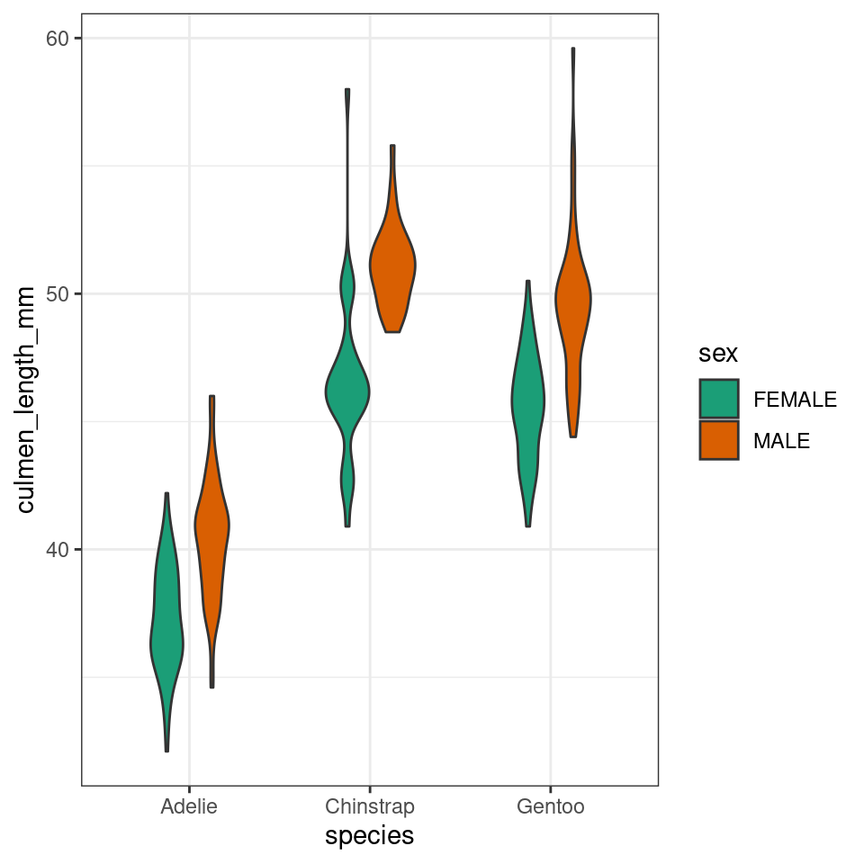

The figures always default to the alphabetical order. Sometimes that is what we want; sometimes that is not what we want. If we wanted to switch the order we would use the `scale_x_discrete()` function and set the limits within it (limits = c("category","category")) as follows:


```r
penguins |> 
  drop_na(sex) |> 
ggplot(aes(x = species, y = culmen_length_mm)) +
  geom_violin(aes(fill = sex),
              width = 0.5)+
  scale_fill_brewer(palette = "Dark2") +
  scale_x_discrete(limits = c("Gentoo","Chinstrap")) 
```

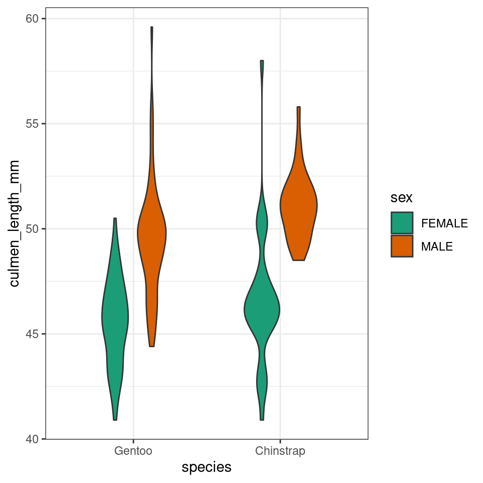

What you can see from this example is that the `scale_*_` arguments actually control what data is plotted - if we wish to zoom in and out on a subsection of a plot, without actually eliminating data we use a different function

### Zooming in and out

We have seen how we can set the parameters for the axes for both continuous and discrete scales.

It can be very beneficial to be able to zoom in and out of figures, mainly to focus the frame on a given section. One function we can use to do this is the `coord_cartesian()`, in ggplot2. The main arguments are the limits on the x-axis `(xlim = c(value, value))`, the limits on the y-axis `(ylim = c(value, value))`, and whether to add a small expansion to those limits or not `(expand = TRUE/FALSE)`.


```r
penguins |> 
  ggplot(aes(x=flipper_length_mm, 
             y = body_mass_g,
             colour=species))+ 
  geom_point()+
  geom_smooth(method="lm",    
              se=FALSE)+
  scale_color_brewer(palette="Set1")+
  coord_cartesian(xlim = c(180,210), ylim = c(3000,4000), expand = FALSE)
```


## Labels

By default, the axis labels will be the column names we gave as aesthetics aes(). We can change the axis labels using the xlab() and ylab() functions. Given that column names are often short and can be cryptic, this functionality is particularly important for effectively communicating results.


```r
## Custom labels ----
penguins |> 
  ggplot(aes(x=flipper_length_mm, 
             y = body_mass_g,
             colour=species))+ 
  geom_point()+
  geom_smooth(method="lm",    
              se=FALSE)+
  scale_color_brewer(palette="Set1")+
  labs(x = "Flipper length (mm)",
       y = "Body mass (g)")
```

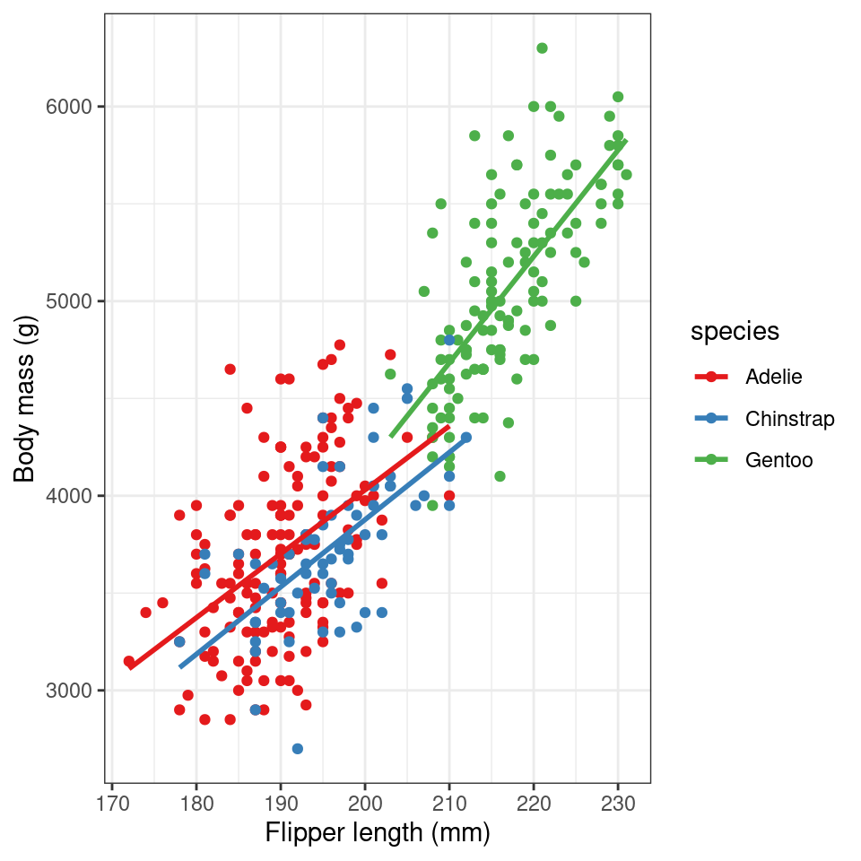

### Titles and subtitles


```r
## Add titles ----
penguins |> 
  ggplot(aes(x=flipper_length_mm, 
             y = body_mass_g,
             colour=species))+ 
  geom_point()+
  geom_smooth(method="lm",    
              se=FALSE)+
  scale_color_brewer(palette="Set1")+
  labs(x = "Flipper length (mm)",
       y = "Body mass (g)",
       title= "Penguin Size, Palmer Station LTER",
       subtitle= "Flipper length and body mass for three penguin species")
```


### Controlling the legend

We have the ability to control legend placement, this can be done by setting `theme(legend.position = ...)` to either "top", "bottom", "left" or "right" as shown:


```r
penguins |> 
  ggplot(aes(x=flipper_length_mm, 
             y = body_mass_g,
             colour=species))+ 
  geom_point()+
  geom_smooth(method="lm",    
              se=FALSE)+
  scale_color_brewer(palette="Set1")+
  labs(x = "Flipper length (mm)",
       y = "Body mass (g)",
       title= "Penguin Size, Palmer Station LTER",
       subtitle= "Flipper length and body mass for three penguin species")+
  theme(legend.position ="top")
```

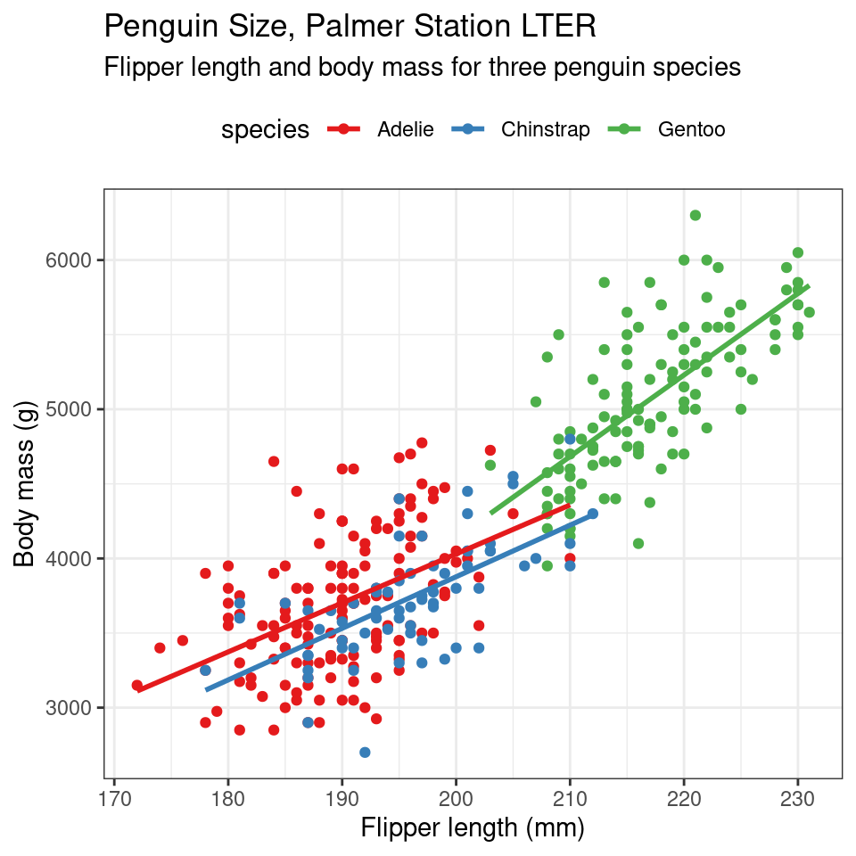

Or even as a coordinate within your figure expressed as a propotion of your figure - i.e. c(x = .8, y = .2) would be the bottom right of your figure


```r
penguins |> 
  ggplot(aes(x=flipper_length_mm, 
             y = body_mass_g,
             colour=species))+ 
  geom_point()+
  geom_smooth(method="lm",    
              se=FALSE)+
  scale_color_brewer(palette="Set1")+
  labs(x = "Flipper length (mm)",
       y = "Body mass (g)",
       title= "Penguin Size, Palmer Station LTER",
       subtitle= "Flipper length and body mass for three penguin species")+
  theme(legend.position = c(.8,.2))
```

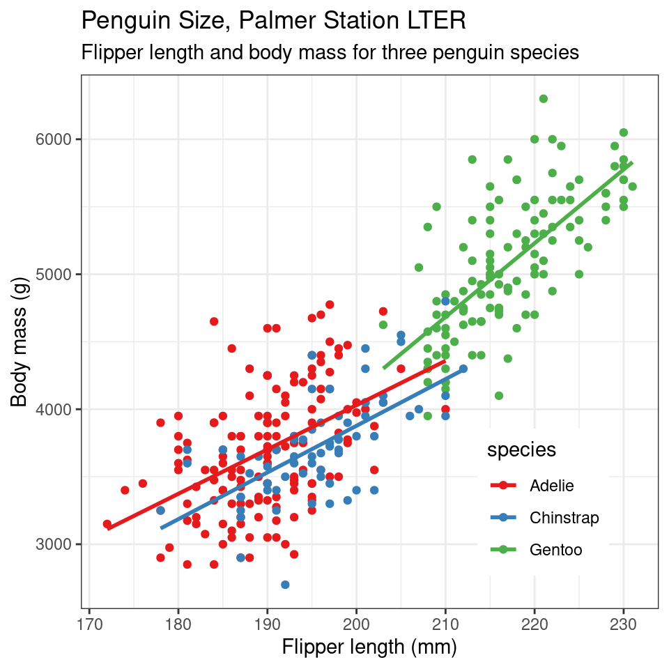

### Controlling redundant legends

This plot shows quite an ugly legend as it plots a layer for the boxplot and the violin at the same time


```r
penguins |> 
  drop_na(sex) |> 
ggplot(aes(x = species, y = culmen_length_mm, fill = species)) +
  geom_violin(width = .5,
              alpha = .4)+
  geom_boxplot(width = .2)+
  scale_fill_brewer(palette = "Dark2") 
```


You can use the `show.legend` argument within the `geom_boxplot()` function and set it to `FALSE`. This will prevent the geom_boxplot from being included in the legend. Here's an example:


```r
penguins |> 
  drop_na(sex) |> 
ggplot(aes(x = species, y = culmen_length_mm, fill = species)) +
  geom_violin(width = .5,
              alpha = .4)+
  geom_boxplot(width = .2,
               show.legend = FALSE)+
  scale_fill_brewer(palette = "Dark2") 
```


And of course - we can agree that the legend is actually redundant here, as the x-axis plots the species names. So we can remove it entirely with the `theme()` function.


```r
penguins |> 
  drop_na(sex) |> 
ggplot(aes(x = species, y = culmen_length_mm, fill = species)) +
  geom_violin(width = .5,
              alpha = .4)+
  geom_boxplot(width = .2)+
  scale_fill_brewer(palette = "Dark2") +
  theme(legend.position = "none")
```


We can also choose to remove specific aesthetics from the legends using `guides()`


```r
penguins |> 
  drop_na(sex) |> 
ggplot(aes(x = species, y = culmen_length_mm, fill = species)) +
  geom_violin(width = .5,
              alpha = .4)+
  geom_boxplot(width = .2)+
  scale_fill_brewer(palette = "Dark2") +
  guides(fill = "none")
```


## Themes

Finally, the overall appearance of the plot can be modified using theme() functions. The default theme has a grey background.
You may prefer `theme_classic()`, a `theme_minimal()` or even `theme_void()`. Try them out.


```r
## Custom themes ----
penguins |> 
  ggplot(aes(x=flipper_length_mm, 
             y = body_mass_g,
             colour=species))+ 
  geom_point()+
  geom_smooth(method="lm",    
              se=FALSE)+
  scale_color_brewer(palette="Set1")+
  labs(x = "Flipper length (mm)",
       y = "Body mass (g)",
       title= "Penguin Size, Palmer Station LTER",
       subtitle= "Flipper length and body mass for three penguin species")+
  theme_void()
```


```r
## Custom themes ----
penguins |> 
  ggplot(aes(x=flipper_length_mm, 
             y = body_mass_g,
             colour=species))+ 
  geom_point()+
  geom_smooth(method="lm",    
              se=FALSE)+
  scale_color_brewer(palette="Set1")+
  labs(x = "Flipper length (mm)",
       y = "Body mass (g)",
       title= "Penguin Size, Palmer Station LTER",
       subtitle= "Flipper length and body mass for three penguin species")+
  theme_void()+
  theme(legend.position = c(.8, .2)) # note theme customisations must come AFTER theme sets or they will be overridden
```

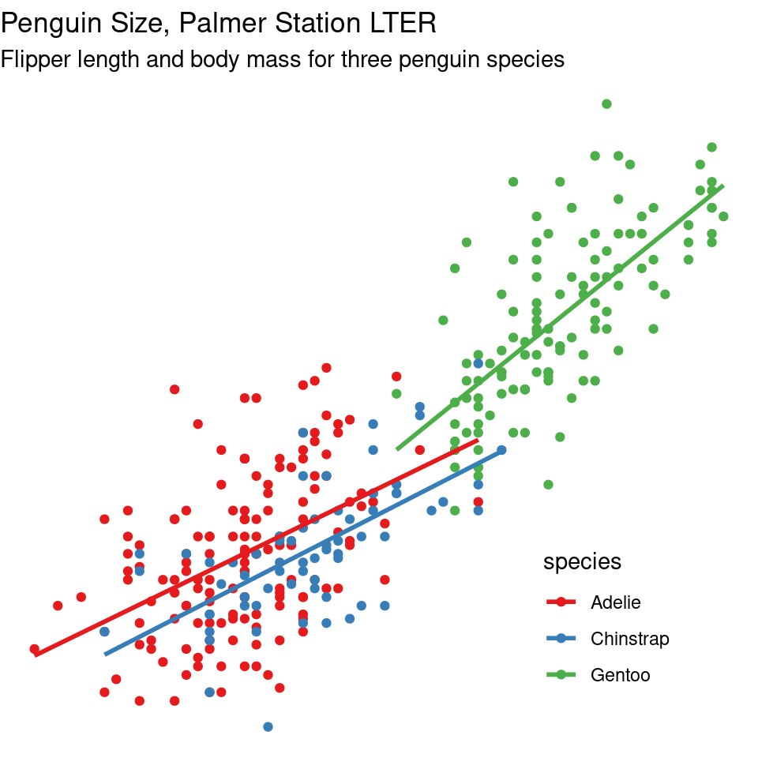

<div class="info">
<p>There is a lot more customisation available through the theme()
function. We will look at making our own custom themes in later
lessons</p>
<p>You can also try installing and running an even wider range of
pre-built themes if you install the R package <a
href="https://yutannihilation.github.io/allYourFigureAreBelongToUs/ggthemes/">ggthemes</a>.</p>
<p>First you will need to run the
<code>install.packages("ggthemes")</code> command. Remember this is one
of the few times a command should NOT be written in your script but
typed directly into the console. That’s because it’s rude to send
someone a script that will install packages on their computer - think of
<code>library()</code> as a polite request instead!</p>
<p>To access the range of themes available type
<code>help(ggthemes)</code> then follow the documentation to find out
what you can do.</p>
</div>


## Multiple plots

### Facets

Adding combinations of different aesthetics allows you to layer more information onto a 2D plot, sometimes though things will just become *too* busy. At the point where it becomes difficult to see the trends or differences in your plot then we want to break up a single plot into sub-plots; this is called ‘faceting’. Facets are commonly used when there is too much data to display clearly in a single plot. We will revisit faceting below, however for now, let’s try to facet the plot according to sex.

To do this we use the tilde symbol ‘~’ to indicate the column name that will form each facet.


```r
## Facetting ----
penguins |> 
  drop_na(sex) |> 
  ggplot(aes(x=flipper_length_mm, 
             y = body_mass_g,
             colour=species))+ 
  geom_point()+
  geom_smooth(method="lm",    
              se=FALSE)+
  scale_color_brewer(palette="Set1")+
  facet_wrap(~sex)
```

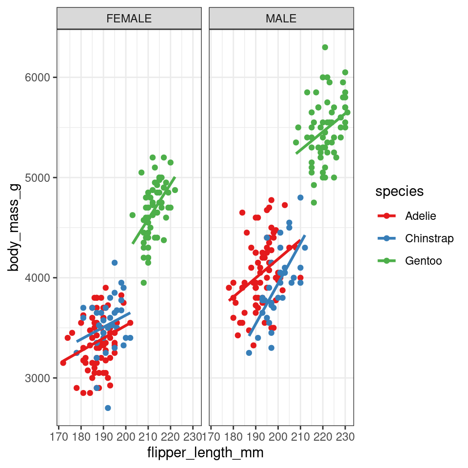

### Patchwork

There are many times you might want to *combine* separate figures into multi-panel plots. Probably the easiest way to do this is with the `patchwork` package (@R-patchwork). 


```r
## Patchwork ----
library(patchwork)

p1 <- penguins |> 
  ggplot(aes(x=flipper_length_mm, 
             y = culmen_length_mm))+
  geom_point(aes(colour=species))+
  scale_color_manual(values=pal)+
  theme_minimal()

p2 <- penguins |> 
  ggplot(aes(x=culmen_depth_mm, 
             y = culmen_length_mm))+
  geom_point(aes(colour=species))+
  scale_color_manual(values=pal)+
  theme_minimal()

p3 <- penguins |>     
  group_by(sex,species) |> 
    summarise(n=n()) |> 
     drop_na(sex) |> 
     ggplot(aes(x=species, y=n)) + 
  geom_col(aes(fill=sex), 
               width=0.8,
               position=position_dodge(width=0.9), 
               alpha=0.6)+
     scale_fill_manual(values=c("darkorange1", "azure4"))+
     theme_classic()

 (p1+p2)/p3+
  plot_layout(guides = "collect") 
```


## Fonts

You can customise the fonts used in themes. All computers should be able to recognise the families "sans", "serif", and "mono", and some computers will be able to access other installed fonts by name.

The easiest way to add lots of custom fonts is with `showtext`. 

The second argument, family, is optional. It gives the family name of the font that will be used in R. In other words, it means that the name used to refer to the font in R does not need to be the same than the original name of the font. In this case, the font Special Elite is going to be the special family.

`showtext_auto()` must be called to indicate that showtext is going to be automatically invoked to draw text whenever a plot is created.


```r
library(showtext)
font_add_google("Special Elite", family = "special")
showtext_auto()
```

## Activity: Replicate this figure

<div class="try">
<p>How close can you get to replicating the figure below?</p>
<p>Make a NEW script for this assignment - replicate_figure.R</p>
<p>Make sure to use the tips and links at the end of this chapter, when
you are done save the file</p>
</div>

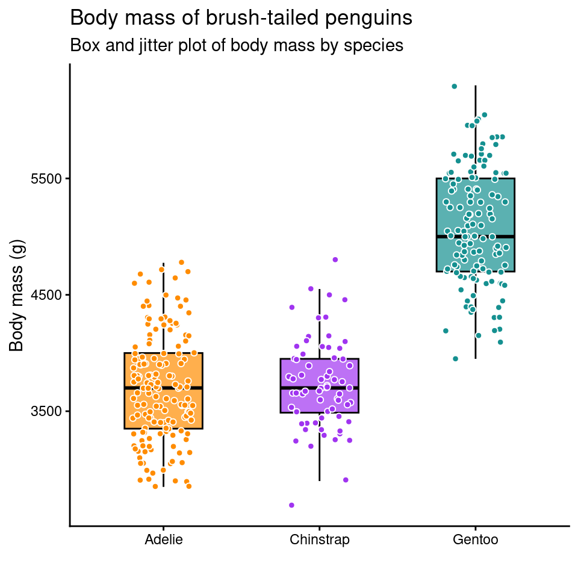


<div class='webex-solution'><button>Solution</button>


```r
pal <- c(
  "Adelie" = "#FF8C00", 
  "Chinstrap" = "#A034F0", 
  "Gentoo" = "#159090")

penguins |> 
  ggplot(aes(x = species, y = body_mass_g, color = species, fill = species)) +
      geom_boxplot(aes(fill = species),
               colour = "black",
        width = .5,
        outlier.shape = NA,
        alpha = .7)+
  geom_jitter(width =.2,
              shape = 21,
              colour = "white")+
  scale_fill_manual(values = pal)+
  scale_colour_manual(values = pal)+
  theme_classic()+
  theme(legend.position = "none")+
    labs(
    x = "",
    y = "Body mass (g)",
    title = "Body mass of brush-tailed penguins",
    subtitle = "Box and jitter plot of body mass by species")
```


</div>


## Saving

One of the easiest ways to save a figure you have made is with the `ggsave()` function. By default it will save the last plot you made on the screen. 

You should specify the output path to your **figures** folder, then provide a file name. Here I have decided to call my plot *plot* (imaginative!) and I want to save it as a .PNG image file. I can also specify the resolution (dpi 300 is good enough for most computer screens).


```r
# OUTPUT FIGURE TO FILE

ggsave("outputs/YYYYMMDD_ggplot_workshop_final_plot.png", dpi=300)
```

<div class="try">
<p>If you got this far and still have time why not try one of the
following:</p>
<ol style="list-style-type: decimal">
<li><p>Making another type of figure using the penguins dataset, use the
further reading below to use for inspiration.</p></li>
<li><p>Use any of your own data</p></li>
</ol>
</div>


### What we learned

You have learned

* The anatomy of ggplots

* How to add geoms on different layers

* How to use colour, colour palettes, facets, labels and themes

* Putting together multiple figures

* How to save and export images


## Further Reading, Guides and tips on data visualisation

* [R Cheat Sheets](https://www.rstudio.com/resources/cheatsheets/)

* [Fundamentals of Data Visualization](https://clauswilke.com/dataviz/): this book tells you everything you need to know about presenting your figures for accessbility and clarity

* [Beautiful Plotting in R](https://www.cedricscherer.com/2019/08/05/a-ggplot2-tutorial-for-beautiful-plotting-in-r/): an incredibly handy ggplot guide for how to build and improve your figures

* [The ggplot2 book](https://ggplot2-book.org/): the original Hadley Wickham book on ggplot2


# Extensions for ggplot2


This tutorial has but scratched the surface of the visualisation options available using R. Here I have provided some further advanced plots and customisation options for those who are feeling confident with the content covered in this tutorial. However, the below plots give an idea of what is possible.

Check out https://exts.ggplot2.tidyverse.org/ for the full list of approved extensions for ggplot

## ggdist

### Rainclouds

Raincloud plots combine a density plot, boxplot, raw data points, and any desired summary statistics for a complete visualisation of the data. They are so called because the density plot plus raw data is reminiscent of a rain cloud.


```r
library(ggdist)

penguins |> 
    ggplot(aes(x = species,
               y = culmen_length_mm,
              fill = species)) +
  ggdist::stat_halfeye(
    point_colour = NA,
    .width = 0,
    # shift raincloud up
    justification = -.2)+
  geom_boxplot(# remove outlier dots
    outlier.shape = NA,
    # shrink width of box
    alpha = .4,
    # fade box
               width = .1)+
  ggdist::stat_dots(aes(colour = species),
                  # put dots underneath
                    side = "left",
                  # move position down
                    justification = 1.1,
                  # size of dots 
                    dotsize = .2,
                    
                  # adjust bins (grouping) of dots
                    binwidth = .4)+
  scale_fill_manual(values = pal) +
  scale_colour_manual(values = pal)+
  guides(fill = "none")+
  coord_flip() # rotate figure
```


### Interval plots

An interval plot is a type of data visualization that is used to display intervals or ranges associated with data points. It is particularly useful for visualizing uncertainty or variability in the data. Interval plots can be used to represent various types of intervals, such as confidence intervals, prediction intervals, or any other kind of range or interval associated with the data. 


```r
penguins |> 
  drop_na(sex) |> 
    ggplot(aes(x = species,
               y = culmen_length_mm))+
  ggdist::stat_interval(.width = c(.5, .66, .95))+
  ggdist::stat_halfeye(aes(fill = sex),
                       .width = 0,
                       shape = 21,
                       colour = "white",
                       slab_alpha = .4,
                       size = .5,
                       position = position_nudge(x = .05))+
  scale_color_viridis_d(option = "mako", direction = -1, end = .9)
```


## Density

A density plot is a data visualization technique used to represent the distribution of a continuous numeric variable. It provides a smoothed estimate of the probability density function (PDF) of the data, showing where values are concentrated and where they are sparse. Density plots are particularly useful for visualizing the shape, central tendency, and spread of data.


```r
library(ggdensity)

penguins |>  
    ggplot(aes(x = culmen_length_mm, 
               y = culmen_depth_mm,
               colour = species)) +
  geom_point(alpha = .2) +
  ggdensity::geom_hdr_lines()+
   scale_colour_manual(values = pal)
```


## ggridges

A ridge plot is a data visualization technique that is similar to a density plot but is designed for displaying multiple probability density distributions side by side, allowing for easier comparison between different groups or categories. Ridge plots are particularly useful when you want to visualize and compare the distribution of multiple continuous variables or data sets simultaneously.


```r
library(ggridges)

penguins |>  
    ggplot(aes(x = culmen_length_mm, 
               y = species,
               fill = species)) +
  geom_density_ridges() + # use hjust and vjust to position text
  scale_fill_manual(values = pal) +
  scale_colour_manual(values = pal)+
  theme(legend.position = "none")
```


## Bump charts

A bump chart, also known as a line chart or path chart, is a data visualization technique used to show the ranking and changes in ranking of entities (such as teams, players, or products) over time or across different categories. Bump charts are especially useful for visualizing the rise and fall of ranked items, making it easy to identify trends and compare changes in relative position.


```r
library(ggbump)

penguin_summary <- penguins |> 
  mutate(date_egg = dmy(date_egg)) |> 
  filter(clutch_completion == "Yes") |> 
  mutate(year = year(date_egg)) |> 
  group_by(species, year) |> 
  summarise(n = n())

penguin_summary |>
  ggplot(aes(x = year, 
             y = n,
             colour = species))+
  geom_point(size = 7)+
  geom_bump()+
  geom_text(data = penguin_summary |> filter(year == max(year)),
                                             aes(x = year + 0.1,
                                                 label = species,
                                                  hjust = 0),
            size = 5)+
  scale_x_continuous(limits = c(2007, 2009.5),
                     breaks = (2007:2009))+
  labs(y = "Total number of complete clutches")+
  scale_fill_manual(values = pal) +
  scale_colour_manual(values = pal)+
  theme(legend.position = "none")
```


## Dumbell charts

A dumbbell chart is a data visualization technique that is used to compare two data points for multiple categories or entities. It is called a "dumbbell" chart because it often resembles a pair of dumbbells, with circles or dots representing the data points at the ends of a line connecting them. Dumbbell charts are useful for comparing before-and-after values, two different groups, or any two related data points for different categories or entities.


```r
library(ggalt)

summary_counts <- penguins |> 
  group_by(sex, species) |> 
  summarise(mean = mean(body_mass_g, na.rm = T)) |> 
  pivot_wider(names_from = sex, values_from = mean)

ggplot(summary_counts, 
       aes(y=species, x=FEMALE, xend=MALE)) +
  geom_dumbbell(size=3, color="#e3e2e1",
                colour_x = "#5b8124", colour_xend = "#bad744") +
  geom_text( x=summary_counts[[3,2]], y=3, aes(label="Female"),
             color="#9fb059", size=3, vjust=-2, fontface="bold")+
  geom_text(x=summary_counts[[3,3]], y=3, aes(label="Male"),
             color="#bad744", size=3, vjust=-2, fontface="bold")+
  labs(x = "Body mass (g)",
       y = "")
```

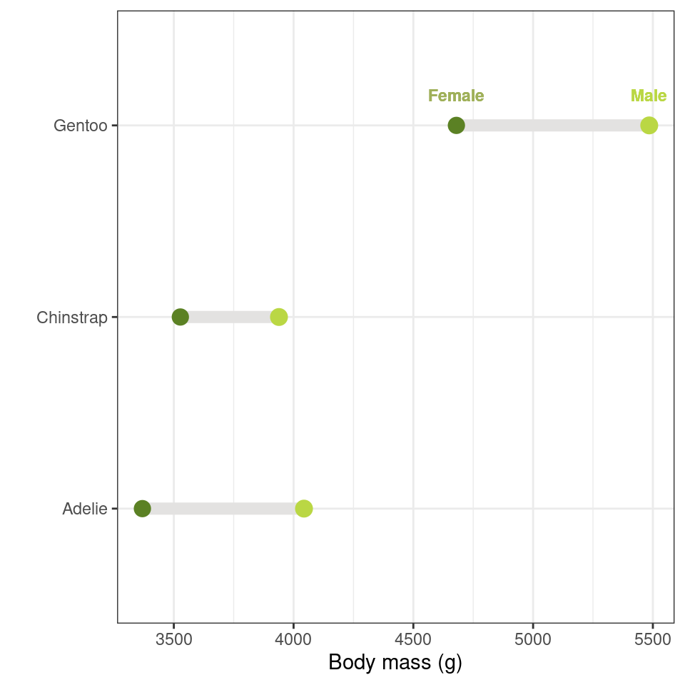

## Facets

The `facet_nested()` function in the `ggh4x` package is used for creating nested or hierarchical faceting in ggplot2 plots. Faceting is the process of breaking down a data visualization into multiple subplots or panels based on one or more categorical variables, allowing you to see how the data behaves within different categories. Nested faceting allows you to further subdivide these panels into smaller panels, creating a hierarchy of facets.


```r
library(ggh4x)

penguins |> 
  mutate(Nester = ifelse(species=="Gentoo", "Crustaceans", "Fish & Krill")) |> 
  ggplot(aes(x = culmen_length_mm,
             y = culmen_depth_mm,
             colour = species))+
  geom_point()+
  facet_nested(~ Nester + species)+
  scale_colour_manual(values = pal)+
  theme(legend.position = "none")
```

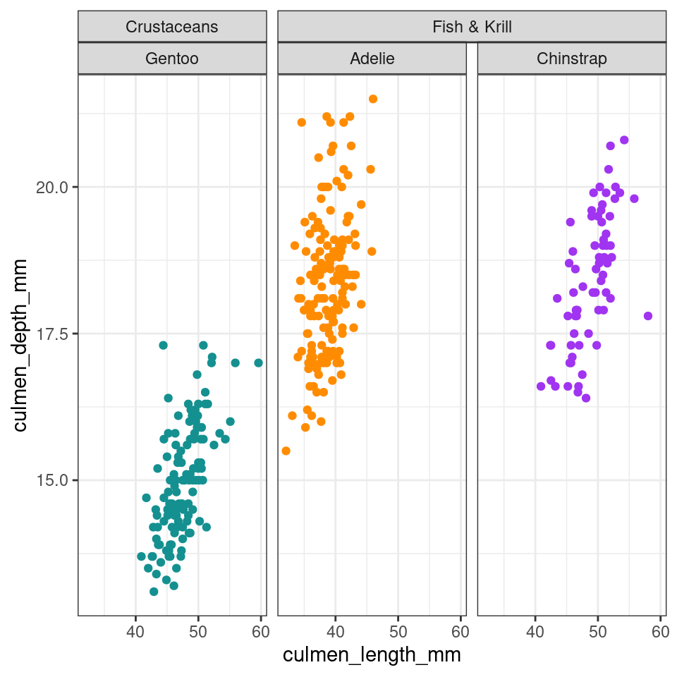

## Highlighting

Using plot highlighting, such as the gghighlight package in R, can be beneficial in data visualization for several reasons:

- Emphasizing Key Information: Plot highlighting allows you to draw attention to specific data points or groups of interest. This can be helpful when you want to highlight outliers, key observations, or certain categories that are important in your data.

- Enhanced Interpretation: Highlighting specific elements in a plot can make it easier for viewers to interpret and understand the data. By reducing visual clutter and emphasizing relevant information, you can improve the effectiveness of your data visualization.

- Storytelling: Plot highlighting is a useful tool for storytelling in data visualization. You can use it to guide the viewer's attention and convey the main message or story behind the data.

- Comparative Analysis: Highlighting allows you to compare specific data points or groups more easily. For example, you can highlight one group against others to demonstrate differences or trends.


```r
library(gghighlight)

penguins |> 
  ggplot(aes(body_mass_g,
             fill = species),
         position = "identity")+
  geom_histogram()+
  gghighlight()+
  scale_fill_manual(values = pal)+
  facet_wrap(~ species)
```

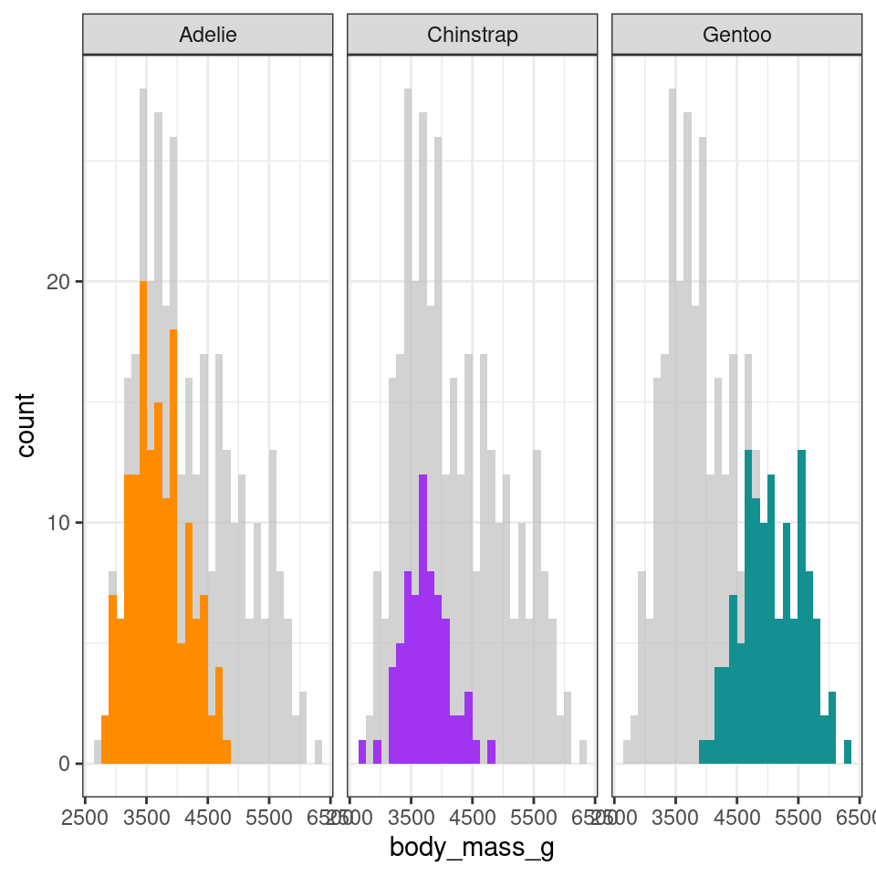


```r
library(ggbeeswarm)
library(gghighlight)
penguins |> 
    ggplot(aes(x = species,
               y = body_mass_g,
               fill = species))+
    geom_beeswarm(shape = 21, 
                  colour = "white")+
    scale_fill_manual(values = pal)+
    gghighlight(body_mass_g > 4000)
```


## Text

Annotating a chart with text is a common and valuable practice in data visualization for several important reasons:

- Provide Context: Text annotations help to provide context and background information for the data. They explain what the chart represents, the variables involved, and the meaning of various data points or patterns. This context is crucial for viewers who may not be familiar with the data or the chart.

- Highlight Key Points: Text annotations can be used to emphasize and draw attention to important findings or insights in the data. You can use annotations to highlight specific data points, trends, outliers, or other notable features in the chart.

- Label Data: Annotating a chart with labels helps to identify individual data points, data series, or categories. This is especially useful in scatterplots, bar charts, and other types of visualizations where labeling individual elements is important.

- Clarify Relationships: Annotations can be used to clarify relationships between data points or groups. For example, you can add arrows and labels to indicate which data points are related or what causes certain patterns.

- Provide Sources and Citations: In cases where the data comes from external sources or studies, annotations can be used to provide proper attribution and citations to give credit to the data sources.

- Explain Methodology: Annotations can also explain the methodology or statistical techniques used to generate the chart, which is important for transparency and trust in data analysis.

Below I provide some packages that help with text annotation:

### ggforce


```r
penguins |> 
    ggplot(
        aes(x = culmen_length_mm,
            y= body_mass_g,
            colour = species)) +
    geom_point(aes(fill = species), shape = 21, colour = "white") +
    geom_smooth(method = "lm", se = FALSE,linetype = "dashed", alpha = .4)+
ggforce::geom_mark_ellipse(aes(
    label = species,
    filter = species == 'Adelie'),
    con.colour  = "#526A83",
    con.cap = 0,
    con.arrow = arrow(ends = "last",
                      length = unit(0.5, "cm")),
    show.legend = FALSE) +
    gghighlight(species == "Adelie")+
  scale_colour_manual(values = pal)+
  scale_fill_manual(values = pal)
```

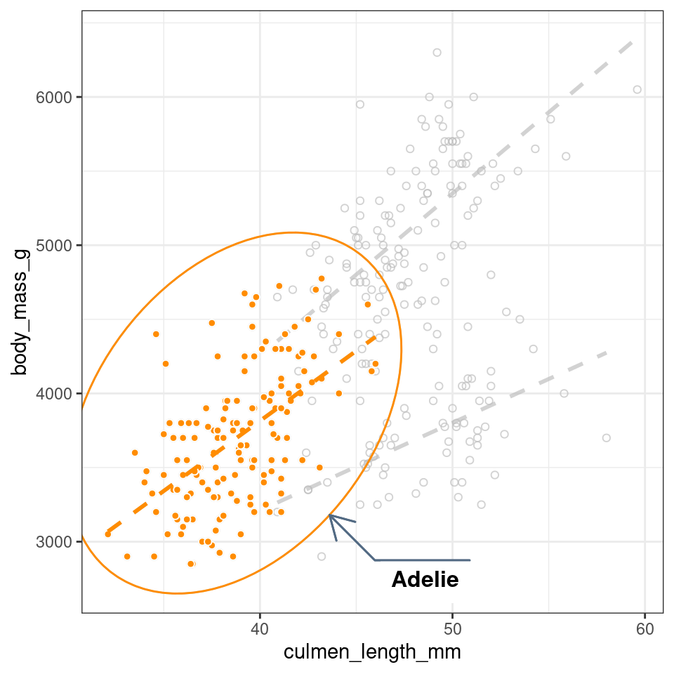

### textpaths


```r
library(geomtextpath)

penguins |> 
    ggplot(aes(x = culmen_length_mm, 
               colour = species,
               label = species))+
  geom_textdensity( hjust = 0.35, vjust = .1)+ # use hjust and vjust to position text
  theme(legend.position = "none")
```


### ggtext


```r
library(ggtext)


penguins |> 
  mutate(species = fct_relevel(species, "Chinstrap", "Gentoo", "Adelie")) |> 
  group_by(species) |> 
    summarise(n=n()) |> 
ggplot(aes(x = species,
           y = n,
           fill = species))+
        geom_col()+
  geom_label(aes(label = n),
            fill = "white",
            nudge_y = 1,
            colour = "black",
            fontface = "bold")+
  labs(x = "",
       y = "Count",
       title = paste(
         'There are almost half the observations on <br> <span style = "color:#A034F0">Chinstrap</span> penguins,  as there are <br> on <span style = "color:#FF8C00">Adelie</span> and <span style ="color:#159090">Gentoo</span>penguins'
       ))+
  scale_fill_manual(
    # when reordering levels - be careful about keeping colours consistent!!! May need manually sorting
    values = pal)+
  coord_flip()+
  scale_y_continuous(limits = c(0, 200))+
  theme(legend.position = "none",
        axis.text.y = element_text(
      color = c( "#A034F0", "#159090", "#FF8C00")),
      plot.title = element_markdown())
```

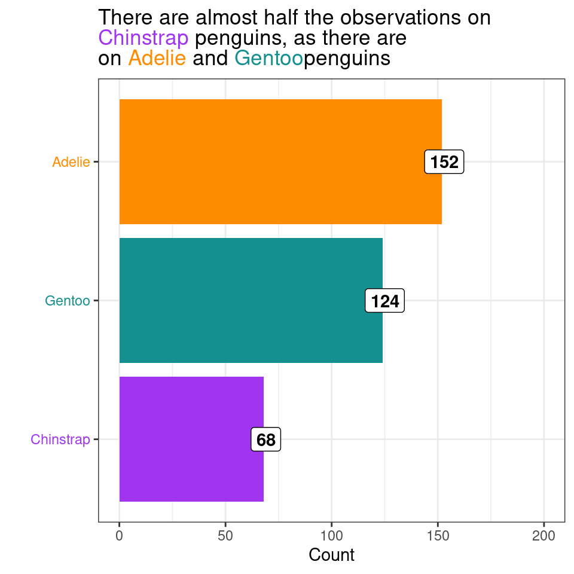


### scales

The `scales`package provides much of the infrastructure that underlies ggplot2’s scales, and using it allow you to customize the transformations, breaks, and labels used by ggplot2. It is particularly good at providing sensible labels apply transformations such as a log scale. 


```r
library(scales)

penguins |>  
    ggplot(aes(x = culmen_length_mm, 
               y = species,
               fill = species)) +
  geom_density_ridges() + # use hjust and vjust to position text
  scale_fill_manual(values = pal) +
  scale_colour_manual(values = pal)+
  theme(legend.position = "none") +
  scale_x_continuous(labels = label_number(
    scale_cut = cut_si("mm")))+
  labs( x = "Bill length",
        y = "Species")
```

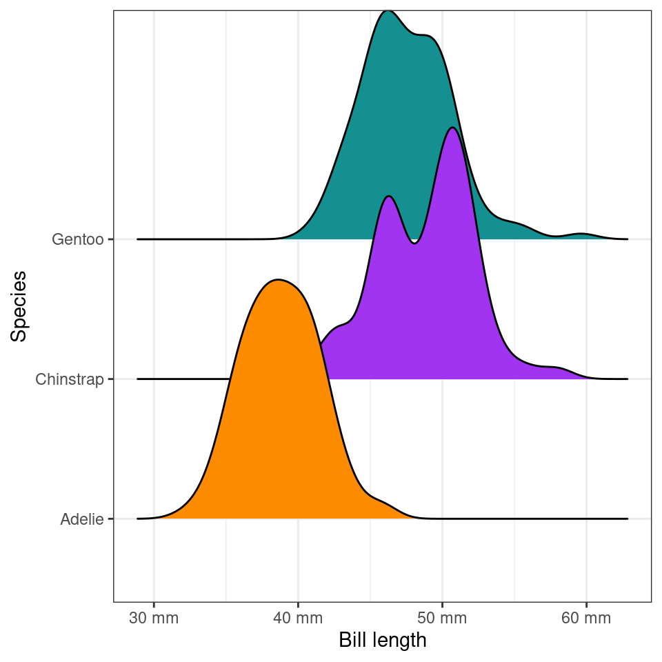

Here is a good example of the `scales` package in action.

The distribution of GDP per capita in the `gapminder` dataset is heavily skewed, with most countries reporting less than $10,000. As a result, the scatterplot makes an upside-down L shape. Try sticking a regression line on that and you’ll get in trouble.


```r
library(gapminder)
gapminder |> 
  filter(year == 2007) |> 
ggplot(aes(x = gdpPercap, y = lifeExp, color = continent)) +
  geom_point() +
  guides(color = "none") +
  labs(title = "GDP per capita",
       subtitle = "GDP per capita raw values")
```


Fit this onto a log scale (R's standard log function is the natural log). And we get a straighter line but some ugly axis labels.


```r
gapminder |> 
  filter(year == 2007) |> 
ggplot(aes(x = log(gdpPercap), y = lifeExp, color = continent)) +
  geom_point() +
  guides(color = "none") +
  labs(title = "GDP per capita, natural log (base e)",
       subtitle = "GDP per capita logged manually")
```

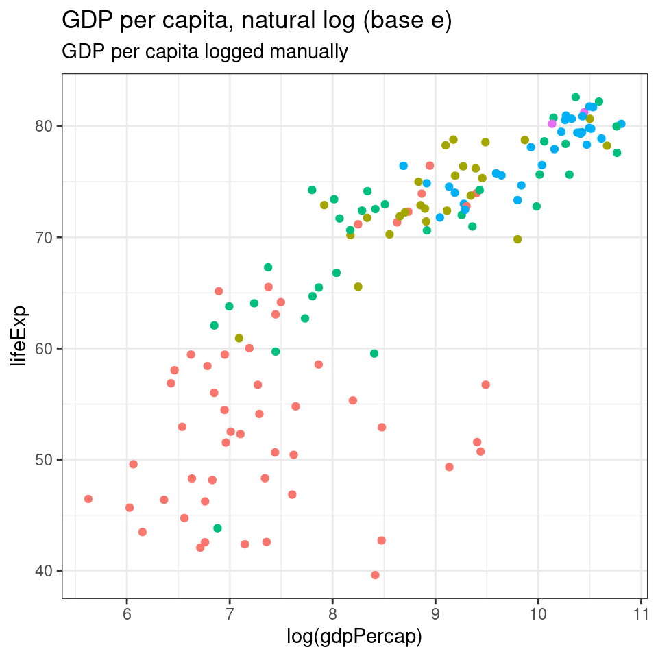

GGplot has a `scale_x/y_log10` scale but this applues the wrong transformation to our data - in this particular example there is little difference in the range of values when using a `log10` vs `log` transformation (as we will see in a moment).


```r
gapminder |> 
  filter(year == 2007) |> 
ggplot(aes(x = gdpPercap, y = lifeExp, color = continent)) +
  geom_point() +
  guides(color = "none") +
  labs(title = "GDP per capita, log (base 10)",
       subtitle = "GDP per capita logged with scale") +
  scale_x_log10()
```

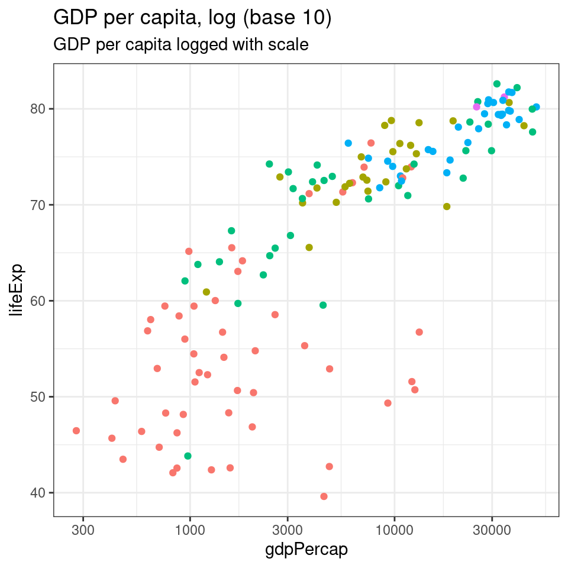

But we can set whatever custom transformation we wish


```r
log_natural <- trans_new(
  name = "logn",
  transform = function(x) log(x),
  inverse = function(x) exp(x),
  breaks = log_breaks()
)

gapminder |> 
  filter(year == 2007) |> 
ggplot(aes(x = gdpPercap, y = lifeExp, color = continent)) +
  geom_point() +
  guides(color = "none") +
  labs(title = "GDP per capita, natural log (base e)",
       subtitle = "GDP per capita logged manually") +
  scale_x_continuous(trans = log_natural,
                     labels = label_dollar(accuracy = 1))
```

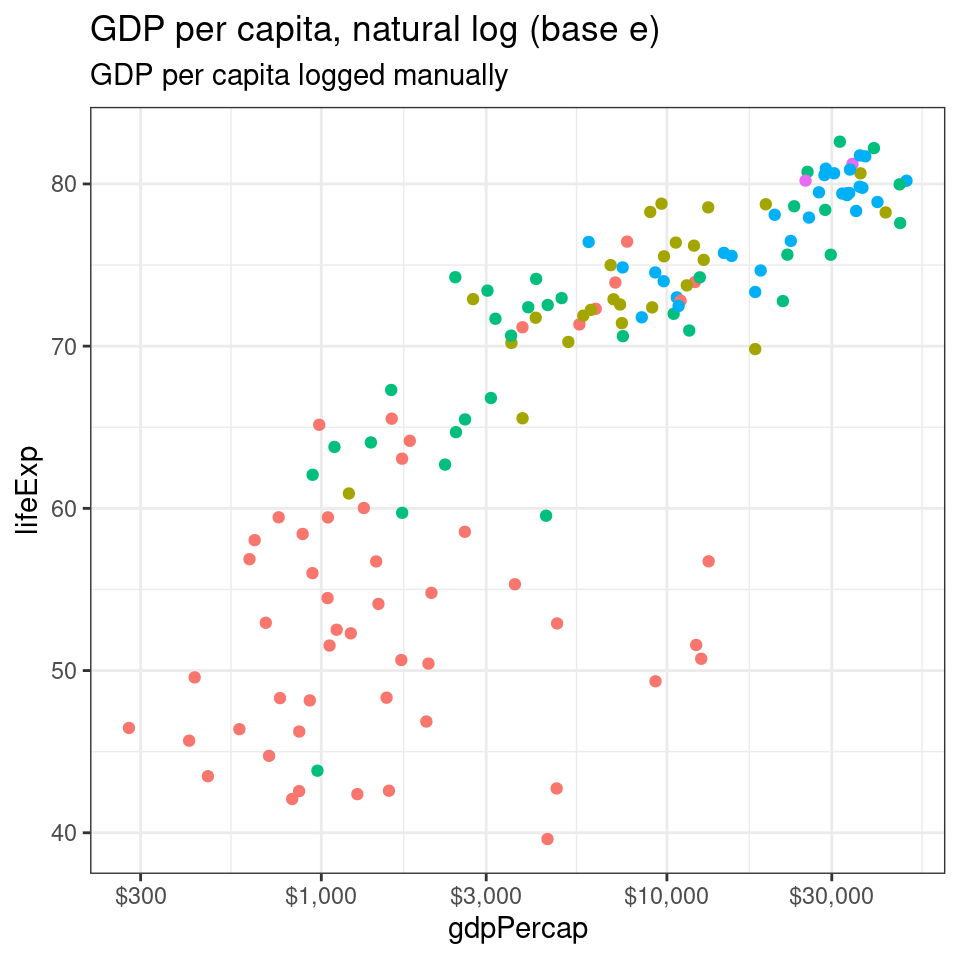


## Maps

Working with maps can be tricky. The `sf` package provides functions that work with ggplot2, such as `geom_sf()`. The `rnaturalearth` package provides high-quality mapping coordinates.


```r
library(sf)          # for mapping geoms
library(rnaturalearth) # for map data

# get and bind country data
uk_sf <- ne_states(country = "united kingdom", returnclass = "sf")
ireland_sf <- ne_states(country = "ireland", returnclass = "sf")
islands <- bind_rows(uk_sf, ireland_sf) %>%
  filter(!is.na(geonunit))

# set colours
country_colours <- c("Scotland" = "#0962BA",
                     "Wales" = "#00AC48",
                     "England" = "#FF0000",
                     "Northern Ireland" = "#FFCD2C",
                     "Ireland" = "#F77613")

ggplot() + 
  geom_sf(data = islands,
          mapping = aes(fill = geonunit),
          colour = NA,
          alpha = 0.75) +
  coord_sf(crs = sf::st_crs(4326),
           xlim = c(-10.7, 2.1), 
           ylim = c(49.7, 61)) +
  scale_fill_manual(name = "Country", 
                    values = country_colours)
```

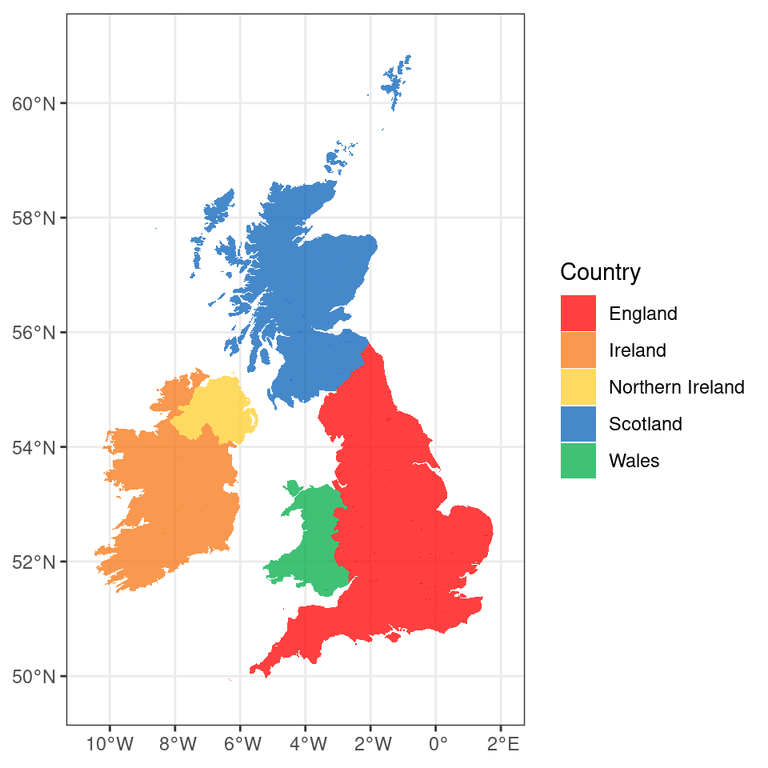

## Layouts and compositions

Having control over layouts allow you to tailor the appearance of your plot to match your specific needs and preferences. You can control every aspect of the plot's design, including the arrangement of facets, legends, titles, and labels. When you need to create complex composite plots that combine multiple geoms and facets, custom layouts enable you to precisely position and arrange them. 


```r
library(patchwork)
library(png)
library(ggpubr)

penguin_pic <- png::readPNG("images/lter_penguins.png")

penguin_fig <- ggplot() +
  background_image(penguin_pic)
```


```r
text <- tibble(
  x = 0, y = 0, label = 'Simpsons Paradox is a statistical phenomenon where an association between two variables in a population emerges, disappears or reverses when the population is divided into subpopulations such as <span style = "color:#FF8C00">Adelie</span>, <span style ="color:#159090">Gentoo</span>, and <span style = "color:#A034F0">Chinstrap</span> penguin species'
)


pt <- ggplot(text, aes(x = x, y = y)) +
  ggtext::geom_textbox(
    aes(label = label),    # Map the 'label' column from the 'text' data to the text labels
    box.color = NA,         # Make the text box border color transparent
    width = unit(10, "lines"),  # Set the width of the text boxes to 15 lines
    color = "grey40",       # Set the text color to a light gray
    size = 3,             # Set the text size to 4 (adjust as needed)
    lineheight = 1.4        # Set the line height for text within the boxes
  ) +
  # Customize the plot coordinate system
  coord_cartesian(expand = FALSE, clip = "off") +

  # Apply a theme with a blank (void) background
  theme_void()

pt
```


```r
layout <- "
AACCC
AACCC
BBDDD
BBDDD
"

p1 <- ggplot(penguins, aes(x= culmen_length_mm, 
                     y= culmen_depth_mm)) +
    geom_point()+
  geom_smooth(method="lm",
              se=FALSE)+
  theme(legend.position="none")+
    labs(x="Bill length (mm)",
         y="Bill depth (mm)")

p2 <- ggplot(penguins, aes(x= culmen_length_mm, 
                     y= culmen_depth_mm,
                     colour=species)) +
    geom_point()+
  geom_smooth(method="lm",
              se=FALSE)+
  scale_colour_manual(values=pal)+
  theme(legend.position="none")+
    labs(x="Bill length (mm)",
         y="Bill depth (mm)")

p1 + p2 + 
  pt +  penguin_fig + 
  plot_layout(design = layout)
```

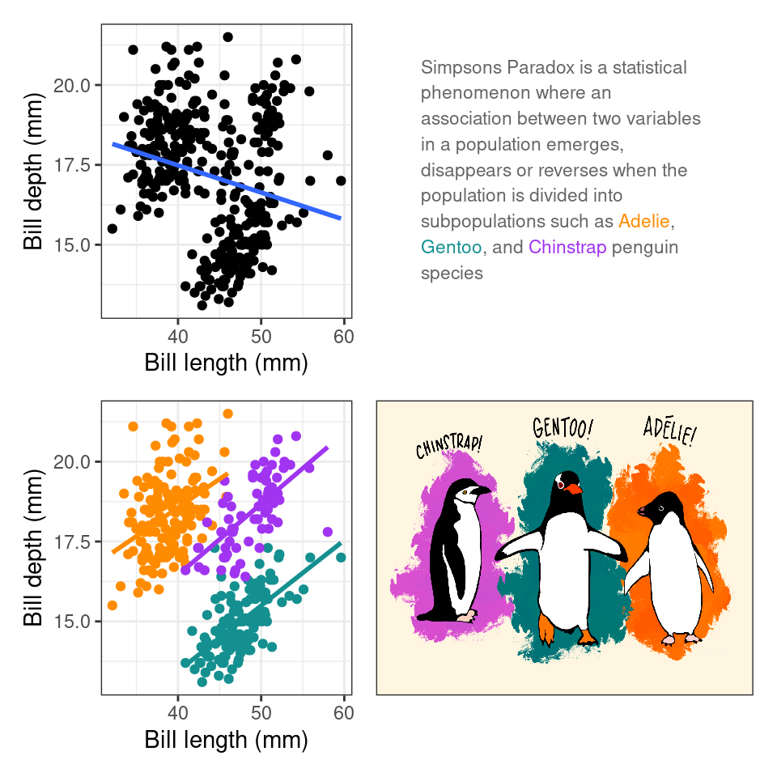


## Activity: Create a Publication-Style Multi-Panel Figure

Objective: Design and create a multi-panel data visualization figure in the style of a research publication. This exercise will challenge your skills in data visualization, data manipulation, and creating complex figures.

Steps:

- Choose a Dataset: Select a dataset that is suitable for creating a multi-panel figure. It could be related to a scientific research topic, public data (e.g., from government sources or data repositories), or any other dataset that interests you.

- Data Preprocessing: Use dplyr and tidyr to preprocess the data. You may need to aggregate, filter, or reshape the data to fit the structure you want for your figure.

- Design the Figure: Decide on the structure of your multi-panel figure. You could create subplots or facets to represent different aspects of the data. For example, you might have multiple box plots, scatter plots, or other visualizations arranged in a grid.

- Create the Plot: Use ggplot2 to create the individual panels or subplots. Customize the appearance of each panel, including labels, colors, and titles.

- Combine the Panels: Use the patchwork package or another method to arrange the individual panels into a single figure. This may involve adjusting the layout, labeling, and legends to make the figure coherent.

- Add Annotations: Add relevant annotations to the figure, such as titles, subtitles, captions, and any necessary notes to explain the data or results.

- Customize the Theme: Apply a custom theme to the entire figure. You can modify fonts, colors, grid lines, and other elements to match the style of a publication.


Tips:

Plan your figure carefully, considering what story or message you want to convey.
Experiment with different geoms, scales, and themes to achieve the desired visual effect.
Use effective data visualization principles, such as avoiding misleading scales, providing clear labels and legends, and ensuring that the figure is accessible to a wide audience.


# Custom ggplot themes

It is often the case that we start to default to a particular 'style' for our figures, or you may be making several similar figures within a research paper. Creating custom functions can extend to making our own custom ggplot themes. You have probably already used theme variants such as `theme_bw()`, `theme_void()`, `theme_minimal()` - these are incredibly useful, but you might find you still wish to make consistent changes. 


```r
plot <- penguins |> 
  drop_na(sex) |> 
ggplot(aes(x = species, y = culmen_length_mm, fill = species)) +
  geom_violin(width = .5,
              alpha = .4)+
  geom_boxplot(width = .2)+
  scale_fill_brewer(palette = "Dark2") 

plot
```

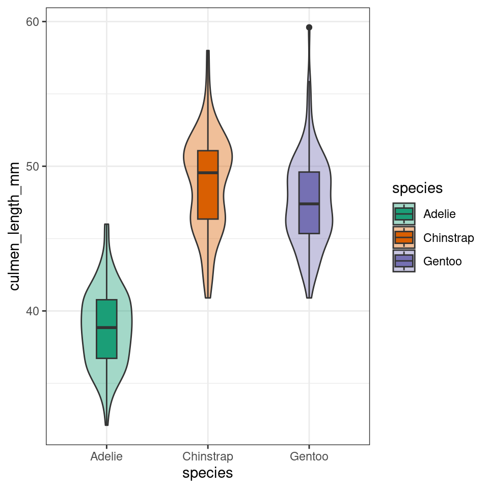

With the addition of a title and `theme_classic()` we can improve the style quickly


```r
plot+
  ggtitle("Comparison of bill lengths by species in Palmer Penguins")+
  labs(x = "",
       y = "Bill length (mm)")+
  theme_classic()
```

But I **still** want to make some more changes, rather than do this work for one figure, and potentially have to repeat this several times for subsequent figures, I can decide to make a new function instead. See [here](https://ggplot2.tidyverse.org/reference/theme.html) for a full breakdown of the arguments for the `theme()` function. 

<div class="info">
<p>Note when using a pre-set theme, and then modifying it further, it is
important to get the order of syntax correct e.g</p>
<p>theme_classic + theme() # is correct</p>
<p>theme() + theme_classic() # will not work as intended</p>
</div>


```r
# custom theme sets defaults for font and size, but these can be changed without changing the function
theme_custom <- function(base_size=12, base_family="serif"){
  theme_classic(base_size = base_size, 
                base_family = base_family,
                )  %+replace%
# update theme minimal 
theme(
  # specify default settings for plot titles - use rel to set titles relative to base size
  plot.title=element_text(size=rel(1.5),
      face="bold",
      family=base_family),
  #specify defaults for axis titles
  axis.title=element_text(
    size=rel(1),
    family=base_family),
  # specify position for y axis title
  axis.title.y=element_text(angle = 90,
                            margin = margin(r = 10, l= 10)),
  # specify position for x axis title
  axis.title.x = element_text(margin = margin(t = 10, b = 10)),
  # set major y grid lines
  panel.grid.major.y = element_line(colour="gray", size=0.5),
  # add axis lines
  axis.line=element_line(),
   # Adding a 0.5cm margin around the plot
  plot.margin = unit(c(0.2, 0.5, 0.5, 0.5), units = , "cm"),    
   # Setting the position for the legend
  legend.position = "none"             
)
  
}
```

With this function set, I can now use it for as many figures as I wish. To use it in the future I should probably save it in a unique script, with a clear title and comments for future use. 

I could then easily use `source("custom_theme_function.R")` to make this available to any scripts I was using. 


```r
plot+
  ggtitle("Comparison of bill lengths\n by species in Palmer Penguins")+
  labs(x = "",
       y = "Bill length (mm)")+
  theme_custom()
```

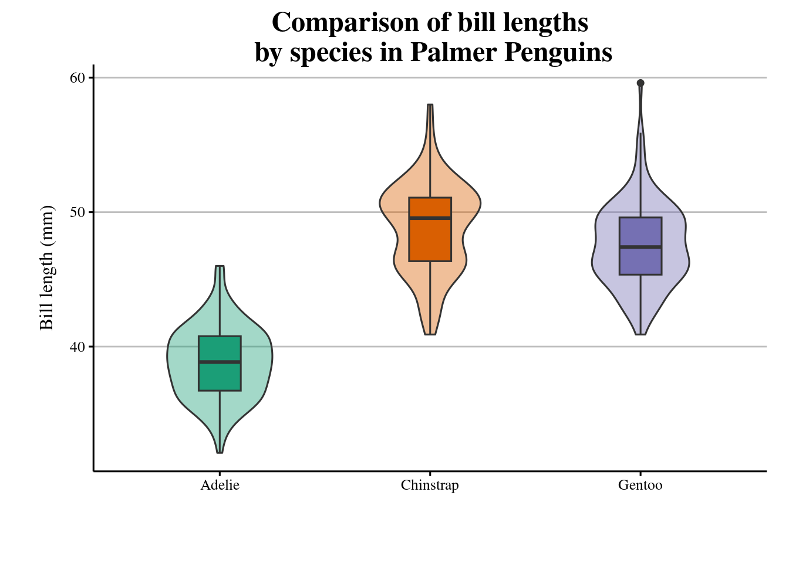


# Making tables with gt

In this chapter, we will accomplish two main objectives:

1. Acquire fundamental principles for creating improved tables.

2. Apply these principles using the `gt` package.
Naturally, to put these ideas into practice, we'll utilize the fantastic penguins dataset from `palmerpenguins` since I have a preference for penguins.

PROS: Why `gt`? Has a grammar of tables, like `ggplot2`, supports HTML, Latex and RTF, followstidyverse conventions.

CONS: Still quite new, syntax is changing and developing. 

For these tutorials we will use the `gt` package and helpers provided by `gtExtras`.

To follow along when you run a section of code, look for the output in the **Viewer Pane**


```r
library(gt)
library(gtExtras)
```

Let's use this dataset to tally the penguins. These counts will provide us with a straightforward dataset to use for practicing table construction. You will need your cleaned penguins dataframe from Day One.


```r
penguin_counts <- penguins |> 
  drop_na(sex) |> 
  mutate(year = as.character(year)) |> 
  mutate(sex = str_to_lower(sex)) |> 
  group_by(species, island, sex, year) |> 
  summarise(n = n(), .groups = "drop")

penguin_counts
```

<div class="kable-table">

|species   |island    |sex    |year |  n|
|:---------|:---------|:------|:----|--:|
|Adelie    |Biscoe    |female |2007 |  5|
|Adelie    |Biscoe    |female |2008 |  9|
|Adelie    |Biscoe    |female |2009 |  8|
|Adelie    |Biscoe    |male   |2007 |  5|
|Adelie    |Biscoe    |male   |2008 |  9|
|Adelie    |Biscoe    |male   |2009 |  8|
|Adelie    |Dream     |female |2007 |  9|
|Adelie    |Dream     |female |2008 |  8|
|Adelie    |Dream     |female |2009 | 10|
|Adelie    |Dream     |male   |2007 | 10|
|Adelie    |Dream     |male   |2008 |  8|
|Adelie    |Dream     |male   |2009 | 10|
|Adelie    |Torgersen |female |2007 |  8|
|Adelie    |Torgersen |female |2008 |  8|
|Adelie    |Torgersen |female |2009 |  8|
|Adelie    |Torgersen |male   |2007 |  7|
|Adelie    |Torgersen |male   |2008 |  8|
|Adelie    |Torgersen |male   |2009 |  8|
|Chinstrap |Dream     |female |2007 | 13|
|Chinstrap |Dream     |female |2008 |  9|
|Chinstrap |Dream     |female |2009 | 12|
|Chinstrap |Dream     |male   |2007 | 13|
|Chinstrap |Dream     |male   |2008 |  9|
|Chinstrap |Dream     |male   |2009 | 12|
|Gentoo    |Biscoe    |female |2007 | 16|
|Gentoo    |Biscoe    |female |2008 | 22|
|Gentoo    |Biscoe    |female |2009 | 20|
|Gentoo    |Biscoe    |male   |2007 | 17|
|Gentoo    |Biscoe    |male   |2008 | 23|
|Gentoo    |Biscoe    |male   |2009 | 21|

</div>

In a real table, the data might be restructured for better readability. While there's nothing inherently wrong with the long (i.e., containing many rows) data format, this format is excellent for data analysis. However, in a table intended for human readers, rather than machines, you'd likely opt for a wider format.


```r
penguin_counts_wider <- penguin_counts |> 
  pivot_wider(
    names_from = c(species, sex),
    values_from = n
  ) |> 
  # Make missing numbers (NAs) into zero
  mutate(across(.cols = -(1:2), ~replace_na(., replace = 0))) |> 
  arrange(island, year) 

penguin_counts_wider
```

<div class="kable-table">

|island    |year | Adelie_female| Adelie_male| Chinstrap_female| Chinstrap_male| Gentoo_female| Gentoo_male|
|:---------|:----|-------------:|-----------:|----------------:|--------------:|-------------:|-----------:|
|Biscoe    |2007 |             5|           5|                0|              0|            16|          17|
|Biscoe    |2008 |             9|           9|                0|              0|            22|          23|
|Biscoe    |2009 |             8|           8|                0|              0|            20|          21|
|Dream     |2007 |             9|          10|               13|             13|             0|           0|
|Dream     |2008 |             8|           8|                9|              9|             0|           0|
|Dream     |2009 |            10|          10|               12|             12|             0|           0|
|Torgersen |2007 |             8|           7|                0|              0|             0|           0|
|Torgersen |2008 |             8|           8|                0|              0|             0|           0|
|Torgersen |2009 |             8|           8|                0|              0|             0|           0|

</div>

Here are six guidelines that will guide us as we make tables:

1. Avoid gridlines

2. Use better column names

3. Align columns

4. Use groups instead of repetitive columns

5. Remove missing numbers

6. Add summaries

### Avoid vertical lines 


Vertical lines can make our data look cramped. Fortunately, it appears that `gt` adheres to this principle by default. Hence, all we need to do is supply our dataset, `penguin_counts_wider`, to the `gt()` function. 


```r
penguin_counts_wider |> 
  gt()
```

```{=html}
<div id="rlapcqcgsp" style="padding-left:0px;padding-right:0px;padding-top:10px;padding-bottom:10px;overflow-x:auto;overflow-y:auto;width:auto;height:auto;">
<style>#rlapcqcgsp table {
  font-family: system-ui, 'Segoe UI', Roboto, Helvetica, Arial, sans-serif, 'Apple Color Emoji', 'Segoe UI Emoji', 'Segoe UI Symbol', 'Noto Color Emoji';
  -webkit-font-smoothing: antialiased;
  -moz-osx-font-smoothing: grayscale;
}

#rlapcqcgsp thead, #rlapcqcgsp tbody, #rlapcqcgsp tfoot, #rlapcqcgsp tr, #rlapcqcgsp td, #rlapcqcgsp th {
  border-style: none;
}

#rlapcqcgsp p {
  margin: 0;
  padding: 0;
}

#rlapcqcgsp .gt_table {
  display: table;
  border-collapse: collapse;
  line-height: normal;
  margin-left: auto;
  margin-right: auto;
  color: #333333;
  font-size: 16px;
  font-weight: normal;
  font-style: normal;
  background-color: #FFFFFF;
  width: auto;
  border-top-style: solid;
  border-top-width: 2px;
  border-top-color: #A8A8A8;
  border-right-style: none;
  border-right-width: 2px;
  border-right-color: #D3D3D3;
  border-bottom-style: solid;
  border-bottom-width: 2px;
  border-bottom-color: #A8A8A8;
  border-left-style: none;
  border-left-width: 2px;
  border-left-color: #D3D3D3;
}

#rlapcqcgsp .gt_caption {
  padding-top: 4px;
  padding-bottom: 4px;
}

#rlapcqcgsp .gt_title {
  color: #333333;
  font-size: 125%;
  font-weight: initial;
  padding-top: 4px;
  padding-bottom: 4px;
  padding-left: 5px;
  padding-right: 5px;
  border-bottom-color: #FFFFFF;
  border-bottom-width: 0;
}

#rlapcqcgsp .gt_subtitle {
  color: #333333;
  font-size: 85%;
  font-weight: initial;
  padding-top: 3px;
  padding-bottom: 5px;
  padding-left: 5px;
  padding-right: 5px;
  border-top-color: #FFFFFF;
  border-top-width: 0;
}

#rlapcqcgsp .gt_heading {
  background-color: #FFFFFF;
  text-align: center;
  border-bottom-color: #FFFFFF;
  border-left-style: none;
  border-left-width: 1px;
  border-left-color: #D3D3D3;
  border-right-style: none;
  border-right-width: 1px;
  border-right-color: #D3D3D3;
}

#rlapcqcgsp .gt_bottom_border {
  border-bottom-style: solid;
  border-bottom-width: 2px;
  border-bottom-color: #D3D3D3;
}

#rlapcqcgsp .gt_col_headings {
  border-top-style: solid;
  border-top-width: 2px;
  border-top-color: #D3D3D3;
  border-bottom-style: solid;
  border-bottom-width: 2px;
  border-bottom-color: #D3D3D3;
  border-left-style: none;
  border-left-width: 1px;
  border-left-color: #D3D3D3;
  border-right-style: none;
  border-right-width: 1px;
  border-right-color: #D3D3D3;
}

#rlapcqcgsp .gt_col_heading {
  color: #333333;
  background-color: #FFFFFF;
  font-size: 100%;
  font-weight: normal;
  text-transform: inherit;
  border-left-style: none;
  border-left-width: 1px;
  border-left-color: #D3D3D3;
  border-right-style: none;
  border-right-width: 1px;
  border-right-color: #D3D3D3;
  vertical-align: bottom;
  padding-top: 5px;
  padding-bottom: 6px;
  padding-left: 5px;
  padding-right: 5px;
  overflow-x: hidden;
}

#rlapcqcgsp .gt_column_spanner_outer {
  color: #333333;
  background-color: #FFFFFF;
  font-size: 100%;
  font-weight: normal;
  text-transform: inherit;
  padding-top: 0;
  padding-bottom: 0;
  padding-left: 4px;
  padding-right: 4px;
}

#rlapcqcgsp .gt_column_spanner_outer:first-child {
  padding-left: 0;
}

#rlapcqcgsp .gt_column_spanner_outer:last-child {
  padding-right: 0;
}

#rlapcqcgsp .gt_column_spanner {
  border-bottom-style: solid;
  border-bottom-width: 2px;
  border-bottom-color: #D3D3D3;
  vertical-align: bottom;
  padding-top: 5px;
  padding-bottom: 5px;
  overflow-x: hidden;
  display: inline-block;
  width: 100%;
}

#rlapcqcgsp .gt_spanner_row {
  border-bottom-style: hidden;
}

#rlapcqcgsp .gt_group_heading {
  padding-top: 8px;
  padding-bottom: 8px;
  padding-left: 5px;
  padding-right: 5px;
  color: #333333;
  background-color: #FFFFFF;
  font-size: 100%;
  font-weight: initial;
  text-transform: inherit;
  border-top-style: solid;
  border-top-width: 2px;
  border-top-color: #D3D3D3;
  border-bottom-style: solid;
  border-bottom-width: 2px;
  border-bottom-color: #D3D3D3;
  border-left-style: none;
  border-left-width: 1px;
  border-left-color: #D3D3D3;
  border-right-style: none;
  border-right-width: 1px;
  border-right-color: #D3D3D3;
  vertical-align: middle;
  text-align: left;
}

#rlapcqcgsp .gt_empty_group_heading {
  padding: 0.5px;
  color: #333333;
  background-color: #FFFFFF;
  font-size: 100%;
  font-weight: initial;
  border-top-style: solid;
  border-top-width: 2px;
  border-top-color: #D3D3D3;
  border-bottom-style: solid;
  border-bottom-width: 2px;
  border-bottom-color: #D3D3D3;
  vertical-align: middle;
}

#rlapcqcgsp .gt_from_md > :first-child {
  margin-top: 0;
}

#rlapcqcgsp .gt_from_md > :last-child {
  margin-bottom: 0;
}

#rlapcqcgsp .gt_row {
  padding-top: 8px;
  padding-bottom: 8px;
  padding-left: 5px;
  padding-right: 5px;
  margin: 10px;
  border-top-style: solid;
  border-top-width: 1px;
  border-top-color: #D3D3D3;
  border-left-style: none;
  border-left-width: 1px;
  border-left-color: #D3D3D3;
  border-right-style: none;
  border-right-width: 1px;
  border-right-color: #D3D3D3;
  vertical-align: middle;
  overflow-x: hidden;
}

#rlapcqcgsp .gt_stub {
  color: #333333;
  background-color: #FFFFFF;
  font-size: 100%;
  font-weight: initial;
  text-transform: inherit;
  border-right-style: solid;
  border-right-width: 2px;
  border-right-color: #D3D3D3;
  padding-left: 5px;
  padding-right: 5px;
}

#rlapcqcgsp .gt_stub_row_group {
  color: #333333;
  background-color: #FFFFFF;
  font-size: 100%;
  font-weight: initial;
  text-transform: inherit;
  border-right-style: solid;
  border-right-width: 2px;
  border-right-color: #D3D3D3;
  padding-left: 5px;
  padding-right: 5px;
  vertical-align: top;
}

#rlapcqcgsp .gt_row_group_first td {
  border-top-width: 2px;
}

#rlapcqcgsp .gt_row_group_first th {
  border-top-width: 2px;
}

#rlapcqcgsp .gt_summary_row {
  color: #333333;
  background-color: #FFFFFF;
  text-transform: inherit;
  padding-top: 8px;
  padding-bottom: 8px;
  padding-left: 5px;
  padding-right: 5px;
}

#rlapcqcgsp .gt_first_summary_row {
  border-top-style: solid;
  border-top-color: #D3D3D3;
}

#rlapcqcgsp .gt_first_summary_row.thick {
  border-top-width: 2px;
}

#rlapcqcgsp .gt_last_summary_row {
  padding-top: 8px;
  padding-bottom: 8px;
  padding-left: 5px;
  padding-right: 5px;
  border-bottom-style: solid;
  border-bottom-width: 2px;
  border-bottom-color: #D3D3D3;
}

#rlapcqcgsp .gt_grand_summary_row {
  color: #333333;
  background-color: #FFFFFF;
  text-transform: inherit;
  padding-top: 8px;
  padding-bottom: 8px;
  padding-left: 5px;
  padding-right: 5px;
}

#rlapcqcgsp .gt_first_grand_summary_row {
  padding-top: 8px;
  padding-bottom: 8px;
  padding-left: 5px;
  padding-right: 5px;
  border-top-style: double;
  border-top-width: 6px;
  border-top-color: #D3D3D3;
}

#rlapcqcgsp .gt_last_grand_summary_row_top {
  padding-top: 8px;
  padding-bottom: 8px;
  padding-left: 5px;
  padding-right: 5px;
  border-bottom-style: double;
  border-bottom-width: 6px;
  border-bottom-color: #D3D3D3;
}

#rlapcqcgsp .gt_striped {
  background-color: rgba(128, 128, 128, 0.05);
}

#rlapcqcgsp .gt_table_body {
  border-top-style: solid;
  border-top-width: 2px;
  border-top-color: #D3D3D3;
  border-bottom-style: solid;
  border-bottom-width: 2px;
  border-bottom-color: #D3D3D3;
}

#rlapcqcgsp .gt_footnotes {
  color: #333333;
  background-color: #FFFFFF;
  border-bottom-style: none;
  border-bottom-width: 2px;
  border-bottom-color: #D3D3D3;
  border-left-style: none;
  border-left-width: 2px;
  border-left-color: #D3D3D3;
  border-right-style: none;
  border-right-width: 2px;
  border-right-color: #D3D3D3;
}

#rlapcqcgsp .gt_footnote {
  margin: 0px;
  font-size: 90%;
  padding-top: 4px;
  padding-bottom: 4px;
  padding-left: 5px;
  padding-right: 5px;
}

#rlapcqcgsp .gt_sourcenotes {
  color: #333333;
  background-color: #FFFFFF;
  border-bottom-style: none;
  border-bottom-width: 2px;
  border-bottom-color: #D3D3D3;
  border-left-style: none;
  border-left-width: 2px;
  border-left-color: #D3D3D3;
  border-right-style: none;
  border-right-width: 2px;
  border-right-color: #D3D3D3;
}

#rlapcqcgsp .gt_sourcenote {
  font-size: 90%;
  padding-top: 4px;
  padding-bottom: 4px;
  padding-left: 5px;
  padding-right: 5px;
}

#rlapcqcgsp .gt_left {
  text-align: left;
}

#rlapcqcgsp .gt_center {
  text-align: center;
}

#rlapcqcgsp .gt_right {
  text-align: right;
  font-variant-numeric: tabular-nums;
}

#rlapcqcgsp .gt_font_normal {
  font-weight: normal;
}

#rlapcqcgsp .gt_font_bold {
  font-weight: bold;
}

#rlapcqcgsp .gt_font_italic {
  font-style: italic;
}

#rlapcqcgsp .gt_super {
  font-size: 65%;
}

#rlapcqcgsp .gt_footnote_marks {
  font-size: 75%;
  vertical-align: 0.4em;
  position: initial;
}

#rlapcqcgsp .gt_asterisk {
  font-size: 100%;
  vertical-align: 0;
}

#rlapcqcgsp .gt_indent_1 {
  text-indent: 5px;
}

#rlapcqcgsp .gt_indent_2 {
  text-indent: 10px;
}

#rlapcqcgsp .gt_indent_3 {
  text-indent: 15px;
}

#rlapcqcgsp .gt_indent_4 {
  text-indent: 20px;
}

#rlapcqcgsp .gt_indent_5 {
  text-indent: 25px;
}
</style>
<table class="gt_table" data-quarto-disable-processing="false" data-quarto-bootstrap="false">
  <thead>
    
    <tr class="gt_col_headings">
      <th class="gt_col_heading gt_columns_bottom_border gt_left" rowspan="1" colspan="1" scope="col" id="island">island</th>
      <th class="gt_col_heading gt_columns_bottom_border gt_right" rowspan="1" colspan="1" scope="col" id="year">year</th>
      <th class="gt_col_heading gt_columns_bottom_border gt_right" rowspan="1" colspan="1" scope="col" id="Adelie_female">Adelie_female</th>
      <th class="gt_col_heading gt_columns_bottom_border gt_right" rowspan="1" colspan="1" scope="col" id="Adelie_male">Adelie_male</th>
      <th class="gt_col_heading gt_columns_bottom_border gt_right" rowspan="1" colspan="1" scope="col" id="Chinstrap_female">Chinstrap_female</th>
      <th class="gt_col_heading gt_columns_bottom_border gt_right" rowspan="1" colspan="1" scope="col" id="Chinstrap_male">Chinstrap_male</th>
      <th class="gt_col_heading gt_columns_bottom_border gt_right" rowspan="1" colspan="1" scope="col" id="Gentoo_female">Gentoo_female</th>
      <th class="gt_col_heading gt_columns_bottom_border gt_right" rowspan="1" colspan="1" scope="col" id="Gentoo_male">Gentoo_male</th>
    </tr>
  </thead>
  <tbody class="gt_table_body">
    <tr><td headers="island" class="gt_row gt_left">Biscoe</td>
<td headers="year" class="gt_row gt_right">2007</td>
<td headers="Adelie_female" class="gt_row gt_right">5</td>
<td headers="Adelie_male" class="gt_row gt_right">5</td>
<td headers="Chinstrap_female" class="gt_row gt_right">0</td>
<td headers="Chinstrap_male" class="gt_row gt_right">0</td>
<td headers="Gentoo_female" class="gt_row gt_right">16</td>
<td headers="Gentoo_male" class="gt_row gt_right">17</td></tr>
    <tr><td headers="island" class="gt_row gt_left">Biscoe</td>
<td headers="year" class="gt_row gt_right">2008</td>
<td headers="Adelie_female" class="gt_row gt_right">9</td>
<td headers="Adelie_male" class="gt_row gt_right">9</td>
<td headers="Chinstrap_female" class="gt_row gt_right">0</td>
<td headers="Chinstrap_male" class="gt_row gt_right">0</td>
<td headers="Gentoo_female" class="gt_row gt_right">22</td>
<td headers="Gentoo_male" class="gt_row gt_right">23</td></tr>
    <tr><td headers="island" class="gt_row gt_left">Biscoe</td>
<td headers="year" class="gt_row gt_right">2009</td>
<td headers="Adelie_female" class="gt_row gt_right">8</td>
<td headers="Adelie_male" class="gt_row gt_right">8</td>
<td headers="Chinstrap_female" class="gt_row gt_right">0</td>
<td headers="Chinstrap_male" class="gt_row gt_right">0</td>
<td headers="Gentoo_female" class="gt_row gt_right">20</td>
<td headers="Gentoo_male" class="gt_row gt_right">21</td></tr>
    <tr><td headers="island" class="gt_row gt_left">Dream</td>
<td headers="year" class="gt_row gt_right">2007</td>
<td headers="Adelie_female" class="gt_row gt_right">9</td>
<td headers="Adelie_male" class="gt_row gt_right">10</td>
<td headers="Chinstrap_female" class="gt_row gt_right">13</td>
<td headers="Chinstrap_male" class="gt_row gt_right">13</td>
<td headers="Gentoo_female" class="gt_row gt_right">0</td>
<td headers="Gentoo_male" class="gt_row gt_right">0</td></tr>
    <tr><td headers="island" class="gt_row gt_left">Dream</td>
<td headers="year" class="gt_row gt_right">2008</td>
<td headers="Adelie_female" class="gt_row gt_right">8</td>
<td headers="Adelie_male" class="gt_row gt_right">8</td>
<td headers="Chinstrap_female" class="gt_row gt_right">9</td>
<td headers="Chinstrap_male" class="gt_row gt_right">9</td>
<td headers="Gentoo_female" class="gt_row gt_right">0</td>
<td headers="Gentoo_male" class="gt_row gt_right">0</td></tr>
    <tr><td headers="island" class="gt_row gt_left">Dream</td>
<td headers="year" class="gt_row gt_right">2009</td>
<td headers="Adelie_female" class="gt_row gt_right">10</td>
<td headers="Adelie_male" class="gt_row gt_right">10</td>
<td headers="Chinstrap_female" class="gt_row gt_right">12</td>
<td headers="Chinstrap_male" class="gt_row gt_right">12</td>
<td headers="Gentoo_female" class="gt_row gt_right">0</td>
<td headers="Gentoo_male" class="gt_row gt_right">0</td></tr>
    <tr><td headers="island" class="gt_row gt_left">Torgersen</td>
<td headers="year" class="gt_row gt_right">2007</td>
<td headers="Adelie_female" class="gt_row gt_right">8</td>
<td headers="Adelie_male" class="gt_row gt_right">7</td>
<td headers="Chinstrap_female" class="gt_row gt_right">0</td>
<td headers="Chinstrap_male" class="gt_row gt_right">0</td>
<td headers="Gentoo_female" class="gt_row gt_right">0</td>
<td headers="Gentoo_male" class="gt_row gt_right">0</td></tr>
    <tr><td headers="island" class="gt_row gt_left">Torgersen</td>
<td headers="year" class="gt_row gt_right">2008</td>
<td headers="Adelie_female" class="gt_row gt_right">8</td>
<td headers="Adelie_male" class="gt_row gt_right">8</td>
<td headers="Chinstrap_female" class="gt_row gt_right">0</td>
<td headers="Chinstrap_male" class="gt_row gt_right">0</td>
<td headers="Gentoo_female" class="gt_row gt_right">0</td>
<td headers="Gentoo_male" class="gt_row gt_right">0</td></tr>
    <tr><td headers="island" class="gt_row gt_left">Torgersen</td>
<td headers="year" class="gt_row gt_right">2009</td>
<td headers="Adelie_female" class="gt_row gt_right">8</td>
<td headers="Adelie_male" class="gt_row gt_right">8</td>
<td headers="Chinstrap_female" class="gt_row gt_right">0</td>
<td headers="Chinstrap_male" class="gt_row gt_right">0</td>
<td headers="Gentoo_female" class="gt_row gt_right">0</td>
<td headers="Gentoo_male" class="gt_row gt_right">0</td></tr>
  </tbody>
  
  
</table>
</div>
```


### Use better column names and make them stand out

The [`cols_*()` functions](https://gt.rstudio.com/reference/index.html#section-modify-columns) allow for modifications of entire columns.

We can control the column labels, cell alignment, column width and placement plus can combine multiple columns with `cols_*()` functions.

To modify the column names, you can employ the "layer" named `cols_layer()`. Similar to how {ggplot2} operates with layers, {gt} follows a similar approach. To make any adjustments to the table, you simply transfer it from one layer to the next, which can be done conveniently through piping. With this understanding, we can label the columns just as we did previously.


```r
penguin_counts_wider |> 
  gt() |> 
  cols_label(
    island = 'Island',
    year = 'Year',
    Adelie_female = 'Adelie (female)',
    Adelie_male = 'Adelie (male)',
    Chinstrap_female = 'Chinstrap (female)',
    Chinstrap_male = 'Chinstrap (male)',
    Gentoo_female = 'Gentoo (female)',
    Gentoo_male = 'Gentoo (male)',
  )
```

```{=html}
<div id="nrefitxwpz" style="padding-left:0px;padding-right:0px;padding-top:10px;padding-bottom:10px;overflow-x:auto;overflow-y:auto;width:auto;height:auto;">
<style>#nrefitxwpz table {
  font-family: system-ui, 'Segoe UI', Roboto, Helvetica, Arial, sans-serif, 'Apple Color Emoji', 'Segoe UI Emoji', 'Segoe UI Symbol', 'Noto Color Emoji';
  -webkit-font-smoothing: antialiased;
  -moz-osx-font-smoothing: grayscale;
}

#nrefitxwpz thead, #nrefitxwpz tbody, #nrefitxwpz tfoot, #nrefitxwpz tr, #nrefitxwpz td, #nrefitxwpz th {
  border-style: none;
}

#nrefitxwpz p {
  margin: 0;
  padding: 0;
}

#nrefitxwpz .gt_table {
  display: table;
  border-collapse: collapse;
  line-height: normal;
  margin-left: auto;
  margin-right: auto;
  color: #333333;
  font-size: 16px;
  font-weight: normal;
  font-style: normal;
  background-color: #FFFFFF;
  width: auto;
  border-top-style: solid;
  border-top-width: 2px;
  border-top-color: #A8A8A8;
  border-right-style: none;
  border-right-width: 2px;
  border-right-color: #D3D3D3;
  border-bottom-style: solid;
  border-bottom-width: 2px;
  border-bottom-color: #A8A8A8;
  border-left-style: none;
  border-left-width: 2px;
  border-left-color: #D3D3D3;
}

#nrefitxwpz .gt_caption {
  padding-top: 4px;
  padding-bottom: 4px;
}

#nrefitxwpz .gt_title {
  color: #333333;
  font-size: 125%;
  font-weight: initial;
  padding-top: 4px;
  padding-bottom: 4px;
  padding-left: 5px;
  padding-right: 5px;
  border-bottom-color: #FFFFFF;
  border-bottom-width: 0;
}

#nrefitxwpz .gt_subtitle {
  color: #333333;
  font-size: 85%;
  font-weight: initial;
  padding-top: 3px;
  padding-bottom: 5px;
  padding-left: 5px;
  padding-right: 5px;
  border-top-color: #FFFFFF;
  border-top-width: 0;
}

#nrefitxwpz .gt_heading {
  background-color: #FFFFFF;
  text-align: center;
  border-bottom-color: #FFFFFF;
  border-left-style: none;
  border-left-width: 1px;
  border-left-color: #D3D3D3;
  border-right-style: none;
  border-right-width: 1px;
  border-right-color: #D3D3D3;
}

#nrefitxwpz .gt_bottom_border {
  border-bottom-style: solid;
  border-bottom-width: 2px;
  border-bottom-color: #D3D3D3;
}

#nrefitxwpz .gt_col_headings {
  border-top-style: solid;
  border-top-width: 2px;
  border-top-color: #D3D3D3;
  border-bottom-style: solid;
  border-bottom-width: 2px;
  border-bottom-color: #D3D3D3;
  border-left-style: none;
  border-left-width: 1px;
  border-left-color: #D3D3D3;
  border-right-style: none;
  border-right-width: 1px;
  border-right-color: #D3D3D3;
}

#nrefitxwpz .gt_col_heading {
  color: #333333;
  background-color: #FFFFFF;
  font-size: 100%;
  font-weight: normal;
  text-transform: inherit;
  border-left-style: none;
  border-left-width: 1px;
  border-left-color: #D3D3D3;
  border-right-style: none;
  border-right-width: 1px;
  border-right-color: #D3D3D3;
  vertical-align: bottom;
  padding-top: 5px;
  padding-bottom: 6px;
  padding-left: 5px;
  padding-right: 5px;
  overflow-x: hidden;
}

#nrefitxwpz .gt_column_spanner_outer {
  color: #333333;
  background-color: #FFFFFF;
  font-size: 100%;
  font-weight: normal;
  text-transform: inherit;
  padding-top: 0;
  padding-bottom: 0;
  padding-left: 4px;
  padding-right: 4px;
}

#nrefitxwpz .gt_column_spanner_outer:first-child {
  padding-left: 0;
}

#nrefitxwpz .gt_column_spanner_outer:last-child {
  padding-right: 0;
}

#nrefitxwpz .gt_column_spanner {
  border-bottom-style: solid;
  border-bottom-width: 2px;
  border-bottom-color: #D3D3D3;
  vertical-align: bottom;
  padding-top: 5px;
  padding-bottom: 5px;
  overflow-x: hidden;
  display: inline-block;
  width: 100%;
}

#nrefitxwpz .gt_spanner_row {
  border-bottom-style: hidden;
}

#nrefitxwpz .gt_group_heading {
  padding-top: 8px;
  padding-bottom: 8px;
  padding-left: 5px;
  padding-right: 5px;
  color: #333333;
  background-color: #FFFFFF;
  font-size: 100%;
  font-weight: initial;
  text-transform: inherit;
  border-top-style: solid;
  border-top-width: 2px;
  border-top-color: #D3D3D3;
  border-bottom-style: solid;
  border-bottom-width: 2px;
  border-bottom-color: #D3D3D3;
  border-left-style: none;
  border-left-width: 1px;
  border-left-color: #D3D3D3;
  border-right-style: none;
  border-right-width: 1px;
  border-right-color: #D3D3D3;
  vertical-align: middle;
  text-align: left;
}

#nrefitxwpz .gt_empty_group_heading {
  padding: 0.5px;
  color: #333333;
  background-color: #FFFFFF;
  font-size: 100%;
  font-weight: initial;
  border-top-style: solid;
  border-top-width: 2px;
  border-top-color: #D3D3D3;
  border-bottom-style: solid;
  border-bottom-width: 2px;
  border-bottom-color: #D3D3D3;
  vertical-align: middle;
}

#nrefitxwpz .gt_from_md > :first-child {
  margin-top: 0;
}

#nrefitxwpz .gt_from_md > :last-child {
  margin-bottom: 0;
}

#nrefitxwpz .gt_row {
  padding-top: 8px;
  padding-bottom: 8px;
  padding-left: 5px;
  padding-right: 5px;
  margin: 10px;
  border-top-style: solid;
  border-top-width: 1px;
  border-top-color: #D3D3D3;
  border-left-style: none;
  border-left-width: 1px;
  border-left-color: #D3D3D3;
  border-right-style: none;
  border-right-width: 1px;
  border-right-color: #D3D3D3;
  vertical-align: middle;
  overflow-x: hidden;
}

#nrefitxwpz .gt_stub {
  color: #333333;
  background-color: #FFFFFF;
  font-size: 100%;
  font-weight: initial;
  text-transform: inherit;
  border-right-style: solid;
  border-right-width: 2px;
  border-right-color: #D3D3D3;
  padding-left: 5px;
  padding-right: 5px;
}

#nrefitxwpz .gt_stub_row_group {
  color: #333333;
  background-color: #FFFFFF;
  font-size: 100%;
  font-weight: initial;
  text-transform: inherit;
  border-right-style: solid;
  border-right-width: 2px;
  border-right-color: #D3D3D3;
  padding-left: 5px;
  padding-right: 5px;
  vertical-align: top;
}

#nrefitxwpz .gt_row_group_first td {
  border-top-width: 2px;
}

#nrefitxwpz .gt_row_group_first th {
  border-top-width: 2px;
}

#nrefitxwpz .gt_summary_row {
  color: #333333;
  background-color: #FFFFFF;
  text-transform: inherit;
  padding-top: 8px;
  padding-bottom: 8px;
  padding-left: 5px;
  padding-right: 5px;
}

#nrefitxwpz .gt_first_summary_row {
  border-top-style: solid;
  border-top-color: #D3D3D3;
}

#nrefitxwpz .gt_first_summary_row.thick {
  border-top-width: 2px;
}

#nrefitxwpz .gt_last_summary_row {
  padding-top: 8px;
  padding-bottom: 8px;
  padding-left: 5px;
  padding-right: 5px;
  border-bottom-style: solid;
  border-bottom-width: 2px;
  border-bottom-color: #D3D3D3;
}

#nrefitxwpz .gt_grand_summary_row {
  color: #333333;
  background-color: #FFFFFF;
  text-transform: inherit;
  padding-top: 8px;
  padding-bottom: 8px;
  padding-left: 5px;
  padding-right: 5px;
}

#nrefitxwpz .gt_first_grand_summary_row {
  padding-top: 8px;
  padding-bottom: 8px;
  padding-left: 5px;
  padding-right: 5px;
  border-top-style: double;
  border-top-width: 6px;
  border-top-color: #D3D3D3;
}

#nrefitxwpz .gt_last_grand_summary_row_top {
  padding-top: 8px;
  padding-bottom: 8px;
  padding-left: 5px;
  padding-right: 5px;
  border-bottom-style: double;
  border-bottom-width: 6px;
  border-bottom-color: #D3D3D3;
}

#nrefitxwpz .gt_striped {
  background-color: rgba(128, 128, 128, 0.05);
}

#nrefitxwpz .gt_table_body {
  border-top-style: solid;
  border-top-width: 2px;
  border-top-color: #D3D3D3;
  border-bottom-style: solid;
  border-bottom-width: 2px;
  border-bottom-color: #D3D3D3;
}

#nrefitxwpz .gt_footnotes {
  color: #333333;
  background-color: #FFFFFF;
  border-bottom-style: none;
  border-bottom-width: 2px;
  border-bottom-color: #D3D3D3;
  border-left-style: none;
  border-left-width: 2px;
  border-left-color: #D3D3D3;
  border-right-style: none;
  border-right-width: 2px;
  border-right-color: #D3D3D3;
}

#nrefitxwpz .gt_footnote {
  margin: 0px;
  font-size: 90%;
  padding-top: 4px;
  padding-bottom: 4px;
  padding-left: 5px;
  padding-right: 5px;
}

#nrefitxwpz .gt_sourcenotes {
  color: #333333;
  background-color: #FFFFFF;
  border-bottom-style: none;
  border-bottom-width: 2px;
  border-bottom-color: #D3D3D3;
  border-left-style: none;
  border-left-width: 2px;
  border-left-color: #D3D3D3;
  border-right-style: none;
  border-right-width: 2px;
  border-right-color: #D3D3D3;
}

#nrefitxwpz .gt_sourcenote {
  font-size: 90%;
  padding-top: 4px;
  padding-bottom: 4px;
  padding-left: 5px;
  padding-right: 5px;
}

#nrefitxwpz .gt_left {
  text-align: left;
}

#nrefitxwpz .gt_center {
  text-align: center;
}

#nrefitxwpz .gt_right {
  text-align: right;
  font-variant-numeric: tabular-nums;
}

#nrefitxwpz .gt_font_normal {
  font-weight: normal;
}

#nrefitxwpz .gt_font_bold {
  font-weight: bold;
}

#nrefitxwpz .gt_font_italic {
  font-style: italic;
}

#nrefitxwpz .gt_super {
  font-size: 65%;
}

#nrefitxwpz .gt_footnote_marks {
  font-size: 75%;
  vertical-align: 0.4em;
  position: initial;
}

#nrefitxwpz .gt_asterisk {
  font-size: 100%;
  vertical-align: 0;
}

#nrefitxwpz .gt_indent_1 {
  text-indent: 5px;
}

#nrefitxwpz .gt_indent_2 {
  text-indent: 10px;
}

#nrefitxwpz .gt_indent_3 {
  text-indent: 15px;
}

#nrefitxwpz .gt_indent_4 {
  text-indent: 20px;
}

#nrefitxwpz .gt_indent_5 {
  text-indent: 25px;
}
</style>
<table class="gt_table" data-quarto-disable-processing="false" data-quarto-bootstrap="false">
  <thead>
    
    <tr class="gt_col_headings">
      <th class="gt_col_heading gt_columns_bottom_border gt_left" rowspan="1" colspan="1" scope="col" id="Island">Island</th>
      <th class="gt_col_heading gt_columns_bottom_border gt_right" rowspan="1" colspan="1" scope="col" id="Year">Year</th>
      <th class="gt_col_heading gt_columns_bottom_border gt_right" rowspan="1" colspan="1" scope="col" id="Adelie (female)">Adelie (female)</th>
      <th class="gt_col_heading gt_columns_bottom_border gt_right" rowspan="1" colspan="1" scope="col" id="Adelie (male)">Adelie (male)</th>
      <th class="gt_col_heading gt_columns_bottom_border gt_right" rowspan="1" colspan="1" scope="col" id="Chinstrap (female)">Chinstrap (female)</th>
      <th class="gt_col_heading gt_columns_bottom_border gt_right" rowspan="1" colspan="1" scope="col" id="Chinstrap (male)">Chinstrap (male)</th>
      <th class="gt_col_heading gt_columns_bottom_border gt_right" rowspan="1" colspan="1" scope="col" id="Gentoo (female)">Gentoo (female)</th>
      <th class="gt_col_heading gt_columns_bottom_border gt_right" rowspan="1" colspan="1" scope="col" id="Gentoo (male)">Gentoo (male)</th>
    </tr>
  </thead>
  <tbody class="gt_table_body">
    <tr><td headers="island" class="gt_row gt_left">Biscoe</td>
<td headers="year" class="gt_row gt_right">2007</td>
<td headers="Adelie_female" class="gt_row gt_right">5</td>
<td headers="Adelie_male" class="gt_row gt_right">5</td>
<td headers="Chinstrap_female" class="gt_row gt_right">0</td>
<td headers="Chinstrap_male" class="gt_row gt_right">0</td>
<td headers="Gentoo_female" class="gt_row gt_right">16</td>
<td headers="Gentoo_male" class="gt_row gt_right">17</td></tr>
    <tr><td headers="island" class="gt_row gt_left">Biscoe</td>
<td headers="year" class="gt_row gt_right">2008</td>
<td headers="Adelie_female" class="gt_row gt_right">9</td>
<td headers="Adelie_male" class="gt_row gt_right">9</td>
<td headers="Chinstrap_female" class="gt_row gt_right">0</td>
<td headers="Chinstrap_male" class="gt_row gt_right">0</td>
<td headers="Gentoo_female" class="gt_row gt_right">22</td>
<td headers="Gentoo_male" class="gt_row gt_right">23</td></tr>
    <tr><td headers="island" class="gt_row gt_left">Biscoe</td>
<td headers="year" class="gt_row gt_right">2009</td>
<td headers="Adelie_female" class="gt_row gt_right">8</td>
<td headers="Adelie_male" class="gt_row gt_right">8</td>
<td headers="Chinstrap_female" class="gt_row gt_right">0</td>
<td headers="Chinstrap_male" class="gt_row gt_right">0</td>
<td headers="Gentoo_female" class="gt_row gt_right">20</td>
<td headers="Gentoo_male" class="gt_row gt_right">21</td></tr>
    <tr><td headers="island" class="gt_row gt_left">Dream</td>
<td headers="year" class="gt_row gt_right">2007</td>
<td headers="Adelie_female" class="gt_row gt_right">9</td>
<td headers="Adelie_male" class="gt_row gt_right">10</td>
<td headers="Chinstrap_female" class="gt_row gt_right">13</td>
<td headers="Chinstrap_male" class="gt_row gt_right">13</td>
<td headers="Gentoo_female" class="gt_row gt_right">0</td>
<td headers="Gentoo_male" class="gt_row gt_right">0</td></tr>
    <tr><td headers="island" class="gt_row gt_left">Dream</td>
<td headers="year" class="gt_row gt_right">2008</td>
<td headers="Adelie_female" class="gt_row gt_right">8</td>
<td headers="Adelie_male" class="gt_row gt_right">8</td>
<td headers="Chinstrap_female" class="gt_row gt_right">9</td>
<td headers="Chinstrap_male" class="gt_row gt_right">9</td>
<td headers="Gentoo_female" class="gt_row gt_right">0</td>
<td headers="Gentoo_male" class="gt_row gt_right">0</td></tr>
    <tr><td headers="island" class="gt_row gt_left">Dream</td>
<td headers="year" class="gt_row gt_right">2009</td>
<td headers="Adelie_female" class="gt_row gt_right">10</td>
<td headers="Adelie_male" class="gt_row gt_right">10</td>
<td headers="Chinstrap_female" class="gt_row gt_right">12</td>
<td headers="Chinstrap_male" class="gt_row gt_right">12</td>
<td headers="Gentoo_female" class="gt_row gt_right">0</td>
<td headers="Gentoo_male" class="gt_row gt_right">0</td></tr>
    <tr><td headers="island" class="gt_row gt_left">Torgersen</td>
<td headers="year" class="gt_row gt_right">2007</td>
<td headers="Adelie_female" class="gt_row gt_right">8</td>
<td headers="Adelie_male" class="gt_row gt_right">7</td>
<td headers="Chinstrap_female" class="gt_row gt_right">0</td>
<td headers="Chinstrap_male" class="gt_row gt_right">0</td>
<td headers="Gentoo_female" class="gt_row gt_right">0</td>
<td headers="Gentoo_male" class="gt_row gt_right">0</td></tr>
    <tr><td headers="island" class="gt_row gt_left">Torgersen</td>
<td headers="year" class="gt_row gt_right">2008</td>
<td headers="Adelie_female" class="gt_row gt_right">8</td>
<td headers="Adelie_male" class="gt_row gt_right">8</td>
<td headers="Chinstrap_female" class="gt_row gt_right">0</td>
<td headers="Chinstrap_male" class="gt_row gt_right">0</td>
<td headers="Gentoo_female" class="gt_row gt_right">0</td>
<td headers="Gentoo_male" class="gt_row gt_right">0</td></tr>
    <tr><td headers="island" class="gt_row gt_left">Torgersen</td>
<td headers="year" class="gt_row gt_right">2009</td>
<td headers="Adelie_female" class="gt_row gt_right">8</td>
<td headers="Adelie_male" class="gt_row gt_right">8</td>
<td headers="Chinstrap_female" class="gt_row gt_right">0</td>
<td headers="Chinstrap_male" class="gt_row gt_right">0</td>
<td headers="Gentoo_female" class="gt_row gt_right">0</td>
<td headers="Gentoo_male" class="gt_row gt_right">0</td></tr>
  </tbody>
  
  
</table>
</div>
```

However, labeling the columns in this manner may not be the most effective approach. Let's explore an alternative method. First, we can create what are known as "spanners," which are merged columns. 

We can modify the look of table parts more generally with [tab_*()] functions 

Here we can generate column spanners with `tab_spanner()` layers, with one layer dedicated to each spanner. You can also control text formatting of labels with Markdown or HTML syntax. This can be used on any text in a **gt** table. Here I have applied some `md` to put my spanners in **bold**.


```r
penguin_counts_wider |> 
  gt() |> 
  cols_label(
    island = 'Island',
    year = 'Year',
    Adelie_female = 'Adelie (female)',
    Adelie_male = 'Adelie (male)',
    Chinstrap_female = 'Chinstrap (female)',
    Chinstrap_male = 'Chinstrap (male)',
    Gentoo_female = 'Gentoo (female)',
    Gentoo_male = 'Gentoo (male)',
  ) |> 
  # md() function applies markdown styling - we can make text bold
  tab_spanner(
    label = md('**Adelie**'),
    columns = 3:4
  ) |> 
  tab_spanner(
    label = md('**Chinstrap**'),
    columns = c('Chinstrap_female', 'Chinstrap_male')
  ) |> 
  tab_spanner(
    label =  md('**Gentoo**'),
    columns = contains('Gentoo')
  )
```

```{=html}
<div id="bbmxxawskz" style="padding-left:0px;padding-right:0px;padding-top:10px;padding-bottom:10px;overflow-x:auto;overflow-y:auto;width:auto;height:auto;">
<style>#bbmxxawskz table {
  font-family: system-ui, 'Segoe UI', Roboto, Helvetica, Arial, sans-serif, 'Apple Color Emoji', 'Segoe UI Emoji', 'Segoe UI Symbol', 'Noto Color Emoji';
  -webkit-font-smoothing: antialiased;
  -moz-osx-font-smoothing: grayscale;
}

#bbmxxawskz thead, #bbmxxawskz tbody, #bbmxxawskz tfoot, #bbmxxawskz tr, #bbmxxawskz td, #bbmxxawskz th {
  border-style: none;
}

#bbmxxawskz p {
  margin: 0;
  padding: 0;
}

#bbmxxawskz .gt_table {
  display: table;
  border-collapse: collapse;
  line-height: normal;
  margin-left: auto;
  margin-right: auto;
  color: #333333;
  font-size: 16px;
  font-weight: normal;
  font-style: normal;
  background-color: #FFFFFF;
  width: auto;
  border-top-style: solid;
  border-top-width: 2px;
  border-top-color: #A8A8A8;
  border-right-style: none;
  border-right-width: 2px;
  border-right-color: #D3D3D3;
  border-bottom-style: solid;
  border-bottom-width: 2px;
  border-bottom-color: #A8A8A8;
  border-left-style: none;
  border-left-width: 2px;
  border-left-color: #D3D3D3;
}

#bbmxxawskz .gt_caption {
  padding-top: 4px;
  padding-bottom: 4px;
}

#bbmxxawskz .gt_title {
  color: #333333;
  font-size: 125%;
  font-weight: initial;
  padding-top: 4px;
  padding-bottom: 4px;
  padding-left: 5px;
  padding-right: 5px;
  border-bottom-color: #FFFFFF;
  border-bottom-width: 0;
}

#bbmxxawskz .gt_subtitle {
  color: #333333;
  font-size: 85%;
  font-weight: initial;
  padding-top: 3px;
  padding-bottom: 5px;
  padding-left: 5px;
  padding-right: 5px;
  border-top-color: #FFFFFF;
  border-top-width: 0;
}

#bbmxxawskz .gt_heading {
  background-color: #FFFFFF;
  text-align: center;
  border-bottom-color: #FFFFFF;
  border-left-style: none;
  border-left-width: 1px;
  border-left-color: #D3D3D3;
  border-right-style: none;
  border-right-width: 1px;
  border-right-color: #D3D3D3;
}

#bbmxxawskz .gt_bottom_border {
  border-bottom-style: solid;
  border-bottom-width: 2px;
  border-bottom-color: #D3D3D3;
}

#bbmxxawskz .gt_col_headings {
  border-top-style: solid;
  border-top-width: 2px;
  border-top-color: #D3D3D3;
  border-bottom-style: solid;
  border-bottom-width: 2px;
  border-bottom-color: #D3D3D3;
  border-left-style: none;
  border-left-width: 1px;
  border-left-color: #D3D3D3;
  border-right-style: none;
  border-right-width: 1px;
  border-right-color: #D3D3D3;
}

#bbmxxawskz .gt_col_heading {
  color: #333333;
  background-color: #FFFFFF;
  font-size: 100%;
  font-weight: normal;
  text-transform: inherit;
  border-left-style: none;
  border-left-width: 1px;
  border-left-color: #D3D3D3;
  border-right-style: none;
  border-right-width: 1px;
  border-right-color: #D3D3D3;
  vertical-align: bottom;
  padding-top: 5px;
  padding-bottom: 6px;
  padding-left: 5px;
  padding-right: 5px;
  overflow-x: hidden;
}

#bbmxxawskz .gt_column_spanner_outer {
  color: #333333;
  background-color: #FFFFFF;
  font-size: 100%;
  font-weight: normal;
  text-transform: inherit;
  padding-top: 0;
  padding-bottom: 0;
  padding-left: 4px;
  padding-right: 4px;
}

#bbmxxawskz .gt_column_spanner_outer:first-child {
  padding-left: 0;
}

#bbmxxawskz .gt_column_spanner_outer:last-child {
  padding-right: 0;
}

#bbmxxawskz .gt_column_spanner {
  border-bottom-style: solid;
  border-bottom-width: 2px;
  border-bottom-color: #D3D3D3;
  vertical-align: bottom;
  padding-top: 5px;
  padding-bottom: 5px;
  overflow-x: hidden;
  display: inline-block;
  width: 100%;
}

#bbmxxawskz .gt_spanner_row {
  border-bottom-style: hidden;
}

#bbmxxawskz .gt_group_heading {
  padding-top: 8px;
  padding-bottom: 8px;
  padding-left: 5px;
  padding-right: 5px;
  color: #333333;
  background-color: #FFFFFF;
  font-size: 100%;
  font-weight: initial;
  text-transform: inherit;
  border-top-style: solid;
  border-top-width: 2px;
  border-top-color: #D3D3D3;
  border-bottom-style: solid;
  border-bottom-width: 2px;
  border-bottom-color: #D3D3D3;
  border-left-style: none;
  border-left-width: 1px;
  border-left-color: #D3D3D3;
  border-right-style: none;
  border-right-width: 1px;
  border-right-color: #D3D3D3;
  vertical-align: middle;
  text-align: left;
}

#bbmxxawskz .gt_empty_group_heading {
  padding: 0.5px;
  color: #333333;
  background-color: #FFFFFF;
  font-size: 100%;
  font-weight: initial;
  border-top-style: solid;
  border-top-width: 2px;
  border-top-color: #D3D3D3;
  border-bottom-style: solid;
  border-bottom-width: 2px;
  border-bottom-color: #D3D3D3;
  vertical-align: middle;
}

#bbmxxawskz .gt_from_md > :first-child {
  margin-top: 0;
}

#bbmxxawskz .gt_from_md > :last-child {
  margin-bottom: 0;
}

#bbmxxawskz .gt_row {
  padding-top: 8px;
  padding-bottom: 8px;
  padding-left: 5px;
  padding-right: 5px;
  margin: 10px;
  border-top-style: solid;
  border-top-width: 1px;
  border-top-color: #D3D3D3;
  border-left-style: none;
  border-left-width: 1px;
  border-left-color: #D3D3D3;
  border-right-style: none;
  border-right-width: 1px;
  border-right-color: #D3D3D3;
  vertical-align: middle;
  overflow-x: hidden;
}

#bbmxxawskz .gt_stub {
  color: #333333;
  background-color: #FFFFFF;
  font-size: 100%;
  font-weight: initial;
  text-transform: inherit;
  border-right-style: solid;
  border-right-width: 2px;
  border-right-color: #D3D3D3;
  padding-left: 5px;
  padding-right: 5px;
}

#bbmxxawskz .gt_stub_row_group {
  color: #333333;
  background-color: #FFFFFF;
  font-size: 100%;
  font-weight: initial;
  text-transform: inherit;
  border-right-style: solid;
  border-right-width: 2px;
  border-right-color: #D3D3D3;
  padding-left: 5px;
  padding-right: 5px;
  vertical-align: top;
}

#bbmxxawskz .gt_row_group_first td {
  border-top-width: 2px;
}

#bbmxxawskz .gt_row_group_first th {
  border-top-width: 2px;
}

#bbmxxawskz .gt_summary_row {
  color: #333333;
  background-color: #FFFFFF;
  text-transform: inherit;
  padding-top: 8px;
  padding-bottom: 8px;
  padding-left: 5px;
  padding-right: 5px;
}

#bbmxxawskz .gt_first_summary_row {
  border-top-style: solid;
  border-top-color: #D3D3D3;
}

#bbmxxawskz .gt_first_summary_row.thick {
  border-top-width: 2px;
}

#bbmxxawskz .gt_last_summary_row {
  padding-top: 8px;
  padding-bottom: 8px;
  padding-left: 5px;
  padding-right: 5px;
  border-bottom-style: solid;
  border-bottom-width: 2px;
  border-bottom-color: #D3D3D3;
}

#bbmxxawskz .gt_grand_summary_row {
  color: #333333;
  background-color: #FFFFFF;
  text-transform: inherit;
  padding-top: 8px;
  padding-bottom: 8px;
  padding-left: 5px;
  padding-right: 5px;
}

#bbmxxawskz .gt_first_grand_summary_row {
  padding-top: 8px;
  padding-bottom: 8px;
  padding-left: 5px;
  padding-right: 5px;
  border-top-style: double;
  border-top-width: 6px;
  border-top-color: #D3D3D3;
}

#bbmxxawskz .gt_last_grand_summary_row_top {
  padding-top: 8px;
  padding-bottom: 8px;
  padding-left: 5px;
  padding-right: 5px;
  border-bottom-style: double;
  border-bottom-width: 6px;
  border-bottom-color: #D3D3D3;
}

#bbmxxawskz .gt_striped {
  background-color: rgba(128, 128, 128, 0.05);
}

#bbmxxawskz .gt_table_body {
  border-top-style: solid;
  border-top-width: 2px;
  border-top-color: #D3D3D3;
  border-bottom-style: solid;
  border-bottom-width: 2px;
  border-bottom-color: #D3D3D3;
}

#bbmxxawskz .gt_footnotes {
  color: #333333;
  background-color: #FFFFFF;
  border-bottom-style: none;
  border-bottom-width: 2px;
  border-bottom-color: #D3D3D3;
  border-left-style: none;
  border-left-width: 2px;
  border-left-color: #D3D3D3;
  border-right-style: none;
  border-right-width: 2px;
  border-right-color: #D3D3D3;
}

#bbmxxawskz .gt_footnote {
  margin: 0px;
  font-size: 90%;
  padding-top: 4px;
  padding-bottom: 4px;
  padding-left: 5px;
  padding-right: 5px;
}

#bbmxxawskz .gt_sourcenotes {
  color: #333333;
  background-color: #FFFFFF;
  border-bottom-style: none;
  border-bottom-width: 2px;
  border-bottom-color: #D3D3D3;
  border-left-style: none;
  border-left-width: 2px;
  border-left-color: #D3D3D3;
  border-right-style: none;
  border-right-width: 2px;
  border-right-color: #D3D3D3;
}

#bbmxxawskz .gt_sourcenote {
  font-size: 90%;
  padding-top: 4px;
  padding-bottom: 4px;
  padding-left: 5px;
  padding-right: 5px;
}

#bbmxxawskz .gt_left {
  text-align: left;
}

#bbmxxawskz .gt_center {
  text-align: center;
}

#bbmxxawskz .gt_right {
  text-align: right;
  font-variant-numeric: tabular-nums;
}

#bbmxxawskz .gt_font_normal {
  font-weight: normal;
}

#bbmxxawskz .gt_font_bold {
  font-weight: bold;
}

#bbmxxawskz .gt_font_italic {
  font-style: italic;
}

#bbmxxawskz .gt_super {
  font-size: 65%;
}

#bbmxxawskz .gt_footnote_marks {
  font-size: 75%;
  vertical-align: 0.4em;
  position: initial;
}

#bbmxxawskz .gt_asterisk {
  font-size: 100%;
  vertical-align: 0;
}

#bbmxxawskz .gt_indent_1 {
  text-indent: 5px;
}

#bbmxxawskz .gt_indent_2 {
  text-indent: 10px;
}

#bbmxxawskz .gt_indent_3 {
  text-indent: 15px;
}

#bbmxxawskz .gt_indent_4 {
  text-indent: 20px;
}

#bbmxxawskz .gt_indent_5 {
  text-indent: 25px;
}
</style>
<table class="gt_table" data-quarto-disable-processing="false" data-quarto-bootstrap="false">
  <thead>
    
    <tr class="gt_col_headings gt_spanner_row">
      <th class="gt_col_heading gt_columns_bottom_border gt_left" rowspan="2" colspan="1" scope="col" id="Island">Island</th>
      <th class="gt_col_heading gt_columns_bottom_border gt_right" rowspan="2" colspan="1" scope="col" id="Year">Year</th>
      <th class="gt_center gt_columns_top_border gt_column_spanner_outer" rowspan="1" colspan="2" scope="colgroup" id="&lt;strong&gt;Adelie&lt;/strong&gt;">
        <span class="gt_column_spanner"><strong>Adelie</strong></span>
      </th>
      <th class="gt_center gt_columns_top_border gt_column_spanner_outer" rowspan="1" colspan="2" scope="colgroup" id="&lt;strong&gt;Chinstrap&lt;/strong&gt;">
        <span class="gt_column_spanner"><strong>Chinstrap</strong></span>
      </th>
      <th class="gt_center gt_columns_top_border gt_column_spanner_outer" rowspan="1" colspan="2" scope="colgroup" id="&lt;strong&gt;Gentoo&lt;/strong&gt;">
        <span class="gt_column_spanner"><strong>Gentoo</strong></span>
      </th>
    </tr>
    <tr class="gt_col_headings">
      <th class="gt_col_heading gt_columns_bottom_border gt_right" rowspan="1" colspan="1" scope="col" id="Adelie (female)">Adelie (female)</th>
      <th class="gt_col_heading gt_columns_bottom_border gt_right" rowspan="1" colspan="1" scope="col" id="Adelie (male)">Adelie (male)</th>
      <th class="gt_col_heading gt_columns_bottom_border gt_right" rowspan="1" colspan="1" scope="col" id="Chinstrap (female)">Chinstrap (female)</th>
      <th class="gt_col_heading gt_columns_bottom_border gt_right" rowspan="1" colspan="1" scope="col" id="Chinstrap (male)">Chinstrap (male)</th>
      <th class="gt_col_heading gt_columns_bottom_border gt_right" rowspan="1" colspan="1" scope="col" id="Gentoo (female)">Gentoo (female)</th>
      <th class="gt_col_heading gt_columns_bottom_border gt_right" rowspan="1" colspan="1" scope="col" id="Gentoo (male)">Gentoo (male)</th>
    </tr>
  </thead>
  <tbody class="gt_table_body">
    <tr><td headers="island" class="gt_row gt_left">Biscoe</td>
<td headers="year" class="gt_row gt_right">2007</td>
<td headers="Adelie_female" class="gt_row gt_right">5</td>
<td headers="Adelie_male" class="gt_row gt_right">5</td>
<td headers="Chinstrap_female" class="gt_row gt_right">0</td>
<td headers="Chinstrap_male" class="gt_row gt_right">0</td>
<td headers="Gentoo_female" class="gt_row gt_right">16</td>
<td headers="Gentoo_male" class="gt_row gt_right">17</td></tr>
    <tr><td headers="island" class="gt_row gt_left">Biscoe</td>
<td headers="year" class="gt_row gt_right">2008</td>
<td headers="Adelie_female" class="gt_row gt_right">9</td>
<td headers="Adelie_male" class="gt_row gt_right">9</td>
<td headers="Chinstrap_female" class="gt_row gt_right">0</td>
<td headers="Chinstrap_male" class="gt_row gt_right">0</td>
<td headers="Gentoo_female" class="gt_row gt_right">22</td>
<td headers="Gentoo_male" class="gt_row gt_right">23</td></tr>
    <tr><td headers="island" class="gt_row gt_left">Biscoe</td>
<td headers="year" class="gt_row gt_right">2009</td>
<td headers="Adelie_female" class="gt_row gt_right">8</td>
<td headers="Adelie_male" class="gt_row gt_right">8</td>
<td headers="Chinstrap_female" class="gt_row gt_right">0</td>
<td headers="Chinstrap_male" class="gt_row gt_right">0</td>
<td headers="Gentoo_female" class="gt_row gt_right">20</td>
<td headers="Gentoo_male" class="gt_row gt_right">21</td></tr>
    <tr><td headers="island" class="gt_row gt_left">Dream</td>
<td headers="year" class="gt_row gt_right">2007</td>
<td headers="Adelie_female" class="gt_row gt_right">9</td>
<td headers="Adelie_male" class="gt_row gt_right">10</td>
<td headers="Chinstrap_female" class="gt_row gt_right">13</td>
<td headers="Chinstrap_male" class="gt_row gt_right">13</td>
<td headers="Gentoo_female" class="gt_row gt_right">0</td>
<td headers="Gentoo_male" class="gt_row gt_right">0</td></tr>
    <tr><td headers="island" class="gt_row gt_left">Dream</td>
<td headers="year" class="gt_row gt_right">2008</td>
<td headers="Adelie_female" class="gt_row gt_right">8</td>
<td headers="Adelie_male" class="gt_row gt_right">8</td>
<td headers="Chinstrap_female" class="gt_row gt_right">9</td>
<td headers="Chinstrap_male" class="gt_row gt_right">9</td>
<td headers="Gentoo_female" class="gt_row gt_right">0</td>
<td headers="Gentoo_male" class="gt_row gt_right">0</td></tr>
    <tr><td headers="island" class="gt_row gt_left">Dream</td>
<td headers="year" class="gt_row gt_right">2009</td>
<td headers="Adelie_female" class="gt_row gt_right">10</td>
<td headers="Adelie_male" class="gt_row gt_right">10</td>
<td headers="Chinstrap_female" class="gt_row gt_right">12</td>
<td headers="Chinstrap_male" class="gt_row gt_right">12</td>
<td headers="Gentoo_female" class="gt_row gt_right">0</td>
<td headers="Gentoo_male" class="gt_row gt_right">0</td></tr>
    <tr><td headers="island" class="gt_row gt_left">Torgersen</td>
<td headers="year" class="gt_row gt_right">2007</td>
<td headers="Adelie_female" class="gt_row gt_right">8</td>
<td headers="Adelie_male" class="gt_row gt_right">7</td>
<td headers="Chinstrap_female" class="gt_row gt_right">0</td>
<td headers="Chinstrap_male" class="gt_row gt_right">0</td>
<td headers="Gentoo_female" class="gt_row gt_right">0</td>
<td headers="Gentoo_male" class="gt_row gt_right">0</td></tr>
    <tr><td headers="island" class="gt_row gt_left">Torgersen</td>
<td headers="year" class="gt_row gt_right">2008</td>
<td headers="Adelie_female" class="gt_row gt_right">8</td>
<td headers="Adelie_male" class="gt_row gt_right">8</td>
<td headers="Chinstrap_female" class="gt_row gt_right">0</td>
<td headers="Chinstrap_male" class="gt_row gt_right">0</td>
<td headers="Gentoo_female" class="gt_row gt_right">0</td>
<td headers="Gentoo_male" class="gt_row gt_right">0</td></tr>
    <tr><td headers="island" class="gt_row gt_left">Torgersen</td>
<td headers="year" class="gt_row gt_right">2009</td>
<td headers="Adelie_female" class="gt_row gt_right">8</td>
<td headers="Adelie_male" class="gt_row gt_right">8</td>
<td headers="Chinstrap_female" class="gt_row gt_right">0</td>
<td headers="Chinstrap_male" class="gt_row gt_right">0</td>
<td headers="Gentoo_female" class="gt_row gt_right">0</td>
<td headers="Gentoo_male" class="gt_row gt_right">0</td></tr>
  </tbody>
  
  
</table>
</div>
```

As you can see, tab_spanner() always requires two arguments label and columns. For the columns argument I have shown you three ways to get the job done:

1. Vector of column numbers

2. Vector of column names

3. tidyselect helpers

First, we no longer need the species labels in the actual column names, as the spanners already provide that information. To update the column names, we can employ a handy trick that will save us from tedious typing.

Begin by creating a named vector that establishes a connection between the original column names, which include species labels, and the desired column names that exclude those labels. For example:


```r
desired_colnames <- colnames(penguin_counts_wider) |> 
  str_remove("(Adelie|Gentoo|Chinstrap)_") |> 
  str_to_title()

names(desired_colnames) <- names(penguin_counts_wider)
```

With this named vector in place, proceed to rename the columns using it in the .list argument in `cols_label()`


```r
penguin_counts_wider |> 
    gt() |> 
  cols_label(.list = desired_colnames) |> 
  # md() function applies markdown styling - we can make text bold
  tab_spanner(
    label = md('**Adelie**'),
    columns = 3:4
  ) |> 
  tab_spanner(
    label = md('**Chinstrap**'),
    columns = c('Chinstrap_female', 'Chinstrap_male')
  ) |> 
  tab_spanner(
    label =  md('**Gentoo**'),
    columns = contains('Gentoo')
  )
```

```{=html}
<div id="qxulfzahqz" style="padding-left:0px;padding-right:0px;padding-top:10px;padding-bottom:10px;overflow-x:auto;overflow-y:auto;width:auto;height:auto;">
<style>#qxulfzahqz table {
  font-family: system-ui, 'Segoe UI', Roboto, Helvetica, Arial, sans-serif, 'Apple Color Emoji', 'Segoe UI Emoji', 'Segoe UI Symbol', 'Noto Color Emoji';
  -webkit-font-smoothing: antialiased;
  -moz-osx-font-smoothing: grayscale;
}

#qxulfzahqz thead, #qxulfzahqz tbody, #qxulfzahqz tfoot, #qxulfzahqz tr, #qxulfzahqz td, #qxulfzahqz th {
  border-style: none;
}

#qxulfzahqz p {
  margin: 0;
  padding: 0;
}

#qxulfzahqz .gt_table {
  display: table;
  border-collapse: collapse;
  line-height: normal;
  margin-left: auto;
  margin-right: auto;
  color: #333333;
  font-size: 16px;
  font-weight: normal;
  font-style: normal;
  background-color: #FFFFFF;
  width: auto;
  border-top-style: solid;
  border-top-width: 2px;
  border-top-color: #A8A8A8;
  border-right-style: none;
  border-right-width: 2px;
  border-right-color: #D3D3D3;
  border-bottom-style: solid;
  border-bottom-width: 2px;
  border-bottom-color: #A8A8A8;
  border-left-style: none;
  border-left-width: 2px;
  border-left-color: #D3D3D3;
}

#qxulfzahqz .gt_caption {
  padding-top: 4px;
  padding-bottom: 4px;
}

#qxulfzahqz .gt_title {
  color: #333333;
  font-size: 125%;
  font-weight: initial;
  padding-top: 4px;
  padding-bottom: 4px;
  padding-left: 5px;
  padding-right: 5px;
  border-bottom-color: #FFFFFF;
  border-bottom-width: 0;
}

#qxulfzahqz .gt_subtitle {
  color: #333333;
  font-size: 85%;
  font-weight: initial;
  padding-top: 3px;
  padding-bottom: 5px;
  padding-left: 5px;
  padding-right: 5px;
  border-top-color: #FFFFFF;
  border-top-width: 0;
}

#qxulfzahqz .gt_heading {
  background-color: #FFFFFF;
  text-align: center;
  border-bottom-color: #FFFFFF;
  border-left-style: none;
  border-left-width: 1px;
  border-left-color: #D3D3D3;
  border-right-style: none;
  border-right-width: 1px;
  border-right-color: #D3D3D3;
}

#qxulfzahqz .gt_bottom_border {
  border-bottom-style: solid;
  border-bottom-width: 2px;
  border-bottom-color: #D3D3D3;
}

#qxulfzahqz .gt_col_headings {
  border-top-style: solid;
  border-top-width: 2px;
  border-top-color: #D3D3D3;
  border-bottom-style: solid;
  border-bottom-width: 2px;
  border-bottom-color: #D3D3D3;
  border-left-style: none;
  border-left-width: 1px;
  border-left-color: #D3D3D3;
  border-right-style: none;
  border-right-width: 1px;
  border-right-color: #D3D3D3;
}

#qxulfzahqz .gt_col_heading {
  color: #333333;
  background-color: #FFFFFF;
  font-size: 100%;
  font-weight: normal;
  text-transform: inherit;
  border-left-style: none;
  border-left-width: 1px;
  border-left-color: #D3D3D3;
  border-right-style: none;
  border-right-width: 1px;
  border-right-color: #D3D3D3;
  vertical-align: bottom;
  padding-top: 5px;
  padding-bottom: 6px;
  padding-left: 5px;
  padding-right: 5px;
  overflow-x: hidden;
}

#qxulfzahqz .gt_column_spanner_outer {
  color: #333333;
  background-color: #FFFFFF;
  font-size: 100%;
  font-weight: normal;
  text-transform: inherit;
  padding-top: 0;
  padding-bottom: 0;
  padding-left: 4px;
  padding-right: 4px;
}

#qxulfzahqz .gt_column_spanner_outer:first-child {
  padding-left: 0;
}

#qxulfzahqz .gt_column_spanner_outer:last-child {
  padding-right: 0;
}

#qxulfzahqz .gt_column_spanner {
  border-bottom-style: solid;
  border-bottom-width: 2px;
  border-bottom-color: #D3D3D3;
  vertical-align: bottom;
  padding-top: 5px;
  padding-bottom: 5px;
  overflow-x: hidden;
  display: inline-block;
  width: 100%;
}

#qxulfzahqz .gt_spanner_row {
  border-bottom-style: hidden;
}

#qxulfzahqz .gt_group_heading {
  padding-top: 8px;
  padding-bottom: 8px;
  padding-left: 5px;
  padding-right: 5px;
  color: #333333;
  background-color: #FFFFFF;
  font-size: 100%;
  font-weight: initial;
  text-transform: inherit;
  border-top-style: solid;
  border-top-width: 2px;
  border-top-color: #D3D3D3;
  border-bottom-style: solid;
  border-bottom-width: 2px;
  border-bottom-color: #D3D3D3;
  border-left-style: none;
  border-left-width: 1px;
  border-left-color: #D3D3D3;
  border-right-style: none;
  border-right-width: 1px;
  border-right-color: #D3D3D3;
  vertical-align: middle;
  text-align: left;
}

#qxulfzahqz .gt_empty_group_heading {
  padding: 0.5px;
  color: #333333;
  background-color: #FFFFFF;
  font-size: 100%;
  font-weight: initial;
  border-top-style: solid;
  border-top-width: 2px;
  border-top-color: #D3D3D3;
  border-bottom-style: solid;
  border-bottom-width: 2px;
  border-bottom-color: #D3D3D3;
  vertical-align: middle;
}

#qxulfzahqz .gt_from_md > :first-child {
  margin-top: 0;
}

#qxulfzahqz .gt_from_md > :last-child {
  margin-bottom: 0;
}

#qxulfzahqz .gt_row {
  padding-top: 8px;
  padding-bottom: 8px;
  padding-left: 5px;
  padding-right: 5px;
  margin: 10px;
  border-top-style: solid;
  border-top-width: 1px;
  border-top-color: #D3D3D3;
  border-left-style: none;
  border-left-width: 1px;
  border-left-color: #D3D3D3;
  border-right-style: none;
  border-right-width: 1px;
  border-right-color: #D3D3D3;
  vertical-align: middle;
  overflow-x: hidden;
}

#qxulfzahqz .gt_stub {
  color: #333333;
  background-color: #FFFFFF;
  font-size: 100%;
  font-weight: initial;
  text-transform: inherit;
  border-right-style: solid;
  border-right-width: 2px;
  border-right-color: #D3D3D3;
  padding-left: 5px;
  padding-right: 5px;
}

#qxulfzahqz .gt_stub_row_group {
  color: #333333;
  background-color: #FFFFFF;
  font-size: 100%;
  font-weight: initial;
  text-transform: inherit;
  border-right-style: solid;
  border-right-width: 2px;
  border-right-color: #D3D3D3;
  padding-left: 5px;
  padding-right: 5px;
  vertical-align: top;
}

#qxulfzahqz .gt_row_group_first td {
  border-top-width: 2px;
}

#qxulfzahqz .gt_row_group_first th {
  border-top-width: 2px;
}

#qxulfzahqz .gt_summary_row {
  color: #333333;
  background-color: #FFFFFF;
  text-transform: inherit;
  padding-top: 8px;
  padding-bottom: 8px;
  padding-left: 5px;
  padding-right: 5px;
}

#qxulfzahqz .gt_first_summary_row {
  border-top-style: solid;
  border-top-color: #D3D3D3;
}

#qxulfzahqz .gt_first_summary_row.thick {
  border-top-width: 2px;
}

#qxulfzahqz .gt_last_summary_row {
  padding-top: 8px;
  padding-bottom: 8px;
  padding-left: 5px;
  padding-right: 5px;
  border-bottom-style: solid;
  border-bottom-width: 2px;
  border-bottom-color: #D3D3D3;
}

#qxulfzahqz .gt_grand_summary_row {
  color: #333333;
  background-color: #FFFFFF;
  text-transform: inherit;
  padding-top: 8px;
  padding-bottom: 8px;
  padding-left: 5px;
  padding-right: 5px;
}

#qxulfzahqz .gt_first_grand_summary_row {
  padding-top: 8px;
  padding-bottom: 8px;
  padding-left: 5px;
  padding-right: 5px;
  border-top-style: double;
  border-top-width: 6px;
  border-top-color: #D3D3D3;
}

#qxulfzahqz .gt_last_grand_summary_row_top {
  padding-top: 8px;
  padding-bottom: 8px;
  padding-left: 5px;
  padding-right: 5px;
  border-bottom-style: double;
  border-bottom-width: 6px;
  border-bottom-color: #D3D3D3;
}

#qxulfzahqz .gt_striped {
  background-color: rgba(128, 128, 128, 0.05);
}

#qxulfzahqz .gt_table_body {
  border-top-style: solid;
  border-top-width: 2px;
  border-top-color: #D3D3D3;
  border-bottom-style: solid;
  border-bottom-width: 2px;
  border-bottom-color: #D3D3D3;
}

#qxulfzahqz .gt_footnotes {
  color: #333333;
  background-color: #FFFFFF;
  border-bottom-style: none;
  border-bottom-width: 2px;
  border-bottom-color: #D3D3D3;
  border-left-style: none;
  border-left-width: 2px;
  border-left-color: #D3D3D3;
  border-right-style: none;
  border-right-width: 2px;
  border-right-color: #D3D3D3;
}

#qxulfzahqz .gt_footnote {
  margin: 0px;
  font-size: 90%;
  padding-top: 4px;
  padding-bottom: 4px;
  padding-left: 5px;
  padding-right: 5px;
}

#qxulfzahqz .gt_sourcenotes {
  color: #333333;
  background-color: #FFFFFF;
  border-bottom-style: none;
  border-bottom-width: 2px;
  border-bottom-color: #D3D3D3;
  border-left-style: none;
  border-left-width: 2px;
  border-left-color: #D3D3D3;
  border-right-style: none;
  border-right-width: 2px;
  border-right-color: #D3D3D3;
}

#qxulfzahqz .gt_sourcenote {
  font-size: 90%;
  padding-top: 4px;
  padding-bottom: 4px;
  padding-left: 5px;
  padding-right: 5px;
}

#qxulfzahqz .gt_left {
  text-align: left;
}

#qxulfzahqz .gt_center {
  text-align: center;
}

#qxulfzahqz .gt_right {
  text-align: right;
  font-variant-numeric: tabular-nums;
}

#qxulfzahqz .gt_font_normal {
  font-weight: normal;
}

#qxulfzahqz .gt_font_bold {
  font-weight: bold;
}

#qxulfzahqz .gt_font_italic {
  font-style: italic;
}

#qxulfzahqz .gt_super {
  font-size: 65%;
}

#qxulfzahqz .gt_footnote_marks {
  font-size: 75%;
  vertical-align: 0.4em;
  position: initial;
}

#qxulfzahqz .gt_asterisk {
  font-size: 100%;
  vertical-align: 0;
}

#qxulfzahqz .gt_indent_1 {
  text-indent: 5px;
}

#qxulfzahqz .gt_indent_2 {
  text-indent: 10px;
}

#qxulfzahqz .gt_indent_3 {
  text-indent: 15px;
}

#qxulfzahqz .gt_indent_4 {
  text-indent: 20px;
}

#qxulfzahqz .gt_indent_5 {
  text-indent: 25px;
}
</style>
<table class="gt_table" data-quarto-disable-processing="false" data-quarto-bootstrap="false">
  <thead>
    
    <tr class="gt_col_headings gt_spanner_row">
      <th class="gt_col_heading gt_columns_bottom_border gt_left" rowspan="2" colspan="1" scope="col" id="Island">Island</th>
      <th class="gt_col_heading gt_columns_bottom_border gt_right" rowspan="2" colspan="1" scope="col" id="Year">Year</th>
      <th class="gt_center gt_columns_top_border gt_column_spanner_outer" rowspan="1" colspan="2" scope="colgroup" id="&lt;strong&gt;Adelie&lt;/strong&gt;">
        <span class="gt_column_spanner"><strong>Adelie</strong></span>
      </th>
      <th class="gt_center gt_columns_top_border gt_column_spanner_outer" rowspan="1" colspan="2" scope="colgroup" id="&lt;strong&gt;Chinstrap&lt;/strong&gt;">
        <span class="gt_column_spanner"><strong>Chinstrap</strong></span>
      </th>
      <th class="gt_center gt_columns_top_border gt_column_spanner_outer" rowspan="1" colspan="2" scope="colgroup" id="&lt;strong&gt;Gentoo&lt;/strong&gt;">
        <span class="gt_column_spanner"><strong>Gentoo</strong></span>
      </th>
    </tr>
    <tr class="gt_col_headings">
      <th class="gt_col_heading gt_columns_bottom_border gt_right" rowspan="1" colspan="1" scope="col" id="Female">Female</th>
      <th class="gt_col_heading gt_columns_bottom_border gt_right" rowspan="1" colspan="1" scope="col" id="Male">Male</th>
      <th class="gt_col_heading gt_columns_bottom_border gt_right" rowspan="1" colspan="1" scope="col" id="Female">Female</th>
      <th class="gt_col_heading gt_columns_bottom_border gt_right" rowspan="1" colspan="1" scope="col" id="Male">Male</th>
      <th class="gt_col_heading gt_columns_bottom_border gt_right" rowspan="1" colspan="1" scope="col" id="Female">Female</th>
      <th class="gt_col_heading gt_columns_bottom_border gt_right" rowspan="1" colspan="1" scope="col" id="Male">Male</th>
    </tr>
  </thead>
  <tbody class="gt_table_body">
    <tr><td headers="island" class="gt_row gt_left">Biscoe</td>
<td headers="year" class="gt_row gt_right">2007</td>
<td headers="Adelie_female" class="gt_row gt_right">5</td>
<td headers="Adelie_male" class="gt_row gt_right">5</td>
<td headers="Chinstrap_female" class="gt_row gt_right">0</td>
<td headers="Chinstrap_male" class="gt_row gt_right">0</td>
<td headers="Gentoo_female" class="gt_row gt_right">16</td>
<td headers="Gentoo_male" class="gt_row gt_right">17</td></tr>
    <tr><td headers="island" class="gt_row gt_left">Biscoe</td>
<td headers="year" class="gt_row gt_right">2008</td>
<td headers="Adelie_female" class="gt_row gt_right">9</td>
<td headers="Adelie_male" class="gt_row gt_right">9</td>
<td headers="Chinstrap_female" class="gt_row gt_right">0</td>
<td headers="Chinstrap_male" class="gt_row gt_right">0</td>
<td headers="Gentoo_female" class="gt_row gt_right">22</td>
<td headers="Gentoo_male" class="gt_row gt_right">23</td></tr>
    <tr><td headers="island" class="gt_row gt_left">Biscoe</td>
<td headers="year" class="gt_row gt_right">2009</td>
<td headers="Adelie_female" class="gt_row gt_right">8</td>
<td headers="Adelie_male" class="gt_row gt_right">8</td>
<td headers="Chinstrap_female" class="gt_row gt_right">0</td>
<td headers="Chinstrap_male" class="gt_row gt_right">0</td>
<td headers="Gentoo_female" class="gt_row gt_right">20</td>
<td headers="Gentoo_male" class="gt_row gt_right">21</td></tr>
    <tr><td headers="island" class="gt_row gt_left">Dream</td>
<td headers="year" class="gt_row gt_right">2007</td>
<td headers="Adelie_female" class="gt_row gt_right">9</td>
<td headers="Adelie_male" class="gt_row gt_right">10</td>
<td headers="Chinstrap_female" class="gt_row gt_right">13</td>
<td headers="Chinstrap_male" class="gt_row gt_right">13</td>
<td headers="Gentoo_female" class="gt_row gt_right">0</td>
<td headers="Gentoo_male" class="gt_row gt_right">0</td></tr>
    <tr><td headers="island" class="gt_row gt_left">Dream</td>
<td headers="year" class="gt_row gt_right">2008</td>
<td headers="Adelie_female" class="gt_row gt_right">8</td>
<td headers="Adelie_male" class="gt_row gt_right">8</td>
<td headers="Chinstrap_female" class="gt_row gt_right">9</td>
<td headers="Chinstrap_male" class="gt_row gt_right">9</td>
<td headers="Gentoo_female" class="gt_row gt_right">0</td>
<td headers="Gentoo_male" class="gt_row gt_right">0</td></tr>
    <tr><td headers="island" class="gt_row gt_left">Dream</td>
<td headers="year" class="gt_row gt_right">2009</td>
<td headers="Adelie_female" class="gt_row gt_right">10</td>
<td headers="Adelie_male" class="gt_row gt_right">10</td>
<td headers="Chinstrap_female" class="gt_row gt_right">12</td>
<td headers="Chinstrap_male" class="gt_row gt_right">12</td>
<td headers="Gentoo_female" class="gt_row gt_right">0</td>
<td headers="Gentoo_male" class="gt_row gt_right">0</td></tr>
    <tr><td headers="island" class="gt_row gt_left">Torgersen</td>
<td headers="year" class="gt_row gt_right">2007</td>
<td headers="Adelie_female" class="gt_row gt_right">8</td>
<td headers="Adelie_male" class="gt_row gt_right">7</td>
<td headers="Chinstrap_female" class="gt_row gt_right">0</td>
<td headers="Chinstrap_male" class="gt_row gt_right">0</td>
<td headers="Gentoo_female" class="gt_row gt_right">0</td>
<td headers="Gentoo_male" class="gt_row gt_right">0</td></tr>
    <tr><td headers="island" class="gt_row gt_left">Torgersen</td>
<td headers="year" class="gt_row gt_right">2008</td>
<td headers="Adelie_female" class="gt_row gt_right">8</td>
<td headers="Adelie_male" class="gt_row gt_right">8</td>
<td headers="Chinstrap_female" class="gt_row gt_right">0</td>
<td headers="Chinstrap_male" class="gt_row gt_right">0</td>
<td headers="Gentoo_female" class="gt_row gt_right">0</td>
<td headers="Gentoo_male" class="gt_row gt_right">0</td></tr>
    <tr><td headers="island" class="gt_row gt_left">Torgersen</td>
<td headers="year" class="gt_row gt_right">2009</td>
<td headers="Adelie_female" class="gt_row gt_right">8</td>
<td headers="Adelie_male" class="gt_row gt_right">8</td>
<td headers="Chinstrap_female" class="gt_row gt_right">0</td>
<td headers="Chinstrap_male" class="gt_row gt_right">0</td>
<td headers="Gentoo_female" class="gt_row gt_right">0</td>
<td headers="Gentoo_male" class="gt_row gt_right">0</td></tr>
  </tbody>
  
  
</table>
</div>
```


Finally we should add a title to our table. We can do this with `tab_header()`


```r
penguin_counts_wider |> 
    gt() |> 
  cols_label(.list = desired_colnames) |> 
  # md() function applies markdown styling - we can make text bold
  tab_spanner(
    label = md('**Adelie**'),
    columns = 3:4
  ) |> 
  tab_spanner(
    label = md('**Chinstrap**'),
    columns = c('Chinstrap_female', 'Chinstrap_male')
  ) |> 
  tab_spanner(
    label =  md('**Gentoo**'),
    columns = contains('Gentoo')
  ) |> 
   tab_header(
    title = 'Penguins of the Palmer Archipelago',
    subtitle = 'Data is courtesy of the palmerpenguins R package by Allison Horst'
  ) 
```

```{=html}
<div id="nrkpfirhqo" style="padding-left:0px;padding-right:0px;padding-top:10px;padding-bottom:10px;overflow-x:auto;overflow-y:auto;width:auto;height:auto;">
<style>#nrkpfirhqo table {
  font-family: system-ui, 'Segoe UI', Roboto, Helvetica, Arial, sans-serif, 'Apple Color Emoji', 'Segoe UI Emoji', 'Segoe UI Symbol', 'Noto Color Emoji';
  -webkit-font-smoothing: antialiased;
  -moz-osx-font-smoothing: grayscale;
}

#nrkpfirhqo thead, #nrkpfirhqo tbody, #nrkpfirhqo tfoot, #nrkpfirhqo tr, #nrkpfirhqo td, #nrkpfirhqo th {
  border-style: none;
}

#nrkpfirhqo p {
  margin: 0;
  padding: 0;
}

#nrkpfirhqo .gt_table {
  display: table;
  border-collapse: collapse;
  line-height: normal;
  margin-left: auto;
  margin-right: auto;
  color: #333333;
  font-size: 16px;
  font-weight: normal;
  font-style: normal;
  background-color: #FFFFFF;
  width: auto;
  border-top-style: solid;
  border-top-width: 2px;
  border-top-color: #A8A8A8;
  border-right-style: none;
  border-right-width: 2px;
  border-right-color: #D3D3D3;
  border-bottom-style: solid;
  border-bottom-width: 2px;
  border-bottom-color: #A8A8A8;
  border-left-style: none;
  border-left-width: 2px;
  border-left-color: #D3D3D3;
}

#nrkpfirhqo .gt_caption {
  padding-top: 4px;
  padding-bottom: 4px;
}

#nrkpfirhqo .gt_title {
  color: #333333;
  font-size: 125%;
  font-weight: initial;
  padding-top: 4px;
  padding-bottom: 4px;
  padding-left: 5px;
  padding-right: 5px;
  border-bottom-color: #FFFFFF;
  border-bottom-width: 0;
}

#nrkpfirhqo .gt_subtitle {
  color: #333333;
  font-size: 85%;
  font-weight: initial;
  padding-top: 3px;
  padding-bottom: 5px;
  padding-left: 5px;
  padding-right: 5px;
  border-top-color: #FFFFFF;
  border-top-width: 0;
}

#nrkpfirhqo .gt_heading {
  background-color: #FFFFFF;
  text-align: center;
  border-bottom-color: #FFFFFF;
  border-left-style: none;
  border-left-width: 1px;
  border-left-color: #D3D3D3;
  border-right-style: none;
  border-right-width: 1px;
  border-right-color: #D3D3D3;
}

#nrkpfirhqo .gt_bottom_border {
  border-bottom-style: solid;
  border-bottom-width: 2px;
  border-bottom-color: #D3D3D3;
}

#nrkpfirhqo .gt_col_headings {
  border-top-style: solid;
  border-top-width: 2px;
  border-top-color: #D3D3D3;
  border-bottom-style: solid;
  border-bottom-width: 2px;
  border-bottom-color: #D3D3D3;
  border-left-style: none;
  border-left-width: 1px;
  border-left-color: #D3D3D3;
  border-right-style: none;
  border-right-width: 1px;
  border-right-color: #D3D3D3;
}

#nrkpfirhqo .gt_col_heading {
  color: #333333;
  background-color: #FFFFFF;
  font-size: 100%;
  font-weight: normal;
  text-transform: inherit;
  border-left-style: none;
  border-left-width: 1px;
  border-left-color: #D3D3D3;
  border-right-style: none;
  border-right-width: 1px;
  border-right-color: #D3D3D3;
  vertical-align: bottom;
  padding-top: 5px;
  padding-bottom: 6px;
  padding-left: 5px;
  padding-right: 5px;
  overflow-x: hidden;
}

#nrkpfirhqo .gt_column_spanner_outer {
  color: #333333;
  background-color: #FFFFFF;
  font-size: 100%;
  font-weight: normal;
  text-transform: inherit;
  padding-top: 0;
  padding-bottom: 0;
  padding-left: 4px;
  padding-right: 4px;
}

#nrkpfirhqo .gt_column_spanner_outer:first-child {
  padding-left: 0;
}

#nrkpfirhqo .gt_column_spanner_outer:last-child {
  padding-right: 0;
}

#nrkpfirhqo .gt_column_spanner {
  border-bottom-style: solid;
  border-bottom-width: 2px;
  border-bottom-color: #D3D3D3;
  vertical-align: bottom;
  padding-top: 5px;
  padding-bottom: 5px;
  overflow-x: hidden;
  display: inline-block;
  width: 100%;
}

#nrkpfirhqo .gt_spanner_row {
  border-bottom-style: hidden;
}

#nrkpfirhqo .gt_group_heading {
  padding-top: 8px;
  padding-bottom: 8px;
  padding-left: 5px;
  padding-right: 5px;
  color: #333333;
  background-color: #FFFFFF;
  font-size: 100%;
  font-weight: initial;
  text-transform: inherit;
  border-top-style: solid;
  border-top-width: 2px;
  border-top-color: #D3D3D3;
  border-bottom-style: solid;
  border-bottom-width: 2px;
  border-bottom-color: #D3D3D3;
  border-left-style: none;
  border-left-width: 1px;
  border-left-color: #D3D3D3;
  border-right-style: none;
  border-right-width: 1px;
  border-right-color: #D3D3D3;
  vertical-align: middle;
  text-align: left;
}

#nrkpfirhqo .gt_empty_group_heading {
  padding: 0.5px;
  color: #333333;
  background-color: #FFFFFF;
  font-size: 100%;
  font-weight: initial;
  border-top-style: solid;
  border-top-width: 2px;
  border-top-color: #D3D3D3;
  border-bottom-style: solid;
  border-bottom-width: 2px;
  border-bottom-color: #D3D3D3;
  vertical-align: middle;
}

#nrkpfirhqo .gt_from_md > :first-child {
  margin-top: 0;
}

#nrkpfirhqo .gt_from_md > :last-child {
  margin-bottom: 0;
}

#nrkpfirhqo .gt_row {
  padding-top: 8px;
  padding-bottom: 8px;
  padding-left: 5px;
  padding-right: 5px;
  margin: 10px;
  border-top-style: solid;
  border-top-width: 1px;
  border-top-color: #D3D3D3;
  border-left-style: none;
  border-left-width: 1px;
  border-left-color: #D3D3D3;
  border-right-style: none;
  border-right-width: 1px;
  border-right-color: #D3D3D3;
  vertical-align: middle;
  overflow-x: hidden;
}

#nrkpfirhqo .gt_stub {
  color: #333333;
  background-color: #FFFFFF;
  font-size: 100%;
  font-weight: initial;
  text-transform: inherit;
  border-right-style: solid;
  border-right-width: 2px;
  border-right-color: #D3D3D3;
  padding-left: 5px;
  padding-right: 5px;
}

#nrkpfirhqo .gt_stub_row_group {
  color: #333333;
  background-color: #FFFFFF;
  font-size: 100%;
  font-weight: initial;
  text-transform: inherit;
  border-right-style: solid;
  border-right-width: 2px;
  border-right-color: #D3D3D3;
  padding-left: 5px;
  padding-right: 5px;
  vertical-align: top;
}

#nrkpfirhqo .gt_row_group_first td {
  border-top-width: 2px;
}

#nrkpfirhqo .gt_row_group_first th {
  border-top-width: 2px;
}

#nrkpfirhqo .gt_summary_row {
  color: #333333;
  background-color: #FFFFFF;
  text-transform: inherit;
  padding-top: 8px;
  padding-bottom: 8px;
  padding-left: 5px;
  padding-right: 5px;
}

#nrkpfirhqo .gt_first_summary_row {
  border-top-style: solid;
  border-top-color: #D3D3D3;
}

#nrkpfirhqo .gt_first_summary_row.thick {
  border-top-width: 2px;
}

#nrkpfirhqo .gt_last_summary_row {
  padding-top: 8px;
  padding-bottom: 8px;
  padding-left: 5px;
  padding-right: 5px;
  border-bottom-style: solid;
  border-bottom-width: 2px;
  border-bottom-color: #D3D3D3;
}

#nrkpfirhqo .gt_grand_summary_row {
  color: #333333;
  background-color: #FFFFFF;
  text-transform: inherit;
  padding-top: 8px;
  padding-bottom: 8px;
  padding-left: 5px;
  padding-right: 5px;
}

#nrkpfirhqo .gt_first_grand_summary_row {
  padding-top: 8px;
  padding-bottom: 8px;
  padding-left: 5px;
  padding-right: 5px;
  border-top-style: double;
  border-top-width: 6px;
  border-top-color: #D3D3D3;
}

#nrkpfirhqo .gt_last_grand_summary_row_top {
  padding-top: 8px;
  padding-bottom: 8px;
  padding-left: 5px;
  padding-right: 5px;
  border-bottom-style: double;
  border-bottom-width: 6px;
  border-bottom-color: #D3D3D3;
}

#nrkpfirhqo .gt_striped {
  background-color: rgba(128, 128, 128, 0.05);
}

#nrkpfirhqo .gt_table_body {
  border-top-style: solid;
  border-top-width: 2px;
  border-top-color: #D3D3D3;
  border-bottom-style: solid;
  border-bottom-width: 2px;
  border-bottom-color: #D3D3D3;
}

#nrkpfirhqo .gt_footnotes {
  color: #333333;
  background-color: #FFFFFF;
  border-bottom-style: none;
  border-bottom-width: 2px;
  border-bottom-color: #D3D3D3;
  border-left-style: none;
  border-left-width: 2px;
  border-left-color: #D3D3D3;
  border-right-style: none;
  border-right-width: 2px;
  border-right-color: #D3D3D3;
}

#nrkpfirhqo .gt_footnote {
  margin: 0px;
  font-size: 90%;
  padding-top: 4px;
  padding-bottom: 4px;
  padding-left: 5px;
  padding-right: 5px;
}

#nrkpfirhqo .gt_sourcenotes {
  color: #333333;
  background-color: #FFFFFF;
  border-bottom-style: none;
  border-bottom-width: 2px;
  border-bottom-color: #D3D3D3;
  border-left-style: none;
  border-left-width: 2px;
  border-left-color: #D3D3D3;
  border-right-style: none;
  border-right-width: 2px;
  border-right-color: #D3D3D3;
}

#nrkpfirhqo .gt_sourcenote {
  font-size: 90%;
  padding-top: 4px;
  padding-bottom: 4px;
  padding-left: 5px;
  padding-right: 5px;
}

#nrkpfirhqo .gt_left {
  text-align: left;
}

#nrkpfirhqo .gt_center {
  text-align: center;
}

#nrkpfirhqo .gt_right {
  text-align: right;
  font-variant-numeric: tabular-nums;
}

#nrkpfirhqo .gt_font_normal {
  font-weight: normal;
}

#nrkpfirhqo .gt_font_bold {
  font-weight: bold;
}

#nrkpfirhqo .gt_font_italic {
  font-style: italic;
}

#nrkpfirhqo .gt_super {
  font-size: 65%;
}

#nrkpfirhqo .gt_footnote_marks {
  font-size: 75%;
  vertical-align: 0.4em;
  position: initial;
}

#nrkpfirhqo .gt_asterisk {
  font-size: 100%;
  vertical-align: 0;
}

#nrkpfirhqo .gt_indent_1 {
  text-indent: 5px;
}

#nrkpfirhqo .gt_indent_2 {
  text-indent: 10px;
}

#nrkpfirhqo .gt_indent_3 {
  text-indent: 15px;
}

#nrkpfirhqo .gt_indent_4 {
  text-indent: 20px;
}

#nrkpfirhqo .gt_indent_5 {
  text-indent: 25px;
}
</style>
<table class="gt_table" data-quarto-disable-processing="false" data-quarto-bootstrap="false">
  <thead>
    <tr class="gt_heading">
      <td colspan="8" class="gt_heading gt_title gt_font_normal" style>Penguins of the Palmer Archipelago</td>
    </tr>
    <tr class="gt_heading">
      <td colspan="8" class="gt_heading gt_subtitle gt_font_normal gt_bottom_border" style>Data is courtesy of the palmerpenguins R package by Allison Horst</td>
    </tr>
    <tr class="gt_col_headings gt_spanner_row">
      <th class="gt_col_heading gt_columns_bottom_border gt_left" rowspan="2" colspan="1" scope="col" id="Island">Island</th>
      <th class="gt_col_heading gt_columns_bottom_border gt_right" rowspan="2" colspan="1" scope="col" id="Year">Year</th>
      <th class="gt_center gt_columns_top_border gt_column_spanner_outer" rowspan="1" colspan="2" scope="colgroup" id="&lt;strong&gt;Adelie&lt;/strong&gt;">
        <span class="gt_column_spanner"><strong>Adelie</strong></span>
      </th>
      <th class="gt_center gt_columns_top_border gt_column_spanner_outer" rowspan="1" colspan="2" scope="colgroup" id="&lt;strong&gt;Chinstrap&lt;/strong&gt;">
        <span class="gt_column_spanner"><strong>Chinstrap</strong></span>
      </th>
      <th class="gt_center gt_columns_top_border gt_column_spanner_outer" rowspan="1" colspan="2" scope="colgroup" id="&lt;strong&gt;Gentoo&lt;/strong&gt;">
        <span class="gt_column_spanner"><strong>Gentoo</strong></span>
      </th>
    </tr>
    <tr class="gt_col_headings">
      <th class="gt_col_heading gt_columns_bottom_border gt_right" rowspan="1" colspan="1" scope="col" id="Female">Female</th>
      <th class="gt_col_heading gt_columns_bottom_border gt_right" rowspan="1" colspan="1" scope="col" id="Male">Male</th>
      <th class="gt_col_heading gt_columns_bottom_border gt_right" rowspan="1" colspan="1" scope="col" id="Female">Female</th>
      <th class="gt_col_heading gt_columns_bottom_border gt_right" rowspan="1" colspan="1" scope="col" id="Male">Male</th>
      <th class="gt_col_heading gt_columns_bottom_border gt_right" rowspan="1" colspan="1" scope="col" id="Female">Female</th>
      <th class="gt_col_heading gt_columns_bottom_border gt_right" rowspan="1" colspan="1" scope="col" id="Male">Male</th>
    </tr>
  </thead>
  <tbody class="gt_table_body">
    <tr><td headers="island" class="gt_row gt_left">Biscoe</td>
<td headers="year" class="gt_row gt_right">2007</td>
<td headers="Adelie_female" class="gt_row gt_right">5</td>
<td headers="Adelie_male" class="gt_row gt_right">5</td>
<td headers="Chinstrap_female" class="gt_row gt_right">0</td>
<td headers="Chinstrap_male" class="gt_row gt_right">0</td>
<td headers="Gentoo_female" class="gt_row gt_right">16</td>
<td headers="Gentoo_male" class="gt_row gt_right">17</td></tr>
    <tr><td headers="island" class="gt_row gt_left">Biscoe</td>
<td headers="year" class="gt_row gt_right">2008</td>
<td headers="Adelie_female" class="gt_row gt_right">9</td>
<td headers="Adelie_male" class="gt_row gt_right">9</td>
<td headers="Chinstrap_female" class="gt_row gt_right">0</td>
<td headers="Chinstrap_male" class="gt_row gt_right">0</td>
<td headers="Gentoo_female" class="gt_row gt_right">22</td>
<td headers="Gentoo_male" class="gt_row gt_right">23</td></tr>
    <tr><td headers="island" class="gt_row gt_left">Biscoe</td>
<td headers="year" class="gt_row gt_right">2009</td>
<td headers="Adelie_female" class="gt_row gt_right">8</td>
<td headers="Adelie_male" class="gt_row gt_right">8</td>
<td headers="Chinstrap_female" class="gt_row gt_right">0</td>
<td headers="Chinstrap_male" class="gt_row gt_right">0</td>
<td headers="Gentoo_female" class="gt_row gt_right">20</td>
<td headers="Gentoo_male" class="gt_row gt_right">21</td></tr>
    <tr><td headers="island" class="gt_row gt_left">Dream</td>
<td headers="year" class="gt_row gt_right">2007</td>
<td headers="Adelie_female" class="gt_row gt_right">9</td>
<td headers="Adelie_male" class="gt_row gt_right">10</td>
<td headers="Chinstrap_female" class="gt_row gt_right">13</td>
<td headers="Chinstrap_male" class="gt_row gt_right">13</td>
<td headers="Gentoo_female" class="gt_row gt_right">0</td>
<td headers="Gentoo_male" class="gt_row gt_right">0</td></tr>
    <tr><td headers="island" class="gt_row gt_left">Dream</td>
<td headers="year" class="gt_row gt_right">2008</td>
<td headers="Adelie_female" class="gt_row gt_right">8</td>
<td headers="Adelie_male" class="gt_row gt_right">8</td>
<td headers="Chinstrap_female" class="gt_row gt_right">9</td>
<td headers="Chinstrap_male" class="gt_row gt_right">9</td>
<td headers="Gentoo_female" class="gt_row gt_right">0</td>
<td headers="Gentoo_male" class="gt_row gt_right">0</td></tr>
    <tr><td headers="island" class="gt_row gt_left">Dream</td>
<td headers="year" class="gt_row gt_right">2009</td>
<td headers="Adelie_female" class="gt_row gt_right">10</td>
<td headers="Adelie_male" class="gt_row gt_right">10</td>
<td headers="Chinstrap_female" class="gt_row gt_right">12</td>
<td headers="Chinstrap_male" class="gt_row gt_right">12</td>
<td headers="Gentoo_female" class="gt_row gt_right">0</td>
<td headers="Gentoo_male" class="gt_row gt_right">0</td></tr>
    <tr><td headers="island" class="gt_row gt_left">Torgersen</td>
<td headers="year" class="gt_row gt_right">2007</td>
<td headers="Adelie_female" class="gt_row gt_right">8</td>
<td headers="Adelie_male" class="gt_row gt_right">7</td>
<td headers="Chinstrap_female" class="gt_row gt_right">0</td>
<td headers="Chinstrap_male" class="gt_row gt_right">0</td>
<td headers="Gentoo_female" class="gt_row gt_right">0</td>
<td headers="Gentoo_male" class="gt_row gt_right">0</td></tr>
    <tr><td headers="island" class="gt_row gt_left">Torgersen</td>
<td headers="year" class="gt_row gt_right">2008</td>
<td headers="Adelie_female" class="gt_row gt_right">8</td>
<td headers="Adelie_male" class="gt_row gt_right">8</td>
<td headers="Chinstrap_female" class="gt_row gt_right">0</td>
<td headers="Chinstrap_male" class="gt_row gt_right">0</td>
<td headers="Gentoo_female" class="gt_row gt_right">0</td>
<td headers="Gentoo_male" class="gt_row gt_right">0</td></tr>
    <tr><td headers="island" class="gt_row gt_left">Torgersen</td>
<td headers="year" class="gt_row gt_right">2009</td>
<td headers="Adelie_female" class="gt_row gt_right">8</td>
<td headers="Adelie_male" class="gt_row gt_right">8</td>
<td headers="Chinstrap_female" class="gt_row gt_right">0</td>
<td headers="Chinstrap_male" class="gt_row gt_right">0</td>
<td headers="Gentoo_female" class="gt_row gt_right">0</td>
<td headers="Gentoo_male" class="gt_row gt_right">0</td></tr>
  </tbody>
  
  
</table>
</div>
```

We could if we wanted wrap this into a simple function - as the headers and titles will not change across this tutorial:


```r
labels_and_title <- function(gt_tbl){
 gt_tbl |> 
  tab_spanner(
    label = md('**Adelie**'),
    columns = 3:4
  ) |> 
  tab_spanner(
    label = md('**Chinstrap**'),
    columns = c('Chinstrap_female', 'Chinstrap_male')
  ) |> 
  tab_spanner(
    label =  md('**Gentoo**'),
    columns = contains('Gentoo')
  ) |> 
   tab_header(
    title = 'Penguins of the Palmer Archipelago',
    subtitle = 'Data is courtesy of the palmerpenguins R package by Allison Horst'
  )
}

# This produces the same output
penguin_counts_wider |> 
  gt() |> 
  cols_label(.list = desired_colnames)  |> 
  labels_and_title() 
```

```{=html}
<div id="fmsajwubxi" style="padding-left:0px;padding-right:0px;padding-top:10px;padding-bottom:10px;overflow-x:auto;overflow-y:auto;width:auto;height:auto;">
<style>#fmsajwubxi table {
  font-family: system-ui, 'Segoe UI', Roboto, Helvetica, Arial, sans-serif, 'Apple Color Emoji', 'Segoe UI Emoji', 'Segoe UI Symbol', 'Noto Color Emoji';
  -webkit-font-smoothing: antialiased;
  -moz-osx-font-smoothing: grayscale;
}

#fmsajwubxi thead, #fmsajwubxi tbody, #fmsajwubxi tfoot, #fmsajwubxi tr, #fmsajwubxi td, #fmsajwubxi th {
  border-style: none;
}

#fmsajwubxi p {
  margin: 0;
  padding: 0;
}

#fmsajwubxi .gt_table {
  display: table;
  border-collapse: collapse;
  line-height: normal;
  margin-left: auto;
  margin-right: auto;
  color: #333333;
  font-size: 16px;
  font-weight: normal;
  font-style: normal;
  background-color: #FFFFFF;
  width: auto;
  border-top-style: solid;
  border-top-width: 2px;
  border-top-color: #A8A8A8;
  border-right-style: none;
  border-right-width: 2px;
  border-right-color: #D3D3D3;
  border-bottom-style: solid;
  border-bottom-width: 2px;
  border-bottom-color: #A8A8A8;
  border-left-style: none;
  border-left-width: 2px;
  border-left-color: #D3D3D3;
}

#fmsajwubxi .gt_caption {
  padding-top: 4px;
  padding-bottom: 4px;
}

#fmsajwubxi .gt_title {
  color: #333333;
  font-size: 125%;
  font-weight: initial;
  padding-top: 4px;
  padding-bottom: 4px;
  padding-left: 5px;
  padding-right: 5px;
  border-bottom-color: #FFFFFF;
  border-bottom-width: 0;
}

#fmsajwubxi .gt_subtitle {
  color: #333333;
  font-size: 85%;
  font-weight: initial;
  padding-top: 3px;
  padding-bottom: 5px;
  padding-left: 5px;
  padding-right: 5px;
  border-top-color: #FFFFFF;
  border-top-width: 0;
}

#fmsajwubxi .gt_heading {
  background-color: #FFFFFF;
  text-align: center;
  border-bottom-color: #FFFFFF;
  border-left-style: none;
  border-left-width: 1px;
  border-left-color: #D3D3D3;
  border-right-style: none;
  border-right-width: 1px;
  border-right-color: #D3D3D3;
}

#fmsajwubxi .gt_bottom_border {
  border-bottom-style: solid;
  border-bottom-width: 2px;
  border-bottom-color: #D3D3D3;
}

#fmsajwubxi .gt_col_headings {
  border-top-style: solid;
  border-top-width: 2px;
  border-top-color: #D3D3D3;
  border-bottom-style: solid;
  border-bottom-width: 2px;
  border-bottom-color: #D3D3D3;
  border-left-style: none;
  border-left-width: 1px;
  border-left-color: #D3D3D3;
  border-right-style: none;
  border-right-width: 1px;
  border-right-color: #D3D3D3;
}

#fmsajwubxi .gt_col_heading {
  color: #333333;
  background-color: #FFFFFF;
  font-size: 100%;
  font-weight: normal;
  text-transform: inherit;
  border-left-style: none;
  border-left-width: 1px;
  border-left-color: #D3D3D3;
  border-right-style: none;
  border-right-width: 1px;
  border-right-color: #D3D3D3;
  vertical-align: bottom;
  padding-top: 5px;
  padding-bottom: 6px;
  padding-left: 5px;
  padding-right: 5px;
  overflow-x: hidden;
}

#fmsajwubxi .gt_column_spanner_outer {
  color: #333333;
  background-color: #FFFFFF;
  font-size: 100%;
  font-weight: normal;
  text-transform: inherit;
  padding-top: 0;
  padding-bottom: 0;
  padding-left: 4px;
  padding-right: 4px;
}

#fmsajwubxi .gt_column_spanner_outer:first-child {
  padding-left: 0;
}

#fmsajwubxi .gt_column_spanner_outer:last-child {
  padding-right: 0;
}

#fmsajwubxi .gt_column_spanner {
  border-bottom-style: solid;
  border-bottom-width: 2px;
  border-bottom-color: #D3D3D3;
  vertical-align: bottom;
  padding-top: 5px;
  padding-bottom: 5px;
  overflow-x: hidden;
  display: inline-block;
  width: 100%;
}

#fmsajwubxi .gt_spanner_row {
  border-bottom-style: hidden;
}

#fmsajwubxi .gt_group_heading {
  padding-top: 8px;
  padding-bottom: 8px;
  padding-left: 5px;
  padding-right: 5px;
  color: #333333;
  background-color: #FFFFFF;
  font-size: 100%;
  font-weight: initial;
  text-transform: inherit;
  border-top-style: solid;
  border-top-width: 2px;
  border-top-color: #D3D3D3;
  border-bottom-style: solid;
  border-bottom-width: 2px;
  border-bottom-color: #D3D3D3;
  border-left-style: none;
  border-left-width: 1px;
  border-left-color: #D3D3D3;
  border-right-style: none;
  border-right-width: 1px;
  border-right-color: #D3D3D3;
  vertical-align: middle;
  text-align: left;
}

#fmsajwubxi .gt_empty_group_heading {
  padding: 0.5px;
  color: #333333;
  background-color: #FFFFFF;
  font-size: 100%;
  font-weight: initial;
  border-top-style: solid;
  border-top-width: 2px;
  border-top-color: #D3D3D3;
  border-bottom-style: solid;
  border-bottom-width: 2px;
  border-bottom-color: #D3D3D3;
  vertical-align: middle;
}

#fmsajwubxi .gt_from_md > :first-child {
  margin-top: 0;
}

#fmsajwubxi .gt_from_md > :last-child {
  margin-bottom: 0;
}

#fmsajwubxi .gt_row {
  padding-top: 8px;
  padding-bottom: 8px;
  padding-left: 5px;
  padding-right: 5px;
  margin: 10px;
  border-top-style: solid;
  border-top-width: 1px;
  border-top-color: #D3D3D3;
  border-left-style: none;
  border-left-width: 1px;
  border-left-color: #D3D3D3;
  border-right-style: none;
  border-right-width: 1px;
  border-right-color: #D3D3D3;
  vertical-align: middle;
  overflow-x: hidden;
}

#fmsajwubxi .gt_stub {
  color: #333333;
  background-color: #FFFFFF;
  font-size: 100%;
  font-weight: initial;
  text-transform: inherit;
  border-right-style: solid;
  border-right-width: 2px;
  border-right-color: #D3D3D3;
  padding-left: 5px;
  padding-right: 5px;
}

#fmsajwubxi .gt_stub_row_group {
  color: #333333;
  background-color: #FFFFFF;
  font-size: 100%;
  font-weight: initial;
  text-transform: inherit;
  border-right-style: solid;
  border-right-width: 2px;
  border-right-color: #D3D3D3;
  padding-left: 5px;
  padding-right: 5px;
  vertical-align: top;
}

#fmsajwubxi .gt_row_group_first td {
  border-top-width: 2px;
}

#fmsajwubxi .gt_row_group_first th {
  border-top-width: 2px;
}

#fmsajwubxi .gt_summary_row {
  color: #333333;
  background-color: #FFFFFF;
  text-transform: inherit;
  padding-top: 8px;
  padding-bottom: 8px;
  padding-left: 5px;
  padding-right: 5px;
}

#fmsajwubxi .gt_first_summary_row {
  border-top-style: solid;
  border-top-color: #D3D3D3;
}

#fmsajwubxi .gt_first_summary_row.thick {
  border-top-width: 2px;
}

#fmsajwubxi .gt_last_summary_row {
  padding-top: 8px;
  padding-bottom: 8px;
  padding-left: 5px;
  padding-right: 5px;
  border-bottom-style: solid;
  border-bottom-width: 2px;
  border-bottom-color: #D3D3D3;
}

#fmsajwubxi .gt_grand_summary_row {
  color: #333333;
  background-color: #FFFFFF;
  text-transform: inherit;
  padding-top: 8px;
  padding-bottom: 8px;
  padding-left: 5px;
  padding-right: 5px;
}

#fmsajwubxi .gt_first_grand_summary_row {
  padding-top: 8px;
  padding-bottom: 8px;
  padding-left: 5px;
  padding-right: 5px;
  border-top-style: double;
  border-top-width: 6px;
  border-top-color: #D3D3D3;
}

#fmsajwubxi .gt_last_grand_summary_row_top {
  padding-top: 8px;
  padding-bottom: 8px;
  padding-left: 5px;
  padding-right: 5px;
  border-bottom-style: double;
  border-bottom-width: 6px;
  border-bottom-color: #D3D3D3;
}

#fmsajwubxi .gt_striped {
  background-color: rgba(128, 128, 128, 0.05);
}

#fmsajwubxi .gt_table_body {
  border-top-style: solid;
  border-top-width: 2px;
  border-top-color: #D3D3D3;
  border-bottom-style: solid;
  border-bottom-width: 2px;
  border-bottom-color: #D3D3D3;
}

#fmsajwubxi .gt_footnotes {
  color: #333333;
  background-color: #FFFFFF;
  border-bottom-style: none;
  border-bottom-width: 2px;
  border-bottom-color: #D3D3D3;
  border-left-style: none;
  border-left-width: 2px;
  border-left-color: #D3D3D3;
  border-right-style: none;
  border-right-width: 2px;
  border-right-color: #D3D3D3;
}

#fmsajwubxi .gt_footnote {
  margin: 0px;
  font-size: 90%;
  padding-top: 4px;
  padding-bottom: 4px;
  padding-left: 5px;
  padding-right: 5px;
}

#fmsajwubxi .gt_sourcenotes {
  color: #333333;
  background-color: #FFFFFF;
  border-bottom-style: none;
  border-bottom-width: 2px;
  border-bottom-color: #D3D3D3;
  border-left-style: none;
  border-left-width: 2px;
  border-left-color: #D3D3D3;
  border-right-style: none;
  border-right-width: 2px;
  border-right-color: #D3D3D3;
}

#fmsajwubxi .gt_sourcenote {
  font-size: 90%;
  padding-top: 4px;
  padding-bottom: 4px;
  padding-left: 5px;
  padding-right: 5px;
}

#fmsajwubxi .gt_left {
  text-align: left;
}

#fmsajwubxi .gt_center {
  text-align: center;
}

#fmsajwubxi .gt_right {
  text-align: right;
  font-variant-numeric: tabular-nums;
}

#fmsajwubxi .gt_font_normal {
  font-weight: normal;
}

#fmsajwubxi .gt_font_bold {
  font-weight: bold;
}

#fmsajwubxi .gt_font_italic {
  font-style: italic;
}

#fmsajwubxi .gt_super {
  font-size: 65%;
}

#fmsajwubxi .gt_footnote_marks {
  font-size: 75%;
  vertical-align: 0.4em;
  position: initial;
}

#fmsajwubxi .gt_asterisk {
  font-size: 100%;
  vertical-align: 0;
}

#fmsajwubxi .gt_indent_1 {
  text-indent: 5px;
}

#fmsajwubxi .gt_indent_2 {
  text-indent: 10px;
}

#fmsajwubxi .gt_indent_3 {
  text-indent: 15px;
}

#fmsajwubxi .gt_indent_4 {
  text-indent: 20px;
}

#fmsajwubxi .gt_indent_5 {
  text-indent: 25px;
}
</style>
<table class="gt_table" data-quarto-disable-processing="false" data-quarto-bootstrap="false">
  <thead>
    <tr class="gt_heading">
      <td colspan="8" class="gt_heading gt_title gt_font_normal" style>Penguins of the Palmer Archipelago</td>
    </tr>
    <tr class="gt_heading">
      <td colspan="8" class="gt_heading gt_subtitle gt_font_normal gt_bottom_border" style>Data is courtesy of the palmerpenguins R package by Allison Horst</td>
    </tr>
    <tr class="gt_col_headings gt_spanner_row">
      <th class="gt_col_heading gt_columns_bottom_border gt_left" rowspan="2" colspan="1" scope="col" id="Island">Island</th>
      <th class="gt_col_heading gt_columns_bottom_border gt_right" rowspan="2" colspan="1" scope="col" id="Year">Year</th>
      <th class="gt_center gt_columns_top_border gt_column_spanner_outer" rowspan="1" colspan="2" scope="colgroup" id="&lt;strong&gt;Adelie&lt;/strong&gt;">
        <span class="gt_column_spanner"><strong>Adelie</strong></span>
      </th>
      <th class="gt_center gt_columns_top_border gt_column_spanner_outer" rowspan="1" colspan="2" scope="colgroup" id="&lt;strong&gt;Chinstrap&lt;/strong&gt;">
        <span class="gt_column_spanner"><strong>Chinstrap</strong></span>
      </th>
      <th class="gt_center gt_columns_top_border gt_column_spanner_outer" rowspan="1" colspan="2" scope="colgroup" id="&lt;strong&gt;Gentoo&lt;/strong&gt;">
        <span class="gt_column_spanner"><strong>Gentoo</strong></span>
      </th>
    </tr>
    <tr class="gt_col_headings">
      <th class="gt_col_heading gt_columns_bottom_border gt_right" rowspan="1" colspan="1" scope="col" id="Female">Female</th>
      <th class="gt_col_heading gt_columns_bottom_border gt_right" rowspan="1" colspan="1" scope="col" id="Male">Male</th>
      <th class="gt_col_heading gt_columns_bottom_border gt_right" rowspan="1" colspan="1" scope="col" id="Female">Female</th>
      <th class="gt_col_heading gt_columns_bottom_border gt_right" rowspan="1" colspan="1" scope="col" id="Male">Male</th>
      <th class="gt_col_heading gt_columns_bottom_border gt_right" rowspan="1" colspan="1" scope="col" id="Female">Female</th>
      <th class="gt_col_heading gt_columns_bottom_border gt_right" rowspan="1" colspan="1" scope="col" id="Male">Male</th>
    </tr>
  </thead>
  <tbody class="gt_table_body">
    <tr><td headers="island" class="gt_row gt_left">Biscoe</td>
<td headers="year" class="gt_row gt_right">2007</td>
<td headers="Adelie_female" class="gt_row gt_right">5</td>
<td headers="Adelie_male" class="gt_row gt_right">5</td>
<td headers="Chinstrap_female" class="gt_row gt_right">0</td>
<td headers="Chinstrap_male" class="gt_row gt_right">0</td>
<td headers="Gentoo_female" class="gt_row gt_right">16</td>
<td headers="Gentoo_male" class="gt_row gt_right">17</td></tr>
    <tr><td headers="island" class="gt_row gt_left">Biscoe</td>
<td headers="year" class="gt_row gt_right">2008</td>
<td headers="Adelie_female" class="gt_row gt_right">9</td>
<td headers="Adelie_male" class="gt_row gt_right">9</td>
<td headers="Chinstrap_female" class="gt_row gt_right">0</td>
<td headers="Chinstrap_male" class="gt_row gt_right">0</td>
<td headers="Gentoo_female" class="gt_row gt_right">22</td>
<td headers="Gentoo_male" class="gt_row gt_right">23</td></tr>
    <tr><td headers="island" class="gt_row gt_left">Biscoe</td>
<td headers="year" class="gt_row gt_right">2009</td>
<td headers="Adelie_female" class="gt_row gt_right">8</td>
<td headers="Adelie_male" class="gt_row gt_right">8</td>
<td headers="Chinstrap_female" class="gt_row gt_right">0</td>
<td headers="Chinstrap_male" class="gt_row gt_right">0</td>
<td headers="Gentoo_female" class="gt_row gt_right">20</td>
<td headers="Gentoo_male" class="gt_row gt_right">21</td></tr>
    <tr><td headers="island" class="gt_row gt_left">Dream</td>
<td headers="year" class="gt_row gt_right">2007</td>
<td headers="Adelie_female" class="gt_row gt_right">9</td>
<td headers="Adelie_male" class="gt_row gt_right">10</td>
<td headers="Chinstrap_female" class="gt_row gt_right">13</td>
<td headers="Chinstrap_male" class="gt_row gt_right">13</td>
<td headers="Gentoo_female" class="gt_row gt_right">0</td>
<td headers="Gentoo_male" class="gt_row gt_right">0</td></tr>
    <tr><td headers="island" class="gt_row gt_left">Dream</td>
<td headers="year" class="gt_row gt_right">2008</td>
<td headers="Adelie_female" class="gt_row gt_right">8</td>
<td headers="Adelie_male" class="gt_row gt_right">8</td>
<td headers="Chinstrap_female" class="gt_row gt_right">9</td>
<td headers="Chinstrap_male" class="gt_row gt_right">9</td>
<td headers="Gentoo_female" class="gt_row gt_right">0</td>
<td headers="Gentoo_male" class="gt_row gt_right">0</td></tr>
    <tr><td headers="island" class="gt_row gt_left">Dream</td>
<td headers="year" class="gt_row gt_right">2009</td>
<td headers="Adelie_female" class="gt_row gt_right">10</td>
<td headers="Adelie_male" class="gt_row gt_right">10</td>
<td headers="Chinstrap_female" class="gt_row gt_right">12</td>
<td headers="Chinstrap_male" class="gt_row gt_right">12</td>
<td headers="Gentoo_female" class="gt_row gt_right">0</td>
<td headers="Gentoo_male" class="gt_row gt_right">0</td></tr>
    <tr><td headers="island" class="gt_row gt_left">Torgersen</td>
<td headers="year" class="gt_row gt_right">2007</td>
<td headers="Adelie_female" class="gt_row gt_right">8</td>
<td headers="Adelie_male" class="gt_row gt_right">7</td>
<td headers="Chinstrap_female" class="gt_row gt_right">0</td>
<td headers="Chinstrap_male" class="gt_row gt_right">0</td>
<td headers="Gentoo_female" class="gt_row gt_right">0</td>
<td headers="Gentoo_male" class="gt_row gt_right">0</td></tr>
    <tr><td headers="island" class="gt_row gt_left">Torgersen</td>
<td headers="year" class="gt_row gt_right">2008</td>
<td headers="Adelie_female" class="gt_row gt_right">8</td>
<td headers="Adelie_male" class="gt_row gt_right">8</td>
<td headers="Chinstrap_female" class="gt_row gt_right">0</td>
<td headers="Chinstrap_male" class="gt_row gt_right">0</td>
<td headers="Gentoo_female" class="gt_row gt_right">0</td>
<td headers="Gentoo_male" class="gt_row gt_right">0</td></tr>
    <tr><td headers="island" class="gt_row gt_left">Torgersen</td>
<td headers="year" class="gt_row gt_right">2009</td>
<td headers="Adelie_female" class="gt_row gt_right">8</td>
<td headers="Adelie_male" class="gt_row gt_right">8</td>
<td headers="Chinstrap_female" class="gt_row gt_right">0</td>
<td headers="Chinstrap_male" class="gt_row gt_right">0</td>
<td headers="Gentoo_female" class="gt_row gt_right">0</td>
<td headers="Gentoo_male" class="gt_row gt_right">0</td></tr>
  </tbody>
  
  
</table>
</div>
```

### Alignment

Align all text within a column using `cols_align()`. Most commonly we left-align text with varying length and right-align numbers.

Here's why these default alignments make sense:

- Numbers to the Right: Numeric values, such as counts, are usually aligned to the right because this aligns the decimal points and makes it easier to compare and perform calculations with numbers. It also allows for neat alignment of digits, which is particularly important when working with large datasets.

- Text to the Left: Text data, like character vectors, is aligned to the left by default. This is because text doesn't have decimal points or numeric values to compare, and left-aligning text provides a clean and uniform appearance. It makes the start of the text easily scannable and helps maintain readability, even for lengthy text entries.

- Center Alignment for Factors: Factors (categorical data) are aligned to the center by default. This is a compromise between left and right alignment. While the factor's entries are characters, they represent categories and are often used for grouping or sorting. Center alignment ensures that the category labels are visually centered in the available space, making it easier to identify the category while maintaining a visually appealing table.

These default alignments are well-established conventions in table formatting and help readers quickly interpret and work with tabular data. They follow a balance between readability, aesthetics, and the nature of the data being presented.

Island is currently coded as a factor, we could recode this in our data, or we can use the `cols_align()` layer:


```r
penguin_counts_wider |> 
  gt() |> 
  cols_label(.list = desired_colnames) |> 
  labels_and_title()  |> 
  cols_align(align = 'right', columns = 'year') |> 
  cols_align(
    align = 'left', 
    columns = where(is.factor)
  ) 
```

```{=html}
<div id="hvoadzmbgu" style="padding-left:0px;padding-right:0px;padding-top:10px;padding-bottom:10px;overflow-x:auto;overflow-y:auto;width:auto;height:auto;">
<style>#hvoadzmbgu table {
  font-family: system-ui, 'Segoe UI', Roboto, Helvetica, Arial, sans-serif, 'Apple Color Emoji', 'Segoe UI Emoji', 'Segoe UI Symbol', 'Noto Color Emoji';
  -webkit-font-smoothing: antialiased;
  -moz-osx-font-smoothing: grayscale;
}

#hvoadzmbgu thead, #hvoadzmbgu tbody, #hvoadzmbgu tfoot, #hvoadzmbgu tr, #hvoadzmbgu td, #hvoadzmbgu th {
  border-style: none;
}

#hvoadzmbgu p {
  margin: 0;
  padding: 0;
}

#hvoadzmbgu .gt_table {
  display: table;
  border-collapse: collapse;
  line-height: normal;
  margin-left: auto;
  margin-right: auto;
  color: #333333;
  font-size: 16px;
  font-weight: normal;
  font-style: normal;
  background-color: #FFFFFF;
  width: auto;
  border-top-style: solid;
  border-top-width: 2px;
  border-top-color: #A8A8A8;
  border-right-style: none;
  border-right-width: 2px;
  border-right-color: #D3D3D3;
  border-bottom-style: solid;
  border-bottom-width: 2px;
  border-bottom-color: #A8A8A8;
  border-left-style: none;
  border-left-width: 2px;
  border-left-color: #D3D3D3;
}

#hvoadzmbgu .gt_caption {
  padding-top: 4px;
  padding-bottom: 4px;
}

#hvoadzmbgu .gt_title {
  color: #333333;
  font-size: 125%;
  font-weight: initial;
  padding-top: 4px;
  padding-bottom: 4px;
  padding-left: 5px;
  padding-right: 5px;
  border-bottom-color: #FFFFFF;
  border-bottom-width: 0;
}

#hvoadzmbgu .gt_subtitle {
  color: #333333;
  font-size: 85%;
  font-weight: initial;
  padding-top: 3px;
  padding-bottom: 5px;
  padding-left: 5px;
  padding-right: 5px;
  border-top-color: #FFFFFF;
  border-top-width: 0;
}

#hvoadzmbgu .gt_heading {
  background-color: #FFFFFF;
  text-align: center;
  border-bottom-color: #FFFFFF;
  border-left-style: none;
  border-left-width: 1px;
  border-left-color: #D3D3D3;
  border-right-style: none;
  border-right-width: 1px;
  border-right-color: #D3D3D3;
}

#hvoadzmbgu .gt_bottom_border {
  border-bottom-style: solid;
  border-bottom-width: 2px;
  border-bottom-color: #D3D3D3;
}

#hvoadzmbgu .gt_col_headings {
  border-top-style: solid;
  border-top-width: 2px;
  border-top-color: #D3D3D3;
  border-bottom-style: solid;
  border-bottom-width: 2px;
  border-bottom-color: #D3D3D3;
  border-left-style: none;
  border-left-width: 1px;
  border-left-color: #D3D3D3;
  border-right-style: none;
  border-right-width: 1px;
  border-right-color: #D3D3D3;
}

#hvoadzmbgu .gt_col_heading {
  color: #333333;
  background-color: #FFFFFF;
  font-size: 100%;
  font-weight: normal;
  text-transform: inherit;
  border-left-style: none;
  border-left-width: 1px;
  border-left-color: #D3D3D3;
  border-right-style: none;
  border-right-width: 1px;
  border-right-color: #D3D3D3;
  vertical-align: bottom;
  padding-top: 5px;
  padding-bottom: 6px;
  padding-left: 5px;
  padding-right: 5px;
  overflow-x: hidden;
}

#hvoadzmbgu .gt_column_spanner_outer {
  color: #333333;
  background-color: #FFFFFF;
  font-size: 100%;
  font-weight: normal;
  text-transform: inherit;
  padding-top: 0;
  padding-bottom: 0;
  padding-left: 4px;
  padding-right: 4px;
}

#hvoadzmbgu .gt_column_spanner_outer:first-child {
  padding-left: 0;
}

#hvoadzmbgu .gt_column_spanner_outer:last-child {
  padding-right: 0;
}

#hvoadzmbgu .gt_column_spanner {
  border-bottom-style: solid;
  border-bottom-width: 2px;
  border-bottom-color: #D3D3D3;
  vertical-align: bottom;
  padding-top: 5px;
  padding-bottom: 5px;
  overflow-x: hidden;
  display: inline-block;
  width: 100%;
}

#hvoadzmbgu .gt_spanner_row {
  border-bottom-style: hidden;
}

#hvoadzmbgu .gt_group_heading {
  padding-top: 8px;
  padding-bottom: 8px;
  padding-left: 5px;
  padding-right: 5px;
  color: #333333;
  background-color: #FFFFFF;
  font-size: 100%;
  font-weight: initial;
  text-transform: inherit;
  border-top-style: solid;
  border-top-width: 2px;
  border-top-color: #D3D3D3;
  border-bottom-style: solid;
  border-bottom-width: 2px;
  border-bottom-color: #D3D3D3;
  border-left-style: none;
  border-left-width: 1px;
  border-left-color: #D3D3D3;
  border-right-style: none;
  border-right-width: 1px;
  border-right-color: #D3D3D3;
  vertical-align: middle;
  text-align: left;
}

#hvoadzmbgu .gt_empty_group_heading {
  padding: 0.5px;
  color: #333333;
  background-color: #FFFFFF;
  font-size: 100%;
  font-weight: initial;
  border-top-style: solid;
  border-top-width: 2px;
  border-top-color: #D3D3D3;
  border-bottom-style: solid;
  border-bottom-width: 2px;
  border-bottom-color: #D3D3D3;
  vertical-align: middle;
}

#hvoadzmbgu .gt_from_md > :first-child {
  margin-top: 0;
}

#hvoadzmbgu .gt_from_md > :last-child {
  margin-bottom: 0;
}

#hvoadzmbgu .gt_row {
  padding-top: 8px;
  padding-bottom: 8px;
  padding-left: 5px;
  padding-right: 5px;
  margin: 10px;
  border-top-style: solid;
  border-top-width: 1px;
  border-top-color: #D3D3D3;
  border-left-style: none;
  border-left-width: 1px;
  border-left-color: #D3D3D3;
  border-right-style: none;
  border-right-width: 1px;
  border-right-color: #D3D3D3;
  vertical-align: middle;
  overflow-x: hidden;
}

#hvoadzmbgu .gt_stub {
  color: #333333;
  background-color: #FFFFFF;
  font-size: 100%;
  font-weight: initial;
  text-transform: inherit;
  border-right-style: solid;
  border-right-width: 2px;
  border-right-color: #D3D3D3;
  padding-left: 5px;
  padding-right: 5px;
}

#hvoadzmbgu .gt_stub_row_group {
  color: #333333;
  background-color: #FFFFFF;
  font-size: 100%;
  font-weight: initial;
  text-transform: inherit;
  border-right-style: solid;
  border-right-width: 2px;
  border-right-color: #D3D3D3;
  padding-left: 5px;
  padding-right: 5px;
  vertical-align: top;
}

#hvoadzmbgu .gt_row_group_first td {
  border-top-width: 2px;
}

#hvoadzmbgu .gt_row_group_first th {
  border-top-width: 2px;
}

#hvoadzmbgu .gt_summary_row {
  color: #333333;
  background-color: #FFFFFF;
  text-transform: inherit;
  padding-top: 8px;
  padding-bottom: 8px;
  padding-left: 5px;
  padding-right: 5px;
}

#hvoadzmbgu .gt_first_summary_row {
  border-top-style: solid;
  border-top-color: #D3D3D3;
}

#hvoadzmbgu .gt_first_summary_row.thick {
  border-top-width: 2px;
}

#hvoadzmbgu .gt_last_summary_row {
  padding-top: 8px;
  padding-bottom: 8px;
  padding-left: 5px;
  padding-right: 5px;
  border-bottom-style: solid;
  border-bottom-width: 2px;
  border-bottom-color: #D3D3D3;
}

#hvoadzmbgu .gt_grand_summary_row {
  color: #333333;
  background-color: #FFFFFF;
  text-transform: inherit;
  padding-top: 8px;
  padding-bottom: 8px;
  padding-left: 5px;
  padding-right: 5px;
}

#hvoadzmbgu .gt_first_grand_summary_row {
  padding-top: 8px;
  padding-bottom: 8px;
  padding-left: 5px;
  padding-right: 5px;
  border-top-style: double;
  border-top-width: 6px;
  border-top-color: #D3D3D3;
}

#hvoadzmbgu .gt_last_grand_summary_row_top {
  padding-top: 8px;
  padding-bottom: 8px;
  padding-left: 5px;
  padding-right: 5px;
  border-bottom-style: double;
  border-bottom-width: 6px;
  border-bottom-color: #D3D3D3;
}

#hvoadzmbgu .gt_striped {
  background-color: rgba(128, 128, 128, 0.05);
}

#hvoadzmbgu .gt_table_body {
  border-top-style: solid;
  border-top-width: 2px;
  border-top-color: #D3D3D3;
  border-bottom-style: solid;
  border-bottom-width: 2px;
  border-bottom-color: #D3D3D3;
}

#hvoadzmbgu .gt_footnotes {
  color: #333333;
  background-color: #FFFFFF;
  border-bottom-style: none;
  border-bottom-width: 2px;
  border-bottom-color: #D3D3D3;
  border-left-style: none;
  border-left-width: 2px;
  border-left-color: #D3D3D3;
  border-right-style: none;
  border-right-width: 2px;
  border-right-color: #D3D3D3;
}

#hvoadzmbgu .gt_footnote {
  margin: 0px;
  font-size: 90%;
  padding-top: 4px;
  padding-bottom: 4px;
  padding-left: 5px;
  padding-right: 5px;
}

#hvoadzmbgu .gt_sourcenotes {
  color: #333333;
  background-color: #FFFFFF;
  border-bottom-style: none;
  border-bottom-width: 2px;
  border-bottom-color: #D3D3D3;
  border-left-style: none;
  border-left-width: 2px;
  border-left-color: #D3D3D3;
  border-right-style: none;
  border-right-width: 2px;
  border-right-color: #D3D3D3;
}

#hvoadzmbgu .gt_sourcenote {
  font-size: 90%;
  padding-top: 4px;
  padding-bottom: 4px;
  padding-left: 5px;
  padding-right: 5px;
}

#hvoadzmbgu .gt_left {
  text-align: left;
}

#hvoadzmbgu .gt_center {
  text-align: center;
}

#hvoadzmbgu .gt_right {
  text-align: right;
  font-variant-numeric: tabular-nums;
}

#hvoadzmbgu .gt_font_normal {
  font-weight: normal;
}

#hvoadzmbgu .gt_font_bold {
  font-weight: bold;
}

#hvoadzmbgu .gt_font_italic {
  font-style: italic;
}

#hvoadzmbgu .gt_super {
  font-size: 65%;
}

#hvoadzmbgu .gt_footnote_marks {
  font-size: 75%;
  vertical-align: 0.4em;
  position: initial;
}

#hvoadzmbgu .gt_asterisk {
  font-size: 100%;
  vertical-align: 0;
}

#hvoadzmbgu .gt_indent_1 {
  text-indent: 5px;
}

#hvoadzmbgu .gt_indent_2 {
  text-indent: 10px;
}

#hvoadzmbgu .gt_indent_3 {
  text-indent: 15px;
}

#hvoadzmbgu .gt_indent_4 {
  text-indent: 20px;
}

#hvoadzmbgu .gt_indent_5 {
  text-indent: 25px;
}
</style>
<table class="gt_table" data-quarto-disable-processing="false" data-quarto-bootstrap="false">
  <thead>
    <tr class="gt_heading">
      <td colspan="8" class="gt_heading gt_title gt_font_normal" style>Penguins of the Palmer Archipelago</td>
    </tr>
    <tr class="gt_heading">
      <td colspan="8" class="gt_heading gt_subtitle gt_font_normal gt_bottom_border" style>Data is courtesy of the palmerpenguins R package by Allison Horst</td>
    </tr>
    <tr class="gt_col_headings gt_spanner_row">
      <th class="gt_col_heading gt_columns_bottom_border gt_left" rowspan="2" colspan="1" scope="col" id="Island">Island</th>
      <th class="gt_col_heading gt_columns_bottom_border gt_right" rowspan="2" colspan="1" scope="col" id="Year">Year</th>
      <th class="gt_center gt_columns_top_border gt_column_spanner_outer" rowspan="1" colspan="2" scope="colgroup" id="&lt;strong&gt;Adelie&lt;/strong&gt;">
        <span class="gt_column_spanner"><strong>Adelie</strong></span>
      </th>
      <th class="gt_center gt_columns_top_border gt_column_spanner_outer" rowspan="1" colspan="2" scope="colgroup" id="&lt;strong&gt;Chinstrap&lt;/strong&gt;">
        <span class="gt_column_spanner"><strong>Chinstrap</strong></span>
      </th>
      <th class="gt_center gt_columns_top_border gt_column_spanner_outer" rowspan="1" colspan="2" scope="colgroup" id="&lt;strong&gt;Gentoo&lt;/strong&gt;">
        <span class="gt_column_spanner"><strong>Gentoo</strong></span>
      </th>
    </tr>
    <tr class="gt_col_headings">
      <th class="gt_col_heading gt_columns_bottom_border gt_right" rowspan="1" colspan="1" scope="col" id="Female">Female</th>
      <th class="gt_col_heading gt_columns_bottom_border gt_right" rowspan="1" colspan="1" scope="col" id="Male">Male</th>
      <th class="gt_col_heading gt_columns_bottom_border gt_right" rowspan="1" colspan="1" scope="col" id="Female">Female</th>
      <th class="gt_col_heading gt_columns_bottom_border gt_right" rowspan="1" colspan="1" scope="col" id="Male">Male</th>
      <th class="gt_col_heading gt_columns_bottom_border gt_right" rowspan="1" colspan="1" scope="col" id="Female">Female</th>
      <th class="gt_col_heading gt_columns_bottom_border gt_right" rowspan="1" colspan="1" scope="col" id="Male">Male</th>
    </tr>
  </thead>
  <tbody class="gt_table_body">
    <tr><td headers="island" class="gt_row gt_left">Biscoe</td>
<td headers="year" class="gt_row gt_right">2007</td>
<td headers="Adelie_female" class="gt_row gt_right">5</td>
<td headers="Adelie_male" class="gt_row gt_right">5</td>
<td headers="Chinstrap_female" class="gt_row gt_right">0</td>
<td headers="Chinstrap_male" class="gt_row gt_right">0</td>
<td headers="Gentoo_female" class="gt_row gt_right">16</td>
<td headers="Gentoo_male" class="gt_row gt_right">17</td></tr>
    <tr><td headers="island" class="gt_row gt_left">Biscoe</td>
<td headers="year" class="gt_row gt_right">2008</td>
<td headers="Adelie_female" class="gt_row gt_right">9</td>
<td headers="Adelie_male" class="gt_row gt_right">9</td>
<td headers="Chinstrap_female" class="gt_row gt_right">0</td>
<td headers="Chinstrap_male" class="gt_row gt_right">0</td>
<td headers="Gentoo_female" class="gt_row gt_right">22</td>
<td headers="Gentoo_male" class="gt_row gt_right">23</td></tr>
    <tr><td headers="island" class="gt_row gt_left">Biscoe</td>
<td headers="year" class="gt_row gt_right">2009</td>
<td headers="Adelie_female" class="gt_row gt_right">8</td>
<td headers="Adelie_male" class="gt_row gt_right">8</td>
<td headers="Chinstrap_female" class="gt_row gt_right">0</td>
<td headers="Chinstrap_male" class="gt_row gt_right">0</td>
<td headers="Gentoo_female" class="gt_row gt_right">20</td>
<td headers="Gentoo_male" class="gt_row gt_right">21</td></tr>
    <tr><td headers="island" class="gt_row gt_left">Dream</td>
<td headers="year" class="gt_row gt_right">2007</td>
<td headers="Adelie_female" class="gt_row gt_right">9</td>
<td headers="Adelie_male" class="gt_row gt_right">10</td>
<td headers="Chinstrap_female" class="gt_row gt_right">13</td>
<td headers="Chinstrap_male" class="gt_row gt_right">13</td>
<td headers="Gentoo_female" class="gt_row gt_right">0</td>
<td headers="Gentoo_male" class="gt_row gt_right">0</td></tr>
    <tr><td headers="island" class="gt_row gt_left">Dream</td>
<td headers="year" class="gt_row gt_right">2008</td>
<td headers="Adelie_female" class="gt_row gt_right">8</td>
<td headers="Adelie_male" class="gt_row gt_right">8</td>
<td headers="Chinstrap_female" class="gt_row gt_right">9</td>
<td headers="Chinstrap_male" class="gt_row gt_right">9</td>
<td headers="Gentoo_female" class="gt_row gt_right">0</td>
<td headers="Gentoo_male" class="gt_row gt_right">0</td></tr>
    <tr><td headers="island" class="gt_row gt_left">Dream</td>
<td headers="year" class="gt_row gt_right">2009</td>
<td headers="Adelie_female" class="gt_row gt_right">10</td>
<td headers="Adelie_male" class="gt_row gt_right">10</td>
<td headers="Chinstrap_female" class="gt_row gt_right">12</td>
<td headers="Chinstrap_male" class="gt_row gt_right">12</td>
<td headers="Gentoo_female" class="gt_row gt_right">0</td>
<td headers="Gentoo_male" class="gt_row gt_right">0</td></tr>
    <tr><td headers="island" class="gt_row gt_left">Torgersen</td>
<td headers="year" class="gt_row gt_right">2007</td>
<td headers="Adelie_female" class="gt_row gt_right">8</td>
<td headers="Adelie_male" class="gt_row gt_right">7</td>
<td headers="Chinstrap_female" class="gt_row gt_right">0</td>
<td headers="Chinstrap_male" class="gt_row gt_right">0</td>
<td headers="Gentoo_female" class="gt_row gt_right">0</td>
<td headers="Gentoo_male" class="gt_row gt_right">0</td></tr>
    <tr><td headers="island" class="gt_row gt_left">Torgersen</td>
<td headers="year" class="gt_row gt_right">2008</td>
<td headers="Adelie_female" class="gt_row gt_right">8</td>
<td headers="Adelie_male" class="gt_row gt_right">8</td>
<td headers="Chinstrap_female" class="gt_row gt_right">0</td>
<td headers="Chinstrap_male" class="gt_row gt_right">0</td>
<td headers="Gentoo_female" class="gt_row gt_right">0</td>
<td headers="Gentoo_male" class="gt_row gt_right">0</td></tr>
    <tr><td headers="island" class="gt_row gt_left">Torgersen</td>
<td headers="year" class="gt_row gt_right">2009</td>
<td headers="Adelie_female" class="gt_row gt_right">8</td>
<td headers="Adelie_male" class="gt_row gt_right">8</td>
<td headers="Chinstrap_female" class="gt_row gt_right">0</td>
<td headers="Chinstrap_male" class="gt_row gt_right">0</td>
<td headers="Gentoo_female" class="gt_row gt_right">0</td>
<td headers="Gentoo_male" class="gt_row gt_right">0</td></tr>
  </tbody>
  
  
</table>
</div>
```

### Move columns around

Move columns to the start or end or wherever you like with `cols_move_*()` functions


```r
penguin_counts_wider |> 
  gt() |> 
  cols_label(.list = desired_colnames) |> 
  labels_and_title()  |> 
  cols_align(align = 'right', columns = 'year') |> 
  cols_align(
    align = 'left', 
    columns = where(is.factor)
  ) |> 
  cols_move_to_start(columns = vars(year))
```

```{=html}
<div id="fmrnwnigzh" style="padding-left:0px;padding-right:0px;padding-top:10px;padding-bottom:10px;overflow-x:auto;overflow-y:auto;width:auto;height:auto;">
<style>#fmrnwnigzh table {
  font-family: system-ui, 'Segoe UI', Roboto, Helvetica, Arial, sans-serif, 'Apple Color Emoji', 'Segoe UI Emoji', 'Segoe UI Symbol', 'Noto Color Emoji';
  -webkit-font-smoothing: antialiased;
  -moz-osx-font-smoothing: grayscale;
}

#fmrnwnigzh thead, #fmrnwnigzh tbody, #fmrnwnigzh tfoot, #fmrnwnigzh tr, #fmrnwnigzh td, #fmrnwnigzh th {
  border-style: none;
}

#fmrnwnigzh p {
  margin: 0;
  padding: 0;
}

#fmrnwnigzh .gt_table {
  display: table;
  border-collapse: collapse;
  line-height: normal;
  margin-left: auto;
  margin-right: auto;
  color: #333333;
  font-size: 16px;
  font-weight: normal;
  font-style: normal;
  background-color: #FFFFFF;
  width: auto;
  border-top-style: solid;
  border-top-width: 2px;
  border-top-color: #A8A8A8;
  border-right-style: none;
  border-right-width: 2px;
  border-right-color: #D3D3D3;
  border-bottom-style: solid;
  border-bottom-width: 2px;
  border-bottom-color: #A8A8A8;
  border-left-style: none;
  border-left-width: 2px;
  border-left-color: #D3D3D3;
}

#fmrnwnigzh .gt_caption {
  padding-top: 4px;
  padding-bottom: 4px;
}

#fmrnwnigzh .gt_title {
  color: #333333;
  font-size: 125%;
  font-weight: initial;
  padding-top: 4px;
  padding-bottom: 4px;
  padding-left: 5px;
  padding-right: 5px;
  border-bottom-color: #FFFFFF;
  border-bottom-width: 0;
}

#fmrnwnigzh .gt_subtitle {
  color: #333333;
  font-size: 85%;
  font-weight: initial;
  padding-top: 3px;
  padding-bottom: 5px;
  padding-left: 5px;
  padding-right: 5px;
  border-top-color: #FFFFFF;
  border-top-width: 0;
}

#fmrnwnigzh .gt_heading {
  background-color: #FFFFFF;
  text-align: center;
  border-bottom-color: #FFFFFF;
  border-left-style: none;
  border-left-width: 1px;
  border-left-color: #D3D3D3;
  border-right-style: none;
  border-right-width: 1px;
  border-right-color: #D3D3D3;
}

#fmrnwnigzh .gt_bottom_border {
  border-bottom-style: solid;
  border-bottom-width: 2px;
  border-bottom-color: #D3D3D3;
}

#fmrnwnigzh .gt_col_headings {
  border-top-style: solid;
  border-top-width: 2px;
  border-top-color: #D3D3D3;
  border-bottom-style: solid;
  border-bottom-width: 2px;
  border-bottom-color: #D3D3D3;
  border-left-style: none;
  border-left-width: 1px;
  border-left-color: #D3D3D3;
  border-right-style: none;
  border-right-width: 1px;
  border-right-color: #D3D3D3;
}

#fmrnwnigzh .gt_col_heading {
  color: #333333;
  background-color: #FFFFFF;
  font-size: 100%;
  font-weight: normal;
  text-transform: inherit;
  border-left-style: none;
  border-left-width: 1px;
  border-left-color: #D3D3D3;
  border-right-style: none;
  border-right-width: 1px;
  border-right-color: #D3D3D3;
  vertical-align: bottom;
  padding-top: 5px;
  padding-bottom: 6px;
  padding-left: 5px;
  padding-right: 5px;
  overflow-x: hidden;
}

#fmrnwnigzh .gt_column_spanner_outer {
  color: #333333;
  background-color: #FFFFFF;
  font-size: 100%;
  font-weight: normal;
  text-transform: inherit;
  padding-top: 0;
  padding-bottom: 0;
  padding-left: 4px;
  padding-right: 4px;
}

#fmrnwnigzh .gt_column_spanner_outer:first-child {
  padding-left: 0;
}

#fmrnwnigzh .gt_column_spanner_outer:last-child {
  padding-right: 0;
}

#fmrnwnigzh .gt_column_spanner {
  border-bottom-style: solid;
  border-bottom-width: 2px;
  border-bottom-color: #D3D3D3;
  vertical-align: bottom;
  padding-top: 5px;
  padding-bottom: 5px;
  overflow-x: hidden;
  display: inline-block;
  width: 100%;
}

#fmrnwnigzh .gt_spanner_row {
  border-bottom-style: hidden;
}

#fmrnwnigzh .gt_group_heading {
  padding-top: 8px;
  padding-bottom: 8px;
  padding-left: 5px;
  padding-right: 5px;
  color: #333333;
  background-color: #FFFFFF;
  font-size: 100%;
  font-weight: initial;
  text-transform: inherit;
  border-top-style: solid;
  border-top-width: 2px;
  border-top-color: #D3D3D3;
  border-bottom-style: solid;
  border-bottom-width: 2px;
  border-bottom-color: #D3D3D3;
  border-left-style: none;
  border-left-width: 1px;
  border-left-color: #D3D3D3;
  border-right-style: none;
  border-right-width: 1px;
  border-right-color: #D3D3D3;
  vertical-align: middle;
  text-align: left;
}

#fmrnwnigzh .gt_empty_group_heading {
  padding: 0.5px;
  color: #333333;
  background-color: #FFFFFF;
  font-size: 100%;
  font-weight: initial;
  border-top-style: solid;
  border-top-width: 2px;
  border-top-color: #D3D3D3;
  border-bottom-style: solid;
  border-bottom-width: 2px;
  border-bottom-color: #D3D3D3;
  vertical-align: middle;
}

#fmrnwnigzh .gt_from_md > :first-child {
  margin-top: 0;
}

#fmrnwnigzh .gt_from_md > :last-child {
  margin-bottom: 0;
}

#fmrnwnigzh .gt_row {
  padding-top: 8px;
  padding-bottom: 8px;
  padding-left: 5px;
  padding-right: 5px;
  margin: 10px;
  border-top-style: solid;
  border-top-width: 1px;
  border-top-color: #D3D3D3;
  border-left-style: none;
  border-left-width: 1px;
  border-left-color: #D3D3D3;
  border-right-style: none;
  border-right-width: 1px;
  border-right-color: #D3D3D3;
  vertical-align: middle;
  overflow-x: hidden;
}

#fmrnwnigzh .gt_stub {
  color: #333333;
  background-color: #FFFFFF;
  font-size: 100%;
  font-weight: initial;
  text-transform: inherit;
  border-right-style: solid;
  border-right-width: 2px;
  border-right-color: #D3D3D3;
  padding-left: 5px;
  padding-right: 5px;
}

#fmrnwnigzh .gt_stub_row_group {
  color: #333333;
  background-color: #FFFFFF;
  font-size: 100%;
  font-weight: initial;
  text-transform: inherit;
  border-right-style: solid;
  border-right-width: 2px;
  border-right-color: #D3D3D3;
  padding-left: 5px;
  padding-right: 5px;
  vertical-align: top;
}

#fmrnwnigzh .gt_row_group_first td {
  border-top-width: 2px;
}

#fmrnwnigzh .gt_row_group_first th {
  border-top-width: 2px;
}

#fmrnwnigzh .gt_summary_row {
  color: #333333;
  background-color: #FFFFFF;
  text-transform: inherit;
  padding-top: 8px;
  padding-bottom: 8px;
  padding-left: 5px;
  padding-right: 5px;
}

#fmrnwnigzh .gt_first_summary_row {
  border-top-style: solid;
  border-top-color: #D3D3D3;
}

#fmrnwnigzh .gt_first_summary_row.thick {
  border-top-width: 2px;
}

#fmrnwnigzh .gt_last_summary_row {
  padding-top: 8px;
  padding-bottom: 8px;
  padding-left: 5px;
  padding-right: 5px;
  border-bottom-style: solid;
  border-bottom-width: 2px;
  border-bottom-color: #D3D3D3;
}

#fmrnwnigzh .gt_grand_summary_row {
  color: #333333;
  background-color: #FFFFFF;
  text-transform: inherit;
  padding-top: 8px;
  padding-bottom: 8px;
  padding-left: 5px;
  padding-right: 5px;
}

#fmrnwnigzh .gt_first_grand_summary_row {
  padding-top: 8px;
  padding-bottom: 8px;
  padding-left: 5px;
  padding-right: 5px;
  border-top-style: double;
  border-top-width: 6px;
  border-top-color: #D3D3D3;
}

#fmrnwnigzh .gt_last_grand_summary_row_top {
  padding-top: 8px;
  padding-bottom: 8px;
  padding-left: 5px;
  padding-right: 5px;
  border-bottom-style: double;
  border-bottom-width: 6px;
  border-bottom-color: #D3D3D3;
}

#fmrnwnigzh .gt_striped {
  background-color: rgba(128, 128, 128, 0.05);
}

#fmrnwnigzh .gt_table_body {
  border-top-style: solid;
  border-top-width: 2px;
  border-top-color: #D3D3D3;
  border-bottom-style: solid;
  border-bottom-width: 2px;
  border-bottom-color: #D3D3D3;
}

#fmrnwnigzh .gt_footnotes {
  color: #333333;
  background-color: #FFFFFF;
  border-bottom-style: none;
  border-bottom-width: 2px;
  border-bottom-color: #D3D3D3;
  border-left-style: none;
  border-left-width: 2px;
  border-left-color: #D3D3D3;
  border-right-style: none;
  border-right-width: 2px;
  border-right-color: #D3D3D3;
}

#fmrnwnigzh .gt_footnote {
  margin: 0px;
  font-size: 90%;
  padding-top: 4px;
  padding-bottom: 4px;
  padding-left: 5px;
  padding-right: 5px;
}

#fmrnwnigzh .gt_sourcenotes {
  color: #333333;
  background-color: #FFFFFF;
  border-bottom-style: none;
  border-bottom-width: 2px;
  border-bottom-color: #D3D3D3;
  border-left-style: none;
  border-left-width: 2px;
  border-left-color: #D3D3D3;
  border-right-style: none;
  border-right-width: 2px;
  border-right-color: #D3D3D3;
}

#fmrnwnigzh .gt_sourcenote {
  font-size: 90%;
  padding-top: 4px;
  padding-bottom: 4px;
  padding-left: 5px;
  padding-right: 5px;
}

#fmrnwnigzh .gt_left {
  text-align: left;
}

#fmrnwnigzh .gt_center {
  text-align: center;
}

#fmrnwnigzh .gt_right {
  text-align: right;
  font-variant-numeric: tabular-nums;
}

#fmrnwnigzh .gt_font_normal {
  font-weight: normal;
}

#fmrnwnigzh .gt_font_bold {
  font-weight: bold;
}

#fmrnwnigzh .gt_font_italic {
  font-style: italic;
}

#fmrnwnigzh .gt_super {
  font-size: 65%;
}

#fmrnwnigzh .gt_footnote_marks {
  font-size: 75%;
  vertical-align: 0.4em;
  position: initial;
}

#fmrnwnigzh .gt_asterisk {
  font-size: 100%;
  vertical-align: 0;
}

#fmrnwnigzh .gt_indent_1 {
  text-indent: 5px;
}

#fmrnwnigzh .gt_indent_2 {
  text-indent: 10px;
}

#fmrnwnigzh .gt_indent_3 {
  text-indent: 15px;
}

#fmrnwnigzh .gt_indent_4 {
  text-indent: 20px;
}

#fmrnwnigzh .gt_indent_5 {
  text-indent: 25px;
}
</style>
<table class="gt_table" data-quarto-disable-processing="false" data-quarto-bootstrap="false">
  <thead>
    <tr class="gt_heading">
      <td colspan="8" class="gt_heading gt_title gt_font_normal" style>Penguins of the Palmer Archipelago</td>
    </tr>
    <tr class="gt_heading">
      <td colspan="8" class="gt_heading gt_subtitle gt_font_normal gt_bottom_border" style>Data is courtesy of the palmerpenguins R package by Allison Horst</td>
    </tr>
    <tr class="gt_col_headings gt_spanner_row">
      <th class="gt_col_heading gt_columns_bottom_border gt_right" rowspan="2" colspan="1" scope="col" id="Year">Year</th>
      <th class="gt_col_heading gt_columns_bottom_border gt_left" rowspan="2" colspan="1" scope="col" id="Island">Island</th>
      <th class="gt_center gt_columns_top_border gt_column_spanner_outer" rowspan="1" colspan="2" scope="colgroup" id="&lt;strong&gt;Adelie&lt;/strong&gt;">
        <span class="gt_column_spanner"><strong>Adelie</strong></span>
      </th>
      <th class="gt_center gt_columns_top_border gt_column_spanner_outer" rowspan="1" colspan="2" scope="colgroup" id="&lt;strong&gt;Chinstrap&lt;/strong&gt;">
        <span class="gt_column_spanner"><strong>Chinstrap</strong></span>
      </th>
      <th class="gt_center gt_columns_top_border gt_column_spanner_outer" rowspan="1" colspan="2" scope="colgroup" id="&lt;strong&gt;Gentoo&lt;/strong&gt;">
        <span class="gt_column_spanner"><strong>Gentoo</strong></span>
      </th>
    </tr>
    <tr class="gt_col_headings">
      <th class="gt_col_heading gt_columns_bottom_border gt_right" rowspan="1" colspan="1" scope="col" id="Female">Female</th>
      <th class="gt_col_heading gt_columns_bottom_border gt_right" rowspan="1" colspan="1" scope="col" id="Male">Male</th>
      <th class="gt_col_heading gt_columns_bottom_border gt_right" rowspan="1" colspan="1" scope="col" id="Female">Female</th>
      <th class="gt_col_heading gt_columns_bottom_border gt_right" rowspan="1" colspan="1" scope="col" id="Male">Male</th>
      <th class="gt_col_heading gt_columns_bottom_border gt_right" rowspan="1" colspan="1" scope="col" id="Female">Female</th>
      <th class="gt_col_heading gt_columns_bottom_border gt_right" rowspan="1" colspan="1" scope="col" id="Male">Male</th>
    </tr>
  </thead>
  <tbody class="gt_table_body">
    <tr><td headers="year" class="gt_row gt_right">2007</td>
<td headers="island" class="gt_row gt_left">Biscoe</td>
<td headers="Adelie_female" class="gt_row gt_right">5</td>
<td headers="Adelie_male" class="gt_row gt_right">5</td>
<td headers="Chinstrap_female" class="gt_row gt_right">0</td>
<td headers="Chinstrap_male" class="gt_row gt_right">0</td>
<td headers="Gentoo_female" class="gt_row gt_right">16</td>
<td headers="Gentoo_male" class="gt_row gt_right">17</td></tr>
    <tr><td headers="year" class="gt_row gt_right">2008</td>
<td headers="island" class="gt_row gt_left">Biscoe</td>
<td headers="Adelie_female" class="gt_row gt_right">9</td>
<td headers="Adelie_male" class="gt_row gt_right">9</td>
<td headers="Chinstrap_female" class="gt_row gt_right">0</td>
<td headers="Chinstrap_male" class="gt_row gt_right">0</td>
<td headers="Gentoo_female" class="gt_row gt_right">22</td>
<td headers="Gentoo_male" class="gt_row gt_right">23</td></tr>
    <tr><td headers="year" class="gt_row gt_right">2009</td>
<td headers="island" class="gt_row gt_left">Biscoe</td>
<td headers="Adelie_female" class="gt_row gt_right">8</td>
<td headers="Adelie_male" class="gt_row gt_right">8</td>
<td headers="Chinstrap_female" class="gt_row gt_right">0</td>
<td headers="Chinstrap_male" class="gt_row gt_right">0</td>
<td headers="Gentoo_female" class="gt_row gt_right">20</td>
<td headers="Gentoo_male" class="gt_row gt_right">21</td></tr>
    <tr><td headers="year" class="gt_row gt_right">2007</td>
<td headers="island" class="gt_row gt_left">Dream</td>
<td headers="Adelie_female" class="gt_row gt_right">9</td>
<td headers="Adelie_male" class="gt_row gt_right">10</td>
<td headers="Chinstrap_female" class="gt_row gt_right">13</td>
<td headers="Chinstrap_male" class="gt_row gt_right">13</td>
<td headers="Gentoo_female" class="gt_row gt_right">0</td>
<td headers="Gentoo_male" class="gt_row gt_right">0</td></tr>
    <tr><td headers="year" class="gt_row gt_right">2008</td>
<td headers="island" class="gt_row gt_left">Dream</td>
<td headers="Adelie_female" class="gt_row gt_right">8</td>
<td headers="Adelie_male" class="gt_row gt_right">8</td>
<td headers="Chinstrap_female" class="gt_row gt_right">9</td>
<td headers="Chinstrap_male" class="gt_row gt_right">9</td>
<td headers="Gentoo_female" class="gt_row gt_right">0</td>
<td headers="Gentoo_male" class="gt_row gt_right">0</td></tr>
    <tr><td headers="year" class="gt_row gt_right">2009</td>
<td headers="island" class="gt_row gt_left">Dream</td>
<td headers="Adelie_female" class="gt_row gt_right">10</td>
<td headers="Adelie_male" class="gt_row gt_right">10</td>
<td headers="Chinstrap_female" class="gt_row gt_right">12</td>
<td headers="Chinstrap_male" class="gt_row gt_right">12</td>
<td headers="Gentoo_female" class="gt_row gt_right">0</td>
<td headers="Gentoo_male" class="gt_row gt_right">0</td></tr>
    <tr><td headers="year" class="gt_row gt_right">2007</td>
<td headers="island" class="gt_row gt_left">Torgersen</td>
<td headers="Adelie_female" class="gt_row gt_right">8</td>
<td headers="Adelie_male" class="gt_row gt_right">7</td>
<td headers="Chinstrap_female" class="gt_row gt_right">0</td>
<td headers="Chinstrap_male" class="gt_row gt_right">0</td>
<td headers="Gentoo_female" class="gt_row gt_right">0</td>
<td headers="Gentoo_male" class="gt_row gt_right">0</td></tr>
    <tr><td headers="year" class="gt_row gt_right">2008</td>
<td headers="island" class="gt_row gt_left">Torgersen</td>
<td headers="Adelie_female" class="gt_row gt_right">8</td>
<td headers="Adelie_male" class="gt_row gt_right">8</td>
<td headers="Chinstrap_female" class="gt_row gt_right">0</td>
<td headers="Chinstrap_male" class="gt_row gt_right">0</td>
<td headers="Gentoo_female" class="gt_row gt_right">0</td>
<td headers="Gentoo_male" class="gt_row gt_right">0</td></tr>
    <tr><td headers="year" class="gt_row gt_right">2009</td>
<td headers="island" class="gt_row gt_left">Torgersen</td>
<td headers="Adelie_female" class="gt_row gt_right">8</td>
<td headers="Adelie_male" class="gt_row gt_right">8</td>
<td headers="Chinstrap_female" class="gt_row gt_right">0</td>
<td headers="Chinstrap_male" class="gt_row gt_right">0</td>
<td headers="Gentoo_female" class="gt_row gt_right">0</td>
<td headers="Gentoo_male" class="gt_row gt_right">0</td></tr>
  </tbody>
  
  
</table>
</div>
```


### Avoid repetitive information

Removing repetitive columns and using additional rows to group data can indeed enhance the readability of a table. In the context of the `gt` package, achieving this is straightforward. Here's how you can do it with `group_name_col()` Specifying which group to use and which columns to apply this grouping to:


```r
penguin_counts_wider |> 
  mutate(
    island = as.character(island), 
    year = as.numeric(year)
  ) |> 
  gt(groupname_col = 'island', rowname_col = 'year') |> 
  cols_label(.list = desired_colnames) |> 
  labels_and_title()  
```

```{=html}
<div id="pxcsyljqtv" style="padding-left:0px;padding-right:0px;padding-top:10px;padding-bottom:10px;overflow-x:auto;overflow-y:auto;width:auto;height:auto;">
<style>#pxcsyljqtv table {
  font-family: system-ui, 'Segoe UI', Roboto, Helvetica, Arial, sans-serif, 'Apple Color Emoji', 'Segoe UI Emoji', 'Segoe UI Symbol', 'Noto Color Emoji';
  -webkit-font-smoothing: antialiased;
  -moz-osx-font-smoothing: grayscale;
}

#pxcsyljqtv thead, #pxcsyljqtv tbody, #pxcsyljqtv tfoot, #pxcsyljqtv tr, #pxcsyljqtv td, #pxcsyljqtv th {
  border-style: none;
}

#pxcsyljqtv p {
  margin: 0;
  padding: 0;
}

#pxcsyljqtv .gt_table {
  display: table;
  border-collapse: collapse;
  line-height: normal;
  margin-left: auto;
  margin-right: auto;
  color: #333333;
  font-size: 16px;
  font-weight: normal;
  font-style: normal;
  background-color: #FFFFFF;
  width: auto;
  border-top-style: solid;
  border-top-width: 2px;
  border-top-color: #A8A8A8;
  border-right-style: none;
  border-right-width: 2px;
  border-right-color: #D3D3D3;
  border-bottom-style: solid;
  border-bottom-width: 2px;
  border-bottom-color: #A8A8A8;
  border-left-style: none;
  border-left-width: 2px;
  border-left-color: #D3D3D3;
}

#pxcsyljqtv .gt_caption {
  padding-top: 4px;
  padding-bottom: 4px;
}

#pxcsyljqtv .gt_title {
  color: #333333;
  font-size: 125%;
  font-weight: initial;
  padding-top: 4px;
  padding-bottom: 4px;
  padding-left: 5px;
  padding-right: 5px;
  border-bottom-color: #FFFFFF;
  border-bottom-width: 0;
}

#pxcsyljqtv .gt_subtitle {
  color: #333333;
  font-size: 85%;
  font-weight: initial;
  padding-top: 3px;
  padding-bottom: 5px;
  padding-left: 5px;
  padding-right: 5px;
  border-top-color: #FFFFFF;
  border-top-width: 0;
}

#pxcsyljqtv .gt_heading {
  background-color: #FFFFFF;
  text-align: center;
  border-bottom-color: #FFFFFF;
  border-left-style: none;
  border-left-width: 1px;
  border-left-color: #D3D3D3;
  border-right-style: none;
  border-right-width: 1px;
  border-right-color: #D3D3D3;
}

#pxcsyljqtv .gt_bottom_border {
  border-bottom-style: solid;
  border-bottom-width: 2px;
  border-bottom-color: #D3D3D3;
}

#pxcsyljqtv .gt_col_headings {
  border-top-style: solid;
  border-top-width: 2px;
  border-top-color: #D3D3D3;
  border-bottom-style: solid;
  border-bottom-width: 2px;
  border-bottom-color: #D3D3D3;
  border-left-style: none;
  border-left-width: 1px;
  border-left-color: #D3D3D3;
  border-right-style: none;
  border-right-width: 1px;
  border-right-color: #D3D3D3;
}

#pxcsyljqtv .gt_col_heading {
  color: #333333;
  background-color: #FFFFFF;
  font-size: 100%;
  font-weight: normal;
  text-transform: inherit;
  border-left-style: none;
  border-left-width: 1px;
  border-left-color: #D3D3D3;
  border-right-style: none;
  border-right-width: 1px;
  border-right-color: #D3D3D3;
  vertical-align: bottom;
  padding-top: 5px;
  padding-bottom: 6px;
  padding-left: 5px;
  padding-right: 5px;
  overflow-x: hidden;
}

#pxcsyljqtv .gt_column_spanner_outer {
  color: #333333;
  background-color: #FFFFFF;
  font-size: 100%;
  font-weight: normal;
  text-transform: inherit;
  padding-top: 0;
  padding-bottom: 0;
  padding-left: 4px;
  padding-right: 4px;
}

#pxcsyljqtv .gt_column_spanner_outer:first-child {
  padding-left: 0;
}

#pxcsyljqtv .gt_column_spanner_outer:last-child {
  padding-right: 0;
}

#pxcsyljqtv .gt_column_spanner {
  border-bottom-style: solid;
  border-bottom-width: 2px;
  border-bottom-color: #D3D3D3;
  vertical-align: bottom;
  padding-top: 5px;
  padding-bottom: 5px;
  overflow-x: hidden;
  display: inline-block;
  width: 100%;
}

#pxcsyljqtv .gt_spanner_row {
  border-bottom-style: hidden;
}

#pxcsyljqtv .gt_group_heading {
  padding-top: 8px;
  padding-bottom: 8px;
  padding-left: 5px;
  padding-right: 5px;
  color: #333333;
  background-color: #FFFFFF;
  font-size: 100%;
  font-weight: initial;
  text-transform: inherit;
  border-top-style: solid;
  border-top-width: 2px;
  border-top-color: #D3D3D3;
  border-bottom-style: solid;
  border-bottom-width: 2px;
  border-bottom-color: #D3D3D3;
  border-left-style: none;
  border-left-width: 1px;
  border-left-color: #D3D3D3;
  border-right-style: none;
  border-right-width: 1px;
  border-right-color: #D3D3D3;
  vertical-align: middle;
  text-align: left;
}

#pxcsyljqtv .gt_empty_group_heading {
  padding: 0.5px;
  color: #333333;
  background-color: #FFFFFF;
  font-size: 100%;
  font-weight: initial;
  border-top-style: solid;
  border-top-width: 2px;
  border-top-color: #D3D3D3;
  border-bottom-style: solid;
  border-bottom-width: 2px;
  border-bottom-color: #D3D3D3;
  vertical-align: middle;
}

#pxcsyljqtv .gt_from_md > :first-child {
  margin-top: 0;
}

#pxcsyljqtv .gt_from_md > :last-child {
  margin-bottom: 0;
}

#pxcsyljqtv .gt_row {
  padding-top: 8px;
  padding-bottom: 8px;
  padding-left: 5px;
  padding-right: 5px;
  margin: 10px;
  border-top-style: solid;
  border-top-width: 1px;
  border-top-color: #D3D3D3;
  border-left-style: none;
  border-left-width: 1px;
  border-left-color: #D3D3D3;
  border-right-style: none;
  border-right-width: 1px;
  border-right-color: #D3D3D3;
  vertical-align: middle;
  overflow-x: hidden;
}

#pxcsyljqtv .gt_stub {
  color: #333333;
  background-color: #FFFFFF;
  font-size: 100%;
  font-weight: initial;
  text-transform: inherit;
  border-right-style: solid;
  border-right-width: 2px;
  border-right-color: #D3D3D3;
  padding-left: 5px;
  padding-right: 5px;
}

#pxcsyljqtv .gt_stub_row_group {
  color: #333333;
  background-color: #FFFFFF;
  font-size: 100%;
  font-weight: initial;
  text-transform: inherit;
  border-right-style: solid;
  border-right-width: 2px;
  border-right-color: #D3D3D3;
  padding-left: 5px;
  padding-right: 5px;
  vertical-align: top;
}

#pxcsyljqtv .gt_row_group_first td {
  border-top-width: 2px;
}

#pxcsyljqtv .gt_row_group_first th {
  border-top-width: 2px;
}

#pxcsyljqtv .gt_summary_row {
  color: #333333;
  background-color: #FFFFFF;
  text-transform: inherit;
  padding-top: 8px;
  padding-bottom: 8px;
  padding-left: 5px;
  padding-right: 5px;
}

#pxcsyljqtv .gt_first_summary_row {
  border-top-style: solid;
  border-top-color: #D3D3D3;
}

#pxcsyljqtv .gt_first_summary_row.thick {
  border-top-width: 2px;
}

#pxcsyljqtv .gt_last_summary_row {
  padding-top: 8px;
  padding-bottom: 8px;
  padding-left: 5px;
  padding-right: 5px;
  border-bottom-style: solid;
  border-bottom-width: 2px;
  border-bottom-color: #D3D3D3;
}

#pxcsyljqtv .gt_grand_summary_row {
  color: #333333;
  background-color: #FFFFFF;
  text-transform: inherit;
  padding-top: 8px;
  padding-bottom: 8px;
  padding-left: 5px;
  padding-right: 5px;
}

#pxcsyljqtv .gt_first_grand_summary_row {
  padding-top: 8px;
  padding-bottom: 8px;
  padding-left: 5px;
  padding-right: 5px;
  border-top-style: double;
  border-top-width: 6px;
  border-top-color: #D3D3D3;
}

#pxcsyljqtv .gt_last_grand_summary_row_top {
  padding-top: 8px;
  padding-bottom: 8px;
  padding-left: 5px;
  padding-right: 5px;
  border-bottom-style: double;
  border-bottom-width: 6px;
  border-bottom-color: #D3D3D3;
}

#pxcsyljqtv .gt_striped {
  background-color: rgba(128, 128, 128, 0.05);
}

#pxcsyljqtv .gt_table_body {
  border-top-style: solid;
  border-top-width: 2px;
  border-top-color: #D3D3D3;
  border-bottom-style: solid;
  border-bottom-width: 2px;
  border-bottom-color: #D3D3D3;
}

#pxcsyljqtv .gt_footnotes {
  color: #333333;
  background-color: #FFFFFF;
  border-bottom-style: none;
  border-bottom-width: 2px;
  border-bottom-color: #D3D3D3;
  border-left-style: none;
  border-left-width: 2px;
  border-left-color: #D3D3D3;
  border-right-style: none;
  border-right-width: 2px;
  border-right-color: #D3D3D3;
}

#pxcsyljqtv .gt_footnote {
  margin: 0px;
  font-size: 90%;
  padding-top: 4px;
  padding-bottom: 4px;
  padding-left: 5px;
  padding-right: 5px;
}

#pxcsyljqtv .gt_sourcenotes {
  color: #333333;
  background-color: #FFFFFF;
  border-bottom-style: none;
  border-bottom-width: 2px;
  border-bottom-color: #D3D3D3;
  border-left-style: none;
  border-left-width: 2px;
  border-left-color: #D3D3D3;
  border-right-style: none;
  border-right-width: 2px;
  border-right-color: #D3D3D3;
}

#pxcsyljqtv .gt_sourcenote {
  font-size: 90%;
  padding-top: 4px;
  padding-bottom: 4px;
  padding-left: 5px;
  padding-right: 5px;
}

#pxcsyljqtv .gt_left {
  text-align: left;
}

#pxcsyljqtv .gt_center {
  text-align: center;
}

#pxcsyljqtv .gt_right {
  text-align: right;
  font-variant-numeric: tabular-nums;
}

#pxcsyljqtv .gt_font_normal {
  font-weight: normal;
}

#pxcsyljqtv .gt_font_bold {
  font-weight: bold;
}

#pxcsyljqtv .gt_font_italic {
  font-style: italic;
}

#pxcsyljqtv .gt_super {
  font-size: 65%;
}

#pxcsyljqtv .gt_footnote_marks {
  font-size: 75%;
  vertical-align: 0.4em;
  position: initial;
}

#pxcsyljqtv .gt_asterisk {
  font-size: 100%;
  vertical-align: 0;
}

#pxcsyljqtv .gt_indent_1 {
  text-indent: 5px;
}

#pxcsyljqtv .gt_indent_2 {
  text-indent: 10px;
}

#pxcsyljqtv .gt_indent_3 {
  text-indent: 15px;
}

#pxcsyljqtv .gt_indent_4 {
  text-indent: 20px;
}

#pxcsyljqtv .gt_indent_5 {
  text-indent: 25px;
}
</style>
<table class="gt_table" data-quarto-disable-processing="false" data-quarto-bootstrap="false">
  <thead>
    <tr class="gt_heading">
      <td colspan="7" class="gt_heading gt_title gt_font_normal" style>Penguins of the Palmer Archipelago</td>
    </tr>
    <tr class="gt_heading">
      <td colspan="7" class="gt_heading gt_subtitle gt_font_normal gt_bottom_border" style>Data is courtesy of the palmerpenguins R package by Allison Horst</td>
    </tr>
    <tr class="gt_col_headings gt_spanner_row">
      <th class="gt_col_heading gt_columns_bottom_border gt_left" rowspan="2" colspan="1" scope="col" id=""></th>
      <th class="gt_center gt_columns_top_border gt_column_spanner_outer" rowspan="1" colspan="2" scope="colgroup" id="&lt;strong&gt;Adelie&lt;/strong&gt;">
        <span class="gt_column_spanner"><strong>Adelie</strong></span>
      </th>
      <th class="gt_center gt_columns_top_border gt_column_spanner_outer" rowspan="1" colspan="2" scope="colgroup" id="&lt;strong&gt;Chinstrap&lt;/strong&gt;">
        <span class="gt_column_spanner"><strong>Chinstrap</strong></span>
      </th>
      <th class="gt_center gt_columns_top_border gt_column_spanner_outer" rowspan="1" colspan="2" scope="colgroup" id="&lt;strong&gt;Gentoo&lt;/strong&gt;">
        <span class="gt_column_spanner"><strong>Gentoo</strong></span>
      </th>
    </tr>
    <tr class="gt_col_headings">
      <th class="gt_col_heading gt_columns_bottom_border gt_right" rowspan="1" colspan="1" scope="col" id="Female">Female</th>
      <th class="gt_col_heading gt_columns_bottom_border gt_right" rowspan="1" colspan="1" scope="col" id="Male">Male</th>
      <th class="gt_col_heading gt_columns_bottom_border gt_right" rowspan="1" colspan="1" scope="col" id="Female">Female</th>
      <th class="gt_col_heading gt_columns_bottom_border gt_right" rowspan="1" colspan="1" scope="col" id="Male">Male</th>
      <th class="gt_col_heading gt_columns_bottom_border gt_right" rowspan="1" colspan="1" scope="col" id="Female">Female</th>
      <th class="gt_col_heading gt_columns_bottom_border gt_right" rowspan="1" colspan="1" scope="col" id="Male">Male</th>
    </tr>
  </thead>
  <tbody class="gt_table_body">
    <tr class="gt_group_heading_row">
      <th colspan="7" class="gt_group_heading" scope="colgroup" id="Biscoe">Biscoe</th>
    </tr>
    <tr class="gt_row_group_first"><th id="stub_1_1" scope="row" class="gt_row gt_right gt_stub">2007</th>
<td headers="Biscoe stub_1_1 Adelie_female" class="gt_row gt_right">5</td>
<td headers="Biscoe stub_1_1 Adelie_male" class="gt_row gt_right">5</td>
<td headers="Biscoe stub_1_1 Chinstrap_female" class="gt_row gt_right">0</td>
<td headers="Biscoe stub_1_1 Chinstrap_male" class="gt_row gt_right">0</td>
<td headers="Biscoe stub_1_1 Gentoo_female" class="gt_row gt_right">16</td>
<td headers="Biscoe stub_1_1 Gentoo_male" class="gt_row gt_right">17</td></tr>
    <tr><th id="stub_1_2" scope="row" class="gt_row gt_right gt_stub">2008</th>
<td headers="Biscoe stub_1_2 Adelie_female" class="gt_row gt_right">9</td>
<td headers="Biscoe stub_1_2 Adelie_male" class="gt_row gt_right">9</td>
<td headers="Biscoe stub_1_2 Chinstrap_female" class="gt_row gt_right">0</td>
<td headers="Biscoe stub_1_2 Chinstrap_male" class="gt_row gt_right">0</td>
<td headers="Biscoe stub_1_2 Gentoo_female" class="gt_row gt_right">22</td>
<td headers="Biscoe stub_1_2 Gentoo_male" class="gt_row gt_right">23</td></tr>
    <tr><th id="stub_1_3" scope="row" class="gt_row gt_right gt_stub">2009</th>
<td headers="Biscoe stub_1_3 Adelie_female" class="gt_row gt_right">8</td>
<td headers="Biscoe stub_1_3 Adelie_male" class="gt_row gt_right">8</td>
<td headers="Biscoe stub_1_3 Chinstrap_female" class="gt_row gt_right">0</td>
<td headers="Biscoe stub_1_3 Chinstrap_male" class="gt_row gt_right">0</td>
<td headers="Biscoe stub_1_3 Gentoo_female" class="gt_row gt_right">20</td>
<td headers="Biscoe stub_1_3 Gentoo_male" class="gt_row gt_right">21</td></tr>
    <tr class="gt_group_heading_row">
      <th colspan="7" class="gt_group_heading" scope="colgroup" id="Dream">Dream</th>
    </tr>
    <tr class="gt_row_group_first"><th id="stub_1_4" scope="row" class="gt_row gt_right gt_stub">2007</th>
<td headers="Dream stub_1_4 Adelie_female" class="gt_row gt_right">9</td>
<td headers="Dream stub_1_4 Adelie_male" class="gt_row gt_right">10</td>
<td headers="Dream stub_1_4 Chinstrap_female" class="gt_row gt_right">13</td>
<td headers="Dream stub_1_4 Chinstrap_male" class="gt_row gt_right">13</td>
<td headers="Dream stub_1_4 Gentoo_female" class="gt_row gt_right">0</td>
<td headers="Dream stub_1_4 Gentoo_male" class="gt_row gt_right">0</td></tr>
    <tr><th id="stub_1_5" scope="row" class="gt_row gt_right gt_stub">2008</th>
<td headers="Dream stub_1_5 Adelie_female" class="gt_row gt_right">8</td>
<td headers="Dream stub_1_5 Adelie_male" class="gt_row gt_right">8</td>
<td headers="Dream stub_1_5 Chinstrap_female" class="gt_row gt_right">9</td>
<td headers="Dream stub_1_5 Chinstrap_male" class="gt_row gt_right">9</td>
<td headers="Dream stub_1_5 Gentoo_female" class="gt_row gt_right">0</td>
<td headers="Dream stub_1_5 Gentoo_male" class="gt_row gt_right">0</td></tr>
    <tr><th id="stub_1_6" scope="row" class="gt_row gt_right gt_stub">2009</th>
<td headers="Dream stub_1_6 Adelie_female" class="gt_row gt_right">10</td>
<td headers="Dream stub_1_6 Adelie_male" class="gt_row gt_right">10</td>
<td headers="Dream stub_1_6 Chinstrap_female" class="gt_row gt_right">12</td>
<td headers="Dream stub_1_6 Chinstrap_male" class="gt_row gt_right">12</td>
<td headers="Dream stub_1_6 Gentoo_female" class="gt_row gt_right">0</td>
<td headers="Dream stub_1_6 Gentoo_male" class="gt_row gt_right">0</td></tr>
    <tr class="gt_group_heading_row">
      <th colspan="7" class="gt_group_heading" scope="colgroup" id="Torgersen">Torgersen</th>
    </tr>
    <tr class="gt_row_group_first"><th id="stub_1_7" scope="row" class="gt_row gt_right gt_stub">2007</th>
<td headers="Torgersen stub_1_7 Adelie_female" class="gt_row gt_right">8</td>
<td headers="Torgersen stub_1_7 Adelie_male" class="gt_row gt_right">7</td>
<td headers="Torgersen stub_1_7 Chinstrap_female" class="gt_row gt_right">0</td>
<td headers="Torgersen stub_1_7 Chinstrap_male" class="gt_row gt_right">0</td>
<td headers="Torgersen stub_1_7 Gentoo_female" class="gt_row gt_right">0</td>
<td headers="Torgersen stub_1_7 Gentoo_male" class="gt_row gt_right">0</td></tr>
    <tr><th id="stub_1_8" scope="row" class="gt_row gt_right gt_stub">2008</th>
<td headers="Torgersen stub_1_8 Adelie_female" class="gt_row gt_right">8</td>
<td headers="Torgersen stub_1_8 Adelie_male" class="gt_row gt_right">8</td>
<td headers="Torgersen stub_1_8 Chinstrap_female" class="gt_row gt_right">0</td>
<td headers="Torgersen stub_1_8 Chinstrap_male" class="gt_row gt_right">0</td>
<td headers="Torgersen stub_1_8 Gentoo_female" class="gt_row gt_right">0</td>
<td headers="Torgersen stub_1_8 Gentoo_male" class="gt_row gt_right">0</td></tr>
    <tr><th id="stub_1_9" scope="row" class="gt_row gt_right gt_stub">2009</th>
<td headers="Torgersen stub_1_9 Adelie_female" class="gt_row gt_right">8</td>
<td headers="Torgersen stub_1_9 Adelie_male" class="gt_row gt_right">8</td>
<td headers="Torgersen stub_1_9 Chinstrap_female" class="gt_row gt_right">0</td>
<td headers="Torgersen stub_1_9 Chinstrap_male" class="gt_row gt_right">0</td>
<td headers="Torgersen stub_1_9 Gentoo_female" class="gt_row gt_right">0</td>
<td headers="Torgersen stub_1_9 Gentoo_male" class="gt_row gt_right">0</td></tr>
  </tbody>
  
  
</table>
</div>
```

But an island label could be nice. The easiest way to add that to the group names is via string manipulation before `gt()` is called.


```r
penguin_counts_wider |> 
  mutate(
    island = as.character(island), 
    year = as.numeric(year),
    island = paste0('Island: ', island)
  ) |> 
  gt(groupname_col = 'island', rowname_col = 'year') |> 
  cols_label(.list = desired_colnames) |> 
  labels_and_title() 
```

```{=html}
<div id="dsqrkmriuc" style="padding-left:0px;padding-right:0px;padding-top:10px;padding-bottom:10px;overflow-x:auto;overflow-y:auto;width:auto;height:auto;">
<style>#dsqrkmriuc table {
  font-family: system-ui, 'Segoe UI', Roboto, Helvetica, Arial, sans-serif, 'Apple Color Emoji', 'Segoe UI Emoji', 'Segoe UI Symbol', 'Noto Color Emoji';
  -webkit-font-smoothing: antialiased;
  -moz-osx-font-smoothing: grayscale;
}

#dsqrkmriuc thead, #dsqrkmriuc tbody, #dsqrkmriuc tfoot, #dsqrkmriuc tr, #dsqrkmriuc td, #dsqrkmriuc th {
  border-style: none;
}

#dsqrkmriuc p {
  margin: 0;
  padding: 0;
}

#dsqrkmriuc .gt_table {
  display: table;
  border-collapse: collapse;
  line-height: normal;
  margin-left: auto;
  margin-right: auto;
  color: #333333;
  font-size: 16px;
  font-weight: normal;
  font-style: normal;
  background-color: #FFFFFF;
  width: auto;
  border-top-style: solid;
  border-top-width: 2px;
  border-top-color: #A8A8A8;
  border-right-style: none;
  border-right-width: 2px;
  border-right-color: #D3D3D3;
  border-bottom-style: solid;
  border-bottom-width: 2px;
  border-bottom-color: #A8A8A8;
  border-left-style: none;
  border-left-width: 2px;
  border-left-color: #D3D3D3;
}

#dsqrkmriuc .gt_caption {
  padding-top: 4px;
  padding-bottom: 4px;
}

#dsqrkmriuc .gt_title {
  color: #333333;
  font-size: 125%;
  font-weight: initial;
  padding-top: 4px;
  padding-bottom: 4px;
  padding-left: 5px;
  padding-right: 5px;
  border-bottom-color: #FFFFFF;
  border-bottom-width: 0;
}

#dsqrkmriuc .gt_subtitle {
  color: #333333;
  font-size: 85%;
  font-weight: initial;
  padding-top: 3px;
  padding-bottom: 5px;
  padding-left: 5px;
  padding-right: 5px;
  border-top-color: #FFFFFF;
  border-top-width: 0;
}

#dsqrkmriuc .gt_heading {
  background-color: #FFFFFF;
  text-align: center;
  border-bottom-color: #FFFFFF;
  border-left-style: none;
  border-left-width: 1px;
  border-left-color: #D3D3D3;
  border-right-style: none;
  border-right-width: 1px;
  border-right-color: #D3D3D3;
}

#dsqrkmriuc .gt_bottom_border {
  border-bottom-style: solid;
  border-bottom-width: 2px;
  border-bottom-color: #D3D3D3;
}

#dsqrkmriuc .gt_col_headings {
  border-top-style: solid;
  border-top-width: 2px;
  border-top-color: #D3D3D3;
  border-bottom-style: solid;
  border-bottom-width: 2px;
  border-bottom-color: #D3D3D3;
  border-left-style: none;
  border-left-width: 1px;
  border-left-color: #D3D3D3;
  border-right-style: none;
  border-right-width: 1px;
  border-right-color: #D3D3D3;
}

#dsqrkmriuc .gt_col_heading {
  color: #333333;
  background-color: #FFFFFF;
  font-size: 100%;
  font-weight: normal;
  text-transform: inherit;
  border-left-style: none;
  border-left-width: 1px;
  border-left-color: #D3D3D3;
  border-right-style: none;
  border-right-width: 1px;
  border-right-color: #D3D3D3;
  vertical-align: bottom;
  padding-top: 5px;
  padding-bottom: 6px;
  padding-left: 5px;
  padding-right: 5px;
  overflow-x: hidden;
}

#dsqrkmriuc .gt_column_spanner_outer {
  color: #333333;
  background-color: #FFFFFF;
  font-size: 100%;
  font-weight: normal;
  text-transform: inherit;
  padding-top: 0;
  padding-bottom: 0;
  padding-left: 4px;
  padding-right: 4px;
}

#dsqrkmriuc .gt_column_spanner_outer:first-child {
  padding-left: 0;
}

#dsqrkmriuc .gt_column_spanner_outer:last-child {
  padding-right: 0;
}

#dsqrkmriuc .gt_column_spanner {
  border-bottom-style: solid;
  border-bottom-width: 2px;
  border-bottom-color: #D3D3D3;
  vertical-align: bottom;
  padding-top: 5px;
  padding-bottom: 5px;
  overflow-x: hidden;
  display: inline-block;
  width: 100%;
}

#dsqrkmriuc .gt_spanner_row {
  border-bottom-style: hidden;
}

#dsqrkmriuc .gt_group_heading {
  padding-top: 8px;
  padding-bottom: 8px;
  padding-left: 5px;
  padding-right: 5px;
  color: #333333;
  background-color: #FFFFFF;
  font-size: 100%;
  font-weight: initial;
  text-transform: inherit;
  border-top-style: solid;
  border-top-width: 2px;
  border-top-color: #D3D3D3;
  border-bottom-style: solid;
  border-bottom-width: 2px;
  border-bottom-color: #D3D3D3;
  border-left-style: none;
  border-left-width: 1px;
  border-left-color: #D3D3D3;
  border-right-style: none;
  border-right-width: 1px;
  border-right-color: #D3D3D3;
  vertical-align: middle;
  text-align: left;
}

#dsqrkmriuc .gt_empty_group_heading {
  padding: 0.5px;
  color: #333333;
  background-color: #FFFFFF;
  font-size: 100%;
  font-weight: initial;
  border-top-style: solid;
  border-top-width: 2px;
  border-top-color: #D3D3D3;
  border-bottom-style: solid;
  border-bottom-width: 2px;
  border-bottom-color: #D3D3D3;
  vertical-align: middle;
}

#dsqrkmriuc .gt_from_md > :first-child {
  margin-top: 0;
}

#dsqrkmriuc .gt_from_md > :last-child {
  margin-bottom: 0;
}

#dsqrkmriuc .gt_row {
  padding-top: 8px;
  padding-bottom: 8px;
  padding-left: 5px;
  padding-right: 5px;
  margin: 10px;
  border-top-style: solid;
  border-top-width: 1px;
  border-top-color: #D3D3D3;
  border-left-style: none;
  border-left-width: 1px;
  border-left-color: #D3D3D3;
  border-right-style: none;
  border-right-width: 1px;
  border-right-color: #D3D3D3;
  vertical-align: middle;
  overflow-x: hidden;
}

#dsqrkmriuc .gt_stub {
  color: #333333;
  background-color: #FFFFFF;
  font-size: 100%;
  font-weight: initial;
  text-transform: inherit;
  border-right-style: solid;
  border-right-width: 2px;
  border-right-color: #D3D3D3;
  padding-left: 5px;
  padding-right: 5px;
}

#dsqrkmriuc .gt_stub_row_group {
  color: #333333;
  background-color: #FFFFFF;
  font-size: 100%;
  font-weight: initial;
  text-transform: inherit;
  border-right-style: solid;
  border-right-width: 2px;
  border-right-color: #D3D3D3;
  padding-left: 5px;
  padding-right: 5px;
  vertical-align: top;
}

#dsqrkmriuc .gt_row_group_first td {
  border-top-width: 2px;
}

#dsqrkmriuc .gt_row_group_first th {
  border-top-width: 2px;
}

#dsqrkmriuc .gt_summary_row {
  color: #333333;
  background-color: #FFFFFF;
  text-transform: inherit;
  padding-top: 8px;
  padding-bottom: 8px;
  padding-left: 5px;
  padding-right: 5px;
}

#dsqrkmriuc .gt_first_summary_row {
  border-top-style: solid;
  border-top-color: #D3D3D3;
}

#dsqrkmriuc .gt_first_summary_row.thick {
  border-top-width: 2px;
}

#dsqrkmriuc .gt_last_summary_row {
  padding-top: 8px;
  padding-bottom: 8px;
  padding-left: 5px;
  padding-right: 5px;
  border-bottom-style: solid;
  border-bottom-width: 2px;
  border-bottom-color: #D3D3D3;
}

#dsqrkmriuc .gt_grand_summary_row {
  color: #333333;
  background-color: #FFFFFF;
  text-transform: inherit;
  padding-top: 8px;
  padding-bottom: 8px;
  padding-left: 5px;
  padding-right: 5px;
}

#dsqrkmriuc .gt_first_grand_summary_row {
  padding-top: 8px;
  padding-bottom: 8px;
  padding-left: 5px;
  padding-right: 5px;
  border-top-style: double;
  border-top-width: 6px;
  border-top-color: #D3D3D3;
}

#dsqrkmriuc .gt_last_grand_summary_row_top {
  padding-top: 8px;
  padding-bottom: 8px;
  padding-left: 5px;
  padding-right: 5px;
  border-bottom-style: double;
  border-bottom-width: 6px;
  border-bottom-color: #D3D3D3;
}

#dsqrkmriuc .gt_striped {
  background-color: rgba(128, 128, 128, 0.05);
}

#dsqrkmriuc .gt_table_body {
  border-top-style: solid;
  border-top-width: 2px;
  border-top-color: #D3D3D3;
  border-bottom-style: solid;
  border-bottom-width: 2px;
  border-bottom-color: #D3D3D3;
}

#dsqrkmriuc .gt_footnotes {
  color: #333333;
  background-color: #FFFFFF;
  border-bottom-style: none;
  border-bottom-width: 2px;
  border-bottom-color: #D3D3D3;
  border-left-style: none;
  border-left-width: 2px;
  border-left-color: #D3D3D3;
  border-right-style: none;
  border-right-width: 2px;
  border-right-color: #D3D3D3;
}

#dsqrkmriuc .gt_footnote {
  margin: 0px;
  font-size: 90%;
  padding-top: 4px;
  padding-bottom: 4px;
  padding-left: 5px;
  padding-right: 5px;
}

#dsqrkmriuc .gt_sourcenotes {
  color: #333333;
  background-color: #FFFFFF;
  border-bottom-style: none;
  border-bottom-width: 2px;
  border-bottom-color: #D3D3D3;
  border-left-style: none;
  border-left-width: 2px;
  border-left-color: #D3D3D3;
  border-right-style: none;
  border-right-width: 2px;
  border-right-color: #D3D3D3;
}

#dsqrkmriuc .gt_sourcenote {
  font-size: 90%;
  padding-top: 4px;
  padding-bottom: 4px;
  padding-left: 5px;
  padding-right: 5px;
}

#dsqrkmriuc .gt_left {
  text-align: left;
}

#dsqrkmriuc .gt_center {
  text-align: center;
}

#dsqrkmriuc .gt_right {
  text-align: right;
  font-variant-numeric: tabular-nums;
}

#dsqrkmriuc .gt_font_normal {
  font-weight: normal;
}

#dsqrkmriuc .gt_font_bold {
  font-weight: bold;
}

#dsqrkmriuc .gt_font_italic {
  font-style: italic;
}

#dsqrkmriuc .gt_super {
  font-size: 65%;
}

#dsqrkmriuc .gt_footnote_marks {
  font-size: 75%;
  vertical-align: 0.4em;
  position: initial;
}

#dsqrkmriuc .gt_asterisk {
  font-size: 100%;
  vertical-align: 0;
}

#dsqrkmriuc .gt_indent_1 {
  text-indent: 5px;
}

#dsqrkmriuc .gt_indent_2 {
  text-indent: 10px;
}

#dsqrkmriuc .gt_indent_3 {
  text-indent: 15px;
}

#dsqrkmriuc .gt_indent_4 {
  text-indent: 20px;
}

#dsqrkmriuc .gt_indent_5 {
  text-indent: 25px;
}
</style>
<table class="gt_table" data-quarto-disable-processing="false" data-quarto-bootstrap="false">
  <thead>
    <tr class="gt_heading">
      <td colspan="7" class="gt_heading gt_title gt_font_normal" style>Penguins of the Palmer Archipelago</td>
    </tr>
    <tr class="gt_heading">
      <td colspan="7" class="gt_heading gt_subtitle gt_font_normal gt_bottom_border" style>Data is courtesy of the palmerpenguins R package by Allison Horst</td>
    </tr>
    <tr class="gt_col_headings gt_spanner_row">
      <th class="gt_col_heading gt_columns_bottom_border gt_left" rowspan="2" colspan="1" scope="col" id=""></th>
      <th class="gt_center gt_columns_top_border gt_column_spanner_outer" rowspan="1" colspan="2" scope="colgroup" id="&lt;strong&gt;Adelie&lt;/strong&gt;">
        <span class="gt_column_spanner"><strong>Adelie</strong></span>
      </th>
      <th class="gt_center gt_columns_top_border gt_column_spanner_outer" rowspan="1" colspan="2" scope="colgroup" id="&lt;strong&gt;Chinstrap&lt;/strong&gt;">
        <span class="gt_column_spanner"><strong>Chinstrap</strong></span>
      </th>
      <th class="gt_center gt_columns_top_border gt_column_spanner_outer" rowspan="1" colspan="2" scope="colgroup" id="&lt;strong&gt;Gentoo&lt;/strong&gt;">
        <span class="gt_column_spanner"><strong>Gentoo</strong></span>
      </th>
    </tr>
    <tr class="gt_col_headings">
      <th class="gt_col_heading gt_columns_bottom_border gt_right" rowspan="1" colspan="1" scope="col" id="Female">Female</th>
      <th class="gt_col_heading gt_columns_bottom_border gt_right" rowspan="1" colspan="1" scope="col" id="Male">Male</th>
      <th class="gt_col_heading gt_columns_bottom_border gt_right" rowspan="1" colspan="1" scope="col" id="Female">Female</th>
      <th class="gt_col_heading gt_columns_bottom_border gt_right" rowspan="1" colspan="1" scope="col" id="Male">Male</th>
      <th class="gt_col_heading gt_columns_bottom_border gt_right" rowspan="1" colspan="1" scope="col" id="Female">Female</th>
      <th class="gt_col_heading gt_columns_bottom_border gt_right" rowspan="1" colspan="1" scope="col" id="Male">Male</th>
    </tr>
  </thead>
  <tbody class="gt_table_body">
    <tr class="gt_group_heading_row">
      <th colspan="7" class="gt_group_heading" scope="colgroup" id="Island: Biscoe">Island: Biscoe</th>
    </tr>
    <tr class="gt_row_group_first"><th id="stub_1_1" scope="row" class="gt_row gt_right gt_stub">2007</th>
<td headers="Island: Biscoe stub_1_1 Adelie_female" class="gt_row gt_right">5</td>
<td headers="Island: Biscoe stub_1_1 Adelie_male" class="gt_row gt_right">5</td>
<td headers="Island: Biscoe stub_1_1 Chinstrap_female" class="gt_row gt_right">0</td>
<td headers="Island: Biscoe stub_1_1 Chinstrap_male" class="gt_row gt_right">0</td>
<td headers="Island: Biscoe stub_1_1 Gentoo_female" class="gt_row gt_right">16</td>
<td headers="Island: Biscoe stub_1_1 Gentoo_male" class="gt_row gt_right">17</td></tr>
    <tr><th id="stub_1_2" scope="row" class="gt_row gt_right gt_stub">2008</th>
<td headers="Island: Biscoe stub_1_2 Adelie_female" class="gt_row gt_right">9</td>
<td headers="Island: Biscoe stub_1_2 Adelie_male" class="gt_row gt_right">9</td>
<td headers="Island: Biscoe stub_1_2 Chinstrap_female" class="gt_row gt_right">0</td>
<td headers="Island: Biscoe stub_1_2 Chinstrap_male" class="gt_row gt_right">0</td>
<td headers="Island: Biscoe stub_1_2 Gentoo_female" class="gt_row gt_right">22</td>
<td headers="Island: Biscoe stub_1_2 Gentoo_male" class="gt_row gt_right">23</td></tr>
    <tr><th id="stub_1_3" scope="row" class="gt_row gt_right gt_stub">2009</th>
<td headers="Island: Biscoe stub_1_3 Adelie_female" class="gt_row gt_right">8</td>
<td headers="Island: Biscoe stub_1_3 Adelie_male" class="gt_row gt_right">8</td>
<td headers="Island: Biscoe stub_1_3 Chinstrap_female" class="gt_row gt_right">0</td>
<td headers="Island: Biscoe stub_1_3 Chinstrap_male" class="gt_row gt_right">0</td>
<td headers="Island: Biscoe stub_1_3 Gentoo_female" class="gt_row gt_right">20</td>
<td headers="Island: Biscoe stub_1_3 Gentoo_male" class="gt_row gt_right">21</td></tr>
    <tr class="gt_group_heading_row">
      <th colspan="7" class="gt_group_heading" scope="colgroup" id="Island: Dream">Island: Dream</th>
    </tr>
    <tr class="gt_row_group_first"><th id="stub_1_4" scope="row" class="gt_row gt_right gt_stub">2007</th>
<td headers="Island: Dream stub_1_4 Adelie_female" class="gt_row gt_right">9</td>
<td headers="Island: Dream stub_1_4 Adelie_male" class="gt_row gt_right">10</td>
<td headers="Island: Dream stub_1_4 Chinstrap_female" class="gt_row gt_right">13</td>
<td headers="Island: Dream stub_1_4 Chinstrap_male" class="gt_row gt_right">13</td>
<td headers="Island: Dream stub_1_4 Gentoo_female" class="gt_row gt_right">0</td>
<td headers="Island: Dream stub_1_4 Gentoo_male" class="gt_row gt_right">0</td></tr>
    <tr><th id="stub_1_5" scope="row" class="gt_row gt_right gt_stub">2008</th>
<td headers="Island: Dream stub_1_5 Adelie_female" class="gt_row gt_right">8</td>
<td headers="Island: Dream stub_1_5 Adelie_male" class="gt_row gt_right">8</td>
<td headers="Island: Dream stub_1_5 Chinstrap_female" class="gt_row gt_right">9</td>
<td headers="Island: Dream stub_1_5 Chinstrap_male" class="gt_row gt_right">9</td>
<td headers="Island: Dream stub_1_5 Gentoo_female" class="gt_row gt_right">0</td>
<td headers="Island: Dream stub_1_5 Gentoo_male" class="gt_row gt_right">0</td></tr>
    <tr><th id="stub_1_6" scope="row" class="gt_row gt_right gt_stub">2009</th>
<td headers="Island: Dream stub_1_6 Adelie_female" class="gt_row gt_right">10</td>
<td headers="Island: Dream stub_1_6 Adelie_male" class="gt_row gt_right">10</td>
<td headers="Island: Dream stub_1_6 Chinstrap_female" class="gt_row gt_right">12</td>
<td headers="Island: Dream stub_1_6 Chinstrap_male" class="gt_row gt_right">12</td>
<td headers="Island: Dream stub_1_6 Gentoo_female" class="gt_row gt_right">0</td>
<td headers="Island: Dream stub_1_6 Gentoo_male" class="gt_row gt_right">0</td></tr>
    <tr class="gt_group_heading_row">
      <th colspan="7" class="gt_group_heading" scope="colgroup" id="Island: Torgersen">Island: Torgersen</th>
    </tr>
    <tr class="gt_row_group_first"><th id="stub_1_7" scope="row" class="gt_row gt_right gt_stub">2007</th>
<td headers="Island: Torgersen stub_1_7 Adelie_female" class="gt_row gt_right">8</td>
<td headers="Island: Torgersen stub_1_7 Adelie_male" class="gt_row gt_right">7</td>
<td headers="Island: Torgersen stub_1_7 Chinstrap_female" class="gt_row gt_right">0</td>
<td headers="Island: Torgersen stub_1_7 Chinstrap_male" class="gt_row gt_right">0</td>
<td headers="Island: Torgersen stub_1_7 Gentoo_female" class="gt_row gt_right">0</td>
<td headers="Island: Torgersen stub_1_7 Gentoo_male" class="gt_row gt_right">0</td></tr>
    <tr><th id="stub_1_8" scope="row" class="gt_row gt_right gt_stub">2008</th>
<td headers="Island: Torgersen stub_1_8 Adelie_female" class="gt_row gt_right">8</td>
<td headers="Island: Torgersen stub_1_8 Adelie_male" class="gt_row gt_right">8</td>
<td headers="Island: Torgersen stub_1_8 Chinstrap_female" class="gt_row gt_right">0</td>
<td headers="Island: Torgersen stub_1_8 Chinstrap_male" class="gt_row gt_right">0</td>
<td headers="Island: Torgersen stub_1_8 Gentoo_female" class="gt_row gt_right">0</td>
<td headers="Island: Torgersen stub_1_8 Gentoo_male" class="gt_row gt_right">0</td></tr>
    <tr><th id="stub_1_9" scope="row" class="gt_row gt_right gt_stub">2009</th>
<td headers="Island: Torgersen stub_1_9 Adelie_female" class="gt_row gt_right">8</td>
<td headers="Island: Torgersen stub_1_9 Adelie_male" class="gt_row gt_right">8</td>
<td headers="Island: Torgersen stub_1_9 Chinstrap_female" class="gt_row gt_right">0</td>
<td headers="Island: Torgersen stub_1_9 Chinstrap_male" class="gt_row gt_right">0</td>
<td headers="Island: Torgersen stub_1_9 Gentoo_female" class="gt_row gt_right">0</td>
<td headers="Island: Torgersen stub_1_9 Gentoo_male" class="gt_row gt_right">0</td></tr>
  </tbody>
  
  
</table>
</div>
```

### Remove missing numbers

If we want to remove zeroes from our table, we could use `dplyr` functions


```r
penguin_counts_wider |> 
    mutate(
        island = as.character(island), 
        year = as.numeric(year),
        island = paste0('Island: ', island)
    ) |> 
    mutate(across(.cols = where(is.integer), .fns = ~ifelse(.x <= 0, "-", as.character(.) ))) |> 
  gt(groupname_col = 'island', rowname_col = 'year') |> 
  cols_label(.list = desired_colnames) |> 
  labels_and_title() 
```

```{=html}
<div id="qjdlwjsjhi" style="padding-left:0px;padding-right:0px;padding-top:10px;padding-bottom:10px;overflow-x:auto;overflow-y:auto;width:auto;height:auto;">
<style>#qjdlwjsjhi table {
  font-family: system-ui, 'Segoe UI', Roboto, Helvetica, Arial, sans-serif, 'Apple Color Emoji', 'Segoe UI Emoji', 'Segoe UI Symbol', 'Noto Color Emoji';
  -webkit-font-smoothing: antialiased;
  -moz-osx-font-smoothing: grayscale;
}

#qjdlwjsjhi thead, #qjdlwjsjhi tbody, #qjdlwjsjhi tfoot, #qjdlwjsjhi tr, #qjdlwjsjhi td, #qjdlwjsjhi th {
  border-style: none;
}

#qjdlwjsjhi p {
  margin: 0;
  padding: 0;
}

#qjdlwjsjhi .gt_table {
  display: table;
  border-collapse: collapse;
  line-height: normal;
  margin-left: auto;
  margin-right: auto;
  color: #333333;
  font-size: 16px;
  font-weight: normal;
  font-style: normal;
  background-color: #FFFFFF;
  width: auto;
  border-top-style: solid;
  border-top-width: 2px;
  border-top-color: #A8A8A8;
  border-right-style: none;
  border-right-width: 2px;
  border-right-color: #D3D3D3;
  border-bottom-style: solid;
  border-bottom-width: 2px;
  border-bottom-color: #A8A8A8;
  border-left-style: none;
  border-left-width: 2px;
  border-left-color: #D3D3D3;
}

#qjdlwjsjhi .gt_caption {
  padding-top: 4px;
  padding-bottom: 4px;
}

#qjdlwjsjhi .gt_title {
  color: #333333;
  font-size: 125%;
  font-weight: initial;
  padding-top: 4px;
  padding-bottom: 4px;
  padding-left: 5px;
  padding-right: 5px;
  border-bottom-color: #FFFFFF;
  border-bottom-width: 0;
}

#qjdlwjsjhi .gt_subtitle {
  color: #333333;
  font-size: 85%;
  font-weight: initial;
  padding-top: 3px;
  padding-bottom: 5px;
  padding-left: 5px;
  padding-right: 5px;
  border-top-color: #FFFFFF;
  border-top-width: 0;
}

#qjdlwjsjhi .gt_heading {
  background-color: #FFFFFF;
  text-align: center;
  border-bottom-color: #FFFFFF;
  border-left-style: none;
  border-left-width: 1px;
  border-left-color: #D3D3D3;
  border-right-style: none;
  border-right-width: 1px;
  border-right-color: #D3D3D3;
}

#qjdlwjsjhi .gt_bottom_border {
  border-bottom-style: solid;
  border-bottom-width: 2px;
  border-bottom-color: #D3D3D3;
}

#qjdlwjsjhi .gt_col_headings {
  border-top-style: solid;
  border-top-width: 2px;
  border-top-color: #D3D3D3;
  border-bottom-style: solid;
  border-bottom-width: 2px;
  border-bottom-color: #D3D3D3;
  border-left-style: none;
  border-left-width: 1px;
  border-left-color: #D3D3D3;
  border-right-style: none;
  border-right-width: 1px;
  border-right-color: #D3D3D3;
}

#qjdlwjsjhi .gt_col_heading {
  color: #333333;
  background-color: #FFFFFF;
  font-size: 100%;
  font-weight: normal;
  text-transform: inherit;
  border-left-style: none;
  border-left-width: 1px;
  border-left-color: #D3D3D3;
  border-right-style: none;
  border-right-width: 1px;
  border-right-color: #D3D3D3;
  vertical-align: bottom;
  padding-top: 5px;
  padding-bottom: 6px;
  padding-left: 5px;
  padding-right: 5px;
  overflow-x: hidden;
}

#qjdlwjsjhi .gt_column_spanner_outer {
  color: #333333;
  background-color: #FFFFFF;
  font-size: 100%;
  font-weight: normal;
  text-transform: inherit;
  padding-top: 0;
  padding-bottom: 0;
  padding-left: 4px;
  padding-right: 4px;
}

#qjdlwjsjhi .gt_column_spanner_outer:first-child {
  padding-left: 0;
}

#qjdlwjsjhi .gt_column_spanner_outer:last-child {
  padding-right: 0;
}

#qjdlwjsjhi .gt_column_spanner {
  border-bottom-style: solid;
  border-bottom-width: 2px;
  border-bottom-color: #D3D3D3;
  vertical-align: bottom;
  padding-top: 5px;
  padding-bottom: 5px;
  overflow-x: hidden;
  display: inline-block;
  width: 100%;
}

#qjdlwjsjhi .gt_spanner_row {
  border-bottom-style: hidden;
}

#qjdlwjsjhi .gt_group_heading {
  padding-top: 8px;
  padding-bottom: 8px;
  padding-left: 5px;
  padding-right: 5px;
  color: #333333;
  background-color: #FFFFFF;
  font-size: 100%;
  font-weight: initial;
  text-transform: inherit;
  border-top-style: solid;
  border-top-width: 2px;
  border-top-color: #D3D3D3;
  border-bottom-style: solid;
  border-bottom-width: 2px;
  border-bottom-color: #D3D3D3;
  border-left-style: none;
  border-left-width: 1px;
  border-left-color: #D3D3D3;
  border-right-style: none;
  border-right-width: 1px;
  border-right-color: #D3D3D3;
  vertical-align: middle;
  text-align: left;
}

#qjdlwjsjhi .gt_empty_group_heading {
  padding: 0.5px;
  color: #333333;
  background-color: #FFFFFF;
  font-size: 100%;
  font-weight: initial;
  border-top-style: solid;
  border-top-width: 2px;
  border-top-color: #D3D3D3;
  border-bottom-style: solid;
  border-bottom-width: 2px;
  border-bottom-color: #D3D3D3;
  vertical-align: middle;
}

#qjdlwjsjhi .gt_from_md > :first-child {
  margin-top: 0;
}

#qjdlwjsjhi .gt_from_md > :last-child {
  margin-bottom: 0;
}

#qjdlwjsjhi .gt_row {
  padding-top: 8px;
  padding-bottom: 8px;
  padding-left: 5px;
  padding-right: 5px;
  margin: 10px;
  border-top-style: solid;
  border-top-width: 1px;
  border-top-color: #D3D3D3;
  border-left-style: none;
  border-left-width: 1px;
  border-left-color: #D3D3D3;
  border-right-style: none;
  border-right-width: 1px;
  border-right-color: #D3D3D3;
  vertical-align: middle;
  overflow-x: hidden;
}

#qjdlwjsjhi .gt_stub {
  color: #333333;
  background-color: #FFFFFF;
  font-size: 100%;
  font-weight: initial;
  text-transform: inherit;
  border-right-style: solid;
  border-right-width: 2px;
  border-right-color: #D3D3D3;
  padding-left: 5px;
  padding-right: 5px;
}

#qjdlwjsjhi .gt_stub_row_group {
  color: #333333;
  background-color: #FFFFFF;
  font-size: 100%;
  font-weight: initial;
  text-transform: inherit;
  border-right-style: solid;
  border-right-width: 2px;
  border-right-color: #D3D3D3;
  padding-left: 5px;
  padding-right: 5px;
  vertical-align: top;
}

#qjdlwjsjhi .gt_row_group_first td {
  border-top-width: 2px;
}

#qjdlwjsjhi .gt_row_group_first th {
  border-top-width: 2px;
}

#qjdlwjsjhi .gt_summary_row {
  color: #333333;
  background-color: #FFFFFF;
  text-transform: inherit;
  padding-top: 8px;
  padding-bottom: 8px;
  padding-left: 5px;
  padding-right: 5px;
}

#qjdlwjsjhi .gt_first_summary_row {
  border-top-style: solid;
  border-top-color: #D3D3D3;
}

#qjdlwjsjhi .gt_first_summary_row.thick {
  border-top-width: 2px;
}

#qjdlwjsjhi .gt_last_summary_row {
  padding-top: 8px;
  padding-bottom: 8px;
  padding-left: 5px;
  padding-right: 5px;
  border-bottom-style: solid;
  border-bottom-width: 2px;
  border-bottom-color: #D3D3D3;
}

#qjdlwjsjhi .gt_grand_summary_row {
  color: #333333;
  background-color: #FFFFFF;
  text-transform: inherit;
  padding-top: 8px;
  padding-bottom: 8px;
  padding-left: 5px;
  padding-right: 5px;
}

#qjdlwjsjhi .gt_first_grand_summary_row {
  padding-top: 8px;
  padding-bottom: 8px;
  padding-left: 5px;
  padding-right: 5px;
  border-top-style: double;
  border-top-width: 6px;
  border-top-color: #D3D3D3;
}

#qjdlwjsjhi .gt_last_grand_summary_row_top {
  padding-top: 8px;
  padding-bottom: 8px;
  padding-left: 5px;
  padding-right: 5px;
  border-bottom-style: double;
  border-bottom-width: 6px;
  border-bottom-color: #D3D3D3;
}

#qjdlwjsjhi .gt_striped {
  background-color: rgba(128, 128, 128, 0.05);
}

#qjdlwjsjhi .gt_table_body {
  border-top-style: solid;
  border-top-width: 2px;
  border-top-color: #D3D3D3;
  border-bottom-style: solid;
  border-bottom-width: 2px;
  border-bottom-color: #D3D3D3;
}

#qjdlwjsjhi .gt_footnotes {
  color: #333333;
  background-color: #FFFFFF;
  border-bottom-style: none;
  border-bottom-width: 2px;
  border-bottom-color: #D3D3D3;
  border-left-style: none;
  border-left-width: 2px;
  border-left-color: #D3D3D3;
  border-right-style: none;
  border-right-width: 2px;
  border-right-color: #D3D3D3;
}

#qjdlwjsjhi .gt_footnote {
  margin: 0px;
  font-size: 90%;
  padding-top: 4px;
  padding-bottom: 4px;
  padding-left: 5px;
  padding-right: 5px;
}

#qjdlwjsjhi .gt_sourcenotes {
  color: #333333;
  background-color: #FFFFFF;
  border-bottom-style: none;
  border-bottom-width: 2px;
  border-bottom-color: #D3D3D3;
  border-left-style: none;
  border-left-width: 2px;
  border-left-color: #D3D3D3;
  border-right-style: none;
  border-right-width: 2px;
  border-right-color: #D3D3D3;
}

#qjdlwjsjhi .gt_sourcenote {
  font-size: 90%;
  padding-top: 4px;
  padding-bottom: 4px;
  padding-left: 5px;
  padding-right: 5px;
}

#qjdlwjsjhi .gt_left {
  text-align: left;
}

#qjdlwjsjhi .gt_center {
  text-align: center;
}

#qjdlwjsjhi .gt_right {
  text-align: right;
  font-variant-numeric: tabular-nums;
}

#qjdlwjsjhi .gt_font_normal {
  font-weight: normal;
}

#qjdlwjsjhi .gt_font_bold {
  font-weight: bold;
}

#qjdlwjsjhi .gt_font_italic {
  font-style: italic;
}

#qjdlwjsjhi .gt_super {
  font-size: 65%;
}

#qjdlwjsjhi .gt_footnote_marks {
  font-size: 75%;
  vertical-align: 0.4em;
  position: initial;
}

#qjdlwjsjhi .gt_asterisk {
  font-size: 100%;
  vertical-align: 0;
}

#qjdlwjsjhi .gt_indent_1 {
  text-indent: 5px;
}

#qjdlwjsjhi .gt_indent_2 {
  text-indent: 10px;
}

#qjdlwjsjhi .gt_indent_3 {
  text-indent: 15px;
}

#qjdlwjsjhi .gt_indent_4 {
  text-indent: 20px;
}

#qjdlwjsjhi .gt_indent_5 {
  text-indent: 25px;
}
</style>
<table class="gt_table" data-quarto-disable-processing="false" data-quarto-bootstrap="false">
  <thead>
    <tr class="gt_heading">
      <td colspan="7" class="gt_heading gt_title gt_font_normal" style>Penguins of the Palmer Archipelago</td>
    </tr>
    <tr class="gt_heading">
      <td colspan="7" class="gt_heading gt_subtitle gt_font_normal gt_bottom_border" style>Data is courtesy of the palmerpenguins R package by Allison Horst</td>
    </tr>
    <tr class="gt_col_headings gt_spanner_row">
      <th class="gt_col_heading gt_columns_bottom_border gt_left" rowspan="2" colspan="1" scope="col" id=""></th>
      <th class="gt_center gt_columns_top_border gt_column_spanner_outer" rowspan="1" colspan="2" scope="colgroup" id="&lt;strong&gt;Adelie&lt;/strong&gt;">
        <span class="gt_column_spanner"><strong>Adelie</strong></span>
      </th>
      <th class="gt_center gt_columns_top_border gt_column_spanner_outer" rowspan="1" colspan="2" scope="colgroup" id="&lt;strong&gt;Chinstrap&lt;/strong&gt;">
        <span class="gt_column_spanner"><strong>Chinstrap</strong></span>
      </th>
      <th class="gt_center gt_columns_top_border gt_column_spanner_outer" rowspan="1" colspan="2" scope="colgroup" id="&lt;strong&gt;Gentoo&lt;/strong&gt;">
        <span class="gt_column_spanner"><strong>Gentoo</strong></span>
      </th>
    </tr>
    <tr class="gt_col_headings">
      <th class="gt_col_heading gt_columns_bottom_border gt_right" rowspan="1" colspan="1" scope="col" id="Female">Female</th>
      <th class="gt_col_heading gt_columns_bottom_border gt_right" rowspan="1" colspan="1" scope="col" id="Male">Male</th>
      <th class="gt_col_heading gt_columns_bottom_border gt_right" rowspan="1" colspan="1" scope="col" id="Female">Female</th>
      <th class="gt_col_heading gt_columns_bottom_border gt_right" rowspan="1" colspan="1" scope="col" id="Male">Male</th>
      <th class="gt_col_heading gt_columns_bottom_border gt_right" rowspan="1" colspan="1" scope="col" id="Female">Female</th>
      <th class="gt_col_heading gt_columns_bottom_border gt_right" rowspan="1" colspan="1" scope="col" id="Male">Male</th>
    </tr>
  </thead>
  <tbody class="gt_table_body">
    <tr class="gt_group_heading_row">
      <th colspan="7" class="gt_group_heading" scope="colgroup" id="Island: Biscoe">Island: Biscoe</th>
    </tr>
    <tr class="gt_row_group_first"><th id="stub_1_1" scope="row" class="gt_row gt_right gt_stub">2007</th>
<td headers="Island: Biscoe stub_1_1 Adelie_female" class="gt_row gt_right">5</td>
<td headers="Island: Biscoe stub_1_1 Adelie_male" class="gt_row gt_right">5</td>
<td headers="Island: Biscoe stub_1_1 Chinstrap_female" class="gt_row gt_right">-</td>
<td headers="Island: Biscoe stub_1_1 Chinstrap_male" class="gt_row gt_right">-</td>
<td headers="Island: Biscoe stub_1_1 Gentoo_female" class="gt_row gt_right">16</td>
<td headers="Island: Biscoe stub_1_1 Gentoo_male" class="gt_row gt_right">17</td></tr>
    <tr><th id="stub_1_2" scope="row" class="gt_row gt_right gt_stub">2008</th>
<td headers="Island: Biscoe stub_1_2 Adelie_female" class="gt_row gt_right">9</td>
<td headers="Island: Biscoe stub_1_2 Adelie_male" class="gt_row gt_right">9</td>
<td headers="Island: Biscoe stub_1_2 Chinstrap_female" class="gt_row gt_right">-</td>
<td headers="Island: Biscoe stub_1_2 Chinstrap_male" class="gt_row gt_right">-</td>
<td headers="Island: Biscoe stub_1_2 Gentoo_female" class="gt_row gt_right">22</td>
<td headers="Island: Biscoe stub_1_2 Gentoo_male" class="gt_row gt_right">23</td></tr>
    <tr><th id="stub_1_3" scope="row" class="gt_row gt_right gt_stub">2009</th>
<td headers="Island: Biscoe stub_1_3 Adelie_female" class="gt_row gt_right">8</td>
<td headers="Island: Biscoe stub_1_3 Adelie_male" class="gt_row gt_right">8</td>
<td headers="Island: Biscoe stub_1_3 Chinstrap_female" class="gt_row gt_right">-</td>
<td headers="Island: Biscoe stub_1_3 Chinstrap_male" class="gt_row gt_right">-</td>
<td headers="Island: Biscoe stub_1_3 Gentoo_female" class="gt_row gt_right">20</td>
<td headers="Island: Biscoe stub_1_3 Gentoo_male" class="gt_row gt_right">21</td></tr>
    <tr class="gt_group_heading_row">
      <th colspan="7" class="gt_group_heading" scope="colgroup" id="Island: Dream">Island: Dream</th>
    </tr>
    <tr class="gt_row_group_first"><th id="stub_1_4" scope="row" class="gt_row gt_right gt_stub">2007</th>
<td headers="Island: Dream stub_1_4 Adelie_female" class="gt_row gt_right">9</td>
<td headers="Island: Dream stub_1_4 Adelie_male" class="gt_row gt_right">10</td>
<td headers="Island: Dream stub_1_4 Chinstrap_female" class="gt_row gt_right">13</td>
<td headers="Island: Dream stub_1_4 Chinstrap_male" class="gt_row gt_right">13</td>
<td headers="Island: Dream stub_1_4 Gentoo_female" class="gt_row gt_right">-</td>
<td headers="Island: Dream stub_1_4 Gentoo_male" class="gt_row gt_right">-</td></tr>
    <tr><th id="stub_1_5" scope="row" class="gt_row gt_right gt_stub">2008</th>
<td headers="Island: Dream stub_1_5 Adelie_female" class="gt_row gt_right">8</td>
<td headers="Island: Dream stub_1_5 Adelie_male" class="gt_row gt_right">8</td>
<td headers="Island: Dream stub_1_5 Chinstrap_female" class="gt_row gt_right">9</td>
<td headers="Island: Dream stub_1_5 Chinstrap_male" class="gt_row gt_right">9</td>
<td headers="Island: Dream stub_1_5 Gentoo_female" class="gt_row gt_right">-</td>
<td headers="Island: Dream stub_1_5 Gentoo_male" class="gt_row gt_right">-</td></tr>
    <tr><th id="stub_1_6" scope="row" class="gt_row gt_right gt_stub">2009</th>
<td headers="Island: Dream stub_1_6 Adelie_female" class="gt_row gt_right">10</td>
<td headers="Island: Dream stub_1_6 Adelie_male" class="gt_row gt_right">10</td>
<td headers="Island: Dream stub_1_6 Chinstrap_female" class="gt_row gt_right">12</td>
<td headers="Island: Dream stub_1_6 Chinstrap_male" class="gt_row gt_right">12</td>
<td headers="Island: Dream stub_1_6 Gentoo_female" class="gt_row gt_right">-</td>
<td headers="Island: Dream stub_1_6 Gentoo_male" class="gt_row gt_right">-</td></tr>
    <tr class="gt_group_heading_row">
      <th colspan="7" class="gt_group_heading" scope="colgroup" id="Island: Torgersen">Island: Torgersen</th>
    </tr>
    <tr class="gt_row_group_first"><th id="stub_1_7" scope="row" class="gt_row gt_right gt_stub">2007</th>
<td headers="Island: Torgersen stub_1_7 Adelie_female" class="gt_row gt_right">8</td>
<td headers="Island: Torgersen stub_1_7 Adelie_male" class="gt_row gt_right">7</td>
<td headers="Island: Torgersen stub_1_7 Chinstrap_female" class="gt_row gt_right">-</td>
<td headers="Island: Torgersen stub_1_7 Chinstrap_male" class="gt_row gt_right">-</td>
<td headers="Island: Torgersen stub_1_7 Gentoo_female" class="gt_row gt_right">-</td>
<td headers="Island: Torgersen stub_1_7 Gentoo_male" class="gt_row gt_right">-</td></tr>
    <tr><th id="stub_1_8" scope="row" class="gt_row gt_right gt_stub">2008</th>
<td headers="Island: Torgersen stub_1_8 Adelie_female" class="gt_row gt_right">8</td>
<td headers="Island: Torgersen stub_1_8 Adelie_male" class="gt_row gt_right">8</td>
<td headers="Island: Torgersen stub_1_8 Chinstrap_female" class="gt_row gt_right">-</td>
<td headers="Island: Torgersen stub_1_8 Chinstrap_male" class="gt_row gt_right">-</td>
<td headers="Island: Torgersen stub_1_8 Gentoo_female" class="gt_row gt_right">-</td>
<td headers="Island: Torgersen stub_1_8 Gentoo_male" class="gt_row gt_right">-</td></tr>
    <tr><th id="stub_1_9" scope="row" class="gt_row gt_right gt_stub">2009</th>
<td headers="Island: Torgersen stub_1_9 Adelie_female" class="gt_row gt_right">8</td>
<td headers="Island: Torgersen stub_1_9 Adelie_male" class="gt_row gt_right">8</td>
<td headers="Island: Torgersen stub_1_9 Chinstrap_female" class="gt_row gt_right">-</td>
<td headers="Island: Torgersen stub_1_9 Chinstrap_male" class="gt_row gt_right">-</td>
<td headers="Island: Torgersen stub_1_9 Gentoo_female" class="gt_row gt_right">-</td>
<td headers="Island: Torgersen stub_1_9 Gentoo_male" class="gt_row gt_right">-</td></tr>
  </tbody>
  
  
</table>
</div>
```

Or we can accomplish the same thing by adding a `sub_zero()` layer


```r
penguin_counts_wider |> 
  mutate(
    island = as.character(island), 
    year = as.numeric(year),
    island = paste0('Island: ', island)
  ) |> 
  gt(groupname_col = 'island', rowname_col = 'year') |> 
  cols_label(.list = desired_colnames) |> 
  labels_and_title()  |> 
  sub_zero(zero_text = '-')
```

```{=html}
<div id="jcsnnxtqxz" style="padding-left:0px;padding-right:0px;padding-top:10px;padding-bottom:10px;overflow-x:auto;overflow-y:auto;width:auto;height:auto;">
<style>#jcsnnxtqxz table {
  font-family: system-ui, 'Segoe UI', Roboto, Helvetica, Arial, sans-serif, 'Apple Color Emoji', 'Segoe UI Emoji', 'Segoe UI Symbol', 'Noto Color Emoji';
  -webkit-font-smoothing: antialiased;
  -moz-osx-font-smoothing: grayscale;
}

#jcsnnxtqxz thead, #jcsnnxtqxz tbody, #jcsnnxtqxz tfoot, #jcsnnxtqxz tr, #jcsnnxtqxz td, #jcsnnxtqxz th {
  border-style: none;
}

#jcsnnxtqxz p {
  margin: 0;
  padding: 0;
}

#jcsnnxtqxz .gt_table {
  display: table;
  border-collapse: collapse;
  line-height: normal;
  margin-left: auto;
  margin-right: auto;
  color: #333333;
  font-size: 16px;
  font-weight: normal;
  font-style: normal;
  background-color: #FFFFFF;
  width: auto;
  border-top-style: solid;
  border-top-width: 2px;
  border-top-color: #A8A8A8;
  border-right-style: none;
  border-right-width: 2px;
  border-right-color: #D3D3D3;
  border-bottom-style: solid;
  border-bottom-width: 2px;
  border-bottom-color: #A8A8A8;
  border-left-style: none;
  border-left-width: 2px;
  border-left-color: #D3D3D3;
}

#jcsnnxtqxz .gt_caption {
  padding-top: 4px;
  padding-bottom: 4px;
}

#jcsnnxtqxz .gt_title {
  color: #333333;
  font-size: 125%;
  font-weight: initial;
  padding-top: 4px;
  padding-bottom: 4px;
  padding-left: 5px;
  padding-right: 5px;
  border-bottom-color: #FFFFFF;
  border-bottom-width: 0;
}

#jcsnnxtqxz .gt_subtitle {
  color: #333333;
  font-size: 85%;
  font-weight: initial;
  padding-top: 3px;
  padding-bottom: 5px;
  padding-left: 5px;
  padding-right: 5px;
  border-top-color: #FFFFFF;
  border-top-width: 0;
}

#jcsnnxtqxz .gt_heading {
  background-color: #FFFFFF;
  text-align: center;
  border-bottom-color: #FFFFFF;
  border-left-style: none;
  border-left-width: 1px;
  border-left-color: #D3D3D3;
  border-right-style: none;
  border-right-width: 1px;
  border-right-color: #D3D3D3;
}

#jcsnnxtqxz .gt_bottom_border {
  border-bottom-style: solid;
  border-bottom-width: 2px;
  border-bottom-color: #D3D3D3;
}

#jcsnnxtqxz .gt_col_headings {
  border-top-style: solid;
  border-top-width: 2px;
  border-top-color: #D3D3D3;
  border-bottom-style: solid;
  border-bottom-width: 2px;
  border-bottom-color: #D3D3D3;
  border-left-style: none;
  border-left-width: 1px;
  border-left-color: #D3D3D3;
  border-right-style: none;
  border-right-width: 1px;
  border-right-color: #D3D3D3;
}

#jcsnnxtqxz .gt_col_heading {
  color: #333333;
  background-color: #FFFFFF;
  font-size: 100%;
  font-weight: normal;
  text-transform: inherit;
  border-left-style: none;
  border-left-width: 1px;
  border-left-color: #D3D3D3;
  border-right-style: none;
  border-right-width: 1px;
  border-right-color: #D3D3D3;
  vertical-align: bottom;
  padding-top: 5px;
  padding-bottom: 6px;
  padding-left: 5px;
  padding-right: 5px;
  overflow-x: hidden;
}

#jcsnnxtqxz .gt_column_spanner_outer {
  color: #333333;
  background-color: #FFFFFF;
  font-size: 100%;
  font-weight: normal;
  text-transform: inherit;
  padding-top: 0;
  padding-bottom: 0;
  padding-left: 4px;
  padding-right: 4px;
}

#jcsnnxtqxz .gt_column_spanner_outer:first-child {
  padding-left: 0;
}

#jcsnnxtqxz .gt_column_spanner_outer:last-child {
  padding-right: 0;
}

#jcsnnxtqxz .gt_column_spanner {
  border-bottom-style: solid;
  border-bottom-width: 2px;
  border-bottom-color: #D3D3D3;
  vertical-align: bottom;
  padding-top: 5px;
  padding-bottom: 5px;
  overflow-x: hidden;
  display: inline-block;
  width: 100%;
}

#jcsnnxtqxz .gt_spanner_row {
  border-bottom-style: hidden;
}

#jcsnnxtqxz .gt_group_heading {
  padding-top: 8px;
  padding-bottom: 8px;
  padding-left: 5px;
  padding-right: 5px;
  color: #333333;
  background-color: #FFFFFF;
  font-size: 100%;
  font-weight: initial;
  text-transform: inherit;
  border-top-style: solid;
  border-top-width: 2px;
  border-top-color: #D3D3D3;
  border-bottom-style: solid;
  border-bottom-width: 2px;
  border-bottom-color: #D3D3D3;
  border-left-style: none;
  border-left-width: 1px;
  border-left-color: #D3D3D3;
  border-right-style: none;
  border-right-width: 1px;
  border-right-color: #D3D3D3;
  vertical-align: middle;
  text-align: left;
}

#jcsnnxtqxz .gt_empty_group_heading {
  padding: 0.5px;
  color: #333333;
  background-color: #FFFFFF;
  font-size: 100%;
  font-weight: initial;
  border-top-style: solid;
  border-top-width: 2px;
  border-top-color: #D3D3D3;
  border-bottom-style: solid;
  border-bottom-width: 2px;
  border-bottom-color: #D3D3D3;
  vertical-align: middle;
}

#jcsnnxtqxz .gt_from_md > :first-child {
  margin-top: 0;
}

#jcsnnxtqxz .gt_from_md > :last-child {
  margin-bottom: 0;
}

#jcsnnxtqxz .gt_row {
  padding-top: 8px;
  padding-bottom: 8px;
  padding-left: 5px;
  padding-right: 5px;
  margin: 10px;
  border-top-style: solid;
  border-top-width: 1px;
  border-top-color: #D3D3D3;
  border-left-style: none;
  border-left-width: 1px;
  border-left-color: #D3D3D3;
  border-right-style: none;
  border-right-width: 1px;
  border-right-color: #D3D3D3;
  vertical-align: middle;
  overflow-x: hidden;
}

#jcsnnxtqxz .gt_stub {
  color: #333333;
  background-color: #FFFFFF;
  font-size: 100%;
  font-weight: initial;
  text-transform: inherit;
  border-right-style: solid;
  border-right-width: 2px;
  border-right-color: #D3D3D3;
  padding-left: 5px;
  padding-right: 5px;
}

#jcsnnxtqxz .gt_stub_row_group {
  color: #333333;
  background-color: #FFFFFF;
  font-size: 100%;
  font-weight: initial;
  text-transform: inherit;
  border-right-style: solid;
  border-right-width: 2px;
  border-right-color: #D3D3D3;
  padding-left: 5px;
  padding-right: 5px;
  vertical-align: top;
}

#jcsnnxtqxz .gt_row_group_first td {
  border-top-width: 2px;
}

#jcsnnxtqxz .gt_row_group_first th {
  border-top-width: 2px;
}

#jcsnnxtqxz .gt_summary_row {
  color: #333333;
  background-color: #FFFFFF;
  text-transform: inherit;
  padding-top: 8px;
  padding-bottom: 8px;
  padding-left: 5px;
  padding-right: 5px;
}

#jcsnnxtqxz .gt_first_summary_row {
  border-top-style: solid;
  border-top-color: #D3D3D3;
}

#jcsnnxtqxz .gt_first_summary_row.thick {
  border-top-width: 2px;
}

#jcsnnxtqxz .gt_last_summary_row {
  padding-top: 8px;
  padding-bottom: 8px;
  padding-left: 5px;
  padding-right: 5px;
  border-bottom-style: solid;
  border-bottom-width: 2px;
  border-bottom-color: #D3D3D3;
}

#jcsnnxtqxz .gt_grand_summary_row {
  color: #333333;
  background-color: #FFFFFF;
  text-transform: inherit;
  padding-top: 8px;
  padding-bottom: 8px;
  padding-left: 5px;
  padding-right: 5px;
}

#jcsnnxtqxz .gt_first_grand_summary_row {
  padding-top: 8px;
  padding-bottom: 8px;
  padding-left: 5px;
  padding-right: 5px;
  border-top-style: double;
  border-top-width: 6px;
  border-top-color: #D3D3D3;
}

#jcsnnxtqxz .gt_last_grand_summary_row_top {
  padding-top: 8px;
  padding-bottom: 8px;
  padding-left: 5px;
  padding-right: 5px;
  border-bottom-style: double;
  border-bottom-width: 6px;
  border-bottom-color: #D3D3D3;
}

#jcsnnxtqxz .gt_striped {
  background-color: rgba(128, 128, 128, 0.05);
}

#jcsnnxtqxz .gt_table_body {
  border-top-style: solid;
  border-top-width: 2px;
  border-top-color: #D3D3D3;
  border-bottom-style: solid;
  border-bottom-width: 2px;
  border-bottom-color: #D3D3D3;
}

#jcsnnxtqxz .gt_footnotes {
  color: #333333;
  background-color: #FFFFFF;
  border-bottom-style: none;
  border-bottom-width: 2px;
  border-bottom-color: #D3D3D3;
  border-left-style: none;
  border-left-width: 2px;
  border-left-color: #D3D3D3;
  border-right-style: none;
  border-right-width: 2px;
  border-right-color: #D3D3D3;
}

#jcsnnxtqxz .gt_footnote {
  margin: 0px;
  font-size: 90%;
  padding-top: 4px;
  padding-bottom: 4px;
  padding-left: 5px;
  padding-right: 5px;
}

#jcsnnxtqxz .gt_sourcenotes {
  color: #333333;
  background-color: #FFFFFF;
  border-bottom-style: none;
  border-bottom-width: 2px;
  border-bottom-color: #D3D3D3;
  border-left-style: none;
  border-left-width: 2px;
  border-left-color: #D3D3D3;
  border-right-style: none;
  border-right-width: 2px;
  border-right-color: #D3D3D3;
}

#jcsnnxtqxz .gt_sourcenote {
  font-size: 90%;
  padding-top: 4px;
  padding-bottom: 4px;
  padding-left: 5px;
  padding-right: 5px;
}

#jcsnnxtqxz .gt_left {
  text-align: left;
}

#jcsnnxtqxz .gt_center {
  text-align: center;
}

#jcsnnxtqxz .gt_right {
  text-align: right;
  font-variant-numeric: tabular-nums;
}

#jcsnnxtqxz .gt_font_normal {
  font-weight: normal;
}

#jcsnnxtqxz .gt_font_bold {
  font-weight: bold;
}

#jcsnnxtqxz .gt_font_italic {
  font-style: italic;
}

#jcsnnxtqxz .gt_super {
  font-size: 65%;
}

#jcsnnxtqxz .gt_footnote_marks {
  font-size: 75%;
  vertical-align: 0.4em;
  position: initial;
}

#jcsnnxtqxz .gt_asterisk {
  font-size: 100%;
  vertical-align: 0;
}

#jcsnnxtqxz .gt_indent_1 {
  text-indent: 5px;
}

#jcsnnxtqxz .gt_indent_2 {
  text-indent: 10px;
}

#jcsnnxtqxz .gt_indent_3 {
  text-indent: 15px;
}

#jcsnnxtqxz .gt_indent_4 {
  text-indent: 20px;
}

#jcsnnxtqxz .gt_indent_5 {
  text-indent: 25px;
}
</style>
<table class="gt_table" data-quarto-disable-processing="false" data-quarto-bootstrap="false">
  <thead>
    <tr class="gt_heading">
      <td colspan="7" class="gt_heading gt_title gt_font_normal" style>Penguins of the Palmer Archipelago</td>
    </tr>
    <tr class="gt_heading">
      <td colspan="7" class="gt_heading gt_subtitle gt_font_normal gt_bottom_border" style>Data is courtesy of the palmerpenguins R package by Allison Horst</td>
    </tr>
    <tr class="gt_col_headings gt_spanner_row">
      <th class="gt_col_heading gt_columns_bottom_border gt_left" rowspan="2" colspan="1" scope="col" id=""></th>
      <th class="gt_center gt_columns_top_border gt_column_spanner_outer" rowspan="1" colspan="2" scope="colgroup" id="&lt;strong&gt;Adelie&lt;/strong&gt;">
        <span class="gt_column_spanner"><strong>Adelie</strong></span>
      </th>
      <th class="gt_center gt_columns_top_border gt_column_spanner_outer" rowspan="1" colspan="2" scope="colgroup" id="&lt;strong&gt;Chinstrap&lt;/strong&gt;">
        <span class="gt_column_spanner"><strong>Chinstrap</strong></span>
      </th>
      <th class="gt_center gt_columns_top_border gt_column_spanner_outer" rowspan="1" colspan="2" scope="colgroup" id="&lt;strong&gt;Gentoo&lt;/strong&gt;">
        <span class="gt_column_spanner"><strong>Gentoo</strong></span>
      </th>
    </tr>
    <tr class="gt_col_headings">
      <th class="gt_col_heading gt_columns_bottom_border gt_right" rowspan="1" colspan="1" scope="col" id="Female">Female</th>
      <th class="gt_col_heading gt_columns_bottom_border gt_right" rowspan="1" colspan="1" scope="col" id="Male">Male</th>
      <th class="gt_col_heading gt_columns_bottom_border gt_right" rowspan="1" colspan="1" scope="col" id="Female">Female</th>
      <th class="gt_col_heading gt_columns_bottom_border gt_right" rowspan="1" colspan="1" scope="col" id="Male">Male</th>
      <th class="gt_col_heading gt_columns_bottom_border gt_right" rowspan="1" colspan="1" scope="col" id="Female">Female</th>
      <th class="gt_col_heading gt_columns_bottom_border gt_right" rowspan="1" colspan="1" scope="col" id="Male">Male</th>
    </tr>
  </thead>
  <tbody class="gt_table_body">
    <tr class="gt_group_heading_row">
      <th colspan="7" class="gt_group_heading" scope="colgroup" id="Island: Biscoe">Island: Biscoe</th>
    </tr>
    <tr class="gt_row_group_first"><th id="stub_1_1" scope="row" class="gt_row gt_right gt_stub">2007</th>
<td headers="Island: Biscoe stub_1_1 Adelie_female" class="gt_row gt_right">5</td>
<td headers="Island: Biscoe stub_1_1 Adelie_male" class="gt_row gt_right">5</td>
<td headers="Island: Biscoe stub_1_1 Chinstrap_female" class="gt_row gt_right">-</td>
<td headers="Island: Biscoe stub_1_1 Chinstrap_male" class="gt_row gt_right">-</td>
<td headers="Island: Biscoe stub_1_1 Gentoo_female" class="gt_row gt_right">16</td>
<td headers="Island: Biscoe stub_1_1 Gentoo_male" class="gt_row gt_right">17</td></tr>
    <tr><th id="stub_1_2" scope="row" class="gt_row gt_right gt_stub">2008</th>
<td headers="Island: Biscoe stub_1_2 Adelie_female" class="gt_row gt_right">9</td>
<td headers="Island: Biscoe stub_1_2 Adelie_male" class="gt_row gt_right">9</td>
<td headers="Island: Biscoe stub_1_2 Chinstrap_female" class="gt_row gt_right">-</td>
<td headers="Island: Biscoe stub_1_2 Chinstrap_male" class="gt_row gt_right">-</td>
<td headers="Island: Biscoe stub_1_2 Gentoo_female" class="gt_row gt_right">22</td>
<td headers="Island: Biscoe stub_1_2 Gentoo_male" class="gt_row gt_right">23</td></tr>
    <tr><th id="stub_1_3" scope="row" class="gt_row gt_right gt_stub">2009</th>
<td headers="Island: Biscoe stub_1_3 Adelie_female" class="gt_row gt_right">8</td>
<td headers="Island: Biscoe stub_1_3 Adelie_male" class="gt_row gt_right">8</td>
<td headers="Island: Biscoe stub_1_3 Chinstrap_female" class="gt_row gt_right">-</td>
<td headers="Island: Biscoe stub_1_3 Chinstrap_male" class="gt_row gt_right">-</td>
<td headers="Island: Biscoe stub_1_3 Gentoo_female" class="gt_row gt_right">20</td>
<td headers="Island: Biscoe stub_1_3 Gentoo_male" class="gt_row gt_right">21</td></tr>
    <tr class="gt_group_heading_row">
      <th colspan="7" class="gt_group_heading" scope="colgroup" id="Island: Dream">Island: Dream</th>
    </tr>
    <tr class="gt_row_group_first"><th id="stub_1_4" scope="row" class="gt_row gt_right gt_stub">2007</th>
<td headers="Island: Dream stub_1_4 Adelie_female" class="gt_row gt_right">9</td>
<td headers="Island: Dream stub_1_4 Adelie_male" class="gt_row gt_right">10</td>
<td headers="Island: Dream stub_1_4 Chinstrap_female" class="gt_row gt_right">13</td>
<td headers="Island: Dream stub_1_4 Chinstrap_male" class="gt_row gt_right">13</td>
<td headers="Island: Dream stub_1_4 Gentoo_female" class="gt_row gt_right">-</td>
<td headers="Island: Dream stub_1_4 Gentoo_male" class="gt_row gt_right">-</td></tr>
    <tr><th id="stub_1_5" scope="row" class="gt_row gt_right gt_stub">2008</th>
<td headers="Island: Dream stub_1_5 Adelie_female" class="gt_row gt_right">8</td>
<td headers="Island: Dream stub_1_5 Adelie_male" class="gt_row gt_right">8</td>
<td headers="Island: Dream stub_1_5 Chinstrap_female" class="gt_row gt_right">9</td>
<td headers="Island: Dream stub_1_5 Chinstrap_male" class="gt_row gt_right">9</td>
<td headers="Island: Dream stub_1_5 Gentoo_female" class="gt_row gt_right">-</td>
<td headers="Island: Dream stub_1_5 Gentoo_male" class="gt_row gt_right">-</td></tr>
    <tr><th id="stub_1_6" scope="row" class="gt_row gt_right gt_stub">2009</th>
<td headers="Island: Dream stub_1_6 Adelie_female" class="gt_row gt_right">10</td>
<td headers="Island: Dream stub_1_6 Adelie_male" class="gt_row gt_right">10</td>
<td headers="Island: Dream stub_1_6 Chinstrap_female" class="gt_row gt_right">12</td>
<td headers="Island: Dream stub_1_6 Chinstrap_male" class="gt_row gt_right">12</td>
<td headers="Island: Dream stub_1_6 Gentoo_female" class="gt_row gt_right">-</td>
<td headers="Island: Dream stub_1_6 Gentoo_male" class="gt_row gt_right">-</td></tr>
    <tr class="gt_group_heading_row">
      <th colspan="7" class="gt_group_heading" scope="colgroup" id="Island: Torgersen">Island: Torgersen</th>
    </tr>
    <tr class="gt_row_group_first"><th id="stub_1_7" scope="row" class="gt_row gt_right gt_stub">2007</th>
<td headers="Island: Torgersen stub_1_7 Adelie_female" class="gt_row gt_right">8</td>
<td headers="Island: Torgersen stub_1_7 Adelie_male" class="gt_row gt_right">7</td>
<td headers="Island: Torgersen stub_1_7 Chinstrap_female" class="gt_row gt_right">-</td>
<td headers="Island: Torgersen stub_1_7 Chinstrap_male" class="gt_row gt_right">-</td>
<td headers="Island: Torgersen stub_1_7 Gentoo_female" class="gt_row gt_right">-</td>
<td headers="Island: Torgersen stub_1_7 Gentoo_male" class="gt_row gt_right">-</td></tr>
    <tr><th id="stub_1_8" scope="row" class="gt_row gt_right gt_stub">2008</th>
<td headers="Island: Torgersen stub_1_8 Adelie_female" class="gt_row gt_right">8</td>
<td headers="Island: Torgersen stub_1_8 Adelie_male" class="gt_row gt_right">8</td>
<td headers="Island: Torgersen stub_1_8 Chinstrap_female" class="gt_row gt_right">-</td>
<td headers="Island: Torgersen stub_1_8 Chinstrap_male" class="gt_row gt_right">-</td>
<td headers="Island: Torgersen stub_1_8 Gentoo_female" class="gt_row gt_right">-</td>
<td headers="Island: Torgersen stub_1_8 Gentoo_male" class="gt_row gt_right">-</td></tr>
    <tr><th id="stub_1_9" scope="row" class="gt_row gt_right gt_stub">2009</th>
<td headers="Island: Torgersen stub_1_9 Adelie_female" class="gt_row gt_right">8</td>
<td headers="Island: Torgersen stub_1_9 Adelie_male" class="gt_row gt_right">8</td>
<td headers="Island: Torgersen stub_1_9 Chinstrap_female" class="gt_row gt_right">-</td>
<td headers="Island: Torgersen stub_1_9 Chinstrap_male" class="gt_row gt_right">-</td>
<td headers="Island: Torgersen stub_1_9 Gentoo_female" class="gt_row gt_right">-</td>
<td headers="Island: Torgersen stub_1_9 Gentoo_male" class="gt_row gt_right">-</td></tr>
  </tbody>
  
  
</table>
</div>
```

### Add summaries

If we think it is necessary we could even add some summaries to the tables with `summary_rows()`.
Sub-zero doesn't seem to work in the summaries, so we have to include a workaround:


```r
penguin_counts_wider |> 
  mutate(
    island = as.character(island), 
    year = as.numeric(year),
    island = paste0('Island: ', island)
  ) |> 
  gt(groupname_col = 'island', rowname_col = 'year') |> 
  cols_label(.list = desired_colnames) |> 
  labels_and_title()  |> 
  sub_zero(zero_text = '-')|>
   summary_rows(
    groups = everything(),
   fns = list(
      "Mean" = ~na_if(mean(., na.rm = TRUE), 0),
      "Total" = ~na_if(sum(., na.rm = TRUE), 0)
    ),
    fmt = list(~fmt_number(., decimals = 0)),
    missing_text = "-")
```

```{=html}
<div id="kbabbxxsdl" style="padding-left:0px;padding-right:0px;padding-top:10px;padding-bottom:10px;overflow-x:auto;overflow-y:auto;width:auto;height:auto;">
<style>#kbabbxxsdl table {
  font-family: system-ui, 'Segoe UI', Roboto, Helvetica, Arial, sans-serif, 'Apple Color Emoji', 'Segoe UI Emoji', 'Segoe UI Symbol', 'Noto Color Emoji';
  -webkit-font-smoothing: antialiased;
  -moz-osx-font-smoothing: grayscale;
}

#kbabbxxsdl thead, #kbabbxxsdl tbody, #kbabbxxsdl tfoot, #kbabbxxsdl tr, #kbabbxxsdl td, #kbabbxxsdl th {
  border-style: none;
}

#kbabbxxsdl p {
  margin: 0;
  padding: 0;
}

#kbabbxxsdl .gt_table {
  display: table;
  border-collapse: collapse;
  line-height: normal;
  margin-left: auto;
  margin-right: auto;
  color: #333333;
  font-size: 16px;
  font-weight: normal;
  font-style: normal;
  background-color: #FFFFFF;
  width: auto;
  border-top-style: solid;
  border-top-width: 2px;
  border-top-color: #A8A8A8;
  border-right-style: none;
  border-right-width: 2px;
  border-right-color: #D3D3D3;
  border-bottom-style: solid;
  border-bottom-width: 2px;
  border-bottom-color: #A8A8A8;
  border-left-style: none;
  border-left-width: 2px;
  border-left-color: #D3D3D3;
}

#kbabbxxsdl .gt_caption {
  padding-top: 4px;
  padding-bottom: 4px;
}

#kbabbxxsdl .gt_title {
  color: #333333;
  font-size: 125%;
  font-weight: initial;
  padding-top: 4px;
  padding-bottom: 4px;
  padding-left: 5px;
  padding-right: 5px;
  border-bottom-color: #FFFFFF;
  border-bottom-width: 0;
}

#kbabbxxsdl .gt_subtitle {
  color: #333333;
  font-size: 85%;
  font-weight: initial;
  padding-top: 3px;
  padding-bottom: 5px;
  padding-left: 5px;
  padding-right: 5px;
  border-top-color: #FFFFFF;
  border-top-width: 0;
}

#kbabbxxsdl .gt_heading {
  background-color: #FFFFFF;
  text-align: center;
  border-bottom-color: #FFFFFF;
  border-left-style: none;
  border-left-width: 1px;
  border-left-color: #D3D3D3;
  border-right-style: none;
  border-right-width: 1px;
  border-right-color: #D3D3D3;
}

#kbabbxxsdl .gt_bottom_border {
  border-bottom-style: solid;
  border-bottom-width: 2px;
  border-bottom-color: #D3D3D3;
}

#kbabbxxsdl .gt_col_headings {
  border-top-style: solid;
  border-top-width: 2px;
  border-top-color: #D3D3D3;
  border-bottom-style: solid;
  border-bottom-width: 2px;
  border-bottom-color: #D3D3D3;
  border-left-style: none;
  border-left-width: 1px;
  border-left-color: #D3D3D3;
  border-right-style: none;
  border-right-width: 1px;
  border-right-color: #D3D3D3;
}

#kbabbxxsdl .gt_col_heading {
  color: #333333;
  background-color: #FFFFFF;
  font-size: 100%;
  font-weight: normal;
  text-transform: inherit;
  border-left-style: none;
  border-left-width: 1px;
  border-left-color: #D3D3D3;
  border-right-style: none;
  border-right-width: 1px;
  border-right-color: #D3D3D3;
  vertical-align: bottom;
  padding-top: 5px;
  padding-bottom: 6px;
  padding-left: 5px;
  padding-right: 5px;
  overflow-x: hidden;
}

#kbabbxxsdl .gt_column_spanner_outer {
  color: #333333;
  background-color: #FFFFFF;
  font-size: 100%;
  font-weight: normal;
  text-transform: inherit;
  padding-top: 0;
  padding-bottom: 0;
  padding-left: 4px;
  padding-right: 4px;
}

#kbabbxxsdl .gt_column_spanner_outer:first-child {
  padding-left: 0;
}

#kbabbxxsdl .gt_column_spanner_outer:last-child {
  padding-right: 0;
}

#kbabbxxsdl .gt_column_spanner {
  border-bottom-style: solid;
  border-bottom-width: 2px;
  border-bottom-color: #D3D3D3;
  vertical-align: bottom;
  padding-top: 5px;
  padding-bottom: 5px;
  overflow-x: hidden;
  display: inline-block;
  width: 100%;
}

#kbabbxxsdl .gt_spanner_row {
  border-bottom-style: hidden;
}

#kbabbxxsdl .gt_group_heading {
  padding-top: 8px;
  padding-bottom: 8px;
  padding-left: 5px;
  padding-right: 5px;
  color: #333333;
  background-color: #FFFFFF;
  font-size: 100%;
  font-weight: initial;
  text-transform: inherit;
  border-top-style: solid;
  border-top-width: 2px;
  border-top-color: #D3D3D3;
  border-bottom-style: solid;
  border-bottom-width: 2px;
  border-bottom-color: #D3D3D3;
  border-left-style: none;
  border-left-width: 1px;
  border-left-color: #D3D3D3;
  border-right-style: none;
  border-right-width: 1px;
  border-right-color: #D3D3D3;
  vertical-align: middle;
  text-align: left;
}

#kbabbxxsdl .gt_empty_group_heading {
  padding: 0.5px;
  color: #333333;
  background-color: #FFFFFF;
  font-size: 100%;
  font-weight: initial;
  border-top-style: solid;
  border-top-width: 2px;
  border-top-color: #D3D3D3;
  border-bottom-style: solid;
  border-bottom-width: 2px;
  border-bottom-color: #D3D3D3;
  vertical-align: middle;
}

#kbabbxxsdl .gt_from_md > :first-child {
  margin-top: 0;
}

#kbabbxxsdl .gt_from_md > :last-child {
  margin-bottom: 0;
}

#kbabbxxsdl .gt_row {
  padding-top: 8px;
  padding-bottom: 8px;
  padding-left: 5px;
  padding-right: 5px;
  margin: 10px;
  border-top-style: solid;
  border-top-width: 1px;
  border-top-color: #D3D3D3;
  border-left-style: none;
  border-left-width: 1px;
  border-left-color: #D3D3D3;
  border-right-style: none;
  border-right-width: 1px;
  border-right-color: #D3D3D3;
  vertical-align: middle;
  overflow-x: hidden;
}

#kbabbxxsdl .gt_stub {
  color: #333333;
  background-color: #FFFFFF;
  font-size: 100%;
  font-weight: initial;
  text-transform: inherit;
  border-right-style: solid;
  border-right-width: 2px;
  border-right-color: #D3D3D3;
  padding-left: 5px;
  padding-right: 5px;
}

#kbabbxxsdl .gt_stub_row_group {
  color: #333333;
  background-color: #FFFFFF;
  font-size: 100%;
  font-weight: initial;
  text-transform: inherit;
  border-right-style: solid;
  border-right-width: 2px;
  border-right-color: #D3D3D3;
  padding-left: 5px;
  padding-right: 5px;
  vertical-align: top;
}

#kbabbxxsdl .gt_row_group_first td {
  border-top-width: 2px;
}

#kbabbxxsdl .gt_row_group_first th {
  border-top-width: 2px;
}

#kbabbxxsdl .gt_summary_row {
  color: #333333;
  background-color: #FFFFFF;
  text-transform: inherit;
  padding-top: 8px;
  padding-bottom: 8px;
  padding-left: 5px;
  padding-right: 5px;
}

#kbabbxxsdl .gt_first_summary_row {
  border-top-style: solid;
  border-top-color: #D3D3D3;
}

#kbabbxxsdl .gt_first_summary_row.thick {
  border-top-width: 2px;
}

#kbabbxxsdl .gt_last_summary_row {
  padding-top: 8px;
  padding-bottom: 8px;
  padding-left: 5px;
  padding-right: 5px;
  border-bottom-style: solid;
  border-bottom-width: 2px;
  border-bottom-color: #D3D3D3;
}

#kbabbxxsdl .gt_grand_summary_row {
  color: #333333;
  background-color: #FFFFFF;
  text-transform: inherit;
  padding-top: 8px;
  padding-bottom: 8px;
  padding-left: 5px;
  padding-right: 5px;
}

#kbabbxxsdl .gt_first_grand_summary_row {
  padding-top: 8px;
  padding-bottom: 8px;
  padding-left: 5px;
  padding-right: 5px;
  border-top-style: double;
  border-top-width: 6px;
  border-top-color: #D3D3D3;
}

#kbabbxxsdl .gt_last_grand_summary_row_top {
  padding-top: 8px;
  padding-bottom: 8px;
  padding-left: 5px;
  padding-right: 5px;
  border-bottom-style: double;
  border-bottom-width: 6px;
  border-bottom-color: #D3D3D3;
}

#kbabbxxsdl .gt_striped {
  background-color: rgba(128, 128, 128, 0.05);
}

#kbabbxxsdl .gt_table_body {
  border-top-style: solid;
  border-top-width: 2px;
  border-top-color: #D3D3D3;
  border-bottom-style: solid;
  border-bottom-width: 2px;
  border-bottom-color: #D3D3D3;
}

#kbabbxxsdl .gt_footnotes {
  color: #333333;
  background-color: #FFFFFF;
  border-bottom-style: none;
  border-bottom-width: 2px;
  border-bottom-color: #D3D3D3;
  border-left-style: none;
  border-left-width: 2px;
  border-left-color: #D3D3D3;
  border-right-style: none;
  border-right-width: 2px;
  border-right-color: #D3D3D3;
}

#kbabbxxsdl .gt_footnote {
  margin: 0px;
  font-size: 90%;
  padding-top: 4px;
  padding-bottom: 4px;
  padding-left: 5px;
  padding-right: 5px;
}

#kbabbxxsdl .gt_sourcenotes {
  color: #333333;
  background-color: #FFFFFF;
  border-bottom-style: none;
  border-bottom-width: 2px;
  border-bottom-color: #D3D3D3;
  border-left-style: none;
  border-left-width: 2px;
  border-left-color: #D3D3D3;
  border-right-style: none;
  border-right-width: 2px;
  border-right-color: #D3D3D3;
}

#kbabbxxsdl .gt_sourcenote {
  font-size: 90%;
  padding-top: 4px;
  padding-bottom: 4px;
  padding-left: 5px;
  padding-right: 5px;
}

#kbabbxxsdl .gt_left {
  text-align: left;
}

#kbabbxxsdl .gt_center {
  text-align: center;
}

#kbabbxxsdl .gt_right {
  text-align: right;
  font-variant-numeric: tabular-nums;
}

#kbabbxxsdl .gt_font_normal {
  font-weight: normal;
}

#kbabbxxsdl .gt_font_bold {
  font-weight: bold;
}

#kbabbxxsdl .gt_font_italic {
  font-style: italic;
}

#kbabbxxsdl .gt_super {
  font-size: 65%;
}

#kbabbxxsdl .gt_footnote_marks {
  font-size: 75%;
  vertical-align: 0.4em;
  position: initial;
}

#kbabbxxsdl .gt_asterisk {
  font-size: 100%;
  vertical-align: 0;
}

#kbabbxxsdl .gt_indent_1 {
  text-indent: 5px;
}

#kbabbxxsdl .gt_indent_2 {
  text-indent: 10px;
}

#kbabbxxsdl .gt_indent_3 {
  text-indent: 15px;
}

#kbabbxxsdl .gt_indent_4 {
  text-indent: 20px;
}

#kbabbxxsdl .gt_indent_5 {
  text-indent: 25px;
}
</style>
<table class="gt_table" data-quarto-disable-processing="false" data-quarto-bootstrap="false">
  <thead>
    <tr class="gt_heading">
      <td colspan="7" class="gt_heading gt_title gt_font_normal" style>Penguins of the Palmer Archipelago</td>
    </tr>
    <tr class="gt_heading">
      <td colspan="7" class="gt_heading gt_subtitle gt_font_normal gt_bottom_border" style>Data is courtesy of the palmerpenguins R package by Allison Horst</td>
    </tr>
    <tr class="gt_col_headings gt_spanner_row">
      <th class="gt_col_heading gt_columns_bottom_border gt_left" rowspan="2" colspan="1" scope="col" id=""></th>
      <th class="gt_center gt_columns_top_border gt_column_spanner_outer" rowspan="1" colspan="2" scope="colgroup" id="&lt;strong&gt;Adelie&lt;/strong&gt;">
        <span class="gt_column_spanner"><strong>Adelie</strong></span>
      </th>
      <th class="gt_center gt_columns_top_border gt_column_spanner_outer" rowspan="1" colspan="2" scope="colgroup" id="&lt;strong&gt;Chinstrap&lt;/strong&gt;">
        <span class="gt_column_spanner"><strong>Chinstrap</strong></span>
      </th>
      <th class="gt_center gt_columns_top_border gt_column_spanner_outer" rowspan="1" colspan="2" scope="colgroup" id="&lt;strong&gt;Gentoo&lt;/strong&gt;">
        <span class="gt_column_spanner"><strong>Gentoo</strong></span>
      </th>
    </tr>
    <tr class="gt_col_headings">
      <th class="gt_col_heading gt_columns_bottom_border gt_right" rowspan="1" colspan="1" scope="col" id="Female">Female</th>
      <th class="gt_col_heading gt_columns_bottom_border gt_right" rowspan="1" colspan="1" scope="col" id="Male">Male</th>
      <th class="gt_col_heading gt_columns_bottom_border gt_right" rowspan="1" colspan="1" scope="col" id="Female">Female</th>
      <th class="gt_col_heading gt_columns_bottom_border gt_right" rowspan="1" colspan="1" scope="col" id="Male">Male</th>
      <th class="gt_col_heading gt_columns_bottom_border gt_right" rowspan="1" colspan="1" scope="col" id="Female">Female</th>
      <th class="gt_col_heading gt_columns_bottom_border gt_right" rowspan="1" colspan="1" scope="col" id="Male">Male</th>
    </tr>
  </thead>
  <tbody class="gt_table_body">
    <tr class="gt_group_heading_row">
      <th colspan="7" class="gt_group_heading" scope="colgroup" id="Island: Biscoe">Island: Biscoe</th>
    </tr>
    <tr class="gt_row_group_first"><th id="stub_1_1" scope="row" class="gt_row gt_right gt_stub">2007</th>
<td headers="Island: Biscoe stub_1_1 Adelie_female" class="gt_row gt_right">5</td>
<td headers="Island: Biscoe stub_1_1 Adelie_male" class="gt_row gt_right">5</td>
<td headers="Island: Biscoe stub_1_1 Chinstrap_female" class="gt_row gt_right">-</td>
<td headers="Island: Biscoe stub_1_1 Chinstrap_male" class="gt_row gt_right">-</td>
<td headers="Island: Biscoe stub_1_1 Gentoo_female" class="gt_row gt_right">16</td>
<td headers="Island: Biscoe stub_1_1 Gentoo_male" class="gt_row gt_right">17</td></tr>
    <tr><th id="stub_1_2" scope="row" class="gt_row gt_right gt_stub">2008</th>
<td headers="Island: Biscoe stub_1_2 Adelie_female" class="gt_row gt_right">9</td>
<td headers="Island: Biscoe stub_1_2 Adelie_male" class="gt_row gt_right">9</td>
<td headers="Island: Biscoe stub_1_2 Chinstrap_female" class="gt_row gt_right">-</td>
<td headers="Island: Biscoe stub_1_2 Chinstrap_male" class="gt_row gt_right">-</td>
<td headers="Island: Biscoe stub_1_2 Gentoo_female" class="gt_row gt_right">22</td>
<td headers="Island: Biscoe stub_1_2 Gentoo_male" class="gt_row gt_right">23</td></tr>
    <tr><th id="stub_1_3" scope="row" class="gt_row gt_right gt_stub">2009</th>
<td headers="Island: Biscoe stub_1_3 Adelie_female" class="gt_row gt_right">8</td>
<td headers="Island: Biscoe stub_1_3 Adelie_male" class="gt_row gt_right">8</td>
<td headers="Island: Biscoe stub_1_3 Chinstrap_female" class="gt_row gt_right">-</td>
<td headers="Island: Biscoe stub_1_3 Chinstrap_male" class="gt_row gt_right">-</td>
<td headers="Island: Biscoe stub_1_3 Gentoo_female" class="gt_row gt_right">20</td>
<td headers="Island: Biscoe stub_1_3 Gentoo_male" class="gt_row gt_right">21</td></tr>
    <tr><th id="summary_stub_Island: Biscoe_1" scope="row" class="gt_row gt_left gt_stub gt_summary_row gt_first_summary_row thick">Mean</th>
<td headers="Island: Biscoe summary_stub_Island: Biscoe_1 Adelie_female" class="gt_row gt_right gt_summary_row gt_first_summary_row thick">7</td>
<td headers="Island: Biscoe summary_stub_Island: Biscoe_1 Adelie_male" class="gt_row gt_right gt_summary_row gt_first_summary_row thick">7</td>
<td headers="Island: Biscoe summary_stub_Island: Biscoe_1 Chinstrap_female" class="gt_row gt_right gt_summary_row gt_first_summary_row thick">-</td>
<td headers="Island: Biscoe summary_stub_Island: Biscoe_1 Chinstrap_male" class="gt_row gt_right gt_summary_row gt_first_summary_row thick">-</td>
<td headers="Island: Biscoe summary_stub_Island: Biscoe_1 Gentoo_female" class="gt_row gt_right gt_summary_row gt_first_summary_row thick">19</td>
<td headers="Island: Biscoe summary_stub_Island: Biscoe_1 Gentoo_male" class="gt_row gt_right gt_summary_row gt_first_summary_row thick">20</td></tr>
    <tr><th id="summary_stub_Island: Biscoe_2" scope="row" class="gt_row gt_left gt_stub gt_summary_row gt_last_summary_row">Total</th>
<td headers="Island: Biscoe summary_stub_Island: Biscoe_2 Adelie_female" class="gt_row gt_right gt_summary_row gt_last_summary_row">22</td>
<td headers="Island: Biscoe summary_stub_Island: Biscoe_2 Adelie_male" class="gt_row gt_right gt_summary_row gt_last_summary_row">22</td>
<td headers="Island: Biscoe summary_stub_Island: Biscoe_2 Chinstrap_female" class="gt_row gt_right gt_summary_row gt_last_summary_row">-</td>
<td headers="Island: Biscoe summary_stub_Island: Biscoe_2 Chinstrap_male" class="gt_row gt_right gt_summary_row gt_last_summary_row">-</td>
<td headers="Island: Biscoe summary_stub_Island: Biscoe_2 Gentoo_female" class="gt_row gt_right gt_summary_row gt_last_summary_row">58</td>
<td headers="Island: Biscoe summary_stub_Island: Biscoe_2 Gentoo_male" class="gt_row gt_right gt_summary_row gt_last_summary_row">61</td></tr>
    <tr class="gt_group_heading_row">
      <th colspan="7" class="gt_group_heading" scope="colgroup" id="Island: Dream">Island: Dream</th>
    </tr>
    <tr class="gt_row_group_first"><th id="stub_1_4" scope="row" class="gt_row gt_right gt_stub">2007</th>
<td headers="Island: Dream stub_1_4 Adelie_female" class="gt_row gt_right">9</td>
<td headers="Island: Dream stub_1_4 Adelie_male" class="gt_row gt_right">10</td>
<td headers="Island: Dream stub_1_4 Chinstrap_female" class="gt_row gt_right">13</td>
<td headers="Island: Dream stub_1_4 Chinstrap_male" class="gt_row gt_right">13</td>
<td headers="Island: Dream stub_1_4 Gentoo_female" class="gt_row gt_right">-</td>
<td headers="Island: Dream stub_1_4 Gentoo_male" class="gt_row gt_right">-</td></tr>
    <tr><th id="stub_1_5" scope="row" class="gt_row gt_right gt_stub">2008</th>
<td headers="Island: Dream stub_1_5 Adelie_female" class="gt_row gt_right">8</td>
<td headers="Island: Dream stub_1_5 Adelie_male" class="gt_row gt_right">8</td>
<td headers="Island: Dream stub_1_5 Chinstrap_female" class="gt_row gt_right">9</td>
<td headers="Island: Dream stub_1_5 Chinstrap_male" class="gt_row gt_right">9</td>
<td headers="Island: Dream stub_1_5 Gentoo_female" class="gt_row gt_right">-</td>
<td headers="Island: Dream stub_1_5 Gentoo_male" class="gt_row gt_right">-</td></tr>
    <tr><th id="stub_1_6" scope="row" class="gt_row gt_right gt_stub">2009</th>
<td headers="Island: Dream stub_1_6 Adelie_female" class="gt_row gt_right">10</td>
<td headers="Island: Dream stub_1_6 Adelie_male" class="gt_row gt_right">10</td>
<td headers="Island: Dream stub_1_6 Chinstrap_female" class="gt_row gt_right">12</td>
<td headers="Island: Dream stub_1_6 Chinstrap_male" class="gt_row gt_right">12</td>
<td headers="Island: Dream stub_1_6 Gentoo_female" class="gt_row gt_right">-</td>
<td headers="Island: Dream stub_1_6 Gentoo_male" class="gt_row gt_right">-</td></tr>
    <tr><th id="summary_stub_Island: Dream_1" scope="row" class="gt_row gt_left gt_stub gt_summary_row gt_first_summary_row thick">Mean</th>
<td headers="Island: Dream summary_stub_Island: Dream_1 Adelie_female" class="gt_row gt_right gt_summary_row gt_first_summary_row thick">9</td>
<td headers="Island: Dream summary_stub_Island: Dream_1 Adelie_male" class="gt_row gt_right gt_summary_row gt_first_summary_row thick">9</td>
<td headers="Island: Dream summary_stub_Island: Dream_1 Chinstrap_female" class="gt_row gt_right gt_summary_row gt_first_summary_row thick">11</td>
<td headers="Island: Dream summary_stub_Island: Dream_1 Chinstrap_male" class="gt_row gt_right gt_summary_row gt_first_summary_row thick">11</td>
<td headers="Island: Dream summary_stub_Island: Dream_1 Gentoo_female" class="gt_row gt_right gt_summary_row gt_first_summary_row thick">-</td>
<td headers="Island: Dream summary_stub_Island: Dream_1 Gentoo_male" class="gt_row gt_right gt_summary_row gt_first_summary_row thick">-</td></tr>
    <tr><th id="summary_stub_Island: Dream_2" scope="row" class="gt_row gt_left gt_stub gt_summary_row gt_last_summary_row">Total</th>
<td headers="Island: Dream summary_stub_Island: Dream_2 Adelie_female" class="gt_row gt_right gt_summary_row gt_last_summary_row">27</td>
<td headers="Island: Dream summary_stub_Island: Dream_2 Adelie_male" class="gt_row gt_right gt_summary_row gt_last_summary_row">28</td>
<td headers="Island: Dream summary_stub_Island: Dream_2 Chinstrap_female" class="gt_row gt_right gt_summary_row gt_last_summary_row">34</td>
<td headers="Island: Dream summary_stub_Island: Dream_2 Chinstrap_male" class="gt_row gt_right gt_summary_row gt_last_summary_row">34</td>
<td headers="Island: Dream summary_stub_Island: Dream_2 Gentoo_female" class="gt_row gt_right gt_summary_row gt_last_summary_row">-</td>
<td headers="Island: Dream summary_stub_Island: Dream_2 Gentoo_male" class="gt_row gt_right gt_summary_row gt_last_summary_row">-</td></tr>
    <tr class="gt_group_heading_row">
      <th colspan="7" class="gt_group_heading" scope="colgroup" id="Island: Torgersen">Island: Torgersen</th>
    </tr>
    <tr class="gt_row_group_first"><th id="stub_1_7" scope="row" class="gt_row gt_right gt_stub">2007</th>
<td headers="Island: Torgersen stub_1_7 Adelie_female" class="gt_row gt_right">8</td>
<td headers="Island: Torgersen stub_1_7 Adelie_male" class="gt_row gt_right">7</td>
<td headers="Island: Torgersen stub_1_7 Chinstrap_female" class="gt_row gt_right">-</td>
<td headers="Island: Torgersen stub_1_7 Chinstrap_male" class="gt_row gt_right">-</td>
<td headers="Island: Torgersen stub_1_7 Gentoo_female" class="gt_row gt_right">-</td>
<td headers="Island: Torgersen stub_1_7 Gentoo_male" class="gt_row gt_right">-</td></tr>
    <tr><th id="stub_1_8" scope="row" class="gt_row gt_right gt_stub">2008</th>
<td headers="Island: Torgersen stub_1_8 Adelie_female" class="gt_row gt_right">8</td>
<td headers="Island: Torgersen stub_1_8 Adelie_male" class="gt_row gt_right">8</td>
<td headers="Island: Torgersen stub_1_8 Chinstrap_female" class="gt_row gt_right">-</td>
<td headers="Island: Torgersen stub_1_8 Chinstrap_male" class="gt_row gt_right">-</td>
<td headers="Island: Torgersen stub_1_8 Gentoo_female" class="gt_row gt_right">-</td>
<td headers="Island: Torgersen stub_1_8 Gentoo_male" class="gt_row gt_right">-</td></tr>
    <tr><th id="stub_1_9" scope="row" class="gt_row gt_right gt_stub">2009</th>
<td headers="Island: Torgersen stub_1_9 Adelie_female" class="gt_row gt_right">8</td>
<td headers="Island: Torgersen stub_1_9 Adelie_male" class="gt_row gt_right">8</td>
<td headers="Island: Torgersen stub_1_9 Chinstrap_female" class="gt_row gt_right">-</td>
<td headers="Island: Torgersen stub_1_9 Chinstrap_male" class="gt_row gt_right">-</td>
<td headers="Island: Torgersen stub_1_9 Gentoo_female" class="gt_row gt_right">-</td>
<td headers="Island: Torgersen stub_1_9 Gentoo_male" class="gt_row gt_right">-</td></tr>
    <tr><th id="summary_stub_Island: Torgersen_1" scope="row" class="gt_row gt_left gt_stub gt_summary_row gt_first_summary_row thick">Mean</th>
<td headers="Island: Torgersen summary_stub_Island: Torgersen_1 Adelie_female" class="gt_row gt_right gt_summary_row gt_first_summary_row thick">8</td>
<td headers="Island: Torgersen summary_stub_Island: Torgersen_1 Adelie_male" class="gt_row gt_right gt_summary_row gt_first_summary_row thick">8</td>
<td headers="Island: Torgersen summary_stub_Island: Torgersen_1 Chinstrap_female" class="gt_row gt_right gt_summary_row gt_first_summary_row thick">-</td>
<td headers="Island: Torgersen summary_stub_Island: Torgersen_1 Chinstrap_male" class="gt_row gt_right gt_summary_row gt_first_summary_row thick">-</td>
<td headers="Island: Torgersen summary_stub_Island: Torgersen_1 Gentoo_female" class="gt_row gt_right gt_summary_row gt_first_summary_row thick">-</td>
<td headers="Island: Torgersen summary_stub_Island: Torgersen_1 Gentoo_male" class="gt_row gt_right gt_summary_row gt_first_summary_row thick">-</td></tr>
    <tr><th id="summary_stub_Island: Torgersen_2" scope="row" class="gt_row gt_left gt_stub gt_summary_row gt_last_summary_row">Total</th>
<td headers="Island: Torgersen summary_stub_Island: Torgersen_2 Adelie_female" class="gt_row gt_right gt_summary_row gt_last_summary_row">24</td>
<td headers="Island: Torgersen summary_stub_Island: Torgersen_2 Adelie_male" class="gt_row gt_right gt_summary_row gt_last_summary_row">23</td>
<td headers="Island: Torgersen summary_stub_Island: Torgersen_2 Chinstrap_female" class="gt_row gt_right gt_summary_row gt_last_summary_row">-</td>
<td headers="Island: Torgersen summary_stub_Island: Torgersen_2 Chinstrap_male" class="gt_row gt_right gt_summary_row gt_last_summary_row">-</td>
<td headers="Island: Torgersen summary_stub_Island: Torgersen_2 Gentoo_female" class="gt_row gt_right gt_summary_row gt_last_summary_row">-</td>
<td headers="Island: Torgersen summary_stub_Island: Torgersen_2 Gentoo_male" class="gt_row gt_right gt_summary_row gt_last_summary_row">-</td></tr>
  </tbody>
  
  
</table>
</div>
```

### Stylise

With the additional information incorporated into the table, it has grown in length, which may not be ideal. To address this, we can make the table more concise by decreasing the row heights. 

To achieve this, we can adjust the so-called `data_row.padding` to 2 pixels. You can accomplish this using the `tab_options()` function, which is a central layer for styling the table. Similarly, there are padding options available for `summary_row` and `row_group`. While we're at it, it's a good idea to enhance the table's appearance by applying a predefined theme using `opt_stylize()`.


```r
penguin_counts_wider |> 
  mutate(
    island = as.character(island), 
    year = as.numeric(year),
    island = paste0('Island: ', island)
  ) |> 
  gt(groupname_col = 'island', rowname_col = 'year') |> 
  cols_label(.list = desired_colnames) |> 
  labels_and_title()  |> 
  sub_zero(zero_text = '-')|>
   summary_rows(
    groups = everything(),
   fns = list(
      "Mean" = ~na_if(mean(., na.rm = TRUE), 0),
      "Total" = ~na_if(sum(., na.rm = TRUE), 0)
    ),
    fmt = list(~fmt_number(., decimals = 0)),
    missing_text = "-") |> 
    tab_options(
    data_row.padding = px(2),
    summary_row.padding = px(3), # A bit more padding for summaries
    row_group.padding = px(4)    # And even more for our groups
  ) |> 
  opt_stylize(style = 6, color = 'gray')
```

```{=html}
<div id="lwflplsdtu" style="padding-left:0px;padding-right:0px;padding-top:10px;padding-bottom:10px;overflow-x:auto;overflow-y:auto;width:auto;height:auto;">
<style>#lwflplsdtu table {
  font-family: system-ui, 'Segoe UI', Roboto, Helvetica, Arial, sans-serif, 'Apple Color Emoji', 'Segoe UI Emoji', 'Segoe UI Symbol', 'Noto Color Emoji';
  -webkit-font-smoothing: antialiased;
  -moz-osx-font-smoothing: grayscale;
}

#lwflplsdtu thead, #lwflplsdtu tbody, #lwflplsdtu tfoot, #lwflplsdtu tr, #lwflplsdtu td, #lwflplsdtu th {
  border-style: none;
}

#lwflplsdtu p {
  margin: 0;
  padding: 0;
}

#lwflplsdtu .gt_table {
  display: table;
  border-collapse: collapse;
  line-height: normal;
  margin-left: auto;
  margin-right: auto;
  color: #333333;
  font-size: 16px;
  font-weight: normal;
  font-style: normal;
  background-color: #FFFFFF;
  width: auto;
  border-top-style: solid;
  border-top-width: 2px;
  border-top-color: #5F5F5F;
  border-right-style: none;
  border-right-width: 2px;
  border-right-color: #D3D3D3;
  border-bottom-style: solid;
  border-bottom-width: 2px;
  border-bottom-color: #5F5F5F;
  border-left-style: none;
  border-left-width: 2px;
  border-left-color: #D3D3D3;
}

#lwflplsdtu .gt_caption {
  padding-top: 4px;
  padding-bottom: 4px;
}

#lwflplsdtu .gt_title {
  color: #333333;
  font-size: 125%;
  font-weight: initial;
  padding-top: 4px;
  padding-bottom: 4px;
  padding-left: 5px;
  padding-right: 5px;
  border-bottom-color: #FFFFFF;
  border-bottom-width: 0;
}

#lwflplsdtu .gt_subtitle {
  color: #333333;
  font-size: 85%;
  font-weight: initial;
  padding-top: 3px;
  padding-bottom: 5px;
  padding-left: 5px;
  padding-right: 5px;
  border-top-color: #FFFFFF;
  border-top-width: 0;
}

#lwflplsdtu .gt_heading {
  background-color: #FFFFFF;
  text-align: center;
  border-bottom-color: #FFFFFF;
  border-left-style: none;
  border-left-width: 1px;
  border-left-color: #D3D3D3;
  border-right-style: none;
  border-right-width: 1px;
  border-right-color: #D3D3D3;
}

#lwflplsdtu .gt_bottom_border {
  border-bottom-style: solid;
  border-bottom-width: 2px;
  border-bottom-color: #5F5F5F;
}

#lwflplsdtu .gt_col_headings {
  border-top-style: solid;
  border-top-width: 2px;
  border-top-color: #5F5F5F;
  border-bottom-style: solid;
  border-bottom-width: 2px;
  border-bottom-color: #5F5F5F;
  border-left-style: none;
  border-left-width: 1px;
  border-left-color: #D3D3D3;
  border-right-style: none;
  border-right-width: 1px;
  border-right-color: #D3D3D3;
}

#lwflplsdtu .gt_col_heading {
  color: #FFFFFF;
  background-color: #5F5F5F;
  font-size: 100%;
  font-weight: normal;
  text-transform: inherit;
  border-left-style: none;
  border-left-width: 1px;
  border-left-color: #D3D3D3;
  border-right-style: none;
  border-right-width: 1px;
  border-right-color: #D3D3D3;
  vertical-align: bottom;
  padding-top: 5px;
  padding-bottom: 6px;
  padding-left: 5px;
  padding-right: 5px;
  overflow-x: hidden;
}

#lwflplsdtu .gt_column_spanner_outer {
  color: #FFFFFF;
  background-color: #5F5F5F;
  font-size: 100%;
  font-weight: normal;
  text-transform: inherit;
  padding-top: 0;
  padding-bottom: 0;
  padding-left: 4px;
  padding-right: 4px;
}

#lwflplsdtu .gt_column_spanner_outer:first-child {
  padding-left: 0;
}

#lwflplsdtu .gt_column_spanner_outer:last-child {
  padding-right: 0;
}

#lwflplsdtu .gt_column_spanner {
  border-bottom-style: solid;
  border-bottom-width: 2px;
  border-bottom-color: #5F5F5F;
  vertical-align: bottom;
  padding-top: 5px;
  padding-bottom: 5px;
  overflow-x: hidden;
  display: inline-block;
  width: 100%;
}

#lwflplsdtu .gt_spanner_row {
  border-bottom-style: hidden;
}

#lwflplsdtu .gt_group_heading {
  padding-top: 4px;
  padding-bottom: 4px;
  padding-left: 5px;
  padding-right: 5px;
  color: #333333;
  background-color: #FFFFFF;
  font-size: 100%;
  font-weight: initial;
  text-transform: inherit;
  border-top-style: solid;
  border-top-width: 2px;
  border-top-color: #5F5F5F;
  border-bottom-style: solid;
  border-bottom-width: 2px;
  border-bottom-color: #5F5F5F;
  border-left-style: none;
  border-left-width: 1px;
  border-left-color: #D3D3D3;
  border-right-style: none;
  border-right-width: 1px;
  border-right-color: #D3D3D3;
  vertical-align: middle;
  text-align: left;
}

#lwflplsdtu .gt_empty_group_heading {
  padding: 0.5px;
  color: #333333;
  background-color: #FFFFFF;
  font-size: 100%;
  font-weight: initial;
  border-top-style: solid;
  border-top-width: 2px;
  border-top-color: #5F5F5F;
  border-bottom-style: solid;
  border-bottom-width: 2px;
  border-bottom-color: #5F5F5F;
  vertical-align: middle;
}

#lwflplsdtu .gt_from_md > :first-child {
  margin-top: 0;
}

#lwflplsdtu .gt_from_md > :last-child {
  margin-bottom: 0;
}

#lwflplsdtu .gt_row {
  padding-top: 2px;
  padding-bottom: 2px;
  padding-left: 5px;
  padding-right: 5px;
  margin: 10px;
  border-top-style: none;
  border-top-width: 1px;
  border-top-color: #D5D5D5;
  border-left-style: none;
  border-left-width: 1px;
  border-left-color: #D5D5D5;
  border-right-style: none;
  border-right-width: 1px;
  border-right-color: #D5D5D5;
  vertical-align: middle;
  overflow-x: hidden;
}

#lwflplsdtu .gt_stub {
  color: #333333;
  background-color: #D5D5D5;
  font-size: 100%;
  font-weight: initial;
  text-transform: inherit;
  border-right-style: solid;
  border-right-width: 2px;
  border-right-color: #D5D5D5;
  padding-left: 5px;
  padding-right: 5px;
}

#lwflplsdtu .gt_stub_row_group {
  color: #333333;
  background-color: #FFFFFF;
  font-size: 100%;
  font-weight: initial;
  text-transform: inherit;
  border-right-style: solid;
  border-right-width: 2px;
  border-right-color: #D3D3D3;
  padding-left: 5px;
  padding-right: 5px;
  vertical-align: top;
}

#lwflplsdtu .gt_row_group_first td {
  border-top-width: 2px;
}

#lwflplsdtu .gt_row_group_first th {
  border-top-width: 2px;
}

#lwflplsdtu .gt_summary_row {
  color: #333333;
  background-color: #FFFFFF;
  text-transform: inherit;
  padding-top: 3px;
  padding-bottom: 3px;
  padding-left: 5px;
  padding-right: 5px;
}

#lwflplsdtu .gt_first_summary_row {
  border-top-style: solid;
  border-top-color: #5F5F5F;
}

#lwflplsdtu .gt_first_summary_row.thick {
  border-top-width: 2px;
}

#lwflplsdtu .gt_last_summary_row {
  padding-top: 3px;
  padding-bottom: 3px;
  padding-left: 5px;
  padding-right: 5px;
  border-bottom-style: solid;
  border-bottom-width: 2px;
  border-bottom-color: #5F5F5F;
}

#lwflplsdtu .gt_grand_summary_row {
  color: #333333;
  background-color: #D5D5D5;
  text-transform: inherit;
  padding-top: 8px;
  padding-bottom: 8px;
  padding-left: 5px;
  padding-right: 5px;
}

#lwflplsdtu .gt_first_grand_summary_row {
  padding-top: 8px;
  padding-bottom: 8px;
  padding-left: 5px;
  padding-right: 5px;
  border-top-style: double;
  border-top-width: 6px;
  border-top-color: #5F5F5F;
}

#lwflplsdtu .gt_last_grand_summary_row_top {
  padding-top: 8px;
  padding-bottom: 8px;
  padding-left: 5px;
  padding-right: 5px;
  border-bottom-style: double;
  border-bottom-width: 6px;
  border-bottom-color: #5F5F5F;
}

#lwflplsdtu .gt_striped {
  background-color: #F4F4F4;
}

#lwflplsdtu .gt_table_body {
  border-top-style: solid;
  border-top-width: 2px;
  border-top-color: #5F5F5F;
  border-bottom-style: solid;
  border-bottom-width: 2px;
  border-bottom-color: #5F5F5F;
}

#lwflplsdtu .gt_footnotes {
  color: #333333;
  background-color: #FFFFFF;
  border-bottom-style: none;
  border-bottom-width: 2px;
  border-bottom-color: #D3D3D3;
  border-left-style: none;
  border-left-width: 2px;
  border-left-color: #D3D3D3;
  border-right-style: none;
  border-right-width: 2px;
  border-right-color: #D3D3D3;
}

#lwflplsdtu .gt_footnote {
  margin: 0px;
  font-size: 90%;
  padding-top: 4px;
  padding-bottom: 4px;
  padding-left: 5px;
  padding-right: 5px;
}

#lwflplsdtu .gt_sourcenotes {
  color: #333333;
  background-color: #FFFFFF;
  border-bottom-style: none;
  border-bottom-width: 2px;
  border-bottom-color: #D3D3D3;
  border-left-style: none;
  border-left-width: 2px;
  border-left-color: #D3D3D3;
  border-right-style: none;
  border-right-width: 2px;
  border-right-color: #D3D3D3;
}

#lwflplsdtu .gt_sourcenote {
  font-size: 90%;
  padding-top: 4px;
  padding-bottom: 4px;
  padding-left: 5px;
  padding-right: 5px;
}

#lwflplsdtu .gt_left {
  text-align: left;
}

#lwflplsdtu .gt_center {
  text-align: center;
}

#lwflplsdtu .gt_right {
  text-align: right;
  font-variant-numeric: tabular-nums;
}

#lwflplsdtu .gt_font_normal {
  font-weight: normal;
}

#lwflplsdtu .gt_font_bold {
  font-weight: bold;
}

#lwflplsdtu .gt_font_italic {
  font-style: italic;
}

#lwflplsdtu .gt_super {
  font-size: 65%;
}

#lwflplsdtu .gt_footnote_marks {
  font-size: 75%;
  vertical-align: 0.4em;
  position: initial;
}

#lwflplsdtu .gt_asterisk {
  font-size: 100%;
  vertical-align: 0;
}

#lwflplsdtu .gt_indent_1 {
  text-indent: 5px;
}

#lwflplsdtu .gt_indent_2 {
  text-indent: 10px;
}

#lwflplsdtu .gt_indent_3 {
  text-indent: 15px;
}

#lwflplsdtu .gt_indent_4 {
  text-indent: 20px;
}

#lwflplsdtu .gt_indent_5 {
  text-indent: 25px;
}
</style>
<table class="gt_table" data-quarto-disable-processing="false" data-quarto-bootstrap="false">
  <thead>
    <tr class="gt_heading">
      <td colspan="7" class="gt_heading gt_title gt_font_normal" style>Penguins of the Palmer Archipelago</td>
    </tr>
    <tr class="gt_heading">
      <td colspan="7" class="gt_heading gt_subtitle gt_font_normal gt_bottom_border" style>Data is courtesy of the palmerpenguins R package by Allison Horst</td>
    </tr>
    <tr class="gt_col_headings gt_spanner_row">
      <th class="gt_col_heading gt_columns_bottom_border gt_left" rowspan="2" colspan="1" scope="col" id=""></th>
      <th class="gt_center gt_columns_top_border gt_column_spanner_outer" rowspan="1" colspan="2" scope="colgroup" id="&lt;strong&gt;Adelie&lt;/strong&gt;">
        <span class="gt_column_spanner"><strong>Adelie</strong></span>
      </th>
      <th class="gt_center gt_columns_top_border gt_column_spanner_outer" rowspan="1" colspan="2" scope="colgroup" id="&lt;strong&gt;Chinstrap&lt;/strong&gt;">
        <span class="gt_column_spanner"><strong>Chinstrap</strong></span>
      </th>
      <th class="gt_center gt_columns_top_border gt_column_spanner_outer" rowspan="1" colspan="2" scope="colgroup" id="&lt;strong&gt;Gentoo&lt;/strong&gt;">
        <span class="gt_column_spanner"><strong>Gentoo</strong></span>
      </th>
    </tr>
    <tr class="gt_col_headings">
      <th class="gt_col_heading gt_columns_bottom_border gt_right" rowspan="1" colspan="1" scope="col" id="Female">Female</th>
      <th class="gt_col_heading gt_columns_bottom_border gt_right" rowspan="1" colspan="1" scope="col" id="Male">Male</th>
      <th class="gt_col_heading gt_columns_bottom_border gt_right" rowspan="1" colspan="1" scope="col" id="Female">Female</th>
      <th class="gt_col_heading gt_columns_bottom_border gt_right" rowspan="1" colspan="1" scope="col" id="Male">Male</th>
      <th class="gt_col_heading gt_columns_bottom_border gt_right" rowspan="1" colspan="1" scope="col" id="Female">Female</th>
      <th class="gt_col_heading gt_columns_bottom_border gt_right" rowspan="1" colspan="1" scope="col" id="Male">Male</th>
    </tr>
  </thead>
  <tbody class="gt_table_body">
    <tr class="gt_group_heading_row">
      <th colspan="7" class="gt_group_heading" scope="colgroup" id="Island: Biscoe">Island: Biscoe</th>
    </tr>
    <tr class="gt_row_group_first"><th id="stub_1_1" scope="row" class="gt_row gt_right gt_stub">2007</th>
<td headers="Island: Biscoe stub_1_1 Adelie_female" class="gt_row gt_right">5</td>
<td headers="Island: Biscoe stub_1_1 Adelie_male" class="gt_row gt_right">5</td>
<td headers="Island: Biscoe stub_1_1 Chinstrap_female" class="gt_row gt_right">-</td>
<td headers="Island: Biscoe stub_1_1 Chinstrap_male" class="gt_row gt_right">-</td>
<td headers="Island: Biscoe stub_1_1 Gentoo_female" class="gt_row gt_right">16</td>
<td headers="Island: Biscoe stub_1_1 Gentoo_male" class="gt_row gt_right">17</td></tr>
    <tr><th id="stub_1_2" scope="row" class="gt_row gt_right gt_stub">2008</th>
<td headers="Island: Biscoe stub_1_2 Adelie_female" class="gt_row gt_right gt_striped">9</td>
<td headers="Island: Biscoe stub_1_2 Adelie_male" class="gt_row gt_right gt_striped">9</td>
<td headers="Island: Biscoe stub_1_2 Chinstrap_female" class="gt_row gt_right gt_striped">-</td>
<td headers="Island: Biscoe stub_1_2 Chinstrap_male" class="gt_row gt_right gt_striped">-</td>
<td headers="Island: Biscoe stub_1_2 Gentoo_female" class="gt_row gt_right gt_striped">22</td>
<td headers="Island: Biscoe stub_1_2 Gentoo_male" class="gt_row gt_right gt_striped">23</td></tr>
    <tr><th id="stub_1_3" scope="row" class="gt_row gt_right gt_stub">2009</th>
<td headers="Island: Biscoe stub_1_3 Adelie_female" class="gt_row gt_right">8</td>
<td headers="Island: Biscoe stub_1_3 Adelie_male" class="gt_row gt_right">8</td>
<td headers="Island: Biscoe stub_1_3 Chinstrap_female" class="gt_row gt_right">-</td>
<td headers="Island: Biscoe stub_1_3 Chinstrap_male" class="gt_row gt_right">-</td>
<td headers="Island: Biscoe stub_1_3 Gentoo_female" class="gt_row gt_right">20</td>
<td headers="Island: Biscoe stub_1_3 Gentoo_male" class="gt_row gt_right">21</td></tr>
    <tr><th id="summary_stub_Island: Biscoe_1" scope="row" class="gt_row gt_left gt_stub gt_summary_row gt_first_summary_row thick">Mean</th>
<td headers="Island: Biscoe summary_stub_Island: Biscoe_1 Adelie_female" class="gt_row gt_right gt_summary_row gt_first_summary_row thick">7</td>
<td headers="Island: Biscoe summary_stub_Island: Biscoe_1 Adelie_male" class="gt_row gt_right gt_summary_row gt_first_summary_row thick">7</td>
<td headers="Island: Biscoe summary_stub_Island: Biscoe_1 Chinstrap_female" class="gt_row gt_right gt_summary_row gt_first_summary_row thick">-</td>
<td headers="Island: Biscoe summary_stub_Island: Biscoe_1 Chinstrap_male" class="gt_row gt_right gt_summary_row gt_first_summary_row thick">-</td>
<td headers="Island: Biscoe summary_stub_Island: Biscoe_1 Gentoo_female" class="gt_row gt_right gt_summary_row gt_first_summary_row thick">19</td>
<td headers="Island: Biscoe summary_stub_Island: Biscoe_1 Gentoo_male" class="gt_row gt_right gt_summary_row gt_first_summary_row thick">20</td></tr>
    <tr><th id="summary_stub_Island: Biscoe_2" scope="row" class="gt_row gt_left gt_stub gt_summary_row gt_last_summary_row">Total</th>
<td headers="Island: Biscoe summary_stub_Island: Biscoe_2 Adelie_female" class="gt_row gt_right gt_summary_row gt_last_summary_row">22</td>
<td headers="Island: Biscoe summary_stub_Island: Biscoe_2 Adelie_male" class="gt_row gt_right gt_summary_row gt_last_summary_row">22</td>
<td headers="Island: Biscoe summary_stub_Island: Biscoe_2 Chinstrap_female" class="gt_row gt_right gt_summary_row gt_last_summary_row">-</td>
<td headers="Island: Biscoe summary_stub_Island: Biscoe_2 Chinstrap_male" class="gt_row gt_right gt_summary_row gt_last_summary_row">-</td>
<td headers="Island: Biscoe summary_stub_Island: Biscoe_2 Gentoo_female" class="gt_row gt_right gt_summary_row gt_last_summary_row">58</td>
<td headers="Island: Biscoe summary_stub_Island: Biscoe_2 Gentoo_male" class="gt_row gt_right gt_summary_row gt_last_summary_row">61</td></tr>
    <tr class="gt_group_heading_row">
      <th colspan="7" class="gt_group_heading" scope="colgroup" id="Island: Dream">Island: Dream</th>
    </tr>
    <tr class="gt_row_group_first"><th id="stub_1_4" scope="row" class="gt_row gt_right gt_stub">2007</th>
<td headers="Island: Dream stub_1_4 Adelie_female" class="gt_row gt_right gt_striped">9</td>
<td headers="Island: Dream stub_1_4 Adelie_male" class="gt_row gt_right gt_striped">10</td>
<td headers="Island: Dream stub_1_4 Chinstrap_female" class="gt_row gt_right gt_striped">13</td>
<td headers="Island: Dream stub_1_4 Chinstrap_male" class="gt_row gt_right gt_striped">13</td>
<td headers="Island: Dream stub_1_4 Gentoo_female" class="gt_row gt_right gt_striped">-</td>
<td headers="Island: Dream stub_1_4 Gentoo_male" class="gt_row gt_right gt_striped">-</td></tr>
    <tr><th id="stub_1_5" scope="row" class="gt_row gt_right gt_stub">2008</th>
<td headers="Island: Dream stub_1_5 Adelie_female" class="gt_row gt_right">8</td>
<td headers="Island: Dream stub_1_5 Adelie_male" class="gt_row gt_right">8</td>
<td headers="Island: Dream stub_1_5 Chinstrap_female" class="gt_row gt_right">9</td>
<td headers="Island: Dream stub_1_5 Chinstrap_male" class="gt_row gt_right">9</td>
<td headers="Island: Dream stub_1_5 Gentoo_female" class="gt_row gt_right">-</td>
<td headers="Island: Dream stub_1_5 Gentoo_male" class="gt_row gt_right">-</td></tr>
    <tr><th id="stub_1_6" scope="row" class="gt_row gt_right gt_stub">2009</th>
<td headers="Island: Dream stub_1_6 Adelie_female" class="gt_row gt_right gt_striped">10</td>
<td headers="Island: Dream stub_1_6 Adelie_male" class="gt_row gt_right gt_striped">10</td>
<td headers="Island: Dream stub_1_6 Chinstrap_female" class="gt_row gt_right gt_striped">12</td>
<td headers="Island: Dream stub_1_6 Chinstrap_male" class="gt_row gt_right gt_striped">12</td>
<td headers="Island: Dream stub_1_6 Gentoo_female" class="gt_row gt_right gt_striped">-</td>
<td headers="Island: Dream stub_1_6 Gentoo_male" class="gt_row gt_right gt_striped">-</td></tr>
    <tr><th id="summary_stub_Island: Dream_1" scope="row" class="gt_row gt_left gt_stub gt_summary_row gt_first_summary_row thick">Mean</th>
<td headers="Island: Dream summary_stub_Island: Dream_1 Adelie_female" class="gt_row gt_right gt_summary_row gt_first_summary_row thick">9</td>
<td headers="Island: Dream summary_stub_Island: Dream_1 Adelie_male" class="gt_row gt_right gt_summary_row gt_first_summary_row thick">9</td>
<td headers="Island: Dream summary_stub_Island: Dream_1 Chinstrap_female" class="gt_row gt_right gt_summary_row gt_first_summary_row thick">11</td>
<td headers="Island: Dream summary_stub_Island: Dream_1 Chinstrap_male" class="gt_row gt_right gt_summary_row gt_first_summary_row thick">11</td>
<td headers="Island: Dream summary_stub_Island: Dream_1 Gentoo_female" class="gt_row gt_right gt_summary_row gt_first_summary_row thick">-</td>
<td headers="Island: Dream summary_stub_Island: Dream_1 Gentoo_male" class="gt_row gt_right gt_summary_row gt_first_summary_row thick">-</td></tr>
    <tr><th id="summary_stub_Island: Dream_2" scope="row" class="gt_row gt_left gt_stub gt_summary_row gt_last_summary_row">Total</th>
<td headers="Island: Dream summary_stub_Island: Dream_2 Adelie_female" class="gt_row gt_right gt_summary_row gt_last_summary_row">27</td>
<td headers="Island: Dream summary_stub_Island: Dream_2 Adelie_male" class="gt_row gt_right gt_summary_row gt_last_summary_row">28</td>
<td headers="Island: Dream summary_stub_Island: Dream_2 Chinstrap_female" class="gt_row gt_right gt_summary_row gt_last_summary_row">34</td>
<td headers="Island: Dream summary_stub_Island: Dream_2 Chinstrap_male" class="gt_row gt_right gt_summary_row gt_last_summary_row">34</td>
<td headers="Island: Dream summary_stub_Island: Dream_2 Gentoo_female" class="gt_row gt_right gt_summary_row gt_last_summary_row">-</td>
<td headers="Island: Dream summary_stub_Island: Dream_2 Gentoo_male" class="gt_row gt_right gt_summary_row gt_last_summary_row">-</td></tr>
    <tr class="gt_group_heading_row">
      <th colspan="7" class="gt_group_heading" scope="colgroup" id="Island: Torgersen">Island: Torgersen</th>
    </tr>
    <tr class="gt_row_group_first"><th id="stub_1_7" scope="row" class="gt_row gt_right gt_stub">2007</th>
<td headers="Island: Torgersen stub_1_7 Adelie_female" class="gt_row gt_right">8</td>
<td headers="Island: Torgersen stub_1_7 Adelie_male" class="gt_row gt_right">7</td>
<td headers="Island: Torgersen stub_1_7 Chinstrap_female" class="gt_row gt_right">-</td>
<td headers="Island: Torgersen stub_1_7 Chinstrap_male" class="gt_row gt_right">-</td>
<td headers="Island: Torgersen stub_1_7 Gentoo_female" class="gt_row gt_right">-</td>
<td headers="Island: Torgersen stub_1_7 Gentoo_male" class="gt_row gt_right">-</td></tr>
    <tr><th id="stub_1_8" scope="row" class="gt_row gt_right gt_stub">2008</th>
<td headers="Island: Torgersen stub_1_8 Adelie_female" class="gt_row gt_right gt_striped">8</td>
<td headers="Island: Torgersen stub_1_8 Adelie_male" class="gt_row gt_right gt_striped">8</td>
<td headers="Island: Torgersen stub_1_8 Chinstrap_female" class="gt_row gt_right gt_striped">-</td>
<td headers="Island: Torgersen stub_1_8 Chinstrap_male" class="gt_row gt_right gt_striped">-</td>
<td headers="Island: Torgersen stub_1_8 Gentoo_female" class="gt_row gt_right gt_striped">-</td>
<td headers="Island: Torgersen stub_1_8 Gentoo_male" class="gt_row gt_right gt_striped">-</td></tr>
    <tr><th id="stub_1_9" scope="row" class="gt_row gt_right gt_stub">2009</th>
<td headers="Island: Torgersen stub_1_9 Adelie_female" class="gt_row gt_right">8</td>
<td headers="Island: Torgersen stub_1_9 Adelie_male" class="gt_row gt_right">8</td>
<td headers="Island: Torgersen stub_1_9 Chinstrap_female" class="gt_row gt_right">-</td>
<td headers="Island: Torgersen stub_1_9 Chinstrap_male" class="gt_row gt_right">-</td>
<td headers="Island: Torgersen stub_1_9 Gentoo_female" class="gt_row gt_right">-</td>
<td headers="Island: Torgersen stub_1_9 Gentoo_male" class="gt_row gt_right">-</td></tr>
    <tr><th id="summary_stub_Island: Torgersen_1" scope="row" class="gt_row gt_left gt_stub gt_summary_row gt_first_summary_row thick">Mean</th>
<td headers="Island: Torgersen summary_stub_Island: Torgersen_1 Adelie_female" class="gt_row gt_right gt_summary_row gt_first_summary_row thick">8</td>
<td headers="Island: Torgersen summary_stub_Island: Torgersen_1 Adelie_male" class="gt_row gt_right gt_summary_row gt_first_summary_row thick">8</td>
<td headers="Island: Torgersen summary_stub_Island: Torgersen_1 Chinstrap_female" class="gt_row gt_right gt_summary_row gt_first_summary_row thick">-</td>
<td headers="Island: Torgersen summary_stub_Island: Torgersen_1 Chinstrap_male" class="gt_row gt_right gt_summary_row gt_first_summary_row thick">-</td>
<td headers="Island: Torgersen summary_stub_Island: Torgersen_1 Gentoo_female" class="gt_row gt_right gt_summary_row gt_first_summary_row thick">-</td>
<td headers="Island: Torgersen summary_stub_Island: Torgersen_1 Gentoo_male" class="gt_row gt_right gt_summary_row gt_first_summary_row thick">-</td></tr>
    <tr><th id="summary_stub_Island: Torgersen_2" scope="row" class="gt_row gt_left gt_stub gt_summary_row gt_last_summary_row">Total</th>
<td headers="Island: Torgersen summary_stub_Island: Torgersen_2 Adelie_female" class="gt_row gt_right gt_summary_row gt_last_summary_row">24</td>
<td headers="Island: Torgersen summary_stub_Island: Torgersen_2 Adelie_male" class="gt_row gt_right gt_summary_row gt_last_summary_row">23</td>
<td headers="Island: Torgersen summary_stub_Island: Torgersen_2 Chinstrap_female" class="gt_row gt_right gt_summary_row gt_last_summary_row">-</td>
<td headers="Island: Torgersen summary_stub_Island: Torgersen_2 Chinstrap_male" class="gt_row gt_right gt_summary_row gt_last_summary_row">-</td>
<td headers="Island: Torgersen summary_stub_Island: Torgersen_2 Gentoo_female" class="gt_row gt_right gt_summary_row gt_last_summary_row">-</td>
<td headers="Island: Torgersen summary_stub_Island: Torgersen_2 Gentoo_male" class="gt_row gt_right gt_summary_row gt_last_summary_row">-</td></tr>
  </tbody>
  
  
</table>
</div>
```


### Use appropriate colour

So far, our table hasn’t used any color. We’ll add some now to highlight outlier values. 


```r
penguin_counts_wider |> 
  mutate(
    island = as.character(island), 
    year = as.numeric(year),
    island = paste0('Island: ', island)
  ) |> 
  gt(groupname_col = 'island', rowname_col = 'year') |> 
  cols_label(.list = desired_colnames) |> 
  labels_and_title()  |> 
  sub_zero(zero_text = '-')|>
   summary_rows(
    groups = everything(),
   fns = list(
      "Mean" = ~na_if(mean(., na.rm = TRUE), 0),
      "Total" = ~na_if(sum(., na.rm = TRUE), 0)
    ),
    fmt = list(~fmt_number(., decimals = 0)),
    missing_text = "-") |> 
    tab_options(
    data_row.padding = px(2),
    summary_row.padding = px(3), # A bit more padding for summaries
    row_group.padding = px(4)    # And even more for our groups
   )|> 
    tab_style(style = cell_text(color = "orange",
                              weight = "bold"),
            locations = cells_body(
              columns = 3,
             rows = which(penguin_counts_wider[,3] == max(penguin_counts_wider[,3])))
            ) 
```

```{=html}
<div id="krhfmehanl" style="padding-left:0px;padding-right:0px;padding-top:10px;padding-bottom:10px;overflow-x:auto;overflow-y:auto;width:auto;height:auto;">
<style>#krhfmehanl table {
  font-family: system-ui, 'Segoe UI', Roboto, Helvetica, Arial, sans-serif, 'Apple Color Emoji', 'Segoe UI Emoji', 'Segoe UI Symbol', 'Noto Color Emoji';
  -webkit-font-smoothing: antialiased;
  -moz-osx-font-smoothing: grayscale;
}

#krhfmehanl thead, #krhfmehanl tbody, #krhfmehanl tfoot, #krhfmehanl tr, #krhfmehanl td, #krhfmehanl th {
  border-style: none;
}

#krhfmehanl p {
  margin: 0;
  padding: 0;
}

#krhfmehanl .gt_table {
  display: table;
  border-collapse: collapse;
  line-height: normal;
  margin-left: auto;
  margin-right: auto;
  color: #333333;
  font-size: 16px;
  font-weight: normal;
  font-style: normal;
  background-color: #FFFFFF;
  width: auto;
  border-top-style: solid;
  border-top-width: 2px;
  border-top-color: #A8A8A8;
  border-right-style: none;
  border-right-width: 2px;
  border-right-color: #D3D3D3;
  border-bottom-style: solid;
  border-bottom-width: 2px;
  border-bottom-color: #A8A8A8;
  border-left-style: none;
  border-left-width: 2px;
  border-left-color: #D3D3D3;
}

#krhfmehanl .gt_caption {
  padding-top: 4px;
  padding-bottom: 4px;
}

#krhfmehanl .gt_title {
  color: #333333;
  font-size: 125%;
  font-weight: initial;
  padding-top: 4px;
  padding-bottom: 4px;
  padding-left: 5px;
  padding-right: 5px;
  border-bottom-color: #FFFFFF;
  border-bottom-width: 0;
}

#krhfmehanl .gt_subtitle {
  color: #333333;
  font-size: 85%;
  font-weight: initial;
  padding-top: 3px;
  padding-bottom: 5px;
  padding-left: 5px;
  padding-right: 5px;
  border-top-color: #FFFFFF;
  border-top-width: 0;
}

#krhfmehanl .gt_heading {
  background-color: #FFFFFF;
  text-align: center;
  border-bottom-color: #FFFFFF;
  border-left-style: none;
  border-left-width: 1px;
  border-left-color: #D3D3D3;
  border-right-style: none;
  border-right-width: 1px;
  border-right-color: #D3D3D3;
}

#krhfmehanl .gt_bottom_border {
  border-bottom-style: solid;
  border-bottom-width: 2px;
  border-bottom-color: #D3D3D3;
}

#krhfmehanl .gt_col_headings {
  border-top-style: solid;
  border-top-width: 2px;
  border-top-color: #D3D3D3;
  border-bottom-style: solid;
  border-bottom-width: 2px;
  border-bottom-color: #D3D3D3;
  border-left-style: none;
  border-left-width: 1px;
  border-left-color: #D3D3D3;
  border-right-style: none;
  border-right-width: 1px;
  border-right-color: #D3D3D3;
}

#krhfmehanl .gt_col_heading {
  color: #333333;
  background-color: #FFFFFF;
  font-size: 100%;
  font-weight: normal;
  text-transform: inherit;
  border-left-style: none;
  border-left-width: 1px;
  border-left-color: #D3D3D3;
  border-right-style: none;
  border-right-width: 1px;
  border-right-color: #D3D3D3;
  vertical-align: bottom;
  padding-top: 5px;
  padding-bottom: 6px;
  padding-left: 5px;
  padding-right: 5px;
  overflow-x: hidden;
}

#krhfmehanl .gt_column_spanner_outer {
  color: #333333;
  background-color: #FFFFFF;
  font-size: 100%;
  font-weight: normal;
  text-transform: inherit;
  padding-top: 0;
  padding-bottom: 0;
  padding-left: 4px;
  padding-right: 4px;
}

#krhfmehanl .gt_column_spanner_outer:first-child {
  padding-left: 0;
}

#krhfmehanl .gt_column_spanner_outer:last-child {
  padding-right: 0;
}

#krhfmehanl .gt_column_spanner {
  border-bottom-style: solid;
  border-bottom-width: 2px;
  border-bottom-color: #D3D3D3;
  vertical-align: bottom;
  padding-top: 5px;
  padding-bottom: 5px;
  overflow-x: hidden;
  display: inline-block;
  width: 100%;
}

#krhfmehanl .gt_spanner_row {
  border-bottom-style: hidden;
}

#krhfmehanl .gt_group_heading {
  padding-top: 4px;
  padding-bottom: 4px;
  padding-left: 5px;
  padding-right: 5px;
  color: #333333;
  background-color: #FFFFFF;
  font-size: 100%;
  font-weight: initial;
  text-transform: inherit;
  border-top-style: solid;
  border-top-width: 2px;
  border-top-color: #D3D3D3;
  border-bottom-style: solid;
  border-bottom-width: 2px;
  border-bottom-color: #D3D3D3;
  border-left-style: none;
  border-left-width: 1px;
  border-left-color: #D3D3D3;
  border-right-style: none;
  border-right-width: 1px;
  border-right-color: #D3D3D3;
  vertical-align: middle;
  text-align: left;
}

#krhfmehanl .gt_empty_group_heading {
  padding: 0.5px;
  color: #333333;
  background-color: #FFFFFF;
  font-size: 100%;
  font-weight: initial;
  border-top-style: solid;
  border-top-width: 2px;
  border-top-color: #D3D3D3;
  border-bottom-style: solid;
  border-bottom-width: 2px;
  border-bottom-color: #D3D3D3;
  vertical-align: middle;
}

#krhfmehanl .gt_from_md > :first-child {
  margin-top: 0;
}

#krhfmehanl .gt_from_md > :last-child {
  margin-bottom: 0;
}

#krhfmehanl .gt_row {
  padding-top: 2px;
  padding-bottom: 2px;
  padding-left: 5px;
  padding-right: 5px;
  margin: 10px;
  border-top-style: solid;
  border-top-width: 1px;
  border-top-color: #D3D3D3;
  border-left-style: none;
  border-left-width: 1px;
  border-left-color: #D3D3D3;
  border-right-style: none;
  border-right-width: 1px;
  border-right-color: #D3D3D3;
  vertical-align: middle;
  overflow-x: hidden;
}

#krhfmehanl .gt_stub {
  color: #333333;
  background-color: #FFFFFF;
  font-size: 100%;
  font-weight: initial;
  text-transform: inherit;
  border-right-style: solid;
  border-right-width: 2px;
  border-right-color: #D3D3D3;
  padding-left: 5px;
  padding-right: 5px;
}

#krhfmehanl .gt_stub_row_group {
  color: #333333;
  background-color: #FFFFFF;
  font-size: 100%;
  font-weight: initial;
  text-transform: inherit;
  border-right-style: solid;
  border-right-width: 2px;
  border-right-color: #D3D3D3;
  padding-left: 5px;
  padding-right: 5px;
  vertical-align: top;
}

#krhfmehanl .gt_row_group_first td {
  border-top-width: 2px;
}

#krhfmehanl .gt_row_group_first th {
  border-top-width: 2px;
}

#krhfmehanl .gt_summary_row {
  color: #333333;
  background-color: #FFFFFF;
  text-transform: inherit;
  padding-top: 3px;
  padding-bottom: 3px;
  padding-left: 5px;
  padding-right: 5px;
}

#krhfmehanl .gt_first_summary_row {
  border-top-style: solid;
  border-top-color: #D3D3D3;
}

#krhfmehanl .gt_first_summary_row.thick {
  border-top-width: 2px;
}

#krhfmehanl .gt_last_summary_row {
  padding-top: 3px;
  padding-bottom: 3px;
  padding-left: 5px;
  padding-right: 5px;
  border-bottom-style: solid;
  border-bottom-width: 2px;
  border-bottom-color: #D3D3D3;
}

#krhfmehanl .gt_grand_summary_row {
  color: #333333;
  background-color: #FFFFFF;
  text-transform: inherit;
  padding-top: 8px;
  padding-bottom: 8px;
  padding-left: 5px;
  padding-right: 5px;
}

#krhfmehanl .gt_first_grand_summary_row {
  padding-top: 8px;
  padding-bottom: 8px;
  padding-left: 5px;
  padding-right: 5px;
  border-top-style: double;
  border-top-width: 6px;
  border-top-color: #D3D3D3;
}

#krhfmehanl .gt_last_grand_summary_row_top {
  padding-top: 8px;
  padding-bottom: 8px;
  padding-left: 5px;
  padding-right: 5px;
  border-bottom-style: double;
  border-bottom-width: 6px;
  border-bottom-color: #D3D3D3;
}

#krhfmehanl .gt_striped {
  background-color: rgba(128, 128, 128, 0.05);
}

#krhfmehanl .gt_table_body {
  border-top-style: solid;
  border-top-width: 2px;
  border-top-color: #D3D3D3;
  border-bottom-style: solid;
  border-bottom-width: 2px;
  border-bottom-color: #D3D3D3;
}

#krhfmehanl .gt_footnotes {
  color: #333333;
  background-color: #FFFFFF;
  border-bottom-style: none;
  border-bottom-width: 2px;
  border-bottom-color: #D3D3D3;
  border-left-style: none;
  border-left-width: 2px;
  border-left-color: #D3D3D3;
  border-right-style: none;
  border-right-width: 2px;
  border-right-color: #D3D3D3;
}

#krhfmehanl .gt_footnote {
  margin: 0px;
  font-size: 90%;
  padding-top: 4px;
  padding-bottom: 4px;
  padding-left: 5px;
  padding-right: 5px;
}

#krhfmehanl .gt_sourcenotes {
  color: #333333;
  background-color: #FFFFFF;
  border-bottom-style: none;
  border-bottom-width: 2px;
  border-bottom-color: #D3D3D3;
  border-left-style: none;
  border-left-width: 2px;
  border-left-color: #D3D3D3;
  border-right-style: none;
  border-right-width: 2px;
  border-right-color: #D3D3D3;
}

#krhfmehanl .gt_sourcenote {
  font-size: 90%;
  padding-top: 4px;
  padding-bottom: 4px;
  padding-left: 5px;
  padding-right: 5px;
}

#krhfmehanl .gt_left {
  text-align: left;
}

#krhfmehanl .gt_center {
  text-align: center;
}

#krhfmehanl .gt_right {
  text-align: right;
  font-variant-numeric: tabular-nums;
}

#krhfmehanl .gt_font_normal {
  font-weight: normal;
}

#krhfmehanl .gt_font_bold {
  font-weight: bold;
}

#krhfmehanl .gt_font_italic {
  font-style: italic;
}

#krhfmehanl .gt_super {
  font-size: 65%;
}

#krhfmehanl .gt_footnote_marks {
  font-size: 75%;
  vertical-align: 0.4em;
  position: initial;
}

#krhfmehanl .gt_asterisk {
  font-size: 100%;
  vertical-align: 0;
}

#krhfmehanl .gt_indent_1 {
  text-indent: 5px;
}

#krhfmehanl .gt_indent_2 {
  text-indent: 10px;
}

#krhfmehanl .gt_indent_3 {
  text-indent: 15px;
}

#krhfmehanl .gt_indent_4 {
  text-indent: 20px;
}

#krhfmehanl .gt_indent_5 {
  text-indent: 25px;
}
</style>
<table class="gt_table" data-quarto-disable-processing="false" data-quarto-bootstrap="false">
  <thead>
    <tr class="gt_heading">
      <td colspan="7" class="gt_heading gt_title gt_font_normal" style>Penguins of the Palmer Archipelago</td>
    </tr>
    <tr class="gt_heading">
      <td colspan="7" class="gt_heading gt_subtitle gt_font_normal gt_bottom_border" style>Data is courtesy of the palmerpenguins R package by Allison Horst</td>
    </tr>
    <tr class="gt_col_headings gt_spanner_row">
      <th class="gt_col_heading gt_columns_bottom_border gt_left" rowspan="2" colspan="1" scope="col" id=""></th>
      <th class="gt_center gt_columns_top_border gt_column_spanner_outer" rowspan="1" colspan="2" scope="colgroup" id="&lt;strong&gt;Adelie&lt;/strong&gt;">
        <span class="gt_column_spanner"><strong>Adelie</strong></span>
      </th>
      <th class="gt_center gt_columns_top_border gt_column_spanner_outer" rowspan="1" colspan="2" scope="colgroup" id="&lt;strong&gt;Chinstrap&lt;/strong&gt;">
        <span class="gt_column_spanner"><strong>Chinstrap</strong></span>
      </th>
      <th class="gt_center gt_columns_top_border gt_column_spanner_outer" rowspan="1" colspan="2" scope="colgroup" id="&lt;strong&gt;Gentoo&lt;/strong&gt;">
        <span class="gt_column_spanner"><strong>Gentoo</strong></span>
      </th>
    </tr>
    <tr class="gt_col_headings">
      <th class="gt_col_heading gt_columns_bottom_border gt_right" rowspan="1" colspan="1" scope="col" id="Female">Female</th>
      <th class="gt_col_heading gt_columns_bottom_border gt_right" rowspan="1" colspan="1" scope="col" id="Male">Male</th>
      <th class="gt_col_heading gt_columns_bottom_border gt_right" rowspan="1" colspan="1" scope="col" id="Female">Female</th>
      <th class="gt_col_heading gt_columns_bottom_border gt_right" rowspan="1" colspan="1" scope="col" id="Male">Male</th>
      <th class="gt_col_heading gt_columns_bottom_border gt_right" rowspan="1" colspan="1" scope="col" id="Female">Female</th>
      <th class="gt_col_heading gt_columns_bottom_border gt_right" rowspan="1" colspan="1" scope="col" id="Male">Male</th>
    </tr>
  </thead>
  <tbody class="gt_table_body">
    <tr class="gt_group_heading_row">
      <th colspan="7" class="gt_group_heading" scope="colgroup" id="Island: Biscoe">Island: Biscoe</th>
    </tr>
    <tr class="gt_row_group_first"><th id="stub_1_1" scope="row" class="gt_row gt_right gt_stub">2007</th>
<td headers="Island: Biscoe stub_1_1 Adelie_female" class="gt_row gt_right">5</td>
<td headers="Island: Biscoe stub_1_1 Adelie_male" class="gt_row gt_right">5</td>
<td headers="Island: Biscoe stub_1_1 Chinstrap_female" class="gt_row gt_right">-</td>
<td headers="Island: Biscoe stub_1_1 Chinstrap_male" class="gt_row gt_right">-</td>
<td headers="Island: Biscoe stub_1_1 Gentoo_female" class="gt_row gt_right">16</td>
<td headers="Island: Biscoe stub_1_1 Gentoo_male" class="gt_row gt_right">17</td></tr>
    <tr><th id="stub_1_2" scope="row" class="gt_row gt_right gt_stub">2008</th>
<td headers="Island: Biscoe stub_1_2 Adelie_female" class="gt_row gt_right">9</td>
<td headers="Island: Biscoe stub_1_2 Adelie_male" class="gt_row gt_right">9</td>
<td headers="Island: Biscoe stub_1_2 Chinstrap_female" class="gt_row gt_right">-</td>
<td headers="Island: Biscoe stub_1_2 Chinstrap_male" class="gt_row gt_right">-</td>
<td headers="Island: Biscoe stub_1_2 Gentoo_female" class="gt_row gt_right">22</td>
<td headers="Island: Biscoe stub_1_2 Gentoo_male" class="gt_row gt_right">23</td></tr>
    <tr><th id="stub_1_3" scope="row" class="gt_row gt_right gt_stub">2009</th>
<td headers="Island: Biscoe stub_1_3 Adelie_female" class="gt_row gt_right">8</td>
<td headers="Island: Biscoe stub_1_3 Adelie_male" class="gt_row gt_right">8</td>
<td headers="Island: Biscoe stub_1_3 Chinstrap_female" class="gt_row gt_right">-</td>
<td headers="Island: Biscoe stub_1_3 Chinstrap_male" class="gt_row gt_right">-</td>
<td headers="Island: Biscoe stub_1_3 Gentoo_female" class="gt_row gt_right">20</td>
<td headers="Island: Biscoe stub_1_3 Gentoo_male" class="gt_row gt_right">21</td></tr>
    <tr><th id="summary_stub_Island: Biscoe_1" scope="row" class="gt_row gt_left gt_stub gt_summary_row gt_first_summary_row thick">Mean</th>
<td headers="Island: Biscoe summary_stub_Island: Biscoe_1 Adelie_female" class="gt_row gt_right gt_summary_row gt_first_summary_row thick">7</td>
<td headers="Island: Biscoe summary_stub_Island: Biscoe_1 Adelie_male" class="gt_row gt_right gt_summary_row gt_first_summary_row thick">7</td>
<td headers="Island: Biscoe summary_stub_Island: Biscoe_1 Chinstrap_female" class="gt_row gt_right gt_summary_row gt_first_summary_row thick">-</td>
<td headers="Island: Biscoe summary_stub_Island: Biscoe_1 Chinstrap_male" class="gt_row gt_right gt_summary_row gt_first_summary_row thick">-</td>
<td headers="Island: Biscoe summary_stub_Island: Biscoe_1 Gentoo_female" class="gt_row gt_right gt_summary_row gt_first_summary_row thick">19</td>
<td headers="Island: Biscoe summary_stub_Island: Biscoe_1 Gentoo_male" class="gt_row gt_right gt_summary_row gt_first_summary_row thick">20</td></tr>
    <tr><th id="summary_stub_Island: Biscoe_2" scope="row" class="gt_row gt_left gt_stub gt_summary_row gt_last_summary_row">Total</th>
<td headers="Island: Biscoe summary_stub_Island: Biscoe_2 Adelie_female" class="gt_row gt_right gt_summary_row gt_last_summary_row">22</td>
<td headers="Island: Biscoe summary_stub_Island: Biscoe_2 Adelie_male" class="gt_row gt_right gt_summary_row gt_last_summary_row">22</td>
<td headers="Island: Biscoe summary_stub_Island: Biscoe_2 Chinstrap_female" class="gt_row gt_right gt_summary_row gt_last_summary_row">-</td>
<td headers="Island: Biscoe summary_stub_Island: Biscoe_2 Chinstrap_male" class="gt_row gt_right gt_summary_row gt_last_summary_row">-</td>
<td headers="Island: Biscoe summary_stub_Island: Biscoe_2 Gentoo_female" class="gt_row gt_right gt_summary_row gt_last_summary_row">58</td>
<td headers="Island: Biscoe summary_stub_Island: Biscoe_2 Gentoo_male" class="gt_row gt_right gt_summary_row gt_last_summary_row">61</td></tr>
    <tr class="gt_group_heading_row">
      <th colspan="7" class="gt_group_heading" scope="colgroup" id="Island: Dream">Island: Dream</th>
    </tr>
    <tr class="gt_row_group_first"><th id="stub_1_4" scope="row" class="gt_row gt_right gt_stub">2007</th>
<td headers="Island: Dream stub_1_4 Adelie_female" class="gt_row gt_right">9</td>
<td headers="Island: Dream stub_1_4 Adelie_male" class="gt_row gt_right">10</td>
<td headers="Island: Dream stub_1_4 Chinstrap_female" class="gt_row gt_right">13</td>
<td headers="Island: Dream stub_1_4 Chinstrap_male" class="gt_row gt_right">13</td>
<td headers="Island: Dream stub_1_4 Gentoo_female" class="gt_row gt_right">-</td>
<td headers="Island: Dream stub_1_4 Gentoo_male" class="gt_row gt_right">-</td></tr>
    <tr><th id="stub_1_5" scope="row" class="gt_row gt_right gt_stub">2008</th>
<td headers="Island: Dream stub_1_5 Adelie_female" class="gt_row gt_right">8</td>
<td headers="Island: Dream stub_1_5 Adelie_male" class="gt_row gt_right">8</td>
<td headers="Island: Dream stub_1_5 Chinstrap_female" class="gt_row gt_right">9</td>
<td headers="Island: Dream stub_1_5 Chinstrap_male" class="gt_row gt_right">9</td>
<td headers="Island: Dream stub_1_5 Gentoo_female" class="gt_row gt_right">-</td>
<td headers="Island: Dream stub_1_5 Gentoo_male" class="gt_row gt_right">-</td></tr>
    <tr><th id="stub_1_6" scope="row" class="gt_row gt_right gt_stub">2009</th>
<td headers="Island: Dream stub_1_6 Adelie_female" class="gt_row gt_right" style="color: #FFA500; font-weight: bold;">10</td>
<td headers="Island: Dream stub_1_6 Adelie_male" class="gt_row gt_right">10</td>
<td headers="Island: Dream stub_1_6 Chinstrap_female" class="gt_row gt_right">12</td>
<td headers="Island: Dream stub_1_6 Chinstrap_male" class="gt_row gt_right">12</td>
<td headers="Island: Dream stub_1_6 Gentoo_female" class="gt_row gt_right">-</td>
<td headers="Island: Dream stub_1_6 Gentoo_male" class="gt_row gt_right">-</td></tr>
    <tr><th id="summary_stub_Island: Dream_1" scope="row" class="gt_row gt_left gt_stub gt_summary_row gt_first_summary_row thick">Mean</th>
<td headers="Island: Dream summary_stub_Island: Dream_1 Adelie_female" class="gt_row gt_right gt_summary_row gt_first_summary_row thick">9</td>
<td headers="Island: Dream summary_stub_Island: Dream_1 Adelie_male" class="gt_row gt_right gt_summary_row gt_first_summary_row thick">9</td>
<td headers="Island: Dream summary_stub_Island: Dream_1 Chinstrap_female" class="gt_row gt_right gt_summary_row gt_first_summary_row thick">11</td>
<td headers="Island: Dream summary_stub_Island: Dream_1 Chinstrap_male" class="gt_row gt_right gt_summary_row gt_first_summary_row thick">11</td>
<td headers="Island: Dream summary_stub_Island: Dream_1 Gentoo_female" class="gt_row gt_right gt_summary_row gt_first_summary_row thick">-</td>
<td headers="Island: Dream summary_stub_Island: Dream_1 Gentoo_male" class="gt_row gt_right gt_summary_row gt_first_summary_row thick">-</td></tr>
    <tr><th id="summary_stub_Island: Dream_2" scope="row" class="gt_row gt_left gt_stub gt_summary_row gt_last_summary_row">Total</th>
<td headers="Island: Dream summary_stub_Island: Dream_2 Adelie_female" class="gt_row gt_right gt_summary_row gt_last_summary_row">27</td>
<td headers="Island: Dream summary_stub_Island: Dream_2 Adelie_male" class="gt_row gt_right gt_summary_row gt_last_summary_row">28</td>
<td headers="Island: Dream summary_stub_Island: Dream_2 Chinstrap_female" class="gt_row gt_right gt_summary_row gt_last_summary_row">34</td>
<td headers="Island: Dream summary_stub_Island: Dream_2 Chinstrap_male" class="gt_row gt_right gt_summary_row gt_last_summary_row">34</td>
<td headers="Island: Dream summary_stub_Island: Dream_2 Gentoo_female" class="gt_row gt_right gt_summary_row gt_last_summary_row">-</td>
<td headers="Island: Dream summary_stub_Island: Dream_2 Gentoo_male" class="gt_row gt_right gt_summary_row gt_last_summary_row">-</td></tr>
    <tr class="gt_group_heading_row">
      <th colspan="7" class="gt_group_heading" scope="colgroup" id="Island: Torgersen">Island: Torgersen</th>
    </tr>
    <tr class="gt_row_group_first"><th id="stub_1_7" scope="row" class="gt_row gt_right gt_stub">2007</th>
<td headers="Island: Torgersen stub_1_7 Adelie_female" class="gt_row gt_right">8</td>
<td headers="Island: Torgersen stub_1_7 Adelie_male" class="gt_row gt_right">7</td>
<td headers="Island: Torgersen stub_1_7 Chinstrap_female" class="gt_row gt_right">-</td>
<td headers="Island: Torgersen stub_1_7 Chinstrap_male" class="gt_row gt_right">-</td>
<td headers="Island: Torgersen stub_1_7 Gentoo_female" class="gt_row gt_right">-</td>
<td headers="Island: Torgersen stub_1_7 Gentoo_male" class="gt_row gt_right">-</td></tr>
    <tr><th id="stub_1_8" scope="row" class="gt_row gt_right gt_stub">2008</th>
<td headers="Island: Torgersen stub_1_8 Adelie_female" class="gt_row gt_right">8</td>
<td headers="Island: Torgersen stub_1_8 Adelie_male" class="gt_row gt_right">8</td>
<td headers="Island: Torgersen stub_1_8 Chinstrap_female" class="gt_row gt_right">-</td>
<td headers="Island: Torgersen stub_1_8 Chinstrap_male" class="gt_row gt_right">-</td>
<td headers="Island: Torgersen stub_1_8 Gentoo_female" class="gt_row gt_right">-</td>
<td headers="Island: Torgersen stub_1_8 Gentoo_male" class="gt_row gt_right">-</td></tr>
    <tr><th id="stub_1_9" scope="row" class="gt_row gt_right gt_stub">2009</th>
<td headers="Island: Torgersen stub_1_9 Adelie_female" class="gt_row gt_right">8</td>
<td headers="Island: Torgersen stub_1_9 Adelie_male" class="gt_row gt_right">8</td>
<td headers="Island: Torgersen stub_1_9 Chinstrap_female" class="gt_row gt_right">-</td>
<td headers="Island: Torgersen stub_1_9 Chinstrap_male" class="gt_row gt_right">-</td>
<td headers="Island: Torgersen stub_1_9 Gentoo_female" class="gt_row gt_right">-</td>
<td headers="Island: Torgersen stub_1_9 Gentoo_male" class="gt_row gt_right">-</td></tr>
    <tr><th id="summary_stub_Island: Torgersen_1" scope="row" class="gt_row gt_left gt_stub gt_summary_row gt_first_summary_row thick">Mean</th>
<td headers="Island: Torgersen summary_stub_Island: Torgersen_1 Adelie_female" class="gt_row gt_right gt_summary_row gt_first_summary_row thick">8</td>
<td headers="Island: Torgersen summary_stub_Island: Torgersen_1 Adelie_male" class="gt_row gt_right gt_summary_row gt_first_summary_row thick">8</td>
<td headers="Island: Torgersen summary_stub_Island: Torgersen_1 Chinstrap_female" class="gt_row gt_right gt_summary_row gt_first_summary_row thick">-</td>
<td headers="Island: Torgersen summary_stub_Island: Torgersen_1 Chinstrap_male" class="gt_row gt_right gt_summary_row gt_first_summary_row thick">-</td>
<td headers="Island: Torgersen summary_stub_Island: Torgersen_1 Gentoo_female" class="gt_row gt_right gt_summary_row gt_first_summary_row thick">-</td>
<td headers="Island: Torgersen summary_stub_Island: Torgersen_1 Gentoo_male" class="gt_row gt_right gt_summary_row gt_first_summary_row thick">-</td></tr>
    <tr><th id="summary_stub_Island: Torgersen_2" scope="row" class="gt_row gt_left gt_stub gt_summary_row gt_last_summary_row">Total</th>
<td headers="Island: Torgersen summary_stub_Island: Torgersen_2 Adelie_female" class="gt_row gt_right gt_summary_row gt_last_summary_row">24</td>
<td headers="Island: Torgersen summary_stub_Island: Torgersen_2 Adelie_male" class="gt_row gt_right gt_summary_row gt_last_summary_row">23</td>
<td headers="Island: Torgersen summary_stub_Island: Torgersen_2 Chinstrap_female" class="gt_row gt_right gt_summary_row gt_last_summary_row">-</td>
<td headers="Island: Torgersen summary_stub_Island: Torgersen_2 Chinstrap_male" class="gt_row gt_right gt_summary_row gt_last_summary_row">-</td>
<td headers="Island: Torgersen summary_stub_Island: Torgersen_2 Gentoo_female" class="gt_row gt_right gt_summary_row gt_last_summary_row">-</td>
<td headers="Island: Torgersen summary_stub_Island: Torgersen_2 Gentoo_male" class="gt_row gt_right gt_summary_row gt_last_summary_row">-</td></tr>
  </tbody>
  
  
</table>
</div>
```


If we repeat this code for each column, we generate the result shown below


```{=html}
<div id="wywjfszers" style="padding-left:0px;padding-right:0px;padding-top:10px;padding-bottom:10px;overflow-x:auto;overflow-y:auto;width:auto;height:auto;">
<style>#wywjfszers table {
  font-family: system-ui, 'Segoe UI', Roboto, Helvetica, Arial, sans-serif, 'Apple Color Emoji', 'Segoe UI Emoji', 'Segoe UI Symbol', 'Noto Color Emoji';
  -webkit-font-smoothing: antialiased;
  -moz-osx-font-smoothing: grayscale;
}

#wywjfszers thead, #wywjfszers tbody, #wywjfszers tfoot, #wywjfszers tr, #wywjfszers td, #wywjfszers th {
  border-style: none;
}

#wywjfszers p {
  margin: 0;
  padding: 0;
}

#wywjfszers .gt_table {
  display: table;
  border-collapse: collapse;
  line-height: normal;
  margin-left: auto;
  margin-right: auto;
  color: #333333;
  font-size: 16px;
  font-weight: normal;
  font-style: normal;
  background-color: #FFFFFF;
  width: auto;
  border-top-style: solid;
  border-top-width: 2px;
  border-top-color: #A8A8A8;
  border-right-style: none;
  border-right-width: 2px;
  border-right-color: #D3D3D3;
  border-bottom-style: solid;
  border-bottom-width: 2px;
  border-bottom-color: #A8A8A8;
  border-left-style: none;
  border-left-width: 2px;
  border-left-color: #D3D3D3;
}

#wywjfszers .gt_caption {
  padding-top: 4px;
  padding-bottom: 4px;
}

#wywjfszers .gt_title {
  color: #333333;
  font-size: 125%;
  font-weight: initial;
  padding-top: 4px;
  padding-bottom: 4px;
  padding-left: 5px;
  padding-right: 5px;
  border-bottom-color: #FFFFFF;
  border-bottom-width: 0;
}

#wywjfszers .gt_subtitle {
  color: #333333;
  font-size: 85%;
  font-weight: initial;
  padding-top: 3px;
  padding-bottom: 5px;
  padding-left: 5px;
  padding-right: 5px;
  border-top-color: #FFFFFF;
  border-top-width: 0;
}

#wywjfszers .gt_heading {
  background-color: #FFFFFF;
  text-align: center;
  border-bottom-color: #FFFFFF;
  border-left-style: none;
  border-left-width: 1px;
  border-left-color: #D3D3D3;
  border-right-style: none;
  border-right-width: 1px;
  border-right-color: #D3D3D3;
}

#wywjfszers .gt_bottom_border {
  border-bottom-style: solid;
  border-bottom-width: 2px;
  border-bottom-color: #D3D3D3;
}

#wywjfszers .gt_col_headings {
  border-top-style: solid;
  border-top-width: 2px;
  border-top-color: #D3D3D3;
  border-bottom-style: solid;
  border-bottom-width: 2px;
  border-bottom-color: #D3D3D3;
  border-left-style: none;
  border-left-width: 1px;
  border-left-color: #D3D3D3;
  border-right-style: none;
  border-right-width: 1px;
  border-right-color: #D3D3D3;
}

#wywjfszers .gt_col_heading {
  color: #333333;
  background-color: #FFFFFF;
  font-size: 100%;
  font-weight: normal;
  text-transform: inherit;
  border-left-style: none;
  border-left-width: 1px;
  border-left-color: #D3D3D3;
  border-right-style: none;
  border-right-width: 1px;
  border-right-color: #D3D3D3;
  vertical-align: bottom;
  padding-top: 5px;
  padding-bottom: 6px;
  padding-left: 5px;
  padding-right: 5px;
  overflow-x: hidden;
}

#wywjfszers .gt_column_spanner_outer {
  color: #333333;
  background-color: #FFFFFF;
  font-size: 100%;
  font-weight: normal;
  text-transform: inherit;
  padding-top: 0;
  padding-bottom: 0;
  padding-left: 4px;
  padding-right: 4px;
}

#wywjfszers .gt_column_spanner_outer:first-child {
  padding-left: 0;
}

#wywjfszers .gt_column_spanner_outer:last-child {
  padding-right: 0;
}

#wywjfszers .gt_column_spanner {
  border-bottom-style: solid;
  border-bottom-width: 2px;
  border-bottom-color: #D3D3D3;
  vertical-align: bottom;
  padding-top: 5px;
  padding-bottom: 5px;
  overflow-x: hidden;
  display: inline-block;
  width: 100%;
}

#wywjfszers .gt_spanner_row {
  border-bottom-style: hidden;
}

#wywjfszers .gt_group_heading {
  padding-top: 4px;
  padding-bottom: 4px;
  padding-left: 5px;
  padding-right: 5px;
  color: #333333;
  background-color: #FFFFFF;
  font-size: 100%;
  font-weight: initial;
  text-transform: inherit;
  border-top-style: solid;
  border-top-width: 2px;
  border-top-color: #D3D3D3;
  border-bottom-style: solid;
  border-bottom-width: 2px;
  border-bottom-color: #D3D3D3;
  border-left-style: none;
  border-left-width: 1px;
  border-left-color: #D3D3D3;
  border-right-style: none;
  border-right-width: 1px;
  border-right-color: #D3D3D3;
  vertical-align: middle;
  text-align: left;
}

#wywjfszers .gt_empty_group_heading {
  padding: 0.5px;
  color: #333333;
  background-color: #FFFFFF;
  font-size: 100%;
  font-weight: initial;
  border-top-style: solid;
  border-top-width: 2px;
  border-top-color: #D3D3D3;
  border-bottom-style: solid;
  border-bottom-width: 2px;
  border-bottom-color: #D3D3D3;
  vertical-align: middle;
}

#wywjfszers .gt_from_md > :first-child {
  margin-top: 0;
}

#wywjfszers .gt_from_md > :last-child {
  margin-bottom: 0;
}

#wywjfszers .gt_row {
  padding-top: 2px;
  padding-bottom: 2px;
  padding-left: 5px;
  padding-right: 5px;
  margin: 10px;
  border-top-style: solid;
  border-top-width: 1px;
  border-top-color: #D3D3D3;
  border-left-style: none;
  border-left-width: 1px;
  border-left-color: #D3D3D3;
  border-right-style: none;
  border-right-width: 1px;
  border-right-color: #D3D3D3;
  vertical-align: middle;
  overflow-x: hidden;
}

#wywjfszers .gt_stub {
  color: #333333;
  background-color: #FFFFFF;
  font-size: 100%;
  font-weight: initial;
  text-transform: inherit;
  border-right-style: solid;
  border-right-width: 2px;
  border-right-color: #D3D3D3;
  padding-left: 5px;
  padding-right: 5px;
}

#wywjfszers .gt_stub_row_group {
  color: #333333;
  background-color: #FFFFFF;
  font-size: 100%;
  font-weight: initial;
  text-transform: inherit;
  border-right-style: solid;
  border-right-width: 2px;
  border-right-color: #D3D3D3;
  padding-left: 5px;
  padding-right: 5px;
  vertical-align: top;
}

#wywjfszers .gt_row_group_first td {
  border-top-width: 2px;
}

#wywjfszers .gt_row_group_first th {
  border-top-width: 2px;
}

#wywjfszers .gt_summary_row {
  color: #333333;
  background-color: #FFFFFF;
  text-transform: inherit;
  padding-top: 3px;
  padding-bottom: 3px;
  padding-left: 5px;
  padding-right: 5px;
}

#wywjfszers .gt_first_summary_row {
  border-top-style: solid;
  border-top-color: #D3D3D3;
}

#wywjfszers .gt_first_summary_row.thick {
  border-top-width: 2px;
}

#wywjfszers .gt_last_summary_row {
  padding-top: 3px;
  padding-bottom: 3px;
  padding-left: 5px;
  padding-right: 5px;
  border-bottom-style: solid;
  border-bottom-width: 2px;
  border-bottom-color: #D3D3D3;
}

#wywjfszers .gt_grand_summary_row {
  color: #333333;
  background-color: #FFFFFF;
  text-transform: inherit;
  padding-top: 8px;
  padding-bottom: 8px;
  padding-left: 5px;
  padding-right: 5px;
}

#wywjfszers .gt_first_grand_summary_row {
  padding-top: 8px;
  padding-bottom: 8px;
  padding-left: 5px;
  padding-right: 5px;
  border-top-style: double;
  border-top-width: 6px;
  border-top-color: #D3D3D3;
}

#wywjfszers .gt_last_grand_summary_row_top {
  padding-top: 8px;
  padding-bottom: 8px;
  padding-left: 5px;
  padding-right: 5px;
  border-bottom-style: double;
  border-bottom-width: 6px;
  border-bottom-color: #D3D3D3;
}

#wywjfszers .gt_striped {
  background-color: rgba(128, 128, 128, 0.05);
}

#wywjfszers .gt_table_body {
  border-top-style: solid;
  border-top-width: 2px;
  border-top-color: #D3D3D3;
  border-bottom-style: solid;
  border-bottom-width: 2px;
  border-bottom-color: #D3D3D3;
}

#wywjfszers .gt_footnotes {
  color: #333333;
  background-color: #FFFFFF;
  border-bottom-style: none;
  border-bottom-width: 2px;
  border-bottom-color: #D3D3D3;
  border-left-style: none;
  border-left-width: 2px;
  border-left-color: #D3D3D3;
  border-right-style: none;
  border-right-width: 2px;
  border-right-color: #D3D3D3;
}

#wywjfszers .gt_footnote {
  margin: 0px;
  font-size: 90%;
  padding-top: 4px;
  padding-bottom: 4px;
  padding-left: 5px;
  padding-right: 5px;
}

#wywjfszers .gt_sourcenotes {
  color: #333333;
  background-color: #FFFFFF;
  border-bottom-style: none;
  border-bottom-width: 2px;
  border-bottom-color: #D3D3D3;
  border-left-style: none;
  border-left-width: 2px;
  border-left-color: #D3D3D3;
  border-right-style: none;
  border-right-width: 2px;
  border-right-color: #D3D3D3;
}

#wywjfszers .gt_sourcenote {
  font-size: 90%;
  padding-top: 4px;
  padding-bottom: 4px;
  padding-left: 5px;
  padding-right: 5px;
}

#wywjfszers .gt_left {
  text-align: left;
}

#wywjfszers .gt_center {
  text-align: center;
}

#wywjfszers .gt_right {
  text-align: right;
  font-variant-numeric: tabular-nums;
}

#wywjfszers .gt_font_normal {
  font-weight: normal;
}

#wywjfszers .gt_font_bold {
  font-weight: bold;
}

#wywjfszers .gt_font_italic {
  font-style: italic;
}

#wywjfszers .gt_super {
  font-size: 65%;
}

#wywjfszers .gt_footnote_marks {
  font-size: 75%;
  vertical-align: 0.4em;
  position: initial;
}

#wywjfszers .gt_asterisk {
  font-size: 100%;
  vertical-align: 0;
}

#wywjfszers .gt_indent_1 {
  text-indent: 5px;
}

#wywjfszers .gt_indent_2 {
  text-indent: 10px;
}

#wywjfszers .gt_indent_3 {
  text-indent: 15px;
}

#wywjfszers .gt_indent_4 {
  text-indent: 20px;
}

#wywjfszers .gt_indent_5 {
  text-indent: 25px;
}
</style>
<table class="gt_table" data-quarto-disable-processing="false" data-quarto-bootstrap="false">
  <thead>
    <tr class="gt_heading">
      <td colspan="7" class="gt_heading gt_title gt_font_normal" style>Penguins of the Palmer Archipelago</td>
    </tr>
    <tr class="gt_heading">
      <td colspan="7" class="gt_heading gt_subtitle gt_font_normal gt_bottom_border" style>Data is courtesy of the palmerpenguins R package by Allison Horst</td>
    </tr>
    <tr class="gt_col_headings gt_spanner_row">
      <th class="gt_col_heading gt_columns_bottom_border gt_left" rowspan="2" colspan="1" scope="col" id=""></th>
      <th class="gt_center gt_columns_top_border gt_column_spanner_outer" rowspan="1" colspan="2" scope="colgroup" id="&lt;strong&gt;Adelie&lt;/strong&gt;">
        <span class="gt_column_spanner"><strong>Adelie</strong></span>
      </th>
      <th class="gt_center gt_columns_top_border gt_column_spanner_outer" rowspan="1" colspan="2" scope="colgroup" id="&lt;strong&gt;Chinstrap&lt;/strong&gt;">
        <span class="gt_column_spanner"><strong>Chinstrap</strong></span>
      </th>
      <th class="gt_center gt_columns_top_border gt_column_spanner_outer" rowspan="1" colspan="2" scope="colgroup" id="&lt;strong&gt;Gentoo&lt;/strong&gt;">
        <span class="gt_column_spanner"><strong>Gentoo</strong></span>
      </th>
    </tr>
    <tr class="gt_col_headings">
      <th class="gt_col_heading gt_columns_bottom_border gt_right" rowspan="1" colspan="1" scope="col" id="Female">Female</th>
      <th class="gt_col_heading gt_columns_bottom_border gt_right" rowspan="1" colspan="1" scope="col" id="Male">Male</th>
      <th class="gt_col_heading gt_columns_bottom_border gt_right" rowspan="1" colspan="1" scope="col" id="Female">Female</th>
      <th class="gt_col_heading gt_columns_bottom_border gt_right" rowspan="1" colspan="1" scope="col" id="Male">Male</th>
      <th class="gt_col_heading gt_columns_bottom_border gt_right" rowspan="1" colspan="1" scope="col" id="Female">Female</th>
      <th class="gt_col_heading gt_columns_bottom_border gt_right" rowspan="1" colspan="1" scope="col" id="Male">Male</th>
    </tr>
  </thead>
  <tbody class="gt_table_body">
    <tr class="gt_group_heading_row">
      <th colspan="7" class="gt_group_heading" scope="colgroup" id="Island: Biscoe">Island: Biscoe</th>
    </tr>
    <tr class="gt_row_group_first"><th id="stub_1_1" scope="row" class="gt_row gt_right gt_stub">2007</th>
<td headers="Island: Biscoe stub_1_1 Adelie_female" class="gt_row gt_right">5</td>
<td headers="Island: Biscoe stub_1_1 Adelie_male" class="gt_row gt_right">5</td>
<td headers="Island: Biscoe stub_1_1 Chinstrap_female" class="gt_row gt_right">-</td>
<td headers="Island: Biscoe stub_1_1 Chinstrap_male" class="gt_row gt_right">-</td>
<td headers="Island: Biscoe stub_1_1 Gentoo_female" class="gt_row gt_right">16</td>
<td headers="Island: Biscoe stub_1_1 Gentoo_male" class="gt_row gt_right">17</td></tr>
    <tr><th id="stub_1_2" scope="row" class="gt_row gt_right gt_stub">2008</th>
<td headers="Island: Biscoe stub_1_2 Adelie_female" class="gt_row gt_right">9</td>
<td headers="Island: Biscoe stub_1_2 Adelie_male" class="gt_row gt_right">9</td>
<td headers="Island: Biscoe stub_1_2 Chinstrap_female" class="gt_row gt_right">-</td>
<td headers="Island: Biscoe stub_1_2 Chinstrap_male" class="gt_row gt_right">-</td>
<td headers="Island: Biscoe stub_1_2 Gentoo_female" class="gt_row gt_right" style="color: #FFA500; font-weight: bold;">22</td>
<td headers="Island: Biscoe stub_1_2 Gentoo_male" class="gt_row gt_right" style="color: #FFA500; font-weight: bold;">23</td></tr>
    <tr><th id="stub_1_3" scope="row" class="gt_row gt_right gt_stub">2009</th>
<td headers="Island: Biscoe stub_1_3 Adelie_female" class="gt_row gt_right">8</td>
<td headers="Island: Biscoe stub_1_3 Adelie_male" class="gt_row gt_right">8</td>
<td headers="Island: Biscoe stub_1_3 Chinstrap_female" class="gt_row gt_right">-</td>
<td headers="Island: Biscoe stub_1_3 Chinstrap_male" class="gt_row gt_right">-</td>
<td headers="Island: Biscoe stub_1_3 Gentoo_female" class="gt_row gt_right">20</td>
<td headers="Island: Biscoe stub_1_3 Gentoo_male" class="gt_row gt_right">21</td></tr>
    <tr><th id="summary_stub_Island: Biscoe_1" scope="row" class="gt_row gt_left gt_stub gt_summary_row gt_first_summary_row thick">Mean</th>
<td headers="Island: Biscoe summary_stub_Island: Biscoe_1 Adelie_female" class="gt_row gt_right gt_summary_row gt_first_summary_row thick">7</td>
<td headers="Island: Biscoe summary_stub_Island: Biscoe_1 Adelie_male" class="gt_row gt_right gt_summary_row gt_first_summary_row thick">7</td>
<td headers="Island: Biscoe summary_stub_Island: Biscoe_1 Chinstrap_female" class="gt_row gt_right gt_summary_row gt_first_summary_row thick">-</td>
<td headers="Island: Biscoe summary_stub_Island: Biscoe_1 Chinstrap_male" class="gt_row gt_right gt_summary_row gt_first_summary_row thick">-</td>
<td headers="Island: Biscoe summary_stub_Island: Biscoe_1 Gentoo_female" class="gt_row gt_right gt_summary_row gt_first_summary_row thick">19</td>
<td headers="Island: Biscoe summary_stub_Island: Biscoe_1 Gentoo_male" class="gt_row gt_right gt_summary_row gt_first_summary_row thick">20</td></tr>
    <tr><th id="summary_stub_Island: Biscoe_2" scope="row" class="gt_row gt_left gt_stub gt_summary_row gt_last_summary_row">Total</th>
<td headers="Island: Biscoe summary_stub_Island: Biscoe_2 Adelie_female" class="gt_row gt_right gt_summary_row gt_last_summary_row">22</td>
<td headers="Island: Biscoe summary_stub_Island: Biscoe_2 Adelie_male" class="gt_row gt_right gt_summary_row gt_last_summary_row">22</td>
<td headers="Island: Biscoe summary_stub_Island: Biscoe_2 Chinstrap_female" class="gt_row gt_right gt_summary_row gt_last_summary_row">-</td>
<td headers="Island: Biscoe summary_stub_Island: Biscoe_2 Chinstrap_male" class="gt_row gt_right gt_summary_row gt_last_summary_row">-</td>
<td headers="Island: Biscoe summary_stub_Island: Biscoe_2 Gentoo_female" class="gt_row gt_right gt_summary_row gt_last_summary_row">58</td>
<td headers="Island: Biscoe summary_stub_Island: Biscoe_2 Gentoo_male" class="gt_row gt_right gt_summary_row gt_last_summary_row">61</td></tr>
    <tr class="gt_group_heading_row">
      <th colspan="7" class="gt_group_heading" scope="colgroup" id="Island: Dream">Island: Dream</th>
    </tr>
    <tr class="gt_row_group_first"><th id="stub_1_4" scope="row" class="gt_row gt_right gt_stub">2007</th>
<td headers="Island: Dream stub_1_4 Adelie_female" class="gt_row gt_right">9</td>
<td headers="Island: Dream stub_1_4 Adelie_male" class="gt_row gt_right" style="color: #FFA500; font-weight: bold;">10</td>
<td headers="Island: Dream stub_1_4 Chinstrap_female" class="gt_row gt_right" style="color: #FFA500; font-weight: bold;">13</td>
<td headers="Island: Dream stub_1_4 Chinstrap_male" class="gt_row gt_right" style="color: #FFA500; font-weight: bold;">13</td>
<td headers="Island: Dream stub_1_4 Gentoo_female" class="gt_row gt_right">-</td>
<td headers="Island: Dream stub_1_4 Gentoo_male" class="gt_row gt_right">-</td></tr>
    <tr><th id="stub_1_5" scope="row" class="gt_row gt_right gt_stub">2008</th>
<td headers="Island: Dream stub_1_5 Adelie_female" class="gt_row gt_right">8</td>
<td headers="Island: Dream stub_1_5 Adelie_male" class="gt_row gt_right">8</td>
<td headers="Island: Dream stub_1_5 Chinstrap_female" class="gt_row gt_right">9</td>
<td headers="Island: Dream stub_1_5 Chinstrap_male" class="gt_row gt_right">9</td>
<td headers="Island: Dream stub_1_5 Gentoo_female" class="gt_row gt_right">-</td>
<td headers="Island: Dream stub_1_5 Gentoo_male" class="gt_row gt_right">-</td></tr>
    <tr><th id="stub_1_6" scope="row" class="gt_row gt_right gt_stub">2009</th>
<td headers="Island: Dream stub_1_6 Adelie_female" class="gt_row gt_right" style="color: #FFA500; font-weight: bold;">10</td>
<td headers="Island: Dream stub_1_6 Adelie_male" class="gt_row gt_right" style="color: #FFA500; font-weight: bold;">10</td>
<td headers="Island: Dream stub_1_6 Chinstrap_female" class="gt_row gt_right">12</td>
<td headers="Island: Dream stub_1_6 Chinstrap_male" class="gt_row gt_right">12</td>
<td headers="Island: Dream stub_1_6 Gentoo_female" class="gt_row gt_right">-</td>
<td headers="Island: Dream stub_1_6 Gentoo_male" class="gt_row gt_right">-</td></tr>
    <tr><th id="summary_stub_Island: Dream_1" scope="row" class="gt_row gt_left gt_stub gt_summary_row gt_first_summary_row thick">Mean</th>
<td headers="Island: Dream summary_stub_Island: Dream_1 Adelie_female" class="gt_row gt_right gt_summary_row gt_first_summary_row thick">9</td>
<td headers="Island: Dream summary_stub_Island: Dream_1 Adelie_male" class="gt_row gt_right gt_summary_row gt_first_summary_row thick">9</td>
<td headers="Island: Dream summary_stub_Island: Dream_1 Chinstrap_female" class="gt_row gt_right gt_summary_row gt_first_summary_row thick">11</td>
<td headers="Island: Dream summary_stub_Island: Dream_1 Chinstrap_male" class="gt_row gt_right gt_summary_row gt_first_summary_row thick">11</td>
<td headers="Island: Dream summary_stub_Island: Dream_1 Gentoo_female" class="gt_row gt_right gt_summary_row gt_first_summary_row thick">-</td>
<td headers="Island: Dream summary_stub_Island: Dream_1 Gentoo_male" class="gt_row gt_right gt_summary_row gt_first_summary_row thick">-</td></tr>
    <tr><th id="summary_stub_Island: Dream_2" scope="row" class="gt_row gt_left gt_stub gt_summary_row gt_last_summary_row">Total</th>
<td headers="Island: Dream summary_stub_Island: Dream_2 Adelie_female" class="gt_row gt_right gt_summary_row gt_last_summary_row">27</td>
<td headers="Island: Dream summary_stub_Island: Dream_2 Adelie_male" class="gt_row gt_right gt_summary_row gt_last_summary_row">28</td>
<td headers="Island: Dream summary_stub_Island: Dream_2 Chinstrap_female" class="gt_row gt_right gt_summary_row gt_last_summary_row">34</td>
<td headers="Island: Dream summary_stub_Island: Dream_2 Chinstrap_male" class="gt_row gt_right gt_summary_row gt_last_summary_row">34</td>
<td headers="Island: Dream summary_stub_Island: Dream_2 Gentoo_female" class="gt_row gt_right gt_summary_row gt_last_summary_row">-</td>
<td headers="Island: Dream summary_stub_Island: Dream_2 Gentoo_male" class="gt_row gt_right gt_summary_row gt_last_summary_row">-</td></tr>
    <tr class="gt_group_heading_row">
      <th colspan="7" class="gt_group_heading" scope="colgroup" id="Island: Torgersen">Island: Torgersen</th>
    </tr>
    <tr class="gt_row_group_first"><th id="stub_1_7" scope="row" class="gt_row gt_right gt_stub">2007</th>
<td headers="Island: Torgersen stub_1_7 Adelie_female" class="gt_row gt_right">8</td>
<td headers="Island: Torgersen stub_1_7 Adelie_male" class="gt_row gt_right">7</td>
<td headers="Island: Torgersen stub_1_7 Chinstrap_female" class="gt_row gt_right">-</td>
<td headers="Island: Torgersen stub_1_7 Chinstrap_male" class="gt_row gt_right">-</td>
<td headers="Island: Torgersen stub_1_7 Gentoo_female" class="gt_row gt_right">-</td>
<td headers="Island: Torgersen stub_1_7 Gentoo_male" class="gt_row gt_right">-</td></tr>
    <tr><th id="stub_1_8" scope="row" class="gt_row gt_right gt_stub">2008</th>
<td headers="Island: Torgersen stub_1_8 Adelie_female" class="gt_row gt_right">8</td>
<td headers="Island: Torgersen stub_1_8 Adelie_male" class="gt_row gt_right">8</td>
<td headers="Island: Torgersen stub_1_8 Chinstrap_female" class="gt_row gt_right">-</td>
<td headers="Island: Torgersen stub_1_8 Chinstrap_male" class="gt_row gt_right">-</td>
<td headers="Island: Torgersen stub_1_8 Gentoo_female" class="gt_row gt_right">-</td>
<td headers="Island: Torgersen stub_1_8 Gentoo_male" class="gt_row gt_right">-</td></tr>
    <tr><th id="stub_1_9" scope="row" class="gt_row gt_right gt_stub">2009</th>
<td headers="Island: Torgersen stub_1_9 Adelie_female" class="gt_row gt_right">8</td>
<td headers="Island: Torgersen stub_1_9 Adelie_male" class="gt_row gt_right">8</td>
<td headers="Island: Torgersen stub_1_9 Chinstrap_female" class="gt_row gt_right">-</td>
<td headers="Island: Torgersen stub_1_9 Chinstrap_male" class="gt_row gt_right">-</td>
<td headers="Island: Torgersen stub_1_9 Gentoo_female" class="gt_row gt_right">-</td>
<td headers="Island: Torgersen stub_1_9 Gentoo_male" class="gt_row gt_right">-</td></tr>
    <tr><th id="summary_stub_Island: Torgersen_1" scope="row" class="gt_row gt_left gt_stub gt_summary_row gt_first_summary_row thick">Mean</th>
<td headers="Island: Torgersen summary_stub_Island: Torgersen_1 Adelie_female" class="gt_row gt_right gt_summary_row gt_first_summary_row thick">8</td>
<td headers="Island: Torgersen summary_stub_Island: Torgersen_1 Adelie_male" class="gt_row gt_right gt_summary_row gt_first_summary_row thick">8</td>
<td headers="Island: Torgersen summary_stub_Island: Torgersen_1 Chinstrap_female" class="gt_row gt_right gt_summary_row gt_first_summary_row thick">-</td>
<td headers="Island: Torgersen summary_stub_Island: Torgersen_1 Chinstrap_male" class="gt_row gt_right gt_summary_row gt_first_summary_row thick">-</td>
<td headers="Island: Torgersen summary_stub_Island: Torgersen_1 Gentoo_female" class="gt_row gt_right gt_summary_row gt_first_summary_row thick">-</td>
<td headers="Island: Torgersen summary_stub_Island: Torgersen_1 Gentoo_male" class="gt_row gt_right gt_summary_row gt_first_summary_row thick">-</td></tr>
    <tr><th id="summary_stub_Island: Torgersen_2" scope="row" class="gt_row gt_left gt_stub gt_summary_row gt_last_summary_row">Total</th>
<td headers="Island: Torgersen summary_stub_Island: Torgersen_2 Adelie_female" class="gt_row gt_right gt_summary_row gt_last_summary_row">24</td>
<td headers="Island: Torgersen summary_stub_Island: Torgersen_2 Adelie_male" class="gt_row gt_right gt_summary_row gt_last_summary_row">23</td>
<td headers="Island: Torgersen summary_stub_Island: Torgersen_2 Chinstrap_female" class="gt_row gt_right gt_summary_row gt_last_summary_row">-</td>
<td headers="Island: Torgersen summary_stub_Island: Torgersen_2 Chinstrap_male" class="gt_row gt_right gt_summary_row gt_last_summary_row">-</td>
<td headers="Island: Torgersen summary_stub_Island: Torgersen_2 Gentoo_female" class="gt_row gt_right gt_summary_row gt_last_summary_row">-</td>
<td headers="Island: Torgersen summary_stub_Island: Torgersen_2 Gentoo_male" class="gt_row gt_right gt_summary_row gt_last_summary_row">-</td></tr>
  </tbody>
  
  
</table>
</div>
```


### Heatmap

We can add a heatmap to our cells to more clearly show the differences. This will require us to set a colour palette and apply a conditional colouring using `data_color()`


```r
penguin_counts_wider |> 
  mutate(
    island = as.character(island), 
    year = as.numeric(year),
    island = paste0('Island: ', island)
  ) |> 
  gt(groupname_col = 'island', rowname_col = 'year') |> 
  cols_label(.list = desired_colnames) |> 
  labels_and_title()  |> 
  sub_zero(zero_text = '-')|>
   summary_rows(
    groups = everything(),
   fns = list(
      "Mean" = ~na_if(mean(., na.rm = TRUE), 0),
      "Total" = ~na_if(sum(., na.rm = TRUE), 0)
    ),
    fmt = list(~fmt_number(., decimals = 0)),
    missing_text = "-") |> 
    tab_options(
    data_row.padding = px(2),
    summary_row.padding = px(3), # A bit more padding for summaries
    row_group.padding = px(4)    # And even more for our groups
   )|>  
data_color(palette = c("#FEF0D9", "#990000"), domain = c(0,30))
```

```{=html}
<div id="bjaptqorun" style="padding-left:0px;padding-right:0px;padding-top:10px;padding-bottom:10px;overflow-x:auto;overflow-y:auto;width:auto;height:auto;">
<style>#bjaptqorun table {
  font-family: system-ui, 'Segoe UI', Roboto, Helvetica, Arial, sans-serif, 'Apple Color Emoji', 'Segoe UI Emoji', 'Segoe UI Symbol', 'Noto Color Emoji';
  -webkit-font-smoothing: antialiased;
  -moz-osx-font-smoothing: grayscale;
}

#bjaptqorun thead, #bjaptqorun tbody, #bjaptqorun tfoot, #bjaptqorun tr, #bjaptqorun td, #bjaptqorun th {
  border-style: none;
}

#bjaptqorun p {
  margin: 0;
  padding: 0;
}

#bjaptqorun .gt_table {
  display: table;
  border-collapse: collapse;
  line-height: normal;
  margin-left: auto;
  margin-right: auto;
  color: #333333;
  font-size: 16px;
  font-weight: normal;
  font-style: normal;
  background-color: #FFFFFF;
  width: auto;
  border-top-style: solid;
  border-top-width: 2px;
  border-top-color: #A8A8A8;
  border-right-style: none;
  border-right-width: 2px;
  border-right-color: #D3D3D3;
  border-bottom-style: solid;
  border-bottom-width: 2px;
  border-bottom-color: #A8A8A8;
  border-left-style: none;
  border-left-width: 2px;
  border-left-color: #D3D3D3;
}

#bjaptqorun .gt_caption {
  padding-top: 4px;
  padding-bottom: 4px;
}

#bjaptqorun .gt_title {
  color: #333333;
  font-size: 125%;
  font-weight: initial;
  padding-top: 4px;
  padding-bottom: 4px;
  padding-left: 5px;
  padding-right: 5px;
  border-bottom-color: #FFFFFF;
  border-bottom-width: 0;
}

#bjaptqorun .gt_subtitle {
  color: #333333;
  font-size: 85%;
  font-weight: initial;
  padding-top: 3px;
  padding-bottom: 5px;
  padding-left: 5px;
  padding-right: 5px;
  border-top-color: #FFFFFF;
  border-top-width: 0;
}

#bjaptqorun .gt_heading {
  background-color: #FFFFFF;
  text-align: center;
  border-bottom-color: #FFFFFF;
  border-left-style: none;
  border-left-width: 1px;
  border-left-color: #D3D3D3;
  border-right-style: none;
  border-right-width: 1px;
  border-right-color: #D3D3D3;
}

#bjaptqorun .gt_bottom_border {
  border-bottom-style: solid;
  border-bottom-width: 2px;
  border-bottom-color: #D3D3D3;
}

#bjaptqorun .gt_col_headings {
  border-top-style: solid;
  border-top-width: 2px;
  border-top-color: #D3D3D3;
  border-bottom-style: solid;
  border-bottom-width: 2px;
  border-bottom-color: #D3D3D3;
  border-left-style: none;
  border-left-width: 1px;
  border-left-color: #D3D3D3;
  border-right-style: none;
  border-right-width: 1px;
  border-right-color: #D3D3D3;
}

#bjaptqorun .gt_col_heading {
  color: #333333;
  background-color: #FFFFFF;
  font-size: 100%;
  font-weight: normal;
  text-transform: inherit;
  border-left-style: none;
  border-left-width: 1px;
  border-left-color: #D3D3D3;
  border-right-style: none;
  border-right-width: 1px;
  border-right-color: #D3D3D3;
  vertical-align: bottom;
  padding-top: 5px;
  padding-bottom: 6px;
  padding-left: 5px;
  padding-right: 5px;
  overflow-x: hidden;
}

#bjaptqorun .gt_column_spanner_outer {
  color: #333333;
  background-color: #FFFFFF;
  font-size: 100%;
  font-weight: normal;
  text-transform: inherit;
  padding-top: 0;
  padding-bottom: 0;
  padding-left: 4px;
  padding-right: 4px;
}

#bjaptqorun .gt_column_spanner_outer:first-child {
  padding-left: 0;
}

#bjaptqorun .gt_column_spanner_outer:last-child {
  padding-right: 0;
}

#bjaptqorun .gt_column_spanner {
  border-bottom-style: solid;
  border-bottom-width: 2px;
  border-bottom-color: #D3D3D3;
  vertical-align: bottom;
  padding-top: 5px;
  padding-bottom: 5px;
  overflow-x: hidden;
  display: inline-block;
  width: 100%;
}

#bjaptqorun .gt_spanner_row {
  border-bottom-style: hidden;
}

#bjaptqorun .gt_group_heading {
  padding-top: 4px;
  padding-bottom: 4px;
  padding-left: 5px;
  padding-right: 5px;
  color: #333333;
  background-color: #FFFFFF;
  font-size: 100%;
  font-weight: initial;
  text-transform: inherit;
  border-top-style: solid;
  border-top-width: 2px;
  border-top-color: #D3D3D3;
  border-bottom-style: solid;
  border-bottom-width: 2px;
  border-bottom-color: #D3D3D3;
  border-left-style: none;
  border-left-width: 1px;
  border-left-color: #D3D3D3;
  border-right-style: none;
  border-right-width: 1px;
  border-right-color: #D3D3D3;
  vertical-align: middle;
  text-align: left;
}

#bjaptqorun .gt_empty_group_heading {
  padding: 0.5px;
  color: #333333;
  background-color: #FFFFFF;
  font-size: 100%;
  font-weight: initial;
  border-top-style: solid;
  border-top-width: 2px;
  border-top-color: #D3D3D3;
  border-bottom-style: solid;
  border-bottom-width: 2px;
  border-bottom-color: #D3D3D3;
  vertical-align: middle;
}

#bjaptqorun .gt_from_md > :first-child {
  margin-top: 0;
}

#bjaptqorun .gt_from_md > :last-child {
  margin-bottom: 0;
}

#bjaptqorun .gt_row {
  padding-top: 2px;
  padding-bottom: 2px;
  padding-left: 5px;
  padding-right: 5px;
  margin: 10px;
  border-top-style: solid;
  border-top-width: 1px;
  border-top-color: #D3D3D3;
  border-left-style: none;
  border-left-width: 1px;
  border-left-color: #D3D3D3;
  border-right-style: none;
  border-right-width: 1px;
  border-right-color: #D3D3D3;
  vertical-align: middle;
  overflow-x: hidden;
}

#bjaptqorun .gt_stub {
  color: #333333;
  background-color: #FFFFFF;
  font-size: 100%;
  font-weight: initial;
  text-transform: inherit;
  border-right-style: solid;
  border-right-width: 2px;
  border-right-color: #D3D3D3;
  padding-left: 5px;
  padding-right: 5px;
}

#bjaptqorun .gt_stub_row_group {
  color: #333333;
  background-color: #FFFFFF;
  font-size: 100%;
  font-weight: initial;
  text-transform: inherit;
  border-right-style: solid;
  border-right-width: 2px;
  border-right-color: #D3D3D3;
  padding-left: 5px;
  padding-right: 5px;
  vertical-align: top;
}

#bjaptqorun .gt_row_group_first td {
  border-top-width: 2px;
}

#bjaptqorun .gt_row_group_first th {
  border-top-width: 2px;
}

#bjaptqorun .gt_summary_row {
  color: #333333;
  background-color: #FFFFFF;
  text-transform: inherit;
  padding-top: 3px;
  padding-bottom: 3px;
  padding-left: 5px;
  padding-right: 5px;
}

#bjaptqorun .gt_first_summary_row {
  border-top-style: solid;
  border-top-color: #D3D3D3;
}

#bjaptqorun .gt_first_summary_row.thick {
  border-top-width: 2px;
}

#bjaptqorun .gt_last_summary_row {
  padding-top: 3px;
  padding-bottom: 3px;
  padding-left: 5px;
  padding-right: 5px;
  border-bottom-style: solid;
  border-bottom-width: 2px;
  border-bottom-color: #D3D3D3;
}

#bjaptqorun .gt_grand_summary_row {
  color: #333333;
  background-color: #FFFFFF;
  text-transform: inherit;
  padding-top: 8px;
  padding-bottom: 8px;
  padding-left: 5px;
  padding-right: 5px;
}

#bjaptqorun .gt_first_grand_summary_row {
  padding-top: 8px;
  padding-bottom: 8px;
  padding-left: 5px;
  padding-right: 5px;
  border-top-style: double;
  border-top-width: 6px;
  border-top-color: #D3D3D3;
}

#bjaptqorun .gt_last_grand_summary_row_top {
  padding-top: 8px;
  padding-bottom: 8px;
  padding-left: 5px;
  padding-right: 5px;
  border-bottom-style: double;
  border-bottom-width: 6px;
  border-bottom-color: #D3D3D3;
}

#bjaptqorun .gt_striped {
  background-color: rgba(128, 128, 128, 0.05);
}

#bjaptqorun .gt_table_body {
  border-top-style: solid;
  border-top-width: 2px;
  border-top-color: #D3D3D3;
  border-bottom-style: solid;
  border-bottom-width: 2px;
  border-bottom-color: #D3D3D3;
}

#bjaptqorun .gt_footnotes {
  color: #333333;
  background-color: #FFFFFF;
  border-bottom-style: none;
  border-bottom-width: 2px;
  border-bottom-color: #D3D3D3;
  border-left-style: none;
  border-left-width: 2px;
  border-left-color: #D3D3D3;
  border-right-style: none;
  border-right-width: 2px;
  border-right-color: #D3D3D3;
}

#bjaptqorun .gt_footnote {
  margin: 0px;
  font-size: 90%;
  padding-top: 4px;
  padding-bottom: 4px;
  padding-left: 5px;
  padding-right: 5px;
}

#bjaptqorun .gt_sourcenotes {
  color: #333333;
  background-color: #FFFFFF;
  border-bottom-style: none;
  border-bottom-width: 2px;
  border-bottom-color: #D3D3D3;
  border-left-style: none;
  border-left-width: 2px;
  border-left-color: #D3D3D3;
  border-right-style: none;
  border-right-width: 2px;
  border-right-color: #D3D3D3;
}

#bjaptqorun .gt_sourcenote {
  font-size: 90%;
  padding-top: 4px;
  padding-bottom: 4px;
  padding-left: 5px;
  padding-right: 5px;
}

#bjaptqorun .gt_left {
  text-align: left;
}

#bjaptqorun .gt_center {
  text-align: center;
}

#bjaptqorun .gt_right {
  text-align: right;
  font-variant-numeric: tabular-nums;
}

#bjaptqorun .gt_font_normal {
  font-weight: normal;
}

#bjaptqorun .gt_font_bold {
  font-weight: bold;
}

#bjaptqorun .gt_font_italic {
  font-style: italic;
}

#bjaptqorun .gt_super {
  font-size: 65%;
}

#bjaptqorun .gt_footnote_marks {
  font-size: 75%;
  vertical-align: 0.4em;
  position: initial;
}

#bjaptqorun .gt_asterisk {
  font-size: 100%;
  vertical-align: 0;
}

#bjaptqorun .gt_indent_1 {
  text-indent: 5px;
}

#bjaptqorun .gt_indent_2 {
  text-indent: 10px;
}

#bjaptqorun .gt_indent_3 {
  text-indent: 15px;
}

#bjaptqorun .gt_indent_4 {
  text-indent: 20px;
}

#bjaptqorun .gt_indent_5 {
  text-indent: 25px;
}
</style>
<table class="gt_table" data-quarto-disable-processing="false" data-quarto-bootstrap="false">
  <thead>
    <tr class="gt_heading">
      <td colspan="7" class="gt_heading gt_title gt_font_normal" style>Penguins of the Palmer Archipelago</td>
    </tr>
    <tr class="gt_heading">
      <td colspan="7" class="gt_heading gt_subtitle gt_font_normal gt_bottom_border" style>Data is courtesy of the palmerpenguins R package by Allison Horst</td>
    </tr>
    <tr class="gt_col_headings gt_spanner_row">
      <th class="gt_col_heading gt_columns_bottom_border gt_left" rowspan="2" colspan="1" scope="col" id=""></th>
      <th class="gt_center gt_columns_top_border gt_column_spanner_outer" rowspan="1" colspan="2" scope="colgroup" id="&lt;strong&gt;Adelie&lt;/strong&gt;">
        <span class="gt_column_spanner"><strong>Adelie</strong></span>
      </th>
      <th class="gt_center gt_columns_top_border gt_column_spanner_outer" rowspan="1" colspan="2" scope="colgroup" id="&lt;strong&gt;Chinstrap&lt;/strong&gt;">
        <span class="gt_column_spanner"><strong>Chinstrap</strong></span>
      </th>
      <th class="gt_center gt_columns_top_border gt_column_spanner_outer" rowspan="1" colspan="2" scope="colgroup" id="&lt;strong&gt;Gentoo&lt;/strong&gt;">
        <span class="gt_column_spanner"><strong>Gentoo</strong></span>
      </th>
    </tr>
    <tr class="gt_col_headings">
      <th class="gt_col_heading gt_columns_bottom_border gt_right" rowspan="1" colspan="1" scope="col" id="Female">Female</th>
      <th class="gt_col_heading gt_columns_bottom_border gt_right" rowspan="1" colspan="1" scope="col" id="Male">Male</th>
      <th class="gt_col_heading gt_columns_bottom_border gt_right" rowspan="1" colspan="1" scope="col" id="Female">Female</th>
      <th class="gt_col_heading gt_columns_bottom_border gt_right" rowspan="1" colspan="1" scope="col" id="Male">Male</th>
      <th class="gt_col_heading gt_columns_bottom_border gt_right" rowspan="1" colspan="1" scope="col" id="Female">Female</th>
      <th class="gt_col_heading gt_columns_bottom_border gt_right" rowspan="1" colspan="1" scope="col" id="Male">Male</th>
    </tr>
  </thead>
  <tbody class="gt_table_body">
    <tr class="gt_group_heading_row">
      <th colspan="7" class="gt_group_heading" scope="colgroup" id="Island: Biscoe">Island: Biscoe</th>
    </tr>
    <tr class="gt_row_group_first"><th id="stub_1_1" scope="row" class="gt_row gt_right gt_stub">2007</th>
<td headers="Island: Biscoe stub_1_1 Adelie_female" class="gt_row gt_right" style="background-color: #F3CCB2; color: #000000;">5</td>
<td headers="Island: Biscoe stub_1_1 Adelie_male" class="gt_row gt_right" style="background-color: #F3CCB2; color: #000000;">5</td>
<td headers="Island: Biscoe stub_1_1 Chinstrap_female" class="gt_row gt_right" style="background-color: #FEF0D9; color: #000000;">-</td>
<td headers="Island: Biscoe stub_1_1 Chinstrap_male" class="gt_row gt_right" style="background-color: #FEF0D9; color: #000000;">-</td>
<td headers="Island: Biscoe stub_1_1 Gentoo_female" class="gt_row gt_right" style="background-color: #D27E60; color: #FFFFFF;">16</td>
<td headers="Island: Biscoe stub_1_1 Gentoo_male" class="gt_row gt_right" style="background-color: #CF7759; color: #FFFFFF;">17</td></tr>
    <tr><th id="stub_1_2" scope="row" class="gt_row gt_right gt_stub">2008</th>
<td headers="Island: Biscoe stub_1_2 Adelie_female" class="gt_row gt_right" style="background-color: #E8AF93; color: #000000;">9</td>
<td headers="Island: Biscoe stub_1_2 Adelie_male" class="gt_row gt_right" style="background-color: #E8AF93; color: #000000;">9</td>
<td headers="Island: Biscoe stub_1_2 Chinstrap_female" class="gt_row gt_right" style="background-color: #FEF0D9; color: #000000;">-</td>
<td headers="Island: Biscoe stub_1_2 Chinstrap_male" class="gt_row gt_right" style="background-color: #FEF0D9; color: #000000;">-</td>
<td headers="Island: Biscoe stub_1_2 Gentoo_female" class="gt_row gt_right" style="background-color: #BC5337; color: #FFFFFF;">22</td>
<td headers="Island: Biscoe stub_1_2 Gentoo_male" class="gt_row gt_right" style="background-color: #B84B30; color: #FFFFFF;">23</td></tr>
    <tr><th id="stub_1_3" scope="row" class="gt_row gt_right gt_stub">2009</th>
<td headers="Island: Biscoe stub_1_3 Adelie_female" class="gt_row gt_right" style="background-color: #EBB69B; color: #000000;">8</td>
<td headers="Island: Biscoe stub_1_3 Adelie_male" class="gt_row gt_right" style="background-color: #EBB69B; color: #000000;">8</td>
<td headers="Island: Biscoe stub_1_3 Chinstrap_female" class="gt_row gt_right" style="background-color: #FEF0D9; color: #000000;">-</td>
<td headers="Island: Biscoe stub_1_3 Chinstrap_male" class="gt_row gt_right" style="background-color: #FEF0D9; color: #000000;">-</td>
<td headers="Island: Biscoe stub_1_3 Gentoo_female" class="gt_row gt_right" style="background-color: #C36144; color: #FFFFFF;">20</td>
<td headers="Island: Biscoe stub_1_3 Gentoo_male" class="gt_row gt_right" style="background-color: #C05A3E; color: #FFFFFF;">21</td></tr>
    <tr><th id="summary_stub_Island: Biscoe_1" scope="row" class="gt_row gt_left gt_stub gt_summary_row gt_first_summary_row thick">Mean</th>
<td headers="Island: Biscoe summary_stub_Island: Biscoe_1 Adelie_female" class="gt_row gt_right gt_summary_row gt_first_summary_row thick">7</td>
<td headers="Island: Biscoe summary_stub_Island: Biscoe_1 Adelie_male" class="gt_row gt_right gt_summary_row gt_first_summary_row thick">7</td>
<td headers="Island: Biscoe summary_stub_Island: Biscoe_1 Chinstrap_female" class="gt_row gt_right gt_summary_row gt_first_summary_row thick">-</td>
<td headers="Island: Biscoe summary_stub_Island: Biscoe_1 Chinstrap_male" class="gt_row gt_right gt_summary_row gt_first_summary_row thick">-</td>
<td headers="Island: Biscoe summary_stub_Island: Biscoe_1 Gentoo_female" class="gt_row gt_right gt_summary_row gt_first_summary_row thick">19</td>
<td headers="Island: Biscoe summary_stub_Island: Biscoe_1 Gentoo_male" class="gt_row gt_right gt_summary_row gt_first_summary_row thick">20</td></tr>
    <tr><th id="summary_stub_Island: Biscoe_2" scope="row" class="gt_row gt_left gt_stub gt_summary_row gt_last_summary_row">Total</th>
<td headers="Island: Biscoe summary_stub_Island: Biscoe_2 Adelie_female" class="gt_row gt_right gt_summary_row gt_last_summary_row">22</td>
<td headers="Island: Biscoe summary_stub_Island: Biscoe_2 Adelie_male" class="gt_row gt_right gt_summary_row gt_last_summary_row">22</td>
<td headers="Island: Biscoe summary_stub_Island: Biscoe_2 Chinstrap_female" class="gt_row gt_right gt_summary_row gt_last_summary_row">-</td>
<td headers="Island: Biscoe summary_stub_Island: Biscoe_2 Chinstrap_male" class="gt_row gt_right gt_summary_row gt_last_summary_row">-</td>
<td headers="Island: Biscoe summary_stub_Island: Biscoe_2 Gentoo_female" class="gt_row gt_right gt_summary_row gt_last_summary_row">58</td>
<td headers="Island: Biscoe summary_stub_Island: Biscoe_2 Gentoo_male" class="gt_row gt_right gt_summary_row gt_last_summary_row">61</td></tr>
    <tr class="gt_group_heading_row">
      <th colspan="7" class="gt_group_heading" scope="colgroup" id="Island: Dream">Island: Dream</th>
    </tr>
    <tr class="gt_row_group_first"><th id="stub_1_4" scope="row" class="gt_row gt_right gt_stub">2007</th>
<td headers="Island: Dream stub_1_4 Adelie_female" class="gt_row gt_right" style="background-color: #E8AF93; color: #000000;">9</td>
<td headers="Island: Dream stub_1_4 Adelie_male" class="gt_row gt_right" style="background-color: #E5A88C; color: #000000;">10</td>
<td headers="Island: Dream stub_1_4 Chinstrap_female" class="gt_row gt_right" style="background-color: #DC9376; color: #000000;">13</td>
<td headers="Island: Dream stub_1_4 Chinstrap_male" class="gt_row gt_right" style="background-color: #DC9376; color: #000000;">13</td>
<td headers="Island: Dream stub_1_4 Gentoo_female" class="gt_row gt_right" style="background-color: #FEF0D9; color: #000000;">-</td>
<td headers="Island: Dream stub_1_4 Gentoo_male" class="gt_row gt_right" style="background-color: #FEF0D9; color: #000000;">-</td></tr>
    <tr><th id="stub_1_5" scope="row" class="gt_row gt_right gt_stub">2008</th>
<td headers="Island: Dream stub_1_5 Adelie_female" class="gt_row gt_right" style="background-color: #EBB69B; color: #000000;">8</td>
<td headers="Island: Dream stub_1_5 Adelie_male" class="gt_row gt_right" style="background-color: #EBB69B; color: #000000;">8</td>
<td headers="Island: Dream stub_1_5 Chinstrap_female" class="gt_row gt_right" style="background-color: #E8AF93; color: #000000;">9</td>
<td headers="Island: Dream stub_1_5 Chinstrap_male" class="gt_row gt_right" style="background-color: #E8AF93; color: #000000;">9</td>
<td headers="Island: Dream stub_1_5 Gentoo_female" class="gt_row gt_right" style="background-color: #FEF0D9; color: #000000;">-</td>
<td headers="Island: Dream stub_1_5 Gentoo_male" class="gt_row gt_right" style="background-color: #FEF0D9; color: #000000;">-</td></tr>
    <tr><th id="stub_1_6" scope="row" class="gt_row gt_right gt_stub">2009</th>
<td headers="Island: Dream stub_1_6 Adelie_female" class="gt_row gt_right" style="background-color: #E5A88C; color: #000000;">10</td>
<td headers="Island: Dream stub_1_6 Adelie_male" class="gt_row gt_right" style="background-color: #E5A88C; color: #000000;">10</td>
<td headers="Island: Dream stub_1_6 Chinstrap_female" class="gt_row gt_right" style="background-color: #DF9A7D; color: #000000;">12</td>
<td headers="Island: Dream stub_1_6 Chinstrap_male" class="gt_row gt_right" style="background-color: #DF9A7D; color: #000000;">12</td>
<td headers="Island: Dream stub_1_6 Gentoo_female" class="gt_row gt_right" style="background-color: #FEF0D9; color: #000000;">-</td>
<td headers="Island: Dream stub_1_6 Gentoo_male" class="gt_row gt_right" style="background-color: #FEF0D9; color: #000000;">-</td></tr>
    <tr><th id="summary_stub_Island: Dream_1" scope="row" class="gt_row gt_left gt_stub gt_summary_row gt_first_summary_row thick">Mean</th>
<td headers="Island: Dream summary_stub_Island: Dream_1 Adelie_female" class="gt_row gt_right gt_summary_row gt_first_summary_row thick">9</td>
<td headers="Island: Dream summary_stub_Island: Dream_1 Adelie_male" class="gt_row gt_right gt_summary_row gt_first_summary_row thick">9</td>
<td headers="Island: Dream summary_stub_Island: Dream_1 Chinstrap_female" class="gt_row gt_right gt_summary_row gt_first_summary_row thick">11</td>
<td headers="Island: Dream summary_stub_Island: Dream_1 Chinstrap_male" class="gt_row gt_right gt_summary_row gt_first_summary_row thick">11</td>
<td headers="Island: Dream summary_stub_Island: Dream_1 Gentoo_female" class="gt_row gt_right gt_summary_row gt_first_summary_row thick">-</td>
<td headers="Island: Dream summary_stub_Island: Dream_1 Gentoo_male" class="gt_row gt_right gt_summary_row gt_first_summary_row thick">-</td></tr>
    <tr><th id="summary_stub_Island: Dream_2" scope="row" class="gt_row gt_left gt_stub gt_summary_row gt_last_summary_row">Total</th>
<td headers="Island: Dream summary_stub_Island: Dream_2 Adelie_female" class="gt_row gt_right gt_summary_row gt_last_summary_row">27</td>
<td headers="Island: Dream summary_stub_Island: Dream_2 Adelie_male" class="gt_row gt_right gt_summary_row gt_last_summary_row">28</td>
<td headers="Island: Dream summary_stub_Island: Dream_2 Chinstrap_female" class="gt_row gt_right gt_summary_row gt_last_summary_row">34</td>
<td headers="Island: Dream summary_stub_Island: Dream_2 Chinstrap_male" class="gt_row gt_right gt_summary_row gt_last_summary_row">34</td>
<td headers="Island: Dream summary_stub_Island: Dream_2 Gentoo_female" class="gt_row gt_right gt_summary_row gt_last_summary_row">-</td>
<td headers="Island: Dream summary_stub_Island: Dream_2 Gentoo_male" class="gt_row gt_right gt_summary_row gt_last_summary_row">-</td></tr>
    <tr class="gt_group_heading_row">
      <th colspan="7" class="gt_group_heading" scope="colgroup" id="Island: Torgersen">Island: Torgersen</th>
    </tr>
    <tr class="gt_row_group_first"><th id="stub_1_7" scope="row" class="gt_row gt_right gt_stub">2007</th>
<td headers="Island: Torgersen stub_1_7 Adelie_female" class="gt_row gt_right" style="background-color: #EBB69B; color: #000000;">8</td>
<td headers="Island: Torgersen stub_1_7 Adelie_male" class="gt_row gt_right" style="background-color: #EEBEA2; color: #000000;">7</td>
<td headers="Island: Torgersen stub_1_7 Chinstrap_female" class="gt_row gt_right" style="background-color: #FEF0D9; color: #000000;">-</td>
<td headers="Island: Torgersen stub_1_7 Chinstrap_male" class="gt_row gt_right" style="background-color: #FEF0D9; color: #000000;">-</td>
<td headers="Island: Torgersen stub_1_7 Gentoo_female" class="gt_row gt_right" style="background-color: #FEF0D9; color: #000000;">-</td>
<td headers="Island: Torgersen stub_1_7 Gentoo_male" class="gt_row gt_right" style="background-color: #FEF0D9; color: #000000;">-</td></tr>
    <tr><th id="stub_1_8" scope="row" class="gt_row gt_right gt_stub">2008</th>
<td headers="Island: Torgersen stub_1_8 Adelie_female" class="gt_row gt_right" style="background-color: #EBB69B; color: #000000;">8</td>
<td headers="Island: Torgersen stub_1_8 Adelie_male" class="gt_row gt_right" style="background-color: #EBB69B; color: #000000;">8</td>
<td headers="Island: Torgersen stub_1_8 Chinstrap_female" class="gt_row gt_right" style="background-color: #FEF0D9; color: #000000;">-</td>
<td headers="Island: Torgersen stub_1_8 Chinstrap_male" class="gt_row gt_right" style="background-color: #FEF0D9; color: #000000;">-</td>
<td headers="Island: Torgersen stub_1_8 Gentoo_female" class="gt_row gt_right" style="background-color: #FEF0D9; color: #000000;">-</td>
<td headers="Island: Torgersen stub_1_8 Gentoo_male" class="gt_row gt_right" style="background-color: #FEF0D9; color: #000000;">-</td></tr>
    <tr><th id="stub_1_9" scope="row" class="gt_row gt_right gt_stub">2009</th>
<td headers="Island: Torgersen stub_1_9 Adelie_female" class="gt_row gt_right" style="background-color: #EBB69B; color: #000000;">8</td>
<td headers="Island: Torgersen stub_1_9 Adelie_male" class="gt_row gt_right" style="background-color: #EBB69B; color: #000000;">8</td>
<td headers="Island: Torgersen stub_1_9 Chinstrap_female" class="gt_row gt_right" style="background-color: #FEF0D9; color: #000000;">-</td>
<td headers="Island: Torgersen stub_1_9 Chinstrap_male" class="gt_row gt_right" style="background-color: #FEF0D9; color: #000000;">-</td>
<td headers="Island: Torgersen stub_1_9 Gentoo_female" class="gt_row gt_right" style="background-color: #FEF0D9; color: #000000;">-</td>
<td headers="Island: Torgersen stub_1_9 Gentoo_male" class="gt_row gt_right" style="background-color: #FEF0D9; color: #000000;">-</td></tr>
    <tr><th id="summary_stub_Island: Torgersen_1" scope="row" class="gt_row gt_left gt_stub gt_summary_row gt_first_summary_row thick">Mean</th>
<td headers="Island: Torgersen summary_stub_Island: Torgersen_1 Adelie_female" class="gt_row gt_right gt_summary_row gt_first_summary_row thick">8</td>
<td headers="Island: Torgersen summary_stub_Island: Torgersen_1 Adelie_male" class="gt_row gt_right gt_summary_row gt_first_summary_row thick">8</td>
<td headers="Island: Torgersen summary_stub_Island: Torgersen_1 Chinstrap_female" class="gt_row gt_right gt_summary_row gt_first_summary_row thick">-</td>
<td headers="Island: Torgersen summary_stub_Island: Torgersen_1 Chinstrap_male" class="gt_row gt_right gt_summary_row gt_first_summary_row thick">-</td>
<td headers="Island: Torgersen summary_stub_Island: Torgersen_1 Gentoo_female" class="gt_row gt_right gt_summary_row gt_first_summary_row thick">-</td>
<td headers="Island: Torgersen summary_stub_Island: Torgersen_1 Gentoo_male" class="gt_row gt_right gt_summary_row gt_first_summary_row thick">-</td></tr>
    <tr><th id="summary_stub_Island: Torgersen_2" scope="row" class="gt_row gt_left gt_stub gt_summary_row gt_last_summary_row">Total</th>
<td headers="Island: Torgersen summary_stub_Island: Torgersen_2 Adelie_female" class="gt_row gt_right gt_summary_row gt_last_summary_row">24</td>
<td headers="Island: Torgersen summary_stub_Island: Torgersen_2 Adelie_male" class="gt_row gt_right gt_summary_row gt_last_summary_row">23</td>
<td headers="Island: Torgersen summary_stub_Island: Torgersen_2 Chinstrap_female" class="gt_row gt_right gt_summary_row gt_last_summary_row">-</td>
<td headers="Island: Torgersen summary_stub_Island: Torgersen_2 Chinstrap_male" class="gt_row gt_right gt_summary_row gt_last_summary_row">-</td>
<td headers="Island: Torgersen summary_stub_Island: Torgersen_2 Gentoo_female" class="gt_row gt_right gt_summary_row gt_last_summary_row">-</td>
<td headers="Island: Torgersen summary_stub_Island: Torgersen_2 Gentoo_male" class="gt_row gt_right gt_summary_row gt_last_summary_row">-</td></tr>
  </tbody>
  
  
</table>
</div>
```

### Data visualisations

In this chapter, we’re going to learn how to add fancy elements like plots, icon and images to `gt` tables. 


You can actually add any ggplot you want to your table. For example, we could look at our penguins from the last chapter again. Here’s a table about their weight and its distribution (visualized with a violin plot.)


```r
filtered_penguins <- palmerpenguins::penguins |>
    filter(!is.na(sex))

penguin_weights <- filtered_penguins |>
  group_by(species) |>
  summarise(
    Min = min(body_mass_g),
    Mean = mean(body_mass_g) |> round(digits = 2),
    Max = max(body_mass_g)
  ) |>
  mutate(species = as.character(species)) |>
  rename(Species = species)

penguin_weights |>
  gt() |>
  tab_spanner(
    label = 'Penguin\'s Weight',
    columns = -Species
  ) 
```

```{=html}
<div id="vzsegzgeag" style="padding-left:0px;padding-right:0px;padding-top:10px;padding-bottom:10px;overflow-x:auto;overflow-y:auto;width:auto;height:auto;">
<style>#vzsegzgeag table {
  font-family: system-ui, 'Segoe UI', Roboto, Helvetica, Arial, sans-serif, 'Apple Color Emoji', 'Segoe UI Emoji', 'Segoe UI Symbol', 'Noto Color Emoji';
  -webkit-font-smoothing: antialiased;
  -moz-osx-font-smoothing: grayscale;
}

#vzsegzgeag thead, #vzsegzgeag tbody, #vzsegzgeag tfoot, #vzsegzgeag tr, #vzsegzgeag td, #vzsegzgeag th {
  border-style: none;
}

#vzsegzgeag p {
  margin: 0;
  padding: 0;
}

#vzsegzgeag .gt_table {
  display: table;
  border-collapse: collapse;
  line-height: normal;
  margin-left: auto;
  margin-right: auto;
  color: #333333;
  font-size: 16px;
  font-weight: normal;
  font-style: normal;
  background-color: #FFFFFF;
  width: auto;
  border-top-style: solid;
  border-top-width: 2px;
  border-top-color: #A8A8A8;
  border-right-style: none;
  border-right-width: 2px;
  border-right-color: #D3D3D3;
  border-bottom-style: solid;
  border-bottom-width: 2px;
  border-bottom-color: #A8A8A8;
  border-left-style: none;
  border-left-width: 2px;
  border-left-color: #D3D3D3;
}

#vzsegzgeag .gt_caption {
  padding-top: 4px;
  padding-bottom: 4px;
}

#vzsegzgeag .gt_title {
  color: #333333;
  font-size: 125%;
  font-weight: initial;
  padding-top: 4px;
  padding-bottom: 4px;
  padding-left: 5px;
  padding-right: 5px;
  border-bottom-color: #FFFFFF;
  border-bottom-width: 0;
}

#vzsegzgeag .gt_subtitle {
  color: #333333;
  font-size: 85%;
  font-weight: initial;
  padding-top: 3px;
  padding-bottom: 5px;
  padding-left: 5px;
  padding-right: 5px;
  border-top-color: #FFFFFF;
  border-top-width: 0;
}

#vzsegzgeag .gt_heading {
  background-color: #FFFFFF;
  text-align: center;
  border-bottom-color: #FFFFFF;
  border-left-style: none;
  border-left-width: 1px;
  border-left-color: #D3D3D3;
  border-right-style: none;
  border-right-width: 1px;
  border-right-color: #D3D3D3;
}

#vzsegzgeag .gt_bottom_border {
  border-bottom-style: solid;
  border-bottom-width: 2px;
  border-bottom-color: #D3D3D3;
}

#vzsegzgeag .gt_col_headings {
  border-top-style: solid;
  border-top-width: 2px;
  border-top-color: #D3D3D3;
  border-bottom-style: solid;
  border-bottom-width: 2px;
  border-bottom-color: #D3D3D3;
  border-left-style: none;
  border-left-width: 1px;
  border-left-color: #D3D3D3;
  border-right-style: none;
  border-right-width: 1px;
  border-right-color: #D3D3D3;
}

#vzsegzgeag .gt_col_heading {
  color: #333333;
  background-color: #FFFFFF;
  font-size: 100%;
  font-weight: normal;
  text-transform: inherit;
  border-left-style: none;
  border-left-width: 1px;
  border-left-color: #D3D3D3;
  border-right-style: none;
  border-right-width: 1px;
  border-right-color: #D3D3D3;
  vertical-align: bottom;
  padding-top: 5px;
  padding-bottom: 6px;
  padding-left: 5px;
  padding-right: 5px;
  overflow-x: hidden;
}

#vzsegzgeag .gt_column_spanner_outer {
  color: #333333;
  background-color: #FFFFFF;
  font-size: 100%;
  font-weight: normal;
  text-transform: inherit;
  padding-top: 0;
  padding-bottom: 0;
  padding-left: 4px;
  padding-right: 4px;
}

#vzsegzgeag .gt_column_spanner_outer:first-child {
  padding-left: 0;
}

#vzsegzgeag .gt_column_spanner_outer:last-child {
  padding-right: 0;
}

#vzsegzgeag .gt_column_spanner {
  border-bottom-style: solid;
  border-bottom-width: 2px;
  border-bottom-color: #D3D3D3;
  vertical-align: bottom;
  padding-top: 5px;
  padding-bottom: 5px;
  overflow-x: hidden;
  display: inline-block;
  width: 100%;
}

#vzsegzgeag .gt_spanner_row {
  border-bottom-style: hidden;
}

#vzsegzgeag .gt_group_heading {
  padding-top: 8px;
  padding-bottom: 8px;
  padding-left: 5px;
  padding-right: 5px;
  color: #333333;
  background-color: #FFFFFF;
  font-size: 100%;
  font-weight: initial;
  text-transform: inherit;
  border-top-style: solid;
  border-top-width: 2px;
  border-top-color: #D3D3D3;
  border-bottom-style: solid;
  border-bottom-width: 2px;
  border-bottom-color: #D3D3D3;
  border-left-style: none;
  border-left-width: 1px;
  border-left-color: #D3D3D3;
  border-right-style: none;
  border-right-width: 1px;
  border-right-color: #D3D3D3;
  vertical-align: middle;
  text-align: left;
}

#vzsegzgeag .gt_empty_group_heading {
  padding: 0.5px;
  color: #333333;
  background-color: #FFFFFF;
  font-size: 100%;
  font-weight: initial;
  border-top-style: solid;
  border-top-width: 2px;
  border-top-color: #D3D3D3;
  border-bottom-style: solid;
  border-bottom-width: 2px;
  border-bottom-color: #D3D3D3;
  vertical-align: middle;
}

#vzsegzgeag .gt_from_md > :first-child {
  margin-top: 0;
}

#vzsegzgeag .gt_from_md > :last-child {
  margin-bottom: 0;
}

#vzsegzgeag .gt_row {
  padding-top: 8px;
  padding-bottom: 8px;
  padding-left: 5px;
  padding-right: 5px;
  margin: 10px;
  border-top-style: solid;
  border-top-width: 1px;
  border-top-color: #D3D3D3;
  border-left-style: none;
  border-left-width: 1px;
  border-left-color: #D3D3D3;
  border-right-style: none;
  border-right-width: 1px;
  border-right-color: #D3D3D3;
  vertical-align: middle;
  overflow-x: hidden;
}

#vzsegzgeag .gt_stub {
  color: #333333;
  background-color: #FFFFFF;
  font-size: 100%;
  font-weight: initial;
  text-transform: inherit;
  border-right-style: solid;
  border-right-width: 2px;
  border-right-color: #D3D3D3;
  padding-left: 5px;
  padding-right: 5px;
}

#vzsegzgeag .gt_stub_row_group {
  color: #333333;
  background-color: #FFFFFF;
  font-size: 100%;
  font-weight: initial;
  text-transform: inherit;
  border-right-style: solid;
  border-right-width: 2px;
  border-right-color: #D3D3D3;
  padding-left: 5px;
  padding-right: 5px;
  vertical-align: top;
}

#vzsegzgeag .gt_row_group_first td {
  border-top-width: 2px;
}

#vzsegzgeag .gt_row_group_first th {
  border-top-width: 2px;
}

#vzsegzgeag .gt_summary_row {
  color: #333333;
  background-color: #FFFFFF;
  text-transform: inherit;
  padding-top: 8px;
  padding-bottom: 8px;
  padding-left: 5px;
  padding-right: 5px;
}

#vzsegzgeag .gt_first_summary_row {
  border-top-style: solid;
  border-top-color: #D3D3D3;
}

#vzsegzgeag .gt_first_summary_row.thick {
  border-top-width: 2px;
}

#vzsegzgeag .gt_last_summary_row {
  padding-top: 8px;
  padding-bottom: 8px;
  padding-left: 5px;
  padding-right: 5px;
  border-bottom-style: solid;
  border-bottom-width: 2px;
  border-bottom-color: #D3D3D3;
}

#vzsegzgeag .gt_grand_summary_row {
  color: #333333;
  background-color: #FFFFFF;
  text-transform: inherit;
  padding-top: 8px;
  padding-bottom: 8px;
  padding-left: 5px;
  padding-right: 5px;
}

#vzsegzgeag .gt_first_grand_summary_row {
  padding-top: 8px;
  padding-bottom: 8px;
  padding-left: 5px;
  padding-right: 5px;
  border-top-style: double;
  border-top-width: 6px;
  border-top-color: #D3D3D3;
}

#vzsegzgeag .gt_last_grand_summary_row_top {
  padding-top: 8px;
  padding-bottom: 8px;
  padding-left: 5px;
  padding-right: 5px;
  border-bottom-style: double;
  border-bottom-width: 6px;
  border-bottom-color: #D3D3D3;
}

#vzsegzgeag .gt_striped {
  background-color: rgba(128, 128, 128, 0.05);
}

#vzsegzgeag .gt_table_body {
  border-top-style: solid;
  border-top-width: 2px;
  border-top-color: #D3D3D3;
  border-bottom-style: solid;
  border-bottom-width: 2px;
  border-bottom-color: #D3D3D3;
}

#vzsegzgeag .gt_footnotes {
  color: #333333;
  background-color: #FFFFFF;
  border-bottom-style: none;
  border-bottom-width: 2px;
  border-bottom-color: #D3D3D3;
  border-left-style: none;
  border-left-width: 2px;
  border-left-color: #D3D3D3;
  border-right-style: none;
  border-right-width: 2px;
  border-right-color: #D3D3D3;
}

#vzsegzgeag .gt_footnote {
  margin: 0px;
  font-size: 90%;
  padding-top: 4px;
  padding-bottom: 4px;
  padding-left: 5px;
  padding-right: 5px;
}

#vzsegzgeag .gt_sourcenotes {
  color: #333333;
  background-color: #FFFFFF;
  border-bottom-style: none;
  border-bottom-width: 2px;
  border-bottom-color: #D3D3D3;
  border-left-style: none;
  border-left-width: 2px;
  border-left-color: #D3D3D3;
  border-right-style: none;
  border-right-width: 2px;
  border-right-color: #D3D3D3;
}

#vzsegzgeag .gt_sourcenote {
  font-size: 90%;
  padding-top: 4px;
  padding-bottom: 4px;
  padding-left: 5px;
  padding-right: 5px;
}

#vzsegzgeag .gt_left {
  text-align: left;
}

#vzsegzgeag .gt_center {
  text-align: center;
}

#vzsegzgeag .gt_right {
  text-align: right;
  font-variant-numeric: tabular-nums;
}

#vzsegzgeag .gt_font_normal {
  font-weight: normal;
}

#vzsegzgeag .gt_font_bold {
  font-weight: bold;
}

#vzsegzgeag .gt_font_italic {
  font-style: italic;
}

#vzsegzgeag .gt_super {
  font-size: 65%;
}

#vzsegzgeag .gt_footnote_marks {
  font-size: 75%;
  vertical-align: 0.4em;
  position: initial;
}

#vzsegzgeag .gt_asterisk {
  font-size: 100%;
  vertical-align: 0;
}

#vzsegzgeag .gt_indent_1 {
  text-indent: 5px;
}

#vzsegzgeag .gt_indent_2 {
  text-indent: 10px;
}

#vzsegzgeag .gt_indent_3 {
  text-indent: 15px;
}

#vzsegzgeag .gt_indent_4 {
  text-indent: 20px;
}

#vzsegzgeag .gt_indent_5 {
  text-indent: 25px;
}
</style>
<table class="gt_table" data-quarto-disable-processing="false" data-quarto-bootstrap="false">
  <thead>
    
    <tr class="gt_col_headings gt_spanner_row">
      <th class="gt_col_heading gt_columns_bottom_border gt_left" rowspan="2" colspan="1" scope="col" id="Species">Species</th>
      <th class="gt_center gt_columns_top_border gt_column_spanner_outer" rowspan="1" colspan="3" scope="colgroup" id="Penguin's Weight">
        <span class="gt_column_spanner">Penguin's Weight</span>
      </th>
    </tr>
    <tr class="gt_col_headings">
      <th class="gt_col_heading gt_columns_bottom_border gt_right" rowspan="1" colspan="1" scope="col" id="Min">Min</th>
      <th class="gt_col_heading gt_columns_bottom_border gt_right" rowspan="1" colspan="1" scope="col" id="Mean">Mean</th>
      <th class="gt_col_heading gt_columns_bottom_border gt_right" rowspan="1" colspan="1" scope="col" id="Max">Max</th>
    </tr>
  </thead>
  <tbody class="gt_table_body">
    <tr><td headers="Species" class="gt_row gt_left">Adelie</td>
<td headers="Min" class="gt_row gt_right">2850</td>
<td headers="Mean" class="gt_row gt_right">3706.16</td>
<td headers="Max" class="gt_row gt_right">4775</td></tr>
    <tr><td headers="Species" class="gt_row gt_left">Chinstrap</td>
<td headers="Min" class="gt_row gt_right">2700</td>
<td headers="Mean" class="gt_row gt_right">3733.09</td>
<td headers="Max" class="gt_row gt_right">4800</td></tr>
    <tr><td headers="Species" class="gt_row gt_left">Gentoo</td>
<td headers="Min" class="gt_row gt_right">3950</td>
<td headers="Mean" class="gt_row gt_right">5092.44</td>
<td headers="Max" class="gt_row gt_right">6300</td></tr>
  </tbody>
  
  
</table>
</div>
```

To create this table, let us begin with the basics. Let’s compute the numeric values first.


```{=html}
<div id="vcvwvvyawo" style="padding-left:0px;padding-right:0px;padding-top:10px;padding-bottom:10px;overflow-x:auto;overflow-y:auto;width:auto;height:auto;">
<style>#vcvwvvyawo table {
  font-family: system-ui, 'Segoe UI', Roboto, Helvetica, Arial, sans-serif, 'Apple Color Emoji', 'Segoe UI Emoji', 'Segoe UI Symbol', 'Noto Color Emoji';
  -webkit-font-smoothing: antialiased;
  -moz-osx-font-smoothing: grayscale;
}

#vcvwvvyawo thead, #vcvwvvyawo tbody, #vcvwvvyawo tfoot, #vcvwvvyawo tr, #vcvwvvyawo td, #vcvwvvyawo th {
  border-style: none;
}

#vcvwvvyawo p {
  margin: 0;
  padding: 0;
}

#vcvwvvyawo .gt_table {
  display: table;
  border-collapse: collapse;
  line-height: normal;
  margin-left: auto;
  margin-right: auto;
  color: #333333;
  font-size: 16px;
  font-weight: normal;
  font-style: normal;
  background-color: #FFFFFF;
  width: auto;
  border-top-style: solid;
  border-top-width: 2px;
  border-top-color: #A8A8A8;
  border-right-style: none;
  border-right-width: 2px;
  border-right-color: #D3D3D3;
  border-bottom-style: solid;
  border-bottom-width: 2px;
  border-bottom-color: #A8A8A8;
  border-left-style: none;
  border-left-width: 2px;
  border-left-color: #D3D3D3;
}

#vcvwvvyawo .gt_caption {
  padding-top: 4px;
  padding-bottom: 4px;
}

#vcvwvvyawo .gt_title {
  color: #333333;
  font-size: 125%;
  font-weight: initial;
  padding-top: 4px;
  padding-bottom: 4px;
  padding-left: 5px;
  padding-right: 5px;
  border-bottom-color: #FFFFFF;
  border-bottom-width: 0;
}

#vcvwvvyawo .gt_subtitle {
  color: #333333;
  font-size: 85%;
  font-weight: initial;
  padding-top: 3px;
  padding-bottom: 5px;
  padding-left: 5px;
  padding-right: 5px;
  border-top-color: #FFFFFF;
  border-top-width: 0;
}

#vcvwvvyawo .gt_heading {
  background-color: #FFFFFF;
  text-align: center;
  border-bottom-color: #FFFFFF;
  border-left-style: none;
  border-left-width: 1px;
  border-left-color: #D3D3D3;
  border-right-style: none;
  border-right-width: 1px;
  border-right-color: #D3D3D3;
}

#vcvwvvyawo .gt_bottom_border {
  border-bottom-style: solid;
  border-bottom-width: 2px;
  border-bottom-color: #D3D3D3;
}

#vcvwvvyawo .gt_col_headings {
  border-top-style: solid;
  border-top-width: 2px;
  border-top-color: #D3D3D3;
  border-bottom-style: solid;
  border-bottom-width: 2px;
  border-bottom-color: #D3D3D3;
  border-left-style: none;
  border-left-width: 1px;
  border-left-color: #D3D3D3;
  border-right-style: none;
  border-right-width: 1px;
  border-right-color: #D3D3D3;
}

#vcvwvvyawo .gt_col_heading {
  color: #333333;
  background-color: #FFFFFF;
  font-size: 100%;
  font-weight: normal;
  text-transform: inherit;
  border-left-style: none;
  border-left-width: 1px;
  border-left-color: #D3D3D3;
  border-right-style: none;
  border-right-width: 1px;
  border-right-color: #D3D3D3;
  vertical-align: bottom;
  padding-top: 5px;
  padding-bottom: 6px;
  padding-left: 5px;
  padding-right: 5px;
  overflow-x: hidden;
}

#vcvwvvyawo .gt_column_spanner_outer {
  color: #333333;
  background-color: #FFFFFF;
  font-size: 100%;
  font-weight: normal;
  text-transform: inherit;
  padding-top: 0;
  padding-bottom: 0;
  padding-left: 4px;
  padding-right: 4px;
}

#vcvwvvyawo .gt_column_spanner_outer:first-child {
  padding-left: 0;
}

#vcvwvvyawo .gt_column_spanner_outer:last-child {
  padding-right: 0;
}

#vcvwvvyawo .gt_column_spanner {
  border-bottom-style: solid;
  border-bottom-width: 2px;
  border-bottom-color: #D3D3D3;
  vertical-align: bottom;
  padding-top: 5px;
  padding-bottom: 5px;
  overflow-x: hidden;
  display: inline-block;
  width: 100%;
}

#vcvwvvyawo .gt_spanner_row {
  border-bottom-style: hidden;
}

#vcvwvvyawo .gt_group_heading {
  padding-top: 8px;
  padding-bottom: 8px;
  padding-left: 5px;
  padding-right: 5px;
  color: #333333;
  background-color: #FFFFFF;
  font-size: 100%;
  font-weight: initial;
  text-transform: inherit;
  border-top-style: solid;
  border-top-width: 2px;
  border-top-color: #D3D3D3;
  border-bottom-style: solid;
  border-bottom-width: 2px;
  border-bottom-color: #D3D3D3;
  border-left-style: none;
  border-left-width: 1px;
  border-left-color: #D3D3D3;
  border-right-style: none;
  border-right-width: 1px;
  border-right-color: #D3D3D3;
  vertical-align: middle;
  text-align: left;
}

#vcvwvvyawo .gt_empty_group_heading {
  padding: 0.5px;
  color: #333333;
  background-color: #FFFFFF;
  font-size: 100%;
  font-weight: initial;
  border-top-style: solid;
  border-top-width: 2px;
  border-top-color: #D3D3D3;
  border-bottom-style: solid;
  border-bottom-width: 2px;
  border-bottom-color: #D3D3D3;
  vertical-align: middle;
}

#vcvwvvyawo .gt_from_md > :first-child {
  margin-top: 0;
}

#vcvwvvyawo .gt_from_md > :last-child {
  margin-bottom: 0;
}

#vcvwvvyawo .gt_row {
  padding-top: 8px;
  padding-bottom: 8px;
  padding-left: 5px;
  padding-right: 5px;
  margin: 10px;
  border-top-style: solid;
  border-top-width: 1px;
  border-top-color: #D3D3D3;
  border-left-style: none;
  border-left-width: 1px;
  border-left-color: #D3D3D3;
  border-right-style: none;
  border-right-width: 1px;
  border-right-color: #D3D3D3;
  vertical-align: middle;
  overflow-x: hidden;
}

#vcvwvvyawo .gt_stub {
  color: #333333;
  background-color: #FFFFFF;
  font-size: 100%;
  font-weight: initial;
  text-transform: inherit;
  border-right-style: solid;
  border-right-width: 2px;
  border-right-color: #D3D3D3;
  padding-left: 5px;
  padding-right: 5px;
}

#vcvwvvyawo .gt_stub_row_group {
  color: #333333;
  background-color: #FFFFFF;
  font-size: 100%;
  font-weight: initial;
  text-transform: inherit;
  border-right-style: solid;
  border-right-width: 2px;
  border-right-color: #D3D3D3;
  padding-left: 5px;
  padding-right: 5px;
  vertical-align: top;
}

#vcvwvvyawo .gt_row_group_first td {
  border-top-width: 2px;
}

#vcvwvvyawo .gt_row_group_first th {
  border-top-width: 2px;
}

#vcvwvvyawo .gt_summary_row {
  color: #333333;
  background-color: #FFFFFF;
  text-transform: inherit;
  padding-top: 8px;
  padding-bottom: 8px;
  padding-left: 5px;
  padding-right: 5px;
}

#vcvwvvyawo .gt_first_summary_row {
  border-top-style: solid;
  border-top-color: #D3D3D3;
}

#vcvwvvyawo .gt_first_summary_row.thick {
  border-top-width: 2px;
}

#vcvwvvyawo .gt_last_summary_row {
  padding-top: 8px;
  padding-bottom: 8px;
  padding-left: 5px;
  padding-right: 5px;
  border-bottom-style: solid;
  border-bottom-width: 2px;
  border-bottom-color: #D3D3D3;
}

#vcvwvvyawo .gt_grand_summary_row {
  color: #333333;
  background-color: #FFFFFF;
  text-transform: inherit;
  padding-top: 8px;
  padding-bottom: 8px;
  padding-left: 5px;
  padding-right: 5px;
}

#vcvwvvyawo .gt_first_grand_summary_row {
  padding-top: 8px;
  padding-bottom: 8px;
  padding-left: 5px;
  padding-right: 5px;
  border-top-style: double;
  border-top-width: 6px;
  border-top-color: #D3D3D3;
}

#vcvwvvyawo .gt_last_grand_summary_row_top {
  padding-top: 8px;
  padding-bottom: 8px;
  padding-left: 5px;
  padding-right: 5px;
  border-bottom-style: double;
  border-bottom-width: 6px;
  border-bottom-color: #D3D3D3;
}

#vcvwvvyawo .gt_striped {
  background-color: rgba(128, 128, 128, 0.05);
}

#vcvwvvyawo .gt_table_body {
  border-top-style: solid;
  border-top-width: 2px;
  border-top-color: #D3D3D3;
  border-bottom-style: solid;
  border-bottom-width: 2px;
  border-bottom-color: #D3D3D3;
}

#vcvwvvyawo .gt_footnotes {
  color: #333333;
  background-color: #FFFFFF;
  border-bottom-style: none;
  border-bottom-width: 2px;
  border-bottom-color: #D3D3D3;
  border-left-style: none;
  border-left-width: 2px;
  border-left-color: #D3D3D3;
  border-right-style: none;
  border-right-width: 2px;
  border-right-color: #D3D3D3;
}

#vcvwvvyawo .gt_footnote {
  margin: 0px;
  font-size: 90%;
  padding-top: 4px;
  padding-bottom: 4px;
  padding-left: 5px;
  padding-right: 5px;
}

#vcvwvvyawo .gt_sourcenotes {
  color: #333333;
  background-color: #FFFFFF;
  border-bottom-style: none;
  border-bottom-width: 2px;
  border-bottom-color: #D3D3D3;
  border-left-style: none;
  border-left-width: 2px;
  border-left-color: #D3D3D3;
  border-right-style: none;
  border-right-width: 2px;
  border-right-color: #D3D3D3;
}

#vcvwvvyawo .gt_sourcenote {
  font-size: 90%;
  padding-top: 4px;
  padding-bottom: 4px;
  padding-left: 5px;
  padding-right: 5px;
}

#vcvwvvyawo .gt_left {
  text-align: left;
}

#vcvwvvyawo .gt_center {
  text-align: center;
}

#vcvwvvyawo .gt_right {
  text-align: right;
  font-variant-numeric: tabular-nums;
}

#vcvwvvyawo .gt_font_normal {
  font-weight: normal;
}

#vcvwvvyawo .gt_font_bold {
  font-weight: bold;
}

#vcvwvvyawo .gt_font_italic {
  font-style: italic;
}

#vcvwvvyawo .gt_super {
  font-size: 65%;
}

#vcvwvvyawo .gt_footnote_marks {
  font-size: 75%;
  vertical-align: 0.4em;
  position: initial;
}

#vcvwvvyawo .gt_asterisk {
  font-size: 100%;
  vertical-align: 0;
}

#vcvwvvyawo .gt_indent_1 {
  text-indent: 5px;
}

#vcvwvvyawo .gt_indent_2 {
  text-indent: 10px;
}

#vcvwvvyawo .gt_indent_3 {
  text-indent: 15px;
}

#vcvwvvyawo .gt_indent_4 {
  text-indent: 20px;
}

#vcvwvvyawo .gt_indent_5 {
  text-indent: 25px;
}
</style>
<table class="gt_table" data-quarto-disable-processing="false" data-quarto-bootstrap="false">
  <thead>
    
    <tr class="gt_col_headings gt_spanner_row">
      <th class="gt_col_heading gt_columns_bottom_border gt_left" rowspan="2" colspan="1" scope="col" id="Species">Species</th>
      <th class="gt_center gt_columns_top_border gt_column_spanner_outer" rowspan="1" colspan="4" scope="colgroup" id="Penguin's Weight">
        <span class="gt_column_spanner">Penguin's Weight</span>
      </th>
    </tr>
    <tr class="gt_col_headings">
      <th class="gt_col_heading gt_columns_bottom_border gt_right" rowspan="1" colspan="1" scope="col" id="Min">Min</th>
      <th class="gt_col_heading gt_columns_bottom_border gt_right" rowspan="1" colspan="1" scope="col" id="Mean">Mean</th>
      <th class="gt_col_heading gt_columns_bottom_border gt_right" rowspan="1" colspan="1" scope="col" id="Max">Max</th>
      <th class="gt_col_heading gt_columns_bottom_border gt_left" rowspan="1" colspan="1" scope="col" id="Distribution">Distribution</th>
    </tr>
  </thead>
  <tbody class="gt_table_body">
    <tr><td headers="Species" class="gt_row gt_left">Adelie</td>
<td headers="Min" class="gt_row gt_right">2850</td>
<td headers="Mean" class="gt_row gt_right">3706.16</td>
<td headers="Max" class="gt_row gt_right">4775</td>
<td headers="Distribution" class="gt_row gt_left"><img src="" style="height:50px;"></td></tr>
    <tr><td headers="Species" class="gt_row gt_left">Chinstrap</td>
<td headers="Min" class="gt_row gt_right">2700</td>
<td headers="Mean" class="gt_row gt_right">3733.09</td>
<td headers="Max" class="gt_row gt_right">4800</td>
<td headers="Distribution" class="gt_row gt_left"><img src="" style="height:50px;"></td></tr>
    <tr><td headers="Species" class="gt_row gt_left">Gentoo</td>
<td headers="Min" class="gt_row gt_right">3950</td>
<td headers="Mean" class="gt_row gt_right">5092.44</td>
<td headers="Max" class="gt_row gt_right">6300</td>
<td headers="Distribution" class="gt_row gt_left"><img src="" style="height:50px;"></td></tr>
  </tbody>
  
  
</table>
</div>
```


Next write a function `plot_violin_species(my_species)` that depends on a penguin species and creates one violin plot.

<button id="displayTextunnamed-chunk-91" onclick="javascript:toggle('unnamed-chunk-91');">Show Solution</button>

<div id="toggleTextunnamed-chunk-91" style="display: none"><div class="panel panel-default"><div class="panel-heading panel-heading1"> Solution </div><div class="panel-body">

```r
plot_density_species <- function(my_species) {
  full_range <- filtered_penguins |>
    pull(body_mass_g) |>
    range()

  filtered_penguins |>
    filter(species == my_species) |>
    ggplot(aes(x = body_mass_g, y = species)) +
    geom_violin(fill = 'dodgerblue4') +
    theme_minimal() +
    scale_y_discrete(breaks = NULL) +
    scale_x_continuous(breaks = NULL) +
    labs(x = element_blank(), y = element_blank()) +
    coord_cartesian(xlim = full_range)
}
plot_density_species("Adelie")
```

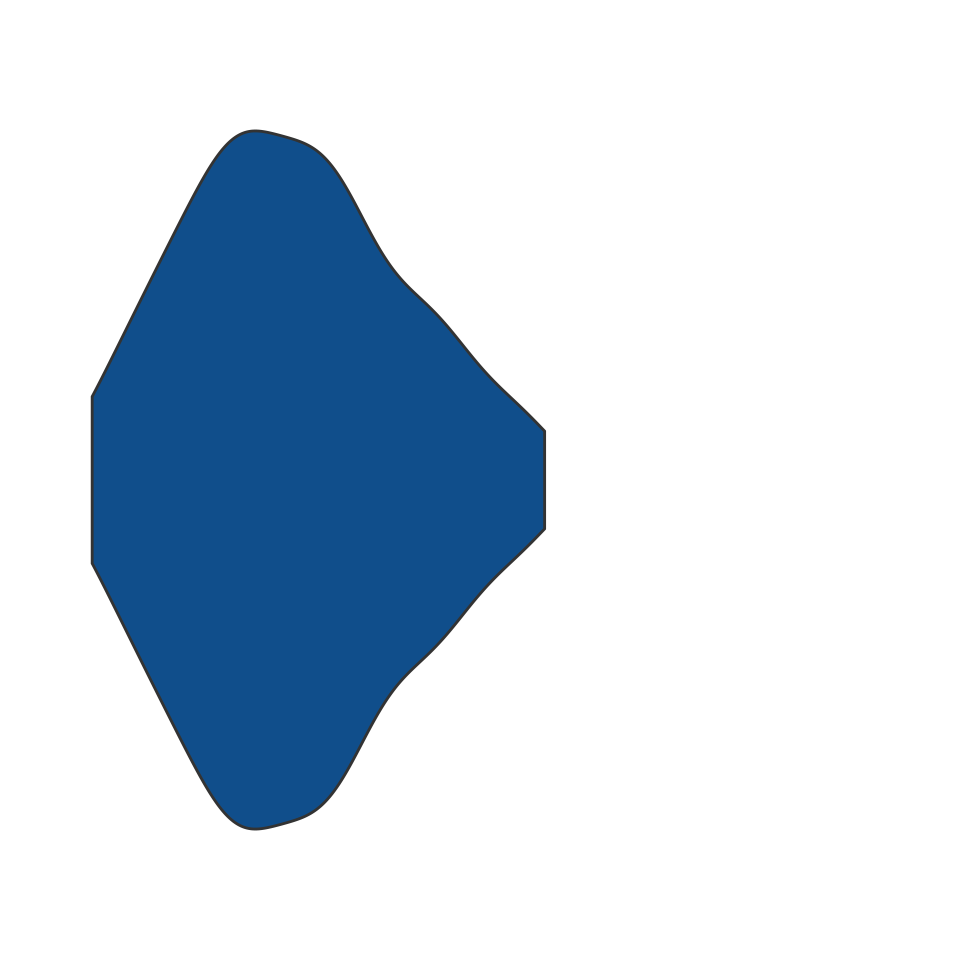
</div></div></div>

Notice that I have set the coordinate system of the plot to the full range of the data (regardless of the species). This part is important. Without this trick, the three plots would not share a common x-axis. 

Ok, so now we have a function that creates the desired plots. Time to apply it to our table. For this to work, we need an additional column that we can target. So we use `mutate()` to add a new column, then `text_transform()` to turn this column into images, and finally `.fn` argument can be supplied with our function iterated over each species with   `map()`.


```r
penguin_weights |>
  mutate(Distribution = Species) |> 
  gt() |>
  tab_spanner(
    label = 'Penguin\'s Weight',
    columns = -Species
  ) |>
  text_transform(
    locations = cells_body(columns = 'Distribution'),
    fn = function(column) {
      map(column, plot_density_species) |>
        ggplot_image(height = px(50), aspect_ratio = 3)
    }
  ) 
```

```{=html}
<div id="cdauoccayr" style="padding-left:0px;padding-right:0px;padding-top:10px;padding-bottom:10px;overflow-x:auto;overflow-y:auto;width:auto;height:auto;">
<style>#cdauoccayr table {
  font-family: system-ui, 'Segoe UI', Roboto, Helvetica, Arial, sans-serif, 'Apple Color Emoji', 'Segoe UI Emoji', 'Segoe UI Symbol', 'Noto Color Emoji';
  -webkit-font-smoothing: antialiased;
  -moz-osx-font-smoothing: grayscale;
}

#cdauoccayr thead, #cdauoccayr tbody, #cdauoccayr tfoot, #cdauoccayr tr, #cdauoccayr td, #cdauoccayr th {
  border-style: none;
}

#cdauoccayr p {
  margin: 0;
  padding: 0;
}

#cdauoccayr .gt_table {
  display: table;
  border-collapse: collapse;
  line-height: normal;
  margin-left: auto;
  margin-right: auto;
  color: #333333;
  font-size: 16px;
  font-weight: normal;
  font-style: normal;
  background-color: #FFFFFF;
  width: auto;
  border-top-style: solid;
  border-top-width: 2px;
  border-top-color: #A8A8A8;
  border-right-style: none;
  border-right-width: 2px;
  border-right-color: #D3D3D3;
  border-bottom-style: solid;
  border-bottom-width: 2px;
  border-bottom-color: #A8A8A8;
  border-left-style: none;
  border-left-width: 2px;
  border-left-color: #D3D3D3;
}

#cdauoccayr .gt_caption {
  padding-top: 4px;
  padding-bottom: 4px;
}

#cdauoccayr .gt_title {
  color: #333333;
  font-size: 125%;
  font-weight: initial;
  padding-top: 4px;
  padding-bottom: 4px;
  padding-left: 5px;
  padding-right: 5px;
  border-bottom-color: #FFFFFF;
  border-bottom-width: 0;
}

#cdauoccayr .gt_subtitle {
  color: #333333;
  font-size: 85%;
  font-weight: initial;
  padding-top: 3px;
  padding-bottom: 5px;
  padding-left: 5px;
  padding-right: 5px;
  border-top-color: #FFFFFF;
  border-top-width: 0;
}

#cdauoccayr .gt_heading {
  background-color: #FFFFFF;
  text-align: center;
  border-bottom-color: #FFFFFF;
  border-left-style: none;
  border-left-width: 1px;
  border-left-color: #D3D3D3;
  border-right-style: none;
  border-right-width: 1px;
  border-right-color: #D3D3D3;
}

#cdauoccayr .gt_bottom_border {
  border-bottom-style: solid;
  border-bottom-width: 2px;
  border-bottom-color: #D3D3D3;
}

#cdauoccayr .gt_col_headings {
  border-top-style: solid;
  border-top-width: 2px;
  border-top-color: #D3D3D3;
  border-bottom-style: solid;
  border-bottom-width: 2px;
  border-bottom-color: #D3D3D3;
  border-left-style: none;
  border-left-width: 1px;
  border-left-color: #D3D3D3;
  border-right-style: none;
  border-right-width: 1px;
  border-right-color: #D3D3D3;
}

#cdauoccayr .gt_col_heading {
  color: #333333;
  background-color: #FFFFFF;
  font-size: 100%;
  font-weight: normal;
  text-transform: inherit;
  border-left-style: none;
  border-left-width: 1px;
  border-left-color: #D3D3D3;
  border-right-style: none;
  border-right-width: 1px;
  border-right-color: #D3D3D3;
  vertical-align: bottom;
  padding-top: 5px;
  padding-bottom: 6px;
  padding-left: 5px;
  padding-right: 5px;
  overflow-x: hidden;
}

#cdauoccayr .gt_column_spanner_outer {
  color: #333333;
  background-color: #FFFFFF;
  font-size: 100%;
  font-weight: normal;
  text-transform: inherit;
  padding-top: 0;
  padding-bottom: 0;
  padding-left: 4px;
  padding-right: 4px;
}

#cdauoccayr .gt_column_spanner_outer:first-child {
  padding-left: 0;
}

#cdauoccayr .gt_column_spanner_outer:last-child {
  padding-right: 0;
}

#cdauoccayr .gt_column_spanner {
  border-bottom-style: solid;
  border-bottom-width: 2px;
  border-bottom-color: #D3D3D3;
  vertical-align: bottom;
  padding-top: 5px;
  padding-bottom: 5px;
  overflow-x: hidden;
  display: inline-block;
  width: 100%;
}

#cdauoccayr .gt_spanner_row {
  border-bottom-style: hidden;
}

#cdauoccayr .gt_group_heading {
  padding-top: 8px;
  padding-bottom: 8px;
  padding-left: 5px;
  padding-right: 5px;
  color: #333333;
  background-color: #FFFFFF;
  font-size: 100%;
  font-weight: initial;
  text-transform: inherit;
  border-top-style: solid;
  border-top-width: 2px;
  border-top-color: #D3D3D3;
  border-bottom-style: solid;
  border-bottom-width: 2px;
  border-bottom-color: #D3D3D3;
  border-left-style: none;
  border-left-width: 1px;
  border-left-color: #D3D3D3;
  border-right-style: none;
  border-right-width: 1px;
  border-right-color: #D3D3D3;
  vertical-align: middle;
  text-align: left;
}

#cdauoccayr .gt_empty_group_heading {
  padding: 0.5px;
  color: #333333;
  background-color: #FFFFFF;
  font-size: 100%;
  font-weight: initial;
  border-top-style: solid;
  border-top-width: 2px;
  border-top-color: #D3D3D3;
  border-bottom-style: solid;
  border-bottom-width: 2px;
  border-bottom-color: #D3D3D3;
  vertical-align: middle;
}

#cdauoccayr .gt_from_md > :first-child {
  margin-top: 0;
}

#cdauoccayr .gt_from_md > :last-child {
  margin-bottom: 0;
}

#cdauoccayr .gt_row {
  padding-top: 8px;
  padding-bottom: 8px;
  padding-left: 5px;
  padding-right: 5px;
  margin: 10px;
  border-top-style: solid;
  border-top-width: 1px;
  border-top-color: #D3D3D3;
  border-left-style: none;
  border-left-width: 1px;
  border-left-color: #D3D3D3;
  border-right-style: none;
  border-right-width: 1px;
  border-right-color: #D3D3D3;
  vertical-align: middle;
  overflow-x: hidden;
}

#cdauoccayr .gt_stub {
  color: #333333;
  background-color: #FFFFFF;
  font-size: 100%;
  font-weight: initial;
  text-transform: inherit;
  border-right-style: solid;
  border-right-width: 2px;
  border-right-color: #D3D3D3;
  padding-left: 5px;
  padding-right: 5px;
}

#cdauoccayr .gt_stub_row_group {
  color: #333333;
  background-color: #FFFFFF;
  font-size: 100%;
  font-weight: initial;
  text-transform: inherit;
  border-right-style: solid;
  border-right-width: 2px;
  border-right-color: #D3D3D3;
  padding-left: 5px;
  padding-right: 5px;
  vertical-align: top;
}

#cdauoccayr .gt_row_group_first td {
  border-top-width: 2px;
}

#cdauoccayr .gt_row_group_first th {
  border-top-width: 2px;
}

#cdauoccayr .gt_summary_row {
  color: #333333;
  background-color: #FFFFFF;
  text-transform: inherit;
  padding-top: 8px;
  padding-bottom: 8px;
  padding-left: 5px;
  padding-right: 5px;
}

#cdauoccayr .gt_first_summary_row {
  border-top-style: solid;
  border-top-color: #D3D3D3;
}

#cdauoccayr .gt_first_summary_row.thick {
  border-top-width: 2px;
}

#cdauoccayr .gt_last_summary_row {
  padding-top: 8px;
  padding-bottom: 8px;
  padding-left: 5px;
  padding-right: 5px;
  border-bottom-style: solid;
  border-bottom-width: 2px;
  border-bottom-color: #D3D3D3;
}

#cdauoccayr .gt_grand_summary_row {
  color: #333333;
  background-color: #FFFFFF;
  text-transform: inherit;
  padding-top: 8px;
  padding-bottom: 8px;
  padding-left: 5px;
  padding-right: 5px;
}

#cdauoccayr .gt_first_grand_summary_row {
  padding-top: 8px;
  padding-bottom: 8px;
  padding-left: 5px;
  padding-right: 5px;
  border-top-style: double;
  border-top-width: 6px;
  border-top-color: #D3D3D3;
}

#cdauoccayr .gt_last_grand_summary_row_top {
  padding-top: 8px;
  padding-bottom: 8px;
  padding-left: 5px;
  padding-right: 5px;
  border-bottom-style: double;
  border-bottom-width: 6px;
  border-bottom-color: #D3D3D3;
}

#cdauoccayr .gt_striped {
  background-color: rgba(128, 128, 128, 0.05);
}

#cdauoccayr .gt_table_body {
  border-top-style: solid;
  border-top-width: 2px;
  border-top-color: #D3D3D3;
  border-bottom-style: solid;
  border-bottom-width: 2px;
  border-bottom-color: #D3D3D3;
}

#cdauoccayr .gt_footnotes {
  color: #333333;
  background-color: #FFFFFF;
  border-bottom-style: none;
  border-bottom-width: 2px;
  border-bottom-color: #D3D3D3;
  border-left-style: none;
  border-left-width: 2px;
  border-left-color: #D3D3D3;
  border-right-style: none;
  border-right-width: 2px;
  border-right-color: #D3D3D3;
}

#cdauoccayr .gt_footnote {
  margin: 0px;
  font-size: 90%;
  padding-top: 4px;
  padding-bottom: 4px;
  padding-left: 5px;
  padding-right: 5px;
}

#cdauoccayr .gt_sourcenotes {
  color: #333333;
  background-color: #FFFFFF;
  border-bottom-style: none;
  border-bottom-width: 2px;
  border-bottom-color: #D3D3D3;
  border-left-style: none;
  border-left-width: 2px;
  border-left-color: #D3D3D3;
  border-right-style: none;
  border-right-width: 2px;
  border-right-color: #D3D3D3;
}

#cdauoccayr .gt_sourcenote {
  font-size: 90%;
  padding-top: 4px;
  padding-bottom: 4px;
  padding-left: 5px;
  padding-right: 5px;
}

#cdauoccayr .gt_left {
  text-align: left;
}

#cdauoccayr .gt_center {
  text-align: center;
}

#cdauoccayr .gt_right {
  text-align: right;
  font-variant-numeric: tabular-nums;
}

#cdauoccayr .gt_font_normal {
  font-weight: normal;
}

#cdauoccayr .gt_font_bold {
  font-weight: bold;
}

#cdauoccayr .gt_font_italic {
  font-style: italic;
}

#cdauoccayr .gt_super {
  font-size: 65%;
}

#cdauoccayr .gt_footnote_marks {
  font-size: 75%;
  vertical-align: 0.4em;
  position: initial;
}

#cdauoccayr .gt_asterisk {
  font-size: 100%;
  vertical-align: 0;
}

#cdauoccayr .gt_indent_1 {
  text-indent: 5px;
}

#cdauoccayr .gt_indent_2 {
  text-indent: 10px;
}

#cdauoccayr .gt_indent_3 {
  text-indent: 15px;
}

#cdauoccayr .gt_indent_4 {
  text-indent: 20px;
}

#cdauoccayr .gt_indent_5 {
  text-indent: 25px;
}
</style>
<table class="gt_table" data-quarto-disable-processing="false" data-quarto-bootstrap="false">
  <thead>
    
    <tr class="gt_col_headings gt_spanner_row">
      <th class="gt_col_heading gt_columns_bottom_border gt_left" rowspan="2" colspan="1" scope="col" id="Species">Species</th>
      <th class="gt_center gt_columns_top_border gt_column_spanner_outer" rowspan="1" colspan="4" scope="colgroup" id="Penguin's Weight">
        <span class="gt_column_spanner">Penguin's Weight</span>
      </th>
    </tr>
    <tr class="gt_col_headings">
      <th class="gt_col_heading gt_columns_bottom_border gt_right" rowspan="1" colspan="1" scope="col" id="Min">Min</th>
      <th class="gt_col_heading gt_columns_bottom_border gt_right" rowspan="1" colspan="1" scope="col" id="Mean">Mean</th>
      <th class="gt_col_heading gt_columns_bottom_border gt_right" rowspan="1" colspan="1" scope="col" id="Max">Max</th>
      <th class="gt_col_heading gt_columns_bottom_border gt_left" rowspan="1" colspan="1" scope="col" id="Distribution">Distribution</th>
    </tr>
  </thead>
  <tbody class="gt_table_body">
    <tr><td headers="Species" class="gt_row gt_left">Adelie</td>
<td headers="Min" class="gt_row gt_right">2850</td>
<td headers="Mean" class="gt_row gt_right">3706.16</td>
<td headers="Max" class="gt_row gt_right">4775</td>
<td headers="Distribution" class="gt_row gt_left"><img src="" style="height:50px;"></td></tr>
    <tr><td headers="Species" class="gt_row gt_left">Chinstrap</td>
<td headers="Min" class="gt_row gt_right">2700</td>
<td headers="Mean" class="gt_row gt_right">3733.09</td>
<td headers="Max" class="gt_row gt_right">4800</td>
<td headers="Distribution" class="gt_row gt_left"><img src="" style="height:50px;"></td></tr>
    <tr><td headers="Species" class="gt_row gt_left">Gentoo</td>
<td headers="Min" class="gt_row gt_right">3950</td>
<td headers="Mean" class="gt_row gt_right">5092.44</td>
<td headers="Max" class="gt_row gt_right">6300</td>
<td headers="Distribution" class="gt_row gt_left"><img src="" style="height:50px;"></td></tr>
  </tbody>
  
  
</table>
</div>
```

## Conclusion

Many of the tweaks we made to our table are quite subtle. Changes like removing excess gridlines, bolding header text, right-aligning numeric values, and adjusting the level of precision can often go unnoticed, but if you skip them, your table will be far less effective. Our final product isn’t flashy, but it does communicate clearly.

We used the gt package to make our high-quality table, and as we’ve repeatedly seen, this package has good defaults built in. Often, you don’t need to change much in your code to make effective tables. But no matter which package you use, it’s essential to treat tables as worthy of just as much thought as other kinds of data visualization.

Later you’ll learn how to create reports using R Markdown, which can integrate your tables directly into the final document.

## Reading

Consult the following resources to learn about table design principles and how to make high-quality tables with the gt package:

["gt package intro"](https://gt.rstudio.com/articles/gt.html)

“Ten Guidelines for Better Tables” by Jon Schwabish (Journal of Benefit-Cost Analysis, 2020), https://doi.org/10.1017/bca.2020.11

“10+ Guidelines for Better Tables in R” by Tom Mock (2020), https://themockup.blog/posts/2020-09-04-10-table-rules-in-r/


