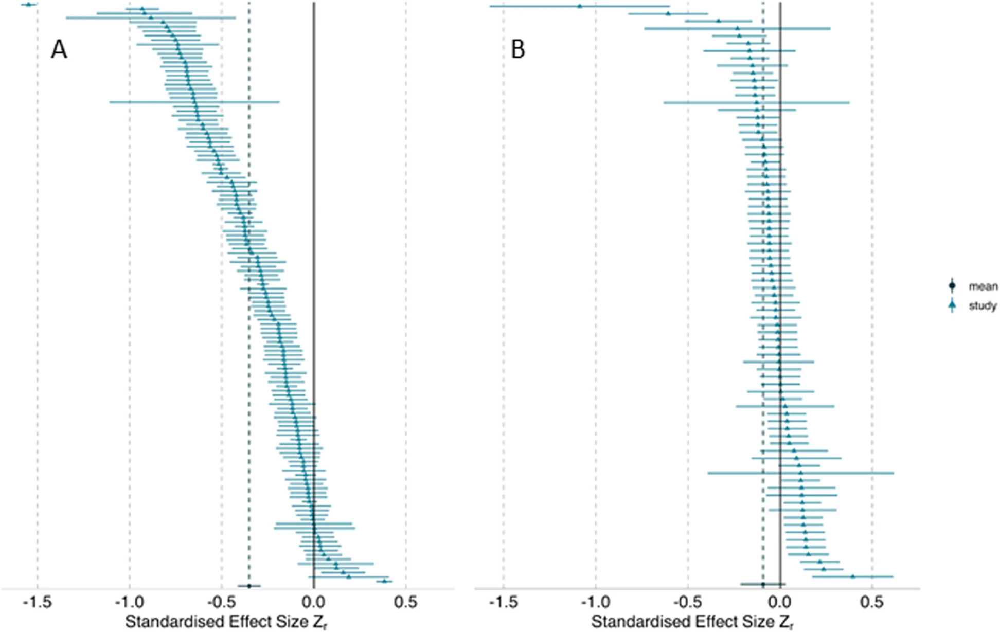
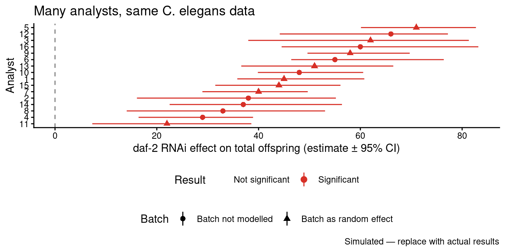

# (PART\*) Day 2 

# Day 2 Block 1: Reproducibility {.unnumbered}


> **Materials:** Download all files from the course OSF page: **https://osf.io/jgeq9/**
> **Files needed:** `celegans_repro_raw.csv` and `celegans_repro_final.csv`

<div class="info">
<p><strong>Before we start:</strong> Download
<code>celegans_repro_raw.csv</code> and
<code>celegans_repro_final.csv</code> from https://osf.io/jgeq9/ and
place them in your working directory. We will load them throughout the
session.</p>
</div>

---

## Part 1 — What is reproducibility? {#repro-what}

*⏱ ~20 minutes*

### Analytical and computational reproducibility

When scientists use the word "reproducibility" they often mean subtly different things. Being precise matters, because the solutions are different.

Goodman et al. (2016) distinguish three types. This chapter focuses on the two most directly within our control:

**Analytical reproducibility** — given the same raw data, would a different analyst using the same stated methods reach the same conclusions? This is harder than it sounds. The methods section of a typical ecology or evolutionary biology paper leaves dozens of decisions underspecified. Which observations are excluded and why? How are missing values handled? Is a covariate log-transformed? What random effects structure is used? These "researcher degrees of freedom" (Simmons et al. 2011) mean that even honest, well-intentioned analysts following the same broad methods can produce meaningfully different results.

**Computational reproducibility** — given the same data *and* the same code, can someone else run it and get identical outputs? This is a lower bar than analytical reproducibility — it only asks "does your code actually do what you think it does?" — but it is the bar that the majority of published papers in ecology and evolutionary biology currently fail to clear.

**Replicability** — does the finding hold when new data are independently collected? This is what most people mean by "the reproducibility crisis", but it is also the hardest to address because it ultimately depends on whether the underlying effect is real.

<div class="info">
<p><strong>Shorthand:</strong> Computational reproducibility asks “did
you do what your code says?” Analytical reproducibility asks “would a
reasonable analyst agree with your approach?” Replicability asks “does
it still hold with new data?”</p>
</div>

### The replication crisis starts with reproducibility

Across psychology, biomedicine, ecology and evolutionary biology, large-scale efforts to repeat published studies have found that a substantial share of findings do not hold up — the **replication crisis** (also called the **reproducibility crisis**, the two terms being used more or less interchangeably in public discussion).

It is tempting to treat this as purely a problem of *replicability* — of effects that were never real. But a finding cannot even be evaluated unless its analysis is reproducible in the first place. If the data and code are not available, or are available but do not run, nobody can check whether the published result actually follows from the data. A non-reproducible literature is one where genuine errors stay hidden, and where a failed replication cannot be diagnosed: was the original analysis wrong, or is the effect simply fragile? **Lack of reproducibility is therefore both a problem in its own right and an upstream cause of the wider crisis** — it removes the evidence trail we would need to tell sound science from artefact.

Reproducibility fails at several sequential stages of the analysis pipeline. The table below pulls together estimates from recent surveys at each stage; differences between studies reflect different journals, samples and time windows rather than disagreement about the underlying problem.

<table class="table table-striped table-hover" style="margin-left: auto; margin-right: auto;">
<caption>(\#tab:repro-table)Reproducibility rates at four sequential stages of the analysis pipeline. Percentages are of all sampled papers unless noted; Trisovic et al. (2022) is a percentage of archived R files.</caption>
 <thead>
  <tr>
   <th style="text-align:left;"> Study (sample) </th>
   <th style="text-align:left;"> % of papers </th>
  </tr>
 </thead>
<tbody>
  <tr grouplength="3"><td colspan="2" style="border-bottom: 1px solid;"><strong>Data archived</strong></td></tr>
<tr>
   <td style="text-align:left;padding-left: 2em;" indentlevel="1"> Cooper et al. (2026) — 1,861 BES papers (2017–24) </td>
   <td style="text-align:left;"> 90% </td>
  </tr>
  <tr>
   <td style="text-align:left;padding-left: 2em;" indentlevel="1"> Kambouris et al. (2024) — 177 EcoEvo meta-analyses (2015–17) </td>
   <td style="text-align:left;"> 75% </td>
  </tr>
  <tr>
   <td style="text-align:left;padding-left: 2em;" indentlevel="1"> Kellner et al. (2025) — 497 papers, 9 ecology journals (2018–22) </td>
   <td style="text-align:left;"> 50% </td>
  </tr>
  <tr grouplength="4"><td colspan="2" style="border-bottom: 1px solid;"><strong>Code archived</strong></td></tr>
<tr>
   <td style="text-align:left;padding-left: 2em;" indentlevel="1"> Kellner et al. (2025) </td>
   <td style="text-align:left;"> 33% </td>
  </tr>
  <tr>
   <td style="text-align:left;padding-left: 2em;" indentlevel="1"> Cooper et al. (2026) </td>
   <td style="text-align:left;"> 31% </td>
  </tr>
  <tr>
   <td style="text-align:left;padding-left: 2em;" indentlevel="1"> Culina et al. (2020) — ecology </td>
   <td style="text-align:left;"> 27% </td>
  </tr>
  <tr>
   <td style="text-align:left;padding-left: 2em;" indentlevel="1"> Kambouris et al. (2024) </td>
   <td style="text-align:left;"> 16% </td>
  </tr>
  <tr grouplength="2"><td colspan="2" style="border-bottom: 1px solid;"><strong>Code runs without error</strong></td></tr>
<tr>
   <td style="text-align:left;padding-left: 2em;" indentlevel="1"> Trisovic et al. (2022) — 9,078 R files, Harvard Dataverse </td>
   <td style="text-align:left;"> 26% (initial) / 44% (after auto-cleaning) </td>
  </tr>
  <tr>
   <td style="text-align:left;padding-left: 2em;" indentlevel="1"> Kellner et al. (2025) </td>
   <td style="text-align:left;"> 7% </td>
  </tr>
  <tr grouplength="1"><td colspan="2" style="border-bottom: 1px solid;"><strong>Target result reproduced</strong></td></tr>
<tr>
   <td style="text-align:left;padding-left: 2em;" indentlevel="1"> Kambouris et al. (2024) — of 26 papers sharing both </td>
   <td style="text-align:left;"> 27–73% (criterion-dependent) </td>
  </tr>
</tbody>
</table>

The table makes two failure points concrete.

**First, the code is often simply not archived.** Cooper et al. (2026), surveying 1,861 papers published 2017–2024 across the seven British Ecological Society journals, found that data archiving has become near-universal — 97% of papers that used data archived it, although that figure is held up by mandatory journal policies rather than community norms — but **only 35% of papers that used code also archived it** (about 31% of all sampled papers). The picture is similar or worse in samples without strong code-sharing mandates: Kellner et al. (2025), across nine ecology journals, found data *and* code available for only 28% of 497 papers; Kambouris et al. (2024) found data and code shared for only 15% of 177 ecology and evolutionary biology meta-analyses published 2015–17.

**Second, even when code is archived, it frequently does not run.** Kellner et al. (2025) attempted to execute the R code accompanying those 497 papers and found **only 7% of all papers — and only 27% of the papers that had archived data and code — ran without error**. The most common causes were missing or misnamed files, missing R objects, and reliance on deprecated R packages (the retirement of `rgdal` and `maptools` alone broke 17 papers). Trisovic et al. (2022), executing more than 9,000 archived R files from the Harvard Dataverse, found 74% failed on the first attempt and 56% still failed after automated cleaning. Kambouris et al. (2024) successfully reproduced the target result from 27–73% of the 26 ecology and evolution meta-analyses that shared both data and code, the range depending on how strictly "successful reproduction" was defined.

**Documentation quality is the other half of the problem.** Cooper et al. (2026) also recorded that around a third of papers had no README to explain their archived files, and that the quality of the READMEs that did exist varied substantially. Sharing rates have crept up over the last decade — from ~27% in Culina et al. (2020) to ~31–35% here — but the execution rate has not budged: the funnel is getting wider at the top while staying just as narrow at the bottom. Sharing is necessary but not sufficient — archived data and code also have to be *good enough to run and reproduce the result*.


<div class="try">
<p><strong>Opening activity — why don’t <em>you</em> share?</strong>
<em>(type your answer in the chat)</em></p>
<p>Think about your most recent or current project.</p>
<ol style="list-style-type: decimal">
<li>Is the <strong>data</strong> publicly available? Is the
<strong>code</strong>?</li>
<li>If either is not — why not? Be honest. Too busy? Worried someone
will find an error? Not sure how or where? Worried about being scooped?
Code too messy to show anyone?</li>
</ol>
<p>Write down your real reasons. Gomes et al. (2022) surveyed
researchers and grouped the barriers people actually report — knowledge
gaps, fear of scrutiny, time cost, misaligned career incentives. Keep
your list; at the end of the session we will compare it with theirs.</p>
<blockquote>
<p><strong>Gomes, D.G.E., et al. (2022).</strong> Why don’t we share
data and code? Perceived barriers and benefits to public archiving
practices. <em>Proceedings of the Royal Society B</em>, 289, 20221113.
https://doi.org/10.1098/rspb.2022.1113</p>
</blockquote>
</div>

---

## Part 2 — Many analysts, many answers {#repro-multiverse}

*⏱ ~40 minutes*

### Background: the garden of forking paths

Even when analysts work honestly with the same data and the same stated question, they can reach meaningfully different conclusions. Gelman & Loken (2013) described this as "the garden of forking paths": not deliberate p-hacking, but the way that the path through analytical decisions always looks inevitable in hindsight, even when it was one of many equally valid routes.

The most direct demonstration of this is the **many analysts** paradigm (Silberzahn et al. 2018; Gould et al. 2023). Multiple independent teams are each given the same dataset and the same question. They analyse it independently, then compare results.

Gould et al. (2023) also did this in ecology. Multiple teams given the same EcoEvo dataset produced a distribution of estimates and conclusions — large variability, no single "correct" answer, but some analyses better documented than others. The pattern is consistent: **underspecified methods produce variable results**, not because researchers are dishonest but because the analytical space is genuinely large.

<div class="figure" style="text-align: center">

<p class="caption">(\#fig:unnamed-chunk-5)The Many Analysts project (Gould et al 2023)</p>
</div>

### You are the analyst

Now you experience this directly. You are given the *C. elegans* reproduction dataset from the course OSF page and a deliberately vague question. Analyse it however seems most reasonable to you.

**The biology:** *C. elegans* is a workhorse model organism in genetics and ageing research. The dataset records each worm's **total offspring** — its lifetime reproductive output — from an experiment crossing two interventions:

| Variable | Meaning |
|---|---|
| `worm_id` | Individual worm identifier |
| `B` | Batch (1–6) — worms run in separate cohorts |
| `strain` | `daf` = daf-2 RNAi (knocks down insulin/IGF-1 signalling; extends lifespan and alters reproduction); `empty_vector` = control RNAi |
| `diet` | `AL` = ad libitum (fed freely); `EODF` = every-other-day fasting (dietary restriction) |
| `TO` | Total offspring — lifetime count of live progeny per worm |

**The question:** *Does daf-2 RNAi affect reproduction?*

That is all you are told. Now analyse it.

<div class="try">
<p><strong>Individual activity (12 minutes)</strong></p>
<p>Load <code>celegans_repro_final.csv</code> from https://osf.io/jgeq9/
and answer: <strong>does daf-2 RNAi affect total offspring?</strong></p>
<p>You must decide:</p>
<ul>
<li>What to do with any unusual values in the data</li>
<li>Whether to include diet as a covariate or factor</li>
<li>Whether batch (<code>B</code>) should be a fixed or random effect,
or ignored</li>
<li>What statistical model to use (t-test? linear model? mixed model? a
count model such as a Poisson or negative-binomial GLMM?)</li>
<li>Whether to use <code>TO</code> as-is or transform it</li>
</ul>
<p><strong>Before running anything</strong>, write down your three most
important analytical decisions and why. Then run your analysis.</p>
<p>Write your estimates in chat.</p>
<ol style="list-style-type: decimal">
<li>Your estimate for the daf vs empty_vector effect (with units —
e.g. offspring per worm)</li>
<li>Significant or not? (yes/no)</li>
<li>Your three key decisions</li>
</ol>
</div>

### Reporting on the same scale: emmeans

Different analysts will pick different models e.g. a Gaussian linear (or mixed) model, a Poisson GLMM, a negative-binomial GLMM, or a log-transformed linear model. Each one reports the `daf` effect on a different scale:

- A linear model on `TO` returns an **additive difference** — "daf reduces offspring by X per worm."
- A Poisson or NB GLMM with a log link returns a **log-scale coefficient**, which back-transforms to a **rate ratio** — "daf has 0.7× the offspring of controls."
- A linear model on `log(TO)` returns a log-scale difference, which back-transforms to a ratio.

These numbers are not directly comparable across the room. **`emmeans`** puts them all on the response scale (offspring per worm) in two steps: compute the estimated marginal means, then take the pairwise contrast between `daf` and `empty_vector`. For log-link models we use `regrid()` first, which back-transforms the means to the response scale **before** the contrast — so the result is a *difference* in offspring, not the default rate ratio.


``` r
# install.packages("emmeans")
library(emmeans)

# Works for lm, lmer, glmer, glmer.nb. regrid() back-transforms to the
# response scale BEFORE the contrast. For identity-link models (lm/lmer)
# it is effectively null; for log-link models (glmer/glmer.nb) it
# converts the default rate ratio into a difference in offspring.
emmeans(model, ~ strain) |>
  regrid() |>
  contrast("pairwise", adjust = "none") |>
  confint()
#  -> "daf - empty_vector"   estimate   95% CI   in offspring per worm

# If you fitted with a manual transformation, e.g. lm(log(TO) ~ strain),
# emmeans does NOT auto-detect the transform -- tell it explicitly:
emm <- emmeans(model, ~ strain) |> update(tran = "log")
emm |> regrid() |> contrast("pairwise") |> confint()
```

Report the **estimate, the 95% confidence interval, and the units** (offspring per worm). If you prefer a multiplicative effect, report a ratio as well — but at minimum everyone reports the difference on the response scale so the room is comparing like with like.

### The Results - Temporary graph to be updated when you send me your estimates
<div class="figure" style="text-align: center">

<p class="caption">(\#fig:many-analysts-demo)Results from the many-analysts activity. Each point is one participant's estimate for the daf-2 RNAi effect on C. elegans total offspring. </p>
</div>

<div class="info">
<p><strong>Debrief (5 minutes):</strong></p>
<ol style="list-style-type: decimal">
<li>How much did the estimates vary? Did anyone get a non-significant
result while others got significant?</li>
<li>Who modelled batch as a random effect? Did that change the
conclusion?</li>
<li>Who used a count model (Poisson / negative-binomial) vs a plain
linear model? Does the model choice matter here?</li>
<li>What would the published literature look like if each of you
submitted your analysis independently?</li>
</ol>
</div>

### Why this matters

The variation you just observed is not noise — it is the direct consequence of underspecified methods. The solution is not to force everyone into the same analysis. The solution is **transparency**: document every analytical decision so that a reader can evaluate it, replicate it, and understand what would change if an alternative choice had been made.

This is where the SORTEE Guidelines (Pick et al. 2026) and the TADA! framework (Ivimey-Cook et al. 2025) come in — and it is also the problem that code review (next chapter) is designed to catch.

---

## Part 3 — Diagnosing a bad dataset and script {#repro-diagnosis}

*⏱ ~30 minutes*

Now we look systematically at the raw data file. `celegans_repro_raw.csv` contains the same experiment but before any cleaning. Every problem in it is a real type of problem that appears in published archives.

### Data quality audit


``` r
library(tidyverse)

# Load the raw data — download from https://osf.io/jgeq9/
dat_raw <- read_csv("celegans_repro_raw.csv")

# First look
dim(dat_raw)
glimpse(dat_raw)
summary(dat_raw)
```


``` r
# Check each variable for problems

# strain values
dat_raw |> count(strain)

# Diet values
dat_raw |> count(diet)

# TO (total offspring) range
dat_raw |>
  summarise(min = min(TO, na.rm = TRUE),
            max = max(TO, na.rm = TRUE),
            n_na = sum(is.na(TO)))

# worm_id problems
dat_raw |> filter(is.na(worm_id))

# Duplicate rows?
dat_raw |>
  filter(!is.na(worm_id)) |>
  group_by(worm_id, B) |>
  filter(n() > 1) |>
  arrange(worm_id)

# Rows where everything is NA except TO
dat_raw |> filter(is.na(strain))
```

<div class="try">
<p><strong>Activity: data audit (10 minutes)</strong></p>
<p>Run the code above. The raw data contains at least <strong>eight
distinct data quality problems</strong>. List every one you can find in
the chat.</p>
<p>Hint: look carefully at capitalisation, spacing, impossible values,
sentinel values, and structural oddities.</p>
</div>

Here is what you should have found:

<table class="table table-striped table-hover" style="margin-left: auto; margin-right: auto;">
<caption>(\#tab:data-problems)Data quality problems in celegans_repro_raw.csv</caption>
 <thead>
  <tr>
   <th style="text-align:left;"> # </th>
   <th style="text-align:left;"> Problem </th>
   <th style="text-align:left;"> Column </th>
   <th style="text-align:left;"> Detail </th>
   <th style="text-align:left;"> Why it matters </th>
  </tr>
 </thead>
<tbody>
  <tr>
   <td style="text-align:left;"> 1 </td>
   <td style="text-align:left;"> Mixed capitalisation in strain </td>
   <td style="text-align:left;"> `strain` </td>
   <td style="text-align:left;"> `daf` (n=117) and `DAF` (n=24) — same condition, will be treated as two groups </td>
   <td style="text-align:left;"> Inflates group count; DAF worms silently excluded or double-counted </td>
  </tr>
  <tr>
   <td style="text-align:left;"> 2 </td>
   <td style="text-align:left;"> Trailing whitespace in strain </td>
   <td style="text-align:left;"> `strain` </td>
   <td style="text-align:left;"> `empty_vector ` (with trailing space) — will not match `empty_vector` </td>
   <td style="text-align:left;"> Three worms silently dropped or form a phantom third group </td>
  </tr>
  <tr>
   <td style="text-align:left;"> 3 </td>
   <td style="text-align:left;"> Mixed capitalisation in diet </td>
   <td style="text-align:left;"> `diet` </td>
   <td style="text-align:left;"> `EODF` (n=144) and `eodf` (n=27) — same condition, two labels </td>
   <td style="text-align:left;"> Same problem as issue 1 — artificially splits dietary groups </td>
  </tr>
  <tr>
   <td style="text-align:left;"> 4 </td>
   <td style="text-align:left;"> Impossible negative offspring count </td>
   <td style="text-align:left;"> `TO` </td>
   <td style="text-align:left;"> worm_id 112, B=5, daf, EODF: TO = -46 </td>
   <td style="text-align:left;"> Biological impossibility (offspring cannot be negative); distorts means and any model </td>
  </tr>
  <tr>
   <td style="text-align:left;"> 5 </td>
   <td style="text-align:left;"> Implausible extreme offspring count </td>
   <td style="text-align:left;"> `TO` </td>
   <td style="text-align:left;"> worm_id 47, B=4, daf, AL: TO = 2850 — likely a typo for 285 (brood size is typically ~250–350) </td>
   <td style="text-align:left;"> Will massively inflate mean offspring in the daf/AL group </td>
  </tr>
  <tr>
   <td style="text-align:left;"> 6 </td>
   <td style="text-align:left;"> Sentinel value 9999 not documented </td>
   <td style="text-align:left;"> `TO` </td>
   <td style="text-align:left;"> Three worms with TO = 9999 — an undocumented code, almost certainly 'offspring not recorded' </td>
   <td style="text-align:left;"> If treated as a real offspring count it dramatically inflates the outcome </td>
  </tr>
  <tr>
   <td style="text-align:left;"> 7 </td>
   <td style="text-align:left;"> Missing worm_id </td>
   <td style="text-align:left;"> `worm_id` </td>
   <td style="text-align:left;"> Two rows in B=1, daf, EODF have worm_id = NA </td>
   <td style="text-align:left;"> Cannot link these observations back to individual worms </td>
  </tr>
  <tr>
   <td style="text-align:left;"> 8 </td>
   <td style="text-align:left;"> Junk rows (501–506) </td>
   <td style="text-align:left;"> All </td>
   <td style="text-align:left;"> Six rows where B, strain, and diet are all NA — only TO has a value </td>
   <td style="text-align:left;"> Probably data entry artefacts; will cause errors in grouped summaries </td>
  </tr>
  <tr>
   <td style="text-align:left;"> 9 </td>
   <td style="text-align:left;"> Duplicate rows in batch 2 </td>
   <td style="text-align:left;"> All </td>
   <td style="text-align:left;"> worm_ids 13–24 and 73–84 appear twice; some empty_vector batch 2 rows also doubled </td>
   <td style="text-align:left;"> Artificially inflates sample size and gives false precision </td>
  </tr>
</tbody>
</table>

<div class="note">
<p>Issue 6 (TO = 9999) is a good example of a sentinel value — a number
used to encode a special meaning, here almost certainly “offspring not
recorded” (the count is missing for that worm). Sentinel codes like
9999, -999, or 0-for-missing are common in real data files; they are
legitimate only if documented in a codebook and handled explicitly in
code. If someone runs <code>mean(TO)</code> on the raw data without
knowing what 9999 means, their result will be completely wrong.</p>
</div>

<div class="try">
<p><strong>Activity: compare raw and final (5 minutes)</strong></p>
<p>Now load <code>celegans_repro_final.csv</code> and compare it to the
raw file:</p>
</div>

``` r
dat_raw   <- read_csv("celegans_repro_raw.csv")
dat_final <- read_csv("celegans_repro_final.csv")

# How many rows differ?
cat("Raw rows:", nrow(dat_raw), "\n")
cat("Final rows:", nrow(dat_final), "\n")
cat("Difference:", nrow(dat_raw) - nrow(dat_final), "\n")

# What strain values remain in each?
cat("\nRaw strains:\n")
print(count(dat_raw, strain))

cat("\nFinal strains:\n")
print(count(dat_final, strain))

# Does the final still contain the problematic TO values?
cat("\nFinal TO range:\n")
dat_final |> summarise(min = min(TO, na.rm = TRUE),
                        max = max(TO, na.rm = TRUE))

In the chat: does the final file still contain TO = -46? TO = 2850? What does this tell you about the cleaning that was done?
```

This is the key point: `celegans_repro_final.csv` has had *some* issues addressed (the DAF capitalisation rows removed, some duplicates resolved) but not all of them. The -46 and 2850 values remain. This is a realistic example of partial cleaning — common in real archives, and a genuine reproducibility problem because it means different analysts working from the "final" file will still handle these values differently.

---

## Part 4 — Fixing it: The SORTEE Guidelines {#repro-fix}

*⏱ ~45 minutes*

### The framework

The SORTEE Guidelines (Pick, Ivimey-Cook et al. 2026) provide the broader framework covering data archiving, licensing, and peer review:

> **Pick, J.L., et al. (2026).** The SORTEE guidelines for data and code quality control in ecology and evolutionary biology. *Peer Community Journal*. https://doi.org/10.24072/pcjournal.687

### Step 1 — Set up the project structure

Most analysis projects do not start tidy. Here is a "probably very likely" folder structure for this *C. elegans* experiment — everything dumped in a single directory:

```
REPROCODE_ANALYSIS/
├── celegans_repro_raw.csv          # raw data
├── celegans_repro_final.csv    # a "cleaned" copy — but cleaned how?
├── ANALYSIS.R                # the analysis script
├── old_code.R                # an earlier version, still sitting here
├── celegans_analysis.Rmd     # a write-up
├── celegans_analysis.html    # the rendered write-up
├── final.jpg
├── finalplot.jpeg             # "finalplot" — so which figure is current?
├── ExtractedFigure1.png
└── 4Rs.jpg
```

This is a **bad structure**, and it is completely normal — most projects look like this. Nothing separates raw data from processed data, so you cannot tell which file is safe to overwrite or how `celegans_repro_final.csv` was produced. `old_code.R` is dead code left lying around; it invites a collaborator to run the wrong script. The four loose image files are generated outputs mixed in with the source, and names like `finalplot.jpeg` are version control by filename — undocumented and unreproducible. There is no README, so nothing tells a newcomer what to run, or in what order. (We review `ANALYSIS.R` itself in the code review chapter this afternoon — for now we fix the *structure*.)

Here is the structure to aim for instead — a few standard folders that separate inputs, code and outputs:


``` r
library(tidyverse)
library(here)

# Create a proper folder structure
dirs <- c("data/raw", "data/processed", "analysis", "figures", "results")
for (d in dirs) {
  dir.create(d, recursive = TRUE, showWarnings = FALSE)
}

# Copy the raw data file into data/raw/ — never modify this copy
file.copy("celegans_repro_raw.csv",
          here("data", "raw", "celegans_repro_raw.csv"))

cat("Project structure:\n")
list.files(recursive = TRUE, include.dirs = TRUE)
```

### Step 2 — A documented cleaning script


``` r
# analysis/01_data_cleaning.R
# Author:   [your name]
# Date:     [today]
# Purpose:  Clean raw C. elegans reproduction data for daf-2 × diet experiment
#
# Study:    Effect of daf-2 RNAi and dietary restriction on total offspring
# Organism: Caenorhabditis elegans (N2 background)
# Design:   2 strains (daf-2 RNAi vs empty_vector control) ×
#           2 diets (AL = ad libitum; EODF = every-other-day fasting)
#           6 batches (B); multiple worms per batch
#
# Variables:
#   worm_id   — individual worm ID (integer)
#   B         — batch number (1–6); should be treated as random effect
#   strain — "daf" = daf-2 RNAi; "empty_vector" = control
#   diet      — "AL" = ad libitum; "EODF" = every-other-day fasting
#   TO        — total offspring (count); 9999 = undocumented code for "not recorded"
#
# Input:  data/raw/celegans_repro_raw.csv
# Output: data/processed/celegans_clean.csv
#         results/exclusion_log.csv

library(tidyverse)
library(here)

# ── 1. Load ───────────────────────────────────────────────────────────────────
dat_raw <- read_csv(here("data", "raw", "celegans_repro_raw.csv"),
                    show_col_types = FALSE)
cat("Raw data:", nrow(dat_raw), "rows\n")

# ── 2. Standardise factor levels (case and whitespace) ────────────────────────
# strain: "DAF" is a capitalisation error — same as "daf"
# "empty_vector " has trailing whitespace — same as "empty_vector"
# diet: "eodf" is a capitalisation error — same as "EODF"
dat_std <- dat_raw |>
  mutate(
    strain = str_trim(str_to_lower(strain)),
    diet      = str_trim(str_to_upper(diet))
  )

cat("After standardisation — strain values:\n")
print(count(dat_std, strain))
cat("After standardisation — diet values:\n")
print(count(dat_std, diet))

# ── 3. Count structural junk rows ───────────────────────────────────────────
# Rows 501–506: worm_id > 500 with NA strain/diet — data entry artefacts
n_junk <- sum(dat_std$worm_id >= 500 & is.na(dat_std$strain),
              na.rm = TRUE)
cat("Junk rows (worm_id >= 500, NA strain):", n_junk, "\n")

# ── 4. Remove junk and duplicate rows ──────────────────────────────────────────────────
# Batch 2 rows appear duplicated — retain first occurrence only
dat_std <- dat_std |>
  filter(!(is.na(strain) & is.na(diet)))

n_before_dedup <- nrow(dat_std)
dat_std <- dat_std |>
  distinct(worm_id, B, strain, diet, .keep_all = TRUE)
n_removed_dupes <- n_before_dedup - nrow(dat_std)
cat("Duplicate rows removed:", n_removed_dupes, "\n")

# ── 5. Data-quality exclusions ───────────────────────────────────────────────
# Exclusion 1: TO = 9999 — undocumented sentinel meaning "offspring not
# recorded". These are missing values, not real counts of zero; we exclude
# them and record the count so the loss is visible in the methods section.
n_missing <- sum(dat_std$TO == 9999, na.rm = TRUE)
cat("Missing offspring (TO = 9999):", n_missing, "excluded\n")

# Exclusion 2: TO < 0 — biologically impossible (offspring cannot be negative)
# worm_id 112, B=5, daf, EODF: TO = -46 — likely data entry error
n_neg <- sum(dat_std$TO < 0, na.rm = TRUE)
cat("Negative TO values:", n_neg, "\n")

# Exclusion 3: TO > 1000 and < 9999 — implausible (C. elegans brood size is
# typically ~250–350; values in the thousands are not credible)
# worm_id 47, B=4, daf, AL: TO = 2850 — likely a typo for 285
# Flag rather than silently remove — needs verification with original data sheet
n_implausible <- sum(dat_std$TO > 1000 & dat_std$TO < 9999, na.rm = TRUE)
cat("Implausible TO values (>1000, <9999):", n_implausible,
    "— flagged; excluded pending verification\n")

dat_clean <- dat_std |>
  filter(
    TO != 9999,          # Exclusion 1: missing (9999 sentinel)
    TO >= 0,             # Exclusion 2: impossible
    TO <= 1000           # Exclusion 3: implausible
  ) |>
  mutate(
    # Explicit factor with reference levels
    strain = factor(strain,
                       levels = c("empty_vector", "daf")),
    diet      = factor(diet, levels = c("AL", "EODF")),
    B         = factor(B)  # batch as factor for random effect
  )

cat("\nFinal clean dataset:", nrow(dat_clean), "worms\n")

# ── 6. Save ───────────────────────────────────────────────────────────────────
write_csv(dat_clean, here("data", "processed", "celegans_clean.csv"))

exclusion_log <- tribble(
  ~Criterion,                                       ~N,
  "Junk rows (worm_id >= 500, no strain/diet)",  n_junk,
  "Duplicate rows removed",                          n_removed_dupes,
  "Missing offspring (TO = 9999)",                  n_missing,
  "Impossible count (TO < 0)",                      n_neg,
  "Implausible count (TO > 1000, not 9999)",        n_implausible
)
write_csv(exclusion_log, here("results", "exclusion_log.csv"))
print(exclusion_log)
```

<div class="try">
<p><strong>Activity: run and inspect the cleaning script (8
minutes)</strong></p>
<p>Copy this script into <code>analysis/01_data_cleaning.R</code> in
your project and run it.</p>
<p>Then answer in the chat:</p>
<ol style="list-style-type: decimal">
<li>How many worms are in the final clean dataset?</li>
<li>Looking at the exclusion log: which exclusion removes the most
observations?</li>
<li>The script flags TO = 2850 as “pending verification” rather than
silently removing or including it. Why is this the correct approach from
a reproducibility standpoint?</li>
<li>Read through the cleaning script, do you understand what it is
doing?</li>
</ol>
</div>

### TADA: the framework behind a reviewable script

The cleaning script you just ran isn't long, but several of the choices in it weren't arbitrary — the header block, the `here()` calls, the explicit exclusion log, the section dividers. These map onto a small set of principles for analytical code sharing that will become a backbone for the rest of this course.

Ivimey-Cook et al. (2025) propose **TADA** — *Transferable, Available, Documented, Annotated* — as a minimum standard for analytical code accompanying published research. It complements the FAIR principles (which were designed mainly for data and software) by addressing the things that specifically go wrong with analysis scripts. The four letters:

- **T — Transferable.** Code runs on someone else's machine without modification. Concretely: no hard-coded absolute paths (use `here()` or relative paths from a project root), all packages declared at the top of the script, random seeds set before stochastic steps, software versions recorded somewhere reproducible (`sessionInfo()` output, `renv.lock`, or similar).
- **A — Available.** Code is deposited in a persistent, citable archive with a stable identifier — a Zenodo DOI minted from a tagged GitHub release, an OSF project, or a Dryad submission — and released under an explicit licence. "Available on request" and a personal Dropbox link are not TADA-compliant; the first decays with careers, the second decays with subscriptions.
- **D — Documented.** A README (at the project root) tells a reviewer what the code does, what each file is for, the order to run files in, where the input data live, what outputs are produced, and what software versions were used. We'll build one of these in the next section using READMEBuilder.
- **A — Annotated.** Inline comments inside the scripts explain *why* a choice was made, not just *what* the line does. The cleaning script's exclusion comments — *"TO = 9999 — undocumented sentinel meaning 'offspring not recorded'… we exclude them and record the count so the loss is visible in the methods section"* — are annotation; `# read the data` next to `read_csv()` is not.

The order matters: a script can be perfectly annotated and still unrunnable on another machine because of a hard-coded path. A perfectly transferable script can still be unreviewable if there is no README explaining which of the seven files in the repository to run first. TADA forces all four to be in place.

This is why TADA comes before code review. Code review evaluates whether code is *Reported, Runs, Reliable, Reproducible* (the four Rs of Ivimey-Cook et al. 2023, which we cover this afternoon). But if the code isn't TADA-compliant in the first place — if it won't transfer, isn't available, has no documentation, or isn't annotated — there is nothing for a reviewer to evaluate. TADA is what makes code reviewable; the review itself comes later.

<div class="try">
<p><strong>Map TADA onto the cleaning script</strong> <em>(5 minutes —
type in chat)</em></p>
<p>Scroll back to <code>01_data_cleaning.R</code>. Identify one specific
line or block that demonstrates each of the four TADA principles. One of
them is only <em>partially</em> present in the script as it stands —
which, and what’s missing? <em>Try to answer before reading the next
paragraph.</em></p>
</div>

**Answer.** **Available** is the partial one. The script is *written* in a way that could be archived, but on its own a script is not Available — that requires deposit (Zenodo, OSF, Dryad) with a DOI and a licence. We close that gap in Part 5.

### Step 3 — Build the README with READMEBuilder

A README is the single most useful file in an archive for anyone trying to reuse it — and it is exactly the file that gets skipped under deadline pressure. Writing one from a blank page is hard; filling in a structured form is not.

**READMEBuilder** is a Shiny app that removes that friction. It walks you through the sections a good README needs — overview, directory map, data dictionary, known issues, licensing, reproduction steps — as a guided form, then exports a clean, consistently formatted `README.md`. Because the structure is fixed, every README it produces already satisfies the *Documented* requirement of TADA!. It does not write the *content* for you — you still have to know your data — but it guarantees nothing structural is forgotten. Link here: https://github.com/EIvimeyCook/READMEBuilder 

<div class="info">
<p><strong>READMEBuilder</strong> is a Shiny app / R package for
assembling TADA-compliant READMEs from a guided form. Launch the app
(your instructor will share the link) or run it locally if you have the
package installed.</p>
</div>

<div class="try">
<p><strong>Activity: build the README (10 minutes)</strong></p>
<p>Open <strong>READMEBuilder</strong> and complete a README for the C.
elegans project. The app asks for the sections shown in the template
below — the hardest is the data dictionary, so focus there: can you
complete every row?</p>
<p>If you cannot get the app running, fill in the template by hand — the
fields are identical.</p>
<h1 id="c.-elegans-strain-diet-reproduction-experiment">C. elegans
strain × diet reproduction experiment</h1>
<h2 id="authors">Authors</h2>
<ul>
<li>[Name] ([ORCID]), [Affiliation]</li>
</ul>
<p><strong>OSF project:</strong> https://osf.io/jgeq9/</p>
<h2 id="overview">Overview</h2>
<p>[2–3 sentences: what is the experiment, what question does it
address, what does this archive contain]</p>
<h2 id="repository-contents">Repository contents</h2>
<p>. ├── data/ │ ├── raw/ # Original unmodified data │ └── processed/ #
Cleaned data (produced by 01_data_cleaning.R) ├── analysis/ │ ├──
01_data_cleaning.R │ └── 02_analysis.R ├── results/ ├── figures/ └──
README.md</p>
<h2 id="data-dictionary-datarawcelegans_repro_raw.csv">Data dictionary —
<code>data/raw/celegans_repro_raw.csv</code></h2>
<table>
<colgroup>
<col width="20%" />
<col width="20%" />
<col width="20%" />
<col width="20%" />
<col width="20%" />
</colgroup>
<thead>
<tr>
<th>Variable</th>
<th>Type</th>
<th>Units</th>
<th>Description</th>
<th>Notes</th>
</tr>
</thead>
<tbody>
<tr>
<td>worm_id</td>
<td>integer</td>
<td>—</td>
<td></td>
<td>Some NAs in batch 1</td>
</tr>
<tr>
<td>B</td>
<td>integer</td>
<td>—</td>
<td>Batch number (1–6)</td>
<td>Should be treated as random effect</td>
</tr>
<tr>
<td>strain</td>
<td>character</td>
<td>—</td>
<td></td>
<td>“DAF” = capitalisation error for “daf”</td>
</tr>
<tr>
<td>diet</td>
<td>character</td>
<td>—</td>
<td></td>
<td>“eodf” = capitalisation error for “EODF”</td>
</tr>
<tr>
<td>TO</td>
<td>integer</td>
<td>offspring</td>
<td></td>
<td>9999 = undocumented code for “not recorded”</td>
</tr>
</tbody>
</table>
<h2 id="known-data-quality-issues-raw-file">Known data quality issues
(raw file)</h2>
<p>[List the issues you found in the audit]</p>
<h2 id="how-to-reproduce">How to reproduce</h2>
<p>source(“analysis/01_data_cleaning.R”)
source(“analysis/02_analysis.R”)</p>
<h2 id="licence">Licence</h2>
<p>Data: CC BY 4.0 Code: MIT</p>
<p>Export the <code>README.md</code> from READMEBuilder into your
project root, then paste your “Overview” paragraph and your completed
data dictionary into the chat.</p>
</div>

---

## Part 5 — The SORTEE Guidelines and archiving {#repro-sortee}

*⏱ ~15 minutes*

TADA! sets the floor for code sharing (Part 4). The SORTEE Guidelines build on this with the full quality control framework — including data archiving, licensing, and the relationship between open data and peer review (Pick et al. 2026). Two practical points for right now:

**Licensing.** Without a licence, all rights are reserved by default — others cannot legally reuse your data or code even if you intend them to. Add to every archive (these are some typical ones):

Data: CC BY 4.0  (https://creativecommons.org/licenses/by/4.0/)
Code: MIT        (https://opensource.org/licenses/MIT)

**Persistent archiving.** The OSF page at https://osf.io/jgeq9/ is itself a public archive — it has a stable URL. However, you can edit and remove the repository. The best method is to use GitHub and connect with Zenodo or Figshare and create a permanent URL and formal DOI. We cover GitHub later.

### Pre-submission checklist

<table class="table table-striped table-hover" style="margin-left: auto; margin-right: auto;">
<caption>(\#tab:final-checklist)Pre-submission checklist: TADA! + SORTEE Guidelines</caption>
 <thead>
  <tr>
   <th style="text-align:left;"> Done </th>
   <th style="text-align:left;"> Item </th>
  </tr>
 </thead>
<tbody>
  <tr grouplength="5"><td colspan="2" style="border-bottom: 1px solid;"><strong>TADA! minimum</strong></td></tr>
<tr>
   <td style="text-align:left;padding-left: 2em;" indentlevel="1"> ☐ </td>
   <td style="text-align:left;"> Cleaning Code saved as .R (not in Word, PDF, or notebook output only) </td>
  </tr>
  <tr>
   <td style="text-align:left;padding-left: 2em;" indentlevel="1"> ☐ </td>
   <td style="text-align:left;"> All file paths relative — using here() or an RStudio project </td>
  </tr>
  <tr>
   <td style="text-align:left;padding-left: 2em;" indentlevel="1"> ☐ </td>
   <td style="text-align:left;"> Cleaning Code publicly archived with a persistent DOI </td>
  </tr>
  <tr>
   <td style="text-align:left;padding-left: 2em;" indentlevel="1"> ☐ </td>
   <td style="text-align:left;"> README: directory map, data dictionary, known issues, reproduction guide </td>
  </tr>
  <tr>
   <td style="text-align:left;padding-left: 2em;" indentlevel="1"> ☐ </td>
   <td style="text-align:left;"> Comments explain *why* every cleaning decision was made </td>
  </tr>
  <tr grouplength="3"><td colspan="2" style="border-bottom: 1px solid;"><strong>Data</strong></td></tr>
<tr>
   <td style="text-align:left;padding-left: 2em;" indentlevel="1"> ☐ </td>
   <td style="text-align:left;"> Raw data preserved unmodified in data/raw/ </td>
  </tr>
  <tr>
   <td style="text-align:left;padding-left: 2em;" indentlevel="1"> ☐ </td>
   <td style="text-align:left;"> All exclusion criteria coded and counts saved to exclusion_log.csv </td>
  </tr>
  <tr>
   <td style="text-align:left;padding-left: 2em;" indentlevel="1"> ☐ </td>
   <td style="text-align:left;"> Sentinel values (e.g. 9999) documented in a codebook, not silently dropped </td>
  </tr>
  <tr grouplength="2"><td colspan="2" style="border-bottom: 1px solid;"><strong>Code</strong></td></tr>
<tr>
   <td style="text-align:left;padding-left: 2em;" indentlevel="1"> ☐ </td>
   <td style="text-align:left;"> Scripts numbered; run in sequence from a fresh session without errors </td>
  </tr>
  <tr>
   <td style="text-align:left;padding-left: 2em;" indentlevel="1"> ☐ </td>
   <td style="text-align:left;"> Package versions recorded (renv.lock or saved sessionInfo()) </td>
  </tr>
  <tr grouplength="3"><td colspan="2" style="border-bottom: 1px solid;"><strong>Archiving</strong></td></tr>
<tr>
   <td style="text-align:left;padding-left: 2em;" indentlevel="1"> ☐ </td>
   <td style="text-align:left;"> Data archived with a persistent DOI </td>
  </tr>
  <tr>
   <td style="text-align:left;padding-left: 2em;" indentlevel="1"> ☐ </td>
   <td style="text-align:left;"> Licence stated for data (CC BY / CC0) and code (MIT / GPL) </td>
  </tr>
  <tr>
   <td style="text-align:left;padding-left: 2em;" indentlevel="1"> ☐ </td>
   <td style="text-align:left;"> DOI cited in the Data Availability Statement </td>
  </tr>
  <tr grouplength="1"><td colspan="2" style="border-bottom: 1px solid;"><strong>Code review</strong></td></tr>
<tr>
   <td style="text-align:left;padding-left: 2em;" indentlevel="1"> ☐ </td>
   <td style="text-align:left;"> Code reviewed by at least one other person before submission </td>
  </tr>
</tbody>
</table>

<div class="try">
<p><strong>Closing reflection</strong> <em>(type in chat)</em></p>
<p>Return to your opening activity — the barriers you listed for not
sharing data and code. Look at them again alongside the benefits and
reframings in Gomes et al. (2022). Which barrier is the real blocker for
you?</p>
<p>Complete this sentence: “Before my next submission, the one thing I
will do differently is…”</p>
</div>

---

## Glossary

<table class="table table-striped table-hover" style="margin-left: auto; margin-right: auto;">
 <thead>
  <tr>
   <th style="text-align:left;"> Term </th>
   <th style="text-align:left;"> Definition </th>
  </tr>
 </thead>
<tbody>
  <tr>
   <td style="text-align:left;"> Analytical reproducibility </td>
   <td style="text-align:left;"> Different analysts following the same stated methods reach the same conclusions </td>
  </tr>
  <tr>
   <td style="text-align:left;"> Computational reproducibility </td>
   <td style="text-align:left;"> The same code and data produce identical outputs when run by another person </td>
  </tr>
  <tr>
   <td style="text-align:left;"> Many analysts paradigm </td>
   <td style="text-align:left;"> Multiple independent teams analyse the same dataset to quantify analytical variability </td>
  </tr>
  <tr>
   <td style="text-align:left;"> Researcher degrees of freedom </td>
   <td style="text-align:left;"> The space of defensible analytical decisions in an underspecified analysis (Simmons et al. 2011) </td>
  </tr>
  <tr>
   <td style="text-align:left;"> Garden of forking paths </td>
   <td style="text-align:left;"> The metaphor for multiple valid analytical paths through any dataset (Gelman &amp; Loken 2013) </td>
  </tr>
  <tr>
   <td style="text-align:left;"> Sentinel value </td>
   <td style="text-align:left;"> A special number used to encode meaning, e.g. 9999 standing in for 'not recorded'; must be documented and handled explicitly </td>
  </tr>
  <tr>
   <td style="text-align:left;"> TADA! </td>
   <td style="text-align:left;"> Transferable, Available, Documented, Annotated — minimum code sharing requirements (Ivimey-Cook et al. 2025) </td>
  </tr>
  <tr>
   <td style="text-align:left;"> FAIR </td>
   <td style="text-align:left;"> Findable, Accessible, Interoperable, Reusable — principles for open research data (Wilkinson et al. 2016) </td>
  </tr>
  <tr>
   <td style="text-align:left;"> SORTEE </td>
   <td style="text-align:left;"> Society for Open, Reliable, and Transparent Ecology and Evolutionary Biology </td>
  </tr>
  <tr>
   <td style="text-align:left;"> Replication crisis </td>
   <td style="text-align:left;"> The finding that many published results fail when independently repeated; also called the reproducibility crisis </td>
  </tr>
  <tr>
   <td style="text-align:left;"> CC BY 4.0 </td>
   <td style="text-align:left;"> Creative Commons Attribution — reuse permitted with attribution </td>
  </tr>
  <tr>
   <td style="text-align:left;"> MIT </td>
   <td style="text-align:left;"> Permissive open-source code licence requiring only attribution </td>
  </tr>
</tbody>
</table>

---

## Reading

- **Ivimey-Cook, E.R., et al. (2025).** TADA! https://doi.org/10.32942/X2D93K
- **Pick, J.L., et al. (2026).** SORTEE Guidelines. https://doi.org/10.24072/pcjournal.687
- **Silberzahn, R., et al. (2018).** Many analysts, one dataset. *Advances in Methods*. https://doi.org/10.1177/2515245917747646
- **Gould, E., et al. (2023).** Same data, different analysts. *EcoEvoRxiv*. https://doi.org/10.32942/X2BP4S
- **Gelman, A., & Loken, E. (2013).** The garden of forking paths. http://www.stat.columbia.edu/~gelman/research/unpublished/forking.pdf
- **Culina, A., et al. (2020).** Low availability of code in ecology. *PLOS Biology*. https://doi.org/10.1371/journal.pbio.3000763
- **Trisovic, A., et al. (2022).** A large-scale study on research code quality and execution. *Scientific Data*. https://doi.org/10.1038/s41597-022-01143-6
- **Gomes, D.G.E., et al. (2022).** Why don't we share data and code? *Proceedings of the Royal Society B*. https://doi.org/10.1098/rspb.2022.1113
- **Kambouris, S., et al. (2024).** Computationally reproducing results from meta-analyses in ecology and evolutionary biology using shared code and data. *PLOS ONE*. https://doi.org/10.1371/journal.pone.0300333
- **Kellner, K.F., et al. (2025).** Functional R code is rare in species distribution and abundance papers. *Ecology*. https://doi.org/10.1002/ecy.4475
- **Cooper, N., et al. (2026).** Data- and code-archiving in the British Ecological Society journals: present status and recommendations for future improvements. *EcoEvoRxiv*. https://doi.org/10.32942/X26W9V
- **Course OSF page:** https://osf.io/jgeq9/
