# Customisation with ggplot2


Up until now, we've created basic plots with the default visual style. Before we dive into working with experimental data, let's explore some straightforward ways to personalize our visuals. There are numerous ways to tweak and tailor the look of your plots in R, but once you grasp the concept behind one customization, you'll find it easier to apply similar principles in other examples.

You can customize the appearance of elements within a specific plot element, through aesthetic mapping, or by adding extra layers using the plus sign (+). In this section, we'll focus on the most common and easy-to-implement customizations, like changing colors, including axis labels, and applying different themes to your plots.

<div class="info">
<p>You will need your cleaned penguins dataframe from Day One.</p>
</div>

## Colours

There are two main differences when it comes to colors in `ggplot2`. Both arguments, color and fill, can be specified as single color or
assigned to variables.

As you have already seen in this tutorial, variables that are inside the aesthetics are encoded by variables and those that are outside are properties that are unrelated to the variables.


```r
penguins |> 
    ggplot(aes(x=culmen_length_mm))+
    geom_histogram(bins=50, 
                   aes(y=..density..,
                       fill=species), 
                   position = "identity",
                   colour="black")
```

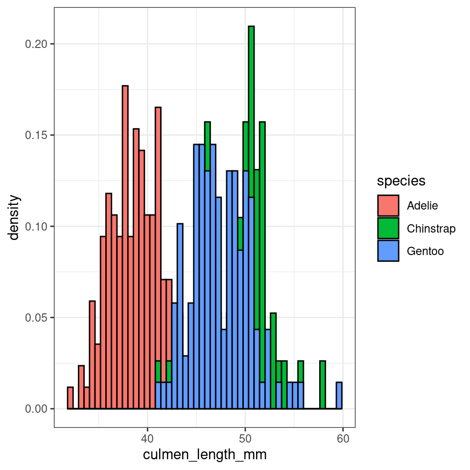

### Choosing and using colour palettes

You can specify what colours you want to assign to variables in a number of different ways. 

In ggplot2, colors that are assigned to variables are modified via the scale_color_* and the scale_fill_* functions. In order to use color with your data, most importantly you need to know if you are dealing with a categorical or continuous variable. The color palette should be chosen depending on type of the variable:

* **sequential or diverging** color palettes being used for continuous variables 

* **qualitative** color palettes for (unordered) categorical variables:


You can pick your own sets of colours and assign them to a categorical variable. The number of specified colours **has** to match the number of categories. You can use a wide number of preset colour [names](https://www.datanovia.com/en/blog/awesome-list-of-657-r-color-names/) or you can use [hexadecimals](https://www.datanovia.com/en/blog/awesome-list-of-hexadecimal-colors-you-should-have/). 


```r
## Custom colours ----

pal <- c(
  "Adelie" = "#FF8C00", 
  "Chinstrap" = "#A034F0", 
  "Gentoo" = "#159090")

penguins |> 
  ggplot(aes(x=flipper_length_mm, 
             y = body_mass_g))+
  geom_point(aes(colour=species))+
  scale_color_manual(values=pal)+
  theme_minimal()
```


You can also use a range of inbuilt colour palettes: 


```r
penguins |> 
  ggplot(aes(x=flipper_length_mm, 
             y = body_mass_g))+
  geom_point(aes(colour=species))+
  scale_color_brewer(palette="Set1")+
  theme_minimal()
```


<div class="info">
<p>You can explore all schemes available with the command
<code>RColorBrewer::display.brewer.all()</code></p>
</div>

There are also many, many extensions that provide additional colour palettes. Some of my favourite packages include [ggsci](https://cran.r-project.org/web/packages/ggsci/vignettes/ggsci.html) and [wesanderson](https://github.com/karthik/wesanderson)


### Redundant aesthetics

Specifications made using `aes()` are inherited from the top layer of a ggplot by default. This means that if you set an aesthetic mapping at the beginning of your ggplot, it will apply to all subsequent layers *unless you explicitly override it in a specific layer*. This inheritance simplifies the process of maintaining consistent aesthetics throughout your plot.


```r
penguins |> 
  ggplot(aes(x=flipper_length_mm, 
             y = body_mass_g))+
  geom_point(aes(colour=species))+
  geom_smooth(aes(colour = species), # both geoms use aes(colour = species)
              method = "lm", se = FALSE) +
  scale_color_brewer(palette="Set1")+
  theme_minimal()
```


```r
penguins |> 
  ggplot(aes(x=flipper_length_mm, 
             y = body_mass_g,
             colour = species))+ # this can be set at the ggplot layer
  geom_point()+
  geom_smooth(method = "lm", se  = FALSE) +
  scale_color_brewer(palette="Set1")+
  theme_minimal()
```


### Accessible colours

It's very easy to get carried away with colour palettes, but you should remember at all times that your figures must be accessible. One way to check how accessible your figures are is to use a colour blindness checker [colorBlindness](https://cran.r-project.org/web/packages/colorBlindness/vignettes/colorBlindness.html)


```r
## Check accessibility ----

library(colorBlindness)
colorBlindness::cvdPlot() # will automatically run on the last plot you made
```

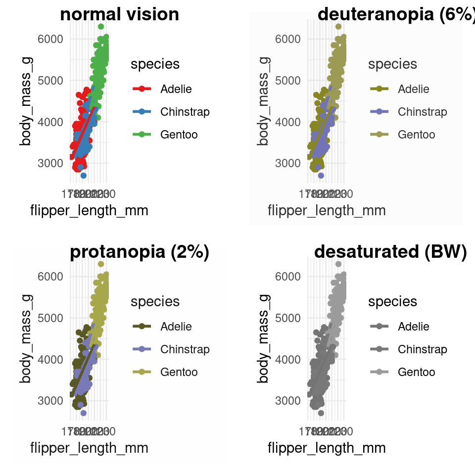


#### Guides to visual accessibility 

Using colours to tell categories apart can be useful, but as we can see in the example above, you should choose carefully. Other aesthetics which you can access in your geoms include `shape`, and `size` - you can combine these in complimentary ways to enhance the accessibility of your plots. Here is a hierarchy of "interpretability" for different types of data 


## Axes

ggplot will automatically pick the scale for each axis, and the type of coordinate space. Most plots are in Cartesian (linear X vs linear Y) coordinate space.

You might have observed that depending on how your data is distributed and the portion of the plot visible, the axis values can vary. Sometimes, we prefer to keep these values consistent. To achieve this, we've already used functions to control axis scaling in previous sections of this paper – specifically, the "scale_*" functions.

Now, we'll utilize "scale_x_continuous()" and "scale_y_continuous()" for setting our desired values on the axes. The key parameters in both functions are "limits" (defined as "limits = c(value, value)") and "breaks" (which represent the tick marks, specified as "breaks = value:value"). It's important to note that "limits" comprise only two values (the minimum and maximum), while "breaks" consists of a range of values (for instance, from 0 to 100).

For this plot, let’s say we want the x and y origin to be set at 0. To do this we can add in `xlim()` and `ylim()` functions, which define the limits of the axes:


```r
## Set axis limits ----
penguins |> 
  ggplot(aes(x=flipper_length_mm, 
             y = body_mass_g,
             colour=species))+ 
  geom_point()+
  geom_smooth(method="lm",    
              se=FALSE)+
  scale_color_brewer(palette="Set1")+
  scale_x_continuous(limits = c(0,240), breaks = c(30,60,90,120,150,180,210,240))+
  scale_y_continuous(limits = c(0,7000), breaks = (0:7000))
```

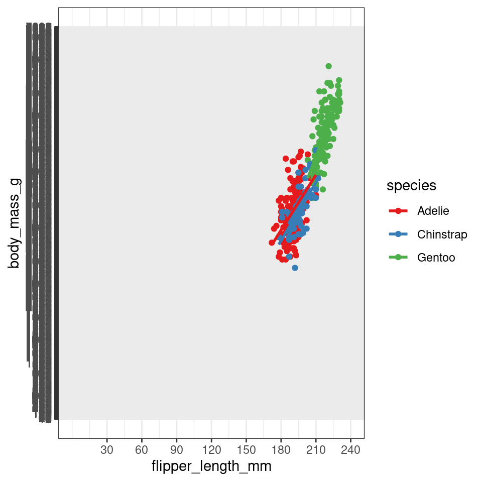


```r
## Set axis limits ----
penguins |> 
  ggplot(aes(x=flipper_length_mm, 
             y = body_mass_g,
             colour=species))+ 
  geom_point()+
  geom_smooth(method="lm",    
              se=FALSE)+
  scale_color_brewer(palette="Set1")+
  scale_x_continuous(limits = c(0,240), breaks = seq(0,240,30))+
  scale_y_continuous(limits = c(0,7000), breaks = seq(0,7000, 1000))
```

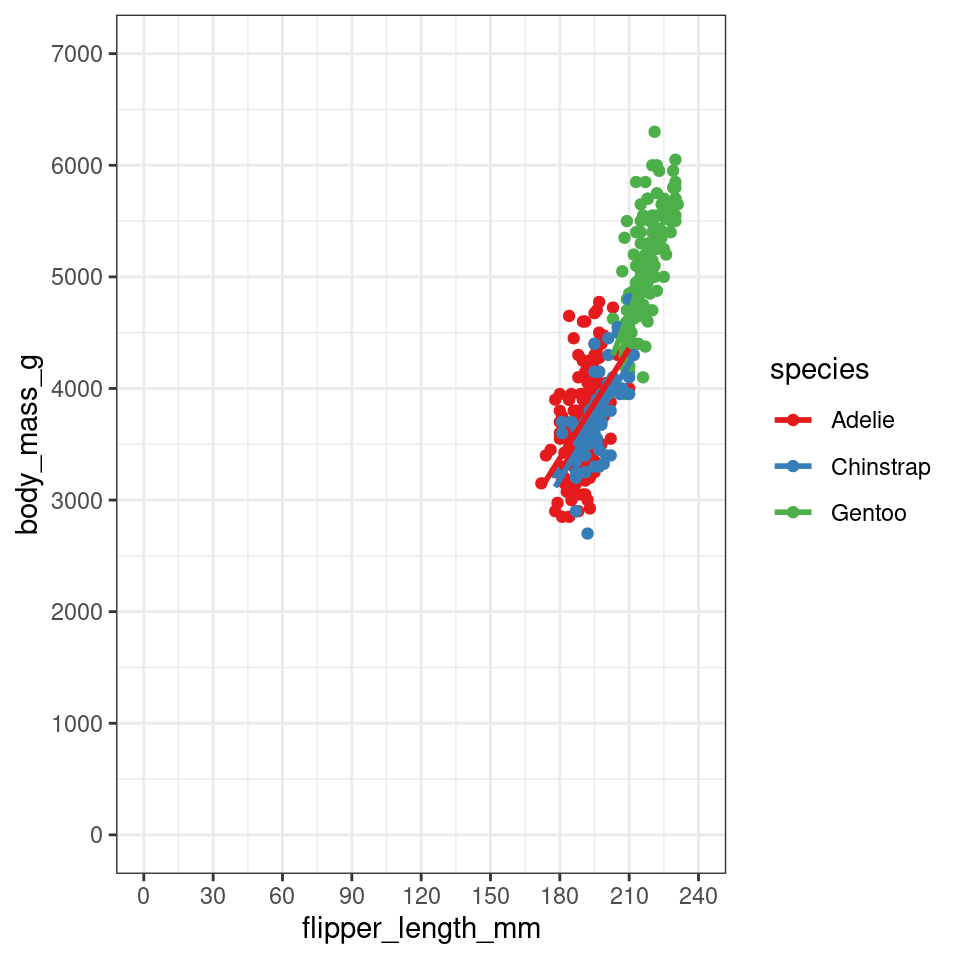

Further, we can control the coordinate space using `coord()` functions. Say we want to flip the x and y axes, we add `coord_flip()`:


```r
penguins |> 
  ggplot(aes(x=flipper_length_mm, 
             y = body_mass_g,
             colour=species))+ 
  geom_point()+
  geom_smooth(method="lm",    
              se=FALSE)+
  scale_color_brewer(palette="Set1")+
  scale_x_continuous(limits = c(0,240), breaks = seq(0,240,30))+
  scale_y_continuous(limits = c(0,7000), breaks = seq(0,7000, 1000))+
  coord_flip()
```


### Discrete scales

The same idea of limits within a scale_* function can also be used to change the order of categories on a discrete scale. For example if we look at our boxplots again


```r
penguins |> 
  drop_na(sex) |> 
ggplot(aes(x = species, y = culmen_length_mm)) +
  geom_violin(aes(fill = sex),
              width = 0.5)+
  scale_fill_brewer(palette = "Dark2")
```


The figures always default to the alphabetical order. Sometimes that is what we want; sometimes that is not what we want. If we wanted to switch the order we would use the `scale_x_discrete()` function and set the limits within it (limits = c("category","category")) as follows:


```r
penguins |> 
  drop_na(sex) |> 
ggplot(aes(x = species, y = culmen_length_mm)) +
  geom_violin(aes(fill = sex),
              width = 0.5)+
  scale_fill_brewer(palette = "Dark2") +
  scale_x_discrete(limits = c("Gentoo","Chinstrap")) 
```


What you can see from this example is that the `scale_*_` arguments actually control what data is plotted - if we wish to zoom in and out on a subsection of a plot, without actually eliminating data we use a different function

### Zooming in and out

We have seen how we can set the parameters for the axes for both continuous and discrete scales.

It can be very beneficial to be able to zoom in and out of figures, mainly to focus the frame on a given section. One function we can use to do this is the `coord_cartesian()`, in ggplot2. The main arguments are the limits on the x-axis `(xlim = c(value, value))`, the limits on the y-axis `(ylim = c(value, value))`, and whether to add a small expansion to those limits or not `(expand = TRUE/FALSE)`.


```r
penguins |> 
  ggplot(aes(x=flipper_length_mm, 
             y = body_mass_g,
             colour=species))+ 
  geom_point()+
  geom_smooth(method="lm",    
              se=FALSE)+
  scale_color_brewer(palette="Set1")+
  coord_cartesian(xlim = c(180,210), ylim = c(3000,4000), expand = FALSE)
```

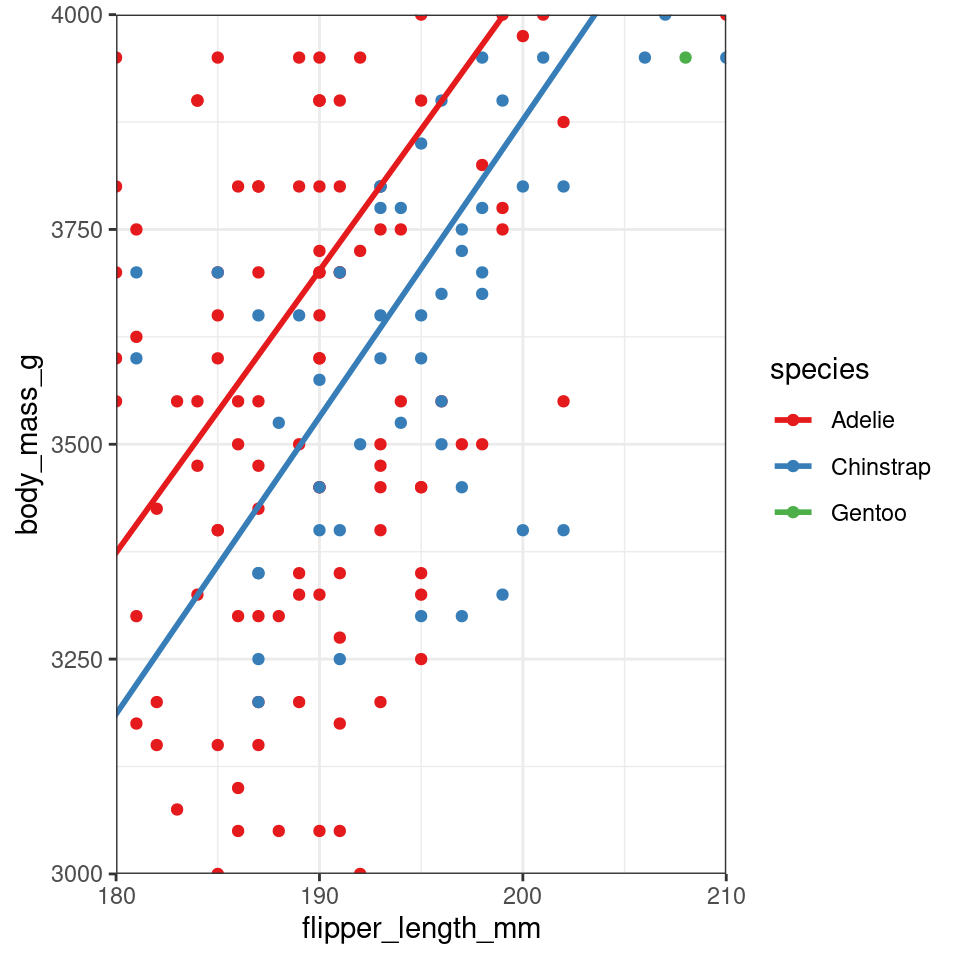

## Labels

By default, the axis labels will be the column names we gave as aesthetics aes(). We can change the axis labels using the xlab() and ylab() functions. Given that column names are often short and can be cryptic, this functionality is particularly important for effectively communicating results.


```r
## Custom labels ----
penguins |> 
  ggplot(aes(x=flipper_length_mm, 
             y = body_mass_g,
             colour=species))+ 
  geom_point()+
  geom_smooth(method="lm",    
              se=FALSE)+
  scale_color_brewer(palette="Set1")+
  labs(x = "Flipper length (mm)",
       y = "Body mass (g)")
```


### Titles and subtitles


```r
## Add titles ----
penguins |> 
  ggplot(aes(x=flipper_length_mm, 
             y = body_mass_g,
             colour=species))+ 
  geom_point()+
  geom_smooth(method="lm",    
              se=FALSE)+
  scale_color_brewer(palette="Set1")+
  labs(x = "Flipper length (mm)",
       y = "Body mass (g)",
       title= "Penguin Size, Palmer Station LTER",
       subtitle= "Flipper length and body mass for three penguin species")
```


### Controlling the legend

We have the ability to control legend placement, this can be done by setting `theme(legend.position = ...)` to either "top", "bottom", "left" or "right" as shown:


```r
penguins |> 
  ggplot(aes(x=flipper_length_mm, 
             y = body_mass_g,
             colour=species))+ 
  geom_point()+
  geom_smooth(method="lm",    
              se=FALSE)+
  scale_color_brewer(palette="Set1")+
  labs(x = "Flipper length (mm)",
       y = "Body mass (g)",
       title= "Penguin Size, Palmer Station LTER",
       subtitle= "Flipper length and body mass for three penguin species")+
  theme(legend.position ="top")
```


Or even as a coordinate within your figure expressed as a propotion of your figure - i.e. c(x = .8, y = .2) would be the bottom right of your figure


```r
penguins |> 
  ggplot(aes(x=flipper_length_mm, 
             y = body_mass_g,
             colour=species))+ 
  geom_point()+
  geom_smooth(method="lm",    
              se=FALSE)+
  scale_color_brewer(palette="Set1")+
  labs(x = "Flipper length (mm)",
       y = "Body mass (g)",
       title= "Penguin Size, Palmer Station LTER",
       subtitle= "Flipper length and body mass for three penguin species")+
  theme(legend.position = c(.8,.2))
```


### Controlling redundant legends

This plot shows quite an ugly legend as it plots a layer for the boxplot and the violin at the same time


```r
penguins |> 
  drop_na(sex) |> 
ggplot(aes(x = species, y = culmen_length_mm, fill = species)) +
  geom_violin(width = .5,
              alpha = .4)+
  geom_boxplot(width = .2)+
  scale_fill_brewer(palette = "Dark2") 
```


You can use the `show.legend` argument within the `geom_boxplot()` function and set it to `FALSE`. This will prevent the geom_boxplot from being included in the legend. Here's an example:


```r
penguins |> 
  drop_na(sex) |> 
ggplot(aes(x = species, y = culmen_length_mm, fill = species)) +
  geom_violin(width = .5,
              alpha = .4)+
  geom_boxplot(width = .2,
               show.legend = FALSE)+
  scale_fill_brewer(palette = "Dark2") 
```

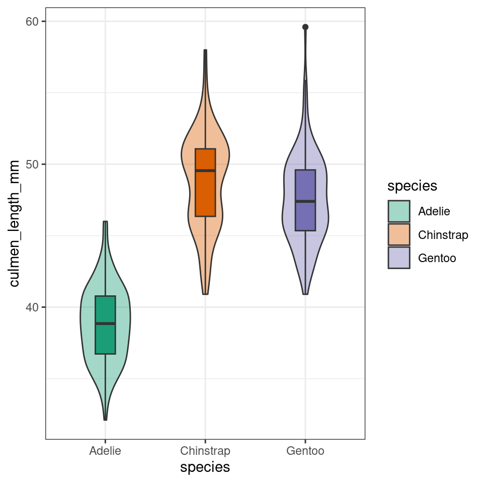

And of course - we can agree that the legend is actually redundant here, as the x-axis plots the species names. So we can remove it entirely with the `theme()` function.


```r
penguins |> 
  drop_na(sex) |> 
ggplot(aes(x = species, y = culmen_length_mm, fill = species)) +
  geom_violin(width = .5,
              alpha = .4)+
  geom_boxplot(width = .2)+
  scale_fill_brewer(palette = "Dark2") +
  theme(legend.position = "none")
```

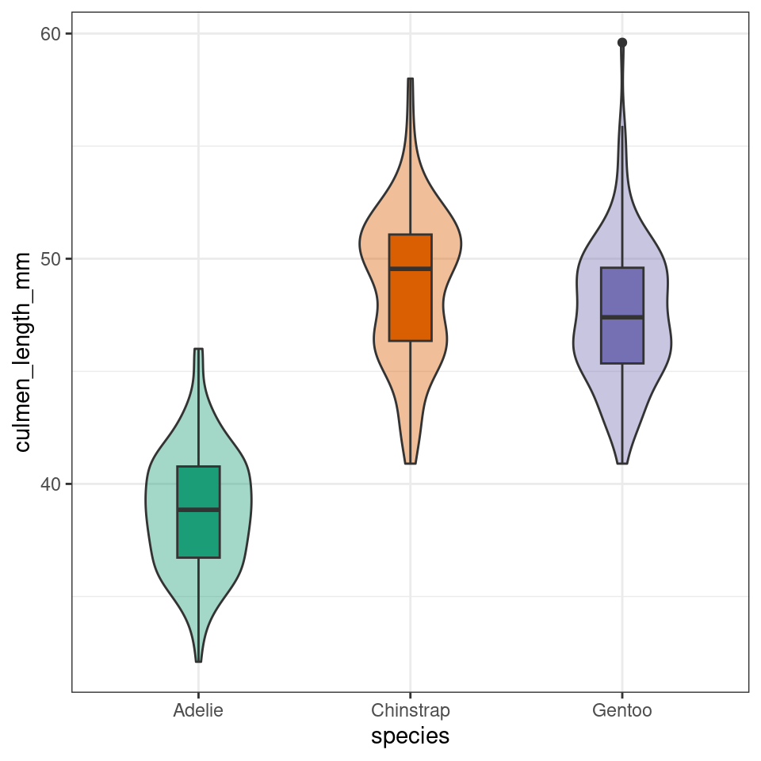

We can also choose to remove specific aesthetics from the legends using `guides()`


```r
penguins |> 
  drop_na(sex) |> 
ggplot(aes(x = species, y = culmen_length_mm, fill = species)) +
  geom_violin(width = .5,
              alpha = .4)+
  geom_boxplot(width = .2)+
  scale_fill_brewer(palette = "Dark2") +
  guides(fill = "none")
```


## Themes

Finally, the overall appearance of the plot can be modified using theme() functions. The default theme has a grey background.
You may prefer `theme_classic()`, a `theme_minimal()` or even `theme_void()`. Try them out.


```r
## Custom themes ----
penguins |> 
  ggplot(aes(x=flipper_length_mm, 
             y = body_mass_g,
             colour=species))+ 
  geom_point()+
  geom_smooth(method="lm",    
              se=FALSE)+
  scale_color_brewer(palette="Set1")+
  labs(x = "Flipper length (mm)",
       y = "Body mass (g)",
       title= "Penguin Size, Palmer Station LTER",
       subtitle= "Flipper length and body mass for three penguin species")+
  theme_void()
```

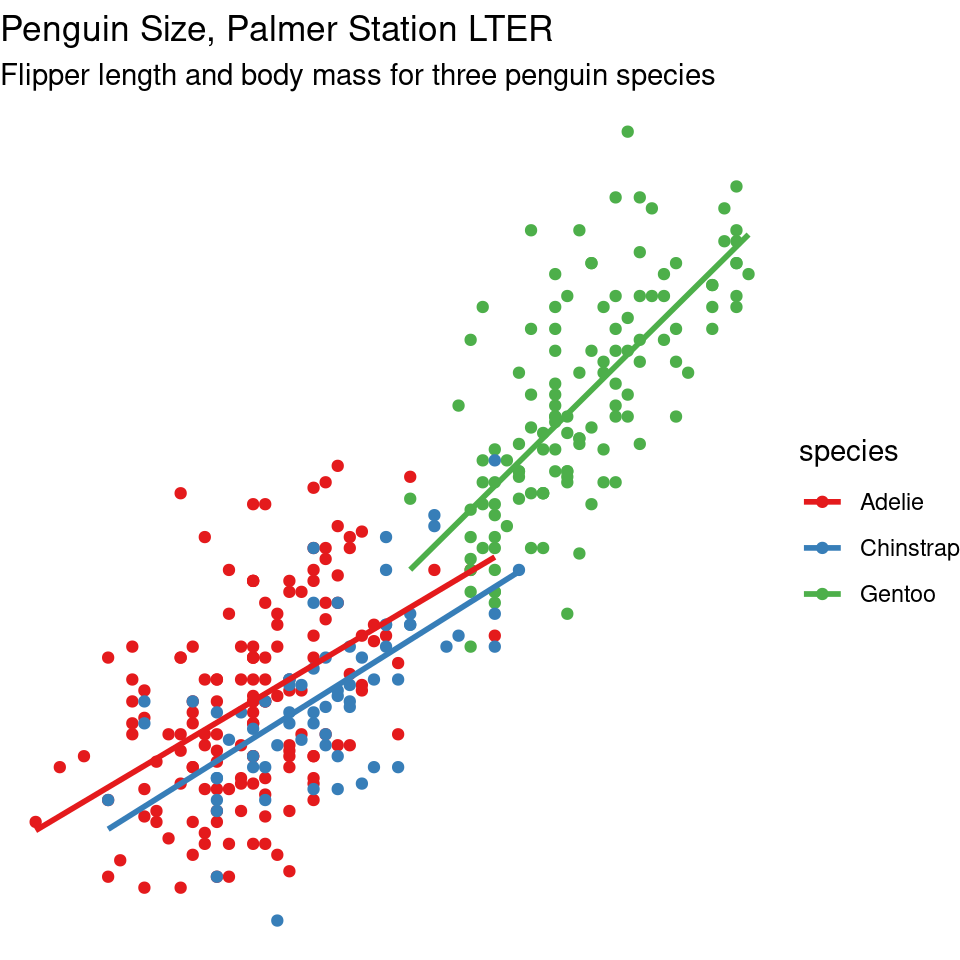


```r
## Custom themes ----
penguins |> 
  ggplot(aes(x=flipper_length_mm, 
             y = body_mass_g,
             colour=species))+ 
  geom_point()+
  geom_smooth(method="lm",    
              se=FALSE)+
  scale_color_brewer(palette="Set1")+
  labs(x = "Flipper length (mm)",
       y = "Body mass (g)",
       title= "Penguin Size, Palmer Station LTER",
       subtitle= "Flipper length and body mass for three penguin species")+
  theme_void()+
  theme(legend.position = c(.8, .2)) # note theme customisations must come AFTER theme sets or they will be overridden
```


<div class="info">
<p>There is a lot more customisation available through the theme()
function. We will look at making our own custom themes in later
lessons</p>
<p>You can also try installing and running an even wider range of
pre-built themes if you install the R package <a
href="https://yutannihilation.github.io/allYourFigureAreBelongToUs/ggthemes/">ggthemes</a>.</p>
<p>First you will need to run the
<code>install.packages("ggthemes")</code> command. Remember this is one
of the few times a command should NOT be written in your script but
typed directly into the console. That’s because it’s rude to send
someone a script that will install packages on their computer - think of
<code>library()</code> as a polite request instead!</p>
<p>To access the range of themes available type
<code>help(ggthemes)</code> then follow the documentation to find out
what you can do.</p>
</div>


## Multiple plots

### Facets

Adding combinations of different aesthetics allows you to layer more information onto a 2D plot, sometimes though things will just become *too* busy. At the point where it becomes difficult to see the trends or differences in your plot then we want to break up a single plot into sub-plots; this is called ‘faceting’. Facets are commonly used when there is too much data to display clearly in a single plot. We will revisit faceting below, however for now, let’s try to facet the plot according to sex.

To do this we use the tilde symbol ‘~’ to indicate the column name that will form each facet.


```r
## Facetting ----
penguins |> 
  drop_na(sex) |> 
  ggplot(aes(x=flipper_length_mm, 
             y = body_mass_g,
             colour=species))+ 
  geom_point()+
  geom_smooth(method="lm",    
              se=FALSE)+
  scale_color_brewer(palette="Set1")+
  facet_wrap(~sex)
```


### Patchwork

There are many times you might want to *combine* separate figures into multi-panel plots. Probably the easiest way to do this is with the `patchwork` package (@R-patchwork). 


```r
## Patchwork ----
library(patchwork)

p1 <- penguins |> 
  ggplot(aes(x=flipper_length_mm, 
             y = culmen_length_mm))+
  geom_point(aes(colour=species))+
  scale_color_manual(values=pal)+
  theme_minimal()

p2 <- penguins |> 
  ggplot(aes(x=culmen_depth_mm, 
             y = culmen_length_mm))+
  geom_point(aes(colour=species))+
  scale_color_manual(values=pal)+
  theme_minimal()

p3 <- penguins |>     
  group_by(sex,species) |> 
    summarise(n=n()) |> 
     drop_na(sex) |> 
     ggplot(aes(x=species, y=n)) + 
  geom_col(aes(fill=sex), 
               width=0.8,
               position=position_dodge(width=0.9), 
               alpha=0.6)+
     scale_fill_manual(values=c("darkorange1", "azure4"))+
     theme_classic()

 (p1+p2)/p3+
  plot_layout(guides = "collect") 
```

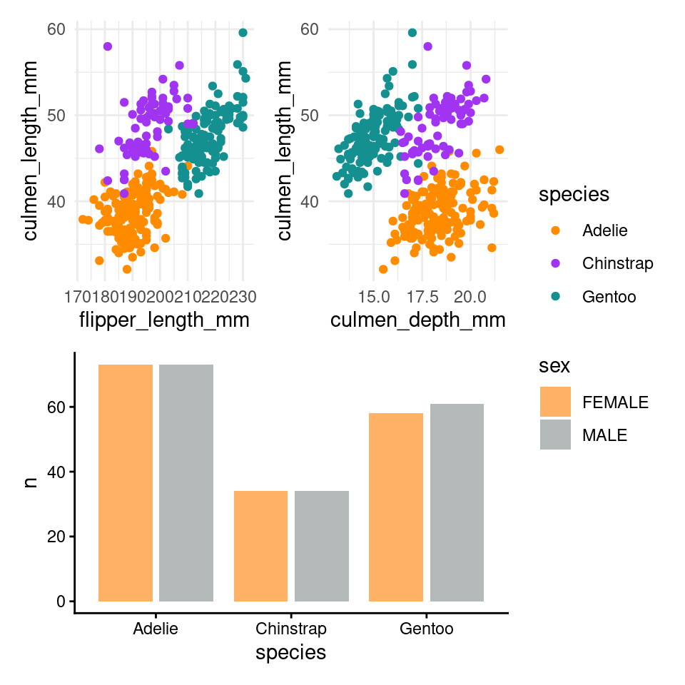


## Fonts

You can customise the fonts used in themes. All computers should be able to recognise the families "sans", "serif", and "mono", and some computers will be able to access other installed fonts by name.

The easiest way to add lots of custom fonts is with `showtext`. 

The second argument, family, is optional. It gives the family name of the font that will be used in R. In other words, it means that the name used to refer to the font in R does not need to be the same than the original name of the font. In this case, the font Special Elite is going to be the special family.

`showtext_auto()` must be called to indicate that showtext is going to be automatically invoked to draw text whenever a plot is created.


```r
library(showtext)
font_add_google("Special Elite", family = "special")
showtext_auto()
```

## Activity: Replicate this figure

<div class="try">
<p>How close can you get to replicating the figure below?</p>
<p>Make a NEW script for this assignment - replicate_figure.R</p>
<p>Make sure to use the tips and links at the end of this chapter, when
you are done save the file</p>
</div>

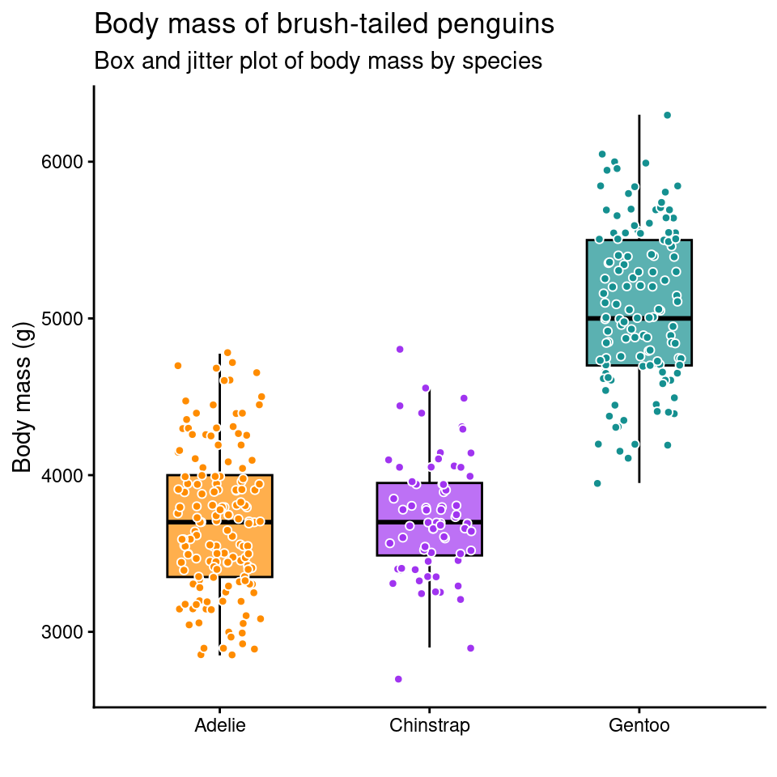


<div class='webex-solution'><button>Solution</button>


```r
pal <- c(
  "Adelie" = "#FF8C00", 
  "Chinstrap" = "#A034F0", 
  "Gentoo" = "#159090")

penguins |> 
  ggplot(aes(x = species, y = body_mass_g, color = species, fill = species)) +
      geom_boxplot(aes(fill = species),
               colour = "black",
        width = .5,
        outlier.shape = NA,
        alpha = .7)+
  geom_jitter(width =.2,
              shape = 21,
              colour = "white")+
  scale_fill_manual(values = pal)+
  scale_colour_manual(values = pal)+
  theme_classic()+
  theme(legend.position = "none")+
    labs(
    x = "",
    y = "Body mass (g)",
    title = "Body mass of brush-tailed penguins",
    subtitle = "Box and jitter plot of body mass by species")
```


</div>


## Saving

One of the easiest ways to save a figure you have made is with the `ggsave()` function. By default it will save the last plot you made on the screen. 

You should specify the output path to your **figures** folder, then provide a file name. Here I have decided to call my plot *plot* (imaginative!) and I want to save it as a .PNG image file. I can also specify the resolution (dpi 300 is good enough for most computer screens).


```r
# OUTPUT FIGURE TO FILE

ggsave("outputs/YYYYMMDD_ggplot_workshop_final_plot.png", dpi=300)
```

<div class="try">
<p>If you got this far and still have time why not try one of the
following:</p>
<ol style="list-style-type: decimal">
<li><p>Making another type of figure using the penguins dataset, use the
further reading below to use for inspiration.</p></li>
<li><p>Use any of your own data</p></li>
</ol>
</div>


### What we learned

You have learned

* The anatomy of ggplots

* How to add geoms on different layers

* How to use colour, colour palettes, facets, labels and themes

* Putting together multiple figures

* How to save and export images


## Further Reading, Guides and tips on data visualisation

* [R Cheat Sheets](https://www.rstudio.com/resources/cheatsheets/)

* [Fundamentals of Data Visualization](https://clauswilke.com/dataviz/): this book tells you everything you need to know about presenting your figures for accessbility and clarity

* [Beautiful Plotting in R](https://www.cedricscherer.com/2019/08/05/a-ggplot2-tutorial-for-beautiful-plotting-in-r/): an incredibly handy ggplot guide for how to build and improve your figures

* [The ggplot2 book](https://ggplot2-book.org/): the original Hadley Wickham book on ggplot2


# Extensions for ggplot2


This tutorial has but scratched the surface of the visualisation options available using R. Here I have provided some further advanced plots and customisation options for those who are feeling confident with the content covered in this tutorial. However, the below plots give an idea of what is possible.

Check out https://exts.ggplot2.tidyverse.org/ for the full list of approved extensions for ggplot

## ggdist

### Rainclouds

Raincloud plots combine a density plot, boxplot, raw data points, and any desired summary statistics for a complete visualisation of the data. They are so called because the density plot plus raw data is reminiscent of a rain cloud.


```r
library(ggdist)

penguins |> 
    ggplot(aes(x = species,
               y = culmen_length_mm,
              fill = species)) +
  ggdist::stat_halfeye(
    point_colour = NA,
    .width = 0,
    # shift raincloud up
    justification = -.2)+
  geom_boxplot(# remove outlier dots
    outlier.shape = NA,
    # shrink width of box
    alpha = .4,
    # fade box
               width = .1)+
  ggdist::stat_dots(aes(colour = species),
                  # put dots underneath
                    side = "left",
                  # move position down
                    justification = 1.1,
                  # size of dots 
                    dotsize = .2,
                    
                  # adjust bins (grouping) of dots
                    binwidth = .4)+
  scale_fill_manual(values = pal) +
  scale_colour_manual(values = pal)+
  guides(fill = "none")+
  coord_flip() # rotate figure
```

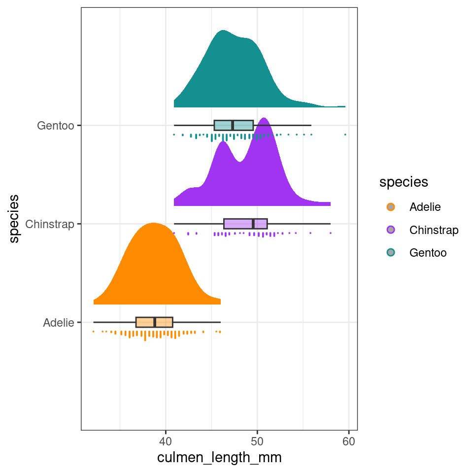


### Interval plots

An interval plot is a type of data visualization that is used to display intervals or ranges associated with data points. It is particularly useful for visualizing uncertainty or variability in the data. Interval plots can be used to represent various types of intervals, such as confidence intervals, prediction intervals, or any other kind of range or interval associated with the data. 


```r
penguins |> 
  drop_na(sex) |> 
    ggplot(aes(x = species,
               y = culmen_length_mm))+
  ggdist::stat_interval(.width = c(.5, .66, .95))+
  ggdist::stat_halfeye(aes(fill = sex),
                       .width = 0,
                       shape = 21,
                       colour = "white",
                       slab_alpha = .4,
                       size = .5,
                       position = position_nudge(x = .05))+
  scale_color_viridis_d(option = "mako", direction = -1, end = .9)
```


## Density

A density plot is a data visualization technique used to represent the distribution of a continuous numeric variable. It provides a smoothed estimate of the probability density function (PDF) of the data, showing where values are concentrated and where they are sparse. Density plots are particularly useful for visualizing the shape, central tendency, and spread of data.


```r
library(ggdensity)

penguins |>  
    ggplot(aes(x = culmen_length_mm, 
               y = culmen_depth_mm,
               colour = species)) +
  geom_point(alpha = .2) +
  ggdensity::geom_hdr_lines()+
   scale_colour_manual(values = pal)
```

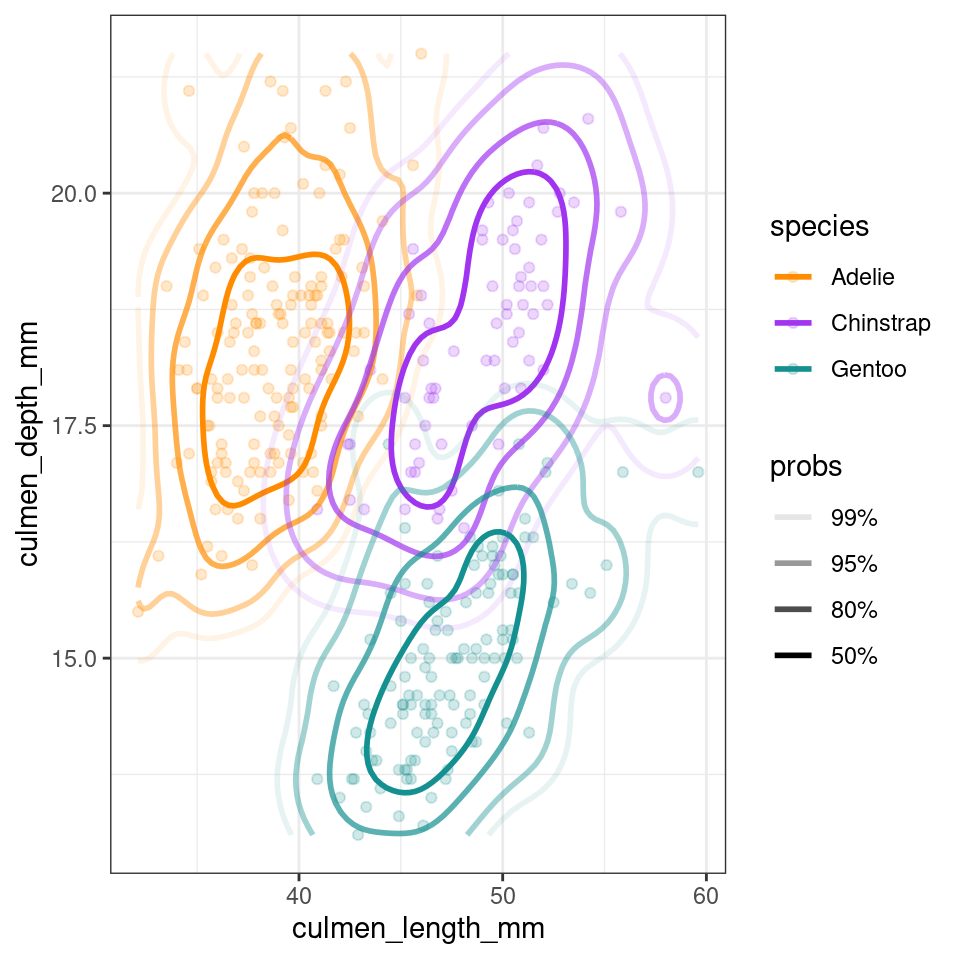

## ggridges

A ridge plot is a data visualization technique that is similar to a density plot but is designed for displaying multiple probability density distributions side by side, allowing for easier comparison between different groups or categories. Ridge plots are particularly useful when you want to visualize and compare the distribution of multiple continuous variables or data sets simultaneously.


```r
library(ggridges)

penguins |>  
    ggplot(aes(x = culmen_length_mm, 
               y = species,
               fill = species)) +
  geom_density_ridges() + # use hjust and vjust to position text
  scale_fill_manual(values = pal) +
  scale_colour_manual(values = pal)+
  theme(legend.position = "none")
```

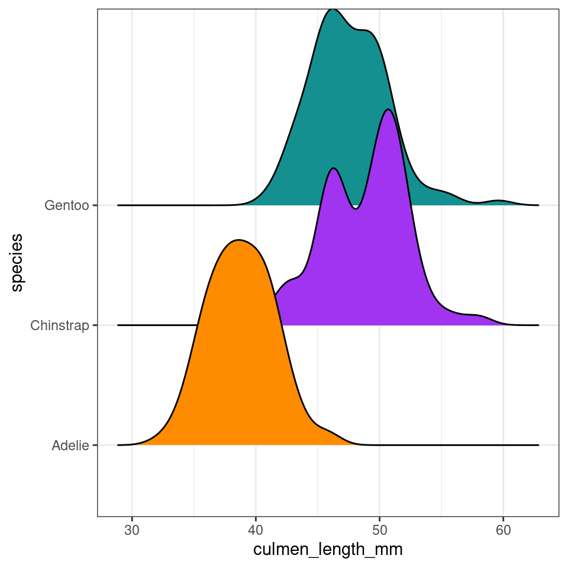

## Bump charts

A bump chart, also known as a line chart or path chart, is a data visualization technique used to show the ranking and changes in ranking of entities (such as teams, players, or products) over time or across different categories. Bump charts are especially useful for visualizing the rise and fall of ranked items, making it easy to identify trends and compare changes in relative position.


```r
library(ggbump)

penguin_summary <- penguins |> 
  mutate(date_egg = dmy(date_egg)) |> 
  filter(clutch_completion == "Yes") |> 
  mutate(year = year(date_egg)) |> 
  group_by(species, year) |> 
  summarise(n = n())

penguin_summary |>
  ggplot(aes(x = year, 
             y = n,
             colour = species))+
  geom_point(size = 7)+
  geom_bump()+
  geom_text(data = penguin_summary |> filter(year == max(year)),
                                             aes(x = year + 0.1,
                                                 label = species,
                                                  hjust = 0),
            size = 5)+
  scale_x_continuous(limits = c(2007, 2009.5),
                     breaks = (2007:2009))+
  labs(y = "Total number of complete clutches")+
  scale_fill_manual(values = pal) +
  scale_colour_manual(values = pal)+
  theme(legend.position = "none")
```


## Dumbell charts

A dumbbell chart is a data visualization technique that is used to compare two data points for multiple categories or entities. It is called a "dumbbell" chart because it often resembles a pair of dumbbells, with circles or dots representing the data points at the ends of a line connecting them. Dumbbell charts are useful for comparing before-and-after values, two different groups, or any two related data points for different categories or entities.


```r
library(ggalt)

summary_counts <- penguins |> 
  group_by(sex, species) |> 
  summarise(mean = mean(body_mass_g, na.rm = T)) |> 
  pivot_wider(names_from = sex, values_from = mean)

ggplot(summary_counts, 
       aes(y=species, x=FEMALE, xend=MALE)) +
  geom_dumbbell(size=3, color="#e3e2e1",
                colour_x = "#5b8124", colour_xend = "#bad744") +
  geom_text( x=summary_counts[[3,2]], y=3, aes(label="Female"),
             color="#9fb059", size=3, vjust=-2, fontface="bold")+
  geom_text(x=summary_counts[[3,3]], y=3, aes(label="Male"),
             color="#bad744", size=3, vjust=-2, fontface="bold")+
  labs(x = "Body mass (g)",
       y = "")
```


## Facets

The `facet_nested()` function in the `ggh4x` package is used for creating nested or hierarchical faceting in ggplot2 plots. Faceting is the process of breaking down a data visualization into multiple subplots or panels based on one or more categorical variables, allowing you to see how the data behaves within different categories. Nested faceting allows you to further subdivide these panels into smaller panels, creating a hierarchy of facets.


```r
library(ggh4x)

penguins |> 
  mutate(Nester = ifelse(species=="Gentoo", "Crustaceans", "Fish & Krill")) |> 
  ggplot(aes(x = culmen_length_mm,
             y = culmen_depth_mm,
             colour = species))+
  geom_point()+
  facet_nested(~ Nester + species)+
  scale_colour_manual(values = pal)+
  theme(legend.position = "none")
```


## Highlighting

Using plot highlighting, such as the gghighlight package in R, can be beneficial in data visualization for several reasons:

- Emphasizing Key Information: Plot highlighting allows you to draw attention to specific data points or groups of interest. This can be helpful when you want to highlight outliers, key observations, or certain categories that are important in your data.

- Enhanced Interpretation: Highlighting specific elements in a plot can make it easier for viewers to interpret and understand the data. By reducing visual clutter and emphasizing relevant information, you can improve the effectiveness of your data visualization.

- Storytelling: Plot highlighting is a useful tool for storytelling in data visualization. You can use it to guide the viewer's attention and convey the main message or story behind the data.

- Comparative Analysis: Highlighting allows you to compare specific data points or groups more easily. For example, you can highlight one group against others to demonstrate differences or trends.


```r
library(gghighlight)

penguins |> 
  ggplot(aes(body_mass_g,
             fill = species),
         position = "identity")+
  geom_histogram()+
  gghighlight()+
  scale_fill_manual(values = pal)+
  facet_wrap(~ species)
```


```r
library(ggbeeswarm)
library(gghighlight)
penguins |> 
    ggplot(aes(x = species,
               y = body_mass_g,
               fill = species))+
    geom_beeswarm(shape = 21, 
                  colour = "white")+
    scale_fill_manual(values = pal)+
    gghighlight(body_mass_g > 4000)
```

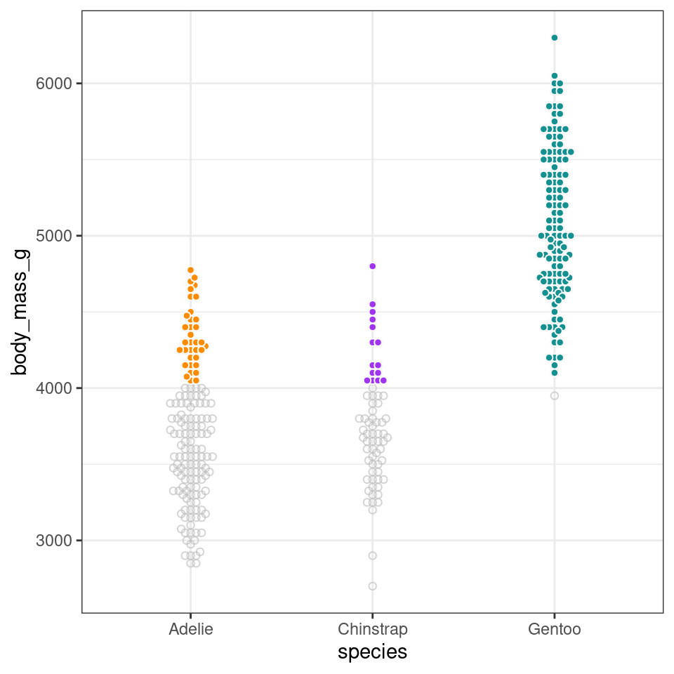

## Text

Annotating a chart with text is a common and valuable practice in data visualization for several important reasons:

- Provide Context: Text annotations help to provide context and background information for the data. They explain what the chart represents, the variables involved, and the meaning of various data points or patterns. This context is crucial for viewers who may not be familiar with the data or the chart.

- Highlight Key Points: Text annotations can be used to emphasize and draw attention to important findings or insights in the data. You can use annotations to highlight specific data points, trends, outliers, or other notable features in the chart.

- Label Data: Annotating a chart with labels helps to identify individual data points, data series, or categories. This is especially useful in scatterplots, bar charts, and other types of visualizations where labeling individual elements is important.

- Clarify Relationships: Annotations can be used to clarify relationships between data points or groups. For example, you can add arrows and labels to indicate which data points are related or what causes certain patterns.

- Provide Sources and Citations: In cases where the data comes from external sources or studies, annotations can be used to provide proper attribution and citations to give credit to the data sources.

- Explain Methodology: Annotations can also explain the methodology or statistical techniques used to generate the chart, which is important for transparency and trust in data analysis.

Below I provide some packages that help with text annotation:

### ggforce


```r
penguins |> 
    ggplot(
        aes(x = culmen_length_mm,
            y= body_mass_g,
            colour = species)) +
    geom_point(aes(fill = species), shape = 21, colour = "white") +
    geom_smooth(method = "lm", se = FALSE,linetype = "dashed", alpha = .4)+
ggforce::geom_mark_ellipse(aes(
    label = species,
    filter = species == 'Adelie'),
    con.colour  = "#526A83",
    con.cap = 0,
    con.arrow = arrow(ends = "last",
                      length = unit(0.5, "cm")),
    show.legend = FALSE) +
    gghighlight(species == "Adelie")+
  scale_colour_manual(values = pal)+
  scale_fill_manual(values = pal)
```


### textpaths


```r
library(geomtextpath)

penguins |> 
    ggplot(aes(x = culmen_length_mm, 
               colour = species,
               label = species))+
  geom_textdensity( hjust = 0.35, vjust = .1)+ # use hjust and vjust to position text
  theme(legend.position = "none")
```

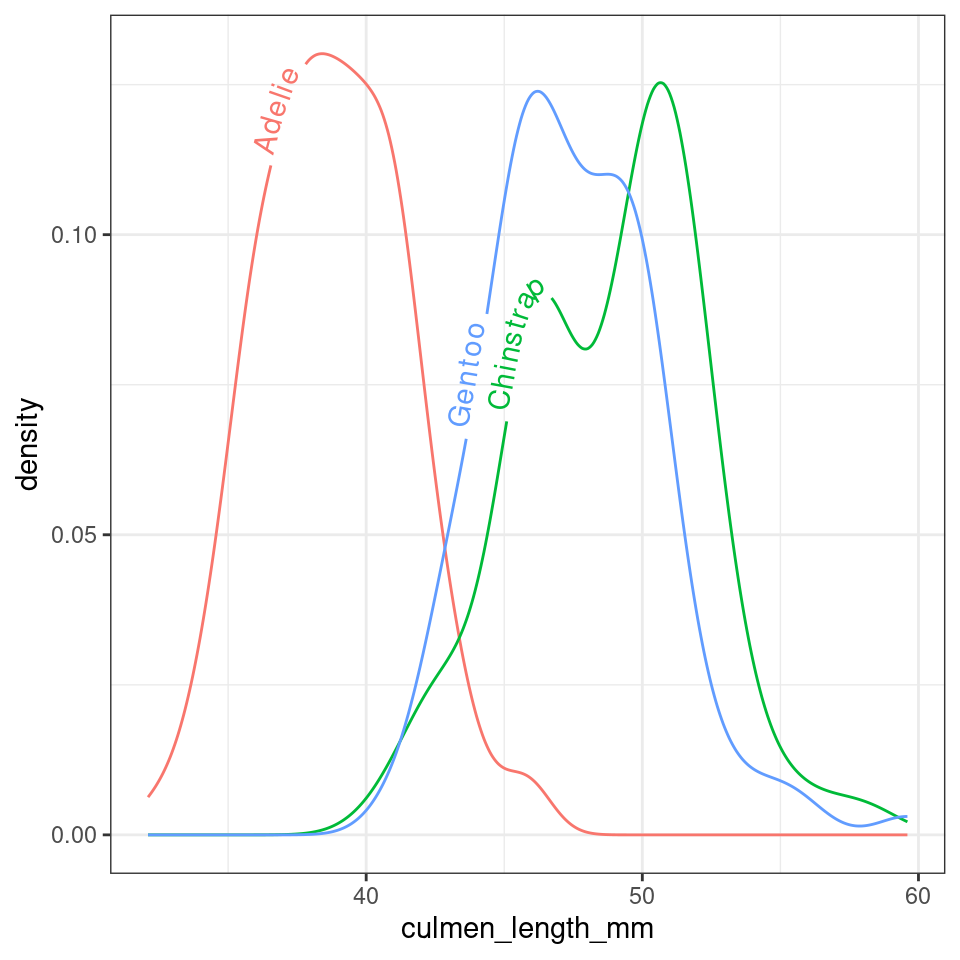

### ggtext


```r
library(ggtext)


penguins |> 
  mutate(species = fct_relevel(species, "Chinstrap", "Gentoo", "Adelie")) |> 
  group_by(species) |> 
    summarise(n=n()) |> 
ggplot(aes(x = species,
           y = n,
           fill = species))+
        geom_col()+
  geom_label(aes(label = n),
            fill = "white",
            nudge_y = 1,
            colour = "black",
            fontface = "bold")+
  labs(x = "",
       y = "Count",
       title = paste(
         'There are almost half the observations on <br> <span style = "color:#A034F0">Chinstrap</span> penguins,  as there are <br> on <span style = "color:#FF8C00">Adelie</span> and <span style ="color:#159090">Gentoo</span>penguins'
       ))+
  scale_fill_manual(
    # when reordering levels - be careful about keeping colours consistent!!! May need manually sorting
    values = pal)+
  coord_flip()+
  scale_y_continuous(limits = c(0, 200))+
  theme(legend.position = "none",
        axis.text.y = element_text(
      color = c( "#A034F0", "#159090", "#FF8C00")),
      plot.title = element_markdown())
```


### scales

The `scales`package provides much of the infrastructure that underlies ggplot2’s scales, and using it allow you to customize the transformations, breaks, and labels used by ggplot2. It is particularly good at providing sensible labels apply transformations such as a log scale. 


```r
library(scales)

penguins |>  
    ggplot(aes(x = culmen_length_mm, 
               y = species,
               fill = species)) +
  geom_density_ridges() + # use hjust and vjust to position text
  scale_fill_manual(values = pal) +
  scale_colour_manual(values = pal)+
  theme(legend.position = "none") +
  scale_x_continuous(labels = label_number(
    scale_cut = cut_si("mm")))+
  labs( x = "Bill length",
        y = "Species")
```


Here is a good example of the `scales` package in action.

The distribution of GDP per capita in the `gapminder` dataset is heavily skewed, with most countries reporting less than $10,000. As a result, the scatterplot makes an upside-down L shape. Try sticking a regression line on that and you’ll get in trouble.


```r
library(gapminder)
gapminder |> 
  filter(year == 2007) |> 
ggplot(aes(x = gdpPercap, y = lifeExp, color = continent)) +
  geom_point() +
  guides(color = "none") +
  labs(title = "GDP per capita",
       subtitle = "GDP per capita raw values")
```


Fit this onto a log scale (R's standard log function is the natural log). And we get a straighter line but some ugly axis labels.


```r
gapminder |> 
  filter(year == 2007) |> 
ggplot(aes(x = log(gdpPercap), y = lifeExp, color = continent)) +
  geom_point() +
  guides(color = "none") +
  labs(title = "GDP per capita, natural log (base e)",
       subtitle = "GDP per capita logged manually")
```


GGplot has a `scale_x/y_log10` scale but this applues the wrong transformation to our data - in this particular example there is little difference in the range of values when using a `log10` vs `log` transformation (as we will see in a moment).


```r
gapminder |> 
  filter(year == 2007) |> 
ggplot(aes(x = gdpPercap, y = lifeExp, color = continent)) +
  geom_point() +
  guides(color = "none") +
  labs(title = "GDP per capita, log (base 10)",
       subtitle = "GDP per capita logged with scale") +
  scale_x_log10()
```


But we can set whatever custom transformation we wish


```r
log_natural <- trans_new(
  name = "logn",
  transform = function(x) log(x),
  inverse = function(x) exp(x),
  breaks = log_breaks()
)

gapminder |> 
  filter(year == 2007) |> 
ggplot(aes(x = gdpPercap, y = lifeExp, color = continent)) +
  geom_point() +
  guides(color = "none") +
  labs(title = "GDP per capita, natural log (base e)",
       subtitle = "GDP per capita logged manually") +
  scale_x_continuous(trans = log_natural,
                     labels = label_dollar(accuracy = 1))
```


## Maps

Working with maps can be tricky. The `sf` package provides functions that work with ggplot2, such as `geom_sf()`. The `rnaturalearth` package provides high-quality mapping coordinates.


```r
library(sf)          # for mapping geoms
library(rnaturalearth) # for map data

# get and bind country data
uk_sf <- ne_states(country = "united kingdom", returnclass = "sf")
ireland_sf <- ne_states(country = "ireland", returnclass = "sf")
islands <- bind_rows(uk_sf, ireland_sf) %>%
  filter(!is.na(geonunit))

# set colours
country_colours <- c("Scotland" = "#0962BA",
                     "Wales" = "#00AC48",
                     "England" = "#FF0000",
                     "Northern Ireland" = "#FFCD2C",
                     "Ireland" = "#F77613")

ggplot() + 
  geom_sf(data = islands,
          mapping = aes(fill = geonunit),
          colour = NA,
          alpha = 0.75) +
  coord_sf(crs = sf::st_crs(4326),
           xlim = c(-10.7, 2.1), 
           ylim = c(49.7, 61)) +
  scale_fill_manual(name = "Country", 
                    values = country_colours)
```


## Layouts and compositions

Having control over layouts allow you to tailor the appearance of your plot to match your specific needs and preferences. You can control every aspect of the plot's design, including the arrangement of facets, legends, titles, and labels. When you need to create complex composite plots that combine multiple geoms and facets, custom layouts enable you to precisely position and arrange them. 


```r
library(patchwork)
library(png)
library(ggpubr)

penguin_pic <- png::readPNG("images/lter_penguins.png")

penguin_fig <- ggplot() +
  background_image(penguin_pic)
```


```r
text <- tibble(
  x = 0, y = 0, label = 'Simpsons Paradox is a statistical phenomenon where an association between two variables in a population emerges, disappears or reverses when the population is divided into subpopulations such as <span style = "color:#FF8C00">Adelie</span>, <span style ="color:#159090">Gentoo</span>, and <span style = "color:#A034F0">Chinstrap</span> penguin species'
)


pt <- ggplot(text, aes(x = x, y = y)) +
  ggtext::geom_textbox(
    aes(label = label),    # Map the 'label' column from the 'text' data to the text labels
    box.color = NA,         # Make the text box border color transparent
    width = unit(10, "lines"),  # Set the width of the text boxes to 15 lines
    color = "grey40",       # Set the text color to a light gray
    size = 3,             # Set the text size to 4 (adjust as needed)
    lineheight = 1.4        # Set the line height for text within the boxes
  ) +
  # Customize the plot coordinate system
  coord_cartesian(expand = FALSE, clip = "off") +

  # Apply a theme with a blank (void) background
  theme_void()

pt
```


```r
layout <- "
AACCC
AACCC
BBDDD
BBDDD
"

p1 <- ggplot(penguins, aes(x= culmen_length_mm, 
                     y= culmen_depth_mm)) +
    geom_point()+
  geom_smooth(method="lm",
              se=FALSE)+
  theme(legend.position="none")+
    labs(x="Bill length (mm)",
         y="Bill depth (mm)")

p2 <- ggplot(penguins, aes(x= culmen_length_mm, 
                     y= culmen_depth_mm,
                     colour=species)) +
    geom_point()+
  geom_smooth(method="lm",
              se=FALSE)+
  scale_colour_manual(values=pal)+
  theme(legend.position="none")+
    labs(x="Bill length (mm)",
         y="Bill depth (mm)")

p1 + p2 + 
  pt +  penguin_fig + 
  plot_layout(design = layout)
```


## Activity: Create a Publication-Style Multi-Panel Figure

Objective: Design and create a multi-panel data visualization figure in the style of a research publication. This exercise will challenge your skills in data visualization, data manipulation, and creating complex figures.

Steps:

- Choose a Dataset: Select a dataset that is suitable for creating a multi-panel figure. It could be related to a scientific research topic, public data (e.g., from government sources or data repositories), or any other dataset that interests you.

- Data Preprocessing: Use dplyr and tidyr to preprocess the data. You may need to aggregate, filter, or reshape the data to fit the structure you want for your figure.

- Design the Figure: Decide on the structure of your multi-panel figure. You could create subplots or facets to represent different aspects of the data. For example, you might have multiple box plots, scatter plots, or other visualizations arranged in a grid.

- Create the Plot: Use ggplot2 to create the individual panels or subplots. Customize the appearance of each panel, including labels, colors, and titles.

- Combine the Panels: Use the patchwork package or another method to arrange the individual panels into a single figure. This may involve adjusting the layout, labeling, and legends to make the figure coherent.

- Add Annotations: Add relevant annotations to the figure, such as titles, subtitles, captions, and any necessary notes to explain the data or results.

- Customize the Theme: Apply a custom theme to the entire figure. You can modify fonts, colors, grid lines, and other elements to match the style of a publication.


Tips:

Plan your figure carefully, considering what story or message you want to convey.
Experiment with different geoms, scales, and themes to achieve the desired visual effect.
Use effective data visualization principles, such as avoiding misleading scales, providing clear labels and legends, and ensuring that the figure is accessible to a wide audience.


# Custom ggplot themes

It is often the case that we start to default to a particular 'style' for our figures, or you may be making several similar figures within a research paper. Creating custom functions can extend to making our own custom ggplot themes. You have probably already used theme variants such as `theme_bw()`, `theme_void()`, `theme_minimal()` - these are incredibly useful, but you might find you still wish to make consistent changes. 


```r
plot <- penguins |> 
  drop_na(sex) |> 
ggplot(aes(x = species, y = culmen_length_mm, fill = species)) +
  geom_violin(width = .5,
              alpha = .4)+
  geom_boxplot(width = .2)+
  scale_fill_brewer(palette = "Dark2") 

plot
```


With the addition of a title and `theme_classic()` we can improve the style quickly


```r
plot+
  ggtitle("Comparison of bill lengths by species in Palmer Penguins")+
  labs(x = "",
       y = "Bill length (mm)")+
  theme_classic()
```

But I **still** want to make some more changes, rather than do this work for one figure, and potentially have to repeat this several times for subsequent figures, I can decide to make a new function instead. See [here](https://ggplot2.tidyverse.org/reference/theme.html) for a full breakdown of the arguments for the `theme()` function. 

<div class="info">
<p>Note when using a pre-set theme, and then modifying it further, it is
important to get the order of syntax correct e.g</p>
<p>theme_classic + theme() # is correct</p>
<p>theme() + theme_classic() # will not work as intended</p>
</div>


```r
# custom theme sets defaults for font and size, but these can be changed without changing the function
theme_custom <- function(base_size=12, base_family="serif"){
  theme_classic(base_size = base_size, 
                base_family = base_family,
                )  %+replace%
# update theme minimal 
theme(
  # specify default settings for plot titles - use rel to set titles relative to base size
  plot.title=element_text(size=rel(1.5),
      face="bold",
      family=base_family),
  #specify defaults for axis titles
  axis.title=element_text(
    size=rel(1),
    family=base_family),
  # specify position for y axis title
  axis.title.y=element_text(angle = 90,
                            margin = margin(r = 10, l= 10)),
  # specify position for x axis title
  axis.title.x = element_text(margin = margin(t = 10, b = 10)),
  # set major y grid lines
  panel.grid.major.y = element_line(colour="gray", size=0.5),
  # add axis lines
  axis.line=element_line(),
   # Adding a 0.5cm margin around the plot
  plot.margin = unit(c(0.2, 0.5, 0.5, 0.5), units = , "cm"),    
   # Setting the position for the legend
  legend.position = "none"             
)
  
}
```

With this function set, I can now use it for as many figures as I wish. To use it in the future I should probably save it in a unique script, with a clear title and comments for future use. 

I could then easily use `source("custom_theme_function.R")` to make this available to any scripts I was using. 


```r
plot+
  ggtitle("Comparison of bill lengths\n by species in Palmer Penguins")+
  labs(x = "",
       y = "Bill length (mm)")+
  theme_custom()
```


